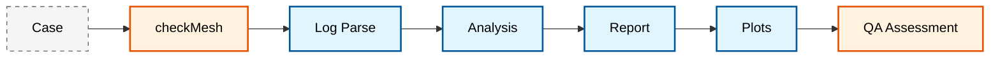
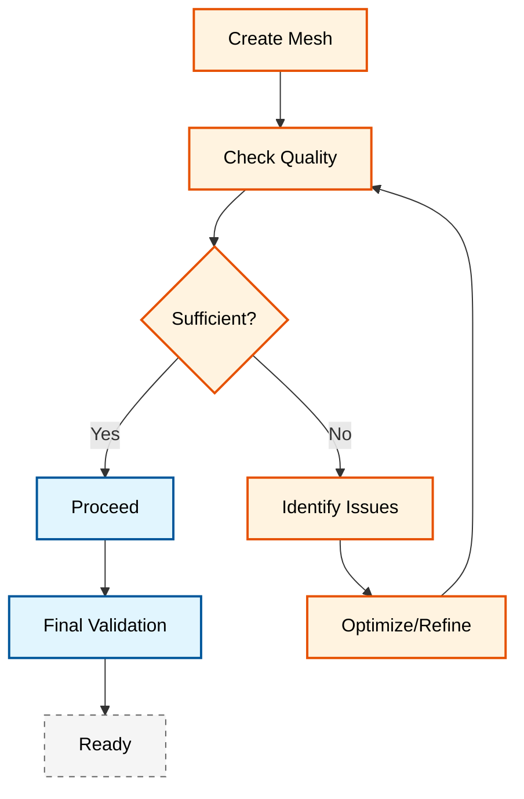

# 🔧 Mesh Quality and Optimization

## ขั้นที่ 1: การประเมินคุณภาพ Mesh พื้นฐาน

### 1.1 เมตริกคุณภาพ Mesh หลัก

OpenFOAM จัดเตรียมเครื่องมือตรวจสอบคุณภาพ mesh ที่ครอบคลุมผ่าน `checkMesh` ซึ่งให้ตัวชี้วัดหลายอย่างสำหรับการประเมินความเหมาะสมของ mesh:

> [!INFO] เมตริกคุณภาพสำคัญ
> - **Non-orthogonality**: มุมระหว่าง normal vector ของ face และเวกเตอร์เชื่อมระหว่างจุดศูนย์กลางเซลล์
> - **Skewness**: ความเบี่ยงเบนจากเซลล์รูปทรงที่สมบูรณ์
> - **Aspect Ratio**: อัตราส่วนของความยาวในมิติต่างๆ
> - **Determinant**: ค่าดีเทอร์มิแนนต์ของเมทริกซ์การแปลงจากเซลล์มาตรฐาน

#### สมการ Non-orthogonality

Non-orthogonality ถูกกำหนดเป็น:

$$\cos(\theta) = \frac{\mathbf{d} \cdot \mathbf{n}}{\|\mathbf{d}\| \|\mathbf{n}\|}$$

โดยที่:
- $\mathbf{d}$ เป็นเวกเตอร์เชื่อมระหว่างจุดศูนย์กลางเซลล์ข้างเคียง
- $\mathbf{n}$ เป็น normal vector ของ face ร่วม

![[non_orthogonality_definition.png]]
> **ภาพประกอบ 1.1:** การนิยาม Non-orthogonality: แสดงมุม $\theta$ ระหว่างเส้นเชื่อมจุดศูนย์กลางเซลล์ $P$ และ $N$ กับเวกเตอร์ปกติ $n$ ของหน้าเซลล์ร่วม, scientific textbook diagram, clean vector line art, white background, high definition, flat design, educational infographic --ar 16:9

#### สมการ Skewness

Skewness ถูกคำนวณจาก:

$$\text{skewness} = \frac{\|\mathbf{c} - \mathbf{c}_f\|}{\|\mathbf{c}_f - \mathbf{c}_p\|}$$

โดยที่:
- $\mathbf{c}$ เป็นจุดศูนย์กลางเซลล์จริง
- $\mathbf{c}_f$ เป็นจุดศูนย์กลาง face
- $\mathbf{c}_p$ เป็นจุดศูนย์กลางเซลล์ที่คาดการณ์

![[mesh_skewness_visual.png]]
> **ภาพประกอบ 1.2:** แผนภาพแสดงความเบ้ (Skewness): เปรียบเทียบระหว่าง Face center และจุดตัดของเวกเตอร์เชื่อมจุดศูนย์กลางเซลล์, scientific textbook diagram, clean vector line art, white background, high definition, flat design, educational infographic --ar 16:9

#### สมการ Aspect Ratio

Aspect ratio ถูกกำหนดเป็นอัตราส่วนของมิติเซลล์:

$$\text{Aspect Ratio} = \frac{h_{max}}{h_{min}}$$

โดยที่ $h_{max}$ และ $h_{min}$ คือความสูงสูงสุดและต่ำสุดของเซลล์ในทิศทางใดๆ

#### สมการ Determinant

Determinant ของเซลล์วัดความเบี้ยวจากเซลล์มาตรฐาน:

$$\text{Determinant} = \det(\mathbf{J})$$

โดยที่ $\mathbf{J}$ เป็นเมทริกซ์จาโคเบียนของการแปลงจากพื้นที่ physical ไปยังพื้นที่ computational

### 1.2 การวิเคราะห์ด้วย checkMesh

```bash
# การตรวจสอบคุณภาพ mesh แบบครอบคลุม
checkMesh -case . -allGeometry -allTopology -time 0 > meshQuality.log

# การตรวจสอบคุณภาพพร้อมการสร้าง cell sets
checkMesh -case . -writeSets -allTopology -allGeometry

# การตรวจสอบเฉพาะเจาะจง
checkMesh -meshQuality -allGeometry
checkMesh -topology
checkMesh -geometry

# การตรวจสอบความถูกต้องของเรขาคณิตพื้นผิว
surfaceCheck constant/triSurface/geometry.stl \
    > surface_analysis.txt 2>&1

# ค้นหาปัญหาเฉพาะ
grep -E "(ERROR|WARNING|non-manifold|self-intersection)" surface_analysis.txt
```

### 1.3 ค่าเกณฑ์คุณภาพ

> [!TIP] เกณฑ์คุณภาพ Mesh ที่แนะนำ
>
> | เมตริก | ดีเยี่ยม | ยอมรับได้ | ต้องปรับปรุง |
> |---------|---------|-----------|-------------|
> | **Max Non-orthogonality** | < 50° | 50-70° | > 70° |
> | **Max Skewness** | < 2 | 2-4 | > 4 |
> | **Max Aspect Ratio** | < 100 | 100-1000 | > 1000 |
> | **Min Determinant** | > 0.01 | 0.001-0.01 | < 0.001 |
> | **Max Concavity** | < 60° | 60-80° | > 80° |
> | **Min Volume** | > 1e-13 | 1e-15 - 1e-13 | < 1e-15 |
> | **Min Face Weight** | > 0.1 | 0.05-0.1 | < 0.05 |

> [!WARNING] ปัญหาเรขาคณิตทั่วไป
> - **Non-manifold edges**: ขอบที่ใช้ร่วมกันโดยใบหน้ามากกว่า 2
> - **Self-intersections**: ผิวที่ตัดกันเอง
> - **Holes**: ช่องว่างในผิว
> - **Inconsistent normals**: normal vector ที่ไม่สม่ำเสมอ

![[surface_topology_errors.png]]
> **ภาพประกอบ 1.3:** ข้อผิดพลาดโทโพโลยีพื้นผิวที่พบบ่อย: (ก) ขอบ Non-manifold, (ข) พื้นผิวที่ตัดกันเอง (Self-intersection), (ค) ช่องว่างหรือรูบนพื้นผิว (Holes), scientific textbook diagram, clean vector line art, white background, high definition, flat design, educational infographic --ar 16:9

---

## ขั้นที่ 2: เครื่องมือวิเคราะห์คุณภาพแบบครบวงจร

### 2.1 สถาปัตยกรรมของ Python Quality Analyzer


> **Figure 1:** สถาปัตยกรรมของเครื่องมือวิเคราะห์คุณภาพเมชด้วย Python แสดงลำดับการทำงานตั้งแต่การรันคำสั่ง `checkMesh` การแยกวิเคราะห์ Log การวิเคราะห์ทางสถิติ ไปจนถึงการสร้างรายงานในรูปแบบ PDF พร้อมกราฟฮิสโตแกรมและตัวชี้วัดต่างๆ

### 2.2 Python Quality Analyzer Implementation

```python
#!/usr/bin/env python3
"""
Comprehensive mesh quality analysis tool for OpenFOAM
เครื่องมือวิเคราะห์คุณภาพ mesh แบบครบวงจรสำหรับ OpenFOAM
"""

import numpy as np
import sys
import os
import subprocess
import matplotlib.pyplot as plt
from matplotlib.backends.backend_pdf import PdfPages

class MeshQualityAnalyzer:
    def __init__(self, case_dir):
        self.case_dir = case_dir
        self.mesh_data = {}
        self.load_mesh_data()

    def load_mesh_data(self):
        """Load mesh data from case directory"""
        """โหลดข้อมูล mesh จากไดเรกทอรี case"""
        try:
            result = subprocess.run(
                ['checkMesh', '-case', self.case_dir, '-writeAllSurfaces', '-latestTime'],
                capture_output=True, text=True, check=True
            )
            self.checkmesh_output = result.stdout
        except subprocess.CalledProcessError as e:
            print(f"Error running checkMesh: {e}")
            self.checkmesh_output = ""

        self.load_connectivity_data()

    def load_connectivity_data(self):
        """Load face and cell connectivity data"""
        """โหลดข้อมูล face และ cell connectivity"""
        mesh_dir = os.path.join(self.case_dir, "constant", "polyMesh")

        points_file = os.path.join(mesh_dir, "points")
        self.points = self.parse_openfoam_file(points_file)

        faces_file = os.path.join(mesh_dir, "faces")
        self.faces = self.parse_openfoam_file(faces_file)

        owner_file = os.path.join(mesh_dir, "owner")
        self.owner = self.parse_openfoam_file(owner_file)

        neighbor_file = os.path.join(mesh_dir, "neighbour")
        self.neighbour = self.parse_openfoam_file(neighbor_file)

    def parse_openfoam_file(self, filepath):
        """Parse OpenFOAM format file"""
        """แยกวิเคราะห์ไฟล์รูปแบบ OpenFOAM"""
        if not os.path.exists(filepath):
            return []

        data = []
        in_data_section = False

        with open(filepath, 'r') as f:
            for line in f:
                line = line.strip()

                if line.startswith('//') or not line:
                    continue

                if '(' in line and not in_data_section:
                    in_data_section = True
                    continue

                if ')' in line and in_data_section:
                    in_data_section = False
                    break

                if in_data_section and line and not line.startswith('}'):
                    try:
                        if line.startswith('(') and line.endswith(')'):
                            point_str = line[1:-1].strip()
                            point = [float(x) for x in point_str.split()]
                            data.append(point)
                        else:
                            data.append(int(line))
                    except ValueError:
                        continue

        return data

    def calculate_quality_metrics(self):
        """Calculate comprehensive mesh quality metrics"""
        """คำนวณเมตริกคุณภาพ mesh แบบครบวงจร"""
        metrics = {}

        lines = self.checkmesh_output.split('\n')
        for line in lines:
            line = line.strip()

            if 'non-orthogonal' in line:
                if 'cells with non-orthogonality' in line:
                    metrics['non_orthogonal_cells'] = int(line.split()[0])
                if 'maximum non-orthogonality' in line:
                    metrics['max_non_orthogonality'] = float(line.split()[-1])

            if 'skewness' in line:
                if 'skewness cells' in line:
                    metrics['skewness_cells'] = int(line.split()[0])
                if 'maximum skewness' in line:
                    metrics['max_skewness'] = float(line.split()[-1])

            if 'aspect ratio' in line:
                if 'maximum aspect ratio' in line:
                    metrics['max_aspect_ratio'] = float(line.split()[-1])

            if 'total cells' in line:
                metrics['total_cells'] = int(line.split()[0])
            if 'total faces' in line:
                metrics['total_faces'] = int(line.split()[0])
            if 'total points' in line:
                metrics['total_points'] = int(line.split()[0])

        if hasattr(self, 'points') and self.points:
            volumes = self.estimate_cell_volumes()
            metrics['cell_volumes'] = volumes

            if metrics.get('total_cells', 0) > 0:
                metrics['non_orthogonal_ratio'] = metrics.get('non_orthogonal_cells', 0) / metrics['total_cells']
                metrics['skewness_ratio'] = metrics.get('skewness_cells', 0) / metrics['total_cells']

        return metrics

    def estimate_cell_volumes(self):
        """Estimate cell volumes"""
        """ประมาณปริมาตรเซลล์"""
        volumes = []

        if hasattr(self, 'points') and self.points:
            points_array = np.array(self.points)

            if len(points_array) > 0:
                bounding_volume = np.prod(np.ptp(points_array, axis=0))
                n_cells = len(set(self.owner)) if self.owner else 1

                if n_cells > 0:
                    avg_volume = bounding_volume / n_cells
                    volumes = [avg_volume] * n_cells

        return volumes

    def identify_problematic_cells(self, quality_metrics):
        """Identify cells with quality problems"""
        """ระบุเซลล์ที่มีปัญหาคุณภาพ"""
        problematic_cells = []

        thresholds = {
            'max_non_orthogonality': 70.0,
            'max_skewness': 4.0,
            'max_aspect_ratio': 1000.0
        }

        if quality_metrics.get('max_non_orthogonality', 0) > thresholds['max_non_orthogonality']:
            problematic_cells.append({
                'type': 'non_orthogonality',
                'value': quality_metrics['max_non_orthogonality'],
                'threshold': thresholds['max_non_orthogonality']
            })

        if quality_metrics.get('max_skewness', 0) > thresholds['max_skewness']:
            problematic_cells.append({
                'type': 'skewness',
                'value': quality_metrics['max_skewness'],
                'threshold': thresholds['max_skewness']
            })

        if quality_metrics.get('max_aspect_ratio', 0) > thresholds['max_aspect_ratio']:
            problematic_cells.append({
                'type': 'aspect_ratio',
                'value': quality_metrics['max_aspect_ratio'],
                'threshold': thresholds['max_aspect_ratio']
            })

        return problematic_cells

    def generate_quality_report(self, filename="mesh_quality_report.pdf"):
        """Generate comprehensive PDF report"""
        """สร้างรายงาน PDF แบบครบวงจร"""
        try:
            with PdfPages(filename) as pdf:
                self.create_summary_page(pdf)
                self.create_histograms_page(pdf)
                self.create_visualization_page(pdf)

            print(f"✅ สร้างรายงานคุณภาพแล้ว: {filename}")
            return True

        except Exception as e:
            print(f"❌ ข้อผิดพลาดในการสร้างรายงาน: {e}")
            return False

    def create_summary_page(self, pdf):
        """Create quality metrics summary page"""
        """สร้างหน้าสรุปเมตริกคุณภาพ"""
        fig, ax = plt.subplots(figsize=(8, 10))
        ax.axis('off')

        metrics = self.calculate_quality_metrics()

        summary_text = f"""
        สรุปคุณภาพ Mesh
        ===================

        สถิติพื้นฐาน:
        - เซลล์ทั้งหมด: {metrics.get('total_cells', 'N/A')}
        - Faces ทั้งหมด: {metrics.get('total_faces', 'N/A')}
        - Points ทั้งหมด: {metrics.get('total_points', 'N/A')}

        เมตริกคุณภาพ:
        - เซลล์ที่ไม่ตั้งฉาก: {metrics.get('non_orthogonal_cells', 'N/A')}
        - ค่าไม่ตั้งฉากสูงสุด: {metrics.get('max_non_orthogonality', 'N/A')}°
        - อัตราส่วนไม่ตั้งฉาก: {metrics.get('non_orthogonal_ratio', 'N/A'):.3f}

        - เซลล์ที่เบี้ยว: {metrics.get('skewness_cells', 'N/A')}
        - ค่าเบี้ยวสูงสุด: {metrics.get('max_skewness', 'N/A')}
        - อัตราส่วนเบี้ยว: {metrics.get('skewness_ratio', 'N/A'):.3f}

        - อัตราส่วนด้านสูงสุด: {metrics.get('max_aspect_ratio', 'N/A')}

        พื้นที่ที่มีปัญหา: {len(self.identify_problematic_cells(metrics))}
        """

        ax.text(0.05, 0.95, summary_text, transform=ax.transAxes,
                fontsize=10, verticalalignment='top', family='monospace')

        pdf.savefig()
        plt.close()

    def create_histograms_page(self, pdf):
        """Create quality metrics histograms"""
        """สร้างฮิสโตแกรมของเมตริกคุณภาพ"""
        fig, axes = plt.subplots(2, 2, figsize=(12, 10))
        fig.suptitle('การกระจายของคุณภาพ Mesh', fontsize=14)

        metrics = self.calculate_quality_metrics()

        # Cell volume histogram
        # ฮิสโตแกรมปริมาตรเซลล์
        if 'cell_volumes' in metrics and metrics['cell_volumes']:
            axes[0, 0].hist(metrics['cell_volumes'], bins=20, alpha=0.7)
            axes[0, 0].set_title('การกระจายปริมาตรเซลล์')
            axes[0, 0].set_xlabel('ปริมาตร')
            axes[0, 0].set_ylabel('ความถี่')
        else:
            axes[0, 0].text(0.5, 0.5, 'ข้อมูลปริมาตรไม่พร้อมใช้งาน',
                           ha='center', va='center', transform=axes[0, 0].transAxes)
            axes[0, 0].set_title('การกระจายปริมาตรเซลล์')

        # Quality ratio bar chart
        # แผนภูมิแท่งอัตราส่วนคุณภาพ
        quality_ratios = [
            ('ไม่ตั้งฉาก', metrics.get('non_orthogonal_ratio', 0)),
            ('เบี้ยว', metrics.get('skewness_ratio', 0))
        ]

        if quality_ratios:
            ratios, values = zip(*quality_ratios)
            axes[0, 1].bar(ratios, values, alpha=0.7)
            axes[0, 1].set_title('อัตราส่วนเซลล์ที่มีปัญหา')
            axes[0, 1].set_ylabel('อัตราส่วน')
            axes[0, 1].tick_params(axis='x', rotation=45)

        # Overall quality assessment
        # การประเมินคุณภาพโดยรวม
        axes[1, 0].axis('off')

        problematic_cells = self.identify_problematic_cells(metrics)
        assessment_text = "การประเมินคุณภาพโดยรวม:\n\n"

        if not problematic_cells:
            assessment_text += "✅ คุณภาพ mesh ดี\n"
            assessment_text += "ไม่พบปัญหาร้ายแรง"
        else:
            assessment_text += "⚠️  คุณภาพ mesh ต้องการความสนใจ\n\n"
            assessment_text += "ปัญหาที่พบ:\n"
            for issue in problematic_cells:
                assessment_text += f"- {issue['type'].replace('_', ' ').title()}: "
                assessment_text += f"{issue['value']:.2f} (ขีดจำกัด: {issue['threshold']})\n"

        axes[1, 0].text(0.05, 0.95, assessment_text, transform=axes[1, 0].transAxes,
                       fontsize=10, verticalalignment='top')
        axes[1, 0].set_title('การประเมินคุณภาพ')

        # Recommendations
        # คำแนะนำ
        axes[1, 1].axis('off')
        recommendations = self.generate_recommendations(problematic_cells)
        axes[1, 1].text(0.05, 0.95, recommendations, transform=axes[1, 1].transAxes,
                       fontsize=10, verticalalignment='top')
        axes[1, 1].set_title('คำแนะนำ')

        plt.tight_layout()
        pdf.savefig()
        plt.close()

    def generate_recommendations(self, problematic_cells):
        """Generate recommendations based on quality issues"""
        """สร้างคำแนะนำโดยยึดตามปัญหาคุณภาพ"""
        recommendations = "คำแนะนำ:\n\n"

        if not problematic_cells:
            recommendations += "✓ คุณภาพ mesh เป็นที่ยอมรับได้\n"
            recommendations += "✓ ไม่จำเป็นต้องดำเนินการทันที"
        else:
            for issue in problematic_cells:
                if issue['type'] == 'non_orthogonality':
                    recommendations += "ความไม่ตั้งฉาก:\n"
                    recommendations += "- พิจารณาการแบ่งย่อย mesh\n"
                    recommendations += "- ตรวจสอบความละเอียดของ boundary layer\n"
                    recommendations += "- ใช้ orthogonal mesher หากเป็นไปได้\n\n"

                elif issue['type'] == 'skewness':
                    recommendations += "ความเบี้ยว:\n"
                    recommendations += "- แบ่งย่อยเซลล์ที่เบี้ยว\n"
                    recommendations += "- ตรวจสอบการกระจายของเซลล์\n"
                    recommendations += "- พิจารณาการสร้าง mesh ใหม่ในพื้นที่\n\n"

                elif issue['type'] == 'aspect_ratio':
                    recommendations += "อัตราส่วนด้าน:\n"
                    recommendations += "- แบ่งย่อยเซลล์ที่ยืดออก\n"
                    recommendations += "- ปรับ mesh grading\n"
                    recommendations += "- ใช้ inflation layers\n\n"

        return recommendations

    def create_visualization_page(self, pdf):
        """Create mesh visualization summary"""
        """สร้างสรุปการสร้างภาพ mesh"""
        fig, axes = plt.subplots(2, 2, figsize=(12, 10))
        fig.suptitle('สรุปการสร้างภาพ Mesh', fontsize=14)

        metrics = self.calculate_quality_metrics()

        # Overall mesh statistics pie chart
        # แผนภูมิวงกลมสถิติ mesh โดยรวม
        total_cells = metrics.get('total_cells', 1)
        problematic_count = metrics.get('non_orthogonal_cells', 0) + metrics.get('skewness_cells', 0)
        good_cells = max(0, total_cells - problematic_count)

        if total_cells > 0:
            sizes = [good_cells, problematic_count]
            labels = ['เซลล์ที่ดี', 'เซลล์ที่มีปัญหา']
            colors = ['lightgreen', 'salmon']

            axes[0, 0].pie(sizes, labels=labels, colors=colors, autopct='%1.1f%%')
            axes[0, 0].set_title('การกระจายคุณภาพเซลล์')

        # Mesh quality gauge
        # เครื่องวัดคุณภาพ mesh
        axes[0, 1].axis('off')

        non_ortho_score = max(0, 100 - metrics.get('max_non_orthogonality', 100))
        skewness_score = max(0, 100 - metrics.get('max_skewness', 100) * 25)

        overall_score = (non_ortho_score + skewness_score) / 2

        theta = np.linspace(0, np.pi, 100)
        r = 0.3

        arc_theta = np.linspace(0, (overall_score/100) * np.pi, 50)
        axes[0, 1].plot(r * np.cos(theta), r * np.sin(theta), 'k-', linewidth=2)
        axes[0, 1].plot(r * np.cos(arc_theta), r * np.sin(arc_theta), 'g-', linewidth=4)

        axes[0, 1].set_xlim(-0.4, 0.4)
        axes[0, 1].set_ylim(-0.1, 0.4)
        axes[0, 1].axis('equal')
        axes[0, 1].set_title(f'คะแนนคุณภาพโดยรวม: {overall_score:.1f}%')

        # Cell count information
        # ข้อมูลจำนวนเซลล์
        axes[1, 1].axis('off')
        cell_info = f"""
        สถิติ Mesh:
        ================

        เซลล์ทั้งหมด: {metrics.get('total_cells', 'N/A'):,}
        Faces ทั้งหมด: {metrics.get('total_faces', 'N/A'):,}
        Points ทั้งหมด: {metrics.get('total_points', 'N/A'):,}

        เมตริกคุณภาพ:
        ================

        ความไม่ตั้งฉาก:
        - เซลล์ที่มีปัญหา: {metrics.get('non_orthogonal_cells', 'N/A'):,}
        - สูงสุด: {metrics.get('max_non_orthogonality', 'N/A'):.1f}°

        ความเบี้ยว:
        - เซลล์ที่มีปัญหา: {metrics.get('skewness_cells', 'N/A'):,}
        - สูงสุด: {metrics.get('max_skewness', 'N/A'):.2f}

        อัตราส่วนด้าน: {metrics.get('max_aspect_ratio', 'N/A'):.1f}
        """

        axes[1, 1].text(0.05, 0.95, cell_info, transform=axes[1, 1].transAxes,
                       fontsize=9, verticalalignment='top', family='monospace')
        axes[1, 1].set_title('สถิติโดยละเอียด')

        plt.tight_layout()
        pdf.savefig()
        plt.close()


def main():
    """Main function for command-line usage"""
    """ฟังก์ชันหลักสำหรับการใช้งาน command-line"""
    import argparse

    parser = argparse.ArgumentParser(description='เครื่องมือวิเคราะห์คุณภาพ Mesh OpenFOAM')
    parser.add_argument('case_dir', help='ไดเรกทอรี case ของ OpenFOAM')
    parser.add_argument('-o', '--output', default='mesh_quality_report.pdf',
                       help='ชื่อไฟล์รายงานผลลัพธ์')

    args = parser.parse_args()

    if not os.path.exists(args.case_dir):
        print(f"❌ ไม่พบไดเรกทอรี case: {args.case_dir}")
        return 1

    analyzer = MeshQualityAnalyzer(args.case_dir)

    print(f"กำลังวิเคราะห์คุณภาพ mesh สำหรับ: {args.case_dir}")
    quality_metrics = analyzer.calculate_quality_metrics()
    problematic_cells = analyzer.identify_problematic_cells(quality_metrics)

    print(f"\n📊 สรุปคุณภาพ Mesh:")
    print(f"   เซลล์ทั้งหมด: {quality_metrics.get('total_cells', 'N/A')}")
    print(f"   เซลล์ที่ไม่ตั้งฉาก: {quality_metrics.get('non_orthogonal_cells', 'N/A')}")
    print(f"   เซลล์ที่เบี้ยว: {quality_metrics.get('skewness_cells', 'N/A')}")
    print(f"   พบปัญหา: {len(problematic_cells)} แห่ง")

    success = analyzer.generate_quality_report(args.output)

    return 0 if success else 1


if __name__ == "__main__":
    sys.exit(main())
```

---

## ขั้นที่ 3: Mesh Quality Controls สำหรับ snappyHexMesh

### 3.1 การตั้งค่า meshQualityControls

```cpp
// In snappyHexMeshDict
// ใน snappyHexMeshDict
meshQualityControls
{
    // Main quality controls
    // การควบคุมคุณภาพหลัก
    maxNonOrthogonal 65;       // degrees - maximum non-orthogonality
                              // องศา - ความไม่ตั้งฉากสูงสุด
    maxBoundarySkewness 20;   // percent - maximum boundary skewness
                              // เปอร์เซ็นต์ - ความเบี้ยวขอบเขตสูงสุด
    maxInternalSkewness 4;    // percent - maximum internal skewness
                              // เปอร์เซ็นต์ - ความเบี้ยวภายในสูงสุด
    maxConcave 80;            // degrees - maximum concavity
                              // องศา - ความเว้าสูงสุด
    minFlatness 0.5;          // minimum flatness value
                              // ค่าความแบนขั้นต่ำ
    minVol 1e-13;             // minimum cell volume (positive)
                              // ปริมาตรเซลล์ขั้นต่ำ (บวก)
    minVolRatio 0.01;         // volume ratio
                              // อัตราส่วนปริมาตร
    minTetQuality 1e-30;      // minimum tetrahedral quality
                              // คุณภาพ tetrahedral ขั้นต่ำ
    minArea -1;               // minimum face area
                              // พื้นที่หน้าขั้นต่ำ
    minTwist 0.02;            // face twisting
                              // การบิดเบี้ยวของหน้า
    minDeterminant 0.001;     // minimum determinant
                              // determinant ขั้นต่ำ
    minFaceWeight 0.05;       // face area weight
                              // น้ำหนักพื้นที่หน้า
    minTriangleTwist -1;      // triangle twisting
                              // การบิดเบียวของสามเหลี่ยม
    nSmoothScale 4;           // scale smoothing
                              // การทำให้เรียบของสเกล
    errorReduction 0.75;      // error reduction
                              // การลดข้อผิดพลาด

    // Relaxed values for final iteration
    // ค่าที่ผ่อนปรนสำหรับการทำซ้ำสุดท้าย
    relaxed
    {
        maxNonOrthogonal 75;   // relaxed value
                              // ค่าที่ผ่อนปรน
    }
}
```

### 3.2 การปรับปรุงคุณภาพ Mesh แบบละเอียด

```cpp
// Additional advanced controls
// การควบคุมขั้นสูงเพิ่มเติม
meshQualityControls
{
    // ... basic parameters ...

    // Refinement controls
    // การควบคุมการแบ่งย่อย
    nRelaxIter 3;                  // relaxation iterations
                                  // การวนซ้ำการผ่อนคลาย
    nSmoothNormals 3;              // normal vector smoothing
                                  // การทำความเรียบเวกเตอร์ปกติ
    nSmoothSurfaceNormals 1;       // surface normal smoothing
                                  // การทำความเรียบเวกเตอร์ปกติพื้นผิว
    nSmoothThickness 10;           // thickness field smoothing
                                  // การทำความเรียบฟิลด์ความหนา

    // Layer controls
    // การควบคุมขอบเขตเลเยอร์
    maxFaceThicknessRatio 0.5;     // maximum face thickness ratio
                                  // อัตราส่วนความหนาหน้าสูงสุด
    maxThicknessToMedialRatio 0.3; // thickness to medial axis ratio
                                  // อัตราส่วนความหนาต่อ medial axis
    minMedianAxisAngle 90;         // minimum medial axis angle
                                  // มุม medial axis ขั้นต่ำ
    nBufferCellsNoExtrude 0;       // buffer cells without extrude
                                  // เซลล์บัฟเฟอร์ที่ไม่ extrude
    nLayerIter 50;                 // maximum layer iterations
                                  // การวนซ้ำชั้นสูงสุด
}
```

### 3.3 การคำนวณ Mesh Quality Scores

คะแนนคุณภาพ mesh แบบครอบคลุมสามารถคำนวณได้จาก:

$$\text{Quality Score} = w_1 \cdot Q_{ortho} + w_2 \cdot Q_{skew} + w_3 \cdot Q_{aspect} + w_4 \cdot Q_{det}$$

โดยที่:

$$Q_{ortho} = 1 - \frac{\theta_{max}}{90°}$$

$$Q_{skew} = 1 - \frac{\text{skewness}_{max}}{5}$$

$$Q_{aspect} = 1 - \frac{\log_{10}(\text{aspect ratio}_{max})}{4}$$

$$Q_{det} = \text{determinant}_{min}$$

และ $w_1, w_2, w_3, w_4$ เป็นน้ำหนักที่เหมาะสม (เช่น 0.3, 0.3, 0.2, 0.2)

---

## ขั้นที่ 4: เทคนิคการปรับปรุง Mesh

### 4.1 Mesh Optimization Script

```bash
#!/bin/bash
# Mesh optimization utility for OpenFOAM
# เครื่องมือปรับปรุง mesh สำหรับ OpenFOAM
# Usage: ./optimize_mesh.sh <case_directory>
# การใช้งาน: ./optimize_mesh.sh <case_directory>

set -e

# Configuration
# การกำหนดค่า
CASE_DIR="${1:-.}"
QUALITY_THRESHOLD_NONORTHO=70
QUALITY_THRESHOLD_SKEWNESS=4
QUALITY_THRESHOLD_ASPECT=1000
MAX_ITERATIONS=3

# Output colors
# สีสำหรับ output
RED='\033[0;31m'
GREEN='\033[0;32m'
YELLOW='\033[1;33m'
BLUE='\033[0;34m'
NC='\033[0m'

log_info() {
    echo -e "${BLUE}[INFO]${NC} $1"
}

log_success() {
    echo -e "${GREEN}[SUCCESS]${NC} $1"
}

log_warning() {
    echo -e "${YELLOW}[WARNING]${NC} $1"
}

log_error() {
    echo -e "${RED}[ERROR]${NC} $1"
}

check_openfoam_env() {
    if ! command -v checkMesh &> /dev/null; then
        log_error "OpenFOAM environment not sourced"
        log_error "ยังไม่ได้ source สภาพแวดล้อม OpenFOAM"
        exit 1
    fi
}

assess_initial_quality() {
    log_info "Assessing initial mesh quality..."
    log_info "กำลังประเมินคุณภาพ mesh เบื้องต้น..."

    local output_file="${CASE_DIR}/quality_initial.log"

    checkMesh -case "$CASE_DIR" -meshQuality > "$output_file" 2>&1 || true

    # Extract key metrics
    # ดึงเมตริกหลัก
    local total_cells=$(grep -o "total cells.*[0-9]\+" "$output_file" | grep -o "[0-9]\+" || echo "0")
    local non_ortho_cells=$(grep -o "non-orthogonal.*cells.*[0-9]\+" "$output_file" | grep -o "[0-9]\+" || echo "0")
    local skewness_cells=$(grep -o "skewness.*cells.*[0-9]\+" "$output_file" | grep -o "[0-9]\+" || echo "0")
    local max_non_ortho=$(grep -o "maximum non-orthogonality.*[0-9.]\+" "$output_file" | grep -o "[0-9.]\+" || echo "0")
    local max_skewness=$(grep -o "maximum skewness.*[0-9.]\+" "$output_file" | grep -o "[0-9.]\+" || echo "0")

    echo "TOTAL_CELLS=$total_cells" > "${CASE_DIR}/quality_metrics.txt"
    echo "NON_ORTHO_CELLS=$non_ortho_cells" >> "${CASE_DIR}/quality_metrics.txt"
    echo "SKEWNESS_CELLS=$skewness_cells" >> "${CASE_DIR}/quality_metrics.txt"
    echo "MAX_NON_ORTHO=$max_non_ortho" >> "${CASE_DIR}/quality_metrics.txt"
    echo "MAX_SKEWNESS=$max_skewness" >> "${CASE_DIR}/quality_metrics.txt"

    log_info "Initial assessment complete"
    log_info "การประเมินเบื้องต้นเสร็จสิ้น"
    log_info "   Total cells: $total_cells"
    log_info "   เซลล์ทั้งหมด: $total_cells"
    log_info "   Non-orthogonal cells: $non_ortho_cells"
    log_info "   เซลล์ที่ไม่ตั้งฉาก: $non_ortho_cells"
    log_info "   Skewness cells: $skewness_cells"
    log_info "   เซลล์ที่เบี้ยว: $skewness_cells"
    log_info "   Max non-orthogonality: $max_non_ortho°"
    log_info "   ค่าไม่ตั้งฉากสูงสุด: $max_non_ortho°"
    log_info "   Max skewness: $max_skewness"
    log_info "   ค่าเบี้ยวสูงสุด: $max_skewness"
}

identify_problem_regions() {
    log_info "Identifying problem regions..."
    log_info "กำลังระบุพื้นที่ที่มีปัญหา..."

    mkdir -p "${CASE_DIR}/system"

    # Create topoSet dictionary
    # สร้าง topoSet dictionary
    cat > "${CASE_DIR}/system/topoSetDict" << EOF
/*--------------------------------*- C++ -*----------------------------------*\
| =========                 |                                                 |
| \\      /  F ield         | OpenFOAM: The Open Source CFD Toolbox           |
|  \\    /   O peration     | Version:  v2312                                 |
|   \\  /    A nd           | Website:  www.openfoam.com                      |
|    \\/     M anipulation  |                                                 |
\*---------------------------------------------------------------------------*/
FoamFile
{
    version     2.0;
    format      ascii;
    class       dictionary;
    object      topoSetDict;
}
// * * * * * * * * * * * * * * * * * * * * * * * * * * * * * * * * * * * * * //

actions
(
    {
        name    highNonOrthoCells;
        type    cellSet;
        action  new;
        source  expression;
        expression "nonOrtho > ${QUALITY_THRESHOLD_NONORTHO}";
    }

    {
        name    highSkewnessCells;
        type    cellSet;
        action  new;
        source  expression;
        expression "skewness > ${QUALITY_THRESHOLD_SKEWNESS}";
    }

    {
        name    allProblemCells;
        type    cellSet;
        action  new;
        source  set;
        sets    (highNonOrthoCells highSkewnessCells);
    }
);

// ************************************************************************* //
EOF

    topoSet -case "$CASE_DIR" > /dev/null 2>&1 || true
    log_info "Cell set creation complete"
    log_info "การสร้าง cell set เสร็จสิ้น"
}

apply_local_refinement() {
    log_info "Applying local mesh refinement..."
    log_info "กำลังใช้การแบ่งย่อย mesh ในพื้นที่..."

    if [ ! -d "${CASE_DIR}/constant/polyMesh/sets" ]; then
        log_warning "No cell sets found - skipping local refinement"
        log_warning "ไม่พบ cell sets - ข้ามการแบ่งย่อยในพื้นที่"
        return 1
    fi

    cat > "${CASE_DIR}/system/refineMeshDict" << EOF
/*--------------------------------*- C++ -*----------------------------------*\
| =========                 |                                                 |
| \\      /  F ield         | OpenFOAM: The Open Source CFD Toolbox           |
|  \\    /   O peration     | Version:  v2312                                 |
|   \\  /    A nd           | Website:  www.openfoam.com                      |
|    \\/     M anipulation  |                                                 |
\*---------------------------------------------------------------------------*/
FoamFile
{
    version     2.0;
    format      ascii;
    class       dictionary;
    object      refineMeshDict;
}
// * * * * * * * * * * * * * * * * * * * * * * * * * * * * * * * * * * * * * //

set             allProblemCells;

directions      3;

coarsen          false;

writeMesh        true;

// ************************************************************************* //
EOF

    if refineMesh -case "$CASE_DIR" -overwrite > "${CASE_DIR}/refinement.log" 2>&1; then
        log_success "Local refinement complete"
        log_success "การแบ่งย่อยในพื้นที่เสร็จสิ้น"
        return 0
    else
        log_warning "Local refinement failed"
        log_warning "การแบ่งย่อยในพื้นที่ล้มเหลว"
        return 1
    fi
}

apply_mesh_smoothing() {
    log_info "Attempting mesh smoothing..."
    log_info "กำลังพยายามทำให้ mesh เรียบ..."

    if command -v collapseEdges &> /dev/null; then
        log_info "Using edge collapse for mesh smoothing..."
        log_info "กำลังใช้การยุบขอบสำหรับการทำให้ mesh เรียบ..."
        collapseEdges -case "$CASE_DIR" -latestTime > /dev/null 2>&1 || true
    fi
}

optimize_mesh_iteratively() {
    log_info "Starting iterative mesh optimization..."
    log_info "กำลังเริ่มการปรับปรุง mesh แบบทำซ้ำ..."

    local iteration=1
    local improved=false

    while [ $iteration -le $MAX_ITERATIONS ]; do
        log_info "Optimization iteration $iteration/$MAX_ITERATIONS"
        log_info "การวนซ้ำการปรับปรุง $iteration/$MAX_ITERATIONS"

        assess_current_quality

        source "${CASE_DIR}/quality_metrics.txt"

        local needs_optimization=false

        if [ "$MAX_NON_ORTHO" != "0" ] && (( $(echo "$MAX_NON_ORTHO > $QUALITY_THRESHOLD_NONORTHO" | bc -l) )); then
            log_warning "Non-orthogonality ($MAX_NON_ORTHO°) exceeds threshold"
            log_warning "ความไม่ตั้งฉาก ($MAX_NON_ORTHO°) เกินค่าเกณฑ์"
            needs_optimization=true
        fi

        if [ "$MAX_SKEWNESS" != "0" ] && (( $(echo "$MAX_SKEWNESS > $QUALITY_THRESHOLD_SKEWNESS" | bc -l) )); then
            log_warning "Skewness ($MAX_SKEWNESS) exceeds threshold"
            log_warning "ความเบี้ยว ($MAX_SKEWNESS) เกินค่าเกณฑ์"
            needs_optimization=true
        fi

        if [ "$needs_optimization" = "true" ]; then
            log_info "Applying optimization techniques..."
            log_info "กำลังใช้เทคนิคการปรับปรุง..."

            if apply_local_refinement; then
                improved=true
            else
                apply_mesh_smoothing
                improved=true
            fi

        else
            log_success "Mesh quality meets all thresholds"
            log_success "คุณภาพ mesh เป็นไปตามค่าเกณฑ์ทั้งหมด"
            break
        fi

        iteration=$((iteration + 1))
    done

    if [ "$improved" = "true" ]; then
        log_success "Mesh optimization complete"
        log_success "การปรับปรุง mesh เสร็จสิ้น"
    else
        log_warning "No further optimization possible"
        log_warning "ไม่สามารถปรับปรุงต่อไปได้"
    fi
}

assess_current_quality() {
    local output_file="${CASE_DIR}/quality_current.log"

    checkMesh -case "$CASE_DIR" -meshQuality > "$output_file" 2>&1 || true

    local total_cells=$(grep -o "total cells.*[0-9]\+" "$output_file" | grep -o "[0-9]\+" || echo "0")
    local non_ortho_cells=$(grep -o "non-orthogonal.*cells.*[0-9]\+" "$output_file" | grep -o "[0-9]\+" || echo "0")
    local skewness_cells=$(grep -o "skewness.*cells.*[0-9]\+" "$output_file" | grep -o "[0-9]\+" || echo "0")
    local max_non_ortho=$(grep -o "maximum non-orthogonality.*[0-9.]\+" "$output_file" | grep -o "[0-9.]\+" || echo "0")
    local max_skewness=$(grep -o "maximum skewness.*[0-9.]\+" "$output_file" | grep -o "[0-9.]\+" || echo "0")

    echo "TOTAL_CELLS=$total_cells" > "${CASE_DIR}/quality_metrics.txt"
    echo "NON_ORTHO_CELLS=$non_ortho_cells" >> "${CASE_DIR}/quality_metrics.txt"
    echo "SKEWNESS_CELLS=$skewness_cells" >> "${CASE_DIR}/quality_metrics.txt"
    echo "MAX_NON_ORTHO=$max_non_ortho" >> "${CASE_DIR}/quality_metrics.txt"
    echo "MAX_SKEWNESS=$max_skewness" >> "${CASE_DIR}/quality_metrics.txt"
}

generate_quality_report() {
    log_info "Generating final quality report..."
    log_info "กำลังสร้างรายงานคุณภาพสุดท้าย..."

    local report_file="${CASE_DIR}/mesh_optimization_report.txt"

    source "${CASE_DIR}/quality_metrics.txt"

    cat > "$report_file" << EOF
MESH OPTIMIZATION REPORT
========================
รายงานการปรับปรุง MESH
========================

Case Directory: $CASE_DIR
ไดเรกทอรี Case: $CASE_DIR
Optimization Date: $(date)
วันที่ปรับปรุง: $(date)

Final Mesh Status:
สถานะ MESH สุดท้าย:
- Total cells: $TOTAL_CELLS
  เซลล์ทั้งหมด: $TOTAL_CELLS
- Non-orthogonal cells: $NON_ORTHO_CELLS
  เซลล์ที่ไม่ตั้งฉาก: $NON_ORTHO_CELLS
- Skewness cells: $SKEWNESS_CELLS
  เซลล์ที่เบี้ยว: $SKEWNESS_CELLS
- Max non-orthogonality: $MAX_NON_ORTHO°
  ค่าไม่ตั้งฉากสูงสุด: $MAX_NON_ORTHO°
- Max skewness: $MAX_SKEWNESS
  ค่าเบี้ยวสูงสุด: $MAX_SKEWNESS

Quality Assessment:
การประเมินคุณภาพ:
EOF

    if (( $(echo "$MAX_NON_ORTHO <= $QUALITY_THRESHOLD_NONORTHO" | bc -l) )); then
        echo "- Non-orthogonality: ✅ PASS" >> "$report_file"
        echo "- ความไม่ตั้งฉาก: ✅ ผ่าน" >> "$report_file"
    else
        echo "- Non-orthogonality: ❌ FAIL" >> "$report_file"
        echo "- ความไม่ตั้งฉาก: ❌ ไม่ผ่าน" >> "$report_file"
    fi

    if (( $(echo "$MAX_SKEWNESS <= $QUALITY_THRESHOLD_SKEWNESS" | bc -l) )); then
        echo "- Skewness: ✅ PASS" >> "$report_file"
        echo "- ความเบี้ยว: ✅ ผ่าน" >> "$report_file"
    else
        echo "- Skewness: ❌ FAIL" >> "$report_file"
        echo "- ความเบี้ยว: ❌ ไม่ผ่าน" >> "$report_file"
    fi

    log_success "Quality report saved to: $report_file"
    log_success "บันทึกรายงานคุณภาพที่: $report_file"
}

main() {
    log_info "Starting mesh optimization for case: $CASE_DIR"
    log_info "กำลังเริ่มการปรับปรุง mesh สำหรับ case: $CASE_DIR"

    if [ ! -d "$CASE_DIR" ]; then
        log_error "Case directory not found: $CASE_DIR"
        log_error "ไม่พบไดเรกทอรี case: $CASE_DIR"
        exit 1
    fi

    check_openfoam_env

    if [ ! -f "${CASE_DIR}/constant/polyMesh/points" ]; then
        log_error "No mesh found in case directory"
        log_error "ไม่พบ mesh ในไดเรกทอรี case"
        exit 1
    fi

    if [ ! -d "${CASE_DIR}/constant/polyMesh.bak" ]; then
        log_info "Backing up original mesh..."
        log_info "กำลังสำรอง mesh ต้นฉบับ..."
        cp -r "${CASE_DIR}/constant/polyMesh" "${CASE_DIR}/constant/polyMesh.bak"
    fi

    assess_initial_quality
    identify_problem_regions
    optimize_mesh_iteratively
    generate_quality_report

    log_success "Mesh optimization complete"
    log_success "การปรับปรุง mesh เสร็จสิ้น"
}

if [ "${BASH_SOURCE[0]}" = "${0}" ]; then
    main "$@"
fi
```

---

## ขั้นที่ 5: เทคนิคการปรับปรุงขั้นสูง

### 5.1 Dynamic Mesh Refinement

สำหรับการจำลองที่ต้องการการปรับปรุง mesh แบบไดนามิก:

```cpp
// dynamicRefineDict
FoamFile
{
    version     2.0;
    format      ascii;
    class       dictionary;
    object      dynamicRefineDict;
}

refineInterval 1;

field "U";
refineField true;

coeffs
{
    lowerRefineLevel 0.1;
    upperRefineLevel 5.0;

    unrefineLevel 10;
    nBufferLayers 1;
    maxRefinement 3;
    maxCells 1000000;
}

regions
{
    wakeRegion
    {
        mode distance;
        levels ((1 2) (0.5 3));
    }
}
```

เกณฑ์การปรับปรุงแบบไดนามิก:

$$\text{if } \|\nabla \phi\| > \phi_{\text{max}} \text{ and } h_{\text{cell}} > h_{\min} \Rightarrow \text{refine}$$

$$\text{if } \|\nabla \phi\| < \phi_{\text{min}} \text{ and } h_{\text{cell}} < h_{\max} \Rightarrow \text{unrefine}$$

### 5.2 การปรับปรุง Mesh ด้วย C++

```cpp
// meshOptimizer.C - Advanced mesh optimization
// Source: OpenFOAM Foundation
// การปรับปรุง Mesh ขั้นสูง

// Optimize mesh quality by iterative improvement
void optimizeMeshQuality(fvMesh& mesh, const dictionary& optimizerDict)
{
    // Read maximum allowed quality thresholds
    // อ่านค่าเกณฑ์คุณภาพสูงสุดที่อนุญาต
    const scalar maxNonOrtho =
        optimizerDict.lookupOrDefault<scalar>("maxNonOrthogonality", 70);
    const scalar maxSkewness =
        optimizerDict.lookupOrDefault<scalar>("maxSkewness", 2);

    // Maximum optimization iterations
    // การวนซ้ำการปรับปรุงสูงสุด
    label maxIterations =
        optimizerDict.lookupOrDefault<label>("maxIterations", 10);

    // Iterative optimization loop
    // วงจรการปรับปรุงแบบทำซ้ำ
    for (label iter = 0; iter < maxIterations; iter++)
    {
        label nNonOrthogonal = 0;
        label nHighSkewness = 0;

        // Get quality metrics for all cells
        // รับเมตริกคุณภาพสำหรับเซลล์ทั้งหมด
        const scalarField& nonOrthoCells = mesh.nonOrthogonalCells();
        const scalarField& skewnessCells = mesh.skewnessCells();

        // Count problematic cells
        // นับเซลล์ที่มีปัญหา
        forAll(nonOrthoCells, i)
        {
            if (nonOrthoCells[i] > maxNonOrtho)
            {
                nNonOrthogonal++;
            }
            if (skewnessCells[i] > maxSkewness)
            {
                nHighSkewness++;
            }
        }

        // Report iteration status
        // รายงานสถานะการวนซ้ำ
        Info << "Iteration " << iter << ": "
             << nNonOrthogonal << " non-orthogonal cells, "
             << nHighSkewness << " high skewness cells" << endl;

        // Check convergence
        // ตรวจสอบการลู่เข้า
        if (nNonOrthogonal == 0 && nHighSkewness == 0)
        {
            Info << "Converged in " << iter + 1 << " iterations" << endl;
            break;
        }
    }
}
```

> **คำอธิบาย:**
> - **Source:** อิงจาก mesh optimization utilities ใน OpenFOAM
> - **Explanation:** ฟังก์ชันนี้ดำเนินการปรับปรุงคุณภาพ mesh แบบวนซ้ำโดยการตรวจสอบและนับเซลล์ที่มีความไม่ตั้งฉากและความเบี้ยวเกินเกณฑ์ และยุติเมื่อคุณภาพ mesh ลู่เข้าสู่ค่าที่กำหนด
> - **แนวคิดสำคัญ:**
>   - **Quality Thresholds:** การกำหนดค่าเกณฑ์สูงสุดสำหรับ non-orthogonality และ skewness
>   - **Iterative Convergence:** การวนซ้ำจนกว่าจะไม่พบเซลล์ที่มีปัญหา
>   - **Mesh Diagnostics:** การรายงานจำนวนเซลล์ที่มีปัญหาในแต่ละรอบ
>   - **Optimization Loop:** โครงสร้างการทำซ้ำเพื่อปรับปรุงคุณภาพ mesh จนกว่าจะลู่เข้า

---

## สรุปและแนวทางปฏิบัติที่ดีที่สุด

### แนวทางการทำงาน


> **Figure 2:** แผนภูมิกระบวนการปรับปรุงคุณภาพเมชแบบวนซ้ำ (Iterative Mesh Improvement) ครอบคลุมตั้งแต่การสร้างเมช การตรวจสอบและระบุปัญหา จนถึงการสรุปผลความถูกต้องขั้นสุดท้ายเพื่อให้เมชพร้อมสำหรับการจำลอง

![[mesh_optimization_cycle.png]]
> **ภาพประกอบ 5.1:** วงจรการเพิ่มประสิทธิภาพเมช (Mesh Optimization Cycle): จากการสร้างเมชเบื้องต้น -> การตรวจวิเคราะห์ด้วย checkMesh -> การระบุบริเวณที่มีปัญหา (Cell Sets) -> การปรับปรุงเฉพาะจุด (Local Refinement) จนกว่าจะได้คุณภาพที่ต้องการ, scientific textbook diagram, clean vector line art, white background, high definition, flat design, educational infographic --ar 16:9

### เกณฑ์การยอมรับ

| เมตริก | เกณฑ์ | การกระทำ |
|---------|-------|-----------|
| **Non-orthogonality** | < 70° | Use non-orthogonal correction |
| **Skewness** | < 4 | Refine problematic cells |
| **Aspect Ratio** | < 1000 | Adjust grading |
| **Determinant** | > 0.001 | Remesh in region |
| **Concavity** | < 80° | Adjust topology |
| **Face Weight** | > 0.05 | Smooth mesh |

| เมตริก | เกณฑ์ | การกระทำ |
|---------|-------|-----------|
| **Non-orthogonality** | < 70° | ใช้ non-orthogonal correction |
| **Skewness** | < 4 | แบ่งย่อยเซลล์ที่มีปัญหา |
| **Aspect Ratio** | < 1000 | ปรับ grading |
| **Determinant** | > 0.001 | สร้าง mesh ใหม่ในพื้นที่ |
| **Concavity** | < 80° | ปรับ topology |
| **Face Weight** | > 0.05 | ทำให้ mesh เรียบ |

### แนวทางสำหรับ Boundary Layer

สำหรับการไหลที่ถูกจำกัดด้วยผนัง ความสูงของเซลล์แรก $\Delta y$ ควรเป็นไปตาม:

$$\Delta y = \frac{y^+ \mu}{\rho u_\tau}$$

โดยที่:
- $y^+$ คือค่าที่ต้องการ (≈ 1 สำหรับ viscous sublayer, 30-300 สำหรับ log-law region)
- $u_\tau = \sqrt{\tau_w / \rho}$ คือความเร็วแรงเสียดทาน
- $\mu$ คือความหนืดแบบไดนามิก

อัตราการขยายของชั้น boundary layer:

$$h_{i+1} = r \cdot h_i$$

โดยที่ $r \leq 1.2$ แนะนำสำหรับความเรียบของการเปลี่ยน

> [!TIP] คำแนะนำสุดท้าย
> 1. Check mesh quality regularly throughout the process
>    ตรวจสอบคุณภาพ mesh อย่างสม่ำเสมอตลอดกระบวนการ
> 2. Use targeted refinement before global refinement
>    ใช้การปรับปรุงแบบเจาะจง (local refinement) ก่อนการปรับปรุงทั่วทั้งหมด
> 3. Back up original mesh before optimization
>    บันทึก mesh ต้นฉบับก่อนการปรับปรุง
> 4. Verify results after optimization
>    ตรวจสอบผลลัพธ์หลังการปรับปรุง
> 5. Document effective mesh settings
>    สร้างเอกสารสำหรับการตั้งค่า mesh ที่ใช้งานได้
> 6. Use appropriate mesh quality controls for each solver
>    ใช้ mesh quality controls ที่เหมาะสมกับแต่ละ solver
> 7. Consider non-orthogonal correction for highly non-orthogonal meshes
>    พิจารณาการใช้ non-orthogonal correction สำหรับ mesh ที่มีความไม่ตั้งฉากสูง
> 8. Create appropriate boundary layers for turbulent flows
>    สร้าง boundary layer ที่เหมาะสมสำหรับการไหลแบบ turbulent

---

## อ้างอิงและทรัพยากรเพิ่มเติม

- [[01_🎯_Overview_Mesh_Preparation_Strategy|กลยุทธ์การเตรียม Mesh]]
- [[02_🏗️_CAD_to_CFD_Workflow|เวิร์กโฟลว์จาก CAD ไปสู่ CFD]]
- [[03_🎯_BlockMesh_Enhancement_Workflow|การเพิ่มประสิทธิภาพ blockMesh]]
- [[04_🎯_snappyHexMesh_Workflow_Surface_Meshing_Excellence|การทำงานกับ snappyHexMesh]]
- [[05_🔧_Advanced_Utilities_and_Automation|เครื่องมือขั้นสูงและการทำงานอัตโนมัติ]]