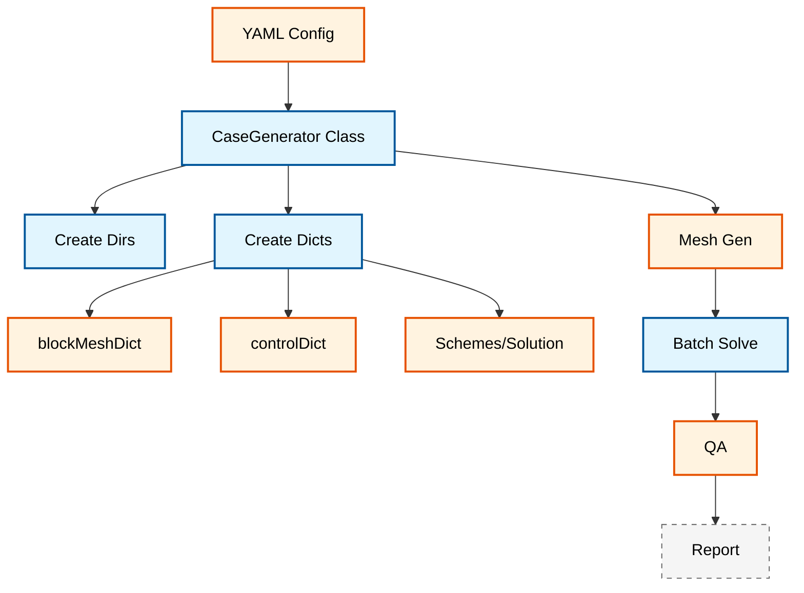

# ⚙️ การสร้างกรณีศึกษาแบบอัตโนมัติและการเพิ่มประสิทธิภาพเมช (Automated Case Generation & Mesh Optimization)

**วัตถุประสงค์การเรียนรู้**: เชี่ยวชาญการสร้างกรณีศึกษาแบบอัตโนมัติ, การวิเคราะห์คุณภาพเมช และขั้นตอนการประมวลผลแบบกลุ่ม (batch processing) สำหรับการจำลอง OpenFOAM
**เงื่อนไขเบื้องต้น**: โมดูล 03 (การสร้างเมช), โมดูล 04 (พื้นฐาน C++), ความคุ้นเคยกับการเขียนสคริปต์ Python
**ทักษะเป้าหมาย**: การตั้งค่ากรณีศึกษาอัตโนมัติ, การประเมินคุณภาพเมช, การประมวลผลแบบกลุ่ม, การบูรณาการกับ HPC

---

## ภาพรวม (Overview)

โมดูลนี้จัดทำเฟรมเวิร์กการทำงานอัตโนมัติที่ครอบคลุมสำหรับการสร้างกรณีศึกษาของ OpenFOAM, การเพิ่มประสิทธิภาพเมช และการประมวลผลแบบกลุ่ม เครื่องมือเหล่านี้ช่วยให้สามารถศึกษาพารามิเตอร์อย่างเป็นระบบ, การสร้างเมชสเกลใหญ่ และการรับประกันคุณภาพแบบอัตโนมัติ


> **รูปที่ 1:** ผังงานแสดงกระบวนการทำงานของระบบสร้างเคสอัตโนมัติ (Automated Case Generation) เริ่มจากการรับค่าพารามิเตอร์ผ่านไฟล์ YAML การสร้างโครงสร้างโฟลเดอร์และไฟล์ Dictionary ต่างๆ ไปจนถึงการรันเมชและ Solver แบบกลุ่ม พร้อมทั้งการประเมินคุณภาพและสรุปผลความถูกต้องอัตโนมัติ

> [!TIP] ประโยชน์ของการทำงานอัตโนมัติ
> ขั้นตอนการทำงานแบบอัตโนมัติช่วยรับประกันความสม่ำเสมอในการศึกษาพารามิเตอร์ ลดความผิดพลาดจากการทำด้วยมือ และช่วยให้สามารถสำรวจพื้นที่การออกแบบ (design spaces) ได้อย่างเป็นระบบ

---

## ส่วนที่ 1: เฟรมเวิร์กการสร้างกรณีศึกษาด้วย Python (Python-Based Case Generation Framework)

### 1.1 รากฐานทางคณิตศาสตร์สำหรับการสร้างเมชอัตโนมัติ

การสร้างเมชแบบอัตโนมัติได้รวมการคำนวณตามหลักฟิสิกส์สำหรับการกำหนดขนาดเซลล์ที่เหมาะสมที่สุดและการวิเคราะห์ชั้นขอบเขต

**การกระจายขนาดเซลล์ (Cell Size Distribution):**

สำหรับการสร้างเมชแบบปรับขนาด (graded meshing) การก้าวหน้าของขนาดเซลล์จะเป็นไปตามสมการ:

$$\Delta x_i = \Delta x_0 \cdot r^{i-1}$$

โดยที่ $\Delta x_i$ คือขนาดเซลล์ที่ตำแหน่ง $i$, $\Delta x_0$ คือขนาดเซลล์เริ่มต้น และ $r$ คืออัตราส่วนการเติบโต

**ความละเอียดของชั้นขอบเขต (Boundary Layer Resolution):**

สำหรับการไหลที่ถูกจำกัดด้วยผนัง ความสูงของเซลล์แรกควรเป็นไปตามเงื่อนไข:

$$\Delta y^+ = \frac{y_1 u_\tau}{\nu} \approx 1$$

โดยที่ $y_1$ คือความสูงของเซลล์แรก, $u_\tau$ คือความเร็วแรงเสียดทาน และ $\nu$ คือความหนืดจลน์

**การประมาณจำนวนเซลล์ที่เหมาะสมที่สุด (Optimal Cell Count Estimation):**

$$N_{cells} = \frac{V_{domain}}{V_{cell}^{avg}} \cdot f_{refinement}$$

โดยที่ $f_{refinement}$ คือปัจจัยที่คำนึงถึงภูมิภาคที่มีการปรับละเอียดเฉพาะจุด

### 1.2 การสร้างคลาส Case Generator (Case Generator Implementation)

```python
#!/usr/bin/env python3
"""
เครื่องมือสร้างกรณีศึกษา OpenFOAM พร้อมการศึกษาพารามิเตอร์
"""

import yaml
import shutil
import os
import sys
import subprocess
import json
from pathlib import Path
from typing import Dict, List, Any, Optional
import logging

# กำหนดค่าการบันทึก log
logging.basicConfig(level=logging.INFO, format='%(asctime)s - %(levelname)s - %(message)s')
logger = logging.getLogger(__name__)

class CaseGenerator:
    def __init__(self, config_file: str):
        """
        เริ่มต้นตัวสร้างกรณีศึกษาด้วยไฟล์กำหนดค่า

        Args:
            config_file: เส้นทางไปยังไฟล์กำหนดค่า YAML
        """
        self.config_file = config_file
        self.config = self.load_config()

        # ตรวจสอบความถูกต้องของการกำหนดค่า
        self.validate_config()

    def load_config(self) -> Dict[str, Any]:
        """โหลดการกำหนดค่าจากไฟล์ YAML"""
        try:
            with open(self.config_file, 'r') as f:
                config = yaml.safe_load(f)
            logger.info(f"โหลดการกำหนดค่าจาก: {self.config_file}")
            return config
        except FileNotFoundError:
            logger.error(f"ไม่พบไฟล์กำหนดค่า: {self.config_file}")
            raise
        except yaml.YAMLError as e:
            logger.error(f"เกิดข้อผิดพลาดในการวิเคราะห์ YAML: {e}")
            raise

    def validate_config(self):
        """ตรวจสอบความถูกต้องของการกำหนดค่าที่โหลดมา"""
        required_sections = ['base_directory', 'cases']

        for section in required_sections:
            if section not in self.config:
                raise ValueError(f"ขาดส่วนการกำหนดค่าที่จำเป็น: {section}")

        # ตรวจสอบไดเรกทอรีหลัก
        if not os.path.isabs(self.config['base_directory']):
            self.config['base_directory'] = os.path.abspath(self.config['base_directory'])

        logger.info(f"ไดเรกทอรีหลักของกรณีศึกษา: {self.config['base_directory']}")

    def generate_case(self, case_name: str, params: Dict[str, Any]) -> str:
        """
        สร้างกรณีศึกษา OpenFOAM ที่สมบูรณ์

        Args:
            case_name: ชื่อของกรณีศึกษาที่จะสร้าง
            params: พารามิเตอร์การกำหนดค่าสำหรับกรณีศึกษา

        Returns:
            เส้นทางไปยังไดเรกทอรีกรณีศึกษาที่สร้างขึ้น
        """
        case_dir = os.path.join(self.config['base_directory'], case_name)

        logger.info(f"กำลังสร้างกรณีศึกษา: {case_name}")

        # สร้างโครงสร้างไดเรกทอรี
        self.create_directory_structure(case_dir)

        # สร้างไฟล์กรณีศึกษาทั้งหมด
        self.generate_blockmesh_dict(case_dir, params.get('meshing', {}))
        self.generate_control_dict(case_dir, params.get('solver', {}))
        self.generate_fv_schemes(case_dir, params.get('numerics', {}))
        self.generate_fv_solution(case_dir, params.get('solver', {}))
        self.generate_thermophysical_properties(case_dir, params.get('fluid', {}))
        self.generate_turbulence_properties(case_dir, params.get('turbulence', {}))
        self.generate_boundary_conditions(case_dir, params.get('boundary', {}))
        self.generate_mesh_quality_controls(case_dir, params.get('meshing', {}))

        # คัดลอกไฟล์เพิ่มเติมหากมีการระบุ
        if 'copy_files' in params:
            self.copy_additional_files(case_dir, params['copy_files'])

        # สร้างไฟล์ README
        self.generate_readme(case_dir, case_name, params)

        logger.info(f"สร้างกรณีศึกษาเสร็จสิ้น: {case_dir}")
        return case_dir

    def create_directory_structure(self, case_dir: str):
        """สร้างโครงสร้างไดเรกทอรีกรณีศึกษามาตรฐานของ OpenFOAM"""
        subdirs = ['0', 'constant', 'constant/polyMesh',
                   'system', 'constant/triSurface']

        for subdir in subdirs:
            dir_path = os.path.join(case_dir, subdir)
            os.makedirs(dir_path, exist_ok=True)
            logger.debug(f"สร้างไดเรกทอรี: {dir_path}")

    def generate_blockmesh_dict(self, case_dir: str, mesh_params: Dict[str, Any]):
        """สร้างไฟล์ blockMeshDict"""
        output_file = os.path.join(case_dir, 'system', 'blockMeshDict')

        # พารามิเตอร์พร้อมค่าเริ่มต้น
        nx = mesh_params.get('nx', 50)
        ny = mesh_params.get('ny', 50)
        nz = mesh_params.get('nz', 20)
        lx = mesh_params.get('lx', 1.0)
        ly = mesh_params.get('ly', 1.0)
        lz = mesh_params.get('lz', 1.0)

        blockmesh_content = f"""/*--------------------------------*- C++ -*----------------------------------*\\
| =========                 |                                                 |
| \\      /  F ield         | OpenFOAM: The Open Source CFD Toolbox           |
|  \\    /   O peration     | Version:  v2312                                 |
|   \\  /    A nd           | Website:  www.openfoam.com                      |
|    \\/     M anipulation  |                                                 |
\*---------------------------------------------------------------------------*/
FoamFile
{{
    version     2.0;
    format      ascii;
    class       dictionary;
    object      blockMeshDict;
}}
// * * * * * * * * * * * * * * * * * * * * * * * * * * * * * * * * * * * * * //

convertToMeters 1;

vertices
(
    (0 0 0)
    ({lx} 0 0)
    ({lx} {ly} 0)
    (0 {ly} 0)
    (0 0 {lz})
    ({lx} 0 {lz})
    ({lx} {ly} {lz})
    (0 {ly} {lz})
);

blocks
(
    hex (0 1 2 3 4 5 6 7) ({nx} {ny} {nz}) simpleGrading (1 1 1)
);

edges
(
);

boundary
(
    inlet
    {{
        type patch;
        faces
        (
            (0 4 7 3)
        );
    }}
    outlet
    {{
        type patch;
        faces
        (
            (1 5 6 2)
        );
    }}
    walls
    {{
        type wall;
        faces
        (
            (0 1 5 4)
            (2 3 7 6)
            (1 2 6 5)
            (0 3 2 1)
        );
    }}
);

// ************************************************************************* //"""

        with open(output_file, 'w') as f:
            f.write(blockmesh_content)

        logger.debug(f"สร้าง blockMeshDict สำเร็จ: {output_file}")

    def generate_control_dict(self, case_dir: str, solver_params: Dict[str, Any]):
        """สร้างไฟล์ controlDict"""
        output_file = os.path.join(case_dir, 'system', 'controlDict')

        solver_type = solver_params.get('type', 'simpleFoam')
        start_time = solver_params.get('start_time', 0)
        end_time = solver_params.get('end_time', 1000)
        delta_t = solver_params.get('delta_t', 1)
        write_interval = solver_params.get('write_interval', 100)

        control_dict_content = f"""FoamFile
{{
    version     2.0;
    format      ascii;
    class       dictionary;
    object      controlDict;
}}

application     {solver_type};

startFrom       startTime;

startTime       {start_time};

stopAt          endTime;

endTime         {end_time};

deltaT          {delta_t};

writeControl    timeStep;

writeInterval   {write_interval};

purgeWrite      0;

functions
{{
    #includeFunc    residuals
}};

// ************************************************************************* //"""

        with open(output_file, 'w') as f:
            f.write(control_dict_content)

        logger.debug(f"สร้าง controlDict สำเร็จ: {output_file}")

    def generate_fv_schemes(self, case_dir: str, numerics_params: Dict[str, Any]):
        """สร้างไฟล์ fvSchemes"""
        output_file = os.path.join(case_dir, 'system', 'fvSchemes')

        grad_scheme = numerics_params.get('grad_scheme', 'Gauss linear')
        div_scheme = numerics_params.get('div_scheme', 'Gauss upwind')
        laplacian_scheme = numerics_params.get('laplacian_scheme', 'Gauss linear corrected')

        fv_schemes_content = f"""FoamFile
{{
    version     2.0;
    format      ascii;
    class       dictionary;
    object      fvSchemes;
}}

ddtSchemes
{{
    default         steadyState;
}}

gradSchemes
{{
    default         {grad_scheme};
}}

divSchemes
{{
    default         {div_scheme};
}}

laplacianSchemes
{{
    default         {laplacian_scheme};
}}

// ************************************************************************* //"""

        with open(output_file, 'w') as f:
            f.write(fv_schemes_content)

    def generate_fv_solution(self, case_dir: str, solver_params: Dict[str, Any]):
        """สร้างไฟล์ fvSolution"""
        output_file = os.path.join(case_dir, 'system', 'fvSolution')

        tolerance = solver_params.get('tolerance', 1e-6)
        rel_tol = solver_params.get('rel_tol', 0.1)

        fv_solution_content = f"""FoamFile
{{
    version     2.0;
    format      ascii;
    class       dictionary;
    object      fvSolution;
}}

solvers
{{
    p
    {{
        solver          GAMG;
        tolerance       {tolerance};
        relTol          {rel_tol};
        smoother        GaussSeidel;
    }}

    U
    {{
        solver          smoothSolver;
        smoother        GaussSeidel;
        tolerance       1e-6;
        relTol          0.1;
    }}
}}

SIMPLE
{{
    nCorrectors      2;
    pRefCell         0;
    pRefValue        0;
}}

// ************************************************************************* //"""

        with open(output_file, 'w') as f:
            f.write(fv_solution_content)

    def generate_boundary_conditions(self, case_dir: str, boundary_params: Dict[str, Any]):
        """สร้างไฟล์ฟิลด์เริ่มต้นในไดเรกทอรี 0/"""
        zero_dir = os.path.join(case_dir, '0')

        # ฟิลด์ความเร็ว (Velocity)
        inlet_velocity = boundary_params.get('inlet_velocity', 1.0)

        velocity_content = f"""FoamFile
{{
    version     2.0;
    format      ascii;
    class       volVectorField;
    object      U;
}}

dimensions      [0 1 -1 0 0 0 0];

internalField   uniform ({inlet_velocity} 0 0);

boundaryField
{{
    inlet
    {{
        type            fixedValue;
        value           uniform ({inlet_velocity} 0 0);
    }}

    outlet
    {{
        type            zeroGradient;
    }}

    walls
    {{
        type            noSlip;
    }}
}}

// ************************************************************************* //"""

        with open(os.path.join(zero_dir, 'U'), 'w') as f:
            f.write(velocity_content)

        # ฟิลด์ความดัน (Pressure)
        outlet_pressure = boundary_params.get('outlet_pressure', 0)

        pressure_content = f"""FoamFile
{{
    version     2.0;
    format      ascii;
    class       volScalarField;
    object      p;
}}

dimensions      [0 2 -2 0 0 0 0];

internalField   uniform {outlet_pressure};

boundaryField
{{
    inlet
    {{
        type            zeroGradient;
    }}

    outlet
    {{
        type            fixedValue;
        value           uniform {outlet_pressure};
    }}

    walls
    {{
        type            zeroGradient;
    }}
}}

// ************************************************************************* //"""

        with open(os.path.join(zero_dir, 'p'), 'w') as f:
            f.write(pressure_content)

    def generate_turbulence_properties(self, case_dir: str, turb_params: Dict[str, Any]):
        """สร้างไฟล์ Turbulence properties"""
        output_file = os.path.join(case_dir, 'constant', 'turbulenceProperties')

        model_type = turb_params.get('model', 'kEpsilon')

        turb_content = f"""FoamFile
{{
    version     2.0;
    format      ascii;
    class       dictionary;
    object      turbulenceProperties;
}}

simulationType  RAS;

RAS
{{
    RASModel        {model_type};

    turbulence      on;

    printCoeffs     on;
}}

// ************************************************************************* //"""

        with open(output_file, 'w') as f:
            f.write(turb_content)

    def generate_mesh_quality_controls(self, case_dir: str, mesh_params: Dict[str, Any]):
        """สร้างไฟล์ควบคุมคุณภาพเมช"""
        quality_file = os.path.join(case_dir, 'system', 'meshQualityDict')

        max_non_ortho = mesh_params.get('max_non_orthogonal', 70)
        max_skewness = mesh_params.get('max_skewness', 4)

        quality_content = f"""FoamFile
{{
    version     2.0;
    format      ascii;
    class       dictionary;
    object      meshQualityDict;
}}

maxNonOrthogonal {max_non_ortho};
maxSkewness     {max_skewness};

// ************************************************************************* //"""

        with open(quality_file, 'w') as f:
            f.write(quality_content)

    def copy_additional_files(self, case_dir: str, copy_files: List[str]):
        """คัดลอกไฟล์เพิ่มเติมไปยังไดเรกทอรีกรณีศึกษา"""
        for file_spec in copy_files:
            src_file = file_spec
            dst_file = os.path.join(case_dir, os.path.basename(file_spec))

            try:
                shutil.copy2(src_file, dst_file)
                logger.debug(f"คัดลอกไฟล์: {src_file} -> {dst_file}")
            except Exception as e:
                logger.error(f"คัดลอกไฟล์ {src_file} ไม่สำเร็จ: {e}")

    def generate_readme(self, case_dir: str, case_name: str, params: Dict[str, Any]):
        """สร้างไฟล์ README สำหรับกรณีศึกษา"""
        readme_file = os.path.join(case_dir, 'README.md')

        readme_content = f"""# {case_name}

## คำอธิบายกรณีศึกษา (Case Description)
สร้างขึ้นโดยอัตโนมัติโดยเครื่องมือสร้างกรณีศึกษาของ OpenFOAM

## พารามิเตอร์ (Parameters)

### พารามิเตอร์เมช (Mesh Parameters)
- กริต: {params.get('meshing', {}).get('nx', 50)} × {params.get('meshing', {}).get('ny', 50)} × {params.get('meshing', {}).get('nz', 20)}
- โดเมน: {params.get('meshing', {}).get('lx', 1.0)} × {params.get('meshing', {}).get('ly', 1.0)} × {params.get('meshing', {}).get('lz', 1.0)}

### พารามิเตอร์ตัวแก้ปัญหา (Solver Parameters)
- ตัวแก้ปัญหา (Solver): {params.get('solver', {}).get('type', 'simpleFoam')}
- เวลาสิ้นสุด: {params.get('solver', {}).get('end_time', 1000)}

## การใช้งาน (Usage)

1. สร้างเมช:
```bash
cd {case_name}
blockMesh
```

2. รันตัวแก้ปัญหา:
```bash
{params.get('solver', {}).get('type', 'simpleFoam')}
```

## หมายเหตุ (Notes)
กรณีศึกษานี้ถูกสร้างขึ้นโดยอัตโนมัติ โปรดตรวจสอบการตั้งค่าทั้งหมดก่อนรันการจำลอง
"""

        with open(readme_file, 'w') as f:
            f.write(readme_content)

    def batch_generate(self) -> List[str]:
        """สร้างกรณีศึกษาหลายกรณีจากการสแกนพารามิเตอร์"""
        logger.info("กำลังเริ่มการสร้างกรณีศึกษาแบบกลุ่ม...")

        case_matrix = self.config['cases']
        generated_cases = []

        for i, case_config in enumerate(case_matrix):
            case_name = case_config['name']
            logger.info(f"กำลังสร้างกรณีศึกษา {i+1}/{len(case_matrix)}: {case_name}")

            try:
                case_path = self.generate_case(case_name, case_config)
                generated_cases.append(case_path)
                logger.info(f"✓ สำเร็จ: {case_name}")
            except Exception as e:
                logger.error(f"✗ สร้างกรณีศึกษา {case_name} ไม่สำเร็จ: {e}")
                continue

        logger.info(f"การสร้างแบบกลุ่มเสร็จสิ้น: สร้างกรณีศึกษาได้ {len(generated_cases)}/{len(case_matrix)} รายการ")
        return generated_cases


def main():
    """ฟังก์ชันหลักสำหรับการใช้งานผ่านบรรทัดคำสั่ง"""
    import argparse

    parser = argparse.ArgumentParser(description='OpenFOAM automated case generator')
    parser.add_argument('config', help='ไฟล์กำหนดค่า YAML')
    parser.add_argument('--generate-only', action='store_true',
                       help='สร้างกรณีศึกษาเท่านั้นโดยไม่ส่งงาน')

    args = parser.parse_args()

    try:
        generator = CaseGenerator(args.config)
        generated_cases = generator.batch_generate()
        logger.info("สร้างกรณีศึกษาเสร็จสิ้น!")
        return 0
    except Exception as e:
        logger.error(f"สร้างกรณีศึกษาไม่สำเร็จ: {e}")
        return 1


if __name__ == "__main__":
    sys.exit(main())
```

> [!INFO] รูปแบบไฟล์กำหนดค่า (Configuration File Format)
> ตัวสร้างกรณีศึกษาต้องการไฟล์กำหนดค่า YAML ที่ระบุไดเรกทอรีหลักและพารามิเตอร์กรณีศึกษา ดูตัวอย่างที่สมบูรณ์ได้ในไฟล์สำรอง `05_🔧_Advanced_Utilities_and_Automation.md.bak`

---

## ส่วนที่ 2: เครื่องมือวิเคราะห์คุณภาพเมช (Mesh Quality Analysis Tools)

### 2.1 เครื่องมือวิเคราะห์คุณภาพเมชที่ครอบคลุม

```python
#!/usr/bin/env python3
"""
เครื่องมือวิเคราะห์คุณภาพเมชที่ครอบคลุมสำหรับเมชของ OpenFOAM
"""

import numpy as np
import sys
import os
import subprocess
import matplotlib.pyplot as plt
from matplotlib.backends.backend_pdf import PdfPages

class MeshQualityAnalyzer:
    def __init__(self, case_dir):
        self.case_dir = case_dir
        self.mesh_data = {}
        self.load_mesh_data()

    def load_mesh_data(self):
        """โหลดข้อมูลเมชจากไดเรกทอรีกรณีศึกษาของ OpenFOAM"""
        # รัน checkMesh และบันทึกผลลัพธ์
        try:
            result = subprocess.run(
                ['checkMesh', '-case', self.case_dir, '-writeAllSurfaces', '-latestTime'],
                capture_output=True, text=True, check=True
            )
            self.checkmesh_output = result.stdout
        except subprocess.CalledProcessError as e:
            print(f"เกิดข้อผิดพลาดในการรัน checkMesh: {e}")
            self.checkmesh_output = ""

    def calculate_quality_metrics(self):
        """คำนวณตัวชี้วัดคุณภาพเมชที่ครอบคลุม"""
        metrics = {}

        # วิเคราะห์ผลลัพธ์จาก checkMesh สำหรับตัวชี้วัดคุณภาพ
        lines = self.checkmesh_output.split('\n')
        for line in lines:
            line = line.strip()

            # วิเคราะห์ความไม่ตั้งฉาก (Non-orthogonality)
            if 'non-orthogonal' in line:
                if 'cells with non-orthogonality' in line:
                    metrics['non_orthogonal_cells'] = int(line.split()[0])
                if 'maximum non-orthogonality' in line:
                    metrics['max_non_orthogonality'] = float(line.split()[-1])

            # วิเคราะห์ความเบ้ (Skewness)
            if 'skewness' in line:
                if 'skewness cells' in line:
                    metrics['skewness_cells'] = int(line.split()[0])
                if 'maximum skewness' in line:
                    metrics['max_skewness'] = float(line.split()[-1])

            # วิเคราะห์อัตราส่วนรูปร่าง (Aspect ratio)
            if 'aspect ratio' in line:
                if 'maximum aspect ratio' in line:
                    metrics['max_aspect_ratio'] = float(line.split()[-1])

            # สถิติเซลล์และเมช
            if 'total cells' in line:
                metrics['total_cells'] = int(line.split()[0])
            if 'total faces' in line:
                metrics['total_faces'] = int(line.split()[0])
            if 'total points' in line:
                metrics['total_points'] = int(line.split()[0])

        return metrics

    def identify_problematic_cells(self, quality_metrics):
        """ระบุเซลล์ที่มีปัญหาด้านคุณภาพ"""
        problematic_cells = []

        # กำหนดเกณฑ์คุณภาพ
        thresholds = {
            'max_non_orthogonality': 70.0,
            'max_skewness': 4.0,
            'max_aspect_ratio': 1000.0
        }

        # ตรวจสอบแต่ละเกณฑ์
        if quality_metrics.get('max_non_orthogonality', 0) > thresholds['max_non_orthogonality']:
            problematic_cells.append({
                'type': 'non_orthogonality',
                'value': quality_metrics['max_non_orthogonality'],
                'threshold': thresholds['max_non_orthogonality']
            })

        if quality_metrics.get('max_skewness', 0) > thresholds['max_skewness']:
            problematic_cells.append({
                'type': 'skewness',
                'value': quality_metrics['max_skewness'],
                'threshold': thresholds['max_skewness']
            })

        if quality_metrics.get('max_aspect_ratio', 0) > thresholds['max_aspect_ratio']:
            problematic_cells.append({
                'type': 'aspect_ratio',
                'value': quality_metrics['max_aspect_ratio'],
                'threshold': thresholds['max_aspect_ratio']
            })

        return problematic_cells
```

### 2.2 สคริปต์การเพิ่มประสิทธิภาพเมช (Mesh Optimization Script)

```bash
#!/bin/bash
# สคริปต์การเพิ่มประสิทธิภาพเมชสำหรับ OpenFOAM
# การใช้งาน: ./optimize_mesh.sh <case_directory>

set -e

CASE_DIR="${1:-.}"
QUALITY_THRESHOLD_NONORTHO=70
QUALITY_THRESHOLD_SKEWNESS=4
QUALITY_THRESHOLD_ASPECT=1000
MAX_ITERATIONS=3

# สีสำหรับการแสดงผล
RED='\033[0;31m'
GREEN='\033[0;32m'
YELLOW='\033[1;33m'
BLUE='\033[0;34m'
NC='\033[0m'

log_info() {
    echo -e "${BLUE}[INFO]${NC} $1"
}

log_success() {
    echo -e "${GREEN}[SUCCESS]${NC} $1"
}

log_warning() {
    echo -e "${YELLOW}[WARNING]${NC} $1"
}

log_error() {
    echo -e "${RED}[ERROR]${NC} $1"
}

# ตรวจสอบสภาพแวดล้อม OpenFOAM
check_openfoam_env() {
    if ! command -v checkMesh &> /dev/null; then
        log_error "ยังไม่ได้ตั้งค่าสภาพแวดล้อม OpenFOAM โปรดทำการ source etc/bashrc ก่อน"
        exit 1
    fi
}

# การประเมินคุณภาพเบื้องต้น
assess_initial_quality() {
    log_info "กำลังประเมินคุณภาพเมชเบื้องต้น..."

    local output_file="${CASE_DIR}/quality_initial.log"

    checkMesh -case "$CASE_DIR" -meshQuality > "$output_file" 2>&1 || true

    # สกัดตัวชี้วัดหลัก
    local max_non_ortho=$(grep -o "maximum non-orthogonality.*[0-9.]\+" "$output_file" | grep -o "[0-9.]\+" || echo "0")
    local max_skewness=$(grep -o "maximum skewness.*[0-9.]\+" "$output_file" | grep -o "[0-9.]\+" || echo "0")

    echo "MAX_NON_ORTHO=$max_non_ortho" > "${CASE_DIR}/quality_metrics.txt"
    echo "MAX_SKEWNESS=$max_skewness" >> "${CASE_DIR}/quality_metrics.txt"

    log_info "การประเมินเบื้องต้นเสร็จสิ้น"
    log_info "   ความไม่ตั้งฉากสูงสุด: $max_non_ortho°"
    log_info "   ความเบ้สูงสุด: $max_skewness"
}

# ระบุบริเวณที่มีปัญหา
identify_problem_regions() {
    log_info "กำลังระบุบริเวณที่มีปัญหา..."

    # สร้างพจนานุกรมการปรับละเอียด
    mkdir -p "${CASE_DIR}/system"

    cat > "${CASE_DIR}/system/topoSetDict" << 'EOF'
actions
(
    {
        name    problemCells;
        type    cellSet;
        action  new;
        source  all;
    }

    {
        name    highNonOrthoCells;
        type    cellSet;
        action  new;
        source  expression;
        expression "nonOrtho > 70";
    }

    {
        name    highSkewnessCells;
        type    cellSet;
        action  new;
        source  expression;
        expression "skewness > 4";
    }
);
EOF

    topoSet -case "$CASE_DIR" > /dev/null 2>&1 || true

    log_info "ระบุบริเวณที่มีปัญหาเสร็จสิ้น"
}

# ประยุกต์ใช้การปรับละเอียดเฉพาะจุด
apply_local_refinement() {
    log_info "กำลังประยุกต์ใช้การปรับละเอียดเมชเฉพาะจุด..."

    if [ ! -d "${CASE_DIR}/constant/polyMesh/sets" ]; then
        log_warning "ไม่พบชุดของเซลล์ (cell sets) - ข้ามการปรับละเอียดเฉพาะจุด"
        return 1
    fi

    cat > "${CASE_DIR}/system/refineMeshDict" << 'EOF'
set             problemCells;
directions      3;
coarsen          false;
writeMesh        true;
EOF

    if refineMesh -case "$CASE_DIR" -overwrite > "${CASE_DIR}/refinement.log" 2>&1; then
        log_success "การปรับละเอียดเฉพาะจุดเสร็จสิ้น"
        return 0
    else
        log_warning "การปรับละเอียดเฉพาะจุดล้มเหลว"
        return 1
    fi
}

# เพิ่มประสิทธิภาพเมชแบบวนซ้ำ
optimize_mesh_iteratively() {
    log_info "กำลังเริ่มการเพิ่มประสิทธิภาพเมชแบบวนซ้ำ..."

    local iteration=1
    local improved=false

    while [ $iteration -le $MAX_ITERATIONS ]; do
        log_info "การวนซ้ำรอบการเพิ่มประสิทธิภาพ $iteration/$MAX_ITERATIONS"

        assess_current_quality

        # อ่านตัวชี้วัดปัจจุบัน
        source "${CASE_DIR}/quality_metrics.txt"

        local needs_optimization=false

        if (( $(echo "$MAX_NON_ORTHO > $QUALITY_THRESHOLD_NONORTHO" | bc -l) )); then
            log_warning "ความไม่ตั้งฉาก ($MAX_NON_ORTHO°) เกินเกณฑ์ ($QUALITY_THRESHOLD_NONORTHO°)"
            needs_optimization=true
        fi

        if (( $(echo "$MAX_SKEWNESS > $QUALITY_THRESHOLD_SKEWNESS" | bc -l) )); then
            log_warning "ความเบ้ ($MAX_SKEWNESS) เกินเกณฑ์ ($QUALITY_THRESHOLD_SKEWNESS)"
            needs_optimization=true
        fi

        if [ "$needs_optimization" = "true" ]; then
            if apply_local_refinement; then
                improved=true
            fi
        else
            log_success "คุณภาพเมชเป็นไปตามเกณฑ์ทั้งหมดแล้ว"
            break
        fi

        iteration=$((iteration + 1))
    done

    if [ "$improved" = "true" ]; then
        log_success "การเพิ่มประสิทธิภาพเมชเสร็จสิ้น"
    fi
}

# ประเมินคุณภาพปัจจุบัน
assess_current_quality() {
    local output_file="${CASE_DIR}/quality_current.log"

    checkMesh -case "$CASE_DIR" -meshQuality > "$output_file" 2>&1 || true

    local max_non_ortho=$(grep -o "maximum non-orthogonality.*[0-9.]\+" "$output_file" | grep -o "[0-9.]\+" || echo "0")
    local max_skewness=$(grep -o "maximum skewness.*[0-9.]\+" "$output_file" | grep -o "[0-9.]\+" || echo "0")

    echo "MAX_NON_ORTHO=$max_non_ortho" > "${CASE_DIR}/quality_metrics.txt"
    echo "MAX_SKEWNESS=$max_skewness" >> "${CASE_DIR}/quality_metrics.txt"
}

# ฟังก์ชันการเพิ่มประสิทธิภาพหลัก
main() {
    log_info "กำลังเริ่มการเพิ่มประสิทธิภาพเมชสำหรับกรณีศึกษา: $CASE_DIR"

    if [ ! -d "$CASE_DIR" ]; then
        log_error "ไม่พบไดเรกทอรีกรณีศึกษา: $CASE_DIR"
        exit 1
    fi

    check_openfoam_env

    if [ ! -f "${CASE_DIR}/constant/polyMesh/points" ]; then
        log_error "ไม่พบเมชในไดเรกทอรีกรณีศึกษา"
        exit 1
    fi

    # สำรองเมชต้นฉบับ
    if [ ! -d "${CASE_DIR}/constant/polyMesh.bak" ]; then
        log_info "กำลังสำรองเมชต้นฉบับ..."
        cp -r "${CASE_DIR}/constant/polyMesh" "${CASE_DIR}/constant/polyMesh.bak"
    fi

    # ขั้นตอนการทำงานหลัก
    assess_initial_quality
    identify_problem_regions
    optimize_mesh_iteratively

    log_success "การเพิ่มประสิทธิภาพเมชเสร็จสมบูรณ์!"
}

if [ "${BASH_SOURCE[0]}" = "${0}" ]; then
    main "$@"
fi
```

---

## ส่วนที่ 3: การเพิ่มประสิทธิภาพการทำงาน (Performance Optimization)

### 3.1 การเพิ่มประสิทธิภาพหน่วยความจำ

การจัดการหน่วยความจำที่มีประสิทธิภาพเป็นสิ่งสำคัญสำหรับโครงการสร้างเมชขนาดใหญ่

```python
#!/usr/bin/env python3
# memory_monitor.py

import psutil
import time
import sys

def monitor_memory(interval=1.0, output_file="memory_monitor.log"):
    """ติดตามการใช้หน่วยความจำและบันทึกลงไฟล์"""
    with open(output_file, 'w') as f:
        f.write("Time(s),Memory_GB,Memory_Percent\n")

        start_time = time.time()
        try:
            while True:
                memory = psutil.virtual_memory()
                current_time = time.time() - start_time

                f.write(f"{current_time:.1f},{memory.used/1e9:.2f},{memory.percent:.1f}\n")
                f.flush()

                time.sleep(interval)
        except KeyboardInterrupt:
            print(f"หยุดการติดตาม บันทึกข้อมูลไปยัง {output_file}")

if __name__ == "__main__":
    monitor_memory()
```

### 3.2 การเพิ่มประสิทธิภาพการประมวลผลแบบขนาน

```bash
#!/bin/bash
# optimized_meshing.sh

set -e

CASE_DIR="${1:-.}"
echo "กำลังรันเมชแบบเพิ่มประสิทธิภาพสำหรับกรณีศึกษา: $CASE_DIR"

# การเพิ่มประสิทธิภาพสภาพแวดล้อม
export OMP_NUM_THREADS=8
export FOAM_MAXTHREADS=8
export WM_NCOMPPROCS=4

# คำนวณการแบ่งโดเมนที่เหมาะสมที่สุด
N_PROCS=$(python3 -c "import math; print(min(8, math.ceil($TARGET_CELLS/50000)))")

echo "กำลังใช้โปรเซสเซอร์จำนวน $N_PROCS ตัวสำหรับการทำงานแบบขนาน"

# สร้างพจนานุกรมการแบ่งโดเมน (Decomposition dictionary)
cat > system/decomposeParDict << EOF
numberOfSubdomains $N_PROCS;

method scotch;

simpleCoeffs
{
    n $(($N_PROCS / 2));
    delta 0.001;
}
EOF

# แบ่งโดเมนและรันแบบขนาน
decomposePar -case "$CASE_DIR" -force > decompose.log 2>&1
mpirun -np $N_PROCS snappyHexMesh -parallel -case "$CASE_DIR" -overwrite
reconstructPar -case "$CASE_DIR" -latestTime

echo "การสร้างเมชแบบขนานเสร็จสิ้น!"
```

---

## ส่วนที่ 4: การประมวลผลแบบกลุ่มและการบูรณาการกับคลัสเตอร์ (Batch Processing & Cluster Integration)

### 4.1 การบูรณาการกับคิวงานบน HPC

**สคริปต์ส่งงาน SLURM:**

```bash
#!/bin/bash
# สคริปต์ส่งงาน SLURM

#SBATCH --job-name=openfoam_mesh
#SBATCH --output=meshing_%j.out
#SBATCH --error=meshing_%j.err
#SBATCH --ntasks=16
#SBATCH --time=24:00:00
#SBATCH --partition=normal

# โหลดสภาพแวดล้อม OpenFOAM
source /opt/openfoam/etc/bashrc

# เปลี่ยนไปยังไดเรกทอรีกรณีศึกษา
cd $SLURM_SUBMIT_DIR

# สร้างเมช
echo "กำลังสร้างเมช..."
blockMesh

# ตรวจสอบคุณภาพเมช
echo "กำลังตรวจสอบคุณภาพเมช..."
checkMesh

# รันตัวแก้ปัญหา
echo "กำลังรันตัวแก้ปัญหา..."
simpleFoam

echo "การจำลองเสร็จสิ้น!"
```

### 4.2 การส่งกรณีศึกษาแบบกลุ่ม

```python
def submit_cases_to_cluster(self, cases: Optional[List[str]] = None) -> List[str]:
    """ส่งกรณีศึกษาที่สร้างขึ้นไปยังคลัสเตอร์ HPC"""
    if cases is None:
        cases = []
        for case_name in os.listdir(self.config['base_directory']):
            case_path = os.path.join(self.config['base_directory'], case_name)
            if os.path.isdir(case_path):
                cases.append(case_path)

    submitted_jobs = []

    for case_dir in cases:
        case_name = os.path.basename(case_dir)

        # ตรวจสอบว่าถูกส่งไปแล้วหรือยัง
        if os.path.exists(os.path.join(case_dir, '.submitted')):
            logger.info(f"กรณีศึกษา {case_name} ถูกส่งไปแล้ว - ข้าม")
            continue

        logger.info(f"กำลังส่งกรณีศึกษาไปยังคลัสเตอร์: {case_name}")

        try:
            job_id = self.submit_job(case_name, case_dir)
            if job_id:
                submitted_jobs.append(job_id)

                # บันทึกสถานะการส่ง
                with open(os.path.join(case_dir, '.submitted'), 'w') as f:
                    f.write(f"ส่งเมื่อ: {subprocess.check_output(['date'], text=True).strip()}\n")
                    f.write(f"รหัสงาน (Job ID): {job_id}\n")

        except Exception as e:
            logger.error(f"ส่งกรณีศึกษา {case_name} ไม่สำเร็จ: {e}")
            continue

    logger.info(f"การส่งงานไปยังคลัสเตอร์เสร็จสิ้น: ส่งงานไปทั้งหมด {len(submitted_jobs)} รายการ")
    return submitted_jobs
```

---

## สรุป (Summary)

เฟรมเวิร์กการทำงานอัตโนมัติที่ครอบคลุมนี้จัดเตรียม:

1. **การสร้างกรณีศึกษาอัตโนมัติ** พร้อมการศึกษาพารามิเตอร์
2. **การวิเคราะห์คุณภาพเมช** พร้อมการรายงานผลโดยละเอียด
3. **การเพิ่มประสิทธิภาพการทำงาน** สำหรับหน่วยความจำและการประมวลผลแบบขนาน
4. **ความสามารถในการประมวลผลแบบกลุ่ม** สำหรับคลัสเตอร์ HPC
5. **การรับรองคุณภาพ** พร้อมประตูการตรวจสอบความถูกต้องแบบอัตโนมัติ
6. **ท่อส่งการสร้างเมชขั้นสูง** ที่บูรณาการเครื่องมือหลากหลายเข้าด้วยกัน

เครื่องมือเหล่านี้ช่วยให้สามารถทำขั้นตอนการทำงาน CFD อย่างเป็นระบบสำหรับงานวิจัยและการประยุกต์ใช้งานทางวิศวกรรม รับประกันความสม่ำเสมอและคุณภาพในการศึกษาพารามิเตอร์สเกลใหญ่

---

## เอกสารอ้างอิง (References)

- คู่มือผู้ใช้ OpenFOAM: การสร้างเมช
- คู่มือโปรแกรมเมอร์ OpenFOAM: การประเมินคุณภาพเมช
- แนวทางปฏิบัติที่ดีที่สุดสำหรับ HPC ในด้านพลศาสตร์ของไหลเชิงคำนวณ
- อัลกอริทึมการสร้างเมชอัตโนมัติและเทคนิคการเพิ่มประสิทธิภาพ
- ดูเพิ่มเติม: [[03_🎯_BlockMesh_Enhancement_Workflow]], [[04_🎯_snappyHexMesh_Workflow_Surface_Meshing_Excellence]], [[02_🏗️_CAD_to_CFD_Workflow]]
