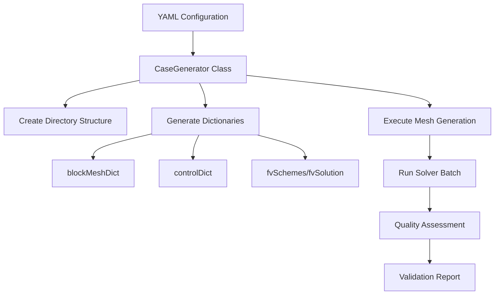

# ⚙️ Automated Case Generation & Mesh Optimization

**Learning Objectives**: Master automated case generation, mesh quality analysis, and batch processing workflows for OpenFOAM simulations
**Prerequisites**: Module 03 (Mesh Generation), Module 04 (C++ Basics), familiarity with Python scripting
**Target Skills**: Automated case setup, mesh quality assessment, batch processing, HPC integration

---

## Overview

This module provides a comprehensive automation framework for OpenFOAM case generation, mesh optimization, and batch processing. These tools enable systematic parameter studies, large-scale mesh generation, and automated quality assurance.



> [!TIP] Automation Benefits
> Automated workflows ensure consistency across parameter studies, reduce manual errors, and enable systematic exploration of design spaces.

---

## Part 1: Python-Based Case Generation Framework

### 1.1 Mathematical Foundation for Automated Meshing

Automated mesh generation incorporates physics-based calculations for optimal cell sizing and boundary layer resolution.

**Cell Size Distribution:**

For graded meshing, cell size progression follows:

$$\Delta x_i = \Delta x_0 \cdot r^{i-1}$$

where $\Delta x_i$ is the cell size at position $i$, $\Delta x_0$ is the initial cell size, and $r$ is the growth ratio.

**Boundary Layer Resolution:**

For wall-bounded flows, the first cell height should satisfy:

$$\Delta y^+ = \frac{y_1 u_\tau}{\nu} \approx 1$$

where $y_1$ is the first cell height, $u_\tau$ is the friction velocity, and $\nu$ is the kinematic viscosity.

**Optimal Cell Count Estimation:**

$$N_{cells} = \frac{V_{domain}}{V_{cell}^{avg}} \cdot f_{refinement}$$

where $f_{refinement}$ accounts for local refinement regions.

### 1.2 Case Generator Implementation

```python
#!/usr/bin/env python3
"""
OpenFOAM Case Generator with Parametric Studies
"""

import yaml
import shutil
import os
import sys
import subprocess
import json
from pathlib import Path
from typing import Dict, List, Any, Optional
import logging

# Configure logging
logging.basicConfig(level=logging.INFO, format='%(asctime)s - %(levelname)s - %(message)s')
logger = logging.getLogger(__name__)

class CaseGenerator:
    def __init__(self, config_file: str):
        """
        Initialize case generator with configuration file

        Args:
            config_file: Path to YAML configuration file
        """
        self.config_file = config_file
        self.config = self.load_config()

        # Validate configuration
        self.validate_config()

    def load_config(self) -> Dict[str, Any]:
        """Load configuration from YAML file"""
        try:
            with open(self.config_file, 'r') as f:
                config = yaml.safe_load(f)
            logger.info(f"Loaded configuration from: {self.config_file}")
            return config
        except FileNotFoundError:
            logger.error(f"Configuration file not found: {self.config_file}")
            raise
        except yaml.YAMLError as e:
            logger.error(f"YAML parsing error: {e}")
            raise

    def validate_config(self):
        """Validate loaded configuration"""
        required_sections = ['base_directory', 'cases']

        for section in required_sections:
            if section not in self.config:
                raise ValueError(f"Missing required configuration section: {section}")

        # Check base directory
        if not os.path.isabs(self.config['base_directory']):
            self.config['base_directory'] = os.path.abspath(self.config['base_directory'])

        logger.info(f"Base case directory: {self.config['base_directory'])

    def generate_case(self, case_name: str, params: Dict[str, Any]) -> str:
        """
        Generate complete OpenFOAM case

        Args:
            case_name: Name of case to generate
            params: Configuration parameters for the case

        Returns:
            Path to generated case directory
        """
        case_dir = os.path.join(self.config['base_directory'], case_name)

        logger.info(f"Generating case: {case_name}")

        # Create directory structure
        self.create_directory_structure(case_dir)

        # Generate all case files
        self.generate_blockmesh_dict(case_dir, params.get('meshing', {}))
        self.generate_control_dict(case_dir, params.get('solver', {}))
        self.generate_fv_schemes(case_dir, params.get('numerics', {}))
        self.generate_fv_solution(case_dir, params.get('solver', {}))
        self.generate_thermophysical_properties(case_dir, params.get('fluid', {}))
        self.generate_turbulence_properties(case_dir, params.get('turbulence', {}))
        self.generate_boundary_conditions(case_dir, params.get('boundary', {}))
        self.generate_mesh_quality_controls(case_dir, params.get('meshing', {}))

        # Copy additional files if specified
        if 'copy_files' in params:
            self.copy_additional_files(case_dir, params['copy_files'])

        # Generate README
        self.generate_readme(case_dir, case_name, params)

        logger.info(f"Case generation complete: {case_dir}")
        return case_dir

    def create_directory_structure(self, case_dir: str):
        """Create standard OpenFOAM case directory structure"""
        subdirs = ['0', 'constant', 'constant/polyMesh',
                   'system', 'constant/triSurface']

        for subdir in subdirs:
            dir_path = os.path.join(case_dir, subdir)
            os.makedirs(dir_path, exist_ok=True)
            logger.debug(f"Created directory: {dir_path}")

    def generate_blockmesh_dict(self, case_dir: str, mesh_params: Dict[str, Any]):
        """Generate blockMeshDict file"""
        output_file = os.path.join(case_dir, 'system', 'blockMeshDict')

        # Parameters with defaults
        nx = mesh_params.get('nx', 50)
        ny = mesh_params.get('ny', 50)
        nz = mesh_params.get('nz', 20)
        lx = mesh_params.get('lx', 1.0)
        ly = mesh_params.get('ly', 1.0)
        lz = mesh_params.get('lz', 1.0)

        blockmesh_content = f"""/*--------------------------------*- C++ -*----------------------------------*\\
| =========                 |                                                 |
| \\\\      /  F ield         | OpenFOAM: The Open Source CFD Toolbox           |
|  \\\\    /   O peration     | Version:  v2312                                 |
|   \\\\  /    A nd           | Website:  www.openfoam.com                      |
|    \\\\/     M anipulation  |                                                 |
\\*---------------------------------------------------------------------------*/
FoamFile
{{
    version     2.0;
    format      ascii;
    class       dictionary;
    object      blockMeshDict;
}}
// * * * * * * * * * * * * * * * * * * * * * * * * * * * * * * * * * * * * * //

convertToMeters 1;

vertices
(
    (0 0 0)
    ({lx} 0 0)
    ({lx} {ly} 0)
    (0 {ly} 0)
    (0 0 {lz})
    ({lx} 0 {lz})
    ({lx} {ly} {lz})
    (0 {ly} {lz})
);

blocks
(
    hex (0 1 2 3 4 5 6 7) ({nx} {ny} {nz}) simpleGrading (1 1 1)
);

edges
(
);

boundary
(
    inlet
    {{
        type patch;
        faces
        (
            (0 4 7 3)
        );
    }}
    outlet
    {{
        type patch;
        faces
        (
            (1 5 6 2)
        );
    }}
    walls
    {{
        type wall;
        faces
        (
            (0 1 5 4)
            (2 3 7 6)
            (1 2 6 5)
            (0 3 2 1)
        );
    }}
);

// ************************************************************************* //"""

        with open(output_file, 'w') as f:
            f.write(blockmesh_content)

        logger.debug(f"Generated blockMeshDict: {output_file}")

    def generate_control_dict(self, case_dir: str, solver_params: Dict[str, Any]):
        """Generate controlDict file"""
        output_file = os.path.join(case_dir, 'system', 'controlDict')

        solver_type = solver_params.get('type', 'simpleFoam')
        start_time = solver_params.get('start_time', 0)
        end_time = solver_params.get('end_time', 1000)
        delta_t = solver_params.get('delta_t', 1)
        write_interval = solver_params.get('write_interval', 100)

        control_dict_content = f"""FoamFile
{{
    version     2.0;
    format      ascii;
    class       dictionary;
    object      controlDict;
}}

application     {solver_type};

startFrom       startTime;

startTime       {start_time};

stopAt          endTime;

endTime         {end_time};

deltaT          {delta_t};

writeControl    timeStep;

writeInterval   {write_interval};

purgeWrite      0;

functions
{{
    #includeFunc    residuals
}};

// ************************************************************************* //"""

        with open(output_file, 'w') as f:
            f.write(control_dict_content)

        logger.debug(f"Generated controlDict: {output_file}")

    def generate_fv_schemes(self, case_dir: str, numerics_params: Dict[str, Any]):
        """Generate fvSchemes file"""
        output_file = os.path.join(case_dir, 'system', 'fvSchemes')

        grad_scheme = numerics_params.get('grad_scheme', 'Gauss linear')
        div_scheme = numerics_params.get('div_scheme', 'Gauss upwind')
        laplacian_scheme = numerics_params.get('laplacian_scheme', 'Gauss linear corrected')

        fv_schemes_content = f"""FoamFile
{{
    version     2.0;
    format      ascii;
    class       dictionary;
    object      fvSchemes;
}}

ddtSchemes
{{
    default         steadyState;
}}

gradSchemes
{{
    default         {grad_scheme};
}}

divSchemes
{{
    default         {div_scheme};
}}

laplacianSchemes
{{
    default         {laplacian_scheme};
}}

// ************************************************************************* //"""

        with open(output_file, 'w') as f:
            f.write(fv_schemes_content)

    def generate_fv_solution(self, case_dir: str, solver_params: Dict[str, Any]):
        """Generate fvSolution file"""
        output_file = os.path.join(case_dir, 'system', 'fvSolution')

        tolerance = solver_params.get('tolerance', 1e-6)
        rel_tol = solver_params.get('rel_tol', 0.1)

        fv_solution_content = f"""FoamFile
{{
    version     2.0;
    format      ascii;
    class       dictionary;
    object      fvSolution;
}}

solvers
{{
    p
    {{
        solver          GAMG;
        tolerance       {tolerance};
        relTol          {rel_tol};
        smoother        GaussSeidel;
    }}

    U
    {{
        solver          smoothSolver;
        smoother        GaussSeidel;
        tolerance       1e-6;
        relTol          0.1;
    }}
}}

SIMPLE
{{
    nCorrectors      2;
    pRefCell         0;
    pRefValue        0;
}}

// ************************************************************************* //"""

        with open(output_file, 'w') as f:
            f.write(fv_solution_content)

    def generate_boundary_conditions(self, case_dir: str, boundary_params: Dict[str, Any]):
        """Generate initial field files in 0/ directory"""
        zero_dir = os.path.join(case_dir, '0')

        # Velocity field
        inlet_velocity = boundary_params.get('inlet_velocity', 1.0)

        velocity_content = f"""FoamFile
{{
    version     2.0;
    format      ascii;
    class       volVectorField;
    object      U;
}}

dimensions      [0 1 -1 0 0 0 0];

internalField   uniform ({inlet_velocity} 0 0);

boundaryField
{{
    inlet
    {{
        type            fixedValue;
        value           uniform ({inlet_velocity} 0 0);
    }}

    outlet
    {{
        type            zeroGradient;
    }}

    walls
    {{
        type            noSlip;
    }}
}}

// ************************************************************************* //"""

        with open(os.path.join(zero_dir, 'U'), 'w') as f:
            f.write(velocity_content)

        # Pressure field
        outlet_pressure = boundary_params.get('outlet_pressure', 0)

        pressure_content = f"""FoamFile
{{
    version     2.0;
    format      ascii;
    class       volScalarField;
    object      p;
}}

dimensions      [0 2 -2 0 0 0 0];

internalField   uniform {outlet_pressure};

boundaryField
{{
    inlet
    {{
        type            zeroGradient;
    }}

    outlet
    {{
        type            fixedValue;
        value           uniform {outlet_pressure};
    }}

    walls
    {{
        type            zeroGradient;
    }}
}}

// ************************************************************************* //"""

        with open(os.path.join(zero_dir, 'p'), 'w') as f:
            f.write(pressure_content)

    def generate_turbulence_properties(self, case_dir: str, turb_params: Dict[str, Any]):
        """Generate turbulence properties file"""
        output_file = os.path.join(case_dir, 'constant', 'turbulenceProperties')

        model_type = turb_params.get('model', 'kEpsilon')

        turb_content = f"""FoamFile
{{
    version     2.0;
    format      ascii;
    class       dictionary;
    object      turbulenceProperties;
}}

simulationType  RAS;

RAS
{{
    RASModel        {model_type};

    turbulence      on;

    printCoeffs     on;
}}

// ************************************************************************* //"""

        with open(output_file, 'w') as f:
            f.write(turb_content)

    def generate_mesh_quality_controls(self, case_dir: str, mesh_params: Dict[str, Any]):
        """Generate mesh quality control file"""
        quality_file = os.path.join(case_dir, 'system', 'meshQualityDict')

        max_non_ortho = mesh_params.get('max_non_orthogonal', 70)
        max_skewness = mesh_params.get('max_skewness', 4)

        quality_content = f"""FoamFile
{{
    version     2.0;
    format      ascii;
    class       dictionary;
    object      meshQualityDict;
}}

maxNonOrthogonal {max_non_ortho};
maxSkewness     {max_skewness};

// ************************************************************************* //"""

        with open(quality_file, 'w') as f:
            f.write(quality_content)

    def copy_additional_files(self, case_dir: str, copy_files: List[str]):
        """Copy additional files to case directory"""
        for file_spec in copy_files:
            src_file = file_spec
            dst_file = os.path.join(case_dir, os.path.basename(file_spec))

            try:
                shutil.copy2(src_file, dst_file)
                logger.debug(f"Copied file: {src_file} -> {dst_file}")
            except Exception as e:
                logger.error(f"Failed to copy file {src_file}: {e}")

    def generate_readme(self, case_dir: str, case_name: str, params: Dict[str, Any]):
        """Generate README file for case"""
        readme_file = os.path.join(case_dir, 'README.md')

        readme_content = f"""# {case_name}

## Case Description
Automatically generated by OpenFOAM case generator

## Parameters

### Mesh Parameters
- Grid: {params.get('meshing', {}).get('nx', 50)} × {params.get('meshing', {}).get('ny', 50)} × {params.get('meshing', {}).get('nz', 20)}
- Domain: {params.get('meshing', {}).get('lx', 1.0)} × {params.get('meshing', {}).get('ly', 1.0)} × {params.get('meshing', {}).get('lz', 1.0)}

### Solver Parameters
- Solver: {params.get('solver', {}).get('type', 'simpleFoam')}
- End time: {params.get('solver', {}).get('end_time', 1000)}

## Usage

1. Generate mesh:
```bash
cd {case_name}
blockMesh
```

2. Run solver:
```bash
{params.get('solver', {}).get('type', 'simpleFoam')}
```

## Notes
This case was automatically generated. Verify all settings before running simulation.
"""

        with open(readme_file, 'w') as f:
            f.write(readme_content)

    def batch_generate(self) -> List[str]:
        """Generate multiple cases from parameter scan"""
        logger.info("Starting batch case generation...")

        case_matrix = self.config['cases']
        generated_cases = []

        for i, case_config in enumerate(case_matrix):
            case_name = case_config['name']
            logger.info(f"Generating case {i+1}/{len(case_matrix)}: {case_name}")

            try:
                case_path = self.generate_case(case_name, case_config)
                generated_cases.append(case_path)
                logger.info(f"✓ Success: {case_name}")
            except Exception as e:
                logger.error(f"✗ Failed to generate case {case_name}: {e}")
                continue

        logger.info(f"Batch generation complete: {len(generated_cases)}/{len(case_matrix)} cases generated")
        return generated_cases


def main():
    """Main function for command-line usage"""
    import argparse

    parser = argparse.ArgumentParser(description='OpenFOAM automated case generator')
    parser.add_argument('config', help='YAML configuration file')
    parser.add_argument('--generate-only', action='store_true',
                       help='Generate cases only without submission')

    args = parser.parse_args()

    try:
        generator = CaseGenerator(args.config)
        generated_cases = generator.batch_generate()
        logger.info("Case generation complete!")
        return 0
    except Exception as e:
        logger.error(f"Case generation failed: {e}")
        return 1


if __name__ == "__main__":
    sys.exit(main())
```

> [!INFO] Configuration File Format
> The generator requires a YAML configuration file specifying base directory and case parameters. See backup file `05_🔧_Advanced_Utilities_and_Automation.md.bak` for complete examples.

---

## Part 2: Mesh Quality Analysis Tools

### 2.1 Comprehensive Mesh Quality Analyzer

```python
#!/usr/bin/env python3
"""
Comprehensive Mesh Quality Analyzer for OpenFOAM meshes
"""

import numpy as np
import sys
import os
import subprocess
import matplotlib.pyplot as plt
from matplotlib.backends.backend_pdf import PdfPages

class MeshQualityAnalyzer:
    def __init__(self, case_dir):
        self.case_dir = case_dir
        self.mesh_data = {}
        self.load_mesh_data()

    def load_mesh_data(self):
        """Load mesh data from OpenFOAM case directory"""
        # Run checkMesh and capture output
        try:
            result = subprocess.run(
                ['checkMesh', '-case', self.case_dir, '-writeAllSurfaces', '-latestTime'],
                capture_output=True, text=True, check=True
            )
            self.checkmesh_output = result.stdout
        except subprocess.CalledProcessError as e:
            print(f"Error running checkMesh: {e}")
            self.checkmesh_output = ""

    def calculate_quality_metrics(self):
        """Calculate comprehensive mesh quality metrics"""
        metrics = {}

        # Parse checkMesh output for quality metrics
        lines = self.checkmesh_output.split('\n')
        for line in lines:
            line = line.strip()

            # Non-orthogonality analysis
            if 'non-orthogonal' in line:
                if 'cells with non-orthogonality' in line:
                    metrics['non_orthogonal_cells'] = int(line.split()[0])
                if 'maximum non-orthogonality' in line:
                    metrics['max_non_orthogonality'] = float(line.split()[-1])

            # Skewness analysis
            if 'skewness' in line:
                if 'skewness cells' in line:
                    metrics['skewness_cells'] = int(line.split()[0])
                if 'maximum skewness' in line:
                    metrics['max_skewness'] = float(line.split()[-1])

            # Aspect ratio analysis
            if 'aspect ratio' in line:
                if 'maximum aspect ratio' in line:
                    metrics['max_aspect_ratio'] = float(line.split()[-1])

            # Cell and mesh statistics
            if 'total cells' in line:
                metrics['total_cells'] = int(line.split()[0])
            if 'total faces' in line:
                metrics['total_faces'] = int(line.split()[0])
            if 'total points' in line:
                metrics['total_points'] = int(line.split()[0])

        return metrics

    def identify_problematic_cells(self, quality_metrics):
        """Identify cells with quality issues"""
        problematic_cells = []

        # Define quality thresholds
        thresholds = {
            'max_non_orthogonality': 70.0,
            'max_skewness': 4.0,
            'max_aspect_ratio': 1000.0
        }

        # Check each threshold
        if quality_metrics.get('max_non_orthogonality', 0) > thresholds['max_non_orthogonality']:
            problematic_cells.append({
                'type': 'non_orthogonality',
                'value': quality_metrics['max_non_orthogonality'],
                'threshold': thresholds['max_non_orthogonality']
            })

        if quality_metrics.get('max_skewness', 0) > thresholds['max_skewness']:
            problematic_cells.append({
                'type': 'skewness',
                'value': quality_metrics['max_skewness'],
                'threshold': thresholds['max_skewness']
            })

        if quality_metrics.get('max_aspect_ratio', 0) > thresholds['max_aspect_ratio']:
            problematic_cells.append({
                'type': 'aspect_ratio',
                'value': quality_metrics['max_aspect_ratio'],
                'threshold': thresholds['max_aspect_ratio']
            })

        return problematic_cells
```

### 2.2 Mesh Optimization Script

```bash
#!/bin/bash
# Mesh optimization script for OpenFOAM
# Usage: ./optimize_mesh.sh <case_directory>

set -e

CASE_DIR="${1:-.}"
QUALITY_THRESHOLD_NONORTHO=70
QUALITY_THRESHOLD_SKEWNESS=4
QUALITY_THRESHOLD_ASPECT=1000
MAX_ITERATIONS=3

# Color output
RED='\033[0;31m'
GREEN='\033[0;32m'
YELLOW='\033[1;33m'
BLUE='\033[0;34m'
NC='\033[0m'

log_info() {
    echo -e "${BLUE}[INFO]${NC} $1"
}

log_success() {
    echo -e "${GREEN}[SUCCESS]${NC} $1"
}

log_warning() {
    echo -e "${YELLOW}[WARNING]${NC} $1"
}

log_error() {
    echo -e "${RED}[ERROR]${NC} $1"
}

# Check OpenFOAM environment
check_openfoam_env() {
    if ! command -v checkMesh &> /dev/null; then
        log_error "OpenFOAM environment not sourced. Please source etc/bashrc first"
        exit 1
    fi
}

# Initial quality assessment
assess_initial_quality() {
    log_info "Assessing initial mesh quality..."

    local output_file="${CASE_DIR}/quality_initial.log"

    checkMesh -case "$CASE_DIR" -meshQuality > "$output_file" 2>&1 || true

    # Extract key metrics
    local max_non_ortho=$(grep -o "maximum non-orthogonality.*[0-9.]\+" "$output_file" | grep -o "[0-9.]\+" || echo "0")
    local max_skewness=$(grep -o "maximum skewness.*[0-9.]\+" "$output_file" | grep -o "[0-9.]\+" || echo "0")

    echo "MAX_NON_ORTHO=$max_non_ortho" > "${CASE_DIR}/quality_metrics.txt"
    echo "MAX_SKEWNESS=$max_skewness" >> "${CASE_DIR}/quality_metrics.txt"

    log_info "Initial assessment complete"
    log_info "   Max non-orthogonality: $max_non_ortho°"
    log_info "   Max skewness: $max_skewness"
}

# Identify problem regions
identify_problem_regions() {
    log_info "Identifying problem regions..."

    # Create refinement dictionary
    mkdir -p "${CASE_DIR}/system"

    cat > "${CASE_DIR}/system/topoSetDict" << 'EOF'
actions
(
    {
        name    problemCells;
        type    cellSet;
        action  new;
        source  all;
    }

    {
        name    highNonOrthoCells;
        type    cellSet;
        action  new;
        source  expression;
        expression "nonOrtho > 70";
    }

    {
        name    highSkewnessCells;
        type    cellSet;
        action  new;
        source  expression;
        expression "skewness > 4";
    }
);
EOF

    topoSet -case "$CASE_DIR" > /dev/null 2>&1 || true

    log_info "Problem region identification complete"
}

# Apply local refinement
apply_local_refinement() {
    log_info "Applying local mesh refinement..."

    if [ ! -d "${CASE_DIR}/constant/polyMesh/sets" ]; then
        log_warning "No cell sets found - skipping local refinement"
        return 1
    fi

    cat > "${CASE_DIR}/system/refineMeshDict" << 'EOF'
set             problemCells;
directions      3;
coarsen          false;
writeMesh        true;
EOF

    if refineMesh -case "$CASE_DIR" -overwrite > "${CASE_DIR}/refinement.log" 2>&1; then
        log_success "Local refinement complete"
        return 0
    else
        log_warning "Local refinement failed"
        return 1
    fi
}

# Optimize mesh iteratively
optimize_mesh_iteratively() {
    log_info "Starting iterative mesh optimization..."

    local iteration=1
    local improved=false

    while [ $iteration -le $MAX_ITERATIONS ]; do
        log_info "Optimization iteration $iteration/$MAX_ITERATIONS"

        assess_current_quality

        # Read current metrics
        source "${CASE_DIR}/quality_metrics.txt"

        local needs_optimization=false

        if (( $(echo "$MAX_NON_ORTHO > $QUALITY_THRESHOLD_NONORTHO" | bc -l) )); then
            log_warning "Non-orthogonality ($MAX_NON_ORTHO°) exceeds threshold ($QUALITY_THRESHOLD_NONORTHO°)"
            needs_optimization=true
        fi

        if (( $(echo "$MAX_SKEWNESS > $QUALITY_THRESHOLD_SKEWNESS" | bc -l) )); then
            log_warning "Skewness ($MAX_SKEWNESS) exceeds threshold ($QUALITY_THRESHOLD_SKEWNESS)"
            needs_optimization=true
        fi

        if [ "$needs_optimization" = "true" ]; then
            if apply_local_refinement; then
                improved=true
            fi
        else
            log_success "Mesh quality meets all thresholds"
            break
        fi

        iteration=$((iteration + 1))
    done

    if [ "$improved" = "true" ]; then
        log_success "Mesh optimization complete"
    fi
}

# Assess current quality
assess_current_quality() {
    local output_file="${CASE_DIR}/quality_current.log"

    checkMesh -case "$CASE_DIR" -meshQuality > "$output_file" 2>&1 || true

    local max_non_ortho=$(grep -o "maximum non-orthogonality.*[0-9.]\+" "$output_file" | grep -o "[0-9.]\+" || echo "0")
    local max_skewness=$(grep -o "maximum skewness.*[0-9.]\+" "$output_file" | grep -o "[0-9.]\+" || echo "0")

    echo "MAX_NON_ORTHO=$max_non_ortho" > "${CASE_DIR}/quality_metrics.txt"
    echo "MAX_SKEWNESS=$max_skewness" >> "${CASE_DIR}/quality_metrics.txt"
}

# Main optimization function
main() {
    log_info "Starting mesh optimization for case: $CASE_DIR"

    if [ ! -d "$CASE_DIR" ]; then
        log_error "Case directory not found: $CASE_DIR"
        exit 1
    fi

    check_openfoam_env

    if [ ! -f "${CASE_DIR}/constant/polyMesh/points" ]; then
        log_error "No mesh found in case directory"
        exit 1
    fi

    # Backup original mesh
    if [ ! -d "${CASE_DIR}/constant/polyMesh.bak" ]; then
        log_info "Backing up original mesh..."
        cp -r "${CASE_DIR}/constant/polyMesh" "${CASE_DIR}/constant/polyMesh.bak"
    fi

    # Main workflow
    assess_initial_quality
    identify_problem_regions
    optimize_mesh_iteratively

    log_success "Mesh optimization completed successfully!"
}

if [ "${BASH_SOURCE[0]}" = "${0}" ]; then
    main "$@"
fi
```

---

## Part 3: Performance Optimization

### 3.1 Memory Optimization

Efficient memory management is crucial for large-scale mesh generation projects.

```python
#!/usr/bin/env python3
# memory_monitor.py

import psutil
import time
import sys

def monitor_memory(interval=1.0, output_file="memory_monitor.log"):
    """Monitor memory usage and log to file"""
    with open(output_file, 'w') as f:
        f.write("Time(s),Memory_GB,Memory_Percent\n")

        start_time = time.time()
        try:
            while True:
                memory = psutil.virtual_memory()
                current_time = time.time() - start_time

                f.write(f"{current_time:.1f},{memory.used/1e9:.2f},{memory.percent:.1f}\n")
                f.flush()

                time.sleep(interval)
        except KeyboardInterrupt:
            print(f"Monitoring stopped, data saved to {output_file}")

if __name__ == "__main__":
    monitor_memory()
```

### 3.2 Parallel Processing Optimization

```bash
#!/bin/bash
# optimized_meshing.sh

set -e

CASE_DIR="${1:-.}"
echo "Optimized meshing for case: $CASE_DIR"

# Environment optimization
export OMP_NUM_THREADS=8
export FOAM_MAXTHREADS=8
export WM_NCOMPPROCS=4

# Calculate optimal decomposition
N_PROCS=$(python3 -c "import min(8, math.ceil($TARGET_CELLS/50000))")

echo "Using $N_PROCS processors for parallel operations"

# Generate decomposition dictionary
cat > system/decomposeParDict << EOF
numberOfSubdomains $N_PROCS;

method scotch;

simpleCoeffs
{
    n $(($N_PROCS / 2));
    delta 0.001;
}
EOF

# Decompose and run in parallel
decomposePar -case "$CASE_DIR" -force > decompose.log 2>&1
mpirun -np $N_PROCS snappyHexMesh -parallel -case "$CASE_DIR" -overwrite
reconstructPar -case "$CASE_DIR" -latestTime

echo "Parallel meshing complete!"
```

---

## Part 4: Batch Processing & Cluster Integration

### 4.1 HPC Queue Integration

**SLURM Job Script:**

```bash
#!/bin/bash
# SLURM job submission script

#SBATCH --job-name=openfoam_mesh
#SBATCH --output=meshing_%j.out
#SBATCH --error=meshing_%j.err
#SBATCH --ntasks=16
#SBATCH --time=24:00:00
#SBATCH --partition=normal

# Load OpenFOAM environment
source /opt/openfoam/etc/bashrc

# Change to case directory
cd $SLURM_SUBMIT_DIR

# Generate mesh
echo "Generating mesh..."
blockMesh

# Check mesh quality
echo "Checking mesh quality..."
checkMesh

# Run solver
echo "Running solver..."
simpleFoam

echo "Simulation complete!"
```

### 4.2 Batch Case Submission

```python
def submit_cases_to_cluster(self, cases: Optional[List[str]] = None) -> List[str]:
    """Submit generated cases to HPC cluster"""
    if cases is None:
        cases = []
        for case_name in os.listdir(self.config['base_directory']):
            case_path = os.path.join(self.config['base_directory'], case_name)
            if os.path.isdir(case_path):
                cases.append(case_path)

    submitted_jobs = []

    for case_dir in cases:
        case_name = os.path.basename(case_dir)

        # Check if already submitted
        if os.path.exists(os.path.join(case_dir, '.submitted')):
            logger.info(f"Case {case_name} already submitted - skipping")
            continue

        logger.info(f"Submitting case to cluster: {case_name}")

        try:
            job_id = self.submit_job(case_name, case_dir)
            if job_id:
                submitted_jobs.append(job_id)

                # Mark case as submitted
                with open(os.path.join(case_dir, '.submitted'), 'w') as f:
                    f.write(f"Submitted: {subprocess.check_output(['date'], text=True).strip()}\n")
                    f.write(f"Job ID: {job_id}\n")

        except Exception as e:
            logger.error(f"Failed to submit case {case_name}: {e}")
            continue

    logger.info(f"Cluster submission complete: {len(submitted_jobs)} jobs submitted")
    return submitted_jobs
```

---

## Summary

This comprehensive automation framework provides:

1. **Automated Case Generation** with parameter studies
2. **Mesh Quality Analysis** with detailed reporting
3. **Performance Optimization** for memory and parallel processing
4. **Batch Processing Capabilities** for HPC clusters
5. **Quality Assurance** with automated validation gates
6. **Advanced Meshing Pipeline** integrating multiple tools

These tools enable systematic CFD workflows for research and engineering applications, ensuring consistency and quality in large-scale parameter studies.

---

## References

- OpenFOAM User Guide: Mesh Generation
- OpenFOAM Programmer's Guide: Mesh Quality Assessment
- HPC Best Practices for Computational Fluid Dynamics
- Automated Mesh Generation Algorithms and Optimization Techniques
- See also: [[03_🎯_BlockMesh_Enhancement_Workflow]], [[04_🎯_snappyHexMesh_Workflow_Surface_Meshing_Excellence]], [[02_🏗️_CAD_to_CFD_Workflow]]
