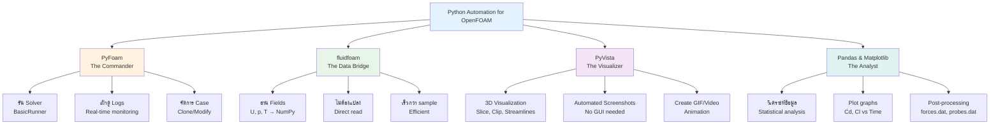

# 🐍 02: Python Automation for CFD

**เครื่องมือหลัก**: Python 3, PyFoam, fluidfoam, PyVista | **เป้าหมาย**: ควบคุม OpenFOAM ด้วย Python

> **ลิงก์ที่เกี่ยวข้อง**:
> - ดู Shell Scripting → [../01_SHELL_SCRIPTING/00_Overview.md](../01_SHELL_SCRIPTING/00_Overview.md)
> - ดู Python Plotting → [../04_ADVANCED_VISUALIZATION/02_Python_Plotting.md](../04_ADVANCED_VISUALIZATION/02_Python_Plotting.md)
> - ดู Custom Utilities → [../08_EXPERT_UTILITIES/06_Creating_Custom_Utilities.md](../08_EXPERT_UTILITIES/06_Creating_Custom_Utilities.md)

---

## 🌟 ทำไมต้อง Python? (Why Python?)

ในอดีต วิศวกร CFD อาจพึ่งพา Bash Script สำหรับการรันงาน แต่ในยุคปัจจุบัน **Python** กลายเป็นมาตรฐานใหม่ด้วยเหตุผลหลัก 3 ประการ:
1.  **Ecosystem ที่แข็งแกร่ง**: มีไลบรารีคำนวณ (NumPy), จัดการข้อมูล (Pandas), และ AI/ML (Scikit-learn, PyTorch) ที่พร้อมใช้งานทันที
2.  **Readability**: โค้ด Python อ่านง่ายและดูแลรักษาง่ายกว่า Shell Script ที่ซับซ้อน
3.  **Integration**: สามารถเชื่อมต่อ OpenFOAM กับเครื่องมือภายนอก เช่น Excel, Web APIs, หรือ Optimization Algorithms ได้อย่างง่ายดาย

> **"Python is the glue that holds the modern CFD workflow together."**

---

## 🧰 กล่องเครื่องมือ Python สำหรับ OpenFOAM (The Python CFD Toolbox)

ในโมดูลย่อยนี้ เราจะโฟกัสไปที่ 4 เสาหลักของ Python Automation:

### 1. **PyFoam** (The Commander)
ไลบรารีสารพัดประโยชน์ที่อยู่คู่ OpenFOAM มายาวนาน
*   **หน้าที่**: รัน Solver, เฝ้าดู Log files, พล็อตกราฟ Residuals แบบ Real-time, และจัดการ Case structure
*   **Command เด็ด**: `pyFoamPlotRunner.py`, `pyFoamCloneCase.py`

### 2. **fluidfoam** (The Data Bridge)
ตัวช่วยในการอ่านผลลัพธ์ (Fields) จาก OpenFOAM เข้าสู่ Python โดยตรง ไม่ต้องแปลงเป็น VTK หรือ CSV ก่อน
*   **หน้าที่**: อ่านค่า $U, p, T$ จากโฟลเดอร์ `0`, `0.1` ฯลฯ เข้ามาเป็น NumPy Arrays
*   **ประสิทธิภาพ**: เร็วกว่าการใช้ `sample` utility ทั่วไปมาก

### 3. **PyVista** (The Visualizer)
เครื่องมือ 3D Visualization ที่ทรงพลัง (สร้างบน VTK) ช่วยให้คุณสร้างภาพ 3D ได้จาก Code
*   **หน้าที่**: Slice, Clip, Streamlines, และ Screenshot อัตโนมัติโดยไม่ต้องเปิด ParaView GUI
*   **Use Case**: สร้าง GIF ของการไหลในท่อแบบอัตโนมัติ

### 4. **Pandas & Matplotlib** (The Analyst)
*   **หน้าที่**: วิเคราะห์ข้อมูลเชิงสถิติจากไฟล์ `postProcessing` (เช่น forces.dat, probes.dat)
*   **Use Case**: หาค่าเฉลี่ย $C_d, C_l$ ในช่วง 100 iterations สุดท้ายแล้วพล็อตกราฟเปรียบเทียบ

**Python CFD Toolbox Overview:**


---

## 🔄 ตัวอย่าง Workflow: Parametric Study

ลองจินตนาการว่าคุณต้องหา "มุมปีก (Angle of Attack)" ที่ให้แรงยกสูงสุด แทนที่จะแก้ไฟล์ 10 ครั้ง เราใช้ Python Loop:

```python
import os
from PyFoam.RunDictionary.SolutionDirectory import SolutionDirectory
from PyFoam.RunDictionary.ParsedParameterFile import ParsedParameterFile
from PyFoam.Execution.BasicRunner import BasicRunner

# 1. กำหนดช่วงตัวแปร
angles = [0, 2, 4, 6, 8, 10]
base_case = "airfoil_base"

for angle in angles:
    case_name = f"airfoil_angle_{angle}"
    
    # 2. Clone เคสจากต้นแบบ
    print(f"Creating case: {case_name}")
    os.system(f"cp -r {base_case} {case_name}")
    
    # 3. แก้ไขไฟล์ 0/U (ใช้ PyFoam แก้ค่า)
    # (ในโค้ดจริงจะมีการคำนวณ Ux, Uy ตามมุม)
    
    # 4. รัน Solver
    print(f"Running {case_name}...")
    runner = BasicRunner(argv=["simpleFoam", "-case", case_name], silent=True)
    runner.start()
    
    # 5. สรุปผล
    print(f"Case {case_name} finished.")

print("All simulations complete! 🚀")
```

**Parametric Study Workflow:**
```mermaid
graph LR
    Start[1. Define Parameters<br/>angles = [0,2,4,6,8,10]] --> Loop[2. Python Loop]

    Loop --> Clone[3. Clone Case<br/>cp -r base_case angle_X]
    Clone --> Modify[4. Modify Files<br/>PyFoam edit 0/U]
    Modify --> Run[5. Run Solver<br/>BasicRunner simpleFoam]
    Run --> Extract[6. Extract Results<br/>Read forces.dat]
    Extract --> Analyze[7. Analyze Data<br/>Pandas + Matplotlib]

    Analyze --> Next{Next Angle?}
    Next -->|Yes| Loop
    Next -->|No| Done[8. Optimal Angle Found!]

    style Start fill:#e3f2fd
    style Loop fill:#fff3e0
    style Clone fill:#ffe0b2
    style Modify fill:#ffcc80
    style Run fill:#ffecb3
    style Extract fill:#c8e6c9
    style Analyze fill:#b2dfdb
    style Done fill:#4CAF50
```

---

## 📚 สิ่งที่จะได้เรียนรู้ (Learning Roadmap)

1.  **[Setting up the Environment](./01_Python_Environment_Setup.md)**: การติดตั้ง Anaconda/Miniconda และไลบรารีที่จำเป็น (`pip install PyFoam fluidfoam pyvista`)
2.  **[PyFoam Fundamentals](./02_PyFoam_Fundamentals.md)**: การใช้ `pyFoamPlotRunner` และ `BasicRunner` API เพื่อรันงานแบบมืออาชีพ
3.  **[Data Analysis with Pandas](./03_Data_Analysis_with_Pandas.md)**: การดึงค่าแรง (Forces) และค่าที่จุดวัด (Probes) มาวิเคราะห์ด้วย Pandas และพล็อตกราฟด้วย Matplotlib
4.  **[Automated Parametric Study](./04_Automated_Parametric_Study.md)**: การสร้าง Script เพื่อทำ Parametric Study แบบอัตโนมัติ เช่น Angle of Attack Sweep, Mesh Independence Study

---

## ✅ เงื่อนไขเบื้องต้น (Prerequisites)

*   พื้นฐานภาษา Python (Variables, Loops, Functions, Lists/Dictionaries)
*   เข้าใจโครงสร้าง Case ของ OpenFOAM

**เตรียมตัวให้พร้อม แล้วมาเขียน Code เพื่อให้คอมพิวเตอร์ทำงานแทนเรากันเถอะ!**

---

## 📝 แบบฝึกหัด (Exercises)

### แบบฝึกหัดระดับง่าย (Easy)
1. **True/False**: PyFoam ใช้เพื่ออ่านผลลัพธ์ OpenFOAM เข้าสู่ NumPy arrays โดยตรง
   <details>
   <summary>คำตอบ</summary>
   ❌ เท็จ - fluidfoam ทำหน้าที่อ่านผลลัพธ์เข้า NumPy ส่วน PyFoam ใช้ควบคุม Solver และจัดการ Case
   </details>

2. **เลือกตอบ**: ไลบรารีไหนที่เหมาะสำหรับสร้างภาพ 3D โดยไม่ต้องเปิด ParaView GUI?
   - a) Matplotlib
   - b) fluidfoam
   - c) PyVista
   - d) Pandas
   <details>
   <summary>คำตอบ</summary>
   ✅ c) PyVista - เครื่องมือ 3D Visualization บน VTK สามารถ Slice, Clip, Streamlines ได้
   </details>

### แบบฝึกหัดระดับปานกลาง (Medium)
3. **อธิบาย**: แตกต่างระหว่าง Bash Script และ Python สำหรับ CFD Automation คืออะไร?
   <details>
   <summary>คำตอบ</summary>
   - Bash Script: เรียบง่าย รวดเร็ว แต่ซับซ้อนเมื่อต้องประมวลผลข้อมูล
   - Python: มี Ecosystem ที่แข็งแกร่ง (NumPy, Pandas) อ่านง่าย ดูแลรักษาง่าย และเชื่อมต่อกับเครื่องมือภายนอกได้ดี
   </details>

4. **เขียนโค้ด**: จงเขียน Python loop สำหรับสร้าง 5 cases พร้อมกัน (case_0 ถึง case_4) โดยไม่ต้องรัน Solver
   <details>
   <summary>คำตอบ</summary>
   ```python
   import os

   base_case = "airfoil_base"

   for i in range(5):
       case_name = f"case_{i}"
       os.system(f"cp -r {base_case} {case_name}")
       print(f"Created {case_name}")

   print("All cases created!")
   ```
   </details>

### แบบฝึกหัดระดับสูง (Hard)
5. **Hands-on**: ติดตั้ง PyFoam และลองรัน Tutorial case ด้วย `pyFoamPlotRunner.py simpleFoam -case <case>`

6. **วิเคราะห์**: เปรียบเทียบประสิทธิภาพระหว่าง:
   - การใช้ Python Loop รัน Case หลายๆ อันต่อเนื่อง (Sequential)
   - การใช้ HPC Cluster รัน Case แบบ Parallel
   ในแง่ของเวลาทั้งหมดที่ใช้ และประสิทธิภาพการใช้งาน Hardware
