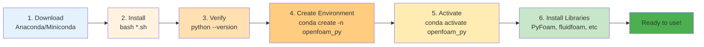

# การติดตั้งและตั้งค่า Python Environment (Python Environment Setup)

ก่อนจะเริ่มใช้ Python ควบคุม OpenFOAM เราต้องเตรียมสภาพแวดล้อมให้พร้อมก่อน บทนี้จะพาไปติดตั้งทีละขั้นตอนแบบจับมือทำ

> **ลิงก์ที่เกี่ยวข้อง**:
> - ดูภาพรวม Python Automation → [00_Overview.md](./00_Overview.md)
> - ดู PyFoam Fundamentals → [02_PyFoam_Fundamentals.md](./02_PyFoam_Fundamentals.md)
> - ดู Python Plotting → [../04_ADVANCED_VISUALIZATION/02_Python_Plotting.md](../04_ADVANCED_VISUALIZATION/02_Python_Plotting.md)

## 1. เลือก Distribution: Anaconda หรือ Miniconda?

### Anaconda (สำหรับมือใหม่)
**ข้อดี:**
- มีไลบรารีมากมายติดตั้งมาให้พร้อม (NumPy, Pandas, Matplotlib ฯลฯ)
- มี Anaconda Navigator (GUI) จัดการ Environment ได้ง่าย
- เหมาะกับผู้เริ่มต้น

**ข้อเสีย:**
- ไฟล์ติดตั้งขนาดใหญ่ (~500 MB - 3 GB)
- ติดตั้งหลายโปรแกรมที่ไม่ได้ใช้

### Miniconda (สำหรับผู้ชอบกระชับ)
**ข้อดี:**
- ไฟล์ติดตั้งเล็ก (~50 MB)
- ติดตั้งเฉพาะที่ต้องการ
- เหมาะกับ Server/HPC

**ข้อเสีย:**
- ต้องติดตั้งไลบรารีเองทีละตัว

> [!TIP] **เปรียบเทียบการเลือก Distribution**
> - **Anaconda**: เหมือนซื้อ **"คอนโดตกแต่งครบ (Fully Furnished)"** หิ้วกระเป๋าเข้าอยู่ได้เลย แต่ของเยอะ อาจจะรกถ้าไม่ได้ใช้
> - **Miniconda**: เหมือนซื้อ **"บ้านเปล่า (Bare Shell)"** ต้องซื้อเฟอร์นิเจอร์ (Libraries) เข้ามาเอง แต่ได้บ้านที่โล่งโปร่งและมีเฉพาะของที่จำเป็นจริงๆ

> **คำแนะนำ**: ถ้าใช้ Personal Computer → **Anaconda**
> ถ้าใช้ Server/HPC → **Miniconda**

## 2. การติดตั้ง Anaconda/Miniconda

### บน Linux (แนะนำ)

```bash
# ดาวน์โหลด (เลือก Python 3.x)
wget https://repo.anaconda.com/archive/Anaconda3-2023.09-0-Linux-x86_64.sh

# หรือ Miniconda (เล็กกว่า)
wget https://repo.anaconda.com/miniconda/Miniconda3-latest-Linux-x86_64.sh

# ติดตั้ง
bash Anaconda3-*.sh   # หรือ Miniconda3-*.sh

# รีสตาร์ท Terminal หรือรัน
source ~/.bashrc
```

### ตรวจสอบการติดตั้ง

```bash
python --version
# ควรแสดง: Python 3.x.x

conda --version
# ควรแสดง: conda 23.x.x
```

## 3. การสร้าง Virtual Environment

การสร้าง Environment แยกช่วยให้ไม่รกความระหว่างโปรเจกต์

```bash
# สร้าง Environment ชื่อ openfoam_py
conda create -n openfoam_py python=3.11

# เปิดใช้งาน Environment
conda activate openfoam_py
# Terminal จะแสดง: (openfoam_py) user@host:~$
```

**Environment Setup Workflow:**


## 4. การติดตั้งไลบรารี OpenFOAM

### 4.1 PyFoam

```bash
# วิธีที่ 1: ผ่าน pip (แนะนำ)
pip install PyFoam

# วิธีที่ 2: ผ่าน conda (ถ้ามีใน channel)
conda install -c conda-forge pyfoam

# ตรวจสอบ
pyFoamVersion.py
```

### 4.2 fluidfoam

```bash
# ติดตั้ง
pip install fluidfoam

# ทดสอบ (ต้องอยู่ใน OpenFOAM case)
python -c "import fluidfoam; print(fluidfoam.__version__)"
```

### 4.3 PyVista

```bash
# ติดตั้ง
pip install pyvista

# ทดสอบการใช้งาน
python -c "import pyvista; print(pyvista.__version__)"
```

### 4.4 ไลบรารีอื่นๆ ที่น่าสนใจ

```bash
# Data Analysis
pip install pandas matplotlib seaborn

# Jupyter Notebook (สำหรับทดลองโค้ด)
pip install jupyter

# Optimization (สำหรับ Parametric Study)
pip install scipy optuna
```

## 5. การตั้งค่าให้ PyFoam รู้จัก OpenFOAM

### 5.1 ตั้งค่า Environment Variables

เพิ่มลงใน `~/.bashrc` หรือ `~/.bashrc_profile`:

```bash
# OpenFOAM Environment (เดิมที่มี)
source /opt/openfoam9/etc/bashrc

# Python Libraries Path
export PYTHONPATH=$PYTHONPATH:$FOAM_LIBBIN/pyFoam
```

### 5.2 ตรวจสอบว่า PyFoam เห็น OpenFOAM

```bash
# รันคำสั่งนี้ใน OpenFOAM case
pyFoamListCases.py .

# ควรแสดงรายชื่อ solvers ที่มี
```

## 6. การใช้งาน Jupyter Notebook (Optional)

Jupyter Notebook ช่วยให้ทดลองโค้ดได้ง่ายในหน้าเว็บ

```bash
# ติดตั้ง
pip install jupyter

# เปิด Notebook
jupyter notebook

# หรือแบบใหม่
jupyter lab
```

**การสร้าง Notebook ใหม่**:
1. คลิก "New" → "Python 3"
2. ลองรัน:
   ```python
   import PyFoam
   print(PyFoam.__version__)
   ```

## 7. การจัดการ Environment

### อัปเกรดไลบรารี

```bash
conda activate openfoam_py
pip install --upgrade PyFoam fluidfoam pyvista
```

### สำรอง Environment (สำคัญมาก!)

```bash
# สำรอง Environment ปัจจุบัน
conda env export > environment.yml

# นำเข้า Environment ในเครื่องอื่น
conda env create -f environment.yml
```

### ลบ Environment

```bash
# ออกจาก Environment ก่อน
conda deactivate

# ลบ
conda env remove -n openfoam_py
```

---

## 🧠 ตรวจสอบความเข้าใจ (Concept Check)

### แบบฝึกหัดระดับง่าย (Easy)
1. **True/False**: Miniconda มีขนาดไฟล์ติดตั้งใหญ่กว่า Anaconda
   <details>
   <summary>คำตอบ</summary>
   ❌ เท็จ - Miniconda เล็กกว่ามาก (~50 MB vs ~500 MB - 3 GB)
   </details>

2. **เลือกตอบ**: คำสั่งไหนใช้สร้าง Environment ใหม่?
   - a) conda new
   - b) conda create
   - c) conda init
   - d) conda env make
   <details>
   <summary>คำตอบ</summary>
   ✅ b) conda create -n <env_name>
   </details>

### แบบฝึกหัดระดับปานกลาง (Medium)
3. **อธิบาย**: ทำไมต้องสร้าง Virtual Environment แยกจาก System Python?
   <details>
   <summary>คำตอบ</summary>
   - ป้องกันการชนกันของเวอร์ชันไลบรารีระหว่างโปรเจกต์
   - สามารถลบ/สร้าง Environment ใหม่ได้ง่าย
   - ทดสอบไลบรารีเวอร์ชันต่างๆ ได้โดยไม่กระทบ System
   </details>

4. **เขียนคำสั่ง**: จงเขียนคำสั่งเพื่อ:
   - สร้าง Environment ชื่อ `of_automation` พร้อม Python 3.10
   - ติดตั้ง PyFoam และ fluidfoam
   - สำรอง Environment เป็นไฟล์ environment.yml
   <details>
   <summary>คำตอบ</summary>
   ```bash
   conda create -n of_automation python=3.10
   conda activate of_automation
   pip install PyFoam fluidfoam
   conda env export > environment.yml
   ```
   </details>

### แบบฝึกหัดระดับสูง (Hard)
5. **Hands-on**: ติดตั้ง Anaconda/Miniconda และสร้าง Environment สำหรับ OpenFOAM Python automation จริงๆ

6. **วิเคราะห์**: เปรียบเทียบการใช้:
   - System Python (apt install python3)
   - Conda Environment
   ในแง่ของ:
   - ความยืดหยุ่นในการจัดการเวอร์ชัน
   - ความปลอดภัย (ไม่ทำลาย System)
   - ความง่ายในการถอนการติดตั้ง
