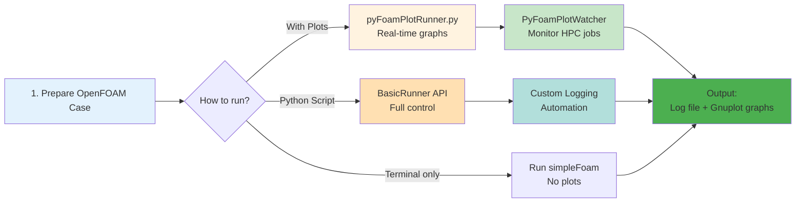

# พื้นฐานการใช้ PyFoam (PyFoam Fundamentals)

## จุดประสงค์การเรียนรู้ (Learning Objectives)

เมื่อจบบทนี้ คุณจะสามารถ:
- อธิบาย **What** - PyFoam คืออะไร และทำไมต้องใช้
- ใช้งาน **How** - รัน Solver ด้วย PyFoam ทั้งแบบ CLI และ Python API
- วิเคราะห์ **How** - Log files และ Residuals ด้วย PyFoam
- จัดการ **How** - Dictionary files ด้วย Python (controlDict, boundary conditions)
- สร้าง **How** - Automation workflow สำหรับ Parametric studies

---

## 1. PyFoam คืออะไร? (What is PyFoam?)

### What (อะไร)

PyFoam คือไลบรารี Python ที่พัฒนาโดย **Bernhard F.W. Gschaider** ตั้งแต่ปี 2006 เป็นเครื่องมือมาตรฐานที่ OpenFOAM community ใช้กันอย่างแพร่หลายสำหรับ Automation

**ความสามารถหลัก:**
- 🎮 ควบคุมการรัน Solver (แทนการรันใน Terminal)
- 📊 พล็อตกราฟ Residuals แบบ Real-time
- 📝 อ่านและแก้ไข Dictionary files (controlDict, fvSchemes ฯลฯ)
- 📁 Clone และจัดการ Case หลายๆ อัน
- 🔍 วิเคราะห์ Log files อัตโนมัติ

### Why (ทำไม)

ปัญหาที่ PyFoam ช่วยแก้:
- ❌ **Terminal ปกติ**: รัน Solver แล้วไม่รู้ Convergence จนกว่าจะจบ
- ❌ **HPC Cluster**: รันบน Server ไกลๆ ไม่เห็นกราฟ Real-time
- ❌ **Parametric Studies**: ต้องแก้ controlDict ทีละไฟล์ เสี่ยงผิด
- ❌ **Post-processing**: ต้อง Extract residuals จาก log ด้วยมือ

✅ **PyFoam**: แก้ทุกปัญหาข้างบนด้วย Python Automation

### How (อย่างไร)

PyFoam ทำงานโดย:
1. **Wrapper รอบ OpenFOAM**: เรียก Solver ผ่าน Python แทน Terminal
2. **Log File Parsing**: อ่าน Solver output แบบ Real-time
3. **Gnuplot Integration**: สร้างกราฟอัตโนมัติ
4. **Dictionary API**: อ่าน/เขียน OpenFOAM files แบบ Pythonic

> [!TIP] **เปรียบเทียบ PyFoam (Analogy)**
> ให้คิดว่า **OpenFOAM** คือ **"รถยนต์"** ที่มีเครื่องยนต์ทรงพลัง
> **PyFoam** ก็คือ **"หน้าปัดดิจิทัลและระบบ Autopilot"** ที่ช่วยให้คุณควบคุมรถ ดูมาตรวัดต่างๆ (Residuals) และขับไปยังจุดหมาย (Convergence) ได้อย่างสบาย โดยไม่ต้องลงไปจูนเครื่องเองทุกครั้ง

---

## 2. การรัน Solver ด้วย PyFoam (Running Solvers)

### 2.1 `pyFoamPlotRunner.py` - เครื่องมือหลัก

**What:** CLI Tool สำหรับรัน Solver พร้อมกราฟ Real-time

**รูปแบบการใช้งาน:**
```bash
pyFoamPlotRunner.py <solver> -case <case_directory>
```

**ตัวอย่าง:**
```bash
# รัน simpleFoam พร้อมพล็อตกราฟ
pyFoamPlotRunner.py simpleFoam -case .

# รันแบบ Silent (ไม่แสดง output ทุก step)
pyFoamPlotRunner.py simpleFoam -case . --silent

# รันและกำหนดเวลาเริ่มต้น
pyFoamPlotRunner.py simpleFoam -case . --starttime=0
```

**How it works:**
1. PyFoam เปิด Solver ขึ้นมา
2. อ่าน Residuals จาก Log file ทุกๆ ขั้นตอน
3. สร้างกราฟ Gnuplot แสดงความคืบหน้า Real-time
4. เมื่อ Solver จบ กราฟจะถูกบันทึกใน `<case>/PyFoamRunner/`

### 2.2 การเขียน Python Script รัน Solver

**Why:** ใช้เมื่อต้องการ Control ละเอียดกว่า CLI (เช่น Error handling, Logging)

```python
from PyFoam.Execution.BasicRunner import BasicRunner

# รัน simpleFoam
runner = BasicRunner(
    argv=["simpleFoam", "-case", "."],
    silent=False  # แสดง output ใน Terminal
)

# เริ่มรัน (Blocking)
runner.start()

# เช็คว่าจบหรือยัง
if runner.runnerOK:
    print("Simulation finished successfully!")
else:
    print("Simulation failed!")

# อ่าน CPU time
print(f"CPU Time: {runner.runner.readCPUTime()} seconds")
```

**Key Methods:**
- `runner.start()`: เริ่มรัน (Blocking)
- `runner.stop()`: หยุด Solver
- `runner.runnerOK`: Boolean - เช็คว่าจบสำเร็จไหม
- `runner.readCPUTime()`: อ่านเวลาที่ใช้

---

## 3. การเฝ้าดูและวิเคราะห์ Log Files (Monitoring)

### 3.1 `pyFoamPlotWatcher.py` - เฝ้าดู Log ที่รันอยู่แล้ว

**What:** Tool สำหรับดูกราฟ Real-time ของ Solver ที่รันอยู่แล้ว

**When:** ใช้เมื่อ:
- รัน Solver บน HPC Cluster (ไม่ได้ใช้ PyFoam)
- รันจาก Terminal ปกติ แต่อยากดูกราฟ
- มี Log file เก่า อยาก Plot ย้อนหลัง

**How:**
```bash
# เปิด Terminal ใหม่ แล้วรัน
pyFoamPlotWatcher.py <log_file>

# ตัวอย่าง
pyFoamPlotWatcher.py log.simpleFoam
```

### 3.2 อ่าน Log files ด้วย Python

**What:** `BoundingLogAnalyzer` - อ่านและวิเคราะห์ Log files แบบ Programmatic

```python
from PyFoam.LogAnalysis.BoundingLogAnalyzer import BoundingLogAnalyzer

# วิเคราะห์ Log file
log = BoundingLogAnalyzer()
log.setFileName("log.simpleFoam")

# อ่านข้อมูลทั้งหมด
log.analyze()

# ดู Residuals สุดท้าย
print("Final residuals:")
for var, value in log.time[-1].items():
    print(f"  {var}: {value}")
```

**PyFoam Workflow:**


---

## 4. การอ่านและแก้ไข Dictionary Files (Dictionary Manipulation)

### 4.1 อ่านค่าจาก controlDict

**What:** `ParsedParameterFile` - API สำหรับอ่าน/เขียน OpenFOAM Dictionary files

**Why:** แก้ไข Case settings แบบ Programmatic ไม่ต้องเปิด Text editor

```python
from PyFoam.RunDictionary.ParsedParameterFile import ParsedParameterFile

# อ่าน controlDict
control = ParsedParameterFile("system/controlDict")

# แสดงค่า
print(f"Start Time: {control['startTime']}")
print(f"End Time: {control['endTime']}")
print(f"Write Interval: {control['writeInterval']}")
```

### 4.2 แก้ไขค่าใน Dictionary

**How:** แก้ไขแล้วเรียก `writeFile()`

```python
# อ่านและแก้ไข
control = ParsedParameterFile("system/controlDict")

# เปลี่ยนค่า
control['endTime'] = 1000
control['writeInterval'] = 100

# เพิ่ม function objects
if 'functions' not in control:
    control['functions'] = {}

control['functions']['myForces'] = {
    'type': 'forces',
    'libs': ['"libforces.so"'],
    'writeControl': 'timeStep',
    'writeInterval': 1,
    'patches': ['"wall"']
}

# บันทึก
control.writeFile()
```

### 4.3 แก้ไข Boundary Conditions

**How:** ใช้ `ParsedParameterFile` กับ Field files (0/U, 0/p ฯลฯ)

```python
# อ่าน 0/U
u_file = ParsedParameterFile("0/U")

# เปลี่ยนค่าความเร็วที่ Inlet
u_file['boundaryField']['inlet']['type'] = 'fixedValue'
u_file['boundaryField']['inlet']['value'] = 'uniform (10 0 0)'

# บันทึก
u_file.writeFile()
```

**Common Operations:**
- Read: `ParsedParameterFile("path/to/file")`
- Modify: Access dict-style `file['key'] = value`
- Write: `file.writeFile()`

---

## 5. การ Clone และจัดการ Cases (Case Management)

### 5.1 Clone Cases

**What:** `SolutionDirectory` - API สำหรับ Clone/OpenFOAM Cases

**Why:** สร้าง Parametric studies ได้อัตโนมัติ

```python
from PyFoam.RunDictionary.SolutionDirectory import SolutionDirectory

# Clone case
base = SolutionDirectory("base_case")
new_case = base.clone("new_case")

# หรือใช้คำสั่ง shell
import os
os.system("pyFoamCloneCase.py base_case new_case")
```

### 5.2 Batch Operations

**How:** Loop รันหลาย Cases ด้วย Python

```python
import os
from PyFoam.Execution.BasicRunner import BasicRunner

cases = ["case_angle_0", "case_angle_2", "case_angle_4"]

for case in cases:
    print(f"Running {case}...")

    runner = BasicRunner(
        argv=["simpleFoam", "-case", case],
        silent=True
    )

    runner.start()

    if runner.runnerOK:
        print(f"✅ {case} finished!")
    else:
        print(f"❌ {case} failed!")
```

---

## 6. เคล็ดลับการใช้ PyFoam (Tips and Tricks)

### Tip 1: รันหลาย Solver ต่อเนื่อง

**Scenario:** รัน Mesh → Solver ต่อกันอัตโนมัติ

```python
# รัน blockMesh → snappyHexMesh → simpleFoam
solvers = [
    ["blockMesh", "-case", "."],
    ["snappyHexMesh", "-case", "."],
    ["simpleFoam", "-case", "."]
]

for solver in solvers:
    runner = BasicRunner(argv=solver, silent=True)
    runner.start()

    if not runner.runnerOK:
        print(f"Solver {solver[0]} failed!")
        break
```

### Tip 2: Auto-restart ถ้า Diverge

**Scenario:** Solver ล้มเหลว ให้ Restart อัตโนมัติ

```python
import time

max_restarts = 3
for attempt in range(max_restarts):
    runner = BasicRunner(argv=["simpleFoam", "-case", "."])
    runner.start()

    if runner.runnerOK:
        print("Success!")
        break
    else:
        print(f"Attempt {attempt+1} failed. Restarting...")
        time.sleep(5)
```

### Tip 3: สร้าง Custom Plotting

**Scenario:** Plot Variables พิเศษ (เช่น Drag Coefficient)

```python
from PyFoam.Execution.AnnotatedCommonPlotRunner import AnnotatedCommonPlotRunner

runner = AnnotatedCommonPlotRunner(
    argv=["simpleFoam", "-case", "."],
    customRegexp=[  # Custom plot rules
        ("force_coefficient",  # Plot name
         r"Cd = %f%",  # Regex pattern
         {"type": "dynamic", "theTitle": "Drag Coefficient"}),
    ]
)

runner.start()
```

---

## 🧠 Concept Check

### แบบฝึกหัดระดับง่าย (Easy)

**1. True/False**: `pyFoamPlotRunner.py` สร้างกราฟ Real-time ในระหว่างรัน Solver

<details>
<summary>คำตอบ</summary>

✅ **จริง** - PyFoam อ่าน Log files และพล็อตกราฟ Gnuplot แบบ Real-time

</details>

**2. เลือกตอบ**: Class ไหนใช้อ่าน Dictionary files?

- a) BasicRunner
- b) ParsedParameterFile
- c) BoundingLogAnalyzer
- d) SolutionDirectory

<details>
<summary>คำตอบ</summary>

✅ **b) ParsedParameterFile** - ใช้อ่านและแก้ไข controlDict, 0/U ฯลฯ

</details>

---

### แบบฝึกหัดระดับปานกลาง (Medium)

**3. อธิบาย**: แตกต่างระหว่าง `pyFoamPlotRunner.py` และ `pyFoamPlotWatcher.py` คืออะไร?

<details>
<summary>คำตอบ</summary>

- **pyFoamPlotRunner.py**: รัน Solver ใหม่พร้อมสร้างกราฟ (Control + Monitor)
- **pyFoamPlotWatcher.py**: เฝ้าดู Solver ที่รันอยู่แล้ว (เช่น HPC) แล้วสร้างกราฟ (Monitor only)

</details>

**4. เขียนโค้ด**: จงเขียน Python script เพื่อ:
- อ่าน `system/controlDict`
- เปลี่ยน `endTime` เป็น `2000`
- เพิ่ม `writeInterval` เป็น `50`
- บันทึกไฟล์

<details>
<summary>คำตอบ</summary>

```python
from PyFoam.RunDictionary.ParsedParameterFile import ParsedParameterFile

control = ParsedParameterFile("system/controlDict")
control['endTime'] = 2000
control['writeInterval'] = 50
control.writeFile()
print("controlDict updated!")
```

</details>

---

### แบบฝึกหัดระดับสูง (Hard)

**5. Hands-on**: ใช้ `pyFoamPlotRunner.py` รัน Tutorial case จริง และตรวจสอบกราฟที่สร้างใน `PyFoamRunner/`

**Steps:**
1. Copy tutorial case (เช่น `$FOAM_TUTORIALS/incompressible/simpleFoam/airFoil2D`)
2. รัน `pyFoamPlotRunner.py simpleFoam -case .`
3. เปิดกราฟใน `PyFoamRunner/` directory
4. สังเกต Residuals ลดลงหรือไม่?

**6. วิเคราะห์**: เปรียบเทียบวิธีรัน Solver 3 แบบ:

| วิธี | ความยืดหยุ่นในการควบคุม | ความง่ายในการ Automation | กราฟ Real-time |
|------|----------------------------|---------------------------|----------------|
| Terminal (simpleFoam) | ❌ ต่ำ | ❌ ต่ำ | ❌ ไม่มี |
| pyFoamPlotRunner.py | ⚠️ ปานกลาง | ⚠️ ปานกลาง | ✅ มี |
| Python BasicRunner | ✅ สูง | ✅ สูง | ✅ มี (ถ้าใช้ AnnotatedPlotRunner) |

<details>
<summary>คำอธิบายเพิ่มเติม</summary>

**Terminal**:
- ข้อดี: ง่ายที่สุด ไม่ต้องติดตั้งอะไรเพิ่ม
- ข้อเสีย: ไม่มีกราฟ, ไม่สามารถ Automation ได้

**pyFoamPlotRunner.py**:
- ข้อดี: มีกราฟ Real-time, ง่ายใช้
- ข้อเสีย: Control ได้น้อยกว่า Python script

**Python BasicRunner**:
- ข้อดี: Control ได้ทุกอย่าง (Error handling, Logging, Batch runs)
- ข้อเสีย: ต้องเขียนโค้ด Python

</details>

---

## 🎯 Key Takeaways

1. **PyFoam = Python + OpenFOAM**: ช่องเชื่อมระหว่าง Python Automation และ OpenFOAM Simulations
2. **3 Tools หลัก**:
   - `pyFoamPlotRunner.py`: รัน + Plot
   - `pyFoamPlotWatcher.py`: Monitor เท่านั้น
   - `BasicRunner API`: Full Control
3. **ParsedParameterFile**: อ่าน/เขียน Dictionary files แบบ Pythonic
4. **Automation = Batch Operations**: Loop รันหลาย Cases, Auto-restart ตอน Diverge
5. **Real-time Monitoring**: Gnuplot Graphs ช่วยดู Convergence ได้ทันที

---

## 📖 เอกสารที่เกี่ยวข้อง

- **ภาพรวม:** [00_Overview.md](00_Overview.md) — ภาพรวม Python Automation
- **บทก่อนหน้า:** [01_Python_Environment_Setup.md](01_Python_Environment_Setup.md) — การติดตั้ง Environment
- **บทถัดไป:** [03_Data_Analysis_with_Pandas.md](03_Data_Analysis_with_Pandas.md) — วิเคราะห์ข้อมูลด้วย Pandas