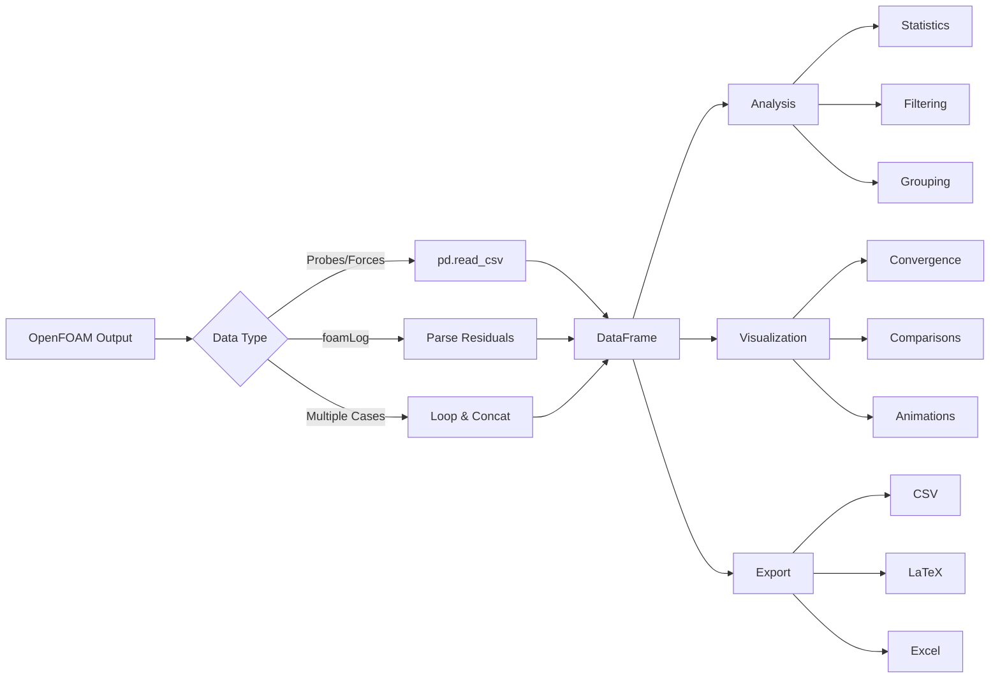

# Data Analysis with Pandas

การวิเคราะห์ข้อมูลด้วย Pandas

---

## Learning Objectives

🎯 **หลักสูตรนี้คุณจะสามารถ**

1. เข้าใจ **What** - Pand Data Analysis Library คืออะไรและโครงสร้างพื้นฐาน
2. ทราบ **Why** - ทำไม Pandas เหมาะสำหรับการวิเคราะห์ข้อมูล OpenFOAM
3. เรียนรู้ **How** - วิธีการอ่าน วิเคราะห์ และแสดงผลข้อมูลจาก OpenFOAM
4. สามารถอ่านและประมวลผลข้อมูลจาก `forces.dat`, `probes.dat`, และ foamLog
5. สร้างกราฟการลู่เคลื่อน (convergence plots) และกราฟเปรียบเทียบ
6. จัดการและเปรียบเทียบข้อมูลจากหลาย test cases
7. ส่งออกข้อมูลเป็นรูปแบบต่างๆ (CSV, LaTeX, Excel)

---

## 3W: What, Why, How

### 📖 WHAT - Pandas คืออะไร?

**Pandas** เป็น Python Data Analysis Library ที่มี DataFrame เป็นโครงสร้างข้อมูลหลัก:

```python
import pandas as pd

# DataFrame structure
# ┌──────┬─────┬─────┬─────┐
# │ Time │  p1 │  p2 │  p3 │
# ├──────┼─────┼─────┼─────┤
# │  0.0 │ 100 │ 101 │  99 │
# │  0.1 │ 105 │ 106 │ 104 │
# └──────┴─────┴─────┴─────┘
```

**คุณสมบัติหลัก:**
- **DataFrame**: ตารางข้อมูล 2D พร้อมชื่อ column
- **Series**: ข้อมูล 1D (เหมือน column เดียว)
- **Index**: label สำหรับแต่ละ row
- **Operations**: การกรอง, รวมกลุ่ม, คำนวณสถิติ

### 🎯 WHY - ทำไมใช้ Pandas กับ OpenFOAM?

**ข้อดีเหนือการใช้ Python ธรรมดา:**

| แง่มุม | NumPy Arrays | Pandas DataFrame |
|---------|--------------|------------------|
| **ชื่อ Column** | ❌ ใช้ index ตัวเลข | ✅ ใช้ชื่อที่อ่านง่าย |
| **Missing Data** | ❌ ต้องจัดการเอง | ✅ จัดการอัตโนมัติ |
| **Time Series** | ❌ ต้องเขียนเอง | ✅ มี time index |
| **Plotting** | ❌ ต้อง extract data | ✅ plot() โดยตรง |
| **Grouping** | ❌ ต้อง loop เอง | ✅ groupby() ง่ายๆ |

**เหมาะสำหรับ OpenFOAM:**
- อ่าน `probes.dat`, `forces.dat` ได้โดยตรง
- จัดการ time series จากการคำนวณ
- เปรียบเทียบหลาย test cases
- สร้าง convergence plots สำหรับ report

### ⚙️ HOW - ใช้งานอย่างไร?



---

## Prerequisites

**ก่อนเริ่ม:**
- ✅ พื้นฐาน Python (variables, loops, functions)
- ✅ รู้จัก NumPy arrays พื้นฐาน
- ✅ มีการรัน OpenFOAM simulation แล้ว

**ติดตั้ง:**
```bash
pip install pandas numpy matplotlib
# หรือ
conda install pandas numpy matplotlib
```

---

## 1. การอ่านข้อมูล OpenFOAM

### 1.1 Probe Data

**OpenFOAM probe output format:**
```
# Probe: probe1
# Time step: 0.001

Time	p1	p2	p3
0	1000	1005	998
0.001	1002	1007	999
0.002	1004	1009	1001
```

**Pandas code:**
```python
import pandas as pd
import numpy as np

# Load probe data
df = pd.read_csv(
    'postProcessing/probes/0/p',
    sep='\s+',           # whitespace separator
    skiprows=4,          # skip header lines
    index_col=0,         # use Time as index
    names=['time', 'p1', 'p2', 'p3']
)

# Show first rows
print(df.head())
#            p1    p2    p3
# time                       
# 0.000   1000  1005   998
# 0.001   1002  1007   999
# 0.002   1004  1009  1001

# Time as actual datetime
df.index = pd.to_timedelta(df.index, unit='s')
```

### 1.2 Forces Data

```python
# Forces and moments
forces = pd.read_csv(
    'postProcessing/forces/0/forces.dat',
    sep='\t',
    skiprows=4,
    names=['time', 'Fx', 'Fy', 'Fz', 'Mx', 'My', 'Mz']
)

# Show statistics
print(forces.describe())
#              time         Fx         Fy  ...        My        Mz
# count  500.000000  500.00000  500.00000  ...  500.00000  500.00000
# mean     0.250000    0.12345    0.67890  ...    0.01234    0.05678
```

### 1.3 foamLog Residuals

```python
# From foamLog output
residuals = pd.read_csv(
    'logs/p_0',
    sep='\s+',
    skiprows=3,
    names=['iter', 'res_initial', 'res_final', 'tolerance']
)

# Clean data
residuals = residuals.dropna()
residuals['res_log'] = np.log10(residuals['res_final'])

print(residuals.head(10))
#    iter  res_initial  res_final  tolerance  res_log
# 0     1  1.000000e+00  1.000e-01        1.0    -1.0
# 1     2  1.000000e-01  1.000e-02        1.0    -2.0
```

---

## 2. Data Analysis Operations

### 2.1 Basic Statistics

```python
# Full statistics
stats = df.describe()
print(stats)

# Individual statistics
mean_p = df['p1'].mean()      # ค่าเฉลี่ย
std_p = df['p1'].std()        # ส่วนเบี่ยงเบนมาตรฐาน
max_p = df['p1'].max()        # ค่าสูงสุด
min_p = df['p1'].min()        # ค่าต่ำสุด
median_p = df['p1'].median()  # ค่ามัธยฐาน

# Percentiles
q25 = df['p1'].quantile(0.25)
q75 = df['p1'].quantile(0.75)

# Rolling average (เคลื่อนเฉลี่ย)
df['p1_smooth'] = df['p1'].rolling(window=10).mean()
```

### 2.2 Filtering Data

```python
# Single condition
high_pressure = df[df['p1'] > 1000]

# Multiple conditions (AND)
filtered = df[(df['p1'] > 1000) & (df['time'] > 0.5)]

# Multiple conditions (OR)
filtered = df[(df['p1'] > 1000) | (df['p2'] < 900)]

# Time range
time_slice = df.loc[0.1:0.5]

# Using .query()
result = df.query('p1 > 1000 and time > 0.5')
```

### 2.3 Time-Based Operations

```python
# Time averaging
p_mean_over_time = df['p1'].mean()

# Average over specific period
period_mean = df.loc[0.1:0.5, 'p1'].mean()

# Time derivative
df['dp_dt'] = df['p1'].diff() / df.index.to_series().diff()

# Resampling (ถ้าข้อมูลไม่สม่ำเสมอ)
df_resampled = df.resample('10ms').mean()
```

### 2.4 Grouping & Aggregation

```python
# Add a 'regime' column
df['regime'] = pd.cut(df['p1'], 
                      bins=[0, 500, 1000, 1500],
                      labels=['low', 'medium', 'high'])

# Group statistics
regime_stats = df.groupby('regime').agg({
    'p1': ['mean', 'std', 'count'],
    'p2': ['mean', 'max']
})

print(regime_stats)
#            p1                               p2       
#          mean         std count       mean       max
# regime                                                 
# low     250.5   50.12345    50     255.25     350.0
# medium  750.3   80.54321    30     755.10     900.0
# high   1250.7  100.23456    20    1255.30    1450.0
```

---

## 3. Visualization

### 3.1 Convergence Plots

```python
import matplotlib.pyplot as plt

# Single convergence
fig, ax = plt.subplots(figsize=(10, 6))
ax.semilogy(residuals['iter'], residuals['res_final'])
ax.set_xlabel('Iteration')
ax.set_ylabel('Residual (log scale)')
ax.set_title('Pressure Equation Convergence')
ax.grid(True)
plt.savefig('convergence.png', dpi=300)
```

### 3.2 Multiple Residuals

```python
# Load multiple equations
eqs = ['p', 'Ux', 'Uy', 'Uz']
fig, axes = plt.subplots(2, 2, figsize=(12, 10))

for eq, ax in zip(eqs, axes.flat):
    data = pd.read_csv(f'logs/{eq}_0', sep='\s+', 
                       names=['iter', 'res'])
    ax.semilogy(data['iter'], data['res'])
    ax.set_title(f'{eq} Equation')
    ax.grid(True)

plt.tight_layout()
plt.savefig('all_convergence.png')
```

### 3.3 Time Series Plots

```python
# Multiple probes
fig, ax = plt.subplots(figsize=(12, 6))
for col in ['p1', 'p2', 'p3']:
    ax.plot(df.index, df[col], label=col)

ax.set_xlabel('Time (s)')
ax.set_ylabel('Pressure (Pa)')
ax.set_title('Probe Pressure History')
ax.legend()
ax.grid(True)
plt.savefig('pressure_history.png')
```

### 3.4 Comparing Cases

```python
cases = ['Re_100', 'Re_500', 'Re_1000']
fig, ax = plt.subplots(figsize=(10, 6))

for case in cases:
    df_case = pd.read_csv(f'{case}/probes.dat', sep='\s+')
    ax.plot(df_case['time'], df_case['p1'], label=case)

ax.set_xlabel('Time (s)')
ax.set_ylabel('Pressure')
ax.legend()
ax.grid(True)
plt.savefig('reynolds_comparison.png')
```

---

## 4. Multiple Case Analysis

### 4.1 Loading Multiple Cases

```python
import glob

# Find all case directories
case_dirs = glob.glob('Re_*')

# Load all data
all_data = {}
for case_dir in case_dirs:
    case_name = case_dir.split('/')[-1]
    file_path = f'{case_dir}/postProcessing/probes/0/p'
    
    try:
        df_case = pd.read_csv(file_path, sep='\s+')
        all_data[case_name] = df_case
        print(f"Loaded {case_name}: {len(df_case)} timesteps")
    except FileNotFoundError:
        print(f"Skipping {case_name}: no data found")

# Output:
# Loaded Re_100: 500 timesteps
# Loaded Re_500: 500 timesteps
# Loaded Re_1000: 500 timesteps
```

### 4.2 Combining Data

```python
# Method 1: Concatenate with MultiIndex
df_combined = pd.concat(all_data, names=['case', 'row'])

# Access specific case
print(df_combined.loc['Re_100'].head())

# Method 2: Add case column
for case, df_case in all_data.items():
    df_case['case'] = case

df_all = pd.concat(all_data.values(), ignore_index=True)
```

### 4.3 Statistical Comparison

```python
# Compare statistics across cases
summary = []
for case, df_case in all_data.items():
    summary.append({
        'case': case,
        'mean_p1': df_case['p1'].mean(),
        'std_p1': df_case['p1'].std(),
        'max_p1': df_case['p1'].max(),
        'final_p1': df_case['p1'].iloc[-1]
    })

df_summary = pd.DataFrame(summary)
print(df_summary)
#     case     mean_p1     std_p1    max_p1  final_p1
# 0  Re_100  1000.23456  50.123456  1100.00  1005.234
# 1  Re_500  1050.45678  55.654321  1155.50  1052.456
# 2 Re_1000  1100.67890  60.987654  1210.75  1105.678
```

### 4.4 Parametric Study Results

```python
# Reynolds number vs final pressure
results = []
for case, df_case in all_data.items():
    Re = int(case.split('_')[1])
    results.append({
        'Re': Re,
        'final_p': df_case['p1'].iloc[-1],
        'mean_p': df_case['p1'].mean(),
        'std_p': df_case['p1'].std()
    })

df_results = pd.DataFrame(results).sort_values('Re')

# Plot parametric study
fig, (ax1, ax2) = plt.subplots(1, 2, figsize=(14, 5))

ax1.plot(df_results['Re'], df_results['final_p'], 'o-')
ax1.set_xlabel('Reynolds Number')
ax1.set_ylabel('Final Pressure')
ax1.grid(True)

ax2.plot(df_results['Re'], df_results['std_p'], 's--', color='orange')
ax2.set_xlabel('Reynolds Number')
ax2.set_ylabel('Pressure Std Dev')
ax2.grid(True)

plt.tight_layout()
plt.savefig('parametric_study.png')
```

---

## 5. Exporting Data

### 5.1 CSV Export

```python
# Basic export
df.to_csv('processed_data.csv', index=False)

# With specific format
df.to_csv('results.csv',
          sep=',',
          index=True,
          float_format='%.6f',
          encoding='utf-8')

# Export specific columns
df[['p1', 'p2', 'p3']].to_csv('pressures_only.csv')
```

### 5.2 LaTeX Export

```python
# For academic papers
latex_table = df_summary.to_latex(
    index=False,
    float_format='%.2f',
    caption='Comparison across Reynolds numbers',
    label='tab:re_comparison',
    position='htbp'
)

print(latex_table)
# \begin{table}[htbp]
# \centering
# \caption{Comparison across Reynolds numbers}
# \label{tab:re_comparison}
# \begin{tabular}{lrrrr}
# \toprule
# case & mean_p1 & std_p1 & max_p1 & final_p1 \\
# \midrule
# Re_100 & 1000.23 & 50.12 & 1100.00 & 1005.23 \\
# Re_500 & 1050.46 & 55.65 & 1155.50 & 1052.46 \\
# \bottomrule
# \end{tabular}
# \end{table}

# Save to file
with open('results_table.tex', 'w') as f:
    f.write(latex_table)
```

### 5.3 Excel Export

```python
# With multiple sheets
with pd.ExcelWriter('full_report.xlsx') as writer:
    df.to_excel(writer, sheet_name='Raw Data')
    df_summary.to_excel(writer, sheet_name='Summary')
    df.describe().to_excel(writer, sheet_name='Statistics')
    
# With formatting
df_summary.style.format({
    'mean_p1': '{:.2f}',
    'std_p1': '{:.3f}',
    'max_p1': '{:.1f}'
}).to_excel('formatted_summary.xlsx')
```

---

## 6. Advanced Topics

### 6.1 Automation Functions

```python
def analyze_openfoam_case(case_path, probe_name='probes'):
    """Complete analysis pipeline for a single case."""
    # Load
    df = pd.read_csv(f'{case_path}/postProcessing/{probe_name}/0/p',
                     sep='\s+')
    
    # Analysis
    results = {
        'mean': df.mean(),
        'std': df.std(),
        'final': df.iloc[-1],
        'max': df.max(),
        'min': df.min()
    }
    
    return pd.DataFrame(results)

# Use it
result = analyze_openfoam_case('Re_100')
print(result)
```

### 6.2 Convergence Detection

```python
def check_convergence(residuals, threshold=1e-5, window=50):
    """Check if residuals have converged."""
    recent = residuals.tail(window)
    is_converged = (recent < threshold).all()
    
    return {
        'converged': is_converged,
        'final_residual': residuals.iloc[-1],
        'iterations': len(residuals)
    }

# Use
conv_status = check_convergence(residuals['res_final'])
print(f"Converged: {conv_status['converged']}")
print(f"Final residual: {conv_status['final_residual']:.2e}")
```

### 6.3 Animation

```python
from matplotlib.animation import FuncAnimation

# Animate probe evolution
fig, ax = plt.subplots()
line, = ax.plot([], [], 'b-')

def init():
    ax.set_xlim(0, df.index.max())
    ax.set_ylim(df['p1'].min(), df['p1'].max())
    return line,

def animate(i):
    line.set_data(df.index[:i], df['p1'].iloc[:i])
    return line,

ani = FuncAnimation(fig, animate, init_func=init,
                    frames=len(df), interval=50)
ani.save('pressure_evolution.mp4', writer='ffmpeg')
```

---

## 7. Complete Workflow Example

```python
import pandas as pd
import numpy as np
import matplotlib.pyplot as plt

def full_analysis(base_path='.', output_dir='analysis_results'):
    """Complete data analysis workflow."""
    import os
    os.makedirs(output_dir, exist_ok=True)
    
    # 1. Load all cases
    cases = [d for d in os.listdir(base_path) 
             if os.path.isdir(os.path.join(base_path, d))]
    
    all_results = {}
    
    for case in cases:
        try:
            # Load probe data
            df = pd.read_csv(
                f'{base_path}/{case}/postProcessing/probes/0/p',
                sep='\s+', skiprows=4,
                names=['time', 'p1', 'p2', 'p3']
            )
            
            # Load forces
            forces = pd.read_csv(
                f'{base_path}/{case}/postProcessing/forces/0/forces.dat',
                sep='\t', skiprows=4
            )
            
            # Store
            all_results[case] = {'probes': df, 'forces': forces}
            
        except Exception as e:
            print(f"Error loading {case}: {e}")
    
    # 2. Generate comparison plot
    fig, axes = plt.subplots(2, 2, figsize=(14, 10))
    
    for case, data in all_results.items():
        df = data['probes']
        forces = data['forces']
        
        # Pressure evolution
        axes[0, 0].plot(df['time'], df['p1'], label=case, alpha=0.7)
        
        # Force evolution
        if len(forces.columns) > 1:
            axes[0, 1].plot(forces.iloc[:, 0], forces.iloc[:, 1], 
                           label=case, alpha=0.7)
    
    axes[0, 0].set_xlabel('Time (s)')
    axes[0, 0].set_ylabel('Pressure (Pa)')
    axes[0, 0].set_title('Pressure Evolution')
    axes[0, 0].legend()
    axes[0, 0].grid(True)
    
    # 3. Summary statistics
    summary_data = []
    for case, data in all_results.items():
        df = data['probes']
        summary_data.append({
            'Case': case,
            'Mean P1': df['p1'].mean(),
            'Std P1': df['p1'].std(),
            'Max P1': df['p1'].max(),
            'Final P1': df['p1'].iloc[-1]
        })
    
    df_summary = pd.DataFrame(summary_data)
    
    # Save results
    df_summary.to_csv(f'{output_dir}/summary.csv', index=False)
    plt.savefig(f'{output_dir}/comparison.png', dpi=300)
    
    print(f"Analysis complete! Results in {output_dir}/")
    print(df_summary)
    
    return all_results, df_summary

# Run
results, summary = full_analysis()
```

---

## Quick Reference

### Common Operations

| Operation | Code | Description |
|-----------|------|-------------|
| **Load CSV** | `pd.read_csv('file', sep='\s+')` | Read whitespace-separated |
| **Load Excel** | `pd.read_excel('file.xlsx')` | Read Excel file |
| **Head/Tail** | `df.head(5)`, `df.tail(10)` | First/last rows |
| **Statistics** | `df.describe()` | Full statistics |
| **Mean** | `df['col'].mean()` | Average |
| **Std Dev** | `df['col'].std()` | Standard deviation |
| **Filter** | `df[df['col'] > value]` | Conditional selection |
| **Group** | `df.groupby('col').mean()` | Group aggregation |
| **Time avg** | `df.rolling(n).mean()` | Moving average |
| **Plot** | `df.plot()` | Quick plot |
| **Save CSV** | `df.to_csv('out.csv')` | Export to CSV |
| **Save LaTeX** | `df.to_latex()` | LaTeX table |

### Plot Types

```python
df.plot(kind='line')      # Line plot
df.plot(kind='bar')       # Bar chart
df.plot(kind='hist')      # Histogram
df.plot(kind='box')       # Box plot
df.plot(kind='area')      # Area plot
df.plot(kind='scatter', x='p1', y='p2')  # Scatter
```

---

## 📚 Exercises

### Easy (ง่าย)

**1. Basic Loading**
อ่านข้อมูลจาก `probes.dat` และแสดง:
- 5 rows แรก
- สถิติเบื้องต้น (mean, std, min, max)
- ค่า pressure เฉลี่ยของ probe แรก

**2. Simple Filtering**
จากข้อมูล probes:
- แสดงเฉพาะข้อมูลที่ `p1 > 1000`
- หาค่าเฉลี่ยของ `p1` ในช่วงเวลา 0.1 - 0.5 วินาที
- นับจำนวน rows ที่ pressure > ค่าเฉลี่ย

### Medium (ปานกลาง)

**3. Convergence Analysis**
อ่าน residual จาก `logs/p_0`:
- Plot convergence (semilogy)
- หา iteration ที่ residual < 1e-4
- คำนวณอัตราการลดลงเฉลี่ยต่อ iteration
- เปรียบเทียบ residuals ของ p, Ux, Uy, Uz ในกราฟเดียว

**4. Multi-Case Comparison**
โหลดข้อมูลจาก 3 test cases:
- สร้าง DataFrame ที่รวมสรุปสถิติ (mean, std, max, final)
- Plot pressure evolution ของทั้ง 3 cases ในกราฟเดียว
- หา case ที่มี pressure variance สูงสุด
- Export summary เป็น CSV และ LaTeX

### Hard (ยาก)

**5. Automated Analysis Pipeline**
สร้าง function ที่:
- Input: path ไปยัง directory ที่มีหลาย cases
- Process: โหลด, วิเคราะห์, เปรียบเทียบทุก case
- Output: 
  - Summary DataFrame
  - Comparison plots (pressure, forces, convergence)
  - LaTeX table พร้อม caption
  - Excel file พร้อม multiple sheets
- Error handling: ข้าม cases ที่ข้อมูลไม่สมบูรณ์

**6. Parametric Study Tool**
สร้างเครื่องมือวิเคราะห์ parametric study:
- Parameter: Reynolds number (Re = 100, 200, 500, 1000)
- Analysis:
  - Plot parameter vs final pressure (with error bars)
  - Detect trend (linear, quadratic, etc.)
  - Predict intermediate values (interpolation)
  - Generate convergence animation
- Output: Complete report with all plots

---

## 🎯 Key Takeaways

✅ **What:**
- Pandas เป็น library สำหรับ data analysis ที่มี DataFrame เป็นโครงสร้างหลัก
- เหมาะสำหรับ tabular data และ time series

✅ **Why:**
- อ่านข้อมูล OpenFOAM ได้ง่าย (probes, forces, logs)
- มี operations สำเร็จรูปสำหรับ filtering, grouping, statistics
- Plot และ export ได้หลากหลาย format

✅ **How:**
- `pd.read_csv()` - อ่าน whitespace-separated data
- `df.describe()` - ดูสถิติโดยรวม
- `df[condition]` - กรองข้อมูล
- `df.groupby()` - รวมกลุ่มและคำนวณ
- `df.plot()` - สร้างกราฟ
- `df.to_csv()` / `to_latex()` / `to_excel()` - ส่งออก

📌 **Best Practices:**
- ใช้ `sep='\s+'` สำหรับ OpenFOAM output
- ตรวจสอบ `skiprows` ให้ถูกต้อง
- ใช้ index column สำหรับ time series
- Save plots ด้วย dpi สูง (300+)
- Export เป็นหลาย format เพื่อความยืดหยุ่น

---

## 📖 Related Links

### ภายใน OpenFOAM Series
- **ภาพรวม:** [00_Overview.md](00_Overview.md)
- **NumPy Basics:** [02_NumPy_Basics.md](02_NumPy_Basics.md)
- **Visualization:** [04_Matplotlib_Visualization.md](04_Matplotlib_Visualization.md)
- **Automation:** [03_Automation_Framework.md](03_Automation_Framework.md)

### Pandas Official Resources
- 📘 **Documentation:** https://pandas.pydata.org/docs/
- 🎓 **Getting Started:** https://pandas.pydata.org/docs/getting_started/intro_tutorials/index.html
- 📊 **API Reference:** https://pandas.pydata.org/docs/reference/index.html

### External Tutorials
- 🎥 **Pandas in 10 Minutes:** https://pandas.pydata.org/pandas-docs/stable/user_guide/10min.html
- 💡 **Cookbook:** https://pandas.pydata.org/pandas-docs/stable/user_guide/cookbook.html
- 📈 **Time Series:** https://pandas.pydata.org/pandas-docs/stable/user_guide/timeseries.html

### OpenFOAM Integration
- **Post-Processing:** OpenFOAM User Guide - Post-processing
- **Sampling:** `probes`, `sample` utilities
- **Forces:** `forces` function object

---

**Next:** [04_Matplotlib_Visualization.md](04_Matplotlib_Visualization.md) → Advanced Visualization