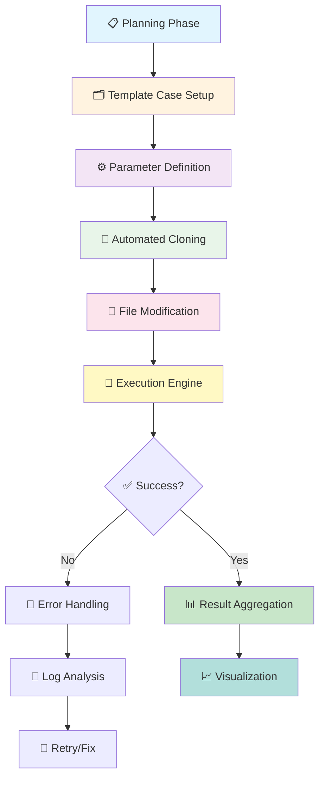
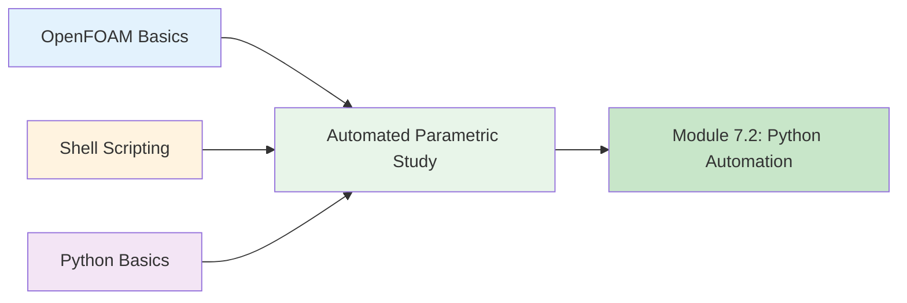

# Automated Parametric Study

การศึกษาพารามิเตอร์อัตโนมัติ

---

## Learning Objectives

**จุดประสงค์การเรียนรู้ (Learning Objectives):**

เมื่ออ่านจบบทนี้ คุณจะสามารถ:

1. **เข้าใจแนวคิด (Understand):** อธิบายความหมายและประโยชน์ของการศึกษาพารามิเตอร์แบบอัตโนมัติ (Automated Parametric Study)
2. **ออกแบบเวิร์กโฟลว์ (Design):** วางแผนและออกแบบกระบวนการศึกษาพารามิเตอร์ที่มีประสิทธิภาพ
3. **เลือกเครื่องมือ (Select):** เลือกใช้เครื่องมือที่เหมาะสม (Shell, Python, หรือ PyFoam) ตามความซับซ้อนของงาน
4. **จัดการขนาน (Parallelize):** จัดการการรันเคสพารามิเตอร์หลายเคสแบบขนานเพื่อประหยัดเวลา
5. **รวบรวมผลลัพธ์ (Aggregate):** รวบรวมและวิเคราะห์ผลลัพธ์จากหลายเคสอัตโนมัติ
6. **จัดการข้อผิดพลาด (Handle Errors):** จัดการข้อผิดพลาดและการล้มเหลวของเคสแต่ละเคส

---

## What, Why, How (3W Framework)

### 🔍 What is Automated Parametric Study?

**คืออะไร?**

การศึกษาพารามิเตอร์อัตโนมัติ คือ กระบวนการทำงานแบบอัตโนมัติเพื่อ:
- สร้างหลายเคสจำลอง (Multiple Cases) จากเคสแม่แบบ (Template)
- เปลี่ยนแปลงค่าพารามิเตอร์ที่สนใจ (Parameter Variation)
- รันการจำลองทุกเคส (Execute Solvers)
- รวบรวมและวิเคราะห์ผลลัพธ์ (Aggregate & Analyze)

ตัวอย่างพารามิเตอร์ที่พัฒนา:
- **เรขาคณิต:** ความยาวท่อ, เส้นผ่านศูนย์กลาง, มุมเข้า
- **สมบัติของไหล:** ความหนืด, ความหนาแน่น, อุณหภูมิ
- **เงื่อนไขขอบ:** ความเร็วเข้า, แรงดัน, อัตราส่วน
- **ตัวเลือกเชิงตัวเลข:** Time step, รูปแบบการแยกส่วน, tolerance

---

### 🤔 Why Automate Parametric Studies?

**ทำไมต้องทำ?**

| ประโยชน์ | คำอธิบาย |
|-----------|-----------|
| **⏱️ ประหยัดเวลา (Time-Saving)** | ไม่ต้องสร้าง/แก้ไไฟล์แบบ Manual หลายสิบไฟล์ |
| **🔄 ลดข้อผิดพลาด (Error Reduction)** | ไม่มี Human error จากการ Copy-Paste หรือ Edit ซ้ำๆ |
| **📊 การวิเคราะห์เชิงอนุกรม (Systematic Analysis)** | เห็นแนวโน้มและความไวของพารามิเตอร์อย่างชัดเจน |
| **🚀 การใช้ทรัพยากรอย่างมีประสิทธิภาพ (Resource Optimization)** | รันหลายเคสพร้อมกันบน Cluster |
| **📈 เพิ่มจำนวนเคส (Scalability)** | ศึกษาได้ทุกช่วงของพารามิเตอร์ (เช่น 10, 50, หรือ 100+ เคส) |
| **🔄 การทำซ้ำ (Reproducibility)** | เวิร์กโฟลว์ที่สามารถทำซ้ำได้อย่างสมบูรณ์ |
| **📝 เอกสาร (Documentation)** | การติดตามทุกเคสและการตั้งค่าที่ใช้โดยอัตโนมัติ |

**ตัวอย่าง Use Case:**
- การศึกษาผลกระทบของ Reynolds Number ต่อ drag coefficient
- การเพิ่มประสิทธิภาพรูปร่างร่างกายของกาญาน้ำ
- การวิเคราะห์ผลของ turbulence model parameters
- การสร้าง Performance maps สำหรับ turbomachinery

---

### ⚙️ How to Design an Automated Workflow?

**ทำอย่างไร?**

กระบวนการทำงานหลัก (Workflow):



**ขั้นตอนโดยละเอียด:**

| ขั้นตอน | คำอธิบาย | เครื่องมือแนะนำ |
|---------|-----------|--------------|
| **1️⃣ การวางแผน (Planning)** | กำหนดช่วงพารามิเตอร์ จำนวนเคส เป้าหมาย | Excel, Python Notebook |
| **2️⃣ การตั้งค่าเทมเพลต (Template Setup)** | สร้าง Template Case ที่ทดสอบแล้ว | Manual OpenFOAM |
| **3️⃣ การกำหนดพารามิเตอร์ (Parameter Definition)** | กำหนดค่าพารามิเตอร์และไฟล์ที่แก้ไข | CSV, JSON, Dict |
| **4️⃣ การโคลนอัตโนมัติ (Cloning)** | คัดลอก Template สร้างเคสใหม่ | Bash, Python, PyFoam |
| **5️⃣ การแก้ไขไฟล์ (Modification)** | แทนที่ค่าพารามิเตอร์ในไฟล์ | sed, Python, PyFoam |
| **6️⃣ การดำเนินการ (Execution)** | รัน Solver แต่ละเคส | bash, subprocess, PyFoam |
| **7️⃣ การรวบรวมผลลัพธ์ (Aggregation)** | ดึงข้อมูลจาก log/ไฟล์ผลลัพธ์ | Python Pandas, PyFoam |
| **8️⃣ การแสดงผล (Visualization)** | พล็อตกราฟ แผนภูมิ | matplotlib, ParaView |
| **9️⃣ การจัดการข้อผิดพลาด (Error Handling)** | ตรวจสอบความล้มเหลวและลองใหม่ | Python try-except, bash checks |

---

## Prerequisites (ความต้องการเบื้องต้น)



**ความรู้ที่ต้องมี:**

1. ✅ **OpenFOAM:** การทำงานกับ Single Case (Module 2)
2. ✅ **Shell Scripting:** Loop, Variable, File Operations (Module 7.1)
3. ✅ **Python:** Basic syntax, File I/O (Module 7.2)
4. ✅ **File System:** Directory Structure, Permissions

---

## 📋 Complete Workflow Examples

### Method 1: Shell Script (Basic Automation)

**เหมาะสำหรับ:** การเปลี่ยนแปลงพารามิเตอร์แบบง่าย (Single parameter)

```bash
#!/bin/bash
# automated_parametric_study.sh
# Author: [Your Name]
# Date: 2025

# ===== CONFIGURATION =====
TEMPLATE_DIR="template_case"
BASE_CASE_NAME="Re_study"
REYNOLDS_VALUES=(100 500 1000 5000 10000)
SOLVER="simpleFoam"
PARALLEL_RUNS=true  # Set to false for sequential

# ===== SETUP =====
echo "🚀 Starting Parametric Study at $(date)"
mkdir -p cases logs

# ===== MAIN LOOP =====
for Re in "${REYNOLDS_VALUES[@]}"; do
    case_name="${BASE_CASE_NAME}_${Re}"
    log_file="logs/${case_name}.log"
    
    echo "📂 Creating case: $case_name (Re=$Re)"
    
    # Step 1: Clone template
    if [ -d "cases/$case_name" ]; then
        echo "⚠️  Case exists, removing..."
        rm -rf "cases/$case_name"
    fi
    cp -r "$TEMPLATE_DIR" "cases/$case_name"
    
    # Step 2: Modify parameters
    # Example: Update transportProperties
    sed -i.bak "s/REYNOLDS_NUMBER/$Re/" \
        "cases/$case_name/constant/transportProperties"
    
    # Step 3: Update boundary conditions (optional)
    # sed -i "s/INLET_VELOCITY/$(echo "scale=2; 1.0 * $Re / 1000" | bc)/" \
    #     "cases/$case_name/0/U"
    
    # Step 4: Run solver
    echo "🔄 Running solver for $case_name..."
    if [ "$PARALLEL_RUNS" = true ]; then
        # Run in background
        (
            cd "cases/$case_name" || exit
            $SOLVER > "$log_file" 2>&1
            if [ $? -eq 0 ]; then
                echo "✅ Completed: $case_name"
            else
                echo "❌ Failed: $case_name"
            fi
        ) &
    else
        # Run sequentially
        cd "cases/$case_name" || exit
        $SOLVER > "$log_file" 2>&1
        if [ $? -eq 0 ]; then
            echo "✅ Completed: $case_name"
        else
            echo "❌ Failed: $case_name"
        fi
        cd - > /dev/null
    fi
done

# ===== WAIT FOR BACKGROUND PROCESSES =====
if [ "$PARALLEL_RUNS" = true ]; then
    echo "⏳ Waiting for all cases to complete..."
    wait
fi

# ===== AGGREGATE RESULTS =====
echo "📊 Aggregating results..."
python3 aggregate_results.py

echo "✨ Parametric study completed at $(date)"
```

**สคริปต์การรวบรวมผลลัพธ์ (`aggregate_results.py`):**

```python
#!/usr/bin/env python3
import pandas as pd
import glob
import re

# Extract drag coefficient from logs
data = []
for log_file in glob.glob("logs/*.log"):
    Re = re.search(r'Re_(\d+)', log_file).group(1)
    
    with open(log_file, 'r') as f:
        content = f.read()
        # Parse force coefficients
        cd_match = re.search(r'Cd\s*=\s*([\d.]+)', content)
        if cd_match:
            Cd = float(cd_match.group(1))
            data.append({'Re': int(Re), 'Cd': Cd})

# Create DataFrame and save
df = pd.DataFrame(data)
df = df.sort_values('Re')
df.to_csv('parametric_results.csv', index=False)
print(df)
```

---

### Method 2: Python Automation (Advanced)

**เหมาะสำหรับ:** การเปลี่ยนแปลงพารามิเตอร์หลายตัวแปร การจัดการข้อผิดพลาดที่ซับซ้อน

```python
#!/usr/bin/env python3
"""
automated_parametric_study.py
Advanced parametric study with error handling and parallel execution
"""

import os
import shutil
import subprocess
import pandas as pd
import numpy as np
from pathlib import Path
from concurrent.futures import ProcessPoolExecutor, as_completed
import logging
from datetime import datetime
import json

# ===== CONFIGURATION =====
CONFIG = {
    'template_dir': 'template_case',
    'output_dir': 'parametric_cases',
    'max_workers': 4,  # Number of parallel cases
    'solver': 'simpleFoam',
    'parameters': {
        'Reynolds': [100, 500, 1000, 5000, 10000],
        'inlet_angle': [0, 5, 10, 15],
    }
}

# Setup logging
logging.basicConfig(
    level=logging.INFO,
    format='%(asctime)s - %(levelname)s - %(message)s',
    handlers=[
        logging.FileHandler('parametric_study.log'),
        logging.StreamHandler()
    ]
)
logger = logging.getLogger(__name__)

class ParametricCase:
    """Represents a single parametric case"""
    
    def __init__(self, params, case_id):
        self.params = params
        self.case_id = case_id
        self.case_name = self._generate_name()
        self.case_path = Path(CONFIG['output_dir']) / self.case_name
        
    def _generate_name(self):
        """Generate unique case name from parameters"""
        parts = [f"{k}_{v}" for k, v in self.params.items()]
        return f"case_{self.case_id}_{'_'.join(parts)}"
    
    def create(self, template_path):
        """Create case directory from template"""
        if self.case_path.exists():
            shutil.rmtree(self.case_path)
        shutil.copytree(template_path, self.case_path)
        logger.info(f"Created: {self.case_name}")
    
    def modify_files(self):
        """Modify case files based on parameters"""
        # Example: Modify transportProperties
        transport_file = self.case_path / 'constant' / 'transportProperties'
        self._replace_in_file(transport_file, 'REYNOLDS_NUMBER', str(self.params['Reynolds']))
        
        # Example: Modify boundary conditions
        u_file = self.case_path / '0' / 'U'
        angle_rad = np.radians(self.params['inlet_angle'])
        u_x = 10.0 * np.cos(angle_rad)
        u_y = 10.0 * np.sin(angle_rad)
        self._replace_in_file(u_file, 'INLET_UX', f"{u_x:.6f}")
        self._replace_in_file(u_file, 'INLET_UY', f"{u_y:.6f}")
        
        logger.info(f"Modified files for: {self.case_name}")
    
    def _replace_in_file(self, file_path, old_text, new_text):
        """Replace text in file"""
        with open(file_path, 'r') as f:
            content = f.read()
        content = content.replace(old_text, new_text)
        with open(file_path, 'w') as f:
            f.write(content)
    
    def run(self):
        """Execute OpenFOAM solver"""
        log_file = self.case_path / 'solver.log'
        
        try:
            result = subprocess.run(
                [CONFIG['solver']],
                cwd=self.case_path,
                stdout=open(log_file, 'w'),
                stderr=subprocess.STDOUT,
                timeout=3600  # 1 hour timeout
            )
            
            if result.returncode == 0:
                logger.info(f"✅ Completed: {self.case_name}")
                return {'case': self.case_name, 'status': 'success', 'params': self.params}
            else:
                logger.error(f"❌ Failed: {self.case_name} (exit code: {result.returncode})")
                return {'case': self.case_name, 'status': 'failed', 'params': self.params}
                
        except subprocess.TimeoutExpired:
            logger.error(f"⏱️ Timeout: {self.case_name}")
            return {'case': self.case_name, 'status': 'timeout', 'params': self.params}
        except Exception as e:
            logger.error(f"💥 Error in {self.case_name}: {str(e)}")
            return {'case': self.case_name, 'status': 'error', 'params': self.params}

def generate_parameter_cases():
    """Generate all parameter combinations"""
    keys = CONFIG['parameters'].keys()
    values = CONFIG['parameters'].values()
    combinations = [dict(zip(keys, v)) for v in np.array(list(__import__('itertools').product(*values)))]
    
    cases = []
    for idx, params in enumerate(combinations):
        cases.append(ParametricCase(params, idx))
    
    logger.info(f"Generated {len(cases)} parameter combinations")
    return cases

def run_parallel_cases(cases):
    """Run cases in parallel"""
    template_path = Path(CONFIG['template_dir'])
    results = []
    
    with ProcessPoolExecutor(max_workers=CONFIG['max_workers']) as executor:
        futures = []
        
        for case in cases:
            # Create and modify
            case.create(template_path)
            case.modify_files()
            
            # Submit for execution
            future = executor.submit(case.run)
            futures.append(future)
        
        # Collect results
        for future in as_completed(futures):
            result = future.result()
            results.append(result)
    
    return results

def main():
    """Main execution"""
    logger.info("="*60)
    logger.info("AUTOMATED PARAMETRIC STUDY")
    logger.info("="*60)
    
    # Setup
    Path(CONFIG['output_dir']).mkdir(exist_ok=True)
    
    # Generate cases
    cases = generate_parameter_cases()
    
    # Run all cases
    results = run_parallel_cases(cases)
    
    # Save results
    results_df = pd.DataFrame(results)
    results_df.to_csv('parametric_results.csv', index=False)
    
    # Summary
    logger.info("\n" + "="*60)
    logger.info("SUMMARY")
    logger.info("="*60)
    logger.info(f"Total cases: {len(results)}")
    logger.info(f"Successful: {len(results[results['status']=='success'])}")
    logger.info(f"Failed: {len(results[results['status']!='success'])}")
    logger.info(f"\nResults saved to: parametric_results.csv")
    logger.info("="*60)

if __name__ == '__main__':
    main()
```

**การใช้งาน:**

```bash
# 1. สร้าง template_case ที่มี placeholders
# 2. รันสคริปต์
python3 automated_parametric_study.py

# 3. ตรวจสอบผลลัพธ์
cat parametric_results.csv

# 4. Visualize ด้วย Python
python3 -c "
import pandas as pd
import matplotlib.pyplot as plt
df = pd.read_csv('parametric_results.csv')
df_success = df[df['status']=='success']
plt.scatter(df_success['Reynolds'], df_success['drag_coefficient'])
plt.xlabel('Reynolds Number')
plt.ylabel('Drag Coefficient')
plt.savefig('parametric_plot.png')
print('Plot saved to parametric_plot.png')
"
```

---

### Method 3: PyFoam (Built-in Framework)

**เหมาะสำหรับ:** การใช้งาน OpenFOAM มาตรฐาน การจัดการ Case Dictionary

**Step 1: สร้างไฟล์พารามิเตอร์ (`parameters.txt`)**

```plaintext
# Reynolds Number Study
Re 100 500 1000 5000 10000
```

**Step 2: สร้าง Template Case พร้อม Placeholders**

ใน `constant/transportProperties`:

```cpp
transportModel  Newtonian;

nu              [0 2 -1 0 0 0 0]  <!--replacementVar nu_value--> 1e-05 <!--/replacementVar-->;
```

**Step 3: รัน PyFoam Parameter Variation**

```bash
#!/bin/bash
# pyfoam_parametric_study.sh

# Basic usage
pyFoamRunParameterVariation.py \
    --parameter-file=parameters.txt \
    --template-case=template \
    --output-directory=cases \
    --solver=simpleFoam \
    --auto-parallel-build=1 \
    --cloning-method=hardlink

# Advanced usage with custom replacement
pyFoamRunParameterVariation.py \
    --parameter-file=parameters.txt \
    --template-case=template \
    --output-directory=cases \
    --solver=simpleFoam \
    --replacement-dict=custom_replacements.py \
    --auto-parallel-build=1 \
    --maximum-number-of-parallel-cases=4

# With post-processing
pyFoamRunParameterVariation.py \
    --parameter-file=parameters.txt \
    --template-case=template \
    --output-directory=cases \
    --solver=simpleFoam \
    --post-processing-script=aggregate_results.py
```

**การสร้าง Custom Replacement Dictionary (`custom_replacements.py`):**

```python
# custom_replacements.py
def calc_nu(Re):
    """Calculate kinematic viscosity from Reynolds number"""
    U_ref = 10.0  # Reference velocity
    L_ref = 1.0   # Reference length
    return (U_ref * L_ref) / Re

replacements = {
    'nu_value': lambda params: calc_nu(params['Re'])
}
```

**Step 4: รวบรวมผลลัพธ์ด้วย PyFoam**

```python
#!/usr/bin/env python3
from PyFoam.RunDictionary.ParsedParameterFile import ParsedParameterFile
import pandas as pd

# Aggregate results from all cases
results = []

for case_dir in Path('cases').iterdir():
    if not case_dir.is_dir():
        continue
    
    # Parse force coefficients
    force_file = ParsedParameterFile(case_dir / 'postProcessing' / 'forces' / '0' / 'coefficient.dat')
    
    # Extract last time step data
    data = force_file.content[-1]
    
    results.append({
        'case': case_dir.name,
        'Cd': data['Cd'],
        'Cl': data['Cl'],
        'Cm': data['Cm']
    })

# Save to CSV
df = pd.DataFrame(results)
df.to_csv('pyfoam_results.csv', index=False)
print(df)
```

---

## 🚀 Parallel Execution Strategies

### Strategy 1: Shell Background Jobs

```bash
#!/bin/bash
# Simple parallel execution with job control
MAX_JOBS=4
ACTIVE_JOBS=0

for Re in 100 500 1000 5000 10000; do
    # Wait if we've hit the job limit
    while [ $ACTIVE_JOBS -ge $MAX_JOBS ]; do
        sleep 1
        ACTIVE_JOBS=$(jobs -r | wc -l)
    done
    
    # Launch case in background
    (
        case_dir="cases/Re_$Re"
        cd "$case_dir" || exit
        simpleFoam > solver.log 2>&1
        echo "Completed: Re_$Re"
    ) &
    
    ((ACTIVE_JOBS++))
done

# Wait for all jobs to complete
wait
```

### Strategy 2: GNU Parallel

```bash
#!/bin/bash
# Install: apt-get install parallel  or  brew install parallel

# Define parameter file
cat > params.txt << EOF
100
500
1000
5000
10000
EOF

# Run cases in parallel
cat params.txt | parallel -j 4 '
    Re={}
    case_dir="cases/Re_${Re}"
    cp -r template "$case_dir"
    sed -i "s/REYNOLDS/${Re}/" "$case_dir/constant/transportProperties"
    cd "$case_dir"
    simpleFoam > solver.log 2>&1
'

# Aggregate results
python3 aggregate_results.py
```

### Strategy 3: Python Multiprocessing

```python
from multiprocessing import Pool
import os

def run_case(Re):
    """Run a single case"""
    case_dir = f"cases/Re_{Re}"
    os.system(f"cp -r template {case_dir}")
    # Modify files...
    os.system(f"cd {case_dir} && simpleFoam > solver.log 2>&1")
    return f"Completed: {case_dir}"

if __name__ == '__main__':
    Reynolds_values = [100, 500, 1000, 5000, 10000]
    
    with Pool(processes=4) as pool:
        results = pool.map(run_case, Reynolds_values)
    
    print("\n".join(results))
```

### Strategy 4: Cluster/Slurm

```bash
#!/bin/bash
# submit_array_job.sh

#SBATCH --array=0-4  # 5 cases (Re = 100, 500, 1000, 5000, 10000)
#SBATCH --job-name=parametric_study
#SBATCH --cpus-per-task=4
#SBATCH --time=24:00:00

# Define Reynolds numbers
REYNOLDS=(100 500 1000 5000 10000)

# Get current array index
Re=${REYNOLDS[$SLURM_ARRAY_TASK_ID]}
case_dir="cases/Re_$Re"

# Setup case
cp -r template "$case_dir"
sed -i "s/REYNOLDS/${Re}/" "$case_dir/constant/transportProperties"

# Run solver
cd "$case_dir"
simpleFoam > solver.log 2>&1
```

```bash
# Submit to Slurm
sbatch submit_array_job.sh

# Monitor progress
squeue -u $USER

# Check logs
tail -f cases/Re_*/solver.log
```

---

## 📊 Result Aggregation & Analysis

### Extracting Data from Logs

```python
#!/usr/bin/env python3
"""Extract key results from solver logs"""
import re
import pandas as pd
from pathlib import Path

def extract_from_log(log_file):
    """Parse OpenFOAM log file"""
    data = {}
    
    with open(log_file, 'r') as f:
        content = f.read()
    
    # Extract initial/final residuals
    residual_pattern = r'Final residual\s*=\s*([\d.e-]+)'
    residuals = re.findall(residual_pattern, content)
    if residuals:
        data['final_residual'] = float(residuals[-1])
    
    # Extract execution time
    time_pattern = r'ExecutionTime\s*=\s*([\d.]+)\s*s'
    time_match = re.search(time_pattern, content)
    if time_match:
        data['execution_time'] = float(time_match.group(1))
    
    # Extract force coefficients (if available)
    cd_pattern = r'Cd\s*=\s*([\d.]+)'
    cd_match = re.search(cd_pattern, content)
    if cd_match:
        data['Cd'] = float(cd_match.group(1))
    
    # Check convergence
    data['converged'] = 'solution converged' in content.lower() or 'final residual' in content.lower()
    
    return data

def aggregate_all_logs(log_dir='logs'):
    """Aggregate all log files"""
    results = []
    
    for log_file in Path(log_dir).glob('*.log'):
        # Extract case info from filename
        case_name = log_file.stem
        
        # Parse log
        data = extract_from_log(log_file)
        data['case'] = case_name
        
        results.append(data)
    
    return pd.DataFrame(results)

# Main execution
if __name__ == '__main__':
    df = aggregate_all_logs()
    df.to_csv('aggregated_results.csv', index=False)
    print(df)
    
    # Print summary statistics
    print("\n=== Summary ===")
    print(f"Total cases: {len(df)}")
    print(f"Converged: {df['converged'].sum()}/{len(df)}")
    print(f"Average execution time: {df['execution_time'].mean():.2f}s")
```

### Visualization with Python

```python
#!/usr/bin/env python3
"""Visualization of parametric study results"""
import pandas as pd
import matplotlib.pyplot as plt
import seaborn as sns

# Load data
df = pd.read_csv('aggregated_results.csv')

# Extract parameters from case names
df['Re'] = df['case'].str.extract(r'Re_(\d+)').astype(int)

# Sort by Reynolds number
df = df.sort_values('Re')

# Create figure with subplots
fig, axes = plt.subplots(2, 2, figsize=(12, 10))

# Plot 1: Drag coefficient vs Reynolds
axes[0, 0].plot(df['Re'], df['Cd'], 'o-', linewidth=2, markersize=8)
axes[0, 0].set_xlabel('Reynolds Number')
axes[0, 0].set_ylabel('Drag Coefficient (Cd)')
axes[0, 0].set_title('Drag vs Reynolds Number')
axes[0, 0].grid(True, alpha=0.3)
axes[0, 0].set_xscale('log')

# Plot 2: Execution time
axes[0, 1].bar(df['Re'], df['execution_time'], color='steelblue')
axes[0, 1].set_xlabel('Reynolds Number')
axes[0, 1].set_ylabel('Execution Time (s)')
axes[0, 1].set_title('Computational Cost')
axes[0, 1].grid(True, alpha=0.3, axis='y')

# Plot 3: Convergence status
converged_counts = df['converged'].value_counts()
axes[1, 0].pie(converged_counts, labels=['Converged', 'Not Converged'],
                autopct='%1.1f%%', colors=['#2ecc71', '#e74c3c'])
axes[1, 0].set_title('Convergence Rate')

# Plot 4: Final residual
axes[1, 1].semilogy(df['Re'], df['final_residual'], 's-', color='darkgreen')
axes[1, 1].set_xlabel('Reynolds Number')
axes[1, 1].set_ylabel('Final Residual')
axes[1, 1].set_title('Solution Accuracy')
axes[1, 1].grid(True, alpha=0.3)

plt.tight_layout()
plt.savefig('parametric_study_summary.png', dpi=300)
plt.show()

print("✅ Visualization saved to parametric_study_summary.png")
```

---

## 🛡️ Error Handling & Debugging

### Common Issues and Solutions

| ปัญหา | สาเหตุ | วิธีแก้ไข |
|--------|---------|-----------|
| **Case ไม่ converge** | Initial conditions ไม่ดี, Time step ใหญ่เกินไป | ปรับ initial conditions, ลด time step, เพิ่ม iterations |
| **Out of memory** | Grid ละเอียดเกินไป, รันหลายเคสพร้อมกัน | ลด resolution, ลด parallel jobs, เพิ่ม RAM |
| **File permission errors** | Copy directory ไม่ถูกต้อง | ใช้ `cp -r` หรือ `rsync -a`, ตรวจสอบ permissions |
| **Parameter replacement fails** | Placeholder ไม่ตรง, Encoding ผิด | ตรวจสอบ template, ใช้ regex ที่ robust |
| **Solver crashes** | Boundary conditions ไม่ถูกต้อง, Mesh defects | ตรวจสอบ `checkMesh`, BC consistency |

### Robust Error Handling in Python

```python
#!/usr/bin/env python3
import subprocess
import time
from pathlib import Path

class CaseRunner:
    """Handles case execution with robust error handling"""
    
    def __init__(self, case_path, max_retries=2):
        self.case_path = Path(case_path)
        self.max_retries = max_retries
        self.log_file = self.case_path / 'solver.log'
    
    def check_prerequisites(self):
        """Verify case is ready to run"""
        checks = {
            'mesh': (self.case_path / 'constant' / 'polyMesh').exists(),
            'initial_conditions': (self.case_path / '0').exists(),
            'solver': (self.case_path / 'system' / 'controlDict').exists(),
        }
        
        for check_name, passed in checks.items():
            if not passed:
                raise FileNotFoundError(f"Missing {check_name} in {self.case_path}")
        
        # Run checkMesh
        result = subprocess.run(
            ['checkMesh', '-allTopology', '-allGeometry'],
            cwd=self.case_path,
            capture_output=True,
            text=True
        )
        
        if 'Mesh OK' not in result.stdout:
            print(f"⚠️  Mesh issues detected in {self.case_path}")
            return False
        
        return True
    
    def run_with_retry(self, solver_cmd='simpleFoam'):
        """Execute solver with retry logic"""
        for attempt in range(self.max_retries + 1):
            try:
                print(f"🔄 Running {self.case_path.name} (attempt {attempt + 1})")
                
                result = subprocess.run(
                    solver_cmd.split(),
                    cwd=self.case_path,
                    stdout=open(self.log_file, 'w'),
                    stderr=subprocess.STDOUT,
                    timeout=3600
                )
                
                if result.returncode == 0:
                    # Check convergence
                    with open(self.log_file, 'r') as f:
                        if 'solution converged' in f.read().lower():
                            print(f"✅ {self.case_path.name} converged")
                            return True
                        else:
                            print(f"⚠️  {self.case_path.name} completed but may not converge")
                            return True
                
            except subprocess.TimeoutExpired:
                print(f"⏱️  Timeout in {self.case_path.name}")
                if attempt < self.max_retries:
                    print("🔄 Retrying with adjusted settings...")
                    self._adjust_settings()
                    continue
            
            except Exception as e:
                print(f"💥 Error in {self.case_path.name}: {e}")
                if attempt < self.max_retries:
                    continue
            
            print(f"❌ Failed: {self.case_path.name}")
            return False
        
        return False
    
    def _adjust_settings(self):
        """Adjust solver settings for retry"""
        control_dict = self.case_path / 'system' / 'controlDict'
        # Example: Increase max iterations
        pass

# Usage
runner = CaseRunner('cases/Re_1000')
if runner.check_prerequisites():
    runner.run_with_retry()
```

---

## 📚 Best Practices

### ✅ DO's

1. **📋 Plan Before Executing**
   - กำหนดช่วงพารามิเตอร์ที่เหมาะสม (ไม่กว้างเกินไปหรือแคบเกินไป)
   - ประเมินจำนวนเคสและเวลาที่ต้องการ

2. **🧪 Test Template Thoroughly**
   - ตรวจสอบว่า Template Case ทำงานได้สำเร็จก่อน clone
   - รัน `checkMesh` และ solver 1 iteration เพื่อทดสอบ

3. **📝 Document Placeholders**
   - สร้างรายการ placeholders ทั้งหมดใน Template
   - ใช้ naming convention ที่ชัดเจน (เช่น `<!--REYNOLDS-->`)

4. **🔄 Use Version Control**
   - ใช้ Git เพื่อติดตามการเปลี่ยนแปลง Template
   - Commit ทุกครั้งก่อนรัน Parametric Study

5. **📊 Monitor Progress**
   - ตรวจสอบ log files ระหว่างดำเนินการ
   - ใช้ dashboard หรือ summary scripts

6. **💾 Backup Results**
   - Copy ผลลัพธ์สำคัญไปที่อื่น
   - Compress old cases เพื่อประหยัดพื้นที่

### ❌ DON'Ts

1. **🚫 Don't Skip Validation**
   - อย่ารัน 100+ เคสโดยไม่ได้ทดสอบ Template ก่อน

2. **🚫 Don't Ignore Errors**
   - อย่ามองข้าม log warnings หรือ non-converged cases

3. **🚫 Don't Overload Resources**
   - อย่ารันเคส parallel มากเกินไปบนเครื่องเดียว

4. **🚫 Don't Forget Cleanup**
   - อย่าลืมลบ intermediate files หรือ backup files

5. **🚫 Don't Hard-code Paths**
   - หลีกเลี่ยง absolute paths ใน scripts

---

## 📝 Exercises

### 🟢 Easy: Basic Shell Script

**Task:** สร้าง Shell Script สำหรับ Reynolds Number Study

**Requirements:**
- สร้าง script `re_study.sh` ที่:
  - Clone Template Case สำหรับ Re = [100, 500, 1000, 5000]
  - แก้ไข `constant/transportProperties` ในแต่ละเคส
  - รัน `simpleFoam` แบบ sequential
  - รวบรวม execution time จากทุกเคส

**Expected Output:**
```bash
$ ./re_study.sh
🚀 Starting Parametric Study...
📂 Creating case: Re_100 (Re=100)
🔄 Running solver...
✅ Completed: Re_100 (execution time: 45.2s)
...
📊 Results:
Case,Re,ExecutionTime
Re_100,100,45.2
Re_500,500,123.7
...
```

**Hints:**
- ใช้ `for` loop
- ใช้ `sed` สำหรับ file modification
- ใช้ `grep "ExecutionTime"` สำหรับ extracting time

---

### 🟡 Medium: Python Multi-Parameter Study

**Task:** สร้าง Python Script สำหรับศึกษา 2 พารามิเตอร์

**Scenario:**
ศึกษาผลของ Reynolds Number (100, 500, 1000) และ Inlet Angle (0°, 5°, 10°) ต่อ Drag Coefficient

**Requirements:**
1. สร้าง script `multi_param_study.py`:
   - Generate 3×3 = 9 cases (all combinations)
   - ใช้ `itertools.product` สำหรับ generating combinations
   - Run cases แบบ parallel (max 4 concurrent)
   - Parse drag coefficient จาก logs

2. สร้าง Visualization:
   - Plot Cd vs Re แยกตามแต่ละ angle
   - ใช้ matplotlib

**Expected Output:**
```python
Results:
Case,Re,Angle,Cd,Status
case_0,100,0,0.45,success
case_1,100,5,0.47,success
...
case_8,1000,10,0.32,success

✅ 9/9 cases converged
📊 Plot saved to multi_param_results.png
```

**Template Snippet:**
```python
import itertools
import pandas as pd
import matplotlib.pyplot as plt

Re_values = [100, 500, 1000]
angles = [0, 5, 10]

# Generate all combinations
combinations = list(itertools.product(Re_values, angles))
print(f"Total combinations: {len(combinations)}")

# Your implementation here...
```

---

### 🔴 Hard: Advanced Framework with Cluster Deployment

**Task:** สร้าง Complete Framework สำหรับ Production Use

**Requirements:**

1. **Configuration Management**
   - สร้าง `config.json` สำหรับ storing parameters
   - รองรับ parameter sweeps (range, list, random sampling)

2. **Advanced Error Handling**
   - Automatic retry พร้อม parameter adjustment
   - Email/Slack notifications สำหรับ failures
   - Database logging (SQLite)

3. **Cluster Integration**
   - Generate Slurm job array scripts automatically
   - Support dependency management (case B depends on case A)

4. **Result Analysis**
   - Automated convergence detection
   - Statistical analysis (mean, std, confidence intervals)
   - Generate HTML report

**Expected Structure:**
```
parametric_framework/
├── config/
│   └── study_config.json
├── src/
│   ├── case_manager.py
│   ├── solver_runner.py
│   ├── result_analyzer.py
│   └── report_generator.py
├── scripts/
│   ├── run_study.py
│   └── generate_slurm_jobs.py
├── logs/
├── results/
└── reports/
```

**Example Config (`study_config.json`):**
```json
{
  "study_name": "airfoil_optimization",
  "template_case": "templates/naca0012",
  "parameters": {
    "Reynolds": {
      "type": "range",
      "start": 100000,
      "end": 1000000,
      "steps": 10
    },
    "angle_of_attack": {
      "type": "list",
      "values": [0, 5, 10, 15, 20]
    }
  },
  "solver": "simpleFoam",
  "parallel_jobs": 8,
  "cluster": {
    "enable": true,
    "partition": "compute",
    "max_time": "24:00:00"
  },
  "post_processing": {
    "extract": ["Cd", "Cl", "Cm"],
    "visualize": true,
    "report": "html"
  }
}
```

**Bonus Features:**
- รองรับ Resume capability (ถ้า interrupted สามารถ continue ได้)
- รองรับ Distributed computing บน multiple nodes
- Integration กับ ParaView สำหรับ automated screenshots

---

## 🎯 Key Takeaways

สรุปสิ่งสำคัญ (บทเรียนสำคัญ):

1. **🎯 Planning is Crucial**
   > การวางแผนที่ดีก่อนเริ่ม Parametric Study จะช่วยประหยัดเวลาและทรัพยากร อย่ารีบรันโดยไม่ได้วางแผน

2. **🧪 Test Template Thoroughly**
   > Template Case ที่ผิดพลาดจะสร้างความผิดพลาดให้ทุกเคส ตรวจสอบให้แน่ใจว่า Template ทำงานได้ 100%

3. **⚖️ Choose the Right Tool**
   > - Shell: ง่ายและรวดเร็วสำหรับ simple variations
   > - Python: ยืดหยุ่นและทรงพลังสำหรับ complex workflows
   > - PyFoam: Built-in framework สำหรับ OpenFOAM-specific tasks

4. **🚀 Leverage Parallel Execution**
   > รันหลายเคสพร้อมกันเพื่อลดเวลารวมอย่างมีนัยสำคัญ แต่อย่าใช้ทรัพยากรมากเกินไป

5. **📊 Automate Result Aggregation**
   > อย่า extract data ด้วยตนเองจากแต่ละเคส ใช้ scripts สำหรับ parsing logs และ generating reports

6. **🛡️ Handle Errors Gracefully**
   > การ fail ของบางเคสไม่ควรทำให้ทั้ง study ล้มเหลว ใช้ retry logic และ error tracking

7. **📝 Document Everything**
   > บันทึก configuration, parameters, และ results อย่างละเอียดเพื่อการทำซ้ำและการตรวจสอบ

8. **🔄 Iterate and Refine**
   > เริ่มต้นด้วย parameter range ที่กว้าง แล้วค่อยๆ refine ไปยัง regions ที่น่าสนใจ

---

## 📖 Related Links

### 📚 Documentation

- **Shell Scripting:** [Module 7.1 - Shell Automation](../01_SHELL_SCRIPTING/00_Overview.md)
- **Python Automation:** [Module 7.2 - PyFoam Fundamentals](../02_PYTHON_AUTOMATION/02_PyFoam_Fundamentals.md)
- **Data Analysis:** [Module 7.2 - Pandas for OpenFOAM](../02_PYTHON_AUTOMATION/03_Data_Analysis_with_Pandas.md)

### 🔗 External Resources

- **PyFoam Documentation:** https://pyfoam.sourceforge.io/
- **GNU Parallel:** https://www.gnu.org/software/parallel/
- **OpenFOAM Scripting:** https://www.openfoam.com/documentation/guides/latest/api/
- **HPC Best Practices:** https://www.nas.nasa.gov/hecc/support/kb/best-practices.html

### 🎯 Next Steps

- **Advanced Automation:** [Batch Processing](../03_ADVANCED_AUTOMATION/02_Batch_Processing.md)
- **Optimization:** [Design of Experiments](../04_OPTIMIZATION/01_Design_of_Experiments.md)
- **Machine Learning:** [Surrogate Modeling](../05_ML_INTEGRATION/01_Surrogate_Models.md)