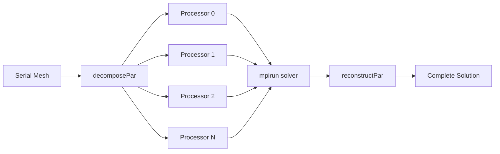

# HPC and Cloud Computing - Overview

ภาพรวม High-Performance Computing และ Cloud Computing สำหรับ OpenFOAM

---

## 🎯 Learning Objectives

หลังจากอ่านบทนี้ คุณจะสามารถ:

1. **อธิบาย** หลักการทำงานของ parallel computing และ MPI ใน OpenFOAM
2. **เลือกใช้** domain decomposition method ที่เหมาะสมกับปัญหา
3. **ตั้งค่า** job scheduler (SLURM, PBS) สำหรับ HPC clusters
4. **ประเมิน** parallel efficiency และ speedup ของ simulation
5. **deploy** OpenFOAM บน cloud platforms (AWS, GCP, Azure)
6. **แก้ไข** ปัญหา common issues ใน parallel simulations

---

## 📚 Prerequisites

ก่อนเริ่มบทนี้ คุณควรมีความรู้:

| หัวข้อ | ระดับ |
|--------|-------|
| Linux command line | พื้นฐาน |
| OpenFOAM case structure | พื้นฐาน |
| Shell scripting | พื้นฐาน |
| SSH/SCP | พื้นฐาน |

**ทักษะ Linux ที่จำเป็น:**
- File operations (cp, mv, rm, ls)
- Text editors (vim, nano)
- Process management (ps, top, kill)
- Shell scripting basics

---

## ℹ️ Module Information

| รายการ | รายละเอียด |
|--------|------------|
| **Difficulty** | ⭐⭐⭐ Intermediate |
| **Time** | 4-6 hours |
| **Hands-on** | decomposePar, mpirun, SLURM scripts |

---

## 🏗️ 3W Framework

### What: Parallel Computing คืออะไร?

**Parallel computing** คือการแบ่ง computational problem ออกเป็นส่วนย่อยและ solve พร้อมกันบนหลาย processors

**OpenFOAM ใช้ MPI (Message Passing Interface):**



### Why: ทำไมต้องใช้ Parallel Computing?

| Scenario | Serial Time | 16-core Parallel | Speedup |
|----------|-------------|------------------|---------|
| 1M cells, 1000 timesteps | ~24 hours | ~2 hours | ~12x |
| 10M cells, transient | ~1 week | ~12 hours | ~14x |
| LES simulation | Impossible | Feasible | ∞ |

**จำเป็นเมื่อ:**
- Mesh > 500K cells
- Transient simulation ที่ต้องการผลลัพธ์เร็ว
- LES หรือ DNS simulations
- Parametric studies หลาย cases

### How: ขั้นตอนการทำงาน

```bash
# 1. Decompose mesh
decomposePar -force

# 2. Run in parallel
mpirun -np 8 simpleFoam -parallel

# 3. Reconstruct results
reconstructPar -latestTime
```

---

## 📖 Key Concepts

### 1. Domain Decomposition

**Method Selection:**

| Method | Best For | Pros | Cons |
|--------|----------|------|------|
| `scotch` | Complex geometry | Auto-balanced | Random decomposition |
| `simple` | Simple boxes | Predictable | Manual tuning |
| `hierarchical` | Structured grids | Efficient for boxes | Needs structured mesh |
| `metis` | Large meshes | Well-balanced | External dependency |

**decomposeParDict Example:**
```cpp
numberOfSubdomains 8;

method scotch;

// OR for simple method:
// method simple;
// simpleCoeffs
// {
//     n (2 2 2);
//     delta 0.001;
// }
```

### 2. MPI Basics

```bash
# Run on local machine (8 cores)
mpirun -np 8 simpleFoam -parallel

# Run on cluster with hostfile
mpirun -np 64 --hostfile hosts.txt simpleFoam -parallel

# OpenMPI flags
mpirun -np 8 --bind-to core --map-by socket simpleFoam -parallel
```

### 3. Job Schedulers

**SLURM Script Example:**
```bash
#!/bin/bash
#SBATCH --job-name=openfoam
#SBATCH --nodes=2
#SBATCH --ntasks-per-node=16
#SBATCH --time=24:00:00
#SBATCH --partition=compute

module load openfoam/v2312

cd1$SLURM_SUBMIT_DIR
decomposePar
srun simpleFoam -parallel
reconstructPar -latestTime
```

### 4. Parallel Efficiency

**Speedup และ Efficiency:**
```
Speedup S(n) = T(1) / T(n)
Efficiency E(n) = S(n) / n × 100%
```

| Cores | Ideal Speedup | Typical Speedup | Efficiency |
|-------|---------------|-----------------|------------|
| 4 | 4.0 | 3.6 | 90% |
| 16 | 16.0 | 12.8 | 80% |
| 64 | 64.0 | 44.8 | 70% |
| 256 | 256.0 | 128.0 | 50% |

**Amdahl's Law:** ส่วนที่ไม่สามารถ parallelize ได้จำกัด speedup สูงสุด

---

## ☁️ Cloud Computing

### AWS Setup

```bash
# Launch EC2 instance with OpenFOAM AMI
# Instance types recommended:
# - c5.18xlarge (72 vCPU)
# - hpc6a.48xlarge (96 vCPU, HPC optimized)

# Install via Spack or Docker
docker run -it openfoam/openfoam2312-ubuntu
```

### Google Cloud

```bash
# Create compute instance
gcloud compute instances create openfoam-node \
    --machine-type=c2-standard-60 \
    --image-family=ubuntu-2204-lts
```

### Cost Optimization

| Strategy | Savings |
|----------|---------|
| Spot/Preemptible instances | 60-80% |
| Right-sizing instances | 20-40% |
| Scheduled scaling | 30-50% |
| Storage tiering | 10-20% |

---

## ⚠️ Common Pitfalls

| Problem | Cause | Solution |
|---------|-------|----------|
| Slowdown at high core count | Poor load balance | Use `scotch` method |
| Hanging at startup | MPI firewall issues | Check ports, ssh keys |
| Results differ from serial | Race conditions | Check boundary patches |
| Out of memory | Too many cores per node | Reduce tasks per node |

---

## 🧠 Concept Check

<details>
<summary><b>1. scotch กับ simple method ต่างกันอย่างไร?</b></summary>

**scotch:**
- Automatic load balancing
- Works for complex geometry
- Uses graph partitioning algorithm

**simple:**
- Manual specification (n x n x n)
- Predictable decomposition
- Best for structured meshes
</details>

<details>
<summary><b>2. ทำไม parallel efficiency ลดลงเมื่อเพิ่ม cores?</b></summary>

**สาเหตุหลัก:**
- **Communication overhead** ระหว่าง processors เพิ่มขึ้น
- **Load imbalance** — บาง processor ทำงานมากกว่า
- **Amdahl's Law** — ส่วนที่ serial ไม่สามารถ scale ได้
</details>

---

## 📖 Related Documents

- [01_Domain_Decomposition.md](01_Domain_Decomposition.md) — Methods และ tuning
- [02_Performance_Monitoring.md](02_Performance_Monitoring.md) — Profiling tools
- [03_Optimization_Techniques.md](03_Optimization_Techniques.md) — Performance tips
- [04_HPC_Integration.md](04_HPC_Integration.md) — Cluster workflows