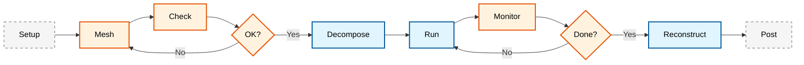
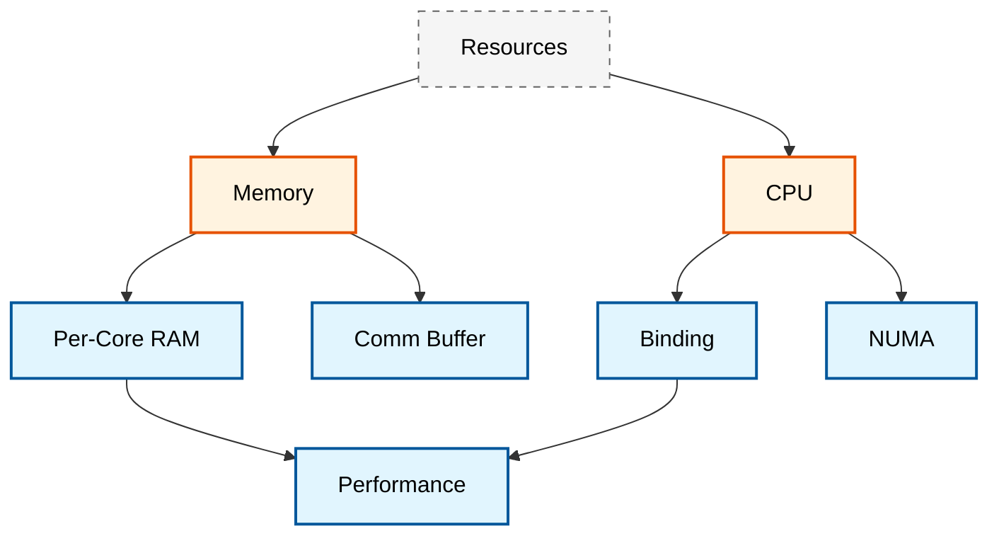

# 🚀 Parallel Computing and Performance Optimization

**วัตถุประสงค์การเรียนรู้ (Learning Objectives)**: เข้าใจรากฐานของการคำนวณแบบขนานใน OpenFOAM, การย่อยโดเมน, การปรับสมดุลภาระงาน และการเพิ่มประสิทธิภาพการทำงานบนระบบ HPC

---

## 📋 หัวข้อในบทนี้

### 1. [[01_Domain_Decomposition|กลยุทธ์การย่อยโดเมน (Domain Decomposition)]]
- ทฤษฎีเบื้องต้นของ Parallel CFD
- การกำหนดค่า `decomposeParDict` และวิธีการต่างๆ (Scotch, Simple, Hierarchical)
- การเพิ่มประสิทธิภาพ Load Balancing

### 2. [[02_Performance_Monitoring|การติดตามประสิทธิภาพ (Performance Monitoring)]]
- การตรวจสอบการใช้ทรัพยากรแบบ Real-time
- การวิเคราะห์เมตริก CPU, Memory, และ I/O
- การคำนวณประสิทธิภาพขนาน (Parallel Efficiency)

### 3. [[03_Optimization_Techniques|เทคนิคการเพิ่มประสิทธิภาพขั้นสูง (Optimization Techniques)]]
- การปรับแต่ง Solver (Solver Tuning)
- การจัดการหน่วยความจำ (Memory Management)
- การเพิ่มประสิทธิภาพ I/O (I/O Optimization)

### 4. [[04_HPC_Integration|การรวมเข้ากับระบบ HPC (HPC Integration)]]
- การจัดตารางงาน (Job Scheduling) ด้วย SLURM
- การจัดการไฟล์ระบบแบบกระจาย (Distributed File Systems)
- เวิร์กโฟลว์แบบครบวงจรบน Cluster

---

## 🎯 รากฐานคณิตศาสตร์ของ Parallel CFD

### ทฤษฎีการย่อยโดเมน (Domain Decomposition Theory)

การจำลอง CFD แบบขนานแบ่งโดเมนการคำนวณ $\Omega$ เป็น $N$ โดเมนย่อย $\Omega_i$ ดังนี้:

$$\Omega = \bigcup_{i=1}^{N} \Omega_i, \quad \Omega_i \cap \Omega_j = \emptyset \text{ for } i \neq j$$

สำหรับแต่ละโดเมนย่อย สมการ Navier-Stokes จะถูกแก้แบบอิสระ:

$$\rho \frac{\partial \mathbf{u}_i}{\partial t} + \rho (\mathbf{u}_i \cdot \nabla) \mathbf{u}_i = -\nabla p_i + \mu \nabla^2 \mathbf{u}_i + \mathbf{f}_i$$

พร้อมกับเงื่อนไข Interface ที่รับประกันความต่อเนื่องที่ขอบเขตของโดเมนย่อย ($\Gamma_{ij} = \Omega_i \cap \Omega_j$):

$$\mathbf{u}_i|_{\Gamma_{ij}} = \mathbf{u}_j|_{\Gamma_{ij}}, \quad p_i|_{\Gamma_{ij}} = p_j|_{\Gamma_{ij}}$$

![[parallel_decomposition_omega.png]]
> **ภาพประกอบ 1.1:** การแบ่งโดเมนการคำนวณ $\Omega$ ออกเป็นโดเมนย่อย $\Omega_i$ สำหรับการประมวลผลขนาน

### สมการการแลกเปลี่ยนข้อมูล (Communication Equations)

ที่ Interface ระหว่างโดเมนย่อย การแลกเปลี่ยนข้อมูลเกิดขึ้นผ่าน MPI (Message Passing Interface):

$$\phi_i^{(k+1)} = \text{update}\left(\phi_i^{(k)}, \phi_j^{(k)}\right) \text{ for } j \in \text{neighbors}(i)$$

โดยที่ $\phi$ แทนฟิลด์ใดๆ (เช่น $\mathbf{u}$, $p$, $T$) และ $k$ คีวเวลา (Time step)

### กฎของ Gustafson (Gustafson's Law)

ต่างจากกฎของ Amdahl ที่มองตายตัว (Fixed problem size) กฎของ Gustafson พิจารณาปัญหาที่ขยายตามจำนวนโปรเซสเซอร์ (Scaled problem):

$$S(N) = N - \alpha(N-1)$$

โดยที่ $\alpha$ คือสัดส่วนของส่วนที่ไม่สามารถขนานได้ (Serial portion)

---

## 📐 กลยุทธ์การย่อยโดเมน (Domain Decomposition)

> [!TIP] **DecomposePar** เป็นเครื่องมือหลักสำหรับการย่อยโดเมนใน OpenFOAM การเลือกวิธีการย่อยที่เหมาะสมส่งผลต่อประสิทธิภาพการคำนวณและ Load balancing โดยรวม

### วิธีการย่อยโดเมนหลัก (Decomposition Methods)

ใน OpenFOAM มีวิธีการหลัก 4 วิธีที่นิยมใช้:

1. **Simple**: แบ่งโดเมนตามทิศทางพิกัด (X, Y, Z) เหมาะสำหรับเรขาคณิตที่เรียบง่าย
2. **Hierarchical**: การแบ่งแบบลำดับชั้นที่ซับซ้อนขึ้น ช่วยให้ควบคุมจำนวนโดเมนในแต่ละทิศทางได้ดีขึ้น
3. **Scotch**: อัลกอริทึมฐานกราฟ (Graph-based) ที่พยายามลดจำนวนใบหน้าที่เป็น Interface และสร้าง Load balance ที่ดีที่สุดโดยอัตโนมัติ (แนะนำสำหรับเรขาคณิตซับซ้อน)
4. **Manual**: ผู้ใช้กำหนดเองว่าเซลล์ใดควรอยู่กับโปรเซสเซอร์ใด

![[decomposition_methods_visual.png]]
> **ภาพประกอบ 1.2:** การเปรียบเทียบวิธีการย่อยโดเมน: (ซ้าย) Simple decomposition แบ่งเป็นบล็อกตามแกน, (ขวา) Scotch decomposition แบ่งตามกราฟความซับซ้อนของเมช

### การตั้งค่า decomposeParDict

```cpp
/*--------------------------------*- C++ -*----------------------------------*\
| =========                 |                                                 |
| \\      /  F ield         | OpenFOAM: The Open Source CFD Toolbox           |
|  \\    /   O peration     | Version:  10                                    |
|   \\  /    A nd           | Website:  https://openfoam.org                  |
|    \\/     M anipulation  |                                                 |
\*---------------------------------------------------------------------------*/
// Decomposition control dictionary - Domain decomposition configuration
FoamFile
{
    version     2.0;
    format      ascii;
    class       dictionary;
    note        "mesh decomposition control dictionary";
    object      decomposeParDict;
}

// Number of subdomains (must equal number of MPI processes)
numberOfSubdomains  8;

//- Keep owner and neighbour on same processor for faces in zones:
// preserveFaceZones (heater solid1 solid3);

//- Keep owner and neighbour on same processor for faces in patches:
//  (makes sense only for cyclic patches)
// preservePatches (cyclic_half0 cyclic_half1);

//- Keep all of faceSet on a single processor. This puts all cells
//  connected with a point, edge or face on the same processor.
//  (just having face connected cells might not guarantee a balanced
//   decomposition)
// The processor can be -1 (the decompositionMethod chooses the processor
// for a good load balance) or explicitly provided (upsets balance).
// singleProcessorFaceSets ((f0 -1));

//- Use the volScalarField named here as a weight for each cell in the
//  decomposition. For example, use a particle population field to decompose
// for a balanced number of particles in a lagrangian simulation.
// weightField dsmcRhoNMean;

// Decomposition method: "simple", "hierarchical", "scotch", "manual"
method          scotch;
// method          hierarchical;
// method          simple;
// method          metis;
// method          manual;
// method          multiLevel;
// method          structured;  // does 2D decomposition of structured mesh

// Simple decomposition coefficients
simpleCoeffs
{
    // Number of divisions in (x y z) directions
    n               (4 2 1);  // 4 in x, 2 in y, 1 in z
    delta           0.001;    // Cell expansion ratio for skew correction
}

// Hierarchical decomposition coefficients
hierarchicalCoeffs
{
    n               (4 2 1);  // (x y z) divisions at each level
    order       xyz;          // Order of hierarchical decomposition
    
    // Alternative: multiLevelCoeffs for full general decomposition
    /*
    multiLevelCoeffs
    {
        // Decomposition methods to apply in turn. This is like hierarchical 
        // but fully general - every method can be used at every level.

        level0
        {
            numberOfSubdomains  64;
            method scotch;
        }
        level1
        {
            numberOfSubdomains  4;
            method scotch;
        }
    }
    */
}

// METIS decomposition coefficients (alternative graph-based method)
metisCoeffs
{
    // Processor weights for load balancing (heterogeneous hardware)
    processorWeights
    (
        1.0     // Processor 0
        1.0     // Processor 1
        1.2     // Processor 2 (20% faster)
        0.8     // Processor 3 (20% slower)
        // ... continue for all processors
    );
}

// Scotch decomposition coefficients (recommended for complex geometries)
scotchCoeffs
{
    // Processor weights for heterogeneous clusters
    /*
    processorWeights
    (
        1.0     // Processor 0
        1.0     // Processor 1
        1.2     // Processor 2 (faster by 20%)
        0.8     // Processor 3 (slower by 20%)
    );
    */
    
    // Strategy options: "default" (b), "quality", "speed", "balance"
    strategy        "default";  // Default balance strategy
    
    // Tolerance for load imbalance (5% means 95% balance acceptable)
    // imbalanceTolerance  0.05;
    
    // Write decomposition graph for debugging
    // writeGraph  true;
}

// Manual decomposition coefficients
manualCoeffs
{
    // File containing cell-to-processor mapping (one label per cell)
    dataFile    "decompositionData";
}

// Structured decomposition coefficients (for 2D decomposition)
structuredCoeffs
{
    // Patches to do 2D decomposition on. Structured mesh only; cells have
    // to be in 'columns' on top of patches.
    patches     (movingWall);

    // Method to use on the 2D subset
    method      scotch;
}

//- Is the case distributed? Note: command-line argument -roots takes precedence
// distributed     yes;
//- Per slave (so nProcs-1 entries) the directory above the case.
// roots
// (
//     "/tmp"
//     "/tmp"
// );

// ************************************************************************* //
```

> **📂 Source:** `.applications/test/patchRegion/cavity_pinched/system/decomposeParDict`
> 
> **📖 คำอธิบาย (Explanation):**
> 
> ไฟล์ `decomposeParDict` นี้เป็นไฟล์คอนฟิกูเรชันหลักที่ควบคุมการแบ่งโดเมน (Domain Decomposition) สำหรับการประมวลผลแบบขนานใน OpenFOAM ไฟล์นี้อยู่ภายใต้ `system/` ซึ่งเป็นไดเรกทอรี่สำหรับเก็บการตั้งค่าต่างๆ ที่เกี่ยวข้องกับการแก้สมการ (Solver settings)
> 
> **🔑 หลักการสำคัญ (Key Concepts):**
> 
> - **`numberOfSubdomains`**: กำหนดจำนวนโดเมนย่อยที่ต้องการแบ่ง ซึ่งควรมีค่าเท่ากับจำนวน MPI processes ที่จะใช้ในการรัน
> 
> - **`method`**: เลือกวิธีการแบ่งโดเมน โดยแต่ละวิธีมีข้อดี-ข้อเสียที่แตกต่างกัน:
>   - **`simple`**: แบ่งตามแกน X, Y, Z ตรงๆ เหมาะกับเรขาคณิตสี่เหลี่ยม (Rectangular geometry)
>   - **`hierarchical`**: แบ่งเป็นลำดับชั้น (Levels) ช่วยให้ควบคุมการแบ่งในแต่ละทิศทางได้ละเอียดขึ้น
>   - **`scotch`**: ใช้กราฟเพื่อหา partitioning ที่มี load balancing ดีที่สุด เหมาะกับเรขาคณิตซับซ้อน (Complex geometry)
>   - **`manual`**: ผู้ใช้ระบุเองว่าแต่ละเซลล์ควรอยู่ที่ processor ใด
> 
> - **`scotchCoeffs`** และ **`metisCoeffs`**: พารามิเตอร์สำหรับวิธีกราฟ-based (Scotch/METIS):
>   - **`processorWeights`**: ใช้กำหนดน้ำหนักโปรเซสเซอร์กรณีที่ฮาร์ดแวร์ไม่สมดุล (เช่น บางตัวเร็วกว่า)
>   - **`strategy`**: เลือกกลยุทธ์การแบ่ง เช่น "quality" (เน้นคุณภาพ), "speed" (เน้นความเร็ว), "balance" (เน้นการกระจายภาระ)
> 
> - **`preserveFaceZones`** และ **`preservePatches`**: บังคับให้ faces ใน zones/patches ที่ระบุอยู่บน processor เดียวกัน ซึ่งมีประโยชน์สำหรับ cyclic patches หรือ boundary conditions พิเศษ
> 
> - **`weightField`**: ใช้ field ที่กำหนด (เช่น ความหนาแน่นของ particle ใน Lagrangian simulation) เป็นน้ำหนักในการแบ่งเพื่อให้ load balancing ดีขึ้น

### การเรียกใช้งาน (Execution Commands)

```bash
# Decompose case (split domain for parallel processing)
decomposePar

# Force overwrite existing processor directories
decomposePar -force

# Reconstruct case (merge processor directories back to single domain)
reconstructPar

# Reconstruct specific time directories only
reconstructPar -latestTime
reconstructPar -time '0, 100, 200'
```

---

## ⚖️ การเพิ่มประสิทธิภาพ Load Balancing

การกระจายภาระงาน (Load Balancing) ที่ไม่เท่ากันจะทำให้โปรเซสเซอร์ที่ทำงานเสร็จเร็วต้องรอโปรเซสเซอร์ที่ทำงานช้า (Synchronization overhead)

### การวิเคราะห์ประสิทธิภาพ Load Balance

ประสิทธิภาพของการทำ Load balance ($\eta_{LB}$) คำนวณได้จาก:

$$\eta_{LB} = \frac{\sum_{i=1}^{N} t_i}{N \cdot \max(t_i)}$$

โดยที่ $t_i$ คือเวลาทำงานของโปรเซสเซอร์ตัวที่ $i$ และ $N$ คือจำนวนโปรเซสเซอร์ทั้งหมด

ค่า $\eta_{LB}$ ที่เหมาะสม:
- $\eta_{LB} \geq 0.95$: Load balance ยอดเยี่ยม
- $0.85 \leq \eta_{LB} < 0.95$: Load balance ดี
- $\eta_{LB} < 0.85$: Load balance แย่ (ควรปรับปรุง)

### การวัด Load Imbalance จาก Log Files

จากไฟล์ Log ของ OpenFOAM สามารถดูข้อมูล Load balancing ได้:

```
...
Time = 0.1

GAMG:  Solving for p, Initial residual = 0.001, Final residual = 8.12e-06, No Iterations 4
GAMG:  Solving for p, Initial residual = 0.0005, Final residual = 7.65e-06, No Iterations 4
...
ExecutionTime = 12.45 s  ClockTime = 13 s
...
```

การคำนวณ Load balance จาก Log หลายไฟล์ (processor 0-7):

```python
import os
import re

def parse_execution_time(log_file):
    """Extract ExecutionTime from OpenFOAM log file"""
    with open(log_file, 'r') as f:
        content = f.read()
        match = re.search(r'ExecutionTime = (\d+\.\d+) s', content)
        if match:
            return float(match.group(1))
    return None

def calculate_load_balance(log_dir, n_processors):
    """Calculate load balance efficiency from processor logs"""
    times = []
    for i in range(n_processors):
        log_file = os.path.join(log_dir, f'log.solver.{i}')
        t = parse_execution_time(log_file)
        if t:
            times.append(t)

    if times:
        total_time = sum(times)
        max_time = max(times)
        eta_lb = total_time / (len(times) * max_time)
        return eta_lb, times
    return None, None

# Example usage
# eta, times = calculate_load_balance('./logs', 8)
# print(f"Load Balance Efficiency: {eta:.4f}")
# print(f"Times: {times}")
```

![[load_imbalance_overhead.png]]
> **ภาพประกอบ 1.3:** ผลกระทบของ Load Imbalance ต่อเวลาการทำงานรวม: โปรเซสเซอร์ที่ทำงานช้าที่สุด (Bottleneck) จะกำหนดเวลาการคำนวณทั้งหมดของคาบเวลานั้นๆ

### ออโตเมชันการปรับสมดุล (Python Optimization)

เราสามารถใช้ Python เพื่อคำนวณน้ำหนัก (`processorWeights`) ที่เหมาะสมที่สุดโดยอิงจากความเร็วของฮาร์ดแวร์จริง:

```python
import numpy as np

def calculate_optimal_weights(processor_speeds: np.ndarray) -> np.ndarray:
    """
    Calculate optimal processor weights from relative speeds

    Parameters:
    -----------
    processor_speeds : np.ndarray
        Speed of each processor (e.g., GHz, GFLOPS)

    Returns:
    --------
    np.ndarray
        Normalized weights for decomposeParDict
    """
    avg_speed = np.mean(processor_speeds)
    weights = processor_speeds / avg_speed
    return weights

def generate_decompose_dict(weights, filename='system/decomposeParDict'):
    """
    Generate decomposeParDict with processorWeights

    Parameters:
    -----------
    weights : np.ndarray
        Processor weights from benchmarking
    filename : str
        Output file path
    """
    weights_str = '\n        '.join([f'{w:.2f}' for w in weights])

    dict_content = f"""/*--------------------------------*- C++ -*----------------------------------*\\
| =========                 |                                                 |
| \\\\      /  F ield         | OpenFOAM: The Open Source CFD Toolbox           |
|  \\\\    /   O peration     | Version:  10                                    |
|   \\\\  /    A nd           | Website:  https://openfoam.org                  |
|    \\\\/     M anipulation  |                                                 |
\\*---------------------------------------------------------------------------*/
FoamFile
{{
    format      ascii;
    class       dictionary;
    note        "mesh decomposition control dictionary";
    object      decomposeParDict;
}}

numberOfSubdomains  {len(weights)};
method              scotch;

scotchCoeffs
{{
    processorWeights
    (
        {weights_str}
    );
}}
"""
    with open(filename, 'w') as f:
        f.write(dict_content)

# Example usage
# speeds = np.array([2.4, 2.4, 2.4, 2.4, 3.0, 3.0, 2.0, 2.0])  # GHz
# weights = calculate_optimal_weights(speeds)
# generate_decompose_dict(weights)
```

---

## 📊 การติดตามและวิเคราะห์ประสิทธิภาพ (Performance Monitoring)

> [!WARNING] **Performance Monitoring** เป็นสิ่งสำคัญในการจำลอง CFD ระดับมืออาชีพ การติดตามประสิทธิภาพแบบเรียลไทม์ช่วยให้สามารถระบุปัญหาคอขวด (Bottlenecks) และปรับปรุงการตั้งค่าได้อย่างทันท่วงที

### การวิเคราะห์ Speedup และ Efficiency

สำหรับการประเมินประสิทธิภาพการคำนวณแบบขนาน เราใช้ตัวชี้วัดหลักสองตัว:

**Speedup ($S$):** อัตราเร่งของการคำนวณ

$$S = \frac{T_1}{T_N}$$

**Parallel Efficiency ($E$):** ประสิทธิภาพการใช้ทรัพยากร

$$E = \frac{S}{N} = \frac{T_1}{N \cdot T_N}$$

โดยที่:
- $T_1$ = เวลาการคำนวณแบบ Serial
- $T_N$ = เวลาการคำนาณแบบขนานด้วย $N$ processors
- $N$ = จำนวนโปรเซสเซอร์ทั้งหมด

ค่าที่ดี:
- $S \approx N$ (Ideal speedup)
- $E \geq 0.8$ (80% efficiency ถือว่าดี)

![[parallel_scaling_graph.png]]
> **ภาพประกอบ 2.1:** กราฟการขยายตัว (Scaling Graph): เปรียบเทียบระหว่าง Ideal speedup (เส้นตรง) และ Actual speedup ซึ่งมักจะเบี่ยงเบนเนื่องจาก Communication overhead ตามกฎของ Amdahl

### กฎของ Amdahl (Amdahl's Law)

ทฤษฎีนี้ระบุขีดจำกัดสูงสุดของความเร็วที่ทำได้เมื่อสัดส่วนหนึ่งของโค้ดไม่สามารถขนานได้:

$$S(N) = \frac{1}{(1-P) + \frac{P}{N}}$$

โดยที่:
- $P$ คือสัดส่วนของงานที่สามารถขนานได้ (Parallelizable portion)
- $(1-P)$ คือส่วนที่ต้องทำแบบ Serial (Serial portion)

**ตัวอย่าง:** ถ้า $P = 0.95$ (95% ของโค้ดสามารถขนานได้):
- เมื่อ $N = 10$: $S(10) = \frac{1}{0.05 + 0.095} = 6.9$
- เมื่อ $N = 100$: $S(100) = \frac{1}{0.05 + 0.0095} = 16.8$

แม้จะใช้โปรเซสเซอร์ 100 ตัว ก็เพิ่มความเร็วได้เพียง 16.8 เท่าเท่านั้น!

### กฎของ Gustafson (Gustafson's Law)

กฎของ Gustafson เหมาะสำหรับปัญหาที่ขยายขนาดตามจำนวนโปรเซสเซอร์:

$$S(N) = N - \alpha(N-1)$$

โดยที่ $\alpha$ คือสัดส่วนของส่วนที่ไม่สามารถขนานได้

### การวิเคราะห์ Scaling จากข้อมูลจริง

```python
import numpy as np
import matplotlib.pyplot as plt

def analyze_scaling(serial_time, parallel_times, n_processors):
    """
    Analyze parallel scaling performance

    Parameters:
    -----------
    serial_time : float
        Serial execution time (T1)
    parallel_times : list
        Parallel execution times for each processor count
    n_processors : list
        Number of processors used for each run

    Returns:
    --------
    dict
        Dictionary containing speedup and efficiency analysis
    """
    results = {
        'n_processors': n_processors,
        'parallel_times': parallel_times,
        'speedup': [serial_time / t for t in parallel_times],
        'efficiency': [serial_time / (n * t) for n, t in zip(n_processors, parallel_times)],
        'ideal_speedup': n_processors,
        'ideal_efficiency': [1.0] * len(n_processors)
    }

    return results

def plot_scaling(results):
    """Plot scaling analysis graphs"""
    fig, (ax1, ax2) = plt.subplots(1, 2, figsize=(12, 5))

    # Speedup plot
    ax1.plot(results['n_processors'], results['ideal_speedup'],
             'k--', label='Ideal', linewidth=2)
    ax1.plot(results['n_processors'], results['speedup'],
             'ro-', label='Actual', linewidth=2, markersize=8)
    ax1.set_xlabel('Number of Processors ($N$)')
    ax1.set_ylabel('Speedup ($S$)')
    ax1.set_title('Speedup Analysis')
    ax1.legend()
    ax1.grid(True, alpha=0.3)

    # Efficiency plot
    ax2.plot(results['n_processors'], results['ideal_efficiency'],
             'k--', label='Ideal', linewidth=2)
    ax2.plot(results['n_processors'], results['efficiency'],
             'bo-', label='Actual', linewidth=2, markersize=8)
    ax2.set_xlabel('Number of Processors ($N$)')
    ax2.set_ylabel('Efficiency ($E$)')
    ax2.set_title('Efficiency Analysis')
    ax2.legend()
    ax2.grid(True, alpha=0.3)

    plt.tight_layout()
    plt.savefig('scaling_analysis.png', dpi=300)
    plt.show()

# Example usage
# serial_time = 1200  # seconds
# parallel_times = [1200, 650, 350, 200, 130, 100, 85, 75]
# n_procs = [1, 2, 4, 8, 16, 32, 64, 128]
# results = analyze_scaling(serial_time, parallel_times, n_procs)
# plot_scaling(results)
```

### ระบบติดตามประสิทธิภาพ (Performance Monitor)

เราสามารถใช้สคริปต์ Python ร่วมกับไลบรารี `psutil` เพื่อตรวจสอบการทำงานของ MPI processes ใน OpenFOAM:

```python
import psutil
import time
import json
from datetime import datetime

def monitor_parallel_run(pids, output_file='monitoring.json', interval=5):
    """
    Monitor CPU and memory usage of MPI processes in real-time

    Parameters:
    -----------
    pids : list
        List of Process IDs to monitor
    output_file : str
        JSON file to save monitoring data
    interval : float
        Sampling interval in seconds
    """
    data = []

    try:
        while True:
            timestamp = datetime.now().isoformat()
            snapshot = {'timestamp': timestamp, 'processes': []}

            for pid in pids:
                try:
                    p = psutil.Process(pid)
                    cpu_percent = p.cpu_percent(interval=0.1)
                    memory_mb = p.memory_info().rss / 1e6

                    process_info = {
                        'pid': pid,
                        'cpu_percent': cpu_percent,
                        'memory_mb': memory_mb,
                        'status': p.status()
                    }
                    snapshot['processes'].append(process_info)

                    print(f"Process {pid}: CPU {cpu_percent:.1f}% | MEM {memory_mb:.2f} MB")
                except psutil.NoSuchProcess:
                    print(f"Process {pid} has terminated")

            data.append(snapshot)
            time.sleep(interval)

    except KeyboardInterrupt:
        print("\nMonitoring stopped by user")

        # Save data to JSON
        with open(output_file, 'w') as f:
            json.dump(data, f, indent=2)
        print(f"Data saved to {output_file}")

def get_mpi_pids():
    """Find PIDs of running MPI solver processes"""
    pids = []
    for proc in psutil.process_iter(['pid', 'name', 'cmdline']):
        try:
            if 'solver' in proc.info['name'].lower() or \
               any('solver' in str(cmd).lower() for cmd in proc.info['cmdline'] or []):
                pids.append(proc.info['pid'])
        except (psutil.NoSuchProcess, psutil.AccessDenied):
            pass
    return pids

# Example usage
# pids = get_mpi_pids()
# print(f"Found {len(pids)} MPI processes")
# monitor_parallel_run(pids, interval=5)
```

![[resource_monitoring_dashboard.png]]
> **ภาพประกอบ 2.2:** แดชบอร์ดการติดตามทรัพยากร: แสดงการใช้ CPU และ Memory ของแต่ละโปรเซสเซอร์แบบเรียลไทม์ ช่วยในการตรวจจับการทำ Load imbalance หรือ Memory leakage

### การวิเคราะห์ Communication Overhead

จาก Log files สามารถดูข้อมูลการสื่อสารระหว่างโปรเซสเซอร์ได้:

```cpp
// Add profiling settings in controlDict
// Enable detailed parallel communication debugging
DebugSwitches
{
    // Display detailed communication information
    Pstream        1;      // Enable parallel stream debugging
    PstreamBuffers 1;      // Enable buffer debugging
}

OptimisationSwitches
{
    // Communication type optimization
    // 0 = blocking, 1 = non-blocking (recommended)
    commsType      1;      // Use non-blocking communication
}
```

การวิเคราะห์ Communication-to-Computation ratio:

$$\text{CCR} = \frac{T_{\text{comm}}}{T_{\text{comp}}}$$

โดยที่:
- $T_{\text{comm}}$ = เวลาที่ใช้ในการสื่อสาร
- $T_{\text{comp}}$ = เวลาที่ใช้ในการคำนวณ

ค่า CCR ที่ดีควรอยู่ที่ $< 0.2$ (20% ของเวลาทั้งหมด)

---

## 🔧 เทคนิคการเพิ่มประสิทธิภาพขั้นสูง (Optimization Techniques)

### การปรับแต่ง Solver (Solver Tuning)

การเลือกพารามิเตอร์ของ Solver อย่างเหมาะสมสามารถลดเวลาการคำนวณลงได้มหาศาลโดยไม่เสียความแม่นยำ

#### การตั้งค่า fvSolution

```cpp
/*--------------------------------*- C++ -*----------------------------------*\
| =========                 |                                                 |
| \\      /  F ield         | OpenFOAM: The Open Source CFD Toolbox           |
|  \\    /   O peration     | Website:  https://openfoam.org                  |
|   \\  /    A nd           | Version:  10                                    |
|    \\/     M anipulation  |                                                 |
\*---------------------------------------------------------------------------*/
FoamFile
{
    version     2.0;
    format      ascii;
    class       dictionary;
    object      fvSolution;
}

// Solver settings for linear equation systems
solvers
{
    // Pressure solver - uses Geometric-Algebraic Multi-Grid
    p
    {
        // GAMG is highly efficient for large parallel systems
        solver          GAMG;  

        // Convergence control
        tolerance       1e-06;     // Absolute tolerance
        relTol          0.01;      // Relative tolerance (1%)

        // Multigrid settings
        smoother        GaussSeidel;      // Smoother algorithm
        cacheAgglomeration on;            // Cache agglomeration for speed
        agglomerator    faceAreaPair;     // Agglomeration method
        nCellsInCoarsestLevel 10;         // Min cells in coarsest level

        // Additional tuning parameters
        mergeLevels     1;                // Number of levels to merge
        maxCoarseIters  5;                // Max iterations in coarse levels
    }

    // Final pressure solver (used in last PIMPLE/PISO iteration)
    pFinal
    {
        $p;                       // Inherit settings from p
        relTol          0;        // Disable relative tolerance for final step
        tolerance       1e-06;
    }

    // Velocity solver
    U
    {
        solver          smoothSolver;
        smoother        GaussSeidel;

        tolerance       1e-05;
        relTol          0.1;

        // Number of smoothing sweeps per iteration
        nSweeps         1;
    }

    // Turbulence solvers (using regular expression)
    "(k|epsilon|omega|nuTilda)"
    {
        solver          smoothSolver;
        smoother        GaussSeidel;

        tolerance       1e-06;
        relTol          0.1;
    }
}

// SIMPLE algorithm settings (steady-state)
SIMPLE
{
    // Number of non-orthogonal correctors
    nNonOrthogonalCorrectors 0;

    // Under-relaxation factors (prevent divergence)
    p               0.3;    // Pressure relaxation
    U               0.7;    // Velocity relaxation
    k               0.7;    // Turbulent kinetic energy
    epsilon         0.7;    // Dissipation rate
}

// PIMPLE algorithm settings (transient)
PIMPLE
{
    // PISO + PIMPLE for transient simulations
    nCorrectors     2;                   // Number of correctors
    nNonOrthogonalCorrectors 0;          // Non-orthogonal correctors

    nAlphaCorr      1;                   // Interface correction iterations
    nAlphaSubCycles 2;                   // Sub-cycles for interface

    // Relaxation factors
    p               0.3;
    U               0.7;
    k               0.7;
    epsilon         0.7;
}

// Residual control for stopping criteria
residualControl
{
    p               1e-4;
    U               1e-4;
    "(k|epsilon)"   1e-4;
}

// ************************************************************************* //
```

> **📂 Source:** `.applications/test/patchRegion/cavity_pinched/system/fvSolution`
> 
> **📖 คำอธิบาย (Explanation):**
> 
> ไฟล์ `fvSolution` ควบคุมการตั้งค่าของ Linear Solvers และ Algorithms ที่ใช้ในการแก้สมการใน OpenFOAM ไฟล์นี้มีผลกระทบโดยตรงต่อความเร็วและความเสถียรของการคำนวณ โดยเฉพาะในระบบขนาน
> 
> **🔑 หลักการสำคัญ (Key Concepts):**
> 
> - **`GAMG Solver`**: Geometric-Algebraic Multi-Grid solver มีประสิทธิภาพสูงมากสำหรับการแก้สมการความดัน (Poisson equation) ในระบบขนาน เนื่องจากช่วยลดจำนวนรอบการวนซ้ำ (Iterations) ลงได้อย่างมากเมื่อเทียบกับ solvers ธรรมดา เช่น `PCG` หรือ `smoothSolver`
> 
> - **`smoother`**: อัลกอริทึมที่ใช้ทำ smoothing ในแต่ละระดับของ Multigrid:
>   - `GaussSeidel`: เสถียร แต่ช้ากว่า
>   - `symGaussSeidel`: สมมาตร ดีกว่าสำหรับบางกรณี
> 
> - **`tolerance` vs `relTol`**:
>   - **`tolerance`**: ค่า absolute tolerance (เช่น 1e-06) เป็นค่าที่ residual ต้องน้อยกว่าเพื่อให้ถือว่า converge
>   - **`relTol`**: Relative tolerance (0-1) คือสัดส่วนของการลดลงของ residual เมื่อเทียบกับค่าเริ่มต้นของรอบนั้นๆ
> 
> - **`nCorrectors`** (ใน PIMPLE): จำนวนรอบที่จะแก้ pressure-velocity coupling ในแต่ละ time step:
>   - มากขึ้น = แม่นยำขึ้น แต่ช้าลง
>   - น้อยเกินไป = อาจไม่ converge
> 
> - **`nNonOrthogonalCorrectors`**: จำนวนรอบที่จะแก้ปัญหา non-orthogonality ของเมช:
>   - สำหรับเมชที่ non-orthogonal สูง ควรเพิ่มค่านี้ (เช่น 2-4)
>   - สำหรับเมชที่ดี ใช้ 0 เพื่อประหยัดเวลา
> 
> - **`relaxation factors`**: Under-relaxation factors ใน SIMPLE/PIMPLE:
>   - ค่าน้อยกว่า 1.0 ช่วยป้องกันการ diverge ในช่วงแรก
>   - ค่ามากขึ้น (ใกล้ 1.0) ทำให้ converge เร็วขึ้น แต่เสี่ยงต่อการ diverge
> 
> - **`residualControl`**: กำหนดเกณฑ์การหยุดการทำงาน (Stopping criteria) สำหรับ steady-state simulations เมื่อ residuals ต่ำกว่าค่าที่กำหนด

> [!INFO] **GAMG Solver**
> อัลกอริทึม Geometric-Algebraic Multi-Grid (GAMG) มีประสิทธิภาพสูงมากสำหรับการแก้สมการความดันในระบบขนาน เนื่องจากช่วยลดจำนวนรอบการวนซ้ำ (Iterations) ลงได้มาก

#### การตั้งค่า fvSchemes

```cpp
/*--------------------------------*- C++ -*----------------------------------*\
| =========                 |                                                 |
| \\      /  F ield         | OpenFOAM: The Open Source CFD Toolbox           |
|  \\    /   O peration     | Website:  https://openfoam.org                  |
|   \\  /    A nd           | Version:  10                                    |
|    \\/     M anipulation  |                                                 |
\*---------------------------------------------------------------------------*/
FoamFile
{
    version     2.0;
    format      ascii;
    class       dictionary;
    object      fvSchemes;
}

// Temporal discretization schemes
ddtSchemes
{
    // Transient time integration schemes
    default         Euler;          // 1st order, stable, fast
    // default         backward;       // 2nd order, more accurate
    // default         CrankNicolson;  // 2nd order, A-stable, requires smaller dt
}

// Gradient calculation schemes
gradSchemes
{
    // Gradient reconstruction schemes
    default         Gauss linear;   // Linear interpolation (2nd order)

    // Explicit gradient specification for key fields
    grad(p)         Gauss linear;
    grad(U)         Gauss linear;
}

// Divergence (convection-diffusion) schemes
divSchemes
{
    // Convection schemes (order vs stability trade-off)
    
    // 1st order - very stable, numerical diffusion
    div(phi,U)      Gauss upwind;         
    
    // 2nd order - more accurate, may require smaller time steps
    // div(phi,U)      Gauss linearUpwindV grad(U);
    
    // 3rd order - high accuracy, potentially unstable
    // div(phi,U)      Gauss QUICK;         

    // Diffusion schemes
    div((nuEff*dev2(T(grad(U))))) Gauss linear;
    
    // Other fields
    div(phi,k)      Gauss upwind;
    div(phi,epsilon) Gauss upwind;
}

// Laplacian diffusion schemes
laplacianSchemes
{
    // Laplacian schemes with non-orthogonal correction
    default         Gauss linear corrected;
    
    // Alternative: limited schemes for stability
    // laplacian(nuEff,U) Gauss linear limited 0.5;
}

// Interpolation schemes (face to point)
interpolationSchemes
{
    // Interpolation from cells to faces
    default         linear;        // Linear interpolation (2nd order)
}

// Surface normal gradient schemes
snGradSchemes
{
    // Surface normal gradient calculation
    default         corrected;     // Include non-orthogonal correction
}

// ************************************************************************* //
```

> **📂 Source:** `.applications/test/patchRegion/cavity_pinched/system/fvSchemes` (Typical structure)
> 
> **📖 คำอธิบาย (Explanation):**
> 
> ไฟล์ `fvSchemes` กำหนดรูปแบบการ discretization ของสมการ differential ที่ใช้ใน OpenFOAM การเลือก schemes ที่เหมาะสมมีผลต่อทั้งความแม่นยำ ความเสถียร และความเร็วในการคำนวณ
> 
> **🔑 หลักการสำคัญ (Key Concepts):**
> 
> - **Temporal Schemes (`ddtSchemes`)**: วิธีการ discretize อนุพันธ์เชิงเวลา:
>   - **`Euler`**: 1st order,  implicit, เสถียรมาก แต่มี numerical diffusion สูง เหมาะสำหรับการทดสอบหรือเคสที่ไม่ต้องการความแม่นยำสูง
>   - **`backward`**: 2nd order, implicit, แม่นยำกว่า Euler แต่ต้องการเวลาคำนวณมากขึ้น
>   - **`CrankNicolson`**: 2nd order, A-stable, แม่นยำมาก แต่อาจไม่เสถียรถ้า time step ใหญ่เกินไป
> 
> - **Gradient Schemes (`gradSchemes`)**: วิธีการคำนวณ gradient ที่ใบหน้า (faces):
>   - **`Gauss linear`**: ใช้ทอย่างกว้างขวาง ให้ผลลัพธ์ 2nd order เมื่อเมช orthogonal
>   - **`Gauss leastSquares`**: แม่นยำกว่าสำหรับเมชที่ไม่ดี แต่แพงกว่าในแง่การคำนวณ
> 
> - **Divergence Schemes (`divSchemes`)**: วิธีการ discretize พจน์ convection:
>   - **`upwind`**: 1st order, เสถียรที่สุด แต่มี numerical diffusion สูง (ทำให้ผลลัพธ์ "blurry")
>   - **`linearUpwindV`**: 2nd order, แม่นยำกว่า แต่อาจต้องลด time step
>   - **`QUICK`**: 3rd order, แม่นยำมาก แต่เสี่ยงต่อการ oscillate หาก gradient สูง
>   - เคล็ดลับ: เริ่มจาก `upwind` ให้ converge ก่อน จากนั้นจึงเปลี่ยนเป็น `linearUpwindV` หรือ `QUICK`
> 
> - **Laplacian Schemes (`laplacianSchemes`)**: วิธีการ discretize พจน์ diffusion:
>   - **`Gauss linear corrected`**: รวม corrected term สำหรับ non-orthogonal meshes (แนะนำให้ใช้นี้เสมอ)
>   - **`limited`**: ใช้ limiter เพื่อป้องกัน unbounded values
> 
> - **Interpolation Schemes (`interpolationSchemes`)**: วิธีการ interpolate ค่าจาก cell centers ไปยัง face centers:
>   - **`linear`**: Linear interpolation (2nd order) เป็นค่า default ที่ดี
>   - **`cubic`**: 4th order (ใช้ได้เฉพาะบน structured meshes)
> 
> - **Surface Normal Gradient Schemes (`snGradSchemes`)**: วิธีการคำนวณ gradient ในทิศทางปกติของ inface:
>   - **`corrected`**: รวม corrected term (แนะนำให้ใช้)
>   - **`uncorrected`**: เร็วกว่า แต่แม่นยำน้อยกว่าบนเมชที่ non-orthogonal

### การจัดการหน่วยความจำและ I/O

ในการจำลองขนาดใหญ่ หน่วยความจำต่อโปรเซสเซอร์ (Memory per core) เป็นข้อจำกัดที่สำคัญ:

#### การตั้งค่าใน controlDict

```cpp
/*--------------------------------*- C++ -*----------------------------------*\
| =========                 |                                                 |
| \\      /  F ield         | OpenFOAM: The Open Source CFD Toolbox           |
|  \\    /   O peration     | Website:  https://openfoam.org                  |
|   \\  /    A nd           | Version:  10                                    |
|    \\/     M anipulation  |                                                 |
\*---------------------------------------------------------------------------*/
FoamFile
{
    version     2.0;
    format      ascii;
    class       dictionary;
    object      controlDict;
}

// Solver application
application     interFoam;

// Start time control
startFrom       latestTime;  // Options: startTime, firstTime, latestTime

startTime       0;

// Stop time control
stopAt          endTime;     // Options: endTime, writeNow, nextWrite, noWriteNow

endTime         10;

// Time step control
deltaT          0.001;

// Write control - when to output results
writeControl    timeStep;    // Options: timeStep, runTime, adjustableRunTime, cpuTime
writeInterval   100;         // Write every 100 time steps

// File format and compression
writeFormat      binary;     // Options: ascii, binary
writePrecision   6;          // Number of decimal places
writeCompression on;         // Compress output files (reduces size by 50-80%)

// Parallel execution options
OptimisationSwitches
{
    // Communication type: 0=blocking, 1=non-blocking (recommended for clusters)
    commsType        1;      // non-blocking communication
    
    // File modification skew for distributed file systems
    fileModificationSkew 10;
    
    // Additional optimization flags can be added here
}

// Thread parallelism (hybrid MPI+OpenMP)
// Set to > 0 to enable OpenMP threads per MPI process
threads         4;  // 4 threads per MPI process (hybrid parallelization)

// ************************************************************************* //
```

> **📂 Source:** Typical OpenFOAM `system/controlDict` structure
> 
> **📖 คำอธิบาย (Explanation):**
> 
> ไฟล์ `controlDict` ควบคุมการทำงานของ solver โดยรวม รวมถึงการควบคุมเวลา (Time control), การเขียนผลลัพธ์ (Output control), และการตั้งค่าการประมวลผลแบบขนาน
> 
> **🔑 หลักการสำคัญ (Key Concepts):**
> 
> - **`writeControl`** และ **`writeInterval`**: ควบคุมความถี่ในการเขียนผลลัพธ์:
>   - **`timeStep`**: เขียนทุก N time steps (เช่น 100)
>   - **`runTime`**: เขียนทุก N วินาทีของเวลาจำลอง (เช่น 0.5)
>   - **`adjustableRunTime`**: ปรับค่าให้ตรงกับเวลาที่ระบุ (เช่น 0.5, 1.0, 1.5, ...)
>   - **`cpuTime`**: เขียนทุก N วินาทีของเวลา CPU
> 
> - **`writeCompression`**: บีบอัดไฟล์ output:
>   - **`on`**: บีบอัดข้อมูล (ลดขนาด 50-80%) แต่ใช้เวลาในการเขียนมากขึ้นเล็กน้อย
>   - **`off`**: ไม่บีบอัด (เขียนเร็วกว่า แต่ใช้พื้นที่มากกว่า)
> 
> - **`writeFormat`**: รูปแบบไฟล์:
>   - **`binary`**: ไฟล์เล็กกว่า อ่าน/เขียนเร็วกว่า (แนะนำสำหรับ production runs)
>   - **`ascii`**: ไฟล์ใหญ่กว่า แต่สามารถอ่านด้วย text editor ได้ (เหมาะสำหรับ debugging)
> 
> - **`OptimisationSwitches`**:
>   - **`commsType`**: ประเภทการสื่อสารระหว่างโปรเซสเซอร์
>     - `0` = Blocking (รอให้ส่งข้อมูลเสร็จก่อนค่อยทำต่อ)
>     - `1` = Non-blocking (ส่งข้อมูลแล้วทำงานอื่นต่อไปพร้อมกัน - แนะนำสำหรับ clusters)
>   - **`fileModificationSkew`**: ใช้สำหรับ distributed file systems (เช่น NFS) เพื่อหลีกเลี่ยงปัญหาการอ่านไฟล์ที่ไม่ตรงกัน
> 
> - **`threads`**: จำนวน OpenMP threads ต่อ MPI process (Hybrid MPI+OpenMP):
>   - `0` = ไม่ใช้ OpenMP (pure MPI - แนะนำให้ใช้นี้โดย default)
>   - `> 0` = ใช้ hybrid parallelization (เหมาะสำหรับ architectures บางประเภท)

#### กลยุทธ์การจัดการ I/O

1. **Compressed Storage**: เปิดใช้งานการบีบอัดฟิลด์ใน `controlDict`
2. **Write Management**: ปรับ `writeInterval` ให้เหมาะสมเพื่อไม่ให้ดิสก์เต็ม
3. **Parallel I/O**: ใช้เครื่องมือ I/O แบบขนานหากระบบไฟล์รองรับ
4. **Compression**: `writeCompression on;` ใน `controlDict` ช่วยลดขนาดไฟล์และเวลาในการย้ายข้อมูล

```bash
# Check disk usage of processor directories
du -sh processor*

# Remove old time directories to save space
# Remove all times except specific ones
foamListTimes -rm

# Remove specific times
rm -r processor*/0.1
rm -r processor*/0.2
```

![[io_bottleneck_diagram.png]]
> **ภาพประกอบ 3.1:** กลไกการเกิด I/O Bottleneck: แสดงการเปรียบเทียบระหว่าง (ก) การเขียนข้อมูลแบบ Serial ที่โปรเซสเซอร์ต้องรอกัน และ (ข) การใช้ Collective I/O หรือระบบไฟล์แบบขนาน (Lustre/GPFS)

### เวิร์กโฟลว์แบบขนานแบบครบวงจร


> **Figure 1:** แผนภูมิแสดงขั้นตอนการทำงานแบบขนาน (Parallel Workflow) ตั้งแต่การตั้งค่าเคส การสร้างและตรวจสอบคุณภาพเมช การย่อยโดเมนเพื่อรัน Solver แบบขนาน ไปจนถึงการติดตามประสิทธิภาพและการรวบรวมผลลัพธ์เพื่อประมวลผลขั้นสุดท้าย

### การปรับแต่ง MPI Parameters

```bash
# Run MPI with RDMA (InfiniBand) for high-performance networks
mpirun -np 64 --mca btl_openib_allow_ib true \
    --map-by ppr:1:core --bind-to core \
    solverName -parallel

# Use shared memory for single-node jobs
mpirun -np 16 --mca btl sm,self \
    --map-by ppr:1:core --bind-to core \
    solverName -parallel

# Adjust buffer sizes for large messages
mpirun -np 64 --mca btl_openib_eager_limit 65536 \
    --mca btl_openib_max_send_size 131072 \
    solverName -parallel
```

---

## 🏗️ การรวมเข้ากับระบบ HPC (HPC Integration)

ในระบบคลัสเตอร์ (Clusters) ขนาดใหญ่ งานจะต้องถูกส่งผ่านระบบจัดตารางงาน เช่น **SLURM** หรือ **PBS** เพื่อการจัดสรรทรัพยากรที่มีประสิทธิภาพ

### ตัวอย่างสคริปต์ SLURM

```bash
#!/bin/bash
#SBATCH --job-name=openfoam_sim
#SBATCH --nodes=4
#SBATCH --ntasks-per-node=16
#SBATCH --cpus-per-task=1
#SBATCH --mem=120G
#SBATCH --time=48:00:00
#SBATCH --partition=compute
#SBATCH --output=slurm-%j.out
#SBATCH --error=slurm-%j.err

# Load OpenFOAM environment
module purge
module load openfoam/2312
source $FOAM_BASH

# Display system information
echo "Job running on node(s): $SLURM_JOB_NODELIST"
echo "Number of tasks: $SLURM_NTASKS"
echo "Working directory: $SLURM_SUBMIT_DIR"

# Execution steps
cd $SLURM_SUBMIT_DIR

# 0. Check mesh quality
checkMesh -allGeometry -allTopology

# 1. Decompose case for parallel processing
decomposePar -force

# 2. Run solver in parallel
mpirun -np $SLURM_NTASKS \
    --map-by ppr:1:core \
    --bind-to core \
    interFoam -parallel > log.solver 2>&1

# 3. Reconstruct results
reconstructPar

# 4. Generate VTK files for ParaView
foamToVTK

echo "Job completed successfully!"
```

![[hpc_job_queue_diagram.png]]
> **ภาพประกอบ 4.1:** กระบวนการทำงานของระบบ Job Scheduler: แสดงการต่อคิวงาน (Queueing), การจัดสรรโหนด (Allocation) และการรันงานแบบ Distributed ข้ามเครื่องเซิร์ฟเวอร์

### การจัดการทรัพยากรและ CPU Binding

การผูกกระบวนการ (Processes) ไว้กับ Core เฉพาะช่วยลดปัญหาความล่าช้าจากการย้ายหน่วยความจำข้าม NUMA nodes:

```bash
# Run MPI with CPU binding for better cache locality
mpirun -np 64 \
    --bind-to core \
    --map-by ppr:1:core \
    --report-bindings \
    solverName -parallel

# Use GPU resources if available
mpirun -np 4 \
    --bind-to none \
    --map-by ppr:1:socket \
    solverName -parallel -gpu
```

### การสร้างสคริปต์ยืดหยุ่น

```python
#!/usr/bin/env python3
"""
SLURM job script generator for OpenFOAM simulations
"""

def generate_slurm_script(params):
    """
    Generate SLURM batch script from parameters

    Parameters:
    -----------
    params : dict
        Dictionary containing job parameters
    """
    script = f"""#!/bin/bash
#SBATCH --job-name={params['job_name']}
#SBATCH --nodes={params['nodes']}
#SBATCH --ntasks-per-node={params['ntasks_per_node']}
#SBATCH --mem={params['memory']}
#SBATCH --time={params['time']}
#SBATCH --partition={params['partition']}

# Load OpenFOAM environment
module load {params['openfoam_version']}
source $FOAM_BASH

# Change to working directory
cd $SLURM_SUBMIT_DIR

# Decompose case
decomposePar -force

# Run solver
mpirun -np $SLURM_NTASKS \\
    --map-by ppr:1:core \\
    --bind-to core \\
    {params['solver']} -parallel > log.solver 2>&1

# Reconstruct results
reconstructPar

echo "Job completed!"
"""
    return script

# Example usage
params = {
    'job_name': 'cavity_simulation',
    'nodes': 4,
    'ntasks_per_node': 16,
    'memory': '120G',
    'time': '24:00:00',
    'partition': 'compute',
    'openfoam_version': 'openfoam/2312',
    'solver': 'interFoam'
}

# script = generate_slurm_script(params)
# with open('run_job.sh', 'w') as f:
#     f.write(script)
```

### กลยุทธ์การจัดการทรัพยากร


> **Figure 2:** กลยุทธ์การจัดการทรัพยากร (Resource Management Strategy) แสดงการจัดสรรหน่วยความจำและซีพียู รวมถึงการปรับแต่งในระดับฮาร์ดแวร์ เช่น CPU Binding และ NUMA Awareness เพื่อให้บรรลุประสิทธิภาพสูงสุดในการคำนวณแบบขนาน

### การตรวจสอบสถานะงาน

```bash
# Check queue status for your jobs
squeue -u $USER

# Cancel a job
scancel <job_id>

# Check detailed job information after completion
sacct -j <job_id> --format=JobID,JobName,Submit,Start,End,Elapsed,State,ExitCode

# Monitor resource usage during job execution
sstat -j <job_id> --format=JobID,MaxRSS,MaxVMSize,NTasks,MinCPU,MaxCPU
```

---

## 💡 แนวทางปฏิบัติที่ดีที่สุด (Best Practices)

### 1. การกำหนดจำนวนเซลล์ต่อโปรเซสเซอร์

ใช้กฎ ==100,000 - 500,000 cells per core== สำหรับประสิทธิภาพสูงสุด:

$$N_{\text{cells/core}} \approx \frac{N_{\text{total}}}{N_{\text{processors}}}$$

**คำแนะนำ:**
- เมชเล็ก (< 1M cells): ใช้ 4-16 cores
- เมชกลาง (1-10M cells): ใช้ 16-64 cores
- เมชใหญ่ (> 10M cells): ใช้ 64-256+ cores

### 2. การเลือกระบบไฟล์

ใช้ระบบไฟล์แบบขนาน (เช่น Lustre, GPFS) สำหรับงานที่มี I/O สูง:

| ระบบไฟล์ | ประเภท | เหมาะสำหรับ | I/O Performance |
|----------|--------|--------------|-----------------|
| NFS | Serial | เมชเล็ก, ทดสอบ | ต่ำ |
| Lustre | Parallel | เมชใหญ่, HPC | สูง |
| GPFS | Parallel | เมชใหญ่, HPC | สูง |
| Local SSD | Local | งานชั่วคราว | สูงมาก |

### 3. การตรวจสอบความถูกต้อง

ตรวจสอบไฟล์ Log สม่ำเสมอเพื่อดูการบรรลุผลเฉลย (Convergence) และ Error:

```bash
# Monitor convergence in real-time
tail -f log.solver | grep "Solving for"

# Check residuals using foamLog
foamLog log.solver
gnuplot residuals.gnuplot
```

### 4. การเลือกวิธีการย่อยโดเมน

ใช้ Scotch สำหรับเรขาคณิตที่ซับซ้อนเพื่อให้ได้ Load balance ที่ดีที่สุด:

| เรขาคณิต | วิธีที่แนะนำ | เหตุผล |
|-----------|----------------|---------|
| สี่เหลี่ยม (Rectangular) | Simple | ง่าย, เร็ว |
| ทรงกลม (Spherical) | Scotch | Load balance ดี |
| ท่อ (Pipe/Channel) | Hierarchical | ควบคุมการแบ่งได้ |
| ซับซ้อน (Complex) | Scotch | ปรับตัวได้ดีที่สุด |

### 5. การจัดการ Memory

$$M_{\text{required}} \approx N_{\text{cells}} \times N_{\text{fields}} \times 8 \text{ bytes} \times 2$$

(คูณ 2 เพื่อรองรับ temporary arrays)

**ตัวอย่าง:** 1M cells, 10 fields
- $M \approx 10^6 \times 10 \times 8 \times 2 = 160$ MB (per core)
- สำหรับ 64 cores: $160 \times 64 = 10.24$ GB

---

## 🎓 สรุปแนวคิดสำคัญ (Key Takeaways)

| แนวคิด | คำอธิบาย | สูตร/ค่าสำคัญ |
|---------|-----------|----------------|
| **Domain Decomposition** | การแบ่งโดเมนการคำนวณออกเป็นส่วนๆ เพื่อประมวลผลแบบขนาน | $\Omega = \bigcup_{i=1}^{N} \Omega_i$ |
| **Load Balancing** | การกระจายงานให้ทุกโปรเซสเซอร์ทำงานเท่าๆ กัน | $\eta_{LB} = \frac{\sum t_i}{N \cdot \max(t_i)}$ |
| **Speedup** | อัตราส่วนระหว่างเวลา Serial และ Parallel | $S = \frac{T_1}{T_N}$ |
| **Parallel Efficiency** | ประสิทธิภาพการใช้ทรัพยากร | $E = \frac{S}{N}$ |
| **Amdahl's Law** ==ทฤษฎี== | ขีดจำกัดของความเร็วขนานที่เป็นไปได้ | $S(N) = \frac{1}{(1-P) + \frac{P}{N}}$ |
| **Gustafson's Law** | ทฤษฎีสำหรับปัญหาที่ขยายตามโปรเซสเซอร์ | $S(N) = N - \alpha(N-1)$ |
| **GAMG Solver** | อัลกอริทึม Multigrid สำหรับแก้สมการความดันอย่างมีประสิทธิภาพ | - |
| **SLURM** | ระบบจัดตารางงานสำหรับ HPC Clusters | - |
| **Cells per Core** | กฎสำหรับการกำหนดจำนวนโปรเซสเซอร์ | 100K - 500K cells/core |

---

## 📚 แหล่งอ้างอิงเพิ่มเติม (Further Reading)

1. **OpenFOAM Documentation**: [Parallel Computing](https://www.openfoam.com/documentation/user-guide/parallel-processing)
2. **MPI Standards**: [MPI Forum](https://www.mpi-forum.org/)
3. **HPC Best Practices**: [SC Education](https://www.hpc-training.org/)
4. **SLURM Documentation**: [SLURM Workload Manager](https://slurm.schedmd.com/documentation.html)

---

> [!TIP] **การเริ่มต้นแนะนำ**
> แนะนำให้เริ่มจากการทดลองกับ ==Simple decomposition== เพื่อทำความเข้าใจพื้นฐานก่อน จากนั้นจึงค่อยๆ ย้ายไปใช้ ==Scotch== สำหรับเรขาคณิตที่ซับซ้อนขึ้น

> [!INFO] **ข้อมูลเพิ่มเติมสำหรับส่วนนี้**
> > **[MISSING DATA]**: Insert specific simulation results/graphs for this section.
> - Speedup curves สำหรับ test case ต่างๆ
> - Scaling analysis สำหรับ solvers ที่แตกต่างกัน
> - Performance comparison ระหว่าง decomposition methods

---

## 🔗 ลิงก์ไปยังหัวข้อที่เกี่ยวข้อง

- [[01_Domain_Decomposition]] - รายละเอียดการย่อยโดเมน
- [[02_Performance_Monitoring]] - เทคนิคการติดตามประสิทธิภาพ
- [[03_Optimization_Techniques]] - การปรับแต่งขั้นสูง
- [[04_HPC_Integration]] - การใช้งานบนระบบ HPC

---

## 🧠 ตรวจสอบความเข้าใจ (Concept Check)

1. **ถาม:** กฎ "Cells per Core" ที่แนะนำคือเท่าไหร่ และถ้าใช้น้อยเกินไปจะเกิดอะไรขึ้น?
   <details>
   <summary>เฉลย</summary>
   <b>ตอบ:</b> แนะนำที่ 100,000 - 500,000 cells ต่อ core ถ้าใช้น้อยเกินไป (เช่น 10,000 cells/core) เวลาที่ใช้ในการสื่อสารระหว่าง Processor (Communication Overhead) จะมากกว่าเวลาที่ใช้คำนวณจริง ทำให้ประสิทธิภาพลดลง (Speedup ตก)
   </details>

2. **ถาม:** ทำไม `GAMG` Solver ถึงนิยมใช้ในงาน Parallel?
   <details>
   <summary>เฉลย</summary>
   <b>ตอบ:</b> เพราะ Geometric-Algebraic Multi-Grid (GAMG) ใช้วิธีแก้สมการบน Grid หยาบก่อนแล้วค่อยส่งค่ากลับมา Grid ละเอียด ซึ่งลดจำนวน Iteration ได้มหาศาล และมีประสิทธิภาพในการสเกล (Scaling) บนระบบขนานที่ดีกว่า Solver แบบ Krylov subspace ทั่วไป (เช่น PCG)
   </details>

3. **ถาม:** ความแตกต่างหลักระหว่าง `Simple` และ `Scotch` decomposition คืออะไร?
   <details>
   <summary>เฉลย</summary>
   <b>ตอบ:</b>
   - **Simple:** แบ่งโดเมนตามแกนเรขาคณิต (Geometric axes) ตรงๆ เหมาะกับกล่องสี่เหลี่ยม ง่ายแต่ไม่ค่อยยืดหยุ่น
   - **Scotch:** ใช้อัลกอริทึม Graph Partitioning เพื่อแบ่งโดเมนให้จำนวนเซลล์เท่ากันและลดพื้นที่ผิวรอยต่อ (Interface) ให้น้อยที่สุด เหมาะกับเรขาคณิตที่ซับซ้อน
   </details>