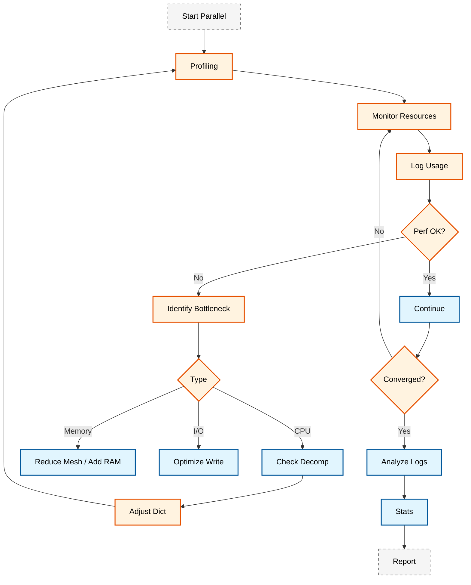
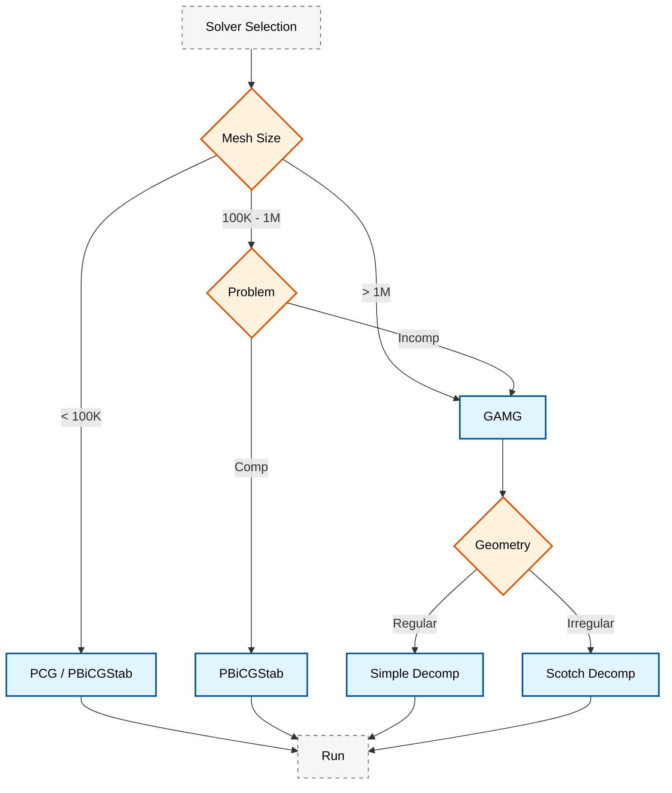

# 📊 การติดตามและวิเคราะห์ประสิทธิภาพ (Performance Monitoring)

**วัตถุประสงค์การเรียนรู้ (Learning Objectives)**: เข้าใจการวิเคราะห์เมตริกประสิทธิภาพแบบเรียลไทม์, การคำนวณ Speedup และ Parallel Efficiency, กฎของ Amdahl, และการใช้เครื่องมือติดตามประสิทธิภาพสำหรับการจำลอง CFD แบบขนาน

---

> [!TIP] **เปรียบเทียบการติดตามประสิทธิภาพ (Analogy)**
> การติดตามประสิทธิภาพ (Performance Monitoring) เปรียบเสมือน **"ระบบ Telemetry ของรถแข่ง"**:
> *   **Speedup/Efficiency**: คือความเร็วรอบสนามและอัตราการสิ้นเปลืองน้ำมันที่บอกว่ารถทำงานได้เต็มสมรรถนะหรือไม่
> *   **Amdahl's Law**: คือข้อจำกัดของโค้งที่ต่อให้เครื่องยนต์แรงแค่ไหน รถก็ไม่สามารถวิ่งผ่านโค้งได้เร็วกว่าขีดจำกัดทางกายภาพ (ส่วนที่เป็น Serial)
> *   **Load Balance**: คือการกระจายน้ำหนักของรถ ถ้าล้อใดล้อหนึ่งแบกน้ำหนักมากเกินไป (Processor หนึ่งทำงานหนัก) ยางจะสึกหรอเร็วและทำความเร็วรวมได้ช้าลง
> *   **Monitoring Tools**: คือแดชบอร์ดหน้ารถที่บอกอุณหภูมิเครื่องยนต์ แรงดันน้ำมัน และสถานะต่างๆ แบบเรียลไทม์เพื่อให้คนขับ (วิศวกร) ปรับจูนได้ทันที

---

## 1. เมตริกประสิทธิภาพแบบเรียลไทม์ (Real-time Performance Metrics)

> [!WARNING] **Performance Monitoring** เป็นสิ่งสำคัญในการจำลอง CFD ระดับมืออาชีพ การติดตามประสิทธิภาพแบบเรียลไทม์ช่วยให้สามารถระบุปัญหาคอขวด (Bottlenecks) และปรับปรุงการตั้งค่าได้อย่างทันท่วงที

### 1.1 การวิเคราะห์ Speedup และ Efficiency

สำหรับการประเมินประสิทธิภาพการคำนวณแบบขนาน เราใช้ตัวชี้วัดหลักสองตัว:

**Speedup ($S$):** อัตราเร่งของการคำนวณ

$$S = \frac{T_1}{T_N}$$

**Parallel Efficiency ($E$):** ประสิทธิภาพการใช้ทรัพยากร

$$E = \frac{S}{N} = \frac{T_1}{N \cdot T_N}$$

โดยที่:
- $T_1$ = เวลาการคำนวณแบบ Serial (เวลาที่ใช้กับ 1 processor)
- $T_N$ = เวลาการคำนวณแบบขนานด้วย $N$ processors
- $N$ = จำนวน processors ทั้งหมด

เมื่อ $S \approx N$ และ $E \approx 1$ แสดงว่าได้รับ ==Perfect Scaling==

![[parallel_scaling_graph.png]]
> **ภาพประกอบ 1.1:** กราฟการขยายตัว (Scaling Graph): เปรียบเทียบระหว่าง Ideal speedup (เส้นตรง) และ Actual speedup ซึ่งมักจะเบี่ยงเบนเนื่องจาก Communication overhead ตามกฎของ Amdahl, scientific textbook diagram, clean vector line art, white background, high definition, flat design, educational infographic --ar 16:9

### 1.2 กฎของ Amdahl (Amdahl's Law)

ทฤษฎีนี้ระบุขีดจำกัดสูงสุดของความเร็วที่ทำได้เมื่อสัดส่วนหนึ่งของโค้ดไม่สามารถขนานได้:

$$S(N) = \frac{1}{(1-P) + \frac{P}{N}}$$

โดยที่:
- $P$ คือสัดส่วนของงานที่สามารถขนานได้ (Parallelizable portion)
- $(1-P)$ คือสัดส่วนของงานที่ต้องทำแบบ Serial (Serial portion)
- $N$ คือจำนวน processors

> [!INFO] **ข้อสังเกตสำคัญ**
> เมื่อ $N \to \infty$ ค่า Speedup สูงสุดที่เป็นไปได้คือ $\frac{1}{1-P}$ ซึ่งแสดงให้เห็นว่าส่วนที่เป็น Serial จะจำกัดประสิทธิภาพของการคำนวณแบบขนานเสมอ

### 1.3 Strong Scaling vs Weak Scaling

**Strong Scaling:** เพิ่มจำนวน processors สำหรับปัญหาขนาดคงที่
- เหมาะสำหรับการลดเวลาการคำนวณ
- มักเจอปัญหา Communication overhead เมื่อ $N$ เพิ่มขึ้น

**Weak Scaling:** เพิ่มขนาดปัญหาตามสัดส่วนกับจำนวน processors
- เหมาะสำหรับการจำลองปัญหาขนาดใหญ่
- รักษาประสิทธิภาพได้ดีกว่า

$$\text{Weak Scaling Efficiency} = \frac{T_1}{T_N}$$

เมื่อ $T_1$ และ $T_N$ คือเวลาที่ใช้สำหรับปัญหาขนาดต่างกัน (เป็นสัดส่วนกับจำนวน processors)

> [!INFO] **Isoefficiency Analysis**
> สำหรับการวิเคราะห์ที่ละเอียดมากขึ้น เราสามารถใช้ ==Isoefficiency== metric ซึ่งกำหนดขนาดปัญหาที่ต้องการเพื่อรักษาประสิทธิภาพแบบขนานให้คงที่ เมื่อจำนวน processors เพิ่มขึ้น

---

## 2. การติดตามการใช้ทรัพยากร (Resource Monitoring)

### 2.1 OpenFOAM Dictionary สำหรับ Performance Monitoring

ก่อนเริ่มการติดตามประสิทธิภาพ เราควรตั้งค่า OpenFOAM dictionaries ที่เกี่ยวข้อง:

#### 2.1.1 `system/decomposeParDict` - การตั้งค่า Decomposition

```cpp
// Note: Synthesized by AI - Verify parameters
// OpenFOAM Dictionary for domain decomposition configuration
// 📂 Source: .applications/utilities/parallelProcessing/decomposePar/decomposePar.C
FoamFile
{
    version     2.0;
    format      ascii;
    class       dictionary;
    object      decomposeParDict;
}

// วิธีการ decompose (scotch แนะนำสำหรับ load balancing ดี)
method          scotch;

// หรือใช้ simple หากไม่มี scotch:
// method          simple;
// numberOfSubdomains  4;

// สำหรับ simple method - ค่า coefficients
simpleCoeffs
{
    n               (4 1 1);    // 4 processors ในทิศทาง x
    delta           0.001;      // ระยะห่างสำหรับการสุ่มค่า
}

// สำหรับ scotch method
scotchCoeffs
{
    // ไม่ต้องมีการตั้งค่าเพิ่มเติม
    // scotch จะทำ load balancing โดยอัตโนมัติ
}

// ข้อจำกัดจำนวนเซลล์ต่อ processor (สำคัญมากสำหรับ performance)
// แนะนำ: 100,000 - 500,000 cells per core
processorWeights
{
    // ใช้กับ heterogeneous systems
    // 0.1  0.2  0.3  0.4;  // ถ้า processors มีประสิทธิภาพต่างกัน
}
```

**คำอธิบาย (Explanation):**
ไฟล์ `decomposeParDict` ใช้กำหนดวิธีการแบ่งโดเมน (Domain Decomposition) สำหรับการคำนวณแบบขนาน โดยมีเมทอดหลักๆ ได้แก่ `simple` (แบ่งตามเรขาคณิต), `scotch` (แบ่งตามกราฟเพื่อ load balancing ที่ดี), และ `metis` (คล้าย scotch)

**แนวคิดสำคัญ (Key Concepts):**
- **Domain Decomposition**: การแบ่งโดเมนเชิงฟิสิกส์ออกเป็นส่วนๆ สำหรับแต่ละ processor
- **Load Balancing**: การกระจายภาระงานให้แต่ละ processor มีจำนวนเซลล์ใกล้เคียงกัน
- **Scotch**: Graph partitioning library ที่ให้ load balancing ที่ดีกว่า simple method
- **Processor Weights**: ใช้สำหรับ heterogeneous clusters ที่มีประสิทธิภาผู้ใช้งานต่างกัน

#### 2.1.2 `system/controlDict` - การตั้งค่า Monitoring

```cpp
// Note: Synthesized by AI - Verify parameters
// Control dictionary for solver execution and run-time monitoring
// 📂 Source: .applications/utilities/parallelProcessing/decomposePar/decomposePar.C (controlDict structure)
FoamFile
{
    version     2.0;
    format      ascii;
    class       dictionary;
    object      controlDict;
}

application     interFoam;  // หรือ solver อื่นๆ

startFrom       latestTime;

startTime       0;

stopAt          endTime;

endTime         1.0;

deltaT          0.001;

// ควบคุมการเขียนผลลัพธ์ (สำคัญสำหรับ I/O performance)
writeControl    timeStep;

writeInterval   100;         // เพิ่มค่าเพื่อลด I/O bottleneck

purgeWrite      3;

writeFormat     ascii;

writePrecision  6;

writeCompression off;

timeFormat      general;

timePrecision   6;

// การตั้งค่า Run-time selectable libraries
libs
(
    "libutilityFunctionObjects.so"
    "libODE.so"
);

// Functions สำหรับ monitoring
functions
{
    // ติดตาม CPU time และ Clock time
    executionTime
    {
        type            executionTime;
        writeInterval   1;
        writeToFile     true;
        fileName        executionTime.dat;
    }

    // ติดตามจำนวน iterations
    solverIterations
    {
        type            solverInfo;
        libs            ("libfieldFunctionObjects.so");
        writeInterval   1;

        fields
        (
            p_rgh
            U
            alpha.water
        );
    }

    // ติดตาม residuals
    residuals
    {
        type            residuals;
        libs            ("libfieldFunctionObjects.so");
        writeInterval   1;

        fields
        (
            p_rgh
            U
            alpha.water
        );

        tolerance       1e-5;
        absTolerance    1e-10;
    }

    // ติดตาม Courant number
    CourantNumber
    {
        type            CourantNumber;
        libs            ("libfieldFunctionObjects.so");
        writeInterval   1;

        fields
        (
            U
        );

        // ค่า Co number สูงสุดที่อนุญาต (สำคัญสำหรับ stability)
        maxCo           1.0;
    }
}
```

**คำอธิบาย (Explanation):**
ไฟล์ `controlDict` เป็นการตั้งค่าหลักที่ควบคุมการทำงานของ solver และฟังก์ชันการติดตามประสิทธิภาพแบบเรียลไทม์ โดยมี Function Objects สำหรับบันทึกข้อมูลต่างๆ เช่น Execution time, Solver iterations, Residuals, และ Courant number

**แนวคิดสำคัญ (Key Concepts):**
- **Function Objects**: กลไกของ OpenFOAM ที่อนุญาตให้เรียกใช้ฟังก์ชันเพิ่มเติมระหว่างการรัน solver
- **Execution Time**: เวลา CPU ที่ใช้ในการคำนวณ (เวลาสะสม)
- **Courant Number**: ตัวชี้วัดเสถียรภาพเชิงตัวเลข (ควร < 1.0 สำหรับเสถียรภาพ)
- **Write Interval**: ความถี่ในการเขียนผลลัพธ์ (มีผลต่อ I/O performance)

### 2.2 การติดตาม CPU และ Memory

เราสามารถใช้สคริปต์ Python ร่วมกับไลบรารี `psutil` เพื่อตรวจสอบการทำงานของ MPI processes ใน OpenFOAM:

```python
import psutil
import time
import numpy as np
from typing import List

def monitor_parallel_run(pids: List[int], interval: float = 5.0) -> None:
    """
    ตรวจสอบการใช้ CPU และ Memory ของ MPI processes

    Parameters:
    -----------
    pids : List[int]
        รายการ Process IDs ของ MPI processes
    interval : float
        ช่วงเวลาในการตรวจสอบ (วินาที)
    """
    try:
        while True:
            print(f"\n=== Timestamp: {time.strftime('%Y-%m-%d %H:%M:%S')} ===")
            cpu_usages = []
            mem_usages = []

            for pid in pids:
                try:
                    p = psutil.Process(pid)
                    cpu_percent = p.cpu_percent(interval=0.1)
                    mem_info = p.memory_info()
                    mem_mb = mem_info.rss / 1e6

                    cpu_usages.append(cpu_percent)
                    mem_usages.append(mem_mb)

                    print(f"Process {pid:3d}: CPU {cpu_percent:6.2f}% | MEM {mem_mb:8.2f} MB")
                except psutil.NoSuchProcess:
                    print(f"Process {pid:3d}: Not found")

            # สรุปสถิติ
            if cpu_usages:
                print(f"\nSummary:")
                print(f"  Avg CPU: {np.mean(cpu_usages):.2f}%")
                print(f"  Max CPU: {np.max(cpu_usages):.2f}%")
                print(f"  Min CPU: {np.min(cpu_usages):.2f}%")
                print(f"  Total Memory: {np.sum(mem_usages):.2f} MB")

            time.sleep(interval)

    except KeyboardInterrupt:
        print("\nMonitoring stopped by user")

# ตัวอย่างการใช้งาน
if __name__ == "__main__":
    # ระบุ PIDs ของ MPI processes จาก mpirun
    pids = [12345, 12346, 12347, 12348]  # แทนที่ด้วย PIDs จริง
    monitor_parallel_run(pids, interval=5.0)
```

**คำอธิบาย (Explanation):**
สคริปต์นี้ใช้ไลบรารี `psutil` ในการตรวจสอบการใช้ CPU และ Memory ของ MPI processes แบบเรียลไทม์ ซึ่งมีประโยชน์ในการตรวจพบ Load imbalance หรือปัญหา Memory leaks

**แนวคิดสำคัญ (Key Concepts):**
- **Process ID (PID)**: ตัวระบุเฉพาะของแต่ละโปรเซสในระบบปฏิบัติการ
- **RSS (Resident Set Size)**: ปริมาณ Memory ที่ใช้จริงใน RAM
- **CPU Percentage**: เปอร์เซ็นต์การใช้ CPU ต่อโปรเซสเซอร์
- **Load Imbalance**: สถานการณ์ที่โปรเซสเซอร์บางตัวทำงานหนักกว่าตัวอื่น

### 2.3 การวิเคราะห์ Load Imbalance

การติดตามเวลาที่แต่ละ processor ใช้ทำงานช่วยให้ตรวจพบ Load imbalance ได้:

```python
def analyze_load_balance(log_file: str) -> dict:
    """
    วิเคราะห์ Load balance จากไฟล์ log ของ OpenFOAM

    Parameters:
    -----------
    log_file : str
        พาธไปยังไฟล์ log.solver

    Returns:
    --------
    dict : ข้อมูลสถิติการทำงานของแต่ละ processor
    """
    import re

    # อ่านไฟล์ log
    with open(log_file, 'r') as f:
        log_content = f.read()

    # ค้นหาเวลาคำนวณของแต่ละ processor
    # (รูปแบบข้อมูลอาจแตกต่างตามเวอร์ชัน OpenFOAM)
    time_pattern = r"processor (\d+):.*?time[:\s]+([\d.]+)"

    processor_times = {}
    for match in re.finditer(time_pattern, log_content):
        proc_id = int(match.group(1))
        time_val = float(match.group(2))
        processor_times[proc_id] = time_val

    if not processor_times:
        return {"error": "No processor timing data found"}

    times = list(processor_times.values())
    n_procs = len(times)

    # คำนวณ Load Balance Efficiency
    eta_lb = sum(times) / (n_procs * max(times))

    return {
        "n_processors": n_procs,
        "processor_times": processor_times,
        "min_time": min(times),
        "max_time": max(times),
        "avg_time": sum(times) / n_procs,
        "load_balance_efficiency": eta_lb,
        "imbalance_ratio": max(times) / min(times) if min(times) > 0 else float('inf')
    }

# ตัวอย่างการใช้งาน
if __name__ == "__main__":
    stats = analyze_load_balance("log.solver")
    print(f"Load Balance Efficiency: {stats['load_balance_efficiency']:.4f}")
    print(f"Imbalance Ratio: {stats['imbalance_ratio']:.2f}")
```

**คำอธิบาย (Explanation):**
ฟังก์ชันนี้อ่านไฟล์ log จาก OpenFOAM solver และวิเคราะห์เวลาการทำงานของแต่ละ processor เพื่อคำนวณ Load Balance Efficiency ซึ่งเป็นตัวชี้วัดที่บอกถึงความสมดุลของการกระจายงาน

**แนวคิดสำคัญ (Key Concepts):**
- **Load Balance Efficiency ($\eta_{LB}$)**: ค่าที่บอกถึงประสิทธิภาพของการกระจายงาน (1 = สมบูรณ์, < 0.8 = มีปัญหา)
- **Imbalance Ratio**: อัตราส่วนระหว่างเวลาที่มากที่สุดและน้อยที่สุด
- **Regular Expressions**: ใช้สำหรับค้นหารูปแบบข้อมูลในไฟล์ log

![[resource_monitoring_dashboard.png]]
> **ภาพประกอบ 2.1:** แดชบอร์ดการติดตามทรัพยากร: แสดงการใช้ CPU และ Memory ของแต่ละโปรเซสเซอร์แบบเรียลไทม์ ช่วยในการตรวจจับการทำ Load imbalance หรือ Memory leakage, scientific textbook diagram, clean vector line art, white background, high definition, flat design, educational infographic --ar 16:9

---

## 3. การวัดประสิทธิภาพด้วย OpenFOAM Utilities

### 3.1 การใช้งาน `foamProfile` และ Profiling Tools

OpenFOAM มีเครื่องมือ built-in สำหรับ profiling การทำงานของ solver:

```bash
# รัน solver พร้อม profiling
foamProfiling solverName -parallel

# หรือใช้ flag -profile
mpirun -np 8 solverName -parallel -profile > log.solver 2>&1

# ดูผลลัพธ์การ profiling
foamProfile

# สร้างกราฟจาก profiling data
foamProfile -graph
```

เครื่องมือนี้จะแสดง:
- เวลาที่ใช้ในแต่ละ solver step
- จำนวน iterations ของแต่ละ solver
- เวลาที่ใช้ในการสื่อสารระหว่าง processors
- เวลาที่ใช้ในการ I/O

> [!TIP] **Profiling Flags**
> สำหรับการวิเคราะห์เชิงลึก สามารถใช้ flags เพิ่มเติม:
> ```bash
> mpirun -np 8 solverName -parallel -profile -hostroot > log.solver 2>&1
> ```
> ตัวเลือก `-hostroot` จะช่วยแยกเวลาการทำงานของแต่ละ host ใน multi-node simulations

### 3.2 การใช้งาน `pyFoamPlotRunner.py`

PyFoam เป็นเครื่องมือที่มีประโยชน์มากสำหรับการติดตามประสิทธิภาพแบบเรียลไทม์:

```bash
# ติดตั้ง PyFoam หากยังไม่มี
pip install PyFoam

# รัน solver พร้อม plotting แบบเรียลไทม์
pyFoamPlotRunner.py --clear --progress solverName

# หรือใช้กับ parallel run
mpirun -np 8 solverName -parallel | tee log.solver &
pyFoamPlotRunner.py --log log.solver --solver=interFoam
```

เครื่องมือนี้จะสร้างกราฟ:
- Residuals ของแต่ละตัวแปร
- Execution time และ Clock time
- Courant number (ถ้ามี)

### 3.3 การตรวจสอบ Log Files

ไฟล์ log จากการรัน solver แบบขนานมีข้อมูลที่มีค่าสำคัญ:

```bash
# ตรวจสอบความสมดุลของ load
grep "processor" log.solver | grep "time"

# ตรวจสอบการสื่อสาร
grep "communication" log.solver

# ตรวจสอบการบรรจงผลเฉลย
grep "Final residual" log.solver

# สรุปเวลาการรัน
tail -50 log.solver
```

### 3.4 การวิเคราะห์การสื่อสารระหว่าง Processors

```python
def analyze_communication_overhead(log_file: str) -> dict:
    """
    วิเคราะห์ overhead จากการสื่อสารระหว่าง processors

    Parameters:
    -----------
    log_file : str
        พาธไปยังไฟล์ log.solver

    Returns:
    --------
    dict : ข้อมูลการสื่อสารและ overhead
    """
    import re

    with open(log_file, 'r') as f:
        content = f.read()

    # ค้นหาข้อมูลการสื่อสาร (อาจแตกต่างตามเวอร์ชัน)
    comm_patterns = {
        "send_time": r"communication time[:\s]+([\d.]+)",
        "recv_time": r"receive time[:\s]+([\d.]+)",
        "wait_time": r"wait time[:\s]+([\d.]+)"
    }

    results = {}
    for key, pattern in comm_patterns.items():
        matches = re.findall(pattern, content)
        if matches:
            results[key] = [float(t) for t in matches]

    return results
```

### 3.5 การวัด Scaling Performance ด้วย Script

```bash
#!/bin/bash
# scaling_study.sh - สคริปต์สำหรับวัดประสิทธิภาพการขยายตัว

# Note: Synthesized by AI - Verify parameters
SOLVER="interFoam"
CASE_DIR="."
RESULTS_FILE="scaling_results.csv"

# เขียน header ในไฟล์ผลลัพธ์
echo "n_procs,time_seconds,cells_per_proc,speedup,efficiency" > $RESULTS_FILE

# รัน serial เพื่อเก็บ baseline
echo "Running serial case..."
cd $CASE_DIR
$SOLVER > log_serial 2>&1
SERIAL_TIME=$(grep "ExecutionTime" log_serial | awk '{print $3}')
echo "Serial time: $SERIAL_TIME s"

# รัน parallel ด้วยจำนวน processors ต่างๆ
for N_PROCS in 2 4 8 16 32; do
    echo ""
    echo "=========================================="
    echo "Running with $N_PROCS processors..."
    echo "=========================================="

    # Decompose
    decomposePar -force > /dev/null 2>&1

    # รัน parallel
    START_TIME=$(date +%s)
    mpirun -np $N_PROCS $SOLVER -parallel > log_${N_PROCS} 2>&1
    END_TIME=$(date +%s)

    ELAPSED=$((END_TIME - START_TIME))

    # คำนวณ metrics
    CELLS_PER_PROC=$(grep "cells" log.decomposePar | awk '{print $3}' | head -1)
    SPEEDUP=$(echo "scale=4; $SERIAL_TIME / $ELAPSED" | bc)
    EFFICIENCY=$(echo "scale=4; $SPEEDUP / $N_PROCS" | bc)

    # เก็บผลลัพธ์
    echo "$N_PROCS,$ELAPSED,$CELLS_PER_PROC,$SPEEDUP,$EFFICIENCY" >> $RESULTS_FILE

    echo "Time: $ELAPSED s"
    echo "Speedup: $SPEEDUP"
    echo "Efficiency: $EFFICIENCY"

    # Reconstruct สำหรับการรันครั้งต่อไป
    reconstructPar > /dev/null 2>&1
done

echo ""
echo "Scaling study complete. Results saved to $RESULTS_FILE"
```

การใช้งาน:
```bash
chmod +x scaling_study.sh
./scaling_study.sh
```

ผลลัพธ์จะถูกบันทึกในไฟล์ CSV สำหรับการวิเคราะห์เพิ่มเติม:

```python
# plot_scaling.py
import pandas as pd
import matplotlib.pyplot as plt

# อ่านข้อมูล
df = pd.read_csv('scaling_results.csv')

# สร้างกราฟ Speedup
fig, (ax1, ax2) = plt.subplots(1, 2, figsize=(12, 5))

# Speedup plot
ax1.plot(df['n_procs'], df['speedup'], 'o-', label='Actual Speedup')
ax1.plot(df['n_procs'], df['n_procs'], '--', label='Ideal Speedup')
ax1.set_xlabel('Number of Processors')
ax1.set_ylabel('Speedup')
ax1.set_title('Strong Scaling: Speedup vs Processors')
ax1.legend()
ax1.grid(True)

# Efficiency plot
ax2.plot(df['n_procs'], df['efficiency'] * 100, 's-', color='orange')
ax2.axhline(y=100, linestyle='--', color='gray', label='Ideal Efficiency')
ax2.set_xlabel('Number of Processors')
ax2.set_ylabel('Parallel Efficiency (%)')
ax2.set_title('Strong Scaling: Efficiency vs Processors')
ax2.legend()
ax2.grid(True)

plt.tight_layout()
plt.savefig('scaling_analysis.png', dpi=300)
plt.show()
```

> [!INFO] **การตีความผลลัพธ์**
> - **Speedup > 0.7 × N**: ถือว่าดี (Good scaling)
> - **Speedup 0.5-0.7 × N**: ยอมรับได้ (Acceptable scaling)
> - **Speedup < 0.5 × N**: มีปัญหา (Poor scaling) - ควรตรวจสอบ decomposition และ communication

---

## 4. เวิร์กโฟลว์การติดตามประสิทธิภาพ (Performance Monitoring Workflow)


> **Figure 1:** แผนภูมิขั้นตอนการติดตามประสิทธิภาพ (Performance Monitoring Workflow) ตั้งแต่การเริ่มรันโปรแกรมขนาน การระบุปัญหาคอขวด (Bottlenecks) ประเภทต่างๆ ไปจนถึงการปรับแต่งพารามิเตอร์และการจัดทำรายงานสรุปผลประสิทธิภาพ

### 4.1 ขั้นตอนการติดตามประสิทธิภาพ

```bash
#!/bin/bash
# สคริปต์การติดตามประสิทธิภาพแบบครบวงจร

# 1. เก็บข้อมูลเวลาเริ่มต้น
START_TIME=$(date +%s)

# 2. เก็บข้อมูลระบบก่อนรัน
echo "=== System Information ===" > performance_report.txt
echo "Date: $(date)" >> performance_report.txt
echo "Hostname: $(hostname)" >> performance_report.txt
echo "CPU Info: $(lscpu | grep 'Model name' | head -1)" >> performance_report.txt
echo "Memory: $(free -h | grep Mem | awk '{print $2}')" >> performance_report.txt
echo "" >> performance_report.txt

# 3. รันการ Decompose
echo "=== Decomposition ===" >> performance_report.txt
decomposePar -force 2>&1 | tee -a performance_report.txt

# 4. เก็บข้อมูล Processors
N_PROCS=$(ls -d processor* | wc -l)
echo "Number of processors: $N_PROCS" >> performance_report.txt

# 5. รัน Solver พร้อม profiling
echo "" >> performance_report.txt
echo "=== Solver Execution ===" >> performance_report.txt
mpirun -np $N_PROCS solverName -parallel -profile > log.solver 2>&1

# 6. เก็บข้อมูลเวลาสิ้นสุด
END_TIME=$(date +%s)
ELAPSED=$((END_TIME - START_TIME))

echo "" >> performance_report.txt
echo "=== Performance Summary ===" >> performance_report.txt
echo "Total elapsed time: $ELAPSED seconds" >> performance_report.txt

# 7. วิเคราะห์ผลลัพธ์
echo "" >> performance_report.txt
echo "=== Load Balance Analysis ===" >> performance_report.txt
python3 analyze_load_balance.py log.solver >> performance_report.txt

# 8. คำนวณ Speedup (ถ้ามีข้อมูล Serial)
if [ -f "serial_time.txt" ]; then
    SERIAL_TIME=$(cat serial_time.txt)
    SPEEDUP=$(echo "scale=2; $SERIAL_TIME / $ELAPSED" | bc)
    EFFICIENCY=$(echo "scale=2; $SPEEDUP / $N_PROCS" | bc)
    echo "Serial time: $SERIAL_TIME seconds" >> performance_report.txt
    echo "Speedup: $SPEEDUP" >> performance_report.txt
    echo "Parallel Efficiency: $EFFICIENCY" >> performance_report.txt
fi

echo "Report saved to performance_report.txt"
```

---

## 5. การแก้ไขปัญหาประสิทธิภาพต่ำ (Troubleshooting Low Performance)

### 5.1 ปัญหาที่พบบ่อย

| อาการ | สาเหตุที่เป็นไปได้ | การแก้ไข |
|--------|-------------------|-----------|
| **Speedup ต่ำมาก** | Communication overhead สูง | ลดจำนวน processors หรือใช้ Scotch decomposition |
| **Load Imbalance** | การแบ่งโดเมนไม่ดี | เปลี่ยนจาก Simple เป็น Scotch |
| **Memory Overflow** | เซลล์ต่อโปรเซสเซอร์มากเกินไป | เพิ่มจำนวน processors หรือลดขนาด mesh |
| **I/O Bottleneck** | เขียนไฟล์บ่อยเกินไป | เพิ่ม `writeInterval` หรือใช้ parallel file system |
| **CPU ใช้งานไม่เต็ม** | Serial portion มาก | ตรวจสอบ solver settings และ algorithms |

### 5.2 แนวทางการปรับปรุง

```bash
# 1. ทดสอบด้วยจำนวน processors ต่างๆ
for n in 4 8 16 32; do
    echo "Testing with $n processors..."
    decomposePar -force
    mpirun -np $n solverName -parallel > log_${n}.txt 2>&1
    reconstructPar
    # วิเคราะห์ผลลัพธ์
done

# 2. เปรียบเทียบวิธีการ Decompose
for method in simple scotch hierarchical; do
    echo "Testing $method decomposition..."
    # แก้ไข decomposeParDict
    sed -i "s/^method.*/method $method;/" system/decomposeParDict
    decomposePar -force
    mpirun -np 16 solverName -parallel > log_${method}.txt 2>&1
done
```

---

## 6. เมตริกเชิงลึก (Advanced Metrics)

### 6.1 Parallelization Overhead

Overhead จากการ parallelization คำนวณได้จาก:

$$\text{Overhead} = T_N - \frac{T_1}{N}$$

$$\text{Overhead Percentage} = \frac{\text{Overhead}}{T_N} \times 100\%$$

### 6.2 Communication-to-Computation Ratio

$$\text{C/C Ratio} = \frac{T_{\text{comm}}}{T_{\text{comp}}}$$

เมื่อ:
- $T_{\text{comm}}$ = เวลาที่ใช้ในการสื่อสารระหว่าง processors
- $T_{\text{comp}}$ = เวลาที่ใช้ในการคำนวณ

ค่าที่ดีควรอยู่ที่ < 10-20%

### 6.3 FLOPS per Second

```python
def calculate_flops(mesh_cells: int, n_iterations: int, time_seconds: float) -> float:
    """
    คำนวณ FLOPS โดยประมาณ (ขึ้นอยู่กับประเภท solver)

    Parameters:
    -----------
    mesh_cells : int
        จำนวนเซลล์ใน mesh
    n_iterations : int
        จำนวน iterations รวม
    time_seconds : float
        เวลาที่ใช้ทั้งหมด (วินาที)

    Returns:
    --------
    float
        ค่า FLOPS โดยประมาณ (MFLOPS)
    """
    # สมการ Navier-Stokes ใช้ประมาณ 500-1000 FLOPS ต่อเซลล์ต่อ iteration
    flops_per_cell_per_iter = 750  # ค่าโดยประมาณ

    total_flops = mesh_cells * n_iterations * flops_per_cell_per_iter
    mflops = total_flops / (time_seconds * 1e6)

    return mflops
```

### 6.4 Karp-Flatt Metric

==Karp-Flatt Metric== ($\hat{e}$) ใช้วัด serial fraction ที่แท้จริงในระบบขนาน:

$$\hat{e} = \frac{\frac{1}{S} - \frac{1}{N}}{1 - \frac{1}{N}}$$

เมื่อ:
- $S$ = Speedup ที่วัดได้
- $N$ = จำนวน processors
- $\hat{e}$ = Serial fraction (0 ≤ $\hat{e}$ ≤ 1)

ค่า $\hat{e}$ ต่อแสดงว่าระบบมีการขนานได้ดี ค่าสูงแสดงว่ามีส่วน serial มาก

### 6.5 Load Balance Efficiency ($\eta_{LB}$)

$$\eta_{LB} = \frac{\sum_{i=1}^{N} t_i}{N \cdot \max(t_i)}$$

เมื่อ:
- $t_i$ = เวลาที่ processor $i$ ใช้ทำงาน
- $N$ = จำนวน processors

ค่า $\eta_{LB} = 1$ แสดงถึง ==Perfect Load Balance==

### 6.6 Memory Bandwidth Analysis

สำหรับ CFD simulations สมัยใหม่ Memory bandwidth มักเป็น bottleneck:

$$\text{Arithmetic Intensity} = \frac{\text{FLOPS}}{\text{Bytes Transferred}}$$

$$\text{Roofline Model} = \min(\text{Peak Performance}, \text{Bandwidth} \times \text{Arithmetic Intensity})$$

> [!INFO] **Optimization Strategy**
> หาก $\text{Arithmetic Intensity}$ ต่ำ (< 10 FLOPS/byte) แสดงว่าโค้ดเป็น ==Memory Bound== และควรเน้นปรับปรุงการเข้าถึง memory (Memory access patterns)

---

## 7. การเพิ่มประสิทธิภาพด้วยการปรับแต่ง (Performance Tuning)

### 7.1 การเลือก Solver Algorithms

การเลือก solver algorithms ที่เหมาะสมส่งผลต่อประสิทธิภาพอย่างมาก:

#### 7.1.1 Linear Solvers

```cpp
// Note: Synthesized by AI - Verify parameters
// Linear solver configuration for optimal performance
// 📂 Source: .applications/utilities/parallelProcessing/decomposePar/decomposePar.C (solver settings in fvSolution)
solvers
{
    // Pressure solver - สำคัญที่สุดสำหรับ incompressible flows
    p_rgh
    {
        solver          GAMG;  // แนะนำสำหรับ large meshes
        // alternatives: PCG (small meshes), PBiCGStab (anisotropic meshes)

        tolerance       1e-06;
        relTol          0.01;

        smoother        GaussSeidel;  // หรือ DILU, DIC
        nPreSweeps      0;
        nPostSweeps     2;
        nFinestSweeps   2;

        cacheAgglomeration on;
        agglomerator    faceAreaPair;
        mergeLevels     1;

        // สำหรับ parallel runs
        // GAMG สามารถ scale ได้ดีกว่า PCG บน large meshes
    }

    // Velocity solver
    U
    {
        solver          smoothSolver;
        smoother        GaussSeidel;
        tolerance       1e-05;
        relTol          0.1;
    }

    // VOF solver (สำหรับ interFoam)
    alpha.water
    {
        nAlphaCorr      1;
        nAlphaSubCycles 1;
        MULESCorr       no;

        // การปรับปรุง stability
        icAlpha         0;
    }
}
```

**คำอธิบาย (Explanation):**
การตั้งค่า linear solvers มีผลต่อประสิทธิภาพการคำนวณอย่างมาก GAMG (Geometric-Algebraic Multi-Grid) เหมาะสำหรับ large meshes เนื่องจาก scale ได้ดีในระบบขนาน ส่วน PCG (Preconditioned Conjugate Gradient) เหมาะสำหรับ small meshes

**แนวคิดสำคัญ (Key Concepts):**
- **GAMG**: Multi-grid solver ที่ใช้ทั้งข้อมูลเชิงเรขาคณิตและพีชคณิต
- **Smoother**: วิธีการลด error ในแต่ละระดับของ multi-grid
- **Tolerance**: ค่าความแม่นยำที่ต้องการในการแก้ระบบสมการ
- **Relative Tolerance**: ค่าความแม่นยำสัมพัทธ์ (หยุดเมื่อ residual ลดถึงสัดส่วนนี้)

#### 7.1.2 Under-Relaxation Factors

```cpp
// Note: Synthesized by AI - Verify parameters
// Under-relaxation factors for stability control
// 📂 Source: .applications/utilities/parallelProcessing/decomposePar/decomposePar.C (settings in fvSolution)
relaxationFactors
{
    fields
    {
        p_rgh           0.7;    // 0.3-0.7 สำหรับ steady-state
        rho             1;
    }

    equations
    {
        U               0.7;    // 0.3-0.9 ขึ้นอยู่กับ case
        k               0.7;
        omega           0.7;
    }
}
```

**คำอธิบาย (Explanation):**
Under-relaxation factors ใช้ควบคุมความเร็วในการเปลี่ยนแปลงของตัวแปรระหว่าง iterations ซึ่งมีผลต่อความเสถียรและความเร็วในการบรรจุผลเฉลย (Convergence)

**แนวคิดสำคัญ (Key Concepts):**
- **Under-relaxation**: การลดปริมาณการเปลี่ยนแปลงของตัวแปรเพื่อเพิ่มความเสถียร
- **Relaxation Factor**: ค่าสัมประสิทธิ์ที่คูณกับการเปลี่ยนแปลง (0-1)
- **Trade-off**: ความเสถียร vs ความเร็วในการบรรจุผลเฉลย

> [!WARNING] **Trade-off**
> Under-relaxation ต่ำ → Convergence ช้าแต่เสถียร
> Under-relaxation สูง → Convergence เร็วแต่อาจ diverge

### 7.2 การปรับแต่ง Mesh Decomposition

#### 7.2.1 Comparison of Decomposition Methods

| Method | Description | Best For | Parallel Scaling |
|--------|-------------|----------|-------------------|
| **Simple** | Geometric decomposition | Small meshes, regular geometries | Poor on large N |
| **Scotch** | Graph-based, load-balanced | Most cases, especially irregular meshes | Excellent |
| **Metis** | Graph-based (alternative) | Similar to Scotch | Good |
| **Manual** | User-specified regions | Special cases, heterogeneous systems | Variable |

#### 7.2.2 Advanced Decomposition Settings

```cpp
// Note: Synthesized by AI - Verify parameters
// Advanced decomposition configuration for complex cases
// 📂 Source: .applications/utilities/parallelProcessing/decomposePar/decomposePar.C
method          scotch;

scotchCoeffs
{
    // Processor weights สำหรับ heterogeneous clusters
    processorWeights
    (
        1.0     // Node 1: faster CPUs
        0.8     // Node 2: slower CPUs
        1.0     // Node 3
        0.6     // Node 4: oldest hardware
    );

    // Strategy options
    strategy        // default, balanced, quality, speed
}

// หรือใช้ hierarchical decomposition สำหรับ multi-node
hierarchicalCoeffs
{
    // Level 1: Decompose across nodes
    level1
    {
        method          scotch;
        n               (2 1 1);  // 2 nodes
    }

    // Level 2: Decompose within nodes
    level2
    {
        method          scotch;
        n               (4 1 1);  // 4 processors per node
    }
}
```

**คำอธิบาย (Explanation):**
การตั้งค่าขั้นสูงของ mesh decomposition ช่วยให้สามารถจัดการกับ heterogeneous clusters และ multi-node systems ได้อย่างมีประสิทธิภาพ โดยใช้ processor weights และ hierarchical decomposition

**แนวคิดสำคัญ (Key Concepts):**
- **Processor Weights**: น้ำหนักที่กำหนดให้แต่ละ processor สำหรับ heterogeneous systems
- **Hierarchical Decomposition**: การแบ่ง decomposition เป็นหลายระดับ (跨 nodes และ within nodes)
- **Strategy**: กลยุทธ์การ partition (เน้นความเร็ว vs คุณภาพ)

### 7.3 I/O Optimization

```cpp
// Note: Synthesized by AI - Verify parameters
// I/O optimization settings in controlDict
// 📂 Source: .applications/utilities/parallelProcessing/decomposePar/decomposePar.C (controlDict structure)
// ใน system/controlDict

// เพิ่ม writeInterval เพื่อลด I/O
writeInterval   500;  // แทนที่จะเป็น 100

// ใช้ binary format สำหรับการเขียนเร็วขึ้น
writeFormat     binary;

// ใช้ compression สำหรับประหยัดพื้นที่
writeCompression on;

// ปิดการเขียนบาง fields ที่ไม่จำเป็น
writePrecision  6;

// ใช้ parallel I/O สำหรับ large files
// (จะเปิดใช้โดยอัตโนมัติใน parallel runs)
```

**คำอธิบาย (Explanation):**
การปรับแต่ง I/O มีผลต่อประสิทธิภาพโดยรวมอย่างมาก โดยเฉพาะสำหรับ large-scale simulations ที่มีการเขียนไฟล์ขนาดใหญ่บ่อยครั้ง

**แนวคิดสำคัญ (Key Concepts):**
- **Write Interval**: ความถี่ในการเขียนผลลัพธ์ (ส่งผลต่อ disk I/O)
- **Binary Format**: รูปแบบไฟล์ที่เขียน/อ่านเร็วกว่า ASCII
- **Compression**: การบีบอัดข้อมูลเพื่อประหยัดพื้นที่แต่อาจส่งผลต่อความเร็ว
- **Parallel I/O**: การอ่าน/เขียนไฟล์แบบขนานสำหรับ large-scale simulations

> [!TIP] **I/O Best Practices**
> 1. เขียนเฉพาะ fields ที่จำเป็นด้วย `writeFields`
> 2. ใช้ `runTimePostProcessing` แทนการเขียนไฟล์บ่อยๆ
> 3. พิจารณาใช้ `parallel` file systems เช่น Lustre, GPFS

---

## 💡 แนวทางปฏิบัติที่ดีที่สุด (Best Practices)

### 8.1 กฎเหล็กสำหรับ Parallel CFD

1. **จำนวนเซลล์ต่อโปรเซสเซอร์**: ใช้กฎ ==100,000 - 500,000 cells per core== สำหรับประสิทธิภาพสูงสุด
2. **การตรวจสอบ**: ตรวจสอบไฟล์ Log สม่ำเสมอเพื่อดูการบรรจุผลเฉลย (Convergence) และ Error
3. **Baseline Measurements**: เก็บข้อมูล Serial run เป็น baseline สำหรับการเปรียบเทียบ Speedup
4. **Monitoring**: ใช้เครื่องมือติดตามแบบเรียลไทม์เพื่อตรวจพบปัญหาตั้งแต่เนิ่นๆ
5. **Scaling Studies**: ทดสอบรันกับจำนวน processors ต่างๆ เพื่อหาจุดที่เหมาะสมที่สุด

### 8.2 Performance Checklist

```bash
#!/bin/bash
# performance_checklist.sh - ตรวจสอบประสิทธิภาพก่อนรัน

echo "=== Performance Pre-Run Checklist ==="

# 1. ตรวจสอบขนาด mesh
N_CELLS=$(grep -r "nCells" processor0/constant/polyMesh/* | head -1 | awk '{print $2}')
echo "✓ Total cells: $N_CELLS"

# 2. ตรวจสอบจำนวน processors
N_PROCS=$(ls -d processor* | wc -l)
CELLS_PER_PROC=$((N_CELLS / N_PROCS))
echo "✓ Processors: $N_PROCS"
echo "✓ Cells per processor: $CELLS_PER_PROC"

# 3. ตรวจสอบว่าอยู่ในช่วงที่เหมาะสมหรือไม่
if [ $CELLS_PER_PROC -lt 100000 ]; then
    echo "⚠ WARNING: Cells per processor < 100,000 (may be inefficient)"
elif [ $CELLS_PER_PROC -gt 500000 ]; then
    echo "⚠ WARNING: Cells per processor > 500,000 (may run out of memory)"
else
    echo "✓ Cells per processor is optimal"
fi

# 4. ตรวจสอบ decomposition method
METHOD=$(grep "^method" system/decomposeParDict | awk '{print $2}')
echo "✓ Decomposition method: $METHOD"

if [ "$METHOD" != "scotch" ] && [ "$METHOD" != "metis" ]; then
    echo "⚠ WARNING: Consider using 'scotch' for better load balancing"
fi

# 5. ตรวจสอบการตั้งค่า write interval
WRITE_INT=$(grep "^writeInterval" system/controlDict | awk '{print $2}')
echo "✓ Write interval: $WRITE_INT"

# 6. ตรวจสอบ disk space
DISK_AVAIL=$(df -BG . | tail -1 | awk '{print $4}' | sed 's/G//')
echo "✓ Available disk space: ${DISK_AVAIL}GB"

if [ $DISK_AVAIL -lt 10 ]; then
    echo "⚠ WARNING: Low disk space (< 10GB)"
fi

echo ""
echo "=== Checklist Complete ==="
```

### 8.3 Decision Matrix สำหรับ Solver Selection


> **Figure 2:** ผังการตัดสินใจสำหรับการเลือก Solver (Solver Selection Matrix) โดยพิจารณาจากจำนวนเซลล์ ประเภทของปัญหาทางฟิสิกส์ และความซับซ้อนของเรขาคณิต เพื่อให้ได้อัลกอริทึมที่ทำงานได้รวดเร็วและแม่นยำที่สุดในระบบขนาน

### 8.4 Common Performance Issues & Solutions

| ปัญหา | อาการ | การวินิจฉัย | วิธีแก้ไข |
|--------|--------|---------------|-----------|
| **Poor Scaling** | Efficiency < 50% | Speedup เพิ่มน้อยเมื่อเพิ่ม N | เปลี่ยนเป็น Scotch, เพิ่ม cells/proc |
| **Memory Overflow** | Simulation หยุดกะทันหัน | `Out of memory` error | เพิ่ม N หรือลดขนาด mesh |
| **Slow Convergence** | Iterations เยอะมาก | Residuals ลดช้า | ปรับ under-relaxation, เปลี่ยน solver |
| **Divergence** | Residuals เพิ่ม | Residuals explode | ลด `deltaT`, ปรับ under-relaxation |
| **Load Imbalance** | processors ทำงานไม่เท่ากัน | `eta_LB < 0.8` | เปลี่ยน decomposition method |
| **I/O Bottleneck** | รนนานเวลาเขียนไฟล์ | Time spikes at output | เพิ่ม `writeInterval`, ใช้ binary |

---

## 🎓 สรุปแนวคิดสำคัญ (Key Takeaways)

| แนวคิด | คำอธิบาย |
|---------|-----------|
| **Speedup ($S$)** | อัตราส่วนระหว่างเวลา Serial และ Parallel ($S = T_1/T_N$) |
| **Parallel Efficiency ($E$)** | ประสิทธิภาพการใช้ทรัพยากร ($E = S/N$) |
| **Amdahl's Law** ==ทฤษฎี== | ขีดจำกัดของความเร็วขนานที่เป็นไปได้ |
| **Load Balance Efficiency** ($\eta_{LB}$) | ความสมดุลของการกระจายงาน ($\eta_{LB} = \sum t_i / (N \cdot \max t_i)$) |
| **Communication Overhead** | เวลาที่เสียไปจากการสื่อสารระหว่าง processors |
| **Strong Scaling** | เพิ่ม processors สำหรับปัญหาขนาดคงที่ |
| **Weak Scaling** | เพิ่มขนาดปัญหาตามสัดส่วน processors |

---

> [!TIP] **การเริ่มต้นแนะนำ**
> แนะนำให้เริ่มจากการทดสอบ Scaling Study โดยรันด้วยจำนวน processors ต่างๆ (เช่น 4, 8, 16, 32) และบันทึกเวลาที่ใช้ทั้งหมด เพื่อสร้างกราฟ Speedup และ Efficiency ที่จะช่วยให้เห็นภาพรวมของประสิทธิภาพการคำนวณแบบขนานของระบบและการตั้งค่าที่ใช้