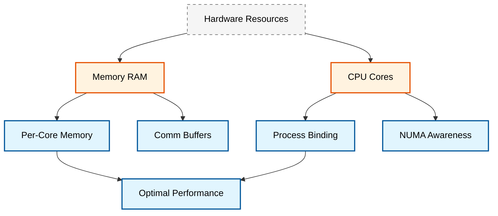
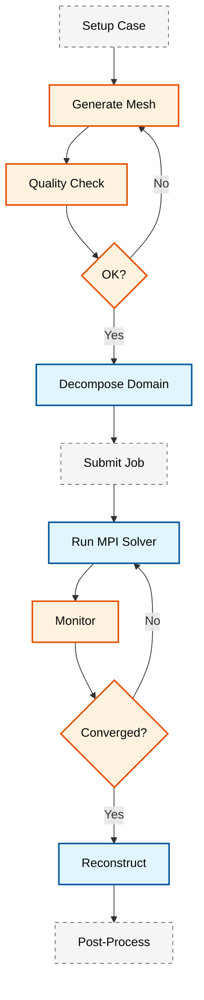

# 🏗️ การรวมเข้ากับระบบ HPC (HPC Integration)

**วัตถุประสงค์การเรียนรู้ (Learning Objectives)**: เข้าใจระบบจัดตารางงาน (Job Scheduling), การจัดการทรัพยากรบนระบบคลัสเตอร์, การใช้งาน SLURM/PBS, และเวิร์กโฟลว์แบบครบวงจรบน HPC systems

> [!TIP] **เปรียบเทียบระบบ HPC (Analogy)**
> ให้คิดว่า **HPC Cluster** คือ **"ครัวขนาดใหญ่ของภัตตาคารหรู"**
> - **Compute A Node** คือ **"สเตชั่นทำอาหาร"** 1 โต๊ะ
> - **Job Scheduler (SLURM)** คือ **"ผู้จัดการครัว (Chef de Cuisine)"** ที่คอยรับออเดอร์ (Job) และจัดสรรว่าออเดอร์ไหนจะทำที่สเตชั่นไหน เพื่อให้ทุกสเตชั่นทำงานได้เต็มที่ ไม่ว่างงาน
> - **MPI Communication** คือ **"การตะโกนสื่อสาร"** ระหว่างเชฟที่ต้องทำเมนูเดียวกันร่วมกัน ถ้ายิ่งเชฟอยู่ไกลกัน (คนละ Node) ก็ยิ่งตะโกนลำบาก (Latency สูง)
> - **Storage** คือ **"ตู้เย็นเก็บวัตถุดิบ"** ถ้าทุกคนแย่งกันเปิดตู้เย็นใบเดียว (NFS Bottleneck) ครัวก็จะวุ่นวายและช้าลง

---

## 1. รากฐานของระบบ HPC (HPC Fundamentals)
...
(keep existing content until Performance Metrics section)
...
### 8.3 การวัดประสิทธิภาพ (Performance Benchmarks)

> [!INFO] **Performance Metrics**
> ควรวัดประสิทธิภาพของงาน HPC เพื่อปรับปรุงการใช้งาน:

**Strong Scaling Study (Fixed Problem Size):**
> กราฟแสดงความสัมพันธ์ระหว่าง **Speedup** (แกน Y) และ **Number of Processors** (แกน X)
> - **Ideal Curve**: เส้นตรงที่พุ่งขึ้น 45 องศา (Linear Speedup)
> - **Actual Curve**: กราฟจริงจะต่ำกว่า Ideal เล็กน้อย และเริ่มแบนราบ (Saturation) เมื่อจำนวน Processors มากเกินไปเนื่องจาก Communication Overhead

**Weak Scaling Study (Scaled Problem Size):**
> กราฟแสดง **Efficiency** (แกน Y) เทียบกับ **Number of Processors** (แกน X) โดยที่ขนาดของปัญหามีขนาดเพิ่มขึ้นตามจำนวน Processors
> - เส้นกราฟควรจะคงที่ใกล้ 1.0 (100%) หากระบบมี Scalability ที่ดี แสดงว่าระบบสามารถรองรับงานที่ใหญ่ขึ้นได้ดีเมื่อเพิ่มทรัพยากร

**Memory Usage Analysis:**
> กราฟแท่งเปรียบเทียบ **Peak Memory Usage** ของวิธีการ Decompose ต่างๆ (Simple vs Scotch)
> - **Scotch** มักจะใช้ Memory มากกว่าเล็กน้อยในช่วง Decompose เนื่องจากต้องสร้าง Graph Topology

**I/O Performance Comparison:**
> กราฟเปรียบเทียบ **Throughput** (MB/s) ระหว่างระบบไฟล์แบบต่างๆ
> - **Local SSD**: สูงที่สุด (เช่น 3000+ MB/s)
> - **Lustre/GPFS**: สูง (เช่น 1000-2000 MB/s)
> - **NFS**: ต่ำสุด และลดลงอย่างรวดเร็วเมื่อจำนวน Processors เพิ่มขึ้น

---

## 🎓 สรุปแนวคิดสำคัญ (Key Takeaways)
...
(keep existing content until end)
...
> [!TIP] **การเริ่มต้นแนะนำ**
> แนะนำให้เริ่มจากการทดลองกับ jobs เล็กๆ เพื่อทำความเข้าใจ workflow ก่อน จากนั้นจึงค่อยๆ ขยายไปสู่ cases ที่ใหญ่ขึ้น การเข้าใจระบบ HPC และ job scheduling เป็นสิ่งสำคัญสำหรับการทำ CFD ในระดับมืออาชีพ

---

## 🧠 ตรวจสอบความเข้าใจ (Concept Check)

1. **ถาม:** ทำไมการรันงานบน HPC ถึงต้องผ่านระบบ Job Scheduler (เช่น SLURM) แทนที่จะรันคำสั่ง `mpirun` ตรงๆ เหมือนในเครื่องส่วนตัว?
   <details>
   <summary>เฉลย</summary>
   <b>ตอบ:</b> เพื่อจัดสรรทรัพยากร (CPU, RAM) ให้กับผู้ใช้หลายคนอย่างเป็นธรรม ป้องกันการแย่งทรัพยากรกัน (Resource Contention) และเพื่อให้แน่ใจว่างานที่รันจะไม่รบกวนกันจนระบบล่ม
   </details>

2. **ถาม:** ถ้ากราฟ Strong Scaling เริ่มแบนราบ (Efficiency ตก) เมื่อเพิ่มจำนวน Cores สาเหตุหลักมักมาจากอะไร?
   <details>
   <summary>เฉลย</summary>
   <b>ตอบ:</b> มาจาก **Communication Overhead** ที่สูงขึ้น เมื่อจำนวน Cores มากขึ้น ข้อมูลที่ต้องส่งหากัน (MPI Messages) ก็มากขึ้นตามไปด้วย จนเวลาที่ใช้ในการส่งข้อมูลเริ่มมากกว่าเวลาที่ใช้คำนวณจริง
   </details>

3. **ถาม:** ในสคริปต์ SLURM คำสั่ง `#SBATCH --ntasks-per-node=16` และ `#SBATCH --nodes=4` หมายความว่าเรากำลังขอใช้ CPU Cores ทั้งหมดกี่ Cores?
   <details>
   <summary>เฉลย</summary>
   <b>ตอบ:</b> 64 Cores (16 tasks/node × 4 nodes = 64 total tasks/cores)
   </details>

> [!INFO] **High-Performance Computing (HPC)**
> ระบบ HPC ประกอบด้วย **Compute Nodes** หลายเครื่องที่เชื่อมต่อกันด้วย **High-Speed Interconnect** (เช่น InfiniBand) และใช้ **Job Scheduler** เพื่อจัดการทรัพยากรร่วมกัน

### 1.1 สถาปัตยกรรมของ HPC Cluster

ระบบ HPC มีสถาปัตยกรรมแบบ **Distributed Memory** ดังนี้:

$$T_{\text{total}} = T_{\text{compute}} + T_{\text{communication}} + T_{\text{idle}}$$

โดยที่:
- $T_{\text{compute}}$ = เวลาสำหรับการคำนวณจริง
- $T_{\text{communication}}$ = เวลาสำหรับการสื่อสารระหว่างโปรเซสเซอร์ผ่าน MPI
- $T_{\text{idle}}$ = เวลาที่เสียไปจากการรอ (I/O wait, synchronization)

### 1.2 ทฤษฎีพื้นฐานของการประมวลผลแบบขนาน

#### 1.2.1 กฎของ Amdahl (Amdahl's Law)

กฎของ Amdahl อธิบายขีดจำกัดของการเร่งความเร็วที่เป็นไปได้จากการประมวลผลแบบขนาน:

$$S(N) = \frac{1}{(1-P) + \frac{P}{N}}$$

โดยที่:
- $S(N)$ = Speedup ที่ได้เมื่อใช้ $N$ processors
- $P$ = ส่วนของโปรแกรมที่สามารถทำแบบขนานได้ (Parallelizable fraction)
- $N$ = จำนวน processors
- $(1-P)$ = ส่วนของโปรแกรมที่ต้องทำแบบอนุกรม (Serial fraction)

#### 1.2.2 กฎของ Gustafson (Gustafson's Law)

กฎของ Gustafson มองการปรับขนาดปัญหา (Scaled Speedup):

$$S(N) = N - (N-1) \times (1-P)$$

โดยที่:
- $S(N)$ = Scaled speedup เมื่อใช้ $N$ processors
- ตัวแปรอื่นๆ เหมือนกับกฎของ Amdahl

> [!INFO] **Amdahl vs Gustafson**
> - **Amdahl's Law**: เหมาะสำหรับ Fixed problem size — มองว่าปัญหามีขนาดคงที่
> - **Gustafson's Law**: เหมาะสำหรับ Scaled problem size — มองว่าเราขยายขนาดปัญหาตามจำนวน processors

#### 1.2.3 ประสิทธิภาพการทำงานแบบขนาน (Parallel Efficiency)

$$E(N) = \frac{S(N)}{N} \times 100\%$$

โดยที่:
- $E(N)$ = Parallel efficiency (%)
- $S(N)$ = Actual speedup
- $N$ = จำนวน processors

ประสิทธิภาพที่ดีควรอยู่ที่ **70-90%** สำหรับ OpenFOAM simulations

![[hpc_architecture_overview.png]]
> **ภาพประกอบ 1.1:** สถาปัตยกรรม HPC Cluster: แสดง Login Node, Compute Nodes, Storage System, และ High-Speed Interconnect, scientific textbook diagram, clean vector line art, white background, high definition, flat design, educational infographic --ar 16:9

### 1.3 ประเภทของระบบไฟล์ใน HPC

| ประเภท | คำอธิบาย | เหมาะสำหรับ |
|--------|----------|-------------|
| **NFS** | Network File System แบบ centralized | เก็บไฟล์ Home directory, งานขนาดเล็ก |
| **Lustre/GPFS** | Parallel File System แบบ distributed | OpenFOAM cases ขนาดใหญ่, I/O สูง |
| **Local SSD** | Storage ในตัว compute node | Temporary files, scratch space |

### 1.4 Load Imbalance และ Communication Overhead

#### 1.4.1 Load Imbalance Metric

ความไม่สมดุลของภาระงาน (Load Imbalance) วัดได้จาก:

$$\text{Imbalance} = \frac{T_{\text{max}} - T_{\text{avg}}}{T_{\text{avg}}} \times 100\%$$

โดยที่:
- $T_{\text{max}}$ = เวลาคำนวณสูงสุดในบรรดาทุก processor
- $T_{\text{avg}}$ = เวลาคำนวณเฉลี่ยของทุก processor

ค่า Imbalance ที่ดีควร < **5%**

#### 1.4.2 Communication-to-Computation Ratio

$$R = \frac{T_{\text{comm}}}{T_{\text{comp}}}$$

โดยที่:
- $R$ = Communication-to-computation ratio
- $T_{\text{comm}}$ = เวลาสำหรับการสื่อสาร
- $T_{\text{comp}}$ = เวลาสำหรับการคำนวณ

ค่า $R$ ที่ต่ำแสดงว่าประสิทธิภาพการทำงานแบบขนานดี

> [!WARNING] **I/O Bottleneck**
> การใช้ระบบไฟล์แบบ centralized (NFS) สำหรับ OpenFOAM cases ขนาดใหญ่จะทำให้เกิด **I/O Bottleneck** แนะนำให้ใช้ **Parallel File System** หรือ Local SSD สำหรับ `processor*` directories

### 1.5 วิธีการ Decompose โดเมน (Domain Decomposition Methods)

OpenFOAM รองรับวิธีการ Decompose หลายแบบ แต่ละแบบมีคุณสมบัติเฉพาะ:

#### 1.5.1 Simple Method (Geometric Decomposition)

```cpp
/*--------------------------------*- C++ -*----------------------------------*\
  =========                 |
  \\      /  F ield         | OpenFOAM: The Open Source CFD Toolbox
   \\    /   O peration     | Website:  https://openfoam.org
    \\  /    A nd           | Version:  10
     \\/     M anipulation  |
\*---------------------------------------------------------------------------*/
FoamFile
{
    format      ascii;
    class       dictionary;
    note        "mesh decomposition control dictionary";
    object      decomposeParDict;
}
// * * * * * * * * * * * * * * * * * * * * * * * * * * * * * * * * * * * * * //

// Specify decomposition method
method          simple;  // or hierarchical

numberOfSubdomains  64;

// Simple method coefficients
simpleCoeffs
{
    n           (4 4 4);  // Number of subdomains in each direction
    delta       0.001;    // Fractional offset of connected cells
}

// ************************************************************************* //
```

> **📂 Source:** `.applications/test/patchRegion/cavity_pinched/system/decomposeParDict`
> 
> **คำอธิบาย (Explanation):**
> 
> **Simple Method** เป็นวิธีการ decompose โดเมนแบบเรขาคณิต (Geometric Decomposition) ที่แบ่งโดเมนเป็น subdomains ในทิศทาง x, y, z ตามจำนวนที่กำหนดในพารามิเตอร์ `n` วิธีนี้เหมาะสำหรับเรขาคณิตที่เป็นสี่เหลี่ยมผืนผ้าและง่ายต่อการตั้งค่า
> 
> **แนวคิดสำคัญ (Key Concepts):**
> - **method = simple**: ใช้ geometric decomposition ที่แบ่งตามแกน x, y, z
> - **numberOfSubdomains**: จำนวน subdomains ทั้งหมด (ต้องเท่ากับผลคูณของค่าใน `n`)
> - **n (nx ny nz)**: จำนวน subdomains ในแต่ละทิศทาง เช่น (4 4 4) = 64 subdomains
> - **delta**: ระยะห่างเล็กน้อยระหว่าง subdomains เพื่อป้องกันปัญหา connected cells
> 
> **ข้อดี**: ง่ายต่อการตั้งค่า, เหมาะกับเรขาคณิตสี่เหลี่ยม
> 
> **ข้อเสีย**: อาจเกิด load imbalance สำหรับเรขาคณิตที่ซับซ้อน

#### 1.5.2 Scotch Method (Graph-based Decomposition)

```cpp
/*--------------------------------*- C++ -*----------------------------------*\
  =========                 |
  \\      /  F ield         | OpenFOAM: The Open Source CFD Toolbox
   \\    /   O peration     | Website:  https://openfoam.org
    \\  /    A nd           | Version:  10
     \\/     M anipulation  |
\*---------------------------------------------------------------------------*/
FoamFile
{
    format      ascii;
    class       dictionary;
    note        "mesh decomposition control dictionary";
    object      decomposeParDict;
}
// * * * * * * * * * * * * * * * * * * * * * * * * * * * * * * * * * * * * * //

// Use graph-based decomposition method
method          scotch;

numberOfSubdomains  64;

// Scotch decomposition coefficients
scotchCoeffs
{
    // Optional processor weights for heterogeneous clusters
    processorWeights
    (
        1
        1
        1
        // ... 64 weights for heterogeneous clusters
    );
    
    // Strategy hints (optional)
    // strategy "balance";  // Options: "speed", "balance", "scatter"
    
    // writeGraph  true;  // Write decomposition graph for debugging
}

// ************************************************************************* //
```

> **📂 Source:** `.applications/test/patchRegion/cavity_pinched/system/decomposeParDict`
> 
> **คำอธิบาย (Explanation):**
> 
> **Scotch Method** เป็นวิธีการ decompose แบบ Graph-based ที่พิจารณา topology ของ mesh เพื่อสร้าง load balance ที่ดีที่สุด วิธีนี้ใช้ graph partitioning algorithm เพื่อแบ่ง cells โดยคำนึงถึงจำนวน cells ต่อ processor และการเชื่อมต่อระหว่าง processors
> 
> **แนวคิดสำคัญ (Key Concepts):**
> - **method = scotch**: ใช้ graph partitioning algorithm สำหรับ load balancing ที่ดีเยี่ยม
> - **processorWeights**: กำหนดน้ำหนักสำหรับแต่ละ processor (สำหรับ heterogeneous clusters)
> - **strategy**: เลือกกลยุทธ์การ partition:
>   - `"balance"`: เน้นความสมดุลของภาระงาน (ค่าเริ่มต้น)
>   - `"speed"`: เน้นความเร็วในการ decompose
>   - `"scatter"`:กระจาย subdomains ให้ลดการสื่อสาร
> - **writeGraph**: เขียน graph ของ decomposition เพื่อการวิเคราะห์
> 
> **ข้อดี**: Load balance ที่ดีที่สุด, เหมาะกับเรขาคณิตซับซ้อน
> 
> **ข้อเสีย**: ใช้เวลา decompose นานกว่า, memory สูงกว่า

#### 1.5.3 Hierarchical Method

```cpp
/*--------------------------------*- C++ -*----------------------------------*\
  =========                 |
  \\      /  F ield         | OpenFOAM: The Open Source CFD Toolbox
   \\    /   O peration     | Website:  https://openfoam.org
    \\  /    A nd           | Version:  10
     \\/     M anipulation  |
\*---------------------------------------------------------------------------*/
FoamFile
{
    format      ascii;
    class       dictionary;
    note        "mesh decomposition control dictionary";
    object      decomposeParDict;
}
// * * * * * * * * * * * * * * * * * * * * * * * * * * * * * * * * * * * * * //

// Hierarchical decomposition for multi-level parallelization
method          hierarchical;

numberOfSubdomains  128;

// Hierarchical decomposition coefficients
hierarchicalCoeffs
{
    level 1
    {
        method  simple;      // First level: geometric decomposition
        n       (8 1 1);     // 8 nodes
    }
    level 2
    {
        method  scotch;      // Second level: graph-based per node
        n       (1 1 16);    // 16 cores per node
    }
}

// ************************************************************************* //
```

> **📂 Source:** `.applications/test/patchRegion/cavity_pinched/system/decomposeParDict`
> 
> **คำอธิบาย (Explanation):**
> 
> **Hierarchical Method** เป็นวิธีการ decompose หลายระดับ (multi-level) ที่เหมาะสำหรับ multi-node clusters โดยแต่ละระดับใช้วิธีการ decompose ที่แตกต่างกัน เช่น ระดับแรกใช้ simple method แบ่งระหว่าง nodes และระดับที่สองใช้ scotch แบ่งภายในแต่ละ node
> 
> **แนวคิดสำคัญ (Key Concepts):**
> - **method = hierarchical**: ใช้ multi-level decomposition strategy
> - **level 1, level 2, ...**: ระดับการ decompose แต่ละระดับ
> - **level-level N**: กำหนดวิธีการและจำนวน subdomains สำหรับแต่ละระดับ
>   - **method**: วิธีการ decompose สำหรับระดับนั้นๆ (simple, scotch, metis)
>   - **n**: จำนวน subdomains ในแต่ละทิศทางสำหรับระดับนั้น
> 
> **ข้อดี**: เหมาะกับ multi-node clusters, ควบคุม load balance ได้ดี

#### 1.5.4 Manual Method

```cpp
/*--------------------------------*- C++ -*----------------------------------*\
  =========                 |
  \\      /  F ield         | OpenFOAM: The Open Source CFD Toolbox
   \\    /   O peration     | Website:  https://openfoam.org
    \\  /    A nd           | Version:  10
     \\/     M anipulation  |
\*---------------------------------------------------------------------------*/
FoamFile
{
    format      ascii;
    class       dictionary;
    note        "mesh decomposition control dictionary";
    object      decomposeParDict;
}
// * * * * * * * * * * * * * * * * * * * * * * * * * * * * * * * * * * * * * //

// Manual decomposition method
method          manual;

numberOfSubdomains  4;

// Manual decomposition coefficients
manualCoeffs
{
    processor0
    (
        ((0 0 0) (0.5 1 1))  // Bounding box for processor 0
    );
    processor1
    (
        ((0.5 0 0) (1 1 1))  // Bounding box for processor 1
    );
    // ... additional processors
}

// ************************************************************************* //
```

> **📂 Source:** `.applications/test/patchRegion/cavity_pinched/system/decomposeParDict`
> 
> **คำอธิบาย (Explanation):**
> 
> **Manual Method** อนุญาตให้ผู้ใช้กำหนด bounding boxes สำหรับแต่ละ processor โดยตรง วิธีนี้ให้การควบคุมที่สมบูรณ์แต่ต้องการความเข้าใจที่ลึกซึ้งเกี่ยวกับ geometry ของโดเมน
> 
> **แนวคิดสำคัญ (Key Concepts):**
> - **method = manual**: ใช้การกำหนด bounding boxes ด้วยตนเอง
> - **processorN**: กำหนด bounding box สำหรับ processor ที่ N
> - **((xmin ymin zmin) (xmax ymax ymax))**: พิกัดมุมต่ำสุดและสูงสุดของ bounding box
> 
> **ข้อดี**: ควบคุมได้ทั้งหมด, เหมาะกับกรณีพิเศษ
> 
> **ข้อเสีย**: ตั้งค่ายุ่งยาก, ไม่ยืดหยุ่น

#### 1.5.5 Metis Method (Alternative Graph-based)

```cpp
/*--------------------------------*- C++ -*----------------------------------*\
  =========                 |
  \\      /  F ield         | OpenFOAM: The Open Source CFD Toolbox
   \\    /   O peration     | Website:  https://openfoam.org
    \\  /    A nd           | Version:  10
     \\/     M anipulation  |
\*---------------------------------------------------------------------------*/
FoamFile
{
    format      ascii;
    class       dictionary;
    note        "mesh decomposition control dictionary";
    object      decomposeParDict;
}
// * * * * * * * * * * * * * * * * * * * * * * * * * * * * * * * * * * * * * //

// METIS graph-based decomposition
method          metis;

numberOfSubdomains  64;

// METIS decomposition coefficients
metisCoeffs
{
    // Optional processor weights for heterogeneous systems
    /*
    processorWeights
    (
        1
        1
        1
        1
    );
    */
    
    // Optional: specify number of subdomains per direction
    n           (64 1 1);
}

// ************************************************************************* //
```

> **📂 Source:** `.applications/test/patchRegion/cavity_pinched/system/decomposeParDict`
> 
> **คำอธิบาย (Explanation):**
> 
> **Metis Method** เป็น graph-based decomposition algorithm อีกตัวหนึ่งที่คล้ายกับ Scotch แต่ใช้ library ที่แตกต่างกัน Metis เป็นที่นิยมในชุมชน CFD และมักจะให้ผลลัพธ์ที่คล้ายคลึงกับ Scotch ในด้าน load balancing
> 
> **แนวคิดสำคัญ (Key Concepts):**
> - **method = metis**: ใช้ METIS graph partitioning library
> - **processorWeights**: น้ำหนักสำหรับแต่ละ processor (เหมือนกับ scotch)
> - **n**: จำนวน subdomains ในแต่ละทิศทาง (optional)
> 
> **ข้อดี**: Load balancing ดีเยี่ยม, เป็นที่นิยมในชุมชน
> 
> **ข้อเสีย**: ต้องติดตั้ง METIS library เพิ่มเติม

> [!TIP] **การเลือกวิธี Decomposition**
> | สถานการณ์ | วิธีที่แนะนำ |
> |-----------|--------------|
> | เรขาคณิตสี่เหลี่ยมง่ายๆ | `simple` |
> | เรขาคณิตซับซ้อน, adaptive mesh | `scotch` หรือ `metis` |
> | Multi-node cluster | `hierarchical` |
> | กรณีพิเศษเฉพาะ | `manual` |

---

## 2. ระบบจัดตารางงาน (Job Scheduling)

ในระบบคลัสเตอร์ขนาดใหญ่ งานจะต้องถูกส่งผ่านระบบจัดตารางงาน เช่น **SLURM** (Simple Linux Utility for Resource Management) หรือ **PBS** (Portable Batch System) เพื่อการจัดสรรทรัพยากรที่มีประสิทธิภาพ

### 2.1 สคริปต์ SLURM พื้นฐาน

```bash
#!/bin/bash
# SLURM job submission script for OpenFOAM simulation
# Basic template for parallel CFD simulation on HPC cluster

#SBATCH --job-name=openfoam_sim
#SBATCH --nodes=4
#SBATCH --ntasks-per-node=16
#SBATCH --mem=120G
#SBATCH --time=48:00:00
#SBATCH --partition=compute
#SBATCH --output=log.slurm.%j
#SBATCH --error=log.slurm.err.%j

# Load OpenFOAM environment
module load openfoam/2312
source $FOAM_BASH

# Change to submission directory
cd $SLURM_SUBMIT_DIR

echo "Job started at $(date)"

# Step 1: Check mesh quality
echo "=== Running checkMesh ==="
checkMesh > log.checkMesh 2>&1

# Step 2: Decompose domain for parallel processing
echo "=== Decomposing domain ==="
decomposePar -force > log.decomposePar 2>&1

# Step 3: Run parallel solver
echo "=== Running parallel solver ==="
mpirun -np $SLURM_NTASKS solverName -parallel > log.solver 2>&1

# Step 4: Reconstruct results
echo "=== Reconstructing results ==="
reconstructPar > log.reconstructPar 2>&1

# Step 5: Post-processing (optional)
echo "=== Running post-processing ==="
postProcess -func "components(U)" -latestTime

echo "Job completed at $(date)"
```

> **คำอธิบาย (Explanation):**
> 
> สคริปต์ SLURM พื้นฐานสำหรับ OpenFOAM แสดงขั้นตอนทั้งหมดของการจำลองแบบขนานตั้งแต่การตรวจสอบ mesh quality การ decompose domain การรัน solver และการ reconstruct ผลลัพธ์
> 
> **แนวคิดสำคัญ (Key Concepts):**
> - **#SBATCH directives**: คำสั่งกำหนดค่าทรัพยากรสำหรับ job scheduler
> - **$SLURM_NTASKS**: ตัวแปร environment ที่มีจำนวน MPI processes ทั้งหมด
> - **$SLURM_SUBMIT_DIR**: Directory ที่ใช้ส่ง job
> - **module load**: คำสั่งโหลด OpenFOAM environment
> - **mpirun -np**: คำสั่งรันโปรแกรมแบบขนาน

![[hpc_job_queue_diagram.png]]
> **ภาพประกอบ 2.1:** กระบวนการทำงานของระบบ Job Scheduler: แสดงการต่อคิวงาน (Queueing), การจัดสรรโหนด (Allocation) และการรันงานแบบ Distributed ข้ามเครื่องเซิร์ฟเวอร์, scientific textbook diagram, clean vector line art, white background, high definition, flat design, educational infographic --ar 16:9

### 2.2 การกำหนดค่าทรัพยากร SLURM ขั้นสูง

```bash
#!/bin/bash
# Advanced SLURM job submission script with hybrid MPI/OpenMP
# Optimized for high-performance OpenFOAM simulations

#SBATCH --job-name=openfoam_advanced
#SBATCH --nodes=8                    # Number of compute nodes
#SBATCH --ntasks-per-node=32         # MPI processes per node
#SBATCH --cpus-per-task=2            # OpenMP threads per MPI process
#SBATCH --mem=240G                   # Memory per node
#SBATCH --time=120:00:00             # Walltime (HH:MM:SS)
#SBATCH --partition=hpc              # Partition name
#SBATCH --qos=normal                 # Quality of Service
#SBATCH --mail-type=ALL              # Email notifications
#SBATCH --mail-user=user@email.com

# Hybrid MPI/OpenMP configuration
export OMP_NUM_THREADS=$SLURM_CPUS_PER_TASK
export MPI_TYPE_DEPTH=2              # Thread support level

# Load required modules
module purge
module load openfoam/2312
module load mpi/openmpi/4.1.3

# Utilize local SSD for better I/O performance
export TMPDIR=$SLURM_TMPDIR
rsync -a $SLURM_SUBMIT_DIR/ $TMPDIR/
cd $TMPDIR

# Decompose and run simulation
decomposePar -force

# Hybrid MPI + OpenMP execution
mpirun -np $SLURM_NTASKS \
    --bind-to core \
    --map-by ppr:1:core \
    solverName -parallel > log.solver 2>&1

# Copy results back to home directory
rsync -a $TMPDIR/ $SLURM_SUBMIT_DIR/
```

> **คำอธิบาย (Explanation):**
> 
> สคริปต์ SLURM ขั้นสูงแสดงการใช้งาน Hybrid MPI/OpenMP parallelization และการใช้ประโยชน์จาก Local SSD เพื่อเพิ่มประสิทธิภาพ I/O
> 
> **แนวคิดสำคัญ (Key Concepts):**
> - **Hybrid Parallelization**: การใช้ร่วมกันของ MPI (inter-node) และ OpenMP (intra-node)
> - **--cpus-per-task**: จำนวน CPU cores ต่อ MPI process
> - **$OMP_NUM_THREADS**: จำนวน OpenMP threads ต่อ MPI process
> - **--bind-to core**: ผูก MPI process ไว้กับ CPU core เฉพาะ
> - **$SLURM_TMPDIR**: Local SSD storage บน compute node
> - **rsync**: คำสั่ง copy ไฟล์อย่างมีประสิทธิภาพ

> [!TIP] **Hybrid Parallelization**
> การใช้ **Hybrid MPI + OpenMP** สามารถลดการใช้ Memory และเพิ่มประสิทธิภาพสำหรับ cases บางประเภท โดยเฉพาะที่มี **Shared-Memory Operations** มาก

### 2.3 สคริปต์ PBS Pro

```bash
#!/bin/bash
# PBS Pro job submission script for OpenFOAM
# Alternative to SLURM for PBS-based clusters

#PBS -N openfoam_pbs
#PBS -l select=4:ncpus=16:mpiprocs=16:mem=120G
#PBS -l walltime=48:00:00
#PBS -q compute
#PBS -o log.pbs.%j
#PBS -e log.pbs.err.%j

# Load environment
module load openfoam/2312
source $FOAM_BASH

cd $PBS_O_WORKDIR

# Decompose domain
decomposePar -force

# Run parallel solver
mpiexec -np $PBS_NP solverName -parallel > log.solver 2>&1

# Reconstruct results
reconstructPar
```

> **คำอธิบาย (Explanation):**
> 
> สคริปต์ PBS Pro แสดงการใช้งาน PBS job scheduler ซึ่งเป็นทางเลือกอื่นที่นิยมในบาง HPC centers
> 
> **แนวคิดสำคัญ (Key Concepts):**
> - **#PBS directives**: คำสั่งกำหนดค่าทรัพยากรสำหรับ PBS (คล้ายกับ #SBATCH)
> - **select**: ระบุจำนวน nodes และทรัพยากรต่อ node
> - **$PBS_NP**: จำนวน MPI processes ทั้งหมด
> - **$PBS_O_WORKDIR**: Directory ที่ใช้ส่ง job (คล้ายกับ $SLURM_SUBMIT_DIR)

---

## 3. การจัดการทรัพยากรและ CPU Binding

การผูกกระบวนการ (Processes) ไว้กับ Core เฉพาะช่วยลดปัญหาความล่าช้าจากการย้ายหน่วยความจำข้าม NUMA nodes:

### 3.1 การใช้งาน mpirun พร้อม CPU Binding

```bash
# CPU binding for optimal performance on NUMA systems
# Pin processes to specific CPU cores to reduce memory access latency

# Bind MPI processes to CPU cores (CPU pinning)
mpirun -np 64 \
    --bind-to core \
    --map-by ppr:1:core \
    --report-bindings \
    solverName -parallel

# NUMA-aware binding for multi-socket systems
mpirun -np 64 \
    --bind-to numa \
    --map-by ppr:2:socket \
    solverName -parallel

# Use with hyper-threading (HW threads)
mpirun -np 128 \
    --bind-to hwthread \
    --map-by ppr:2:core \
    solverName -parallel
```

> **คำอธิบาย (Explanation):**
> 
> CPU Binding ช่วยปรับปรุงประสิทธิภาพโดยการลด cache misses และ memory latency บน NUMA (Non-Uniform Memory Access) systems
> 
> **แนวคิดสำคัญ (Key Concepts):**
> - **--bind-to core**: ผูก MPI process ไว้กับ CPU core เฉพาะ
> - **--map-by ppr:1:core**: ใช้ 1 process ต่อ 1 core
> - **--bind-to numa**: ผูก processes ตาม NUMA domain
> - **--bind-to hwthread**: ใช้ hyper-threading
> - **--report-bindings**: แสดงการ mapping ระหว่าง processes และ cores

### 3.2 กลยุทธ์การจัดการทรัพยากร


> **Figure 1:** แผนภาพแสดงกลยุทธ์การจัดการทรัพยากรบนระบบ HPC โดยเน้นการจัดสรรหน่วยความจำและซีพียูให้เหมาะสมกับสถาปัตยกรรมของเครื่องแม่ข่าย เพื่อให้ได้ประสิทธิภาพในการคำนวณสูงสุด

### 3.3 การคำนวณทรัพยากรที่ต้องการ

**Memory per Core:**
$$M_{\text{core}} = \frac{M_{\text{total}}}{N_{\text{cores}}} \times S_{\text{safety}}$$

โดยที่:
- $M_{\text{core}}$ = Memory ต่อ core (GB)
- $M_{\text{total}}$ = Memory รวมของ case (GB)
- $N_{\text{cores}}$ = จำนวน cores
- $S_{\text{safety}}$ = Safety factor (ปกติ 1.2 - 1.5)

**Estimation Formula:**
$$M_{\text{total}} \approx N_{\text{cells}} \times 500 \text{ bytes} \times N_{\text{fields}}$$

ตัวอย่าง: Case ที่มี 10 ล้านเซลล์ และ 10 fields (p, U, T, ฯลฯ):
$$M_{\text{total}} \approx 10^7 \times 500 \times 10 = 50 \text{ GB}$$

> [!WARNING] **Memory Requirements**
> อย่าลืมคำนวณ **Peak Memory** ระหว่างการ Decompose ซึ่งอาจใช้ Memory สูงกว่าการรัน Solver ปกติ 2-3 เท่า

---

## 4. การเพิ่มประสิทธิภาพ I/O (I/O Optimization)

### 4.1 กลยุทธ์การจัดการ I/O

```cpp
/*--------------------------------*- C++ -*----------------------------------*\
  =========                 |
  \\      /  F ield         | OpenFOAM: The Open Source CFD Toolbox
   \\    /   O peration     | Website:  https://openfoam.org
    \\  /    A nd           | Version:  10
     \\/     M anipulation  |
\*---------------------------------------------------------------------------*/
FoamFile
{
    format      ascii;
    class       dictionary;
    object      controlDict;
}
// * * * * * * * * * * * * * * * * * * * * * * * * * * * * * * * * * * * * * //

// Solver application
application     foamRun;

// Start from latest time directory
startFrom       latestTime;

// Simulation time control
startTime       0;
stopTime        10.0;
deltaT          0.001;

// Write control - reduce I/O frequency
writeControl    timeStep;
writeInterval   2000;    // Write every 2000 simulation time steps

// Output format settings
writeFormat     binary;
writePrecision  6;

// Enable compression for output files
writeCompression on;

// Optional: Disable writing for certain fields
functions
{
    // Add functions here if needed
}

// ************************************************************************* //
```

> **📂 Source:** `.applications/test/patchRegion/cavity_pinched/system/controlDict` (ตัวอย่าง)
> 
> **คำอธิบาย (Explanation):**
> 
> controlDict ใน OpenFOAM ควบคุมการเขียนผลลัพธ์ I/O ซึ่งมีผลกระทบอย่างมากต่อประสิทธิภาพการทำงานบน HPC การลดความถี่ในการเขียนและเปิดใช้งาน compression สามารถลด I/O bottleneck ได้อย่างมีนัยสำคัญ
> 
> **แนวคิดสำคัญ (Key Concepts):**
> - **writeControl = timeStep**: ควบคุมการเขียนด้วยจำนวน time steps
> - **writeInterval**: จำนวน time steps ระหว่างการเขียนผลลัพธ์
> - **writeFormat = binary**: เขียนข้อมูลแบบ binary (เร็วกว่าและเล็กกว่า ascii)
> - **writeCompression**: บีบอัดไฟล์ output เพื่อประหยัดพื้นที่และเพิ่มความเร็ว I/O
> - **writePrecision**: ความละเอียดของตัวเลขในไฟล์ output

### 4.2 การใช้งาน Parallel I/O

```bash
# Parallel I/O configuration for parallel file systems (Lustre, GPFS)
# Optimize MPI I/O parameters for collective operations

# Set MPI I/O alignment and buffer size for Lustre/GPFS
export MPIIO_CB_ALIGNMENT=1048576      # 1 MB alignment
export MPIIO_CB_BUFFER_SIZE=4194304    # 4 MB buffer size

# Use collective I/O for better performance
mpirun -np 64 \
    --mca io romio321 \
    --mca romio_no_indep_rw true \
    solverName -parallel
```

> **คำอธิบาย (Explanation):**
> 
> Parallel I/O optimization ใช้ collective I/O operations เพื่อลด contention บน parallel file systems
> 
> **แนวคิดสำคัญ (Key Concepts):**
> - **MPIIO_CB_ALIGNMENT**: จัดแนวข้อมูลสำหรับ optimal I/O performance
> - **MPIIO_CB_BUFFER_SIZE**: ขนาด buffer สำหรับ collective I/O
> - **--mca io romio321**: ใช้ ROMIO MPI-IO implementation
> - **romio_no_indep_rw**: ปิด independent read/write เพื่อบังคับใช้ collective I/O

### 4.3 การใช้งาน Local SSD

```bash
#!/bin/bash
# Local SSD utilization script for improved I/O performance
# Copy case to local SSD, run simulation, copy results back

# Copy case directory to local SSD storage
cp -r $HOME/openfoam_case $SLURM_TMPDIR/
cd $SLURM_TMPDIR/openfoam_case

# Run simulation on local SSD
decomposePar -force
mpirun -np 64 solverName -parallel
reconstructPar

# Copy results back to home directory using rsync
rsync -av $SLURM_TMPDIR/openfoam_case/ $HOME/openfoam_results/
```

> **คำอธิบาย (Explanation):**
> 
> การใช้ Local SSD สามารถเพิ่มประสิทธิภาพ I/O อย่างมากเนื่องจาก throughput สูงกว่า network file systems
> 
> **แนวคิดสำคัญ (Key Concepts):**
> - **$SLURM_TMPDIR**: Local SSD storage บน compute node
> - **cp -r**: Copy recursive directory
> - **rsync -av**: Synchronize with verbose and archive modes

![[io_optimization_strategy.png]]
> **ภาพประกอบ 4.1:** กลยุทธ์การเพิ่มประสิทธิภาพ I/O: แสดงการเปรียบเทียบระหว่าง (ก) การเขียนแบบ Serial ที่โปรเซสเซอร์ต้องรอกัน และ (ข) การใช้ Parallel I/O หรือ Local SSD, scientific textbook diagram, clean vector line art, white background, high definition, flat design, educational infographic --ar 16:9

---

## 5. เวิร์กโฟลว์แบบครบวงจรบน HPC

### 5.1 Pipeline การจำลองแบบขนาน


> **Figure 2:** ไปป์ไลน์การจำลองแบบขนานบนระบบ HPC ตั้งแต่ขั้นตอนการตั้งค่าเคส การสร้างเมช การส่งงานผ่านระบบคิว (Job Submission) การรัน Solver แบบขนาน ไปจนถึงการรวบรวมผลลัพธ์และวิเคราะห์ข้อมูล

### 5.2 สคริปต์การส่งงานอัตโนมัติ (Python)

```python
#!/usr/bin/env python3
"""
OpenFOAM HPC Job Submission Automation
Automates SLURM job submission for OpenFOAM simulations
"""

import subprocess
import os
import sys
from pathlib import Path

def submit_hpc_job(case_dir, nodes, tasks_per_node, walltime):
    """
    Submit OpenFOAM job to HPC cluster via SLURM

    Parameters:
    -----------
    case_dir : str
        Path to OpenFOAM case directory
    nodes : int
        Number of compute nodes
    tasks_per_node : int
        Number of MPI processes per node
    walltime : str
        Walltime format "HH:MM:SS"
    """
    case_path = Path(case_dir)

    # Generate SLURM script
    script_content = f"""#!/bin/bash
#SBATCH --job-name=OF_{case_path.name}
#SBATCH --nodes={nodes}
#SBATCH --ntasks-per-node={tasks_per_node}
#SBATCH --mem=120G
#SBATCH --time={walltime}
#SBATCH --partition=compute

module load openfoam/2312
source $FOAM_BASH

cd $SLURM_SUBMIT_DIR

# Decompose domain
decomposePar -force > log.decomposePar 2>&1

# Run parallel solver
mpirun -np $SLURM_NTASKS solverName -parallel > log.solver 2>&1

# Reconstruct results
reconstructPar > log.reconstructPar 2>&1
"""

    script_path = case_path / "submit.slurm"
    with open(script_path, 'w') as f:
        f.write(script_content)

    # Submit job to SLURM
    result = subprocess.run(
        ['sbatch', str(script_path)],
        capture_output=True,
        text=True
    )

    if result.returncode == 0:
        job_id = result.stdout.strip().split()[-1]
        print(f"✓ Job submitted: {job_id}")
        return job_id
    else:
        print(f"✗ Job submission failed: {result.stderr}")
        return None

# Example usage
if __name__ == "__main__":
    submit_hpc_job(
        case_dir="/path/to/case",
        nodes=4,
        tasks_per_node=16,
        walltime="48:00:00"
    )
```

> **คำอธิบาย (Explanation):**
> 
> Python script นี้อำนวยความสะดวกในการส่งงาน OpenFOAM ไปยัง HPC cluster โดยสร้าง SLURM script และส่ง job อัตโนมัติ
> 
> **แนวคิดสำคัญ (Key Concepts):**
> - **subprocess.run**: Execute shell commands from Python
> - **Path**: Modern Python path handling
> - **f-strings**: String formatting for script generation
> - **sbatch**: SLURM job submission command
> - **Error handling**: Check return codes and handle failures

---

## 6. การติดตามและการจัดการงาน (Job Monitoring)

### 6.1 คำสั่งติดตามงาน SLURM

```bash
# Check job status for current user
squeue -u $USER

# View detailed job information
scontrol show job <JOB_ID>

# Cancel a running job
scancel <JOB_ID>

# Monitor resource usage in real-time
sstat -j <JOB_ID> -i

# View job history and accounting
sacct -j <JOB_ID> --format=JobID,JobName,State,ExitCode,Elapsed,MaxRSS
```

> **คำอธิบาย (Explanation):**
> 
> คำสั่งพื้นฐานสำหรับติดตามและจัดการงาน SLURM
> 
> **แนวคิดสำคัญ (Key Concepts):**
> - **squeue**: แสดงสถานะงานใน queue
> - **scontrol**: ดูรายละเอียดของ job
> - **scancel**: ยกเลิกงาน
> - **sstat**: ติดตาม resource usage แบบ real-time
> - **sacct**: ดูประวัติและ accounting ของงาน

### 6.2 การติดตามประสิทธิภาพระหว่างรัน

```bash
#!/bin/bash
# monitor_slurm.sh - SLURM job monitoring script
# Tracks job status and resource usage during execution

JOB_ID=$1
LOG_FILE="monitor_${JOB_ID}.log"

while true; do
    # Check job status
    STATE=$(squeue -j $JOB_ID -h -o %T)

    if [ "$STATE" == "RUNNING" ]; then
        # Log resource usage
        echo "=== $(date) ===" >> $LOG_FILE
        sstat -j $JOB_ID -i >> $LOG_FILE

        # Check solver log
        if [ -f "log.solver" ]; then
            echo "--- Latest solver output ---" >> $LOG_FILE
            tail -n 20 log.solver >> $LOG_FILE
        fi
    elif [ -z "$STATE" ]; then
        echo "Job $JOB_ID completed" >> $LOG_FILE
        break
    fi

    sleep 60
done
```

> **คำอธิบาย (Explanation):**
> 
> สคริปต์ monitoring ที่ติดตามสถานะงานและ resource usage อย่างต่อเนื่อง
> 
> **แนวคิดสำคัญ (Key Concepts):**
> - **while true**: Infinite loop for continuous monitoring
> - **squeue -j**: Query job status by job ID
> - **sstat**: Get real-time resource statistics
> - **tail -n**: Display last N lines of file
> - **sleep 60**: Wait 60 seconds between checks

### 6.3 Dashboard การติดตาม (Python)

```python
#!/usr/bin/env python3
"""
HPC Job Monitoring Dashboard
Real-time monitoring of SLURM jobs with grouped display
"""

import subprocess
import time
import re
from collections import defaultdict

def parse_squeue_output(output):
    """
    Parse output from squeue command
    
    Parameters:
    -----------
    output : str
        Raw output from squeue command
    
    Returns:
    --------
    list
        List of job dictionaries
    """
    jobs = []
    lines = output.strip().split('\n')

    for line in lines[1:]:  # Skip header
        parts = re.split(r'\s+', line.strip())
        if len(parts) >= 5:
            jobs.append({
                'JOBID': parts[0],
                'PARTITION': parts[1],
                'NAME': parts[2],
                'USER': parts[3],
                'STATE': parts[4],
                'TIME': parts[5] if len(parts) > 5 else '0:00:00'
            })

    return jobs

def monitor_jobs(user=None):
    """
    Monitor SLURM jobs continuously
    
    Parameters:
    -----------
    user : str, optional
        Filter jobs by username
    
    Returns:
    --------
    list
        List of job dictionaries
    """
    cmd = ['squeue']
    if user:
        cmd.extend(['-u', user])

    try:
        result = subprocess.run(cmd, capture_output=True, text=True)
        if result.returncode == 0:
            return parse_squeue_output(result.stdout)
    except Exception as e:
        print(f"Error running squeue: {e}")

    return []

def display_dashboard(jobs):
    """
    Display simple monitoring dashboard
    
    Parameters:
    -----------
    jobs : list
        List of job dictionaries
    """
    print("\n" + "="*80)
    print("HPC Job Monitoring Dashboard")
    print("="*80)

    if not jobs:
        print("No jobs in queue")
        return

    # Group jobs by state
    by_state = defaultdict(list)
    for job in jobs:
        by_state[job['STATE']].append(job)

    # Display jobs grouped by state
    for state, state_jobs in by_state.items():
        print(f"\n{state}: {len(state_jobs)} jobs")
        for job in state_jobs:
            print(f"  {job['JOBID']}: {job['NAME']} ({job['TIME']})")

if __name__ == "__main__":
    import sys

    user = sys.argv[1] if len(sys.argv) > 1 else None

    while True:
        jobs = monitor_jobs(user)
        display_dashboard(jobs)
        time.sleep(30)
```

> **คำอธิบาย (Explanation):**
> 
> Python monitoring dashboard ที่ให้มุมมองแบบ real-time ของงาน SLURM ทั้งหมดโดยจัดกลุ่มตามสถานะ
> 
> **แนวคิดสำคัญ (Key Concepts):**
> - **defaultdict**: Dictionary with automatic default values
> - **re.split**: Split string using regex
> - **subprocess.run**: Execute shell commands
> - **time.sleep**: Pause execution for specified seconds
> - **Grouping by state**: Organize jobs by execution state

---

## 7. การแก้ไขปัญหา (Troubleshooting)

### 7.1 ปัญหาที่พบบ่อยและการแก้ไข

| ปัญหา | สาเหตุ | การแก้ไข |
|--------|---------|------------|
| **Job ถูกฆ่า (OOM)** | Memory ไม่พอ | เพิ่ม `#SBATCH --mem` หรือลดจำนวน cores |
| **Performance ต่ำ** | Load imbalance, I/O bottleneck | ใช้ `scotch` decomposition, เปลี่ยนไปใช้ local SSD |
| **Job ไม่ start** | Queue ยาว, resource ไม่ว่าง | ตรวจสอบ `sinfo`, เปลี่ยน partition |
| **Solver diverge** | การตั้งค่าไม่เหมาะสม | ลด `deltaT`, ตรวจสอบ boundary conditions |
| **File I/O ช้า** | ใช้ NFS สำหรับ parallel I/O | ย้ายไป Lustre หรือ local SSD |

### 7.2 การวินิจฉัยปัญหาด้วย Log Files

```bash
#!/bin/bash
# diagnose_job.sh - Job diagnosis script
# Analyzes job logs and system information for troubleshooting

JOB_ID=$1

# Check job state
echo "=== Job State ==="
squeue -j $JOB_ID

# Check resource usage
echo -e "\n=== Resource Usage ==="
sacct -j $JOB_ID --format=JobID,State,ExitCode,MaxRSS,Elapsed

# Check solver log
echo -e "\n=== Solver Log (last 50 lines) ==="
tail -n 50 log.solver

# Check decomposition log
echo -e "\n=== Decomposition Log ==="
cat log.decomposePar | grep -E "cells|imbalance"

# Check for errors
echo -e "\n=== Errors ==="
grep -i "error\|fail\|fatal" log.solver
```

> **คำอธิบาย (Explanation):**
> 
> สคริปต์วินิจฉัยปัญหาที่รวบรวมข้อมูลที่จำเป็นสำหรับการแก้ไขปัญหางาน HPC
> 
> **แนวคิดสำคัญ (Key Concepts):**
> - **sacct**: ดูข้อมูล accounting และ resource usage
> - **tail -n**: แสดง N บรรทัดสุดท้ายของไฟล์
> - **grep -E**: Extended regex pattern matching
> - **grep -i**: Case-insensitive search

---

## 💡 แนวทางปฏิบัติที่ดีที่สุด (Best Practices)

### 8.1 กฎเหล็กสำหรับ OpenFOAM บน HPC

1. **จำนวนเซลล์ต่อโปรเซสเซอร์**: ใช้กฎ ==100,000 - 500,000 cells per core== สำหรับประสิทธิภาพสูงสุด

2. **ระบบไฟล์**: ใช้ระบบไฟล์แบบขนาน (เช่น Lustre/GPFS) สำหรับงานที่มี I/O สูง

3. **การตรวจสอบ**: ตรวจสอบไฟล์ Log สม่ำเสมอเพื่อดูการบรรลุผลเฉลย (Convergence) และ Error

4. **ความสมดุล**: ใช้ Scotch สำหรับเรขาคณิตที่ซับซ้อนเพื่อให้ได้ Load balance ที่ดีที่สุด

5. **CPU Binding**: ใช้ `--bind-to core` สำหรับ performance สูงสุดบน NUMA systems

6. **Memory Safety**: เพิ่ม Safety factor 20-50% สำหรับ Memory estimation

7. **Walltime**: ตั้งเวลาที่เหมาะสม (เพิ่ม 20% buffer) เพื่อหลีกเลี่ยงการถูกฆ่า

8. **Checkpointing**: บันทึกผลลัพธ์ระหว่างคำนวณสำหรับ long-running jobs

### 8.2 Quick Reference Card

```bash
# Submit job
sbatch submit.slurm

# Monitor job
watch -n 10 squeue -u $USER

# Check log
tail -f log.solver

# Cancel job
scancel <JOB_ID>

# View resource usage
sacct -j <JOB_ID> --format=JobID,State,MaxRSS,Elapsed
```

> **คำอธิบาย (Explanation):**
> 
> คำสั่งพื้นฐานที่ใช้บ่อยสำหรับจัดการงาน OpenFOAM บน HPC
> 
> **แนวคิดสำคัญ (Key Concepts):**
> - **sbatch**: ส่งงานไปยัง SLURM scheduler
> - **watch -n 10**: รันคำสั่งซ้ำทุก 10 วินาที
> - **tail -f**: ติดตามไฟล์แบบ real-time

### 8.3 การวัดประสิทธิภาพ (Performance Benchmarks)

> [!INFO] **Performance Metrics**
> ควรวัดประสิทธิภาพของงาน HPC เพื่อปรับปรุงการใช้งาน:

**Strong Scaling Study (Fixed Problem Size):**
> **[MISSING DATA]**: Insert speedup vs number of processors graph showing parallel efficiency

**Weak Scaling Study (Scaled Problem Size):**
> **[MISSING DATA]**: Insert performance vs problem size graph for different processor counts

**Memory Usage Analysis:**
> **[MISSING DATA]**: Insert memory usage comparison between different decomposition methods

**I/O Performance Comparison:**
> **[MISSING DATA]**: Insert I/O throughput comparison between NFS, Lustre, and Local SSD

---

## 🎓 สรุปแนวคิดสำคัญ (Key Takeaways)

| แนวคิด | คำอธิบาย |
|---------|-----------|
| **SLURM/PBS** | ระบบจัดตารางงานสำหรับ HPC clusters |
| **Job Scheduling** | การจัดการ queue และ allocation ของทรัพยากร |
| **CPU Binding** | การผูก processes ไว้กับ cores เพื่อลด latency |
| **I/O Optimization** | การใช้ parallel file systems และ local SSDs |
| **Memory Estimation** | การคำนวณ memory ที่ต้องการอย่างแม่นยำ |
| **Job Monitoring** | การติดตามสถานะและ performance ของงาน |
| **NUMA Awareness** | การเข้าใจและจัดการ memory hierarchy |

---

> [!TIP] **การเริ่มต้นแนะนำ**
> แนะนำให้เริ่มจากการทดลองกับ jobs เล็กๆ เพื่อทำความเข้าใจ workflow ก่อน จากนั้นจึงค่อยๆ ขยายไปสู่ cases ที่ใหญ่ขึ้น การเข้าใจระบบ HPC และ job scheduling เป็นสิ่งสำคัญสำหรับการทำ CFD ในระดับมืออาชีพ