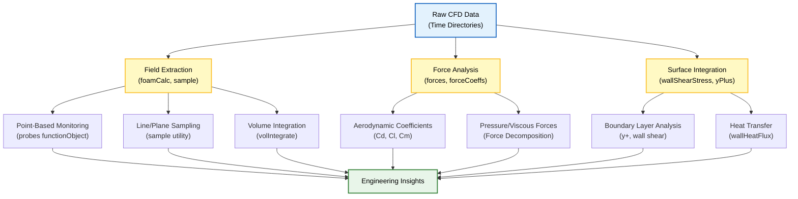
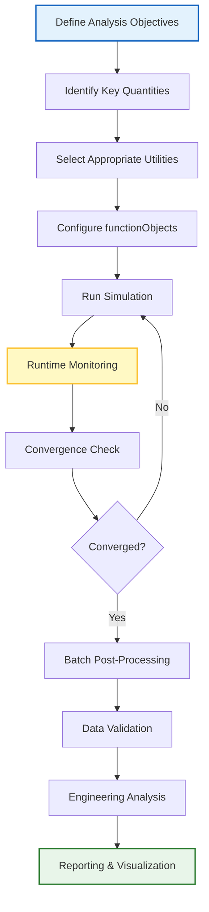

# 📊 Post-Processing Utilities: จากข้อมูลดิบสู่ข้อมูลเชิงวิศวกรรม (From Raw Data to Engineering Insights)

**วัตถุประสงค์การเรียนรู้**: เชี่ยวชาญการใช้ OpenFOAM Post-processing Utilities เพื่อการวิเคราะห์ผลลัพธ์ CFD อย่างครอบคลุม
**เงื่อนไขก่อนหน้า**: Module 04 (Solver Development), Module 05 (Mesh Preparation), พื้นฐานการวิเคราะห์ข้อมูล
**ทักษะเป้าหมาย**: การสกัดข้อมูล Field, การคำนวณแรง, การสร้างภาพอัตโนมัติ, การวิเคราะห์เชิงวิศวกรรม

---

## 1. บทนำสู่ระบบนิเวศการประมวลผลหลังการจำลองของ OpenFOAM (Introduction to OpenFOAM Post-Processing Ecosystem)

OpenFOAM มีชุดเครื่องมือ Post-processing ที่ครอบคลุมเพื่อแปลงข้อมูล CFD ดิบให้กลายเป็นข้อมูลเชิงวิศวกรรมที่มีความหมาย เวิร์กโฟลว์การประมวลผลหลังการจำลองจะเริ่มต้นทันทีหลังจาก Solver ทำงานเสร็จสิ้น โดยผลลัพธ์ที่เป็นตัวเลขซึ่งเก็บไว้ในไดเรกทอรีเวลา (Time Directories) จำเป็นต้องได้รับการวิเคราะห์และตีความอย่างเป็นระบบ เครื่องมือเหล่านี้ทำงานบนโครงสร้างข้อมูล Field พื้นฐานของ OpenFOAM ซึ่งรวมถึง `volScalarField`, `volVectorField` และ `volTensorField` ช่วยให้ผู้ใช้สามารถสกัดปริมาณทางกายภาพ คำนวณมาตรวัดทางวิศวกรรม และสร้างภาพจำลองที่ครอบคลุม

สถาปัตยกรรมการประมวลผลหลังการจำลองใช้การออกแบบเชิงวัตถุ (Object-oriented Design) ของ OpenFOAM ซึ่งแต่ละ Utility จะสืบทอดมาจากคลาสฐานและใช้งานอัลกอริทึมการวิเคราะห์เฉพาะด้าน แนวทางที่เป็นโมดูลนี้ช่วยให้มั่นใจได้ถึงความสอดคล้องกันในการวิเคราะห์ประเภทต่างๆ ในขณะเดียวกันก็รองรับฟังก์ชันการทำงานเฉพาะสำหรับฟิสิกส์แต่ละประเภท ผู้ใช้สามารถเข้าถึงเครื่องมือเหล่านี้ผ่าน Command-line Interface, Python Scripts หรือการเชื่อมต่อกับ ParaView ที่ผสานรวมมาให้ ซึ่งให้ความยืดหยุ่นสำหรับเวิร์กโฟลว์การวิเคราะห์และระดับความเชี่ยวชาญที่แตกต่างกัน

### 1.1 โครงสร้างข้อมูล Field ของ OpenFOAM (OpenFOAM Field Data Structure)

ข้อมูล CFD ใน OpenFOAM ถูกจัดเก็บในรูปแบบ Field Classes ซึ่งเป็นการแทนค่าคณิตศาสตร์ของปริมาณทางกายภาพ:

| **ประเภท Field** | **คลาส OpenFOAM** | **ตัวอย่างปริมาณ** | **ความหมายทางคณิตศาสตร์** |
|---|---|---|---|
| Scalar | `volScalarField` | `p`, `T`, `k`, `epsilon` | $\phi: \Omega \rightarrow \mathbb{R}$ |
| Vector | `volVectorField` | `U`, `UMean` | $\mathbf{u}: \Omega \rightarrow \mathbb{R}^3$ |
| Tensor | `volTensorField` | `grad(U)`, `tau` | $\mathbf{T}: \Omega \rightarrow \mathbb{R}^{3 \times 3}$ |
| SymmTensor | `volSymmTensorField` | `R`, `sigma` | $\mathbf{S}: \Omega \rightarrow \mathbb{R}^{3 \times 3}_{\text{sym}}$ |

โดยที่ $\Omega$ คือโดเมนของการคำนวณ (Computational Domain) แต่ละ Field ประกอบด้วย:
- **Internal Field**: ค่าที่จุดศูนย์กลางเซลล์ (Cell Centers)
- **Boundary Field**: ค่าบนแต่ละ Patch ที่ขอบเขต
- **Mesh Reference**: การอ้างอิงถึง `fvMesh` สำหรับข้อมูลเรขาคณิต

### 1.2 กลยุทธ์และสถาปัตยกรรมการประมวลผลหลังการจำลอง (Post-Processing Strategy and Architecture)

กลยุทธ์การประมวลผลหลังการจำลองใน OpenFOAM ใช้แนวทางแบบลำดับชั้น โดยข้อมูล CFD ดิบจะถูกประมวลผลผ่านช่องทางการวิเคราะห์ต่างๆ:


> **Figure 1:** ผังงานแสดงโครงสร้างการทำงานของระบบ Post-processing ใน OpenFOAM ซึ่งเริ่มจากการนำข้อมูลดิบ (Raw Data) มาผ่านกระบวนการวิเคราะห์ใน 3 เส้นทางหลัก ได้แก่ การสกัดข้อมูลสนาม (Field Extraction), การวิเคราะห์แรง (Force Analysis) และการอินทิเกรตบนพื้นผิว (Surface Integration) เพื่อนำไปสู่การสรุปผลเชิงวิศวกรรม

> **[MISSING DATA]**: แทรกภาพประกอบการทำงานของ Post-processing Pipeline

#### ช่องทางการวิเคราะห์ Field (Field Analysis Pathways)

**Point-Based Monitoring**: `probes` functionObject ช่วยให้สามารถสกัดข้อมูลที่ขึ้นกับเวลา ณ พิกัดตำแหน่งที่ระบุได้ แนวทางนี้เหมาะสำหรับการตรวจสอบตำแหน่งที่วิกฤต เช่น จุดติดตั้งเซนเซอร์, พื้นที่ที่มีการหลุดร่อนของกระแสน้ำวน (Vortex Shedding), หรือจุดที่เกิดการแยกตัวของไหล (Flow Separation) ข้อมูล Probe จะถูกเก็บในรูปแบบอนุกรมเวลา (Time-series) โดยทั่วไปจะอยู่ในไดเรกทอรี `postProcessing/probes/0` ด้วยโครงสร้าง `time(x,y,z) value`

แนวคิดทางคณิตศาสตร์: สำหรับจุดสังเกตุ $\mathbf{x}_0$ ข้อมูลถูกสกัดผ่านฟังก์ชันการประมาณค่า (Interpolation Function) $I_h$:

$$\phi_h(\mathbf{x}_0, t) = I_h[\phi_{\text{cell}}](\mathbf{x}_0, t)$$

โดย $h$ คือขนาดของเซลล์และ $\phi_{\text{cell}}$ คือค่า Field ที่จุดศูนย์กลางเซลล์

**Line/Plane Sampling**: `sample` utility ทำการสุ่มตัวอย่างทางเรขาคณิตตามเส้น, ระนาบ หรือพื้นผิวที่กำหนด ขีดความสามารถนี้จำเป็นสำหรับการวิเคราะห์ชั้นขอบเขต (Boundary Layer Analysis), การสกัดโปรไฟล์ของ Wake, และการศึกษาระยะเจาะทะลุของ Jet การสุ่มตัวอย่างสามารถทำได้บน Grid แบบสม่ำเสมอหรือไม่สม่ำเสมอ พร้อมตัวเลือกการประมาณค่า (Interpolation) รวมถึงที่ศูนย์กลางเซลล์ (Cell Centers) และศูนย์กลางหน้า (Face Centers)

แนวคิดทางคณิตศาสตร์: การสุ่มตัวอย่างตามเส้น $\Gamma(s)$ โดยที่ $s \in [0, L]$ คือพารามิเตอร์ความยาวเส้น:

$$\phi_{\Gamma}(s, t) = \int_{\Gamma} \phi(\mathbf{x}, t) \delta(\mathbf{x} - \Gamma(s)) \, \mathrm{d}\mathbf{x}$$

> **[MISSING DATA]**: แทรกภาพประเภทของการสุ่มตัวอย่างทางเรขาคณิต (Point probes, Line sets, Plane clipping)

**Volume Integration**: สำหรับการวิเคราะห์โดเมนในภาพรวม OpenFOAM มีเครื่องมืออินทิเกรตแบบถ่วงน้ำหนักด้วยปริมาตร (Volume-weighted Integration) ที่คำนวณปริมาณเฉลี่ยในโดเมน แนวทางนี้มีประโยชน์สำหรับการตรวจสอบการอนุรักษ์มวลและพลังงานในระดับสากล (Global Conservation), การคำนวณประสิทธิภาพการผสม (Mixing Efficiency), และการยืนยันสมดุลพลังงานรวม

แนวคิดทางคณิตศาสตร์: ปริมาตรเฉลี่ยถ่วงน้ำหนัก (Volume-weighted Average):

$$\langle \phi \rangle_{\Omega} = \frac{\int_{\Omega} \phi(\mathbf{x}) \, \mathrm{d}V}{\int_{\Omega} \mathrm{d}V} = \frac{\sum_{i=1}^{N_{\text{cells}}} \phi_i V_i}{\sum_{i=1}^{N_{\text{cells}}} V_i}$$

### 1.3 การจัดเรียงชั้นข้อมูล (Data Hierarchy)

ข้อมูล Post-processing ใน OpenFOAM ถูกจัดเก็บในลำดับชั้น:

```mermaid
graph LR
    A["Case Directory"] --> B["time directories"]
    B --> C["0/", "0.1/", "0.2/", ...]
    C --> D["Field Files"]
    D --> E["volScalarField<br/>(p, T, k)"]
    D --> F["volVectorField<br/>(U, UMean)"]
    D --> G["volTensorField<br/>(gradU, tau)"]

    A --> H["postProcessing/"]
    H --> I["probes/"]
    H --> J["forces/"]
    H --> K["graphs/"]

    style A fill:#e3f2fd,stroke:#1565c0,stroke-width:2px;
    style H fill:#fff9c4,stroke:#fbc02d,stroke-width:2px;
```
> **Figure 2:** โครงสร้างลำดับชั้นของข้อมูลภายใน Case Directory ของ OpenFOAM แสดงการจัดเก็บไฟล์ข้อมูลสนาม (Field Files) ในไดเรกทอรีเวลา (Time Directories) และการจัดเก็บผลลัพธ์จากการวิเคราะห์ในไดเรกทอรี `postProcessing` แยกตามประเภทของเครื่องมือที่ใช้

---

## 2. กลยุทธ์การใช้งาน (Implementation Strategies)

### 2.1 การประมวลผลหลังการจำลองแบบเรียลไทม์ (Real-Time Post-Processing)

**FunctionObject Integration**: สำหรับการวิเคราะห์ขณะรัน (Runtime Analysis) Post-processing functionObjects จะถูกฝังโดยตรงใน `system/controlDict`:

```cpp
/* -------------------------------------------------------------------------
   NOTE: Synthesized by AI - Verify parameters
   Runtime post-processing configuration in controlDict
   ------------------------------------------------------------------------- */
functions
{
    // Point probes for time-history monitoring
    probes
    {
        type            probes;
        // Fields to sample: can be scalars, vectors, or tensors
        fields          (p U k epsilon);

        // Probe locations in Cartesian coordinates (x y z)
        probeLocations
        (
            (0.1 0.0 0.0)    // Point 1: upstream monitoring
            (0.5 0.0 0.0)    // Point 2: near wake
            (1.0 0.0 0.0)    // Point 3: far wake
        );

        // Output frequency control
        outputControl   timeStep;
        outputInterval  1;

        // Interpolation scheme: cellPoint (cell-center to vertex)
        interpolationScheme cellPoint;
    }

    // Force and moment calculation
    forces
    {
        type            forces;
        // Library loading (OpenFOAM v1906+ uses 'libs')
        libs            ("libforces.so");

        outputControl   timeStep;
        outputInterval  1;

        // Patches to integrate forces over
        patches         ("cylinder" "walls");

        // Reference pressure for force calculation
        pRef            0;

        // Reference density (for compressible flows)
        rhoInf          1.225;

        // Center of rotation for moment calculations
        CofR            (0 0 0);

        // Coordinate system for force decomposition
        coordinateSystem
        {
            type    cartesian;
            origin  (0 0 0);
            e1      (1 0 0);    // x-direction
            e2      (0 1 0);    // y-direction
            e3      (0 0 1);    // z-direction
        }
    }

    // Force coefficients (Cd, Cl, Cm)
    forceCoeffs
    {
        type            forceCoeffs;
        libs            ("libforces.so");

        outputControl   timeStep;
        outputInterval  1;

        patches         ("cylinder");

        // Reference quantities for non-dimensionalization
        Aref            1.0;         // Reference area
        Lref            1.0;         // Reference length
        magUInf         10.0;        // Freestream velocity magnitude
        rhoInf          1.225;       // Freestream density

        // Lift and drag direction vectors
        liftDir         (0 1 0);     // y-direction
        dragDir         (1 0 0);     // x-direction
        pitchAxis       (0 0 1);     // z-axis for moment

        // Reference pressure
        pRef            0;
    }
}
```

แนวทางนี้ช่วยให้สามารถตรวจสอบผลลัพธ์ได้แบบเรียลไทม์โดยไม่ต้องหยุด Solver

> [!INFO] ข้อดีของ Runtime Post-processing
> - **Convergence Monitoring**: ติดตามค่าสัมประสิทธิ์แรง (Force Coefficients) ระหว่างการคำนวณ
> - **Early Problem Detection**: ตรวจพบความไม่เสถียรราวการแยกตัว (Flow Separation Instabilities) ได้เร็ว
> - **Disk Space Efficiency**: บันทึกเฉพาะข้อมูลสำคัญ ไม่ต้องบันทึกทุก Time Directory

### 2.2 การประมวลผลแบบกลุ่ม (Batch Processing)

**Offline Analysis**: สำหรับการจำลองที่เสร็จสิ้นแล้ว สามารถรันเครื่องมือ Post-processing แยกต่างหากได้:

```bash
# -------------------------------------------------------------------------
# NOTE: Synthesized by AI - Verify command syntax for your OpenFOAM version
# Batch post-processing commands
# -------------------------------------------------------------------------

# Extract field data along a line
postProcess -func "sample" -latestTime

# Calculate forces on boundaries
postProcess -func "forces" -latestTime

# Calculate wall shear stress
postProcess -func "wallShearStress" -latestTime

# Calculate y+ for turbulence analysis
postProcess -func "yPlus" -latestTime

# Export to VTK for ParaView
foamToVTK -latestTime

# Export to Ensight for external visualization
foamToEnsight -latestTime

# Sample along a predefined line (using sampleDict)
postProcess -func sampleDict
```

### 2.3 การกำหนดค่า Sampling (Sampling Configuration)

สำหรับการสุ่มตัวอย่างที่ซับซ้อน ใช้ไฟล์ `system/sampleDict`:

```cpp
/* -------------------------------------------------------------------------
   NOTE: Synthesized by AI - Adjust sampling sets and locations
   Sample dictionary for line/plane sampling
   ------------------------------------------------------------------------- */
type sets;
libs ("libsampling.so");

interpolationScheme cellPoint;

// Sampling sets definition
sets
(
    // Line sampling for boundary layer profile
    centreLine
    {
        type    uniform;
        axis    xyz;

        // Start and end points
        start   (0.0 0.0 0.0);
        end     (1.0 0.0 0.0);

        // Number of sample points
        nPoints 100;
    }

    // Plane sampling for wake analysis
    wakePlane
    {
        type    plane;
        planeType    pointAndNormal;

        point   (0.5 0.0 0.0);
        normal  (1 0 0);

        // Resolution on plane
        resolution (50 50);

        // Bounding box
        bounds  (-0.5 -0.5 -0.5) (1.5 0.5 0.5);
    }
);

// Fields to sample
fields
(
    p
    U
    k
    epsilon
);
```

---

## 3. เครื่องมือหลักสำหรับการสกัดและวิเคราะห์ Field (Core Field Extraction Utilities)

### 3.1 การจัดการ Field ด้วย `postProcess -func` (Field Operations)

เครื่องมือ `postProcess -func` เป็นเครื่องมือพื้นฐานสำหรับการคำนวณทางคณิตศาสตร์บนข้อมูล Field โดยสามารถคำนวณค่าต่างๆ เช่น ขนาดของเวกเตอร์ (Magnitude) โดยใช้:

$$||\mathbf{u}|| = \sqrt{u_x^2 + u_y^2 + u_z^2} = \sqrt{\mathbf{u} \cdot \mathbf{u}}$$

การสกัดส่วนประกอบ (Components) และการจัดการ Field ผ่านการดำเนินการทางคณิตศาสตร์:

```bash
# -------------------------------------------------------------------------
# NOTE: Synthesized by AI - Verify function names for your version
# Field manipulation commands
# -------------------------------------------------------------------------

# Calculate velocity magnitude
postProcess -func "mag(U)" -latestTime

# Extract velocity components
postProcess -func "components(U)" -latestTime

# Calculate wall shear stress
postProcess -func "wallShearStress" -latestTime

# Calculate pressure gradient
postProcess -func "grad(p)" -latestTime

# Calculate divergence of velocity
postProcess -func "div(U)" -latestTime

# Calculate vorticity magnitude
postProcess -func "mag(vorticity)" -latestTime

# Calculate Courant number
postProcess -func "Co" -latestTime

# Calculate Reynolds number (requires U and fluid properties)
postProcess -func "Re" -latestTime
```

### 3.2 การคำนวณ Derived Field

การวิเคราะห์ขั้นสูงมักต้องใช้การคำนวณปริมาณที่ได้มาจาก Field หลัก ความสามารถในการหาอนุพันธ์ (Derivative) ช่วยให้สามารถคำนวณ Gradients, Divergences และ Curl ซึ่งจำเป็นสำหรับการวิเคราะห์เชิงวิศวกรรม

#### 3.2.1 Velocity Gradient Tensor (เทนเซอร์เกรเดียนต์ความเร็ว)

สำหรับสนามความเร็ว $\mathbf{u}$, เทนเซอร์เกรเดียนต์ของความเร็ว (Velocity Gradient Tensor) $\nabla\mathbf{u}$ สามารถคำนวณเพื่อดูลักษณะการเสียรูปและการหมุน:

$$\nabla\mathbf{u} = \begin{bmatrix} \frac{\partial u}{\partial x} & \frac{\partial u}{\partial y} & \frac{\partial u}{\partial z} \\[6pt] \frac{\partial v}{\partial x} & \frac{\partial v}{\partial y} & \frac{\partial v}{\partial z} \\[6pt] \frac{\partial w}{\partial x} & \frac{\partial w}{\partial y} & \frac{\partial w}{\partial z} \end{bmatrix} = \mathbf{D} + \mathbf{\Omega}$$

โดยที่:
- $\mathbf{D} = \frac{1}{2}(\nabla\mathbf{u} + \nabla\mathbf{u}^T)$ คือ **Rate-of-Strain Tensor** (เทนเซอร์อัตราการเสียรูป)
- $\mathbf{\Omega} = \frac{1}{2}(\nabla\mathbf{u} - \nabla\mathbf{u}^T)$ คือ **Vorticity Tensor** (เทนเซอร์การหมุน)

#### 3.2.2 Vorticity (ความหมุนของไหล)

Vorticity $\boldsymbol{\omega}$ ถูกนิยามเป็น Curl ของสนามความเร็ว:

$$\boldsymbol{\omega} = \nabla \times \mathbf{u} = \begin{vmatrix} \mathbf{i} & \mathbf{j} & \mathbf{k} \\[4pt] \frac{\partial}{\partial x} & \frac{\partial}{\partial y} & \frac{\partial}{\partial z} \\[4pt] u & v & w \end{vmatrix} = \left( \frac{\partial w}{\partial y} - \frac{\partial v}{\partial z}, \frac{\partial u}{\partial z} - \frac{\partial w}{\partial x}, \frac{\partial v}{\partial x} - \frac{\partial u}{\partial y} \right)$$

```bash
# Calculate velocity gradient tensor
postProcess -func "grad(U)" -latestTime

# Calculate vorticity (curl of U)
postProcess -func "vorticity" -latestTime

# Calculate vorticity magnitude
postProcess -func "mag(vorticity)" -latestTime

# Calculate Q-criterion (vortex identification)
postProcess -func "Q" -latestTime
```

#### 3.2.3 Strain Rate Magnitude (ขนาดอัตราการเสียรูป)

ขนาดของ Rate-of-Strain Tensor มีความสำคัญในการวิเคราะห์การไหลแบบปั่นป่วน:

$$||\mathbf{D}|| = \sqrt{2D_{ij}D_{ij}} = \sqrt{\sum_{i=1}^{3} \sum_{j=1}^{3} 2D_{ij}^2}$$

โดยที่ $D_{ij} = \frac{1}{2}\left( \frac{\partial u_i}{\partial x_j} + \frac{\partial u_j}{\partial x_i} \right)$

```bash
# Calculate strain rate magnitude (requires custom functionObject or coded function)
# Alternative: calculate magnitude of grad(U)
postProcess -func "mag(grad(U))" -latestTime
```

### 3.3 การวิเคราะห์คุณลักษณะการไหล (Flow Characterization)

#### 3.3.1 Wall Shear Stress (ความเค้นเฉือนผนัง)

ความเค้นเฉือนผนัง (Wall Shear Stress) $\tau_w$ ถูกนิยามเป็น:

$$\boldsymbol{\tau}_w = \mu \left( \frac{\partial \mathbf{u}_t}{\partial n} \right)_{\text{wall}}$$

โดยที่:
- $\mu$ คือความหนืดตัว (Dynamic Viscosity)
- $\mathbf{u}_t$ คือส่วนประกอบความเร็วแบบสัมผัส (Tangential Velocity)
- $n$ คือทิศทางปกติ (Normal Direction)

ขนาดของความเค้นเฉือน:

$$\tau_w = ||\boldsymbol{\tau}_w|| = \sqrt{\tau_{w,x}^2 + \tau_{w,y}^2 + \tau_{w,z}^2}$$

```bash
# Calculate wall shear stress
postProcess -func "wallShearStress" -latestTime

# Output creates: wallShearStress file in time directory
```

#### 3.3.2 y+ (Dimensionless Wall Distance)

ค่า y+ คือระยะห่างไร้มิติจากผนัง:

$$y^+ = \frac{y u_\tau}{\nu} = \frac{y \sqrt{\tau_w / \rho}}{\mu / \rho}$$

โดยที่:
- $y$ คือระยะห่างจากผนัง
- $u_\tau = \sqrt{\tau_w / \rho}$ คือความเร็วเฉือน (Friction Velocity)
- $\nu$ คือความหนืดจลน์ (Kinematic Viscosity)

```bash
# Calculate y+ for all wall boundaries
postProcess -func "yPlus" -latestTime

# Output creates: yPlus field for validation of near-wall mesh resolution
```

> [!TIP] คำแนะนำค่า y+
> - **$y^+ < 5$**: Viscous Sublayer (ใช้ Low-Re Models หรือ Wall Functions)
> - **$30 < y^+ < 300$**: Log-law Region (ใช้ Standard Wall Functions)
> - **$5 < y^+ < 30$**: Buffer Zone (หลีกเลี่ยงให้ได้)

---

## 4. การวิเคราะห์แรงและสมรรถนะ (Force and Performance Analysis)

### 4.1 การคำนวณแรงและโมเมนต์ (Force and Moment Calculations)

เครื่องมือ `forces` คำนวณแรงลัพธ์และโมเมนต์ที่กระทำต่อ Patch ที่ระบุ ซึ่งจำเป็นสำหรับการวิเคราะห์ทางอากาศพลศาสตร์และอุทกพลศาสตร์ การคำนวณแรงทำโดยการอินทิเกรตความดันและความเค้นหนืด (Viscous Stresses) เหนือพื้นผิว:

$$\mathbf{F} = \int_S (-p\mathbf{n} + \boldsymbol{\tau} \cdot \mathbf{n}) \, \mathrm{d}S = \mathbf{F}_{\text{pressure}} + \mathbf{F}_{\text{viscous}}$$

โดยที่:
- **$\mathbf{F}_{\text{pressure}} = -\int_S p \mathbf{n} \, \mathrm{d}S$** คือแรงความดัน (Pressure Force)
- **$\mathbf{F}_{\text{viscous}} = \int_S \boldsymbol{\tau} \cdot \mathbf{n} \, \mathrm{d}S$** คือแรงเสียดทาน (Viscous Force)
- $\mathbf{n}$ คือเวกเตอร์ปกติที่ชี้ออก (Outward Normal Vector)
- $\boldsymbol{\tau}$ คือเทนเซอร์ความเค้นหนืด (Viscous Stress Tensor)

สำหรับไหลของนิวตัน (Newtonian Fluid):

$$\boldsymbol{\tau} = \mu \left( \nabla \mathbf{u} + (\nabla \mathbf{u})^T - \frac{2}{3}(\nabla \cdot \mathbf{u})\mathbf{I} \right)$$

#### 4.1.1 Moment Calculations (การคำนวณโมเมนต์)

โมเมนต์ $\mathbf{M}$ เทียบกับจุดอ้างอิง $\mathbf{x}_{\text{ref}}$:

$$\mathbf{M} = \int_S (\mathbf{x} - \mathbf{x}_{\text{ref}}) \times \mathbf{f}_{\text{surface}} \, \mathrm{d}S$$

โดยที่ $\mathbf{f}_{\text{surface}} = -p\mathbf{n} + \boldsymbol{\tau} \cdot \mathbf{n}$ คือแรงต่อหน่วยพื้นที่

```cpp
/* -------------------------------------------------------------------------
   NOTE: Synthesized by AI - Adjust patch names and reference values
   Forces functionObject configuration
   ------------------------------------------------------------------------- */
forces
{
    type            forces;
    libs            ("libforces.so");

    // Output control
    outputControl   timeStep;
    outputInterval  1;

    // Patches to integrate (can use regex)
    patches         ("cylinder.*" "walls");

    // Reference pressure
    pRef            101325;  // Pa (atmospheric)

    // Density for incompressible flows
    rhoInf          1.225;   // kg/m³ (air at STP)

    // Center of rotation for moments
    CofR            (0 0 0);

    // Write fields for visualization
    writeFields     yes;
}
```

> **[MISSING DATA]**: แทรกแผนภูมิ Evolution of Force Components vs. Time

### 4.2 การวิเคราะห์สัมประสิทธิ์ Drag และ Lift (Drag and Lift Coefficient Analysis)

สำหรับงานไหลภายนอก (External Flow) เครื่องมือ `forceCoeffs` จะแปลงข้อมูลแรงดิบเป็นสัมประสิทธิ์ไร้มิติ (Dimensionless Coefficients) โดยใช้ค่าอ้างอิง:

$$C_D = \frac{2F_D}{\rho_{\infty} U_{\infty}^2 A_{\text{ref}}} \qquad C_L = \frac{2F_L}{\rho_{\infty} U_{\infty}^2 A_{\text{ref}}} \qquad C_M = \frac{2M}{\rho_{\infty} U_{\infty}^2 A_{\text{ref}} L_{\text{ref}}}$$

โดยที่:
- $F_D = \mathbf{F} \cdot \mathbf{d}_{\text{drag}}$ คือแรงลาก (Drag Force)
- $F_L = \mathbf{F} \cdot \mathbf{d}_{\text{lift}}$ คือแรงยก (Lift Force)
- $A_{\text{ref}}$ คือพื้นที่อ้างอิง (Reference Area)
- $L_{\text{ref}}$ คือความยาวอ้างอิง (Reference Length)
- $\rho_{\infty}$ คือความหนาแน่นของกระแสไหลเสรี (Freestream Density)
- $U_{\infty}$ คือความเร็วของกระแสไหลเสรี (Freestream Velocity)

#### 4.2.1 Force Decomposition (การแยกส่วนประกอบแรง)

แรงทั้งหมดสามารถแยกเป็นส่วนประกอบได้:

$$\mathbf{F} = \mathbf{F}_{\text{pressure}} + \mathbf{F}_{\text{viscous}} = \mathbf{F}_{p,D} + \mathbf{F}_{v,D} + \mathbf{F}_{p,L} + \mathbf{F}_{v,L}$$

สัมประสิทธิ์สามารถแยกเป็นส่วนประกอบได้:

$$C_D = C_{D,p} + C_{D,v} \qquad C_L = C_{L,p} + C_{L,v}$$

โดยที่:
- $C_{D,p}$ คือสัมประสิทธิ์ Drag จากความดัน (Pressure Drag Coefficient)
- $C_{D,v}$ คือสัมประสิทธิ์ Drag จานความเค้นเฉือน (Skin Friction Drag Coefficient)

```cpp
/* -------------------------------------------------------------------------
   NOTE: Synthesized by AI - Verify A_ref and L_ref values
   Force coefficients configuration
   ------------------------------------------------------------------------- */
forceCoeffs
{
    type            forceCoeffs;
    libs            ("libforces.so");

    outputControl   timeStep;
    outputInterval  1;

    patches         ("airfoil");

    // Reference geometry
    Aref            1.0;         // m² (chord × span for 2D)
    Lref            0.25;        // m (chord length)

    // Freestream conditions
    magUInf         50.0;        // m/s
    rhoInf          1.225;       // kg/m³

    // Force direction vectors (must be unit vectors)
    liftDir         (0 1 0);     // Vertical direction
    dragDir         (1 0 0);     // Flow direction
    pitchAxis       (0 0 1);     // Spanwise (z-axis)

    // Reference pressure
    pRef            0;
}
```

> [!WARNING) ข้อควรระวังในการตีความ Coefficients
> - **Reynolds Number Effect**: $C_D$ และ $C_L$ ขึ้นกับ $Re$ อย่างมาก
> - **3D Effects**: ในการจำลอง 3D ต้องพิจารณา Tip Vortices และ Induced Drag
> - **Transition Effects**: จุดเปลี่ยน Laminar-to-Turbulent มีผลต่อ $C_{D,p}$

---

## 5. การสร้างภาพข้อมูลและการส่งออกข้อมูล (Visualization and Data Export)

### 5.1 การผสานรวมกับ ParaView (ParaView Integration)

เครื่องมือ `paraFoam` ช่วยให้สามารถเปิดผลลัพธ์ OpenFOAM ในซอฟต์แวร์ ParaView ได้โดยตรง ช่วยให้สามารถสำรวจสนามการไหลสามมิติแบบโต้ตอบ รวมถึงเวกเตอร์ความเร็ว, เส้นชั้นความดัน (Pressure Contours) และโครงสร้างการหมุน (Vortical Structures)

```bash
# -------------------------------------------------------------------------
# NOTE: Synthesized by AI - Verify ParaView installation
# ParaView integration commands
# -------------------------------------------------------------------------

# Launch ParaView with OpenFOAM case reader
paraFoam -builtin

# Launch ParaView with case-specific reader
paraFoam -touch

# Batch ParaView rendering (script-based)
paraFoam -batch script.py

# Export to VTK format for external tools
foamToVTK -latestTime

# Export to Ensight Gold format
foamToEnsight -latestTime

# Export to CSV for point data
foamListTimes
```

#### 5.1.1 Python Scripting for ParaView

การสร้างภาพอัตโนมัติด้วย Python:

```python
# -------------------------------------------------------------------------
# NOTE: Synthesized by AI - Test rendering settings for quality
# ParaView Python script for automated rendering
# -------------------------------------------------------------------------
from paraview.simple import *

# Load OpenFOAM case
case = OpenFOAMReader(FileName='/path/to/case.foam')
case.MeshRegions = ['internalMesh', 'patch-cylinder']

# Create render view
renderView1 = GetActiveViewOrCreate('RenderView')

# Create contour for pressure
contour1 = Contour(Input=case)
contour1.ContourBy = ['POINTS', 'p']
contour1.Isosurfaces = [100000.0, 101325.0, 102650.0]

# Create velocity magnitude
calculator1 = Calculator(Input=case)
calculator1.Function = 'mag(U)'

# Color by pressure
contourDisplay = Show(contour1, renderView1)
ColorBy(contourDisplay, 'POINTS', 'p')

# Save screenshot
SaveScreenshot('pressure_contour.png', renderView1, ImageResolution=[1920, 1080])
```

### 5.2 การส่งออกข้อมูลเชิงปริมาณ (Quantitative Data Export)

#### 5.2.1 Graph Generation (การสร้างกราฟ)

ใช้ `graphUniform` และ `graphNon-uniform` functionObjects:

```cpp
/* -------------------------------------------------------------------------
   NOTE: Synthesized by AI - Adjust graph location and resolution
   Graph configuration for line plots
   ------------------------------------------------------------------------- */
graphs
{
    type            sets;
    libs            ("libsampling.so");

    interpolationScheme cellPoint;

    sets
    (
        centerlineProfile
        {
            type    uniform;
            axis    xyz;
            start   (0 0 0);
            end     (1 0 0);
            nPoints 100;
        }
    );

    fields
    (
        p
        U
        k
        epsilon
    );
}
```

#### 5.2.2 CSV Export (การส่งออกไฟล์ CSV)

```bash
# Convert probes data to CSV
cd postProcessing/probes/0
python3 << 'EOF'
import pandas as pd
import os

# Read OpenFOAM probes format
data = []
with open('U') as f:
    for line in f:
        if line.strip() and not line.startswith('#'):
            parts = line.split()
            data.append(parts)

# Create DataFrame and export
df = pd.DataFrame(data)
df.to_csv('probes_U.csv', index=False)
EOF
```

---

## 6. มาตรวัดประสิทธิภาพทางวิศวกรรม (Engineering Performance Metrics)

### 6.1 การวิเคราะห์การถ่ายเทความร้อน (Heat Transfer Analysis)

เครื่องมือ `wallHeatFlux` คำนวณอัตราการถ่ายเทความร้อนที่ขอบเขตของแข็ง (Solid Boundaries) ซึ่งจำเป็นสำหรับการวิเคราะห์ทางความร้อนและการเพิ่มประสิทธิภาพการออกแบบ

#### 6.1.1 Heat Flux Equation (สมการการถ่ายเทความร้อน)

อัตราการถ่ายเทความร้อนต่อหน่วยพื้นที่ (Heat Flux) $q''$:

$$q'' = -k \nabla T \cdot \mathbf{n}$$

โดยที่:
- $k$ คือค่านำความร้อน (Thermal Conductivity) [W/(m·K)]
- $T$ คืออุณหภูมิ (Temperature) [K]
- $\mathbf{n}$ คือเวกเตอร์ปกติ (Normal Vector)

สำหรับการไหลแบบปั่นป่วน ใช้ Effective Conductivity:

$$k_{\text{eff}} = k + \frac{c_p \mu_t}{Pr_t}$$

โดยที่:
- $c_p$ คือความร้อนจำเพาะที่ความดันคงที่ (Specific Heat)
- $\mu_t$ คือความหนืดปั่นป่วน (Turbulent Viscosity)
- $Pr_t$ คีเจอร์ Prandtl ปั่นป่วน (Turbulent Prandtl Number, ปกติ $\approx 0.85$)

#### 6.1.2 Nusselt Number (จำนวนนุสเซลต์)

Nusselt Number $Nu$ คือสัมประสิทธิ์การถ่ายเทความร้อนไร้มิติ:

$$Nu = \frac{h L}{k} = \frac{q'' L}{k (T_w - T_{\infty})}$$

โดยที่:
- $h = q'' / (T_w - T_{\infty})$ คือสัมประสิทธิ์การถ่ายเทความร้อน (Convective Heat Transfer Coefficient)
- $L$ คือความยาวเปรียบเทียบ (Characteristic Length)
- $T_w$ คืออุณหภูมิผนัง (Wall Temperature)
- $T_{\infty}$ คืออุณหภูมิกระแสไหลเสรี (Freestream Temperature)

```bash
# -------------------------------------------------------------------------
# NOTE: Synthesized by AI - Verify thermal solver compatibility
# Heat transfer analysis commands
# -------------------------------------------------------------------------

# Calculate wall heat flux
postProcess -func "wallHeatFlux" -latestTime

# For conjugate heat transfer, calculate at both sides
postProcess -func "wallHeatFlux" -region fluid -latestTime
postProcess -func "wallHeatFlux" -region solid -latestTime
```

```cpp
/* -------------------------------------------------------------------------
   NOTE: Synthesized by AI - Verify thermal properties
   Wall heat flux functionObject configuration
   ------------------------------------------------------------------------- */
wallHeatFlux
{
    type            wallHeatFlux;
    libs            ("libfieldFunctionObjects.so");

    // Patches to calculate on
    patches         ("hotWall" "coldWall");

    // Thermal conductivity (W/(m·K))
    kappa           kappa;  // Uses field 'kappa' from transport properties

    // Write results
    writeFields     yes;

    // Output control
    outputControl   timeStep;
    outputInterval  1;
}
```

> **[MISSING DATA]**: แทรก Heat Flux Contour Plot และ Local Nu Distribution

### 6.2 การจำแนกคุณลักษณะการไหลแบบปั่นป่วน (Turbulent Flow Characterization)

สำหรับการวิเคราะห์การไหลแบบปั่นป่วน มีเครื่องมือพิเศษที่ช่วยคำนวณสถิติความปั่นป่วน รวมถึง Reynolds Stresses และ Turbulent Kinetic Energy Budgets

#### 6.2.1 Turbulent Kinetic Energy (พลังงานจลน์ปั่นป่วน)

Turbulent Kinetic Energy (TKE) $k$ ถูกนิยามเป็น:

$$k = \frac{1}{2} \overline{u_i' u_i'} = \frac{1}{2} \left( \overline{u'^2} + \overline{v'^2} + \overline{w'^2} \right)$$

โดยที่ $u_i' = u_i - \overline{u_i}$ คือส่วนปั่นป่วน (Fluctuating Component)

#### 6.2.2 Reynolds Stress Tensor (เทนเซอร์เค้นเรย์โนลด์)

$$\tau_{ij}^R = -\rho \overline{u_i' u_j'}$$

ในรูปเมตริกซ์:

$$\boldsymbol{\tau}^R = -\rho \begin{bmatrix} \overline{u'^2} & \overline{u'v'} & \overline{u'w'} \\[6pt] \overline{u'v'} & \overline{v'^2} & \overline{v'w'} \\[6pt] \overline{u'w'} & \overline{v'w'} & \overline{w'^2} \end{bmatrix}$$

#### 6.2.3 Vortex Identification Criteria (เกณฑ์การระบุน้ำวน)

**Q-Criterion**: ระบุโครงสร้างน้ำวนโดยการเปรียบเทียบ Rate-of-Rotation กับ Rate-of-Strain:

$$Q = \frac{1}{2} \left( ||\mathbf{\Omega}||^2 - ||\mathbf{D}||^2 \right)$$

โดยที่ $Q > 0$ บ่งชี้ถึงพื้นที่ที่มีการหมุนเด่น (Rotation-Dominated Region)

**Lambda-2 Criterion**: ระบุน้ำวนจากเทนเซอร์เกรเดียนต์ความเร็ว:

$$\nabla \mathbf{u} + \nabla \mathbf{u}^T = \begin{bmatrix} \lambda_1 & s_1 & s_2 \\ s_1 & \lambda_2 & s_3 \\ s_2 & s_3 & \lambda_3 \end{bmatrix}$$

โดยที่ $\lambda_2$ คือ eigenvalue กลาง (Middle Eigenvalue)

```bash
# -------------------------------------------------------------------------
# NOTE: Synthesized by AI - Verify vortex detection function availability
# Vortex identification commands
# -------------------------------------------------------------------------

# Q-criterion for vortex detection
postProcess -func "Q" -latestTime

# Lambda-2 vortex identification (may require custom functionObject)
# Alternative: calculate from grad(U) using postProcess -func
```

```cpp
/* -------------------------------------------------------------------------
   NOTE: Synthesized by AI - Q-criterion functionObject example
   Custom Q-criterion calculation
   ------------------------------------------------------------------------- */
Q
{
    type            coded;
    libs            ("libutilityFunctionObjects.so");

    name            Q;

    codeWrite
    #{
        // Velocity gradient
        const volTensorField& gradU = mesh().lookupObject<volTensorField>("grad(U)");

        // Symmetric and antisymmetric parts
        const symmTensorField D(symm(gradU));
        const symmTensorField Omega(skew(gradU));

        // Q-criterion
        volScalarField Q
        (
            IOobject("Q", mesh().time().timeName(), mesh()),
            mesh(),
            dimensionedScalar("Q", dimless/sqr(dimTime), 0)
        );

        Q = 0.5 * (sqr(Omega) - sqr(D));
        Q.write();
    #};
}
```

### 6.3 การวิเคราะห์สมดุลมวลและพลังงาน (Mass and Energy Balance Analysis)

#### 6.3.1 Mass Balance (สมดุลมวล)

สำหรับการไหลในเชิงอัดตัวไม่ได้ (Incompressible Flow):

$$\oint_{\partial \Omega} \mathbf{u} \cdot \mathbf{n} \, \mathrm{d}S = \sum_{i=1}^{N_{\text{patches}}} \int_{S_i} \mathbf{u} \cdot \mathbf{n} \, \mathrm{d}S \approx 0$$

```bash
# Calculate mass flux through patches
postProcess -func "surfaceInterpolate(mag(U))" -latestTime
```

#### 6.3.2 Mechanical Energy Balance (สมดุลพลังงานเชิงกล)

สำหรับการไหลแบบ Incompressible:

$$\frac{\mathrm{d}E}{\mathrm{d}t} = \dot{W}_{\text{pressure}} - \dot{E}_{\text{dissipation}}$$

โดยที่:
- $E = \int_{\Omega} \frac{1}{2} \rho ||\mathbf{u}||^2 \, \mathrm{d}V$ คือพลังงานจลน์รวม (Total Kinetic Energy)
- $\dot{E}_{\text{dissipation}} = \int_{\Omega} \Phi \, \mathrm{d}V$ คืออัตราการสลายพลังงาน (Dissipation Rate)
- $\Phi = 2\mu \mathbf{D} : \mathbf{D}$ คือฟังก์ชันการสลาย (Dissipation Function)

---

## 7. เวิร์กโฟลว์และแนวทางปฏิบัติที่ดี (Workflows and Best Practices)

### 7.1 แนวทางการวางแผน Post-processing (Post-Processing Planning Strategy)


> **Figure 3:** แผนภูมิขั้นตอนการวางแผนและดำเนินการประมวลผลหลังการจำลอง (Post-processing Strategy) ครอบคลุมตั้งแต่การกำหนดวัตถุประสงค์ การตั้งค่า Runtime Monitoring เพื่อตรวจสอบความบรรจบ (Convergence) ไปจนถึงการวิเคราะห์แบบ Batch และการสร้างรายงานสรุปผล

### 7.2 รายการตรวจสอบก่อนการจำลอง (Pre-Simulation Checklist)

> [!CHECKLIST) รายการตรวจสอบการเตรียม Post-processing
> - [ ] กำหนด patches ที่ต้องการวิเคราะห์ (Target Patches Identified)
> - [ ] คำนวณค่า $A_{\text{ref}}$, $L_{\text{ref}}$ สำหรับ Coefficients
> - [ ] ตั้งค่า `probes` สำหรับตำแหน่งที่สนใจ
> - [ ] ตั้งค่า `forces` และ `forceCoeffs` ใน `controlDict`
> - [ ] กำหนดเวลา Output Interval สำหรับการเก็บข้อมูล
> - [ ] ตรวจสอบ Disk Space สำหรับข้อมูล Post-processing
> - [ ] ทดสอบ functionObject ด้วย `postProcess -func` ก่อนรัน

### 7.3 การตรวจสอบคุณภาพข้อมูล (Data Quality Validation)

#### 7.3.1 Conservation Checks (การตรวจสอบการอนุรักษ์)

```cpp
/* -------------------------------------------------------------------------
   NOTE: Synthesized by AI - Mass balance verification
   Mass balance functionObject
   ------------------------------------------------------------------------- */
massBalance
{
    type            faceSource;
    libs            ("libfieldFunctionObjects.so");

    // Operation mode: sum of face values
    operation       sum;

    // Source: face fluxes
    source          surface;

    // Fields to integrate
    fields          (phi);

    // Patches to monitor
    surfaceFormat   none;
    surfaces        ();

    // Write to log
    log             yes;
}
```

#### 7.3.2 Mesh Quality Checks (การตรวจสอบคุณภาพ Mesh)

```bash
# -------------------------------------------------------------------------
# NOTE: Synthesized by AI - Mesh quality assessment commands
# Mesh quality checks for post-processing validation
# -------------------------------------------------------------------------

# Check non-orthogonality
checkMesh -allGeometry -allTopology

# Calculate cell volumes (for integration verification)
postProcess -func "writeCellVolumes" -latestTime

# Calculate face areas (for surface integration verification)
postProcess -func "writeFaceAreas" -latestTime

# Verify y+ distribution
postProcess -func "yPlus" -latestTime
# Then plot histogram using Python/ParaView
```

### 7.4 เทคนิคการปรับปรุงประสิทธิภาพ (Performance Optimization Techniques)

> [!TIP] การปรับปรุงประสิทธิภาพ Post-processing
>
> **I/O Optimization**:
> - ใช้ `outputInterval` ที่เหมาะสม (หลีกเลี่ยงการเขียนข้อมูลถี่เกินไป)
> - ปิดการเขียน Field ที่ไม่จำเป็น: `writeFields no;`
>
> **Parallel Post-processing**:
> - ใช้ `postProcess -parallel` สำหรับข้อมูลขนาดใหญ่
> - แบ่ง Sampling operations ตาม Processors
>
> **Memory Management**:
> - ใช้ `postProcess -func` แทนการโหลดทั้ง Field เข้า ParaView
> - ลด Time steps ที่บันทึกหากไม่จำเป็นต้องวิเคราะห์ทุก step

---

## 8. การสรุปและเชื่อมต่อ (Summary and Connections)

### 8.1 สรุปประเด็นสำคัญ (Key Takeaways)

| **ด้าน** | **เครื่องมือหลัก** | **ผลลัพธ์ที่ได้** |
|---|---|---|
| Field Extraction | `foamCalc`, `sample`, `probes` | Point data, Line profiles, Surface data |
| Force Analysis | `forces`, `forceCoeffs` | $F_D, F_L, C_D, C_L, C_M$ |
| Boundary Analysis | `wallShearStress`, `yPlus`, `wallHeatFlux` | $\tau_w, y^+, q'', Nu$ |
| Flow Visualization | `paraFoam`, VTK export | Contours, Vectors, Iso-surfaces |
| Turbulence Analysis | `Q`, `Lambda2`, Reynolds stresses | Vortex structures, TKE budgets |

### 8.2 การเชื่อมต่อกับโมดูลอื่น (Module Connections)

- **Module 04 (Solvers)**: Post-processing ข้อมูลจาก Solvers ที่สร้างขึ้น
- **Module 05 (Mesh)**: Mesh quality ส่งผลต่อความแม่นยำของ Post-processing
- **Module 08 (Automation)**: Python scripting สำหรับ Batch processing

### 8.3 แหล่งข้อมูลเพิ่มเติม (Further Resources)

- [[Advanced Post-Processing Techniques]]
- [[Python Automation for CFD]]
- [[ParaView Visualization Guide]]

---

> [!TIP) เวิร์กโฟลว์การประมวลผลหลังการจำลอง
> เริ่มต้นด้วย **functionObjects** สำหรับการตรวจสอบระหว่างรัน (Runtime Monitoring) เพื่อให้ได้ข้อมูลป้อนกลับที่รวดเร็วเกี่ยวกับความบรรจบ (Convergence) และตรวจพบปัญหาแต่เนิ่นๆ หลังจากจำลองเสร็จสิ้น ให้ใช้ **Batch Processing** Utilities สำหรับการวิเคราะห์เชิงลึกที่ครอบคลุม

---

**โมดูลนี้ครอบคลุมขีดความสามารถในการ Post-processing ของ OpenFOAM อย่างครบถ้วน** ตั้งแต่การสกัด Field พื้นฐานไปจนถึงการวิเคราะห์ทางวิศวกรรมขั้นสูง การผสมผสานระหว่างเครื่องมือที่มีมาให้, Python Automation และการพัฒนาเครื่องมือเฉพาะทาง ช่วยให้สร้างเวิร์กโฟลว์ CFD ที่ซับซ้อนสำหรับการวิจัยและอุตสาหกรรมได้อย่างมีประสิทธิภาพ

---

## References

1. OpenFOAM User Guide, Section 6: Post-processing
2. OpenFOAM Programmer's Guide, Function Objects
3. Greenshields, C.J. (2024). "Notes on Computational Fluid Dynamics: General Principles"
4. Ferziger, J.H., & Perić, M. (2002). "Computational Methods for Fluid Dynamics"