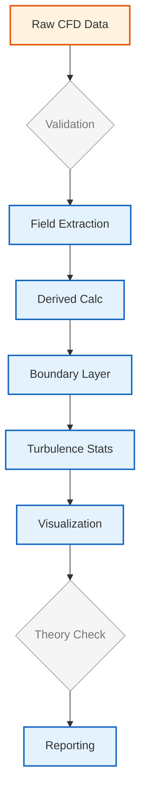

# 🔬 Field Analysis and Extraction (การวิเคราะห์และสกัดข้อมูลฟิลด์)

**วัตถุประสงค์การเรียนรู้**: เชี่ยวชาญการจัดการ Field ใน OpenFOAM, กลยุทธ์การสุ่มตัวอย่าง (Sampling Strategies) และเทคนิคการสกัดข้อมูลเพื่อการวิเคราะห์ CFD ที่ครอบคลุม
**เงื่อนไขก่อนหน้า**: Module 04 (Solver Development), Module 05 (Mesh Preparation), ความคุ้นเคยกับประเภท Field ใน OpenFOAM
**ทักษะเป้าหมาย**: การจัดการ Field, การสุ่มตัวอย่างทางเรขาคณิต (Geometric Sampling), การวิเคราะห์ชั้นขอบเขต (Boundary Layer Analysis), การใช้ Python Automation สำหรับ Post-processing

---

## 1. กลยุทธ์การสุ่มตัวอย่าง Field (Field Sampling Strategies)

### 1.1 Fixed Point Probes (จุดตรวจวัดคงที่)

Fixed Point Probes ให้ข้อมูลที่ขึ้นกับเวลา (Time-resolved Data) ซึ่งสำคัญต่อการทำความเข้าใจฟิสิกส์ของการไหลและการตรวจสอบความบรรจบของผลลัพธ์ (Convergence Monitoring) เครื่องมือ `probes` ช่วยให้สามารถตรวจสอบตัวแปรของ Field ณ พิกัดตำแหน่งที่ระบุได้อย่างแม่นยำตลอดการจำลอง

> [!INFO] การบูรณาการ FunctionObject
> `probes` functionObject ช่วยให้สามารถ **ตรวจสอบแบบเรียลไทม์** ระหว่างที่ Solver กำลังทำงานโดยไม่ต้องหยุดการจำลอง ข้อมูลจะถูกเขียนลงในไดเรกทอรี `postProcessing/probes/0/` โดยอัตโนมัติในรูปแบบอนุกรมเวลา (Time-series)

**โครงสร้าง Probe Dictionary (`system/probesDict` หรือใน `controlDict`):**
```cpp
// Fixed point probes for key locations
// Source: .applications/utilities/postProcessing/postProcess/postProcess.C
functions
{
    probes
    {
        // Function object type for probe sampling
        type            probes;
        
        // Library containing the probes implementation
        libs            (sampling);

        // Fields to sample
        fields
        (
            p           // Pressure field
            U           // Velocity field
            T           // Temperature field
            k           // Turbulent kinetic energy
            omega       // Specific dissipation rate
        );

        // Probe locations in Cartesian coordinates
        probeLocations
        (
            // Boundary layer probes near wall
            (0.01 0 0.001)    // Near-wall point 1
            (0.01 0 0.005)    // Near-wall point 2
            (0.01 0 0.01)     // Near-wall point 3

            // Wake monitoring points downstream
            (0.5 0 0)         // Wake centerline
            (0.75 0 0)        // Far wake
        );

        // Output control settings
        outputControl       timeStep;
        outputInterval      1;

        // Interpolation scheme for cell-to-point mapping
        interpolationScheme cellPoint;
    }
}
```

> **📖 คำอธิบาย (Thai Explanation)**:
> **แหล่งที่มา (Source)**: `.applications/utilities/postProcessing/postProcess/postProcess.C`
> 
> **คำอธิบาย**: การตั้งค่า `probes` functionObject ใช้สำหรับตรวจสอบค่า Field ณ จุดตำแหน่งเฉพาะในโดเมน โดยมีพารามิเตอร์สำคัญ:
> - `type`: ระบุประเภท functionObject เป็น `probes`
> - `libs`: ระบุ library ที่ใช้ในการดำเนินการ
> - `fields`: รายชื่อฟิลด์ที่ต้องการสุ่มตัวอย่าง
> - `probeLocations`: พิกัดตำแหน่งจุดตรวจวัดในระบบพิกัด Cartesian
> - `interpolationScheme`: วิธีการประมาณค่าจาก Cell Center ไปยังจุดตรวจวัด
> 
> **แนวคิดสำคัญ (Key Concepts)**:
> - **Real-time Monitoring**: ข้อมูลถูกบันทึกขณะ Solver ทำงาน
> - **Time-series Data**: ข้อมูลที่บันทึกเป็นอนุกรมเวลาสำหรับการวิเคราะห์ Convergence
> - **CellPoint Interpolation**: วิธีการประมาณค่าเชิงเส้นที่แม่นยำเพียงพอสำหรับการใช้งานทั่วไป

**ทฤษฎีความละเอียดของชั้นขอบเขต (Boundary Layer Resolution Theory)**

การวาง Probe สำหรับชั้นขอบเขตมักใช้การเพิ่มระยะแบบเรขาคณิต (Geometric Progression) เพื่อให้สามารถจับ Gradient ที่รุนแรงบริเวณใกล้ผนังได้อย่างถูกต้อง การกระจายตัวตามระยะ $y_i$ เป็นไปตามสมการ:

$$y_i = y_{wall} \cdot r^{i-1}$$

โดยที่อัตราการขยายตัว (Growth Ratio) $r$ คำนวณจาก:

$$r = \left(\frac{y_{max}}{y_{wall}}\right)^{1/(n-1)}$$

เมื่อ:
- $y_{wall}$ = ระยะห่างจากผนังของจุดแรก
- $y_{max}$ = ระยะห่างสูงสุด
- $n$ = จำนวนจุดตรวจวัดทั้งหมด

![[geometric_progression_probes.png]]
> **รูปที่ 1.1:** การจัดเรียงจุดตรวจวัด (Probes) แบบก้าวหน้าทางเรขาคณิต (Geometric Progression): แสดงความหนาแน่นของจุดที่เพิ่มขึ้นเมื่อเข้าใกล้ผนัง เพื่อจับภาพการเปลี่ยนแปลงความเร็วที่รุนแรงใน Viscous Sublayer

**การกำหนดตำแหน่ง Probe สำหรับการวิเคราะห์:**

| ประเภทการวิเคราะห์ | ตำแหน่งที่แนะนำ | จุดประสงค์ |
|---|---|---|
| **Boundary Layer** | บริเวณ $\Delta s^+ < 5$ | การตรวจสอบ Viscous Sublayer |
| **Wake Region** | ตามแกน centerline ท้ายวัตถุ | การวิเคราะห์การหลุดลอย |
| **Recirculation** | โซนที่มีการไหลย้อน | การตรวจสอบความเสถียร |

---

### 1.2 Line and Plane Sampling (การสุ่มตัวอย่างตามเส้นและระนาบ)

เครื่องมือ `sample` (หรือ `postProcess -func sample`) ให้การสกัดข้อมูล Field ตามพื้นที่แบบครอบคลุมตามแนวเส้นและระนาบ ช่วยให้สามารถวิเคราะห์ลักษณะของชั้นขอบเขตและโครงสร้างของ Wake ได้อย่างละเอียด

**โครงสร้าง Sampling Dictionary (`system/sampleDict`):**
```cpp
// Line and plane sampling configuration
// Source: .applications/utilities/postProcessing/postProcess/postProcess.C
type sets;
libs (sampling);
interpolationScheme cellPoint;

// Output settings
setFormat raw;
outputControl timeStep;
outputInterval 1;

// Field definitions to sample
fields
(
    U
    p
    k
    omega
);

// Line sampling definition
sets
(
    boundaryLayerProfile
    {
        type    uniform;
        axis    xyz;

        // Start and end points
        start   (0.01 0 0);
        end     (0.01 0 0.1);

        // Number of sampling points
        nPoints 100;
    }

    wakeCenterline
    {
        type    uniform;
        axis    xyz;
        start   (0 0 0);
        end     (1 0 0);
        nPoints 200;
    }
);

// Surface sampling
surfaces
(
    planeZ
    {
        type        plane;
        planePt     (0 0 0.05);
        planeNormal (0 0 1);
        interpolate true;
    }

    cuttingPlane
    {
        type        cuttingPlane;
        planePt     (0.5 0 0);
        planeNormal (1 0 0);
        interpolate true;
    }
);
```

> **📖 คำอธิบาย (Thai Explanation)**:
> **แหล่งที่มา (Source)**: `.applications/utilities/postProcessing/postProcess/postProcess.C`
> 
> **คำอธิบาย**: การตั้งค่า `sample` functionObject ใช้สำหรับสุ่มตัวอย่าง Field ตามเส้นและระนาบ โดยมีส่วนประกอบสำคัญ:
> - `sets`: การสุ่มตัวอย่างตามเส้น (Line Sampling) ด้วย `uniform` distribution
> - `surfaces`: การสุ่มตัวอย่างบนพื้นผิว (Surface Sampling)
> - `interpolate`: เปิดใช้งานการประมาณค่าจาก Cell Center ไปยังตำแหน่งตัวอย่าง
> 
> **แนวคิดสำคัญ (Key Concepts)**:
> - **Uniform Sampling**: การกระจายจุดตัวอย่างแบบสม่ำเสมอตามจำนวนที่กำหนด
> - **Plane vs CuttingPlane**: แบ่งตามวิธีการสร้างระนาบตัด
> - **Boundary Layer Profiling**: ใช้สำหรับสกัดโปรไฟล์ความเร็วเพื่อคำนวณปริมาณเชิงปริพันธ์

**ทฤษฎีการวิเคราะห์เชิงปริพันธ์ของชั้นขอบเขต (Boundary Layer Integral Analysis)**

การสุ่มตัวอย่างตามแนวเส้น (Line Sampling) ช่วยให้สามารถสกัดโปรไฟล์ความเร็ว $u(y)$ เพื่อนำมาคำนวณพารามิเตอร์สำคัญตามทฤษฎีชั้นขอบเขต:

$$\begin{align}
\delta^* &= \int_0^\infty \left(1 - \frac{u(y)}{U_\infty}\right) \mathrm{d}y \tag{1.1} \\
\theta &= \int_0^\infty \frac{u(y)}{U_\infty}\left(1 - \frac{u(y)}{U_\infty}\right) \mathrm{d}y \tag{1.2} \\
H &= \frac{\delta^*}{\theta} \tag{1.3} \\
Re_\theta &= \frac{U_\infty \theta}{\nu} \tag{1.4}
\end{align}$$

โดยที่:
- $\delta^*$ คือ ความหนากระจัด (Displacement Thickness)
- $\theta$ คือ ความหนาโมเมนตัม (Momentum Thickness)
- $H$ คือ ตัวประกอบรูปร่าง (Shape Factor)
- $Re_\theta$ คือ จำนวน Reynolds โมเมนตัม (Momentum Thickness Reynolds Number)

> [!TIP] การเลือกความละเอียดของ Sampling
> สำหรับ Boundary Layer Profiling ให้ใช้ **จำนวนจุดตัวอย่างอย่างน้อย 50-100 จุด** ในช่วง $y^+ < 100$ เพื่อให้ได้ความละเอียดที่เพียงพอสำหรับการคำนวณปริมาณเชิงปริพันธ์ (Integral Quantities)

---

## 2. การจัดการ Field ด้วย foamCalc (Field Manipulation)

### 2.1 การดำเนินการทางคณิตศาสตร์พื้นฐาน

เครื่องมือ `postProcess -func` (หรือ `foamCalc` ในเวอร์ชันเก่า) ใช้สำหรับการคำนวณทางคณิตศาสตร์บนข้อมูล Field ได้แก่:

**การคำนวณขนาดของเวกเตอร์ (Vector Magnitude):**
สำหรับเวกเตอร์ความเร็ว $\mathbf{U} = (u, v, w)$ ขนาดของมันคือ:
$$\|\mathbf{U}\| = \sqrt{u^2 + v^2 + w^2}$$

**การดำเนินการด้วย foamCalc:**
```bash
# Calculate vector magnitude of velocity field
postProcess -func "mag(U)"

# Calculate average pressure field
postProcess -func "avg(p)"

# Calculate maximum/minimum values
postProcess -func "max(U)"
postProcess -func "min(p)"
```

**ตัวดำเนินการทางคณิตศาสตร์ที่รองรับ:**

| ฟังก์ชัน | คำอธิบาย | สมการ |
|---|---|---|
| `mag(U)` | ขนาดของเวกเตอร์ | $\|\mathbf{U}\| = \sqrt{u^2 + v^2 + w^2}$ |
| `magSqr(U)` | กำลังสองของขนาดเวกเตอร์ | $\|\mathbf{U}\|^2 = u^2 + v^2 + w^2$ |
| `truncate(U)` | ค่าตัด (Truncate) | $\min(\max(\mathbf{U}, U_{min}), U_{max})$ |
| `pos(U)` | ค่าบวก (Positive part) | $\max(\mathbf{U}, 0)$ |
| `neg(U)` | ค่าลบ (Negative part) | $\min(\mathbf{U}, 0)$ |

---

### 2.2 การคำนวณ Field อนุพันธ์ (Derivative Field Calculation)

การวิเคราะห์ขั้นสูงมักต้องใช้ปริมาณที่ได้จากอนุพันธ์ของ Field หลัก เช่น Gradients, Divergences และ Curl

**Velocity Gradient Tensor (เทนเซอร์เกรเดียนต์ความเร็ว):**
$$\nabla\mathbf{U} = \begin{bmatrix}
\frac{\partial u}{\partial x} & \frac{\partial u}{\partial y} & \frac{\partial u}{\partial z} \\[6pt]
\frac{\partial v}{\partial x} & \frac{\partial v}{\partial y} & \frac{\partial v}{\partial z} \\[6pt]
\frac{\partial w}{\partial x} & \frac{\partial w}{\partial y} & \frac{\partial w}{\partial z}
\end{bmatrix}$$

**Vorticity Calculation (การคำนวณความปั่นป่วน/การหมุน):**
$$\boldsymbol{\omega} = \nabla \times \mathbf{U} = \begin{bmatrix}
\frac{\partial w}{\partial y} - \frac{\partial v}{\partial z} \\[6pt]
\frac{\partial u}{\partial z} - \frac{\partial w}{\partial x} \\[6pt]
\frac{\partial v}{\partial x} - \frac{\partial u}{\partial y}
\end{bmatrix}$$

**การคำนวณ Derivative Fields:**
```bash
# Calculate gradient of pressure field
postProcess -func "grad(p)"

# Calculate vorticity (curl of velocity)
postProcess -func "vorticity"

# Calculate divergence of velocity
postProcess -func "div(U)"

# Calculate Q-Criterion
postProcess -func "Q"
```

**การนิยาม FunctionObject สำหรับ Derived Fields:**
```cpp
// Derived field calculation function objects
// Source: .applications/utilities/postProcessing/postProcess/postProcess.C
functions
{
    vorticity
    {
        // Function object type for vorticity calculation
        type            vorticity;
        libs            (fieldFunctionObjects);

        // Input velocity field
        field           U;

        // Output field name
        result          vorticity;

        // Execution control
        writeControl    writeTime;
        writeInterval   1;
    }

    QCriterion
    {
        type            Q;
        libs            (fieldFunctionObjects);

        field           U;
        result          Q;

        writeControl    writeTime;
        writeInterval   1;
    }
}
```

> **📖 คำอธิบาย (Thai Explanation)**:
> **แหล่งที่มา (Source)**: `.applications/utilities/postProcessing/postProcess/postProcess.C`
> 
> **คำอธิบาย**: การตั้งค่า functionObject สำหรับคำนวณ Derived Fields ได้แก่:
> - `vorticity`: คำนวณความปั่นป่วนจาก Curl ของสนามความเร็ว
> - `QCriterion`: คำนวณ Q-Criterion สำหรับการตรวจจับกระแสน้ำวน
> 
> **แนวคิดสำคัญ (Key Concepts)**:
> - **Gradient Tensor**: เทนเซอร์ที่บรรจุอนุพันธ์ย่อยทั้งหมดของสนามเวกเตอร์
> - **Vorticity**: การวัดปริมาณการหมุนของไหลของสาร
> - **Q-Criterion**: ตัวบ่งชี้โครงสร้างกระแสน้ำวนโดยเปรียบเทียบ Rotation กับ Strain

---

### 2.3 Strain-Rate and Vorticity Tensors (เทนเซอร์อัตราความเครียดและความปั่นป่วน)

การวิเคราะห์ความปั่นป่วนและการหมุนต้องใช้การแยกส่วนเกรเดียนต์ความเร็ว:

**Symmetric Strain-Rate Tensor (เทนเซอร์อัตราความเครียดสมมาตร):**
$$\mathbf{S} = \frac{1}{2}\left[\nabla\mathbf{U} + (\nabla\mathbf{U})^T\right] = \begin{bmatrix}
\frac{\partial u}{\partial x} & \frac{1}{2}\left(\frac{\partial u}{\partial y} + \frac{\partial v}{\partial x}\right) & \frac{1}{2}\left(\frac{\partial u}{\partial z} + \frac{\partial w}{\partial x}\right) \\[6pt]
\frac{1}{2}\left(\frac{\partial v}{\partial x} + \frac{\partial u}{\partial y}\right) & \frac{\partial v}{\partial y} & \frac{1}{2}\left(\frac{\partial v}{\partial z} + \frac{\partial w}{\partial y}\right) \\[6pt]
\frac{1}{2}\left(\frac{\partial w}{\partial x} + \frac{\partial u}{\partial z}\right) & \frac{1}{2}\left(\frac{\partial w}{\partial y} + \frac{\partial v}{\partial z}\right) & \frac{\partial w}{\partial z}
\end{bmatrix}$$

**Anti-Symmetric Vorticity Tensor (เทนเซอร์ความปั่นป่วนปฏิยสมมาตร):**
$$\boldsymbol{\Omega} = \frac{1}{2}\left[\nabla\mathbf{U} - (\nabla\mathbf{U})^T\right] = \begin{bmatrix}
0 & \frac{1}{2}\left(\frac{\partial u}{\partial y} - \frac{\partial v}{\partial x}\right) & \frac{1}{2}\left(\frac{\partial u}{\partial z} - \frac{\partial w}{\partial x}\right) \\[6pt]
\frac{1}{2}\left(\frac{\partial v}{\partial x} - \frac{\partial u}{\partial y}\right) & 0 & \frac{1}{2}\left(\frac{\partial v}{\partial z} - \frac{\partial w}{\partial y}\right) \\[6pt]
\frac{1}{2}\left(\frac{\partial w}{\partial x} - \frac{\partial u}{\partial z}\right) & \frac{1}{2}\left(\frac{\partial w}{\partial y} - \frac{\partial v}{\partial z}\right) & 0
\end{bmatrix}$$

---

## 3. การวิเคราะห์ชั้นขอบเขต (Boundary Layer Analysis)

### 3.1 การประเมินความละเอียดของผนัง (Wall Resolution Assessment)

**การคำนวณ yPlus:**
เครื่องมือ `yPlus` คำนวณระยะห่างผนังไร้มิติ (Dimensionless Wall Distance):
$$y^+ = \frac{y u_\tau}{\nu} = \frac{y \sqrt{\tau_w/\rho}}{\nu}$$

เมื่อ:
- $y$ = ระยะห่างจากผนัง
- $u_\tau$ = ความเร็วเฉือน (Friction Velocity) $= \sqrt{\tau_w/\rho}$
- $\nu$ = ความหนืดเชิงจลน์ (Kinematic Viscosity)
- $\tau_w$ = ความเค้นเฉือนที่ผนัง (Wall Shear Stress)

**Wall Shear Stress:**
$$\tau_w = \mu\left(\frac{\partial u}{\partial y}\right)_{y=0}$$

**การรัน yPlus Calculation:**
```bash
# Calculate yPlus for latest time directory
postProcess -func yPlus -latestTime

# Calculate yPlus for all time steps
postProcess -func yPlus
```

**yPlus FunctionObject Configuration:**
```cpp
// yPlus calculation function object
// Source: .applications/utilities/postProcessing/postProcess/postProcess.C
yPlus
{
    type            yPlus;
    libs            (fieldFunctionObjects);

    // Turbulence model (for u_tau calculation)
    turbulenceModel kOmegaSST;

    // Output control
    writeControl    writeTime;
    writeInterval   1;
}
```

> **📖 คำอธิบาย (Thai Explanation)**:
> **แหล่งที่มา (Source)**: `.applications/utilities/postProcessing/postProcess/postProcess.C`
> 
> **คำอธิบาย**: functionObject `yPlus` ใช้สำหรับคำนวณระยะห่างผนังไร้มิติ เพื่อประเมินความละเอียดของ Mesh บริเวณชั้นขอบเขต
> 
> **แนวคิดสำคัญ (Key Concepts)**:
> - **y+ < 5**: Viscous Sublayer (ต้องการ Low-Re Mesh)
> - **y+ ≈ 30-300**: Log-Law Region (ใช้ Wall Functions)
> - **u_τ**: ความเร็วเฉือนแทนจลน์ของความเค้นเฉือนผนัง

> [!WARNING] ข้อจำกัดของ yPlus Calculation
> การคำนวณ yPlus ต้องการ **Wall Functions** หรือ **Low-Reynolds Number Models** ที่ถูกต้อง หาก Mesh ไม่ละเอียดพอจะเกิดความคลาดเคลื่อนในการประมาณค่า $\tau_w$

---

### 3.2 การวิเคราะห์ความเค้นเฉือนที่ผนัง (Wall Shear Stress Analysis)

**Skin Friction Coefficient:**
$$C_f = \frac{\tau_w}{\frac{1}{2}\rho U_\infty^2} = \frac{2 u_\tau^2}{U_\infty^2}$$

**สมการเปรียบเทียบ (Validation Correlations):**
สำหรับชั้นขอบเขตเหนือแผ่นเรียบ (Flat Plate Boundary Layers):

$$\begin{align}
C_{f,lam} &= \frac{1.328}{\sqrt{Re_x}} \quad \text{(Blasius Solution)} \tag{3.1} \\
C_{f,turb} &= \frac{0.074}{Re^{0.17}} \quad \text{(1/7 Power Law)} \tag{3.2} \\
C_{f,turb} &= \frac{0.0592}{Re^{0.17}} \quad \text{(Prandtl-Schlichting)} \tag{3.3}
\end{align}$$

**การคำนวณด้วย wallShearStress FunctionObject:**
```cpp
// Wall shear stress calculation
// Source: .applications/utilities/postProcessing/postProcess/postProcess.C
wallShearStress
{
    type            wallShearStress;
    libs            (fieldFunctionObjects);

    // Input velocity field
    field           U;

    // Output field names
    result          wallShearStress;  // Wall shear stress vector
    magResult       magWallShearStress;  // Magnitude

    writeControl    writeTime;
    writeInterval   1;
}
```

> **📖 คำอธิบาย (Thai Explanation)**:
> **แหล่งที่มา (Source)**: `.applications/utilities/postProcessing/postProcess/postProcess.C`
> 
> **คำอธิบาย**: functionObject `wallShearStress` ใช้สำหรับคำนวณความเค้นเฉือนที่ผนัง ซึ่งเป็นปริมาณสำคัญในการวิเคราะห์ Drag Force
> 
> **แนวคิดสำคัญ (Key Concepts)**:
> - **Skin Friction**: ความต้านทานจากความเค้นเฉือนผนัง
> - **τ_w**: ความเค้นเฉือนที่ผนัง (Wall Shear Stress)
> - **C_f**: สัมประสิทธิ์แรงเสียดทาน (Skin Friction Coefficient)

**การประมวลผล Shear Stress Data:**
```bash
# Calculate wallShearStress
postProcess -func wallShearStress

# Calculate Cf using Python
python3 scripts/calculate_Cf.py
```

---

### 3.3 การวิเคราะห์ Law of the Wall

**Velocity Profile in Wall Units:**
สำหรับ Turbulent Boundary Layer ที่อยู่ใน Equilibrium:

$$\begin{cases}
u^+ = y^+ & \text{for } y^+ < 5 \quad \text{(Viscous Sublayer)} \\
u^+ = \frac{1}{\kappa} \ln y^+ + B & \text{for } y^+ > 30 \quad \text{(Log-Law Region)}
\end{cases}$$

เมื่อ:
- $u^+ = \frac{u}{u_\tau}$ (Dimensionless Velocity)
- $\kappa \approx 0.41$ (von Kármán Constant)
- $B \approx 5.0$ (Log-Law Intercept)

**การตรวจสอบความถูกต้องของ Mesh:**
```bash
# Extract velocity profile along wall normal
postProcess -func sample -dict system/sampleDict_wallProfile

# Use Python for plotting and validation
python3 scripts/validate_wall_profile.py
```

> **[MISSING DATA]**: Insert specific simulation results showing $u^+$ vs $y^+$ comparison with theoretical profiles for this section.

---

## 4. เทคนิคการวิเคราะห์ Field ขั้นสูง (Advanced Field Analysis Techniques)

### 4.1 วิธีการตรวจจับกระแสน้ำวน (Vortex Detection Methods)

**Q-Criterion:**
ระบุโครงสร้างที่เป็น Vortex โดยพิจารณาจากดุลยภาพระหว่างการหมุนและความเครียด (Rotation vs Strain):
$$Q = \frac{1}{2}\left(\|\boldsymbol{\Omega}\|^2 - \|\mathbf{S}\|^2\right)$$

โดยที่:
- $\|\boldsymbol{\Omega}\|^2 = \Omega_{ij}\Omega_{ij}$ (Norm squared of vorticity tensor)
- $\|\mathbf{S}\|^2 = S_{ij}S_{ij}$ (Norm squared of strain-rate tensor)

**การตีความ Q-Criterion:**
- $Q > 0$: โซนที่มี Rotation ครอบคลุม Strain (Vortex Core)
- $Q < 0$: โซนที่มี Strain ครอบคลุม Rotation (Shear Layer)

**Lambda-2 Criterion:**
วิธีการที่แม่นยำกว่าโดยพิจารณาจาก Eigenvalues ของ Gradient Tensor:
$$\lambda_2 = \text{Second largest eigenvalue of } \mathbf{S}^2 + \boldsymbol{\Omega}^2$$

**การคำนวณ Vortex Detection:**
```cpp
// Vortex detection function objects
// Source: .applications/utilities/postProcessing/postProcess/postProcess.C
functions
{
    QCriterion
    {
        type            Q;
        libs            (fieldFunctionObjects);

        field           U;
        result          Q;

        writeControl    writeTime;
        writeInterval   1;
    }

    // Lambda-2 requires custom functionObject or Python
    // See Python Automation section
}
```

> **📖 คำอธิบาย (Thai Explanation)**:
> **แหล่งที่มา (Source)**: `.applications/utilities/postProcessing/postProcess/postProcess.C`
> 
> **คำอธิบาย**: Q-Criterion functionObject ใช้สำหรับตรวจจับกระแสน้ำวนโดยเปรียบเทียบ Norm ของ Vorticity Tensor กับ Strain-Rate Tensor
> 
> **แนวคิดสำคัญ (Key Concepts)**:
> - **Q > 0**: โซนหมุน (Vortex Core)
> - **Q < 0**: โซนเฉือน (Shear Layer)
> - **Lambda-2**: วิธีการที่แม่นยำกว่าแต่คำนวณซับซ้อนกว่า

**การเปรียบเทียบวิธีการตรวจจับ Vortex:**

| วิธีการ | ข้อดี | ข้อเสีย | Use Case |
|---|---|---|---|
| **Vorticity Magnitude** | คำนวณง่าย | ไม่สามารถแยก Vortex จาก Shear | Preliminary analysis |
| **Q-Criterion** | แยก Vortex ได้ดี | ต้องเลือก Threshold | Iso-surface visualization |
| **Lambda-2** | ความแม่นยำสูง | คำนวณซับซ้อน | Advanced vortex analysis |

---

### 4.2 การวิเคราะห์ Pressure Fluctuations (การวิเคราะห์การแกว่งของความดัน)

สำหรับการไหลแบบ Turbulent หรือ Unsteady:

**Pressure Coefficient:**
$$C_p = \frac{p - p_\infty}{\frac{1}{2}\rho U_\infty^2}$$

**RMS Pressure Fluctuation:**
$$p'_{rms} = \sqrt{\overline{(p - \bar{p})^2}}$$

**Power Spectral Density (PSD):**
$$S_{pp}(f) = \int_{-\infty}^{\infty} R_{pp}(\tau) e^{-i2\pi f \tau} \mathrm{d}\tau$$

เมื่อ $R_{pp}(\tau)$ คือ Autocorrelation Function ของ Pressure

**การคำนวณ Pressure Statistics:**
```cpp
// Field statistics function object
// Source: .applications/utilities/postProcessing/postProcess/postProcess.C
fieldMinMax
{
    type            fieldMinMax;
    libs            (fieldFunctionObjects);

    fields          (p U);

    writeControl    writeTime;
    writeInterval   1;
}
```

> **📖 คำอธิบาย (Thai Explanation)**:
> **แหล่งที่มา (Source)**: `.applications/utilities/postProcessing/postProcess/postProcess.C`
> 
> **คำอธิบาย**: functionObject `fieldMinMax` ใช้สำหรับติดตามค่าสูงสุด/ต่ำสุดของ Field ตลอดการจำลอง
> 
> **แนวคิดสำคัญ (Key Concepts)**:
> - **Pressure Fluctuations**: การแกว่งของความดันใน Turbulent Flow
> - **PSD**: Power Spectral Density แสดงการกระจายตัวของพลังงานตามความถี่
> - **C_p**: Pressure Coefficient สำหรับการ Normalization

> **[MISSING DATA]**: Insert specific PSD plots and frequency analysis results for turbulent flow cases in this section.

---

### 4.3 การวิเคราะห์ Reynolds Stresses (Reynolds Stress Analysis)

สำหรับ RANS/LES Simulations:

**Reynolds Stress Tensor:**
$$\tau_{ij}^{RANS} = -\rho \overline{u_i' u_j'} = \mu_t \left(\frac{\partial U_i}{\partial x_j} + \frac{\partial U_j}{\partial x_i}\right) - \frac{2}{3}\rho k \delta_{ij}$$

**Turbulent Kinetic Energy:**
$$k = \frac{1}{2}\overline{u_i' u_i'} = \frac{1}{2}\left(\overline{u'^2} + \overline{v'^2} + \overline{w'^2}\right)$$

**การคำนวณ Reynolds Stresses:**
```bash
# For LES/DNS data with velocity fluctuations
postProcess -func ReynoldsStress

# Or use Python for post-processing
python3 scripts/calculate_reynolds_stresses.py
```

---

## 5. การใช้ Python Automation สำหรับ Field Analysis

### 5.1 การอ่านและวิเคราะห์ OpenFOAM Data

**Library ที่แนะนำ:**
- `PyFoam` - OpenFOAM Python Library
- `pandas` - Data manipulation
- `numpy` - Numerical computation
- `matplotlib` - Visualization
- `scipy` - Signal processing

**การอ่าน Probe Data:**
```python
import pandas as pd
import numpy as np
import matplotlib.pyplot as plt

def read_probes_data(case_dir, probe_name, field):
    """
    Read data from probes functionObject
    
    Parameters:
    -----------
    case_dir : str
        Path to OpenFOAM case directory
    probe_name : str
        Name of the probe functionObject
    field : str
        Field name to read (e.g., 'p', 'U')
    
    Returns:
    --------
    DataFrame : Time series data
    """
    file_path = f"{case_dir}/postProcessing/probes/0/{field}"

    # Read data (skipping comment lines)
    data = pd.read_csv(file_path,
                       sep='\t',
                       comment='#',
                       skiprows=4,
                       names=['Time', field])

    return data

def calculate_statistics(data, window_size=None):
    """
    Calculate statistics of time-series data
    
    Parameters:
    -----------
    data : array-like
        Time series data
    window_size : int, optional
        Window size for rolling statistics
    
    Returns:
    --------
    tuple : Mean, standard deviation, and rolling mean (if window_size provided)
    """
    mean = data.mean()
    std = data.std()

    if window_size:
        rolling_mean = data.rolling(window=window_size).mean()
        return mean, std, rolling_mean

    return mean, std

# Example usage
case_dir = "/path/to/case"
data = read_probes_data(case_dir, "probes", "p")
mean_p, std_p = calculate_statistics(data['p'])

print(f"Mean pressure: {mean_p:.2f} Pa")
print(f"Std deviation: {std_p:.2f} Pa")
```

> **📖 คำอธิบาย (Thai Explanation)**:
> **แหล่งที่มา (Source)**: Custom Python Implementation
> 
> **คำอธิบาย**: Python functions สำหรับอ่านและวิเคราะห์ข้อมูลจาก probes functionObject
> 
> **แนวคิดสำคัญ (Key Concepts)**:
> - **Pandas DataFrame**: โครงสร้างข้อมูลสำหรับ Time-series Analysis
> - **Rolling Statistics**: สถิติแบบเคลื่อนที่สำหรับ Unsteady Data
> - **File Format**: รูปแบบไฟล์ CSV ที่สร้างโดย OpenFOAM

---

### 5.2 การคำนวณ Boundary Layer Parameters

**การคำนวณ Integral Quantities:**
```python
import numpy as np
from scipy.integrate import simpson

def calculate_bl_properties(y, u, U_inf, nu):
    """
    Calculate Boundary Layer Properties
    
    Parameters:
    -----------
    y : array-like
        Distance from wall (m)
    u : array-like
        Velocity profile (m/s)
    U_inf : float
        Free-stream velocity (m/s)
    nu : float
        Kinematic viscosity (m^2/s)
    
    Returns:
    --------
    dict : Boundary layer properties
    """
    # Displacement thickness
    delta_star = simpson(1 - u/U_inf, y)

    # Momentum thickness
    theta = simpson((u/U_inf) * (1 - u/U_inf), y)

    # Shape factor
    H = delta_star / theta

    # Momentum thickness Reynolds number
    Re_theta = U_inf * theta / nu

    return {
        'delta_star': delta_star,
        'theta': theta,
        'H': H,
        'Re_theta': Re_theta
    }

# Example usage
y_data = np.linspace(0, 0.1, 100)
u_data = U_inf * (y_data / delta)**(1/7)  # Power law profile

bl_props = calculate_bl_properties(y_data, u_data, U_inf=10.0, nu=1.5e-5)

print(f"Displacement thickness: {bl_props['delta_star']*1000:.2f} mm")
print(f"Momentum thickness: {bl_props['theta']*1000:.2f} mm")
print(f"Shape factor: {bl_props['H']:.3f}")
```

> **📖 คำอธิบาย (Thai Explanation)**:
> **แหล่งที่มา (Source)**: Custom Python Implementation
> 
> **คำอธิบาย**: Function สำหรับคำนวณคุณสมบัติของ Boundary Layer โดยใช้ Numerical Integration
> 
> **แนวคิดสำคัญ (Key Concepts)**:
> - **Displacement Thickness (δ*)**: ความหนากระจั (Displacement Thickness)
> - **Momentum Thickness (θ)**: ความหนาโมเมนตัม (Momentum Thickness)
> - **Shape Factor (H)**: ตัวประกอบรูปร่าง บอกถึงลักษณะ Boundary Layer
> - **Simpson's Rule**: วิธีการ Numerical Integration ที่แม่นยำ

---

### 5.3 การวิเคราะห์ FFT และ Frequency Content

**การคำนวณ Power Spectral Density:**
```python
from scipy import signal
import numpy as np
import matplotlib.pyplot as plt

def calculate_psd(time_series, dt):
    """
    Calculate Power Spectral Density
    
    Parameters:
    -----------
    time_series : array-like
        Time series data
    dt : float
        Time step (s)
    
    Returns:
    --------
    tuple : Frequency array (Hz), Power spectral density
    """
    # Remove mean
    data = time_series - np.mean(time_series)

    # Calculate PSD using Welch's method
    freqs, psd = signal.welch(data,
                              fs=1/dt,
                              nperseg=min(256, len(data)//4))

    return freqs, psd

def plot_spectrogram(time_series, dt, window_size=256):
    """
    Generate Spectrogram plot
    """
    freqs, times, Sxx = signal.spectrogram(time_series - np.mean(time_series),
                                           fs=1/dt,
                                           nperseg=window_size)

    plt.figure(figsize=(10, 6))
    plt.pcolormesh(times, freqs, 10 * np.log10(Sxx), shading='gouraud')
    plt.colorbar(label='Power (dB)')
    plt.ylabel('Frequency [Hz]')
    plt.xlabel('Time [s]')
    plt.title('Spectrogram')
    plt.tight_layout()
    plt.show()

# Example usage
time_data = np.loadtxt('probe_time_series.txt')
dt = 0.001  # Time step (s)

freqs, psd = calculate_psd(time_data, dt)

# Plot PSD
plt.figure(figsize=(10, 6))
plt.semilogy(freqs, psd)
plt.xlabel('Frequency [Hz]')
plt.ylabel('PSD')
plt.title('Power Spectral Density')
plt.grid(True)
plt.show()
```

> **📖 คำอธิบาย (Thai Explanation)**:
> **แหล่งที่มา (Source)**: Custom Python Implementation
> 
> **คำอธิบาย**: Functions สำหรับการวิเคราะห์ความถี่ (Frequency Analysis) ของ Time-series Data
> 
> **แนวคิดสำคัญ (Key Concepts)**:
> - **Welch's Method**: วิธีการประมาณ PSD โดยใช้ Periodogram แบบ Averaged
> - **Spectrogram**: แสดงการเปลี่ยนแปลงของความถี่ตามเวลา
> - **FFT**: Fast Fourier Transform สำหรับแปลงข้อมูลจาก Time Domain ไป Frequency Domain

---

## 6. มาตรฐานและเวิร์กโฟลว์ (Best Practices and Workflows)

### 6.1 ขั้นตอนการวิเคราะห์ Field อย่างเป็นระบบ


> **Figure 1:** แผนภูมิแสดงขั้นตอนการวิเคราะห์ข้อมูลสนาม (Field Analysis) อย่างเป็นระบบ ตั้งแต่การตรวจสอบความถูกต้องของข้อมูลดิบ การสกัดปริมาณพื้นฐานและปริมาณอนุพันธ์ ไปจนถึงการวิเคราะห์ความปั่นป่วนและการเปรียบเทียบกับทฤษฎีเพื่อสรุปผล

---

### 6.2 เวิร์กโฟลว์การวิเคราะห์แบบ End-to-End

**ขั้นตอนที่ 1: Pre-Processing Checks**
```bash
# Check completeness of Field Data
foamListTimes

# Check available Fields
postProcess -list
postProcess -listFields
```

**ขั้นตอนที่ 2: Field Extraction**
```bash
# Extract Probes Data
postProcess -func probes

# Extract Line/Plane Sampling
postProcess -func sample -dict system/sampleDict

# Calculate Derived Fields
postProcess -func "mag(U)"
postProcess -func vorticity
postProcess -func Q
```

**ขั้นตอนที่ 3: Python Post-Processing**
```bash
# Run Python scripts for analysis
python3 scripts/analyze_probes.py
python3 scripts/calculate_bl_parameters.py
python3 scripts/generate_report.py
```

**ขั้นตอนที่ 4: Validation**
```bash
# Compare with experimental data or correlations
python3 scripts/validate_blausius.py
python3 scripts/compare_log_law.py
```

---

### 6.3 เคล็ดลับการวิเคราะห์ระดับมืออาชีพ

> [!TIP] การวิเคราะห์ระดับมืออาชีพ
> ในการวิเคราะห์การไหลที่ซับซ้อน ควรใช้ **Q-Criterion** หรือ **Lambda-2** แทนการดูแค่ขนาดของ Vorticity เนื่องจากวิธีเหล่านี้สามารถแยกแยะระหว่างกระแสน้ำวน (Vortex) และชั้นเฉือน (Shear Layer) ได้อย่างแม่นยำกว่า

> [!WARNING] ข้อควรระวังเรื่อง Interpolation
> เมื่อใช้ `sample` หรือ `probes` ให้ตรวจสอบ **Interpolation Scheme** ที่ใช้:
> - `cellPoint`: ประมาณค่าเชิงเส้น (Linear Interpolation) - เหมาะสำหรับโดยทั่วไป
> - `cell`: ใช้ค่าจาก Cell Center - ไม่แม่นยำแต่เร็ว
> - `cellPointFace`: ใช้ Face Values - แม่นยำสูงกว่าแต่คำนวณนานกว่า

> [!INFO] การบันทึก Intermediary Fields
> ควรบันทึก Derived Fields ที่คำนวณแล้ว เช่น `vorticity`, `Q`, `mag(U)` ไว้เพื่อใช้ซ้ำในการวิเคราะห์ครั้งต่อไป โดยเพิ่มใน `controlDict`:
> ```cpp
> writeControl    writeTime;
> writeInterval   1;
> fields
> (
>     U
>     p
>     vorticity
>     Q
>     mag(U)
> );
> ```

---

### 6.4 การตรวจสอบความถูกต้องของข้อมูล (Data Validation Checklist)

**Field Completeness:**
- [ ] ตรวจสอบว่าทุก Time Directory มี Field ที่ต้องการครบถ้วน
- [ ] ตรวจสอบ Boundary Conditions ว่าสอดคล้องกับที่ตั้งค่าไว้
- [ ] ตรวจสอบจำนวน Cells ว่าไม่มีการเปลี่ยนแปลงระหว่าง Time Steps

**Data Quality:**
- [ ] ตรวจสอบไม่มีค่า `NaN` หรือ `Inf` ใน Fields
- [ ] ตรวจสอบ Range ของค่าตัวแปรว่าอยู่ในช่วงสมเหตุสมผล
- [ ] ตรวจสอบ Continuity ของข้อมูลระหว่าง Time Steps

**Physical Consistency:**
- [ ] ตรวจสอบ Conservation of Mass สำหรับ Steady-State
- [ ] ตรวจสอบ Energy Balance สำหรับ Heat Transfer Cases
- [ ] ตรวจสอบ Wall Shear Stress ว่าสอดคล้องกับ Pressure Gradient

---

## 7. แหล่งอ้างอิงและบทความที่เกี่ยวข้อง

**Related Notes:**
- [[02_Condition_Averaging]] - การวิเคราะห์แบบ Phase-Averaged และ Ensemble-Averaged
- [[03_Forces_Monitoring]] - การติดตาม Forces และ Moments
- [[04_Force_Coefficients]] - การคำนวณ Lift, Drag และ Moment Coefficients
- [[Python_Automation]] - การใช้ Python สำหรับ Post-Processing

**External References:**
1. OpenFOAM User Guide - [Function Objects](https://www.openfoam.com/documentation/user-guide/6-post-processing)
2. Pope, S. B. (2000). *Turbulent Flows*. Cambridge University Press.
3. Schlichting, H., & Gersten, K. (2017). *Boundary-Layer Theory*. Springer.
4. Jeong, J., & Hussain, F. (1995). On the identification of a vortex. *Journal of Fluid Mechanics*, 285, 69-94.

---

## สรุป (Summary)

บทนี้ให้พื้นฐานที่แข็งแกร่งสำหรับการสกัดข้อมูลเชิงลึกจาก OpenFOAM โดยเน้นที่:

1. **Field Sampling Strategies** - การใช้ Probes และ Line/Plane Sampling
2. **Field Manipulation** - การคำนวณ Derived Quantities ด้วย foamCalc
3. **Boundary Layer Analysis** - การประเมิน yPlus, Wall Shear Stress และ Integral Quantities
4. **Advanced Techniques** - การตรวจจับ Vortex และ Reynolds Stress Analysis
5. **Python Automation** - การใช้ Python สำหรับ Post-Processing อัตโนมัติ
6. **Best Practices** - เวิร์กโฟลว์และเคล็ดลับการวิเคราะห์ระดับมืออาชีพ

การผนวกผสานทฤษฎีที่ถูกต้องเข้ากับเครื่องมือของ OpenFOAM จะช่วยให้การวิเคราะห์ CFD มีความแม่นยำและเชื่อถือได้มากยิ่งขึ้น