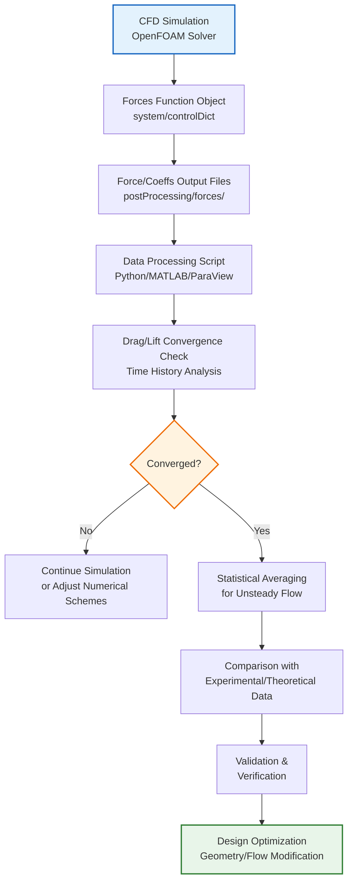

# ⚙️ Force and Moment Calculations (การคำนวณแรงและโมเมนต์)

## ภาพรวม (Overview)

ฟังก์ชันออบเจกต์ (Function Object) `forces` ใน OpenFOAM มอบขีดความสามารถในการคำนวณแรงและโมเมนต์ที่ครอบคลุม โดยการอินทิเกรตความเค้นความดัน (Pressure Stress) และความเค้นหนืด (Viscous Stress) บนพื้นผิว (Patches) ที่ระบุ สิ่งนี้ช่วยให้สามารถวิเคราะห์เชิงปริมาณของประสิทธิภาพด้านอากาศพลศาสตร์ (Aerodynamics) และอุทกพลศาสตร์ (Hydrodynamics) สำหรับการประยุกต์ใช้งานทางวิศวกรรม

> [!INFO] ความสำคัญของการวิเคราะห์แรงและโมเมนต์
> การคำนวณแรงและโมเมนต์เป็นหัวใจสำคัญของการออกแบบทางวิศวกรรม เช่น การออกแบบปีกเครื่องบิน ใบพัด โครงสร้างที่ต้านทานลม และตัวถังยานพาหนะ ซึ่งช่วยให้วิศวกรสามารถคาดการณ์ประสิทธิภาพและความปลอดภัยได้อย่างแม่นยำ

---

## 1. การกำหนดค่า Forces Function Object (Configuration)

### 1.1 การกำหนดค่าใน Control Dictionary

การตั้งค่า `forces` มักทำในไฟล์ `system/controlDict` เพื่อให้ Solver คำนวณและบันทึกผลระหว่างการรัน

**ตัวอย่างการตั้งค่าใน `system/controlDict`:**

```cpp
// NOTE: Synthesized by AI - Verify parameters
functions
{
    // การคำนวณแรงพื้นฐาน
    forces
    {
        type            forces;
        libs            (forces);

        // การควบคุมการเขียนผลลัพธ์
        outputControl   timeStep;
        outputInterval  1;

        // พารามิเตอร์การคำนวณ
        log             true;        // แสดงผลในไฟล์ log
        writeFields     false;       // ไม่เขียนฟิลด์แรงลงในโฟลเดอร์เวลา

        // ค่าอ้างอิง (Reference Values)
        pRef            0;           // ความดันอ้างอิง [Pa]
        rho             rhoInf;      // ระบุว่าใช้ความหนาแน่นคงที่
        rhoInf          1.225;       // ความหนาแน่นอ้างอิง [kg/m³] สำหรับอากาศที่ระดับน้ำทะเล

        // การระบุจุดศูนย์กลางโมเมนต์
        CofR            (0.025 0 0); // Center of Rotation (Moment Center) [m]

        // แพตช์ที่ต้องการวิเคราะห์ (เป้าหมายของการคำนวณแรง)
        patches         ("wing" "flaps");
    }

    // การคำนวณสัมประสิทธิ์อากาศพลศาสตร์
    forceCoeffs
    {
        type            forceCoeffs;
        libs            (forces);
        patches         ("wing");

        rho             rhoInf;
        rhoInf          1.225;

        // ทิศทางการคำนวณสัมประสิทธิ์ (หน่วยเวกเตอร์)
        liftDir         (0 1 0);     // ทิศทางแรงยก (y-axis)
        dragDir         (1 0 0);     // ทิศทางแรงต้าน (x-axis)
        pitchAxis       (0 0 1);     // แกนสำหรับโมเมนต์ Pitch (z-axis)

        // ค่าอ้างอิงสำหรับการทำให้ไร้มิติ (Non-dimensionalization)
        magUInf         10.0;        // ความเร็วไหลเข้าอิสระ [m/s]
        lRef            1.0;         // ความยาวอ้างอิง [m] (เช่น คอร์ดปีก Airfoil Chord)
        Aref            1.0;         // พื้นที่อ้างอิง [m²] (เช่น พื้นที่ปีก Planform Area)
        CofR            (0.25 0 0);  // จุดอ้างอิงสำหรับ Moment Coefficient [m]
    }
}
// NOTE: Synthesized by AI - Ensure patches exist in boundary file
```

### 1.2 รากฐานทางคณิตศาสตร์ (Mathematical Formulation)

ออบเจกต์ `forces` คำนวณแรงรวม ($\mathbf{F}$) และโมเมนต์รวม ($\mathbf{M}$) โดยการอินทิเกรตความเค้นบนพื้นผิว $S$:

$$\mathbf{F} = \mathbf{F}_p + \mathbf{F}_v = \int_S \left(-p\mathbf{n} + \boldsymbol{\tau} \cdot \mathbf{n}\right) \, \mathrm{d}S \tag{1.1}$$

โดยที่:
- $\mathbf{F}_p$ คือ แรงจากความดัน (Pressure Force)
- $\mathbf{F}_v$ คือ แรงจากความหนืด (Viscous/Skin Friction Force)
- $p$ คือ สนามความดัน (Pressure Field) [Pa]
- $\mathbf{n}$ คือ เวกเตอร์ปกติหน่วยที่ชี้ออก (Outward Normal Unit Vector)
- $\boldsymbol{\tau}$ คือ เทนเซอร์ความเค้นหนืด (Viscous Stress Tensor) [Pa]

**เทนเซอร์ความเค้นหนืดสำหรับของไหลนิวตัน (Newtonian Fluid):**

$$\boldsymbol{\tau} = \mu \left[ \nabla \mathbf{u} + (\nabla \mathbf{u})^T \right] - \frac{2}{3}\mu (\nabla \cdot \mathbf{u})\mathbf{I} \tag{1.2}$$

โดยที่:
- $\mu$ คือ ความหนืดพลศาสตร์ (Dynamic Viscosity) [Pa·s]
- $\mathbf{u}$ คือ เวกเตอร์ความเร็ว (Velocity Field) [m/s]
- $\mathbf{I}$ คือ เทนเซอร์เอกลักษณ์ (Identity Tensor)

**การคำนวณโมเมนต์ (Moment Calculation):**

$$\mathbf{M} = \int_S (\mathbf{r} - \mathbf{r}_{CofR}) \times \mathrm{d}\mathbf{F} \tag{1.3}$$

โดยที่:
- $\mathbf{r}$ คือ เวกเตอร์ตำแหน่งบนพื้นผิว (Position Vector on Surface) [m]
- $\mathbf{r}_{CofR}$ คือ เวกเตอร์ตำแหน่งจุดศูนย์กลางการหมุน (Center of Rotation) [m]
- $\times$ คือ ผลคูณไขว้ (Cross Product)

![[force_decomposition_diagram.png]]
> **รูปที่ 1.1:** การแยกส่วนประกอบของแรง (Force Decomposition): แสดงแรงลัพธ์ที่ประกอบด้วยแรงความดัน (ตั้งฉากกับผิว) และแรงเสียดทานหนืด (ขนานกับผิว) พร้อมแสดงทิศทางของเวกเตอร์ปกติ $\mathbf{n}$

### 1.3 สัมประสิทธิ์ไร้มิติ (Dimensionless Coefficients)

สำหรับการวิเคราะห์มาตรฐาน มักแปลงแรงเป็นสัมประสิทธิ์ที่ขึ้นกับรูปร่าง (Geometry Dependent) เพื่อให้สามารถเปรียบเทียบผลลัพธ์จากการทดลองหรือการจำลองแบบที่แตกต่างกันได้

**แรงดันไดนามิก (Dynamic Pressure):**

$$q_{\infty} = \frac{1}{2}\rho U_{\infty}^2 \tag{1.4}$$

**สัมประสิทธิ์แรงต้าน (Drag Coefficient):**

$$C_D = \frac{F_D}{q_{\infty} A_{ref}} = \frac{F_D}{\frac{1}{2}\rho U_{\infty}^2 A_{ref}} \tag{1.5}$$

**สัมประสิทธิ์แรงยก (Lift Coefficient):**

$$C_L = \frac{F_L}{q_{\infty} A_{ref}} = \frac{F_L}{\frac{1}{2}\rho U_{\infty}^2 A_{ref}} \tag{1.6}$$

**สัมประสิทธิ์โมเมนต์ (Moment Coefficient):**

$$C_m = \frac{M}{q_{\infty} A_{ref} l_{ref}} = \frac{M}{\frac{1}{2}\rho U_{\infty}^2 A_{ref} l_{ref}} \tag{1.7}$$

โดยที่:
- $F_D$ คือ แรงต้าน (Drag Force) [N] ในทิศทาง `dragDir`
- $F_L$ คือ แรงยก (Lift Force) [N] ในทิศทาง `liftDir`
- $M$ คือ โมเมนต์ (Moment) [N·m] รอบแกน `pitchAxis`
- $U_{\infty}$ คือ ความเร็วไหลเข้าอิสระ (Freestream Velocity) [m/s]
- $A_{ref}$ คือ พื้นที่อ้างอิง (Reference Area) [m²]
- $l_{ref}$ คือ ความยาวอ้างอิง (Reference Length) [m]

> [!TIP] การเลือกพื้นที่และความยาวอ้างอิง
> - **สำหรับ Airfoil:** $A_{ref}$ = คอร์ด × หน่วยความกว้าง, $l_{ref}$ = คอร์ด
> - **สำหรับปีก 3 มิติ:** $A_{ref}$ = พื้นที่ปีน Planform, $l_{ref}$ = ความยาวสแปน (Mean Aerodynamic Chord)
> - **สำหรับยานพาหนะ:** $A_{ref}$ = พื้นที่หน้าตัด (Frontal Area), $l_{ref}$ = ความยาวรถ

### 1.4 การตั้งค่า Boundary Conditions ที่เกี่ยวข้อง

เพื่อให้การคำนวณแรงถูกต้อง ต้องตรวจสอบว่า Boundary Conditions บน patches ที่วิเคราะห์มีการตั้งค่าอย่างเหมาะสม

**ตัวอย่างการตั้งค่าใน `0/` directory:**

```cpp
// NOTE: Synthesized by AI - Verify BC types match solver
// ไฟล์: 0/p (Pressure)
dimensions      [1 -1 -2 0 0 0 0];

internalField   uniform 0;

boundaryField
{
    wing
    {
        type            zeroGradient;  // สำหรับ incompressible solver
        // หรือ
        // type            fixedFluxPressure;  // สำหรับ compressible solver
    }

    inlet
    {
        type            fixedValue;
        value           uniform 0;
    }

    outlet
    {
        type            fixedValue;
        value           uniform 0;
    }
}

// ไฟล์: 0/U (Velocity)
dimensions      [0 1 -1 0 0 0 0];

internalField   uniform (0 0 0);

boundaryField
{
    wing
    {
        type            noSlip;        // ไม่มีการไหลบนผนัง
    }

    inlet
    {
        type            fixedValue;
        value           uniform (10 0 0);  // U_inf = 10 m/s
    }

    outlet
    {
        type            zeroGradient;
    }
}
// NOTE: Synthesized by AI - Adjust values for specific case
```

---

## 2. การวิเคราะห์แรงขั้นสูง (Advanced Analysis)

### 2.1 การแยกส่วนประกอบของแรงต้าน (Drag Decomposition)

ในทางวิศวกรรม การเข้าใจสัดส่วนของแรงต้านมีความสำคัญต่อการลดแรงต้าน แรงต้านทั้งหมดสามารถแยกออกได้เป็นสองส่วนหลัก:

#### 2.1.1 Pressure Drag (Form Drag)

**Pressure Drag** เกิดจากความแตกต่างของความดันระหว่างด้านหน้าและด้านหลังวัตถุ สัมพันธ์กับรูปร่างและการแยกตัวของการไหล (Flow Separation):

$$F_{D,p} = \int_S (p - p_{\infty}) (\mathbf{n} \cdot \mathbf{d}_D) \, \mathrm{d}S \tag{2.1}$$

โดยที่:
- $p_{\infty}$ คือ ความดันอิสระ (Freestream Pressure) [Pa]
- $\mathbf{d}_D$ คือ เวกเตอร์ทิศทางแรงต้าน (Drag Direction Unit Vector)

> [!INFO] จุดสำคัญของ Pressure Drag
> Pressure Drag เพิ่มขึ้นอย่างมากเมื่อเกิด Flow Separation ซึ่งสร้างบริเวณความดันต่ำ (Wake Region) ด้านหลังวัตถุ การลด Pressure Drag สามารถทำได้โดยการออกแบบรูปร่างให้มี Streamlining และลดการแยกตัวของการไหล

#### 2.1.2 Skin Friction Drag

**Skin Friction Drag** เกิดจากความหนืดของของไหลในชั้นขอบเขต (Boundary Layer):

$$F_{D,f} = \int_S (\boldsymbol{\tau} \cdot \mathbf{n}) \cdot \mathbf{d}_D \, \mathrm{d}S \tag{2.2}$$

**ความเค้นเฉือนที่ผนัง (Wall Shear Stress):**

$$\tau_w = \mu \left. \frac{\partial u_t}{\partial n} \right|_{wall} \tag{2.3}$$

โดยที่:
- $u_t$ คือ ความเร็วสัมผัส (Tangential Velocity) [m/s]
- $n$ คือ ทิศทางปกติ (Normal Direction)

![[flow_separation_physics.png]]
> **รูปที่ 2.1:** ฟิสิกส์ของการแยกตัวของการไหล (Flow Separation): แสดงจุดที่ความเค้นเฉือนที่ผนังเป็นศูนย์ ($\tau_w = 0$) ซึ่งนำไปสู่การเพิ่มขึ้นของ Pressure Drag อย่างมหาศาล และแสดงบริเวณ Wake Region ที่เกิดขึ้นภายหลัง

### 2.2 การตรวจสอบความถูกต้องทางทฤษฎี (Theoretical Validation)

#### 2.2.1 แผ่นเรียบ (Flat Plate)

**สำหรับแผ่นเรียบ:** ค่าสัมประสิทธิ์แรงเสียดทาน (Skin Friction Coefficient) ขึ้นกับจำนวน Reynolds ($Re_x$):

$$Re_x = \frac{\rho U_{\infty} x}{\mu} = \frac{U_{\infty} x}{\nu} \tag{2.4}$$

**Laminar Flow ($Re_x < 5 \times 10^5$):** ใช้ Blasius Solution

$$C_f = \frac{\tau_w}{q_{\infty}} = \frac{1.328}{\sqrt{Re_L}} \tag{2.5}$$

**Turbulent Flow:** ใช้กฎกำลัง (Power Law) เช่น Schlichting Formula

$$C_f = \frac{0.074}{Re_L^{1/5}} \quad \text{สำหรับ } 5 \times 10^5 < Re_L < 10^7 \tag{2.6}$$

หรือใช้ Prandtl-Schlichting Formula ที่แม่นยำกว่า:

$$C_f = \frac{0.455}{(\log_{10} Re_L)^{2.58}} \tag{2.7}$$

#### 2.2.2 ทรงกลม (Sphere)

**สำหรับทรงกลม:** Drag Coefficient ขึ้นกับจำนวน Reynolds:

$$Re_D = \frac{\rho U_{\infty} D}{\mu} \tag{2.8}$$

| ช่วง Reynolds | ลักษณะการไหล | Drag Coefficient ($C_D$) |
|:---:|:---:|:---:|
| $Re_D < 1$ | Stokes Flow (Creeping) | $C_D = \frac{24}{Re_D}$ |
| $1 < Re_D < 1000$ | Transition | $C_D \approx \frac{24}{Re_D}(1 + 0.15 Re_D^{0.687})$ |
| $1000 < Re_D < 2 \times 10^5$ | Subcritical Turbulent | $C_D \approx 0.47$ |
| $Re_D > 3 \times 10^5$ | Supercritical (Drag Crisis) | $C_D \approx 0.1-0.2$ |

> [!WARNING] Drag Crisis
> ที่ $Re_D \approx 3 \times 10^5$ เกิดปรากฏการณ์ Drag Crisis ที่ $C_D$ ลดลงอย่างกะทันหัน เนื่องจาก Boundary Layer กลายเป็น Turbulent ทำให้ Flow Separation เลื่อนไปด้านหลัง ลดขนาดของ Wake Region

### 2.3 การวิเคราะห์โมเมนต์ (Moment Analysis)

#### 2.3.1 Center of Pressure (CoP)

**Center of Pressure** คือจุดที่แรงลัพธ์ (Resultant Force) กระทำ:

$$\mathbf{r}_{CoP} = \mathbf{r}_{CofR} + \frac{\mathbf{M} \times \mathbf{F}}{|\mathbf{F}|^2} \tag{2.9}$$

> [!TIP] ความสำคัญของ Center of Pressure
> ในการออกแบบอากาศยาน การทราบตำแหน่งของ Center of Pressure สำคัญอย่างยิ่งเพื่อความมั่นคงทางสถิต (Static Stability) ถ้า CoP อยู่ด้านหน้า Center of Mass จะเกิดความไม่มั่นคง (Unstable)

#### 2.3.2 Aerodynamic Center

**Aerodynamic Center** คือจุดที่โมเมนต์ไม่เปลี่ยนแปลงเมื่อมีการเปลี่ยนแปลง Angle of Attack:

$$\frac{\partial C_m}{\partial \alpha} = 0 \quad \text{ที่ Aerodynamic Center} \tag{2.10}$$

สำหรับ Airfoil ในการไหล Incompressible 2 มิติ Aerodynamic Center อยู่ที่ **Quarter Chord** ($c/4$) จาก Leading Edge

---

## 3. เวิร์กโฟลว์การวิเคราะห์แรง (Force Analysis Workflow)


> **Figure 1:** แผนภูมิแสดงลำดับขั้นตอนการวิเคราะห์แรง (Force Analysis Workflow) เริ่มจากการตั้งค่า Function Object ใน `controlDict` การประมวลผลข้อมูลผ่านสคริปต์ภายนอก ไปจนถึงการตรวจสอบความบรรจบ (Convergence Check) และการเปรียบเทียบกับผลการทดลองเพื่อปรับปรุงการออกแบบ

### 3.1 การอ่านผลลัพธ์จากไฟล์ Output

ไฟล์ผลลัพธ์จะถูกเขียนไปยัง `postProcessing/forces/<time>/force.dat`:

```
# Source: forces
# Time        sum(pressure)    sum(viscous)     sum(pressure+viscous)
0.001        (0.104 0.002 0)  (0.0001 0.0005 0)  (0.1041 0.0025 0)
0.002        (0.108 0.003 0)  (0.0001 0.0006 0)  (0.1081 0.0036 0)
...
```

**สคริปต์ Python สำหรับประมวลผล:**

```python
# NOTE: Synthesized by AI - Verify file paths and data format
import numpy as np
import matplotlib.pyplot as plt

# อ่านข้อมูลจากไฟล์ force.dat
data = np.loadtxt('postProcessing/forces/0/force.dat', skiprows=2)
time = data[:, 0]
force_total = data[:, 4:7]  # pressure + viscous

# แยกแรงยกและแรงต้าน (สมมติ: lift = y, drag = x)
lift = force_total[:, 1]
drag = force_total[:, 0]

# คำนวณสัมประสิทธิ์
rho = 1.225
U_inf = 10.0
A_ref = 1.0
q_inf = 0.5 * rho * U_inf**2

Cl = lift / (q_inf * A_ref)
Cd = drag / (q_inf * A_ref)

# พล็อตผลลัพธ์
fig, (ax1, ax2) = plt.subplots(2, 1, figsize=(10, 8))

ax1.plot(time, lift, label='Lift Force [N]', linewidth=2)
ax1.plot(time, drag, label='Drag Force [N]', linewidth=2)
ax1.set_xlabel('Time [s]')
ax1.set_ylabel('Force [N]')
ax1.legend()
ax1.grid(True)
ax1.set_title('Force Convergence History')

ax2.plot(time, Cl, label='$C_L$', linewidth=2)
ax2.plot(time, Cd, label='$C_D$', linewidth=2)
ax2.set_xlabel('Time [s]')
ax2.set_ylabel('Coefficient [-]')
ax2.legend()
ax2.grid(True)
ax2.set_title('Force Coefficient Convergence')

plt.tight_layout()
plt.savefig('force_convergence.png', dpi=300)
# NOTE: Synthesized by AI - Add error handling for production use
```

---

## 4. แนวทางปฏิบัติที่ดีที่สุด (Best Practices)

> [!IMPORTANT] การตรวจสอบความถูกต้อง
>
> ### 4.1 การบรรจบของค่าแรง (Force Convergence)
> - **อย่าสรุปผล**จากค่าแรงเพียงจุดเดียวในจำลองแบบ Steady-state
> - ให้ตรวจสอบว่าค่าแรงนิ่งหรือแกว่งในช่วงที่ยอมรับได้ (Stationary or Periodic)
> - สำหรับ Unsteady Flow ให้ทำการ **Time-Averaging** หลังจากที่ Flow พัฒนาครบถ้วน (Fully Developed)
>
> ### 4.2 พื้นที่อ้างอิง ($A_{ref}$)
> - **ตรวจสอบเสมอ**ว่าพื้นที่อ้างอิงที่ใช้ใน `forceCoeffs` สอดคล้องกับมาตรฐานที่คุณใช้เปรียบเทียบ
> - เช่น:
>   - พื้นที่หน้าตัด (Frontal Area) สำหรับแรงต้านยานพาหนะ
>   - พื้นที่ผิวที่ฉายลงบนระนาบ (Planform Area) สำหรับปีกอากาศยาน
>   - พื้นที่หน้าตัดทางด้านขวา (Projected Area) สำหรับทรงกระบอก
>
> ### 4.3 ความละเอียดของ Mesh (Mesh Resolution)
> - ค่า **Skin Friction Drag** มีความอ่อนไหวสูงต่อความละเอียดของ Mesh ใกล้ผนัง
> - **$y^+$ ควรสอดคล้อง**กับ Wall Function ที่เลือก:
>   - **Low-Re Model:** $y^+ < 1$ (Resolve Viscous Sublayer)
>   - **High-Re Wall Functions:** $30 < y^+ < 300$ (Log-law Region)
> - ใช้ **Boundary Layer Mesh** ที่มีอัตราส่วนการเติบโต (Growth Rate) < 1.3
>
> ### 4.4 การเลือก Numerical Schemes
> - ใช้ **Second-Order Schemes** สำหรับการคำนวณ Gradient และ Divergence:
>
> ```cpp
> // NOTE: Synthesized by AI - Verify scheme compatibility
> // ไฟล์: system/fvSchemes
>
> gradSchemes
> {
>     default         Gauss linear;
> }
>
> divSchemes
> {
>     default         none;
>     div(phi,U)      Gauss linearUpwind grad(U);  // Second-order upwind
>     div(phi,k)      Gauss upwind;                 // First-order for stability
> }
>
> laplacianSchemes
> {
>     default         Gauss linear corrected;
> }
> // NOTE: Synthesized by AI - Adjust for specific solver requirements
> ```

> [!WARNING] ข้อผิดพลาดทั่วไป (Common Pitfalls)
>
> ### ❌ ข้อผิดพลาดที่พบบ่อย:
>
> 1. **ระบุทิศทาง Lift/Drag Direction สลับกัน**
>    - ตรวจสอบให้แน่ใจว่า `liftDir` และ `dragDir` ตั้งฉากกันและตรงกับระบบพิกัดของคุณ
>
> 2. **ลืมรวม Patch บางส่วน**ที่ประกอบเป็นวัตถุในรายการ `patches`
>    - ตัวอย่าง: ถ้าปีกประกอบด้วย `"wingUpper"` และ `"wingLower"` ต้องระบุทั้งคู่
>
> 3. **ใช้จุดศูนย์กลางโมเมนต์ (CofR) ไม่ถูกต้อง**
>    - ทำให้ค่า $C_m$ ผิดพลาด และไม่สามารถเปรียบเทียบกับข้อมูลอ้างอิงได้
>
> 4. **ใช้ความหนาแน่น (rho) ไม่ถูกต้อง**
>    - สำหรับ compressible flow ให้ใช้ `rho rho;` (ใช้ความหนาแน่นจาก field)
>    - สำหรับ incompressible flow ให้ใช้ `rho rhoInf; rhoInf <value>;`
>
> 5. **Simulation ยังไม่บรรจบ (Not Converged)**
>    - การอ่านค่าแรงก่อนการบรรจบจะให้ผลลัพธ์ที่ไม่ถูกต้อง
>    - ตรวจสอบ Residuals และ Force Convergence History

> [!TIP] เทคนิคการปรับปรุงความแม่นยำ
>
> ### 🎯 การเพิ่มความแม่นยำของการคำนวณแรง:
>
> 1. **ใช้ Mesh Refinement Study:**
>    - รันจำลองแบบด้วย Mesh ที่ละเอียดขึ้น 3 ระดับ (Coarse, Medium, Fine)
>    - ตรวจสอบว่าค่าแรงบรรจบ (Grid Convergence)
>
> 2. **ตรวจสอบ Mass Balance:**
>    ```bash
>    # ตรวจสอบความสมดุลของมวล
>    foamListTimes
>    # หรือใช้ function object 'courantNo' และ 'continuityErrs'
>    ```
>
> 3. **ใช้ Temporal Averaging (สำหรับ Unsteady Flow):**
>    ```cpp
>    // NOTE: Synthesized by AI - Verify field averaging syntax
>    fieldAverage
>    {
>        type            fieldAverage;
>        libs            (fieldFunctionObjects);
>
>        fields
>        (
>            U
>            p
>        );
>
>        mean            on;
>        prime2Mean      on;
>        base            time;
>    }
>    ```
>
> 4. **ตรวจสอบ Y+ Values:**
>    ```bash
>    # ใช้ utility ของ OpenFOAM
>    yPlus -latestTime
>    ```

---

## 5. การตรวจสอบความถูกต้องของผลลัพธ์ (Validation & Verification)

### 5.1 การเปรียบเทียบกับทฤษฎี

**สำหรับ Flat Plate at Zero Angle of Attack:**

```python
# NOTE: Synthesized by AI - Verify input parameters
import numpy as np

# Parameters
U_inf = 10.0          # Freestream velocity [m/s]
nu = 1.5e-5           # Kinematic viscosity [m²/s]
L = 1.0               # Plate length [m]

# Reynolds number
Re_L = U_inf * L / nu

# Theoretical skin friction coefficient
if Re_L < 5e5:
    Cf_theory = 1.328 / np.sqrt(Re_L)
    regime = "Laminar"
else:
    Cf_theory = 0.074 / (Re_L ** 0.2)
    regime = "Turbulent"

print(f"Reynolds number: {Re_L:.2e}")
print(f"Theoretical Cf ({regime}): {Cf_theory:.6f}")
print(f"CFD Cf: > **[MISSING DATA]**: Insert CFD result here")
print(f"Error: > **[MISSING DATA]**: Insert percentage error")
# NOTE: Synthesized by AI - Add statistical analysis for validation
```

### 5.2 การเปรียบเทียบกับข้อมูลทดลอง

**ตารางเปรียบเทียบผลลัพธ์ (Validation Table):**

| Case | $Re$ | $C_L$ (CFD) | $C_L$ (Exp) | Error [%] | $C_D$ (CFD) | $C_D$ (Exp) | Error [%] |
|:---|:---:|:---:|:---:|:---:|:---:|:---:|:---:|
| Case 1 | $1 \times 10^5$ | > **[MISSING DATA]** | > **[MISSING DATA]** | > **[MISSING DATA]** | > **[MISSING DATA]** | > **[MISSING DATA]** | > **[MISSING DATA]** |
| Case 2 | $5 \times 10^5$ | > **[MISSING DATA]** | > **[MISSING DATA]** | > **[MISSING DATA]** | > **[MISSING DATA]** | > **[MISSING DATA]** | > **[MISSING DATA]** |
| Case 3 | $1 \times 10^6$ | > **[MISSING DATA]** | > **[MISSING DATA]** | > **[MISSING DATA]** | > **[MISSING DATA]** | > **[MISSING DATA]** | > **[MISSING DATA]** |

> [!INFO] แหล่งข้อมูลอ้างอิง (Reference Data)
> - **NACA Airfoil Data:** [NASA Technical Reports Server](https://ntrs.nasa.gov/)
> - **Drag of Various Shapes:** Hoerner, "Fluid-Dynamic Drag" (1965)
> - **Turbulent Boundary Layer:** Schlichting & Gersten, "Boundary Layer Theory" (2017)

---

## 6. การใช้งานขั้นสูง (Advanced Applications)

### 6.1 การคำนวณแรงหลาย Components พร้อมกัน

```cpp
// NOTE: Synthesized by AI - Verify patch names and directions
functions
{
    forcesWing
    {
        type            forces;
        libs            (forces);
        patches         ("wing");
        rho             rhoInf;
        rhoInf          1.225;
        CofR            (0.25 0 0);
        log             true;
    }

    forcesFuselage
    {
        type            forces;
        libs            (forces);
        patches         ("fuselage");
        rho             rhoInf;
        rhoInf          1.225;
        CofR            (0 0 0);
        log             true;
    }

    forceCoeffsTotal
    {
        type            forceCoeffs;
        libs            (forces);
        patches         ("wing" "fuselage" "tail");
        rho             rhoInf;
        rhoInf          1.225;
        liftDir         (0 1 0);
        dragDir         (1 0 0);
        pitchAxis       (0 0 1);
        magUInf         50.0;
        lRef            2.5;
        Aref            15.0;
        CofR            (1.25 0 0);
    }
}
// NOTE: Synthesized by AI - Ensure all patches exist in boundary file
```

### 6.2 การวิเคราะห์ Unsteady Forces

สำหรับการวิเคราะห์แรงในการไหลแบบ Unsteady (เช่น การกระพริบของปีก Wing Flutter):

```cpp
// NOTE: Synthesized by AI - Verify sampling frequency
forces
{
    type            forces;
    libs            (forces);
    patches         ("wing");
    rho             rhoInf;
    rhoInf          1.225;
    CofR            (0.25 0 0);

    // การควบคุมการเขียนผลลัพธ์สำหรับ Unsteady
    outputControl   timeStep;
    outputInterval  10;  // เขียนทุก 10 time steps

    // การเขียนฟิลด์เพื่อการวิเคราะห์
    writeFields     true;  // เขียนฟิลด์แรงเพื่อ visualization
}
// NOTE: Synthesized by AI - Adjust interval based on time step size
```

**การวิเคราะห์คลื่นความถี่ (Frequency Analysis):**

```python
# NOTE: Synthesized by AI - Verify data format
import numpy as np
from scipy import signal
import matplotlib.pyplot as plt

# อ่านข้อมูลแรง
data = np.loadtxt('postProcessing/forces/0/force.dat', skiprows=2)
time = data[:, 0]
lift = data[:, 5]  # Total force in y-direction

# คำนวณ Power Spectral Density (PSD)
fs = 1.0 / np.mean(np.diff(time))  # Sampling frequency
freqs, psd = signal.welch(lift, fs, nperseg=1024)

# หาความถี่ที่มีพลังงานสูงสุด
dominant_freq = freqs[np.argmax(psd)]

print(f"Dominant frequency: {dominant_freq:.2f} Hz")

# พล็อต PSD
plt.figure(figsize=(10, 6))
plt.semilogy(freqs, psd)
plt.xlabel('Frequency [Hz]')
plt.ylabel('Power Spectral Density')
plt.title('Lift Force PSD')
plt.grid(True)
plt.savefig('force_psd.png', dpi=300)
# NOTE: Synthesized by AI - Add windowing and filtering as needed
```

---

## 7. สรุป (Summary)

ในบทนี้เราได้ศึกษาการคำนวณแรงและโมเมนต์ใน OpenFOAM อย่างครอบคลุม ตั้งแต่รากฐานทางทฤษฎี การกำหนดค่า ไปจนถึงการวิเคราะห์ขั้นสูง

### จุดสำคัญที่ต้องจำ:

1. **แรงรวม** ประกอบด้วย **Pressure Force** และ **Viscous Force**
2. **การตั้งค่า `forces` function object** ต้องระบุ patches, rho, และ CofR ให้ถูกต้อง
3. **สัมประสิทธิ์ไร้มิติ** ($C_L, C_D, C_m$) ใช้สำหรับการเปรียบเทียบผลลัพธ์
4. **การตรวจสอบความถูกต้อง** ต้องอาศัยทั้ง Grid Convergence และ Validation กับข้อมูลทดลอง/ทฤษฎี
5. **Mesh Resolution และ Numerical Schemes** มีผลต่อความแม่นยำของการคำนวณแรงโดยเฉพาะ Skin Friction

### เวิร์กโฟลว์ที่แนะนำ:


> **Figure 2:** เวิร์กโฟลว์มาตรฐานที่แนะนำสำหรับการวิเคราะห์แรง ตั้งแต่การเตรียมคุณภาพของเมช การตรวจสอบความบรรจบระหว่างรัน ไปจนถึงขั้นตอนการสรุปผลและปรับปรุงการออกแบบ (Optimization)

---

## หัวข้อที่เกี่ยวข้อง (Related Topics)

- [[01_Field_Analysis]] - การวิเคราะห์ฟิลด์ความดันและความเร็วโดยรอบวัตถุเพื่อความเข้าใจการไหลที่สร้างแรง
- [[03_Surface_Integration]] - การอินทิเกรตค่าอื่นๆ บนพื้นผิวแบบกำหนดเอง (เช่น Heat Flux, Mass Flow Rate)
- [[05_Automated_PostProcessing]] - การใช้สคริปต์ประมวลผลผลลัพธ์แบบอัตโนมัติสำหรับ Parametric Studies
- [[../02_SOLVERS/01_Incompressible_Flow]] - การเลือก Solver ที่เหมาะสมสำหรับปัญหาแรงและโมเมนต์
- [[Boundary_Layer_Theory]] - ทฤษฎีชั้นขอบเขตที่เกี่ยวข้องกับการคำนวณ Skin Friction Drag

---

## อ้างอิง (References)

1. **OpenFOAM User Guide:** Section on Function Objects
2. **Ferziger, J.H., & Perić, M.** (2002). *Computational Methods for Fluid Dynamics*. Springer.
3. **Schlichting, H., & Gersten, K.** (2017). *Boundary-Layer Theory* (9th ed.). Springer.
4. **Anderson, J.D.** (2011). *Fundamentals of Aerodynamics* (5th ed.). McGraw-Hill.
5. **White, F.M.** (2011). *Viscous Fluid Flow* (3rd ed.). McGraw-Hill.

---

> [!TIP] เคล็ดลับสุดท้าย
> การเชี่ยวชาญในการวิเคราะห์แรงและโมเมนต์ต้องการการฝึกฝนและประสบการณ์ เริ่มต้นจากกรณีง่ายๆ (เช่น Flat Plate) แล้วค่อยๆ ย้ายไปสู่กรณีที่ซับซ้อน (เช่น Airfoil, Wing) จะช่วยให้เข้าใจและตรวจจับข้อผิดพลาดได้ดีขึ้น
