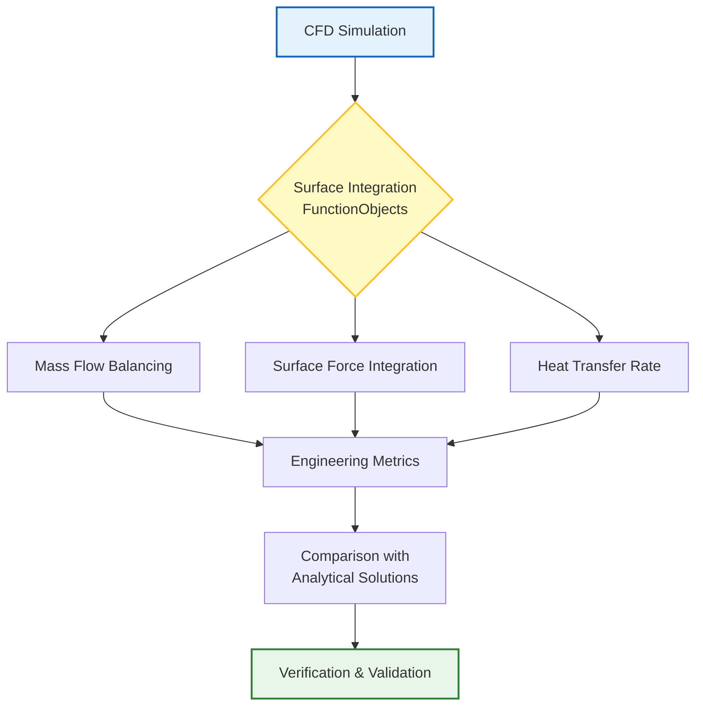

# 📈 Surface Integration and Heat Transfer (การอินทิเกรตพื้นผิวและการถ่ายเทความร้อน)

**วัตถุประสงค์การเรียนรู้**: เชี่ยวชาญเทคนิคการอินทิเกรตพื้นผิวสำหรับการคำนวณอัตราการไหล (Flux), การวิเคราะห์การถ่ายเทความร้อน และการระบุคุณลักษณะการไหลบริเวณผนังใน OpenFOAM

---

## 1. พื้นฐานการอินทิเกรตฟิลด์บนพื้นผิว (Surface Field Integration Fundamentals)

### 1.1 รากฐานทางคณิตศาสตร์ (Mathematical Foundation)

การอินทิเกรตพื้นผิวใน OpenFOAM มอบข้อมูลเชิงปริมาณที่สำคัญสำหรับการวิเคราะห์ทางวิศวกรรม เช่น แรงลัพธ์, อัตราการไหลของมวล และอัตราการถ่ายเทความร้อนผ่านขอบเขตที่กำหนด

**การอินทิเกรตบนพื้นผิวใน CFD (Surface Integration in CFD):**

การดำเนินการทางคณิตศาสตร์หลักบนหน้าเซลล์ (Faces) ที่ประกอบเป็นพื้นผิว $S$ ได้แก่:

**อัตราการไหลของมวล (Mass Flow Rate):**
$$\dot{m} = \int_S \rho \mathbf{u} \cdot \mathbf{n} \,\mathrm{d}S \approx \sum_i \rho_i \phi_i$$ 
โดยที่ $\phi_i = \mathbf{u}_i \cdot \mathbf{A}_i$ คือฟลักซ์ปริมาตร (Volumetric Flux) ผ่านหน้าเซลล์ $i$

**อัตราการถ่ายเทความร้อน (Heat Transfer Rate):**
$$\dot{Q} = \int_S q'' \,\mathrm{d}S = \int_S -k \frac{\partial T}{\partial n} \,\mathrm{d}S$$ 

![[surface_flux_integration.png]]
> **รูปที่ 1.1:** การอินทิเกรตฟลักซ์บนพื้นผิว (Surface Flux Integration): แสดงการรวมปริมาณฟิลด์ผ่านหน้าเซลล์ โดยพิจารณาทิศทางของเวกเตอร์พื้นที่ $\mathbf{A}$ และความหนาแน่นของฟิลด์

### 1.2 การใช้งานใน OpenFOAM (OpenFOAM Implementation)

ฟังก์ชันออบเจกต์ `surfaceFieldValue` ช่วยให้สามารถคำนวณค่าอินทิเกรตเหล่านี้ได้ทั้งระหว่างการจำลอง (Runtime) และหลังการจำลอง (Post-processing)

**การกำหนดค่าใน `system/controlDict`:**

```cpp
functions
{
    // การคำนวณอัตราการไหลของมวลที่ทางเข้าและทางออก
    flowRates
    {
        type            surfaceFieldValue;
        libs            (fieldFunctionObjects);
        
        operation       sum;          // รวมค่าฟลักซ์ทั้งหมด
        regionType      patch;        // ระบุประเภทพื้นที่เป็น patch
        name            inlet_outlet_flow;
        
        fields          (phi);        // ฟิลด์ที่จะอินทิเกรต (Mass/Volume Flux)
        patches         (inlet outlet);
        
        writeControl    timeStep;
        writeInterval   10;
        log             true;         // แสดงผลในหน้าจอ Terminal
    }
}
```

---

## 2. การวิเคราะห์การถ่ายเทความร้อนขั้นสูง (Advanced Heat Transfer)

### 2.1 การถ่ายเทความร้อนแบบคอนจูเกต (Conjugate Heat Transfer - CHT)

CHT เป็นการจำลองที่มีการแลกเปลี่ยนความร้อนระหว่างโดเมนของไหล (Fluid) และของแข็ง (Solid) โดยมีเงื่อนไขความต่อเนื่องที่ส่วนต่อประสาน (Interface):

![[conjugate_heat_transfer_interface.png]]
> **รูปที่ 2.1:** ส่วนต่อประสานการถ่ายเทความร้อนแบบคอนจูเกต (CHT Interface): แสดงความต่อเนื่องของอุณหภูมิและฟลักซ์ความร้อน

**เงื่อนไขที่ส่วนต่อประสาน (Interface Conditions):**
1. **ความต่อเนื่องของอุณหภูมิ:** $T_f = T_s$
2. **ความต่อเนื่องของฟลักซ์ความร้อน:** $-k_f \left(\frac{\partial T_f}{\partial n}\right) = -k_s \left(\frac{\partial T_s}{\partial n}\right)$

### 2.2 หมายเลข Nusselt (Nusselt Number Analysis)

Nusselt number ($Nu$) คืออัตราส่วนระหว่างการพาความร้อน (Convection) ต่อการนำความร้อน (Conduction) ซึ่งเป็นค่าไร้มิติที่สำคัญในการวิเคราะห์ประสิทธิภาพการระบายความร้อน

**Local Nusselt Number ($\text{Nu}_x$):**
$$\text{Nu}_x = \frac{h_x L}{k_f} = \frac{q''_w L}{k_f (T_w - T_{ref})}$$

**Average Nusselt Number ($\overline{\text{Nu}}_L$):**
$$\overline{\text{Nu}}_L = \frac{\overline{h} L}{k_f} = \frac{1}{L} \int_0^L \text{Nu}_x \, \mathrm{d}x$$

โดยที่:
- $h_x$ = สัมประสิทธิ์การถ่ายเทความร้อนแบบพากำลัง (Local Convective Heat Transfer Coefficient)
- $q''_w$ = ความหนาแน่นของฟลักซ์ความร้อนที่ผนัง (Wall Heat Flux)
- $T_w$ = อุณหภูมิที่ผนัง (Wall Temperature)
- $T_{ref}$ = อุณหภูมิอ้างอิง (Reference Temperature, เช่น Bulk/Free Stream)
- $L$ = ความยาวคุณลักษณะ (Characteristic Length)
- $k_f$ = ความนำความร้อนของของไหล (Fluid Thermal Conductivity)

### 2.3 การคำนวณ Heat Flux Coefficient ใน OpenFOAM

ใน OpenFOAM ค่า Heat Transfer Coefficient ($h$) สามารถคำนวณได้จากความสัมพันธ์:

$$h = \frac{q''_w}{T_w - T_{ref}} = \frac{-k_f \left.\frac{\partial T}{\partial n}\right|_w}{T_w - T_{ref}}$$

**การตั้งค่า FunctionObject สำหรับ Heat Transfer Analysis:**

```cpp
functions
{
    // NOTE: Synthesized by AI - Verify parameters
    heatTransferAnalysis
    {
        type            surfaceFieldValue;
        libs            (fieldFunctionObjects);

        // การคำนวณอัตราการถ่ายเทความร้อนผ่านผนัง
        operation       sum;
        regionType      patch;
        name            wallHeatFlux;

        fields          (phiK);  // Conductive Heat Flux (phiK = -k*grad(T))
        patches         (hotWall coldWall);

        writeControl    timeStep;
        writeInterval   50;
        log             true;

        // การคำนวณค่าเฉลี่ย
        writeFields     true;
    }

    // การคำนวณ Nusselt Number โดยตรง
    nusseltNumber
    {
        type            surfaceFieldValue;
        libs            (fieldFunctionObjects);

        operation       weightedAverage;
        regionType      patch;
        name            nusseltCalc;

        fields          (T);      // Temperature field
        patches         (heatedSurface);

        weightField     none;

        // การคำนวณค่า h และ Nu
        // NOTE: ต้องมีการ post-process เพิ่มเติมเพื่อคำนวณ h และ Nu
        writeControl    timeStep;
        writeInterval   50;
    }
}
```

**สูตรคำนวณค่า h และ Nu จากข้อมูล OpenFOAM:**

```cpp
// NOTE: Synthesized by AI - Verify formulation
// ในไฟล์ custom function object หรือ post-processing script:

// อ่านค่าจาก surfaceFieldValue
scalar q_wall = sum(phiK) / patchArea;  // [W/m²]
scalar T_wall = average(T) @ patch;     // [K]
scalar T_ref = average(T) @ inlet;      // [K] (bulk temperature)

// คำนวณ h
scalar h = q_wall / (T_wall - T_ref);   // [W/(m²·K)]

// คำนวณ Nu
dimensionedScalar L("L", dimLength, 0.1);  // Characteristic length [m]
dimensionedScalar k_f("k_f", dimThermalConductivity, 0.025);  // [W/(m·K)]

scalar Nu = h * L.value() / k_f.value();
```

### 2.4 Reynolds Analogy สำหรับ Turbulent Flow

สำหรับการไหลแบบ Turbulent สามารถประมาณค่า Heat Transfer จาก Skin Friction ได้โดยใช้ Reynolds Analogy:

**Reynolds Analogy (Classic):**
$$\text{St} = \frac{\text{Nu}}{\text{Re} \cdot \text{Pr}} = \frac{C_f}{2}$$

**Modified Reynolds Analogy (Chilton-Colburn):**
$$j_H = \text{St} \cdot \text{Pr}^{2/3} = \frac{C_f}{2}$$

โดยที่:
- $\text{St} = \frac{\text{Nu}}{\text{Re} \cdot \text{Pr}}$ = Stanton Number
- $C_f = \frac{\tau_w}{0.5 \rho U^2}$ = Skin Friction Coefficient
- $\text{Pr} = \frac{\mu c_p}{k}$ = Prandtl Number

---

## 3. Surface Forces Integration (การอินทิเกรตแรงบนพื้นผิว)

### 3.1 รากฐานทางคณิตศาสตร์ของ Surface Forces

แรงที่กระทำต่อพื้นผิวในการไหลของไหล (Fluid Forces) ประกอบด้วยสองส่วนหลัก:

**แรงทั้งหมดบนพื้นผิว (Total Surface Force):**
$$\mathbf{F} = \int_S \boldsymbol{\sigma} \cdot \mathbf{n} \, \mathrm{d}S = \int_S \left(-p\mathbf{I} + \boldsymbol{\tau}\right) \cdot \mathbf{n} \, \mathrm{d}S$$

โดยแยกเป็น:
1. **แรงดัน (Pressure Force):**
   $$\mathbf{F}_p = -\int_S p \mathbf{n} \, \mathrm{d}S$$

2. **แรงเฉือน (Viscous/Shear Force):**
   $$\mathbf{F}_\tau = \int_S \boldsymbol{\tau} \cdot \mathbf{n} \, \mathrm{d}S$$

โดยที่:
- $\boldsymbol{\sigma} = -p\mathbf{I} + \boldsymbol{\tau}$ = Cauchy Stress Tensor
- $p$ = ความดัน (Pressure)
- $\mathbf{n}$ = เวกเตอร์หน่วยฉากตัดกับพื้นผิว (Unit Normal Vector)
- $\boldsymbol{\tau} = \mu\left[\nabla\mathbf{u} + (\nabla\mathbf{u})^T\right]$ = Viscous Stress Tensor
- $\mu$ = ความหนืดของไหล (Dynamic Viscosity)

### 3.2 การคำนวณ Lift และ Drag Forces

สำหรับการวิเคราะห์อากาศพลศาสตร์ (Aerodynamics) แรงที่ได้มักถูกฉายลงบนทิศทางสำคัญ:

**Drag Force ($F_D$):**
$$F_D = \int_S \left(-p \mathbf{n} + \boldsymbol{\tau} \cdot \mathbf{n}\right) \cdot \mathbf{e}_D \, \mathrm{d}S = F_{D,p} + F_{D,\tau}$$

**Lift Force ($F_L$):**
$$F_L = \int_S \left(-p \mathbf{n} + \boldsymbol{\tau} \cdot \mathbf{n}\right) \cdot \mathbf{e}_L \, \mathrm{d}S = F_{L,p} + F_{L,\tau}$$

**Coefficients (สัมประสิทธิ์):**
$$C_D = \frac{F_D}{0.5 \rho U_\infty^2 A_{ref}}, \quad C_L = \frac{F_L}{0.5 \rho U_\infty^2 A_{ref}}$$

### 3.3 การตั้งค่า FunctionObject สำหรับ Surface Forces

```cpp
functions
{
    // NOTE: Synthesized by AI - Verify parameters
    surfaceForces
    {
        type            forces;
        libs            (forces);

        // การเลือก patch ที่จะคำนวณแรง
        patches         (airfoilSurface wingBody);

        // ทิศทางของ Lift และ Drag
        // Drag: ทิศทางการไหล (Flow Direction)
        dragDirection   (1 0 0);

        // Lift: ทิศทางตั้งฉากกับการไหล
        liftDirection   (0 1 0);

        // ค่าอ้างอิงสำหรับการคำนวณ Coefficients
        rho             rhoInf;        // ความหนาแน่นอ้างอิง
        pRef            0;             // ความดันอ้างอิง [Pa]
        CofR            (0 0 0);       // Center of Rotation
        magUInf         10.0;          // ความเร็วอ้างอิง [m/s]
        lRef            0.1;           // ความยาวอ้างอิง [m]
        Aref            0.01;          // พื้นที่อ้างอิง [m²]

        // การบันทึกข้อมูล
        writeControl    timeStep;
        writeInterval   10;
        log             true;

        // การเขียนฟิลด์กำลัง (Force Field) เพื่อ Visualization
        writeFields     true;
    }

    // การคำนวณ Force Coefficients โดยตรง
    forceCoeffs
    {
        type            forceCoeffs;
        libs            (forces);

        patches         (airfoilSurface);

        // ทิศทาง
        dragDir         (1 0 0);
        liftDir         (0 1 0);
        pitchAxis       (0 0 1);

        // ค่าอ้างอิง
        rhoInf          1.225;        // [kg/m³] (Standard Air)
        pRef            0;            // [Pa]
        CofR            (0 0 0);
        magUInf         10.0;         // [m/s]
        lRef            0.1;          // [m]
        Aref            0.01;         // [m²]

        writeControl    timeStep;
        writeInterval   10;
        log             true;
    }
}
```

### 3.4 การวิเคราะห์ Moment และ Center of Pressure

**Moment รอบจุดอ้างอิง:**
$$\mathbf{M}_{O} = \int_S \left(\mathbf{r} \times \boldsymbol{\sigma} \cdot \mathbf{n}\right) \, \mathrm{d}S$$

**Center of Pressure ($x_{cp}$):**
$$x_{cp} = \frac{\int_S x \left(-p \mathbf{n} + \boldsymbol{\tau} \cdot \mathbf{n}\right) \cdot \mathbf{e}_L \, \mathrm{d}S}{F_L}$$

---

## 4. ขั้นตอนการทำงาน (Workflow)


> **Figure 1:** แผนภูมิแสดงกระบวนการทำงานสำหรับการอินทิเกรตบนพื้นผิว (Surface Integration) โดยใช้ FunctionObjects เพื่อคำนวณมาตรวัดทางวิศวกรรมที่สำคัญ เช่น สมดุลมวล แรงลัพธ์ และอัตราการถ่ายเทความร้อน เพื่อใช้ในการตรวจสอบความถูกต้องของผลการจำลอง

---

## 5. การคำนวณอัตราการไหลขั้นสูง (Advanced Flow Rate Calculations)

### 5.1 การวิเคราะห์ Mass Balance

การตรวจสอบสมดุลมวล (Mass Balance Check) เป็นสิ่งสำคัญในการยืนยันความถูกต้องของการจำลอง:

**Mass Balance Equation:**
$$\sum_{\text{inlets}} \dot{m}_{\text{in}} - \sum_{\text{outlets}} \dot{m}_{\text{out}} - \frac{\mathrm{d}}{\mathrm{d}t}\int_V \rho \, \mathrm{d}V = 0$$

สำหรับ Steady-state:
$$\sum \dot{m}_{\text{in}} = \sum \dot{m}_{\text{out}}$$

### 5.2 การตั้งค่า FunctionObject สำหรับ Flow Analysis

```cpp
functions
{
    // NOTE: Synthesized by AI - Verify parameters
    massBalanceCheck
    {
        type            surfaceFieldValue;
        libs            (fieldFunctionObjects);

        // คำนวณ Mass Flow Rate: โดยตรงจาก phi
        operation       sum;
        regionType      patch;
        name            massFlowRate;

        fields          (phi);
        patches         (inlet outlet1 outlet2);

        writeControl    timeStep;
        writeInterval   1;
        log             true;
    }

    // การคำนวณ Average Velocity และ Flow Properties
    velocityStats
    {
        type            surfaceFieldValue;
        libs            (fieldFunctionObjects);

        operation       weightedAverage;
        regionType      patch;
        name            avgVelocity;

        fields          (U);
        patches         (inlet);

        weightField     phi;  // Weight by mass/volume flux

        writeControl    timeStep;
        writeInterval   10;
        log             true;
    }
}
```

---

## 6. แนวทางปฏิบัติที่ดีที่สุด (Best Practices)

> [!WARNING] ความละเอียดของ Mesh ที่ผนัง
> การคำนวณ Heat Flux และ Surface Forces มีความอ่อนไหวสูงมากต่อเกรเดียนต์ใกล้ผนัง ควรตรวจสอบให้แน่ใจว่าค่า $y^+$ และความหนาของชั้น Mesh บริเวณผนังมีความละเอียดเพียงพอที่จะจับภาพ Physical Gradients ได้อย่างแม่นยำ

> [!TIP] การสมดุลมวล (Mass Balance)
> ควรใช้ `surfaceFieldValue` เพื่อตรวจสอบผลรวมของ `phi` (Flux) ระหว่าง Inlet และ Outlet เสมอ หากค่าผลรวมไม่ใกล้เคียงศูนย์ แสดงว่าการจำลองยังไม่บรรจบทางตัวเลข (Numerical Convergence Issues) หรือมีปัญหาที่ Mesh

> [!INFO] การเลือก Operation ที่เหมาะสม
> OpenFOAM มีหลาย operations สำหรับ surface integration:
> - `sum`: ผลรวมของค่าทั้งหมด (เหมาะสำหรับ Mass Flow, Heat Transfer Rate)
> - `weightedAverage`: ค่าเฉลี่ยถ่วงน้ำหนัก (เหมาะสำหรับ Average Velocity)
> - `areaAverage`: ค่าเฉลี่ยบนพื้นที่ (เหมาะสำหรับ Average Pressure)
> - `min`/`max`: ค่าต่ำสุด/สูงสุด (เหมาะสำหรับ Extreme Values)
> - `magnitude`: ขนาดของเวกเตอร์ (เหมาะสำหรับ Force Magnitude)

> [!WARNING] การตีความผลลัพธ์ของ Forces
> ค่า Forces ที่คำนวณได้จาก `forces` functionObject เป็นค่า **Instantaneous** สำหรับการไหลแบบ Turbulent ควรใช้ **Time-Averaging** เพื่อให้ได้ค่าที่มีความหมายทางสถิติ สามารถทำได้โดย:
> 1. รันการจำลองจนถึง Steady-state ในเชิงสถิติ (Statistical Steady-State)
> 2. ใช้ `probeLocation` หรือ `sampledSurface` เพื่อบันทึกข้อมูล Time History
> 3. คำนวณค่าเฉลี่ยเชิงเวลา (Time Average) จากข้อมูลที่บันทึก

### 6.1 การตรวจสอบความถูกต้อง (Verification Checklist)

| ขั้นตอน | รายการตรวจสอบ | วิธีการ |
|---------|-----------------|---------|
| 1 | Mass Balance | ตรวจสอบ $\sum \dot{m}_{in} \approx \sum \dot{m}_{out}$ |
| 2 | Mesh Independence | ทดสอบ sensitivity ของค่า Nu และ Forces ต่อความละเอียด Mesh |
| 3 | y+ Check | ตรวจสอบว่า $y^+$ อยู่ในช่วงที่เหมาะสมกับ Turbulence Model |
| 4 | Time Convergence | ตรวจสอบว่าค่า Forces/Heat Flux บรรจบแล้ว |
| 5 | Validation | เปรียบเทียบกับ Experimental Data หรือ Empirical Correlations |

### 6.2 ตัวอย่างการใช้งานร่วมกับ Solver ที่แตกต่างกัน

**สำหรับ Incompressible Flow (simpleFoam, pimpleFoam):**
```cpp
// NOTE: Synthesized by AI - Verify solver compatibility
functions
{
    incompressibleForces
    {
        type            forces;
        libs            (forces);

        patches         (obstacle);
        rho             rhoInf;      // ใช้ค่าคงที่
        rhoInf          1000;        // [kg/m³] สำหรับ water
        // ... การตั้งค่าอื่นๆ
    }
}
```

**สำหรับ Compressible Flow (rhoSimpleFoam, rhoPimpleFoam):**
```cpp
// NOTE: Synthesized by AI - Verify solver compatibility
functions
{
    compressibleForces
    {
        type            forces;
        libs            (forces);

        patches         (airfoil);
        rho             rho;         // ใช้ฟิลด์ความหนาแน่น
        // ... การตั้งค่าอื่นๆ
    }
}
```

**สำหรับ Heat Transfer (buoyantSimpleFoam, buoyantPimpleFoam):**
```cpp
// NOTE: Synthesized by AI - Verify solver compatibility
functions
{
    heatFluxCalc
    {
        type            surfaceFieldValue;
        libs            (fieldFunctionObjects);

        operation       sum;
        regionType      patch;
        name            wallHeatTransfer;

        fields          (phiK);       // Conductive heat flux
        patches         (heatedWall);

        writeControl    timeStep;
        writeInterval   50;
    }

    temperatureGradient
    {
        type            surfaceFieldValue;
        libs            (fieldFunctionObjects);

        operation       weightedAverage;
        regionType      patch;
        name            wallGradT;

        fields          (wallHeatFlux);  // ต้องถูกคำนวณก่อนหน้านี้
        patches         (heatedWall);

        writeControl    timeStep;
        writeInterval   50;
    }
}
```

### 6.3 การสร้าง Custom FunctionObject สำหรับ Nusselt Number

หากต้องการคำนวณ Nusselt Number โดยตรง สามารถสร้าง Custom FunctionObject ได้:

```cpp
// NOTE: Synthesized by AI - Requires compilation
// ไฟล์: customNuFunctionObject.C

class customNuFunctionObject
:
    public fv::functionObject
{
    // รายละเอียดการ implement...
    // การคำนวณ:
    // 1. อ่านค่า T จาก patch
    // 2. คำนวณ grad(T) ที่ผนัง
    // 3. คำนวณ q" = -k * grad(T)
    // 4. คำนวณ h = q" / (T_wall - T_ref)
    // 5. คำนวณ Nu = h * L / k
    // 6. เขียนผลลัพธ์ลงไฟล์
};
```

---

## 7. สรุป (Summary)

การอินทิเกรตพื้นผิว (Surface Integration) เป็นเครื่องมือสำคัญในการแปลงผลลัพธ์ CFD ที่เป็นฟิลด์ให้กลายเป็นตัวเลขเชิงปริมาณที่ใช้ในการออกแบบทางวิศวกรรม โดยครอบคลุม:

### หัวข้อสำคัญที่ครอบคลุมในโมดูลนี้:

1. **พื้นฐานการอินทิเกรตฟิลด์บนพื้นผิว**
   - Mass Flow Rate: $\dot{m} = \int_S \rho \mathbf{u} \cdot \mathbf{n} \, \mathrm{d}S$
   - Heat Transfer Rate: $\dot{Q} = \int_S -k \frac{\partial T}{\partial n} \, \mathrm{d}S$

2. **การวิเคราะห์การถ่ายเทความร้อน**
   - Conjugate Heat Transfer (CHT)
   - Nusselt Number: $\text{Nu} = \frac{h L}{k_f}$
   - Reynolds Analogy สำหรับ Turbulent Flow

3. **Surface Forces Integration**
   - Pressure Force และ Viscous Force
   - Lift และ Drag Coefficients
   - Moment และ Center of Pressure

4. **การคำนวณอัตราการไหลขั้นสูง**
   - Mass Balance Check
   - Average Velocity และ Flow Properties

### การนำไปใช้ในงานวิศวกรรม:

> [!TIP] การประยุกต์ใช้ใน Industry
> - **Aerospace**: วิเคราะห์ Lift/Drag ของ Airfoil, ประสิทธิภาพของ Turbine
> - **Automotive**: วิเคราะห์ Drag Coefficient, ระบบระบายความร้อนของ Engine
> - **HVAC**: วิเคราะห์ Heat Transfer ใน Heat Exchangers, การไหลของ Air ใน Ducts
> - **Chemical Process**: วิเคราะห์ Mass Balance, Flow Distribution ใน Reactors
> - **Energy**: วิเคราะห์ Efficiency ของ Wind Turbines, Solar Thermal Systems

---

**โมดูลนี้เน้นการเปลี่ยนผลลัพธ์ที่เป็นฟิลด์ให้กลายเป็นตัวเลขเชิงปริมาณที่ใช้ในการออกแบบทางวิศวกรรม** โดยครอบคลุมทั้งเรื่องของพลศาสตร์ของไหลและความร้อน

---

## 8. แหล่งอ้างอิงเพิ่มเติม (Further References)

### OpenFOAM Documentation:
- [[OpenFOAM User Guide - Function Objects]]
- [[OpenFOAM Programmer's Guide - Surface Integration]]

### Standard Textbooks:
1. **Fox, R.W., McDonald, A.T., Pritchard, P.J.** - *Introduction to Fluid Mechanics*
2. **Incropera, F.P., DeWitt, D.P.** - *Fundamentals of Heat and Mass Transfer*
3. **White, F.M.** - *Viscous Fluid Flow*

### Empirical Correlations for Nusselt Number:
- **Dittus-Boelter Equation** (Turbulent Flow in Tubes):
  $$\text{Nu} = 0.023 \text{Re}^{0.8} \text{Pr}^{n}$$
  (n = 0.4 สำหรับ heating, n = 0.3 สำหรับ cooling)

- **Sieder-Tate Equation** (Turbulent Flow with Large Property Variations):
  $$\text{Nu} = 0.027 \text{Re}^{0.8} \text{Pr}^{1/3} \left(\frac{\mu}{\mu_w}\right)^{0.14}$$
