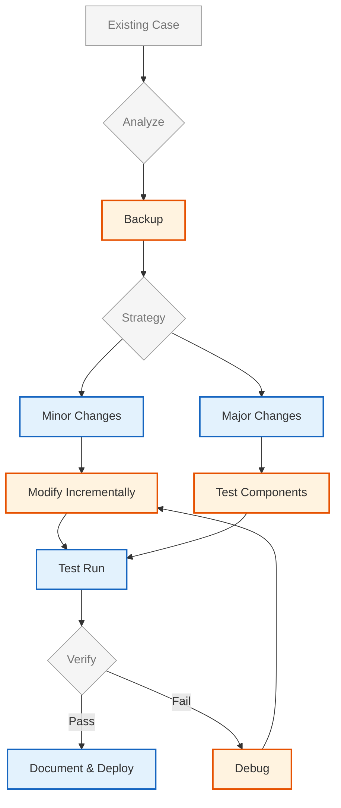

# แก้ไขการตั้งค่าและการออกแบบ CFD Case ที่มีอยู่ (Modifying Existing Case Setup and Design)

เมื่อเริ่มต้นใช้งาน OpenFOAM เพื่อแก้ไขปัญหาทางวิศวกรรม นักพัฒนามักเจอกับสถานการณ์ที่ต้องการปรับเปลี่ยน CFD case ที่มีอยู่แล้ว มากกว่าการเริ่มสร้างใหม่ทั้งหมด โมดูลนี้จะนำเสนอแนวทางและเทคนิคในการแก้ไขและปรับปรุง CFD case ที่มีอยู่อย่างเป็นระบบ

---

## 1. แนวคิดพื้นฐานของการแก้ไข CFD Case (Basic Concepts of Case Modification)

### 1.1 โครงสร้างและส่วนประกอบของ OpenFOAM Case

ก่อนที่จะทำการแก้ไขใดๆ จำเป็นต้องเข้าใจโครงสร้างพื้นฐานของ OpenFOAM case ซึ่งประกอบด้วย:

- **0/***: เก็บข้อมูลเริ่มต้นและเงื่อนไขขอบเขต (Initial and boundary conditions)
- **constant/**: เก็บข้อมูลค่าคงที่ เช่น mesh, transport properties
- **system/**: เก็บการตั้งค่าการจำลอง (Simulation control parameters)

```cpp
// Source: OpenFOAM Case Structure
// โครงสร้างไดเรกทอรีพื้นฐานของ OpenFOAM case
// แต่ละไดเรกทอรีมีหน้าที่เฉพาะในการจัดเก็บข้อมูลการจำลอง

myCase/
├── 0/                  // เงื่อนไขเริ่มต้นและขอบเขต (Initial and boundary conditions)
│   ├── U               // ความเร็ว (Velocity field)
│   ├── p               // ความดัน (Pressure field)
│   └── T               // อุณหภูมิ (Temperature field)
├── constant/           // ค่าคงที่และคุณสมบัติของไหล (Constants and fluid properties)
│   ├── polyMesh/       // ข้อมูลตาข่าย (Mesh data)
│   └── transportProperties // คุณสมบัติการขนส่ง (Transport properties)
└── system/             // การตั้งค่าการจำลอง (Simulation settings)
    ├── controlDict     // การควบคุมเวลาและเอาต์พุต (Time and output control)
    ├── fvSchemes       // รูปแบบการเปลี่ยนค่าเชิงปริมาณ (Discretization schemes)
    └── fvSolution      // การตั้งค่า solver และค่าความแม่นยำ (Solver settings and tolerances)
```

**คำอธิบายภาษาไทย:**
> **แหล่งที่มา (Source):** OpenFOAM Case Structure Documentation
> 
> **คำอธิบาย (Explanation):** โครงสร้างไดเรกทอรีมาตรฐานของ OpenFOAM case แบ่งเป็น 3 ส่วนหลัก:
> - **0/**: เก็บเงื่อนไขขอบเขตและค่าเริ่มต้นของทุกฟิลด์
> - **constant/**: เก็บ mesh และคุณสมบัติทางกายภาพที่ไม่เปลี่ยนแปลง
> - **system/**: เก็บการตั้งค่าที่ควบคุมการทำงานของ solver
> 
> **แนวคิดสำคัญ (Key Concepts):**
> - **Directory Organization**: การจัดระเบียบไฟล์แบบมาตรฐานช่วยให้ OpenFOAM ค้นหาและโหลดข้อมูลได้อัตโนมัติ
> - **Field Files**: ไฟล์ใน 0/ ต้องมีชื่อตรงกับฟิลด์ที่ solver ต้องการ
> - **Mesh Independence**: mesh ใน constant/polyMesh สามารถใช้ซ้ำได้กับ solver ต่างกัน
> - **Solver Flexibility**: การเปลี่ยน solver มักต้องปรับเฉพาะไฟล์ใน system/

### 1.2 ขั้นตอนในการทำความเข้าใจ Case ที่มีอยู่

ก่อนทำการแก้ไข ควรทำความเข้าใจ case ที่มีอยู่ก่อน:

```cpp
// Source: OpenFOAM Case Analysis Workflow
// ขั้นตอนในการวิเคราะห์และทำความเข้าใจ case ที่มีอยู่
// การทำความเข้าใจที่ถูกต้องช่วยลดความเสี่ยงในการแก้ไขที่อาจทำให้ case ทำงานไม่ได้

// 1. ตรวจสอบประเภทของ Solver
//    - อ่านชื่อ solver จากไฟล์ system/controlDict
//    - ตรวจสอบความเข้ากันได้กับปัญหาที่ต้องการแก้
//    - ตรวจสอบความสามารถของ solver (compressible/incompressible, turbulent/laminar, etc.)

// 2. วิเคราะห์ Mesh
//    - ตรวจสอบคุณภาพ mesh ด้วย checkMesh
//    - วิเคราะห์ความละเอียดของ mesh ใกล้ผนัง (y+ values)
//    - ประเมินความเหมาะสมกับปัญหาที่ต้องการแก้

// 3. ตรวจสอบ Boundary Conditions
//    - วิเคราะห์ชนิดของ boundary conditions ที่ใช้
//    - ตรวจสอบความเหมาะสมกับปัญหาทางกายภาพ
//    - ระบุจุดที่ต้องการแก้ไข

// 4. ทบทวน Discretization Schemes
//    - ตรวจสอนรูปแบบการเปลี่ยนค่าใน system/fvSchemes
//    - ประเมินความเหมาะสมกับระดับความแม่นยำที่ต้องการ
//    - ตรวจสอบความเสถียรของการคำนวณ

// 5. วิเคราะห์การตั้งค่า Solver
//    - ตรวจสอบ tolerances และ criteria การบรรจบ
//    - วิเคราะห์ algorithms ที่ใช้ (PISO, SIMPLE, PIMPLE)
//    - ประเมินความเหมาะสมกับปัญหาที่ต้องการแก้
```

**คำอธิบายภาษาไทย:**
> **แหล่งที่มา (Source):** OpenFOAM Case Analysis Best Practices
> 
> **คำอธิบาย (Explanation):** ขั้นตอนในการวิเคราะห์ case ที่มีอยู่ก่อนการแก้ไข:
> 1. ตรวจสอบประเภท solver เพื่อให้แน่ใจว่าเหมาะสมกับปัญหา
> 2. วิเคราะห์ mesh เพื่อประเมินความเหมาะสม
> 3. ตรวจสอบ boundary conditions
> 4. ทบทวน discretization schemes
> 5. วิเคราะห์ solver settings
> 
> **แนวคิดสำคัญ (Key Concepts):**
> - **Systematic Analysis**: การวิเคราะห์เป็นขั้นตอนช่วยลดโอกาสเกิดข้อผิดพลาด
> - **Documentation**: การบันทึกสิ่งที่พบช่วยในการตัดสินใจแก้ไข
> - **Compatibility Check**: การตรวจสอบความเข้ากันได้ช่วยป้องกันปัญหา runtime
> - **Performance Optimization**: การทำความเข้าใจส่วนประกอบช่วยปรับปรุงประสิทธิภาพ

---

## 2. การแก้ไข Mesh และ Boundary Conditions (Modifying Mesh and Boundary Conditions)

### 2.1 การปรับปรุง Mesh ที่มีอยู่

เมื่อต้องการปรับปรุง mesh ที่มีอยู่ มีหลายแนวทางที่สามารถทำได้:

```cpp
// Source: OpenFOAM Mesh Manipulation Tools
// เครื่�องมือในการปรับปรุง mesh ที่มีอยู่
// การเลือกใช้เครื่องมือที่เหมาะสมขึ้นอยู่กับประเภทของการแก้ไขที่ต้องการ

// 1. การปรับขนาด mesh (Mesh Refinement)
//    ใช้ refineMesh หรือ refineHexMesh เพื่อเพิ่มความละเอียดในบริเวณที่สนใจ
//    Example:
//    refineMesh -overwrite  // แก้ไข mesh โดยตรง

// 2. การเพิ่มความละเอียดบริเวณผนัง (Boundary Layer Refinement)
//    ใช้ refineWallLayer เพื่อเพิ่ม layer ใกล้ผนัง
//    Example:
//    refineWallLayer '(wall1 wall2)' 1  // เพิ่ม 1 layer บน wall1 และ wall2

// 3. การแก้ไข cellZones และ faceZones
//    ใช้ setSet หรือ topoSet เพื่อสร้าง/แก้ไข zones
//    Example:
//    setSet  // เปิด interactive mode
//    > cellSet c1 new boxToCell (0 0 0) (1 1 1)  // สร้าง cellSet ชื่อ c1

// 4. การแก้ไข patches
//    ใช้ createPatch หรือ modifyMesh เพื่อเปลี่ยนแปลง patches
//    Example:
//    createPatch -overwrite  // สร้าง patches ใหม่ตามการตั้งค่า
```

**คำอธิบายภาษาไทย:**
> **แหล่งที่มา (Source):** OpenFOAM Mesh Manipulation Utilities
> 
> **คำอธิบาย (Explanation):** เครื่องมือหลักในการปรับปรุง mesh:
> 1. **refineMesh**: เพิ่มความละเอียด mesh ทั้งหมดหรือบางส่วน
> 2. **refineWallLayer**: เพิ่ม layer ใกล้ผนังเพื่อปรับปรุงความแม่นยำของ gradient
> 3. **setSet/topoSet**: สร้างและแก้ไข zones สำหรับการตั้งค่าเฉพาะบริเวณ
> 4. **createPatch**: แก้ไข patches และ boundary conditions
> 
> **แนวคิดสำคัญ (Key Concepts):**
> - **Targeted Refinement**: เพิ่มความละเอียดเฉพาะที่สำคัญเพื่อประหยัด computational cost
> - **Quality Preservation**: การแก้ไข mesh ต้องรักษาคุณภาพ mesh ไว้
> - **Topology Consistency**: การเปลี่ยนแปลงต้องสอดคล้องกันทั่วทั้ง mesh
> - **Backup Strategy**: ควรสำรอง mesh เดิมก่อนแก้ไข

### 2.2 การแก้ไข Boundary Conditions

การแก้ไข boundary conditions เป็นการปรับเปลี่ยนที่พบบ่อยที่สุด:

```cpp
// Source: OpenFOAM Boundary Condition Modification
// การแก้ไข boundary conditions ในไฟล์ 0/U, 0/p, etc.
// การแก้ไข BC ที่ถูกต้องสำคัญมากต่อความถูกต้องของผลลัพธ์

dimensions      [0 1 -1 0 0 0 0];    // หน่วยของความเร็ว (m/s)

internalField   uniform (0 0 0);    // ค่าเริ่มต้นภายในโดเมน

boundaryField
{
    // 1. ปรับเปลี่ยน Inlet Type
    inlet
    {
        // จาก fixedValue (ค่าคงที่) เป็น 
        // ใช้สำหรับ profile ที่ซับซ้อน
        type            fixedValue;
        value           uniform (10 0 0);  // ความเร็ว 10 m/s ในทิศทาง x
    }
    
    // 2. ปรับเปลี่ยน Outlet Type
    outlet
    {
        // ใช้ zeroGradient สำหรับ flow ที่ fully developed
        type            zeroGradient;
    }
    
    // 3. แก้ไข Wall Condition
    walls
    {
        // สำหรับ turbulent flow: ใช้ wall functions
        type            noSlip;
    }
    
    // 4. เพิ่ม Symmetry Plane
    symmetry
    {
        type            symmetryPlane;
    }
}
```

**คำอธิบายภาษาไทย:**
> **แหล่งที่มา (Source):** OpenFOAM Boundary Conditions Documentation
> 
> **คำอธิบาย (Explanation):** ประเภทของ boundary conditions ที่ใช้บ่อย:
> 1. **fixedValue**: กำหนดค่าคงที่ที่ boundary (เช่น velocity inlet)
> 2. **zeroGradient**: gradient เป็นศูนย์ (เช่น pressure outlet)
> 3. **noSlip**: ไม่มีการลื่นที่ผนัง (velocity = 0)
> 4. **symmetryPlane**: ระนาบสมมาตร
> 
> **แนวคิดสำคัญ (Key Concepts):**
> - **Physical Consistency**: BC ต้องสอดคล้องกับฟิสิกส์ของปัญหา
> - **Well-Posed Problem**: ต้องมี BC เพียงพอและไม่ขัดแย้งกัน
> - **Numerical Stability**: BC บางประเภทอาจทำให้เกิดปัญหาความไม่เสถียร
> - **Convergence**: BC ที่เหมาะสมช่วยให้บรรจบเร็วขึ้น

### 2.3 การเพิ่ม Boundary Conditions ใหม่

```cpp
// Source: OpenFOAM Boundary Creation
// การสร้าง patches และ boundary conditions ใหม่
// ใช้ createPatch utility สำหรับสร้าง patches จาก faces ที่มีอยู่

// ไฟล์: system/createPatchDict
// การตั้งค่าสำหรับสร้าง patches ใหม่

// 1. สร้าง patch จาก faceZone ที่มีอยู่
patch1
{
    // ชื่อ patch ใหม่
    name            newInlet;
    
    // ประเภทของ patch
    patchType       patch;
    
    // ค่าที่จะใช้ (เฉพาะบางประเภท)
    value           uniform (10 0 0);
    
    // ชื่อ faceZone ที่จะใช้
    faceZone        newInletZone;
    
    // วิธีการสร้าง patch
    constructFrom   faceZone;  // หรือ 'patches'
}

// 2. สร้าง patch จาก patches ที่มีอยู่
patch2
{
    name            combinedOutlet;
    patchType       patch;
    
    // รวม patches หลายอันเข้าด้วยกัน
    constructFrom   patches;
    patches         (outlet1 outlet2);
}
```

**คำอธิบายภาษาไทย:**
> **แหล่งที่มา (Source):** OpenFOAM createPatch Utility
> 
> **คำอธิบาย (Explanation):** ขั้นตอนการสร้าง patches ใหม่:
> 1. สร้าง faceZones โดยใช้ setSet หรือ topoSet
> 2. สร้างไฟล์ system/createPatchDict
> 3. รัน createPatch utility
> 4. ตั้งค่า boundary conditions ในไฟล์ 0/
> 
> **แนวคิดสำคัญ (Key Concepts):**
> - **Face Selection**: การเลือก faces ที่เหมาะสมสำคัญมาก
> - **Patch Type**: ต้องเลือกประเภทที่เหมาะสมกับ solver
> - **Field Consistency**: ต้องอัปเดต boundary conditions ในทุกฟิลด์
> - **Verification**: ตรวจสอบด้วย checkMesh หลังการสร้าง

---

## 3. การปรับเปลี่ยน Physical Properties และ Transport Properties

### 3.1 การแก้ไข Transport Properties

```cpp
// Source: OpenFOAM Transport Properties
// ไฟล์: constant/transportProperties
// การตั้งค่าคุณสมบัติทางกายภาพของของไหล
// ค่าเหล่านี้ส่งผลโดยตรงต่อผลลัพธ์การจำลอง

transportModel  Newtonian;    // รุ่นของความหนืด (Viscosity model)

// ความหนืดของไหล (Dynamic viscosity)
nu              [0 2 -1 0 0 0 0] 1e-05;  // m²/s (Kinematic viscosity)
// หรือใช้ dynamic viscosity:
// mu              [1 -1 -1 0 0 0 0] 1e-03;  // kg/(m·s)

// สำหรับ non-Newtonian fluids:
// transportModel  NonNewtonian;
// crossPowerLawCoeffs
// {
//     nu0             [0 2 -1 0 0 0 0] 1e-06;  // Viscosity at zero shear
//     nuInf           [0 2 -1 0 0 0 0] 1e-04; // Viscosity at infinite shear
//     m               0.8;                    // Power law index
//     tau             [0 -2 0 0 0 0 0] 1.0;   // Critical shear stress
// }
```

**คำอธิบายภาษาไทย:**
> **แหล่งที่มา (Source):** OpenFOAM Transport Properties Documentation
> 
> **คำอธิบาย (Explanation):** การตั้งค่าคุณสมบัติของไหล:
> - **Newtonian**: ไหลที่มีความหนืดคงที่ (เช่น น้ำ, อากาศ)
> - **Non-Newtonian**: ไหลที่ความหนืดแปรตาม shear rate
> - **nu vs mu**: nu = kinematic viscosity (m²/s), mu = dynamic viscosity (kg/(m·s))
> 
> **แนวคิดสำคัญ (Key Concepts):**
> - **Temperature Dependence**: คุณสมบัติอาจขึ้นกับอุณหภูมิ
> - **Reynolds Number**: ความหนืดส่งผลต่อ Reynolds number
> - **Model Selection**: ต้องเลือกรุ่นที่เหมาะสมกับชนิดของไหล
> - **Units Consistency**: ตรวจสอบหน่วยให้ถูกต้องเสมอ

### 3.2 การแก้ไข Thermophysical Properties (สำหรับ Compressible Flow)

```cpp
// Source: OpenFOAM Thermophysical Properties
// ไฟล์: constant/thermophysicalProperties
// การตั้งค่าคุณสมบัติทางอุณหพลศาสตร์สำหรับ compressible flow

thermoType
{
    type            heRhoThermo;      // ชนิดของ thermodynamic model
    mixture         multiComponentMixture;  // ชนิดของส่วนผสม
    transport       sutherland;       // รุ่นการขนส่ง (viscosity/conductivity)
    thermo          janaf;            // รุ่น thermodynamic (Cp, H, etc.)
    energy          sensibleEnthalpy; // รูปแบของพลังงาน
    equationOfState perfectGas;       // สมการถึงสถานะ
    specie          specie;           // ชนิดของสาร
}

// สำหรับ single component gas
mixture
{
    specie
    {
        nMoles          1;            // จำนวนโมล
        molWeight       28.9;         // น้ำหนักโมเลกุล [g/mol]
    }
    
    thermodynamics
    {
        Cp              1007;         // ความร้อนจำเพาะ [J/(kg·K)]
        Hf              0;            // Enthalpy of formation [J/kg]
    }
    
    transport
    {
        mu              1.8e-05;     // ความหนืด [kg/(m·s)]
        Pr              0.72;        // Prandtl number
    }
}
```

**คำอธิบายภาษาไทย:**
> **แหล่งที่มา (Source):** OpenFOAM Thermophysical Models
> 
> **คำอธิบาย (Explanation):** การตั้งค่าคุณสมบัติอุณหพลศาสตร์:
> - **thermoType**: กำหนดรุ่นทางอุณหพลศาสตร์ที่จะใช้
> - **equationOfState**: สมการที่เชื่อมโยง p, ρ, T (เช่น perfectGas)
> - **transport**: รุ่นการคำนวณ viscosity และ conductivity
> - **thermodynamics**: คุณสมบัติ Cp, H, etc.
> 
> **แนวคิดสำคัญ (Key Concepts):**
> - **Model Compatibility**: รุ่นต่างๆ ต้องสอดคล้องกัน
> - **Temperature Range**: ค่าสมบัติมักขึ้นกับอุณหภูมิ
> - **Compressibility**: จำเป็นสำหรับ flow ที่ความดันเปลี่ยนมาก
> - **Chemical Reactions**: หากมีปฏิกิริยา ต้องใช้รุ่นที่ซับซ้อนกว่า

---

## 4. การปรับเปลี่ยน Numerical Schemes และ Solver Settings

### 4.1 การแก้ไข Discretization Schemes

```cpp
// Source: OpenFOAM Discretization Schemes
// ไฟล์: system/fvSchemes
// การตั้งค่ารูปแบบการเปลี่ยนค่าเชิงปริมาณ
// ส่งผลต่อความแม่นยำและความเสถียรของการคำนวณ

// 1. Time discretization schemes
ddtSchemes
{
    // Euler implicit: first-order, stable
    default         Euler;
    
    // หรือใช้ backward: second-order, more accurate
    // default         backward;
}

// 2. Gradient discretization schemes
gradSchemes
{
    // Gauss linear: second-order central differencing
    default         Gauss linear;
    
    // สำหรับ gradient ที่ผนัง:
    // wallGrad       uncorrected;  // ไม่มีการแก้ไข non-orthogonality
}

// 3. Divergence discretization schemes
divSchemes
{
    // การเปลี่ยนค่าพิเศษใช้ stabilized schemes
    div(phi,U)      Gauss upwind;  // First-order, stable
    
    // สำหรับความแม่นยำสูง:
    // div(phi,U)      Gauss linearUpwindV grad(U);  // Second-order
    
    div(phi,k)      Gauss upwind;
    div(phi,epsilon) Gauss upwind;
}

// 4. Laplacian discretization schemes
laplacianSchemes
{
    // Gauss linear corrected: พิจารณา non-orthogonality
    default         Gauss linear corrected;
}

// 5. Interpolation schemes
interpolationSchemes
{
    // Linear interpolation ระหว่าง cell centers
    default         linear;
}

// 6. SnGrad schemes (surface normal gradient)
snGradSchemes
{
    // พิจารณา non-orthogonality
    default         corrected;
}
```

**คำอธิบายภาษาไทย:**
> **แหล่งที่มา (Source):** OpenFOAM Finite Volume Discretization
> 
> **คำอธิบาย (Explanation):** รูปแบบการเปลี่ยนค่าที่สำคัญ:
> - **ddtSchemes**: การเปลี่ยนค่าเชิงเวลา (Euler, backward, CrankNicolson)
> - **gradSchemes**: การคำนวณ gradient (Gauss linear, leastSquares)
> - **divSchemes**: การเปลี่ยนค่าเชิงอนุพันธ์ (upwind, central, linearUpwind)
> - **laplacianSchemes**: การเปลี่ยนค่าเชิงลาปลาซ์
> 
> **แนวคิดสำคัญ (Key Concepts):**
> - **Accuracy vs Stability**: รูปแบบที่แม่นยำมักไม่เสถียรเท่า
> - **Peclet Number**: เลือกรูปแบบตามค่า Peclet number
> - **Non-orthogonality**: ต้องใช้รูปแบบที่พิจารณา non-orthogonality
> - **Convergence**: รูปแบบบางอย่างช่วยให้บรรจบเร็วขึ้น

### 4.2 การแก้ไข Solver Settings

```cpp
// Source: OpenFOAM Solver Control Parameters
// ไฟล์: system/fvSolution
// การตั้งค่า algorithms และ tolerances สำหรับ linear solvers

// 1. Pressure-velocity coupling algorithms
solvers
{
    // ตัวแก้สมการพีชคณิตเชิงเส้นสำหรับ pressure
    p
    {
        solver          GAMG;              // Geometric-Algebraic Multi-Grid
        tolerance       1e-06;             // ความคลาดเคลื่อนที่ยอมรับ
        relTol          0.01;              // ความคลาดเคลื่อนสัมพัทธ์
        smoother        GaussSeidel;       // วิธีการ smooth
        
        // การตั้งค่าเฉพาะของ GAMG
        nPreSweeps      0;
        nPostSweeps     2;
        cacheAgglomeration on;
        agglomerator    faceAreaPair;      // วิธีรวม cells
        mergeLevels     1;
    }
    
    // ตัวแก้สำหรับ velocity และ scalar fields
    "(U|k|epsilon|omega)"
    {
        solver          smoothSolver;      // ใช้สำหรับ ill-conditioned systems
        smoother        symGaussSeidel;
        tolerance       1e-05;
        relTol          0.1;
    }
}

// 2. Pressure-velocity coupling algorithm
SIMPLE
{
    // จำนวนรอบ non-orthogonal correctors
    nNonOrthogonalCorrectors 0;
    
    // จำนวนรอบ corrections
    nCorrectors     2;                // ปกติ 2-4 รอบ
    
    // การผ่อนคลาย pressure (Pressure relaxation)
    pRefCell        0;
    pRefValue       0;
}

// หรือสำหรับ transient flow:
PISO
{
    nCorrectors     2;                // จำนวน PISO loops
    nNonOrthogonalCorrectors 0;
    
    // การผ่อนคลาย
    pRefCell        0;
    pRefValue       0;
}

// หรือสำหรับ transient ที่ต้องการความเสถียร:
PIMPLE
{
    // ผสม PISO และ SIMPLE
    nCorrectors     2;
    nNonOrthogonalCorrectors 0;
    
    // การควบคุม time step
    nAlphaCorr      1;
    nAlphaSubCycles 2;
}
```

**คำอธิบายภาษาไทย:**
> **แหล่งที่มา (Source):** OpenFOAM Linear Solvers and Algorithms
> 
> **คำอธิบาย (Explanation):** การตั้งค่า solver ที่สำคัญ:
> - **Solver Type**: GAMG (ใหญ่/เร็ว), smoothSolver (เล็ก/เสถียร)
> - **Tolerance**: ความแม่นยำของการแก้สมการ
> - **Algorithm**: SIMPLE (steady), PISO (transient), PIMPLE (hybrid)
> - **Relaxation**: ช่วยให้บรรจบสำหรับกรณีที่ลำบาก
> 
> **แนวคิดสำคัญ (Key Concepts):**
> - **Convergence Acceleration**: เลือก solver ที่เหมาะสมกับปัญหา
> - **Memory vs Speed**: GAMG ใช้ memory มากแต่เร็ว
> - **Stability**: การผ่อนคลายช่วยเพิ่มความเสถียร
> - **Adaptive Control**: สามารถปรับ tolerances ระหว่างการจำลอง

---

## 5. การเปลี่ยน Solver หรือ Physical Model

### 5.1 การเปลี่ยนจาก Laminar เป็น Turbulent Flow

```cpp
// Source: OpenFOAM Turbulence Models
// ไฟล์: constant/turbulenceProperties
// การเปลี่ยนจาก laminar เป็น turbulent model

// 1. เลือก turbulence model
simulationType  RAS;     // หรือ LES, DES, etc.

// 2. สำหรับ RAS modeling
RAS
{
    // เลือก model: kEpsilon, kOmegaSST, SpalartAllmaras, etc.
    RASModel        kEpsilon;
    
    // ตัวเลือกเพิ่มเติม
    turbulence      on;
    printCoeffs     on;      // แสดงค่าสัมประสิทธิ์
    
    // ค่าสัมประสิทธิ์ (สำหรับ k-epsilon)
    kEpsilonCoeffs
    {
        Cmu             0.09;
        C1              1.44;
        C2              1.92;
        sigmaEps        1.11;
        // ค่าอื่นๆ...
    }
}

// 3. สำหรับ LES modeling
LES
{
    LESModel        Smagorinsky;     // หรือ dynamicKEqn, WALE, etc.
    
    turbulence      on;
    printCoeffs     on;
    
    SmagorinskyCoeffs
    {
        Ck              0.094;       // Smagorinsky constant
        Ce              1.048;       // Kolmogorov constant
    }
}
```

**คำอธิบายภาษาไทย:**
> **แหล่งที่มา (Source):** OpenFOAM Turbulence Modeling
> 
> **คำอธิบาย (Explanation):** การเลือก turbulence model:
> - **RAS**: Reynolds-Averaged Simulation (เฉลี่ยเชิงเวลา)
> - **LES**: Large Eddy Simulation (กรอง large eddies)
> - **DES**: Detached Eddy Simulation (ผสม RAS/LES)
> 
> **แนวคิดสำคัญ (Key Concepts):**
> - **Model Selection**: ขึ้นกับ flow regime และ computational resources
> - **Near-Wall Treatment**: ต้องมี mesh ที่เหมาะสม
> - **Initialization**: ต้องมีค่าเริ่มต้นที่เหมาะสมสำหรับ k, epsilon, omega
> - **Validation**: ควรตรวจสอบกับ experimental data

### 5.2 การเพิ่ม Heat Transfer

```cpp
// Source: OpenFOAM Heat Transfer Models
// ไฟล์: 0/T (temperature field)
// การเพิ่ม energy equation ในการจำลอง

dimensions      [0 0 0 1 0 0 0];    // หน่วยของอุณหภูมิ (K)

internalField   uniform 300;       // อุณหภูมิเริ่มต้น 300 K

boundaryField
{
    // 1. Inlet: fixed temperature
    inlet
    {
        type            fixedValue;
        value           uniform 300;
    }
    
    // 2. Wall: fixed heat flux
    hotWall
    {
        type            fixedGradient;      // กำหนด gradient
        gradient        uniform -1000;      // [K/m] ความร้อนไหลออก
    }
    
    // 3. Wall: fixed temperature
    coldWall
    {
        type            fixedValue;
        value           uniform 350;
    }
    
    // 4. Wall: convective heat transfer
    externalWall
    {
        type            externalWallHeatFlux;
        mode            coefficient;        // ใช้ heat transfer coefficient
        h               uniform 10;         // [W/(m²·K)]
        Ta              uniform 300;        // [K] อุณหภูมิแวดล้อม
    }
    
    // 5. Adiabatic wall (ไม่มีการถ่ายเทความร้อน)
    adiabaticWall
    {
        type            zeroGradient;       // ไม่มี gradient
    }
}
```

**คำอธิบายภาษาไทย:**
> **แหล่งที่มา (Source):** OpenFOAM Thermal Boundary Conditions
> 
> **คำอธิบาย (Explanation):** Boundary conditions สำหรับ heat transfer:
> - **fixedValue**: กำหนดอุณหภูมิคงที่ (Dirichlet)
> - **fixedGradient**: กำหนด heat flux คงที่ (Neumann)
> - **externalWallHeatFlux**: การถ่ายเทความร้อนแบบพา (Robin)
> - **zeroGradient**: ผนังแยกตัว (adiabatic)
> 
> **แนวคิดสำคัญ (Key Concepts):**
> - **Fourier's Law**: q" = -k∇T
> - **Convection Coefficient**: q" = h(T_wall - T_ambient)
> - **Conjugate Heat Transfer**: การถ่ายเทความร้อนระหว่าง solid-fluid
> - **Radiation**: สำหรับอุณหภูมิสูง (ต้องเพิ่ม radiation model)

---

## 6. การเพิ่ม Function Objects สำหรับ Monitoring และ Post-processing

### 6.1 การเพิ่ม Monitoring ระหว่างการจำลอง

```cpp
// Source: OpenFOAM Function Objects
// ไฟล์: system/controlDict
// การเพิ่ม function objects สำหรับ monitoring ค่าสำคัญ

functions
{
    // 1. ตรวจสอบสมดุลมวล
    massFlowRates
    {
        type            surfaceFieldValue;
        libs            (fieldFunctionObjects);
        
        // การคำนวณ
        operation       sum;             // รวมค่า flux
        regionType      patch;           // บน patches
        name            massFlow;
        
        // ฟิลด์ที่ใช้
        fields          (phi);           // Mass/volume flux
        patches         (inlet outlet);
        
        // การบันทึก
        writeControl    timeStep;
        writeInterval   10;
        log             true;            // แสดงใน terminal
    }
    
    // 2. ตรวจสอบ forces บน object
    forceCoeffs
    {
        type            forceCoeffs;
        libs            (forces);
        
        patches         (airfoil);       // Patch ที่คำนวณ
        
        // ทิศทาง
        dragDir         (1 0 0);         // ทิศทาง drag
        liftDir         (0 1 0);         // ทิศทาง lift
        pitchAxis       (0 0 1);         // แกน pitch
        
        // ค่าอ้างอิง
        rhoInf          1.225;           // [kg/m³]
        UInf            10.0;            // [m/s]
        lRef            0.1;             // [m]
        Aref            0.01;            // [m²]
        
        writeControl    timeStep;
        writeInterval   10;
    }
    
    // 3. Probe ค่าที่จุดที่สนใจ
    probeLocations
    {
        type            probes;
        libs            (sampling);
        
        probeLocations
        (
            (0.1 0.0 0.0)               // จุดที่ 1
            (0.2 0.0 0.0)               // จุดที่ 2
        );
        
        fields          (p U T);         // ฟิลด์ที่บันทึก
        
        writeControl    timeStep;
        writeInterval   1;
    }
}
```

**คำอธิบายภาษาไทย:**
> **แหล่งที่มา (Source):** OpenFOAM Function Objects Guide
> 
> **คำอธิบาย (Explanation):** Function objects สำหรับ monitoring:
> - **surfaceFieldValue**: คำนวณค่ารวมบน patches (flow rate, forces)
> - **forceCoeffs**: คำนวณ lift/drag coefficients
> - **probes**: บันทึกค่าที่จุดเฉพาะ
> - **sets**: บันทึกค่าตามเส้นทาง
> 
> **แนวคิดสำคัญ (Key Concepts):**
> - **Real-time Monitoring**: ติดตามค่าระหว่างการจำลอง
> - **Convergence Check**: ดูว่าบรรจบหรือยัง
> - **Data Reduction**: ลดปริมาณข้อมูลที่ต้องเก็บ
> - **Automated Analysis**: คำนวณค่าสำคัญอัตโนมัติ

---

## 7. ขั้นตอนการทำงานและ Best Practices

### 7.1 แนวทางปฏิบัติที่ดีในการแก้ไข Case



**คำอธิบาย:**
> แผนภูมิแสดงขั้นตอนการแก้ไข case ที่มีอยู่:
> 1. เริ่มจากการวิเคราะห์ case เดิม
> 2. สำรองข้อมูลเสมอก่อนแก้ไข
> 3. เลือกแนวทางการแก้ไข (minor vs major)
> 4. แก้ไขทีละอย่างและทดสอบ
> 5. ตรวจสอบผลลัพธ์
> 6. บันทึกและใช้งานเมื่อถูกต้อง

### 7.2 รายการตรวจสอบ (Verification Checklist)

| ขั้นตอน | รายการตรวจสอบ | วิธีการ |
|---------|-----------------|---------|
| 1 | Backup case ที่มีอยู่ | `cp -r myCase myCase_backup` |
| 2 | ตรวจสอบ mesh | `checkMesh` |
| 3 | ตรวจสอบ boundary conditions | อ่านไฟล์ใน 0/ |
| 4 | ตรวจสอบ solver settings | อ่าน system/controlDict, fvSolution |
| 5 | ทดสอบรันสั้นๆ | รัน 10-20 time steps หรือ iterations |
| 6 | ตรวจสอบความถูกต้อง | เปรียบเทียบกับ case เดิม หรือ theory |
| 7 | บันทึกการเปลี่ยนแปลง | เขียนใน CHANGELOG หรือ notes |
| 8 | ทดสอบความไวของผล | รันจนบรรจบ เปรียบเทียบเวลา |

### 7.3 เทคนิคการ Debug

```cpp
// Source: OpenFOAM Debugging Techniques
// เทคนิคการติดตามและแก้ไขปัญหาใน OpenFOAM

// 1. การเพิ่มระดับการแสดงผล (Debug Output)
// ใน system/controlDict:
DebugSwitches
{
    // เพิ่มการแสดงผลสำหรับ solver เฉพาะ
    simpleFoam       1;    // 0=off, 1=on, 2=verbose
    GAMG             1;
}

// 2. การเขียนฟิลด์ทุกรอบ
// ใน system/controlDict:
application     simpleFoam;
startFrom       latestTime;

functions
{
    // เขียฟิลด์ทุกรอบเพื่อดู evolution
    writeFields
    {
        type            writeObjects;
        objects         (p U);
        writeControl    timeStep;
        writeInterval   1;
    }
}

// 3. การใช้ runTimePost-processing
// สร้างกราฟิกและ plots โดยอัตโนมัติ
functions
{
    // Plot pressure drop
    pressureDrop
    {
        type            sets;
        libs            (sampling);
        
        // กำหนดเส้นที่จะ plot
        sets
        (
            line
            {
                type            uniform;
                axis            distance;
                start           (0 0 0);
                end             (1 0 0);
                nPoints         100;
            }
        );
        
        fields          (p);
        writeControl    timeStep;
        writeInterval   10;
    }
}
```

**คำอธิบายภาษาไทย:**
> **แหล่งที่มา (Source):** OpenFOAM Debugging and Monitoring
> 
> **คำอธิบาย (Explanation):** เทคนิคการ debug:
> - **Debug Switches**: แสดงข้อมูลภายในของ solver
> - **Frequent Output**: เขียนฟิลด์บ่อยๆ เพื่อดู evolution
> - **RunTime Post-processing**: สร้างกราฟิกโดยอัตโนมัติ
> - **Log Files**: ตรวจสอบ log.* ไฟล์อย่างละเอียด
> 
> **แนวคิดสำคัญ (Key Concepts):**
> - **Incremental Testing**: ทดสอบทีละส่วน
> - **Baseline Comparison**: เปรียบเทียบกับ case ที่รู้ผล
> - **Visual Inspection**: ใช้ paraView ดูผลลัพธ์
> - **Convergence Monitoring**: ติดตาม residuals และ forces

---

## 8. ตัวอย่างการปรับปรุง Case: จาก Laminar เป็น Turbulent

### 8.1 สถานการณ์ตั้งต้น

มี CFD case สำหรับ flow ในท่อ (pipe flow) ที่ถูกตั้งค่าสำหรับ laminar flow แต่เมื่อคำนวณ Reynolds number พบว่า flow จริงเป็น turbulent

### 8.2 ขั้นตอนการปรับปรุง

1. **ตรวจสอบ Reynolds Number:**
   ```bash
   # คำนวณ Re = ρUD/μ
   # ถ้า Re > 4000 (pipe flow) → turbulent
   ```

2. **Backup Case:**
   ```bash
   cp -r pipeFlow_laminar pipeFlow_turbulent
   ```

3. **แก้ไข Transport Properties:**
   ```cpp
   // constant/transportProperties
   // เพิ่มความหนืดเพื่อให้เหมาะสมกับ flow
   nu              [0 2 -1 0 0 0 0] 1e-06;
   ```

4. **เพิ่ม Turbulence Model:**
   ```cpp
   // constant/turbulenceProperties
   simulationType  RAS;
   RAS
   {
       RASModel        kEpsilon;
       turbulence      on;
       printCoeffs     on;
   }
   ```

5. **แก้ไข Initial Conditions:**
   ```cpp
   // 0/k: Turbulent kinetic energy
   // 0/epsilon: Dissipation rate
   // ตั้งค่าเริ่มต้นจาก empirical correlations
   ```

6. **ตรวจสอบ Mesh (ถ้าจำเป็น):**
   ```bash
   checkMesh
   # ตรวจสอบค่า y+:
   # ถ้าใช้ wall functions: 30 < y+ < 300
   # ถ้า resolve viscous sublayer: y+ < 1
   ```

7. **ทดสอบรัน:**
   ```bash
   simpleFoam > log &  # สำหรับ steady-state
   # หรือ
   pimpleFoam > log &  # สำหรับ transient
   ```

8. **ตรวจสอบผลลัพธ์:**
   ```bash
   # Monitor convergence
   tail -f log | grep "Solving for"
   
   # เปรียบเทียบกับ laminar solution
   # หรือ experimental data
   ```

---

## 9. สรุป

การแก้ไข CFD case ที่มีอยู่เป็นทักษะสำคัญในการทำงานกับ OpenFOAM โดยมีหลักการสำคัญ:

### หัวข้อสำคัญที่ครอบคลุม:

1. **การทำความเข้าใจ Case ที่มีอยู่**
   - โครงสร้างไดเรกทอรี
   - ประเภท solver และ physical models
   - Mesh และ boundary conditions

2. **การแก้ไข Mesh และ Boundaries**
   - Mesh refinement และ manipulation
   - การเปลี่ยน boundary conditions
   - การสร้าง patches ใหม่

3. **การปรับปรุง Physical Properties**
   - Transport properties (viscosity, etc.)
   - Thermophysical properties (compressible flow)
   - Turbulence models

4. **การปรับเปลี่ยน Numerical Settings**
   - Discretization schemes
   - Solver tolerances และ algorithms
   - Pressure-velocity coupling

5. **การเพิ่ม Physical Models**
   - การเพิ่ม heat transfer
   - การเปลี่ยนจาก laminar → turbulent
   - Multiphase flow

6. **Monitoring และ Debugging**
   - Function objects
   - Convergence monitoring
   - Debugging techniques

### แนวทางปฏิบัติที่ดี:

> [!TIP] Incremental Changes
> แก้ไขทีละอย่างและทดสอบทุกครั้ง การเปลี่ยนแปลงหลายอย่างพร้อมกันทำให้ยากต่อการระบุปัญหา

> [!WARNING] Backup Always
> สำรอง case เสมอก่อนการแก้ไข โดยเฉพาะการแก้ไข mesh

> [!INFO] Documentation
> บันทึกการเปลี่ยนแปลงทั้งหมดในไฟล์ CHANGELOG หรือ notes

> [!TIP] Verification
> ตรวจสอบผลลัพธ์กับ case เดิม หรือ experimental/theoretical data

### การนำไปใช้ในงานวิศวกรรม:

- **R&D**: ปรับปรุง case ที่มีอยู่สำหรับปัญหาใหม่
- **Industry**: ปรับปรุง process และ optimize design
- **Validation**: ใช้ case ที่ผ่านการ validate เป็นพื้นฐาน
- **Education**: เรียนรู้จาก case ที่มีอยู่และปรับปรุง

---

**โมดูลนี้เน้นการปรับปรุง CFD case ที่มีอยู่** โดยครอบคลุมทั้งแนวคิดพื้นฐานและเทคนิคขั้นสูง พร้อมตัวอย่างการประยุกต์ใช้ในงานวิศวกรรม

---

## 10. แหล่งอ้างอิงเพิ่มเติม

### OpenFOAM Documentation:
- [[OpenFOAM User Guide]]
- [[OpenFOAM Programmer's Guide]]
- [[OpenFOAM Case Setup Documentation]]

### Standard Textbooks:
1. **Moukalled, F., Mangani, L., Darwish, M.** - *The Finite Volume Method in Computational Fluid Dynamics*
2. **Ferziger, J.H., Peric, M.** - *Computational Methods for Fluid Dynamics*
3. **Tu, J., Yeoh, G.H., Liu, C.** - *Computational Fluid Dynamics: A Practical Approach*

### Online Resources:
- [OpenFOAM Wiki](https://openfoamwiki.net/)
- [CFD Online](https://www.cfd-online.com/)
- [OpenFOAM Foundation](https://openfoam.org/)