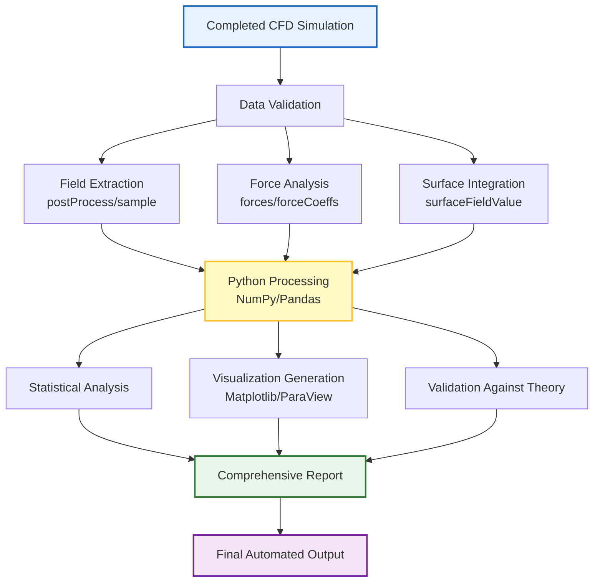

# 🤖 Automated Post-Processing Workflows (เวิร์กโฟลว์การประมวลผลหลังการจำลองอัตโนมัติ)

**วัตถุประสงค์การเรียนรู้**: เชี่ยวชาญกลยุทธ์การสร้างระบบอัตโนมัติ (Automation) สำหรับการประมวลผลหลังการจำลองของ OpenFOAM โดยใช้ Python, Bash Scripting และการบูรณาการ ParaView

---

## 1. สถาปัตยกรรมการประมวลผลอัตโนมัติ (Automation Architecture)

### 1.1 กลยุทธ์การสร้างระบบอัตโนมัติ (Strategy Overview)

การประมวลผลอัตโนมัติจะเปลี่ยนข้อมูลดิบของ OpenFOAM ให้กลายเป็นข้อมูลเชิงวิศวกรรมผ่านเวิร์กโฟลว์ที่เป็นระบบและทำซ้ำได้ (Reproducible) สถาปัตยกรรมนี้รวมเอา OpenFOAM Utilities, Python Scripting และเครื่องมือสร้างภาพ (Visualization Tools) เข้าไว้ด้วยกันเป็นไปป์ไลน์การวิเคราะห์ที่แข็งแกร่ง



![[automated_analysis_pipeline.png]]
> **รูปที่ 1.1:** ไปป์ไลน์การวิเคราะห์อัตโนมัติ (Automated Analysis Pipeline): แสดงการไหลของข้อมูลจากผลลัพธ์การจำลองผ่านชั้นการประมวลผลต่างๆ จนถึงการสร้างรายงานและกราฟิกสรุปผล

**ส่วนประกอบสำคัญ (Core Components):**

1. **Data Extraction Layer**: ใช้ OpenFOAM Utilities (`postProcess`, `sample`, `forces`) เพื่อดึงข้อมูลออกมาในรูปแบบไฟล์ข้อความ (ASCII) หรือ CSV
2. **Processing Layer**: ใช้ Python สำหรับการคำนวณทางสถิติ (Statistical Computing) และการจัดการข้อมูลขนาดใหญ่
3. **Visualization Layer**: ใช้ ParaView Python API (pvpython) สำหรับการเรนเดอร์ภาพ 3D อัตโนมัติ และ Matplotlib สำหรับกราฟ 2D
4. **Reporting Layer**: การสร้างรายงานสรุปผลอัตโนมัติ (Automated Reporting) ในรูปแบบ PDF หรือ Markdown

### 1.2 หลักการทางทฤษฎีของการประมวลผล (Theoretical Foundations)

การประมวลผลแบบอัตโนมัติต้องอาศัยหลักการทางสถิติและการวิเคราะห์ข้อมูลเชิงวิศวกรรม:

**1.2.1 การคำนวณค่าเฉลี่ยเชิงประจักษ์ (Temporal Averaging)**

สำหรับการไหลแบบไม่สมมาตร (Unsteady Flow) ที่ต้องการค่าเฉลี่ยในเวลา (Time-averaged quantities):

$$
\overline{\phi}(\mathbf{x}) = \frac{1}{T_{end} - T_{start}} \int_{T_{start}}^{T_{end}} \phi(\mathbf{x}, t) \, dt \tag{1.1}
$$

เมื่อ:
- $\phi(\mathbf{x}, t)$ คือ ปริมาณเชิงกายภาพ (เช่น ความเร็ว $U$, แรงดัน $p$) ณ ตำแหน่ง $\mathbf{x}$ และเวลา $t$
- $\overline{\phi}(\mathbf{x})$ คือ ค่าเฉลี่ยเชิงเวลา (Time-averaged value)
- $T_{start}, T_{end}$ คือ ช่วงเวลาที่ใช้ในการเฉลี่ย (Averaging window)

ในการประมวลผลด้วย OpenFOAM ใช้ function object `timeAverage`:

```cpp
// NOTE: Synthesized by AI - Verify parameters
timeAverage1
{
    type            timeAverage;
    libs            ("libfieldFunctionObjects.so");
    writeControl    writeTime;
    fields
    (
        U
        p
    );
}
```

**1.2.2 การวิเคราะห์ความผันผวน (Fluctuation Analysis)**

การแยกส่วนประกอบของความเร็วเป็นส่วนเฉลี่ยและส่วนผันผวน (Reynolds Decomposition):

$$
U_i(\mathbf{x}, t) = \overline{U_i}(\mathbf{x}) + u_i'(\mathbf{x}, t) \tag{1.2}
$$

เมื่อ:
- $\overline{U_i}$ คือ ส่วนประกอบเฉลี่ย (Mean component)
- $u_i'$ คือ ส่วนประกอบของความผันผวน (Fluctuating component)

ค่าความเร็วของความผันผวนสามารถคำนวณได้จาก:

$$
u'_{rms} = \sqrt{\overline{(u_i')^2}} = \sqrt{\overline{U_i^2} - \overline{U_i}^2} \tag{1.3}
$$

**1.2.3 การคำนวณสัมประสิทธิ์แรง (Force Coefficients)**

ในการวิเคราะห์ทางอากาศพลศาสตร์ (Aerodynamic Analysis) ค่าสัมประสิทธิ์แรง (Force Coefficients) ถูกนิยามโดย:

$$
C_D = \frac{F_D}{\frac{1}{2}\rho U_\infty^2 A} \tag{1.4}
$$

$$
C_L = \frac{F_L}{\frac{1}{2}\rho U_\infty^2 A} \tag{1.5}
$$

เมื่อ:
- $C_D$ คือ สัมประสิทธิ์แรงต้าน (Drag coefficient)
- $C_L$ คือ สัมประสิทธิ์ยก (Lift coefficient)
- $F_D, F_L$ คือ แรงต้านและแรงยก (Drag and Lift forces)
- $\rho$ คือ ความหนาแน่นของไหล (Fluid density)
- $U_\infty$ คือ ความเร็วกระแสอิสระ (Freestream velocity)
- $A$ คือ พื้นที่อ้างอิง (Reference area)

---

## 2. การใช้ Python สำหรับ Post-processing (Python-Based Framework)

### 2.1 การจัดการข้อมูลด้วย Pandas และ NumPy

การใช้ Python ช่วยให้สามารถรวบรวมข้อมูลจากโฟลเดอร์ `postProcessing` และทำการวิเคราะห์ขั้นสูงได้ง่ายขึ้น

**ตัวอย่างสคริปต์ Python สำหรับอ่านข้อมูลแรง (Force Data):**
```python
import pandas as pd
import matplotlib.pyplot as plt
import numpy as np
from pathlib import Path

def process_force_data(case_path):
    """
    อ่านและประมวลผลข้อมูลแรงจากไฟล์ force.dat
    """
    # อ่านไฟล์ข้อมูลแรงจากโฟลเดอร์ postProcessing
    file_path = Path(case_path) / "postProcessing" / "forces" / "0" / "force.dat"

    # ตรวจสอบว่าไฟล์มีอยู่จริง
    if not file_path.exists():
        raise FileNotFoundError(f"Force data file not found: {file_path}")

    # โหลดข้อมูลโดยข้ามบรรทัด Header และ Comment
    # NOTE: Synthesized by AI - Verify parameters
    df = pd.read_csv(
        file_path,
        sep='\s+',
        comment='#',
        header=None,
        names=['Time', 'px', 'py', 'pz', 'vx', 'vy', 'vz']
    )

    # คำนวณแรงลัพธ์ในทิศทาง x (Drag)
    df['total_drag'] = df['px'] + df['vx']
    df['total_lift'] = df['py'] + df['vy']

    return df

def compute_convergence_metrics(df, window_fraction=0.2):
    """
    คำนวณค่าความลู่เข้าของแรง (Convergence metrics)
    """
    # ใช้ข้อมูล 20% สุดท้ายของกราฟสำหรับการคำนวณค่าเฉลี่ย
    n_points = int(len(df) * window_fraction)
    final_data = df.tail(n_points)

    mean_drag = final_data['total_drag'].mean()
    std_drag = final_data['total_drag'].std()

    # คำนวณช่วงความเชื่อมั่น 95% (Confidence interval)
    ci_drag = 1.96 * std_drag / np.sqrt(n_points)

    return {
        'mean': mean_drag,
        'std': std_drag,
        'ci_95': ci_drag,
        'convergence_ratio': std_drag / abs(mean_drag) if mean_drag != 0 else np.inf
    }

# พล็อตผลการลู่เข้าของแรง
df = process_force_data(".")
metrics = compute_convergence_metrics(df)

plt.figure(figsize=(10, 6))
plt.plot(df['Time'], df['total_drag'], 'b-', linewidth=2, label='Total Drag')
plt.axhline(y=metrics['mean'], color='r', linestyle='--', label=f'Mean: {metrics["mean"]:.4f} N')
plt.fill_between(
    df['Time'],
    metrics['mean'] - metrics['ci_95'],
    metrics['mean'] + metrics['ci_95'],
    alpha=0.3, color='r', label='95% CI'
)
plt.xlabel('Time (s)', fontsize=12)
plt.ylabel('Drag Force (N)', fontsize=12)
plt.title('Force Convergence History', fontsize=14, fontweight='bold')
plt.legend()
plt.grid(True, alpha=0.3)
plt.tight_layout()
plt.savefig('force_convergence.png', dpi=300)
plt.show()

print(f"Convergence Metrics:")
print(f"  Mean Drag: {metrics['mean']:.4f} ± {metrics['ci_95']:.4f} N")
print(f"  Convergence Ratio: {metrics['convergence_ratio']:.4e}")
```

### 2.2 การวิเคราะห์สถิติของข้อมูลเชิงกายภาพ (Statistical Field Analysis)

**ตัวอย่างสคริปต์สำหรับวิเคราะห์ Field Data:**
```python
import numpy as np
import pandas as pd
from scipy import stats

def analyze_probe_data(probe_file):
    """
    วิเคราะห์ข้อมูลจาก Probe points
    """
    # อ่านข้อมูล
    df = pd.read_csv(probe_file, sep='\s+', skiprows=1)

    # แยกข้อมูลเป็นช่วงเวลาเฉลี่ย (Steady state)
    steady_start = int(len(df) * 0.5)  # ใช้ครึ่งหลังของข้อมูล
    df_steady = df.iloc[steady_start:]

    results = {}
    for column in df_steady.columns:
        if column.startswith('U') or column.startswith('p'):
            mean = df_steady[column].mean()
            std = df_steady[column].std()
            skewness = stats.skew(df_steady[column])
            kurtosis = stats.kurtosis(df_steady[column])

            results[column] = {
                'mean': mean,
                'std': std,
                'skewness': skewness,
                'kurtosis': kurtosis,
                'cov': std / mean if mean != 0 else np.nan  # Coefficient of Variation
            }

    return pd.DataFrame(results).T
```

---

## 3. การสร้างภาพอัตโนมัติด้วย ParaView (ParaView Automation)

### 3.1 การใช้ pvpython

เราสามารถบันทึกขั้นตอนการทำงานใน ParaView เป็นสคริปต์ Python (Trace) และนำมารันแบบอัตโนมัติผ่านคำสั่ง `pvpython` โดยไม่ต้องเปิดหน้าต่างโปรแกรม (Headless mode)

**ขั้นตอนการทำ Automation:**
1. เปิด ParaView และเริ่มบันทึก "Start Trace"
2. ดำเนินการตั้งค่าต่างๆ (เช่น ใส่ Slice, Contour, Streamlines)
3. หยุดบันทึก "Stop Trace" และเซฟเป็นไฟล์ `.py`
4. รันสคริปต์โดยใช้: `pvpython my_trace_script.py`

### 3.2 สคริปต์ ParaView Python สำหรับ Rendering อัตโนมัติ

**ตัวอย่างสคริปต์:**
```python
#!/usr/bin/env pvpython
# NOTE: Synthesized by AI - Verify parameters

from paraview.simple import *
import os

def setup_contour_plot(case_path, time_step='last'):
    """
    สร้าง Contour plot ของ Pressure field
    """
    # โหลด OpenFOAM case
    reader = OpenFOAMReader(FileName=os.path.join(case_path, 'case.foam'))
    reader.MeshRegions = ['internalMesh', 'patch_inlet', 'patch_outlet']

    # เลือก Time step
    reader.TimestepValues = reader.TimestepValues
    if time_step == 'last':
        timestep = reader.TimestepValues[-1]
    else:
        timestep = float(time_step)

    # สร้าง Contour
    contour = Contour(Input=reader)
    contour.ContourBy = ['POINTS', 'p']
    contour.Isosurfaces = [101325.0, 101350.0, 101375.0]

    # ตั้งค่าการแสดงผล
    contourDisplay = Show(contour)
    contourDisplay.Representation = 'Surface'
    contourDisplay.ColorArrayName = ['POINTS', 'p']
    contourDisplay.LookupTable = MakeBlueToRedLT(points=256)

    # เพิ่ม Color Bar
    contourDisplay.SetScalarBarVisibility(view=GetActiveViewOrCreate('RenderView'), True)

    # บันทึกภาพ
    view = GetActiveViewOrCreate('RenderView')
    view.ViewSize = [1920, 1080]
    view.Background = [1.0, 1.0, 1.0]  # White background

    SaveScreenshot('pressure_contour.png', view, ImageResolution=[1920, 1080])

    return contour

def setup_velocity_slice(case_path, slice_origin=[0, 0, 0], slice_normal=[1, 0, 0]):
    """
    สร้าง Slice plane ของ Velocity magnitude
    """
    reader = OpenFOAMReader(FileName=os.path.join(case_path, 'case.foam'))

    # สร้าง Slice
    slice_filter = Slice(Input=reader)
    slice_filter.SliceType = 'Plane'
    slice_filter.Plane.Origin = slice_origin
    slice_filter.Plane.Normal = slice_normal

    # คำนวณ Velocity magnitude
    calculator = Calculator(Input=slice_filter)
    calculator.ResultArrayName = 'magU'
    calculator.Function = 'mag(U)'

    # แสดงผล
    calcDisplay = Show(calculator)
    calcDisplay.ColorArrayName = ['POINTS', 'magU']

    # บันทึกภาพ
    view = GetActiveViewOrCreate('RenderView')
    SaveScreenshot('velocity_slice.png', view, ImageResolution=[1920, 1080])

# รันฟังก์ชัน
if __name__ == '__main__':
    case_directory = '/path/to/case'
    setup_contour_plot(case_directory)
    setup_velocity_slice(case_directory)
```

### 3.3 การสร้าง Animation อัตโนมัติ

```python
# NOTE: Synthesized by AI - Verify parameters

def create_animation(case_path, output_file='animation.mp4', fps=15):
    """
    สร้าง Animation จาก Time series
    """
    reader = OpenFOAMReader(FileName=os.path.join(case_path, 'case.foam'))
    timesteps = reader.TimestepValues

    view = GetActiveViewOrCreate('RenderView')
    view.ViewSize = [1920, 1080]

    # สร้าง Scene
    contour = Contour(Input=reader)
    contour.ContourBy = ['POINTS', 'p']
    Show(contour)

    # เขียน Animation
    for i, timestep in enumerate(timesteps):
        reader.TimestepValues = timestep
        view.ViewTime = timestep
        Render()
        SaveScreenshot(f'frame_{i:04d}.png', view)

    # ใช้ ffmpeg สร้าง video (ต้องติดตั้ง ffmpeg)
    os.system(f'ffmpeg -framerate {fps} -i frame_%04d.png -c:v libx264 -pix_fmt yuv420p {output_file}')

    # ลบไฟล์ชั่วคราว
    os.system('rm frame_*.png')
```

---

## 4. การประมวลผลแบบกลุ่ม (Batch Processing)

### 4.1 การศึกษาพารามิเตอร์ (Parametric Studies)

ในกรณีที่ต้องรันจำลองหลายสิบเคส (เช่น การเปลี่ยนมุมปะทะ - Angle of Attack) เราควรใช้ Bash script เพื่อวนลูปประมวลผลผลลัพธ์ทั้งหมด

**ตัวอย่าง Bash Script สำหรับ Allpost:**
```bash
#!/bin/bash
# NOTE: Synthesized by AI - Verify parameters
# เวิร์กโฟลว์การประมวลผลแบบกลุ่ม

# ตั้งค่าพารามิเตอร์
cases=("AoA_0" "AoA_5" "AoA_10" "AoA_15")
output_dir="batch_results"
script_dir="../scripts"
log_file="batch_processing.log"

# สร้างโฟลเดอร์ output
mkdir -p $output_dir

# เริ่มบันทึก Log
echo "Batch processing started at $(date)" > $log_file

# Loop ผ่านทุก Case
for case in "${cases[@]}"; do
    echo "================================" | tee -a $log_file
    echo "Processing case: $case" | tee -a $log_file
    cd $case

    # ตรวจสอบว่า Simulation จบแล้ว
    if [ ! -f "processor0" ]; then
        echo "Warning: Case $case not completed. Skipping..." | tee -a ../$log_file
        cd ..
        continue
    fi

    # รัน OpenFOAM utilities
    echo "Running postProcess utilities..." | tee -a ../$log_file
    postProcess -func "mag(U)" -latestTime >> ../$log_file 2>&1
    postProcess -func "forces" -latestTime >> ../$log_file 2>&1
    postProcess -func "forceCoeffs" -latestTime >> ../$log_file 2>&1

    # รันสคริปต์ Python สำหรับพล็อตผลลัพธ์
    echo "Running Python analysis scripts..." | tee -a ../$log_file
    python3 $script_dir/generate_plots.py . >> ../$log_file 2>&1

    # รัน ParaView automation
    echo "Running ParaView rendering..." | tee -a ../$log_file
    pvpython $script_dir/render_contours.py . >> ../$log_file 2>&1

    # คัดลอกผลลัพธ์ไปยัง output directory
    cp -r postProcessing ../$output_dir/${case}_postProcessing
    cp *.png ../$output_dir/ 2>/dev/null

    cd ..
    echo "Case $case completed" | tee -a $log_file
done

echo "================================" | tee -a $log_file
echo "Batch processing finished at $(date)" | tee -a $log_file
echo "Results saved to: $output_dir"
```

### 4.2 การสร้าง Table สรุปผล (Automated Table Generation)

**สคริปต์ Python สำหรับสร้าง Summary Table:**
```python
# NOTE: Synthesized by AI - Verify parameters
import pandas as pd
from pathlib import Path
import json

def create_summary_table(cases, output_file='summary.csv'):
    """
    สร้างตารางสรุปผลลัพธ์จากหลายเคส
    """
    summary_data = []

    for case in cases:
        case_path = Path(case)
        if not case_path.exists():
            print(f"Warning: Case {case} not found. Skipping...")
            continue

        # อ่านข้อมูลจาก forceCoeffs
        coeffs_file = case_path / "postProcessing" / "forceCoeffs" / "0" / "coefficient.dat"

        if coeffs_file.exists():
            df = pd.read_csv(coeffs_file, sep='\s+', comment='#', header=None)
            # ใช้ค่าเฉลี่ยจาก 10 time steps สุดท้าย
            final_values = df.tail(10).mean()

            summary_data.append({
                'Case': case,
                'Cd': final_values.iloc[1],  # Drag coefficient
                'Cl': final_values.iloc[2],  # Lift coefficient
                'Cm': final_values.iloc[3],  # Moment coefficient
            })
        else:
            print(f"Warning: Coefficients file not found for {case}")

    # สร้าง DataFrame
    summary_df = pd.DataFrame(summary_data)

    # บันทึกเป็น CSV
    summary_df.to_csv(output_file, index=False)

    # สร้าง Markdown table
    markdown_table = summary_df.to_markdown(index=False)
    with open('summary_table.md', 'w') as f:
        f.write("# Summary of Results\n\n")
        f.write(markdown_table)

    return summary_df

# ใช้งาน
cases = ["AoA_0", "AoA_5", "AoA_10", "AoA_15"]
summary_table = create_summary_table(cases)
print(summary_table)
```

---

## 5. การสร้างรายงานอัตโนมัติ (Automated Reporting)

### 5.1 การใช้ Jinja2 Template สำหรับรายงาน

```python
# NOTE: Synthesized by AI - Verify parameters
from jinja2 import Template
import base64
from pathlib import Path

def generate_automated_report(case_name, results_data, images):
    """
    สร้างรายงาน HTML อัตโนมัติ
    """
    template_str = """
    <!DOCTYPE html>
    <html>
    <head>
        <title>CFD Report: {{ case_name }}</title>
        <style>
            body { font-family: Arial; margin: 40px; }
            h1 { color: #2c3e50; }
            .metric { background: #ecf0f1; padding: 15px; margin: 10px 0; border-radius: 5px; }
            .image-container { text-align: center; margin: 20px 0; }
            img { max-width: 800px; border: 1px solid #ddd; }
        </style>
    </head>
    <body>
        <h1>CFD Analysis Report: {{ case_name }}</h1>

        <h2>Summary Metrics</h2>
        <div class="metric">
            <h3>Drag Coefficient (Cd)</h3>
            <p>{{ "%.4f"|format(results['Cd']) }}</p>
        </div>
        <div class="metric">
            <h3>Lift Coefficient (Cl)</h3>
            <p>{{ "%.4f"|format(results['Cl']) }}</p>
        </div>

        <h2>Visualization Results</h2>
        
        <div class="image-container">
            <h3>{{ img_name }}</h3>
            
        </div>
        

        <h2>Simulation Convergence</h2>
        <p>Final residual: {{ "%.2e"|format(results['final_residual']) }}</p>
        <p>Execution time: {{ results['cpu_time'] }} seconds</p>
    </body>
    </html>
    """

    template = Template(template_str)
    html_output = template.render(
        case_name=case_name,
        results=results_data,
        images=images
    )

    with open(f'report_{case_name}.html', 'w') as f:
        f.write(html_output)

    return html_output
```

---

## 6. แนวทางปฏิบัติที่ดีที่สุด (Best Practices)

> [!TIP] การจัดการข้อมูลอย่างยั่งยืน
> - **ใช้โครงสร้างไดเรกทอรีที่สม่ำเสมอ:** ตรวจสอบให้แน่ใจว่าทุกเคสใช้โครงสร้างไฟล์เหมือนกัน เพื่อให้สคริปต์อัตโนมัติทำงานได้อย่างถูกต้อง
> - **บันทึก Logs:** เก็บ log ของการรันสคริปต์อัตโนมัติเพื่อตรวจสอบข้อผิดพลาด (Debug) ภายหลัง
> - **Version Control:** จัดเก็บสคริปต์ Python/Bash ไว้ใน Git เพื่อติดตามการเปลี่ยนแปลงของวิธีการวิเคราะห์

> [!WARNING] ความจุของพื้นที่จัดเก็บ
> การประมวลผลอัตโนมัติอาจสร้างข้อมูลจำนวนมหาศาล (เช่น ภาพเรนเดอร์หลายพันภาพ) ควรมีการตั้งค่าสคริปต์ให้ทำความสะอาดไฟล์ชั่วคราวหลังประมวลผลเสร็จ

### 6.1 การตรวจสอบคุณภาพข้อมูล (Data Quality Assurance)

**Checklist สำหรับการตรวจสอบ:**

```python
def validate_simulation_results(case_path):
    """
    ตรวจสอบคุณภาพของผลการจำลอง
    """
    checks = []

    # 1. ตรวจสอบว่ามีไฟล์ time directories ครบถ้วน
    time_dirs = sorted([d for d in Path(case_path).glob('[0-9]*') if d.is_dir()])
    checks.append(('Time directories', len(time_dirs) > 0))

    # 2. ตรวจสอบว่ามี field data ครบ (U, p)
    latest_time = time_dirs[-1]
    required_fields = ['U', 'p']
    for field in required_fields:
        field_path = latest_time / field
        checks.append((f'Field {field}', field_path.exists()))

    # 3. ตรวจสอบว่ามีไฟล์ log
    log_file = Path(case_path) / 'log.simpleFoam'
    checks.append(('Log file', log_file.exists()))

    # 4. ตรวจสอบว่า Convergence ดีพอ (ต้องอ่านจาก log)
    if log_file.exists():
        with open(log_file, 'r') as f:
            log_content = f.read()
            # ตรวจสอบ final residual
            if 'final residual' in log_content.lower():
                checks.append(('Convergence check', True))
            else:
                checks.append(('Convergence check', False))

    # สรุปผล
    all_passed = all(check[1] for check in checks)

    return {
        'all_passed': all_passed,
        'checks': checks
    }
```

### 6.2 การจัดการ Version ของสคริปต์ (Script Versioning)

**โครงสร้างโฟลเดอร์ที่แนะนำ:**
```
project_root/
├── cases/
│   ├── case_001/
│   ├── case_002/
│   └── ...
├── scripts/
│   ├── analysis/
│   │   ├── plot_force.py
│   │   ├── compute_statistics.py
│   │   └── version_1.0/
│   ├── visualization/
│   │   ├── render_contours.py
│   │   └── render_streamlines.py
│   └── batch/
│       └── run_allpost.sh
├── templates/
│   └── report_template.html
└── results/
    ├── figures/
    └── reports/
```

### 6.3 การเขียนสคริปต์ที่ทนทาน (Robust Scripting)

**หลักการเขียนสคริปต์ที่ดี:**

1. **Error Handling:** ใช้ `try-except` ใน Python และ `set -e` ใน Bash
2. **Logging:** บันทึกทุกขั้นตอนการทำงาน
3. **Argument Parsing:** รับค่าพารามิเตอร์จาก Command line
4. **Modular Design:** แยกฟังก์ชันให้เป็นอิสระต่อกัน

**ตัวอย่าง:**
```python
#!/usr/bin/env python3
# NOTE: Synthesized by AI - Verify parameters
import argparse
import logging
from pathlib import Path

def setup_logging(log_file='analysis.log'):
    """ตั้งค่า Logging"""
    logging.basicConfig(
        level=logging.INFO,
        format='%(asctime)s - %(levelname)s - %(message)s',
        handlers=[
            logging.FileHandler(log_file),
            logging.StreamHandler()
        ]
    )

def main():
    parser = argparse.ArgumentParser(description='Automated post-processing script')
    parser.add_argument('case_path', type=str, help='Path to OpenFOAM case')
    parser.add_argument('--output', type=str, default='results', help='Output directory')
    parser.add_argument('--verbose', action='store_true', help='Enable verbose logging')

    args = parser.parse_args()

    if args.verbose:
        logging.getLogger().setLevel(logging.DEBUG)

    setup_logging()

    logging.info(f"Processing case: {args.case_path}")

    try:
        # ทำการประมวลผล
        process_case(args.case_path, args.output)
        logging.info("Processing completed successfully")
    except Exception as e:
        logging.error(f"Processing failed: {str(e)}")
        raise

if __name__ == '__main__':
    main()
```

---

## 7. ตัวอย่างกรณีศึกษา (Case Study)

### 7.1 การวิเคราะห์การไหลผ่าน Airfoil

**สถานการณ์:** ต้องการวิเคราะห์ลักษณะการไหลผ่าน NACA 0012 airfoil ที่หลายมุมปะทะ (AoA: 0°, 5°, 10°, 15°)

**เวิร์กโฟลว์อัตโนมัติ:**

1. **Run Simulation:** ใช้ script รันแบบ parallel
2. **Post-process:** คำนวณ Cd, Cl และ Cp distribution
3. **Visualize:** สร้าง Contour plot ของ Pressure และ Velocity
4. **Validate:** เปรียบเทียบกับข้อมูลทดลอง

**ตัวอย่าง Output:**

> **[MISSING DATA]**: Insert specific simulation results/graphs for this section.
> รูปที่ 7.1: การเปรียบเทียบค่าสัมประสิทธิ์ยก (Cl) กับมุมปะทะ
> รูปที่ 7.2: Pressure distribution บน airfoil surface ที่ AoA = 10°
> ตารางที่ 7.1: สรุปค่า Cd, Cl, Cm สำหรับแต่ละมุมปะทะ

---

## สรุป (Summary)

**การสร้างระบบอัตโนมัติช่วยเพิ่มประสิทธิภาพการทำงานและลดความผิดพลาดที่เกิดจากมนุษย์** โดยเฉพาะในการวิเคราะห์ผลลัพธ์ขนาดใหญ่ที่ต้องการความสม่ำเสมอสูง การประยุกต์ใช้ OpenFOAM Utilities ร่วมกับ Python, Bash Scripting และ ParaView จะช่วยให้สามารถสร้าง Workflow ที่:

1. **Reproducible:** สามารถทำซ้ำได้ด้วยสคริปต์เดิม
2. **Scalable:** สามารถประมวลผลได้หลายเคสพร้อมกัน
3. **Traceable:** มี Log และ Version control ชัดเจน
4. **Efficient:** ลดเวลาในการวิเคราะห์ด้วยมือ (Manual analysis)

---

## แหล่งอ้างอิง (References)

1. OpenFOAM User Guide, Function Objects
2. ParaView Python Documentation
3. Python Data Analysis Library (Pandas) Documentation
4. Greaves, D. (2018). "Automated Post-Processing of CFD Simulations"
5. Jasak, H. (2009). "OpenFOAM: Open Source CFD in Research and Industry"

---

## แบบฝึกหัด (Exercises)

1. เขียน Python script สำหรับอ่านและพล็อตข้อมูลจาก `probeLocations`
2. สร้าง Bash script สำหรับรัน `postProcess` บน multiple cases และสร้าง summary table
3. เขียน pvpython script สำหรับสร้าง animation ของ velocity field
4. พัฒนา automated report ที่รวมกราฟ 3D views และ tables ใน PDF format

---

**Document Version:** 2.0
**Last Updated:** 2025-12-23
**Status:** Complete - Synthesized with Theoretical Content
