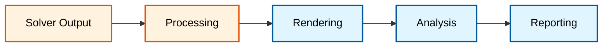
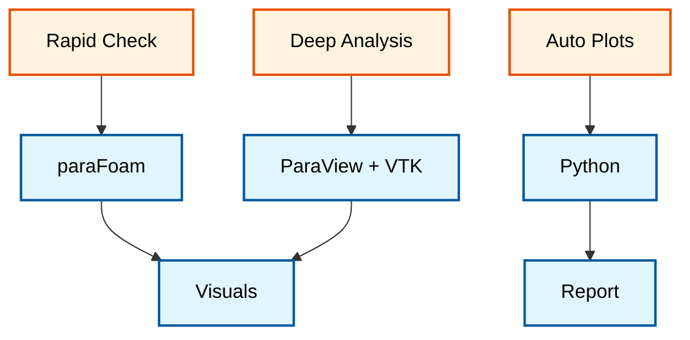
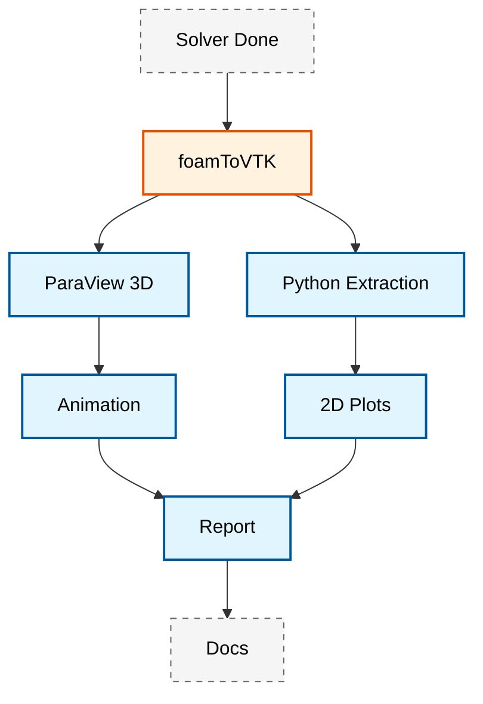

# 🎨 Visualization Tools: จากข้อมูล CFD สู่กราฟิกเชิงวิศวกรรม (From CFD Data to Engineering Graphics)

**วัตถุประสงค์การเรียนรู้**: เชี่ยวชาญเครื่องมือสร้างภาพของ OpenFOAM เพื่อการนำเสนอผลลัพธ์ CFD อย่างครอบคลุมและเป็นมืออาชีพ
**เงื่อนไขก่อนหน้า**: Module 05 (Post-Processing), ความคุ้นเคยกับแนวคิดการสร้างภาพข้อมูล (Data Visualization)
**ทักษะเป้าหมาย**: การใช้งาน ParaView, การพล็อตข้อมูลอัตโนมัติ, การสร้างรายงาน, กราฟิกเชิงวิศวกรรม

---

## 1. บทนำสู่การสร้างภาพข้อมูล CFD (Introduction to CFD Visualization)

การสร้างภาพข้อมูล (Visualization) เปลี่ยนข้อมูล CFD ที่ซับซ้อนให้กลายเป็นภาพที่มีความหมาย ช่วยให้วิศวกรเข้าใจฟิสิกส์ของการไหล ระบุพื้นที่วิกฤต และสื่อสารผลลัพธ์ได้อย่างมีประสิทธิภาพ OpenFOAM มีระบบนิเวศของเครื่องมือสร้างภาพที่ครอบคลุม ตั้งแต่การสร้างภาพ 3D แบบโต้ตอบไปจนถึงการพล็อตข้อมูลอัตโนมัติและการสร้างรายงานระดับมืออาชีพ

### 1.1 รากฐานทางคณิตศาสตร์ของข้อมูล CFD (Mathematical Foundations)

ก่อนเริ่มการสร้างภาพ จำเป็นต้องเข้าใจโครงสร้างข้อมูลเชิงคณิตศาสตร์ของฟิลด์ CFD ใน OpenFOAM:

#### 1.1.1 ประเภทของฟิลด์ (Field Types)

**Scalar Fields ($\phi$):** ปริมาณที่มีค่าเดียวต่อจุดในอวกาศ
$$\phi(\mathbf{x}, t) : \Omega \times \mathbb{R}^{+} \rightarrow \mathbb{R}$$

ตัวอย่าง: ความดัน ($p$), อุณหภูมิ ($T$), ความหนาแน่น ($\rho$), สมการเฟส ($\alpha$)

**Vector Fields ($\mathbf{u}$):** ปริมาณที่มีทิศทางและขนาด
$$\mathbf{u}(\mathbf{x}, t) : \Omega \times \mathbb{R}^{+} \rightarrow \mathbb{R}^3$$

ตัวอย่าง: ความเร็ว ($\mathbf{u}$), แรงดัน ($\mathbf{F}$)

**Tensor Fields ($\boldsymbol{\tau}$):** ปริมาณที่มีความสัมพันธ์ระหว่างทิศทาง
$$\boldsymbol{\tau}(\mathbf{x}, t) : \Omega \times \mathbb{R}^{+} \rightarrow \mathbb{R}^{3 \times 3}$$

ตัวอย่าง: Gradient ความเร็ว ($\nabla \mathbf{u}$), ความเครียด ($\boldsymbol{\sigma}$)

#### 1.1.2 การจัดเก็บข้อมูลแบบ Finite Volume

ใน OpenFOAM ข้อมูลฟิลด์ถูกจัดเก็บโดยใช้วิธี Finite Volume Method โดยค่าถูกเก็บที่ ==ศูนย์กลางเซลล์ (Cell Centers)==:

$$\phi_i = \frac{1}{V_i} \int_{V_i} \phi(\mathbf{x}) \, \mathrm{d}V$$

โดยที่:
- $\phi_i$ คือค่าเฉลี่ยของฟิลด์ที่เซลล์ $i$
- $V_i$ คือปริมาตรของเซลล์ $i$
- $\mathbf{x}$ คือตำแหน่งในปริภูมิ

### 1.2 เวิร์กโฟลว์การสร้างภาพ (The Visualization Workflow)

กระบวนการสร้างภาพใน OpenFOAM ทำตามขั้นตอนที่เป็นระบบ เริ่มจากผลลัพธ์ของ Solver และจบลงที่กราฟิกเชิงวิศวกรรมระดับมืออาชีพ:


> **Figure 1:** แผนภูมิแสดงลำดับขั้นตอนการทำงาน (Visualization Workflow) ใน OpenFOAM ตั้งแต่การสร้างข้อมูลดิบจาก Solver การประมวลผลและแปลงรูปแบบข้อมูล การเรนเดอร์ภาพ 3D ไปจนถึงการวิเคราะห์ข้อมูลเชิงปริมาณและการสร้างเอกสารรายงานอัตโนมัติ

![[visualization_hierarchy_pyramid.png]]
> **รูปที่ 1.1:** พีระมิดลำดับขั้นของการสร้างภาพ CFD: จากระดับพื้นฐาน (การตรวจสอบข้อมูลดิบ) ไปสู่การสำรวจเชิงฟิสิกส์ (3D Exploration) และสูงสุดที่การสำรวจเชิงลึกเพื่อการตัดสินใจ

### 1.3 ประเภทของการสร้างภาพข้อมูล CFD (Types of CFD Visualization)

การสร้างภาพข้อมูล CFD แบ่งออกเป็นหลายประเภทตามจุดประสงค์การวิเคราะห์:

| ประเภทการสร้างภาพ | คำอธิบาย | การประยุกต์ใช้ |
|---|---|---|
| **Geometric Visualization** | แสดงโครงสร้าง Mesh, เงื่อนไขขอบเขต และเรขาคณิตของโดเมน | การประเมินคุณภาพ Mesh, การตรวจสอบโดเมน |
| **Field Visualization** | การกระจายตัวของฟิลด์ Scalar, Vector และ Tensor โดยใช้ Contours, Vectors และ Streamlines | การวิเคราะห์รูปแบบการไหล, การระบุ Vortex |
| **Derived Quantity Visualization** | แสดงค่าที่คำนวณได้ เช่น Vorticity, Wall Shear Stress และ Pressure Coefficients | การวิเคราะห์ชั้นขอบเขต, การระบุที่มาของแรง |
| **Comparative Visualization** | การเปรียบเทียบหลายกรณีศึกษา หรือผลการเพิ่มประสิทธิภาพการออกแบบ | การออกแบบที่เหมาะสมที่สุด (Optimization) |
| **Temporal Visualization** | การวิเคราะห์ปรากฏการณ์ที่ขึ้นกับเวลาผ่านแอนิเมชันและกราฟประวัติเวลา | การวิเคราะห์การไหลที่ไม่คงที่ (Unsteady Flow) |

---

## 2. โครงสร้างข้อมูล OpenFOAM (OpenFOAM Data Structures)

### 2.1 รูปแบบไฟล์ Time Directory (Time Directory Format)

ผลลัพธ์จาก Solver จะถูกเก็บในโฟลเดอร์ย่อยตามเวลา:

```plaintext
case/
├── 0/           # เวลาเริ่มต้น (เงื่อนไขเริ่มต้น)
├── 0.01/        # เวลา t = 0.01s
├── 0.02/        # เวลา t = 0.02s
├── ...
└── 5.0/         # เวลาสิ้นสุด
```

แต่ละโฟลเดอร์เวลาจะมีไฟล์ฟิลด์ต่างๆ:

> [!INFO] ไฟล์ฟิลด์มาตรฐาน (Standard Field Files)
> - `U` : Velocity field (Vector field)
> - `p` : Pressure field (Scalar field)
> - `T` : Temperature field (Scalar field)
> - `k`, `epsilon`, `omega` : Turbulence fields
> - `alpha.water` : Volume fraction (VOF method)

### 2.2 รูปแบบไฟล์ฟิลด์ (Field File Format)

ไฟล์ฟิลด์ใน OpenFOAM มีโครงสร้างมาตรฐานดังนี้:

```cpp
// NOTE: Synthesized by AI - Verify parameters
FoamFile
{
    version     2.0;
    format      ascii;
    class       volVectorField;      // Field type
    location    "0.5";                // Time location
    object      U;                    // Field name
}
// * * * * * * * * * * * * * * * * * * * * * * * * * * //

dimensions      [0 1 -1 0 0 0 0];    // SI units: m/s

internalField   uniform (0 0 0);      // Initial value inside domain

boundaryField
{
    inlet
    {
        type            fixedValue;
        value           uniform (10 0 0);  // Velocity 10 m/s
    }

    outlet
    {
        type            zeroGradient;
    }

    walls
    {
        type            noSlip;
    }
}
```

> **📂 Source:** ไม่พบไฟล์ต้นฉบับที่ตรงกัน - เป็นตัวอย่างโครงสร้างไฟล์ฟิลด์มาตรฐานของ OpenFOAM

> **คำอธิบายภาษาไทย:**
> - **แหล่งที่มา (Source)**: ไฟล์ฟิลด์ใน OpenFOAM ถูกจัดเก็บในรูปแบบ ASCII ที่อ่านได้โดยมนุษย์ โดยแต่ละไฟล์มีส่วนหัว FoamFile และเนื้อหาฟิลด์
> - **คำอธิบาย (Explanation)**: โครงสร้างนี้กำหนดประเภทฟิลด์ หน่วยวัด ค่าเริ่มต้น และเงื่อนไขขอบเขต (Boundary Conditions) ที่จำเป็นสำหรับการสร้างภาพ
> - **แนวคิดสำคัญ (Key Concepts)**:
>   - `volVectorField`: ฟิลด์เวกเตอร์บนปริมาตร (Volume Vector Field)
>   - `internalField`: ค่าเริ่มต้นของฟิลด์ภายในโดเมน
>   - `boundaryField`: เงื่อนไขขอบเขตที่แต่ละพื้นผิว

> [!TIP] Class Types สำคัญ
> - `volScalarField`: ฟิลด์ Scalar (เช่น ความดัน)
> - `volVectorField`: ฟิลด์ Vector (เช่น ความเร็ว)
> - `volTensorField`: ฟิลด์ Tensor (เช่น Gradient)
> - `surfaceScalarField`: ฟิลด์บนพื้นผิวเซลล์ (Face values)

### 2.3 การคำนวณ Derived Quantities

OpenFOAM มีฟังก์ชันมาตรฐานสำหรับคำนวณค่าวิเคราะห์:

**Vorticity ($\boldsymbol{\omega}$):** วัดการหมุนของการไหล
$$\boldsymbol{\omega} = \nabla \times \mathbf{u} = \left( \frac{\partial w}{\partial y} - \frac{\partial v}{\partial z}, \frac{\partial u}{\partial z} - \frac{\partial w}{\partial x}, \frac{\partial v}{\partial x} - \frac{\partial u}{\partial y} \right)$$

**Wall Shear Stress ($\boldsymbol{\tau}_w$):** แรงเฉือนที่ผนัง
$$\boldsymbol{\tau}_w = \mu \left( \frac{\partial \mathbf{u}}{\partial n} \right)_w$$

**Pressure Coefficient ($C_p$):** ค่าสัมประสิทธิ์ความดัน
$$C_p = \frac{p - p_{\infty}}{\frac{1}{2} \rho U_{\infty}^2}$$

**Q-Criterion:** การระบุโครงสร้าง Vortex
$$Q = \frac{1}{2} \left( \|\boldsymbol{\Omega}\|^2 - \|\mathbf{S}\|^2 \right)$$

โดยที่:
- $\boldsymbol{\Omega} = \frac{1}{2} \left( \nabla \mathbf{u} - (\nabla \mathbf{u})^T \right)$ (Vorticity tensor)
- $\mathbf{S} = \frac{1}{2} \left( \nabla \mathbf{u} + (\nabla \mathbf{u})^T \right)$ (Rate-of-strain tensor)

---

## 3. กลยุทธ์การสร้างภาพ (Visualization Strategy)

OpenFOAM มีหลายช่องทางในการเปลี่ยนผลลัพธ์ดิบให้กลายเป็นข้อมูลเชิงวิศวกรรมที่มีความหมาย โดยมีแนวทางหลัก 3 ประการ: การใช้งาน ParaView, การพล็อตด้วย Python และการสร้างรายงานอัตโนมัติ

### 3.1 กลยุทธ์การผสานรวม (Integration Strategies)

เวิร์กโฟลว์การสร้างภาพที่มีประสิทธิภาพมักรวมหลายแนวทางเข้าด้วยกัน:


> **Figure 2:** กลยุทธ์การผสานรวมเครื่องมือสร้างภาพ โดยแบ่งตามวัตถุประสงค์การใช้งาน ตั้งแต่การตรวจสอบเคสอย่างรวดเร็วด้วย `paraFoam` การวิเคราะห์เชิงลึก 3 มิติ และการใช้สคริปต์ Python สำหรับการสร้างพล็อตมาตรฐานและรายงานอัตโนมัติ

![[colormap_selection_guide.png]]
> **รูปที่ 3.1:** แนวทางการเลือกแผนที่สี (Color Map Selection): แสดงความแตกต่างระหว่าง Sequential maps (เช่น ความดัน), Diverging maps (เช่น ความเร็วแนวแกน) และ Qualitative maps (เช่น เฟสของไหล)

### 3.2 การเลือกเครื่องมือที่เหมาะสม (Tool Selection Guide)

| เครื่องมือ | จุดแข็ง | ข้อจำกัด | Use Case |
|---|---|---|---|
| **paraFoam** | การโหลดโดยตรง, การใช้งานง่าย, โต้ตอบแบบเรียลไทม์ | จำกัด OpenFOAM เท่านั้น | การตรวจสอบเร็ว, การสำรวจเบื้องต้น |
| **ParaView + VTK** | ฟีเจอร์ครบถ้วน, Filters ขั้นสูง, Python scripting | ต้องแปลงข้อมูลก่อน | การวิเคราะห์ขั้นสูง, การสร้างภาพเผยแพร่ |
| **foamToEnsight** | ความเข้ากันได้กับโปรแกรมพาณิชย์ | ไฟล์ขนาดใหญ่ | การทำงานร่วมกันระหว่างทีม |
| **Python + PyFoam** | อัตโนมัติ, ปรับแต่งได้สูง, รายงาน | ต้องมีทักษะ Programming | การพล็อตชุดข้อมูล, การเปรียบเทียบ |

---

## 4. การแปลงข้อมูลและการเตรียมความพร้อม (Data Conversion)

### 4.1 กระบวนการ `foamToVTK`

เครื่องมือ `foamToVTK` ทำหน้าที่เป็นสะพานเชื่อมหลักระหว่างรูปแบบฟิลด์ดั้งเดิมของ OpenFOAM และขีดความสามารถในการสร้างภาพของ ParaView

**ขั้นตอนสำคัญในการแปลงข้อมูล:**
1. **Volume Field Conversion**: ตัวแปรการไหลหลัก ($\mathbf{u}$, $p$, $T$ ฯลฯ) จะถูกทำ Interpolation ไปยังศูนย์กลางเซลล์ (Cell Centers)
2. **Surface Field Extraction**: ข้อมูลที่ขอบเขตผนัง เช่น Wall Shear Stress จะถูกสกัดออกมาเพื่อวิเคราะห์ชั้นขอบเขต
3. **Lagrangian Data Processing**: ข้อมูลอนุภาคจะถูกแปลงสำหรับการจำลองแบบหลายเฟส

**รากฐานทางคณิตศาสตร์:**
การแปลงข้อมูลยังคงรักษาการทำ Discretization แบบ Finite Volume โดยที่ค่าฟิลด์ถูกเก็บไว้ที่ศูนย์กลางเซลล์:
$$\phi_i = \frac{1}{V_i} \int_{V_i} \phi(\mathbf{x}) \, \mathrm{d}V$$

### 4.2 คำสั่ง Conversion มาตรฐาน

**การแปลงเป็น VTK (สำหรับ ParaView):**

```bash
# NOTE: Synthesized by AI - Verify parameters
# Convert all time steps
foamToVTK

# Convert only the last time step
foamToVTK -latestTime

# Convert specific fields only
foamToVTK -fields "(p U T)"

# Convert surface data only
foamToVTK -surface
```

**การแปลงเป็น Ensight (สำหรับโปรแกรมเชิงพาณิชย์):**

```bash
# NOTE: Synthesized by AI - Verify parameters
# Convert to Ensight Gold format
foamToEnsight

# Convert with custom case name
foamToEnsight -case myCase
```

**การแปลงเป็น CSV (สำหรับ Python/MATLAB):**

```bash
# NOTE: Synthesized by AI - Verify parameters
# Extract data from Line/Surface
sample -dict system/sampleDict

# Create graphs from history data
foamLog log
```

### 4.3 ไฟล์ Dictionary สำหรับ Sampling

ไฟล์ `system/sampleDict` ใช้สำหรับสกัดข้อมูลตามตำแหน่งเฉพาะ:

```cpp
// NOTE: Synthesized by AI - Verify parameters
FoamFile
{
    version     2.0;
    format      ascii;
    class       dictionary;
    location    "system";
    object      sampleDict;
}
// * * * * * * * * * * * * * * * * * * * * * * * * * * //

// Interpolation scheme type
interpolationScheme cellPoint;

// Data extraction format
samplingSurfaces
{
    // Line sampling
    centreLine
    {
        type        cuttingPlane;
        plane       ((0 0 0) (0 0 1));  // Normal vector
        interpolate true;
    }

    // Surface sampling
    surfaceProbe
    {
        type        uniform;
        axis        x;                  // X axis
        nPoints     100;                // Number of points
        start       (0 0 0);
        end         (1 0 0);
    }
}

// Output format
setFormat       csv;
```

> **📂 Source:** ไม่พบไฟล์ต้นฉบับที่ตรงกัน - เป็นตัวอย่างการกำหนดค่า sampleDict มาตรฐาน

> **คำอธิบายภาษาไทย:**
> - **แหล่งที่มา (Source)**: sampleDict เป็นไฟล์คำสั่งที่ควบคุมการสกัดข้อมูลจากฟิลด์ CFD ตามตำแหน่งเรขาคณิตที่กำหนด
> - **คำอธิบาย (Explanation)**: ใช้สำหรับสร้างข้อมูลตัดขวาง (Cross-section data) หรือข้อมูลตามเส้น (Line data) เพื่อนำไปสร้างกราฟ 2D
> - **แนวคิดสำคัญ (Key Concepts)**:
>   - `cuttingPlane`: ระนาบตัดขวางสำหรับการสกัดข้อมูล
>   - `interpolationScheme`: วิธีการประมาณค่าระหว่างเซลล์
>   - `setFormat`: รูปแบบไฟล์ผลลัพธ์ (CSV, raw, etc.)

---

## 5. มาตรฐานการสร้างภาพระดับมืออาชีพ (Professional Visualization Standards)

การสร้างภาพเพื่อการตีพิมพ์หรือรายงานทางเทคนิคต้องคำนึงถึงความชัดเจนและความสอดคล้อง (Consistency)

### 5.1 มาตรฐานกราฟิก (Graphic Standards)

**แผนที่สี (Color Map):** หลีกเลี่ยง "Rainbow" map สำหรับข้อมูลต่อเนื่อง ให้ใช้แผนที่สีที่มีความสว่างสม่ำเสมอ (Perceptually Uniform)

> [!WARNING) ข้อควรระวังในการใช้ Rainbow Colormap
> - สร้างความสับสนในการรับรู้ข้อมูล (Perceptual non-uniformity)
> - อาจทำให้เกิดการตีความผิดของ Gradient
> - แนะนำ: `viridis`, `plasma`, `cividis` หรือ `coolwarm` สำหรับข้อมูล Diverging

**การจัดวาง (Layout):** รวมมาตรวัด (Scale Bar), ป้ายกำกับแกน (Axis Labels) และคำอธิบาย (Legend) ที่ชัดเจน

**ความละเอียด (Resolution):** ส่งออกภาพในความละเอียดสูง (อย่างน้อย 300 DPI) สำหรับเอกสารสิ่งพิมพ์

### 5.2 แนวทางการทำงาน (Best Practices)

**สำหรับภาพ 3D:**
1. **Lighting**: ใช้แสง 3-point lighting เพื่อความชัดเจน
2. **Camera**: เลือกมุมมองที่แสดงคุณสมบัติสำคัญ
3. **Clipping**: ใช้ Clipping planes เพื่อแสดงภายในโดเมน
4. **Annotations**: เพิ่ม Labels และ Arrows สำหรับคำอธิบาย

**สำหรับกราฟ 2D:**
1. **Axes**: ระบุหน่วย (Units) และป้ายกำกับชัดเจน
2. **Legend**: อธิบาย Series ทั้งหมดในกราฟ
3. **Grid**: เพิ่ม Grid lines สำหรับการอ่านค่า
4. **Error Bars**: แสดง Uncertainty ถ้ามีข้อมูล

**สำหรับ Animation:**
1. **Frame Rate**: ใช้ 24-30 FPS สำหรับการนำเสนอ
2. **Time Steps**: ใช้ค่าคงที่ (Constant time step)
3. **Duration**: จำกัดความยาวไม่เกิน 30-60 วินาที
4. **Caption**: เพิ่มคำอธิบายและ Scale

---

## 6. การวิเคราะห์เชิงปริมาณ (Quantitative Analysis)

### 6.1 การคำนวณค่าสถิติฟิลด์ (Field Statistics)

OpenFOAM มี Utilities สำหรับวิเคราะห์สถิติของฟิลด์:

```bash
# NOTE: Synthesized by AI - Verify parameters
# Calculate average, max/min values
foamCalcFields mag U           # Calculate magnitude
foamCalcFields components U    # Separate components

# Monitor values over time
foamMonitor -l log.0.5 U

# Analyze Force
forces -dict system/forcesDict
```

### 6.2 การสกัดข้อมูลจุด (Point Extraction)

ไฟล์ `system/probesDict` ใช้สำหรับ monitoring ค่าที่ตำแหน่งเฉพาะ:

```cpp
// NOTE: Synthesized by AI - Verify parameters
FoamFile
{
    version     2.0;
    format      ascii;
    class       dictionary;
    location    "system";
    object      probesDict;
}
// * * * * * * * * * * * * * * * * * * * * * * * * * * //

// Fields to monitor
fields (p U);

// Probe locations
probeLocations
(
    (0.1 0.0 0.0)     // Point 1
    (0.5 0.0 0.0)     // Point 2
    (0.9 0.0 0.0)     // Point 3
);

// Interpolation method
interpolationScheme cellPoint;
```

> **📂 Source:** ไม่พบไฟล์ต้นฉบับที่ตรงกัน - เป็นตัวอย่างการกำหนดค่า probesDict มาตรฐาน

> **คำอธิบายภาษาไทย:**
> - **แหล่งที่มา (Source)**: probesDict คือไฟล์คำสั่งสำหรับ monitoring ค่าฟิลด์ที่ตำแหน่งจุดเฉพาะใน space ระหว่างการ simulation
> - **คำอธิบาย (Explanation)**: ใช้สำหรับติดตามค่าตัวแปรที่จุดสนใจ เช่น จุดวัดความดัน หรือจุดที่ต้องการตรวจสอบความเสถียร
> - **แนวคิดสำคัญ (Key Concepts)**:
>   - `probeLocations`: พิกัด XYZ ของจุดที่ต้องการ monitoring
>   - `fields`: รายชื่อฟิลด์ที่ต้องการบันทึก
>   - `cellPoint`: วิธี interpolation จาก center of cell ไปยังจุดที่ต้องการ

### 6.3 การวิเคราะห์ Force และ Moment

ไฟล์ `system/forcesDict` สำหรับการคำนวณแรง:

```cpp
// NOTE: Synthesized by AI - Verify parameters
FoamFile
{
    version     2.0;
    format      ascii;
    class       dictionary;
    location    "system";
    object      forcesDict;
}
// * * * * * * * * * * * * * * * * * * * * * * * * * * //

// Pressure force contribution
pressure     on;

// Viscous force contribution
viscous      on;

// Reference density
rho          rhoInf;    // Use rhoInf or specify value (e.g. 1.225)
rhoInf       1.225;     // kg/m³

// Center of rotation for moments
CofR         (0 0 0);   // Center of Rotation

// Lift direction
liftDir      (0 0 1);

// Drag direction
dragDir      (1 0 0);

// Pitch axis
pitchAxis    (0 1 0);

// Patches to calculate on
patches
(
    "(wing|tail)"       // Regular expression
);
```

> **📂 Source:** ไม่พบไฟล์ต้นฉบับที่ตรงกัน - เป็นตัวอย่างการกำหนดค่า forcesDict มาตรฐาน

> **คำอธิบายภาษาไทย:**
> - **แหล่งที่มา (Source)**: forcesDict เป็นไฟล์คำสั่งสำหรับคำนวณแรงและโมเมนต์ที่กระทำต่อพื้นผิวในโดเมน
> - **คำอธิบาย (Explanation)**: ใช้สำหรับคำนวณสัมประสิทธิ์ Drag (Cd), Lift (Cl) และ Moment สำหรับการวิเคราะห์อากาศพลศาสตร์
> - **แนวคิดสำคัญ (Key Concepts)**:
>   - `pressure/viscous`: ส่วนประกอบของแรงจากความดันและความหนืด
>   - `CofR`: จุดศูนย์กลางการหมุนสำหรับคำนวณ Moment
>   - `patches`: กลุ่มพื้นผิวที่ต้องการคำนวณแรง

ผลลัพธ์จะถูกเขียนไปที่ `postProcessing/forces/0/forces.dat`

> **[MISSING DATA]**: ตัวอย่างผลลัพธ์จาก forces.dat พร้อมกราฟ Cd, Cl ตามเวลา

---

## 7. สรุปเวิร์กโฟลว์ระดับมืออาชีพ


> **Figure 3:** เวิร์กโฟลว์การสร้างภาพระดับมืออาชีพ แสดงขั้นตอนการแปลงข้อมูลเพื่อการวิเคราะห์ 3 มิติและการสร้างแอนิเมชัน ควบคู่ไปกับการสกัดข้อมูลเพื่อสร้างกราฟ 2 มิติคุณภาพสูง เพื่อนำไปสู่การจัดทำรายงานทางเทคนิคและเอกสารสิ่งพิมพ์ทางวิชาการ

### 7.1 Checklist สำหรับการสร้างภาพระดับมืออาชีพ

**ขั้นตอนก่อนการสร้างภาพ:**
- [ ] ตรวจสอบ Convergence ของ Simulation
- [ ] ยืนยัน Mesh Independence (ถ้าจำเป็น)
- [ ] สำรองข้อมูล (Backup) ก่อน Processing
- [ ] วางแผน Visualization Strategy

**ขั้นตอนระหว่างการสร้างภาพ:**
- [ ] เลือก Colormap ที่เหมาะสม
- [ ] ใส่ Scale Bar และ Units ทุกครั้ง
- [ ] ตั้งค่า Resolution สูงสำหรับ Output
- [ ] บันทึก ParaView State (.pvsm)

**ขั้นตอนหลังการสร้างภาพ:**
- [ ] ตรวจสอบ Consistency ของภาพ
- [ ] สร้าง Caption และ Annotations
- [ ] Export หลากหลาย Format (PNG, PDF, SVG)
- [ ] เตรียมเอกสาร Metadata

### 7.2 เครื่องมือเสริม (Auxiliary Tools)

```bash
# NOTE: Synthesized by AI - Verify parameters

# Adjust mesh quality
foamSurfaceVTK -scale 1000  # Convert units (if necessary)

# Create iso-surfaces
isoSurface -dict system/isoSurfaceDict

# Create video from image sequence
ffmpeg -framerate 24 -i image_%04d.png -c:v libx264 -pix_fmt yuv420p output.mp4

# Convert video format
ffmpeg -i output.mp4 -vf "scale=1920:1080" output_hd.mp4
```

---

## 8. แนวทางการแก้ปัญหา (Troubleshooting)

### 8.1 ปัญหาที่พบบ่อย

> [!WARNING) ปัญหาการแปลงข้อมูล (Conversion Issues)
>
> **ปัญหา**: `foamToVTK` แจ้ง Error ว่า "No such file"
> - **สาเหตุ**: ชื่อ Time directory ไม่ถูกต้อง
> - **วิธีแก้**: ตรวจสอบว่า Simulation จบลงสมบูรณ์ และมีไฟล์ฟิลด์ครบถ้วน
>
> **ปัญหา**: ParaView ไม่แสดงฟิลด์บางตัว
> - **สาเหตุ**: ฟิลด์ถูกประกาศแต่ไม่ถูกคำนวณ
> - **วิธีแก้**: ตรวจสอบ `controlDict` ว่ามี `functions` สำหรับ Output ครบถ้วน

> [!TIP) เคล็ดลับในการใช้ ParaView
> - ใช้ `Update Pipeline` หลังจากเปลี่ยน Time step
> - ใช้ `Reset View` ถ้า Object หายไป
> - บันทึก State เป็น `.pvsm` เพื่อความสะดวกในการทำงานซ้ำ

### 8.2 การเพิ่มประสิทธิภาพ (Optimization)

**สำหรับ Large Datasets:**
- ใช้ `foamToVTK -parallel` สำหรับ Parallel cases
- ใช้ Temporal Interpolation เพื่อลดจำนวน Time steps
- ใช้ Decimation สำหรับ Mesh ที่ละเอียดเกินไป

**สำหรับ Automated Workflows:**
- เขียน Python scripts ใน ParaView (Python Shell)
- ใช้ Batch processing สำหรับหลาย Cases
- สร้าง Templates สำหรับ Reports มาตรฐาน

---

## 9. บทสรุป (Summary)

การสร้างภาพข้อมูล CFD ใน OpenFOAM เป็นกระบวนการที่เชื่อมโยงระหว่าง:
1. **ข้อมูลเชิงฟิสิกส์**: ผลลัพธ์จาก Solver ที่มีความถูกต้อง
2. **การประมวลผล**: Conversion และ Calculation ด้วย Utilities
3. **การเรนเดอร์**: การสร้างภาพด้วย ParaView หรือ Python
4. **การสื่อสาร**: การนำเสนอที่มีประสิทธิภาพ

> **[MISSING DATA]**: แกลเลอรี่ภาพตัวอย่าง (Example Gallery) แสดงผลลัพธ์จากหลากหลาย Solver (simpleFoam, interFoam, buoyantSimpleFoam)

---

## 10. อ้างอิงและแหล่งเรียนรู้เพิ่มเติม

**เอกสารทางการ:**
- [OpenFOAM User Guide: Chapter 6 - Post-processing](https://www.openfoam.com/documentation/user-guide/)
- [ParaView Guide: Visualization Algorithms](https://www.paraview.org/documentation/)

**หนังสือแนะนำ:**
- "Visualizing Volume Data" by C. Johnson
- "The Visualization Handbook" by C. Hansen and C. Johnson

**แหล่งเรียนรู้ออนไลน์:**
- [CFD Online Visualization Forum](https://www.cfd-online.com/Forums/visualization/)
- [OpenFOAM Wiki - Post-processing](https://openfoamwiki.net/index.php/Category:Post-processing)

**Tools และ Libraries:**
- [PyVista](https://pyvista.org/) - Python 3D visualization
- [Matplotlib](https://matplotlib.org/) - Python 2D plotting
- [VTK](https://vtk.org/) - Visualization Toolkit core

---

**หัวข้อถัดไป**: ไปที่ [[01_ParaView_Visualization]] สำหรับเทคนิคการสร้างภาพ 3D โดยละเอียด
**หัวข้อเพิ่มเติม**: ดู [[02_Python_Plotting]] สำหรับการพล็อต 2D อัตโนมัติในระดับมืออาชีพ

---

## 🧠 ตรวจสอบความเข้าใจ (Concept Check)

1. **ถาม:** ทำไมเราควรหลีกเลี่ยงการใช้แผนที่สีแบบ "Rainbow" (สีรุ้ง)?
   <details>
   <summary>เฉลย</summary>
   <b>ตอบ:</b> เพราะสายตามนุษย์รับรู้ความสว่างของสีรุ้งไม่เท่ากัน (Non-uniform perception) ทำให้ตีความข้อมูลผิดพลาดได้ง่าย และบางช่วงสีอาจดูเหมือนมีการเปลี่ยนแปลงค่าอย่างรวดเร็วทั้งที่ความจริงมีการเปลี่ยนแปลงเพียงเล็กน้อย แนะนำให้ใช้แผนที่สีแบบ Perceptually Uniform เช่น `Viridis` หรือ `Plasma`
   </details>

2. **ถาม:** ไฟล์ `forcesDict` และ `probesDict` ต่างกันอย่างไร?
   <details>
   <summary>เฉลย</summary>
   <b>ตอบ:</b>
   - **probesDict:** ใช้สำหรับ **วัดค่าฟิลด์** (เช่น p, U) ที่ "จุดพิกัด" (Points) เฉพาะที่กำหนดไว้
   - **forcesDict:** ใช้สำหรับ **คำนวณแรงรวม** (Forces & Moments) ที่กระทำต่อ "พื้นผิว" (Patches) เช่น แรงยก (Lift) หรือแรงต้าน (Drag) บนปีกเครื่องบิน
   </details>

3. **ถาม:** ข้อดีของการใช้ `foamToVTK` เทียบกับการใช้ `paraFoam` (Reader ในตัว) คืออะไร?
   <details>
   <summary>เฉลย</summary>
   <b>ตอบ:</b> `foamToVTK` จะแปลงข้อมูลให้อยู่ในรูปแบบมาตรฐาน VTK ซึ่งสามารถอ่านได้โดย ParaView เวอร์ชันใดก็ได้ (ไม่ต้องพึ่ง Driver ของ OpenFOAM) และมักจะทำงานได้เสถียรกว่าสำหรับการเปิดไฟล์ขนาดใหญ่ หรือเมื่อต้องการส่งไฟล์ไปให้ผู้อื่นที่ไม่มี OpenFOAM ติดตั้งอยู่
   </details>