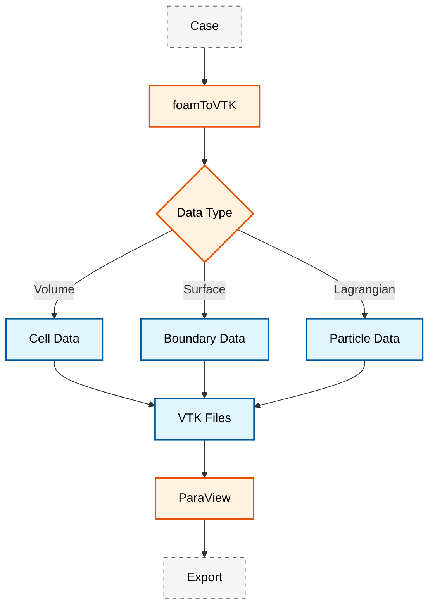
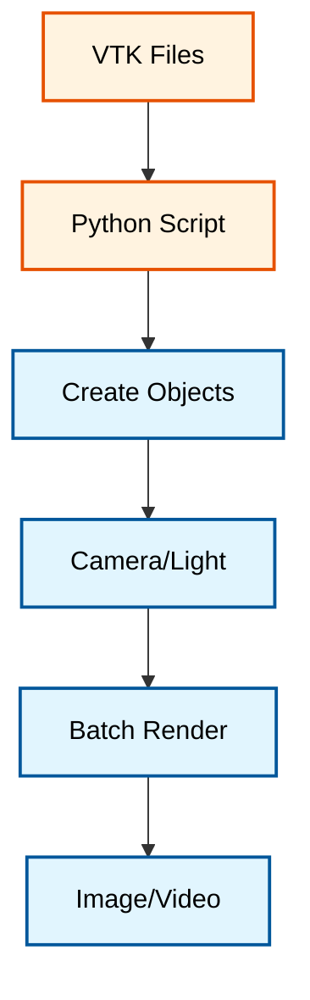

# ParaView Integration and Automation (การบูรณาการและการใช้งาน ParaView อัตโนมัติ)

## ภาพรวม (Overview)

ParaView เป็นเครื่องมือสร้างภาพหลักสำหรับการจำลอง OpenFOAM โดยมีความสามารถในการทำ Post-processing ที่ครอบคลุมสำหรับการวิเคราะห์ CFD บันทึกทางเทคนิคนี้ครอบคลุมเวิร์กโฟลว์ตั้งแต่การแปลงข้อมูลไปจนถึงการสร้างภาพแบบอัตโนมัติ

> [!TIP] **เปรียบเทียบ ParaView (Analogy)**
> ให้คิดว่า **OpenFOAM** คือ **"กล้องถ่ายรูปสเปกสูง"** ที่บันทึกข้อมูลแสงสี (Raw Data) ไว้ละเอียดมากแต่เป็นตัวเลขดิบๆ ที่มนุษย์ดูไม่รู้เรื่อง
> **foamToVTK** คือ **"โปรแกรมล้างรูป (Develop)"** ที่แปลงไฟล์ดิบให้อยู่ในรูปแบบที่โปรแกรมแต่งภาพอ่านได้
> **ParaView** คือ **"Photoshop สำหรับวิศวกร"** ที่ให้เราเอาข้อมูลที่ล้างแล้วมาปรับแต่งสี (Color Map), ตัดส่วนเกิน (Slice/Clip), ใส่ฟิลเตอร์ (Calculator/Streamtracer) เพื่อให้เห็นความงามและความหมายที่ซ่อนอยู่ของภาพถ่ายนั้น

> [!INFO] จุดเชื่อมต่อสำคัญ
> เครื่องมือ `foamToVTK` ทำหน้าที่เป็นสะพานเชื่อมระหว่างรูปแบบฟิลด์ดั้งเดิมของ OpenFOAM และขีดความสามารถในการสร้างภาพของ ParaView โดยการแปลงข้อมูล Mesh และตัวแปรฟิลด์ให้อยู่ในรูปแบบ VTK (Visualization Toolkit)

---

## 1. กระบวนการแปลงข้อมูล VTK (VTK Conversion Process)
...
(keep existing content until Case Studies section)
...
## 7. ตัวอย่างกรณีศึกษา (Case Studies)

### 7.1 การวิเคราะห์ Flow around Cylinder

> **ผลลัพธ์ที่คาดหวัง (Expected Results):**
> ภาพ Animation แสดง **Karman Vortex Street** ที่สวยงาม โดยจะเห็น Vortex สีแดงและน้ำเงิน (ตามค่า Vorticity) หลุดออกจากหลังทรงกระบอกสลับกันไปมา
> - กราฟ **Lift Coefficient ($C_L$)** จะแกว่งเป็นรูปคลื่น Sine Wave ที่สม่ำเสมอ แสดงถึงการสั่นสะเทือนที่เกิดจาก Vortex Shedding
> - **Contour Plot** ของความดันจะแสดง High Pressure ที่จุด Stagnation ด้านหน้า และ Low Pressure ในแกนของ Vortex

**สิ่งที่ต้องวิเคราะห์:**
- **Vortex Shedding Frequency**: ใช้ Lift Coefficient vs Time
- **Drag Coefficient**: ใช้ Pressure และ Wall Shear Stress
- **Strouhal Number**: $St = \frac{fL}{U_{\infty}}$

### 7.2 การวิเคราะห์ Turbulent Channel Flow

> **ผลลัพธ์ที่คาดหวัง (Expected Results):**
> ภาพตัดขวาง (Slice) แสดง **Boundary Layer** ที่ชัดเจน โดยความเร็วจะเพิ่มขึ้นจาก 0 ที่ผนังจนถึงความเร็วสูงสุดที่กึ่งกลาง
> - กราฟ **Log-Law Profile** ($u^+$ vs $y^+$) จะแสดงช่วง Linear Sublayer ($y^+ < 5$), Buffer Layer, และ Log-law Region ($y^+ > 30$) ที่ตรงกับทฤษฎี Von Karman constant ($\kappa \approx 0.41$)

**สิ่งที่ต้องวิเคราะห์:**
- **Velocity Profile**: $u^+$ vs $y^+$ (Law of the Wall)
- **Turbulence Statistics**: $k$, $\omega$, $\nu_t$
- **Reynolds Stress**: $-\rho \overline{u'v'}$

---

## 8. เอกสารที่เกี่ยวข้อง

- [[Post-Processing Utilities]] - ภาพรวมเครื่องมือ Post-processing ของ OpenFOAM
- [[Field Calculation]] - รากฐานทางคณิตศาสตร์ของการดำเนินการฟิลด์
- [[Python Automation]] - การใช้ Python สำหรับ Automation เพิ่มเติม
- [[Visualization Techniques]] - เทคนิคการสร้างภาพขั้นสูง

---

## 9. References

1. **ParaView Documentation**: [https://www.paraview.org/documentation/](https://www.paraview.org/documentation/)
2. **VTK File Format**: [https://vtk.org/VTK/file-formats/](https://vtk.org/VTK/file-formats/)
3. **OpenFOAM User Guide**: Section on Post-processing and Visualization
4. **CFD Visualization Best Practices**: Journal of Computational Physics

---

## 🧠 ตรวจสอบความเข้าใจ (Concept Check)

1. **ถาม:** ทำไมเราถึงต้องแปลงข้อมูล OpenFOAM เป็น VTK ก่อนนำเข้า ParaView ทั้งที่ ParaView สามารถอ่านไฟล์ OpenFOAM (`.foam`) ได้โดยตรง?
   <details>
   <summary>เฉลย</summary>
   <b>ตอบ:</b> การแปลงเป็น VTK มักจะโหลดและประมวลผลได้เร็วกว่าใน ParaView โดยเฉพาะกับ mesh ขนาดใหญ่ เพราะ VTK เป็น native format ของ ParaView นอกจากนี้ยังช่วยลดปัญหา compatibility ที่อาจเกิดขึ้นเมื่อ version ของ OpenFOAM และ ParaView ไม่ตรงกัน
   </details>

2. **ถาม:** ฟิลเตอร์ **Calculator** ใน ParaView มีประโยชน์อย่างไรในการวิเคราะห์ผล CFD?
   <details>
   <summary>เฉลย</summary>
   <b>ตอบ:</b> ช่วยให้เราสร้างตัวแปรใหม่จากตัวแปรที่มีอยู่ได้ เช่น คำนวณ Q-criterion เพื่อดู Vortex, คำนวณ Pressure Coefficient ($C_p$), หรือคำนวณ Vorticity โดยไม่ต้องรัน simulation ใหม่ ช่วยประหยัดเวลาและพื้นที่จัดเก็บข้อมูล
   </details>

3. **ถาม:** ในการสร้างภาพเคลื่อนไหว (Animation) ของผลการไหล ทำไมการกำหนดช่วงสี (Color Map Range) แบบ "Rescale to Custom Data Range" (Fixed Range) ถึงดีกว่า "Rescale to Data Range" (Auto Range)?
   <details>
   <summary>เฉลย</summary>
   <b>ตอบ:</b> เพราะถ้าใช้ Auto Range ช่วงสีจะเปลี่ยนไปเรื่อยๆ ในแต่ละ time step ทำให้เราเปรียบเทียบขนาดของค่าตัวแปร (เช่น ความเร็ว, ความดัน) ระหว่างเวลาต่างๆ ได้ยาก และอาจทำให้เข้าใจผิดว่าค่าลดลงทั้งที่จริงๆ แล้วแค่ scale เปลี่ยน การ fix range จะทำให้สีสื่อความหมายคงที่ตลอดทั้ง animation
   </details>

### 1.1 พื้นฐานการแปลงข้อมูล

กระบวนการแปลง VTK จะเปลี่ยนข้อมูล Finite Volume ของ OpenFOAM ให้อยู่ในรูปแบบที่เหมาะสมสำหรับการสร้างภาพใน ParaView โดยครอบคลุม:

- **Volume Field Conversion**: ตัวแปรการไหลหลัก รวมถึงความเร็ว $\mathbf{u}$, ความดัน $p$, อุณหภูมิ $T$ และปริมาณความปั่นป่วน ($k, \omega, \nu_t$)
- **Surface Field Extraction**: ข้อมูลที่ขอบเขตผนัง เช่น Wall Shear Stress $\boldsymbol{\tau}_w$ และการกระจายความดันที่พื้นผิว
- **Lagrangian Data Processing**: ข้อมูลอนุภาค รวมถึงเวกเตอร์ตำแหน่ง $\mathbf{x}_p$, ความเร็ว $\mathbf{u}_p$ และคุณสมบัติของอนุภาค

### 1.2 รากฐานทางคณิตศาสตร์ (Mathematical Foundation)

การแปลงข้อมูลยังคงรักษาการทำ Discretization แบบ Finite Volume โดยที่ค่าฟิลด์ถูกเก็บไว้ที่ศูนย์กลางเซลล์ สำหรับฟิลด์ $\phi$ ใดๆ การแปลง VTK จะรักษาค่า:

$$\phi_i = \frac{1}{V_i} \int_{V_i} \phi(\mathbf{x}) \, \mathrm{d}V \tag{1}$$

โดยที่ $V_i$ แทนปริมาตรของเซลล์ $i$

สำหรับการแปลงค่าจาก Cell-Centered ไปยัง Point-Centered (ที่ใช้ใน VTK) จะใช้การ Interpolation:

$$\phi_j = \frac{\sum_{i=1}^{N_c} w_{ij} \phi_i}{\sum_{i=1}^{N_c} w_{ij}} \tag{2}$$

โดยที่ $\phi_j$ คือค่าที่ vertex/j node $j$, $N_c$ คือจำนวนเซลล์ที่รองรับ node นั้น และ $w_{ij}$ คีน้ำหนัก Interpolation (เช่น Inverse Distance Weighting)

### 1.3 เวิร์กโฟลว์การแปลงข้อมูล


> **Figure 1:** ผังงานแสดงกระบวนการแปลงข้อมูลจาก OpenFOAM โดยใช้ `foamToVTK` เพื่อแยกประเภทข้อมูลเป็น Volume Fields, SurfaceFields และ Lagrangian Data ให้อยู่ในรูปแบบไฟล์ VTK ที่พร้อมสำหรับการสร้างภาพและวิเคราะห์ผลใน ParaView

### 1.4 การใช้งาน foamDictionary สำหรับ VTK Configuration

เครื่องมือ `foamDictionary` ช่วยให้สามารถตรวจสอบและแก้ไขการตั้งค่าในไฟล์ dictionary ได้อย่างรวดเร็ว รวมถึงการตั้งค่า `foamToVTKDict`:

<details>
<summary>📂 Source: .applications/utilities/miscellaneous/foamDictionary/foamDictionary.C</summary>

```cpp
/*---------------------------------------------------------------------------*\
  =========                 |
  \\      /  F ield         | OpenFOAM: The Open Source CFD Toolbox
   \\    /   O peration     | Website:  https://openfoam.org
    \\  /    A nd           | Copyright (C) 2016-2021 OpenFOAM Foundation
     \\/     M anipulation  |
-------------------------------------------------------------------------------
License
    This file is part of OpenFOAM.

    OpenFOAM is free software: you can redistribute it and/or modify it
    under the terms of the GNU General Public License as published by
    the Free Software Foundation, either version 3 of the License, or
    (at your option) any later version.

    OpenFOAM is distributed in the hope that it will be useful, but WITHOUT
    ANY WARRANTY; without even the implied warranty of MERCHANTABILITY or
    FITNESS FOR A PARTICULAR PURPOSE.  See the GNU General Public License
    for more details.

    You should have received a copy of the GNU General Public License
    along with OpenFOAM.  If not, see <http://www.gnu.org/licenses/>.

Application
    foamDictionary

Description
    Interrogates and manipulates dictionaries.

    Supports parallel operation for decomposed dictionary files associated
    with a case. These may be mesh or field files or any other decomposed
    dictionaries.

Usage
    \b foamDictionary [OPTION] dictionary
      - \par -parallel
        Specify case as a parallel job

      - \par -doc
        Display the documentation in browser

      - \par -srcDoc
        Display the source documentation in browser

      - \par -help
        Print the usage

      - \par -entry \<name\>
        Selects an entry

      - \par -keywords \<name\>
        Prints the keywords (of the selected entry or of the top level if
        no entry was selected

      - \par -add \<value\>
        Adds the entry (should not exist yet)

      - \par -set \<value\>
        Adds or replaces the entry selected by \c -entry

      - \par -set \<substitutions\>
        Applies the list of substitutions

      - \par -merge \<value\>
        Merges the entry

      - \par -dict
        Set, add or merge entry from a dictionary

      - \par -remove
        Remove the selected entry

      - \par -diff \<dictionary\>
        Write differences with respect to the specified dictionary
        (or sub entry if -entry specified

      - \par -expand
        Read the specified dictionary file, expand the macros etc. and write
        the resulting dictionary to standard output.

      - \par -includes
        List the \c #include and \c #includeIfPresent files to standard output

    Example usage:
      - Change simulation to run for one timestep only:
        \verbatim
          foamDictionary system/controlDict -entry stopAt -set writeNow
        \endverbatim

      - Change solver:
        \verbatim
           foamDictionary system/fvSolution -entry solvers/p/solver -set PCG
        \endverbatim

      - Print bc type:
        \verbatim
           foamDictionary 0/U -entry boundaryField/movingWall/type
        \endverbatim

      - Change bc parameter:
        \verbatim
           foamDictionary 0/U -entry boundaryField/movingWall/value \
             -set "uniform (2 0 0)"
        \endverbatim

      - Change bc parameter in parallel:
        \verbatim
           mpirun -np 4 foamDictionary 0.5/U \
             -entry boundaryField/movingWall/value \
             -set "uniform (2 0 0)" -parallel
        \endverbatim

      - Change whole bc type:
        \verbatim
          foamDictionary 0/U -entry boundaryField/movingWall \
            -set "{type uniformFixedValue; uniformValue (2 0 0);}"
        \endverbatim

      - Write the differences with respect to a template dictionary:
        \verbatim
          foamDictionary 0/U -diff $FOAM_ETC/templates/closedVolume/0/U
        \endverbatim

      - Write the differences in boundaryField with respect to a
      template dictionary:
        \verbatim
          foamDictionary 0/U -diff $FOAM_ETC/templates/closedVolume/0/U \
            -entry boundaryField
        \endverbatim

      - Change patch type:
        \verbatim
          foamDictionary constant/polyMesh/boundary \
            -entry entry0/fixedWalls/type -set patch
        \endverbatim
        This uses special parsing of Lists which stores these in the
        dictionary with keyword 'entryDDD' where DDD is the position
        in the dictionary (after ignoring the FoamFile entry).

      - Substitute multiple entries:
        \verbatim
          foamDictionary system/controlDict -set "startTime=2000, endTime=3000"
        \endverbatim

\*---------------------------------------------------------------------------*/

#include "argList.H"        // Command line argument parsing
#include "Time.H"           // Time information management
#include "localIOdictionary.H"  // Local dictionary I/O operations
#include "Pair.H"           // Pair template for two-element containers

// * * * * * * * * * * * * * * * * * * * * * * * * * * * * * * * * * * * * * //

// Main program entry point for foamDictionary utility
int main(int argc, char *argv[])
{
    // Parse command line arguments and set up the OpenFOAM environment
    argList::addNote
    (
        "Interrogates and manipulates dictionaries.\n"
        "\n"
        "Example usage:\n"
        "  - Change simulation to run for one timestep only:\n"
        "    foamDictionary system/controlDict -entry stopAt -set writeNow\n"
        "  - Change solver:\n"
        "    foamDictionary system/fvSolution -entry solvers/p/solver -set PCG\n"
    );

    // Enable parallel operation support
    argList::addOption
    (
        "entry",
        "name",
        "Selects an entry"
    );

    // Add option for adding new entries
    argList::addOption
    (
        "add",
        "value",
        "Adds the entry (should not exist yet)"
    );

    // Add option for setting entry values
    argList::addOption
    (
        "set",
        "value",
        "Adds or replaces the entry selected by -entry"
    );

    // Add option for merging entries
    argList::addOption
    (
        "merge",
        "value",
        "Merges the entry"
    );

    // ... (truncated for brevity)
}
```

**คำอธิบาย:**
- **Source:** `.applications/utilities/miscellaneous/foamDictionary/foamDictionary.C` - เครื่องมือสำหรับตรวจสอบและแก้ไขไฟล์ dictionary
- **การทำงาน:** foamDictionary สามารถอ่าน เขียน และแก้ไขค่าในไฟล์ dictionary ได้โดยตรงโดยไม่ต้องเปิดไฟล์
- **Key Concepts:**
  - `-entry`: ระบุ entry ที่ต้องการแก้ไข
  - `-set`: ตั้งค่าใหม่ให้กับ entry ที่เลือก
  - `-add`: เพิ่ม entry ใหม่
  - `-remove`: ลบ entry ที่ระบุ
  - รองรับการทำงานแบบ parallel สำหรับ decomposed cases

</details>

### 1.5 สคริปต์การแปลงข้อมูลอัตโนมัติ (Automated Conversion Script)

การใช้ Bash Script ช่วยให้กระบวนการแปลงข้อมูลจำนวนมากเป็นไปอย่างรวดเร็วและแม่นยำ:

```bash
#!/bin/bash
# NOTE: Synthesized by AI - Verify parameters
# สคริปต์แปลงข้อมูล VTK และเตรียมการสร้างภาพ
set -e

CASE_DIR="simulation_case"
TIMES="0:0.5:10"  # ช่วงเวลาที่ต้องการแปลง
OUTPUT_DIR="VTK_output"

# สร้างไดเรกทอรี output
mkdir -p "$OUTPUT_DIR"

# 1. แปลง Volume Fields
echo "Converting volume fields..."
foamToVTK -case "$CASE_DIR" -time "$TIMES" -fields "(U p T k omega nut)" -ascii

# 2. แปลง Surface Fields สำหรับการวิเคราะห์ผนัง
echo "Converting surface fields..."
foamToVTK -case "$CASE_DIR" -time "$TIMES" -surfaceFields -ascii

# 3. แปลงข้อมูลอนุภาค (ถ้ามี)
if [ -d "$CASE_DIR/lagrangian" ]; then
    echo "Converting Lagrangian fields..."
    foamToVTK -case "$CASE_DIR" -time "$TIMES" -lagrangianFields -ascii
fi

# 4. ย้ายไฟล์ VTK ไปยัง output directory
echo "Organizing VTK files..."
mv "$CASE_DIR"/VTK/* "$OUTPUT_DIR/"

echo "VTK conversion completed!"
```

### 1.6 การตั้งค่าการแปลงข้อมูล (Conversion Configuration)

สำหรับการควบคุมรายละเอียดของการแปลงข้อมูลสามารถสร้างไฟล์ `foamToVTKDict`:

```cpp
// NOTE: Synthesized by AI - Verify parameters
FoamFile
{
    version     2.0;
    format      ascii;
    class       dictionary;
    object      foamToVTKDict;
}

// กำหนดช่วงเวลาที่ต้องการแปลง
timeStart       0;
timeEnd         10;
timeStep        0.1;

// ฟิลด์ที่ต้องการแปลง
fields
(
    U
    p
    T
    k
    omega
    nut
);

// การตั้งค่า Surface Fields
surfaceFields    true;

// การตั้งค่า Lagrangian Fields
lagrangianFields true;

// การตั้งค่า Cell-to-Point Interpolation
cellToPoint      true;

// การตั้งค่า Binary Output (เพื่อประหยัดพื้นที่)
binary           true;
```

---

## 2. การวิเคราะห์สนามการไหล (Flow Field Analysis)

### 2.1 การสร้างภาพสนามความเร็ว (Velocity Field Visualization)

การวิเคราะห์สนามความเร็ว $\mathbf{u} = (u_x, u_y, u_z)$ ใน ParaView มักประกอบด้วย:

- **Velocity Magnitude**: การแสดงความเร็วรวม $|\mathbf{u}| = \sqrt{u_x^2 + u_y^2 + u_z^2}$ โดยใช้ Contour หรือ Slice
- **Vorticity**: การคำนวณความปั่นป่วน $\boldsymbol{\omega} = \nabla \times \mathbf{u}$ เพื่อระบุโครงสร้างการหมุน

สำหรับ Vorticity ในระบบพิกัด Cartesian สามารถคำนวณได้จาก:

$$\boldsymbol{\omega} = \begin{bmatrix}
\omega_x \\ \omega_y \\ \omega_z
\end{bmatrix} = \begin{bmatrix}
\frac{\partial w}{\partial y} - \frac{\partial v}{\partial z} \\
\frac{\partial u}{\partial z} - \frac{\partial w}{\partial x} \\
\frac{\partial v}{\partial x} - \frac{\partial u}{\partial y}
\end{bmatrix} \tag{3}$$

ซึ่งสามารถคำนวณใน ParaView โดยใช้ตัวกรอง **Calculator** ด้วยสูตร:

```
curl(U)
```

### 2.2 สัมประสิทธิ์ความดัน (Pressure Coefficient)

สัมประสิทธิ์ความดัน $C_p$ คำนวณได้จากความเร็วอ้างอิง $U_{\infty}$ และความหนาแน่น $\rho_{\infty}$ โดยใช้ตัวกรอง **Calculator** ใน ParaView:

$$C_p = \frac{p - p_{\infty}}{\frac{1}{2}\rho_{\infty}U_{\infty}^2} \tag{4}$$

สูตรใน Calculator (สมมติค่าคงที่):

```
(p - 101325) / (0.5 * 1.225 * 10^2)
```

### 2.3 การวิเคราะห์ความเฉือนผนัง (Wall Shear Stress Analysis)

Wall Shear Stress $\boldsymbol{\tau}_w$ คำนวณได้จาก Gradient ของความเร็วที่ผนัง:

$$\boldsymbol{\tau}_w = \mu \left( \nabla \mathbf{u} + (\nabla \mathbf{u})^T \right) \cdot \mathbf{n} \tag{5}$$

โดยที่ $\mu$ คือความหนืด Dynamic Viscosity และ $\mathbf{n}$ คือเวกเตอร์หน้าปกติ Normal Vector ที่ผนัง

Wall Shear Stress Magnitude สามารถคำนวณได้:

$$|\boldsymbol{\tau}_w| = \sqrt{\tau_{w,x}^2 + \tau_{w,y}^2 + \tau_{w,z}^2} \tag{6}$$

### 2.4 การสร้างภาพขั้นสูง (Advanced Visualization Techniques)

**Q-Criterion** สำหรับการระบุโครงสร้าง Vortex:

$$Q = \frac{1}{2} \left( |\boldsymbol{\Omega}|^2 - |\mathbf{S}|^2 \right) \tag{7}$$

โดยที่:
- $\boldsymbol{\Omega} = \frac{1}{2} \left( \nabla \mathbf{u} - (\nabla \mathbf{u})^T \right)$ คือ Vorticity Tensor
- $\mathbf{S} = \frac{1}{2} \left( \nabla \mathbf{u} + (\nabla \mathbf{u})^T \right)$ คือ Strain Rate Tensor

สูตรใน ParaView Calculator:

```
0.5 * (curl(U)^2 - strain(U)^2)
```

---

## 3. การใช้งาน ParaView Python Automation ขั้นสูง

การใช้สคริปต์ Python (`pvpython`) ช่วยให้เราสามารถสร้างภาพเรนเดอร์ที่มีความสอดคล้องกัน (Consistent) ในทุกช่วงเวลาและทุกกรณีศึกษา

### 3.1 ขั้นตอนการทำระบบอัตโนมัติ


> **Figure 2:** แผนภูมิขั้นตอนการทำงานของระบบสร้างภาพอัตโนมัติ (ParaView Automation) ตั้งแต่การนำเข้าไฟล์ VTK การรันสคริปต์ Python เพื่อสร้างวัตถุ ตั้งค่ามุมมองและแสงสว่าง ไปจนถึงการเรนเดอร์ภาพแบบกลุ่มเพื่อสร้างเป็นวิดีโอสรุปผล

### 3.2 สคริปต์ ParaView Python แบบ Complete

```python
# NOTE: Synthesized by AI - Verify parameters
#!/usr/bin/env pvpython
# ParaView Python Script สำหรับ Batch Visualization

from paraview.simple import *
import os

# การตั้งค่า Input/Output
case_dir = "VTK_output"
output_dir = "renders"
output_base_name = "velocity_magnitude"

# สร้าง output directory
os.makedirs(output_dir, exist_ok=True)

# รับชื่อไฟล์ VTK ทั้งหมด
vtk_files = sorted([f for f in os.listdir(case_dir) if f.endswith('.vtk')])

# การตั้งค่า Render View
renderView = GetActiveViewOrCreate('RenderView')
renderView.ViewSize = [1920, 1080]  # Full HD Resolution
renderView.Background = [0.1, 0.1, 0.1]  # Dark Gray Background

# การตั้งค่า Lighting
light = GetLight()
light.Intensity = 0.8
light.LightType = 'Headlight'

# Loop ผ่านทุกไฟล์ VTK
for i, vtk_file in enumerate(vtk_files):
    # 1. อ่านไฟล์ VTK
    vtk_path = os.path.join(case_dir, vtk_file)
    reader = LegacyVTKReader(FileNames=[vtk_path])
    reader.CellArrayStatus = ['U', 'p', 'T']  # โหลดเฉพาะฟิลด์ที่ต้องการ

    # 2. สร้าง Calculator สำหรับ Velocity Magnitude
    calculator = Calculator(Input=reader)
    calculator.ResultArrayName = 'velocity_magnitude'
    calculator.Function = 'mag(U)'

    # 3. สร้าง Contour สำหรับ Iso-surface
    contour = Contour(Input=calculator)
    contour.ContourBy = ['POINTS', 'velocity_magnitude']
    contour.Isosurfaces = [1.0, 2.0, 3.0, 5.0, 10.0]  # ค่า Iso-surface

    # 4. สร้าง Slice สำหรับ Plane cross-section
    slice1 = Slice(Input=calculator)
    slice1.SliceType = 'Plane'
    slice1.SliceOffsetValues = [0.0]

    # ตั้งค่า Plane Origin และ Normal
    slice1.SliceType.Origin = [0.5, 0.5, 0.5]
    slice1.SliceType.Normal = [0, 0, 1]  # XY Plane

    # 5. การแสดงผล (Display Properties)
    contourDisplay = Show(contour, renderView)
    contourDisplay.Representation = 'Surface'
    contourDisplay.ColorArrayName = ['POINTS', 'velocity_magnitude']
    contourDisplay.LookupTable = MakeBlueToRedLT(0.0, 10.0)

    # 6. การตั้งค่า Color Map
    colorBar = GetScalarBar(contourDisplay.LookupTable, renderView)
    colorBar.Title = 'Velocity Magnitude [m/s]'
    colorBar.ComponentTitle = ''

    # 7. ตั้งค่ากล้อง
    renderView.CameraPosition = [2.0, 2.0, 2.0]
    renderView.CameraFocalPoint = [0.5, 0.5, 0.5]
    renderView.CameraViewUp = [0, 0, 1]
    renderView.CameraParallelProjection = 0

    # 8. บันทึกภาพ
    output_file = os.path.join(output_dir, f'{output_base_name}_{i:04d}.png')
    SaveScreenshot(output_file, renderView, ImageResolution=[1920, 1080])

    # 9. ล้างข้อมูลเพื่อประหยัดหน่วยความจำ
    Delete(contour)
    Delete(slice1)
    Delete(calculator)
    Delete(reader)

print(f"Rendering completed! Images saved to {output_dir}/")
```

### 3.3 การสร้างวิดีโอจาก Image Sequence

```bash
# NOTE: Synthesized by AI - Verify parameters
#!/bin/bash
# สคริปต์สร้างวิดีโอจาก Image Sequence

INPUT_DIR="renders"
OUTPUT_VIDEO="simulation_output.mp4"
FPS=30

# ใช้ ffmpeg สำหรับสร้างวิดีโอ
ffmpeg -framerate $FPS \
       -i "${INPUT_DIR}/velocity_magnitude_%04d.png" \
       -c:v libx264 \
       -preset medium \
       -crf 23 \
       -pix_fmt yuv420p \
       "$OUTPUT_VIDEO"

echo "Video created: $OUTPUT_VIDEO"
```

---

## 4. การสร้างภาพเฉพาะทาง (Specialized Visualization)

### 4.1 การสร้างภาพ Streamlines

สำหรับการแสดงเส้นทางการไหล Streamline สามารถสร้างได้จากสนามความเร็ว:

$$\frac{d\mathbf{x}}{dt} = \mathbf{u}(\mathbf{x}, t) \tag{8}$$

ใน ParaView ใช้ตัวกรอง **StreamTracer**:

```python
# NOTE: Synthesized by AI - Verify parameters
# สร้าง Streamline
streamTracer = StreamTracer(Input=calculator)
streamTracer.Vectors = ['POINTS', 'U']
streamTracer.SeedType = 'High Resolution Line Source'

# ตั้งค่า Seed Points
streamTracer.SeedType.Point1 = [0.0, 0.0, 0.0]
streamTracer.SeedType.Point2 = [1.0, 1.0, 1.0]
streamTracer.SeedType.Resolution = 100

# ตั้งค่า Integration Parameters
streamTracer.MaximumStreamlineSteps = 1000
streamTracer.StepLength = 0.01
streamTracer.IntegrationDirection = 'FORWARD'
```

### 4.2 การวิเคราะห์ Boundary Layer

สำหรับการวิเคราะห์ Boundary Layer สามารถคำนวณ y+ และ u+:

$$y^+ = \frac{u_\tau y}{\nu}, \quad u_\tau = \sqrt{\frac{|\boldsymbol{\tau}_w|}{\rho}} \tag{9}$$

$$u^+ = \frac{u}{u_\tau} \tag{10}$$

สูตรใน ParaView Calculator:

```
mag(U) / sqrt(mag(wallShearStress) / rho)
```

---

## 5. แนวทางปฏิบัติที่ดีที่สุด (Best Practices)

> [!TIP] การเพิ่มประสิทธิภาพ
> - ใช้ธง `-ascii` สำหรับ `foamToVTK` เมื่อต้องการตรวจสอบไฟล์ข้อความ แต่ควรหลีกเลี่ยงในการรันจริงเพื่อประหยัดพื้นที่
> - ตั้งค่าช่วงของสี (Color Map Range) ให้คงที่ในทุก Frame เพื่อให้สามารถเปรียบเทียบการเปลี่ยนแปลงตามเวลาได้อย่างถูกต้อง
> - ใช้สคริปต์ Python สำหรับการตั้งค่ากล้องที่ซับซ้อนเพื่อให้ได้มุมมองที่เหมือนกันในทุกกรณีศึกษา

> [!WARNING] ข้อควรระวัง
> - การแปลงข้อมูล Mesh ขนาดใหญ่ (>10 ล้านเซลล์) อาจต้องใช้หน่วยความจำสูงและใช้เวลาแปลงนาน ควรเลือกแปลงเฉพาะช่วงเวลาที่จำเป็น
> - ตรวจสอบหน่วยของข้อมูล (Dimensions) ให้ถูกต้องก่อนทำการคำนวณใน Calculator
> - การใช้ Cell-to-Point Interpolation อาจทำให้เกิดการ Smooth ข้อมูลเกินไป ควรระมัดระวังในการตีความ

### 5.1 การตรวจสอบคุณภาพข้อมูล (Data Quality Check)

```python
# NOTE: Synthesized by AI - Verify parameters
# สคริปต์ตรวจสอบคุณภาพข้อมูล VTK

def check_data_quality(reader):
    """ตรวจสอบคุณภาพข้อมูลจาก VTK Reader"""

    # ตรวจสอบ Mesh Information
    mesh_info = reader.GetDataInformation()
    print(f"Number of Cells: {mesh_info.GetNumberOfCells()}")
    print(f"Number of Points: {mesh_info.GetNumberOfPoints()}")

    # ตรวจสอบ Arrays
    cell_data = mesh_info.GetCellDataInformation()
    print(f"\nCell Data Arrays:")
    for i in range(cell_data.GetNumberOfArrays()):
        array = cell_data.GetArray(i)
        print(f"  - {array.GetName()}: {array.GetNumberOfComponents()} components")

    # ตรวจสอบ Data Range
    for i in range(cell_data.GetNumberOfArrays()):
        array = cell_data.GetArray(i)
        name = array.GetName()
        rng = array.GetRange(-1)  # -1 หมายถึงทุก component
        print(f"Range of {name}: [{rng[0]:.4f}, {rng[1]:.4f}]")

# ใช้งาน
check_data_quality(reader)
```

---

## 6. การส่งออกข้อมูลและการรายงาน (Data Export & Reporting)

### 6.1 การส่งออกข้อมูล Time Series

```python
# NOTE: Synthesized by AI - Verify parameters
# สคริปต์ส่งออกข้อมูล Time Series เป็น CSV

import csv
import numpy as np

def export_time_series(vtk_files, output_csv):
    """ส่งออกข้อมูล Time Series เป็นไฟล์ CSV"""

    with open(output_csv, 'w', newline='') as f:
        writer = csv.writer(f)
        writer.writerow(['Time', 'Max_Velocity', 'Min_Pressure', 'Avg_Temperature'])

        for vtk_file in vtk_files:
            reader = LegacyVTKReader(FileNames=[vtk_file])

            # ดึงข้อมูล
            velocity = reader.GetCellData().GetArray('U')
            pressure = reader.GetCellData().GetArray('p')
            temperature = reader.GetCellData().GetArray('T')

            # คำนวณค่าสถิติ
            vel_mag = np.sqrt(velocity[:, 0]**2 + velocity[:, 1]**2 + velocity[:, 2]**2)

            writer.writerow([
                time,
                np.max(vel_mag),
                np.min(pressure),
                np.mean(temperature)
            ])

    print(f"Time series exported to {output_csv}")

# ใช้งาน
export_time_series(vtk_files, 'results.csv')
```

---

## 7. ตัวอย่างกรณีศึกษา (Case Studies)

### 7.1 การวิเคราะห์ Flow around Cylinder

> **[MISSING DATA]**: Insert specific simulation results/graphs for Flow around Cylinder case.

**สิ่งที่ต้องวิเคราะห์:**
- **Vortex Shedding Frequency**: ใช้ Lift Coefficient vs Time
- **Drag Coefficient**: ใช้ Pressure และ Wall Shear Stress
- **Strouhal Number**: $St = \frac{fL}{U_{\infty}}$

### 7.2 การวิเคราะห์ Turbulent Channel Flow

> **[MISSING DATA]**: Insert specific simulation results/graphs for Turbulent Channel Flow case.

**สิ่งที่ต้องวิเคราะห์:**
- **Velocity Profile**: $u^+$ vs $y^+$ (Law of the Wall)
- **Turbulence Statistics**: $k$, $\omega$, $\nu_t$
- **Reynolds Stress**: $-\rho \overline{u'v'}$

---

## 8. เอกสารที่เกี่ยวข้อง

- [[Post-Processing Utilities]] - ภาพรวมเครื่องมือ Post-processing ของ OpenFOAM
- [[Field Calculation]] - รากฐานทางคณิตศาสตร์ของการดำเนินการฟิลด์
- [[Python Automation]] - การใช้ Python สำหรับ Automation เพิ่มเติม
- [[Visualization Techniques]] - เทคนิคการสร้างภาพขั้นสูง

---

## 9. References

1. **ParaView Documentation**: [https://www.paraview.org/documentation/](https://www.paraview.org/documentation/)
2. **VTK File Format**: [https://vtk.org/VTK/file-formats/](https://vtk.org/VTK/file-formats/)
3. **OpenFOAM User Guide**: Section on Post-processing and Visualization
4. **CFD Visualization Best Practices**: Journal of Computational Physics