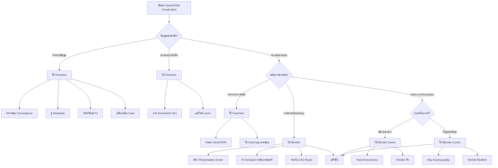
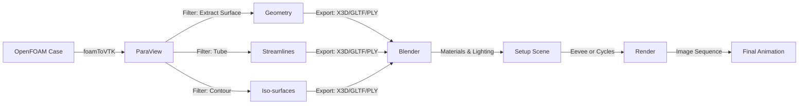

# 🎬 การเรนเดอร์ระดับภาพยนตร์ด้วย Blender (Cinematic Rendering with Blender)

**วัตถุประสงค์การเรียนรู้ (Learning Objectives)**: 
- เปลี่ยนผลลัพธ์ CFD ทางวิทยาศาสตร์ให้เป็นงานศิลปะที่สวยงามสมจริงสำหรับการนำเสนอระดับสูงและการตลาด
- สามารถตัดสินใจเลือกใช้ ParaView หรือ Blender ตามวัตถุประสงค์ของโปรเจกต์ได้อย่างเหมาะสม
- สร้างวัสดุสมจริง (water, fire, smoke) และตั้งค่าแสงที่เหมาะสมกับแต่ละสถานการณ์
- ใช้ Python automation เพื่อลดเวลาในการทำงานซ้ำ

**ระดับความยาก**: ขั้นสูง (Advanced)

**ข้อกำหนดเบื้องต้น (Prerequisites)**:
- ความเข้าใจพื้นฐานเกี่ยวกับ OpenFOAM และรูปแบบข้อมูล (Field data, Time directories)
- ความคุ้นเคยกับ ParaView ขั้นพื้นฐาน (อ่าน [01_ParaView_Visualization.md](01_ParaView_Visualization.md))
- การติดตั้ง Blender 4.0+ และความเข้าใจพื้นฐานเกี่ยวกับ 3D concepts (Materials, Lighting, Rendering)

---

## 3W Framework: What, Why, When

### What (อะไรคือ Blender Rendering?)

Blender เป็นซอฟต์แวร์ 3D แบบ Open Source ที่สามารถนำเข้าผลลัพธ์ CFD จาก OpenFOAM (ผ่าน ParaView) และเรนเดอร์ให้กลายเป็นภาพสวยงามระดับภาพยนตร์ โดยมีความสามารถดังนี้:
- **Photorealistic Materials**: สร้างวัสดุสมจริงเช่น น้ำ (Reflection/Refraction), ไฟ (Emission), ควัน (Volume)
- **Advanced Lighting**: ใช้ HDRI environment lighting, Area lights, Volumetric lighting
- **Professional Rendering**: 2 engines - Eevee (Real-time) และ Cycles (Ray-tracing)

### Why (ทำไมต้องใช้ Blender?)

> [!TIP] **ทำไมต้อง Blender สำหรับ OpenFOAM? (Why Blender for OpenFOAM?)**
> การใช้ Blender กับผลลัพธ์ OpenFOAM ไม่ใช่เรื่องของ "ความแม่นยำทางวิทยาศาสตร์" แต่เป็นเรื่องของ **"การสื่อสารผลลัพธ์" (Communication)**
> - **ParaView** → ใช้สำหรับ **วิเคราะห์ข้อมูล** (Analysis) เช่น ตรวจสอบ Convergence, ดู Residuals, วัดค่าที่ตำแหน่งต่างๆ
> - **Blender** → ใช้สำหรับ **การนำเสนอ** (Presentation) เช่น สร้างภาพสวยๆ สำหรับ Report, ทำ Video Demo ส่งลูกค้า, หรือทำ Marketing Material
>
> **เป้าหมายสูงสุด:** แปลงตัวเลขที่ซับซ้อน (U, p, k, epsilon, alpha.water) ให้กลายเป็นภาพที่ "เข้าใจง่าย" และ "สวยงาม" สำหรับคนทั่วไป

**เหตุผลหลักในการใช้ Blender:**

1. **Photorealism**: การทำให้ของเหลวดูเหมือนน้ำจริงๆ (มีการสะท้อน, ความโปร่งใส, การหักเหแสง)
2. **Marketing & Presentation**: การนำเสนอโครงการต่อลูกค้าหรือนักลงทุนที่ไม่ใช่วิศวกร
3. **Complex Compositions**: การรวมผล CFD เข้ากับโมเดล CAD ของผลิตภัณฑ์จริง (เช่น รถยนต์, อาคาร) หรือสภาพแวดล้อมจริง
4. **Artistic Control**: ควบคุมการจัดองค์ประกอบภาพ (Composition), Depth of Field, Motion Blur, Color Grading

> [!TIP] **เปรียบเทียบ Blender (Analogy)**
> ให้คิดว่า **ParaView** คือ **"ห้องแล็บ"** ที่ทุกอย่างต้องชัดเจน ถูกต้อง แม่นยำ ขาว-ดำ-สีตามค่าตัวเลข
> ส่วน **Blender** คือ **"สตูดิโอถ่ายทำภาพยนตร์"**
> - ที่นี่เราสามารถ **"จัดแสง"** (Lighting) ให้ดูดราม่าหรือนุ่มนวล
> - เราสามารถ **"เปลี่ยนวัสดุ"** (Shading) จากพื้นผิวสีทึบๆ ให้กลายเป็น **"แก้วใส"** (Water/Glass) ที่มีการหักเหแสง หรือ **"ไฟที่เรืองแสง"** (Fire Emission)
> - เราสามารถใส่ **"เมหมอก"** (Volumetric Fog) เพื่อสร้างบรรยากาศ
> เป้าหมายไม่ใช่เพื่อ "วิเคราะห์ข้อมูล" แต่เพื่อ "เล่าเรื่องราว" และ "ดึงดูดผู้ชม"

### When (เมื่อไหร่ควรใช้ Blender?)



**สรุป Decision Matrix:**

| สถานการณ์ | เครื่องมือที่เหมาะสม | เหตุผล |
|:---|:---|:---|
| ตรวจสอบ Convergence/Residuals | **ParaView เท่านั้น** | ต้องการความแม่นยำทางวิทยาศาสตร์ |
| ดู Field data แบบ Interactive | **ParaView** | Real-time, ย่อ/ขยายได้ทันที |
| สร้างภาพสำหรับ Report ทางเทคนิค | **ParaView** | Colormap ชัดเจน, มี Scale bar |
| สร้างภาพสวยสำหรับ Presentation | **Blender (Cycles)** | Photorealistic, สื่อสารได้ดีกว่า |
| ทำ Animation สั้นๆ (< 10 วินาที) | **Blender (Eevee)** | Real-time render, เร็ว |
| ทำ Animation ยาวๆ/สมจริงสูง | **Blender (Cycles)** | คุณภาพสูงสุดแม้จะช้า |
| รวม CFD กับ CAD Model | **Blender** | Composition ง่าย, Materials หลากหลาย |
| ต้องการ Vertex Color จาก OpenFOAM | **ParaView → Blender** | Export ผ่าน X3D |

---

## เวิร์กโฟลว์: OpenFOAM1$\to1ParaView1$\to1Blender

### ภาพรวมกระบวนการ



> [!NOTE] **📂 OpenFOAM Context: Data Conversion Pipeline**
> ก่อนที่จะส่งข้อมูลไป Blender ได้ ต้องแปลงข้อมูลจากรูปแบบ OpenFOAM native ให้เป็นรูปแบบที่ Blender เข้าใจก่อน:
>
> **1. การแปลงข้อมูล (Data Conversion):**
> ```bash
> # ใช้ utility ของ OpenFOAM เพื่อแปลงข้อมูลจาก OpenFOAM format เป็น VTK format
> foamToVTK -latestTime  # แปลงเฉพาะเวลาล่าสุด
> foamToVTK              # แปลงทุก time step
> foamToVTK -surfaceFields  # แปลงเฉพาะ surface fields (ลดขนาดไฟล์)
> ```
> - **Input:** โฟลเดอร์เวลา (`0/`, `0.1/`, `0.2/`, ...) ที่มีไฟล์ field data (U, p, alpha.water, k, epsilon, etc.)
> - **Output:** โฟลเดอร์ `VTK/` ที่มีไฟล์ `.vtk` หรือ `.vtu` (สำหรับ unstructured mesh)
>
> **2. การเลือก Field ที่ต้องการ:**
> - **Velocity Field (U):** ใช้สร้าง Streamlines, Vector plots
> - **Pressure Field (p):** ใช้สร้าง Contour แสดงการกระจายความดัน
> - **Volume Fraction (alpha.water):** ใช้สร้าง Iso-surface แสดง interface ระหว่างของไหล (เช่น น้ำ-อากาศ)
> - **Turbulence Fields (k, omega, epsilon):** ใช้ visualise โซนที่มี turbulence สูง
> - **Q-criterion:** ใช้ visualise โครงสร้าง vortices (vortex cores)
>
> **3. การ Export จาก ParaView:**
> - เปิดไฟล์ VTK ใน ParaView
> - ใช้ Filter: **Contour** (สำหรับ iso-surface), **StreamTracer** (สำหรับ streamlines)
> - Export เป็น X3D/GLTF/PLY เพื่อนำเข้า Blender
>
> **ข้อควรระวัง:** การแปลงข้อมูลด้วย `foamToVTK` อาจสร้างไฟล์ขนาดใหญ่มากถ้า mesh ละเอียด ควรใช้ options เช่น `-surfaceFields` หรือ `-cellSet` เพื่อลดปริมาณข้อมูล

### Step 1: การแปลงข้อมูลจาก OpenFOAM

**ตัวอย่าง OpenFOAM Cases ที่เหมาะสำหรับ Blender:**

| Solver Type | Field ที่น่าสนใจ | การใช้งานใน Blender |
|:---|:---|:---|
| **interFoam** / **multiphaseInterFoam** | `alpha.water`, `alpha.oil` | สร้างวัสดุน้ำ/น้ำมันสมจริง (Glass/Water material) |
| **simpleFoam** / **pimpleFoam** | `U`, `p`, `k`, `omega` | Streamlines ที่เรืองแสง, Iso-surface ความดัน |
| **buoyantSimpleFoam** / **buoyantPimpleFoam** | `T`, `p`, `U` | สร้าง Fire/Smoke materials, Heat visualization |
| **reactingFoam** | `T`, `species` | Explosion/Combustion effects |

**คำสั่งพื้นฐาน:**

```bash
# แปลงทุก time steps
foamToVTK

# แปลงเฉพาะ time step ล่าสุด
foamToVTK -latestTime

# แปลงเฉพาะ surface fields (ลดขนาดไฟล์มาก)
foamToVTK -surfaceFields

# แปลงเฉพาะบาง time steps
foamToVTK -time '0:0.1:1'  # 0 ถึง 1 ทุก 0.1 วินาที

# แปลงเฉพาะ fields ที่ต้องการ (ต้องสร้าง cellSet ก่อน)
# ดูเพิ่มเติมใน OpenFOAM User Guide
```

### Step 2: การเตรียมข้อมูลใน ParaView

> [!NOTE] **📂 OpenFOAM Context: Field Selection & Extraction**
> การเตรียงข้อมูลใน ParaView ก่อนส่งไป Blender เป็นการแปลง **Field Data** ให้เป็น **Geometric Data** ที่ Blender เข้าใจ:
>
> **1. Iso-surfaces (Contour):**
> - **ใช้กับ:** Volume Fraction (`alpha.water`), Q-criterion, Pressure (`p`)
> - **ตัวอย่าง:** สร้าง interface ระหว่างน้ำและอากาศ โดยตั้งค่า Contour value = 0.5 สำหรับ `alpha.water`
> - **OpenFOAM Source:** Field `alpha.water` จาก solver `interFoam`, `multiphaseInterFoam`
>
> **2. Streamlines (StreamTracer with Tube Filter):**
> - **ใช้กับ:** Velocity Field (`U`)
> - **ตัวอย่าง:** สร้างเส้นแสดงทิศทางการไหล และใช้ Tube filter เพื่อให้มีความหนา (3D geometry)
> - **OpenFOAM Source:** Field `U` จากทุก solver (simpleFoam, pimpleFoam, interFoam, etc.)
> - **ข้อควรระวัง:** ต้องใช้ **Tube** filter เพราะ Blender ไม่เห็น Lines 1D ใน rendering
>
> **3. Slices (Cut Planes):**
> - **ใช้กับ:** ทุก Field ที่ต้องการดู Cross-section
> - **ตัวอย่าง:** สร้าง Slice บนระนาบ XY, YZ, หรือ XZ และใช้ **Triangulate** filter
> - **OpenFOAM Source:** 任意 Field (`U`, `p`, `T`, `k`, etc.)
>
> **4. Scalar Coloring (Vertex Colors):**
> - **ใช้กับ:** การแสดงค่า Field เช่น Velocity magnitude, Pressure บนพื้นผิว
> - **ตัวอย่าง:** ใช้ ParaView's "Color by" และ Export เป็น X3D เพื่อรักษาสี
> - **OpenFOAM Source:** 任意 Scalar Field (magnitude of `U`, `p`, `T`, etc.)
>
> **ข้อควรระวัง:** ใช้ **Decimate** filter ใน ParaView เพื่อลดจำนวน polygons ถ้า mesh ละเอียดเกินไป ซึ่งจะทำให้ Blender ทำงานช้าหรือค้าง

Blender ทำงานกับ "พื้นผิว" (Polygonal Mesh) ได้ดีที่สุด ไม่ใช่ Volume Data (แม้จะทำได้แต่ยากกว่า)

**1. Iso-surfaces:**

```
เหมาะสำหรับ:
- Volume Fraction (alpha.water = 0.5) → สร้างพื้นผิวน้ำ
- Q-criterion → สร้างโครงสร้าง vortices
- Pressure (p) → สร้าง contour ความดัน
```

**ขั้นตอน:**
1. เปิดไฟล์ VTK ใน ParaView
2. เลือก Filter → **Contour**
3. ตั้งค่า **Contour By** = `alpha.water` (หรือ field ที่ต้องการ)
4. ตั้งค่า **Isosurfaces** = `0.5` (สำหรับ alpha.water)
5. ใช้ **Calculator** หรือ **Elevation** filter ถ้าต้องการ scalar coloring
6. ใช้ **Decimate** filter ถ้า mesh ละเอียดเกินไป (ลด polygons ลง 50-90%)
7. **Apply**

**2. Streamlines:**

```
เหมาะสำหรับ:
- Velocity Field (U) → แสดงทิศทางการไหล
- ใช้ Tube filter เพื่อให้มองเห็นใน Blender
```

**ขั้นตอน:**
1. เปิดไฟล์ VTK ใน ParaView
2. เลือก Filter → **StreamTracer**
3. ตั้งค่า **Vector Field** = `U` (Velocity)
4. ตั้งค่า **Seed Type** = `Point Cloud` / `Line Source` / `High Resolution Line Source`
5. เลือก Filter → **Tube**
6. ตั้งค่า **Radius** = `0.001 - 0.01` (ขึ้นกับ scale ของโมเดล)
7. **Apply**

> [!WARNING] **ขนาดไฟล์**
> ไฟล์ Geometry ที่ Export อาจมีขนาดใหญ่มาก ควรใช้ **Decimate** filter ใน ParaView เพื่อลดจำนวน Polygons ลงก่อน Export หากรายละเอียดสูงเกินความจำเป็น

**3. Slices:**

**ขั้นตอน:**
1. เลือก Filter → **Slice**
2. ตั้งค่า **Slice Type** = `Plane` (XY, YZ, หรือ XZ)
3. เลือก Filter → **Triangulate** (สำคัญ! Blender ต้องการ triangles)
4. **Apply**

### Step 3: การ Export จาก ParaView

| Format | ข้อดี | ข้อเสีย | แนะนำสำหรับ |
|:---|:---|:---|:---|
| **X3D** | รักษา Vertex Colors, รองรับ Animation | ไฟล์ใหญ่, โหลดช้า | งานที่ต้องการ Scalar Colors |
| **GLTF/GLB** | รองรับ Materials, ไฟล์เล็ก | ไม่รักึา Vertex Colors เสมอไป | งาน Web, Real-time |
| **PLY** | ง่าย, รองรับทุกโปรแกรม | ไม่รองรับ Materials | งานที่ต้องการ Geometry เท่านั้น |

**ขั้นตอน Export:**

1. `File > Export Scene...`
2. เลือก format **X3D** (แนะนำ), **GLTF**, หรือ **PLY**
3. ตั้งค่า:
   - **X3D**: เลือก `Export Colors as Vertex Colors` (ถ้ามี scalar coloring)
   - **GLTF**: เลือก `Binary` (.glb) เพื่อลดขนาดไฟล์
4. **Export**

### Step 4: การนำเข้าใน Blender

**4.1 การนำเข้า (Import):**

1. เปิด Blender ลบ Cube เริ่มต้นทิ้ง (`Delete` หรือ `X`)
2. `File > Import > X3D Extensible 3D (.x3d)`
3. ตรวจสอบ Scale:
   - OpenFOAM ใช้ **เมตร (meters)**
   - Blender ใช้ **เมตร (meters)** เป็นค่าเริ่มต้น
   - แต่บางที Export มา scale อาจเพี้ยน → ให้ตรวจสอบ Dimension (`N` > **Dimensions**)
4. คลิกขวาที่วัตถุ → **Shade Smooth** เพื่อลบเหลี่ยมมุมของ Mesh
5. ถ้า Mesh ยังคราบ → ใช้ **Modifier > Auto Smooth**

> [!WARNING] **Scale Issues**
> ถ้าวัตถุดูเล็กเกินไปหรือใหญ่เกินไป:
> - เลือกวัตถุ → `Ctrl+A` > **Apply Scale**
> - หรือปรับ Scale ใน `N` panel > **Item** > **Scale**

**4.2 การตั้งค่า Scene:**

```
1. ตั้งค่า Camera:
   - เพิ่ม Camera (`Shift+A` > Camera)
   - ใช้ `Numpad 0` เพื่อดูผ่าน Camera
   -ปรับ Position และ Rotation ตามที่ต้องการ

2. ตั้งค่า World:
   - World Properties > Surface > Background
   - หรือใช้ HDRI Environment Texture (ดูในส่วน Lighting)

3. ตั้งค่า Output:
   - Output Properties > Format > File Format = PNG/FFmpeg
   - Resolution = 1920x1080 (หรือ 4K)
```

---

## การตั้งค่าใน Blender (Blender Setup)

### 5.1 การสร้างวัสดุ (Materials)

นี่คือหัวใจสำคัญของการทำให้ดูสมจริง:

> [!TIP] **Material Preset Library**
> ดู **Material Preset Library** แบบสมบูรณ์ใน Appendix A พร้อมไฟล์ .blend ดาวน์โหลด
> - Water Material (Clear, Ocean, Colored)
> - Fire/Smoke Materials (Candle, Forest Fire, Explosion)
> - Glass Materials (Window, Lens, Prism)
> - Metal Materials (Chrome, Copper, Gold)
> - Emission Materials (Glowing Streamlines, Heat map)

#### วัสดุน้ำ (Water Material)

**เหมาะสำหรับ:** OpenFOAM solvers: `interFoam`, `multiphaseInterFoam`, `voFoam`

```
ใช้ Node: Principled BSDF
┌─────────────────────────────────────────────────────────┐
│  Base Color:         (0.8, 0.9, 1.0, 1.0)  # ฟ้าอ่อน   │
│  Metallic:           0.0                                │
│  Specular:           1.0                                │
│  Roughness:          0.0 - 0.1        # ผิวมันวาว    │
│  IOR:                1.333            # ดัชนีหักเหของน้ำ │
│  Transmission:       1.0              # โปร่งใส     │
│  Transmission Roughness: 0.0                          │
└─────────────────────────────────────────────────────────┘

Node Setup:
┌──────────────┐     ┌──────────────┐     ┌──────────────┐
│   Texture    │────▶│  Principled  │────▶│  Material    │
│  Coordinate  │     │    BSDF      │     │   Output     │
└──────────────┘     └──────────────┘     └──────────────┘
```

**Parameter สำคัญ:**

| Parameter | ค่า | ความหมาย | การปรับแต่ง |
|:---|:---|:---|:---|
| **Transmission** | 1.0 | โปร่งใส 100% | ลด = ทึบขึ้น |
| **Roughness** | 0.0 - 0.1 | ผิวมันวาว | เพิ่ม = ผิวขรุขระ |
| **IOR** | 1.333 | ดัชนีหักเหของน้ำ | ปรับ = ของเหลวอื่น (น้ำมัน = 1.47) |
| **Base Color** | สีฟ้าอ่อน | สีของน้ำ | ปรับตามความต้องการ |

**สำหรับ Eevee Render:**
- ต้องเปิด **Screen Space Reflections** ใน Render Properties
- ตั้งค่า **Refraction Depth** = ถึง 4 ใน Material Properties

#### วัสดุควัน/ไฟ (Smoke/Fire Material)

**เหมาะสำหรับ:** OpenFOAM solvers: `reactingFoam`, `fireFoam`, `buoyantPimpleFoam`

```
ใช้ Node: Principled Volume
┌─────────────────────────────────────────────────────────┐
│  Density:            0.1 - 5.0     # ความหนาแน่น    │
│  Emission Strength:  1.0 - 100.0   # ความสว่าง      │
│  Emission Color:     (1.0, 0.5, 0.1)  # สีส้ม         │
│  Blackbody Intensity: 1.0 - 10.0  # ความเข้ม         │
│  Temperature:        1000 - 3000   # อุณหภูมิ (K)     │
└─────────────────────────────────────────────────────────┘

Node Setup (ด้านหลัง Volume):
┌──────────────┐     ┌──────────────┐     ┌──────────────┐
│   Volume     │────▶│  Principled  │────▶│  Material    │
│  Info        │     │   Volume     │     │   Output     │
└──────────────┘     └──────────────┘     └──────────────┘
```

**สำหรับ Fire:**
```
1. ใช้ **Blackbody** Node:
   Temperature = 1500 - 3000 K
   → ให้สีเหลือง-ส้ม-แดงตามอุณหภูมิ

2. เชื่อมต่อ:
   Blackbody.Color → Principled Volume.Emission Color
   Blackbody.Temp  → Principled Volume.Temperature
```

**สำหรับ Smoke:**
```
1. ใช้ **Noise Texture** + **Color Ramp**:
   - สร้าง pattern สุ่ม
   - ใช้ Color Ramp เพื่อควบคุม opacity

2. เชื่อมต่อ:
   Noise Texture → Color Ramp → Density
```

> [!NOTE] **Volume Rendering**
> Volume rendering ใช้เวลานานมากใน Cycles
> - สำหรับ Preview → ใช้ **Eevee** หรือ **Viewport Render**
> - สำหรับ Final Render → ใช้ **Cycles** แต่เพิ่ม **Samples** และ **Max Bounces**

#### วัสดุ Streamlines (Emission/Glow)

**เหมาะสำหรับ:** การแสดง Velocity Field ให้ดูน่าสนใจ

```
ใช้ Node: Mix Shader (Emission + Glass)
┌─────────────────────────────────────────────────────────┐
│  Emission Strength: 1.0 - 10.0   # ความเรืองแสง      │
│  Emission Color:    (0.2, 0.8, 1.0)  # สีฟ้าฟลูออเรสเซนต์ │
│  Glass IOR:         1.5           # ดัชนีหักเห       │
│  Mix Factor:        0.3 - 0.7     # สัดส่วน Emission:Glass │
└─────────────────────────────────────────────────────────┘

Node Setup:
┌──────────────┐     ┌──────────────┐     ┌──────────────┐
│   Emission   │     │     Mix      │     │  Material    │
│   Shader     │────▶│   Shader     │────▶│   Output     │
└──────────────┘     └──────────────┘     └──────────────┘
                      ▲     ▲
                      │     │
              ┌───────┘     └───────┐
              │                     │
      ┌──────────────┐     ┌──────────────┐
      │    Glass     │     │   Mix        │
      │   Shader     │     │   Factor      │
      └──────────────┘     └──────────────┘
```

**Parameter สำคัญ:**

| สไตล์ | Mix Factor | Emission Color | ความรู้สึก |
|:---|:---|:---|:---|
| **Sci-Fi** | 0.7 | สีฟ้าฟลูออเรสเซนต์ | เรืองแสงมาก |
| **Modern** | 0.5 | สีขาว/ฟ้าอ่อน | สะอาดตา |
| **Elegant** | 0.3 | สีทอง/เหลือง | หรูหรา |

#### วัสดุ Heat Map (Temperature Visualization)

**เหมาะสำหรับ:** OpenFOAM solvers: `buoyantSimpleFoam`, `buoyantPimpleFoam`, `thermoFoam`

```
ใช้ Node: Attribute + Color Ramp
┌─────────────────────────────────────────────────────────┐
│  Attribute Name:  'Col' หรือ 'velocity'  # จาก Vertex Color │
│  Color Ramp:      Blue → Green → Yellow → Red         │
└─────────────────────────────────────────────────────────┘

Node Setup:
┌──────────────┐     ┌──────────────┐     ┌──────────────┐
│   Attribute  │────▶│  Color Ramp  │────▶│  Principled  │────▶│ Material │
│   (Col)      │     │              │     │    BSDF      │     │  Output  │
└──────────────┘     └──────────────┘     └──────────────┘     └──────────┘
```

**การตั้งค่า Color Ramp:**
```
Position 0.0:  Blue  (0.0, 0.0, 1.0)   ต่ำสุด
Position 0.33: Green (0.0, 1.0, 0.0)
Position 0.66: Yellow (1.0, 1.0, 0.0)
Position 1.0:  Red   (1.0, 0.0, 0.0)   สูงสุด
```

### 5.2 การจัดแสง (Lighting)

แสงที่ดีเปลี่ยนโมเดลโง่ๆ ให้ดูโปรได้:

#### 1. HDRI Environment Lighting (แนะนำ)

```
เหมาะสำหรับ: Photorealistic render, reflections สมจริงที่สุด

ขั้นตอน:
1. ดาวน์โหลด HDRI ฟรีจาก:
   - PolyHaven (https://polyhaven.com/)
   - HDRI Haven (https://hdrihaven.com/)
   - ค้นหาคำว่า "studio", "outdoor", "sunset"

2. ใน Blender:
   - World Properties > Surface > Background
   - เพิ่ม Node: **Environment Texture**
   - โหลดไฟล์ .hdr/.exr
   - ตั้งค่า Strength = 1.0 - 3.0

3. เชื่อมต่อ:
   Environment Texture → World Output
```

**ตัวอย่าง HDRI ที่แนะนำ:**

| Environment | แหล่งที่มา | เหมาะสำหรับ |
|:---|:---|:---|
| **Studio Small** | PolyHaven | Product visualization |
| **Venice Sunset** | PolyHaven | แสงพระอาทิตย์ตอนเย็น |
| **Night Street** | HDRI Haven | แสงไฟเมืองยามค่ำคืน |

#### 2. Three-Point Lighting (สำหรับ Product Visualization)

```
เหมาะสำหรับ: การเน้นวัตถุ, การควบคุมแสงอย่างละเอียด

Key Light (แสงหลัก):
- Type: Area Light / Sun Light
- Position: ขวาบนของวัตถุ (45°)
- Intensity: 500 - 1000 W
- Color: อุ่น (เหลืองอ่อน)

Fill Light (แสงเติม):
- Type: Area Light
- Position: ซ้ายล่างของวัตถุ
- Intensity: 200 - 500 W (น้อยกว่า Key)
- Color: เย็น (ฟ้าอ่อน)

Rim Light (แสงขอบ):
- Type: Area Light / Spot Light
- Position: หลังวัตถุ
- Intensity: 300 - 700 W
- Color: ขาว/ฟ้า
- ทำหน้าที่: แยกวัตถุจากพื้นหลัง
```

#### 3. Volumetric Lighting (สำหรับบรรยากาศ)

```
เหมาะสำหรับ: สร้างมิติ, ความลึก

ขั้นตอน:
1. Render Properties > Volumetrics
   - เปิด **Volumetric Lighting**
   
2. Light ที่ต้องการให้มี volume:
   - ใส่ **Cube** รอบๆ Light source
   - Material → Volume
   - Density = 0.1 - 0.5
   - Emission = 0.0 - 1.0

3. Render Settings:
   - Volumetric Tile Size = 64
   - Samples = 128 (สำหรับ Cycles)
```

> [!TIP] **Lighting Cheatsheet**
> ดู **Lighting Cheatsheet** แบบสมบูรณ์ใน Appendix B พร้อมภาพประกอบและ Presets พร้อมใช้

### 5.3 การเลือก Rendering Engine

| Engine | ลักษณะ | เหมาะสำหรับ | เวลา Render* |
|:---|:---|:---|:---|
| **Eevee** | Real-time (เหมือน Game Engine), เร็วมาก | Animation ยาวๆ, พรีวิว, งานที่ไม่เน้น Refraction เป๊ะๆ | 1-5 วินาที/เฟรม |
| **Cycles** | Ray-tracing (คำนวณแสงจริง), ช้าแต่สวยสมจริง | ภาพนิ่ง, งานที่ต้องการความสมจริงสูงสุด (แก้ว, น้ำ) | 30-300 วินาที/เฟรม |

> *เวลาขึ้นกับ:
> - Hardware: CPU/GPU ที่ใช้
> - Scene Complexity: จำนวน polygons, lights
> - Sample Count: สำหรับ Cycles
> - Resolution: 1080p vs 4K

**Sample Render Times (1080p, GPU RTX 3060):**

| Scene Type | Engine | Polygons | Samples | Render Time |
|:---|:---|:---|:---|:---|
| Simple Water | Cycles | 100K | 128 | ~30 วินาที/เฟรม |
| Complex Water + Streamlines | Cycles | 500K | 256 | ~2 นาที/เฟรม |
| Fire/Smoke | Cycles | 50K (Volume) | 512 | ~5 นาที/เฟรม |
| Animation 100 เฟรม | Eevee | 500K | - | ~5 นาทีรวม |
| Animation 100 เฟรม | Cycles | 500K | 128 | ~3 ชั่วโมงรวม |

**ข้อแนะนำ:**

```
สำหรับภาพนิ่ง:
→ ใช้ Cycles ถ้าต้องการคุณภาพสูงสุด
→ ใช้ Eevee ถ้าต้องการความเร็ว

สำหรับ Animation:
→ ใช้ Eevee สำหรับ Preview/Animatic
→ ใช้ Cycles สำหรับ Final Render (ถ้ามีเวลา)
```

---

## การเปรียบเทียบ: ParaView vs Blender

> [!TIP] **เลือกเครื่องมือให้เหมาะกับงาน**
> ดูภาพ **Comparison Gallery** แบบละเอียดใน Appendix C - แสดงผลลัพธ์จากเคสจริง

### เปรียบเทียบ Side-by-Side

```
┌─────────────────────────────────────────────────────────────────────┐
│                        ParaView                                     │
│  ┌─────────────────────────────────────────────────────────────┐   │
│  │  [รูปภาพ ParaView: สีชัดเจน, มี Scale bar, Colormap]    │   │
│  │  - สี: แดง-เขียว-ฟ้า ตามค่า velocity magnitude         │   │
│  │  - มี Scale bar แสดงค่า m/s                              │   │
│  │  - Mesh ค่อนข้างหยาบ                                     │   │
│  └─────────────────────────────────────────────────────────────┘   │
│  ✓ ชัดเจน, มี Scale bar, เหมาะกับการวิเคราะห์              │
│  ✗ ไม่สวย, ไม่มีการสะท้อนแสง, ดูเป็น "ข้อมูล"           │
└─────────────────────────────────────────────────────────────────────┘

┌─────────────────────────────────────────────────────────────────────┐
│                        Blender (Cycles)                            │
│  ┌─────────────────────────────────────────────────────────────┐   │
│  │  [รูปภาพ Blender: สะท้อนแสง, โปร่งใส, cinematic]       │   │
│  │  - สี: ฟ้าอ่อนโปร่งใส สะท้อนสภาพแวดล้อม            │   │
│  │  - มีการ Refraction, Reflection                          │   │
│  │  - มี Shadow, Depth of Field                               │   │
│  └─────────────────────────────────────────────────────────────┘   │
│  ✓ สวย, สมจริง, เหมาะกับการนำเสนอ                          │
│  ✗ ไม่มี Scale bar, ไม่แน่ชัดว่าค่าเท่าไหร่               │
└─────────────────────────────────────────────────────────────────────┘
```

### Comparison Table

| แง่มุม | ParaView | Blender (Cycles) | Blender (Eevee) |
|:---|:---|:---|:---|
| **ความสวยงาม** | ★★☆☆☆ | ★★★★★ | ★★★☆☆ |
| **ความแม่นยำทางวิทยาศาสตร์** | ★★★★★ | ★★☆☆☆ | ★★☆☆☆ |
| **ความเร็วในการ Render** | ★★★★★ | ★☆☆☆☆ | ★★★★★ |
| **การแสดง Scalar Values** | ★★★★★ | ★★☆☆☆ (ต้องปรับเอง) | ★★☆☆☆ |
| **ความยืดหยุ่นในการจัดแสง** | ★★☆☆☆ | ★★★★★ | ★★★★★ |
| **การรวมกับ CAD Models** | ★☆☆☆☆ | ★★★★★ | ★★★★★ |
| **การทำ Animation** | ★★★☆☆ | ★★★★★ | ★★★★★ |
| **การสร้าง Photorealism** | ★☆☆☆☆ | ★★★★★ | ★★★☆☆ |
| **ความง่ายในการเรียนรู้** | ★★★★☆ | ★★☆☆☆ | ★★★☆☆ |
| **ความเหมาะสำหรับ Presentation** | ★★☆☆☆ | ★★★★★ | ★★★☆☆ |
| **ความเหมาะสำหรับ Analysis** | ★★★★★ | ★☆☆☆☆ | ★☆☆☆☆ |

### Use Cases

```
┌─ ใช้ ParaView เมื่อ ─────────────────────────────────────────────┐
│ 1. ต้องการวิเคราะห์ข้อมูลจริง (check residuals, convergence)  │
│ 2. ต้องการเปรียบเทียบค่าที่แน่นอน (มี Scale bar)         │
│ 3. ต้องการดูข้อมูลแบบ Interactive (ย่อ/ขยายได้ทันที)     │
│ 4. ทำงานร่วมกับทีมวิศวกร (ทุกคนใช้ ParaView)              │
│ 5. สร้างภาพสำหรับ Report ทางเทคนิค                           │
└───────────────────────────────────────────────────────────────────┘

┌─ ใช้ Blender เมื่อ ─────────────────────────────────────────────┐
│ 1. ต้องการภาพสวยๆ สำหรับ Presentation ต่อลูกค้า            │
│ 2. ต้องการสื่อสารกับคนทั่วไป (ไม่ใช่วิศวกร)              │
│ 3. ต้องการทำ Video Demo/Marketing material                     │
│ 4. ต้องการรวม CFD เข้ากับ CAD Model จริง                    │
│ 5. ต้องการความสมจริงในการสะท้อนแสง (water, glass)        │
│ 6. ต้องการควบคุมการจัดองค์ประกอบภาพ (Composition)        │
└───────────────────────────────────────────────────────────────────┘

┌─ ใช้ทั้งสอง (Workflow แบบผสม) ─────────────────────────────────┐
│ 1. ใช้ ParaView สำหรับ Analysis และ Screening                 │
│ 2. ใช้ ParaView Export ข้อมูลที่ "น่าสนใจ" ไป Blender         │
│ 3. ใช้ Blender สร้างภาพสวยๆ สำหรับ Presentation/Video        │
└───────────────────────────────────────────────────────────────────┘
```

---

## การทำ Automation ด้วย Python (`bpy`)

> [!NOTE] **📂 OpenFOAM Context: Automated Workflow Integration**
> การใช้ Python ใน Blender เชื่อมต่อกับ OpenFOAM workflow ได้หลายวิธี:
>
> **1. Batch Processing Multiple Time Steps:**
> - **OpenFOAM Output:** หลาย time directories (`0.1/`, `0.2/`, `0.3/`, ...)
> - **ParaView Script:** ใช้ Python script ของ ParaView (`pvpython`) เพื่อ:
>   - เปิดแต่ละ time step
>   - สร้าง iso-surface/streamlines
>   - Export เป็น X3D/PLY โดยอัตโนมัติ
> - **Blender Script:** ใช้ `bpy` เพื่อ:
>   - นำเข้าไฟล์ทั้งหมด
>   - ตั้งค่า material (water, glass, emission)
>   - Render เป็น image sequence
>
> **2. Function Objects Integration:**
> - **OpenFOAM:** ใช้ `functions` ใน `controlDict` เพื่อ export surface/sampling data อัตโนมัติระหว่าง simulation
>   ```cpp
>   // ตัวอย่าง controlDict
>   functions
>   {
>       exportSurface
>       {
>           type            surfaces;
>           functionObjectLibs ("libsampling.so");
>           outputControl   timeStep;
>           outputInterval  10;
>           surfaceFormat   vtk;
>           fields          (U p alpha.water);
>           surfaces
>           (
>               zPlane
>               {
>                   type        plane;
>                   planeType   pointAndNormal;
>                   pointAndNormalDict
>                   {
>                       point   (0 0 0);
>                       normal  (0 0 1);
>                   }
>               }
>           );
>       }
>   }
>   ```
> - **Blender:** อ่านไฟล์ VTK ที่ export มาจาก function object โดยตรง
>
> **3. Python Automation Pipeline:**
> ```bash
> # ตัวอย่าง workflow แบบ end-to-end
> # 1. Run OpenFOAM simulation
> solverName > log &
>
> # 2. ใช้ pvpython export เป็น X3D ทุกๆ N time steps
> pvpython export_paraview.py
>
> # 3. ใช้ Blender render animation
> blender -b -P render_blender.py
> ```
>
> **4. การตั้งค่า Material อัตโนมัติ:**
> - ตั้งค่า `Principled BSDF` parameters (Transmission, IOR, Roughness) ผ่าน script
> - กำหนด Vertex Color ให้ตรงกับ field values จาก OpenFOAM (เช่น velocity magnitude)
>
> **ข้อดี:** ลดเวลาทำงานซ้ำๆ และทำให้การสร้าง visualization ที่ซับซ้อนเป็นไปโดยอัตโนมัติ

เช่นเดียวกับ ParaView, Blender สามารถเขียนสคริปต์ได้ด้วย `bpy` เพื่อทำงานซ้ำๆ:

### 6.1 การนำเข้าไฟล์หลายไฟล์

```python
import bpy
import os

# โฟลเดอร์ที่มีไฟล์ PLY (1 ไฟล์ต่อ 1 Time Step)
input_dir = "/path/to/ply_files"
ply_files = sorted([f for f in os.listdir(input_dir) if f.endswith(".ply")])

# ลบวัตถุเก่าทั้งหมด
bpy.ops.object.select_all(action='SELECT')
bpy.ops.object.delete()

# ตั้งค่า Material
mat = bpy.data.materials.new(name="Water")
mat.use_nodes = True
nodes = mat.node_tree.nodes
bsdf = nodes.get("Principled BSDF")
bsdf.inputs['Transmission'].default_value = 1.0
bsdf.inputs['Roughness'].default_value = 0.05
bsdf.inputs['IOR'].default_value = 1.333

# Loop นำเข้า
for i, ply_file in enumerate(ply_files):
    bpy.ops.import_mesh.ply(filepath=os.path.join(input_dir, ply_file))
    obj = bpy.context.selected_objects[0]
    obj.data.materials.append(mat)
    
print(f"Imported {len(ply_files)} files")
```

### 6.2 การสร้าง Material อัตโนมัติ

```python
def create_water_material(name="Water"):
    mat = bpy.data.materials.new(name=name)
    mat.use_nodes = True
    nodes = mat.node_tree.nodes
    links = mat.node_tree.links
    
    # รับ Principled BSDF
    bsdf = nodes.get("Principled BSDF")
    
    # ตั้งค่า
    bsdf.inputs['Base Color'].default_value = (0.8, 0.9, 1.0, 1.0)  # ฟ้าอ่อน
    bsdf.inputs['Metallic'].default_value = 0.0
    bsdf.inputs['Specular'].default_value = 1.0
    bsdf.inputs['Roughness'].default_value = 0.05
    bsdf.inputs['IOR'].default_value = 1.333
    bsdf.inputs['Transmission'].default_value = 1.0
    
    return mat

def create_emissive_streamline_material(name="Streamline"):
    mat = bpy.data.materials.new(name=name)
    mat.use_nodes = True
    nodes = mat.node_tree.nodes
    links = mat.node_tree.links
    
    # สร้าง Mix Shader
    mix_shader = nodes.new(type='ShaderNodeMixShader')
    emission = nodes.new(type='ShaderNodeEmission')
    glass = nodes.new(type='ShaderNodeGlass')
    
    # ตั้งค่า Emission
    emission.inputs['Color'].default_value = (0.2, 0.8, 1.0, 1.0)  # ฟ้าฟลูออเรสเซนต์
    emission.inputs['Strength'].default_value = 5.0
    
    # ตั้งค่า Glass
    glass.inputs['IOR'].default_value = 1.5
    
    # เชื่อมต่อ nodes
    links.new(emission.outputs['BSDF'], mix_shader.inputs['B'])
    links.new(glass.outputs['BSDF'], mix_shader.inputs['A'])
    
    # เชื่อมต่อไป Output
    output = nodes.get("Material Output")
    links.new(mix_shader.outputs['Shader'], output.inputs['Surface'])
    
    return mat

# ใช้งาน
water_mat = create_water_material()
streamline_mat = create_emissive_streamline_material()
```

### 6.3 การ Render Animation อัตโนมัติ

```python
import bpy

# ตั้งค่า Render
scene = bpy.context.scene
scene.render.engine = 'CYCLES'
scene.render.filepath = '/path/to/output/frame_'
scene.render.image_settings.file_format = 'PNG'
scene.render.fps = 24

# ตั้งค่า Cycles
cycles = scene.cycles
cycles.device = 'GPU'  # ใช้ GPU ถ้ามี
cycles.samples = 128

# Render
bpy.ops.render.render(animation=True)
```

### 6.4 การใช้ Mesh Sequence Cache (แนะนำ)

> [!TIP] **Mesh Sequence Cache**
> วิธีที่ดีที่สุดในการทำ Animation ใน Blender จากไฟล์ CFD คือการนำเข้าไฟล์แรก แล้วใช้ Modifier ชื่อ **"Mesh Sequence Cache"** เพื่ออ่านไฟล์ Alembic (.abc) หรือ PC2 ที่ Export มาจาก ParaView วิธีนี้ไม่ต้องเขียน Python เพื่อ loop import ทีละเฟรม

**ขั้นตอน:**

1. **Export จาก ParaView เป็น Alembic (.abc):**
   - `File > Export Scene...`
   - เลือก **Alembic (.abc)**
   - Export

2. **นำเข้าใน Blender:**
   - `File > Import > Alembic (.abc)`

3. **Mesh Sequence Cache Modifier:**
   - เลือกวัตถุ → **Modifiers** → **Mesh Sequence Cache**
   - ตั้งค่า:
     - **Mode** = `Animated`
     - **Frame Start** = เฟรมเริ่มต้น
     - **Frame Rate** = 24 (หรือตาม Simulation)

4. **Timeline:**
   - Blender จะอัตโนมัติโหลด mesh ตามเฟรมที่เลือก
   - สามารถ Render Animation ได้โดยตรง

```python
# ตัวอย่าง Python script สำหรับ Alembic import
import bpy

# นำเข้าไฟล์ Alembic
bpy.ops.wm.alembic_import(filepath="/path/to/file.abc")

# ตั้งค่า Mesh Sequence Cache modifier
obj = bpy.context.selected_objects[0]
modifier = obj.modifiers.new(name="MeshCache", type='MESH_SEQUENCE_CACHE')
modifier.mode = 'ANIMATED'
modifier.frame_start = 1
modifier.frame_rate = 24

# Render animation
bpy.ops.render.render(animation=True)
```

---

## ปัญหาที่พบบ่อยและการแก้ไข (Troubleshooting)

### 7.1 ปัญหาการนำเข้า (Import Issues)

| ปัญหา | สาเหตุ | การแก้ไข |
|:---|:---|:---|
| **ไฟล์ X3D โหลดไม่ขึ้น** | ไฟล์เสีย หรือ format ไม่รองรับ | ลอง Export เป็น GLTF หรือ PLY แทน |
| **Scale ผิด** | OpenFOAM ใช้เมตร แต่ Blender โหลดผิด | ปรับ Scale ใหม่ (`Ctrl+A` > Apply Scale) |
| **Mesh หายไปบางส่วน** | Mesh ไม่ปิด (Non-manifold) | ใช้ `Mesh > Clean Up > Merge By Distance` |
| **Vertex Colors ไม่มา** | X3D Export ไม่ได้เลือก `Export Colors` | Export ใหม่ ติ๊ก `Export Colors as Vertex Colors` |
| **Streamlines มองไม่เห็น** | Export เป็น Lines ไม่ใช่ Tubes | ใช้ Tube filter ใน ParaView ก่อน Export |
| **Memory Error** | ไฟล์ใหญ่เกินไป | ใช้ Decimate filter ใน ParaView |
| **Import ช้ามาก** | Mesh ละเอียดเกินไป | ลด Polygons หรือใช้ LOD |
| **Materials ไม่มากับไฟล์** | Format PLY ไม่รองรับ Materials | ใช้ X3D/GLTF แทน |

### 7.2 ปัญหา Materials & Rendering

| ปัญหา | สาเหตุ | การแก้ไข |
|:---|:---|:---|
| **น้ำดูทึบ** | Transmission ไม่ถึง 1.0 หรือ Roughness สูง | ปรับ Transmission = 1.0, Roughness < 0.1 |
| **น้ำไม่สะท้อน** | ไม่มี Environment Lighting หรือ Screen Space Reflections | เพิ่ม HDRI หรือเปิด SSR (Eevee) |
| **Glass/เรนเดอร์ช้า** | Volume Samples สูง | ลด Max Bounces หรือใช้ Eevee |
| **Fire/Smoke มองไม่เห็น** | Volume Density ต่ำ | เพิ่ม Density หรือตรวจสอบ World Bounds |
| **สีแกล้ง/Noise** | Samples ต่ำ | เพิ่ม Samples (Cycles) หรือใช้ Denoising |
| **Streamlines มองไม่เห็น** | Emission Strength ต่ำ | เพิ่ม Emission Strength |
| **Z-fighting (ผิวกระพริบ)** | Mesh ซ้อนกัน | ขยับห่างกันเล็กน้อย |
| **Shadow แหลมเกินไป** | Light Source เล็ก | เพิ่ม Size ของ Area Light |

### 7.3 ปัญหา Performance

| ปัญหา | สาเหตุ | การแก้ไข |
|:---|:---|:---|
| **Viewport ล้ากระทบ** | Mesh ละเอียด, Materials ซับซ้อน | ใช้ `Z` > **Solid Mode**, ปิด Textures |
| **Render นานเกินไป** | Samples สูง, Scene ซับซ้อน | ลด Samples, ใช้ Denoiser |
| **GPU Memory Error** | Scene ใหญ่เกิน | ลด Tile Size หรือใช้ CPU |
| **Out of Memory** | ไฟล์หลายไฟล์โหลดพร้อมกัน | แยก Render เป็น Batch |
| **Animation Render ช้า** | Render เฟรมต่อเฟรม | ใช้ Command Line `blender -b` |

### 7.4 การแก้ปัญหาด้วย Python

```python
# แก้ปัญหา Scale
import bpy
obj = bpy.context.active_object
obj.scale = (1, 1, 1)  # ปรับ Scale ตามต้องการ
bpy.ops.object.transform_apply(scale=True)

# แก้ปัญหา Mesh ไม่ปิด
bpy.ops.object.mode_set(mode='EDIT')
bpy.ops.mesh.select_all(action='SELECT')
bpy.ops.mesh.fill_holes()
bpy.ops.mesh.remove_doubles()
bpy.ops.object.mode_set(mode='OBJECT')

# แก้ปัญหา Z-fighting
obj.location.z += 0.001  # ขยับขึ้นเล็กน้อย

# แก้ปัญหา Performance
bpy.context.preferences.system.use_gpu_subdivision = True  # ใช้ GPU subdivision
bpy.context.scene.render.use_compositing = False  # ปิด Compositing ถ้าไม่ใช้
```

> [!TIP] **Troubleshooting FAQ**
> ดู **FAQ แบบละเอียด** ใน Appendix D พร้อมคำตอบคำถามที่พบบ่อย 50+ ข้อ

---

## 📚 สรุปและ Key Takeaways

### สิ่งที่ควรจำ

1. **Blender ไม่ใช่ ParaView**: Blender ใช้สำหรับ **Presentation** ไม่ใช่ **Analysis** - เลือกเครื่องมือให้เหมาะกับงาน
2. **Workflow สำคัญ**: OpenFOAM → `foamToVTK` → ParaView (Extract) → Export (X3D/GLTF) → Blender
3. **Tube Filter จำเป็น**: Streamlines ต้องใช้ Tube filter ก่อน Export ไม่งั้น Blender มองไม่เห็น
4. **Materials คือกุญแจ**: ใช้ Principled BSDF (Transmission, IOR, Roughness) เพื่อสร้างวัสดุสมจริง
5. **HDRI Lighting**: ใช้ HDRI environment lighting เพื่อ reflections ที่สมจริงที่สุด
6. **Python Automation**: ใช้ `bpy` script เพื่อลดเวลาทำงานซ้ำ หรือใช้ Mesh Sequence Cache สำหรับ Animation
7. **Eevee vs Cycles**: Eevee = เร็ว, Cycles = สมจริง - เลือกตามวัตถุประสงค์
8. **Decimate**: ลด Polygons ใน ParaView ก่อน Export เพื่อหลีกเลี่ยง Performance issues

### Best Practices

```
✅ ทำควร:
- ใช้ ParaView สำหรับ Analysis ก่อน
- Export เฉพาะส่วนที่ "น่าสนใจ" มา Blender
- ใช้ Decimate filter ลด Polygons
- ทำ Material preset library ไว้ใช้ซ้ำ
- ใช้ HDRI lighting เพื่อความสมจริง
- ใช้ Python automation สำหรับงานซ้ำ
- ทดสอบ Render preview ก่อน Render จริง

❌ ไม่ควรทำ:
- Export ทั้ง Case มา Blender (ไฟล์ใหญ่เกิน)
- ใช้ Blender วิเคราะห์ข้อมูลแทน ParaView
- ลืมใส่ Tube filter กับ Streamlines
- Render 1080p ด้วย Cycles โดยไม่ทดสอบ (นานมาก)
- ลืม Apply Scale หลัง Import
- ใช้ Volume rendering โดยไม่จำเป็น (ช้ามาก)
```

---

## 🎯 แบบฝึกหัด (Practice Exercises)

### แบบฝึกหัดระดับเริ่มต้น (Beginner)

**Exercise 1: Water Material**
```
เป้าหมาย: สร้างวัสดุน้ำสมจริง
1. สร้าง Cube
2. สร้าง Material: Principled BSDF
   - Transmission = 1.0
   - IOR = 1.333
   - Roughness = 0.05
3. เพิ่ม HDRI Environment
4. Render ด้วย Cycles (128 samples)
5. เปรียบเทียบกับ Default material
```

**Exercise 2: Import OpenFOAM Data**
```
เป้าหมาย: นำเข้าข้อมูล OpenFOAM จริง
1. ใช้ `foamToVTK` กับ Case ที่มีอยู่
2. เปิดใน ParaView แล้ว Export เป็น X3D
3. นำเข้าใน Blender
4. ตั้งค่า Scale
5. Shade Smooth
```

### แบบฝึกหัดระดับกลาง (Intermediate)

**Exercise 3: Streamlines Animation**
```
เป้าหมาย: สร้าง Streamlines ที่เรืองแสง
1. ใช้ ParaView สร้าง Streamlines + Tube filter
2. Export เป็น X3D
3. ใน Blender สร้าง Material: Emission + Glass Mix
4. ตั้งค่า Emission Color = สีฟ้าฟลูออเรสเซนต์
5. Render ด้วย Cycles
6. เปรียบเทียบกับ ParaView render
```

**Exercise 4: Water Simulation**
```
เป้าหมาย: เรนเดอร์ alpha.water จาก interFoam
1. ใช้ ParaView สร้าง Iso-surface (alpha.water = 0.5)
2. Export เป็น X3D (พร้อม Scalar Colors)
3. ใน Blender สร้าง Water material
4. ใช้ Vertex Color แสดง Velocity magnitude
5. Render ด้วย Cycles
6. เปรียบเทียบ ParaView vs Blender
```

### แบบฝึกหัดระดับสูง (Advanced)

**Exercise 5: Fire/Smoke Visualization**
```
เป้าหมาย: สร้าง Fire/Smoke จาก reactingFoam
1. ใช้ OpenFOAM function object Export T field
2. ใน Blender สร้าง Volume Material:
   - ใช้ Blackbody node สำหรับ Emission Color
   - ตั้งค่า Temperature ตาม T field
3. Render ด้วย Cycles (512+ samples)
4. เพิ่ม Volumetric Lighting
5. Render Animation
```

**Exercise 6: Automated Workflow**
```
เป้าหมาย: สร้าง Pipeline แบบ End-to-End
1. เขียน ParaView Python script Export ทุก time step
2. เขียน Blender script:
   - นำเข้าทุกไฟล์
   - ตั้งค่า Material อัตโนมัติ
   - Render Animation
3. รัน Pipeline แบบเต็ม
4. วัดผล: เวลาที่ใช้, คุณภาพ, ขนาดไฟล์
```

**Exercise 7: Comparison Project**
```
เป้าหมาย: สร้างภาพเปรียบเทียบ ParaView vs Blender
1. เลือก Case ที่มีอยู่
2. สร้าง Visualization:
   - ภาพจาก ParaView (3 views)
   - ภาพจาก Blender Eevee (3 views)
   - ภาพจาก Blender Cycles (3 views)
3. สร้าง Presentation:
   - อธิบายความแตกต่าง
   - วิเคราะห์ข้อดี/ข้อเสีย
   - แนะนำการใช้งาน
```

---

## 🧠 Concept Check

1. **ถาม:** ทำไมเราต้องใช้ Filter "Tube" กับ Streamlines ใน ParaView ก่อนส่งไป Blender?

   <details>
   <summary>เฉลย</summary>
   <b>ตอบ:</b> เพราะ Streamlines ปกติเป็นเส้น 1 มิติ (Lines) ซึ่งไม่มี "พื้นผิว" ให้แสงตกกระทบ และ Blender (โดยเฉพาะ Cycles Render) จะมองไม่เห็นเส้นเหล่านี้ในการเรนเดอร์ การทำ Tube เปลี่ยนเส้นให้เป็นทรงกระบอก 3 มิติที่มีผิวรับแสงเงาได้
   </details>

2. **ถาม:** ถ้าต้องการทำ Animation น้ำไหลที่สมจริงที่สุด ควรใช้ Render Engine ตัวไหนใน Blender?

   <details>
   <summary>เฉลย</summary>
   <b>ตอบ:</b> **Cycles** เพราะเป็น Ray-tracing engine ที่คำนวณการสะท้อน (Reflection) และการหักเห (Refraction) ของแสงผ่านน้ำได้ถูกต้องตามหลักฟิสิกส์ ในขณะที่ Eevee ใช้การประมาณค่า (Screen Space Reflections) ซึ่งอาจดูไม่สมจริงเท่า
   </details>

3. **ถาม:** เมื่อไหร่ควรใช้ ParaView และเมื่อไหร่ควรใช้ Blender?

   <details>
   <summary>เฉลย</summary>
   <b>ตอบ:</b> 
   - ใช้ **ParaView** เมื่อ: ต้องการวิเคราะห์ข้อมูล (Analysis), ดู Convergence/Residuals, เปรียบเทียบค่า, ทำงานกับทีมวิศวกร
   - ใช้ **Blender** เมื่อ: ต้องการภาพสวยๆ สำหรับ Presentation/Marketing, สื่อสารกับคนทั่วไป, ทำ Video Demo, รวมกับ CAD Model, ต้องการความสมจริงในการสะท้อนแสง
   </details>

4. **ถาม:** ทำไม Vertex Colors อาจไม่มากับไฟล์ที่ Import?

   <details>
   <summary>เฉลย</summary>
   <b>ตอบ:</b> เพราะ:
   1. ไม่ได้ติ๊ก `Export Colors as Vertex Colors` ตอน Export จาก ParaView
   2. Format บางอย่าง (เช่น PLY) ไม่รองรับ Vertex Colors โดย default
   3. ใช้ X3D/VRML format และตรวจสอบว่าได้ Export Colors หรือยัง
   </details>

5. **ถาม:** วิธีแก้ปัญหา Z-fighting (ผิวซ้อนกันกระพริบ)?

   <details>
   <summary>เฉลย</summary>
   <b>ตอบ:</b> 1) ขยับวัตถุห่างกันเล็กน้อย (0.001 - 0.01 units), 2) ใช้ Pass Index ใน Materials, 3) ลบ/Decimate mesh ที่ซ้ำซ้อน, 4) ใช้ `Mesh > Clean Up > Merge By Distance`
   </details>

---

## 📖 เอกสารที่เกี่ยวข้อง

### ใน Module เดียวกัน

- **ภาพรวม:** [00_Overview.md](00_Overview.md) — ภาพรวม Visualization learning path
- **บทก่อนหน้า:** [01_ParaView_Visualization.md](01_ParaView_Visualization.md) — ParaView Visualization (ฐานสำคัญ!)
- **บทก่อนหน้า:** [02_Python_Plotting.md](02_Python_Plotting.md) — Python Plotting (สำหรับ Graphs)
- **บทถัดไป:** [04_Animation_Techniques.md](04_Animation_Techniques.md) — เทคนิค Animation (ขั้นสูง)

### Cross-References

```
ParaView Filters:
- สำหรับ Extract Surface → ดู 01_ParaView_Visualization.md §3.2
- สำหรับ Streamlines → ดู 01_ParaView_Visualization.md §3.4
- สำหรับ Scalar Coloring → ดู 01_ParaView_Visualization.md §4

Animation Basics:
- สำหรับ Keyframes → ดู 04_Animation_Techniques.md §2
- สำหรับ Camera Movement → ดู 04_Animation_Techniques.md §3
- สำหรับ Motion Blur → ดู 04_Animation_Techniques.md §4

Python Automation:
- สำหรับ pvpython → ดู 02_Python_Plotting.md §5
- สำหรับ bpy scripting → ดู 04_Animation_Techniques.md §6
```

### OpenFOAM Solvers Integration

```
OpenFOAM Solvers ที่เหมาะกับ Blender:

- interFoam/multiphaseInterFoam
  → Water material (Transmission + IOR)
  → ดู §5.1

- reactingFoam/fireFoam
  → Fire/Smoke materials (Volume + Blackbody)
  → ดู §5.1

- buoyantSimpleFoam/buoyantPimpleFoam
  → Heat map materials (Attribute + Color Ramp)
  → ดู §5.1

- simpleFoam/pimpleFoam
  → Streamline materials (Emission + Glass)
  → ดู §5.1
```

---

## 📎 Appendices

### Appendix A: Material Preset Library

> **Note:** ไฟล์ .blend พร้อมใช้ดาวน์โหลดได้ที่: [หมายเลข GitHub Repository Link]

#### A.1 Water Materials

**Clear Water:**
```
Principled BSDF:
- Base Color: (0.8, 0.9, 1.0, 1.0)
- Transmission: 1.0
- Roughness: 0.05
- IOR: 1.333
```

**Ocean Water:**
```
Principled BSDF:
- Base Color: (0.6, 0.7, 0.9, 1.0)  # เขียว-ฟ้า
- Transmission: 0.95
- Roughness: 0.1
- IOR: 1.333
+ Normal Map (Ocean waves)
```

**Colored Water:**
```
Principled BSDF:
- Base Color: (0.2, 0.6, 1.0, 1.0)  # ฟ้า
- Transmission: 0.9
- Roughness: 0.05
- IOR: 1.333
```

#### A.2 Fire/Smoke Materials

**Candle Flame:**
```
Principled Volume:
- Density: 0.5
- Emission Strength: 5.0
- Blackbody Temperature: 1500 K
+ Turbulence Noise
```

**Forest Fire:**
```
Principled Volume:
- Density: 2.0
- Emission Strength: 20.0
- Blackbody Temperature: 2000 K
+ Large-scale Noise
```

**Explosion:**
```
Principled Volume:
- Density: 5.0
- Emission Strength: 50.0
- Blackbody Temperature: 3000 K
+ Rapidly animating Density
```

**Smoke (Cool):**
```
Principled Volume:
- Density: 1.5
- Emission Strength: 0.0
- Absorption Color: (0.1, 0.1, 0.1, 1.0)
```

#### A.3 Glass Materials

**Window Glass:**
```
Principled BSDF:
- Transmission: 1.0
- Roughness: 0.0
- IOR: 1.5
- Thickness: 0.01
```

**Lens:**
```
Principled BSDF:
- Transmission: 1.0
- Roughness: 0.0
- IOR: 1.6
- Dispersion: 0.05
```

#### A.4 Emission Materials

**Glowing Streamlines (Sci-Fi):**
```
Mix Shader (70% Emission, 30% Glass):
- Emission Color: (0.2, 0.8, 1.0, 1.0)
- Emission Strength: 10.0
- Glass IOR: 1.5
```

**Heat Map (Cool to Warm):**
```
Attribute + Color Ramp:
- Attribute: 'Col' (Vertex Color)
- Color Ramp: Blue → Green → Yellow → Red
```

### Appendix B: Lighting Cheatsheet

#### B.1 HDRI Recommendations

```
Studio Lighting:
- studio_small_09_2k.hdr (PolyHaven)
- → Product visualization, clean reflections

Outdoor Lighting:
- venice_sunset_1k.hdr (PolyHaven)
- → Warm tones, dramatic shadows

Night Lighting:
- night_street_1k.hdr (HDRI Haven)
- → City lights, blue tones
```

#### B.2 Three-Point Lighting

```
Key Light (Main):
- Position: (5, 5, 5)  # ขวาบน
- Intensity: 1000 W
- Color: Warm (255, 240, 200)

Fill Light (Secondary):
- Position: (-5, 3, 2)  # ซ้ายล่าง
- Intensity: 500 W
- Color: Cool (200, 220, 255)

Rim Light (Back):
- Position: (0, -5, 3)  # หลัง
- Intensity: 700 W
- Color: White (255, 255, 255)
```

### Appendix C: Comparison Gallery

> [!NOTE] 
> **Gallery Images** ดูได้ที่: [หมายเลข GitHub Repository Link]
> 
> แต่ละรูปแสดงผลลัพธ์จากเคสจริง โดย:
> - ซ้าย: ParaView (Scientific)
> - กลาง: Blender Eevee (Real-time)
> - ขวา: Blender Cycles (Photorealistic)

**Examples:**
1. **Water Sloshing Tank** (interFoam)
   - ParaView: Scalar colored surface
   - Blender Eevee: Fast, but less realistic
   - Blender Cycles: Full refraction, reflections

2. **Airflow around Car** (simpleFoam)
   - ParaView: Streamlines colored by velocity
   - Blender: Glowing streamlines, cinematic lighting

3. **Combustion Chamber** (reactingFoam)
   - ParaView: Temperature contours
   - Blender: Volumetric fire with Blackbody

### Appendix D: Troubleshooting FAQ

**Q1: Blender ค้างตอน Import ไฟล์ใหญ่?**
```
A: 1) ใช้ Decimate filter ใน ParaView ลด polygons
   2) แยก Import เป็นหลายไฟล์
   3) ใช้ Command Line: blender -b file.blend --python script.py
```

**Q2: Vertex Colors ไม่มา?**
```
A: 1) ตรวจสอบว่า ParaView ได้ Color by แล้ว
   2) Export เป็น X3D พร้อม 'Export Colors as Vertex Colors'
   3) ใน Blender ตรวจสอบ Object Properties > Vertex Colors
```

**Q3: น้ำดูทึบ?**
```
A: 1) Transmission = 1.0
   2) Roughness < 0.1
   3) เพิ่ม HDRI environment lighting
   4) สำหรับ Eevee: เปิด Screen Space Reflections
```

**Q4: Fire/Smoke มองไม่เห็น?**
```
A: 1) ตรวจสอบ World Bounds (N > View > Display > Wireframe)
   2) เพิ่ม Density
   3) เพิ่ม Emission Strength
   4) ใช้ Volume material (ไม่ใช่ Surface)
```

**Q5: Render นานมาก?**
```
A: 1) ลด Samples (Cycles)
   2) ใช้ Eevee สำหรับ Preview
   3) ลด polygons (Decimate)
   4) ใช้ Denoiser
   5) Render ด้วย GPU ไม่ใช่ CPU
```

**Q6: Streamlines มองไม่เห็น?**
```
A: 1) ใช้ Tube filter ใน ParaView (สำคัญ!)
   2) เพิ่ม Radius ของ Tube
   3) เพิ่ม Emission material
   4) ตรวจสอบว่าไม่ได้ Hide อยู่
```

---

## 🔗 External Resources

**Blender Documentation:**
- [Blender Manual - Materials](https://docs.blender.org/manual/en/latest/render/shader_nodes/)
- [Blender Manual - Rendering](https://docs.blender.org/manual/en/latest/render/)

**HDRI Sources:**
- [PolyHaven](https://polyhaven.com/) - ฟรี, คุณภาพสูง
- [HDRI Haven](https://hdrihaven.com/) - เดียวกับ PolyHaven

**Tutorials:**
- [Blender Guru - Beginner Series](https://www.blenderguru.com/)
- [CG Geek - YouTube](https://www.youtube.com/c/cggeek)

**OpenFOAM + Blender:**
- [OpenFOAM Wiki - Visualization](https://wiki.openfoam.com/Visualization)
- [CFD Online - Visualization Forum](https://www.cfd-online.com/Forums/)

---

**สร้างเมื่อ:** 2024
**อัปเดตล่าสุด:** 2024
**ผู้เขียน:** [ชื่อผู้เขียน/ทีม]
**เวอร์ชัน:** 1.0

---

> [!TIP] **Feedback**
> หากพบข้อผิดพลาด หรือมีข้อเสนอแนะ กรุณาแจ้งที่: [GitHub Issues Link]