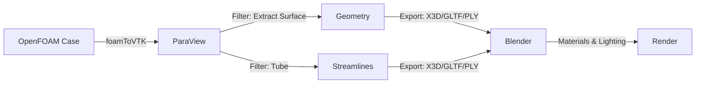

# 🎬 การเรนเดอร์ระดับภาพยนตร์ด้วย Blender (Cinematic Rendering with Blender)

**วัตถุประสงค์การเรียนรู้ (Learning Objectives)**: เปลี่ยนผลลัพธ์ CFD ทางวิทยาศาสตร์ให้เป็นงานศิลปะที่สวยงามสมจริงสำหรับการนำเสนอระดับสูงและการตลาด
**ระดับความยาก**: ขั้นสูง (Advanced)

---

> [!TIP] **เปรียบเทียบ Blender (Analogy)**
> ให้คิดว่า **ParaView** คือ **"ห้องแล็บ"** ที่ทุกอย่างต้องชัดเจน ถูกต้อง แม่นยำ ขาว-ดำ-สีตามค่าตัวเลข
> ส่วน **Blender** คือ **"สตูดิโอถ่ายทำภาพยนตร์"**
> - ที่นี่เราสามารถ **"จัดแสง"** (Lighting) ให้ดูดราม่าหรือนุ่มนวล
> - เราสามารถ **"เปลี่ยนวัสดุ"** (Shading) จากพื้นผิวสีทึบๆ ให้กลายเป็น **"แก้วใส"** (Water/Glass) ที่มีการหักเหแสง หรือ **"ไฟที่เรืองแสง"** (Fire Emission)
> - เราสามารถใส่ **"เมหมอก"** (Volumetric Fog) เพื่อสร้างบรรยากาศ
> เป้าหมายไม่ใช่เพื่อ "วิเคราะห์ข้อมูล" แต่เพื่อ "เล่าเรื่องราว" และ "ดึงดูดผู้ชม"

---

## 1. ทำไมต้องใช้ Blender สำหรับ CFD?

ในงานวิศวกรรมทั่วไป ParaView ก็เพียงพอแล้ว แต่ในบางสถานการณ์ เราต้องการมากกว่าความชัดเจน:

1.  **Photorealism**: การทำให้ของเหลวดูเหมือนน้ำจริงๆ (มีการสะท้อน, ความโปร่งใส)
2.  **Marketing & Presentation**: การนำเสนอโครงการต่อลูกค้าหรือนักลงทุนที่ไม่ใช่วิศวกร
3.  **Complex Compositions**: การรวมผล CFD เข้ากับโมเดล CAD ของผลิตภัณฑ์จริง (เช่น รถยนต์, อาคาร) หรือสภาพแวดล้อมจริง

---

## 2. เวิร์กโฟลว์: OpenFOAM $\to$ ParaView $\to$ Blender

OpenFOAM ไม่มีวิธีส่งข้อมูลไป Blender โดยตรง เราต้องใช้ ParaView เป็นตัวกลาง:



### 2.1 การเตรียมข้อมูลใน ParaView

Blender ทำงานกับ "พื้นผิว" (Polygonal Mesh) ได้ดีที่สุด ไม่ใช่ Volume Data (แม้จะทำได้แต่ยากกว่า)

1.  **Iso-surfaces**: สร้าง Contour ของ Q-criterion หรือ Volume Fraction (alpha.water)
2.  **Streamlines**: สร้าง StreamTracer และใช้ filter **Tube** เพื่อเปลี่ยนเส้นให้เป็นท่อ 3 มิติ (สำคัญมาก! Blender มองไม่เห็นเส้น 1D)
3.  **Slices**: สร้าง Slice และใช้ **Triangulate** filter
4.  **Export**: ไปที่ `File > Export Scene...` แล้วเลือก format **X3D** (แนะนำ), **GLTF**, หรือ **PLY**

> [!WARNING] **ขนาดไฟล์**
> ไฟล์ Geometry ที่ Export อาจมีขนาดใหญ่มาก ควรใช้ **Decimate** filter ใน ParaView เพื่อลดจำนวน Polygons ลงก่อน Export หากรายละเอียดสูงเกินความจำเป็น

---

## 3. การตั้งค่าใน Blender (Blender Setup)

### 3.1 การนำเข้า (Import)

1.  เปิด Blender ลบ Cube เริ่มต้นทิ้ง
2.  `File > Import > X3D Extensible 3D (.x3d)`
3.  ปรับ Scale (OpenFOAM เป็นเมตร, Blender เป็นเมตร แต่บางที Export มา scale อาจเพี้ยน ให้ตรวจสอบ Dimension)
4.  คลิกขวาที่วัตถุเลือก **Shade Smooth** เพื่อลบเหลี่ยมมุมของ Mesh

### 3.2 การสร้างวัสดุ (Materials)

นี่คือหัวใจสำคัญของการทำให้ดูสมจริง:

**วัสดุน้ำ (Water Material):**
- ใช้ **Principled BSDF**
- **Transmission**: 1.0 (โปร่งใส)
- **Roughness**: 0.0 - 0.1 (ผิวมันวาว)
- **IOR (Index of Refraction)**: 1.333 (ดัชนีหักเหของน้ำ)
- **Color**: สีฟ้าอ่อน

**วัสดุควัน/ไฟ (Smoke/Fire Material):**
- ใช้ **Principled Volume** (ต่อเข้ากับ Volume socket ของ Material Output)
- **Density**: ควบคุมความหนาแน่นของควัน
- **Emission Strength**: ควบคุมความสว่างของไฟ
- **Emission Color**: ใช้ Blackbody node เพื่อจำลองสีอุณหภูมิ

**วัสดุ Streamlines:**
- ใช้ **Emission Shader** ผสมกับ **Glass**
- ทำให้เส้นดูเรืองแสงและมีความล้ำสมัย

### 3.3 การจัดแสง (Lighting)

แสงที่ดีเปลี่ยนโมเดลโง่ๆ ให้ดูโปรได้:

1.  **HDRI (High Dynamic Range Imaging)**: ใช้รูปภาพ 360 องศาเป็นแสงสภาพแวดล้อม (โหลดฟรีจาก PolyHaven) ให้แสงเงาที่สมจริงที่สุด
2.  **Area Lights**: ใช้เสริมแสงในจุดที่ต้องการเน้น (Rim Light, Key Light)

---

## 4. การเรนเดอร์ (Rendering Engines)

Blender มี 2 เครื่องยนต์หลัก:

| Engine | ลักษณะ | เหมาะสำหรับ |
| :--- | :--- | :--- |
| **Eevee** | Real-time (เหมือน Game Engine), เร็วมาก | Animation ยาวๆ, พรีวิว, งานที่ไม่เน้น Refraction เป๊ะๆ |
| **Cycles** | Ray-tracing (คำนวณแสงจริง), ช้าแต่สวยสมจริง | ภาพนิ่ง, งานที่ต้องการความสมจริงสูงสุด (แก้ว, น้ำ) |

---

## 5. การทำ Automation ด้วย Python (`bpy`)

เช่นเดียวกับ ParaView, Blender สามารถเขียนสคริปต์ได้ด้วย `bpy` เพื่อทำงานซ้ำๆ:

```python
import bpy
import os

# โฟลเดอร์ที่มีไฟล์ PLY (1 ไฟล์ต่อ 1 Time Step)
input_dir = "/path/to/ply_files"
ply_files = sorted([f for f in os.listdir(input_dir) if f.endswith(".ply")])

# ลบวัตถุเก่าทั้งหมด
bpy.ops.object.select_all(action='SELECT')
bpy.ops.object.delete()

# ตั้งค่า Material
mat = bpy.data.materials.new(name="Water")
mat.use_nodes = True
nodes = mat.node_tree.nodes
bsdf = nodes.get("Principled BSDF")
bsdf.inputs['Transmission'].default_value = 1.0
bsdf.inputs['Roughness'].default_value = 0.05
bsdf.inputs['IOR'].default_value = 1.333

# Loop นำเข้าและเรนเดอร์ (แบบง่าย - หรือใช้ Modifier เพื่อ swap mesh)
for i, ply_file in enumerate(ply_files):
    bpy.ops.import_mesh.ply(filepath=os.path.join(input_dir, ply_file))
    obj = bpy.context.selected_objects[0]
    obj.data.materials.append(mat)
    
    # ตั้งค่าเฟรมและเรนเดอร์ (ในทางปฏิบัติมักใช้วิธี Sequence Modifier)
    # ...
```

> [!TIP] **Mesh Sequence Cache**
> วิธีที่ดีที่สุดในการทำ Animation ใน Blender จากไฟล์ CFD คือการนำเข้าไฟล์แรก แล้วใช้ Modifier ชื่อ **"Mesh Sequence Cache"** เพื่ออ่านไฟล์ Alembic (.abc) หรือ PC2 ที่ Export มาจาก ParaView วิธีนี้ไม่ต้องเขียน Python เพื่อ loop import ทีละเฟรม

---

## 6. ข้อจำกัดและแนวทางแก้ไข

- **ปัญหา**: "Z-fighting" (ผิวซ้อนกันกระพริบ)
    - **แก้**: ขยับวัตถุห่างกันเล็กน้อย หรือใช้ Pass Index
- **ปัญหา**: ไฟล์ใหญ่เกินไป Blender ค้าง
    - **แก้**: ลดรายละเอียด Mesh ตั้งแต่ใน ParaView (Decimate)
- **ปัญหา**: สี (Scalar Field) ไม่มาด้วย
    - **แก้**: X3D/VRML รองรับ Vertex Color ต้องตั้งค่า Material ใน Blender ให้ใช้ Attribute "Col" หรือ Vertex Color

---

## 🧠 ตรวจสอบความเข้าใจ (Concept Check)

1.  **ถาม:** ทำไมเราต้องใช้ Filter "Tube" กับ Streamlines ใน ParaView ก่อนส่งไป Blender?
    <details>
    <summary>เฉลย</summary>
    <b>ตอบ:</b> เพราะ Streamlines ปกติเป็นเส้น 1 มิติ (Lines) ซึ่งไม่มี "พื้นผิว" ให้แสงตกกระทบ และ Blender (โดยเฉพาะ Cycles Render) จะมองไม่เห็นเส้นเหล่านี้ในการเรนเดอร์ การทำ Tube เปลี่ยนเส้นให้เป็นทรงกระบอก 3 มิติที่มีผิวรับแสงเงาได้
    </details>

2.  **ถาม:** ถ้าต้องการทำ Animation น้ำไหลที่สมจริงที่สุด ควรใช้ Render Engine ตัวไหนใน Blender?
    <details>
    <summary>เฉลย</summary>
    <b>ตอบ:</b> **Cycles** เพราะเป็น Ray-tracing engine ที่คำนวณการสะท้อน (Reflection) และการหักเห (Refraction) ของแสงผ่านน้ำได้ถูกต้องตามหลักฟิสิกส์ ในขณะที่ Eevee ใช้การประมาณค่า (Screen Space Reflections) ซึ่งอาจดูไม่สมจริงเท่า
    </details>
