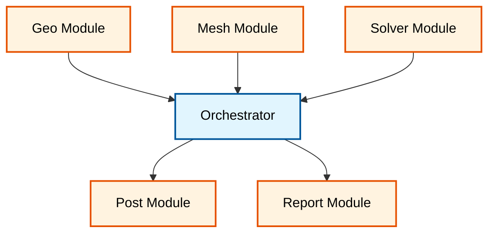
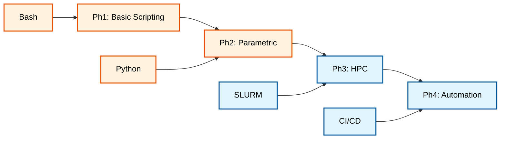

# ⚙️ Workflow Automation: การจัดการกระบวนการ CFD แบบครบวงจร (End-to-End Process Management)

**วัตถุประสงค์การเรียนรู้**: เชี่ยวชาญการสร้างระบบอัตโนมัติ (Automation) สำหรับเวิร์กโฟลว์ OpenFOAM เพื่อจัดการกระบวนการ CFD ตั้งแต่เริ่มต้นจนจบอย่างมีประสิทธิภาพ

---

## บทนำสู่การทำงานอัตโนมัติของเวิร์กโฟลว์ CFD (Introduction)

### ความท้าทายในกระบวนการ CFD แบบดั้งเดิม (Challenges in Traditional CFD Workflows)

พลศาสตร์ของไหลเชิงคำนวณ (Computational Fluid Dynamics - CFD) ประกอบด้วยขั้นตอนที่ซับซ้อนและต่อเนื่องกัน (Sequential Process Chain) ได้แก่:

1. **เตรียมเรขาคณิต (Geometry Preparation)**: การสร้างและปรับพื้นผิว CAD ให้พร้อมสำหรับการสร้างเมช
2. **การสร้างเมช (Mesh Generation)**: การแบ่งโดเมนเป็นเซลล์จำลอง (Discretization)
3. **การตั้งค่าฟิสิกส์ (Physics Setup)**: การกำหนดสมการควบคุม เงื่อนไขขอบเขต และคุณสมบัติของไหล
4. **การคำนวณ (Solving)**: การแก้สมการเชิงตัวเลขด้วย Solver ของ OpenFOAM
5. **การประมวลผล (Post-processing)**: การสกัดข้อมูล การวิเคราะห์ และการแสดงผล

==**การทำงานอัตโนมัติใน OpenFOAM**== ช่วยให้วิศวกรสามารถสร้างไปป์ไลน์ที่ทำงานได้เอง (Autonomous Pipeline) ซึ่งช่วย:
- ลดความผิดพลาดจากมนุษย์ (Human Error Reduction)
- เพิ่มประสิทธิภาพในการศึกษาพารามิเตอร์ขนาดใหญ่ (Large-Scale Parametric Studies)
- รับประกันความสามารถในการทำซ้ำผล (Reproducibility)

### พื้นฐานทางทฤษฎีของสมการควบคุม (Theoretical Foundation of Governing Equations)

เพื่อทำความเข้าใจความจำเป็นของการทำงานอัตโนมัติ เราต้องเริ่มจากสมการพื้นฐานที่ OpenFOAM แก้:

#### สมการอนุรักษ์มวล (Mass Conservation Equation)

$$
\frac{\partial \rho}{\partial t} + \nabla \cdot \left( \rho \mathbf{U} \right) = 0 \tag{1.1}
$$

สำหรับของไหลไหลไม่ได้บีบอัด (Incompressible Flow):

$$
\nabla \cdot \mathbf{U} = 0 \tag{1.2}
$$

โดยที่:
- $\rho$ = ความหนาแน่นของไหล ($\text{kg}/\text{m}^3$)
- $\mathbf{U}$ = เวกเตอร์ความเร็วของไหล ($\text{m}/\text{s}$)
- $t$ = เวลา ($\text{s}$)

#### สมการอนุรักษ์โมเมนตัม (Momentum Conservation Equation)

$$
\frac{\partial \left( \rho \mathbf{U} \right)}{\partial t} + \nabla \cdot \left( \rho \mathbf{U} \mathbf{U} \right) = -\nabla p + \nabla \cdot \boldsymbol{\tau} + \rho \mathbf{g} \tag{1.3}
$$

สำหรับของไหลนิวตัน (Newtonian Fluid):

$$
\boldsymbol{\tau} = \mu \left[ \nabla \mathbf{U} + \left( \nabla \mathbf{U} \right)^T \right] - \frac{2}{3} \mu \left( \nabla \cdot \mathbf{U} \right) \mathbf{I} \tag{1.4}
$$

โดยที่:
- $p$ = ความดัน ($\text{Pa}$)
- $\boldsymbol{\tau}$ = เทนเซอร์ความเค้นเฉือน (Shear Stress Tensor)
- $\mu$ = ความหนืดไดนามิก (Dynamic Viscosity, $\text{Pa}\cdot\text{s}$)
- $\mathbf{g}$ = เวกเตอร์ความโน้มถ่วง ($\text{m}/\text{s}^2$)
- $\mathbf{I}$ = เทนเซอร์เอกลักษณ์

#### สมการพลังงานสำหรับการถ่ายเทความร้อน (Energy Equation for Heat Transfer)

$$
\frac{\partial \left( \rho h \right)}{\partial t} + \nabla \cdot \left( \rho \mathbf{U} h \right) = \nabla \cdot \left( k \nabla T \right) + S_h \tag{1.5}
$$

โดยที่:
- $h$ = เอนทัลปีเฉพาะ ($\text{J}/\text{kg}$)
- $k$ = สัมประสิทธิ์การนำความร้อน ($\text{W}/\text{m}\cdot\text{K}$)
- $T$ = อุณหภูมิ ($\text{K}$)
- $S_h$ = แหล่งกำเนิดความร้อน ($\text{W}/\text{m}^3$)

> [!INFO] **ความสำคัญของระบบอัตโนมัติ**
> สมการเหล่านี้ต้องถูกแก้ด้วยวิธีเชิงตัวเลข (Numerical Methods) บนเมชที่มีเซลล์จำนวนมหาศาล การปรับพารามิเตอร์ เช่น $\Delta t$, Relaxation Factors, หรือ Scheme จึงมีผลต่อความเสถียรและความแม่นยำ ระบบอัตโนมัติช่วยจัดการความซับซ้อนนี้ได้อย่างมีประสิทธิภาพ

---

## สถาปัตยกรรมของเฟรมเวิร์กการทำงานอัตโนมัติ (Automation Framework Architecture)

### หลักการออกแบบเวิร์กโฟลว์ (Workflow Design Principles)

#### 1. ความเป็นโมดูล (Modularity)

เวิร์กโฟลว์ที่ซับซ้อนควรถูกแบ่งออกเป็นส่วนประกอบที่อิสระต่อกัน (Independent Modules) เพื่อให้ง่ายต่อการบำรุงรักษาและนำกลับมาใช้ใหม่


> **Figure 1:** สถาปัตยกรรมของระบบประสานงานเวิร์กโฟลว์ (Workflow Orchestrator) แสดงการเชื่อมโยงโมดูลอิสระสำหรับการเตรียมเรขาคณิต การสร้างเมช การแก้สมการ และการวิเคราะห์ผลลัพธ์ผ่านตัวควบคุมส่วนกลางเพื่อความยืดหยุ่นและบำรุงรักษาง่าย

![[modular_orchestrator_diagram.png]]
> **รูปที่ 1.1:** สถาปัตยกรรมตัวประสานงานเวิร์กโฟลว์ (Workflow Orchestrator): แสดงการเชื่อมต่อระหว่างโมดูลอิสระผ่านสคริปต์ควบคุมส่วนกลาง

#### 2. การกำหนดค่าแบบลำดับชั้น (Hierarchical Configuration)

การจัดการพารามิเตอร์ควรทำผ่านโครงสร้างแบบลำดับชั้นเพื่อลดการซ้ำซ้อนและเพิ่มความยืดหยุ่น:

```yaml
# global_config.yaml
# NOTE: Synthesized by AI - Verify parameters
defaults:
  solver: simpleFoam
  turbulence: kOmegaSST
  schemes:
    time: Euler
    grad: Gauss linear
    div: Gauss upwind
  parallel:
    method: scotch
    num_processors: 4

cases:
  - name: baseline_case
    velocity_inlet: 10.0
    mesh_refinement: 2

  - name: high_velocity_case
    velocity_inlet: 20.0
    mesh_refinement: 3
```

#### 3. การจัดการข้อผิดพลาด (Error Handling)

ระบบอัตโนมัติที่แข็งแกร่งต้องมีกลไกจัดการข้อผิดพลาดและการกู้คืน (Recovery Mechanisms):

```python
# robust_automation.py
# NOTE: Synthesized by AI - Verify parameters
import subprocess
import logging
from typing import Optional

class CFDAutomator:
    """Base class for CFD workflow automation with error handling"""

    def __init__(self, case_dir: str):
        self.case_dir = case_dir
        self.logger = self._setup_logger()

    def _setup_logger(self) -> logging.Logger:
        """Configure logging for automation workflow"""
        logger = logging.getLogger('CFDAutomation')
        logger.setLevel(logging.INFO)
        handler = logging.FileHandler('automation.log')
        formatter = logging.Formatter(
            '%(asctime)s - %(levelname)s - %(message)s'
        )
        handler.setFormatter(formatter)
        logger.addHandler(handler)
        return logger

    def run_command(self, cmd: list, max_retries: int = 3) -> bool:
        """
        Execute OpenFOAM command with automatic retry mechanism

        Args:
            cmd: Command list to execute
            max_retries: Maximum number of retry attempts

        Returns:
            True if successful, False otherwise
        """
        for attempt in range(max_retries):
            try:
                result = subprocess.run(
                    cmd,
                    cwd=self.case_dir,
                    capture_output=True,
                    text=True,
                    timeout=3600  # 1 hour timeout
                )

                if result.returncode == 0:
                    self.logger.info(f"Command succeeded: {' '.join(cmd)}")
                    return True
                else:
                    self.logger.warning(
                        f"Attempt {attempt + 1} failed: {result.stderr}"
                    )

            except subprocess.TimeoutExpired:
                self.logger.error(f"Command timed out: {' '.join(cmd)}")
            except Exception as e:
                self.logger.error(f"Unexpected error: {str(e)}")

        self.logger.error(f"Command failed after {max_retries} attempts")
        return False
```

> [!WARNING] **ข้อควรระวังในการจัดการ Error**
> การทำ retry อัตโนมัติอาจทำให้ใช้ทรัพยากร HPC มากเกินไป ควรกำหนดเกณฑ์ที่ชัดเจนสำหรับการหยุดการทำงาน และแจ้งเตือนผู้ใช้เมื่อพบปัญหาที่ไม่สามารถกู้คืนได้

---

## การควบคุมการรัน Solver อัตโนมัติ (Solver Execution Automation)

### การจัดการการรันแบบขนาน (Parallel Execution Management)

ในระดับอุตสาหกรรม เวิร์กโฟลว์อัตโนมัติจะต้องจัดการการรันบนระบบคลัสเตอร์ (HPC) รวมถึงการย่อยโดเมน (Domain Decomposition) และการจัดคิวงาน (Job Scheduling):

![[parallel_job_scheduler_integration.png]]
> **รูปที่ 2.1:** การรวมระบบจัดการงานขนาน: แสดงกระบวนการส่งงานไปยังระบบคิว (เช่น SLURM หรือ PBS) พร้อมการตรวจสอบสถานะการรันอัตโนมัติ

### การย่อยโดเมนและการรันขนาน (Domain Decomposition and Parallel Running)

#### สมการเชิงตัวเลขสำหรับการย่อยโดเมน

การแบ่งโดเมน $\Omega$ ออกเป็น $N_d$ โดเมนย่อย (Subdomains):

$$
\Omega = \bigcup_{i=1}^{N_d} \Omega_i \quad \text{โดยที่} \quad \Omega_i \cap \Omega_j = \emptyset \quad \forall i \neq j \tag{2.1}
$$

การแลกเปลี่ยนข้อมูลระหว่างโดเมนย่อยที่ติดกัน (Neighbor Communication):

$$
\mathbf{U}_{\Gamma_i}^{k+1} = \mathcal{F}\left( \mathbf{U}_{\Omega_i}^k, \mathbf{U}_{\Gamma_j}^k \right) \quad \forall j \in \mathcal{N}(i) \tag{2.2}
$$

โดยที่:
- $\mathcal{N}(i)$ = เซตของโดเมนย่อยที่ติดกับโดเมน $i$
- $\Gamma_i$ = ขอบเขตของโดเมนย่อย $i$
- $\mathcal{F}$ = ฟังก์ชันการแลกเปลี่ยนข้อมูลผ่าน MPI

#### สคริปต์การรันแบบขนานด้วย Python

```python
# parallel_runner.py
# NOTE: Synthesized by AI - Verify parameters
import subprocess
from pathlib import Path
from typing import Dict

class ParallelSolverRunner:
    """Manage parallel solver execution on HPC systems"""

    def __init__(self, case_dir: Path, num_processors: int):
        self.case_dir = case_dir
        self.num_processors = num_processors

    def decompose_domain(self) -> bool:
        """
        Decompose computational domain using decomposePar

        Returns:
            True if decomposition successful
        """
        cmd = [
            'decomposePar',
            f'-case {self.case_dir}',
            '-force'
        ]

        print(f"Decomposing domain into {self.num_processors} subdomains...")
        result = subprocess.run(
            ' '.join(cmd),
            shell=True,
            cwd=self.case_dir,
            capture_output=True,
            text=True
        )

        if result.returncode == 0:
            print("Domain decomposition completed successfully")
            return True
        else:
            print(f"Decomposition failed: {result.stderr}")
            return False

    def run_solver_parallel(
        self,
        solver_name: str = 'simpleFoam',
        timeout: int = 7200
    ) -> Dict[str, any]:
        """
        Run OpenFOAM solver in parallel mode

        Args:
            solver_name: Name of the OpenFOAM solver
            timeout: Maximum runtime in seconds

        Returns:
            Dictionary containing execution results
        """
        # MPI command construction
        cmd = [
            'mpirun',
            '-np', str(self.num_processors),
            solver_name,
            '-parallel'
        ]

        log_file = self.case_dir / 'log.solver'

        print(f"Starting parallel solver execution...")
        print(f"Solver: {solver_name}, Processors: {self.num_processors}")

        with open(log_file, 'w') as log:
            process = subprocess.Popen(
                cmd,
                cwd=self.case_dir,
                stdout=log,
                stderr=subprocess.STDOUT
            )

            try:
                process.communicate(timeout=timeout)
                success = process.returncode == 0
            except subprocess.TimeoutExpired:
                process.kill()
                print(f"Solver execution exceeded timeout of {timeout}s")
                success = False

        return {
            'success': success,
            'log_file': str(log_file),
            'returncode': process.returncode
        }

    def reconstruct_results(self) -> bool:
        """
        Reconstruct parallel results using reconstructPar

        Returns:
            True if reconstruction successful
        """
        cmd = [
            'reconstructPar',
            '-latestTime',
            f'-case {self.case_dir}'
        ]

        print("Reconstructing parallel results...")
        result = subprocess.run(
            ' '.join(cmd),
            shell=True,
            cwd=self.case_dir,
            capture_output=True,
            text=True
        )

        return result.returncode == 0
```

#### การส่งงานผ่าน SLURM (SLURM Job Submission)

```bash
#!/bin/bash
# submit_cfd_job.sh
# NOTE: Synthesized by AI - Verify parameters

#SBATCH --job-name=OF_Case
#SBATCH --nodes=2
#SBATCH --ntasks-per-node=32
#SBATCH --time=24:00:00
#SBATCH --partition=compute
#SBATCH --output=slurm-%j.out
#SBATCH --error=slurm-%j.err

# Load OpenFOAM environment
module load openfoam/9
source $FOAM_BASH

# Set case directory
CASE_DIR="/path/to/case"
cd $CASE_DIR

# Decompose domain
echo "Decomposing domain..."
decomposePar -case $CASE_DIR -force

# Run solver in parallel
echo "Running solver..."
mpirun -np 64 simpleFoam -parallel > log.solver 2>&1

# Reconstruct results
echo "Reconstructing results..."
reconstructPar -latestTime -case $CASE_DIR

echo "Job completed successfully"
```

> [!TIP] **Best Practices สำหรับ HPC Automation**
> - ใช้ `checkpointing` เพื่อบันทึกผลลัพธ์ระหว่างการรัน หากงานถูกยกเลิกสามารถกลับมาทำต่อได้
> - ตรวจสอบ Load Balancing ระหว่างโดเมนย่อยเพื่อให้แน่ใจว่าทุก Processor ทำงานเต็มความสามารถ
> - ใช้ `foamListTimes` เพื่อตรวจสอบ Time Steps ที่ถูกบันทึกก่อน reconstruct

---

## การศึกษาพารามิเตอร์และการหาค่าที่เหมาะสมที่สุด (Parameter Studies and Optimization)

### การศึกษาพารามิเตอร์แบบอัตโนมัติ (Automated Parameter Studies)

การทำงานอัตโนมัติช่วยให้สามารถทำ **Design of Experiments (DoE)** ได้อย่างรวดเร็ว โดยการวนลูปเปลี่ยนพารามิเตอร์ เช่น ความเร็วทางเข้า ($U_{\text{inlet}}$), ความหนืด ($\mu$), หรือรูปร่างของเรขาคณิต และสกัดผลลัพธ์ออกมาเปรียบเทียบกัน

#### การกำหนดพื้นที่การออกแบบ (Design Space Definition)

พื้นที่การออกแบบ $\mathcal{D}$ ถูกกำหนดโดยเวกเตอร์พารามิเตอร์:

$$
\mathbf{x} = \left[ x_1, x_2, \ldots, x_n \right]^T \in \mathcal{D} \tag{3.1}
$$

โดยที่:
- $x_i$ = พารามิเตอร์ที่ $i$ (เช่น ความเร็ว, มุมเคลื่อนที่)
- $\mathcal{D}$ = พื้นที่การออกแบบที่ถูกจำกัดโดย Constraints

#### ฟังก์ชันเป้าหมาย (Objective Function)

การเพิ่มประสิทธิภาพ (Optimization) มีเป้าหมายเพื่อหาค่าที่เหมาะสมที่สุดของฟังก์ชัน:

$$
\min_{\mathbf{x} \in \mathcal{D}} f(\mathbf{x}) \quad \text{หรือ} \quad \max_{\mathbf{x} \in \mathcal{D}} f(\mathbf{x}) \tag{3.2}
$$

ตัวอย่างฟังก์ชันเป้าหมายใน CFD:
- **Drag Coefficient Minimization**: $f(\mathbf{x}) = C_D(\mathbf{x})$
- **Lift-to-Drag Ratio Maximization**: $f(\mathbf{x}) = -\frac{C_L(\mathbf{x})}{C_D(\mathbf{x})}$
- **Pressure Drop Minimization**: $f(\mathbf{x}) = \Delta p(\mathbf{x})$

![[pareto_front_optimization_visual.png]]
> **รูปที่ 3.1:** แนวหน้าพาเรโต (Pareto Front) ในการเพิ่มประสิทธิภาพการออกแบบ: แสดงผลลัพธ์จากการศึกษาพารามิเตอร์แบบอัตโนมัติเพื่อหาจุดออกแบบที่ดีที่สุดเมื่อมีวัตถุประสงค์ที่ขัดแย้งกัน (เช่น ลด Drag แต่เพิ่ม Lift)

#### สคริปต์ DoE สำหรับการศึกษาพารามิเตอร์

```python
# parameter_study.py
# NOTE: Synthesized by AI - Verify parameters
import numpy as np
import pandas as pd
from pathlib import Path
from typing import List, Dict
from itertools import product

class ParameterStudy:
    """
    Automated Design of Experiments (DoE) framework for CFD
    """

    def __init__(self, base_case: Path):
        self.base_case = base_case
        self.results = []

    def generate_latin_hypercube(
        self,
        params: Dict[str, tuple],
        n_samples: int
    ) -> pd.DataFrame:
        """
        Generate Latin Hypercube Sampling (LHS) design matrix

        Args:
            params: Dictionary of {param_name: (min, max)}
            n_samples: Number of samples to generate

        Returns:
            DataFrame with sampled parameter combinations
        """
        param_names = list(params.keys())
        n_params = len(param_names)

        # Generate random permutations
        samples = np.zeros((n_samples, n_params))
        for i in range(n_params):
            perm = np.random.permutation(n_samples)
            samples[:, i] = (perm + np.random.rand(n_samples)) / n_samples

        # Scale to parameter ranges
        for i, name in enumerate(param_names):
            min_val, max_val = params[name]
            samples[:, i] = min_val + samples[:, i] * (max_val - min_val)

        return pd.DataFrame(samples, columns=param_names)

    def run_parameter_sweep(
        self,
        design_matrix: pd.DataFrame,
        output_quantities: List[str]
    ) -> pd.DataFrame:
        """
        Execute CFD simulations for each parameter combination

        Args:
            design_matrix: DataFrame of parameter combinations
            output_quantities: List of quantities to extract (e.g., 'Cd', 'Cl')

        Returns:
            DataFrame with all results
        """
        results_list = []

        for idx, row in design_matrix.iterrows():
            print(f"Running simulation {idx + 1}/{len(design_matrix)}")

            # Create case directory
            case_dir = self.base_case / f"case_{idx:04d}"
            case_dir.mkdir(exist_ok=True)

            # Update boundary conditions with parameters
            self._update_boundary_conditions(case_dir, row)

            # Run solver
            success = self._run_simulation(case_dir)

            if success:
                # Extract output quantities
                outputs = self._extract_results(case_dir, output_quantities)
                results_list.append({
                    **row.to_dict(),
                    **outputs,
                    'status': 'converged'
                })
            else:
                results_list.append({
                    **row.to_dict(),
                    'status': 'diverged'
                })

        return pd.DataFrame(results_list)

    def _update_boundary_conditions(
        self,
        case_dir: Path,
        params: pd.Series
    ) -> None:
        """Update OpenFOAM boundary conditions with parameter values"""
        import PyFoam

        # Update velocity inlet
        u_file = case_dir / '0' / 'U'
        # Implementation to update U file with params['velocity_inlet']

    def _run_simulation(self, case_dir: Path) -> bool:
        """Execute OpenFOAM solver and check convergence"""
        # Implementation to run solver and monitor convergence
        pass

    def _extract_results(
        self,
        case_dir: Path,
        quantities: List[str]
    ) -> Dict[str, float]:
        """Extract force coefficients and other quantities"""
        # Implementation to read forces/forces.dat
        pass
```

#### การวิเคราะห์ความไว (Sensitivity Analysis)

การวิเคราะห์ความไวช่วยระบุพารามิเตอร์ที่มีผลต่อฟังก์ชันเป้าหมายมากที่สุด:

$$
S_i = \frac{\partial f}{\partial x_i} \cdot \frac{x_i}{f} \tag{3.3}
$$

โดยที่:
- $S_i$ = ดัชนีความไว (Sensitivity Index) สำหรับพารามิเตอร์ $x_i$
- $f$ = ค่าฟังก์ชันเป้าหมาย

> [!INFO] **ตัวอย่างการประยุกต์ใช้**
> สำหรับการออกแบบรูปทรง Airfoil:
> - **พารามิเตอร์**: ความยาวคอร์ด ($c$), มุม Angle of Attack ($\alpha$), ความหนา ($t$)
> - **เป้าหมาย**: สูงสุด $\frac{C_L}{C_D}$ (Lift-to-Drag Ratio)
> - **ข้อจำกัด**: $C_L \geq 0.5$ (Minimum lift requirement)

---

## การควบคุมคุณภาพและการตรวจสอบความถูกต้อง (Quality Control and Validation)

### การตรวจสอบคุณภาพเมชอัตโนมัติ (Automated Mesh Quality Assessment)

เมชที่มีคุณภาพไม่ดีสามารถนำไปสู่ผลลัพธ์ที่ไม่ถูกต้องหรือการ Diverge ของ Solver ระบบอัตโนมัติควรตรวจสอบคุณภาพเมชก่อนการรัน:

#### เกณฑ์คุณภาพเมช (Mesh Quality Metrics)

| เกณฑ์ (Metric) | คำนวณ (Calculation) | ค่าที่ยอมรับ (Acceptable Range) |
|---|---|---|
| **Non-Orthogonality** | $\theta = \cos^{-1}\left( \frac{\mathbf{n}_f \cdot \mathbf{d}_{PN}}{|\mathbf{n}_f| \cdot |\mathbf{d}_{PN}|} \right)$ | $\theta < 70^\circ$ |
| **Aspect Ratio** | $\text{AR} = \frac{\Delta_{\text{max}}}{\Delta_{\text{min}}}$ | $\text{AR} < 1000$ |
| **Skewness** | $\text{Skew} = \frac{|\mathbf{c} - \mathbf{c}_{\text{ideal}}|}{\Delta_{\text{max}}}$ | $\text{Skew} < 4$ |
| **Determinant** | $J = \det(\mathbf{J})$ | $J > 10^{-3}$ |

```python
# mesh_quality_checker.py
# NOTE: Synthesized by AI - Verify parameters
import numpy as np
import re
from pathlib import Path

class MeshQualityChecker:
    """Automated mesh quality assessment for OpenFOAM meshes"""

    def __init__(self, case_dir: Path):
        self.case_dir = case_dir

    def run_check_mesh(self) -> Dict[str, any]:
        """
        Execute checkMesh utility and parse results

        Returns:
            Dictionary containing mesh quality statistics
        """
        cmd = ['checkMesh', '-case', str(self.case_dir), '-allGeometry']

        result = subprocess.run(
            cmd,
            capture_output=True,
            text=True,
            cwd=self.case_dir
        )

        return self._parse_check_mesh_output(result.stdout)

    def _parse_check_mesh_output(self, output: str) -> Dict[str, any]:
        """Parse checkMesh output to extract quality metrics"""
        metrics = {}

        # Extract non-orthogonality
        non_ortho_match = re.search(
            r'Non-orthogonality.*?Max:\s+(\d+\.\d+)',
            output
        )
        if non_ortho_match:
            metrics['max_non_orthogonality'] = float(non_ortho_match.group(1))

        # Extract aspect ratio
        aspect_match = re.search(
            r'Aspect ratio.*?Max:\s+(\d+\.\d+)',
            output
        )
        if aspect_match:
            metrics['max_aspect_ratio'] = float(aspect_match.group(1))

        return metrics

    def validate_mesh(self, thresholds: Dict[str, float]) -> bool:
        """
        Validate mesh against quality thresholds

        Args:
            thresholds: Dictionary of {metric_name: max_allowed_value}

        Returns:
            True if mesh passes all quality checks
        """
        metrics = self.run_check_mesh()

        for metric, threshold in thresholds.items():
            if metrics.get(metric, 0) > threshold:
                print(f"❌ {metric}: {metrics[metric]:.2f} > {threshold:.2f}")
                return False
            else:
                print(f"✓ {metric}: {metrics[metric]:.2f}")

        return True
```

### การตรวจสอบการลู่เข้าของ Solver (Solver Convergence Monitoring)

#### สมการการตรวจสอบการลู่เข้า (Convergence Criteria)

Solver ถือว่าลู่เข้าเมื่อ Residuals ของสมการทั้งหมดต่ำกว่าค่าที่กำหนด:

$$
\max \left( \frac{\| \mathbf{R}^k \|}{\| \mathbf{R}^0 \|} \right) < \epsilon \quad \forall \text{equations} \tag{4.1}
$$

โดยที่:
- $\mathbf{R}^k$ = เวกเตอร์ Residual ที่ Iteration ที่ $k$
- $\epsilon$ = ค่า Tolerance (เช่น $10^{-5}$)

```python
# convergence_monitor.py
# NOTE: Synthesized by AI - Verify parameters
import numpy as np
import matplotlib.pyplot as plt
from pathlib import Path

class ConvergenceMonitor:
    """Real-time convergence monitoring for OpenFOAM solvers"""

    def __init__(self, log_file: Path):
        self.log_file = log_file
        self.residuals = {}

    def monitor_convergence(
        self,
        target_residual: float = 1e-5,
        max_iterations: int = 1000
    ) -> bool:
        """
        Monitor solver log file for convergence

        Args:
            target_residual: Target residual value
            max_iterations: Maximum solver iterations

        Returns:
            True if converged, False if diverged
        """
        # Follow log file in real-time
        with open(self.log_file, 'r') as f:
            for line in f:
                # Parse residuals from log
                self._parse_residual_line(line)

                # Check convergence
                if self._check_convergence(target_residual):
                    print(f"✓ Converged at iteration {len(self.residuals)}")
                    return True

                if len(self.residuals) > max_iterations:
                    print(f"✗ Diverged after {max_iterations} iterations")
                    return False

        return False

    def _parse_residual_line(self, line: str) -> None:
        """Extract residual values from solver log output"""
        # Example regex for OpenFOAM log format
        import re

        # Match: "Time = 1.2"
        time_match = re.search(r'Time\s*=\s*([\d.e+-]+)', line)
        if time_match:
            current_time = float(time_match.group(1))

        # Match: "Ux: final residual = 1.234e-06"
        residual_match = re.search(
            r'(\w+):\s+final\s+residual\s*=\s*([\d.e+-]+)',
            line
        )
        if residual_match:
            var_name = residual_match.group(1)
            residual = float(residual_match.group(2))

            if var_name not in self.residuals:
                self.residuals[var_name] = []
            self.residuals[var_name].append(residual)

    def _check_convergence(self, target: float) -> bool:
        """Check if all residuals are below target"""
        for var_residuals in self.residuals.values():
            if len(var_residuals) == 0:
                continue
            if var_residuals[-1] > target:
                return False
        return True

    def plot_residuals(self, output_path: Path) -> None:
        """Generate residual convergence plot"""
        plt.figure(figsize=(10, 6))

        for var_name, residuals in self.residuals.items():
            plt.semilogy(residuals, label=var_name)

        plt.xlabel('Iteration')
        plt.ylabel('Residual')
        plt.title('Solver Convergence History')
        plt.legend()
        plt.grid(True)

        plt.savefig(output_path, dpi=150)
        plt.close()
```

> [!MISSING DATA] **Simulation Results**
> > **[MISSING DATA]**: Insert specific simulation results/graphs for this section. ตัวอย่างกราฟการลู่เข้าของ Residuals สำหรับเคส `flowAroundCylinder` แสดงการลดลงของ `U`, `p`, `k`, `omega` เป็นฟังก์ชันของ Iterations

---

## การประมวลผลและการรายงานผลอัตโนมัติ (Automated Post-Processing and Reporting)

### การสกัดข้อมูลและการวิเคราะห์ (Data Extraction and Analysis)

ระบบอัตโนมัติควรสามารถสกัดข้อมูลสำคัญ เช่น:
- สนามความดันและความเร็วบน Surface
- แรง Drag และ Lift (Forces and Moments)
- การกระจายตัวของค่าความปั่นป่วน (Turbulence Statistics)
- การสร้างภาพ Visualization แบบ Batch

#### การคำนวณสัมประสิทธิ์แรง (Force Coefficient Calculation)

$$
C_D = \frac{F_D}{\frac{1}{2} \rho U_\infty^2 A} \tag{5.1}
$$

$$
C_L = \frac{F_L}{\frac{1}{2} \rho U_\infty^2 A} \tag{5.2}
$$

โดยที่:
- $F_D$ = แรงต้าน (Drag Force, $N$)
- $F_L$ = แรงยก (Lift Force, $N$)
- $A$ = พื้นที่อ้างอิง (Reference Area, $\text{m}^2$)
- $U_\infty$ = ความเร็วกระแสอิสระ (Freestream Velocity, $\text{m}/\text{s}$)

```python
# force_coefficient_calculator.py
# NOTE: Synthesized by AI - Verify parameters
import pandas as pd
from pathlib import Path

class ForceCoefficientCalculator:
    """Extract and calculate force coefficients from OpenFOAM forces function"""

    def __init__(self, case_dir: Path):
        self.case_dir = case_dir
        self.forces_file = case_dir / 'postProcessing' / 'forces' / '0' / 'forces.dat'

    def read_forces(self) -> pd.DataFrame:
        """
        Read forces.dat output file

        Returns:
            DataFrame with time, forces (pressure, viscous), and moments
        """
        # Forces file format: Time Fx_p Fx_v Fy_p Fy_v Fz_p Fz_v ...
        df = pd.read_csv(
            self.forces_file,
            sep='\t',
            comment='#',
            names=['time', 'fx_p', 'fx_v', 'fy_p', 'fy_v', 'fz_p', 'fz_v',
                   'mx_p', 'mx_v', 'my_p', 'my_v', 'mz_p', 'mz_v']
        )

        # Calculate total forces (pressure + viscous)
        df['fx_total'] = df['fx_p'] + df['fx_v']
        df['fy_total'] = df['fy_p'] + df['fy_v']
        df['fz_total'] = df['fz_p'] + df['fz_v']

        return df

    def calculate_coefficients(
        self,
        rho: float,
        u_inf: float,
        ref_area: float,
        ref_length: float = 1.0
    ) -> pd.DataFrame:
        """
        Calculate dimensionless force coefficients

        Args:
            rho: Fluid density (kg/m³)
            u_inf: Freestream velocity (m/s)
            ref_area: Reference area (m²)
            ref_length: Reference length (m)

        Returns:
            DataFrame with Cd, Cl, Cm coefficients
        """
        df = self.read_forces()

        # Dynamic pressure
        q_dyn = 0.5 * rho * u_inf**2

        # Force coefficients
        df['Cd'] = df['fx_total'] / (q_dyn * ref_area)
        df['Cl'] = df['fy_total'] / (q_dyn * ref_area)

        # Moment coefficient (about z-axis)
        mz_total = df['mz_p'] + df['mz_v']
        df['Cm'] = mz_total / (q_dyn * ref_area * ref_length)

        return df[['time', 'Cd', 'Cl', 'Cm']]
```

### การสร้างรายงานอัตโนมัติ (Automated Report Generation)

```python
# report_generator.py
# NOTE: Synthesized by AI - Verify parameters
from jinja2 import Template
from datetime import datetime
import matplotlib.pyplot as plt
from pathlib import Path

class CFDReportGenerator:
    """Generate engineering reports from CFD simulation results"""

    def __init__(self, case_dir: Path):
        self.case_dir = case_dir

    def generate_markdown_report(
        self,
        output_path: Path,
        metadata: dict,
        results: dict
    ) -> None:
        """
        Generate Markdown report from simulation results

        Args:
            output_path: Path to save the report
            metadata: Dictionary with case metadata
            results: Dictionary with simulation results
        """
        template_str = """
# CFD Simulation Report: {{ case_name }}

**Date:** {{ report_date }}
**Solver:** {{ solver }}
**Mesh Cells:** {{ num_cells }}

---

## Executive Summary


This simulation **converged** successfully after {{ num_iterations }} iterations.

This simulation **diverged** - please review solver settings.


| Parameter | Value |
|---|---|
| Inlet Velocity | {{ velocity_inlet }} m/s |
| Reynolds Number | {{ reynolds_number }} |
| Drag Coefficient (Cd) | {{ cd_value }} |
| Lift Coefficient (Cl) | {{ cl_value }} |
| Lift-to-Drag Ratio | {{ ld_ratio }} |

---

## Force Coefficient History


---

## Mesh Quality

| Metric | Value | Status |
|---|---|---|
| Max Non-Orthogonality | {{ max_non_ortho }}° | ✓ Pass✗ Fail |
| Max Aspect Ratio | {{ max_aspect_ratio }} | ✓ Pass✗ Fail |

---

> [!INFO] **Automation Metadata**
> - Generated by: CFD Automation Framework v1.0
> - Case Directory: `{{ case_dir }}`
"""

        template = Template(template_str)

        # Render template with data
        report_content = template.render(
            report_date=datetime.now().strftime('%Y-%m-%d %H:%M'),
            case_dir=str(self.case_dir),
            **metadata,
            **results
        )

        # Write report
        with open(output_path, 'w') as f:
            f.write(report_content)
```

---

## สรุป (Summary)

การสร้างเวิร์กโฟลว์อัตโนมัติเปลี่ยน OpenFOAM จากเครื่องมือที่ต้องอาศัยการสั่งงานทีละขั้นตอน (Manual Tool) ให้กลายเป็น **แพลตฟอร์มวิศวกรรมการคำนวณขั้นสูง** ที่มีความสามารถดังนี้:

### ประโยชน์หลักของการทำงานอัตโนมัติ (Key Benefits)

| ด้าน (Aspect) | ประโยชน์ (Benefit) | คำอธิบาย (Description) |
|---|---|---|
| **Robustness** | การจัดการข้อผิดพลาด | ตรวจสอบการลู่เข้า ปรับ Time Step/Solver Settings อัตโนมัติ |
| **Efficiency** | ลดเวลาการทำงาน | ลดงานซ้ำซ้อน (Repetitive Tasks) เพิ่ม throughput |
| **Quality Assurance** | ความน่าเชื่อถือ | ทุกขั้นตอนถูกบันทึกและทำซ้ำได้ (Reproducible) |
| **Scalability** | การขยายขนาด | รองรับการศึกษาพารามิเตอร์หลายร้อยเคสพร้อมกัน |
| **Knowledge Integration** | การสะสมความรู้ | เก็บฐานข้อมูลผลการจำลองสำหรับ AI-driven CFD |

### แนวทางการนำไปใช้งาน (Implementation Roadmap)


> **Figure 2:** แผนการดำเนินงาน (Roadmap) สำหรับการพัฒนาความเป็นอัตโนมัติในกระบวนการ CFD ตั้งแต่การเขียนสคริปต์พื้นฐาน การศึกษาพารามิเตอร์ จนถึงการบูรณาการเข้ากับระบบ HPC และการสร้างไปป์ไลน์แบบครบวงจร (End-to-End Pipeline)

> [!TIP] **แนวทางปฏิบัติที่ดีที่สุด (Best Practices)**
> - **Start Small**: เริ่มจากการอัตโนมัติงานเล็กๆ ก่อนขยายไปยังทั้งไปป์ไลน์
> - **Modular Design**: แยกโค้ดส่วนการจัดการ Mesh, Solver และ Post-process ออกจากกัน
> - **Version Control**: ใช้ Git จัดเก็บสคริปต์และไฟล์พารามิเตอร์
> - **Documentation**: สร้างเอกสารประกอบโค้ดอย่างละเอียด

---

## 🔗 หัวข้อที่เกี่ยวข้อง (Related Topics)

- [[01_🎯_Overview_Automation_Strategy]] - กลยุทธ์และแนวทางการทำระบบอัตโนมัติ
- [[02_🏗️_Complete_CFD_Automation_Framework]] - ตัวอย่างเฟรมเวิร์กการรัน CFD แบบครบวงจร
- [[../03_POST_PROCESSING/05_Automated_PostProcessing]] - การประมวลผลหลังการจำลองแบบอัตโนมัติ
- [[../04_VISUALIZATION/01_ParaView_Visualization]] - การเรนเดอร์ภาพอัตโนมัติด้วย ParaView Python
- [[../../MODULE_02_MESH_GENERATION/00_Overview]] - พื้นฐานการสร้างเมชใน OpenFOAM
- [[../../MODULE_03_SOLVERS/00_Overview]] - พื้นฐาน Solvers และการตั้งค่า