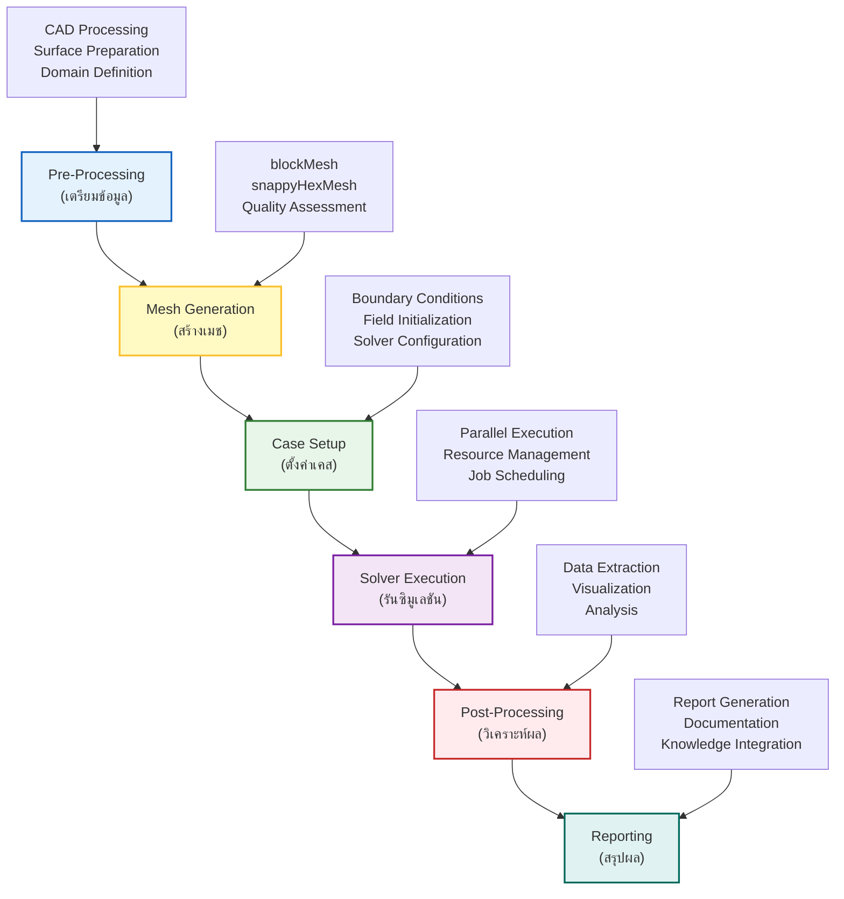
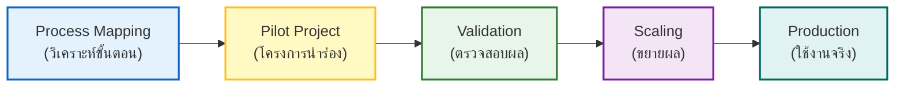

# 🎯 ภาพรวม: กลยุทธ์การทำงานอัตโนมัติ (Automation Strategy Overview)

การทำงานอัตโนมัติ (Automation) ของกระบวนการทำงาน OpenFOAM เป็นการเปลี่ยนผ่านจากกระบวนการพลศาสตร์ของไหลเชิงคำนวณ (CFD) แบบดั้งเดิมที่ต้องอาศัยการสั่งงานด้วยมือ (Manual) ไปสู่ระบบการทำงานที่มีประสิทธิภาพสูง สามารถทำซ้ำได้ (Reproducible) และขยายขนาดได้ (Scalable) กลยุทธ์นี้ช่วยให้วิศวกรสามารถมุ่งเน้นไปที่การวิเคราะห์ฟิสิกส์และการตัดสินใจเชิงออกแบบ มากกว่าการเสียเวลากับงานซ้ำซ้อน

---

## สถาปัตยกรรมของเฟรมเวิร์กการทำงานอัตโนมัติ (Automation Framework Architecture)

กลยุทธ์การทำงานอัตโนมัติที่ครอบคลุมจะดูแลตลอดทั้งไปป์ไลน์ (Pipeline) ของกระบวนการทำงาน CFD ตั้งแต่การรับข้อมูลเบื้องต้นไปจนถึงการรายงานผลขั้นสุดท้าย



![[cfd_automation_lifecycle.png]]
> **รูปที่ 1.1:** วงจรชีวิตการทำงานอัตโนมัติของ CFD (CFD Automation Lifecycle): แสดงความต่อเนื่องของการไหลของข้อมูลและการควบคุมในแต่ละขั้นตอน ตั้งแต่การรับพารามิเตอร์ขาเข้าไปจนถึงการจัดเก็บความรู้ทางวิศวกรรม

---

## หลักการทางทฤษฎีของการทำงานอัตโนมัติ (Theoretical Foundations)

### สมการการควบคุมแบบพารามิเตอร์ (Parametric Control Equations)

ในการทำงานอัตโนมัติ เราต้องการกำหนดพื้นที่พารามิเตอร์ (Parameter Space) $\mathcal{P}$ ที่ครอบคลุมตัวแปรทางฟิสิกส์และเชิงตัวเลขทั้งหมด:

$$
\mathcal{P} = \left\{ \mathbf{p} \in \mathbb{R}^n \mid \mathbf{p}_{\text{min}} \leq \mathbf{p} \leq \mathbf{p}_{\text{max}} \right\}
$$

โดยที่ $\mathbf{p} = [p_1, p_2, \dots, p_n]^T$ เป็นเวกเตอร์พารามิเตอร์ที่ประกอบด้วย:

- $p_1$: ความเร็วขาเข้า ($U_{\text{inlet}}$)
- $p_2$: ความหนืดของไหล ($\nu$)
- $p_3$: ความละเอียดเมช ($\Delta x$)
- $p_4$: เวลาจำลอง ($t_{\text{end}}$)
- ...

### การเชื่อมโยงสมการฟิสิกส์กับพารามิเตอร์ (Physics-Parameter Coupling)

สำหรับปัญหาการไหลแบบไม่สับเปลี่ยน (Incompressible Flow) สมการ Navier-Stokes ที่ใช้ในการจำลอง:

$$
\frac{\partial \mathbf{u}}{\partial t} + \left(\mathbf{u} \cdot \nabla\right)\mathbf{u} = -\frac{1}{\rho}\nabla p + \nu \nabla^2 \mathbf{u} + \mathbf{f}
$$

$$
\nabla \cdot \mathbf{u} = 0
$$

เมื่อมีการเปลี่ยนแปลงพารามิเตอร์ เงื่อนไขขอบเขต (Boundary Conditions) จะถูกปรับอัตโนมัติ:

$$
\mathbf{u}(\mathbf{x}, t) \big|_{\Gamma_{\text{inlet}}} = \mathbf{u}_{\text{inlet}}(p_1, \mathbf{x}, t)
$$

$$
\mathbf{u}(\mathbf{x}, t) \big|_{\Gamma_{\text{wall}}} = \mathbf{0}
$$

---

### การทำงานอัตโนมัติในการตั้งค่ากรณี (Case Setup Automation)

หัวใจสำคัญของการทำงานอัตโนมัติคือการทำให้ไฟล์ Dictionary ของ OpenFOAM สามารถปรับเปลี่ยนได้ตามพารามิเตอร์ (Parametric Dictionaries)

#### การใช้ Template Engine (เช่น Jinja2)

แทนที่จะแก้ไขไฟล์ `controlDict` หรือ `fvSchemes` ด้วยมือ เราจะใช้ Template ที่มีตัวแปรเพื่อให้สคริปต์ Python เติมค่าให้โดยอัตโนมัติ

**ตัวอย่างโครงสร้างสคริปต์สำหรับการตั้งค่า:**
1. **Input Map**: ระบุ Patch ของเรขาคณิตและแมปกับเงื่อนไขทางฟิสิกส์ (Inlet, Outlet, Wall)
2. **Smart Initialization**: คำนวณค่าพารามิเตอร์ความปั่นป่วน ($k, \omega, \epsilon$) อัตโนมัติจากความเร็วและความเข้มข้นความปั่นป่วนที่ระบุ
3. **Solver Tuning**: ปรับค่า Relaxation Factors หรือเกณฑ์การบรรจบ (Convergence Criteria) ตามความซับซ้อนของเคส

#### การคำนวณค่าเริ่มต้นความปั่นป่วน (Turbulence Initialization)

สำหรับโมเดลความปั่นป่วน $k-\omega$ SST การคำนวณค่าเริ่มต้นอัตโนมัติ:

$$
k = \frac{3}{2} \left(U I\right)^2
$$

$$
\omega = \frac{k^{1/2}}{C_{\mu}^{1/4} \ell}
$$

$$
\epsilon = C_{\mu}^{3/4} \frac{k^{3/2}}{\ell}
$$

โดยที่:
- $U$ = ความเร็วกระแสหลัก
- $I$ = ความเข้มข้นความปั่นป่วน (Turbulence Intensity) ≈ 0.05-0.10
- $\ell$ = ความยาวสเกลความปั่นป่วน (Turbulent Length Scale)
- $C_{\mu} = 0.09$ (ค่าคงที่)

#### ตัวอย่างไฟล์ Template: `controlDict.j2`

```cpp
// NOTE: Synthesized by AI - Verify parameters
application     simpleFoam;

startFrom       latestTime;

startTime       0;

stopTime        {{ end_time }};

deltaT          {{ delta_t }};

writeControl    timeStep;

writeInterval   {{ write_interval }};

purgeWrite      0;

functions
{
    forces
    {
        type        forces;
        libs        ("libforces.so");

        writeControl    timeStep;
        writeInterval   1;

        patches    ("{{ patch_name }}");

        rho         rhoInf;
        rhoInf      {{ rho_inf }};

        log         true;
    }

    forceCoeffs
    {
        type        forceCoeffs;
        libs        ("libforces.so");

        writeControl    timeStep;
        writeInterval   1;

        patches    ("{{ patch_name }}");

        rho         rhoInf;
        rhoInf      {{ rho_inf }};

        CofR        ( {{ cofr_x }} {{ cofr_y }} {{ cofr_z }} );

        liftDir     (0 0 1);
        dragDir     (1 0 0);

        pitchAxis   (0 1 0);

        magUInf     {{ u_inf }};
        lRef        {{ l_ref }};
        Aref        {{ a_ref }};

        log         true;
    }
}
```

---

## การสร้างเมชอัตโนมัติ (Automated Mesh Generation)

### การควบคุมคุณภาพเมช (Mesh Quality Control)

การทำงานอัตโนมัติต้องมีการตรวจสอบคุณภาพเมช (Mesh Quality Metrics) ก่อนรัน Solver:

$$
\text{Non-Orthogonality} = \max\left(\arccos\left(\frac{\mathbf{S}_f \cdot \mathbf{d}}{|\mathbf{S}_f| |\mathbf{d}|}\right)\right) \leq 70^\circ
$$

$$
\text{Aspect Ratio} = \frac{\Delta_{\max}}{\Delta_{\min}} \leq 1000
$$

$$
\text{Skewness} = \frac{|\mathbf{d} - \mathbf{d}_{\text{ideal}}|}{|\mathbf{d}_{\text{ideal}}|} \leq 4
$$

### ตัวอย่างไฟล์ `snappyHexMeshDict.j2`

```cpp
// NOTE: Synthesized by AI - Verify parameters
// * * * * * * * * * * * * * * * * * * * * * * * * * * * * * * * * * * * * * //

castellatedMesh true;
snap            true;
addLayers       true;

geometry
{
    {{ geometry_name }}
    {
        type triSurfaceMesh;
        file "{{ surface_file }}";
    }
}

castellatedMeshControls
{
    maxLocalCells {{ max_local_cells }};
    maxGlobalCells {{ max_global_cells }};

    minRefinementCells 10;

    nCellsBetweenLevels {{ n_cells_between_levels }};

    features
    (
        {
            file "{{ surface_file }}";
            level {{ feature_level }};
        }
    );

    refinementSurfaces
    {
        {{ geometry_name }}
        {
            level ({{ surface_min_level }} {{ surface_max_level }});
        }
    }

    resolveFeatureAngle {{ feature_angle }};

    refinementRegions
    {
        {{ region_name }}
        {
            mode {{ refinement_mode }};
            levels (({{ region_min }} {{ region_max }}));
        }
    }

    locationInMesh ({{ location_x }} {{ location_y }} {{ location_z }});
}

snapControls
{
    nSmoothPatch {{ n_smooth_patch }};
    tolerance {{ snap_tolerance }};
    nSolveIter {{ n_solve_iter }};
    nRelaxIter {{ n_relax_iter }};
}

addLayersControls
{
    relativeSizes true;

    layers
    {
        "{{ patch_layer }}"
        {
            nSurfaceLayers {{ n_surface_layers }};
        }
    }

    expansionRatio {{ expansion_ratio }};
    finalLayerThickness {{ final_layer_thickness }};
    minThickness {{ min_thickness }};

    nGrow {{ n_grow }};
    featureAngle {{ feature_angle_layers }};
    nRelaxIter {{ n_relax_iter_layers }};
    nSmoothSurfaceNormals {{ n_smooth_normals }};
    nSmoothThickness {{ n_smooth_thickness }};
    maxFaceThicknessRatio {{ max_face_thickness_ratio }};
    maxThicknessToMedialRatio {{ max_thickness_medial_ratio }};
    minMedianAxisAngle {{ min_median_angle }};
    nBufferCellsNoExtrude {{ n_buffer_cells }};
    nLayerIter {{ n_layer_iter }};
}

meshQualityControls
{
    maxNonOrthogonal {{ max_non_ortho }};
    maxBoundarySkewness {{ max_boundary_skew }};
    maxInternalSkewness {{ max_internal_skew }};
    maxConcave {{ max_concave }};
    minFlatness {{ min_flatness }};
    minVol {{ min_vol }};
    minTetQuality {{ min_tet_quality }};
    minArea {{ min_area }};
    minTriangleTwist {{ min_triangle_twist }};
    minFaceWeight {{ min_face_weight }};
    maxFaceWeight {{ max_face_weight }};
    minVolRatio {{ min_vol_ratio }};
    minTwist {{ min_twist }};
    minDeterminant {{ min_determinant }};
}

// ************************************************************************* //
```

---

## ระดับความสมบูรณ์ของระบบอัตโนมัติ (Automation Maturity Levels)

ระดับของระบบอัตโนมัติสามารถแบ่งตามความซับซ้อนและการบูรณาการ ตั้งแต่สคริปต์ระดับพื้นฐานไปจนถึงระบบระดับองค์กร

![[automation_maturity_scale.png]]
> **รูปที่ 2.1:** ระดับความสมบูรณ์ของระบบอัตโนมัติ (Automation Maturity Scale): แสดงการเลื่อนระดับจาก Manual -> Python Scripting -> HPC Integration -> Enterprise Workflows

| ระดับ (Level) | ลักษณะเด่น | เครื่องมือ (Tools) |
|---|---|---|
| **L1: พื้นฐาน (Basic)** | งานซ้ำๆ เฉพาะกิจ, สคริปต์สั้นๆ | Shell scripts (Bash), Makefiles |
| **L2: กลาง (Intermediate)** | การศึกษาพารามิเตอร์, โครงสร้างเคสที่เป็นมาตรฐาน | Python (NumPy/Pandas), YAML, Git |
| **L3: ขั้นสูง (Advanced)** | การรันบน HPC แบบอัตโนมัติ, การจัดการ Error | Python Frameworks, Job Schedulers (Slurm) |
| **L4: องค์กร (Enterprise)** | ไปป์ไลน์การผลิตเต็มรูปแบบ, ระบบอัตโนมัติ 100% | Containers (Docker/Apptainer), CI/CD, Cloud |

---

## กลยุทธ์การนำไปปฏิบัติ (Implementation Strategy)

การนำระบบอัตโนมัติไปใช้งานควรเริ่มจากขั้นตอนเล็กๆ และขยายผลอย่างเป็นระบบ:



### กรอบการออกแบบโมดูล (Modular Design Framework)

$$
\mathcal{F}_{\text{auto}} = \bigcup_{i=1}^{N} \mathcal{M}_i
$$

โดยที่:
- $\mathcal{F}_{\text{auto}}$ = เฟรมเวิร์กอัตโนมัติทั้งหมด
- $\mathcal{M}_i$ = โมดูลที่ $i$ ได้แก่:
  - $\mathcal{M}_1$: เมชเจอเนเรเตอร์ (Mesh Generator)
  - $\mathcal{M}_2$: ตัวตั้งค่าเคส (Case Setter)
  - $\mathcal{M}_3$: ตัวจัดการซอล์ฟเวอร์ (Solver Manager)
  - $\mathcal{M}_4$: ตัววิเคราะห์ผล (Post-Processor)
  - $\mathcal{M}_5$: ตัวสร้างรายงาน (Report Generator)

### การจัดการข้อมูล (Data Management Strategy)

โครงสร้างไดเรกทอรีแบบมาตรฐานสำหรับการทำงานอัตโนมัติ:

```
PROJECT_ROOT/
├── config/
│   ├── parameters.yaml          # พารามิเตอร์หลัก
│   ├── templates/               # Template files
│   │   ├── controlDict.j2
│   │   ├── fvSchemes.j2
│   │   └── snappyHexMeshDict.j2
│   └── validation/              # กฎการตรวจสอบ
├── scripts/
│   ├── mesh_generator.py
│   ├── case_setup.py
│   ├── solver_manager.py
│   └── post_processor.py
├── cases/
│   ├── case_001/
│   ├── case_002/
│   └── ...
├── results/
│   ├── data/                    # ข้อมูลดิบ
│   ├── figures/                 # กราฟและภาพ
│   └── reports/                 # รายงานสรุป
└── logs/
    ├── mesh_logs/
    ├── solver_logs/
    └── error_logs/
```

> [!INFO] **แนวทางปฏิบัติที่ดีที่สุด (Best Practices)**
> - **Modular Design**: แยกโค้ดส่วนการจัดการ Mesh, Solver และ Post-process ออกจากกัน
> - **Documentation**: สร้างเอกสารประกอบโค้ดอย่างละเอียด (เช่น การใช้ Docstrings ใน Python) เพื่อให้ทีมงานคนอื่นสามารถดูแลต่อได้
> - **Version Control**: ใช้ Git เพื่อจัดเก็บสคริปต์และไฟล์พารามิเตอร์ เพื่อให้สามารถย้อนกลับไปยังเวอร์ชันที่ทำงานได้เสมอ

---

## การตรวจสอบและความถูกต้อง (Validation and Verification)

### การตรวจสอบความถูกต้องทางคณิตศาสตร์ (Mathematical Verification)

การทำงานอัตโนมัติต้องมีการตรวจสอบว่าสมการที่ใช้ถูกต้อง:

$$
\text{Error}_{\text{numerical}} = \left\| \mathbf{u}_{\text{numerical}} - \mathbf{u}_{\text{exact}} \right\|_2
$$

$$
\text{Order of Accuracy} = \frac{\log\left(\frac{E_{\text{coarse}}}{E_{\text{fine}}}\right)}{\log(r)}
$$

โดยที่ $r$ คืออัตราส่วนของความละเอียดเมช (Mesh refinement ratio)

### การตรวจสอบความถูกต้องทางฟิสิกส์ (Physical Validation)

เปรียบเทียบผลการจำลองกับข้อมูลทดลองหรือวรรณกรรม:

$$
\text{Validation Error} = \frac{|\phi_{\text{CFD}} - \phi_{\text{exp}}|}{|\phi_{\text{exp}}|} \times 100\%
$$

> [!WARNING] **ข้อควรระวัง (Cautionary Notes)**
> - การทำงานอัตโนมัติไม่ได้หมายความว่าสามารถวางใจได้โดยไม่ต้องตรวจสอบ
> - ควรมีการตรวจสอบผลลัพธ์จากการรันอัตโนมัติเป็นระยะ (Periodic Review)
> - ควรมีการเก็บ Log และ Metadata ของแต่ละการรันอย่างครบถ้วน

---

## ตัวอย่างการประยุกต์ใช้ (Application Examples)

### ตัวอย่าง 1: การศึกษาค่า Drag ของรถยนต์ (Automated Drag Study)

> **[MISSING DATA]**: Insert specific simulation results/graphs for this section.

สมการ Drag Coefficient:
$$
C_D = \frac{F_D}{\frac{1}{2} \rho U_\infty^2 A}
$$

### ตัวอย่าง 2: การวิเคราะห์ Heat Transfer

> **[MISSING DATA]**: Insert specific simulation results/graphs for this section.

สมการ Energy:
$$
\frac{\partial T}{\partial t} + \mathbf{u} \cdot \nabla T = \alpha \nabla^2 T + S_T
$$

---

## สรุป (Summary)

กลยุทธ์การทำงานอัตโนมัติใน OpenFOAM เป็นเครื่องมือที่ทรงพลังสำหรับ:

1. ==การลดเวลาทำงาน== (Time Reduction)
2. ==การเพิ่มความแม่นยำ== (Accuracy Improvement)
3. ==การทำให้สามารถทำซ้ำได้== (Reproducibility)
4. ==การขยายขนาดการวิเคราะห์== (Scalability)

เงื่อนไขสำคัญคือการออกแบบระบบที่ ==Modular==, ==Well-Documented==, และ ==Validated==

> [!TIP] **เคล็ดลับสำคัญ (Key Takeaway)**
> เริ่มต้นจากงานเล็กๆ ที่ทำซ้ำได้ง่าย แล้วค่อยๆ ขยายไปสู่ระบบที่ซับซ้อน การทำงานอัตโนมัติที่ดีต้องสมดุลระหว่าง **Automation** และ **Human Oversight**
