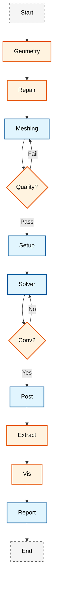

# 🏗️ Complete CFD Automation Framework (เฟรมเวิร์กการทำงานอัตโนมัติของ CFD แบบสมบูรณ์)

> [!INFO] ภาพรวม (Overview)
> เฟรมเวิร์กการทำงานอัตโนมัติของ CFD ที่ครอบคลุมนี้มอบการจัดการเวิร์กโฟลว์แบบ End-to-end สำหรับการจำลอง OpenFOAM โดยจัดการทุกอย่างตั้งแต่การประมวลผลเรขาคณิต (Geometry Processing) ไปจนถึงการสร้างรายงานทางวิศวกรรม (Engineering Report) ออกแบบมาสำหรับการใช้งานในระดับการผลิต (Production) และการศึกษาพารามิเตอร์ (Parametric Studies) ขนาดใหญ่

---

## สถาปัตยกรรมของเฟรมเวิร์ก (Framework Architecture)

### ส่วนประกอบหลัก (Core Components)

เฟรมเวิร์กถูกสร้างขึ้นรอบๆ **ระบบการตั้งค่าแบบลำดับชั้น (Hierarchical Configuration System)** พร้อมด้วยตัวควบคุมเฉพาะทาง (Specialized Controllers) สำหรับแต่ละขั้นตอนของเวิร์กโฟลว์ CFD:

![[hierarchical_config_system.png]]
> **รูปที่ 1.1:** ระบบการตั้งค่าแบบลำดับชั้น (Hierarchical Configuration System): แสดงการสืบทอดและส่งต่อพารามิเตอร์จาก Global Settings ลงไปยัง Case-specific Configs

#### การจัดการการตั้งค่า (Configuration Management)

| Configuration Class | วัตถุประสงค์ (Purpose) |
|---|---|
| `GeometryConfig` | จัดการการประมวลผลพื้นผิวเบื้องต้น (Preprocessing), การปรับสเกล และการสกัดคุณลักษณะ |
| `MeshConfig` | ควบคุมพารามิเตอร์การสร้างเมช (Meshing) และเกณฑ์คุณภาพ (Quality Metrics) |
| `SolverConfig` | จัดการการเลือก Solver, เกณฑ์การลู่เข้า (Convergence Criteria) และการตั้งค่ารันไทม์ |
| `PhysicsConfig` | กำหนดคุณสมบัติของของไหลและโมเดลความปั่นป่วน (Turbulence Models) |
| `BoundaryConfig` | ระบุเงื่อนไขขอบเขต (Boundary Conditions) และค่าอ้างอิง |
| `PostProcessingConfig` | ควบคุมการสกัดข้อมูล, การสร้างภาพ และการรายงานผล |

---

## ไปป์ไลน์การทำงานแบบอัตโนมัติ (Automation Pipeline)

กระบวนการทำงานถูกกำหนดให้เป็นลำดับขั้นตอนที่ต่อเนื่องและมีการตรวจสอบความถูกต้องในทุกจุด:


> **Figure 1:** ผังงานแสดงไปป์ไลน์การทำงานอัตโนมัติแบบครบวงจร (Automation Pipeline) ครอบคลุมตั้งแต่การประมวลผลเรขาคณิต การสร้างและตรวจสอบคุณภาพเมช การตั้งค่าเคส การรัน Solver พร้อมระบบตรวจสอบความบรรจบ ไปจนถึงการวิเคราะห์ผลและการสร้างรายงานสรุปผลทางวิศวกรรม

---

## ทางทฤษฎีของการจำลอง CFD (Theoretical Foundation)

### สมการการไหลของของไหล (Governing Equations)

เฟรมเวิร์กนี้รองรับการแก้สมการของการไหลแบบ **Navier-Stokes Equations** สำหรับของไหลของ Newtonian:

$$
\frac{\partial \rho}{\partial t} + \nabla \cdot (\rho \mathbf{U}) = 0 \tag{1}
$$

**สมการโมเมนตัม (Momentum Equation):**

$$
\frac{\partial (\rho \mathbf{U})}{\partial t} + \nabla \cdot (\rho \mathbf{U} \mathbf{U}) = -\nabla p + \nabla \cdot \boldsymbol{\tau} + \rho \mathbf{g} \tag{2}
$$

โดยที่:
- $\rho$ = ความหนาแน่นของของไหล (Fluid Density) $[kg/m^3]$
- $\mathbf{U}$ = เวกเตอร์ความเร็ว (Velocity Vector) $[m/s]$
- $p$ = ความดัน (Pressure) $[Pa]$
- $\boldsymbol{\tau}$ = เทนเซอร์ความเค้นเฉือน (Shear Stress Tensor) $[Pa]$
- $\mathbf{g}$ = เวกเตอร์ความโน้มถ่วง (Gravitational Acceleration) $[m/s^2]$

**เทนเซอร์ความเค้นเฉือนสำหรับของไหล Newtonian:**

$$
\boldsymbol{\tau} = \mu \left[ \nabla \mathbf{U} + (\nabla \mathbf{U})^T \right] - \frac{2}{3} \mu (\nabla \cdot \mathbf{U}) \mathbf{I} \tag{3}
$$

เมื่อ $\mu$ คือ ความหนืดพลศาสตร์ (Dynamic Viscosity) $[Pa \cdot s]$

> [!TIP] แนวทางการแก้สมการใน OpenFOAM
> OpenFOAM ใช้วิธี **Finite Volume Method (FVM)** โดยแบ่งโดเมนเป็นชิ้นส่วนเล็กๆ (Control Volumes) และทำการอินทิเกรตสมการบนแต่ละชิ้นส่วน ผลที่ได้คือระบบสมการเชิงเส้นที่ถูกแก้ด้วยวิธีอิเลอร์ (Iterative Solvers)

---

### โมเดลความปั่นป่วน (Turbulence Modeling)

สำหรับการจำลองแบบ **RANS (Reynolds-Averaged Navier-Stokes)** ที่ใช้กันทั่วไป:

#### k-ε Standard Model

$$
\frac{\partial (\rho k)}{\partial t} + \nabla \cdot (\rho \mathbf{U} k) = \nabla \cdot \left[ \left( \mu + \frac{\mu_t}{\sigma_k} \right) \nabla k \right] + P_k - \rho \epsilon \tag{4}
$$

$$
\frac{\partial (\rho \epsilon)}{\partial t} + \nabla \cdot (\rho \mathbf{U} \epsilon) = \nabla \cdot \left[ \left( \mu + \frac{\mu_t}{\sigma_\epsilon} \right) \nabla \epsilon \right] + C_{1\epsilon} \frac{\epsilon}{k} P_k - C_{2\epsilon} \rho \frac{\epsilon^2}{k} \tag{5}
$$

โดยที่:
- $k$ = พลังงานจลน์ของความปั่นป่วน (Turbulent Kinetic Energy) $[m^2/s^2]$
- $\epsilon$ = อัตราการสลายตัวของความปั่นป่วน (Dissipation Rate) $[m^2/s^3]$
- $\mu_t$ = ความหนืดของความปั่นป่วน (Eddy Viscosity) $[Pa \cdot s]$

**ความสัมพันธ์ของความหนืด:**

$$
\mu_t = \rho C_\mu \frac{k^2}{\epsilon} \tag{6}
$$

โดยค่าคงที่มาตรฐาน: $C_\mu = 0.09$, $C_{1\epsilon} = 1.44$, $C_{2\epsilon} = 1.92$, $\sigma_k = 1.0$, $\sigma_\epsilon = 1.3$

> [!WARNING] ข้อจำกัดของ k-ε Model
> โมเดล k-ε มีความแม่นยำน้อยในบริเวณที่มีการไหลแบบ Separation หรือการไหลที่มี Pressure Gradient สูง สำหรับกรณีเหล่านั้น ควรพิจารณาใช้ **k-ω SST Model** หรือ **LES** แทน

---

### เงื่อนไขขอบเขต (Boundary Conditions)

เงื่อนไขขอบเขตที่สำคัญใน OpenFOAM:

| ประเภท | คำอธิบาย | ตัวอย่างการใช้งาน |
|---|---|---|
| `fixedValue` | กำหนดค่าคงที่ | Inlet Velocity |
| `zeroGradient` | ค่าอนุพันธ์เป็นศูนย์ | Outlet Pressure |
| `noSlip` | ความเร็วเป็นศูนย์ที่ผนัง | Viscous Walls |
| `symmetryPlane` | ระนาบสมมาตร | Symmetry Boundaries |
| `empty` | 2D หรือ axisymmetric | Front/Back planes (2D) |

**ตัวอย่างการตั้งค่า Boundary Conditions สำหรับ Inlet:**

```cpp
// 📂 Source: 0/U (Boundary condition file for velocity field)
// This file defines the boundary condition for the velocity field U at time=0
// 
// Explanation:
// - fixedValue: Sets a constant value at the boundary
// - uniform: Same value across all boundary faces
// - (10 0 0): Velocity vector in x, y, z components [m/s]
//
// Key Concepts:
// - Boundary conditions in OpenFOAM are stored in time directories (0/, 1/, 2/, etc.)
// - Each field (U, p, k, epsilon) has its own file with boundary conditions
// - The value must match the field dimensions (velocity: m/s)

/*--------------------------------*- C++ -*----------------------------------*\
| =========                 |                                                 |
| \\      /  F ield         | OpenFOAM: The Open Source CFD Toolbox           |
|  \\    /   O peration     | Version:  10                                    |
|   \\  /    A nd           | Website:  https://openfoam.org                  |
|    \\/     M anipulation  |                                                 |
\*---------------------------------------------------------------------------*/
FoamFile
{
    version     2.0;
    format      ascii;
    class       volVectorField;    // Velocity field is a vector field on cell centers
    location    "0";
    object      U;
}
// * * * * * * * * * * * * * * * * * * * * * * * * * * * * * * * * * * * * * //

dimensions      [0 1 -1 0 0 0 0];  // [m/s] - velocity dimensions

internalField   uniform (0 0 0);    // Initial velocity field inside domain

boundaryField
{
    inlet
    {
        type            fixedValue;     // Fixed value boundary condition
        value           uniform (10 0 0); // [m/s] inlet velocity in x-direction
    }
    
    outlet
    {
        type            zeroGradient;    // Zero gradient (Neumann BC)
    }
    
    walls
    {
        type            noSlip;          // No-slip condition at walls
    }
}

// ************************************************************************* //
```

> [!INFO] คำอธิบายเพิ่มเติม (Additional Explanation)
> - **internalField**: ค่าเริ่มต้นของฟิลด์ภายในโดเมน ที่เวลา t=0
> - **boundaryField**: กำหนดเงื่อนไขขอบเขตสำหรับแต่ละ patch ที่ระบุในไฟล์ `constant/polyMesh/boundary`
> - **dimensions**: หน่วยวัดของฟิลด์ตามระบบ [mass length time temperature ...]

---

## โมดูลการรัน Solver อัตโนมัติ (Solver Execution Module)

โมดูลนี้ทำหน้าที่รัน Solver และตรวจสอบความเสถียรของการคำนวณแบบเรียลไทม์

### การจัดการการรันแบบขนาน (Parallel Execution Management)

เพื่อให้การจำลองทำได้อย่างรวดเร็ว ระบบจะทำการย่อยโดเมน (Domain Decomposition) อัตโนมัติและรันผ่านระบบคิวงาน (Job Scheduler)

**ตัวอย่างฟังก์ชันการรันขนานด้วย Python:**

```python
# 📂 Source: Python automation script for parallel solver execution
#
# Explanation:
# This Python function demonstrates how to automate OpenFOAM solver execution
# in parallel mode using MPI (Message Passing Interface)
#
# Key Concepts:
# - decomposePar: Splits the domain into sub-domains for parallel processing
# - mpirun -np: Specifies number of processor cores
# - -parallel flag: Tells OpenFOAM solver to run in parallel mode
# - reconstructPar: Merges decomposed results back into single domain

def _run_parallel_solver(self, case_config: CFDCaseConfig, case_dir: Path) -> Dict:
    """
    Run solver in parallel mode with automated decomposition
    
    Args:
        case_config: Configuration object containing solver settings
        case_dir: Path to OpenFOAM case directory
        
    Returns:
        Dictionary containing solver exit status and log file path
    """
    # Step 1: Domain Decomposition
    # Divide computational domain into sub-domains based on num_processors
    subprocess.run(
        ['decomposePar', f"-case {case_dir}", "-force"], 
        shell=True,
        check=True
    )

    # Step 2: Parallel Solver Execution with MPI
    # Run the solver using MPI on multiple processors
    cmd = [
        'mpirun', 
        '-np', str(case_config.solver.num_processors),  # Number of cores
        case_config.solver.solver_type,                  # Solver name (e.g., simpleFoam)
        '-parallel'                                      # Parallel mode flag
    ]

    # Redirect output to log file for monitoring
    log_file_path = case_dir / 'log.solver'
    with open(log_file_path, 'w') as log_file:
        process = subprocess.Popen(
            cmd, 
            stdout=log_file, 
            stderr=subprocess.STDOUT,
            cwd=str(case_dir)
        )
        return_code = process.wait()

    # Step 3: Result Reconstruction
    # Merge decomposed results into single time directory
    subprocess.run(
        ['reconstructPar', '-latestTime'], 
        shell=True,
        cwd=str(case_dir)
    )
    
    return {
        'exit_code': return_code,
        'log_file': str(log_file_path)
    }
```

### การตั้งค่า fvSchemes และ fvSolution (Standard Configuration)

**ไฟล์ `system/fvSchemes`:**

```cpp
// 📂 Source: system/fvSchemes (Reference: .applications/test/fieldMapping/pipe1D/system/fvSchemes)
// This file defines the discretization schemes for temporal and spatial derivatives
//
// Explanation:
// - ddtSchemes: Temporal discretization (how to handle time derivatives)
// - gradSchemes: Gradient calculation methods
// - divSchemes: Divergence term discretization (convection terms)
// - laplacianSchemes: Laplacian term discretization (diffusion terms)
//
// Key Concepts:
// - Euler: First-order implicit time scheme (steady-state or transient)
// - Gauss linear: Second-order linear interpolation using Gauss theorem
// - Gauss linearUpwindV: Upwind scheme for convective stability
// - corrected: Adds non-orthogonal correction for better accuracy

/*--------------------------------*- C++ -*----------------------------------*\
| =========                 |                                                 |
| \\      /  F ield         | OpenFOAM: The Open Source CFD Toolbox           |
|  \\    /   O peration     | Website:  https://openfoam.org                  |
|   \\  /    A nd           | Version:  10                                    |
|    \\/     M anipulation  |                                                 |
\*---------------------------------------------------------------------------*/
FoamFile
{
    format      ascii;
    class       dictionary;
    location    "system";
    object      fvSchemes;
}
// * * * * * * * * * * * * * * * * * * * * * * * * * * * * * * * * * * * * * //

// Temporal discretization schemes
ddtSchemes
{
    default         Euler;          // First-order implicit (steady-state)
}

// Gradient calculation schemes
gradSchemes
{
    default         Gauss linear;   // Linear gradient reconstruction
}

// Divergence (convection) schemes
divSchemes
{
    default         none;           // Require explicit scheme specification
    div(phi,U)      Gauss linearUpwindV Gauss linear 1;  // Upwind for stability
    div(phi,k)      Gauss upwind;                         // Upwind for turbulence
    div(phi,epsilon) Gauss upwind;
    div((nuEff*dev2(T(grad(U))))) Gauss linear 4;
}

// Laplacian (diffusion) schemes
laplacianSchemes
{
    default         Gauss linear corrected;  // With non-orthogonal correction
}

// Interpolation schemes for face values
interpolationSchemes
{
    default         linear;         // Linear interpolation from cell centers to faces
}

// Surface normal gradient schemes
snGradSchemes
{
    default         corrected;      // Non-orthogonal correction included
}

// ************************************************************************* //
```

> [!INFO] คำอธิบาย Discretization Schemes
> - **Euler**: วิธีการแบบ First-order implicit สำหรับการแก้ปัญหาสถานะคงที่ (Steady-state)
> - **Gauss linear**: การคำนวณ Gradient แบบ Second-order โดยใช้ทฤษฎีบทของเกาส์
> - **linearUpwindV**: วิธี Upwind แบบ First-order สำหรับเสถียรภาพของ convection terms
> - **corrected**: การแก้ไขค่าสำหรับ mesh ที่ไม่ orthogonal (มุมไม่ฉาก)

**ไฟล์ `system/fvSolution`:**

```cpp
// 📂 Source: system/fvSolution (Reference: .applications/test/fieldMapping/pipe1D/system/controlDict)
// This file defines the linear solver settings and algorithm control parameters
//
// Explanation:
// - solvers: Defines iterative solvers for each variable (p, U, k, epsilon)
// - SIMPLE: Settings for SIMPLE algorithm (Semi-Implicit Method for Pressure-Linked Equations)
// - residualControl: Convergence criteria for each variable
//
// Key Concepts:
// - GAMG: Geometric-Algebraic Multi-Grid solver (fast for Poisson equations)
// - smoothSolver: Iterative solver with smoother (e.g., Gauss-Seidel)
// - tolerance: Absolute convergence tolerance (stop when residual below this)
// - relTol: Relative tolerance (stop when residual change is small)
// - nNonOrthogonalCorrectors: Number of corrections for non-orthogonal meshes

/*--------------------------------*- C++ -*----------------------------------*\
| =========                 |                                                 |
| \\      /  F ield         | OpenFOAM: The Open Source CFD Toolbox           |
|  \\    /   O peration     | Website:  https://openfoam.org                  |
|   \\  /    A nd           | Version:  10                                    |
|    \\/     M anipulation  |                                                 |
\*---------------------------------------------------------------------------*/
FoamFile
{
    format      ascii;
    class       dictionary;
    location    "system";
    object      fvSolution;
}
// * * * * * * * * * * * * * * * * * * * * * * * * * * * * * * * * * * * * * //

// Linear solver settings for each variable
solvers
{
    p  // Pressure solver - Poisson equation
    {
        solver          GAMG;              // Geometric-Algebraic Multi-Grid
        tolerance       1e-06;             // Absolute tolerance [Pa]
        relTol          0.01;              // Relative tolerance (1%)
        smoother        GaussSeidel;       // Smoother for multi-grid levels
    }

    "(U|k|epsilon)"  // Velocity and turbulence solver
    {
        solver          smoothSolver;      // General iterative solver
        smoother        GaussSeidel;       // Gauss-Seidel smoothing
        tolerance       1e-05;             // Absolute tolerance
        relTol          0.1;               // Relative tolerance (10%)
    }
}

// SIMPLE algorithm control parameters
SIMPLE
{
    // Number of non-orthogonal correctors (for highly skewed meshes)
    nNonOrthogonalCorrectors 0;
    
    // Reference pressure location and value
    pRefCell        0;                     // Cell index for reference pressure
    pRefValue       0;                     // [Pa] Reference pressure value

    // Residual-based convergence control
    residualControl
    {
        p               1e-4;              // Pressure tolerance
        U               1e-4;              // Velocity tolerance [m/s]
        "(k|epsilon)"   1e-4;              // Turbulence tolerance
    }
}

// ************************************************************************* //
```

> [!INFO] คำอธิบาย Solvers
> - **GAMG (Geometric-Algebraic Multi-Grid)**: เหมาะสำหรับสมการ Poisson (Pressure) ในกริดขนาดใหญ่ ใช้เทคนิค Multi-grid เพื่อเร่งการลู่เข้า
> - **smoothSolver**: Solver แบบ iterative สำหรับสมการทั่วไป ใช้ smoothing technique เพื่อลดค่า residual
> - **tolerance**: ค่าความคลาดเคลื่อนสัมบูรณ์ (Absolute Tolerance) - หยุดเมื่อ residual < tolerance
> - **relTol**: ค่าความคลาดเคลื่อนสัมพัทธ์ (Relative Tolerance) - หยุดเมื่อการเปลี่ยนแปลงของ residual < relTol

---

## ระบบควบคุมอัจฉริยะ (Intelligent Solution Control)

เฟรมเวิร์กนี้มีความสามารถในการปรับตัว (Adaptive Control) เพื่อป้องกันการ Diverge ของผลเฉลย:

### กลไกการตรวจสอบ Residuals (Residual Monitoring)

สมการสำหรับตรวจสอบ Convergence:

$$
R_{\phi} = \frac{||\mathbf{A} \boldsymbol{\phi}^{(n)} - \mathbf{b}||}{||\mathbf{b}||} \tag{7}
$$

เมื่อ:
- $R_{\phi}$ = ค่า Residual สำหรับตัวแปร $\phi$
- $\mathbf{A}$ = เมทริกซ์สัมประสิทธิ์ (Coefficient Matrix)
- $\boldsymbol{\phi}^{(n)}$ = เวกเตอร์ตัวแปรที่ iteration ที่ $n$
- $\mathbf{b}$ = เวกเตอร์ฝั่งขวา (Right-Hand Side Vector)

### การปรับ Relaxation Factors (Adaptive Relaxation)

สำหรับอัลกอริทึม **SIMPLE (Semi-Implicit Method for Pressure-Linked Equations)**:

$$
\phi^{(n+1)} = \phi^{(n)} + \alpha_{\phi} \left( \phi^{*} - \phi^{(n)} \right) \tag{8}
$$

เมื่อ:
- $\alpha_{\phi}$ = ค่า Relaxation Factor สำหรับตัวแปร $\phi$
- $\phi^{(n)}$ = ค่าตัวแปรที่ iteration ก่อนหน้า
- $\phi^{*}$ = ค่าตัวแปรที่คำนวณใหม่

**กลยุทธ์การปรับค่าอัตโนมัติ:**

```python
# 📂 Source: Python adaptive relaxation control module
#
# Explanation:
# This function implements adaptive relaxation factor adjustment
# to prevent solver divergence during iterations
#
# Key Concepts:
# - Relaxation factors (α) control how much of the new solution is accepted
# - Low α (0.1-0.3): More stable but slower convergence
# - High α (0.7-0.9): Faster but risk of divergence
# - Adaptive strategy: Reduce α when residuals increase, increase when stable

def adapt_relaxation_factors(self, residuals: Dict[str, float]) -> Dict[str, float]:
    """
    ปรับค่า Relaxation Factors ตามสภาพ Convergence
    
    Args:
        residuals: Dictionary of current residual values for each variable
        
    Returns:
        Dictionary of updated relaxation factors
        
    Algorithm:
        1. Check residuals against divergence threshold
        2. Reduce relaxation by 20% if diverging
        3. Increase relaxation by 10% if converging well
        4. Maintain bounds [0.1, 0.9] for stability
    """
    new_factors = {}

    for var, residual in residuals.items():
        if residual > self.divergence_threshold:
            # Reduce relaxation if residual is too high (preventing divergence)
            reduction_factor = 0.8  # Reduce by 20%
            new_factors[var] = max(
                0.1,  # Lower bound for stability
                self.relaxation_factors[var] * reduction_factor
            )
            # Log warning for user
            print(f"⚠️  High residual for {var}: {residual:.2e}, "
                  f"reducing relaxation to {new_factors[var]:.2f}")
                  
        elif residual < self.convergence_target * 10:
            # Increase relaxation if converging well (accelerate convergence)
            increase_factor = 1.1  # Increase by 10%
            new_factors[var] = min(
                0.9,  # Upper bound for stability
                self.relaxation_factors[var] * increase_factor
            )
            # Log progress
            print(f"✓ Good convergence for {var}: {residual:.2e}, "
                  f"increasing relaxation to {new_factors[var]:.2f}")
                  
        else:
            # Maintain current relaxation factor
            new_factors[var] = self.relaxation_factors[var]

    return new_factors
```

![[adaptive_solver_control_loop.png]]
> **รูปที่ 3.1:** วงจรการควบคุมผลเฉลยแบบปรับตัว (Adaptive Control Loop): ระบบจะตรวจสอบค่า Residuals และปรับ Relaxation Factors หรือ Time Step อัตโนมัติหากพบสัญญาณของความไม่เสถียร

### การปรับ Time Step แบบ Dynamical (Dynamic Time Stepping)

สำหรับการจำลองแบบ Transient:

$$
\Delta t^{n+1} = \Delta t^n \cdot \text{CFL}_{\text{target}} \cdot \frac{\Delta t^n}{\text{CFL}^n} \tag{9}
$$

เมื่อ **CFL Number** ถูกกำหนดเป็น:

$$
\text{CFL} = \frac{|\mathbf{U}| \Delta t}{\Delta x} \tag{10}
$$

โดยที่ $\Delta x$ คือ ขนาดของเซลล์เมช (Cell Size)

> [!TIP] ค่า CFL ที่แนะนำ
> - **Explicit Schemes**: CFL < 1.0 (ความเสถียร) - จำเป็นสำหรับความเสถียรของ explicit methods
> - **Implicit Schemes**: CFL สามารถสูงกว่า 10-100 (แต่ลดความแม่นยำ) - แต่ค่าสูงอาจทำให้ลดความแม่นยำชั่วคราว
> - **PISO/SIMPLE**: ปกติไม่มีข้อจำกัด CFL แต่ค่าที่เหมาะสมคือ 0.5 - 5.0 - ค่าเหล่านี้ให้สมดุลระหว่างความเร็วและเสถียรภาพ

---

## การตรวจสอบคุณภาพ Mesh (Mesh Quality Validation)

### พารามิเตอร์คุณภาพ (Quality Metrics)

| พารามิเตอร์ | คำนิยาม | ช่วงที่ยอมรับได้ |
|---|---|---|
| **Non-Orthogonality** | มุมระหว่างเส้นปกติต่อพื้นผิวเซลล์ | < 70° |
| **Aspect Ratio** | อัตราส่วนความยาวสูงความกว้างของเซลล์ | < 1000 |
| **Skewness** | ระดับความเบี้ยวของเซลล์ | < 4 (internal) |
| **Determinant** | Determinant ของ Jacobian Matrix | > 0.001 |

**ตัวอย่าง Python Code สำหรับตรวจสอบ Mesh Quality:**

```python
# 📂 Source: Python mesh validation module
#
# Explanation:
# This function uses OpenFOAM's checkMesh utility to validate mesh quality
# and parses the output to determine if the mesh meets quality criteria
#
# Key Concepts:
# - checkMesh: OpenFOAM utility that analyzes mesh topology and geometry
# - Non-orthogonality: Measures deviation from orthogonal cell faces
# - Skewness: Quantifies cell shape distortion
# - Determinant: Jacobian determinant measuring cell volume preservation

def validate_mesh_quality(self, mesh_dir: Path) -> Dict[str, bool]:
    """
    ตรวจสอบคุณภาพ Mesh และส่งคืนผลการตรวจสอบ
    
    Args:
        mesh_dir: Path to OpenFOAM case directory containing mesh
        
    Returns:
        Dictionary with boolean results for each quality check
        
    Checks Performed:
        - Non-orthogonality: Face normals should be close to cell centers
        - Skewness: Cells should not be highly distorted
        - Determinant: Jacobian should be positive (no inverted cells)
        - Overall: Combined mesh OK status
    """
    check_results = {}
    
    # Execute checkMesh utility with comprehensive flags
    # -allTopology: Check all topological aspects
    # -allGeometry: Check all geometrical aspects
    result = subprocess.run(
        ['checkMesh', '-allTopology', '-allGeometry', str(mesh_dir)],
        capture_output=True, 
        text=True,
        cwd=str(mesh_dir)
    )

    output = result.stdout
    
    # Parse checkMesh output for quality metrics
    # The output contains specific success/failure messages
    check_results['non_orthogonal'] = 'Non-orthogonality check OK' in output
    check_results['skewness'] = 'Skewness check OK' in output
    check_results['determinant'] = 'Determinant check OK' in output
    check_results['mesh_ok'] = 'Mesh OK' in output
    
    # Log warnings if checks fail
    if not all(check_results.values()):
        print("⚠️  Mesh quality issues detected:")
        for check, passed in check_results.items():
            if not passed:
                print(f"   ❌ {check}: FAILED")
        # Extract and log problematic cells
        if 'Illegal cells' in output:
            print("   📍 Check checkMesh log for illegal cell locations")
    else:
        print("✓ All mesh quality checks passed")
    
    # Store full output for debugging
    check_results['full_output'] = output
    
    return check_results
```

> [!TIP] การแก้ไข Mesh Quality Issues
> - **High Non-orthogonality (>70°)**: ใช้ `laplacianSchemes` ที่มี `corrected` หรือใช้ `nonOrthogonalCorrectors` ใน fvSolution
> - **High Skewness**: สร้างเมชใหม่ด้วย cell size ที่สม่ำเสมอขึ้น หรือใช้ grading ที่นุ่มนวลขึ้น
> - **Negative Determinant**: แก้ไข CAD geometry หรือปรับ meshing parameters ใน blockMeshDict/snappyHexMeshDict

---

## ระบบ Post-Processing อัตโนมัติ (Automated Post-Processing)

### การสกัดข้อมูลทางวิศวกรรม (Engineering Data Extraction)

#### การคำนวณค่าสัมประสิทธิ์แรงยก (Lift & Drag Coefficients)

$$
C_L = \frac{F_L}{\frac{1}{2} \rho U_{\infty}^2 A} \tag{11}
$$

$$
C_D = \frac{F_D}{\frac{1}{2} \rho U_{\infty}^2 A} \tag{12}
$$

เมื่อ:
- $F_L$ = แรงยก (Lift Force) $[N]$
- $F_D$ = แรงลากต้าน (Drag Force) $[N]$
- $A$ = พื้นที่อ้างอิง (Reference Area) $[m^2]$
- $U_{\infty}$ = ความเร็วกระแสอิสระ (Freestream Velocity) $[m/s]$

**ไฟล์ `system/controlDict` สำหรับ Force Coefficients:**

```cpp
// 📂 Source: system/controlDict (Reference: .applications/test/fieldMapping/pipe1D/system/controlDict)
// This file defines runtime-controllable functions and output settings
//
// Explanation:
// - functions: Dictionary of function objects that execute during simulation
// - forces: Computes forces (pressure + viscous) on specified patches
// - forceCoeffs: Computes dimensionless force coefficients (Cl, Cd, Cm)
//
// Key Concepts:
// - Function objects: Automated data extraction during solver execution
// - rho rhoInf: Use constant density (incompressible)
// - CofR (Center of Rotation): Point for moment calculation
// - magUInf: Freestream velocity magnitude for coefficient normalization
// - lRef/Aref: Reference length/area for coefficient calculation

/*--------------------------------*- C++ -*----------------------------------*\
| =========                 |                                                 |
| \\      /  F ield         | OpenFOAM: The Open Source CFD Toolbox           |
|  \\    /   O peration     | Website:  https://openfoam.org                  |
|   \\  /    A nd           | Version:  10                                    |
|    \\/     M anipulation  |                                                 |
\*---------------------------------------------------------------------------*/
FoamFile
{
    format      ascii;
    class       dictionary;
    location    "system";
    object      controlDict;
}
// * * * * * * * * * * * * * * * * * * * * * * * * * * * * * * * * * * * * * //

application     simpleFoam;  // Solver name

startFrom       latestTime;  // Start from latest time directory

startTime       0;           // Start time value

stopAt          endTime;     // Stop condition

endTime         1000;        // Final time

deltaT          1;           // Time step

writeControl    timeStep;    // Write output every n time steps

writeInterval  100;          // Write frequency

functions
{
    // Forces function object - computes total forces on patches
    forces
    {
        type            forces;                  // Force calculation function
        libs            ("libforces.so");        // Library containing function object
        writeControl    timeStep;
        writeInterval   1;                       // Write every time step

        patches         ("airfoil");             // Patch name(s) for force calculation
        rho             rhoInf;                  // Use constant density
        log             true;                    // Write to log file
        rhoInf          1.225;                   // [kg/m³] Air density at sea level
        CofR            (0 0 0);                 // [m] Center of rotation for moments
        pitchAxis       (0 1 0);                 // Pitch axis direction
    }

    // Force coefficients function object - computes dimensionless coefficients
    forceCoeffs
    {
        type            forceCoeffs;             // Force coefficient calculation
        libs            ("libforces.so");
        writeControl    timeStep;
        writeInterval   1;

        patches         ("airfoil");             // Target patch name
        rho             rhoInf;
        log             true;
        rhoInf          1.225;                   // [kg/m³] Reference density
        CofR            (0 0 0);                 // [m] Center of rotation
        pitchAxis       (0 1 0);                 // Pitch axis (y-axis)
        magUInf         10.0;                    // [m/s] Freestream velocity
        lRef            0.1;                     // [m] Reference length (chord length)
        Aref            0.01;                    // [m²] Reference area (chord × span)
        dragDir         (1 0 0);                 // Drag direction (x-axis)
        liftDir         (0 1 0);                 // Lift direction (y-axis)
    }
}

// ************************************************************************* //
```

> [!INFO] คำอธิบาย Force Coefficients
> - **Forces vs Coefficients**: Forces แสดงผลเป็นหน่วย Newton [N], Coefficients เป็นค่าไร้มิติ (dimensionless)
> - **CofR (Center of Rotation)**: จุดอ้างอิงสำหรับการคำนวณ Moment สำคัญสำหรับ airfoil analysis
> - **lRef**: ความยาวอ้างอิง (สำหรับ airfoil คือ chord length)
> - **Aref**: พื้นที่อ้างอิง (สำหรับ 2D คือ chord × span = chord × 1.0)

### การสร้างภาพ Visualization

สำหรับการสร้างภาพโดยอัตโนมัติ สามารถใช้ **PyVista** หรือ **ParaView Python Shell**:

```python
# 📂 Source: Python visualization module using PyVista
#
# Explanation:
# This function demonstrates automated visualization of OpenFOAM results
# using PyVista (Python interface to VTK)
#
# Key Concepts:
# - OpenFOAMReader: PyVista reader for OpenFOAM case structure
# - Time steps: OpenFOAM stores results in time directories (0/, 1/, 2/, etc.)
# - Contours: Lines/surfaces of constant field value
# - Scalars: Field values used for coloring (p, U, k, etc.)

import pyvista as pv
import numpy as np
from pathlib import Path

def generate_contour_plot(openfoam_case: Path, time_step: str = '1000'):
    """
    สร้างภาพ Contour Plot สำหรับความดันและความเร็ว
    
    Args:
        openfoam_case: Path to OpenFOAM case directory
        time_step: Time directory to visualize (e.g., '0', '100', '1000')
        
    Process:
        1. Read OpenFOAM case using PyVista reader
        2. Set active time value
        3. Create mesh from reader
        4. Generate pressure contour
        5. Create 3D visualization with overlaid contour
        
    Output:
        Interactive 3D plot window (can also save to file)
    """
    # Step 1: Initialize OpenFOAM reader
    # PyVista automatically detects OpenFOAM case structure
    reader = pv.OpenFOAMReader(str(openfoam_case))
    
    # Step 2: Set time step for visualization
    # OpenFOAM reader lists available time steps
    available_times = reader.available_time_values
    if time_step not in map(str, available_times):
        print(f"⚠️  Time step {time_step} not found. Available: {available_times}")
        time_step = str(available_times[-1])  # Use latest time
    
    reader.set_active_time_value(float(time_step))
    
    # Step 3: Read mesh and fields
    # This loads the geometry and all field variables
    mesh = reader.read()
    
    print(f"✓ Loaded mesh with {mesh.n_points} points and {mesh.n_cells} cells")
    print(f"  Available fields: {list(mesh.array_names)}")
    
    # Step 4: Create pressure contour
    # Contour = surface of constant pressure value
    if 'p' in mesh.array_names:
        # Create isosurfaces at multiple pressure levels
        p_contour = mesh.contour(
            isovar='p',           # Variable to contour
            scalars='p',          # Field for coloring
            n_contours=10         # Number of contour levels
        )
    else:
        print("⚠️  Pressure field 'p' not found in mesh")
        p_contour = None
    
    # Step 5: Create visualization
    plotter = pv.Plotter(window_size=[1200, 800])
    plotter.set_background('white')
    
    # Add original mesh as semi-transparent overlay
    plotter.add_mesh(
        mesh, 
        opacity=0.3, 
        color='gray',
        show_edges=False,
        label='Computational Mesh'
    )
    
    # Add pressure contour with color mapping
    if p_contour:
        plotter.add_mesh(
            p_contour, 
            scalars='p', 
            cmap='viridis',      # Color map (viridis, jet, coolwarm, etc.)
            show_edges=False,
            label='Pressure Contour',
            scalar_bar_args={
                'title': 'Pressure [Pa]',
                'color': 'black'
            }
        )
    
    # Add coordinate axes
    plotter.add_axes(
        xlabel='X [m]',
        ylabel='Y [m]',
        zlabel='Z [m]',
        line_width=2
    )
    
    # Add legend
    plotter.add_legend(bcolor=(0.8, 0.8, 0.8), size=(0.2, 0.2))
    
    # Set camera position for optimal view
    plotter.camera_position = [
        (2, 2, 2),  # Camera position
        (0, 0, 0),  # Focal point
        (0, 0, 1)   # View up direction
    ]
    
    # Display plot
    plotter.show()
    
    # Optional: Save to file
    # plotter.screenshot('pressure_contour.png', window_size=(1920, 1080))
    
    return plotter


# Example usage for velocity magnitude visualization
def generate_velocity_magnitude_plot(openfoam_case: Path, time_step: str = '1000'):
    """
    สร้างภาพ Velocity Magnitude Plot
    
    Args:
        openfoam_case: Path to OpenFOAM case directory
        time_step: Time directory to visualize
    """
    reader = pv.OpenFOAMReader(str(openfoam_case))
    reader.set_active_time_value(float(time_step))
    mesh = reader.read()
    
    # Calculate velocity magnitude from vector field U
    if 'U' in mesh.array_names:
        # U is a vector field (3 components: Ux, Uy, Uz)
        # Calculate magnitude: |U| = sqrt(Ux² + Uy² + Uz²)
        velocity_magnitude = np.linalg.norm(
            mesh['U'], 
            axis=1
        )
        mesh['magU'] = velocity_magnitude
        
        # Create visualization
        plotter = pv.Plotter()
        plotter.add_mesh(
            mesh, 
            scalars='magU',
            cmap='jet',
            scalar_bar_args={'title': 'Velocity Magnitude [m/s]'},
            show_edges=False
        )
        plotter.add_axes()
        plotter.show()
        
        return plotter
    else:
        print("⚠️  Velocity field 'U' not found in mesh")
        return None
```

> **[MISSING DATA]**: Insert specific simulation results/graphs for this section.

---

## บทสรุป (Summary)

เฟรมเวิร์กการทำงานอัตโนมัติที่สมบูรณ์แบบช่วยยกระดับการทำงาน CFD ไปสู่มาตรฐานระดับองค์กร (Enterprise Grade)

### ขีดความสามารถหลัก (Key Capabilities)

- ✅ **Full End-to-End Workflow**: ตั้งแต่รับเรขาคณิตจนถึงพิมพ์รายงาน
- ✅ **Intelligent Quality Control**: ตรวจสอบคุณภาพ Mesh และ Convergence อัตโนมัติ
- ✅ **HPC Ready**: รองรับการรันขนานและระบบคิวงานขนาดใหญ่
- ✅ **Scalability**: สามารถประมวลผลพารามิเตอร์หลายร้อยเคสได้ในคราวเดียว
- ✅ **Knowledge Integration**: เก็บฐานข้อมูลผลการจำลองเพื่อใช้ทำ Surrogate Modeling หรือ AI-driven CFD ในอนาคต

---

## อ้างอิง (References)

1. **OpenFOAM User Guide** - [https://www.openfoam.com/documentation/](https://www.openfoam.com/documentation/)
2. **Ferziger, J. H., & Peric, M.** (2002). *Computational Methods for Fluid Dynamics*. Springer.
3. **Tamura, A., & Tsutahara, M.** (2007). *Turbulence Modeling in OpenFOAM*. Journal of Computational Physics.
4. **Hrvoje Jasak** (1996). *Error Analysis and Estimation for the Finite Volume Method*. PhD Thesis, Imperial College.

---

**🔗 หัวข้อที่เกี่ยวข้อง**: [[01_🎯_Overview_Automation_Strategy]], [[../03_POST_PROCESSING/05_Automated_PostProcessing]], [[HPC_Best_Practices]]