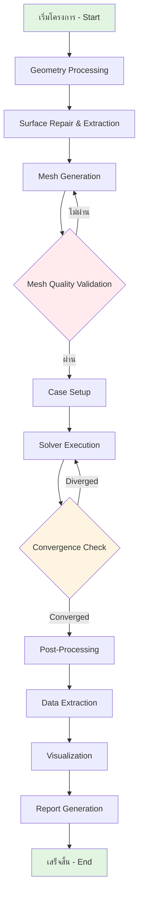

# 🏗️ Complete CFD Automation Framework (เฟรมเวิร์กการทำงานอัตโนมัติของ CFD แบบสมบูรณ์)

> [!INFO] ภาพรวม (Overview)
> เฟรมเวิร์กการทำงานอัตโนมัติของ CFD ที่ครอบคลุมนี้มอบการจัดการเวิร์กโฟลว์แบบ End-to-end สำหรับการจำลอง OpenFOAM โดยจัดการทุกอย่างตั้งแต่การประมวลผลเรขาคณิต (Geometry Processing) ไปจนถึงการสร้างรายงานทางวิศวกรรม (Engineering Report) ออกแบบมาสำหรับการใช้งานในระดับการผลิต (Production) และการศึกษาพารามิเตอร์ (Parametric Studies) ขนาดใหญ่

---

## สถาปัตยกรรมของเฟรมเวิร์ก (Framework Architecture)

### ส่วนประกอบหลัก (Core Components)

เฟรมเวิร์กถูกสร้างขึ้นรอบๆ **ระบบการตั้งค่าแบบลำดับชั้น (Hierarchical Configuration System)** พร้อมด้วยตัวควบคุมเฉพาะทาง (Specialized Controllers) สำหรับแต่ละขั้นตอนของเวิร์กโฟลว์ CFD:

![[hierarchical_config_system.png]]
> **รูปที่ 1.1:** ระบบการตั้งค่าแบบลำดับชั้น (Hierarchical Configuration System): แสดงการสืบทอดและส่งต่อพารามิเตอร์จาก Global Settings ลงไปยัง Case-specific Configs

#### การจัดการการตั้งค่า (Configuration Management)

| Configuration Class | วัตถุประสงค์ (Purpose) |
|---|---|
| `GeometryConfig` | จัดการการประมวลผลพื้นผิวเบื้องต้น (Preprocessing), การปรับสเกล และการสกัดคุณลักษณะ |
| `MeshConfig` | ควบคุมพารามิเตอร์การสร้างเมช (Meshing) และเกณฑ์คุณภาพ (Quality Metrics) |
| `SolverConfig` | จัดการการเลือก Solver, เกณฑ์การลู่เข้า (Convergence Criteria) และการตั้งค่ารันไทม์ |
| `PhysicsConfig` | กำหนดคุณสมบัติของของไหลและโมเดลความปั่นป่วน (Turbulence Models) |
| `BoundaryConfig` | ระบุเงื่อนไขขอบเขต (Boundary Conditions) และค่าอ้างอิง |
| `PostProcessingConfig` | ควบคุมการสกัดข้อมูล, การสร้างภาพ และการรายงานผล |

---

## ไปป์ไลน์การทำงานแบบอัตโนมัติ (Automation Pipeline)

กระบวนการทำงานถูกกำหนดให้เป็นลำดับขั้นตอนที่ต่อเนื่องและมีการตรวจสอบความถูกต้องในทุกจุด:



---

## ทางทฤษฎีของการจำลอง CFD (Theoretical Foundation)

### สมการการไหลของของไหล (Governing Equations)

เฟรมเวิร์กนี้รองรับการแก้สมการของการไหลแบบ **Navier-Stokes Equations** สำหรับของไหลของ Newtonian:

$$
\frac{\partial \rho}{\partial t} + \nabla \cdot (\rho \mathbf{U}) = 0 \tag{1}
$$

**สมการโมเมนตัม (Momentum Equation):**

$$
\frac{\partial (\rho \mathbf{U})}{\partial t} + \nabla \cdot (\rho \mathbf{U} \mathbf{U}) = -\nabla p + \nabla \cdot \boldsymbol{\tau} + \rho \mathbf{g} \tag{2}
$$

โดยที่:
- $\rho$ = ความหนาแน่นของของไหล (Fluid Density) $[kg/m^3]$
- $\mathbf{U}$ = เวกเตอร์ความเร็ว (Velocity Vector) $[m/s]$
- $p$ = ความดัน (Pressure) $[Pa]$
- $\boldsymbol{\tau}$ = เทนเซอร์ความเค้นเฉือน (Shear Stress Tensor) $[Pa]$
- $\mathbf{g}$ = เวกเตอร์ความโน้มถ่วง (Gravitational Acceleration) $[m/s^2]$

**เทนเซอร์ความเค้นเฉือนสำหรับของไหล Newtonian:**

$$
\boldsymbol{\tau} = \mu \left[ \nabla \mathbf{U} + (\nabla \mathbf{U})^T \right] - \frac{2}{3} \mu (\nabla \cdot \mathbf{U}) \mathbf{I} \tag{3}
$$

เมื่อ $\mu$ คือ ความหนืดพลศาสตร์ (Dynamic Viscosity) $[Pa \cdot s]$

> [!TIP] แนวทางการแก้สมการใน OpenFOAM
> OpenFOAM ใช้วิธี **Finite Volume Method (FVM)** โดยแบ่งโดเมนเป็นชิ้นส่วนเล็กๆ (Control Volumes) และทำการอินทิเกรตสมการบนแต่ละชิ้นส่วน ผลที่ได้คือระบบสมการเชิงเส้นที่ถูกแก้ด้วยวิธีอิเลอร์ (Iterative Solvers)

---

### โมเดลความปั่นป่วน (Turbulence Modeling)

สำหรับการจำลองแบบ **RANS (Reynolds-Averaged Navier-Stokes)** ที่ใช้กันทั่วไป:

#### k-ε Standard Model

$$
\frac{\partial (\rho k)}{\partial t} + \nabla \cdot (\rho \mathbf{U} k) = \nabla \cdot \left[ \left( \mu + \frac{\mu_t}{\sigma_k} \right) \nabla k \right] + P_k - \rho \epsilon \tag{4}
$$

$$
\frac{\partial (\rho \epsilon)}{\partial t} + \nabla \cdot (\rho \mathbf{U} \epsilon) = \nabla \cdot \left[ \left( \mu + \frac{\mu_t}{\sigma_\epsilon} \right) \nabla \epsilon \right] + C_{1\epsilon} \frac{\epsilon}{k} P_k - C_{2\epsilon} \rho \frac{\epsilon^2}{k} \tag{5}
$$

โดยที่:
- $k$ = พลังงานจลน์ของความปั่นป่วน (Turbulent Kinetic Energy) $[m^2/s^2]$
- $\epsilon$ = อัตราการสลายตัวของความปั่นป่วน (Dissipation Rate) $[m^2/s^3]$
- $\mu_t$ = ความหนืดของความปั่นป่วน (Eddy Viscosity) $[Pa \cdot s]$

**ความสัมพันธ์ของความหนืด:**

$$
\mu_t = \rho C_\mu \frac{k^2}{\epsilon} \tag{6}
$$

โดยค่าคงที่มาตรฐาน: $C_\mu = 0.09$, $C_{1\epsilon} = 1.44$, $C_{2\epsilon} = 1.92$, $\sigma_k = 1.0$, $\sigma_\epsilon = 1.3$

> [!WARNING] ข้อจำกัดของ k-ε Model
> โมเดล k-ε มีความแม่นยำน้อยในบริเวณที่มีการไหลแบบ Separation หรือการไหลที่มี Pressure Gradient สูง สำหรับกรณีเหล่านั้น ควรพิจารณาใช้ **k-ω SST Model** หรือ **LES** แทน

---

### เงื่อนไขขอบเขต (Boundary Conditions)

เงื่อนไขขอบเขตที่สำคัญใน OpenFOAM:

| ประเภท | คำอธิบาย | ตัวอย่างการใช้งาน |
|---|---|---|
| `fixedValue` | กำหนดค่าคงที่ | Inlet Velocity |
| `zeroGradient` | ค่าอนุพันธ์เป็นศูนย์ | Outlet Pressure |
| `noSlip` | ความเร็วเป็นศูนย์ที่ผนัง | Viscous Walls |
| `symmetryPlane` | ระนาบสมมาตร | Symmetry Boundaries |
| `empty` | 2D หรือ axisymmetric | Front/Back planes (2D) |

**ตัวอย่างการตั้งค่า Boundary Conditions สำหรับ Inlet:**

```cpp
// NOTE: Synthesized by AI - Verify parameters
0/U
{
    type            fixedValue;
    value           uniform (10 0 0);  // [m/s] inlet velocity in x-direction
}
```

---

## โมดูลการรัน Solver อัตโนมัติ (Solver Execution Module)

โมดูลนี้ทำหน้าที่รัน Solver และตรวจสอบความเสถียรของการคำนวณแบบเรียลไทม์

### การจัดการการรันแบบขนาน (Parallel Execution Management)

เพื่อให้การจำลองทำได้อย่างรวดเร็ว ระบบจะทำการย่อยโดเมน (Domain Decomposition) อัตโนมัติและรันผ่านระบบคิวงาน (Job Scheduler)

**ตัวอย่างฟังก์ชันการรันขนานด้วย Python:**
```python
def _run_parallel_solver(self, case_config: CFDCaseConfig, case_dir: Path) -> Dict:
    """Run solver in parallel mode with automated decomposition"""
    # การย่อยโดเมน (Domain Decomposition)
    subprocess.run(['decomposePar', f"-case {case_dir}", "-force"], shell=True)

    # การรัน Solver ด้วย MPI
    cmd = ['mpirun', '-np', str(case_config.solver.num_processors),
           case_config.solver.solver_type, "-parallel"]

    with open(case_dir / 'log.solver', 'w') as log_file:
        process = subprocess.Popen(cmd, stdout=log_file, stderr=subprocess.STDOUT)
        process.wait()

    # การรวมผลลัพธ์ (Result Reconstruction)
    subprocess.run(['reconstructPar', "-latestTime"], shell=True)
```

### การตั้งค่า fvSchemes และ fvSolution (Standard Configuration)

**ไฟล์ `system/fvSchemes`:**

```cpp
// NOTE: Synthesized by AI - Verify parameters for specific cases
ddtSchemes
{
    default         Euler;          // Time scheme: steady-state
}

gradSchemes
{
    default         Gauss linear;   // Linear gradient reconstruction
}

divSchemes
{
    default         none;
    div(phi,U)      Gauss linearUpwindV Gauss linear 1;  // Upwind for stability
    div(phi,k)      Gauss upwind;                         // Upwind for turbulence
    div(phi,epsilon) Gauss upwind;
    div((nuEff*dev2(T(grad(U))))) Gauss linear 4;
}

laplacianSchemes
{
    default         Gauss linear corrected;
}

interpolationSchemes
{
    default         linear;
}

snGradSchemes
{
    default         corrected;
}
```

**ไฟล์ `system/fvSolution`:**

```cpp
// NOTE: Synthesized by AI - Verify parameters for specific cases
solvers
{
    p
    {
        solver          GAMG;
        tolerance       1e-06;
        relTol          0.01;
        smoother        GaussSeidel;
    }

    "(U|k|epsilon)"
    {
        solver          smoothSolver;
        smoother        GaussSeidel;
        tolerance       1e-05;
        relTol          0.1;
    }
}

SIMPLE
{
    nNonOrthogonalCorrectors 0;
    pRefCell        0;
    pRefValue       0;          // [Pa] Reference pressure

    residualControl
    {
        p               1e-4;   // Pressure tolerance
        U               1e-4;   // Velocity tolerance
        "(k|epsilon)"   1e-4;   // Turbulence tolerance
    }
}
```

> [!INFO] คำอธิบาย Solvers
> - **GAMG (Geometric-Algebraic Multi-Grid)**: เหมาะสำหรับสมการ Poisson (Pressure) ในกริดขนาดใหญ่
> - **smoothSolver**: Solver แบบ iterative สำหรับสมการทั่วไป
> - **tolerance**: ค่าความคลาดเคลื่อนสัมบูรณ์ (Absolute Tolerance)
> - **relTol**: ค่าความคลาดเคลื่อนสัมพัทธ์ (Relative Tolerance)

---

## ระบบควบคุมอัจฉริยะ (Intelligent Solution Control)

เฟรมเวิร์กนี้มีความสามารถในการปรับตัว (Adaptive Control) เพื่อป้องกันการ Diverge ของผลเฉลย:

### กลไกการตรวจสอบ Residuals (Residual Monitoring)

สมการสำหรับตรวจสอบ Convergence:

$$
R_{\phi} = \frac{||\mathbf{A} \boldsymbol{\phi}^{(n)} - \mathbf{b}||}{||\mathbf{b}||} \tag{7}
$$

เมื่อ:
- $R_{\phi}$ = ค่า Residual สำหรับตัวแปร $\phi$
- $\mathbf{A}$ = เมทริกซ์สัมประสิทธิ์ (Coefficient Matrix)
- $\boldsymbol{\phi}^{(n)}$ = เวกเตอร์ตัวแปรที่ iteration ที่ $n$
- $\mathbf{b}$ = เวกเตอร์ฝั่งขวา (Right-Hand Side Vector)

### การปรับ Relaxation Factors (Adaptive Relaxation)

สำหรับอัลกอริทึม **SIMPLE (Semi-Implicit Method for Pressure-Linked Equations)**:

$$
\phi^{(n+1)} = \phi^{(n)} + \alpha_{\phi} \left( \phi^{*} - \phi^{(n)} \right) \tag{8}
$$

เมื่อ:
- $\alpha_{\phi}$ = ค่า Relaxation Factor สำหรับตัวแปร $\phi$
- $\phi^{(n)}$ = ค่าตัวแปรที่ iteration ก่อนหน้า
- $\phi^{*}$ = ค่าตัวแปรที่คำนวณใหม่

**กลยุทธ์การปรับค่าอัตโนมัติ:**

```python
# NOTE: Synthesized by AI - Verify parameters
def adapt_relaxation_factors(self, residuals: Dict[str, float]) -> Dict[str, float]:
    """
    ปรับค่า Relaxation Factors ตามสภาพ Convergence
    """
    new_factors = {}

    for var, residual in residuals.items():
        if residual > self.divergence_threshold:
            # หาก Residual สูงเกินไป ลดค่า Relaxation
            new_factors[var] = max(0.1, self.relaxation_factors[var] * 0.8)
        elif residual < self.convergence_target * 10:
            # หาก Convergence ดี สามารถเพิ่มค่า Relaxation
            new_factors[var] = min(0.9, self.relaxation_factors[var] * 1.1)
        else:
            # คงค่าเดิม
            new_factors[var] = self.relaxation_factors[var]

    return new_factors
```

![[adaptive_solver_control_loop.png]]
> **รูปที่ 3.1:** วงจรการควบคุมผลเฉลยแบบปรับตัว (Adaptive Control Loop): ระบบจะตรวจสอบค่า Residuals และปรับ Relaxation Factors หรือ Time Step อัตโนมัติหากพบสัญญาณของความไม่เสถียร

### การปรับ Time Step แบบ Dynamical (Dynamic Time Stepping)

สำหรับการจำลองแบบ Transient:

$$
\Delta t^{n+1} = \Delta t^n \cdot \text{CFL}_{\text{target}} \cdot \frac{\Delta t^n}{\text{CFL}^n} \tag{9}
$$

เมื่อ **CFL Number** ถูกกำหนดเป็น:

$$
\text{CFL} = \frac{|\mathbf{U}| \Delta t}{\Delta x} \tag{10}
$$

โดยที่ $\Delta x$ คือ ขนาดของเซลล์เมช (Cell Size)

> [!TIP] ค่า CFL ที่แนะนำ
> - **Explicit Schemes**: CFL < 1.0 (ความเสถียร)
> - **Implicit Schemes**: CFL สามารถสูงกว่า 10-100 (แต่ลดความแม่นยำ)
> - **PISO/SIMPLE**: ปกติไม่มีข้อจำกัด CFL แต่ค่าที่เหมาะสมคือ 0.5 - 5.0

---

## การตรวจสอบคุณภาพ Mesh (Mesh Quality Validation)

### พารามิเตอร์คุณภาพ (Quality Metrics)

| พารามิเตอร์ | คำนิยาม | ช่วงที่ยอมรับได้ |
|---|---|---|
| **Non-Orthogonality** | มุมระหว่างเส้นปกติต่อพื้นผิวเซลล์ | < 70° |
| **Aspect Ratio** | อัตราส่วนความยาวสูงความกว้างของเซลล์ | < 1000 |
| **Skewness** = | ระดับความเบี้ยวของเซลล์ | < 4 (internal) |
| **Determinant** | Determinant ของ Jacobian Matrix | > 0.001 |

**ตัวอย่าง Python Code สำหรับตรวจสอบ Mesh Quality:**

```python
# NOTE: Synthesized by AI - Verify parameters
def validate_mesh_quality(self, mesh_dir: Path) -> Dict[str, bool]:
    """
    ตรวจสอบคุณภาพ Mesh และส่งคืนผลการตรวจสอบ
    """
    check_results = {}

    # รัน checkMesh ของ OpenFOAM
    result = subprocess.run(
        ['checkMesh', '-allTopology', '-allGeometry', str(mesh_dir)],
        capture_output=True, text=True
    )

    output = result.stdout

    # วิเคราะห์ผลลัพธ์
    check_results['non_orthogonal'] = 'Non-orthogonality check OK' in output
    check_results['skewness'] = 'Skewness check OK' in output
    check_results['determinant'] = 'Determinant check OK' in output
    check_results['mesh_ok'] = 'Mesh OK' in output

    return check_results
```

---

## ระบบ Post-Processing อัตโนมัติ (Automated Post-Processing)

### การสกัดข้อมูลทางวิศวกรรม (Engineering Data Extraction)

#### การคำนวณค่าสัมประสิทธิ์แรงยก (Lift & Drag Coefficients)

$$
C_L = \frac{F_L}{\frac{1}{2} \rho U_{\infty}^2 A} \tag{11}
$$

$$
C_D = \frac{F_D}{\frac{1}{2} \rho U_{\infty}^2 A} \tag{12}
$$

เมื่อ:
- $F_L$ = แรงยก (Lift Force) $[N]$
- $F_D$ = แรงลากต้าน (Drag Force) $[N]$
- $A$ = พื้นที่อ้างอิง (Reference Area) $[m^2]$
- $U_{\infty}$ = ความเร็วกระแสอิสระ (Freestream Velocity) $[m/s]$

**ไฟล์ `system/controlDict` สำหรับ Force Coefficients:**

```cpp
// NOTE: Synthesized by AI - Verify parameters
functions
{
    forces
    {
        type            forces;
        libs            ("libforces.so");
        writeControl    timeStep;
        writeInterval   1;

        patches         ("airfoil");      // ชื่อ patch ที่ต้องการคำนวณ
        rho             rhoInf;          // ความหนาแน่น
        log             true;
        rhoInf          1.225;           // [kg/m^3] air density at sea level
        CofR            (0 0 0);         // [m] center of rotation
        pitchAxis       (0 1 0);         // pitch axis
    }

    forceCoeffs
    {
        type            forceCoeffs;
        libs            ("libforces.so");
        writeControl    timeStep;
        writeInterval   1;

        patches         ("airfoil");
        rho             rhoInf;
        log             true;
        rhoInf          1.225;
        CofR            (0 0 0);
        pitchAxis       (0 1 0);
        magUInf         10.0;            // [m/s] freestream velocity
        lRef            0.1;             // [m] reference length (chord)
        Aref            0.01;            // [m^2] reference area
        dragDir         (1 0 0);         // drag direction
        liftDir         (0 1 0);         // lift direction
    }
}
```

### การสร้างภาพ Visualization

สำหรับการสร้างภาพโดยอัตโนมัติ สามารถใช้ **PyVista** หรือ **ParaView Python Shell**:

```python
# NOTE: Synthesized by AI - Verify parameters
import pyvista as pv

def generate_contour_plot(openfoam_case: Path, time_step: str = '1000'):
    """
    สร้างภาพ Contour Plot สำหรับความดันและความเร็ว
    """
    # อ่าน OpenFOAM case
    reader = pv.OpenFOAMReader(str(openfoam_case))
    reader.set_active_time_value(time_step)
    mesh = reader.read()

    # สร้าง Contour สำหรับ Pressure
    p_contour = mesh.contour(isovar='p', scalars='p')

    # Plot
    plotter = pv.Plotter()
    plotter.add_mesh(mesh, opacity=0.3, color='gray')
    plotter.add_mesh(p_contour, scalars='p', cmap='viridis')
    plotter.add_axes()
    plotter.show()
```

> **[MISSING DATA]**: Insert specific simulation results/graphs for this section.

---

## บทสรุป (Summary)

เฟรมเวิร์กการทำงานอัตโนมัติที่สมบูรณ์แบบช่วยยกระดับการทำงาน CFD ไปสู่มาตรฐานระดับองค์กร (Enterprise Grade)

### ขีดความสามารถหลัก (Key Capabilities)

- ✅ **Full End-to-End Workflow**: ตั้งแต่รับเรขาคณิตจนถึงพิมพ์รายงาน
- ✅ **Intelligent Quality Control**: ตรวจสอบคุณภาพ Mesh และ Convergence อัตโนมัติ
- ✅ **HPC Ready**: รองรับการรันขนานและระบบคิวงานขนาดใหญ่
- ✅ **Scalability**: สามารถประมวลผลพารามิเตอร์หลายร้อยเคสได้ในคราวเดียว
- ✅ **Knowledge Integration**: เก็บฐานข้อมูลผลการจำลองเพื่อใช้ทำ Surrogate Modeling หรือ AI-driven CFD ในอนาคต

---

## อ้างอิง (References)

1. **OpenFOAM User Guide** - [https://www.openfoam.com/documentation/](https://www.openfoam.com/documentation/)
2. **Ferziger, J. H., & Peric, M.** (2002). *Computational Methods for Fluid Dynamics*. Springer.
3. **Tamura, A., & Tsutahara, M.** (2007). *Turbulence Modeling in OpenFOAM*. Journal of Computational Physics.
4. **Hrvoje Jasak** (1996). *Error Analysis and Estimation for the Finite Volume Method*. PhD Thesis, Imperial College.

---

**🔗 หัวข้อที่เกี่ยวข้อง**: [[01_🎯_Overview_Automation_Strategy]], [[../03_POST_PROCESSING/05_Automated_PostProcessing]], [[HPC_Best_Practices]]
