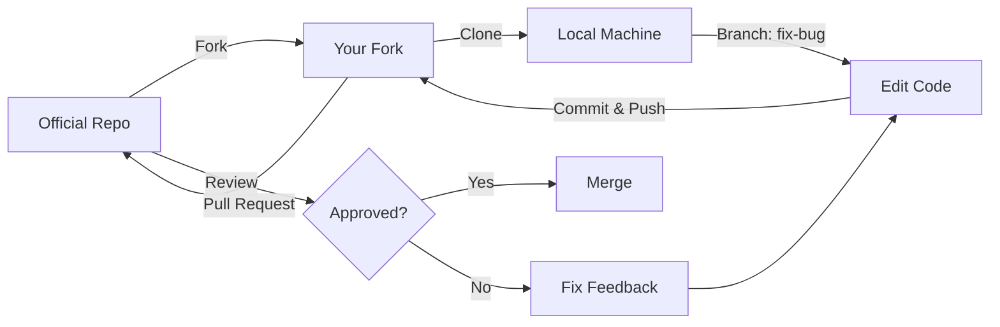

# 🌍 การมีส่วนร่วมกับชุมชนโอเพนซอร์ส (Open Source Contribution)

**วัตถุประสงค์การเรียนรู้ (Learning Objectives)**: เรียนรู้วิธีการเป็นส่วนหนึ่งของชุมชน OpenFOAM ที่ดี ไม่ใช่แค่ในฐานะ "ผู้ใช้" (User) แต่ในฐานะ "ผู้ร่วมสร้าง" (Contributor) ผ่านการรายงานบั๊ก, การปรับปรุงเอกสาร, และการส่งโค้ดกลับเข้าสู่โครงการหลัก
**ระดับความยาก**: ปานกลาง (Intermediate)

---

## 1. ทำไมต้อง Contibute?

OpenFOAM เติบโตได้เพราะชุมชน (Community) การที่คุณได้ใช้ซอฟต์แวร์มูลค่ามหาศาลนี้ฟรีๆ ก็เพราะมีคนนับพันช่วยกันพัฒนา การ contribute กลับช่วยให้:
1.  **แก้ปัญหาที่คุณเจอ**: ถ้าคุณเจอและแก้มัน คนอื่นก็จะไม่ต้องเจออีก
2.  **สร้าง Portfolio**: ชื่อของคุณจะปรากฏใน Commit history ซึ่งเป็นเครดิตที่ดีเยี่ยมสำหรับการสมัครงาน
3.  **เรียนรู้จากยอดฝีมือ**: โค้ดของคุณจะถูกรีวิว (Code Review) โดย Maintainer ระดับโลก ซึ่งเป็นโอกาสเรียนรู้ที่หาได้ยาก

---

## 2. ประเภทของการมีส่วนร่วม (Types of Contribution)

คุณไม่จำเป็นต้องเป็น C++ Wizard เพื่อเริ่ม contribute:

### 2.1 📝 Documentation (เอกสาร)
- **Typo Fixes**: แก้คำผิดใน User Guide หรือ Wiki
- **Tutorials**: เขียนบทความสอนหรือสร้าง Case ตัวอย่างใหม่ๆ
- **Translation**: แปลเอกสารเป็นภาษาไทยหรือภาษาอื่นๆ

### 2.2 🐛 Bug Reporting (การแจ้งปัญหา)
การแจ้งบั๊กอย่างละเอียดถือเป็นการช่วยที่ยิ่งใหญ่
- **Bad Report**: "simpleFoam ใช้งานไม่ได้ ช่วยด้วย!"
- **Good Report**: "simpleFoam ใน v2312 จบการทำงานด้วย Segfault เมื่อใช้ Turbulence Model $k-\omega$ SST กับ Mesh แบบ Non-orthogonal สูงๆ นี่คือไฟล์ log และ case ตัวอย่าง (Minimal Working Example) ที่ทำให้เกิดปัญหานี้ซ้ำได้..."

### 2.3 💻 Testing (การทดสอบ)
- โหลดเวอร์ชัน Dev (Nightly build) มาลองรันกับงานจริงเพื่อหา Regression (สิ่งที่เคยทำได้แต่ตอนนี้ทำไม่ได้แล้ว)

### 2.4 🛠️ Code Contribution (การเขียนโค้ด)
- **Bug Fixes**: แก้ไขบั๊กที่เจอ
- **Features**: เพิ่ม Boundary Condition หรือ Turbulence Model ใหม่
- **Optimization**: ทำให้โค้ดรันเร็วขึ้นหรือใช้แรมน้อยลง

---

## 3. มาตรฐานการเขียนโค้ด (Coding Standards)

OpenFOAM มีมาตรฐานการเขียนโค้ดที่เคร่งครัด (เพื่อความอ่านง่ายและการบำรุงรักษา)

### 3.1 Naming Conventions
- **Class**: `PascalCase` (e.g., `NavierStokes`)
- **Function**: `camelCase` (e.g., `solvePressureByPiso`)
- **Variable**: `camelCase` (e.g., `velocityField`)
- **Member Variable**: ลงท้ายด้วย `_` (e.g., `mesh_`) *หมายเหตุ: OpenFOAM เวอร์ชันต่างกันอาจมีกฏต่างกันเล็กน้อย โปรดเช็ค `Guideline` ของแต่ละ Fork*

### 3.2 Indentation
- ใช้ **4 Spaces** (ห้ามใช้ Tab)
- ปีกกา `{` และ `}` ต้องอยู่บรรทัดใหม่เสมอ (Allman style)

```cpp
// ❌ Bad
if (condition) {
  doSomething();
}

// ✅ Good
if (condition)
{
    doSomething();
}
```

---

## 4. เวิร์กโฟลว์การส่ง Pull Request (PR Workflow)



### ขั้นตอน (Step-by-Step)

1.  **Fork**: กดปุ่ม Fork บน GitLab/GitHub ไปยังบัญชีของคุณ
2.  **Clone**: `git clone https://gitlab.com/YOUR_USERNAME/openfoam.git`
3.  **Branch**: สร้างกิ่งใหม่เสมอ `git checkout -b fix/turbulence-model-crash`
4.  **Edit**: แก้ไขโค้ดและทดสอบ
5.  **Commit**: เขียน Commit Message ให้ชัดเจน (ดู [[03_Version_Control_Git]])
6.  **Push**: `git push origin fix/turbulence-model-crash`
7.  **Pull Request (Merge Request)**: ไปที่หน้าเว็บต้นทาง แล้วกด "New Merge Request" อธิบายสิ่งที่คุณแก้

---

## 5. ลิขสิทธิ์และสัญญาอนุญาต (Licensing)

OpenFOAM ใช้สัญญาอนุญาต **GPL (General Public License)**

> [!WARNING] **GPL Cheatsheet**
> - **Freedom**: คุณสามารถใช้, แก้ไข, และแจกจ่าย OpenFOAM ได้ฟรี
> - **Copyleft**: ถ้าคุณแก้ไข OpenFOAM และ **"แจกจ่าย"** (Distribute) ตัวที่แก้ไขนั้น คุณ **"ต้อง"** เปิดเผย Source Code ที่แก้ไขด้วยสัญญาอนุญาต GPL เช่นกัน (ปิดโค้ดไม่ได้)
> - **Private Use**: ถ้าคุณแก้โค้ดใช้เองในบริษัท (ไม่ได้ขายหรือแจก Binary ให้คนนอก) คุณ **"ไม่จำเป็น"** ต้องเปิดเผยโค้ด

---

## 6. การสร้าง Minimal Working Example (MWE)

หัวใจของการรายงานบั๊กที่ดีคือ MWE:

1.  **Minimal**: ตัดทุกอย่างที่ไม่จำเป็นออก (ใช้ Mesh หยาบๆ, 2D แทน 3D, Physics พื้นฐาน)
2.  **Working** (Reproducible): คนอื่นรันแล้วต้องเจอปัญหาเดียวกันทันที
3.  **Example**: แนบไฟล์ Case (เช่น `blockMeshDict`, `controlDict`) หรือสคริปต์ `Allrun`

**ตัวอย่างสคริปต์สร้าง MWE:**

```bash
#!/bin/bash
# MWE script: Reproduce segmentation fault in simpleFoam
cd ${0%/*} || exit 1

# 1. Setup minimal case
cp -r $FOAM_TUTORIALS/incompressible/simpleFoam/pitzDaily .
sed -i 's/kEpsilon/kOmegaSST/' pitzDaily/constant/turbulenceProperties

# 2. Run
cd pitzDaily
blockMesh
simpleFoam > log.simpleFoam 2>&1

# 3. Check error
if grep -q "Segmentation fault" log.simpleFoam; then
    echo "Bug Reproduced!"
else
    echo "Bug NOT Reproduced."
fi
```

---

## 🧠 ตรวจสอบความเข้าใจ (Concept Check)

1.  **ถาม:** ถ้าฉันแก้ไขโค้ด OpenFOAM เพื่อใช้ simulation ภายในบริษัทของฉันเองเพื่อออกแบบผลิตภัณฑ์ ฉันจำเป็นต้องส่งโค้ดกลับไปให้สาธารณะหรือไม่ตามสัญญา GPL?
    <details>
    <summary>เฉลย</summary>
    <b>ตอบ:</b> **ไม่จำเป็น** สัญญา GPL บังคับให้เปิดเผย Source Code ก็ต่อเมื่อมีการ "แจกจ่าย" (Distribute) ซอฟต์แวร์นั้นให้ผู้อื่น (เช่น ขาย หรือให้ดาวน์โหลด) การใช้ภายในองค์กร (Internal Use) ถือเป็นการใช้ส่วนตัว ไม่จำเป็นต้องเปิดเผยโค้ด
    </details>

2.  **ถาม:** ทำไมเราถึงไม่ควร Commit ตรงๆ เข้า `master` branch ของเรา แล้วส่ง PR?
    <details>
    <summary>เฉลย</summary>
    <b>ตอบ:</b> เพราะหาก PR นั้นยังไม่ถูก Merge และเราต้องการทำ Feature อื่นต่อ การ Commit ทับใน `master` จะทำให้ PR นั้นปนเปื้อนด้วยโค้ดใหม่ที่ไม่เกี่ยวข้องกัน (Poluted PR) การแยก Branch (Topic Branching) ช่วยให้เราทำหลายๆ PR พร้อมกันได้โดยไม่ตีกัน
    </details>
