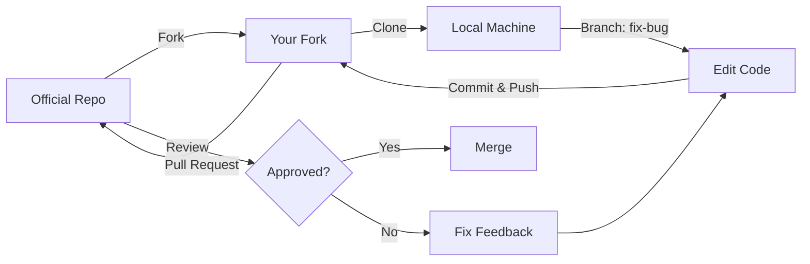

# 🌍 Open Source Contribution | การมีส่วนร่วมกับชุมชนโอเพนซอร์ส

> [!TIP] **Why Community Contribution Matters | ทำไมการมีส่วนร่วมกับชุมชนถึงสำคัญ?**
> This content relates to **Domain E: Coding/Customization** and **Professional Practice**, guiding you through professional engagement with the OpenFOAM community through Bug Reporting, Documentation improvements, and Code Contribution.
>
> **Why Important for Simulation?**
> - **Sustainability**: OpenFOAM grows because of its community. Contribution ensures the software improves and endures
> - **Reliability**: Bug reporting and testing new versions helps ensure your solvers run stably
> - **Learning**: Code review from experts improves your C++ skills, which translates to better simulations

---

## 🎯 Learning Objectives | วัตถุประสงค์การเรียนรู้

Learn how to become a valuable part of the OpenFOAM community, not just as a "User" but as a "Contributor" through bug reporting, documentation improvements, and code contributions.

**Difficulty Level**: Intermediate | ระดับความยาก: ปานกลาง

**By the end of this section, you will be able to:**
- Understand different types of contributions to OpenFOAM
- Follow OpenFOAM coding standards and conventions
- Navigate the Git workflow for submitting Pull Requests
- Create effective Minimal Working Examples (MWE) for bug reports
- Understand GPL licensing implications for your work

---

## 1. WHAT is Open Source Contribution? | การมีส่วนร่วมกับชุมชน OpenFOAM คืออะไร?

> [!NOTE] **📂 OpenFOAM Context**
> This section relates to **Domain E: Coding/Customization** and **Professional Practice**, specifically working with:
> - **Source Code Structure**: `src/` directory (e.g., `src/finiteVolume`, `src/transportModels`)
> - **Tutorials**: `tutorials/` directory (for creating example cases)
> - **Documentation**: `doc/` directory or project Wiki
> - **Git Repository**: GitLab/GitHub for OpenFOAM (e.g., [OpenFOAM-git](https://develop.openfoam.com/Development/openfoam))
> - **Issue Tracker**: Bug reporting systems (Mantis, GitLab Issues, or GitHub Issues)

### 1.1 Defining Contribution | การมีส่วนร่วมคืออะไร

Contribution in the OpenFOAM context means participating in the development, improvement, and maintenance of OpenFOAM software—a community-driven tool developed by scientists and engineers worldwide. You don't need to be a C++ Expert to start contributing—even detailed bug reports, typo fixes, or creating example cases all provide valuable help to the community.

OpenFOAM thrives because of its community. Your ability to use this valuable software free of charge exists because thousands have contributed. Contributing back helps you:

1. **Fix problems you encounter**: If you find and fix it, others won't face the same issue
2. **Build portfolio**: Your name appears in commit history—excellent credit for job applications
3. **Learn from experts**: Your code gets reviewed by world-class maintainers—a rare learning opportunity

### 1.2 Types of Contribution | ประเภทของการมีส่วนร่วม

You can contribute in many forms—not all require coding:

#### 📝 Documentation (เอกสาร)
- **Typo Fixes**: Correct errors in User Guide or Wiki
- **Tutorials**: Write tutorials or create new example cases
- **Translation**: Translate documentation to Thai or other languages

#### 🐛 Bug Reporting (การแจ้งปัญหา)
Detailed bug reports provide immense help:

**Bad Report**: "simpleFoam doesn't work, help!"
**Good Report**: "simpleFoam in v2312 crashes with Segfault when using1$k-\omega1SST turbulence model with high non-orthogonal mesh. Here is the log file and a Minimal Working Example that reproduces the issue..."

#### 💻 Testing (การทดสอบ)
- Download dev versions (Nightly builds) and test with real work to find regressions (things that worked before but don't now)

#### 🛠️ Code Contribution (การเขียนโค้ด)
- **Bug Fixes**: Fix bugs you encounter
- **Features**: Add new Boundary Conditions or Turbulence Models
- **Optimization**: Make code run faster or use less memory

---

## 2. WHY Contribute Back to the Community? | ทำไมต้อง Contribute กลับสู่ชุมชน?

### 2.1 Personal Benefits | ประโยชน์ต่อตัวคุณเอง

#### Learning and Skill Development | การเรียนรู้และพัฒนาทักษะ

**Code Review from Experts**
Your code gets reviewed by world-class maintainers—a golden opportunity for valuable feedback on C++ programming, code structure design, and OpenFOAM Best Practices.

**Deep System Understanding**
Fixing or adding features forces you to learn OpenFOAM's internal structure in detail, improving your understanding of solver mechanics and physics.

#### Building Reputation and Career Opportunities | การสร้างชื่อเสียงและโอกาสในอาชีพ

**Portfolio**
Your name in Git History provides clear evidence of your CFD and C++ programming capabilities.

**Networking**
Working with the community opens opportunities to connect with experts, researchers, and engineers worldwide.

**Career Opportunities**
Many CFD industry companies formally value OpenFOAM experience—being a Contributor is a clear advantage.

### 2.2 Community and Software Benefits | ประโยชน์ต่อชุมชนและซอฟต์แวร์

#### Software Sustainability | ความยั่งยืนของซอฟต์แวร์

OpenFOAM grows and improves because of its community. More contributors make the software stronger and more complete. Community bug fixes and new features enable OpenFOAM to compete with commercial software.

#### Reliability and Stability | ความน่าเชื่อถือและความเสถียร

Bug reporting and testing new versions helps find problems before they affect real usage. More testers = better bug finding.

#### Knowledge Sharing | การแบ่งปันความรู้

Writing tutorials and documentation reduces difficulty for newcomers. A strong community is a valuable resource for problem-solving and collaborative learning.

---

## 3. HOW to Contribute Professionally | วิธีการ Contribute อย่างมืออาชีพ

### 3.1 Coding Standards | มาตรฐานการเขียนโค้ด

> [!NOTE] **📂 OpenFOAM Context**
> This section relates to **Domain E: Coding/Customization**, specifically:
> - **Source Files**: `src/` directory (e.g., `src/finiteVolume/fields/fvPatchFields/`)
> - **Header Files (`.H`)**: Class and Interface declarations
> - **Implementation Files (`.C`)**: Actual code implementation
> - **Make Files**: `Make/files` (specifies files to compile), `Make/options` (specifies include paths and libraries)
> - **Coding Guidelines**: `doc/Guidelines` in Source Tree or [OpenFOAM Coding Style Guide](https://develop.openfoam.com/Development/openfoam/-/blob/master/doc/Guidelines.md)

OpenFOAM has strict coding standards (for readability and maintainability):

#### 3.1.1 Naming Conentions

| Element | Convention | Example |
|---------|------------|---------|
| **Class** | `PascalCase` | `NavierStokes`, `turbulenceModel` |
| **Function** | `camelCase` | `solvePressureByPiso`, `correctBoundaryConditions` |
| **Variable** | `camelCase` | `velocityField`, `turbulence` |
| **Member Variable** | `camelCase_` | `mesh_`, `runTime_` |

*Note: Different OpenFOAM versions may have slight variations. Check each Fork's `Guideline`*

#### 3.1.2 Indentation

- Use **4 Spaces** (no Tabs)
- Braces `{` and `}` must always be on new lines (Allman style)

```cpp
// ❌ Bad - Uses Tabs and same-line braces
if (condition) {
  doSomething();
}

// ✅ Good - Uses 4 Spaces and separate brace lines
if (condition)
{
    doSomething();
}
```

#### 3.1.3 License Header

Every source code file must have the standard GPL License Header:

```cpp
/*---------------------------------------------------------------------------*\
  =========                 |
  \\      /  F ield         | OpenFOAM: The Open Source CFD Toolbox
   \\    /   O peration     |
    \\  /    A nd           | www.openfoam.com
     \\/     M anipulation  |
-------------------------------------------------------------------------------
    Copyright (C) 2023 OpenFOAM Foundation
    Copyright (C) 2023 Your Name
-------------------------------------------------------------------------------
License
    This file is part of OpenFOAM.

    OpenFOAM is free software: you can redistribute it and/or modify it
    under the terms of the GNU General Public License as published by
    the Free Software Foundation, either version 3 of the License, or
    (at your option) any later version.

    OpenFOAM is distributed in the hope that it will be useful, but WITHOUT
    ANY WARRANTY; without even the implied warranty of MERCHANTABILITY or
    FITNESS FOR A PARTICULAR PURPOSE.  See the GNU General Public License
    for more details.

    You should have received a copy of the GNU General Public License
    along with OpenFOAM.  If not, see <http://www.gnu.org/licenses/>.

\*---------------------------------------------------------------------------*/
```

### 3.2 Pull Request Workflow | เวิร์กโฟลว์การส่ง Pull Request

> [!NOTE] **📂 OpenFOAM Context**
> This section relates to **Domain E: Coding/Customization** and **Version Control**:
> - **Git Workflow**: Using Git for Source Code management
> - **Branching**: Feature Branch (e.g., `fix/turbulence-bug`, `feature/new-bc`)
> - **Remote Repository**: GitLab ([develop.openfoam.com](https://develop.openfoam.com)) or GitHub (for Community Forks like [OpenFOAM/OpenFOAM-dev](https://github.com/OpenFOAM/OpenFOAM-dev))
> - **Merge Request (MR)**: Code review screen on GitLab/GitHub
> - **Continuous Integration (CI)**: Automated testing when PR is submitted (e.g., `foamInstallationTest`, `foamRunTutorials`)



#### Step-by-Step Process | ขั้นตอนทีละขั้น

**1. Fork**: Click Fork button on GitLab/GitHub to your account
   - Go to [develop.openfoam.com](https://develop.openfoam.com/Development/openfoam)
   - Click "Fork" to create a copy in your account

**2. Clone**: Download repository to your machine
   ```bash
   git clone https://gitlab.com/YOUR_USERNAME/openfoam.git
   cd openfoam
   ```

**3. Branch**: Always create a new branch (Topic Branching)
   ```bash
   git checkout -b fix/turbulence-model-crash
   ```
   *Note: Don't commit directly to `master` as it pollutes your PR*

**4. Edit**: Modify code and test
   - Edit Source Code according to the bug you're fixing
   - Compile to check for Syntax Errors: `wmake`
   - Test with Test Case: `foamRunTutorials`

**5. Commit**: Write clear commit messages
   ```bash
   git add .
   git commit -m "FIX: turbulence model crash with high non-orthogonal mesh

   - Added boundary check for cell non-orthogonality
   - Improved error message for invalid mesh quality
   - Fixes issue #1234"
   ```
   *See [[04_Version_Control_Git]] for more details*

**6. Push**: Send code to your fork
   ```bash
   git push origin fix/turbulence-model-crash
   ```

**7. Pull Request (Merge Request)**: Submit PR to Official Repo
   - Go to the upstream web page (develop.openfoam.com)
   - Click "New Merge Request"
   - Select Branch: `fix/turbulence-model-crash` → `master`
   - Write description:
     - **Title**: Summary of fix (e.g., "Fix turbulence model crash")
     - **Description**: Detail the problem, root cause, solution, and testing method
     - **Related Issues**: Reference related issues (e.g., "Closes #1234")

**8. Respond to Review**: Address feedback from maintainers
   - Read comments carefully
   - Fix code according to suggestions
   - Push updates: `git push`
   - Respond to questions in the MR page

### 3.3 Licensing | ลิขสิทธิ์และสัญญาอนุญาต

> [!NOTE] **📂 OpenFOAM Context**
> This section relates to **Legal & Professional Practice**:
> - **License Files**: `COPYING` file in root of OpenFOAM Source Tree
> - **Source Code Headers**: Every `.C` and `.H` file has a License Header attached
> - **Third-Party Libraries**: `etc/config.sh/` specifies used libraries (e.g., MPI, Metis, Scotch)
> - **GPL Compliance**: Critical for distributing software developed from OpenFOAM

OpenFOAM uses the **GPL (General Public License)**

> [!WARNING] **GPL Cheatsheet**
> - **Freedom**: You can use, modify, and distribute OpenFOAM freely
> - **Copyleft**: If you modify OpenFOAM and **"Distribute"** that modified version, you **"MUST"** disclose the modified Source Code under GPL license as well (cannot close source)
> - **Private Use**: If you modify code for internal company use (not selling or giving binaries to outsiders), you **"DON'T HAVE TO"** disclose code

**Understanding Examples**:
- ✅ **Internal Company Use**: Modify OpenFOAM for company simulation → **No code disclosure required**
- ✅ **Sell Services**: Provide CFD Simulation services using OpenFOAM → **No code disclosure required** (not distributing software)
- ❌ **Sell Software**: Modify OpenFOAM and package as commercial software → **Must disclose code** (distributing software)

### 3.4 Creating Minimal Working Examples (MWE) | การสร้าง Minimal Working Example

> [!NOTE] **📂 OpenFOAM Context**
> This section relates to **Bug Reporting & Debugging**, specifically:
> - **Case Structure**: Minimal case files (e.g., `0/`, `constant/`, `system/`)
> - **Dictionary Files**: `system/blockMeshDict`, `system/controlDict`, `constant/turbulenceProperties`
> - **Tutorials**: `$FOAM_TUTORIALS` directory used as base for MWE
> - **Log Files**: `log.*` files critical for Bug Traceback
> - **Allrun Script**: Automation script for running Case to Reproduce problem

The heart of good bug reporting is MWE:

**1. Minimal**: Cut everything unnecessary
   - Use coarse mesh (few cells) to reduce run time
   - Use 2D instead of 3D (if bug reproduces)
   - Use basic physics (e.g., Laminar instead of Turbulence)

**2. Working** (Reproducible): Others must encounter the same problem immediately
   - Provide complete case (all necessary files)
   - Include `Allrun` script that runs automatically
   - Specify OpenFOAM version used

**3. Example**: Attach case files or scripts
   - Attach `blockMeshDict`, `controlDict`, and other key files
   - Attach Log file showing error
   - Include instructions for running and expectations

**Example MWE Script**:

```bash
#!/bin/bash
# MWE script: Reproduce segmentation fault in simpleFoam
cd1${0%/*} || exit 1

# 1. Setup minimal case
echo "Setting up minimal case..."
cp -r1$FOAM_TUTORIALS/incompressible/simpleFoam/pitzDaily .
cd pitzDaily

# Modify to trigger the bug
sed -i 's/kEpsilon/kOmegaSST/' constant/turbulenceProperties
sed -i 's/0.5/0.95/' system/blockMeshDict  # High non-orthogonality

# 2. Run
echo "Running mesh generation..."
blockMesh > log.blockMesh 2>&1

echo "Running solver..."
simpleFoam > log.simpleFoam 2>&1

# 3. Check error
if grep -q "Segmentation fault" log.simpleFoam; then
    echo "✗ Bug Reproduced!"
    echo "Check log.simpleFoam for details"
else
    echo "✓ Bug NOT Reproduced."
fi
```

### 3.5 Best Practices for Contributors | Best Practices สำหรับ Contributor

#### Before Submitting PR | ก่อน Submit PR

1. **Test Thoroughly**: Run all related tutorials
2. **Check Coding Style**: Ensure code follows guidelines
3. **Write Test Cases**: If adding features, include test cases
4. **Update Documentation**: If changing API or adding features, update User Guide

#### During Review | ระหว่าง Review

1. **Be Patient**: Maintainers may take days or weeks to review
2. **Open to Feedback**: Don't defend your code—view it as free learning
3. **Answer Questions**: If maintainers ask, respond promptly and thoroughly
4. **Ask for Guidance**: If you don't understand feedback, ask politely

#### After Merge | หลัง Merge

1. **Celebrate a Bit**: You're now part of OpenFOAM!
2. **Learn from Other PRs**: Review others' PRs to learn best practices
3. **Help Review Other PRs**: If you're expert in that area, review to give back to community

---

## 🧠 Concept Check

**1. Q: If I modify OpenFOAM code for internal company simulation for product design, must I submit code back publicly under GPL?**

<details>
<summary>Answer / เฉลย</summary>

<b>Answer:</b> **No, not required**. GPL only requires Source Code disclosure when "Distributing" software to others (e.g., selling or providing downloads). Internal organizational use (Internal Use) counts as personal use—no code disclosure required.
</details>

**2. Q: Why shouldn't we commit directly to our `master` branch and then submit PR?**

<details>
<summary>Answer / เฉลย</summary>

<b>Answer:</b> Because if that PR hasn't been merged and you want to work on another feature, committing to `master` will pollute that PR with unrelated new code (Polluted PR). Separate branches (Topic Branching) let you work on multiple PRs simultaneously without conflicts.
</details>

**3. Q: Why is a Good Bug Report as important as fixing bugs?**

<details>
<summary>Answer / เฉลย</summary>

<b>Answer:</b> Because if Bug Report isn't clear, maintainers cannot Reproduce the problem and thus cannot fix it. Providing a good MWE saves maintainer time and increases chances of rapid bug fixes.
</details>

---

## 📋 Key Takeaways | สรุปสำคัญ

### What to Apply | สิ่งสำคัญที่ควรนำไปใช้

**1. Multiple Contribution Forms**
- Not required to be C++ Expert
- Detailed bug reports, typo fixes, or tutorials all have value

**2. Follow Code Standards Strictly**
- Use 4 Spaces (no Tabs)
- Use Allman style for braces
- Name following Convention: `PascalCase` (Class), `camelCase` (Function/Variable)
- Include License Header in every file

**3. Always Use Topic Branching**
- Don't commit directly to `master`
- Create new branch for each Feature/Bugfix
- Use clear branch names: `fix/...`, `feature/...`

**4. Create MWE for Bug Reports**
- **Minimal**: Cut unnecessary elements
- **Working**: Can Reproduce
- **Example**: Attach case files and scripts

**5. Understand GPL License**
- Internal organizational use → No code disclosure required
- Software distribution → Must disclose code (Copyleft)

**6. Have Good Attitude**
- Be patient waiting for review
- Open to feedback
- Help review others' PRs to give back to community

### Benefits of Contribution | ประโยชน์ของการ Contribute

- **Learning**: Code review from experts → Better C++ and OpenFOAM skills
- **Portfolio**: Name in Git History → Career credentials
- **Network**: Connect with global CFD community
- **Help Community**: Make OpenFOAM better and more sustainable

---

## 📖 Related Documentation | เอกสารที่เกี่ยวข้อง

### Internal Links | เอกสารภายใน

- **Overview**: [00_Overview.md](00_Overview.md) — Professional Practice overview
- **Previous**: [02_Documentation_Standards.md](02_Documentation_Standards.md) — Documentation standards
- **Next**: [04_Version_Control_Git.md](04_Version_Control_Git.md) — Git Version Control

### External Resources | เอกสารภายนอก

- [OpenFOAM Coding Style Guide](https://develop.openfoam.com/Development/openfoam/-/blob/master/doc/Guidelines.md)
- [How to Write a Good Bug Report](https://developer.mozilla.org/en-US/docs/Mozilla/QA/Bug_writing_guidelines)
- [GNU General Public License](https://www.gnu.org/licenses/gpl-3.0.html)