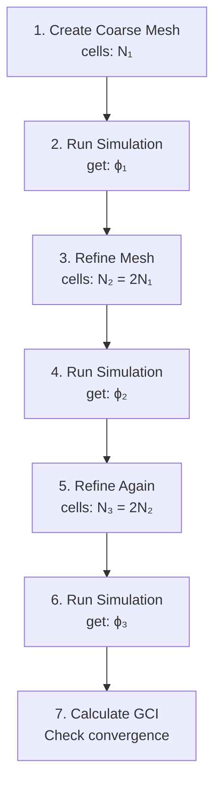

# Testing and Quality Assurance

การทดสอบและประกันคุณภาพ

> **ลิงก์ที่เกี่ยวข้อง**:
> - ดูภาพรวม Professional Practice → [00_Overview.md](./00_Overview.md)
> - ดู Version Control → [04_Version_Control_Git.md](./04_Version_Control_Git.md)
> - ดู Documentation → [02_Documentation_Standards.md](./02_Documentation_Standards.md)

---

## 📋 บทนำ (Introduction)

ในโลกการทำงานจริง การทำ CFD simulation ให้ "รันผ่าน" นั้นไม่พอ ต้องมั่นใจว่าผลลัพธ์ถูกต้อง (Accuracy) และสามารถทำซ้ำได้ (Reproducibility) **Testing & QA** คือกระบวนการที่แยก "มือสมัครเล่น" ออกจาก "มืออาชีพ"

ในบทนี้คุณจะเรียนรู้:
- **Validation vs Verification**: ต่างกันอย่างไร?
- **Automated Testing**: สร้างระบบทดสอบอัตโนมัติ
- **Grid Convergence**: ตรวจสอบความละเอียด mesh
- **Regression Tests**: มั่นใจว่าการแก้โค้ดไม่ทำลายสิ่งที่ทำงานได้อยู่แล้ว

> [!WARNING] **Real-world Impact**
> ในโครงการอุตสาหกรรม ข้อผิดพลาด CFD อาจนำไปสู่:
> - การออกแบบที่ล้มเหลว (Design Failure)
> - สูญเสียเวลาและเงินลงทุน
> - เสื่อมเสียชื่อเสียง
> **Testing คือประกันคุณภาพที่ป้องกันปัญหาเหล่านี้**

---

## 🎯 วัตถุประสงค์การเรียนรู้ (Learning Objectives)

เมื่อสำเร็จบทนี้ คุณจะสามารถ:

1. **อธิบายความแตกต่างระหว่าง Validation และ Verification**
2. **สร้าง Grid Convergence Study** เพื่อตรวจสอบความละเอียดของ mesh
3. **เขียน Automated Test Scripts** สำหรับทดสอบ OpenFOAM cases
4. **ตรวจสอบผลลัพธ์** เทียบกับ benchmark หรือ experimental data
5. **สร้าง Regression Test Suite** เพื่อมั่นใจว่าการแก้ไขไม่ทำลายสิ่งที่ทำงานได้อยู่แล้ว

---

## 🔍 Validation vs Verification

### What - คืออะไร?

**Validation** และ **Verification** คือสองกระบวนการที่แตกต่างกันในการทดสอบความถูกต้องของ simulation:

| แนวคิด | คำถาม | เป้าหมาย | ตัวอย่าง |
|:--------|:--------|:-----------|:---------|
| **Verification** | "Are we solving the equations **correctly**?" | ตรวจสอบว่าโค้ดถูกต้อง | เปรียบเทียบกับ Analytical solution |
| **Validation** | "Are we solving the **right** equations?" | ตรวจสอบว่าโมเดลทางฟิสิกส์ถูกต้อง | เปรียบเทียบกับ Experimental data |

> **[!TIP] จำง่ายๆ**
> - **Verification**: "คำนวณถูกไหม?" (Code check)
> - **Validation**: "โมเดลถูกไหม?" (Physics check)

### Why - ทำไมสำคัญ?

ในการทำงานจริง:
- **Verification** ช่วยมั่นใจว่า solver ทำงานถูกต้อง ไม่มีบั๊กในการคำนวณ
- **Validation** ช่วยมั่นใจว่าเราเลือกโมเดลทางฟิสิกส์ที่เหมาะสมกับปัญหา
- การขาดกระบวนการใดกระบวนการหนึ่งอาจนำไปสู่ผลลัพธ์ที่ผิดพลาดแม้ว่า simulation จะรันผ่าน

### How - ทำอย่างไร?

**Verification Example:**
```bash
# ทดสอบ simpleFoam กับ Flow ในท่อ (Pipe Flow)
# Analytical solution: ค่า f (friction factor) สามารถคำนวณได้จากสมการ
# ทำ Simulation → คำนวณ f → เปรียบเทียบ
```

**Validation Example:**
```bash
# ทดสอบ Airfoil ด้วย turbulent flow
# ทำ Simulation → เปรียบเทียบ Cl, Cd กับ Experimental data จาก Wind tunnel
```

---

## 📊 Grid Convergence Study (GCI)

### What - คืออะไร?

**Grid Convergence Index (GCI)** คือเมตริกที่ใช้วัดว่า mesh resolution ที่ใช้มีความละเอียดเพียงพอหรือยัง โดยเปรียบเทียบผลลัพธ์จาก mesh 3 ระดับความละเอียดที่ต่างกัน

### Why - ทำไมต้องทำ?

Mesh ที่หยาบเกินไป → ผลลัพธ์ไม่แม่นยำ
Mesh ที่ละเอียดเกินไป → สิ้นเปลืองเวลาและทรัพยากร
**Grid Convergence** ช่วยหา "จุดพอดี" (Optimal mesh resolution)

ในโครงการอุตสาหกรรม:
- การใช้ mesh ที่ละเอียดเกินไปอาจทำให้ใช้เวลาคำนวณนานเกินไป
- การใช้ mesh ที่หยาบเกินไปอาจทำให้ผลลัพธ์ไม่น่าเชื่อถือ

### How - ทำอย่างไร?

#### ขั้นตอนการทำ GCI



#### ตัวอย่างการทำ GCI

**สถานการณ์**: ต้องการหาค่า Drag coefficient ($C_d$) ของ Cylinder

```python
# gci_study.py
import pandas as pd
import numpy as np

# ผลลัพธ์จาก 3 mesh resolutions
results = {
    'mesh': ['coarse', 'medium', 'fine'],
    'cells': [50000, 100000, 200000],
    'Cd': [0.85, 0.82, 0.81]  # ค่า Cd ที่ได้
}

df = pd.DataFrame(results)

# คำนวณ Grid Convergence Index (GCI)
r = 2  # refinement ratio (N₂/N₁)

# คำนวณ order of convergence (p)
ϕ1, ϕ2, ϕ3 = df['Cd']
p = np.abs(np.log((ϕ3 - ϕ2) / (ϕ2 - ϕ1)) / np.log(r))

print(f"Order of convergence: p = {p:.2f}")
```

#### เกณฑ์การตัดสิน

| เงื่อนไข | ความหมาย |
|:---------|:----------|
| **GCI_fine < 5%** | Mesh ละเอียดพอ (Converged) |
| **5% < GCI < 15%** | ควร refine mesh เพิ่ม |
| **GCI > 15%** | Mesh หยาบเกินไป ต้อง refine |

---

## 🤖 Automated Testing Framework

### What - คืออะไร?

**Automated Testing** คือระบบทดสอบที่สามารถรันเองโดยไม่ต้องใช้คนดูแลทุกขั้นตอน ประกอบด้วยหลายประเภท:

| Test Type | ขอบเขต | เวลาที่ใช้ | ตัวอย่าง |
|-----------|--------|------------|----------|
| **Unit** | ฟังก์ชันเดียว / Utility | วินาที - นาที | ทดสอบ `checkMesh` |
| **Integration** | หลาย components | นาที - ชั่วโมง | Mesh → Solver → Post-process |
| **System** | Full workflow | ชั่วโมง | ทดสอบ case ตั้งแต่เริ่มจบ |
| **Regression** | ป้องกันการเสีย | ทุกครั้งก่อน commit | เปรียบเทียบกับ baseline |

### Why - ทำไมสำคัญ?

ในการพัฒนา OpenFOAM:
- **Unit Tests** ช่วยตรวจจับบั๊กใน utility/ฟังก์ชันเดี่ยว
- **Integration Tests** ช่วยมั่นใจว่า components ต่างๆ ทำงานร่วมกันได้
- **Regression Tests** ป้องกันการทำลายฟีเจอร์ที่ทำงานได้อยู่แล้วเมื่อมีการแก้โค้ด
- **System Tests** มั่นใจว่า case ทั้งหมดทำงานได้ตั้งแต่เริ่มถึงจบ

### How - ทำอย่างไร?

#### Allrun with Automatic Check

```bash
#!/bin/bash
# test_allrun.sh - รันและตรวจสอบอัตโนมัติ

cd1${0%/*} || exit 1

# รัน case
./Allrun

# เช็คว่ารันสำเร็จไหม
if [1$? -ne 0 ]; then
    echo "❌ Simulation FAILED!"
    exit 1
fi

# ตรวจสอบ residuals
echo "Checking residuals..."
latest_log=$(ls -t log.* | head -1)
if grep -q "solution singularity"1$latest_log; then
    echo "❌ Solution diverged!"
    exit 1
fi

# ตรวจสอบ mesh quality
echo "Checking mesh..."
if ! checkMesh > /dev/null 2>&1; then
    echo "⚠️  Mesh has issues (check log.checkMesh)"
fi

# เปรียบเทียบกับค่าที่คาดหวัง
echo "Validating results..."
if [ -f "expected_results.txt" ]; then
    diff -q expected_results.txt postProcessing/results.txt
    if [1$? -ne 0 ]; then
        echo "⚠️  Results differ from expected!"
    else
        echo "✅ Results match expected!"
    fi
fi

echo "✅ All tests passed!"
```

#### Automated Test Suite

```bash
#!/bin/bash
# run_all_tests.sh - รันทุก test cases

test_dir="tests"
failed_cases=()
passed=0
failed=0

for case in1$test_dir/*/; do
    case_name=$(basename "$case")
    echo "Testing:1$case_name"

    # รัน test
    (cd "$case" && ./Allrun > test.log 2>&1)

    # เช็คผล
    if [1$? -eq 0 ]; then
        echo "✅1$case_name PASSED"
        ((passed++))
    else
        echo "❌1$case_name FAILED"
        failed_cases+=("$case_name")
        ((failed++))
    fi
done

echo ""
echo "=========================================="
echo "Test Summary:"
echo "  Passed:1$passed"
echo "  Failed:1$failed"
echo "=========================================="

if [1$failed -gt 0 ]; then
    echo "Failed cases:"
    for c in "${failed_cases[@]}"; do
        echo "  -1$c"
    done
    exit 1
fi
```

#### ตรวจสอบผลลัพธ์ด้วย Python

```python
# validate_results.py
import pandas as pd
import numpy as np

def validate_forces(case_dir):
    """ตรวจสอบค่าแรงที่ได้"""

    # อ่านผลลัพธ์จาก forces function object
    forces_file = f"{case_dir}/postProcessing/forces/0/forces.dat"
    data = pd.read_csv(forces_file, skiprows=4, sep='\s+',
                      names=['time', 'Fx', 'Fy', 'Fz', 'Mx', 'My', 'Mz'])

    # ค่าเฉลี่ย 100 time steps สุดท้าย
    final = data.tail(100)
    Cd_mean = final['Fx'].mean()
    Cd_std = final['Fx'].std()

    print(f"Cd = {Cd_mean:.4f} ± {Cd_std:.4f}")

    # เช็คว่า converged ไหม
    if Cd_std / abs(Cd_mean) < 0.01:  # น้อยกว่า 1%
        print("✅ Forces converged!")
        return True
    else:
        print("❌ Forces NOT converged!")
        return False

# ใช้งาน
validate_forces(".")
```

---

## 📈 Regression Testing

### What - คืออะไร?

**Regression Test** = ทดสอบว่า "การเปลี่ยนแปลง" (code update, mesh refinement) ไม่ทำให้ผลลัพธ์ที่เคยถูกต้องกลายเป็นผิดพลาด

### Why - ทำไมสำคัญ?

ในการพัฒนาซอฟต์แวร์:
- เมื่อแก้บั๊กหรือเพิ่มฟีเจอร์ อาจทำให้ส่วนอื่นที่เคยทำงานได้เสียได้
- Regression testing ช่วยตรวจจับการถดย้อน (regression) ของคุณภาพ
- ช่วยมั่นใจว่าการอัปเกรด OpenFOAM version ไม่ทำให้ผลลัพธ์เปลี่ยน
- เป็นหลักประกันคุณภาพที่สำคัญในโครงการระยะยาว

### How - ทำอย่างไร?

#### สร้าง Baseline Results

```bash
#!/bin/bash
# create_baseline.sh - สร้างผลลัพธ์อ้างอิง

case_dir="baseline_case"

# รัน simulation
(cd1$case_dir && ./Allrun)

# บันทึกผลลัพธ์ที่สำคัญ
cp1$case_dir/postProcessing/forces/0/forces.dat baseline_forces.dat
cp1$case_dir/postProcessing/probes/0/p baseline_pressure.dat

echo "✅ Baseline created!"
```

#### ทดสอบเทียบกับ Baseline

```python
# regression_test.py
import pandas as pd
import numpy as np

def regression_test(current_file, baseline_file, tolerance=0.02):
    """
    เปรียบเทียบผลลัพธ์ปัจจุบันกับ baseline

    Args:
        tolerance: ค่าที่ยอมรับได้ (default 2%)
    """

    # อ่านข้อมูล
    current = pd.read_csv(current_file, skiprows=4, sep='\s+')
    baseline = pd.read_csv(baseline_file, skiprows=4, sep='\s+')

    # ค่าเฉลี่ยสุดท้าย
    current_val = current.tail(100).mean()
    baseline_val = baseline.tail(100).mean()

    # คำนวณ % difference
    diff = abs((current_val - baseline_val) / baseline_val) * 100

    print(f"Current: {current_val:.4f}")
    print(f"Baseline: {baseline_val:.4f}")
    print(f"Difference: {diff:.2f}%")

    if diff < tolerance * 100:
        print("✅ REGRESSION TEST PASSED")
        return True
    else:
        print(f"❌ REGRESSION TEST FAILED (diff > {tolerance*100}%)")
        return False

# ใช้งาน
regression_test("postProcessing/forces/0/forces.dat",
                "baseline_forces.dat")
```

---

## 🧪 Unit Testing for Utilities

### What - คืออะไร?

**Unit Testing** คือการทดสอบ component เดี่ยว (เช่น custom utility) โดยแยกจากระบบที่ใหญ่กว่า

### Why - ทำไมสำคัญ?

- ตรวจจับบั๊กใน utility ตั้งแต่เริ่มพัฒนา
- ทำให้แก้ไขโค้ดได้อย่างมั่นใจ
- ช่วย document การทำงานของ utility

### How - ทำอย่างไร?

#### ทดสอบ Custom Utility

```bash
#!/bin/bash
# test_custom_utility.sh

# สร้าง test case ง่ายๆ
test_case="test_util"
mkdir -p1$test_case
cd1$test_case

# สร้าง mesh ง่ายๆ
blockMesh > log.blockMesh 2>&1

# รัน custom utility
myCustomUtility > log.utility 2>&1

# ตรวจสอบ output
if [ ! -f "output_field.dat" ]; then
    echo "❌ Utility did not create output!"
    exit 1
fi

# ตรวจสอบค่าที่ผิดปกติ
if grep -q "nan\|inf\|NaN" output_field.dat; then
    echo "❌ Output contains NaN/Inf!"
    exit 1
fi

echo "✅ Unit test passed!"
```

---

## 📋 Quick Reference

| ประเภท | วัตถุประสงค์ | เครื่องมือ |
|:-------|:-------------|:----------|
| **Verification** | ตรวจสอบโค้ดถูกต้อง | Analytical solution, MMS |
| **Validation** | ตรวจสอบฟิสิกส์ถูกต้อง | Experimental data |
| **GCI** | ตรวจสอบ mesh | 3 mesh levels, GCI calculation |
| **Unit Test** | ทดสอบ utility | bash/python test script |
| **Regression** | ป้องกันการเสีย | Baseline comparison |

---

## 📝 แบบฝึกหัด (Exercises)

### ระดับง่าย (Easy)
1. **True/False**: Validation คือการตรวจสอบว่าโค้ดถูกต้อง
   <details>
   <summary>คำตอบ</summary>
   ❌ เท็จ - Validation คือการตรวจสอบว่าโมเดลฟิสิกส์ถูกต้อง (Verification คือการตรวจสอบโค้ด)
   </details>

2. **เลือกตอบ**: GCI (Grid Convergence Index) ใช้ทำอะไร?
   - a) ตรวจสอบว่า mesh ถูกต้อง
   - b) ตรวจสอบว่า mesh ละเอียดพอ
   - c) ตรวจสอบว่า solver ทำงานถูกต้อง
   - d) ตรวจสอบว่า boundary conditions ถูกต้อง
   <details>
   <summary>คำตอบ</summary>
   ✅ b) ตรวจสอบว่า mesh ละเอียดพอ (Grid convergence)
   </details>

### ระดับปานกลาง (Medium)
3. **อธิบาย**: แตกต่างระหว่าง Unit Test และ Integration Test คืออะไร?
   <details>
   <summary>คำตอบ</summary>
   - **Unit Test**: ทดสอบ component เดียว (เช่น utility หนึ่งๆ) แยกจากส่วนอื่น
   - **Integration Test**: ทดสอบการทำงานร่วมกันของหลาย components (mesh + solver + post-process)
   </details>

4. **เขียนสคริปต์**: จงเขียน bash script เพื่อตรวจสอบว่า simulation diverged หรือไม่
   <details>
   <summary>คำตอบ</summary>
   ```bash
   #!/bin/bash
   log_file="log.simpleFoam"

   if grep -q "solution singularity"1$log_file; then
       echo "❌ Solution DIVERGED!"
       exit 1
   else
       echo "✅ Simulation converged"
   fi
   ```
   </details>

### ระดับสูง (Hard)
5. **Hands-on**: ทำ Grid Convergence Study กับ Tutorial case (เช่น cavity) โดยสร้าง 3 mesh resolutions และคำนวณ GCI

6. **Project**: สร้าง Regression Test Suite สำหรับ Tutorial case ที่คุณชอบ โดย:
   - สร้าง baseline results
   - เขียน script เปรียบเทียบกับ baseline
   - ทดสอบโดยเปลี่ยน parameter เล็กน้อยแล้วดูว่า test จะ detect ได้หรือไม่

---

## 🧠 Concept Check

<details>
<summary><b>1. Validation และ Verification ต่างกันอย่างไร?</b></summary>

| แนวคิด | คำถาม | เป้าหมาย |
|:--------|:--------|:-----------|
| **Verification** | "คำนวณถูกไหม?" | ตรวจสอบโค้ดถูกต้อง (vs Analytical solution) |
| **Validation** | "โมเดลถูกไหม?" | ตรวจสอบฟิสิกส์ถูกต้อง (vs Experimental data) |

</details>

<details>
<summary><b>2. Grid Convergence Study ทำไมสำคัญ?</b></summary>

**3 เหตุผลหลัก:**
1. **หา mesh resolution ที่เหมาะสม** (ไม่หยาบเกินไป/ละเอียดเกินไป)
2. **ประเมินความแม่นยำ** ของผลลัพธ์
3. **ประหยัดเวลาและทรัพยากร** (ไม่ refine โดยไม่จำเปลือง)
</details>

<details>
<summary><b>3. Regression Test ช่วยอะไร?</b></summary>

ช่วย **มั่นใจว่าการเปลี่ยนแปลง** (code update, mesh refinement, boundary condition change) **ไม่ทำลายสิ่งที่ทำงานได้อยู่แล้ว**

ตัวอย่าง: คุณอัปเกรด OpenFOAM version → รัน regression test → ถ้าผ่าน → มั่นใจว่า behavior ยังเหมือนเดิม
</details>

---

## 📚 Key Takeaways

### สิ่งสำคัญที่ควรนำไปใช้

1. **Validation ≠ Verification**
   - Verification: ตรวจสอบว่าคำนวณถูกต้อง (เทียบกับ analytical solution)
   - Validation: ตรวจสอบว่าใช้โมเดลที่ถูกต้อง (เทียบกับ experimental data)

2. **Grid Convergence จำเป็นสำหรับผลลัพธ์ที่เชื่อถือได้**
   - ต้องทดสอบอย่างน้อย 3 mesh resolutions
   - GCI < 5% แสดงว่า mesh ละเอียดพอ

3. **Automated Testing ช่วยประหยัดเวลาและลดข้อผิดพลาด**
   - Unit tests สำหรับ utilities
   - Integration tests สำหรับ workflow
   - Regression tests เพื่อป้องกันการถดย้อย

4. **Baseline Results คือหลักประกันคุณภาพ**
   - สร้าง baseline เมื่อ result ถูกต้อง
   - เปรียบเทียบทุกครั้งที่มีการเปลี่ยนแปลง
   - ตั้งค่า tolerance ที่เหมาะสม (ปกติ 1-2%)

### เชื่อมโยงกับ Professional Practice

- **Documentation**: บันทึก test procedures และ results
- **Version Control**: เก็บ test scripts และ baseline data ใน Git
- **Project Organization**: สร้าง `tests/` directory ใน project structure

---

## 📖 เอกสารที่เกี่ยวข้อง

- **ภาพรวม:** [00_Overview.md](00_Overview.md) — ภาพรวม Professional Practice
- **Project Organization:** [01_Project_Organization.md](01_Project_Organization.md) — โครงสร้างโปรเจกต์
- **Documentation:** [02_Documentation_Standards.md](02_Documentation_Standards.md) — มาตรฐานการเขียนเอกสาร
- **Version Control:** [04_Version_Control_Git.md](04_Version_Control_Git.md) — การใช้ Git