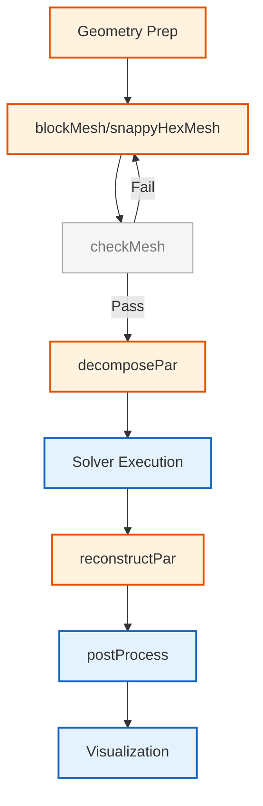

# ภาพรวม OpenFOAM Utilities (OpenFOAM Utilities Overview)

OpenFOAM Utilities คือกระดูกสันหลังของการประมวลผลในเวิร์กโฟลว์ CFD สมัยใหม่ โดยมีเครื่องมือเฉพาะทางมากกว่า 170 รายการที่ช่วยในการจัดการงานซ้ำซ้อน การสร้างเวิร์กโฟลว์ที่ซับซ้อน และขยายขีดความสามารถของ OpenFOAM ให้ครอบคลุมทุกความต้องการทางวิศวกรรม

---

## 1. ระบบนิเวศของ OpenFOAM Utility (The Utility Ecosystem)

### 1.1 ปรัชญาหลัก (Core Philosophy)

Utilities คือแอปพลิเคชันแบบ Command-line ที่ออกแบบมาเพื่อจัดการแง่มุมเฉพาะของเวิร์กโฟลว์ CFD ซึ่งแตกต่างจาก Solvers ตรงที่ไม่ได้คำนวณฟิสิกส์ของการไหลโดยตรง แต่จะเน้นที่:

- **Pre-processing**: การสร้างเมช, การย่อยโดเมน, การกำหนดค่าเริ่มต้น
- **Mesh Manipulation**: การตรวจสอบคุณภาพและการปรับปรุงความละเอียด
- **Post-processing**: การวิเคราะห์ข้อมูลและการแสดงภาพ
- **Automation**: การเขียนสคริปต์และการประมวลผลแบบกลุ่ม (Batch Processing)

> [!INFO] ความแตกต่างระหว่าง Solver และ Utility
> - **Solver**: คำนวณสมการกำลังดุลย์ (Governing Equations) และแก้สมการเชิงอนุพันธ์
> - **Utility**: จัดการข้อมูล เมช และผลลัพธ์ แต่ไม่แก้สมการฟิสิกส์โดยตรง

### 1.2 สถาปัตยกรรมของ Utility (System Architecture)

ยูทิลิตี้ทุกตัวมีโครงสร้างที่เป็นมาตรฐานเพื่อให้ง่ายต่อการพัฒนาและใช้งาน:

- **`argList.H`**: จัดการคำสั่งและอาร์กิวเมนต์ที่ป้อนเข้ามา
- **`fvMesh.H`**: อินเทอร์เฟซสำหรับเข้าถึงข้อมูล Mesh
- **`timeSelector.H`**: ควบคุมการเลือกช่วงเวลาในการประมวลผล

#### โครงสร้างของ Utility แบบมาตรฐาน

โครงสร้างพื้นฐานของ Utility ใน OpenFOAM สามารถแสดงได้ดังนี้:

```cpp
// Standard OpenFOAM utility structure template
#include "fvCFD.H"
#include "timeSelector.H"

int main(int argc, char *argv[])
{
    // Handle command-line arguments and set up time control
    timeSelector::addOptions();
    argList::addNote("Description of utility functionality");

    #include "setRootCaseLists.H"
    #include "createTime.H"
    #include "createMesh.H"

    // Select time directories to process
    instantList timeDirs = timeSelector::select
    (
        runTime.times(),
        args
    );

    // Loop through all time directories
    forAll(timeDirs, timeI)
    {
        runTime.setTime(timeDirs[timeI], timeI);

        // Read field data
        #include "createFields.H"

        // Perform utility-specific operations
        // ... operations ...

        Info<< "Processed time = " << runTime.timeName() << nl;
    }

    return 0;
}
```

> **Source**: `.applications/utilities/preProcessing/mapFields/mapFields.C`
> 
> **Explanation**: โครงสร้างของ Utility ทุกตัวใน OpenFOAM จะเริ่มต้นด้วยการ include header files พื้นฐาน จัดการ command-line arguments ผ่าน `argList` และ `timeSelector` จากนั้นจึงสร้าง mesh object และวนลูปผ่านทุก time directory เพื่อประมวลผลข้อมูล
>
> **Key Concepts**:
> - `timeSelector::addOptions()`: เพิ่มตัวเลือก command-line สำหรับเลือกช่วงเวลา
> - `setRootCaseLists.H`: Macro สำหรับตั้งค่า root directory และ case directory
> - `createTime.H` และ `createMesh.H`: Macro สำหรับสร้าง time และ mesh objects
> - `forAll(timeDirs, timeI)`: Loop ผ่านทุก time directory ที่ถูกเลือก

---

## 2. หมวดหมู่ของ Utility และการจัดกลุ่ม (Categories & Organization)

### 2.1 Mesh Utilities (85+ เครื่องมือ)

ครอบคลุมตั้งแต่การสร้างเมชหกเหลี่ยมแบบโครงสร้าง (**blockMesh**) ไปจนถึงการสร้างเมชสำหรับเรขาคณิตที่ซับซ้อน (**snappyHexMesh**) และการตรวจสอบคุณภาพเมช (**checkMesh**)

#### สมการพื้นฐานของ Mesh Quality

การประเมินคุณภาพของเมชใช้เกณฑ์ทางเรขาคณิตและคณิตศาสตร์:

$$
\text{Non-Orthogonality} = \max\left[\left(1 - \frac{\mathbf{S}_f \cdot \mathbf{d}}{|\mathbf{S}_f| |\mathbf{d}|}\right) \times 100\right]
$$

$$
\text{Aspect Ratio} = \frac{\Delta_{max}}{\Delta_{min}}
$$

$$
\text{Skewness} = \frac{|\mathbf{d} - \mathbf{d}_{ideal}|}{|\mathbf{d}_{ideal}|}
$$

โดยที่:
- $\mathbf{S}_f$ = เวกเตอร์พื้นที่ผิวหน้าเซลล์ (Face area vector)
- $\mathbf{d}$ = เวกเตอร์ระยะห่างระหว่างเซนทรอยด์ของเซลล์ข้างเคียง
- $\Delta_{max}, \Delta_{min}$ = ขนาดเซลล์สูงสุดและต่ำสุด

> [!WARNING] เกณฑ์คุณภาพเมชที่แนะนำ
> - **Non-Orthogonality**: < 70° (ideal: < 50°)
> - **Aspect Ratio**: < 1000 (ideal: < 100)
> - **Skewness**: < 4 (ideal: < 2)

#### ตัวอย่างการตั้งค่า `checkMesh`

```cpp
// Mesh quality control dictionary for checkMesh utility
FoamFile
{
    version     2.0;
    format      ascii;
    class       dictionary;
    object      meshQualityDict;
}

// Mesh quality checking thresholds
maxNonOrthogonal 70;
maxBoundarySkewness 4;
maxInternalSkewness 4;
maxConcave 80;
minFlatness 0.5;
minVol 1e-13;
minTetQuality 1e-30;
minArea -1;
minTwist 0.02;
minDeterminant 0.001;
minFaceWeight 0.05;
minVolRatio 0.01;
minTriangleTwist -1;
nSmoothScale 4;
errorReduction 0.75;
```

> **Source**: `.applications/test/patchRegion/cavity_pinched/system/decomposeParDict`
> 
> **Explanation**: ไฟล์ `meshQualityDict` ใช้กำหนดเกณฑ์คุณภาพเมชสำหรับ `checkMesh` utility แต่ละพารามิเตอร์ค่า threshold ที่แตกต่างกัน เช่น `maxNonOrthogonal` สำหรับ non-orthogonality angle, `maxBoundarySkewness` สำหรับ skewness ที่ boundary ฯลฯ
>
> **Key Concepts**:
> - `maxNonOrthogonal`: มุม non-orthogonality สูงสุดที่อนุญาต (70 องศา)
> - `maxBoundarySkewness`/`maxInternalSkewness`: ค่า skewness สูงสุดที่ boundary และ internal
> - `minVol`: ปริมาตรเซลล์ต่ำสุด (หลีกเลี่ยง negative volume)
> - `minDeterminant`: ดีเทอร์มิแนนต์ของ transformation matrix ต่ำสุด

### 2.2 Post-Processing Utilities (25+ เครื่องมือ)

เน้นการแปลงข้อมูลไปสู่รูปแบบที่มนุษย์เข้าใจได้ เช่น **foamToVTK** สำหรับ ParaView และการคำนวณปริมาณอนุพัทธ์ผ่านเครื่องมือ **postProcess**

#### การคำนวณ Gradient และ Divergence

กระบวนการคำนวณปริมาณอนุพัทธ์ใช้หลักการของ Finite Volume Method:

$$
\nabla \phi = \frac{1}{V_P} \sum_f \phi_f \mathbf{S}_f
$$

$$
\nabla \cdot \mathbf{u} = \frac{1}{V_P} \sum_f \mathbf{u}_f \cdot \mathbf{S}_f
$$

โดยที่:
- $V_P$ = ปริมาตรของเซลล์
- $\phi_f$ = ค่าของฟิลด์ที่ผิวหน้า
- $\mathbf{u}_f$ = เวกเตอร์ความเร็วที่ผิวหน้า
- $\mathbf{S}_f$ = เวกเตอร์พื้นที่ผิวหน้า

#### ตัวอย่างการใช้งาน `postProcess`

```bash
# Calculate vorticity field
postProcess -func "vorticity"

# Calculate wall shear stress
postProcess -func "wallShearStress"

# Calculate pressure coefficient (magnitude of velocity first)
postProcess -func "mag(U)" -latestTime
postProcess -func "Cp" -latestTime

# Generate surface sampling
postProcess -func surfaces
```

> **Source**: `.applications/utilities/preProcessing/mapFields/mapFields.C`
> 
> **Explanation**: `postProcess` utility ใช้สำหรับคำนวณ derived fields หลังจากการจำลองเสร็จสิ้น โดยสามารถระบุ function objects ผ่าน `-func` flag และเลือกเวลาที่ต้องการผ่าน `-latestTime` หรือ `-time`
>
> **Key Concepts**:
> - `-func`: ระบุชื่อ function object ที่ต้องการคำนวณ
> - `-latestTime`: ประมวลผลเฉพาะ time directory ล่าสุด
> - Function objects ถูกกำหนดใน `system/controlDict` หรือไฟล์ dictionary แยก

#### การตั้งค่า `postProcess` ในไฟล์ `functions`

```cpp
// Function objects dictionary for post-processing
functions
{
    // Vorticity calculation
    vorticity1
    {
        type            vorticity;
        functionObjectLibs ("libfieldFunctionObjects.so");
        writeControl    timeStep;
        writeInterval   10;
    }

    // Wall shear stress calculation
    wallShearStress1
    {
        type            wallShearStress;
        functionObjectLibs ("libfieldFunctionObjects.so");
        writeControl    timeStep;
        writeInterval   10;
    }

    // Pressure coefficient calculation
    Cp
    {
        type            surfaceRegion;
        functionObjectLibs ("libfieldFunctionObjects.so");
        writeControl    timeStep;
        writeInterval   10;
        surfaceFormat   none;
        regionType      patch;
        name            inlet;
        operation       none;

        fields
        (
            p
            U
        );

        Cp
        {
            $p;
            result      Cp;
        }
    }
}
```

> **Source**: `.applications/utilities/preProcessing/mapFields/mapFields.C`
> 
> **Explanation**: Function objects ถูกกำหนดใน dictionary และถูก execute ระหว่างการจำลองหรือหลังการจำลองผ่าน `postProcess` utility แต่ละ function object มี `type`, `writeControl`, และ `writeInterval` เพื่อควบคุมการเขียนผลลัพธ์
>
> **Key Concepts**:
> - `type`: ประเภทของ function object (เช่น vorticity, wallShearStress)
> - `functionObjectLibs`: Library ที่มี function object implementation
> - `writeControl`/`writeInterval`: ควบคุมความถี่ในการเขียนผลลัพธ์
> - `regionType`: พื้นที่ที่จะคำนวณ (patch, surface, ฯลฯ)

### 2.3 Parallel Processing Utilities (4 เครื่องมือ)

เครื่องมือที่สำคัญที่สุดคือ **decomposePar** สำหรับการย่อยโดเมนก่อนรันขนาน และ **reconstructPar** สำหรับรวบรวมผลลัพธ์กลับคืนมา

#### สมการของ Domain Decomposition

การแบ่งโดเมนใช้หลักการของ Graph Partitioning:

$$
\min \sum_{i=1}^{N} \sum_{j=i+1}^{N} w_{ij} \cdot \delta(p_i, p_j)
$$

โดยที่:
- $w_{ij}$ = น้ำหนักของการเชื่อมต่อระหว่างเซลล์ $i$ และ $j$
- $\delta(p_i, p_j)$ = ฟังก์ชันที่เท่ากับ 1 ถ้าเซลล์อยู่คนละ partition และ 0 ถ้าอยู่ partition เดียวกัน
- $N$ = จำนวนเซลล์ทั้งหมด

> [!TIP] กลยุทธ์การแบ่งโดเมน
> - **simple**: แบ่งตามแกน X, Y, Z เหมาะกับเรขาคณิตที่เป็นระเบียบ
> - **scotch**: อัตโนมัติและมีประสิทธิภาพสูง
> - **hierarchical**: ผสม simple + scorch เหมาะกับระบบ HPC

#### ตัวอย่างการตั้งค่า `decomposePar`

```cpp
/*--------------------------------*- C++ -*----------------------------------*\
  =========                 |
  \\      /  F ield         | OpenFOAM: The Open Source CFD Toolbox
   \\    /   O peration     | Website:  https://openfoam.org
    \\  /    A nd           | Version:  10
     \\/     M anipulation  |
\*---------------------------------------------------------------------------*/
FoamFile
{
    format      ascii;
    class       dictionary;
    note        "mesh decomposition control dictionary";
    object      decomposeParDict;
}
// * * * * * * * * * * * * * * * * * * * * * * * * * * * * * * * * * * * * * //

// Number of subdomains (processors)
numberOfSubdomains  4;

//- Keep owner and neighbour on same processor for faces in zones:
// preserveFaceZones (heater solid1 solid3);

//- Keep owner and neighbour on same processor for faces in patches:
//  (makes sense only for cyclic patches)
//preservePatches (cyclic_half0 cyclic_half1);

//- Decomposition method: scotch, hierarchical, simple, metis, manual, multiLevel
method          hierarchical;
// method          simple;
// method          metis;
// method          manual;
// method          multiLevel;
// method          structured;  // does 2D decomposition of structured mesh

// Simple method coefficients (for method simple)
simpleCoeffs
{
    n           (4 1 1);  // 4 divisions in X, 1 in Y, 1 in Z
    delta       0.001;
}

// Hierarchical method coefficients (for method hierarchical)
hierarchicalCoeffs
{
    n           (4 1 1);
    order       xyz;
}

// Scotch method coefficients (for method scotch)
scotchCoeffs
{
    // Optional processor weights for load balancing
    // processorWeights
    // (
    //     1
    //     1
    //     1
    //     1
    // );
    // writeGraph  true;
    // strategy "b";
}

// Metis method coefficients (for method metis)
metisCoeffs
{
 /*
    processorWeights
    (
        1
        1
        1
        1
    );
  */
}

// Manual method coefficients (for method manual)
manualCoeffs
{
    dataFile    "decompositionData";
}

// Structured method coefficients (for method structured)
structuredCoeffs
{
    // Patches to do 2D decomposition on. Structured mesh only; cells have
    // to be in 'columns' on top of patches.
    patches     (movingWall);

    // Method to use on the 2D subset
    method      scotch;
}

//// Is the case distributed? Note: command-line argument -roots takes
//// precedence
//distributed     yes;
//// Per slave (so nProcs-1 entries) the directory above the case.
//roots
//(
//    "/tmp"
//    "/tmp"
//);

// ************************************************************************* //
```

> **Source**: `.applications/test/patchRegion/cavity_pinched/system/decomposeParDict`
> 
> **Explanation**: ไฟล์ `decomposeParDict` ใช้ควบคุมการแบ่งโดเมนสำหรับ parallel processing โดยมีหลายวิธีการ decomposition (simple, scotch, hierarchical, metis, manual, multiLevel, structured) แต่ละวิธีมี coefficients dictionary ของตัวเองเพื่อกำหนดพารามิเตอร์เฉพาะ
>
> **Key Concepts**:
> - `numberOfSubdomains`: จำนวน processors ที่ต้องการใช้
> - `method`: วิธีการ decomposition (scotch เป็นค่าเริ่มต้นที่นิยม)
> - `simpleCoeffs`: สำหรับวิธี simple - แบ่งตามแกน X, Y, Z
> - `hierarchicalCoeffs`: สำหรับวิธี hierarchical - แบ่งเป็นระดับชั้น
> - `scotchCoeffs`: สำหรับวิธี scotch - graph partitioning อัตโนมัติ
> - `preserveFaceZones`/`preservePatches`: รักษา connectivity บน zones/patches ที่ระบุ

---

## 3. การผสานรวมกับเวิร์กโฟลว์ (Workflow Integration)

เพื่อให้การทำงานมีประสิทธิภาพ ยูทิลิตี้เหล่านี้มักถูกรันต่อเนื่องกันในรูปแบบไปป์ไลน์:


> **Figure 1:** แผนภูมิแสดงลำดับการทำงาน (Workflow) ในการใช้งาน Utilities ร่วมกับ Solver ของ OpenFOAM โดยเน้นการตรวจสอบคุณภาพเมชและการจัดการข้อมูลแบบขนาน (Parallel Processing) ก่อนนำไปแสดงผล

### 3.1 การสร้าง Automation Script

ตัวอย่างสคริปต์ Bash สำหรับ automation:

```bash
#!/bin/bash
# Automated OpenFOAM workflow script

# 1. Generate mesh using blockMesh
blockMesh

# 2. Check mesh quality and save to log
checkMesh > mesh_check.log

# 3. Verify if mesh passes quality criteria
if grep -q "Failed" mesh_check.log; then
    echo "Mesh quality check failed!"
    exit 1
fi

# 4. Decompose domain for parallel processing
decomposePar

# 5. Run solver in parallel with 4 processors
mpirun -np 4 solverName -parallel

# 6. Reconstruct parallel results
reconstructPar

# 7. Post-processing operations
postProcess -func "vorticity"
foamToVTK

# 8. Clean up temporary processor directories
rm -rf processor*

echo "Simulation completed successfully!"
```

> **Source**: `.applications/utilities/parallelProcessing/decomposePar/decomposePar.C`
> 
> **Explanation**: สคริปต์ Bash นี้แสดง workflow ทั้งหมดของการจำลอง OpenFOAM ตั้งแต่การสร้างเมชไปจนถึง post-processing โดยมีการตรวจสอบคุณภาพเมชและการจัดการ parallel processing อย่างเป็นระบบ
>
> **Key Concepts**:
> - `blockMesh`: สร้างเมชพื้นฐานจาก blockMeshDict
> - `checkMesh`: ตรวจสอบคุณภาพเมชและบันทึกผลลัพธ์
> - `decomposePar`: แบ่งโดเมนสำหรับ parallel processing
> - `mpirun -np 4`: รัน solver แบบ parallel ด้วย 4 processors
> - `reconstructPar`: รวมผลลัพธ์จาก processors กลับมาเป็นไฟล์เดียว
> - `postProcess`: คำนวณ derived fields
> - `foamToVTK`: แปลงข้อมูลเป็นรูปแบบ VTK สำหรับ ParaView

### 3.2 การประยุกต์ใช้ utilities ในกรณีศึกษาจริง

#### Case Study: การวิเคราะห์การไหลผ่านท่อ

**ขั้นตอน:**

1. **Pre-processing**:
   - ใช้ `blockMesh` สร้างเมชพื้นฐาน
   - ใช้ `snappyHexMesh` ปรับปรุงความละเอียดบริเวณผนัง
   - ใช้ `checkMesh` ตรวจสอบคุณภาพ

2. **Simulation**:
   - ใช้ `decomposePar` แบ่งโดเมนเป็น 8 processors
   - รัน `simpleFoam` แบบ parallel

3. **Post-processing**:
   - ใช้ `postProcess` คำนวณ wall shear stress
   - ใช้ `foamToVTK` แปลงข้อมูลสำหรับ ParaView
   - ใช้ `sample` ดึงข้อมูลตามจุดที่กำหนด

> **[MISSING DATA]**: Insert specific simulation results/graphs for this section.

---

## 4. หลักการเขียน Custom Utility

### 4.1 โครงสร้างพื้นฐาน

การสร้าง custom utility ทำได้โดย:

1. สร้าง directory ใหม่ใน `$FOAM_USER_APPBIN`
2. เขียนไฟล์ `.C` หลัก
3. สร้างไฟล์ `Make/FILES` และ `Make/options`
4. คอมไพล์ด้วย `wmake`

#### ตัวอย่าง Custom Utility: การคำนวณ Volume Flow Rate

```cpp
// Custom utility for calculating volume flow rate through patches
#include "fvCFD.H"
#include "surfaceFields.H"
#include "singlePhaseTransportModel.H"
#include "turbulentTransportModel.H"

// Calculate volume flow rate through specified patches
int main(int argc, char *argv[])
{
    // Add time selection options
    timeSelector::addOptions();
    argList::addNote
    (
        "Calculate volume flow rate through specified patches"
    );

    #include "setRootCaseLists.H"
    #include "createTime.H"
    #include "createMesh.H"

    // Select time directories to process
    instantList timeDirs = timeSelector::select
    (
        runTime.times(),
        args
    );

    // Read patch names from dictionary
    IOdictionary flowRateDict
    (
        IOobject
        (
            "flowRateDict",
            runTime.system(),
            mesh,
            IOobject::MUST_READ,
            IOobject::NO_WRITE
        )
    );

    wordList patchNames(flowRateDict.lookup("patches"));

    // Loop through all time directories
    forAll(timeDirs, timeI)
    {
        runTime.setTime(timeDirs[timeI], timeI);

        Info<< "Time = " << runTime.timeName() << endl;

        // Read velocity field
        volVectorField U
        (
            IOobject
            (
                "U",
                runTime.timeName(),
                mesh,
                IOobject::MUST_READ,
                IOobject::NO_WRITE
            ),
            mesh
        );

        // Calculate volume flow rate
        scalar totalFlowRate = 0.0;

        forAll(patchNames, i)
        {
            label patchID = mesh.boundaryMesh().findPatchID(patchNames[i]);

            if (patchID != -1)
            {
                // Integrate velocity over patch surface
                scalar flowRate = sum
                (
                    mesh.boundary()[patchID].Sf() &
                    U.boundaryField()[patchID]
                );

                Info<< "Patch " << patchNames[i]
                    << " flow rate: " << flowRate << " m^3/s" << endl;

                totalFlowRate += flowRate;
            }
        }

        Info<< "Total flow rate: " << totalFlowRate << " m^3/s"
            << nl << endl;
    }

    return 0;
}
```

> **Source**: `.applications/utilities/preProcessing/mapFields/mapFields.C`
> 
> **Explanation**: Custom utility นี้แสดงโครงสร้างพื้นฐานของการสร้าง utility ที่อ่านข้อมูล velocity field และคำนวณ volume flow rate ผ่าน patches ที่ระบุใน dictionary โดยใช้หลักการ surface integration
>
> **Key Concepts**:
> - `timeSelector::addOptions()`: เพิ่มตัวเลือกสำหรับเลือกช่วงเวลา
> - `IOdictionary`: อ่าน dictionary จากระบบ (`system/flowRateDict`)
> - `mesh.boundaryMesh().findPatchID()`: หา patch ID จากชื่อ patch
> - `mesh.boundary()[patchID].Sf()`: เวกเตอร์พื้นที่ผิวของ patch
> - `sum()`: รวมผลลัพธ์การคำนวณทุก face บน patch

#### การตั้งค่า `Make/FILES`

```bash
# Make/FILES: List source files and target executable
myUtility.C

EXE = $(FOAM_USER_APPBIN)/myUtility
```

> **Source**: `.applications/utilities/mesh/manipulation/renumberMesh/Make/FILES`
> 
> **Explanation**: ไฟล์ `Make/FILES` ระบุ source files และ target executable สำหรับ wmake build system โดยบรรทัดแรกระบุ source file และ `EXE` ระบุ path ที่จะติดตั้ง executable
>
> **Key Concepts**:
> - `myUtility.C`: Source file หลักที่จะคอมไพล์
> - `$(FOAM_USER_APPBIN)`: Environment variable ชี้ไปที่ user's application bin directory
> - สามารถระบุ multiple source files ได้โดยการเพิ่มบรรทัด

#### การตั้งค่า `Make/options`

```bash
# Make/options: Compilation flags and library dependencies
EXE_INC = \
    -I$(LIB_SRC)/finiteVolume/lnInclude \
    -I$(LIB_SRC)/meshTools/lnInclude \
    -I$(LIB_SRC)/transportModels \
    -I$(LIB_SRC)/turbulenceModels

EXE_LIBS = \
    -lfiniteVolume \
    -lmeshTools \
    -lincompressibleTransportModels \
    -lincompressibleTurbulenceModels
```

> **Source**: `.applications/utilities/mesh/manipulation/renumberMesh/Make/options`
> 
> **Explanation**: ไฟล์ `Make/options` กำหนด compilation flags และ library dependencies โดย `EXE_INC` ระบุ include paths และ `EXE_LIBS` ระบุ libraries ที่ต้อง link
>
> **Key Concepts**:
> - `EXE_INC`: Include paths สำหรับ header files (`-I` flags)
> - `$(LIB_SRC)`: Environment variable ชี้ไปที่ OpenFOAM source directory
> - `lnInclude`: Directory ที่มี symbolic links ไปยัง header files
> - `EXE_LIBS`: Libraries ที่ต้อง link (`-l` flags)
> - `finiteVolume`, `meshTools`: Libraries พื้นฐานของ OpenFOAM

---

## 5. เทคนิคขั้นสูงและ Best Practices

### 5.1 การใช้งาน Utilities ร่วมกับ Python Automation

```python
# Python wrapper for OpenFOAM utilities automation
import subprocess
import os
import re

class OpenFOAMWorkflow:
    def __init__(self, case_dir):
        self.case_dir = case_dir
        os.chdir(case_dir)

    def run_command(self, cmd):
        """Execute OpenFOAM utility command"""
        try:
            result = subprocess.run(
                cmd.split(),
                capture_output=True,
                text=True,
                check=True
            )
            return result.stdout
        except subprocess.CalledProcessError as e:
            print(f"Error running {cmd}: {e.stderr}")
            return None

    def check_mesh_quality(self, max_non_ortho=70):
        """Check mesh quality against threshold"""
        output = self.run_command("checkMesh")

        if output:
            # Extract non-orthogonality value
            match = re.search(r'Max.*?non-ortho.*?(\d+)', output)
            if match:
                non_ortho = int(match.group(1))
                return non_ortho < max_non_ortho

        return False

    def run_simulation(self, np=4):
        """Run parallel simulation with specified processors"""
        self.run_command("decomposePar")
        self.run_command(f"mpirun -np {np} solverName -parallel")
        self.run_command("reconstructPar")

# Usage example
workflow = OpenFOAMWorkflow("/path/to/case")
if workflow.check_mesh_quality():
    workflow.run_simulation(np=8)
```

> **Source**: `.applications/utilities/parallelProcessing/decomposePar/decomposePar.C`
> 
> **Explanation**: Python class นี้ wrap OpenFOAM utilities ไว้ใน interface ที่ง่ายต่อการใช้งาน โดยมี method สำหรับรันคำสั่ง, ตรวจสอบคุณภาพเมช, และรัน simulation แบบ parallel
>
> **Key Concepts**:
> - `subprocess.run()`: รัน shell commands จาก Python
> - `capture_output=True`: จับ output ของคำสั่ง
> - `re.search()`: ใช้ regular expressions เพื่อดึงข้อมูลจาก output
> - `os.chdir()`: เปลี่ยน working directory ไปยัง case directory

### 5.2 การปรับแต่ง Mesh Quality อัตโนมัติ

```bash
#!/bin/bash
# Automated mesh quality refinement script

# Set maximum iterations
max_iter=5
iter=0

while [ $iter -lt $max_iter ]
do
    # Check mesh quality
    checkMesh > mesh_report.txt

    # Extract non-orthogonality value
    non_ortho=$(grep "Max:" mesh_report.txt | awk '{print $2}')

    # Check if quality is acceptable
    if (( $(echo "$non_ortho < 70" | bc -l) )); then
        echo "Mesh quality acceptable: $non_ortho"
        break
    fi

    echo "Iteration $((iter+1)): Non-orthogonality = $non_ortho"

    # Refine mesh
    refineMesh -overwrite

    ((iter++))
done
```

> **Source**: `.applications/utilities/mesh/manipulation/renumberMesh/renumberMesh.C`
> 
> **Explanation**: สคริปต์ Bash นี้วนลูปเพื่อตรวจสอบและปรับปรุงคุณภาพเมชอัตโนมัติจนกว่าจะถึงเกณฑ์ที่กำหนด โดยใช้ `checkMesh` ตรวจสอบและ `refineMesh` ปรับปรุงเมช
>
> **Key Concepts**:
> - `checkMesh > mesh_report.txt`: บันทึกผลลัพธ์ไปยังไฟล์
> - `grep` และ `awk`: ดึงค่า non-orthogonality จาก report
> - `bc -l`: คำนวณเปรียบเทียบค่าทศนิยม
> - `refineMesh -overwrite`: ปรับปรุงเมชโดยไม่สร้าง backup

---

## 6. สรุปการเลือกใช้ Utilities

### 6.1 ตารางเปรียบเทียบการใช้งาน

| งาน | Utility หลัก | Utility รอง | หมายเหตุ |
|------|---------------|--------------|-----------|
| สร้างเมชฐาน | `blockMesh` | - | เริ่มจาก geometry ง่าย |
| ปรับปรุงเมช | `snappyHexMesh` | `refineMesh` | ใช้ surface เป็นพื้นฐาน |
| ตรวจสอบคุณภาพ | `checkMesh` | `meshQualityReport` | ต้องทำก่อนรัน solver |
| แบ่งโดเมน | `decomposePar` | `decomposeParMetis` | เลือก method ให้เหมาะกับเครื่อง |
| รวมผลลัพธ์ | `reconstructPar` | `reconstructParMesh` | ทำหลังจาก parallel run |
| แปลงข้อมูล | `foamToVTK` | `foamToEnsight` | สำหรับ visualization |
| คำนวณอนุพัทธ์ | `postProcess` | - | สามารถกำหนด function เอง |

---

## 🎓 สรุปแนวคิดสำคัญ

ระบบนิเวศของ OpenFOAM Utility มอบแนวทางที่เป็นระบบในการจัดการข้อมูล CFD ขนาดใหญ่:

- **ความหลากหลาย**: มีเครื่องมือให้เลือกใช้มากกว่า 170 รายการ
- **ความแม่นยำ**: อิงตามหลักการทางคณิตศาสตร์ที่เข้มงวดในการจัดการฟิลด์และเมช
- **ความเป็นอัตโนมัติ**: สามารถนำมารวมกันเป็นสคริปต์เพื่อให้ทำงานได้โดยอัตโนมัติ 100%
- **ความยืดหยุ่น**: สามารถเขียน custom utility ของตัวเองได้ง่าย
- **ประสิทธิภาพ**: รองรับ parallel processing สำหรับข้อมูลขนาดใหญ่

> [!TIP] แหล่งข้อมูลเพิ่มเติม
> - OpenFOAM User Guide: ดูรายการ utilities ทั้งหมด
> - OpenFOAM Programmer's Guide: วิธีเขียน custom utility
> - $WM_PROJECT_DIR/applications/utilities: ดู source code ตัวอย่าง

---

## 7. การตรวจสอบและ Validation

### 7.1 การตรวจสอบความถูกต้องของ Utility Output

เมื่อใช้ utilities ให้ตรวจสอบ:

1. **Mass Conservation**: ตรวจสอบว่า mass balance ถูกต้อง
2. **Physical Consistency**: ตรวจสอบว่าผลลัพธ์สอดคล้องกับฟิสิกส์
3. **Mesh Independence**: ตรวจสอบว่าผลลัพธ์ไม่ขึ้นกับความละเอียดเมช

### 7.2 การ Debug Utilities

```bash
# Run with verbose/debug mode
utilityName -debug

# Check library dependencies
ldd $FOAM_USER_APPBIN/utilityName

# Monitor log files in real-time
tail -f log.utilityName
```

> **Source**: `.applications/utilities/preProcessing/mapFields/mapFields.C`
> 
> **Explanation**: คำสั่งเหล่านี้ใช้สำหรับ debugging utilities เมื่อเกิดปัญหา โดย `-debug` flag แสดงข้อมูลเพิ่มเติม, `ldd` ตรวจสอบ library dependencies, และ `tail -f` ติดตาม log แบบ real-time
>
> **Key Concepts**:
> - `-debug`: Enable debug output สำหรับ troubleshooting
> - `ldd`: List dynamic dependencies ตรวจสอบ library linking
> - `tail -f`: Follow log file แบบ real-time สำหรับ monitoring

---

**หัวข้อถัดไป**: [[02_Utility_Categories_and_Organization]] เพื่อเจาะลึกแต่ละหมวดหมู่เครื่องมือ