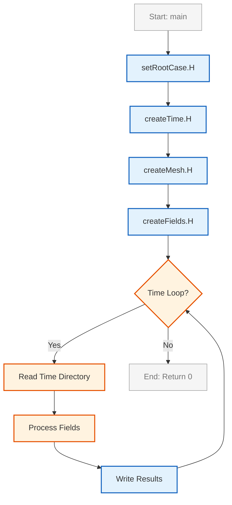
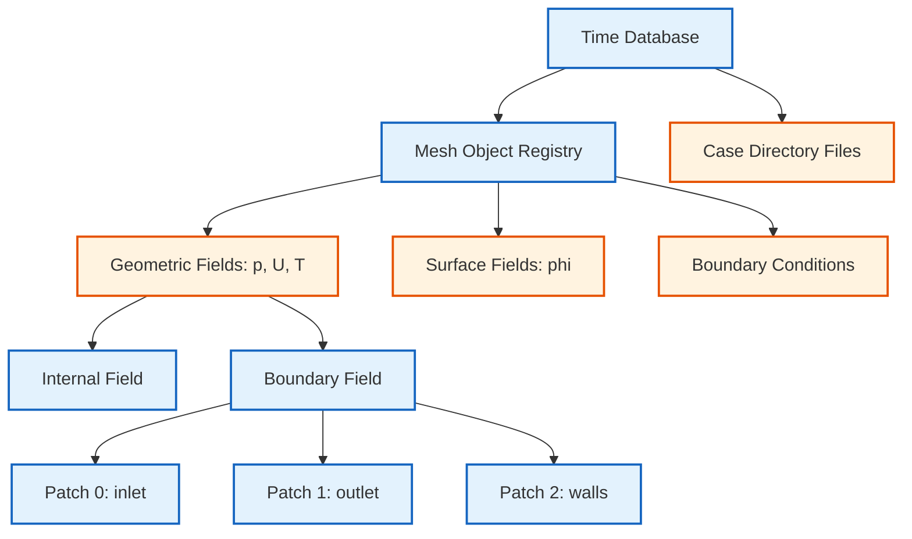
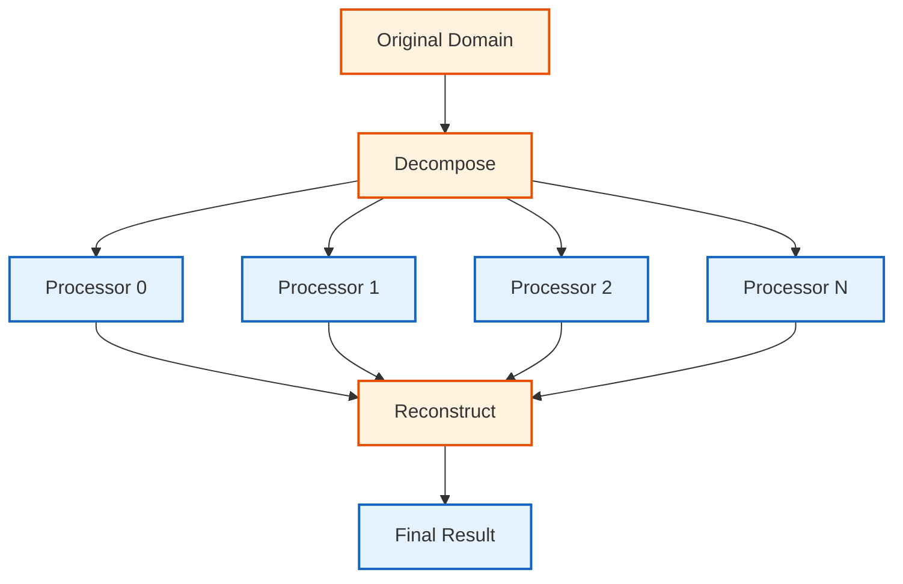

# สถาปัตยกรรมและรูปแบบการออกแบบใน OpenFOAM (Architecture and Design Patterns)

สถาปัตยกรรมของ OpenFOAM ถูกออกแบบมาอย่างเป็นระบบโดยเน้นความเป็นโมดูล (Modularity) เพื่อให้โค้ดสามารถนำกลับมาใช้ใหม่ (Reusability), บำรุงรักษาง่าย (Maintainability) และขยายขีดความสามารถได้ (Extensibility)

> [!INFO] **แนวคิดหลัก**
> OpenFOAM ใช้เทคนิค **Object-Oriented Programming (OOP)** และ **Generic Programming** อย่างหนักเพื่อสร้างกรอบการทำงาน (Framework) ที่ยืดหยุ่นสำหรับการแก้ปัญหา CFD (Computational Fluid Dynamics) และ CEM (Computational Electromagnetics)

---

## 1. โครงสร้างมาตรฐานของ Utility (Standard Utility Structure)

ยูทิลิตี้ทุกตัวใน OpenFOAM จะเป็นไปตามรูปแบบโครงสร้างเดียวกัน เพื่อให้มั่นใจในความสอดคล้องของ Command-line Interface และพฤติกรรมของโปรแกรม

### 1.1 แผนภาพโครงสร้างการทำงาน (Execution Flow)


> **Figure 1:** แผนภูมิแสดงลำดับขั้นตอนการทำงานพื้นฐาน (Execution Flow) ของยูทิลิตี้ใน OpenFOAM เริ่มตั้งแต่การกำหนด Root Case การสร้างออบเจกต์เวลาและเมช ไปจนถึงลูปการประมวลผลข้อมูลตามช่วงเวลา

### 1.2 รูปแบบโค้ดมาตรฐาน (Canonical Utility Template)

> [!TIP] **Best Practice**
> การใช้ included header files แบบมาตรฐานช่วยให้โค้ดอ่านง่ายและลดความผิดพลาดจากการเริ่มต้นออบเจกต์

```cpp
// Entry point for OpenFOAM utility
// Main function with command-line arguments
int main(int argc, char *argv[])
{
    // Standard OpenFOAM initialization sequence
    // Check root case directory and parse command-line arguments
    #include "setRootCase.H"
    
    // Create runTime object for time control and database management
    #include "createTime.H"
    
    // Create mesh object for finite volume discretization
    #include "createMesh.H"
    
    // Initialize physical fields and boundary conditions
    #include "createFields.H"

    // Configure logging output level
    // Print startup message to console
    Info<< nl << "Starting utility: " << args.executable() << nl << endl;

    // Main temporal loop - iterates through time directories
    while (runTime.loop())
    {
        // Display current time being processed
        Info<< "Time = " << runTime.timeName() << nl << endl;

        // --- Insert utility-specific logic here ---
        // Example: Calculate spatial quantities
        // Compute velocity magnitude field
        // volScalarField magU = mag(U);
        // Integrate quantity over entire domain
        // dimensionedScalar totalMagU = fvc::domainIntegrate(magU);

        // Conditional result writing
        // Only write if --noWrite flag is NOT present
        if (!args.optionFound("noWrite"))
        {
            // Write field to disk
            // field.write();
        }
    }

    // Print successful completion message
    Info<< "\nExecution completed successfully!\n" << endl;
    
    // Return success code
    return 0;
}
```

> **📌 Source:** OpenFOAM Utility Applications - `.applications/utilities/`
> 
> **📖 Explanation:**
> โครงสร้างมาตรฐานนี้เป็นพื้นฐานของทุกยูทิลิตี้ใน OpenFOAM การทำงานเริ่มต้นด้วยการตรวจสอบ Root Case directory จากนั้นสร้างออบเจกต์สำคัญ 3 ตัวคือ Time, Mesh และ Fields ก่อนเข้าสู่ลูปการประมวลผลตามช่วงเวลา
> 
> **🔑 Key Concepts:**
> - **setRootCase.H**: ตรวจสอบและกำหนดตำแหน่งของ Case directory
> - **createTime.H**: สร้างออบเจกต์ Time สำหรับควบคุมและบันทึกข้อมูลตามช่วงเวลา
> - **createMesh.H**: โหลดและสร้างเมชสำหรับการแยกโดเมน (Finite Volume Method)
> - **createFields.H**: เริ่มต้นฟิลด์ฟิสิกส์ (pressure, velocity, temperature) และเงื่อนไขขอบเขต
> - **runTime.loop()**: ลูปหลักที่ทำงานผ่านทุกช่วงเวลา (time steps)

### 1.3 สมการพื้นฐานที่เกี่ยวข้อง (Fundamental Equations)

สำหรับยูทิลิตี้ส่วนใหญ่ การทำงานจะขึ้นอยู่กับการคำนวณปริมาณเชิงปริภูมิ (Spatial Integration) เช่น:

$$
\Phi(t) = \int_{\Omega} \phi(\mathbf{x}, t) \, dV
$$

หรือการคำนวณค่าเฉลี่ยบนพื้นผิว:

$$
\bar{\phi}_{\Gamma} = \frac{1}{A_{\Gamma}} \int_{\Gamma} \phi \, dA
$$

เมื่อ:
- $\Phi(t)$ = ปริมาณรวมในโดเมน $\Omega$
- $\phi$ = ฟิลด์สเกลาร์หรือเวกเตอร์
- $dV$ = ปริมาตรของเซลล์
- $A_{\Gamma}$ = พื้นที่ผิว $\Gamma$

---

## 2. การผสานรวมกับระบบคอมไพล์ (Build System Integration)

OpenFOAM ใช้ยูทิลิตี้ชื่อ `wmake` ในการจัดการการคอมไพล์ โดยแต่ละโปรเจกต์ต้องมีโฟลเดอร์ `Make/` ซึ่งประกอบด้วยไฟล์คอนฟิกูเรชันหลัก 2 ไฟล์:

### 2.1 ไฟล์ `Make/files`

ใช้ระบุไฟล์ต้นฉบับ (Source Files) และตำแหน่งที่จะเก็บไฟล์ไบนารีหลังคอมไพล์:

```make
# Source file(s) for this utility
myUtility.C

# Define executable output location in user bin directory
EXE = $(FOAM_USER_APPBIN)/myUtility
```

> **📌 Source:** WMake Build System - `$WM_PROJECT_DIR/wmake/`
> 
> **📖 Explanation:**
> ไฟล์นี้ระบุไฟล์ต้นฉบับทั้งหมดที่ต้องคอมไพล์ และตำแหน่งที่จะเก็บไฟล์ไบนารีหลังคอมไพล์เสร็จ ตัวแปร `EXE` จะระบุพาธของ executable ที่สร้างขึ้น
> 
> **🔑 Key Concepts:**
> - **Blank Line Requirement**: ต้องมีบรรทัดว่างระหว่างไฟล์ต้นฉบับและตัวแปร `EXE`
> - **FOAM_USER_APPBIN**: Environment variable ชี้ไปยัง user application bin directory
> - **Multiple Files**: สามารถระบุไฟล์หลายไฟล์ได้ก่อนบรรทัดว่าง

> [!WARNING] **ข้อควรระวัง**
> ต้องมีการขึ้นบรรทัดใหม่ (Blank Line) ระหว่างรายชื่อไฟล์ต้นฉบับและตัวแปร `EXE` มิฉะนั้น `wmake` จะไม่สามารถตรวจจับได้

### 2.2 ไฟล์ `Make/options`

ใช้ระบุตำแหน่งของ Header Files และไลบรารีที่ต้องใช้เชื่อมต่อ (Linking):

```make
# Specify include paths for header files
EXE_INC = \
    -I$(LIB_SRC)/finiteVolume/lnInclude \
    -I$(LIB_SRC)/meshTools/lnInclude \
    -I$(LIB_SRC)/sampling/lnInclude

# Specify libraries to link against
EXE_LIBS = \
    -lfiniteVolume \
    -lmeshTools \
    -lsampling
```

> **📌 Source:** WMake Build System - `$WM_PROJECT_DIR/wmake/`
> 
> **📖 Explanation:**
> ไฟล์นี้กำหนดคอมไพเลอร์ flags สำหรับการค้นหา header files และไลบรารีที่ต้องใช้ในการ link ตัวแปร `EXE_INC` ใช้ระบุ include paths ส่วน `EXE_LIBS` ใช้ระบุ libraries
> 
> **🔑 Key Concepts:**
> - **EXE_INC**: Include paths สำหรับ header files (ใช้ `-I` flag)
> - **EXE_LIBS**: Libraries ที่ต้อง link (ใช้ `-l` flag)
> - **lnInclude**: Symbolic links ไปยัง header files จริง
> - **LIB_SRC**: Environment variable ชี้ไปยัง source directory ของ OpenFOAM

### 2.3 กระบวนการคอมไพล์ (Compilation Process)


> **Figure 2:** ขั้นตอนการคอมไพล์โค้ดต้นฉบับด้วยระบบ `wmake` โดยเริ่มจากการตรวจสอบความเชื่อมโยง (Dependencies) การคอมไพล์ และการเชื่อมต่อกับไลบรารีต่างๆ เพื่อสร้างไฟล์ไบนารีสำหรับใช้งาน

---

## 3. รูปแบบการออกแบบที่สำคัญ (Key Design Patterns)

### 3.1 Factory Pattern (Runtime Selection)

OpenFOAM ใช้รูปแบบนี้อย่างหนักเพื่อให้ผู้ใช้สามารถเลือกโมเดล (เช่น Turbulence Model หรือ Numerical Scheme) ได้ผ่านไฟล์ Dictionary ขณะรันโปรแกรม โดยไม่ต้องคอมไพล์โค้ดใหม่

> [!INFO] **กลไกทำงาน**
> ระบบ Factory ใช้ **RTS (Runtime Selection)** ผ่าน Macro `TypeName` และ `New` ในการสร้างออบเจกต์แบบไดนามิก

**ตัวอย่างไฟล์ Dictionary:**

```cpp
// Turbulence model selection dictionary
// Located at: constant/turbulenceProperties
simulationType  RAS;

RAS
{
    RASModel        kEpsilon;
    turbulence      on;
    printCoeffs     on;
}
```

> **📌 Source:** Turbulence Models - `.applications/turbulenceModels/`
> 
> **📖 Explanation:**
> การเลือกโมเดลความปั่นป่วน (Turbulence Model) ผ่านไฟล์ dictionary ทำให้ผู้ใช้สามารถเปลี่ยนโมเดลได้โดยไม่ต้องคอมไพล์โค้ดใหม่ ระบบจะสร้างออบเจกต์ของโมเดลที่เลือกโดยอัตโนมัติขณะ runtime
> 
> **🔑 Key Concepts:**
> - **Runtime Selection**: การเลือกโมเดลขณะรันโปรแกรม
> - **TypeName Macro**: ลงทะเบียนชื่อคลาสเพื่อใช้ในการค้นหา
> - **New() Method**: Factory method สำหรับสร้างออบเจกต์
> - **RAS vs LES**: สองประเภทหลักของโมเดลความปั่นป่วน

**ตัวอย่างการใช้งานในโค้ด:**

```cpp
// Runtime selection of turbulence model
// Create autoPtr (smart pointer) to turbulence model
autoPtr<compressible::RASModel> turbulence
(
    // Factory method call - selects model based on dictionary
    compressible::RASModel::New
    (
        rho,       // Density field reference
        U,         // Velocity field reference
        phi,       // Flux field reference
        thermo,    // Thermodynamic model reference
        false      // Flag: not reading from RASProperties file
    )
);
```

> **📌 Source:** Phase System - `.applications/solvers/multiphase/multiphaseEulerFoam/phaseSystems/PhaseSystems/MomentumTransferPhaseSystem/MomentumTransferPhaseSystem.C`
> 
> **📖 Explanation:**
> การใช้งาน Factory Pattern ใน OpenFOAM ใช้ `autoPtr` เพื่อจัดการหน่วยความจำของออบเจกต์ที่สร้างขึ้น เมธอด `New()` จะค้นหาและสร้างออบเจกต์ของโมเดลที่ระบุใน dictionary
> 
> **🔑 Key Concepts:**
> - **autoPtr<T>**: Smart pointer สำหรับ single ownership
> - **Factory Method**: `New()` สร้างออบเจกต์แบบไดนามิก
> - **Reference Passing**: ส่ง reference ของฟิลด์ที่จำเป็น
> - **Memory Management**: ออบเจกต์ถูกทำลายอัตโนมัติเมื่อออกจาก scope

### 3.2 Smart Pointers (`autoPtr` และ `tmp`)

เพื่อจัดการหน่วยความจำอย่างมีประสิทธิภาพและป้องกัน Memory Leak:

#### 3.2.1 `autoPtr<T>` - Single Ownership

- **หน้าที่**: สำหรับการถือครองกรรมสิทธิ์วัตถุเพียงผู้เดียว (Exclusive Ownership)
- **การใช้งาน**: ใช้เมื่อวัตถุมีเจ้าของคนเดียวและต้องการให้ถูกทำลายอัตโนมัติเมื่อออกจาก Scope

```cpp
// Create autoPtr managing a volScalarField object
// Constructor takes pointer to dynamically allocated object
autoPtr<volScalarField> Tptr
(
    new volScalarField
    (
        // IOobject defines file I/O behavior
        IOobject
        (
            "T",                          // Field name
            runTime.timeName(),           // Time directory
            mesh,                         // Mesh reference
            IOobject::MUST_READ,          // Must read from file
            IOobject::AUTO_WRITE          // Auto-write on output
        ),
        mesh                              // Mesh reference for field creation
    )
);

// Access the managed object using operator()
// Returns reference to the actual field
volScalarField& T = Tptr();

// Modify field values directly
// Increase internal field values by 10%
T.internalField() *= 1.1;
```

> **📌 Source:** Memory Management - `.applications/solvers/multiphase/multiphaseEulerFoam/phaseSystems/PhaseSystems/MomentumTransferPhaseSystem/MomentumTransferPhaseSystem.C`
> 
> **📖 Explanation:**
> `autoPtr` เป็น smart pointer ที่มีเจ้าของคนเดียว (unique ownership) เมื่อ pointer ถูกทำลาย ออบเจกต์ที่มันจัดการจะถูกลบออกจากหน่วยความจำโดยอัตโนมัติ ช่วยป้องกัน memory leak
> 
> **🔑 Key Concepts:**
> - **Unique Ownership**: มีเจ้าของคนเดียวเสมอ
> - **Automatic Destruction**: ลบออบเจกต์เมื่อออกจาก scope
> - **operator()**: ใช้เข้าถึงออบเจกต์ที่จัดการ
> - **operator->**: ใช้เรียกเมธอดของออบเจกต์
> - **release()**: ปล่อยการครอบครองโดยไม่ลบออบเจกต์

#### 3.2.2 `tmp<T>` - Reference Counting

- **หน้าที่**: สำหรับวัตถุชั่วคราวที่มีการนับจำนวนการอ้างอิง (Reference Counting) ช่วยลดการคัดลอกข้อมูลขนาดใหญ่
- **การใช้งาน**: ใช้กับฟิลด์ขนาดใหญ่ที่อาจถูกส่งผ่านระหว่างฟังก์ชัน

```cpp
// Calculate divergence of flux field
// Returns tmp<volScalarField> - temporary field with reference counting
tmp<volScalarField> divPhi = fvc::div(phi);

// Access the underlying field
// operator() returns const reference
const volScalarField& divPhiRef = divPhi();

// Pass to another function
// tmp can be transferred, avoiding unnecessary copies
solve(fvm::ddt(rho, U) + fvc::div(phi, U) - divPhi());
// divPhi automatically destroyed when no longer referenced
```

> **📌 Source:** FVC Operators - `.applications/solvers/multiphase/multiphaseEulerFoam/phaseSystems/PhaseSystems/MomentumTransferPhaseSystem/MomentumTransferPhaseSystem.C`
> 
> **📖 Explanation:**
> `tmp` ใช้ reference counting เพื่อหลีกเลี่ยงการคัดลอกฟิลด์ขนาดใหญ่ หลาย `tmp` สามารถอ้างถึงออบเจกต์เดียวกันได้ และออบเจกต์จะถูกทำลายเมื่อ `tmp` ตัวสุดท้ายถูกทำลาย
> 
> **🔑 Key Concepts:**
> - **Reference Counting**: นับจำนวนการอ้างอิง
> - **Lazy Evaluation**: คำนวณเมื่อจำเป็น
> - **Automatic Cleanup**: ลบเมื่อไม่มีการอ้างอิง
> - **Transfer Semantics**: โอนการครอบครองระหว่าง tmp objects

**สรุปการเลือกใช้:**

| ประเภท Smart Pointer | กรณีใช้งาน | ตัวอย่าง |
|---|---|---|
| **`autoPtr<T>`** | วัตถุมีเจ้าของคนเดียว (Unique Owner) | การสร้าง Turbulence Model, Boundary Conditions |
| **`tmp<T>`** | วัตถุอาจมีการใช้ร่วมกัน (Shared/Temporary) | ผลลัพธ์จาก `fvc::div()`, `fvc::grad()` |
| **`refPtr<T>`** | รุ่นใหม่กว่า tmp (OpenFOAM-v2112+) | ใช้แทน tmp ในโค้ดใหม่ |

### 3.3 Strategy Pattern

ใช้สำหรับอัลกอริทึมการคำนวณเชิงตัวเลข (Numerical Schemes) ช่วยให้สามารถสลับเปลี่ยนวิธีการคำนวณ Gradient หรือ Divergence ได้อย่างอิสระ

**ตัวอย่างไฟล์ `system/fvSchemes`:**

```cpp
// Gradient discretization schemes
gradSchemes
{
    default         Gauss linear;
    grad(p)         Gauss linear;
    grad(U)         Gauss linear;
}

// Divergence discretization schemes
divSchemes
{
    default         none;
    div(phi,U)      Gauss linearUpwindV grad(U);
    div(phi,k)      Gauss upwind;
    div(phi,epsilon) Gauss upwind;
}

// Laplacian discretization schemes
laplacianSchemes
{
    default         Gauss linear corrected;
}
```

> **📌 Source:** Finite Volume Schemes - `.src/finiteVolume/`
> 
> **📖 Explanation:**
> Strategy Pattern ใน OpenFOAM ใช้สำหรับ numerical discretization schemes ผู้ใช้สามารถเลือก scheme ที่แตกต่างกันสำหรับแต่ละ term ในสมการ ผ่านไฟล์ dictionary โดยไม่ต้องเปลี่ยนโค้ด
> 
> **🔑 Key Concepts:**
> - **Gauss Theorem**: ใช้ทฤษฎีบทของเกาส์สำหรับการแยกเชิงปริพันธ์
> - **Linear**: การประมาณค่าเชิงเส้น (Central differencing)
> - **Upwind**: การประมาณค่าทิศทางเดียว (Upwind differencing)
> - **Corrected**: มีการแก้ไขความคลาดเคลื่อนจาก non-orthogonality

**การนำไปใช้ในโค้ด:**

```cpp
// Calculate gradient using scheme selected in fvSchemes
// System automatically selects appropriate discretization method
tmp<volVectorField> gradU = fvc::grad(U);

// Calculate divergence using selected scheme
tmp<surfaceScalarField> flux = fvc::div(phi);
```

> **📌 Source:** FVC Operations - `.src/finiteVolume/fvc/fvcGrad.C`
> 
> **📖 Explanation:**
> ฟังก์ชัน `fvc::grad()` และ `fvc::div()` จะเลือก scheme ตามที่ระบุในไฟล์ `fvSchemes` โดยอัตโนมัติ ทำให้ผู้ใช้สามารถเปลี่ยนวิธีการคำนวณได้โดยไม่ต้องคอมไพล์ใหม่
> 
> **🔑 Key Concepts:**
> - **fvc (Finite Volume Calculus)**: Explicit calculations
> - **fvm (Finite Volume Method)**: Implicit calculations
> - **Scheme Selection**: อ่านจาก `system/fvSchemes`
> - **Runtime Configurable**: ตั้งค่าได้โดยไม่ต้องคอมไพล์

---

## 4. ระบบ Database และ Object Registry

### 4.1 โครงสร้างข้อมูล (Database Hierarchy)

OpenFOAM ใช้ระบบ **Object Registry** ในการจัดการวัตถุทั้งหมดใน Simulation:


> **Figure 3:** ลำดับชั้นของฐานข้อมูลและระบบการจดทะเบียนวัตถุ (Object Registry) ใน OpenFOAM แสดงความสัมพันธ์ระหว่างฐานข้อมูลเวลา เมช และฟิลด์ข้อมูลประเภทต่างๆ รวมถึงเงื่อนไขขอบเขตในแต่ละ Patch

### 4.2 การเข้าถึงวัตถูใน Registry

```cpp
// Method 1: Lookup through Time Database
// Search for registered object by name in time database
const volScalarField& p = mesh.lookupObject<volScalarField>("p");

// Method 2: Lookup through Mesh Object Registry
// Search specifically in mesh's object registry
const volVectorField& U = mesh.objectRegistry::lookupObject<volVectorField>("U");

// Method 3: Safe lookup with existence check
// Check if object exists before attempting lookup
if (mesh.foundObject<volScalarField>("T"))
{
    const volScalarField& T = mesh.lookupObject<volScalarField>("T");
}
```

> **📌 Source:** Object Registry - `.src/OpenFOAM/containers/HashTables/HashTable/HashTable.C`
> 
> **📖 Explanation:**
> Object Registry เป็นระบบจัดการออบเจกต์แบบ centralized เก็บออบเจกต์ทั้งหมดใน simulation ไว้ใน HashTable สามารถค้นหาและเข้าถึงออบเจกต์ด้วยชื่อ และตรวจสอบการมีอยู่ก่อนเข้าถึง
> 
> **🔑 Key Concepts:**
> - **objectRegistry**: Container สำหรับจัดเก็บออบเจกต์
> - **lookupObject<T>()**: ค้นหาออบเจกต์ตามชื่อและประเภท
> - **foundObject<T>()**: ตรวจสอบว่ามีออบเจกต์หรือไม่
> - **Type Safety**: ระบุประเภทออบเจกต์ขณะ lookup
> - **Hierarchical**: Time Database → Mesh Registry → Fields

---

## 5. การจัดการหน่วย (Dimensional Consistency)

OpenFOAM มีระบบตรวจสอบ ==มิติของหน่วย== (Dimensional Consistency) อย่างเข้มงวด

### 5.1 ชนิดของมิติ (Dimension Set)

$$
\text{Dimension Set} = \text{(Mass, Length, Time, Temperature, Moles, Current, Luminous Intensity)}
$$

```cpp
// Define custom dimension set for velocity [L/T]
// Format: (Mass, Length, Time, Temperature, Moles, Current, Luminous)
dimensionSet velocityDimensions
(
    0,  // Mass [M^0]
    1,  // Length [L^1]
    -1, // Time [T^-1]
    0,  // Temperature [θ^0]
    0,  // Moles [mol^0]
    0,  // Current [A^0]
    0   // Luminous Intensity [cd^0]
);

// Create dimensioned vector with predefined dimension
// Using dimVelocity (predefined velocity dimension)
dimensionedVector U_inf
(
    "U_inf",              // Name
    dimVelocity,          // Dimension [L/T]
    vector(10, 0, 0)      // Value: 10 m/s in x-direction
);
```

> **📌 Source:** Dimension Sets - `.src/OpenFOAM/db/dimensionSet/dimensionSet.C`
> 
> **📖 Explanation:**
> ระบบ Dimension ใน OpenFOAM ตรวจสอบความถูกต้องของหน่วยขณะคอมไพล์ ป้องกันการดำเนินการทางคณิตศาสตร์ที่ไม่สอดคล้องกัน เช่น การบวกความดันกับความเร็ว
> 
> **🔑 Key Concepts:**
> - **7 Base Dimensions**: Mass, Length, Time, Temperature, Moles, Current, Luminous
> - **dimensionSet**: คลาสสำหรับเก็บข้อมูลมิติ
> - **Predefined Dimensions**: dimVelocity, dimPressure, dimDensity, etc.
> - **Compile-time Checking**: ตรวจสอบขณะคอมไพล์
> - **Dimensional Analysis**: ตรวจสอบความสอดคล้องของสมการ

### 5.2 ตารางมิติที่ใช้บ่อย (Common Dimensions)

| ปริมาณ | สัญลักษณ์ OpenFOAM | มิติ | ตัวแปร |
|---|---|---|---|
| ความเร็ว | `dimVelocity` | $[L T^{-1}]$ | $U$ |
| ความดัน | `dimPressure` | $[M L^{-1} T^{-2}]$ | $p$ |
| ความหนาแน่น | `dimDensity` | $[M L^{-3}]$ | $\rho$ |
| อุณหภูมิ | `dimTemperature` | $[\theta]$ | $T$ |
| ความหน่วงแรง | `dimViscosity` | $[M L^{-1} T^{-1}]$ | $\mu$ |

---

## 6. รูปแบบการคำนวณเชิงตัวเลข (Numerical Framework)

### 6.1 Finite Volume Method (FVM)

OpenFOAM ใช้วิธีการ ==Finite Volume== ในการแยกสมการเชิงอนุพันธ์ (PDE) ออกเป็นสมการเชิงพีชคณิต (Algebraic Equations)

**สมการทั่วไป:**

$$
\frac{\partial (\rho \phi)}{\partial t} + \nabla \cdot (\rho \mathbf{u} \phi) = \nabla \cdot (\Gamma \nabla \phi) + S_\phi
$$

**แยกเป็นรูป Discrete:**

$$
\frac{(\rho \phi)_P^{n+1} - (\rho \phi)_P^n}{\Delta t} V_P + \sum_f \rho_f \mathbf{u}_f \cdot \mathbf{S}_f \phi_f = \sum_f \Gamma_f \nabla \phi_f \cdot \mathbf{S}_f + S_\phi V_P
$$

เมื่อ:
- $P$ = เซลล์ปัจจุบัน (Owner Cell)
- $f$ = หน้าเซลล์ (Face)
- $V_P$ = ปริมาตรของเซลล์
- $\mathbf{S}_f$ = เวกเตอร์พื้นที่หน้า (Face Area Vector)

### 6.2 FVM Operators ใน OpenFOAM

```cpp
// 1. Temporal Derivative Terms
// Implicit: fvm creates matrix coefficient
fvm::ddt(rho, U)           // ∂(ρU)/∂t - Implicit
// Explicit: fvc calculates value directly
fvc::ddt(rho, U)           // ∂(ρU)/∂t - Explicit

// 2. Divergence Terms (Convection)
// Implicit divergence
fvm::div(phi, U)           // ∇·(φU) - Implicit
// Explicit divergence
fvc::div(phi)              // ∇·φ - Explicit

// 3. Gradient and Laplacian Terms (Diffusion)
// Explicit gradient calculation
fvc::grad(p)               // ∇p - Explicit
// Implicit Laplacian
fvm::laplacian(nu, U)      // ∇·(ν∇U) - Implicit

// 4. Interpolation (Cell to Face)
// Interpolate field from cell centers to faces
surfaceScalarField rhof = fvc::interpolate(rho);
```

> **📌 Source:** FVM Operators - `.src/finiteVolume/fvm/`
> 
> **📖 Explanation:**
> OpenFOAM มีสองประเภทของ operators: `fvc` (Finite Volume Calculus) สำหรับ explicit calculations และ `fvm` (Finite Volume Method) สำหรับ implicit calculations ที่สร้างสมการเมตริกซ์
> 
> **🔑 Key Concepts:**
> - **fvc (Explicit)**: คำนวณค่าโดยตรง ไม่สร้าง matrix
> - **fvm (Implicit)**: สร้างสมการ matrix สำหรับ linear solver
> - **Interpolation**: ประมาณค่าจาก cell centers ไปยัง faces
> - **Discretization**: แปลง PDE เป็น algebraic equations
> - **Mesh-aware**: คำนวณตามโครงสร้าง mesh

---

## 7. การสร้าง Utility ที่มีประสิทธิภาพ (Performance Optimization)

### 7.1 การลดการคำนวณซ้ำ (Avoid Redundant Calculations)

> [!TIP] **Memory Management**
> ใช้ `tmp` เพื่อลดการคัดลอกฟิลด์ขนาดใหญ่ และใช้ `const ref` สำหรับการอ้างอิงแบบอ่านอย่างเดียว

```cpp
// ❌ BAD PRACTICE: Creates new field every iteration
// Inefficient - allocates memory and recalculates each loop
for (int i = 0; i < n; i++)
{
    volScalarField magU = mag(U);  // Recreated every iteration
    // Processing...
}

// ✅ GOOD PRACTICE: Create once, reuse multiple times
// Efficient - single allocation and calculation
const volScalarField magU = mag(U);  // Created once
for (int i = 0; i < n; i++)
{
    // Processing...
}
```

> **📌 Source:** Performance Best Practices - OpenFOAM Programmer's Guide
> 
> **📖 Explanation:**
> การสร้างฟิลด์ใหม่ทุกรอบลูปเป็นการสิ้นเปลืองหน่วยความจำและเวลาในการคำนวณ ควรสร้างฟิลด์ครั้งเดียวแล้วนำไปใช้ซ้ำ หรือใช้ `const reference` เพื่อหลีกเลี่ยงการคัดลอก
> 
> **🔑 Key Concepts:**
> - **Memory Allocation**: สร้างฟิลด์ใหม่ใช้หน่วยความจำและเวลา
> - **Const Reference**: อ้างอิงโดยไม่คัดลอกข้อมูล
> - **Loop Invariant Code Motion**: ย้ายการคำนวณที่ไม่เปลี่ยนแปลงออกจากลูป
> - **Field Reuse**: ใช้ฟิลด์เดิมซ้ำหลายครั้ง
> - **tmp Optimization**: ใช้ tmp สำหรับค่าชั่วคราว

### 7.2 การใช้งาน Parallel Processing

OpenFOAM รองรับการแบ่งข้อมูล (Domain Decomposition) โดยใช้ **MPI** (Message Passing Interface)


> **Figure 4:** แผนภาพแสดงกระบวนการประมวลผลแบบขนาน (Parallel Processing) โดยการแบ่งโดเมนออกเป็นส่วนย่อยๆ เพื่อส่งให้แต่ละโปรเซสเซอร์คำนวณแยกกัน ก่อนจะนำผลลัพธ์กลับมารวมกันเป็นโดเมนเดียวเพื่อสรุปผลในขั้นตอนสุดท้าย

**ตัวอย่างโค้ดที่รองรับ Parallel:**

```cpp
// Global reduction operations across all processors
// gSum: Sum values from all processors
scalar globalSum = gSum(magU.internalField());

// gMax: Find maximum value across all processors
scalar globalMax = gMax(magU.internalField());

// gMin: Find minimum value across all processors
scalar globalMin = gMin(magU.internalField());
```

> **📌 Source:** Parallel Communication - `.src/OpenFOAM/db/IOstreams/Pstreams/`
> 
> **📖 Explanation:**
> ในการประมวลผลแบบขนาน แต่ละ processor จะมีข้อมูลเฉพาะส่วน (sub-domain) ฟังก์ชัน global reduction เช่น `gSum`, `gMax`, `gMin` จะรวบรวมข้อมูลจากทุก processor และส่งผลลัพธ์กลับไปยังทุก processor
> 
> **🔑 Key Concepts:**
> - **Domain Decomposition**: แบ่งโดเมนออกเป็นส่วนย่อย
> - **MPI Communication**: ส่งข้อมูลระหว่าง processors
> - **Global Reduction**: รวมข้อมูลจากทุก processor
> - **Parallel Efficiency**: สมดุลการโหลดงาน
> - **Scalability**: ประสิทธิภาพเมื่อเพิ่มจำนวน processors

---

## 8. การตรวจสอบความถูกต้อง (Validation and Debugging)

### 8.1 การใช้ Switches ในการควบคุม Output

```cpp
// Debug configuration in control dictionary
// File: system/controlDict
DebugSwitches
{
    // Enable debug output for specific utility
    myUtility 1;  // 0 = off, 1 = on
}

InfoSwitches
{
    // Control informational output
    myUtility 1;
}

OptimisationSwitches
{
    // Control optimization settings
    myUtility 1;
}
```

> **📌 Source:** Debug Switches - `.src/OpenFOAM/db/IOstreams/IOstreams/`
> 
> **📖 Explanation:**
> Debug switches ช่วยควบคุมระดับของ output สามารถเปิด/ปิด debug messages ได้โดยไม่ต้องคอมไพล์ใหม่ มีประโยชน์สำหรับการแก้ไขปัญหาและตรวจสอบการทำงาน
> 
> **🔑 Key Concepts:**
> - **DebugSwitches**: ควบคุม debug output
> - **InfoSwitches**: ควบคุม informational messages
> - **OptimisationSwitches**: ควบคุม optimization settings
> - **Runtime Control**: เปลี่ยนค่าได้โดยไม่ต้องคอมไพล์
> - **Selective Debugging**: เปิด debug เฉพาะส่วนที่ต้องการ

### 8.2 การเขียน Debug Messages

```cpp
// Conditional debug output
// Only executes if debug flag is enabled (> 0)
if (debug)
{
    Info<< "Debug: Processing field " << U.name() << nl
        << "  - Min: " << gMin(U.internalField()) << nl
        << "  - Max: " << gMax(U.internalField()) << nl
        << "  - Size: " << U.internalField().size() << endl;
}
```

> **📌 Source:** Debug Macros - `.src/OpenFOAM/include/error.H`
> 
> **📖 Explanation:**
> การใช้ `if (debug)` ช่วยให้โค้ด debug ถูก execute เฉพาะเมื่อ debug mode เปิดอยู่ ป้องกันการสิ้นเปลืองประสิทธิภาพใน production runs และทำให้ดูผลลัพธ์ได้ง่าย
> 
> **🔑 Key Concepts:**
> - **debug Variable**: Global variable ควบคุม debug mode
> - **Conditional Compilation**: เลือก execute ตามเงื่อนไข
> - **Performance**: Debug code ไม่ส่งผลใน production
> - **Field Statistics**: แสดงค่าสถิติของฟิลด์
> - **Global Reduction**: ใช้ gMin/gMax สำหรับ parallel

---

## 🎓 สรุปสถาปัตยกรรม

| องค์ประกอบ | หน้าที่หลัก | คลาสหลักใน OpenFOAM |
|---|---|---|
| **Root Case** | กำหนดขอบเขตของโปรเจกต์และโครงสร้างไฟล์ | `argList`, `Time` |
| **Time Database** | จัดการลูปเวลาและการอ่าน/เขียนข้อมูลตามขั้นตอน | `Time`, `instantList` |
| **fvMesh** | จัดการความสัมพันธ์เชิงพื้นที่และโทโพโลยีของเซลล์ | `fvMesh`, `polyMesh` |
| **GeometricField** | เก็บข้อมูลฟิสิกส์ (Scalar, Vector, Tensor) และหน่วย (Dimensions) | `GeometricField`, `DimensionedField` |
| **Object Registry** | ระบบจัดการวัตถุและการค้นหา | `objectRegistry`, `HashTable` |
| **Smart Pointers** | จัดการหน่วยความจำอัตโนมัติ | `autoPtr`, `tmp`, `refPtr` |
| **Factory Pattern** | การสร้างวัตถุแบบไดนามิก | `New()`, `TypeName` |
| **Numerical Schemes** | อัลกอริทึมการคำนวณเชิงตัวเลข | `fvSchemes`, `fvSolution` |

---

## 📚 แหล่งอ้างอิงเพิ่มเติม

> [!INFO] **เอกสารประกอบ**
> - OpenFOAM Programmer's Guide: [https://www.openfoam.com/documentation/programmers-guide](https://www.openfoam.com/documentation/programmers-guide)
> - OpenFOAM C++ Source Code: `$FOAM_SRC/`
> - Wmake Build System: `$WM_PROJECT_DIR/wmake/`

---

**หัวข้อถัดไป**: [[04_Essential_Utilities_for_Common_CFD_Tasks]] เพื่อดูเวิร์กโฟลว์การใช้งานจริง