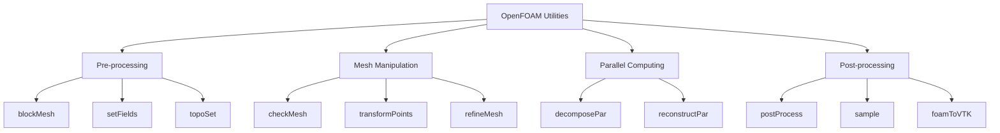

# Essential Utilities for Common CFD Tasks

OpenFOAM utilities ที่ใช้บ่อยใน CFD workflows

---

## 🎯 Learning Objectives

หลังจากอ่านบทนี้ คุณจะสามารถ:

1. **จำแนก** categories ของ OpenFOAM utilities
2. **ใช้งาน** pre-processing utilities (blockMesh, setFields, topoSet)
3. **ใช้งาน** mesh utilities (checkMesh, transformPoints, refineMesh)
4. **ใช้งาน** parallel utilities (decomposePar, reconstructPar)
5. **ใช้งาน** post-processing utilities (postProcess, sample, foamToVTK)

---

## 📚 Utility Categories



---

## 🔧 Pre-processing Utilities

### blockMesh

**What:** สร้าง structured hexahedral mesh จาก `blockMeshDict`

**Why:** 
- Fast and deterministic
- Good for simple geometries
- Foundation for snappyHexMesh

**How:**
```bash
blockMesh
blockMesh -dict system/blockMeshDict.custom
```

**Common Issues:**

| Problem | Cause | Solution |
|---------|-------|----------|
| Negative volume | Wrong vertex order | Follow right-hand rule |
| Zero-size patch | Missing faces | Check patch definitions |

---

### setFields

**What:** Initialize field values in specific regions

**Why:**
- Set initial conditions for multiphase
- Define different zones with different properties

**How:**
```bash
setFields
```

**setFieldsDict Example:**
```cpp
defaultFieldValues
(
    volScalarFieldValue alpha.water 0
);

regions
(
    boxToCell
    {
        box (0 0 0) (0.5 0.5 1);
        fieldValues
        (
            volScalarFieldValue alpha.water 1
        );
    }
);
```

---

### topoSet

**What:** Create cell/face/point sets for subsequent operations

**Why:**
- Define refinement regions
- Create zones for source terms
- Select cells for sampling

**How:**
```bash
topoSet
topoSet -dict system/topoSetDict
```

**topoSetDict Example:**
```cpp
actions
(
    {
        name    refinementZone;
        type    cellSet;
        action  new;
        source  boxToCell;
        box     (0.1 0.1 0) (0.2 0.2 0.1);
    }
);
```

---

## 🔍 Mesh Utilities

### checkMesh

**What:** Analyze mesh quality and topology

**Why:**
- Identify potential simulation issues
- Validate mesh before running solver

**How:**
```bash
checkMesh
checkMesh -allGeometry -allTopology
checkMesh -writeSets vtk
```

**Quality Metrics:**

| Metric | Good | Acceptable | Bad |
|--------|------|------------|-----|
| Non-orthogonality | < 40° | 40-65° | > 70° |
| Skewness | < 2 | 2-4 | > 4 |
| Aspect ratio | < 100 | 100-1000 | > 1000 |

---

### transformPoints

**What:** Scale, translate, or rotate mesh

**Why:**
- Convert units (mm to m)
- Position geometry
- Rotate for different orientations

**How:**
```bash
# Scale (mm to m)
transformPoints -scale '(0.001 0.001 0.001)'

# Translate
transformPoints -translate '(0 0 0.5)'

# Rotate around Z-axis
transformPoints -rollPitchYaw '(0 0 45)'
```

---

### refineMesh

**What:** Refine selected cells

**Why:**
- Add resolution in critical regions
- Gradual mesh refinement

**How:**
```bash
topoSet          # Create refinement cellSet
refineMesh -all  # Refine all directions
refineMesh       # Use refineMeshDict
```

---

## 🖥️ Parallel Utilities

### decomposePar

**What:** Divide mesh for parallel processing

**Why:**
- Enable MPI parallel runs
- Distribute workload across processors

**How:**
```bash
decomposePar
decomposePar -force
decomposePar -copyZero
```

---

### reconstructPar

**What:** Combine parallel results into single mesh

**Why:**
- Post-process in ParaView
- Archive complete results

**How:**
```bash
reconstructPar
reconstructPar -latestTime
reconstructPar -time 100:200
```

---

## 📊 Post-processing Utilities

### postProcess

**What:** Run function objects on existing results

**Why:**
- Calculate derived quantities
- Compute integrals, averages

**How:**
```bash
postProcess -func "yPlus"
postProcess -func "wallShearStress"
postProcess -func "mag(U)"
```

---

### sample

**What:** Extract data along lines or surfaces

**Why:**
- Compare with experimental data
- Create 2D plots

**How:**
```bash
postProcess -func sample
```

**sampleDict Example:**
```cpp
type    sets;
libs    (sampling);
writeControl timeStep;
writeInterval 1;

sets
(
    centerLine
    {
        type    lineUniform;
        axis    distance;
        start   (0 0.05 0.05);
        end     (1 0.05 0.05);
        nPoints 100;
    }
);

fields (U p);
```

---

### foamToVTK

**What:** Export OpenFOAM data to VTK format

**Why:**
- Use with external visualization tools
- Share data with non-OpenFOAM users

**How:**
```bash
foamToVTK
foamToVTK -latestTime
foamToVTK -fields '(U p)'
```

---

## 📋 Quick Reference Table

| Utility | Category | Primary Use |
|---------|----------|-------------|
| `blockMesh` | Pre-processing | Create structured mesh |
| `setFields` | Pre-processing | Initialize fields |
| `topoSet` | Pre-processing | Create cell/face sets |
| `checkMesh` | Mesh | Quality verification |
| `transformPoints` | Mesh | Scale/translate/rotate |
| `refineMesh` | Mesh | Local refinement |
| `decomposePar` | Parallel | Split for MPI |
| `reconstructPar` | Parallel | Combine MPI results |
| `postProcess` | Post-processing | Function objects |
| `sample` | Post-processing | Line/surface data |
| `foamToVTK` | Post-processing | VTK export |

---

## 🧠 Concept Check

<details>
<summary><b>1. decomposePar และ reconstructPar ทำหน้าที่อะไรตรงข้ามกัน?</b></summary>

**decomposePar:** แบ่ง mesh เป็นส่วนย่อยสำหรับแต่ละ processor

**reconstructPar:** รวมผลลัพธ์จากทุก processor กลับเป็น mesh เดียว
</details>

<details>
<summary><b>2. ทำไมต้องใช้ checkMesh ก่อนรัน solver?</b></summary>

**ตรวจสอบคุณภาพ mesh:**
- Non-orthogonality สูง → divergence
- Skewness สูง → inaccuracy
- Negative volumes → crash ทันที

**ป้องกันปัญหาดีกว่าแก้ทีหลัง**
</details>

---

## 📖 Related Documents

- [01_Utility_Categories.md](01_Utility_Categories_and_Organization.md) — Overview
- [02_Architecture.md](02_Architecture_and_Design_Patterns.md) — Design patterns
- [05_Creating_Custom_Utilities.md](05_Creating_Custom_Utilities.md) — Custom utilities