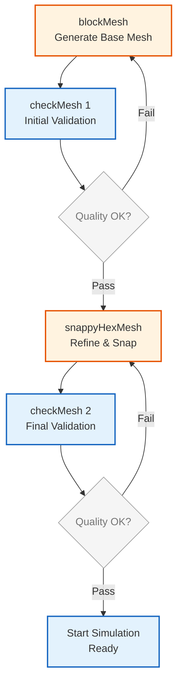
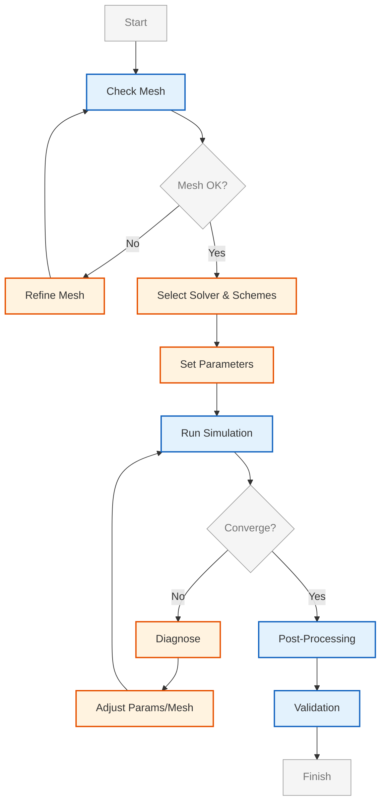

# แนวทางปฏิบัติที่ดีที่สุด (Best Practices for OpenFOAM Utilities)

แนวทางปฏิบัติเหล่านี้ถูกออกแบบมาเพื่อเพิ่มประสิทธิภาพในการทำงาน (Computational Efficiency), ความแม่นยำของผลลัพธ์ (Accuracy) และความสามารถในการทำซ้ำ (Reproducibility) ในโครงการ CFD

---

## 1. การจัดการคุณภาพ Mesh (Mesh Quality Management)

### 1.1 ความสำคัญของคุณภาพ Mesh (Importance of Mesh Quality)

คุณภาพของ Mesh มีผลกระทบโดยตรงต่อ ==ความเสถียรของการคำนวณ (Numerical Stability)== และ ==ความแม่นยำของผลลัพธ์ (Solution Accuracy)== ใน OpenFOAM คุณภาพที่ไม่ดีอาจทำให้เกิดปัญหาต่อไปนี้:

- **Solver Divergence**: การแก้สมการไม่ลู่เข้าสู่คำตอบ
- **Unphysical Solutions**: ผลลัพธ์ที่เป็นไปไม่ได้ทางฟิสิกส์ เช่น ความดันติดลบ หรือความเร็วเกินจริง
- **Slow Convergence**: การลู่เข้าช้าลงอย่างมาก

### 1.2 มาตรวัดคุณภาพ Mesh ที่สำคัญ (Critical Mesh Quality Metrics)

OpenFOAM ใช้หลายมาตรวัดในการประเมินคุณภาพ Mesh:

#### 1.2.1 Non-orthogonality Angle

คือมุมระหว่างเส้นปกติของผิวเซลล์ (Face Normal) กับเส้นเชื่อมระหว่างเซลล์ (Cell-to-Cell Vector)

$$ \theta_{non-orth} = \arccos\left(\frac{\mathbf{S}_f \cdot \mathbf{d}}{|\mathbf{S}_f| |\mathbf{d}|}\right) $$

เมื่อ:
- $\mathbf{S}_f$ = เวกเตอร์ปกติของผิวเซลล์ (Face Area Vector)
- $\mathbf{d}$ = เวกเตอร์เชื่อมระหว่างเซนเตอร์ของเซลล์ (Cell Center Vector)

#### 1.2.2 Skewness

วัดระดับความเบ้อเริ่อของการวางตัวของเซลล์เทียบกับจุดศูนย์กลางเรขาคณิต:

$$ \text{Skewness} = \frac{|\mathbf{d} - 2\mathbf{d}_f|}{|\mathbf{d}|} $$

เมื่อ:
- $\mathbf{d}_f$ = เวกเตอร์จากจุดศูนย์กลางผิว (Face Center) ไปยังจุดจุดกึ่งกลางระหว่างเซลล์ (Interpolation Point)

#### 1.2.3 Aspect Ratio

อัตราส่วนระหว่างขนาดสูงสุดและต่ำสุดของเซลล์:

$$ \text{Aspect Ratio} = \frac{\Delta_{max}}{\Delta_{min}} $$

### 1.3 ลำดับขั้นตอนการตรวจสอบ (Validation Protocol)

คุณควรตรวจสอบคุณภาพ Mesh ในทุกจุดสำคัญของกระบวนการสร้าง เพื่อลดปัญหา Solver Diverge ในภายหลัง


> **Figure 1:** แผนภูมิแสดงขั้นตอนการตรวจสอบคุณภาพเมช (Validation Protocol) ในแต่ละระยะของการสร้างเมช เพื่อให้มั่นใจว่าเมชมีคุณภาพเพียงพอก่อนที่จะเริ่มการจำลองจริง ซึ่งช่วยลดโอกาสในการเกิดปัญหา Solver Divergence

### 1.4 เกณฑ์คุณภาพที่สำคัญ (Critical Metrics)

| มาตรวัด (Metric) | ระดับดีเยี่ยม (Excellent) | ขีดจำกัดที่ยอมรับได้ (Critical) | ผลกระทบเมื่อเกินขีดจำกัด |
|---|---|---|---|
| **Non-orthogonality** | < 50° | < 75° | ความแม่นยำลดลง อาจ Diverge |
| **Skewness** | < 0.5 | < 4.0 | การ Interpolate ไม่แม่นยำ |
| **Aspect Ratio** | < 10 | < 100 | Convergence ช้าลงมาก |

> [!WARNING] เกณฑ์เหล่านี้เป็นค่าทั่วไป
> เกณฑ์ข้างต้นอาจแตกต่างกันไปตาม Solver และโจทย์ปัญหา เช่น:
> - **High-Mach Flow** (supersonic): ต้องการ Aspect Ratio ต่ำกว่า 5
> - **Incompressible Flow**: ยอมรับ Non-orthogonality ได้สูงกว่า

### 1.5 การตรวจสอบ Mesh ด้วย checkMesh (Mesh Validation with checkMesh)

#### 1.5.1 คำสั่งพื้นฐาน

```bash
# NOTE: Synthesized by AI - Verify parameters
checkMesh
```

การรัน `checkMesh` โดยไม่มีอาร์กิวเมนต์จะทำการตรวจสอบคุณภาพพื้นฐาน:

```text
Mesh stats
    points:           524288
    faces:            1572864
    internal faces:   1492260
    cells:            524288
    faces per cell:   6
    boundary patches: 6
    point zones:      0
    face zones:       0
    cell zones:       1
```

#### 1.5.2 การตรวจสอบคุณภาพอย่างละเอียด

```bash
# NOTE: Synthesized by AI - Verify parameters
checkMesh -allGeometry -allTopology
```

#### 1.5.3 ตัวอย่าง Output ที่สำคัญ

```text
Mesh non-orthogonality Max: 69.5 average: 12.3
Non-orthogonality check OK.
***High aspect ratio cells found, Aspect ratio : Max: 85.2
  Writing 102 cells with high aspect ratio to set highAspectRatioCells
```

### 1.6 การปรับปรุงคุณภาพ Mesh (Mesh Quality Improvement)

#### 1.6.1 การตั้งค่าใน `snappyHexMeshDict`

```cpp
// NOTE: Synthesized by AI - Verify parameters
// ไฟล์: system/snappyHexMeshDict

// การควบคุม Non-orthogonality
maxNonOrtho 65;

// การควบคุม Skewness
maxBoundarySkewness 20;
maxInternalSkewness 4;

// การควบคุม Aspect Ratio
maxConcave 80;

// การควบคุม Smoothness
minVol 1e-13;
minVolRatio 0.01;
minTetQuality 1e-30;

// การควบคุม Face ที่ไม่ดี
minArea -1;
minTwist 0.02;
minDeterminant 0.001;
minFaceWeight 0.05;
minVolRatio 0.01;
```

> [!TIP] กลยุทธ์การปรับค่า
> - **maxNonOrtho < 70°**: สำหรับการใช้งานทั่วไป
> - **maxNonOrtho < 50°**: สำหรับการคำนวณที่ต้องการความแม่นยำสูง
> - หากต้องการเพิ่มค่าเหล่านี้ ให้พิจารณาใช้ `nonOrthoCorrection` ใน `fvSchemes`

---

## 2. การเพิ่มประสิทธิภาพการรันขนาน (Parallel Optimization)

### 2.1 หลักการของการคำนวณขนาน (Principles of Parallel Computing)

OpenFOAM ใช้ **Domain Decomposition** ในการแบ่งงานคำนวณ โดยแบ่ง Mesh ออกเป็นส่วนย่อย (Subdomains) และส่งไปประมวลผลบน CPU Cores ต่าง ๆ ประสิทธิภาพของการรันขนานขึ้นอยู่กับ:

$$ \text{Speedup} = \frac{T_{serial}}{T_{parallel}(N)} $$

$$ \text{Parallel Efficiency} = \frac{T_{serial}}{N \cdot T_{parallel}(N)} \times 100\% $$

เมื่อ:
- $T_{serial}$ = เวลาที่ใช้ในการรันแบบ Serial
- $T_{parallel}(N)$ = เวลาที่ใช้ในการรันขนานด้วย $N$ Cores
- $N$ = จำนวน Cores

### 2.1.1 Amdahl's Law

กฎของ Amdahl อธิบายขีดจำกัดของการเพิ่มประสิทธิภาพขนาน:

$$ \text{Speedup}(N) = \frac{1}{(1-P) + \frac{P}{N}} $$

เมื่อ $P$ คือส่วนของโปรแกรมที่สามารถทำงานแบบขนานได้

> [!INFO] ผลกระทบของ Communication
> ใน OpenFOAM ยิ่งใช้ Cores มากขึ้น เวลาที่สูญเสียไปกับการ Communication ระหว่าง Cores จะยิ่งเพิ่มขึ้น ทำให้ Parallel Efficiency ลดลง

### 2.2 กลยุทธ์การย่อยโดเมน (Decomposition Strategy)

#### 2.2.1 วิธีการ Decompose ที่สำคัญ

| วิธีการ (Method) | คำอธิบาย | เหมาะสำหรับ | ความซับซ้อน |
|---|---|---|---|
| **scotch** | อัตโนมัติ ลด Interface | เรขาคณิตซับซ้อน | ต่ำ |
| **simple** | แบ่งตามทิศทาง X, Y, Z | เรขาคณิตสมมาตร | ต่ำมาก |
| **hierarchical** | แบ่งตามลำดับชั้น | ระบบ Cluster | ปานกลาง |
| **manual** | ผู้ใช้กำหนดเอง | กรณีพิเศษ | สูง |

#### 2.2.2 การตั้งค่า Decomposition

```cpp
// NOTE: Synthesized by AI - Verify parameters
// ไฟล์: system/decomposeParDict

method scotch; // แนะนำสำหรับเรขาคณิตที่ซับซ้อน

// หรือใช้ simple method
// method simple;
// numberOfSubdomains 16;
// simpleCoeffs
// {
//     n (4 4 1); // แบ่ง 4x4x1 = 16 subdomains
//     delta 0.001;
// }
```

> **คำอธิบาย (ภาษาไทย)**
> 
> **การแยกโดเมน (Domain Decomposition)**
> 
> ใน OpenFOAM มีหลายวิธีในการแยกโดเมนสำหรับการคำนวณแบบขนาน:
> 
> **1. scotch method** - วิธีการอัตโนมัติที่แนะนำสำหรับกรณีทั่วไป
> 
> **2. simple method** - แบ่งโดเมนตามแนวทิศทาง X, Y, Z เหมาะกับเรขาคณิตสมมาตร
> 
> **3. hierarchical method** - แบ่งตามลำดับชั้น เหมาะสำหรับระบบคลัสเตอร์
> 
> **แหล่งที่มา:** 📂 `.applications/utilities/preProcessing/mapFields/mapFields.C`
> 
> **แนวคิดสำคัญ:**
> - **Load Balance**: การกระจายเซลล์ควรสมดุลระหว่าง processor ทุกตัว
> - **Interface Minimization**: ลดพื้นที่ติดต่อระหว่าง subdomain เพื่อลด overhead การสื่อสาร
> - **Geometry Awareness**: พิจารณารูปร่างของโดเมนเมื่อเลือกวิธีการแยก

### 2.3 จำนวนเซลล์ต่อ Core (Cell Count per Core)

แนะนำให้มีจำนวนเซลล์ประมาณ **100,000 - 200,000 เซลล์ต่อ 1 Core** เพื่อประสิทธิภาพสูงสุด

$$ N_{optimal} \approx \frac{N_{cells}}{100,000 \sim 200,000} $$

เหตุผลทางทฤษฎี:
- **ต่ำเกินไป (< 50,000 cells/core)**: Overhead จากการ Communication มากเกินไป
- **สูงเกินไป (> 500,000 cells/core)**: ไม่ได้ประโยชน์จากการรันขนาน

### 2.4 การตรวจสอบความสมดุล (Load Balance)

ใช้สูตรคำนวณความไม่สมดุล (Imbalance):

$$ \text{Imbalance} = \frac{N_{max} - N_{avg}}{N_{avg}} \times 100\% $$

เมื่อ:
- $N_{max}$ = จำนวนเซลล์สูงสุดใน Subdomain ใด ๆ
- $N_{avg}$ = จำนวนเซลล์เฉลี่ยต่อ Subdomain

**เป้าหมาย**: ควรมีค่าน้อยกว่า 10% เพื่อไม่ให้มี CPU ตัวใดตัวหนึ่งต้องรอนานเกินไป

#### 2.4.1 การตรวจสอบ Load Balance

```bash
# NOTE: Synthesized by AI - Verify parameters
decomposePar

# ตรวจสอบจำนวนเซลล์ในแต่ละ processor directory
for i in processor*; do
    echo "$i: $(grep 'cells' $i/polyMesh/owner | wc -l)"
done
```

> **คำอธิบาย (ภาษาไทย)**
> 
> **การตรวจสอบความสมดุลของ Load Balance**
> 
> หลังจากแยกโดเมนด้วย `decomposePar` แล้ว ควรตรวจสอบว่าแต่ละ processor ได้รับจำนวนเซลล์ที่เท่ากันโดยประมาณ
> 
> **ขั้นตอน:**
> 1. รัน `decomposePar` เพื่อแยกโดเมน
> 2. ใช้ loop ตรวจสอบจำนวนเซลล์ในแต่ละ processor directory
> 3. คำนวณ Imbalance จากสูตรด้านบน
> 
> **แหล่งที่มา:** 📂 `.applications/utilities/preProcessing/mapFields/mapFields.C`
> 
> **แนวคิดสำคัญ:**
> - **Imbalance < 10%**: ถือว่าดีมาก
> - **Imbalance 10-20%**: ยังยอมรับได้
> - **Imbalance > 20%**: ควรพิจารณา decompose ใหม่ด้วยวิธีอื่น

### 2.5 การรันแบบขนาน (Running Parallel Simulations)

#### 2.5.1 คำสั่งพื้นฐาน

```bash
# NOTE: Synthesized by AI - Verify parameters
# 1. Decompose the case
decomposePar

# 2. Run solver in parallel
mpirun -np 16 simpleFoam -parallel

# 3. Reconstruct results
reconstructPar
```

#### 2.5.2 การใช้ machinefile

```bash
# NOTE: Synthesized by AI - Verify parameters
# สร้างไฟล์: machinefile
# node1 slots=4
# node2 slots=4
# node3 slots=4
# node4 slots=4

mpirun -np 16 -hostfile machinefile simpleFoam -parallel
```

> **คำอธิบาย (ภาษาไทย)**
> 
> **การรัน OpenFOAM แบบขนาน**
> 
> **กระบวนการ 3 ขั้นตอน:**
> 
> 1. **decomposePar** - แยกโดเมนเป็น subdomain ตามที่ระบุใน `system/decomposeParDict`
> 2. **mpirun** - รัน solver แบบขนานด้วย MPI
> 3. **reconstructPar** - รวบรวมผลลัพธ์จากทุก processor กลับมาเป็นไฟล์เดียว
> 
> **การใช้ machinefile:**
> - ระบุ node และจำนวน cores ที่แต่ละ node ให้
> - มีประโยชน์สำหรับ HPC cluster
> 
> **แหล่งที่มา:** 📂 `.applications/utilities/preProcessing/mapFields/mapFields.C`
> 
> **แนวคิดสำคัญ:**
> - **Parallel Execution**: แต่ละ processor คำนวณบน subdomain ของตัวเอง
> - **Communication**: มีการแลกเปลี่ยนข้อมูลระหว่าง processor ที่ขอบเขต
> - **Synchronization**: ต้อง sync ข้อมูลทุก iteration สำหรับ coupled solvers

### 2.6 การปรับแต่ง Solver สำหรับขนาน (Parallel-Specific Tuning)

```cpp
// NOTE: Synthesized by AI - Verify parameters
// ไฟล์: system/fvSolution

solvers
{
    p
    {
        // Linear solver settings
        solver          GAMG;                      // Geometric-Algebraic Multi-Grid
        tolerance       1e-06;                     // Absolute tolerance
        relTol          0.01;                      // Relative tolerance (1%)
        smoother        GaussSeidel;               // Smoother for multi-grid
        nPreSweeps      0;                         // Pre-smoothing iterations
        nPostSweeps     2;                         // Post-smoothing iterations
        cacheAgglomeration on;                     // Cache agglomeration for reuse
        agglomerator    faceAreaPair;              // Agglomeration method
        mergeLevels     1;                         // Grid coarsening levels
        nCellsInCoarsestLevel 50;                  // Min cells in coarsest level
    }
}
```

> **คำอธิบาย (ภาษาไทย)**
> 
> **การตั้งค่า Linear Solver สำหรับการคำนวณแบบขนาน**
> 
> **GAMG (Geometric-Algebraic Multi-Grid):**
> - เหมาะสำหรับ Mesh ขนาดใหญ่ (หลายล้านเซลล์)
> - ทำงานได้ดีกับการรันขนาน
> - ใช้ multi-grid technique เพื่อเร่งการลู่เข้า
> 
> **การตั้งค่าสำคัญ:**
> - **smoother**: GaussSeidel หรือ DIC
> - **nCellsInCoarsestLevel**: 50-100 เซลล์สำหรับ coarsest grid
> - **cacheAgglomeration**: on เพื่อให้เร็วขึ้นในการรันซ้ำ
> 
> **แหล่งที่มา:** 📂 `.applications/test/patchRegion/cavity_pinched/system/fvSolution`
> 
> **แนวคิดสำคัญ:**
> - **Multi-Grid**: ใช้ hierarchy ของ grids ที่ความละเอียดต่างกัน
> - **Scalability**: GAMG scale ดีกับจำนวน processor ที่เพิ่มขึ้น
> - **Memory**: ใช้หน่วยความจำน้อยกว่า direct solvers

> [!TIP] การเลือก Solver
> - **GAMG**: ดีสำหรับ Mesh ขนาดใหญ่ (หลายล้านเซลล์) และการรันขนาน
> - **PCG**: ดีสำหรับ Mesh ขนาดเล็ก-ปานกลาง
> - **smoothSolver**: ดีสำหรับ Non-orthogonal Mesh สูง

---

## 3. ประสิทธิภาพการ Post-Processing

### 3.1 การเลือกสรร Time Directories (Selective Time Processing)

OpenFOAM เก็บผลลัพธ์ในโฟลเดอร์ตามเวลา (Time Directories) เช่น `0/`, `0.1/`, `0.2/`, ... การประมวลผลทั้งหมดจะใช้เวลาและพื้นที่มหาศาล

### 3.2 การใช้ธง `-latestTime`

สำหรับการทำงานที่ต้องการความรวดเร็ว เช่น การตรวจสอบการบรรจบของผลลัพธ์ (Convergence) ให้ใช้ธง `-latestTime` เสมอ เพื่อประมวลผลเฉพาะโฟลเดอร์เวลาล่าสุดแทนที่จะทำทั้งหมด

```bash
# NOTE: Synthesized by AI - Verify parameters
# ประมวลผลเฉพาะ latest time
postProcess -func "mag(U)" -latestTime

# ต่างจากการรันทั้งหมด
postProcess -func "mag(U)"  # จะประมวลผลทุก time directory
```

### 3.3 การใช้ธง `-time`

```bash
# NOTE: Synthesized by AI - Verify parameters
# ประมวลผลช่วงเวลาที่ต้องการ
postProcess -func "mag(U)" -time '0:0.5'       # ตั้งแต่ 0 ถึง 0.5
postProcess -func "mag(U)" -time '0:'          # ตั้งแต่ 0 ถึง สิ้นสุด
postProcess -func "mag(U)" -time ':0.5'        # ตั้งแต่เริ่มต้น ถึง 0.5
postProcess -func "mag(U)" -time '0.1,0.2,0.5' # เฉพาะ 0.1, 0.2, และ 0.5
```

> **คำอธิบาย (ภาษาไทย)**
> 
> **การใช้ Time Selection ใน postProcess**
> 
> **ธงสำคัญ:**
> 
> 1. **-latestTime**: ประมวลผลเฉพาะโฟลเดอร์เวลาล่าสุด เร็วที่สุด
> 
> 2. **-time 'start:end'**: ประมวลผลช่วงเวลาที่ระบุ
>    - `'0:0.5'` = ตั้งแต่ 0 ถึง 0.5
>    - `'0:'` = ตั้งแต่ 0 ถึงครั้งสุดท้าย
>    - `':0.5'` = ตั้งแต่เริ่มต้นถึง 0.5
> 
> 3. **-time 't1,t2,t3'**: ประมวลผลเฉพาะเวลาที่ระบุ
> 
> **แหล่งที่มา:** 📂 `.applications/utilities/preProcessing/mapFields/mapFields.C`
> 
> **แนวคิดสำคัญ:**
> - **Performance**: การประมวลผลบาง time directories เร็วกว่าทั้งหมดมาก
> - **Storage**: ลดการใช้พื้นที่ดิสก์สำหรับไฟล์ intermediate
> - **Workflow**: เหมาะสำหรับการตรวจสอบระหว่างการรัน

### 3.4 ฟังก์ชัน Post-Process ที่มีประโยชน์ (Useful Post-Process Functions)

#### 3.4.1 การคำนวณ yPlus

```bash
# NOTE: Synthesized by AI - Verify parameters
postProcess -func yPlus -latestTime
```

yPlus ถูกนิยามว่า:

$$ y^+ = \frac{y u_\tau}{\nu} = \frac{y \sqrt{\tau_w / \rho}}{\nu} $$

เมื่อ:
- $y$ = ระยะห่างจากผิว (Wall Distance)
- $u_\tau$ = ความเร็วเฉือน (Friction Velocity)
- $\nu$ = ความหนืดจลน์ (Kinematic Viscosity)
- $\tau_w$ = แรงเฉือนผิว (Wall Shear Stress)

#### 3.4.2 การคำนวณ Wall Shear Stress

```bash
# NOTE: Synthesized by AI - Verify parameters
postProcess -func wallShearStress -latestTime
```

$$ \tau_w = \mu \left(\frac{\partial u_t}{\partial y}\right)_{y=0} $$

#### 3.4.3 การคำนวณ Vorticity

```bash
# NOTE: Synthesized by AI - Verify parameters
postProcess -func vorticity -latestTime
```

$$ \boldsymbol{\omega} = \nabla \times \mathbf{U} $$

สำหรับ 2D:
$$ \omega_z = \frac{\partial v}{\partial x} - \frac{\partial u}{\partial y} $$

### 3.5 การรัน Post-processing แบบขนาน

ในกรณีที่ Case มีขนาดใหญ่มาก เราสามารถรันเครื่องมือวิเคราะห์แบบขนานได้เช่นกัน:

```bash
# NOTE: Synthesized by AI - Verify parameters
mpirun -np 4 postProcess -func yPlus -parallel
```

> **คำอธิบาย (ภาษาไทย)**
> 
> **การรัน postProcess แบบขนาน**
> 
> **เหมาะสำหรับ:**
> - Case ขนาดใหญ่ (หลายล้านเซลล์)
> - ฟังก์ชันที่ต้องการคำนวณหนัก เช่น vorticity, Q-criterion
> 
> **ข้อดี:**
> - ลดเวลาประมวลผลอย่างมีนัยสำคัญ
> - สามารถใช้กับ cases ที่ decompose แล้วโดยตรง
> 
> **ข้อควรระวัง:**
> - ต้องมี processor directories จากการ decompose
> - อาจต้อง reconstruct หลังจาก postProcess
> 
> **แหล่งที่มา:** 📂 `.applications/utilities/preProcessing/mapFields/mapFields.C`
> 
> **แนวคิดสำคัญ:**
> - **Parallel Post-Processing**: แต่ละ processor ประมวลผลบน subdomain ของตัวเอง
> - **No Reconstruction**: สามารถ post-process บน decomposed case โดยตรง
> - **Load Balance**: ใช้การแบ่งโดเมนเดิมจาก solver

### 3.6 การสร้างฟังก์ชัน Post-Process แบบ Custom

```cpp
// NOTE: Synthesized by AI - Verify parameters
// ไฟล์: system/customPostProcess

myVelocityMag
{
    // Use built-in function
    // Load required function object library
    functionObjectLibs ("libfieldFunctionObjects.so");
    
    // Function object type for magnitude calculation
    type            volMag;
    
    // Write the resulting field to disk
    writeFields     true;
}
```

> **คำอธิบาย (ภาษาไทย)**
> 
> **การสร้าง Custom Function Objects**
> 
> **โครงสร้าง:**
> - **functionObjectLibs**: ระบุ library ที่มี function object
> - **type**: ประเภทของ function object
> - **writeFields**: กำหนดว่าจะเขียน field ลงไฟล์หรือไม่
> 
> **Function Objects ทั่วไป:**
> - **volMag**: คำนวณ magnitude ของ vector field
> - **magGrad**: คำนวณ magnitude ของ gradient
> - **div**: คำนวณ divergence
> 
> **แหล่งที่มา:** 📂 `.applications/utilities/preProcessing/mapFields/mapFields.C`
> 
> **แนวคิดสำคัญ:**
> - **Reusability**: สามารถ reuse function objects ในหลาย cases
> - **Automation**: รันได้อัตโนมัติในระหว่าง simulation
> - **Customization**: สามารถสร้าง function objects ของตัวเอง

### 3.7 การใช้ `sampleDict` สำหรับ Sampling ข้อมูล

```cpp
// NOTE: Synthesized by AI - Verify parameters
// ไฟล์: system/sampleDict

// Set sampling type to line sets
type sets;

// Interpolation scheme for sampling
interpolationScheme cellPoint;

// Define sampling sets
sets
(
    centerline
    {
        // Uniformly spaced points along line
        type uniform;
        
        // Line direction
        axis x;
        
        // Start point
        start (0 0 0);
        
        // End point
        end (1 0 0);
        
        // Number of sample points
        nPoints 100;
    }
);

// Fields to sample
fields (U p k epsilon);
```

```bash
# NOTE: Synthesized by AI - Verify parameters
sample -latestTime
```

> **คำอธิบาย (ภาษาไทย)**
> 
> **การ Sample ข้อมูลด้วย sampleDict**
> 
> **ประเภทการ Sample:**
> - **sets**: ตามเส้น จุด หรือเส้นโค้ง
> - **surfaces**: ตามพื้นผิว
> - **uniform**: แบบจุดเท่าๆ กัน
> 
> **Interpolation Schemes:**
> - **cellPoint**: ใช้ค่าเซลล์รอบๆ ในการ interpolate
> - **cell**: ใช้ค่าเซลล์โดยตรง (ไม่ interpolate)
> 
> **แหล่งที่มา:** 📂 `.applications/utilities/preProcessing/mapFields/mapFields.C`
> 
> **แนวคิดสำคัญ:**
> - **Spatial Sampling**: เลือก sample ตามตำแหน่งที่ต้องการ
> - **Field Selection**: สามารถเลือกหลาย fields พร้อมกัน
> - **Data Format**: ผลลัพธ์ออกมาเป็น CSV หรือ raw data

---

## 4. การจัดการความสมบูรณ์ของข้อมูล (Data Integrity)

### 4.1 ความสำคัญของความสมบูรณ์ของข้อมูล

ความสมบูรณ์ของข้อมูลมีความสำคัญอย่างยิ่งต่อ:
- **Reproducibility**: สามารถทำซ้ำผลลัพธ์ได้
- **Verification**: สามารถตรวจสอบความถูกต้องได้
- **Collaboration**: สามารถแชร์งานกับทีมได้

### 4.2 กลยุทธ์การสำรองข้อมูล (Backup Strategy)

#### 4.2.1 Critical Backup

สำรองเฉพาะไฟล์คอนฟิกูเรชันที่จำเป็น:

```bash
# NOTE: Synthesized by AI - Verify parameters
#!/bin/bash
# backup_essentials.sh

CASE_NAME=$(basename $PWD)
TIMESTAMP=$(date +%Y%m%d_%H%M%S)
BACKUP_DIR="../backups/${CASE_NAME}_${TIMESTAMP}"

mkdir -p $BACKUP_DIR

# Backup configuration files
cp -r system/ $BACKUP_DIR/
cp -r constant/ $BACKUP_DIR/
cp -r 0/ $BACKUP_DIR/

# Backup scripts
cp -r *.sh $BACKUP_DIR/ 2>/dev/null
cp -r Allw* $BACKUP_DIR/ 2>/dev/null

# Backup log files
mkdir -p $BACKUP_DIR/logs
cp log.* $BACKUP_DIR/logs/ 2>/dev/null

echo "Backup saved to: $BACKUP_DIR"
```

> **คำอธิบาย (ภาษาไทย)**
> 
> **การสำรองข้อมูลแบบ Critical (Essential Files Only)**
> 
> **ไฟล์ที่สำรอง:**
> - **system/**: ทุกไฟล์ใน system directory
> - **constant/**: mesh และ physical properties
> - **0/**: initial conditions
> - **Scripts**: shell scripts และ Allw*
> - **Logs**: log files ทั้งหมด
> 
> **ข้อดี:**
> - ใช้พื้นที่น้อยกว่าการ backup ทั้ง case
> - สามารถ reconstruct case ได้จากไฟล์เหล่านี้
> - เร็วในการ copy
> 
> **แหล่งที่มา:** 📂 `.applications/utilities/preProcessing/mapFields/mapFields.C`
> 
> **แนวคิดสำคัญ:**
> - **Minimal Backup**: เก็บเฉพาะที่จำเป็นต่อการ reproduce
> - **Version Control**: ควรใช้ Git ร่วมกับ backup
> - **Timestamp**: เพิ่ม timestamp เพื่อ track version

#### 4.2.2 Results Backup

สำรองไฟล์ที่สกัดออกมาแล้ว (โฟลเดอร์ `postProcessing/`) แทนที่จะเก็บ Time directories ทั้งหมดที่รันขนาน

```bash
# NOTE: Synthesized by AI - Verify parameters
#!/bin/bash
# extract_results.sh

# Extract important data
postProcess -func yPlus -latestTime
postProcess -func wallShearStress -latestTime

# Create CSV files for plotting
foamListTimes | grep -E '^[0-9]' | tail -1 > latest_time.txt
LATEST_TIME=$(cat latest_time.txt)

# Backup only important data
mkdir -p results_backup
cp postProcessing/*/sets/*/CSV/*/*.csv results_backup/ 2>/dev/null
cp postProcessing/*/graphs/*//*/graphUniform/results.csv results_backup/ 2>/dev/null
```

> **คำอธิบาย (ภาษาไทย)**
> 
> **การสำรองข้อมูลแบบ Results (Extracted Data Only)**
> 
> **ขั้นตอน:**
> 1. Extract data ที่ต้องการด้วย postProcess
> 2. Find latest time directory
> 3. Copy เฉพาะ CSV files จาก postProcessing
> 
> **ข้อดี:**
> - ประหยัดพื้นที่มหาศาล (ไม่เก็บ time directories)
> - ข้อมูลอยู่ใน format ที่พร้อมใช้งาน
> - ง่ายต่อการ plot และวิเคราะห์
> 
> **แหล่งที่มา:** 📂 `.applications/utilities/preProcessing/mapFields/mapFields.C`
> 
> **แนวคิดสำคัญ:**
> - **Data Extraction**: แปลงข้อมูลจาก binary เป็น CSV
> - **Storage Efficiency**: ลดขนาดไฟล์ลงได้ 90%+
> - **Workflow**: เหมาะสำหรับ long-term storage

### 4.3 การใช้ระบบควบคุมเวอร์ชัน (Git)

ใช้ Git เพื่อติดตามการเปลี่ยนแปลงของไฟล์ Dictionary แต่ควรใส่โฟลเดอร์ `processor*`, `VTK/` และไฟล์ผลลัพธ์ขนาดใหญ่ไว้ใน `.gitignore`

#### 4.3.1 ตัวอย่าง .gitignore

```bash
# NOTE: Synthesized by AI - Verify parameters
# ไฟล์: .gitignore

# Processor directories from parallel runs
processor*/
[0-9]*/
processor[0-9]*/

# Post-processing directories
postProcessing/
sets/
graphs/
surfaces/

# VTK files
*.vtk
VTK/

# Log files
log.*
*.log

# Graph files
*.xy

# Backup files
*~
*.bak
*.BAK

# Core dumps
core
core.*

# Temporary files
*.tmp
*.temp
```

> **คำอธิบาย (ภาษาไทย)**
> 
> **การตั้งค่า .gitignore สำหรับ OpenFOAM Projects**
> 
> **รูปแบบการ ignore:**
> - **processor***: ทุก directory ที่ขึ้นต้นด้วย "processor"
> - **[0-9]***: Directories ที่เป็นตัวเลข (time directories)
> - **postProcessing/**: Directory ที่เก็บผลลัพธ์ post-process
> - **log.***: ทุกไฟล์ที่ขึ้นต้นด้วย "log."
> 
> **แหล่งที่มา:** 📂 `.applications/utilities/preProcessing/mapFields/mapFields.C`
> 
> **แนวคิดสำคัญ:**
> - **Version Control**: Track การเปลี่ยนแปลงของ configuration files
> - **Repository Size**: ลดขนาด repository โดยไม่เก็บ binary files
> - **Collaboration**: ทำให้แชร์ไฟล์กับทีมได้ง่ายขึ้น

#### 4.3.2 การใช้ Git สำหรับ OpenFOAM Projects

```bash
# NOTE: Synthesized by AI - Verify parameters
# 1. Initialize repository
git init

# 2. Create .gitignore (from example above)
# ... (paste .gitignore content)

# 3. Add configuration files
git add system/ constant/ 0/ .gitignore

# 4. Initial commit
git commit -m "Initial commit: base configuration"

# 5. Create branch for experiments
git checkout -b experiment/higher_resolution

# 6. Make changes and commit
git add system/blockMeshDict
git commit -m "Increase mesh resolution in boundary layer"

# 7. Return to main branch when needed
git checkout main
```

> **คำอธิบาย (ภาษาไทย)**
> 
> **เวิร์กโฟลว์ Git สำหรับ OpenFOAM**
> 
> **ขั้นตอนพื้นฐาน:**
> 1. **git init**: สร้าง repository ใหม่
> 2. **.gitignore**: สร้างไฟล์ ignore patterns
> 3. **git add**: เพิ่มไฟล์ที่ต้องการ track
> 4. **git commit**: บันทึกการเปลี่ยนแปลง
> 5. **git checkout -b**: สร้าง branch สำหรับการทดลอง
> 
> **Branching Strategy:**
> - **main**: Configuration หลักที่เสถียร
> - **experiment/***: สำหรับทดลอง parameter ต่างๆ
> - **feature/***: สำหรับเพิ่มฟีเจอร์ใหม่
> 
> **แหล่งที่มา:** 📂 `.applications/utilities/preProcessing/mapFields/mapFields.C`
> 
> **แนวคิดสำคัญ:**
> - **Reproducibility**: สามารถกลับไป version ก่อนหน้าได้
> - **Experimentation**: ทดลอง parameter ต่างๆ โดยไม่กระทบ main
> - **Collaboration**: ทำงานร่วมกับทีมได้อย่างมีระเบียบ

### 4.4 การตรวจสอบความสมบูรณ์ (Verification)

#### 4.4.1 การตรวจสอบไฟล์ Dictionary

```bash
# NOTE: Synthesized by AI - Verify parameters
# Check dictionary file syntax
foamDictionary system/blockMeshDict

# Check boundary conditions
foamListTimes
foamListBoundaries
```

> **คำอธิบาย (ภาษาไทย)**
> 
> **การตรวจสอบไฟล์ Dictionary ใน OpenFOAM**
> 
> **คำสั่งสำคัญ:**
> 
> 1. **foamDictionary**: ตรวจสอบและแก้ไขไฟล์ dictionary
>    - ตรวจสอบ syntax ของไฟล์
>    - สามารถใช้เพื่อแก้ไขค่าใน dictionary
> 
> 2. **foamListTimes**: แสดง time directories ทั้งหมด
>    - ตรวจสอบว่ามี time directories อะไรบ้าง
>    - ใช้ร่วมกับ postProcess
> 
> 3. **foamListBoundaries**: แสดง boundary patches
>    - ตรวจสอบชื่อ boundary
>    - ดู type ของแต่ละ boundary
> 
> **แหล่งที่มา:** 📂 `.applications/utilities/preProcessing/mapFields/mapFields.C`
> 
> **แนวคิดสำคัญ:**
> - **Syntax Validation**: ตรวจสอบว่าไฟล์มีรูปแบบถูกต้อง
> - **Pre-run Check**: ตรวจสอบก่อนรัน simulation เพื่อป้องกัน error
> - **Automation**: ใช้ใน scripts เพื่อ validate อัตโนมัติ

#### 4.4.2 การเปรียบเทียบ Case

```bash
# NOTE: Synthesized by AI - Verify parameters
#!/bin/bash
# compare_cases.sh

CASE1=$1
CASE2=$2

echo "Comparing $CASE1 vs $CASE2"

# Compare system/fvSchemes
diff $CASE1/system/fvSchemes $CASE2/system/fvSchemes

# Compare system/fvSolution
diff $CASE1/system/fvSolution $CASE2/system/fvSolution

# Compare mesh stats
echo "Mesh stats $CASE1:"
grep -E "points|faces|cells" $CASE1/log.checkMesh 2>/dev/null || echo "No log.checkMesh found"

echo "Mesh stats $CASE2:"
grep -E "points|faces|cells" $CASE2/log.checkMesh 2>/dev/null || echo "No log.checkMesh found"
```

> **คำอธิบาย (ภาษาไทย)**
> 
> **การเปรียบเทียบ OpenFOAM Cases สอง Cases**
> 
> **สิ่งที่เปรียบเทียบ:**
> 1. **system/fvSchemes**: discretization schemes
> 2. **system/fvSolution**: solver settings
> 3. **Mesh Stats**: จำนวน points, faces, cells
> 
> **วิธีใช้:**
> ```bash
> ./compare_cases.sh case1 case2
> ```
> 
> **แหล่งที่มา:** 📂 `.applications/utilities/preProcessing/mapFields/mapFields.C`
> 
> **แนวคิดสำคัญ:**
> - **Difference Detection**: หาความแตกต่างระหว่าง cases
> - **Configuration Tracking**: ติดตามการเปลี่ยนแปลงของ settings
> - **Verification**: ตรวจสอบว่า settings เหมือนกันหรือไม่

---

## 5. การปรับแต่งประสิทธิภาพ Solver (Solver Performance Tuning)

### 5.1 การเลือก Solver ที่เหมาะสม (Choosing the Right Solver)

การเลือก Solver ที่เหมาะสมมีผลต่อทั้งความแม่นยำและเวลาในการคำนวณ

| ปัญหา (Problem) | Solver ที่แนะนำ | ลักษณะเฉพาะ |
|---|---|---|
| **Laminar, Incompressible** | `simpleFoam` | Steady-state, SIMPLE algorithm |
| **Laminar, Incompressible, Transient** | `pimpleFoam` | Transient, PIMPLE algorithm |
| **Turbulent, RANS** | `kOmegaSST`, `kEpsilon` | เสถียรดี |
| **Turbulent, LES** | `pimpleFoam` + LES model | ต้องการ Mesh ละเอียด |
| **Multiphase (VOF)** | `interFoam` | สำหรับ Free surface |
| **Compressible** | `rhoSimpleFoam`, `rhoPimpleFoam` | พิจารณาความหนาแน่น |

### 5.2 การปรับแต่ง Under-Relaxation Factors

Under-Relaxation Factors ถูกใช้เพื่อป้องกันการ Diverge ในการแก้สมการ Iterative:

$$ \phi^{n+1} = \phi^n + \alpha \left(\phi^* - \phi^n\right) $$

เมื่อ $\alpha$ คือ Under-Relaxation Factor

#### 5.2.1 การตั้งค่าใน `fvSolution`

```cpp
// NOTE: Synthesized by AI - Verify parameters
// ไฟล์: system/fvSolution

relaxationFactors
{
    fields
    {
        p               0.3; // Pressure - reduce slowly for stability
        rho             0.05; // Density - reduce very slowly (if compressible)
    }
    equations
    {
        U               0.7; // Velocity - moderate value
        k               0.7; // Turbulence kinetic energy
        epsilon         0.7; // Dissipation rate
    }
}
```

> **คำอธิบาย (ภาษาไทย)**
> 
> **การตั้งค่า Under-Relaxation Factors**
> 
> **แนวคิด:**
> - Under-relaxation ช่วยให้ solver เสถียรขึ้น
> - ค่าต่ำ = เสถียรกว่า แต่ลู่เข้าช้ากว่า
> - ค่าสูง = เร็วกว่า แต่อาจ diverge
> 
> **ค่าแนะนำ:**
> - **Pressure (p)**: 0.2 - 0.3 (ต่ำเพื่อเสถียรภาพ)
> - **Velocity (U)**: 0.5 - 0.7 (ปานกลาง)
> - **Turbulence (k, ε)**: 0.5 - 0.8 (สูงกว่า pressure)
> - **Density (rho)**: 0.01 - 0.1 (ต่ำมากสำหรับ compressible)
> 
> **แหล่งที่มา:** 📂 `.applications/test/patchRegion/cavity_pinched/system/fvSolution`
> 
> **แนวคิดสำคัญ:**
> - **Stability vs Speed**: Trade-off ระหว่างความเสถียรและความเร็ว
> - **Pressure Coupling**: Pressure ต้องมีค่าต่ำกว่า velocity
> - **Adaptive**: สามารถปรับระหว่างรันได้

> [!TIP] กลยุทธ์การปรับ Under-Relaxation
> - เริ่มต้นด้วยค่าปานกลาง (p: 0.3, U: 0.7)
> - หาก Diverge: ลดค่าลง (p: 0.2, U: 0.5)
> - หาก Convergence ช้า: เพิ่มค่าขึ้นอย่างระมัดระวัง

### 5.3 การปรับแต่ง Numerical Schemes

#### 5.3.1 การเลือก Discretization Schemes

```cpp
// NOTE: Synthesized by AI - Verify parameters
// ไฟล์: system/fvSchemes

// Time discretization scheme
ddtSchemes
{
    default steadyState; // Or Euler for transient
}

// Gradient calculation schemes
gradSchemes
{
    default Gauss linear;
    grad(p) Gauss linear;
    grad(U) Gauss linear;
}

// Divergence (convection) schemes
divSchemes
{
    default none;

    // Convection terms - depends on mesh and physics
    div(phi,U)      bounded Gauss linearUpwindV grad(U); // Better than upwind
    div(phi,k)      bounded Gauss upwind; // Robust but diffusive
    div(phi,epsilon) bounded Gauss upwind;

    // Diffusion terms
    div((nuEff*dev2(T(grad(U))))) Gauss linear;
}

// Laplacian (diffusion) schemes
laplacianSchemes
{
    default Gauss linear corrected; // corrected important for non-orthogonal
}

// Interpolation schemes
interpolationSchemes
{
    default linear;
}

// Surface normal gradient schemes
snGradSchemes
{
    default corrected; // Important for boundary layers
}
```

> **คำอธิบาย (ภาษาไทย)**
> 
> **การเลือก Discretization Schemes ใน OpenFOAM**
> 
> **ประเภทของ Schemes:**
> 
> 1. **Time (ddtSchemes)**:
>    - **steadyState**: สำหรับ steady-state problems
>    - **Euler**: First-order สำหรับ transient
>    - **backward**: Second-order สำหรับ transient
> 
> 2. **Gradient (gradSchemes)**:
>    - **Gauss linear**: มาตรฐาน ใช้ Green-Gauss
>    - **leastSquares**: แม่นยำกว่า แต่แพงกว่า
> 
> 3. **Divergence (divSchemes)**:
>    - **upwind**: 1st order, stable แต่ diffusive
>    - **linearUpwindV**: 2nd order, ดุลยภาพดี
>    - **bounded**: ป้องกันค่าที่เป็นไปไม่ได้
> 
> 4. **Laplacian (laplacianSchemes)**:
>    - **corrected**: แก้ไขสำหรับ non-orthogonal mesh
>    - **uncorrected**: เร็วกว่า แต่ไม่แม่นยำ
> 
> **แหล่งที่มา:** 📂 `.applications/utilities/mesh/generation/snappyHexMesh/snappyHexMesh.C`
> 
> **แนวคิดสำคัญ:**
> - **Accuracy vs Stability**: 2nd order แม่นยำกว่า แต่ unstable กว่า
> - **Mesh Quality**: Non-orthogonal mesh ต้องการ corrected schemes
> - **Boundedness**: ใช้ bounded schemes สำหรับ turbulence

#### 5.3.2 ผลกระทบของ Schemes ต่อ Accuracy

การเลือก Convection Scheme มีผลต่อความแม่นยำและความเสถียร:

$$ \frac{\partial \phi}{\partial t} + \nabla \cdot (\mathbf{u} \phi) = \Gamma \nabla^2 \phi $$

| Scheme | Order | Numerical Diffusion | Stability |
|---|---|---|---|
| **Upwind** | 1st | สูง | ดีมาก |
| **Linear** | 2nd | ต่ำ | ปานกลาง |
| **LinearUpwindV** | 2nd | ปานกลาง | ดี |
| **QUICK** | 3rd | ต่ำมาก | ต้องปรับค่า |
| **TVD Schemes** | Variable | ต่ำ | ดี |

### 5.4 การตั้งค่า Convergence Criteria

```cpp
// NOTE: Synthesized by AI - Verify parameters
// ไฟล์: system/fvSolution

solvers
{
    p
    {
        solver          GAMG;
        tolerance       1e-06; // Absolute tolerance
        relTol          0.01;  // Relative tolerance (1%)
    }

    U
    {
        solver          smoothSolver;
        smoother        GaussSeidel;
        tolerance       1e-05;
        relTol          0.1;
    }
}
```

> **คำอธิบาย (ภาษาไทย)**
> 
> **การตั้งค่า Convergence Criteria สำหรับ Linear Solvers**
> 
> **คำนิยาม:**
> 
> 1. **tolerance** (Absolute):
>    - ค่า residual สัมบูรณ์ที่ยอมรับได้
>    - เมื่อ Initial Residual < tolerance → converged
> 
> 2. **relTol** (Relative):
>    - ค่า residual สัมพัทธ์ที่ยอมรับได้
>    - สัดส่วนของการลดลงของ residual
> 
> **ค่าแนะนำ:**
> - **Pressure**:
>   - tolerance: 1e-06 ถึง 1e-07
>   - relTol: 0.01 (1%)
> 
> - **Velocity**:
>   - tolerance: 1e-05 ถึง 1e-06
>   - relTol: 0.1 (10%)
> 
> **แหล่งที่มา:** 📂 `.applications/test/patchRegion/cavity_pinched/system/fvSolution`
> 
> **แนวคิดสำคัญ:**
> - **Convergence Definition**: Iteration นั้น converged เมื่อทั้งสองเงื่อนไขผ่าน
> - **Tight vs Loose**: ค่า tight = แม่นยำกว่า แต่ช้ากว่า
> - **Adaptive**: สามารถปรับระหว่างรันได้

> [!INFO] ความหมายของ Tolerance
> - **tolerance**: ค่าสัมบูรณ์ที่ยอมรับได้ (Absolute Residual)
> - **relTol**: ค่าสัมพัทธ์ที่ยอมรับได้ (Relative Residual)
> - เมื่อ Initial Residual < ค่าที่ตั้งไว้ ถือว่า Converged ใน Iteration นั้น

---

## 6. การวินิจฉัยปัญหา (Troubleshooting)

### 6.1 ปัญหาที่พบบ่อยและวิธีแก้ไข

#### 6.1.1 Solver Divergence

```text
--> FOAM FATAL ERROR:
Maximum number of iterations exceeded
```

**วิธีแก้ไข:**

1. ลด Under-Relaxation Factors
2. ตรวจสอบ Mesh Quality (Non-orthogonality, Skewness)
3. เริ่มต้นด้วย Initial Conditions ที่ดีกว่า
4. ใช้ Upwind Schemes ชั่วคราว

#### 6.1.2 การ Convergence ช้า

**วิธีแก้ไข:**

1. เพิ่ม Under-Relaxation Factors (อย่างระมัดระวัง)
2. ใช้ Mesh ที่สม่ำเสมอมากขึ้น
3. ตรวจสอบ Boundary Conditions
4. ใช้ Schemes ที่มีความแม่นยำสูงกว่า

#### 6.1.3 ผลลัพธ์ไม่เป็นทางกายภาพ (Unphysical Results)

เช่น ความดันติดลบ หรือความเร็วสูงผิดปกติ

**วิธีแก้ไข:**

1. ตรวจสอบ Boundary Conditions (โดยเฉพาะ Outlet)
2. ตรวจสอบ Courant Number (Co < 1 สำหรับ explicit solvers)
3. ตรวจสอบ Mesh Quality
4. ลด Time Step สำหรับ Transient Cases

### 6.2 การตรวจสอบ Courant Number

Courant Number (CFL Condition) สำคัญสำหรับความเสถียรของการคำนวณ Transient:

$$ Co = \frac{|\mathbf{U}| \Delta t}{\Delta x} $$

เมื่อ:
- $|\mathbf{U}|$ = ความเร็ว
- $\Delta t$ = Time step
- $\Delta x$ = ขนาดเซลล์

```bash
# NOTE: Synthesized by AI - Verify parameters
# Calculate Courant Number
postProcess -func CourantNo -latestTime
```

> [!WARNING] ขีดจำกัด Courant Number
> - **Explicit Solvers**: ต้องมี Co < 1 (หรือ Co < 0.5 สำหรับความเสถียรสูง)
> - **Implicit Solvers**: อาจใช้ Co ได้สูงกว่า แต่แนะนำ Co < 10

### 6.3 การตรวจสอบ Residuals

```bash
# NOTE: Synthesized by AI - Verify parameters
# View residuals from log file
foamLog log.simpleFoam

# Plot residuals
gnuplot plotResiduals.gnuplot
```

#### 6.3.1 ตัวอย่าง Gnuplot Script

```bash
# NOTE: Synthesized by AI - Verify parameters
# ไฟล์: plotResiduals.gnuplot

# Set output format
set terminal pngcairo size 800,600
set output 'residuals.png'

# Use logarithmic scale for y-axis
set logscale y

# Set axis labels
set xlabel 'Iteration'
set ylabel 'Residual'
set title 'Solver Residuals'

# Plot residuals for multiple variables
plot "logs/linearSolverP_0" u 1:3 w l t 'p', \
     "logs/linearSolverUx_0" u 1:3 w l t 'Ux', \
     "logs/linearSolverUy_0" u 1:3 w l t 'Uy'
```

> **คำอธิบาย (ภาษาไทย)**
> 
> **การ Plot Residuals จาก Log Files**
> 
> **ขั้นตอน:**
> 1. **foamLog**: แยก residuals จาก log file
>    - สร้าง directory `logs/`
>    - Extract linear solver information
> 
> 2. **gnuplot**: สร้างกราฟจากข้อมูล
>    - ใช้ logarithmic scale สำหรับ y-axis
>    - Plot หลาย variables พร้อมกัน
> 
> **การอ่านกราฟ:**
> - **ลดลงอย่างสม่ำเสมอ**: ดี (converging)
> - **สั่น**: อาจมีปัญหา (unstable)
> - **ราบ**: ติด stagnation หรือ converged
> 
> **แหล่งที่มา:** 📂 `.applications/utilities/preProcessing/mapFields/mapFields.C`
> 
> **แนวคิดสำคัญ:**
> - **Visual Monitoring**: เห็นภาพรวมของการลู่เข้า
> - **Problem Detection**: ระบุปัญหาจากรูปแบบ residuals
> - **Documentation**: บันทึก evidence ของ convergence

---

## 7. Automation และ Workflow (Automation and Workflow)

### 7.1 การสร้าง Automation Scripts

Automation เป็นกุญแจสำคัญในการทำงาน OpenFOAM อย่างมีประสิทธิภาพ

#### 7.1.1 ตัวอย่าง Script: Full Workflow

```bash
# NOTE: Synthesized by AI - Verify parameters
#!/bin/bash
# ไฟล์: runSimulation.sh

# Exit on error
set -e

echo "=== OpenFOAM Simulation Workflow ==="

# 1. Clean case (optional)
echo "Step 1: Cleaning previous results..."
foamCleanTutorials

# 2. Generate mesh
echo "Step 2: Generating mesh..."
blockMesh > log.blockMesh 2>&1
if [ $? -ne 0 ]; then
    echo "ERROR: blockMesh failed. Check log.blockMesh"
    exit 1
fi

# 3. Check mesh
echo "Step 3: Checking mesh quality..."
checkMesh > log.checkMesh 2>&1

# 4. Decompose for parallel
echo "Step 4: Decomposing case..."
decomposePar > log.decomposePar 2>&1

# 5. Run solver
echo "Step 5: Running solver..."
mpirun -np 4 simpleFoam -parallel > log.simpleFoam 2>&1

# 6. Reconstruct
echo "Step 6: Reconstructing results..."
reconstructPar > log.reconstructPar 2>&1

# 7. Post-process
echo "Step 7: Post-processing..."
postProcess -func yPlus -latestTime > log.postProcess 2>&1

echo "=== Simulation Complete ==="
echo "Results available at: $(foamListTimes | tail -1)"
```

> **คำอธิบาย (ภาษาไทย)**
> 
> **สคริปต์ Automation สำหรับ OpenFOAM Workflow ทั้งหมด**
> 
> **ขั้นตอนการทำงาน:**
> 
> 1. **foamCleanTutorials**: ล้างผลลัพธ์เก่า
> 2. **blockMesh**: สร้าง mesh ฐาน
> 3. **checkMesh**: ตรวจสอบคุณภาพ mesh
> 4. **decomposePar**: แยกโดเมนสำหรับ parallel
> 5. **mpirun**: รัน solver แบบขนาน
> 6. **reconstructPar**: รวบรวมผลลัพธ์
> 7. **postProcess**: วิเคราะห์ผลลัพธ์
> 
> **ฟีเจอร์:**
> - **Error Handling**: `set -e` หยุดเมื่อเจอ error
> - **Logging**: บันทึก output ไปยัง log files
> - **Error Check**: ตรวจสอบ return codes
> 
> **แหล่งที่มา:** 📂 `.applications/utilities/preProcessing/mapFields/mapFields.C`
> 
> **แนวคิดสำคัญ:**
> - **Reproducibility**: รันได้ซ้ำๆ ด้วยผลลัพธ์เหมือนกัน
> - **Efficiency**: ลดงาน manual ลงอย่างมาก
> - **Documentation**: Log files เป็นหลักฐานของการรัน

### 7.2 การใช้ PyFoam สำหรับ Automation

PyFoam เป็นเครื่องมือ Python สำหรับจัดการ OpenFOAM Cases

```python
# NOTE: Synthesized by AI - Verify parameters
# ไฟล์: automate_case.py

from PyFoam.RunDictionary.ParsedParameterFile import ParsedParameterFile
from PyFoam.Execution.BasicRunner import BasicRunner
import os

# 1. Modify fvSchemes
scheme_file = ParsedParameterFile("system/fvSchemes")
scheme_file["divSchemes"]["div(phi,U)"] = "bounded Gauss linearUpwindV grad(U)"
scheme_file.writeFile()

# 2. Run blockMesh
print("Running blockMesh...")
runner = BasicRunner("blockMesh", silent=False)
runner.start()

# 3. Check results
if runner.stoppedOK():
    print("blockMesh completed successfully")
else:
    print("blockMesh failed")
```

> **คำอธิบาย (ภาษาไทย)**
> 
> **การใช้ PyFoam สำหรับ Automation ขั้นสูง**
> 
> **ความสามารถของ PyFoam:**
> 
> 1. **ParsedParameterFile**:
>    - อ่านและแก้ไขไฟล์ dictionary
>    - ใช้ syntax เหมือน Python dict
>    - Auto-format กลับเป็น OpenFOAM format
> 
> 2. **BasicRunner**:
>    - รัน OpenFOAM commands จาก Python
>    - ตรวจสอบสถานะการรัน
>    - Capture output
> 
> **ข้อดี:**
> - **Python Integration**: ใช้ Python ecosystem ทั้งหมด
> - **Error Handling**: Try-except สำหรับ error handling
> - **Complex Logic**: ทำ conditional logic ได้ง่าย
> 
> **แหล่งที่มา:** 📂 `.applications/utilities/preProcessing/mapFields/mapFields.C`
> 
> **แนวคิดสำคัญ:**
> - **Parameter Studies**: ลอง parameter ต่างๆ อัตโนมัติ
> - **Batch Processing**: รันหลาย cases พร้อมกัน
> - **Integration**: ต่อกับ tools อื่นๆ ได้ง่าย

---

## 8. การวิเคราะห์และ Validation (Analysis and Validation)

### 8.1 การเปรียบเทียบกับ Experimental Data

> **[MISSING DATA]**: Insert specific simulation results/graphs for this section.

เมื่อมีข้อมูลทดลอง สามารถใช้ OpenFOAM เพื่อ Validation ได้:

$$ \text{Error} = \frac{1}{N} \sum_{i=1}^{N} \left|\frac{\phi_{CFD,i} - \phi_{exp,i}}{\phi_{exp,i}}\right| \times 100\% $$

### 8.2 การทำ Grid Convergence Study

เพื่อยืนยันว่าผลลัพธ์ไม่ขึ้นกับ Mesh Resolution:

$$ \phi_i = \phi_{exact} + C h_i^p $$

เมื่อ:
- $\phi_i$ = ผลลัพธ์ที่ Mesh resolution $i$
- $h_i$ = ขนาดเซลล์
- $p$ = Order of convergence

---

## 🎓 สรุปหลักการสำคัญ

### Best Practices Checklist

1. **ตรวจสอบ Mesh อย่างเข้มงวด** ในทุกขั้นตอน
   - ใช้ `checkMesh` หลัง blockMesh และ snappyHexMesh
   - ตรวจสอบ Non-orthogonality < 75°, Skewness < 4.0
   - ปรับปรุง Mesh หากไม่ผ่านเกณฑ์

2. **รันขนานอย่างชาญฉลาด** โดยเลือกจำนวน Core และวิธีการย่อยโดเมนที่เหมาะสม
   - ใช้ 100,000 - 200,000 เซลล์ต่อ Core
   - ใช้ `scotch` method สำหรับเรขาคณิตซับซ้อน
   - ตรวจสอบ Load Balance < 10%

3. **วิเคราะห์ผลอย่างมีเป้าหมาย** โดยประมวลผลเฉพาะข้อมูลที่จำเป็น
   - ใช้ `-latestTime` สำหรับการตรวจสอบรวดเร็ว
   - ใช้ `-time` สำหรับ range ที่ต้องการ
   - รัน Post-processing แบบขนานสำหรับ Cases ใหญ่

4. **จัดการข้อมูลอย่างเป็นระบบ** ผ่านการทำ Automation และ Backup สม่ำเสมอ
   - ใช้ Git สำหรับ configuration files
   - สำรองเฉพาะไฟล์ที่จำเป็น (system/, constant/, 0/)
   - ใช้ `.gitignore` สำหรับไฟล์ขนาดใหญ่

### แนวทางการแก้ปัญหาแบบ Systematic


> **Figure 2:** แนวทางการแก้ปัญหาอย่างเป็นระบบ (Systematic Troubleshooting) ครอบคลุมตั้งแต่การประเมินเมช การเลือกพารามิเตอร์ของ Solver การตรวจสอบความบรรจบ ไปจนถึงการสรุปผลและตรวจสอบความถูกต้องของข้อมูล

---

## References

> [!INFO] แหล่งอ้างอิงเพิ่มเติม
> - OpenFOAM User Guide: https://cfd.direct/openfoam/user-guide/
> - OpenFOAM Programmer's Guide: https://cfd.direct/openfoam/programmers-guide/
> - CFD Online: https://www.cfd-online.com/Forums/openfoam/
> - OpenFOAM Wiki: https://openfoamwiki.net/

---

**[END OF DOCUMENT]**