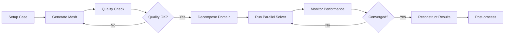
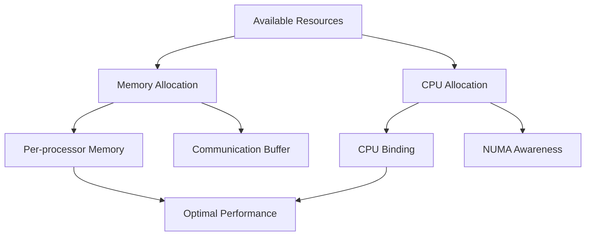

# 🚀 Parallel Computing and Performance Optimization

**วัตถุประสงค์การเรียนรู้ (Learning Objectives)**: เข้าใจรากฐานของการคำนวณแบบขนานใน OpenFOAM, การย่อยโดเมน, การปรับสมดุลภาระงาน และการเพิ่มประสิทธิภาพการทำงานบนระบบ HPC

---

## 📋 หัวข้อในบทนี้

### 1. [[01_Domain_Decomposition|กลยุทธ์การย่อยโดเมน (Domain Decomposition)]]
- ทฤษฎีเบื้องต้นของ Parallel CFD
- การกำหนดค่า `decomposeParDict` และวิธีการต่างๆ (Scotch, Simple, Hierarchical)
- การเพิ่มประสิทธิภาพ Load Balancing

### 2. [[02_Performance_Monitoring|การติดตามประสิทธิภาพ (Performance Monitoring)]]
- การตรวจสอบการใช้ทรัพยากรแบบ Real-time
- การวิเคราะห์เมตริก CPU, Memory, และ I/O
- การคำนวณประสิทธิภาพขนาน (Parallel Efficiency)

### 3. [[03_Optimization_Techniques|เทคนิคการเพิ่มประสิทธิภาพขั้นสูง (Optimization Techniques)]]
- การปรับแต่ง Solver (Solver Tuning)
- การจัดการหน่วยความจำ (Memory Management)
- การเพิ่มประสิทธิภาพ I/O (I/O Optimization)

### 4. [[04_HPC_Integration|การรวมเข้ากับระบบ HPC (HPC Integration)]]
- การจัดตารางงาน (Job Scheduling) ด้วย SLURM
- การจัดการไฟล์ระบบแบบกระจาย (Distributed File Systems)
- เวิร์กโฟลว์แบบครบวงจรบน Cluster

---

## 🎯 รากฐานคณิตศาสตร์ของ Parallel CFD

### ทฤษฎีการย่อยโดเมน (Domain Decomposition Theory)

การจำลอง CFD แบบขนานแบ่งโดเมนการคำนวณ $\Omega$ เป็น $N$ โดเมนย่อย $\Omega_i$ ดังนี้:

$$\Omega = \bigcup_{i=1}^{N} \Omega_i, \quad \Omega_i \cap \Omega_j = \emptyset \text{ for } i \neq j$$

สำหรับแต่ละโดเมนย่อย สมการ Navier-Stokes จะถูกแก้แบบอิสระ:

$$\rho \frac{\partial \mathbf{u}_i}{\partial t} + \rho (\mathbf{u}_i \cdot \nabla) \mathbf{u}_i = -\nabla p_i + \mu \nabla^2 \mathbf{u}_i + \mathbf{f}_i$$

พร้อมกับเงื่อนไข Interface ที่รับประกันความต่อเนื่องที่ขอบเขตของโดเมนย่อย ($\Gamma_{ij} = \Omega_i \cap \Omega_j$):

$$\mathbf{u}_i|_{\Gamma_{ij}} = \mathbf{u}_j|_{\Gamma_{ij}}, \quad p_i|_{\Gamma_{ij}} = p_j|_{\Gamma_{ij}}$$

![[parallel_decomposition_omega.png]]
> **ภาพประกอบ 1.1:** การแบ่งโดเมนการคำนวณ $\Omega$ ออกเป็นโดเมนย่อย $\Omega_i$ สำหรับการประมวลผลขนาน

### สมการการแลกเปลี่ยนข้อมูล (Communication Equations)

ที่ Interface ระหว่างโดเมนย่อย การแลกเปลี่ยนข้อมูลเกิดขึ้นผ่าน MPI (Message Passing Interface):

$$\phi_i^{(k+1)} = \text{update}\left(\phi_i^{(k)}, \phi_j^{(k)}\right) \text{ for } j \in \text{neighbors}(i)$$

โดยที่ $\phi$ แทนฟิลด์ใดๆ (เช่น $\mathbf{u}$, $p$, $T$) และ $k$ คีวเวลา (Time step)

### กฎของ Gustafson (Gustafson's Law)

ต่างจากกฎของ Amdahl ที่มองตายตัว (Fixed problem size) กฎของ Gustafson พิจารณาปัญหาที่ขยายตามจำนวนโปรเซสเซอร์ (Scaled problem):

$$S(N) = N - \alpha(N-1)$$

โดยที่ $\alpha$ คือสัดส่วนของส่วนที่ไม่สามารถขนานได้ (Serial portion)

---

## 📐 กลยุทธ์การย่อยโดเมน (Domain Decomposition)

> [!TIP] **DecomposePar** เป็นเครื่องมือหลักสำหรับการย่อยโดเมนใน OpenFOAM การเลือกวิธีการย่อยที่เหมาะสมส่งผลต่อประสิทธิภาพการคำนวณและ Load balancing โดยรวม

### วิธีการย่อยโดเมนหลัก (Decomposition Methods)

ใน OpenFOAM มีวิธีการหลัก 4 วิธีที่นิยมใช้:

1. **Simple**: แบ่งโดเมนตามทิศทางพิกัด (X, Y, Z) เหมาะสำหรับเรขาคณิตที่เรียบง่าย
2. **Hierarchical**: การแบ่งแบบลำดับชั้นที่ซับซ้อนขึ้น ช่วยให้ควบคุมจำนวนโดเมนในแต่ละทิศทางได้ดีขึ้น
3. **Scotch**: อัลกอริทึมฐานกราฟ (Graph-based) ที่พยายามลดจำนวนใบหน้าที่เป็น Interface และสร้าง Load balance ที่ดีที่สุดโดยอัตโนมัติ (แนะนำสำหรับเรขาคณิตซับซ้อน)
4. **Manual**: ผู้ใช้กำหนดเองว่าเซลล์ใดควรอยู่กับโปรเซสเซอร์ใด

![[decomposition_methods_visual.png]]
> **ภาพประกอบ 1.2:** การเปรียบเทียบวิธีการย่อยโดเมน: (ซ้าย) Simple decomposition แบ่งเป็นบล็อกตามแกน, (ขวา) Scotch decomposition แบ่งตามกราฟความซับซ้อนของเมช

### การตั้งค่า decomposeParDict

```cpp
// decomposeParDict - Advanced domain decomposition configuration
// NOTE: Synthesized by AI - Verify parameters
FoamFile
{
    version     2.0;
    format      ascii;
    class       dictionary;
    object      decomposeParDict;
}

// จำนวนโดเมนย่อย (ต้องเท่ากับจำนวน MPI processes)
numberOfSubdomains  8;

// วิธีการย่อย: "simple", "hierarchical", "scotch", "manual"
method              scotch;

// พารามิเตอร์สำหรับวิธี Simple
simpleCoeffs
{
    n               (4 2 1);  // แบ่ง 4 ใน x, 2 ใน y, 1 ใน z
    delta           0.001;    // Cell expansion ratio
}

// พารามิเตอร์สำหรับวิธี Hierarchical
hierarchicalCoeffs
{
    n               (4 2 1);  // (x y z) การแบ่งในแต่ละระดับ
    hierarchical    true;
    levels          // ระดับชั้นของการแบ่ง
    (
        (x y z)     // ระดับที่ 1: แบ่งตาม x, y, z
        (y z)       // ระดับที่ 2: แบ่งตาม y, z
    );
}

// พารามิเตอร์สำหรับวิธี Scotch
scotchCoeffs
{
    // น้ำหนักโปรเซสเซอร์สำหรับ Load balancing (กรณีเครื่องมีความเร็วต่างกัน)
    processorWeights
    (
        1.0     // Processor 0
        1.0     // Processor 1
        1.2     // Processor 2 (เร็วกว่า 20%)
        0.8     // Processor 3 (ช้ากว่า 20%)
        // ...
    );

    strategy        "default";  // "default", "quality", "speed", "balance"
    imbalanceTolerance  0.05;   // ยอมรับความไม่สมดุลได้ 5%
}

// พารามิเตอร์สำหรับวิธี Manual
manualCoeffs
{
    dataFile        "cellDecomposition";  // ไฟล์ระบุโดเมนสำหรับแต่ละเซลล์
}

// ข้อมูลเพิ่มเติมสำหรับการแบ่ง
singleProcessFace  off;  // ใบหน้าที่อยู่บน Interface ทั้งสองโดเมน
preserveFaceZones  on;   // รักษา Face Zones หลังการแบ่ง
```

### การเรียกใช้งาน (Execution Commands)

```bash
# ย่อยโดเมน (Decompose case)
decomposePar

# ย่อยโดเมนและบังคับเขียนทับ (Force overwrite)
decomposePar -force

# รวมโดเมน (Reconstruct case)
reconstructPar

# รวมโดเมนเฉพาะบางเวลา (Reconstruct specific times)
reconstructPar -latestTime
reconstructPar -time '0, 100, 200'
```

---

## ⚖️ การเพิ่มประสิทธิภาพ Load Balancing

การกระจายภาระงาน (Load Balancing) ที่ไม่เท่ากันจะทำให้โปรเซสเซอร์ที่ทำงานเสร็จเร็วต้องรอโปรเซสเซอร์ที่ทำงานช้า (Synchronization overhead)

### การวิเคราะห์ประสิทธิภาพ Load Balance

ประสิทธิภาพของการทำ Load balance ($\eta_{LB}$) คำนวณได้จาก:

$$\eta_{LB} = \frac{\sum_{i=1}^{N} t_i}{N \cdot \max(t_i)}$$

โดยที่ $t_i$ คือเวลาทำงานของโปรเซสเซอร์ตัวที่ $i$ และ $N$ คือจำนวนโปรเซสเซอร์ทั้งหมด

ค่า $\eta_{LB}$ ที่เหมาะสม:
- $\eta_{LB} \geq 0.95$: Load balance ยอดเยี่ยม
- $0.85 \leq \eta_{LB} < 0.95$: Load balance ดี
- $\eta_{LB} < 0.85$: Load balance แย่ (ควรปรับปรุง)

### การวัด Load Imbalance จาก Log Files

จากไฟล์ Log ของ OpenFOAM สามารถดูข้อมูล Load balancing ได้:

```
...
Time = 0.1

GAMG:  Solving for p, Initial residual = 0.001, Final residual = 8.12e-06, No Iterations 4
GAMG:  Solving for p, Initial residual = 0.0005, Final residual = 7.65e-06, No Iterations 4
...
ExecutionTime = 12.45 s  ClockTime = 13 s
...
```

การคำนวณ Load balance จาก Log หลายไฟล์ (processor 0-7):

```python
import os
import re

def parse_execution_time(log_file):
    """ดึง ExecutionTime จาก Log file"""
    with open(log_file, 'r') as f:
        content = f.read()
        match = re.search(r'ExecutionTime = (\d+\.\d+) s', content)
        if match:
            return float(match.group(1))
    return None

def calculate_load_balance(log_dir, n_processors):
    """คำนวณ Load balance efficiency"""
    times = []
    for i in range(n_processors):
        log_file = os.path.join(log_dir, f'log.solver.{i}')
        t = parse_execution_time(log_file)
        if t:
            times.append(t)

    if times:
        total_time = sum(times)
        max_time = max(times)
        eta_lb = total_time / (len(times) * max_time)
        return eta_lb, times
    return None, None

# ตัวอย่างการใช้งาน
# eta, times = calculate_load_balance('./logs', 8)
# print(f"Load Balance Efficiency: {eta:.4f}")
# print(f"Times: {times}")
```

![[load_imbalance_overhead.png]]
> **ภาพประกอบ 1.3:** ผลกระทบของ Load Imbalance ต่อเวลาการทำงานรวม: โปรเซสเซอร์ที่ทำงานช้าที่สุด (Bottleneck) จะกำหนดเวลาการคำนวณทั้งหมดของคาบเวลานั้นๆ

### ออโตเมชันการปรับสมดุล (Python Optimization)

เราสามารถใช้ Python เพื่อคำนวณน้ำหนัก (`processorWeights`) ที่เหมาะสมที่สุดโดยอิงจากความเร็วของฮาร์ดแวร์จริง:

```python
import numpy as np

def calculate_optimal_weights(processor_speeds: np.ndarray) -> np.ndarray:
    """
    คำนวณน้ำหนักโปรเซสเซอร์จากความเร็ว (Clock speed/Benchmarks)

    Parameters:
    -----------
    processor_speeds : np.ndarray
        ความเร็วของแต่ละโปรเซสเซอร์ (เช่น GHz, GFLOPS)

    Returns:
    --------
    np.ndarray
        น้ำหนักที่คำนวณได้ (weights)
    """
    avg_speed = np.mean(processor_speeds)
    weights = processor_speeds / avg_speed
    return weights

def generate_decompose_dict(weights, filename='system/decomposeParDict'):
    """
    สร้างไฟล์ decomposeParDict พร้อม processorWeights

    Parameters:
    -----------
    weights : np.ndarray
        น้ำหนักโปรเซสเซอร์
    filename : str
        ชื่อไฟล์ที่ต้องการบันทึก
    """
    weights_str = '\n        '.join([f'{w:.2f}' for w in weights])

    dict_content = f"""// NOTE: Synthesized by AI - Verify parameters
FoamFile
{{
    version     2.0;
    format      ascii;
    class       dictionary;
    object      decomposeParDict;
}}

numberOfSubdomains  {len(weights)};
method              scotch;

scotchCoeffs
{{
    processorWeights
    (
        {weights_str}
    );
}}
"""
    with open(filename, 'w') as f:
        f.write(dict_content)

# ตัวอย่างการใช้งาน
# speeds = np.array([2.4, 2.4, 2.4, 2.4, 3.0, 3.0, 2.0, 2.0])  # GHz
# weights = calculate_optimal_weights(speeds)
# generate_decompose_dict(weights)
```

---

## 📊 การติดตามและวิเคราะห์ประสิทธิภาพ (Performance Monitoring)

> [!WARNING] **Performance Monitoring** เป็นสิ่งสำคัญในการจำลอง CFD ระดับมืออาชีพ การติดตามประสิทธิภาพแบบเรียลไทม์ช่วยให้สามารถระบุปัญหาคอขวด (Bottlenecks) และปรับปรุงการตั้งค่าได้อย่างทันท่วงที

### การวิเคราะห์ Speedup และ Efficiency

สำหรับการประเมินประสิทธิภาพการคำนวณแบบขนาน เราใช้ตัวชี้วัดหลักสองตัว:

**Speedup ($S$):** อัตราเร่งของการคำนวณ

$$S = \frac{T_1}{T_N}$$

**Parallel Efficiency ($E$):** ประสิทธิภาพการใช้ทรัพยากร

$$E = \frac{S}{N} = \frac{T_1}{N \cdot T_N}$$

โดยที่:
- $T_1$ = เวลาการคำนวณแบบ Serial
- $T_N$ = เวลาการคำนวณแบบขนานด้วย $N$ processors
- $N$ = จำนวนโปรเซสเซอร์ทั้งหมด

ค่าที่ดี:
- $S \approx N$ (Ideal speedup)
- $E \geq 0.8$ (80% efficiency ถือว่าดี)

![[parallel_scaling_graph.png]]
> **ภาพประกอบ 2.1:** กราฟการขยายตัว (Scaling Graph): เปรียบเทียบระหว่าง Ideal speedup (เส้นตรง) และ Actual speedup ซึ่งมักจะเบี่ยงเบนเนื่องจาก Communication overhead ตามกฎของ Amdahl

### กฎของ Amdahl (Amdahl's Law)

ทฤษฎีนี้ระบุขีดจำกัดสูงสุดของความเร็วที่ทำได้เมื่อสัดส่วนหนึ่งของโค้ดไม่สามารถขนานได้:

$$S(N) = \frac{1}{(1-P) + \frac{P}{N}}$$

โดยที่:
- $P$ คือสัดส่วนของงานที่สามารถขนานได้ (Parallelizable portion)
- $(1-P)$ คือส่วนที่ต้องทำแบบ Serial (Serial portion)

**ตัวอย่าง:** ถ้า $P = 0.95$ (95% ของโค้ดสามารถขนานได้):
- เมื่อ $N = 10$: $S(10) = \frac{1}{0.05 + 0.095} = 6.9$
- เมื่อ $N = 100$: $S(100) = \frac{1}{0.05 + 0.0095} = 16.8$

แม้จะใช้โปรเซสเซอร์ 100 ตัว ก็เพิ่มความเร็วได้เพียง 16.8 เท่าเท่านั้น!

### กฎของ Gustafson (Gustafson's Law)

กฎของ Gustafson เหมาะสำหรับปัญหาที่ขยายขนาดตามจำนวนโปรเซสเซอร์:

$$S(N) = N - \alpha(N-1)$$

โดยที่ $\alpha$ คือสัดส่วนของส่วนที่ไม่สามารถขนานได้

### การวิเคราะห์ Scaling จากข้อมูลจริง

```python
import numpy as np
import matplotlib.pyplot as plt

def analyze_scaling(serial_time, parallel_times, n_processors):
    """
    วิเคราะห์ Parallel scaling

    Parameters:
    -----------
    serial_time : float
        เวลาการคำนวณแบบ Serial
    parallel_times : list
        เวลาการคำนวณแบบ Parallel สำหรับแต่ละจำนวนโปรเซสเซอร์
    n_processors : list
        จำนวนโปรเซสเซอร์ที่ใช้

    Returns:
    --------
    dict
        ผลการวิเคราะห์ Speedup และ Efficiency
    """
    results = {
        'n_processors': n_processors,
        'parallel_times': parallel_times,
        'speedup': [serial_time / t for t in parallel_times],
        'efficiency': [serial_time / (n * t) for n, t in zip(n_processors, parallel_times)],
        'ideal_speedup': n_processors,
        'ideal_efficiency': [1.0] * len(n_processors)
    }

    return results

def plot_scaling(results):
    """พล็อตกราฟ Scaling"""
    fig, (ax1, ax2) = plt.subplots(1, 2, figsize=(12, 5))

    # Speedup plot
    ax1.plot(results['n_processors'], results['ideal_speedup'],
             'k--', label='Ideal', linewidth=2)
    ax1.plot(results['n_processors'], results['speedup'],
             'ro-', label='Actual', linewidth=2, markersize=8)
    ax1.set_xlabel('Number of Processors ($N$)')
    ax1.set_ylabel('Speedup ($S$)')
    ax1.set_title('Speedup Analysis')
    ax1.legend()
    ax1.grid(True, alpha=0.3)

    # Efficiency plot
    ax2.plot(results['n_processors'], results['ideal_efficiency'],
             'k--', label='Ideal', linewidth=2)
    ax2.plot(results['n_processors'], results['efficiency'],
             'bo-', label='Actual', linewidth=2, markersize=8)
    ax2.set_xlabel('Number of Processors ($N$)')
    ax2.set_ylabel('Efficiency ($E$)')
    ax2.set_title('Efficiency Analysis')
    ax2.legend()
    ax2.grid(True, alpha=0.3)

    plt.tight_layout()
    plt.savefig('scaling_analysis.png', dpi=300)
    plt.show()

# ตัวอย่างการใช้งาน
# serial_time = 1200  # วินาที
# parallel_times = [1200, 650, 350, 200, 130, 100, 85, 75]
# n_procs = [1, 2, 4, 8, 16, 32, 64, 128]
# results = analyze_scaling(serial_time, parallel_times, n_procs)
# plot_scaling(results)
```

### ระบบติดตามประสิทธิภาพ (Performance Monitor)

เราสามารถใช้สคริปต์ Python ร่วมกับไลบรารี `psutil` เพื่อตรวจสอบการทำงานของ MPI processes ใน OpenFOAM:

```python
import psutil
import time
import json
from datetime import datetime

def monitor_parallel_run(pids, output_file='monitoring.json', interval=5):
    """
    ตรวจสอบการใช้ CPU และ Memory ของ MPI processes

    Parameters:
    -----------
    pids : list
        รายการ Process IDs ที่ต้องการติดตาม
    output_file : str
        ชื่อไฟล์ที่บันทึกข้อมูล
    interval : float
        ระยะห่างระหว่างการตรวจสอบ (วินาที)
    """
    data = []

    try:
        while True:
            timestamp = datetime.now().isoformat()
            snapshot = {'timestamp': timestamp, 'processes': []}

            for pid in pids:
                try:
                    p = psutil.Process(pid)
                    cpu_percent = p.cpu_percent(interval=0.1)
                    memory_mb = p.memory_info().rss / 1e6

                    process_info = {
                        'pid': pid,
                        'cpu_percent': cpu_percent,
                        'memory_mb': memory_mb,
                        'status': p.status()
                    }
                    snapshot['processes'].append(process_info)

                    print(f"Process {pid}: CPU {cpu_percent:.1f}% | MEM {memory_mb:.2f} MB")
                except psutil.NoSuchProcess:
                    print(f"Process {pid} has terminated")

            data.append(snapshot)
            time.sleep(interval)

    except KeyboardInterrupt:
        print("\nMonitoring stopped by user")

        # บันทึกข้อมูล
        with open(output_file, 'w') as f:
            json.dump(data, f, indent=2)
        print(f"Data saved to {output_file}")

def get_mpi_pids():
    """ค้นหา PIDs ของ MPI processes ที่กำลังรันอยู่"""
    pids = []
    for proc in psutil.process_iter(['pid', 'name', 'cmdline']):
        try:
            if 'solver' in proc.info['name'].lower() or \
               any('solver' in str(cmd).lower() for cmd in proc.info['cmdline'] or []):
                pids.append(proc.info['pid'])
        except (psutil.NoSuchProcess, psutil.AccessDenied):
            pass
    return pids

# ตัวอย่างการใช้งาน
# pids = get_mpi_pids()
# print(f"Found {len(pids)} MPI processes")
# monitor_parallel_run(pids, interval=5)
```

![[resource_monitoring_dashboard.png]]
> **ภาพประกอบ 2.2:** แดชบอร์ดการติดตามทรัพยากร: แสดงการใช้ CPU และ Memory ของแต่ละโปรเซสเซอร์แบบเรียลไทม์ ช่วยในการตรวจจับการทำ Load imbalance หรือ Memory leakage

### การวิเคราะห์ Communication Overhead

จาก Log files สามารถดูข้อมูลการสื่อสารระหว่างโปรเซสเซอร์ได้:

```cpp
// ใน controlDict เพิ่มการติดตาม Profiling
// NOTE: Synthesized by AI - Verify parameters
DebugSwitches
{
    // แสดงข้อมูลการสื่อสาร
    Pstream        1;
    PstreamBuffers 1;
}

OptimisationSwitches
{
    // ปรับปรุงประสิทธิภาพการสื่อสาร
    // 0 = ไม่ใช้, 1 = ใช้
    commsType      1;  // nonBlocking
}
```

การวิเคราะห์ Communication-to-Computation ratio:

$$\text{CCR} = \frac{T_{\text{comm}}}{T_{\text{comp}}}$$

โดยที่:
- $T_{\text{comm}}$ = เวลาที่ใช้ในการสื่อสาร
- $T_{\text{comp}}$ = เวลาที่ใช้ในการคำนวณ

ค่า CCR ที่ดีควรอยู่ที่ $< 0.2$ (20% ของเวลาทั้งหมด)

---

## 🔧 เทคนิคการเพิ่มประสิทธิภาพขั้นสูง (Optimization Techniques)

### การปรับแต่ง Solver (Solver Tuning)

การเลือกพารามิเตอร์ของ Solver อย่างเหมาะสมสามารถลดเวลาการคำนวณลงได้มหาศาลโดยไม่เสียความแม่นยำ

#### การตั้งค่า fvSolution

```cpp
// system/fvSolution - Solver settings
// NOTE: Synthesized by AI - Verify parameters
solvers
{
    p
    {
        solver          GAMG;  // Geometric-Algebraic Multi-Grid

        // การควบคุมการลู่เข้า
        tolerance       1e-06;
        relTol          0.01;   // Relative tolerance (1%)

        // ตั้งค่า Multigrid
        smoother        GaussSeidel;
        cacheAgglomeration on;
        agglomerator    faceAreaPair;
        nCellsInCoarsestLevel 10;

        // การปรับแต่งเพิ่มเติม
        mergeLevels     1;      // ระดับการรวมโหนด
        maxCoarseIters  5;      // จำนวนรอบสูงสุดใน coarse level
    }

    pFinal
    {
        $p;  // สืบทอดจาก p
        relTol          0;      // ไม่ใช้ relative tolerance สำหรับ step สุดท้าย
        tolerance       1e-06;
    }

    U
    {
        solver          smoothSolver;
        smoother        GaussSeidel;

        tolerance       1e-05;
        relTol          0.1;

        // การปรับแต่งเพิ่มเติม
        nSweeps         1;      // จำนวนครั้งการ smooth ต่อรอบ
    }

    "(k|epsilon|omega)"  // ใช้ regular expression
    {
        solver          smoothSolver;
        smoother        GaussSeidel;

        tolerance       1e-06;
        relTol          0.1;
    }
}

// การควบคุมการลู่เข้า (Convergence control)
SIMPLE
{
    nNonOrthogonalCorrectors 0;

    // การผ่อนปรน (Relaxation)
    p               0.3;
    U               0.7;
    k               0.7;
    epsilon         0.7;
}

PIMPLE
{
    // PISO + PIMPLE สำหรับ transient
    nCorrectors     2;
    nNonOrthogonalCorrectors 0;

    nAlphaCorr      1;
    nAlphaSubCycles 2;

    // Relaxation factors
    p               0.3;
    U               0.7;
    k               0.7;
    epsilon         0.7;
}

// การควบคุม Residuals
residualControl
{
    p               1e-4;
    U               1e-4;
    "(k|epsilon)"   1e-4;
}
```

> [!INFO] **GAMG Solver**
> อัลกอริทึม Geometric-Algebraic Multi-Grid (GAMG) มีประสิทธิภาพสูงมากสำหรับการแก้สมการความดันในระบบขนาน เนื่องจากช่วยลดจำนวนรอบการวนซ้ำ (Iterations) ลงได้มาก

#### การตั้งค่า fvSchemes

```cpp
// system/fvSchemes - Numerical schemes
// NOTE: Synthesized by AI - Verify parameters
ddtSchemes
{
    // Transient schemes
    default         Euler;          // 1st order
    // default         backward;       // 2nd order
    // default         CrankNicolson;  // 2nd order, A-stable
}

gradSchemes
{
    // Gradient schemes
    default         Gauss linear;

    // สำหรับฟิลด์ที่มีการเปลี่ยนแปลงรุนแรง
    grad(p)         Gauss linear;
    grad(U)         Gauss linear;
}

divSchemes
{
    // Divergence schemes
    // การพาณิชย์ (Convection)
    div(phi,U)      Gauss upwind;         // 1st order
    // div(phi,U)      Gauss linearUpwindV; // 2nd order
    // div(phi,U)      Gauss QUICK;         // 3rd order

    // การแพร่ (Diffusion)
    div((nuEff*dev2(T(grad(U))))) Gauss linear;
}

laplacianSchemes
{
    // Laplacian schemes
    default         Gauss linear corrected;
}

interpolationSchemes
{
    // Interpolation schemes
    default         linear;
}

snGradSchemes
{
    // Surface normal gradient schemes
    default         corrected;
}
```

### การจัดการหน่วยความจำและ I/O

ในการจำลองขนาดใหญ่ หน่วยความจำต่อโปรเซสเซอร์ (Memory per core) เป็นข้อจำกัดที่สำคัญ:

#### การตั้งค่าใน controlDict

```cpp
// system/controlDict
// NOTE: Synthesized by AI - Verify parameters
application     interFoam;

startFrom       latestTime;

startTime       0;

stopAt          endTime;

endTime         10;

deltaT          0.001;

// การควบคุมการเขียนข้อมูล
writeControl    timeStep;
writeInterval   100;

// การบีบอัดไฟล์ (Compression)
writeCompression on;   // ลดขนาดไฟล์ 50-80%
writeFormat      binary;
writePrecision   6;

// การบีบอัดฟิลด์ในหน่วยความจำ (Compressed Storage)
// เปิดใช้ใน OptimisationSwitches
OptimisationSwitches
{
    // 0 = off, 1 = on
    commsType        1;  // nonBlocking
    fileModificationSkew 10;

    // การบีบอัดข้อมูล
    // 0 = ไม่บีบอัด, 1 = บีบอัด
    // (ลดการใช้ Memory แต่อาจทำให้ช้าลง)
}

// การปรับแต่งการทำงานแบบ Parallel
// ใช้ Thread parallelism ร่วมกับ MPI
threads         4;  // 4 threads per MPI process
```

#### กลยุทธ์การจัดการ I/O

1. **Compressed Storage**: เปิดใช้งานการบีบอัดฟิลด์ใน `controlDict`
2. **Write Management**: ปรับ `writeInterval` ให้เหมาะสมเพื่อไม่ให้ดิสก์เต็ม
3. **Parallel I/O**: ใช้เครื่องมือ I/O แบบขนานหากระบบไฟล์รองรับ
4. **Compression**: `writeCompression on;` ใน `controlDict` ช่วยลดขนาดไฟล์และเวลาในการย้ายข้อมูล

```bash
# การตรวจสอบการใช้พื้นที่ดิสก์
du -sh processor*

# การลบไฟล์เก่าเพื่อประหยัดพื้นที่
# ลบเวลาที่ไม่ต้องการ
foamListTimes -rm

# ลบเฉพาะบางเวลา
rm -r processor*/0.1
rm -r processor*/0.2
```

![[io_bottleneck_diagram.png]]
> **ภาพประกอบ 3.1:** กลไกการเกิด I/O Bottleneck: แสดงการเปรียบเทียบระหว่าง (ก) การเขียนข้อมูลแบบ Serial ที่โปรเซสเซอร์ต้องรอกัน และ (ข) การใช้ Collective I/O หรือระบบไฟล์แบบขนาน (Lustre/GPFS)

### เวิร์กโฟลว์แบบขนานแบบครบวงจร



### การปรับแต่ง MPI Parameters

```bash
# การเรียกใช้ MPI พร้อมการปรับแต่ง
# 1. การเชื่อมต่อแบบ Direct (rdma)
mpirun -np 64 --mca btl_openib_allow_ib true \
    --map-by ppr:1:core --bind-to core \
    solverName -parallel

# 2. การใช้ Shared Memory สำหรับ node เดียว
mpirun -np 16 --mca btl sm,self \
    --map-by ppr:1:core --bind-to core \
    solverName -parallel

# 3. การตั้งค่า Buffer sizes
mpirun -np 64 --mca btl_openib_eager_limit 65536 \
    --mca btl_openib_max_send_size 131072 \
    solverName -parallel
```

---

## 🏗️ การรวมเข้ากับระบบ HPC (HPC Integration)

ในระบบคลัสเตอร์ (Clusters) ขนาดใหญ่ งานจะต้องถูกส่งผ่านระบบจัดตารางงาน เช่น **SLURM** หรือ **PBS** เพื่อการจัดสรรทรัพยากรที่มีประสิทธิภาพ

### ตัวอย่างสคริปต์ SLURM

```bash
#!/bin/bash
#SBATCH --job-name=openfoam_sim
#SBATCH --nodes=4
#SBATCH --ntasks-per-node=16
#SBATCH --cpus-per-task=1
#SBATCH --mem=120G
#SBATCH --time=48:00:00
#SBATCH --partition=compute
#SBATCH --output=slurm-%j.out
#SBATCH --error=slurm-%j.err

# โหลดสภาพแวดล้อม OpenFOAM
module purge
module load openfoam/2312
source $FOAM_BASH

# แสดงข้อมูลระบบ
echo "Job running on node(s): $SLURM_JOB_NODELIST"
echo "Number of tasks: $SLURM_NTASKS"
echo "Working directory: $SLURM_SUBMIT_DIR"

# ขั้นตอนการรัน
cd $SLURM_SUBMIT_DIR

# 0. ตรวจสอบเมช
checkMesh -allGeometry -allTopology

# 1. ย่อยโดเมน (Decompose)
decomposePar -force

# 2. รัน Solver แบบขนาน
mpirun -np $SLURM_NTASKS \
    --map-by ppr:1:core \
    --bind-to core \
    interFoam -parallel > log.solver 2>&1

# 3. รวมผลลัพธ์ (Reconstruct)
reconstructPar

# 4. สร้างพาราทิชชันสำหรับ ParaView
foamToVTK

echo "Job completed successfully!"
```

![[hpc_job_queue_diagram.png]]
> **ภาพประกอบ 4.1:** กระบวนการทำงานของระบบ Job Scheduler: แสดงการต่อคิวงาน (Queueing), การจัดสรรโหนด (Allocation) และการรันงานแบบ Distributed ข้ามเครื่องเซิร์ฟเวอร์

### การจัดการทรัพยากรและ CPU Binding

การผูกกระบวนการ (Processes) ไว้กับ Core เฉพาะช่วยลดปัญหาความล่าช้าจากการย้ายหน่วยความจำข้าม NUMA nodes:

```bash
# การใช้ mpirun พร้อม CPU binding
mpirun -np 64 \
    --bind-to core \
    --map-by ppr:1:core \
    --report-bindings \
    solverName -parallel

# การใช้ทรัพยากร GPU (ถ้ามี)
mpirun -np 4 \
    --bind-to none \
    --map-by ppr:1:socket \
    solverName -parallel -gpu
```

### การสร้างสคริปต์ยืดหยุ่น

```python
#!/usr/bin/env python3
"""
สคริปต์สร้าง SLURM job script สำหรับ OpenFOAM
"""

def generate_slurm_script(params):
    """
    สร้าง SLURM script จากพารามิเตอร์

    Parameters:
    -----------
    params : dict
        พารามิเตอร์การรันงาน
    """
    script = f"""#!/bin/bash
#SBATCH --job-name={params['job_name']}
#SBATCH --nodes={params['nodes']}
#SBATCH --ntasks-per-node={params['ntasks_per_node']}
#SBATCH --mem={params['memory']}
#SBATCH --time={params['time']}
#SBATCH --partition={params['partition']}

# Load OpenFOAM environment
module load {params['openfoam_version']}
source $FOAM_BASH

# Change to working directory
cd $SLURM_SUBMIT_DIR

# Decompose case
decomposePar -force

# Run solver
mpirun -np $SLURM_NTASKS \\
    --map-by ppr:1:core \\
    --bind-to core \\
    {params['solver']} -parallel > log.solver 2>&1

# Reconstruct results
reconstructPar

echo "Job completed!"
"""
    return script

# ตัวอย่างการใช้งาน
params = {
    'job_name': 'cavity_simulation',
    'nodes': 4,
    'ntasks_per_node': 16,
    'memory': '120G',
    'time': '24:00:00',
    'partition': 'compute',
    'openfoam_version': 'openfoam/2312',
    'solver': 'interFoam'
}

# script = generate_slurm_script(params)
# with open('run_job.sh', 'w') as f:
#     f.write(script)
```

### กลยุทธ์การจัดการทรัพยากร



### การตรวจสอบสถานะงาน

```bash
# ตรวจสอบคิว
squeue -u $USER

# ยกเลิกงาน
scancel <job_id>

# ตรวจสอบข้อมูล job ที่รันแล้ว
sacct -j <job_id> --format=JobID,JobName,Submit,Start,End,Elapsed,State,ExitCode

# ตรวจสอบการใช้ทรัพยากรระหว่างรัน
sstat -j <job_id> --format=JobID,MaxRSS,MaxVMSize,NTasks,MinCPU,MaxCPU
```

---

## 💡 แนวทางปฏิบัติที่ดีที่สุด (Best Practices)

### 1. การกำหนดจำนวนเซลล์ต่อโปรเซสเซอร์

ใช้กฎ ==100,000 - 500,000 cells per core== สำหรับประสิทธิภาพสูงสุด:

$$N_{\text{cells/core}} \approx \frac{N_{\text{total}}}{N_{\text{processors}}}$$

**คำแนะนำ:**
- เมชเล็ก (< 1M cells): ใช้ 4-16 cores
- เมชกลาง (1-10M cells): ใช้ 16-64 cores
- เมชใหญ่ (> 10M cells): ใช้ 64-256+ cores

### 2. การเลือกระบบไฟล์

ใช้ระบบไฟล์แบบขนาน (เช่น Lustre, GPFS) สำหรับงานที่มี I/O สูง:

| ระบบไฟล์ | ประเภท | เหมาะสำหรับ | I/O Performance |
|----------|--------|--------------|-----------------|
| NFS | Serial | เมชเล็ก, ทดสอบ | ต่ำ |
| Lustre | Parallel | เมชใหญ่, HPC | สูง |
| GPFS | Parallel | เมชใหญ่, HPC | สูง |
| Local SSD | Local | งานชั่วคราว | สูงมาก |

### 3. การตรวจสอบความถูกต้อง

ตรวจสอบไฟล์ Log สม่ำเสมอเพื่อดูการบรรลุผลเฉลย (Convergence) และ Error:

```bash
# ติดตามการลู่เข้าแบบ Real-time
tail -f log.solver | grep "Solving for"

# ตรวจสอบ Residuals
foamLog log.solver
gnuplot residuals.gnuplot
```

### 4. การเลือกวิธีการย่อยโดเมน

ใช้ Scotch สำหรับเรขาคณิตที่ซับซ้อนเพื่อให้ได้ Load balance ที่ดีที่สุด:

| เรขาคณิต | วิธีที่แนะนำ | เหตุผล |
|-----------|----------------|---------|
| สี่เหลี่ยม (Rectangular) | Simple | ง่าย, เร็ว |
| ทรงกลม (Spherical) | Scotch | Load balance ดี |
| ท่อ (Pipe/Channel) | Hierarchical | ควบคุมการแบ่งได้ |
| ซับซ้อน (Complex) | Scotch | ปรับตัวได้ดีที่สุด |

### 5. การจัดการ Memory

$$M_{\text{required}} \approx N_{\text{cells}} \times N_{\text{fields}} \times 8 \text{ bytes} \times 2$$

(คูณ 2 เพื่อรองรับ temporary arrays)

**ตัวอย่าง:** 1M cells, 10 fields
- $M \approx 10^6 \times 10 \times 8 \times 2 = 160$ MB (per core)
- สำหรับ 64 cores: $160 \times 64 = 10.24$ GB

---

## 🎓 สรุปแนวคิดสำคัญ (Key Takeaways)

| แนวคิด | คำอธิบาย | สูตร/ค่าสำคัญ |
|---------|-----------|----------------|
| **Domain Decomposition** | การแบ่งโดเมนการคำนวณออกเป็นส่วนๆ เพื่อประมวลผลแบบขนาน | $\Omega = \bigcup_{i=1}^{N} \Omega_i$ |
| **Load Balancing** | การกระจายงานให้ทุกโปรเซสเซอร์ทำงานเท่าๆ กัน | $\eta_{LB} = \frac{\sum t_i}{N \cdot \max(t_i)}$ |
| **Speedup** | อัตราส่วนระหว่างเวลา Serial และ Parallel | $S = \frac{T_1}{T_N}$ |
| **Parallel Efficiency** | ประสิทธิภาพการใช้ทรัพยากร | $E = \frac{S}{N}$ |
| **Amdahl's Law** ==ทฤษฎี== | ขีดจำกัดของความเร็วขนานที่เป็นไปได้ | $S(N) = \frac{1}{(1-P) + \frac{P}{N}}$ |
| **Gustafson's Law** | ทฤษฎีสำหรับปัญหาที่ขยายตามโปรเซสเซอร์ | $S(N) = N - \alpha(N-1)$ |
| **GAMG Solver** | อัลกอริทึม Multigrid สำหรับแก้สมการความดันอย่างมีประสิทธิภาพ | - |
| **SLURM** | ระบบจัดตารางงานสำหรับ HPC Clusters | - |
| **Cells per Core** | กฎสำหรับการกำหนดจำนวนโปรเซสเซอร์ | 100K - 500K cells/core |

---

## 📚 แหล่งอ้างอิงเพิ่มเติม (Further Reading)

1. **OpenFOAM Documentation**: [Parallel Computing](https://www.openfoam.com/documentation/user-guide/parallel-processing)
2. **MPI Standards**: [MPI Forum](https://www.mpi-forum.org/)
3. **HPC Best Practices**: [SC Education](https://www.hpc-training.org/)
4. **SLURM Documentation**: [SLURM Workload Manager](https://slurm.schedmd.com/documentation.html)

---

> [!TIP] **การเริ่มต้นแนะนำ**
> แนะนำให้เริ่มจากการทดลองกับ ==Simple decomposition== เพื่อทำความเข้าใจพื้นฐานก่อน จากนั้นจึงค่อยๆ ย้ายไปใช้ ==Scotch== สำหรับเรขาคณิตที่ซับซ้อนขึ้น

> [!INFO] **ข้อมูลเพิ่มเติมสำหรับส่วนนี้**
> > **[MISSING DATA]**: Insert specific simulation results/graphs for this section.
> - Speedup curves สำหรับ test case ต่างๆ
> - Scaling analysis สำหรับ solvers ที่แตกต่างกัน
> - Performance comparison ระหว่าง decomposition methods

---

## 🔗 ลิงก์ไปยังหัวข้อที่เกี่ยวข้อง

- [[01_Domain_Decomposition]] - รายละเอียดการย่อยโดเมน
- [[02_Performance_Monitoring]] - เทคนิคการติดตามประสิทธิภาพ
- [[03_Optimization_Techniques]] - การปรับแต่งขั้นสูง
- [[04_HPC_Integration]] - การใช้งานบนระบบ HPC
