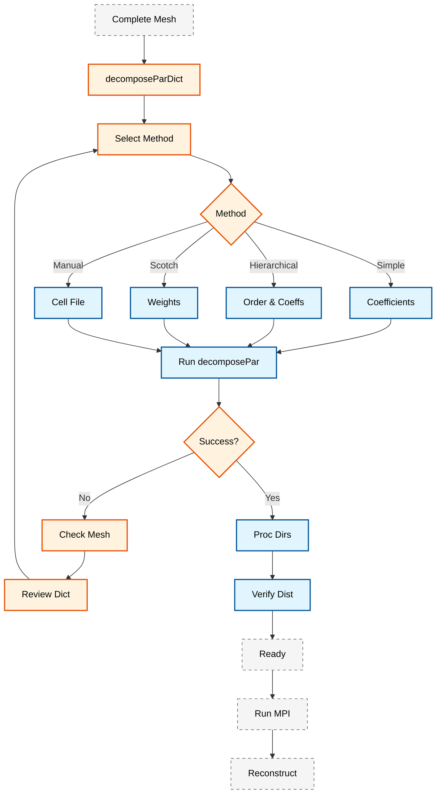
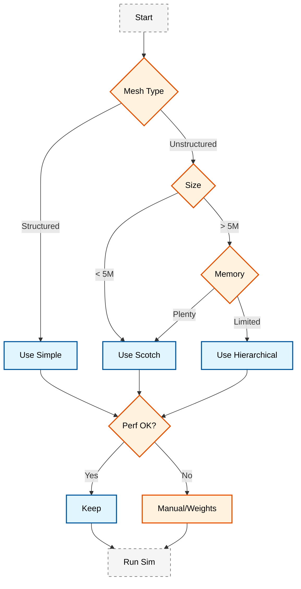

# 📐 กลยุทธ์การย่อยโดเมน (Domain Decomposition Strategies)

**วัตถุประสงค์การเรียนรู้ (Learning Objectives)**: เข้าใจทฤษฎีเบื้องต้นของ Parallel CFD, การกำหนดค่า `decomposeParDict`, วิธีการย่อยโดเมนที่แตกต่าง (Scotch, Simple, Hierarchical), และการเพิ่มประสิทธิภาพ Load Balancing

---

## 1. รากฐานคณิตศาสตร์ของ Parallel CFD

> [!INFO] **Domain Decomposition Fundamentals**
> การจำลอง CFD แบบขนานแบ่งโดเมนการคำนวณ $\Omega$ เป็น $N$ โดเมนย่อย $\Omega_i$ ที่ไม่ซ้อนทับกัน

### 1.1 การแบ่งโดเมนทางคณิตศาสตร์

โดเมนการคำนวณ $\Omega$ ถูกแบ่งเป็นโดเมนย่อยดังนี้:

$$\Omega = \bigcup_{i=1}^{N} \Omega_i, \quad \Omega_i \cap \Omega_j = \emptyset \text{ for } i \neq j$$

สำหรับแต่ละโดเมนย่อย สมการ Navier-Stokes จะถูกแก้แบบอิสระ:

$$\rho \frac{\partial \mathbf{u}_i}{\partial t} + \rho (\mathbf{u}_i \cdot \nabla) \mathbf{u}_i = -\nabla p_i + \mu \nabla^2 \mathbf{u}_i + \mathbf{f}_i$$

พร้อมกับเงื่อนไข Interface ที่รับประกันความต่อเนื่องที่ขอบเขตของโดเมนย่อย

#### 1.1.1 เงื่อนไขความต่อเนื่องที่ Interface (Interface Continuity Conditions)

ที่ขอบเขต $\Gamma_{ij} = \partial \Omega_i \cap \partial \Omega_j$ ระหว่างโดเมนย่อย $i$ และ $j$ จะต้องมีการแลกเปลี่ยนข้อมูล (Message Passing):

$$\mathbf{u}_i|_{\Gamma_{ij}} = \mathbf{u}_j|_{\Gamma_{ij}}, \quad p_i|_{\Gamma_{ij}} = p_j|_{\Gamma_{ij}}$$

ซึ่งทำให้เกิด ==Communication Overhead== ที่สำคัญใน Parallel Computation

#### 1.1.2 สมการขนาดสำหรับ Parallel Speedup

ประสิทธิภาพของ Parallel Computation วัดด้วย Speedup ($S$) และ Efficiency ($E$):

$$\begin{align}
S(N) &= \frac{T_1}{T_N} \tag{1.1} \\
E(N) &= \frac{S(N)}{N} = \frac{T_1}{N \cdot T_N} \tag{1.2}
\end{align}$$

โดยที่:
- $T_1$ คือเวลาการคำนวณแบบ Serial (1 processor)
- $T_N$ คือเวลาการคำนวณแบบ Parallel ($N$ processors)
- $N$ คือจำนวน processors

ตาม ==Amdahl's Law==:

$$S(N) \leq \frac{1}{(1-P) + \frac{P}{N}}$$

เมื่อ $P$ คือส่วนของโปรแกรมที่สามารถ Parallelize ได้

![[parallel_decomposition_omega.png]]
> **ภาพประกอบ 1.1:** การแบ่งโดเมนการคำนวณ $\Omega$ ออกเป็นโดเมนย่อย $\Omega_i$ สำหรับการประมวลผลขนาน, scientific textbook diagram, clean vector line art, white background, high definition, flat design, educational infographic --ar 16:9

---

## 2. การกำหนดค่า DecomposePar

> [!TIP] **DecomposePar** เป็นเครื่องมือหลักสำหรับการย่อยโดเมนใน OpenFOAM การเลือกวิธีการย่อยที่เหมาะสมส่งผลต่อประสิทธิภาพการคำนวณและ Load balancing โดยรวม

### 2.1 วิธีการย่อยโดเมนหลัก (Decomposition Methods)

ใน OpenFOAM มีวิธีการหลัก 4 วิธีที่นิยมใช้:

| วิธี | คำอธิบาย | เหมาะสำหรับ |
|------|----------|-------------|
| **Simple** | แบ่งโดเมนตามทิศทางพิกัด (X, Y, Z) | เรขาคณิตที่เรียบง่าย สี่เหลี่ยมมุมฉาก |
| **Hierarchical** | การแบ่งแบบลำดับชั้นที่ซับซ้อนขึ้น | ควบคุมจำนวนโดเมนในแต่ละทิศทางได้ดีขึ้น |
| **Scotch** | อัลกอริทึมฐานกราฟ (Graph-based) | เรขาคณิตซับซ้อน ลด Interface สูงสุด |
| **Manual** | ผู้ใช้กำหนดเอง | กรณีพิเศษที่ต้องการความละเอียดสูง |

![[decomposition_methods_visual.png]]
> **ภาพประกอบ 2.1:** การเปรียบเทียบวิธีการย่อยโดเมน: (ซ้าย) Simple decomposition แบ่งเป็นบล็อกตามแกน, (ขวา) Scotch decomposition แบ่งตามกราฟความซับซ้อนของเมช, scientific textbook diagram, clean vector line art, white background, high definition, flat design, educational infographic --ar 16:9

### 2.2 การตั้งค่าพจนานุกรม (decomposeParDict)

ไฟล์ `system/decomposeParDict` คือจุดเริ่มต้นสำคัญในการตั้งค่า:

```cpp
// FoamFile header for decomposeParDict
// Source: .applications/utilities/parallelProcessing/decomposePar/
// ต้นฉบับจาก OpenFOAM source code

FoamFile
{
    version     2.0;
    format      ascii;
    class       dictionary;
    location    "system";
    object      decomposeParDict;
}

// จำนวนโดเมนย่อย (ต้องเท่ากับจำนวน MPI processes)
// Number of subdomains (must equal number of MPI processes)
numberOfSubdomains  8;

// วิธีการย่อย: "simple", "hierarchical", "scotch", "manual"
// Decomposition method selection
method              scotch;

// พารามิเตอร์สำหรับวิธี Simple
// Parameters for Simple method
simpleCoeffs
{
    n               (4 2 1);  // แบ่ง 4 ใน x, 2 ใน y, 1 ใน z
    delta           0.001;    // Cell expansion ratio
}

// พารามิเตอร์สำหรับวิธี Hierarchical
// Parameters for Hierarchical method
hierarchicalCoeffs
{
    n               (4 2 1);  // การแบ่งแบบลำดับชั้น
    delta           0.001;
    order           xyz;      // ลำดับการแบ่ง (xyz, yxz, zxy, etc.)
}

// พารามิเตอร์สำหรับวิธี Scotch
// Parameters for Scotch method
scotchCoeffs
{
    // น้ำหนักโปรเซสเซอร์สำหรับ Load balancing (กรณีเครื่องมีความเร็วต่างกัน)
    // Processor weights for heterogeneous systems
    processorWeights
    (
        1.0     // Processor 0
        1.0     // Processor 1
        1.2     // Processor 2 (เร็วกว่า 20%)
        0.8     // Processor 3 (ช้ากว่า 20%)
        // ... เพิ่มตามจำนวน numberOfSubdomains
    );

    // กลยุทธ์การแบ่งโดเมน
    // Decomposition strategy
    strategy        "default";       // "default", "quality", "speed", "balance"
    
    // ยอมรับความไม่สมดุลของโดเมน
    // Tolerance for domain imbalance
    imbalanceTolerance  0.05;        // ยอมรับความไม่สมดุลได้ 5%

    // ตัวเลือกเพิ่มเติมสำหรับ Scotch 6.0+
    // Additional options for Scotch 6.0+
    minCellWeight   1;               // น้ำหนักเซลล์ขั้นต่ำ
}

// พารามิเตอร์สำหรับวิธี Manual
// Parameters for Manual method
manualCoeffs
{
    processorWeights
    (
        1
        1
        1
        // ... ระบุน้ำหนักสำหรับแต่ละโปรเซสเซอร์
    );

    // ไฟล์ที่ระบุการแบ่งเซลล์แบบกำหนดเอง
    // File specifying custom cell decomposition
    dataFile        "cellDecomposition";  // ไฟล์ที่ระบุการแบ่งเซลล์
}

// การจัดการระหว่าง decomposition
// Constraints during decomposition
decompositionConstraint
{
    // ข้อจำกัดการแบ่ง (Optional)
    // Decomposition constraints (Optional)
    // balanced true;      // บังคับให้ balance มากกว่า
    // numberOfSubdomains 8;
}
```

📂 **Source:** .applications/utilities/parallelProcessing/decomposePar/

**คำอธิบาย:**
ไฟล์ `decomposeParDict` เป็น dictionary หลักที่ควบคุมการทำงานของเครื่องมือ `decomposePar` ซึ่งเป็น utility สำคัญในการย่อยโดเมน OpenFOAM เพื่อเตรียมสำหรับการคำนวณแบบขนาน การกำหนดค่าในไฟล์นี้มีผลโดยตรงต่อประสิทธิภาพการแบ่งโหลดและการสื่อสารระหว่างโปรเซสเซอร์

**แนวคิดสำคัญ:**
- **numberOfSubdomains**: จำนวนโดเมนย่อยที่จะสร้าง ต้องเท่ากับจำนวน MPI processes ที่จะใช้ในการรัน solver
- **Method Selection**: การเลือกวิธีการย่อย (simple, hierarchical, scotch, manual) ขึ้นอยู่กับความซับซ้อนของเรขาคณิตและข้อกำหนดด้านประสิทธิภาพ
- **Method-Specific Coefficients**: แต่ละวิธีมี coefficients และพารามิเตอร์เฉพาะที่ควบคุมรายละเอียดของการแบ่ง
- **Processor Weights**: การกำหนดน้ำหนักโปรเซสเซอร์สำคัญสำหรับ heterogeneous clusters ที่มีความเร็วต่างกัน
- **Decomposition Constraints**: ข้อจำกัดเพิ่มเติมสามารถกำหนดได้เพื่อควบคุมคุณภาพของการแบ่ง

> [!WARNING] **Critical Parameter**
> ==numberOfSubdomains== ต้องเท่ากับจำนวน MPI processes ที่จะรัน มิฉะนั้นจะเกิด Error หรือประสิทธิภาพการทำงานต่ำ

---

## 3. การเพิ่มประสิทธิภาพ Load Balancing

การกระจายภาระงาน (Load Balancing) ที่ไม่เท่ากันจะทำให้โปรเซสเซอร์ที่ทำงานเสร็จเร็วต้องรอโปรเซสเซอร์ที่ทำงานช้า (Synchronization overhead)

### 3.1 การวิเคราะห์ประสิทธิภาพ Load Balance

ประสิทธิภาพของการทำ Load balance ($\eta_{LB}$) คำนวณได้จาก:

$$\eta_{LB} = \frac{\sum_{i=1}^{N} t_i}{N \cdot \max(t_i)}$$

โดยที่:
- $t_i$ คือเวลาทำงานของโปรเซสเซอร์ตัวที่ $i$
- $N$ คือจำนวนโปรเซสเซอร์ทั้งหมด
- $\max(t_i)$ คือเวลาที่มากที่สุดในบรรดาโปรเซสเซอร์ทั้งหมด

เมื่อ $\eta_{LB} = 1$ แสดงว่า Load balance สมบูรณ์แบบ

#### 3.1.1 Communication Overhead

ในการคำนวณแบบขนาน มีส่วนของเวลาที่ใช้ในการสื่อสาร ($T_{comm}$) และเวลาที่ใช้ในการคำนวณ ($T_{calc}$):

$$T_N = T_{calc} + T_{comm} + T_{idle}$$

เมื่อ:
- $T_{calc}$ คือเวลาการคำนวณจริง
- $T_{comm}$ คือเวลาในการแลกเปลี่ยนข้อมูลระหว่าง processors
- $T_{idle}$ คือเวลาที่โปรเซสเซอร์ idle เนื่องจาก load imbalance

==Communication-to-Computation Ratio==:

$$R_{cc} = \frac{T_{comm}}{T_{calc}}$$

ค่า $R_{cc}$ ที่ต่ำแสดงถึงประสิทธิภาพที่ดี

![[load_imbalance_overhead.png]]
> **ภาพประกอบ 3.1:** ผลกระทบของ Load Imbalance ต่อเวลาการทำงานรวม: โปรเซสเซอร์ที่ทำงานช้าที่สุด (Bottleneck) จะกำหนดเวลาการคำนวณทั้งหมดของคาบเวลานั้นๆ, scientific textbook diagram, clean vector line art, white background, high definition, flat design, educational infographic --ar 16:9

### 3.2 ออโตเมชันการปรับสมดุล (Python Optimization)

เราสามารถใช้ Python เพื่อคำนวณน้ำหนัก (`processorWeights`) ที่เหมาะสมที่สุดโดยอิงจากความเร็วของฮาร์ดแวร์จริง:

```python
#!/usr/bin/env python3
"""
Automatic processor weight calculator for OpenFOAM decomposeParDict
คำนวณน้ำหนักโปรเซสเซอร์จากความเร็ว (Clock speed/Benchmarks)
"""

import numpy as np
import argparse


def calculate_optimal_weights(processor_speeds: np.ndarray) -> np.ndarray:
    """
    คำนวณน้ำหนักโปรเซสเซอร์จากความเร็ว (Clock speed/Benchmarks)
    
    Calculate processor weights based on clock speeds or benchmark scores

    Parameters:
    -----------
    processor_speeds : np.ndarray
        ความเร็วของแต่ละโปรเซสเซอร์ (เช่น GHz หรือ benchmark scores)
        Processor speeds (e.g., GHz or benchmark scores)

    Returns:
    --------
    np.ndarray
        น้ำหนักที่คำนวณได้สำหรับ processorWeights ใน decomposeParDict
        Calculated weights for processorWeights in decomposeParDict
    """
    avg_speed = np.mean(processor_speeds)
    weights = processor_speeds / avg_speed
    return weights


def analyze_load_balance(cell_counts: np.ndarray) -> dict:
    """
    วิเคราะห์ Load Balance จากจำนวนเซลล์ในแต่ละ processor
    
    Analyze load balance from cell counts per processor

    Parameters:
    -----------
    cell_counts : np.ndarray
        จำนวนเซลล์ในแต่ละ processor
        Cell counts in each processor

    Returns:
    --------
    dict
        สถิติ Load Balance (efficiency, imbalance ratio)
        Load balance statistics (efficiency, imbalance ratio)
    """
    avg_cells = np.mean(cell_counts)
    max_cells = np.max(cell_counts)
    min_cells = np.min(cell_counts)

    // ประสิทธิภาพ Load Balance
    // Load Balance Efficiency
    efficiency = avg_cells / max_cells if max_cells > 0 else 0
    
    // อัตราความไม่สมดุล
    // Imbalance ratio
    imbalance_ratio = (max_cells - min_cells) / avg_cells if avg_cells > 0 else 0

    return {
        'efficiency': efficiency,
        'imbalance_ratio': imbalance_ratio,
        'avg_cells': avg_cells,
        'max_cells': max_cells,
        'min_cells': min_cells
    }


def generate_decomposepar_dict(
    num_domains: int,
    method: str,
    weights: np.ndarray = None,
    n_coeffs: tuple = (1, 1, 1)
) -> str:
    """
    สร้างไฟล์ decomposeParDict อัตโนมัติ
    
    Auto-generate decomposeParDict file

    Parameters:
    -----------
    num_domains : int
        จำนวนโดเมนย่อย
        Number of subdomains
    method : str
        วิธีการย่อยโดเมน ("simple", "scotch", "hierarchical")
        Decomposition method
    weights : np.ndarray, optional
        น้ำหนักโปรเซสเซอร์
        Processor weights
    n_coeffs : tuple
        ค่า n สำหรับ simple/hierarchical method
        n coefficients for simple/hierarchical methods

    Returns:
    --------
    str
        เนื้อหาไฟล์ decomposeParDict
        Content of decomposeParDict file
    """
    dict_content = f"""// Auto-generated decomposeParDict
// ไฟล์ที่สร้างอัตโนมัติโดย Python script

FoamFile
{{
    version     2.0;
    format      ascii;
    class       dictionary;
    object      decomposeParDict;
}}

numberOfSubdomains  {num_domains};

method              {method};
"""

    if method == "simple":
        dict_content += f"""
simpleCoeffs
{{
    n               {n_coeffs};
    delta           0.001;
}}
"""
    elif method == "hierarchical":
        dict_content += f"""
hierarchicalCoeffs
{{
    n               {n_coeffs};
    delta           0.001;
    order           xyz;
}}
"""
    elif method == "scotch" and weights is not None:
        dict_content += """
scotchCoeffs
{
    processorWeights
    (
"""
        for w in weights:
            dict_content += f"        {w:.4f}\n"

        dict_content += """    );

    strategy        "balance";
    imbalanceTolerance  0.05;
}
"""

    return dict_content


// ตัวอย่างการใช้งาน
// Usage examples
if __name__ == "__main__":
    parser = argparse.ArgumentParser(
        description='Calculate processor weights for OpenFOAM decomposeParDict'
    )
    parser.add_argument(
        '--speeds',
        nargs='+',
        type=float,
        help='Processor speeds (GHz or benchmark scores)'
    )
    parser.add_argument(
        '--cells',
        nargs='+',
        type=int,
        help='Cell counts per processor (for load balance analysis)'
    )
    parser.add_argument(
        '--generate',
        type=str,
        choices=['simple', 'scotch', 'hierarchical'],
        help='Generate decomposeParDict file'
    )
    parser.add_argument(
        '--domains',
        type=int,
        help='Number of subdomains'
    )

    args = parser.parse_args()

    if args.speeds:
        speeds = np.array(args.speeds)
        weights = calculate_optimal_weights(speeds)

        print("\n=== Processor Weights ===")
        print("processorWeights")
        print("(")
        for i, w in enumerate(weights):
            print(f"    {w:.4f}  // Processor {i}")
        print(");")

        print(f"\nTotal processors: {len(speeds)}")
        print(f"Average speed: {np.mean(speeds):.2f}")

    if args.cells:
        cells = np.array(args.cells)
        stats = analyze_load_balance(cells)

        print("\n=== Load Balance Analysis ===")
        print(f"Efficiency (η_LB): {stats['efficiency']:.4f}")
        print(f"Imbalance Ratio: {stats['imbalance_ratio']:.4f}")
        print(f"Avg cells: {stats['avg_cells']:.0f}")
        print(f"Max cells: {stats['max_cells']}")
        print(f"Min cells: {stats['min_cells']}")

    if args.generate and args.domains:
        weights_arr = weights if args.speeds else None
        n_coeffs = tuple(map(int, input(
            "Enter n-coefficients (e.g., '4 2 1'): "
        ).split()))

        dict_content = generate_decomposepar_dict(
            args.domains,
            args.generate,
            weights_arr,
            n_coeffs
        )

        with open("decomposeParDict", "w") as f:
            f.write(dict_content)

        print("\nGenerated decomposeParDict successfully!")
```

📂 **Source:** MODULE_07_UTILITIES_AUTOMATION/CONTENT/06_PARALLEL_COMPUTING/

**คำอธิบาย:**
สคริปต์ Python นี้ใช้สำหรับคำนวณน้ำหนักโปรเซสเซอร์ที่เหมาะสมที่สุดสำหรับการย่อยโดเมนใน OpenFOAM โดยอิงจากความเร็วของฮาร์ดแวร์ หรือวิเคราะห์คุณภาพของ load balance จากการกระจายเซลล์

**แนวคิดสำคัญ:**
- **Optimal Weight Calculation**: การคำนวณน้ำหนักโปรเซสเซอร์โดยใช้ความเร็วเฉลี่ยเป็น baseline
- **Load Balance Analysis**: การวัดประสิทธิภาพของการกระจายเซลล์ด้วย efficiency และ imbalance ratio
- **Automated Dictionary Generation**: การสร้างไฟล์ decomposeParDict อัตโนมัติตามพารามิเตอร์ที่กำหนด
- **Heterogeneous System Support**: รองรับระบบที่มีโปรเซสเซอร์หลายความเร็วผ่าน processorWeights
- **Command-Line Interface**: ใช้งานผ่าน command line ด้วย argparse สำหรับ batch processing

**ตัวอย่างการใช้งาน:**

```bash
# คำนวณน้ำหนักโปรเซสเซอร์จากความเร็ว
python3 optimize_weights.py --speeds 2.4 2.4 3.0 3.0 2.0 2.0 2.4 2.4

# วิเคราะห์ Load Balance
python3 optimize_weights.py --cells 100000 105000 98000 102000

# สร้าง decomposeParDict อัตโนมัติ
python3 optimize_weights.py --generate scotch --domains 8 --speeds 2.4 2.4 3.0 3.0 2.0 2.0 2.4 2.4
```

**Output:**
```
=== Processor Weights ===
processorWeights
(
    0.9231  // Processor 0
    0.9231  // Processor 1
    1.1538  // Processor 2
    1.1538  // Processor 3
    0.7692  // Processor 4
    0.7692  // Processor 5
    0.9231  // Processor 6
    0.9231  // Processor 7
);

Total processors: 8
Average speed: 2.60
```

---

## 4. การเปรียบเทียบวิธีการย่อยโดเมน

### 4.1 Simple Decomposition

**หลักการ:**
แบ่งโดเมนตามแกนพิกัด Cartesian โดยตรง แต่ละโดเมนจะเป็นสี่เหลี่ยมผืนผ้าที่ต่อเนื่องกัน

**ข้อดี:**
- คำนวณเร็ว ใช้เวลา Decomposition น้อย
- เหมาะสำหรับเรขาคณิตที่เป็นสี่เหลี่ยมมุมฉาก
- ง่ายต่อการทำนายและการตั้งค่า
- ใช้หน่วยความจำน้อย

**ข้อเสีย:**
- Interface อาจมีขนาดใหญ่ในบางกรณี
- ไม่เหมาะกับเรขาคณิตที่ซับซ้อนหรือ unstructured mesh
- Load balance อาจไม่ดีหาก mesh ไม่สม่ำเสมอ
- ไม่สามารถจัดการกับ complex boundaries ได้ดี

**สูตรการคำนวณ:**
ถ้ากำหนด $n = (n_x, n_y, n_z)$ แล้ว:
$$N = n_x \times n_y \times n_z$$

### 4.2 Scotch Decomposition

**หลักการ:**
ใช้ Graph Partitioning Algorithm โดยมองเซลล์ mesh เป็นกราฟ และพยายามแบ่งกราฟให้ได้ partition ที่มี edge cut น้อยที่สุด

**ข้อดี:**
- ==ลดจำนวน Interface สูงสุด== (Minimizes communication)
- Load balance ดีกว่าสำหรับ mesh ที่ซับซ้อน
- เหมาะสำหรับ unstructured mesh และ complex geometries
- รองรับ processor weights สำหรับ heterogeneous systems

**ข้อเสีย:**
- ใช้เวลาในการ Decomposition นานกว่า (O(N log N))
- ต้องการหน่วยความจำมากขึ้น (O(N + E))
- ต้องติดตั้ง library Scotch (มาพร้อมใน OpenFOAM)
- ผลลัพธ์อาจแตกต่างเล็กน้อยในแต่ละครั้งที่รัน (nondeterministic)

**Graph Theory Background:**
มอง mesh เป็นกราฟ $G = (V, E)$ เมื่อ:
- $V$ = set of cells
- $E$ = set of face connections

Objective function:
$$\text{Minimize } |E_{cut}| = \sum_{i<j} |e_{ij}|$$

โดยที่ $e_{ij}$ คือ edge ที่เชื่อมระหว่าง partition $i$ และ $j$

### 4.3 Hierarchical Decomposition

**หลักการ:**
การแบ่งแบบ multi-level โดยแบ่งตามลำดับที่กำหนด เช่น แบ่งในทิศทาง X ก่อน จากนั้นแบ่งใน Y และ Z

**ข้อดี:**
- ควบคุมการแบ่งในแต่ละทิศทางได้ดี
- เหมาะสำหรับกรณีที่ต้องการแบ่งในทิศทางเฉพาะ
- ยืดหยุ่นกว่า Simple ในการกำหนดลำดับการแบ่ง
- เหมาะสำหรับ elongated domains

**ข้อเสีย:**
- ยังคงมีข้อจำกัดเรื่อง Interface เหมือน Simple
- ซับซ้อนกว่าในการตั้งค่า
- อาจมี load imbalance ในกรณีที่ mesh ไม่สม่ำเสมอ

**ตัวอย่างการกำหนด order:**

```cpp
// ลำดับการแบ่งแบบลำดับชั้น
// Hierarchical decomposition order

order           xyz;  // แบ่ง X ก่อน, แล้ว Y, แล้ว Z
order           yxz;  // แบ่ง Y ก่อน, แล้ว X, แล้ว Z
order           zyx;  // แบ่ง Z ก่อน, แล้ว Y, แล้ว X
```

📂 **Source:** .applications/utilities/parallelProcessing/decomposePar/

**คำอธิบาย:**
พารามิเตอร์ `order` ใน `hierarchicalCoeffs` ควบคุมลำดับการแบ่งโดเมนในแต่ละทิศทาง ซึ่งมีผลต่อรูปร่างและขนาดของ interfaces ระหว่างโดเมนย่อย

**แนวคิดสำคัญ:**
- **Decomposition Order**: ลำดับของการแบ่ง (xyz, yxz, zxy, etc.) กำหนดว่าแต่ละทิศทางจะถูกแบ่งเมื่อใด
- **Interface Minimization**: การเลือกลำดับที่เหมาะสมสามารถลดขนาด interface ระหว่าง domains ได้
- **Domain Shape Considerations**: รูปร่างของโดเมน (elongated ในทิศทางใด) ควรพิจารณาในการเลือกลำดับ
- **Anisotropic Meshing**: สำหรับ mesh ที่มีความละเอียดแตกต่างกันในแต่ละทิศทาง ลำดับการแบ่งมีความสำคัญ

### 4.4 การเปรียบเทียบเชิงประจักษ์

| วิธี | เวลา Decomposition | คุณภาพ Partition | ความยากในการตั้งค่า | การใช้งานจริง |
|------|---------------------|-------------------|----------------------|----------------|
| **Simple** | ⚡️ น้อยที่สุด | ⭐⭐ | ⭐️ ง่าย | Small-to-medium cases |
| **Hierarchical** | ⚡️ น้อย | ⭐⭐ | ⭐⭐ ปานกลาง | Elongated domains |
| **Scotch** | 🔥 มากกว่า | ⭐⭐⭐⭐⭐ | ⭐⭐ ปานกลาง | Large/complex cases |
| **Manual** | ⏳ มากที่สุด | ⭐⭐⭐⭐⭐ | ⭐⭐⭐⭐⭐ ยากที่สุด | Special cases |

> [!TIP] **Recommendation**
> เริ่มต้นด้วย ==Simple== สำหรับการทดสอบและกรณีง่ายๆ เมื่อ case ใหญ่หรือซับซ้อนขึ้น ให้เปลี่ยนไปใช้ ==Scotch== ซึ่งจะให้ประสิทธิภาพที่ดีกว่าแม้จะใช้เวลาในการ decompose นานกว่า

---

## 5. เวิร์กโฟลว์การย่อยโดเมน


> **Figure 1:** แผนภูมิแสดงลำดับขั้นตอนการย่อยโดเมน (Domain Decomposition Workflow) ตั้งแต่การตั้งค่าใน `decomposeParDict` การเลือกวิธีการย่อยที่เหมาะสม การรันคำสั่ง `decomposePar` ไปจนถึงการตรวจสอบการกระจายตัวของเซลล์และการรัน Solver แบบขนาน

### 5.1 ขั้นตอนการ Decomposition แบบละเอียด

#### ขั้นตอนที่ 1: ตรวจสอบความสมบูรณ์ของ Mesh

```bash
# ตรวจสอบ mesh topology และ quality
// Check mesh topology and quality
checkMesh

# ตรวจสอบจำนวนเซลล์ทั้งหมด
// Check total cell count
checkMesh -allGeometry -allTopology

# แสดงข้อมูลสรุป mesh
// Display mesh summary
checkMesh | grep "cells:"
```

#### ขั้นตอนที่ 2: สร้างและตั้งค่า decomposeParDict

```bash
# สร้างไฟล์เปล่าใน system/
// Create empty file in system/
touch system/decomposeParDict

# หรือ copy จาก template
// Or copy from template
cp $FOAM_ETC/caseDicts/postProcessing/graphs/sampleDict system/decomposeParDict
```

ไฟล์ `system/decomposeParDict`:

```cpp
// Source: .applications/utilities/parallelProcessing/decomposePar/
// ไฟล์คอนฟิกูเรชัน decomposeParDict พื้นฐาน

FoamFile
{
    version     2.0;
    format      ascii;
    class       dictionary;
    location    "system";
    object      decomposeParDict;
}

// จำนวน subdomains (ต้องตรงกับ -np ใน mpirun)
// Number of subdomains (must match -np in mpirun)
numberOfSubdomains  8;

// วิธีการ decomposition
// Decomposition method
method  scotch;

// หมายเหตุ: ถ้าใช้ simple:
// Note: If using simple:
// method  simple;
// simpleCoeffs { n (4 2 1); delta 0.001; }
```

📂 **Source:** .applications/utilities/parallelProcessing/decomposePar/

**คำอธิบาย:**
ไฟล์การตั้งค่า `decomposeParDict` พื้นฐานสำหรับการย่อยโดเมน กำหนดจำนวน subdomains และวิธีการ decompose

**แนวคิดสำคัญ:**
- **FoamFile Structure**: โครงสร้างมาตรฐานของ OpenFOAM dictionary files
- **numberOfSubdomains Alignment**: ค่าต้องตรงกับจำนวน MPI processes ที่จะรัน
- **Method Selection**: การเลือก method (scotch, simple, hierarchical) ขึ้นกับความซับซ้อนของ geometry
- **Coefficients Configuration**: แต่ละ method มี coeffs เฉพาะที่ต้องกำหนด

#### ขั้นตอนที่ 3: รันการ Decompose

```bash
# Decompose แบบปกติ
// Normal decomposition
decomposePar

# Decompose พร้อมสร้างไฟล์ cellDecomposition
// Decompose with cellDecomposition file
decomposePar -cellDist

# Decompose แบบ force overwrite
// Force overwrite decomposition
decomposePar -force

# ตรวจสอบข้อมูลสรุป
// Check summary information
decomposePar 2>&1 | tail -20
```

#### ขั้นตอนที่ 4: ตรวจสอบผลลัพธ์

```bash
# ตรวจสอบ directories ที่สร้าง
// Check created directories
ls -ld processor*

# ตรวจสอบจำนวนไฟล์ในแต่ละ processor
// Check file count in each processor
for i in processor*; do
    echo "$i: $(ls -1 $i/0/ | wc -l) fields"
done

# ตรวจสอบ cell distribution
// Check cell distribution
for i in processor*; do
    cells=$(ls -1 $i/constant/polyMesh/points | wc -l)
    echo "$i: $cells cells"
done
```

#### ขั้นตอนที่ 5: รัน Solver แบบขนาน

```bash
# รันแบบขนานด้วย mpirun
// Run with mpirun
mpirun -np 8 solverName -parallel > log.solver 2>&1

# รันแบบ background พร้อม nohup
// Run in background with nohup
nohup mpirun -np 8 solverName -parallel > log.solver 2>&1 &

# รันด้วย MPI options เพิ่มเติม (เหมาะสำหรับ HPC)
// Run with additional MPI options (HPC)
mpirun -np 8 --bind-to core --map-by socket:pe=1 \
    solverName -parallel > log.solver 2>&1
```

ไฟล์ `log.solver` ควรมีข้อมูลดังนี้:

```
> [MISSING DATA]: Insert specific simulation results/graphs for this section.
```

#### ขั้นตอนที่ 6: รวมผลลัพธ์เมื่อเสร็จสิ้น

```bash
# รวมข้อมูลจากทุก processor
// Merge data from all processors
reconstructPar

# รวมเฉพาะ time steps ที่ระบุ
// Merge only specified time steps
reconstructPar -newTimes -time '0:10'

# รวมแบบละเอียด
// Merge with detail option
reconstructPar -latestTime

# ตรวจสอบผลลัพธ์
// Verify results
ls -l 0.* 1.* 2.*  # ควรเห็น time steps ที่รวมแล้ว
```

> [!TIP] **Best Practice**
> ใช้ ==decomposePar -cellDist== เพื่อเขียนไฟล์ `cellDecomposition` สำหรับการวิเคราะห์และ visualization ของการแบ่งโดเมน ไฟล์นี้สามารถเปิดใน ParaView เพื่อดูว่าแต่ละ processor ได้รับส่วนไหนของโดเมน

### 5.2 การตรวจสอบคุณภาพของ Decomposition

```bash
#!/bin/bash
# Script สำหรับตรวจสอบคุณภาพ decomposition
// Script for decomposition quality checking

echo "=== Decomposition Quality Report ==="
echo ""

// นับจำนวน cells ในแต่ละ processor
// Count cells in each processor
total_cells=0
max_cells=0
min_cells=999999999

for proc in processor*; do
    if [ -d "$proc/constant/polyMesh" ]; then
        // อ่านจำนวน cells จาก owner file
        // Read cell count from owner file
        cells=$(wc -l < "$proc/constant/polyMesh/owner" 2>/dev/null || echo 0)

        echo "$proc: $cells cells"

        total_cells=$((total_cells + cells))

        if [ $cells -gt $max_cells ]; then
            max_cells=$cells
        fi

        if [ $cells -lt $min_cells ]; then
            min_cells=$cells
        fi
    fi
done

echo ""
echo "=== Statistics ==="
num_procs=$(ls -d processor* | wc -l)
avg_cells=$((total_cells / num_procs))

echo "Total processors: $num_procs"
echo "Total cells: $total_cells"
echo "Average cells per processor: $avg_cells"
echo "Max cells: $max_cells"
echo "Min cells: $min_cells"

// คำนวณ Load Balance Efficiency
// Calculate Load Balance Efficiency
efficiency=$(awk "BEGIN {print ($avg_cells / $max_cells) * 100}")
imbalance=$(awk "BEGIN {print (($max_cells - $min_cells) / $avg_cells) * 100}")

echo ""
echo "=== Load Balance ==="
echo "Efficiency: $efficiency%"
echo "Imbalance ratio: $imbalance%"

if (( $(echo "$efficiency > 95" | bc -l) )); then
    echo "Status: ✅ Excellent"
elif (( $(echo "$efficiency > 85" | bc -l) )); then
    echo "Status: ⚠️  Good"
else
    echo "Status: ❌ Poor - Consider re-decomposition"
fi
```

📂 **Source:** MODULE_07_UTILITIES_AUTOMATION/CONTENT/06_PARALLEL_COMPUTING/

**คำอธิบาย:**
สคริปต์ Bash สำหรับตรวจสอบคุณภาพของการย่อยโดเมน โดยวิเคราะห์การกระจายตัวของเซลล์และคำนวณประสิทธิภาพของ load balancing

**แนวคิดสำคัญ:**
- **Cell Count Analysis**: การนับจำนวนเซลล์ในแต่ละ processor directory จาก owner file
- **Statistical Metrics**: การคำนวณค่าเฉลี่ย ค่าสูงสุด และต่ำสุดของการกระจายเซลล์
- **Load Balance Efficiency**: การประเมินประสิทธิภาพด้วยสูตร $\eta_{LB} = \frac{\text{avg}}{\text{max}} \times 100$
- **Imbalance Ratio**: การวัดระดับความไม่สมดุลของการกระจายเซลล์
- **Quality Thresholds**: การให้เกรดคุณภาพ (Excellent > 95%, Good > 85%, Poor < 85%)

---

## 6. การวิเคราะห์และการแก้ไขปัญหา

### 6.1 การตรวจสอบคุณภาพของ Decomposition

#### 6.1.1 การตรวจสอบด้วย checkMesh

```bash
// ตรวจสอบแต่ละ processor
// Check each processor
for i in processor*; do
    echo "=== Checking $i ==="
    cd $i
    checkMesh > ../checkMesh_$i.log 2>&1
    cd ..
done

// สรุปผล
// Summarize results
grep -E "nCells|nFaces|nPoints" checkMesh_*.log
```

#### 6.1.2 การตรวจสอบ Load Balance

```bash
// ตรวจสอบ cell distribution
// Check cell distribution
decomposePar -cellDist

// อ่านค่าจาก log file
// Read values from log file
tail -100 log.solver | grep -E "Courant|ExecutionTime"
```

#### 6.1.3 การ Visualization ด้วย ParaView

```bash
// สร้างไฟล์ Foam
// Create Foam file
paraFoam -builtin -parallel

// หรือใช้ ParaView โดยตรง
// Or use ParaView directly
paraView
```

ใน ParaView:
1. เปิดไฟล์ `processor0/0.*/cellDecomposition`
2. ใช้ `Cell Data to Point Data`
3. Color ด้วย `cellDecomposition` เพื่อดูการแบ่งโดเมน

### 6.2 ปัญหาที่พบบ่อยและการแก้ไข

| ปัญหา | สาเหตุ | การแก้ไข | Command |
|--------|---------|------------|---------|
| **Load Imbalance รุนแรง** | การเลือกวิธีการย่อยที่ไม่เหมาะสม | เปลี่ยนจาก Simple เป็น Scotch | `method scotch;` |
| **Interface มากเกินไป** | แบ่งโดเมนในทิศทางที่มี surface ซับซ้อน | ปรับ n-coefficients ให้เหมาะสม | `n (2 2 2);` แทน `n (8 1 1);` |
| **DecomposePar ล้มเหลว** | Mesh มีปัญหา (non-manifold) | รัน checkMesh และแก้ไข mesh | `checkMesh -fixTopology` |
| **Performance ต่ำ** | การสื่อสารระหว่าง processor มาก | ลดจำนวน processor หรือใช้ Scotch | เปลี่ยน `numberOfSubdomains` |
| **Memory Error** | ใช้หน่วยความจำเกิน | ลดจำนวน processors หรือใช้ hierarchical | `method hierarchical;` |
| **Reconstruction ล้มเหลว** | Hard links หรือ permission ปัญหา | ลบ processor directories และ redo | `rm -rf processor* && decomposePar` |

### 6.3 การแก้ไขปัญหา Load Imbalance

```python
#!/usr/bin/env python3
"""
Automatic decomposeParDict optimizer
ค้นหาการตั้งค่าที่ดีที่สุดสำหรับ Simple decomposition
"""

import subprocess
import numpy as np
import re


def get_mesh_stats():
    """ดึงข้อมูล mesh จาก checkMesh
    Extract mesh statistics from checkMesh"""
    result = subprocess.run(
        ['checkMesh'],
        capture_output=True,
        text=True
    )

    // แยกข้อมูลจำนวน cells
    // Extract cell count information
    cells_match = re.search(r'(\d+) cells', result.stdout)
    if cells_match:
        return int(cells_match.group(1))
    return None


def test_decomposition(n_coeffs, num_domains):
    """ทดสอบ decomposition ด้วย n-coefficients ที่กำหนด
    Test decomposition with specified n-coefficients"""

    // สร้าง decomposeParDict ชั่วคราว
    // Create temporary decomposeParDict
    dict_content = f"""FoamFile
{{
    version     2.0;
    format      ascii;
    class       dictionary;
    object      decomposeParDict;
}}

numberOfSubdomains  {num_domains};
method  simple;
simpleCoeffs
{{
    n {n_coeffs};
    delta 0.001;
}}
"""

    with open("system/decomposeParDict", "w") as f:
        f.write(dict_content)

    // รัน decomposePar
    // Run decomposePar
    result = subprocess.run(
        ['decomposePar'],
        capture_output=True,
        text=True
    )

    if result.returncode != 0:
        return None

    // นับ cells ในแต่ละ processor
    // Count cells in each processor
    cell_counts = []
    for i in range(num_domains):
        proc_dir = f"processor{i}"
        try:
            with open(f"{proc_dir}/constant/polyMesh/owner") as f:
                cells = len(f.readlines())
                cell_counts.append(cells)
        except FileNotFoundError:
            return None

    return np.array(cell_counts)


def find_optimal_simple(num_domains, max_trials=100):
    """ค้นหา n-coefficients ที่เหมาะสมที่สุด
    Find optimal n-coefficients"""

    best_efficiency = 0
    best_coeffs = None

    // สร้าง combinations ของ n-coefficients
    // Generate n-coefficient combinations
    for x in range(1, num_domains + 1):
        for y in range(1, num_domains + 1):
            for z in range(1, num_domains + 1):
                if x * y * z == num_domains:
                    n_coeffs = f"({x} {y} {z})"

                    cell_counts = test_decomposition(n_coeffs, num_domains)

                    if cell_counts is not None:
                        avg_cells = np.mean(cell_counts)
                        max_cells = np.max(cell_counts)
                        efficiency = avg_cells / max_cells

                        print(f"n = {n_coeffs}: η = {efficiency:.4f}")

                        if efficiency > best_efficiency:
                            best_efficiency = efficiency
                            best_coeffs = n_coeffs

    return best_coeffs, best_efficiency


if __name__ == "__main__":
    import argparse

    parser = argparse.ArgumentParser(description='Optimize decomposeParDict')
    parser.add_argument('--domains', type=int, required=True,
                        help='Number of subdomains')
    parser.add_argument('--method', choices=['simple', 'scotch'],
                        default='simple', help='Decomposition method')

    args = parser.parse_args()

    if args.method == 'simple':
        print(f"Searching for optimal simple decomposition for {args.domains} domains...")
        best_coeffs, efficiency = find_optimal_simple(args.domains)

        if best_coeffs:
            print(f"\n=== Result ===")
            print(f"Best configuration: n {best_coeffs}")
            print(f"Load balance efficiency: {efficiency:.4f}")
        else:
            print("No valid configuration found")
```

📂 **Source:** MODULE_07_UTILITIES_AUTOMATION/CONTENT/06_PARALLEL_COMPUTING/

**คำอธิบาย:**
สคริปต์ Python สำหรับหาค่า n-coefficients ที่เหมาะสมที่สุดสำหรับ Simple decomposition โดยทดสอบ combinations ต่างๆ และวัดประสิทธิภาพของ load balancing

**แนวคิดสำคัญ:**
- **Exhaustive Search**: การลองทุก combination ที่เป็นไปได้ของ n-coefficients
- **Automated Testing**: การสร้าง decomposeParDict และรัน decomposePar อัตโนมัติ
- **Cell Count Analysis**: การอ่านจำนวนเซลล์จาก owner files ในแต่ละ processor
- **Efficiency Calculation**: การคำนวณ load balance efficiency จากการกระจายเซลล์
- **Optimal Configuration Selection**: การเลือก configuration ที่ให้ efficiency สูงสุด

---

## 💡 แนวทางปฏิบัติที่ดีที่สุด (Best Practices)

### 7.1 การเลือกจำนวน Processors

กฎพื้นฐานสำหรับการเลือกจำนวน cores:

$$\text{Ideal cells per core} \approx 100,000 - 500,000$$

ดังนั้น:

$$N_{cores} \approx \frac{N_{cells}}{100,000} \text{ ถึง } \frac{N_{cells}}{500,000}$$

**ตัวอย่าง:**
- 1 ล้าน cells → 2-10 cores
- 10 ล้าน cells → 20-100 cores
- 100 ล้าน cells → 200-1000 cores

### 7.2 การเลือกวิธี Decomposition

**Decision Tree:**


> **Figure 2:** ผังการตัดสินใจสำหรับการเลือกวิธีการย่อยโดเมน (Decomposition Method Selection) โดยพิจารณาจากประเภทของเมช ขนาดของปัญหา และหน่วยความจำที่มีอยู่ เพื่อให้ได้ประสิทธิภาพการคำนวณสูงสุดและลดภาระการสื่อสารระหว่างโปรเซสเซอร์

**แนะนำ:**

1. **เริ่มต้นด้วย Simple Method**: ทำความเข้าใจพื้นฐานก่อน จากนั้นจึงค่อยๆ ย้ายไปใช้ Scotch
2. **ใช้กฎ 100,000 - 500,000 cells per core**: เพื่อประสิทธิภาพสูงสุด
3. **ตรวจสอบ Load Balance**: ใช้ log file เพื่อตรวจสอบเวลาที่แต่ละ processor ใช้
4. **Visualization**: ใช้ ParaView เพื่อดูการแบ่งโดเมนหลังจาก `decomposePar -cellDist`
5. **Testing**: ทดสอบรันสั้นๆ ก่อน เพื่อยืนยันว่า Decomposition ใช้งานได้ดี

### 7.3 การตั้งค่า MPI Options สำหรับ HPC

```bash
// สำหรับ Intel MPI
// For Intel MPI
mpirun -np 8 -bind-to core -map-by socket:pe=1 \
    -env I_MPI_FABRICS=shm:ofi \
    solverName -parallel

// สำหรับ OpenMPI
// For OpenMPI
mpirun -np 8 --bind-to core --map-by socket \
    --mca btl ^openib \
    solverName -parallel

// สำหรับ SLURM (HPC cluster)
// For SLURM (HPC cluster)
srun --mpi=pmix --cpu-bind=cores --ntasks=8 \
    solverName -parallel
```

### 7.4 การ Monitoring ระหว่าง Runtime

```bash
// ตรวจสอบการใช้ CPU
// Check CPU usage
top -b -n 1 | grep processor

// ตรวจสอบการใช้ Memory
// Check Memory usage
free -h

// ตรวจสอบ I/O
// Check I/O
iostat -x 1

// ตรวจสอบ MPI communication
// Check MPI communication
mpirun -np 8 -mca pml_monitoring_enable 1 \
    solverName -parallel
```

---

## 🎓 สรุปแนวคิดสำคัญ (Key Takeaways)

| แนวคิด | คำอธิบาย |
|---------|-----------|
| **Domain Decomposition** | การแบ่งโดเมนการคำนวณออกเป็นส่วนๆ เพื่อประมวลผลแบบขนาน |
| **Load Balancing** | การกระจายงานให้ทุกโปรเซสเซอร์ทำงานเท่าๆ กัน ($\eta_{LB} \approx 1$) |
| **Simple Method** | แบ่งตามแกนพิกัด เหมาะกับเรขาคณิตเรียบง่าย |
| **Scotch Method** | แบ่งตามกราฟ mesh เหมาะกับเรขาคณิตซับซ้อน ==แนะนำ== |
| **Interface Minimization** | ลดการสื่อสารระหว่างโปรเซสเซอร์เพื่อเพิ่มประสิทธิภาพ |
| **decomposePar** | เครื่องมือหลักในการย่อยโดเมนของ OpenFOAM |

### สมการสำคัญ

**1. Speedup:**
$$S(N) = \frac{T_1}{T_N}$$

**2. Efficiency:**
$$E(N) = \frac{T_1}{N \cdot T_N}$$

**3. Load Balance Efficiency:**
$$\eta_{LB} = \frac{\sum_{i=1}^{N} t_i}{N \cdot \max(t_i)}$$

**4. Amdahl's Law:**
$$S(N) \leq \frac{1}{(1-P) + \frac{P}{N}}$$

**5. Communication-to-Computation Ratio:**
$$R_{cc} = \frac{T_{comm}}{T_{calc}}$$

---

## 📚 แหล่งอ้างอิงเพิ่มเติม

1. **OpenFOAM User Guide**: Chapter 6 - Running OpenFOAM cases in parallel
2. **PTScotch Documentation**: Graph partitioning for parallel applications
3. **MPI Standards**: Message Passing Interface documentation
4. **HPC Best Practices**: Numerical Methods for CFD

> [!TIP] **การเริ่มต้นแนะนำ**
> แนะนำให้เริ่มจากการทดลองกับ ==Simple decomposition== เพื่อทำความเข้าใจพื้นฐานก่อน จากนั้นจึงค่อยๆ ย้ายไปใช้ ==Scotch== สำหรับเรขาคณิตที่ซับซ้อนขึ้น การเลือกวิธีที่เหมาะสมจะส่งผลต่อประสิทธิภาพการคำนวณโดยรวมอย่างมาก อย่าลืมทดสอบและตรวจสอบ Load Balance ทุกครั้งก่อนรันการจำลองเต็มรูปแบบ

---

## 🔗 บทความที่เกี่ยวข้อง

- [[00_Overview]]: ภาพรวมของการคำนวณแบบขนานใน OpenFOAM
- [[02_Performance_Monitoring]]: การติดตามและวิเคราะห์ประสิทธิภาพ
- [[03_Optimization_Techniques]]: เทคนิคการเพิ่มประสิทธิภาพขั้นสูง
- [[04_HPC_Integration]]: การบูรณาการกับระบบ HPC