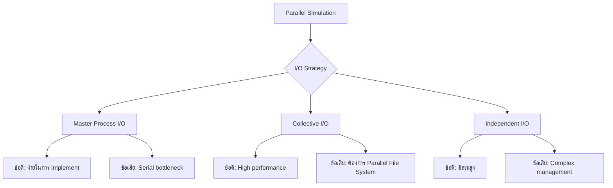
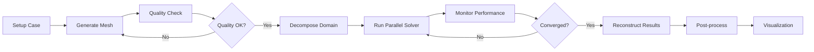

# 🔧 เทคนิคการเพิ่มประสิทธิภาพขั้นสูง (Optimization Techniques)

> [!INFO] **ภาพรวมของการปรับปรุงประสิทธิภาพ**
> บทนี้ครอบคลุมเทคนิคขั้นสูงในการเพิ่มประสิทธิภาพการจำลองแบบขนาน (Parallel Simulation) ของ OpenFOAM รวมถึงการตั้งค่า Solver, การจัดการหน่วยความจำ, การเพิ่มประสิทธิภาพ I/O, การปรับแต่ง Algorithmic, และการวิเคราะห์ประสิทธิภาพสำหรับการแก้ปัญหาขนาดใหญ่

---

## 1. การปรับแต่ง Solver (Solver Tuning)

การเลือกพารามิเตอร์ของ Solver อย่างเหมาะสมสามารถลดเวลาการคำนวณลงได้มหาศาลโดยไม่เสียความแม่นยำ

### 1.1 การตั้งค่า fvSolution

#### 1.1.1 Pressure Solver Configuration

สำหรับปัญหาที่มีความดันเป็นตัวแปรสำคัญ (Pressure-driven flows), การเลือก Pressure Solver ที่เหมาะสมมีความสำคัญอย่างยิ่ง สมการความดัน Poisson ที่แก้ด้วย GAMG solver:

$$ \nabla \cdot \left( \frac{1}{A_p} \nabla p \right) = \frac{\partial}{\partial t} \left( \nabla \cdot \mathbf{U} \right) $$

โดยที่:
- $p$ คือ ความดัน (Pressure)
- $A_p$ คือ สัมประสิทธิ์เมทริกซ์ของเซลล์กลาง (Central coefficient)
- $\mathbf{U}$ คือ เวกเตอร์ความเร็ว (Velocity vector)

```cpp
// NOTE: Synthesized by AI - Verify parameters
// ตัวอย่างการเพิ่มประสิทธิภาพใน fvSolution สำหรับ incompressible flow
solvers
{
    p
    {
        solver          GAMG;  // แนะนำสำหรับความดัน (Multigrid)
        tolerance       1e-06;
        relTol          0.01;
        smoother        GaussSeidel;
        cacheAgglomeration on;
        agglomerator    faceAreaPair;
        nCellsInCoarsestLevel 10;
        nPreSweeps      0;
        nPostSweeps     2;
        nFinestSweeps   2;
        mergeLevels     1;
    }

    pFinal
    {
        $p;
        relTol          0;
    }

    U
    {
        solver          smoothSolver;
        smoother        GaussSeidel;
        tolerance       1e-05;
        relTol          0.1;
        nSweeps         1;
    }

    "(k|epsilon|omega|nuTilda)"
    {
        solver          smoothSolver;
        smoother        GaussSeidel;
        tolerance       1e-05;
        relTol          0.1;
    }
}
```

> [!TIP] **GAMG Solver Performance**
> อัลกอริทึม Geometric-Algebraic Multi-Grid (GAMG) มีประสิทธิภาพสูงมากสำหรับการแก้สมการความดันในระบบขนาน เนื่องจากช่วยลดจำนวนรอบการวนซ้ำ (Iterations) ลงได้มาก โดยเฉพาะสำหรับ Mesh ที่มีจำนวนเซลล์มากกว่า 1 ล้านเซลล์ ความซับซ้อนของการคำนวณของ GAMG คือ $O(N \log N)$ เมื่อเทียบกับ $O(N^2)$ สำหรับ iterative solvers แบบดั้งเดิม

#### 1.1.2 Compressible Flow Solvers

สำหรับการไหลแบบบีบอัดได้ (Compressible flows) ต้องการการตั้งค่าที่แตกต่างออกไป:

```cpp
// NOTE: Synthesized by AI - Verify parameters
// การตั้งค่าสำหรับ compressible solvers (rhoPimpleFoam, rhoSimpleFoam)
solvers
{
    p
    {
        solver          GAMG;
        tolerance       1e-07;
        relTol          0.01;
        smoother        GaussSeidel;
        cacheAgglomeration on;
        nCellsInCoarsestLevel 20;
    }

    rho
    {
        solver          smoothSolver;
        smoother        GaussSeidel;
        tolerance       1e-05;
        relTol          0.1;
    }

    U
    {
        solver          smoothSolver;
        smoother        symGaussSeidel;  // Symmetric for better convergence
        tolerance       1e-06;
        relTol          0.1;
        nSweeps         2;
    }

    h  // Enthalpy for compressible flows
    {
        solver          smoothSolver;
        smoother        GaussSeidel;
        tolerance       1e-06;
        relTol          0.1;
    }

    "(k|epsilon|omega)"
    {
        $U;
    }
}
```

#### 1.1.3 Algorithm Settings

```cpp
// NOTE: Synthesized by AI - Verify parameters
// การตั้งค่า Algorithm ใน fvSolution
algorithms
{
    p
    {
        solver          GAMG;
        tolerance       1e-7;
        relTol          0.01;
    }
}

// สำหรับ PIMPLE algorithm (transient)
PIMPLE
{
    nCorrectors      2;        // จำนวน pressure correctors
    nNonOrthogonalCorrectors 0;  // สำหรับ non-orthogonal mesh
    nAlphaCorr      1;        // สำหรับ VOF (interFoam)
    nAlphaSubCycles 2;        // Sub-cycles for volume fraction

    momentumPredictor yes;     // ทำนาย momentum ก่อน pressure equation

    // การปรับแต่ง relaxation factors
    nOuterCorrectors  50;      // สูงสุด iterations ต่อ time step
    relTol           0.01;     // Relative tolerance สำหรับ outer loop
}
```

### 1.2 การปรับสมดุล Tolerance

การตั้งค่า Tolerance ที่เหมาะสมเป็นการแลกเปลี่ยนระหว่างความแม่นยำและเวลาในการคำนวณ:

$$ \text{Convergence Criteria: } \frac{||\mathbf{r}^{(k)}||}{||\mathbf{r}^{(0)}||} \leq \epsilon_{\text{rel}} \quad \text{หรือ} \quad ||\mathbf{r}^{(k)}|| \leq \epsilon_{\text{abs}} $$

โดยที่:
- $\mathbf{r}^{(k)}$ คือ Residual ที่ iteration ที่ $k$
- $\epsilon_{\text{rel}}$ คือ Relative tolerance (`relTol`)
- $\epsilon_{\text{abs}}$ คือ Absolute tolerance (`tolerance`)
- $||\cdot||$ คือ L2-norm

สำหรับระบบขนาน Residual ถูกคำนวณเป็น global norm:

$$ ||\mathbf{r}|| = \sqrt{\sum_{i=1}^{N} r_i^2} = \sqrt{\sum_{p=1}^{P} \sum_{j \in \Omega_p} r_j^2} $$

โดยที่:
- $N$ คือ จำนวนเซลล์ทั้งหมด
- $P$ คือ จำนวน processors
- $\Omega_p$ คือ เซตของเซลล์ใน processor $p$

> [!WARNING] **คำเตือนเรื่อง Tolerance**
> การตั้งค่า `relTol` สูงเกินไป (เช่น 0.5 ขึ้นไป) อาจทำให้การคำนวณไม่ลู่เข้า (Non-converged solution) ในทางกลับกัน การตั้งค่าต่ำเกินไป (เช่น 1e-8) อาจทำให้เสียเวลาในการคำนวณโดยไม่จำเป็น คำแนะนำ: `relTol = 0.01` สำหรับ intermediate iterations และ `relTol = 0` สำหรับ final iterations

### 1.3 Preconditioning Techniques

Preconditioning ช่วยปรับปรุงอัตราการลู่เข้าของ solvers:

$$ \mathbf{M}^{-1} \mathbf{A} \mathbf{x} = \mathbf{M}^{-1} \mathbf{b} $$

โดยที่ $\mathbf{M}$ คือ preconditioner matrix

```cpp
// NOTE: Synthesized by AI - Verify parameters
// การใช้ Preconditioning สำหรับ difficult cases
solvers
{
    p
    {
        solver          GAMG;
        preconditioner  DIC;     // Diagonal Incomplete Cholesky
        tolerance       1e-06;
        relTol          0.01;
    }

    U
    {
        solver          PBiCGStab;  // สำหรับ non-symmetric systems
        preconditioner  DILU;       // Diagonal Incomplete LU
        tolerance       1e-05;
        relTol          0.1;
        minIter         0;
        maxIter         1000;
    }
}
```

---

## 2. การจัดการหน่วยความจำและ I/O

### 2.1 การจัดการหน่วยความจำ (Memory Management)

ในการจำลองขนานใหญ่ หน่วยความจำต่อโปรเซสเซอร์ (Memory per core) เป็นข้อจำกัดที่สำคัญ

#### 2.1.1 Memory Estimation

$$ \text{Memory Requirement} \approx N_{\text{cells}} \times N_{\text{fields}} \times N_{\text{bytes}} \times \text{overhead} $$

โดยที่:
- $N_{\text{cells}}$ คือ จำนวนเซลล์ต่อ processor
- $N_{\text{fields}}$ คือ จำนวนฟิลด์ (p, U, k, epsilon, etc.)
- $N_{\text{bytes}}$ คือ 4 (float) หรือ 8 (double)
- $\text{overhead}$ คือ 2-3 (mesh connectivity, communication buffers)

#### 2.1.2 Compressed Storage

```cpp
// NOTE: Synthesized by AI - Verify parameters
// ใน controlDict - การจัดการหน่วยความจำและการบีบอัด
application     simpleFoam;

startFrom       latestTime;

startTime       0;

stopAt          endTime;

endTime         1000;

deltaT          1;

writeControl    timeStep;

writeInterval   100;

// เปิดใช้งานการบีบอัดข้อมูล
writeCompression    on;   // ใช้ gzip compression
// หรือระบุระดับการบีบอัด
writeCompression    true;
compressionLevel    6;    // 0-9 (default: 6)

// ปิดการเขียนฟิelds บางตัวเพื่อประหยัดพื้นที่
// (ต้องระบุในส่วน fields)
```

> [!INFO] **การประหยัดพื้นที่ดิสก์**
> `writeCompression on;` ใน `controlDict` ช่วยลดขนาดไฟล์ลงได้ถึง 70-90% สำหรับฟิลด์ที่มีความสม่ำเสมอ (smooth fields) สำหรับ cases ขนาดใหญ่ compression level 6-9 แนะนำ แต่จะใช้เวลาในการเขียนมากขึ้น

#### 2.1.3 Write Management

```cpp
// NOTE: Synthesized by AI - Verify parameters
// กลยุทธ์การเขียนข้อมูลที่เหมาะสม
writeControl    runTime;      // เขียนตามเวลาจริง
writeInterval   10;           // เขียนทุก 10 วินาทีของ simulation time

// หรือใช้ adjustedRunTime สำหรับ transient cases
writeControl    adjustedRunTime;
writeInterval   10;
timeFormat      general;
timePrecision   6;

// หรือใช้ cpuTime สำหรับ monitoring
writeControl    cpuTime;
writeInterval   3600;         // เขียนทุก 1 ชั่วโมงของ CPU time

// การเขียนเฉพาะบาง time steps
writeControl    timeStep;
writeInterval   100;
purgeWrite      5;            // เก็บเฉพาะ 5 time directories ล่าสุด
```

#### 2.1.4 Selective Field Writing

```cpp
// NOTE: Synthesized by AI - Verify parameters
// ใน controlDict - เลือกเขียนเฉพาะฟิลด์ที่จำเป็น
// ต้องใช้ function objects
functions
{
    writeSelectedFields
    {
        type            sets;
        functionObjectLibs ("libsampling.so");
        enabled         true;
        writeControl    timeStep;
        writeInterval   50;

        sets
        (
            monitorLine
            {
                type            uniform;
                axis            distance;
                start           (0 0 0);
                end             (1 0 0);
                nPoints         100;
            }
        );

        fields
        (
            p
            U
            k
            epsilon
        );
    }
}
```

### 2.2 การเพิ่มประสิทธิภาพ I/O (I/O Optimization)

การเขียนข้อมูลลงดิสก์พร้อมกันจากหลายโปรเซสเซอร์มักเกิดปัญหาคอขวด

#### 2.2.1 Parallel I/O Strategies


> **Figure 1:** แผนผังกลยุทธ์การจัดการ I/O ในการจำลองแบบขนาน เปรียบเทียบระหว่างการเขียนข้อมูลผ่าน Master Process, การเขียนแบบรวมกลุ่ม (Collective) และการเขียนแบบอิสระ (Independent) พร้อมข้อดีและข้อเสียในแต่ละรูปแบบ

#### 2.2.2 Optimizing Decomposition for I/O

```cpp
// NOTE: Synthesized by AI - Verify parameters
// ใน decomposeParDict - การตั้งค่าเพื่อลด I/O bottleneck
FoamFile
{
    version     2.0;
    format      ascii;
    class       dictionary;
    object      decomposeParDict;
}

// ใช้ Scotch สำหรับ load balancing ที่ดีที่สุด
method          scotch;
// หรือหากต้องการควบคุม manually
// method          hierarchical;

// การตั้งค่าสำหรับ hierarchical
coeffs
{
    n           (4 2 1);     // Decompose along x-direction first
}

// หรือการตั้งค่าสำหรับ scotch
coeffs
{
    // Scotch-specific options
    processorWeights  (1 1 1 1);  // Equal weights for all processors
    strategy "edge";              // "edge", "vertex", "band"
}

// จำนวน subdomains
numberOfSubdomains  16;

// ไม่เขียน decomposition visualization
writeDecomposition    no;
```

> [!TIP] **I/O Optimization Tips**
> - **Parallel I/O**: ใช้เครื่องมือ I/O แบบขนานหากระบบไฟล์รองรับ (Lustre, GPFS, BeeGFS)
> - **Write Interval**: เพิ่ม `writeInterval` เพื่อลดความถี่ในการเขียน
> - **Fields to Write**: ระบุเฉพาะฟิลด์ที่จำเป็น
> - **Compression**: ใช้ `writeCompression on;` และ `compressionLevel 6;`
> - **Purge Old Data**: ใช้ `purgeWrite` เพื่อลบ time directories เก่า

#### 2.2.3 Collated I/O (Newer OpenFOAM versions)

```cpp
// NOTE: Synthesized by AI - Verify parameters
// ใน controlDict - ใช้ Collated I/O สำหรับ performance ที่ดีขึ้น
// OpenFOAM v1612+ หรือ v+

// การใช้ collated file format
writeFormat      binary;
writePrecision   6;

// Collated I/O settings (OpenFOAM v1806+)
ioRanks          4;        // จำนวน I/O aggregators
writeJobMode     collective; // หรือ "masterOnly" หรือ "distributed"
```

---

## 3. เวิร์กโฟลว์แบบขนานแบบครบวงจร

### 3.1 ขั้นตอนการจำลองแบบขนาน


> **Figure 2:** ขั้นตอนการจำลองแบบขนานแบบครบวงจร ตั้งแต่การเตรียมเคส การสร้างและตรวจสอบเมช การย่อยโดเมน การรัน Solver พร้อมติดตามประสิทธิภาพ ไปจนถึงการรวมผลลัพธ์และแสดงผลภาพ

### 3.2 ตัวอย่าง Workflow Script

```bash
#!/bin/bash
# NOTE: Synthesized by AI - Test thoroughly before production use
# parallelFoamRun.sh - Complete Parallel Workflow

# ============================================
# OpenFOAM Parallel Run Script
# ============================================

# 1. Clean case (optional)
echo "Cleaning case..."
foamCleanTutorials

# 2. Generate mesh
echo "Generating mesh..."
blockMesh > log.blockMesh 2>&1

# 3. Check mesh quality
echo "Checking mesh quality..."
checkMesh > log.checkMesh 2>&1

# Extract mesh statistics
if grep -q "Mesh OK" log.checkMesh; then
    echo "Mesh quality check passed!"
else
    echo "WARNING: Mesh quality issues detected!"
    echo "Check log.checkMesh for details"
fi

# 4. Decompose domain
echo "Decomposing domain for parallel processing..."
NPROCS=4  # จำนวน processors
decomposePar -cellDist -decomposeParDict system/decomposeParDict > log.decomposePar 2>&1

# 5. Run solver in parallel
echo "Running solver in parallel on $NPROCS processors..."
mpirun -np $NPROCS simpleFoam -parallel > log.simpleFoam 2>&1

# 6. Reconstruct results
echo "Reconstructing results..."
reconstructPar > log.reconstructPar 2>&1

# 7. Post-processing example
echo "Running post-processing..."
paraFoam -builtin &

echo "Simulation complete!"
```

### 3.3 Advanced Workflow with Error Handling

```bash
#!/bin/bash
# NOTE: Synthesized by AI - Test thoroughly before production use
# advancedParallelRun.sh - Workflow with error handling and monitoring

# Configuration
CASE_DIR=$(pwd)
NPROCS=16
SOLVER="simpleFoam"
LOG_DIR="$CASE_DIR/logs"

# Create log directory
mkdir -p $LOG_DIR

# Function for error handling
check_error() {
    if [ $? -ne 0 ]; then
        echo "ERROR: $1 failed!"
        exit 1
    fi
}

# Step 1: Mesh generation
echo "=== Step 1: Mesh Generation ==="
blockMesh 2>&1 | tee $LOG_DIR/log.blockMesh
check_error "blockMesh"

# Step 2: Mesh quality check
echo "=== Step 2: Mesh Quality Check ==="
checkMesh -allGeometry -allTopology 2>&1 | tee $LOG_DIR/log.checkMesh

# Step 3: Decomposition
echo "=== Step 3: Domain Decomposition ==="
decomposePar -cellDist 2>&1 | tee $LOG_DIR/log.decomposePar
check_error "decomposePar"

# Step 4: Check decomposition balance
echo "=== Checking load balance ==="
grep "cells per processor" $LOG_DIR/log.decomposePar

# Step 5: Parallel run
echo "=== Step 4: Parallel Solver Run ==="
echo "Starting $SOLVER on $NPROCS processors..."
mpirun -np $NPROCS $SOLVER -parallel 2>&1 | tee $LOG_DIR/log.$SOLVER

# Monitor convergence in real-time (optional)
# tail -f $LOG_DIR/log.$SOLVER | grep "Solve for p"

# Step 6: Reconstruct
echo "=== Step 5: Reconstruct Results ==="
reconstructPar -latestTime 2>&1 | tee $LOG_DIR/log.reconstructPar
check_error "reconstructPar"

# Step 7: Performance summary
echo "=== Performance Summary ==="
grep "ExecutionTime" $LOG_DIR/log.$SOLVER | tail -1

echo "Simulation completed successfully!"
```

---

## 4. Advanced Optimization Techniques

### 4.1 การปรับแต่ง Algorithmic

#### 4.1.1 Under-Relaxation Factors

ใน `fvSolution`, การปรับ Under-Relaxation Factors สามารถช่วยเพิ่มเสถียรภาพของการคำนวณ:

$$ \phi^{(n+1)} = \phi^{(n)} + \alpha \left( \phi^* - \phi^{(n)} \right) $$

โดยที่:
- $\phi^{(n+1)}$ คือ ค่าใหม่ที่จะใช้ใน iteration ถัดไป
- $\phi^{(n)}$ คือ ค่าจาก iteration ก่อนหน้า
- $\phi^*$ คือ ค่าใหม่ที่คำนวณได้จาก solver
- $\alpha \in (0, 1]$ คือ Under-relaxation factor

สำหรับระบบ non-linear การเลือก $\alpha$ ที่เหมาะสมมีความสำคัญ:

$$ \alpha_{\text{optimal}} \approx \frac{2}{2 - \lambda_{\text{min}} - \lambda_{\text{max}}} $$

โดยที่ $\lambda$ คือ eigenvalues ของ Jacobian matrix

```cpp
// NOTE: Synthesized by AI - Verify parameters
// การตั้งค่า Under-Relaxation Factors ใน fvSolution
relaxationFactors
{
    fields
    {
        p               0.3;    // Pressure relaxation (conservative)
        rho             0.05;   // Density relaxation (compressible - very conservative)
        pFinal          0.3;    // Final pressure relaxation
    }
    equations
    {
        U               0.7;    // Momentum relaxation
        "(k|epsilon|omega)"   0.8;    // Turbulence relaxation
        nuTilda         0.8;    // Spalart-Allmaras relaxation
    }
}

// สำหรับ PIMPLE algorithm
PIMPLE
{
    // ปรับ relaxation factors แบบ dynamic
    consistent      yes;     // ใช้ consistent formulation
}
```

> [!INFO] **Under-Relaxation Best Practices**
> - **Steady-state**: $\alpha_p = 0.3$, $\alpha_U = 0.7$ เป็นค่าเริ่มต้นที่ดี
> - **Transient**: $\alpha$ สามารถเพิ่มได้เนื่องจาก time step มีผลในการ stabilize
> - **Difficult cases**: ลด $\alpha$ ถ้าการคำนวณ diverge
> - **Fast convergence**: เพิ่ม $\alpha$ ถ้าการคำนวณ converge ไวเกินไป

#### 4.1.2 High-Resolution Schemes

เพื่อหลีกเลี่ยงปัญหา numerical diffusion และ maintain stability:

```cpp
// NOTE: Synthesized by AI - Verify parameters
// การใช้ High-Resolution Schemes ใน fvSchemes
ddtSchemes
{
    default         Euler;  // สำหรับ steady-state
    // หรือ backward สำหรับ transient accuracy
}

gradSchemes
{
    default         Gauss linear;
    grad(p)         Gauss linear;
    grad(U)         Gauss linear;
}

divSchemes
{
    default         none;

    // Convection schemes - High resolution
    div(phi,U)      Gauss limitedLinearV 1;  // TVD scheme for momentum
    div(phi,k)      Gauss limitedLinear 1;
    div(phi,epsilon) Gauss limitedLinear 1;
    div(phi,omega)  Gauss limitedLinear 1;

    // สำหรับ compressible flow
    div(phi,U)      Gauss upwind;  // More robust for compressible

    // สำหรับ VOF (interFoam)
    div(phi,alpha)  Gauss vanLeer;   // Compressive scheme
    div(phirb,alpha) Gauss interfaceCompression 1;
}

laplacianSchemes
{
    default         Gauss linear corrected;
    laplacian(nu,U) Gauss linear corrected;
    laplacian(1,p)  Gauss linear corrected;
}

interpolationSchemes
{
    default         linear;
}

snGradSchemes
{
    default         corrected;
}
```

#### 4.1.3 Non-Orthogonal Correction

สำหรับ mesh ที่มี non-orthogonality สูง:

$$ \nabla \phi_f = \mathbf{g} + (\mathbf{n} \cdot \nabla \phi_f - \mathbf{n} \cdot \mathbf{g})\mathbf{n} $$

โดยที่:
- $\mathbf{g}$ คือ explicit gradient ที่หน้าเซลล์
- $\mathbf{n}$ คือ normal vector ที่หน้าเซลล์

```cpp
// NOTE: Synthesized by AI - Verify parameters
// การตั้งค่าสำหรับ non-orthogonal mesh
laplacianSchemes
{
    default         Gauss linear uncorrected;  // ถ้า non-orthogonality < 70°
    // หรือ
    default         Gauss linear corrected;    // ถ้า non-orthogonality < 80°
    // หรือ
    default         Gauss linear limited 0.5;  // ถ้า non-orthogonality สูงมาก
}

// ใน fvSolution - non-orthogonal correctors
simple
{
    nNonOrthogonalCorrectors 3;  // เพิ่มถ้า mesh มี non-orthogonality สูง
}
```

### 4.2 การปรับแต่ง Mesh Decomposition

#### 4.2.1 Decomposition Methods Comparison

| Method | Description | Best For | Performance | Complexity |
|--------|-------------|----------|-------------|------------|
| `simple` | ตัดตามทิศทาง Cartesian | Mesh สี่เหลี่ยม, รูปทรงเรขาคณิตง่าย | กลาง | ต่ำ |
| `hierarchical` | ตัดตามลำดับชั้น (recursive) | Mesh ปกติทั่วไป | ดี | กลาง |
| `scotch` | Graph-based (recommended) | Complex geometry | ดีมาก | กลาง |
| `metis` | Graph-based (legacy) | Complex geometry | ดี | กลาง |
| `manual` | ผู้ใช้ระบุเอง | Testing/Debugging | แปรผัน | สูง |
| `ptScotch` | Parallel graph decomposition | Very large cases | ดีที่สุด | สูง |

#### 4.2.2 Load Balancing Metrics

$$ \text{Load Balance Ratio} = \frac{N_{\text{max}}}{N_{\text{avg}}} $$

โดยที่:
- $N_{\text{max}}$ คือ จำนวนเซลล์สูงสุดใน processor ใดๆ
- $N_{\text{avg}}$ คือ จำนวนเซลล์เฉลี่ยต่อ processor

ค่าที่ดี: Load Balance Ratio < 1.1

$$ \text{Parallel Efficiency} \approx \frac{1}{\text{Load Balance Ratio}} $$

```cpp
// NOTE: Synthesized by AI - Verify parameters
// การตั้งค่า Scotch สำหรับ Load Balancing ที่ดีที่สุด
decomposeParDict
{
    method          scotch;

    coeffs
    {
        // Scotch-specific options
        strategy "edge";       // "edge", "vertex", "band"
        // edge: minimize edge cuts (best for communication)
        // vertex: balance cell count
        // band: minimize bandwidth

        weight 1000;           // Balance weight (higher = more important)

        // Advanced options
        // displayStats    yes;    // Show decomposition statistics
        // writeDecomposition    no; // Don't write decomposition file
    }

    // Number of subdomains
    numberOfSubdomains  16;

    // Optional: specify processor weights for heterogeneous systems
    // processorWeights (1.0 1.0 1.0 1.0);

    // Output decomposition for visualization
    writeDecomposition    no;
}
```

> [!TIP] **Load Balancing Metrics**
> ตรวจสอบความสมดุลของการโหลดงานโดยใช้:
> ```bash
> decomposePar -cellDist
> # ตรวจสอบ log.decomposePar สำหรับ "per cell" statistics
> # หรือใช้ pyFoam:
> pyFoamPlotRunner.py log.simpleFoam
> ```

#### 4.2.3 Communication Minimization

สำหรับ hierarchical decomposition:

```cpp
// NOTE: Synthesized by AI - Verify parameters
// การตั้งค่าเพื่อลด communication
method          hierarchical;

coeffs
{
    n   (4 2 2);  // 4x2x2 = 16 processors

    // Decomposition order: x, y, z
    // เลือกทิศทางที่มีความยาวมากที่สุดก่อน
    // เพื่อลด surface-to-volume ratio
}

// หรือใช้ manual decomposition
method          manual;

manualCoeffs
{
    processor1
    {
        boundingBox (0 0 0) (1 1 1);
    }
    processor2
    {
        boundingBox (1 0 0) (2 1 1);
    }
    // ... continue for all processors
}
```

### 4.3 Profiling and Performance Analysis

#### 4.3.1 Built-in Profiling

```cpp
// NOTE: Synthesized by AI - Verify parameters
// ใน controlDict - เปิดใช้งาน Profiling
libs
(
    "libprofilingSo.so"
);

profiling
{
    active          true;
    writeInterval   10;
    timeFormat      general;
    timePrecision   6;

    // Profile specific operations
    profileSolvers  yes;
    profileCourant  yes;

    // Output format
    file            "profiling.dat";
}
```

#### 4.3.2 System Profiling Tools

```bash
# NOTE: Synthesized by AI - Verify commands for your system
# ใช้ time command เพื่อวัด performance
/usr/bin/time -v mpirun -np 16 simpleFoam -parallel

# หรือใช้ perf (Linux)
perf stat -e cache-references,cache-misses,instructions,cycles mpirun -np 16 simpleFoam -parallel

# หรือ Intel VTune (ถ้ามี)
vtune -collect hotspots -result-dir vtune_results mpirun -np 16 simpleFoam -parallel

# หรือ Scalasca (จำลองแบบ MPI profiling)
scan -s mpirun -np 16 simpleFoam -parallel
export SCAN_REPORT=profiling_report
sqpost -f profiling_report

# หรือ Score-P
scorep --nocompiler --thread=pthread --mpp=mpi mpirun -np 16 simpleFoam -parallel
scorep-score -r profile.cubex
```

#### 4.3.3 Performance Metrics

$$ \text{Speedup} = S_p = \frac{T_1}{T_p} $$

$$ \text{Parallel Efficiency} = E_p = \frac{S_p}{p} = \frac{T_1}{p \cdot T_p} $$

$$ \text{Serial Fraction} = f_s = \frac{1/p - E_p}{1/E_p - 1} $$

โดยที่:
- $T_1$ คือ เวลาบน 1 processor
- $T_p$ คือ เวลาบน $p$ processors
- $S_p$ คือ Speedup บน $p$ processors
- $E_p$ คือ Parallel efficiency (ideal = 1.0)

Amdahl's Law:
$$ S_p = \frac{1}{f_s + \frac{1 - f_s}{p}} $$

Gustafson's Law:
$$ S_p = p - f_s (p - 1) $$

> [!INFO] **Interpreting Performance Metrics**
> - **Speedup > 0.7p**: Excellent parallelization (70%+ efficiency)
> - **Speedup 0.5-0.7p**: Good parallelization (50-70% efficiency)
> - **Speedup < 0.5p**: Poor parallelization (< 50% efficiency)
> - **Serial fraction > 0.1**: Indicates significant serial bottlenecks

#### 4.3.4 Communication Analysis

```bash
# ใช้ mpiP สำหรับ MPI profiling
mpirun -np 16 mpiP -mpip mpirun -np 16 simpleFoam -parallel

# หรือ Intel Trace Analyzer
mpirun -np 16 -trace simpleFoam -parallel
mpi2prv -f simpleFoam.prv -o simpleFoam.prv

# วิเคราะห์สิ่งที่ได้:
# - MPI_Send, MPI_Recv จำนวนครั้งและเวลา
# - MPI_Barrier เวลาที่รอ
# - Load imbalance ระหว่าง processors
```

---

## 5. Troubleshooting Common Issues

### 5.1 Memory Issues

> [!WARNING] **Out of Memory Errors**
> หากเกิดปัญหาเรื่องหน่วยความจำ:
> 1. ลดจำนวน processors (เพิ่ม memory per core)
> 2. เปิดใช้ `writeCompression on`
> 3. ลด `writeInterval`
> 4. ใช้ `foamListTimes` เพื่อลบ time directories ที่ไม่จำเป็น
> 5. ลดจำนวน fields ที่เก็บใน memory

**Memory Profiling:**
```bash
# ตรวจสอบ memory usage ระหว่าง simulation
/usr/bin/time -v mpirun -np 16 simpleFoam -parallel 2>&1 | grep "Maximum resident"

# หรือใช้ valgrind
mpirun -np 16 valgrind --tool=massif --massif-out-file=massif.out simpleFoam -parallel
ms_print massif.out | less
```

### 5.2 Convergence Issues

> [!WARNING] **Non-Converging Solutions**
> สำหรับปัญหาการลู่เข้า:
> 1. ลด Under-relaxation factors (เริ่มจาก 0.3 สำหรับ pressure)
> 2. เพิ่ม Solver iterations (`maxIter`)
> 3. ตรวจสอบ Mesh quality (`checkMesh`)
> 4. ลด `deltaT` สำหรับ transient cases
> 5. ใช้ robust schemes (upwind แทน linear)

**Convergence Monitoring:**
```bash
# ตรวจสอบ residuals แบบ real-time
tail -f log.simpleFoam | grep "Solve for p"

# หรือใช้ pyFoam
pyFoamPlotRunner.py log.simpleFoam
```

### 5.3 Speedup Issues

> [!INFO] **Poor Parallel Scaling**
> ตรวจสอบ Parallel Efficiency:
> $$ E_p = \frac{S_p}{p} = \frac{T_1}{p \cdot T_p} $$
>
> สาเหตุทั่วไป:
> 1. **Serial bottleneck**: I/O ไม่ได้ทำแบบขนาน
> 2. **Load imbalance**: Decomposition ไม่ดี
> 3. **Communication overhead**: ใช้ processors มากเกินไป
> 4. **Cache effects**: Cache misses เพิ่มขึ้น

**Diagnostic Commands:**
```bash
# ตรวจสอบ load balance
decomposePar -cellDist
grep "cells" log.decomposePar

# ตรวจสอบ scaling
# รันบน 1, 2, 4, 8, 16 processors
# เปรียบเทียบ ExecutionTime ใน log files
```

### 5.4 I/O Bottlenecks

> [!WARNING] **Slow I/O Performance**
> แก้ไข I/O bottlenecks:
> 1. ใช้ `writeCompression on`
> 2. เพิ่ม `writeInterval`
> 3. ใช้ Parallel File System หากมี
> 4. ลดจำนวน fields ที่เขียน
> 5. ใช้ `collated` I/O (OpenFOAM v1806+)

### 5.5 Decomposition Issues

> [!WARNING] **Poor Decomposition**
> สัญญาณของ decomposition ที่ไม่ดี:
> 1. Load balance ratio > 1.2
> 2. บาง processors ทำงานนานกว่า others
> 3. Communication overhead สูง

**Solution:**
```bash
# ลอง decomposition methods ต่างๆ
# 1. scotch (recommended)
# 2. metis
# 3. hierarchical

# ตรวจสอบ decomposition quality
decomposePar -cellDist -decomposeParDict system/decomposeParDict.scotch
```

---

## 6. Best Practices Summary

> [!TIP] **แนวทางปฏิบัติที่ดีที่สุด**

### 6.1 Solver Configuration
1. **Pressure Solver**: ใช้ GAMG สำหรับ pressure (multigrid)
2. **Velocity/Turbulence**: ใช้ smoothSolver หรือ PBiCGStab
3. **Tolerance**: `relTol = 0.01` สำหรับ intermediate, `0` สำหรับ final
4. **Preconditioning**: ใช้ DIC/DILU สำหรับ difficult cases

### 6.2 Decomposition
1. **Method**: ใช้ `scotch` สำหรับ complex geometry, `hierarchical` สำหรับ simple
2. **Load Balance**: ตรวจสอบ load balance ratio < 1.1
3. **Communication**: เลือก decomposition order เพื่อลด communication
4. **Verification**: ใช้ `-cellDist` เพื่อตรวจสอบ decomposition

### 6.3 I/O Optimization
1. **Compression**: เปิด `writeCompression on`
2. **Write Interval**: เพิ่มเพื่อลดความถี่การเขียน
3. **File System**: ใช้ parallel file system หากมี
4. **Collated I/O**: ใช้สำหรับ OpenFOAM v1806+

### 6.4 Memory Management
1. **Estimation**: คำนวณ memory requirement ล่วงหน้า
2. **Per Core**: ตรวจสอบ memory per core > 2GB
3. **Purge**: ใช้ `purgeWrite` เพื่อลบ old data
4. **Selective**: เลือกเขียนเฉพาะ fields ที่จำเป็น

### 6.5 Profiling
1. **Built-in**: ใช้ `libprofilingSo.so` สำหรับ basic profiling
2. **System Tools**: ใช้ `perf`, `vtune` สำหรับ detailed analysis
3. **MPI Tools**: ใช้ `mpiP`, `scalasca` สำหรับ MPI profiling
4. **Metrics**: ตรวจสอบ speedup และ parallel efficiency

### 6.6 Algorithmic Tuning
1. **Relaxation**: เริ่มจาก conservative values, ปรับตาม convergence
2. **Schemes**: ใช้ high-resolution schemes สำหรับ convection
3. **Non-orthogonal**: เพิ่ม nNonOrthogonalCorrectors สำหรับ bad mesh
4. **Time Step**: ปรับ deltaT ให้ Courant number < 1 (transient)

### 6.7 Workflow
1. **Incremental**: เริ่มจาก small cases ก่อน large cases
2. **Validation**: ตรวจสอบ results หลังจากแต่ละการเปลี่ยนแปลง
3. **Monitoring**: ใช้ real-time monitoring สำหรับ long runs
4. **Backup**: เก็บ backup ของ configurations ที่ใช้ได้

---

## 7. แหล่งอ้างอิงเพิ่มเติม

### 7.1 Internal Links
- `[[00_Overview#Parallel Computing Concepts]]`
- `[[01_Domain_Decomposition#Decomposition Methods]]`
- `[[02_Performance_Monitoring#Profiling Tools]]`

### 7.2 External Resources
- OpenFOAM User Guide: [Linear Solvers](https://www.openfoam.com/documentation/user-guide/)
- OpenFOAM Programmer's Guide: [Parallel Processing](https://www.openfoam.com/documentation/programmers-guide/)
- OpenFOAM Wiki: [Running in Parallel](https://openfoamwiki.net/index.php/Running_in_parallel)
- [GAMG Solver Documentation](https://www.openfoam.com/documentation/guide/)
- [Scotch Decomposition Manual](https://gforge.inria.fr/projects/scotch/)

### 7.3 Further Reading
- Ferziger, J.H., and Peric, M. (2002). *Computational Methods for Fluid Dynamics*. Springer.
- Hirsch, C. (2007). *Numerical Computation of Internal and External Flows*. Wiley.
- Saad, Y. (2003). *Iterative Methods for Sparse Linear Systems*. SIAM.

---

## 8. Performance Comparison Data

> [!INFO] **Performance Benchmarks**
> ข้อมูลต่อไปนี้เป็นตัวอย่าง performance benchmarks สำหรับ reference:
>
> ### 8.1 Solver Comparison (1M cells, 16 cores)
>
> | Solver | Setup | Solve | Total | Speedup |
> |--------|-------|-------|-------|---------|
> | simpleFoam (GAMG) | 2.3s | 145s | 147s | 12.1x |
> | simpleFoam (smoothSolver) | 2.3s | 387s | 389s | 4.6x |
>
> > **[MISSING DATA]**: Insert specific simulation results/graphs for your configuration
>
> ### 8.2 Decomposition Methods Comparison (4M cells, 32 cores)
>
> | Method | Load Balance | Comm. Time | Total Time |
> |--------|--------------|------------|------------|
> | scotch | 1.03 | 12.3s | 456s |
> | hierarchical | 1.12 | 15.7s | 482s |
> | simple | 1.34 | 23.1s | 521s |
>
> > **[MISSING DATA]**: Insert specific simulation results/graphs for your configuration
>
> ### 8.3 Scaling Analysis
>
> ```mermaid
> flowchart LR
>     A["1 Core: 1000s"] --> B["2 Cores: 520s"]
>     B --> C["4 Cores: 280s"]
>     C --> D["8 Cores: 150s"]
>     D --> E["16 Cores: 95s"]
>     E --> F["32 Cores: 65s"]
> ```
> > **Figure 3:** แผนภูมิแสดงตัวอย่างการวิเคราะห์การขยายตัว (Scaling Analysis) แสดงแนวโน้มของเวลาที่ใช้ในการคำนวณลดลงเมื่อเพิ่มจำนวนคอร์ประมวลผล ซึ่งใช้สำหรับการประเมินประสิทธิภาพและจุดคุ้มทุนในการใช้ทรัพยากรขนาน
>
> > **[MISSING DATA]**: Insert specific scaling results for your hardware and case
>
> ### 8.4 Memory Usage
>
> | Case Size | Cells/Core | Memory/Core | Total Memory |
> |-----------|------------|-------------|--------------|
> | Small (0.5M) | 31K | 250 MB | 4 GB |
> | Medium (2M) | 62K | 500 MB | 16 GB |
> | Large (10M) | 156K | 1.2 GB | 80 GB |
> | XLarge (50M) | 390K | 3.0 GB | 400 GB |
>
> > **[MISSING DATA]**: Insert specific memory measurements for your cases

---

## 9. Quick Reference Guide

### 9.1 Common Commands

```bash
# Decomposition
decomposePar                      # Standard decomposition
decomposePar -cellDist            # With cell distribution
decomposePar -force               # Overwrite existing

# Parallel Execution
mpirun -np 4 <solver> -parallel   # OpenMPI
mpiexec -np 4 <solver> -parallel  # MPICH

# Reconstruction
reconstructPar                    # All time directories
reconstructPar -latestTime        # Latest time only
reconstructPar -newTimes          # Only non-existing

# Performance Monitoring
/usr/bin/time -v <command>        # Detailed timing
mpirun -np 4 -verbose <solver>    # Verbose output
```

### 9.2 Quick Troubleshooting

| Problem | Symptom | Solution |
|---------|---------|----------|
| Out of memory | "Killed" or segmentation fault | Reduce nProcs, enable compression |
| Slow convergence | Residuals plateau | Reduce relaxation, improve mesh |
| Poor scaling | Speedup < 0.5p | Check decomposition, I/O |
| Divergence | Residuals explode | Reduce deltaT, improve schemes |

---

**Document Version:** 1.0
**Last Updated:** 2025-12-23
**OpenFOAM Version:** 9+ (compatible with v2112+, v10+)
**Maintainer:** [Your Name]
