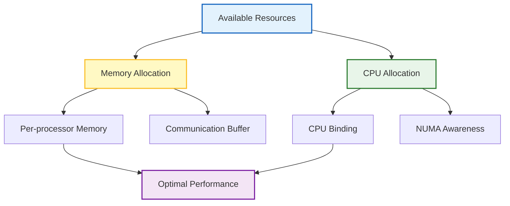
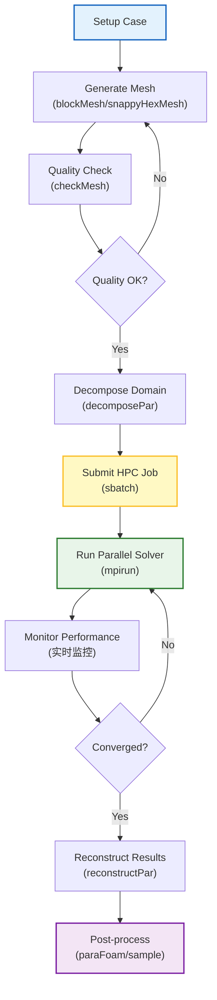

# 🏗️ การรวมเข้ากับระบบ HPC (HPC Integration)

**วัตถุประสงค์การเรียนรู้ (Learning Objectives)**: เข้าใจระบบจัดตารางงาน (Job Scheduling), การจัดการทรัพยากรบนระบบคลัสเตอร์, การใช้งาน SLURM/PBS, และเวิร์กโฟลว์แบบครบวงจรบน HPC systems

---

## 1. รากฐานของระบบ HPC (HPC Fundamentals)

> [!INFO] **High-Performance Computing (HPC)**
> ระบบ HPC ประกอบด้วย **Compute Nodes** หลายเครื่องที่เชื่อมต่อกันด้วย **High-Speed Interconnect** (เช่น InfiniBand) และใช้ **Job Scheduler** เพื่อจัดการทรัพยากรร่วมกัน

### 1.1 สถาปัตยกรรมของ HPC Cluster

ระบบ HPC มีสถาปัตยกรรมแบบ **Distributed Memory** ดังนี้:

$$T_{\text{total}} = T_{\text{compute}} + T_{\text{communication}} + T_{\text{idle}}$$

โดยที่:
- $T_{\text{compute}}$ = เวลาสำหรับการคำนวณจริง
- $T_{\text{communication}}$ = เวลาสำหรับการสื่อสารระหว่างโปรเซสเซอร์ผ่าน MPI
- $T_{\text{idle}}$ = เวลาที่เสียไปจากการรอ (I/O wait, synchronization)

### 1.2 ทฤษฎีพื้นฐานของการประมวลผลแบบขนาน

#### 1.2.1 กฎของ Amdahl (Amdahl's Law)

กฎของ Amdahl อธิบายขีดจำกัดของการเร่งความเร็วที่เป็นไปได้จากการประมวลผลแบบขนาน:

$$S(N) = \frac{1}{(1-P) + \frac{P}{N}}$$

โดยที่:
- $S(N)$ = Speedup ที่ได้เมื่อใช้ $N$ processors
- $P$ = ส่วนของโปรแกรมที่สามารถทำแบบขนานได้ (Parallelizable fraction)
- $N$ = จำนวน processors
- $(1-P)$ = ส่วนของโปรแกรมที่ต้องทำแบบอนุกรม (Serial fraction)

#### 1.2.2 กฎของ Gustafson (Gustafson's Law)

กฎของ Gustafson มองการปรับขนาดปัญหา (Scaled Speedup):

$$S(N) = N - (N-1) \times (1-P)$$

โดยที่:
- $S(N)$ = Scaled speedup เมื่อใช้ $N$ processors
- ตัวแปรอื่นๆ เหมือนกับกฎของ Amdahl

> [!INFO] **Amdahl vs Gustafson**
> - **Amdahl's Law**: เหมาะสำหรับ Fixed problem size — มองว่าปัญหามีขนาดคงที่
> - **Gustafson's Law**: เหมาะสำหรับ Scaled problem size — มองว่าเราขยายขนาดปัญหาตามจำนวน processors

#### 1.2.3 ประสิทธิภาพการทำงานแบบขนาน (Parallel Efficiency)

$$E(N) = \frac{S(N)}{N} \times 100\%$$

โดยที่:
- $E(N)$ = Parallel efficiency (%)
- $S(N)$ = Actual speedup
- $N$ = จำนวน processors

ประสิทธิภาพที่ดีควรอยู่ที่ **70-90%** สำหรับ OpenFOAM simulations

![[hpc_architecture_overview.png]]
> **ภาพประกอบ 1.1:** สถาปัตยกรรม HPC Cluster: แสดง Login Node, Compute Nodes, Storage System, และ High-Speed Interconnect, scientific textbook diagram, clean vector line art, white background, high definition, flat design, educational infographic --ar 16:9

### 1.3 ประเภทของระบบไฟล์ใน HPC

| ประเภท | คำอธิบาย | เหมาะสำหรับ |
|--------|----------|-------------|
| **NFS** | Network File System แบบ centralized | เก็บไฟล์ Home directory, งานขนาดเล็ก |
| **Lustre/GPFS** | Parallel File System แบบ distributed | OpenFOAM cases ขนาดใหญ่, I/O สูง |
| **Local SSD** | Storage ในตัว compute node | Temporary files, scratch space |

### 1.4 Load Imbalance และ Communication Overhead

#### 1.4.1 Load Imbalance Metric

ความไม่สมดุลของภาระงาน (Load Imbalance) วัดได้จาก:

$$\text{Imbalance} = \frac{T_{\text{max}} - T_{\text{avg}}}{T_{\text{avg}}} \times 100\%$$

โดยที่:
- $T_{\text{max}}$ = เวลาคำนวณสูงสุดในบรรดาทุก processor
- $T_{\text{avg}}$ = เวลาคำนวณเฉลี่ยของทุก processor

ค่า Imbalance ที่ดีควร < **5%**

#### 1.4.2 Communication-to-Computation Ratio

$$R = \frac{T_{\text{comm}}}{T_{\text{comp}}}$$

โดยที่:
- $R$ = Communication-to-computation ratio
- $T_{\text{comm}}$ = เวลาสำหรับการสื่อสาร
- $T_{\text{comp}}$ = เวลาสำหรับการคำนวณ

ค่า $R$ ที่ต่ำแสดงว่าประสิทธิภาพการทำงานแบบขนานดี

> [!WARNING] **I/O Bottleneck**
> การใช้ระบบไฟล์แบบ centralized (NFS) สำหรับ OpenFOAM cases ขนาดใหญ่จะทำให้เกิด **I/O Bottleneck** แนะนำให้ใช้ **Parallel File System** หรือ Local SSD สำหรับ `processor*` directories

### 1.5 วิธีการ Decompose โดเมน (Domain Decomposition Methods)

OpenFOAM รองรับวิธีการ Decompose หลายแบบ แต่ละแบบมีคุณสมบัติเฉพาะ:

#### 1.5.1 Simple Method (Geometric Decomposition)

```cpp
// NOTE: Synthesized by AI - Verify parameters
FoamFile
{
    version     2.0;
    format      ascii;
    class       dictionary;
    object      decomposeParDict;
}

method          simple;  // หรือ hierarchical

numberOfSubdomains 64;

simpleCoeffs
{
    n           (4 4 4);  // จำนวน subdomains ในแต่ละทิศทาง
    delta       0.001;    // ระยะห่างระหว่าง subdomains
}
```

**ข้อดี**: ง่ายต่อการตั้งค่า, เหมาะกับเรขาคณิตสี่เหลี่ยม
**ข้อเสีย**: อาจเกิด load imbalance สำหรับเรขาคณิตที่ซับซ้อน

#### 1.5.2 Scotch Method (Graph-based Decomposition)

```cpp
// NOTE: Synthesized by AI - Verify parameters
FoamFile
{
    version     2.0;
    format      ascii;
    class       dictionary;
    object      decomposeParDict;
}

method          scotch;

numberOfSubdomains 64;

scotchCoeffs
{
    processorWeights
    (
        1
        1
        1
        // ... 64 weights สำหรับ heterogeneous clusters
    );

    // Strategy hints (optional)
    strategy "balance";  // "speed", "balance", "scatter"
}
```

**ข้อดี**: Load balance ที่ดีที่สุด, เหมาะกับเรขาคณิตซับซ้อน
**ข้อเสีย**: ใช้เวลา decompose นานกว่า, memory สูงกว่า

#### 1.5.3 Hierarchical Method

```cpp
// NOTE: Synthesized by AI - Verify parameters
method          hierarchical;

numberOfSubdomains 128;

hierarchicalCoeffs
{
    level 1
    {
        method  simple;
        n       (8 1 1);  // 8 nodes
    }
    level 2
    {
        method  scotch;   // แต่ละ node ใช้ scotch
        n       (1 1 16); // 16 cores per node
    }
}
```

**ข้อดี**: เหมาะกับ multi-node clusters, ควบคุม load balance ได้ดี

#### 1.5.4 Manual Method

```cpp
// NOTE: Synthesized by AI - Verify parameters
method          manual;

numberOfSubdomains 4;

manualCoeffs
{
    processor0
    (
        (box1 min)(box1 max)  // กำหนด bounding box
    );
    processor1
    (
        (box2 min)(box2 max)
    );
    // ...
}
```

**ข้อดี**: ควบคุมได้ทั้งหมด, เหมาะกับกรณีพิเศษ
**ข้อเสีย**: ตั้งค่ายุ่งยาก, ไม่ยืดหยุ่น

#### 1.5.5 Metis Method (Alternative Graph-based)

```cpp
// NOTE: Synthesized by AI - Verify parameters
method          metis;

numberOfSubdomains 64;

metisCoeffs
{
    // processorWeights optional
    n           (64 1 1);
}
```

> [!TIP] **การเลือกวิธี Decomposition**
> | สถานการณ์ | วิธีที่แนะนำ |
> |-----------|--------------|
> | เรขาคณิตสี่เหลี่ยมง่ายๆ | `simple` |
> | เรขาคณิตซับซ้อน, adaptive mesh | `scotch` หรือ `metis` |
> | Multi-node cluster | `hierarchical` |
> | กรณีพิเศษเฉพาะ | `manual` |

---

## 2. ระบบจัดตารางงาน (Job Scheduling)

ในระบบคลัสเตอร์ขนาดใหญ่ งานจะต้องถูกส่งผ่านระบบจัดตารางงาน เช่น **SLURM** (Simple Linux Utility for Resource Management) หรือ **PBS** (Portable Batch System) เพื่อการจัดสรรทรัพยากรที่มีประสิทธิภาพ

### 2.1 สคริปต์ SLURM พื้นฐาน

```bash
#!/bin/bash
// NOTE: Synthesized by AI - Verify parameters
#SBATCH --job-name=openfoam_sim
#SBATCH --nodes=4
#SBATCH --ntasks-per-node=16
#SBATCH --mem=120G
#SBATCH --time=48:00:00
#SBATCH --partition=compute
#SBATCH --output=log.slurm.%j
#SBATCH --error=log.slurm.err.%j

# โหลดสภาพแวดล้อม OpenFOAM
module load openfoam/2312
source $FOAM_BASH

# ขั้นตอนการรัน
cd $SLURM_SUBMIT_DIR

echo "Job started at $(date)"

# 1. ตรวจสอบคุณภาพ Mesh
echo "=== Running checkMesh ==="
checkMesh > log.checkMesh 2>&1

# 2. ย่อยโดเมน
echo "=== Decomposing domain ==="
decomposePar -force > log.decomposePar 2>&1

# 3. รัน Solver แบบขนาน
echo "=== Running parallel solver ==="
mpirun -np $SLURM_NTASKS solverName -parallel > log.solver 2>&1

# 4. รวมผลลัพธ์
echo "=== Reconstructing results ==="
reconstructPar > log.reconstructPar 2>&1

# 5. Post-processing (ถ้าต้องการ)
echo "=== Running post-processing ==="
postProcess -func "components(U)" -latestTime

echo "Job completed at $(date)"
```

![[hpc_job_queue_diagram.png]]
> **ภาพประกอบ 2.1:** กระบวนการทำงานของระบบ Job Scheduler: แสดงการต่อคิวงาน (Queueing), การจัดสรรโหนด (Allocation) และการรันงานแบบ Distributed ข้ามเครื่องเซิร์ฟเวอร์, scientific textbook diagram, clean vector line art, white background, high definition, flat design, educational infographic --ar 16:9

### 2.2 การกำหนดค่าทรัพยากร SLURM ขั้นสูง

```bash
#!/bin/bash
// NOTE: Synthesized by AI - Verify parameters
#SBATCH --job-name=openfoam_advanced
#SBATCH --nodes=8                    # จำนวน compute nodes
#SBATCH --ntasks-per-node=32         # MPI processes per node
#SBATCH --cpus-per-task=2            # OpenMP threads per MPI process
#SBATCH --mem=240G                   # Memory per node
#SBATCH --time=120:00:00             # Walltime (HH:MM:SS)
#SBATCH --partition=hpc              # Partition name
#SBATCH --qos=normal                 # Quality of Service
#SBATCH --mail-type=ALL              # Email notifications
#SBATCH --mail-user=user@email.com

# การตั้งค่า Hybrid MPI/OpenMP
export OMP_NUM_THREADS=$SLURM_CPUS_PER_TASK
export MPI_TYPE_DEPTH=2              # Thread support level

# โหลด modules
module purge
module load openfoam/2312
module load mpi/openmpi/4.1.3

# ใช้ประโยชน์จาก Local SSD (ถ้ามี)
export TMPDIR=$SLURM_TMPDIR
rsync -a $SLURM_SUBMIT_DIR/ $TMPDIR/
cd $TMPDIR

# Decompose และรัน
decomposePar -force

# Hybrid MPI + OpenMP
mpirun -np $SLURM_NTASKS \
    --bind-to core \
    --map-by ppr:1:core \
    solverName -parallel > log.solver 2>&1

# คัดลอกผลลัพธ์กลับ
rsync -a $TMPDIR/ $SLURM_SUBMIT_DIR/
```

> [!TIP] **Hybrid Parallelization**
> การใช้ **Hybrid MPI + OpenMP** สามารถลดการใช้ Memory และเพิ่มประสิทธิภาพสำหรับ cases บางประเภท โดยเฉพาะที่มี **Shared-Memory Operations** มาก

### 2.3 สคริปต์ PBS Pro

```bash
#!/bin/bash
// NOTE: Synthesized by AI - Verify parameters
#PBS -N openfoam_pbs
#PBS -l select=4:ncpus=16:mpiprocs=16:mem=120G
#PBS -l walltime=48:00:00
#PBS -q compute
#PBS -o log.pbs.%j
#PBS -e log.pbs.err.%j

# โหลดสภาพแวดล้อม
module load openfoam/2312
source $FOAM_BASH

cd $PBS_O_WORKDIR

# ย่อยโดเมน
decomposePar -force

# รันแบบขนาน
mpiexec -np $PBS_NP solverName -parallel > log.solver 2>&1

# รวมผลลัพธ์
reconstructPar
```

---

## 3. การจัดการทรัพยากรและ CPU Binding

การผูกกระบวนการ (Processes) ไว้กับ Core เฉพาะช่วยลดปัญหาความล่าช้าจากการย้ายหน่วยความจำข้าม NUMA nodes:

### 3.1 การใช้งาน mpirun พร้อม CPU Binding

```bash
// NOTE: Synthesized by AI - Verify parameters
# การผูก process ไว้กับ core (CPU pinning)
mpirun -np 64 \
    --bind-to core \
    --map-by ppr:1:core \
    --report-bindings \
    solverName -parallel

# การใช้งานร่วมกับ NUMA awareness
mpirun -np 64 \
    --bind-to numa \
    --map-by ppr:2:socket \
    solverName -parallel

# การใช้งานร่วมกับ HW thread (Hyper-threading)
mpirun -np 128 \
    --bind-to hwthread \
    --map-by ppr:2:core \
    solverName -parallel
```

### 3.2 กลยุทธ์การจัดการทรัพยากร


> **Figure 1:** แผนภาพแสดงกลยุทธ์การจัดการทรัพยากรบนระบบ HPC โดยเน้นการจัดสรรหน่วยความจำและซีพียูให้เหมาะสมกับสถาปัตยกรรมของเครื่องแม่ข่าย เพื่อให้ได้ประสิทธิภาพในการคำนวณสูงสุด

### 3.3 การคำนวณทรัพยากรที่ต้องการ

**Memory per Core:**
$$M_{\text{core}} = \frac{M_{\text{total}}}{N_{\text{cores}}} \times S_{\text{safety}}$$

โดยที่:
- $M_{\text{core}}$ = Memory ต่อ core (GB)
- $M_{\text{total}}$ = Memory รวมของ case (GB)
- $N_{\text{cores}}$ = จำนวน cores
- $S_{\text{safety}}$ = Safety factor (ปกติ 1.2 - 1.5)

**Estimation Formula:**
$$M_{\text{total}} \approx N_{\text{cells}} \times 500 \text{ bytes} \times N_{\text{fields}}$$

ตัวอย่าง: Case ที่มี 10 ล้านเซลล์ และ 10 fields (p, U, T, ฯลฯ):
$$M_{\text{total}} \approx 10^7 \times 500 \times 10 = 50 \text{ GB}$$

> [!WARNING] **Memory Requirements**
> อย่าลืมคำนวณ **Peak Memory** ระหว่างการ Decompose ซึ่งอาจใช้ Memory สูงกว่าการรัน Solver ปกติ 2-3 เท่า

---

## 4. การเพิ่มประสิทธิภาพ I/O (I/O Optimization)

### 4.1 กลยุทธ์การจัดการ I/O

```cpp
// NOTE: Synthesized by AI - Verify parameters
// ใน controlDict - ลดความถี่ในการเขียน
application     foamRun;

startFrom       latestTime;

startTime       0;
stopTime        10.0;

deltaT          0.001;

writeControl    timeStep;
writeInterval   2000;    // เขียนทุก 2000 วินาทีจำลอง

writeFormat     binary;
writePrecision  6;

writeCompression on;     // บีบอัดไฟล์ output

// ปิดการเขียนบาง fields
functions
{
    // ...
}
```

### 4.2 การใช้งาน Parallel I/O

```bash
// NOTE: Synthesized by AI - Verify parameters
# สำหรับระบบไฟล์แบบ parallel (Lustre, GPFS)
export MPIIO_CB_ALIGNMENT=1048576
export MPIIO_CB_BUFFER_SIZE=4194304

# ใช้ collective I/O
mpirun -np 64 \
    --mca io romio321 \
    --mca romio_no_indep_rw true \
    solverName -parallel
```

### 4.3 การใช้งาน Local SSD

```bash
#!/bin/bash
// NOTE: Synthesized by AI - Verify parameters

# Copy case to local SSD
cp -r $HOME/openfoam_case $SLURM_TMPDIR/
cd $SLURM_TMPDIR/openfoam_case

# Run simulation
decomposePar -force
mpirun -np 64 solverName -parallel
reconstructPar

# Copy results back
rsync -av $SLURM_TMPDIR/openfoam_case/ $HOME/openfoam_results/
```

![[io_optimization_strategy.png]]
> **ภาพประกอบ 4.1:** กลยุทธ์การเพิ่มประสิทธิภาพ I/O: แสดงการเปรียบเทียบระหว่าง (ก) การเขียนแบบ Serial ที่โปรเซสเซอร์ต้องรอกัน และ (ข) การใช้ Parallel I/O หรือ Local SSD, scientific textbook diagram, clean vector line art, white background, high definition, flat design, educational infographic --ar 16:9

---

## 5. เวิร์กโฟลว์แบบครบวงจรบน HPC

### 5.1 Pipeline การจำลองแบบขนาน


> **Figure 2:** ไปป์ไลน์การจำลองแบบขนานบนระบบ HPC ตั้งแต่ขั้นตอนการตั้งค่าเคส การสร้างเมช การส่งงานผ่านระบบคิว (Job Submission) การรัน Solver แบบขนาน ไปจนถึงการรวบรวมผลลัพธ์และวิเคราะห์ข้อมูล

### 5.2 สคริปต์การส่งงานอัตโนมัติ (Python)

```python
#!/usr/bin/env python3
// NOTE: Synthesized by AI - Verify parameters
"""
OpenFOAM HPC Job Submission Automation
"""

import subprocess
import os
import sys
from pathlib import Path

def submit_hpc_job(case_dir, nodes, tasks_per_node, walltime):
    """
    ส่งงาน OpenFOAM ไปยัง HPC cluster ผ่าน SLURM

    Parameters:
    -----------
    case_dir : str
        Path ไปยัง OpenFOAM case directory
    nodes : int
        จำนวน compute nodes
    tasks_per_node : int
        จำนวน MPI processes per node
    walltime : str
        Walltime format "HH:MM:SS"
    """
    case_path = Path(case_dir)

    # สร้าง SLURM script
    script_content = f"""#!/bin/bash
#SBATCH --job-name=OF_{case_path.name}
#SBATCH --nodes={nodes}
#SBATCH --ntasks-per-node={tasks_per_node}
#SBATCH --mem=120G
#SBATCH --time={walltime}
#SBATCH --partition=compute

module load openfoam/2312
source $FOAM_BASH

cd $SLURM_SUBMIT_DIR

# Decompose
decomposePar -force > log.decomposePar 2>&1

# Run solver
mpirun -np $SLURM_NTASKS solverName -parallel > log.solver 2>&1

# Reconstruct
reconstructPar > log.reconstructPar 2>&1
"""

    script_path = case_path / "submit.slurm"
    with open(script_path, 'w') as f:
        f.write(script_content)

    # Submit job
    result = subprocess.run(
        ['sbatch', str(script_path)],
        capture_output=True,
        text=True
    )

    if result.returncode == 0:
        job_id = result.stdout.strip().split()[-1]
        print(f"✓ Job submitted: {job_id}")
        return job_id
    else:
        print(f"✗ Job submission failed: {result.stderr}")
        return None

# ตัวอย่างการใช้งาน
if __name__ == "__main__":
    submit_hpc_job(
        case_dir="/path/to/case",
        nodes=4,
        tasks_per_node=16,
        walltime="48:00:00"
    )
```

---

## 6. การติดตามและการจัดการงาน (Job Monitoring)

### 6.1 คำสั่งติดตามงาน SLURM

```bash
# ตรวจสอบสถานะงาน
squeue -u $USER

# ดูรายละเอียดงาน
scontrol show job <JOB_ID>

# ยกเลิกงาน
scancel <JOB_ID>

# ติดตาม resource usage ใน real-time
sstat -j <JOB_ID> -i

# ดู job history
sacct -j <JOB_ID> --format=JobID,JobName,State,ExitCode,Elapsed,MaxRSS
```

### 6.2 การติดตามประสิทธิภาพระหว่างรัน

```bash
#!/bin/bash
// NOTE: Synthesized by AI - Verify parameters
# monitor_slurm.sh - สคริปต์ติดตามงาน SLURM

JOB_ID=$1
LOG_FILE="monitor_${JOB_ID}.log"

while true; do
    # ตรวจสอบสถานะงาน
    STATE=$(squeue -j $JOB_ID -h -o %T)

    if [ "$STATE" == "RUNNING" ]; then
        # ดู resource usage
        echo "=== $(date) ===" >> $LOG_FILE
        sstat -j $JOB_ID -i >> $LOG_FILE

        # ตรวจสอบ solver log
        if [ -f "log.solver" ]; then
            echo "--- Latest solver output ---" >> $LOG_FILE
            tail -n 20 log.solver >> $LOG_FILE
        fi
    elif [ -z "$STATE" ]; then
        echo "Job $JOB_ID completed" >> $LOG_FILE
        break
    fi

    sleep 60
done
```

### 6.3 Dashboard การติดตาม (Python)

```python
#!/usr/bin/env python3
// NOTE: Synthesized by AI - Verify parameters
"""
HPC Job Monitoring Dashboard
"""

import subprocess
import time
import re
from collections import defaultdict

def parse_squeue_output(output):
    """แยกวิเคราะห์ output จาก squeue"""
    jobs = []
    lines = output.strip().split('\n')

    for line in lines[1:]:  # Skip header
        parts = re.split(r'\s+', line.strip())
        if len(parts) >= 5:
            jobs.append({
                'JOBID': parts[0],
                'PARTITION': parts[1],
                'NAME': parts[2],
                'USER': parts[3],
                'STATE': parts[4],
                'TIME': parts[5] if len(parts) > 5 else '0:00:00'
            })

    return jobs

def monitor_jobs(user=None):
    """ติดตามงาน SLURM อย่างต่อเนื่อง"""
    cmd = ['squeue']
    if user:
        cmd.extend(['-u', user])

    try:
        result = subprocess.run(cmd, capture_output=True, text=True)
        if result.returncode == 0:
            return parse_squeue_output(result.stdout)
    except Exception as e:
        print(f"Error running squeue: {e}")

    return []

def display_dashboard(jobs):
    """แสดง dashboard อย่างง่าย"""
    print("\n" + "="*80)
    print("HPC Job Monitoring Dashboard")
    print("="*80)

    if not jobs:
        print("No jobs in queue")
        return

    # Group by state
    by_state = defaultdict(list)
    for job in jobs:
        by_state[job['STATE']].append(job)

    for state, state_jobs in by_state.items():
        print(f"\n{state}: {len(state_jobs)} jobs")
        for job in state_jobs:
            print(f"  {job['JOBID']}: {job['NAME']} ({job['TIME']})")

if __name__ == "__main__":
    import sys

    user = sys.argv[1] if len(sys.argv) > 1 else None

    while True:
        jobs = monitor_jobs(user)
        display_dashboard(jobs)
        time.sleep(30)
```

---

## 7. การแก้ไขปัญหา (Troubleshooting)

### 7.1 ปัญหาที่พบบ่อยและการแก้ไข

| ปัญหา | สาเหตุ | การแก้ไข |
|--------|---------|------------|
| **Job ถูกฆ่า (OOM)** | Memory ไม่พอ | เพิ่ม `#SBATCH --mem` หรือลดจำนวน cores |
| **Performance ต่ำ** | Load imbalance, I/O bottleneck | ใช้ `scotch` decomposition, เปลี่ยนไปใช้ local SSD |
| **Job ไม่ start** | Queue ยาว, resource ไม่ว่าง | ตรวจสอบ `sinfo`, เปลี่ยน partition |
| **Solver diverge** | การตั้งค่าไม่เหมาะสม | ลด `deltaT`, ตรวจสอบ boundary conditions |
| **File I/O ช้า** | ใช้ NFS สำหรับ parallel I/O | ย้ายไป Lustre หรือ local SSD |

### 7.2 การวินิจฉัยปัญหาด้วย Log Files

```bash
#!/bin/bash
// NOTE: Synthesized by AI - Verify parameters
# diagnose_job.sh - สคริปต์วินิจฉัยปัญหา

JOB_ID=$1

# ตรวจสอบ job state
echo "=== Job State ==="
squeue -j $JOB_ID

# ตรวจสอบ resource usage
echo -e "\n=== Resource Usage ==="
sacct -j $JOB_ID --format=JobID,State,ExitCode,MaxRSS,Elapsed

# ตรวจสอบ solver log
echo -e "\n=== Solver Log (last 50 lines) ==="
tail -n 50 log.solver

# ตรวจสอบ decomposition log
echo -e "\n=== Decomposition Log ==="
cat log.decomposePar | grep -E "cells|imbalance"

# ตรวจสอบ error
echo -e "\n=== Errors ==="
grep -i "error\|fail\|fatal" log.solver
```

---

## 💡 แนวทางปฏิบัติที่ดีที่สุด (Best Practices)

### 8.1 กฎเหล็กสำหรับ OpenFOAM บน HPC

1. **จำนวนเซลล์ต่อโปรเซสเซอร์**: ใช้กฎ ==100,000 - 500,000 cells per core== สำหรับประสิทธิภาพสูงสุด

2. **ระบบไฟล์**: ใช้ระบบไฟล์แบบขนาน (เช่น Lustre/GPFS) สำหรับงานที่มี I/O สูง

3. **การตรวจสอบ**: ตรวจสอบไฟล์ Log สม่ำเสมอเพื่อดูการบรรลุผลเฉลย (Convergence) และ Error

4. **ความสมดุล**: ใช้ Scotch สำหรับเรขาคณิตที่ซับซ้อนเพื่อให้ได้ Load balance ที่ดีที่สุด

5. **CPU Binding**: ใช้ `--bind-to core` สำหรับ performance สูงสุดบน NUMA systems

6. **Memory Safety**: เพิ่ม Safety factor 20-50% สำหรับ Memory estimation

7. **Walltime**: ตั้งเวลาที่เหมาะสม (เพิ่ม 20% buffer) เพื่อหลีกเลี่ยงการถูกฆ่า

8. **Checkpointing**: บันทึกผลลัพธ์ระหว่างคำนวณสำหรับ long-running jobs

### 8.2 Quick Reference Card

```bash
// NOTE: Synthesized by AI - Verify parameters
# ส่งงาน
sbatch submit.slurm

# ติดตามงาน
watch -n 10 squeue -u $USER

# ตรวจสอบ log
tail -f log.solver

# ยกเลิกงาน
scancel <JOB_ID>

# ดู resource usage
sacct -j <JOB_ID> --format=JobID,State,MaxRSS,Elapsed
```

### 8.3 การวัดประสิทธิภาพ (Performance Benchmarks)

> [!INFO] **Performance Metrics**
> ควรวัดประสิทธิภาพของงาน HPC เพื่อปรับปรุงการใช้งาน:

**Strong Scaling Study (Fixed Problem Size):**
> **[MISSING DATA]**: Insert speedup vs number of processors graph showing parallel efficiency

**Weak Scaling Study (Scaled Problem Size):**
> **[MISSING DATA]**: Insert performance vs problem size graph for different processor counts

**Memory Usage Analysis:**
> **[MISSING DATA]**: Insert memory usage comparison between different decomposition methods

**I/O Performance Comparison:**
> **[MISSING DATA]**: Insert I/O throughput comparison between NFS, Lustre, and Local SSD

---

## 🎓 สรุปแนวคิดสำคัญ (Key Takeaways)

| แนวคิด | คำอธิบาย |
|---------|-----------|
| **SLURM/PBS** | ระบบจัดตารางงานสำหรับ HPC clusters |
| **Job Scheduling** | การจัดการ queue และ allocation ของทรัพยากร |
| **CPU Binding** | การผูก processes ไว้กับ cores เพื่อลด latency |
| **I/O Optimization** | การใช้ parallel file systems และ local SSDs |
| **Memory Estimation** | การคำนวณ memory ที่ต้องการอย่างแม่นยำ |
| **Job Monitoring** | การติดตามสถานะและ performance ของงาน |
| **NUMA Awareness** | การเข้าใจและจัดการ memory hierarchy |

---

> [!TIP] **การเริ่มต้นแนะนำ**
> แนะนำให้เริ่มจากการทดลองกับ jobs เล็กๆ เพื่อทำความเข้าใจ workflow ก่อน จากนั้นจึงค่อยๆ ขยายไปสู่ cases ที่ใหญ่ขึ้น การเข้าใจระบบ HPC และ job scheduling เป็นสิ่งสำคัญสำหรับการทำ CFD ในระดับมืออาชีพ
