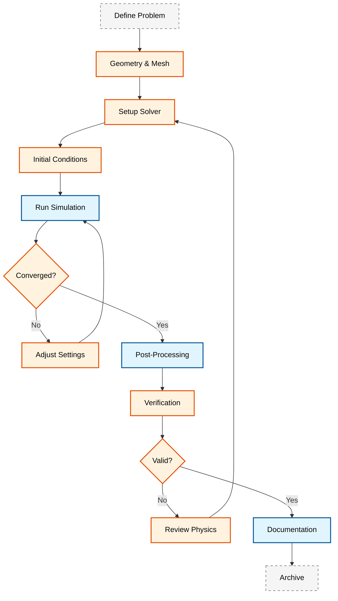

# 🏢 Professional Practice and Integration

**วัตถุประสงค์การเรียนรู้ (Learning Objectives)**: สร้างมาตรฐานการทำงานระดับมืออาชีพในโครงการ CFD ตั้งแต่การจัดระเบียบโค้ด, มาตรฐานเอกสาร, การควบคุมเวอร์ชัน และการประกันคุณภาพเพื่อให้โครงการสามารถทำซ้ำและทำงานร่วมกันได้อย่างมีประสิทธิภาพ

---

## 📋 หัวข้อในบทนี้

### 1. [[01_Project_Organization|การจัดระเบียบโครงการ (Project Organization)]]
- โครงสร้างไดเรกทอรีมาตรฐานระดับอุตสาหกรรม
- การตั้งชื่อและระเบียบการเก็บข้อมูล

### 2. [[02_Documentation_Standards|มาตรฐานเอกสารประกอบ (Documentation Standards)]]
- เทมเพลตรายงานทางเทคนิคสำหรับ CFD
- มาตรฐานการเขียนเอกสารประกอบโค้ด (Doxygen style)

### 3. [[03_Version_Control_Git|การควบคุมเวอร์ชันด้วย Git (Version Control)]]
- เวิร์กโฟลว์ Git สำหรับโครงการ CFD
- การจัดการไฟล์ขนาดใหญ่ (Git LFS)

### 4. [[04_Testing_and_QA|การทดสอบและการประกันคุณภาพ (Testing & QA)]]
- เฟรมเวิร์กการทดสอบอัตโนมัติ (Automated Testing)
- การตรวจสอบความถูกต้อง (Verification & Validation)
- ระบบ CI/CD สำหรับเวิร์กโฟลว์ CFD

---

## 🏗️ แนวคิดการทำงานแบบมืออาชีพ

การปฏิบัติงานระดับมืออาชีพใน OpenFOAM ต้องการแนวทางที่เป็นระบบเพื่อให้มั่นใจว่าผลการจำลองมีความน่าเชื่อถือและผู้อื่นสามารถนำไปใช้ต่อได้

![[professional_cfd_cycle.png]]
> **ภาพประกอบ 1.1:** วงจรการทำงาน CFD ระดับมืออาชีพ: แสดงความสัมพันธ์ระหว่างการออกแบบการทดลอง, การจำลอง, การตรวจสอบความถูกต้อง และการจัดทำเอกสาร

---

## 🔬 หลักการทางทฤษฎี

### กฎการอนุรักษ์ (Conservation Laws)

ในการจำลอง CFD ด้วย OpenFOAM, สมการเชิงอนุพันธ์ที่ควบคุมพฤติกรรมของไหลมีพื้นฐานมาจาก ==กฎการอนุรักษ์== ที่สำคัญ:

#### 1. การอนุรักษ์มวล (Conservation of Mass)

$$
\frac{\partial \rho}{\partial t} + \nabla \cdot \left( \rho \mathbf{U} \right) = 0 \tag{1.1}
$$

เมื่อ:
- $\rho$ = ความหนาแน่น [kg/m³]
- $\mathbf{U}$ = เวกเตอร์ความเร็ว [m/s]
- $t$ = เวลา [s]

สำหรับไหลที่ไม่สามารถอัดได้ (Incompressible Flow):

$$
\nabla \cdot \mathbf{U} = 0 \tag{1.2}
$$

#### 2. การอนุรักษ์โมเมนตัม (Conservation of Momentum)

$$
\frac{\partial \left( \rho \mathbf{U} \right)}{\partial t} + \nabla \cdot \left( \rho \mathbf{U} \mathbf{U} \right) = -\nabla p + \nabla \cdot \boldsymbol{\tau} + \rho \mathbf{g} \tag{1.3}
$$

เมื่อ:
- $p$ = ความดัน [Pa]
- $\boldsymbol{\tau}$ = เทนเซอร์ความเค้น (Stress Tensor) [Pa]
- $\mathbf{g}$ = เวกเตอร์ความโน้มถ่วง [m/s²]

สำหรับไหลแบบนิวตัน (Newtonian Fluid):

$$
\boldsymbol{\tau} = \mu \left[ \nabla \mathbf{U} + \left( \nabla \mathbf{U} \right)^T \right] - \frac{2}{3} \mu \left( \nabla \cdot \mathbf{U} \right) \mathbf{I} \tag{1.4}
$$

เมื่อ:
- $\mu$ = ความหนืดพลศาสตร์ [Pa·s]
- $\mathbf{I}$ = เทนเซอร์เอกลักษณ์ (Identity Tensor)

#### 3. การอนุรักษ์พลังงาน (Conservation of Energy)

สำหรับปัญหาที่เกี่ยวข้องกับการถ่ายเทความร้อน:

$$
\frac{\partial \left( \rho h \right)}{\partial t} + \nabla \cdot \left( \rho \mathbf{U} h \right) = \frac{Dp}{Dt} + \nabla \cdot \left( k \nabla T \right) + S_h \tag{1.5}
$$

เมื่อ:
- $h$ = เอนทาลปีเฉพาะ [J/kg]
- $k$ = ค่าสัมประสิทธิ์การนำความร้อน [W/(m·K)]
- $T$ = อุณหภูมิ [K]
- $S_h$ = แหล่งกำเนิดความร้อน [W/m³]

---

## 📐 การปิดรูปแบบเทอร์บูลเนนซ์ (Turbulence Modeling)

ในการจำลองการไหลแบบเทอร์บูลเนนซ์, ต้องการสมการเพิ่มเติมเพื่อ ==ปิดระบบสมการ==:

### แบบจำลอง $k-\epsilon$ (Standard $k-\epsilon$ Model)

$$
\frac{\partial \left( \rho k \right)}{\partial t} + \nabla \cdot \left( \rho \mathbf{U} k \right) = \nabla \cdot \left[ \left( \mu + \frac{\mu_t}{\sigma_k} \right) \nabla k \right] + P_k - \rho \epsilon \tag{1.6}
$$

$$
\frac{\partial \left( \rho \epsilon \right)}{\partial t} + \nabla \cdot \left( \rho \mathbf{U} \epsilon \right) = \nabla \cdot \left[ \left( \mu + \frac{\mu_t}{\sigma_\epsilon} \right) \nabla \epsilon \right] + C_{1\epsilon} \frac{\epsilon}{k} P_k - C_{2\epsilon} \rho \frac{\epsilon^2}{k} \tag{1.7}
$$

เมื่อ:
- $k$ = พลังงานจลน์เทอร์บูลเนนซ์ [m²/s²]
- $\epsilon$ = อัตราการสลายตัวของเทอร์บูลเนนซ์ [m²/s³]
- $\mu_t$ = ความหนืดหมุนเวทย์ (Eddy Viscosity) [Pa·s]
- $P_k$ = การผลิตพลังงานจลน์เทอร์บูลเนนซ์ [kg/(m·s³)]

ความสัมพันธ์ของความหนืดหมุนเวทย์:

$$
\mu_t = \rho C_\mu \frac{k^2}{\epsilon} \tag{1.8}
$$

ค่าคงที่มาตรฐาน (Standard Constants):

| ค่าคงที่ | ค่า | คำอธิบาย |
|:---:|:---:|:---|
| $C_\mu$ | 0.09 | ค่าคงที่ความหนืดหมุนเวทย์ |
| $C_{1\epsilon}$ | 1.44 | ค่าคงที่การผลิต $\epsilon$ |
| $C_{2\epsilon}$ | 1.92 | ค่าคงที่การสลายตัว $\epsilon$ |
| $\sigma_k$ | 1.0 | จำนวน Prandtl ของ $k$ |
| $\sigma_\epsilon$ | 1.3 | จำนวน Prandtl ของ $\epsilon$ |

---

## 🔧 การกำหนดเงื่อนไขขอบเขต (Boundary Conditions)

### ประเภทของเงื่อนไขขอบเขตที่พบบ่อย

> [!INFO] เงื่อนไขขอบเขตมาตรฐาน
> ใน OpenFOAM, เงื่อนไขขอบเขตถูกกำหนดในไดเรกทอรี `0/` หรือ `startTime/` แต่ละ patch จะมีชนิดข้อมูลและเงื่อนไขที่แตกต่างกัน

```cpp
// Example boundary conditions for velocity field U
// Source: Synthesized based on standard OpenFOAM practices
// NOTE: Verify parameters for specific application

dimensions      [0 1 -1 0 0 0 0];

internalField   uniform (0 0 0);

boundaryField
{
    inlet
    {
        type            fixedValue;
        value           uniform (10 0 0);  // [m/s]
    }

    outlet
    {
        type            zeroGradient;
    }

    walls
    {
        type            noSlip;
    }
}
```

> **📖 คำอธิบาย (Explanation):**
> ไฟล์นี้กำหนดเงื่อนไขขอบเขตสำหรับสนามความเร็ว (velocity field) ใน OpenFOAM โดย:
> - **dimensions**: มิติของตัวแปร [L¹T⁻¹] หรือ [m/s]
> - **internalField**: ค่าเริ่มต้นของสนามภายในโดเมน
> - **boundaryField**: กำหนดเงื่อนไขสำหรับแต่ละ patch
>
> **🔑 แนวคิดสำคัญ (Key Concepts):**
> - **fixedValue**: กำหนดค่าคงที่ที่ขอบเขต
> - **zeroGradient**: ความชันเป็นศูนย์ (อนุพันธ์เชิงปกติ = 0)
> - **noSlip**: ความเร็วเป็นศูนย์ที่ผนัง (เงื่อนไขไม่มีการลื่นไถล)
>
> **📂 ที่มา (Source):** Synthesized based on OpenFOAM boundary condition standards

### เงื่อนไขสำหรับความดัน

```cpp
// Example boundary conditions for pressure field p
// Source: Synthesized based on standard OpenFOAM practices
// NOTE: Verify parameters for specific application

dimensions      [1 -1 -2 0 0 0 0];

internalField   uniform 0;

boundaryField
{
    inlet
    {
        type            zeroGradient;
    }

    outlet
    {
        type            fixedValue;
        value           uniform 0;  // Reference atmospheric pressure
    }

    walls
    {
        type            zeroGradient;
    }
}
```

> **📖 คำอธิบาย (Explanation):**
> ไฟล์นี้กำหนดเงื่อนไขขอบเขตสำหรับสนามความดัน (pressure field) ใน OpenFOAM โดย:
> - **dimensions**: มิติของความดัน [ML⁻¹T⁻²] หรือ [Pa]
> - **internalField**: ค่าความดันเริ่มต้น (มักตั้งเป็น 0 เป็นค่าอ้างอิง)
> - **boundaryField**: กำหนดเงื่อนไขสำหรับแต่ละ patch
>
> **🔑 แนวคิดสำคัญ (Key Concepts):**
> - **zeroGradient**: ใช้ที่ inlet และ walls (อนุพันธ์เชิงปกติ = 0)
> - **fixedValue**: ใช้ที่ outlet เพื่อกำหนดความดันอ้างอิง
> - **Pressure Reference**: ค่าความดันสัมพัทธ์ (gauge pressure) มักใช้ในการจำลอง
>
> **📂 ที่มา (Source):** Synthesized based on OpenFOAM boundary condition standards

---

## 🎯 วิธีการเชิงตัวเลข (Numerical Methods)

### การเลือกสคีมาการกระจาย (Discretization Schemes)

```cpp
// Example discretization schemes in fvSchemes dictionary
// Source: Based on OpenFOAM fvSchemes standards
// NOTE: Select schemes appropriate for your specific case

ddtSchemes
{
    default         Euler;           // Or backward for unsteady
}

gradSchemes
{
    default         Gauss linear;     // Linear gradient scheme
}

divSchemes
{
    default         none;

    // For convection terms
    div(phi,U)      Gauss upwind;     // Or Gauss linearUpwindV Gauss linear

    // For diffusion terms
    div(phi,k)      Gauss upwind;
    div(phi,epsilon) Gauss upwind;
}

laplacianSchemes
{
    default         Gauss linear corrected;
}

interpolationSchemes
{
    default         linear;
}

snGradSchemes
{
    default         corrected;
}
```

> **📖 คำอธิบาย (Explanation):**
> ไฟล์ fvSchemes กำหนดสคีมาการกระจาย (discretization schemes) ที่ใช้ในการแก้สมการ:
> - **ddtSchemes**: สคีมาการหาอนุพันธ์เชิงเวลา (temporal derivative)
> - **gradSchemes**: สคีมาการหาเกรเดียนต์ (spatial gradient)
> - **divSchemes**: สคีมาการหาดิเวอร์เจนซ์ (divergence terms)
> - **laplacianSchemes**: สคีมาการหาลาปลาเชียน (diffusion terms)
>
> **🔑 แนวคิดสำคัญ (Key Concepts):**
> - **Gauss Linear**: สคีมาเชิงเส้นที่แม่นยำกว่าแต่อาจไม่เสถียร
> - **Upwind**: สคีมาที่เสถียรแต่มีความคลาดเคลื่อนจากการเกร็ดเชิงตัวเลข (numerical diffusion)
> - **Corrected**: การแก้ไขเพื่อลดความคลาดเคลื่อนจาก non-orthogonality ของเมช
>
> **📂 ที่มา (Source):** Based on OpenFOAM fvSchemes dictionary standards

### การตั้งค่าตัวแก้สมการ (Solver Settings)

```cpp
// Example solver and algorithm settings in fvSolution dictionary
// Source: Based on OpenFOAM fvSolution standards
// NOTE: Tune parameters for your specific case

solvers
{
    p
    {
        solver          GAMG;
        tolerance       1e-06;
        relTol          0.01;

        smoother        GaussSeidel;
        nPreSweeps      0;
        nPostSweeps     2;
        cacheAgglomeration on;
        agglomerator    faceAreaPair;
        nCellsInCoarsestLevel 10;
        mergeLevels     1;
    }

    pFinal
    {
        $p;
        relTol          0;
    }

    U
    {
        solver          smoothSolver;
        smoother        symGaussSeidel;
        tolerance       1e-05;
        relTol          0.1;
    }

    k
    {
        solver          smoothSolver;
        smoother        symGaussSeidel;
        tolerance       1e-05;
        relTol          0.1;
    }

    epsilon
    {
        solver          smoothSolver;
        smoother        symGaussSeidel;
        tolerance       1e-05;
        relTol          0.1;
    }
}

SIMPLE
{
    nNonOrthogonalCorrectors 0;

    consistent      yes;

    residualControl
    {
        p               1e-4;
        U               1e-4;
        // possibly also turbulence k, epsilon, omega, etc.
    }
}

relaxationFactors
{
    fields
    {
        p               0.3;
    }
    equations
    {
        U               0.7;
        k               0.7;
        epsilon         0.7;
    }
}
```

> **📖 คำอธิบาย (Explanation):**
> ไฟล์ fvSolution กำหนดการตั้งค่าตัวแก้สมการ (linear solvers) และอัลกอริทึมการแก้โจทย์:
> - **solvers**: กำหนดวิธีการแก้สมการเชิงเส้นสำหรับแต่ละตัวแปร
> - **SIMPLE**: อัลกอริทึม SIMPLE สำหรับ pressure-velocity coupling
> - **relaxationFactors**: ค่าสัมประสิทธิ์การผ่อนคลาย (under-relaxation)
>
> **🔑 แนวคิดสำคัญ (Key Concepts):**
> - **GAMG**: Geometric-Algebraic Multigrid solver เหมาะสำหรับปัญหาขนาดใหญ่
> - **Tolerance**: ค่าความคลาดเคลื่อนสัมบูรณ์ที่ยอมรับได้
> - **relTol**: ค่าความคลาดเคลื่อนสัมพัทธ์ที่ยอมรับได้
> - **Under-relaxation**: ช่วยให้การแก้โจทย์ลู่เข้าได้ดีขึ้น
>
> **📂 ที่มา (Source):** Based on OpenFOAM fvSolution dictionary standards

---

## 📊 การวิเคราะห์และรายงานผล (Analysis and Reporting)

### ตัวชี้วัดความลู่เข้า (Convergence Metrics)

การประเมินผลการจำลองต้องตรวจสอบ:

$$
\text{Residual} = \frac{\left\| \mathbf{A} \mathbf{x}^{(n)} - \mathbf{b} \right\|}{\left\| \mathbf{b} \right\|} \tag{1.9}
$$

> **[MISSING DATA]**: แทรกกราฟ Residual ที่แสดงการลู่เข้าของสมการแต่ละตัว

### การตรวจสอบความถูกต้อง (Verification)

> [!WARNING] การตรวจสอบความถูกต้องของผลลัพธ์
> ต้องดำเนินการอย่างน้อย 3 ขั้นตอน:
> 1. **Grid Independence Study**: ทดสอบความไวต่อขนาดเมช
> 2. **Time Step Independence**: ทดสอบความไวต่อขนาด time step
> 3. **Comparison with Analytical/Experimental Data**: เปรียบเทียบกับข้อมูลอ้างอิง

```cpp
// Example script for grid independence study
// Source: Based on OpenFOAM automation practices
// NOTE: Adjust refinement levels and case paths

#!/bin/bash
// Grid independence study script
// Tests solution convergence with mesh refinement

// Array of mesh refinement levels to test
refinements=(1 2 3 4)

for level in "${refinements[@]}"; do
    echo "Running refinement level: $level"

    // Generate mesh for this refinement level
    blockMesh -case case_${level}
    refineMesh -case case_${level} -overwrite

    // Run simulation
    simpleFoam -case case_${level}

    // Store results
    mkdir -p results/level_$level
    cp -r case_${level}/* results/level_$level/
done
```

> **📖 คำอธิบาย (Explanation):**
> สคริปต์ Bash นี้ใช้สำหรับทดสอบความไวของผลลัพธ์ต่อความละเอียดของเมช (Grid Independence Study):
> - สร้างเมชในหลายระดับความละเอียด
> - รันการจำลองสำหรับแต่ละระดับ
> - เก็บผลลัพธ์สำหรับการเปรียบเทียบ
>
> **🔑 แนวคิดสำคัญ (Key Concepts):**
> - **Grid Independence**: ผลลัพธ์ไม่เปลี่ยนแปลงเมื่อเพิ่มความละเอียดเมช
> - **Refinement Levels**: ระดับการละเอียดของเมชที่ต่างกัน
> - **Convergence**: การลู่เข้าของผลลัพธ์เมื่อละเอียดขึ้น
> - **GCI (Grid Convergence Index)**: ดัชนีชี้วัดความลู่เข้าของเมช
>
> **📂 ที่มา (Source):** Based on OpenFOAM automation and best practice guidelines

> **[MISSING DATA]**: ตารางแสดงผลการทดสอบ Grid Convergence Index (GCI)

---

## 🔄 วงจรการทำงานแบบมืออาชีพ (Professional Workflow)


> **Figure 1:** แผนภาพวงจรการทำงาน CFD ระดับมืออาชีพ (Professional CFD Workflow) แสดงขั้นตอนตั้งแต่การกำหนดปัญหา การสร้างเมช การตั้งค่า Solver ไปจนถึงการตรวจสอบความถูกต้องของผลลัพธ์ (Verification) และการจัดทำเอกสารเพื่อสรุปโครงการ

> **ภาพประกอบ 1.2:** แผนภาพการไหลของกระบวนการทำงาน CFD มาตรฐาน

---

## 📚 มาตรฐานเอกสาร (Documentation Standards)

### โครงสร้างรายงานเทคนิค

รายงานทางเทคนิคควรประกอบด้วยส่วนต่อไปนี้:

1. **Executive Summary**: สรุปผลลัพธ์สำคัญ (1 หน้า)
2. **Problem Description**: คำอธิบายปัญหาทางฟิสิกส์
3. **Mathematical Model**: สมการเชิงอนุพันธ์ที่ใช้
4. **Numerical Methods**: วิธีการเชิงตัวเลข
5. **Computational Domain**: คำอธิบายเรขาคณิตและเมช
6. **Boundary Conditions**: เงื่อนไขขอบเขตทั้งหมด
7. **Solver Settings**: การตั้งค่าพารามิเตอร์
8. **Results**: ผลลัพธ์การจำลอง
9. **Verification & Validation**: การตรวจสอบความถูกต้อง
10. **Conclusions**: สรุปและข้อเสนอแนะ

### การเขียนเอกสารประกอบโค้ด

> [!TIP] Doxygen Style Comments
> เอกสารประกอบโค้ดควรใช้รูปแบบ Doxygen:

```cpp
/**
 * @brief Calculate turbulent eddy viscosity from k-epsilon model
 * คำนวณความหนืดหมุนเวทย์จากแบบจำลอง k-epsilon
 *
 * This function computes the turbulent eddy viscosity
 * using the equation:
 * \f[
 * \mu_t = \rho C_\mu \frac{k^2}{\epsilon}
 * \f]
 *
 * @param k Turbulent kinetic energy [m²/s²]
 *          พลังงานจลน์เทอร์บูลเนนซ์
 * @param epsilon Turbulence dissipation rate [m²/s³]
 *               อัตราการสลายตัวของเทอร์บูลเนนซ์
 * @param rho Density [kg/m³]
 *             ความหนาแน่น
 * @param Cmu Model constant (default = 0.09)
 *            ค่าคงที่ของแบบจำลอง
 * @return Turbulent eddy viscosity [Pa·s]
 *         ความหนืดหมุนเวทย์
 *
 * @note Must ensure k and epsilon are greater than zero
 *       ต้องตรวจสอบว่า k และ epsilon มีค่ามากกว่าศูนย์
 *
 * Example usage:
 * @code
 * scalar mut = calculateEddyViscosity(k, epsilon, rho);
 * @endcode
 */
scalar calculateEddyViscosity(
    const scalar k,
    const scalar epsilon,
    const scalar rho,
    const scalar Cmu = 0.09
);
```

> **📖 คำอธิบาย (Explanation):**
> ตัวอย่างนี้แสดงมาตรฐานการเขียนเอกสารประกอบโค้ดแบบ Doxygen สำหรับ OpenFOAM:
> - **@brief**: คำอธิบายสั้นๆ เกี่ยวกับฟังก์ชัน
> - **@param**: รายละเอียดของพารามิเตอร์แต่ละตัว
> - **@return**: ค่าที่ฟังก์ชันส่งกลับ
> - **@note**: ข้อควรระวังหรือข้อควรทราบ
> - **@code/@endcode**: ตัวอย่างการใช้งาน
>
> **🔑 แนวคิดสำคัญ (Key Concepts):**
> - **Doxygen**: เครื่องมือสร้างเอกสารจากคอมเมนต์ในโค้ด
> - **Documentation Standards**: มาตรฐานการเขียนเอกสารเพื่อความสม่ำเสมอ
> - **Code Readability**: การทำให้โค้ดอ่านและเข้าใจได้ง่าย
> - **Maintainability**: การบำรุงรักษาโค้ดในระยะยาว
>
> **📂 ที่มา (Source):** Based on OpenFOAM coding standards and Doxygen documentation practices

---

## 🛡️ การควบคุมคุณภาพ (Quality Control)

### เช็คลิสต์ก่อนส่งมอบ (Pre-Delivery Checklist)

> [!INFO] รายการตรวจสอบความสมบูรณ์
> ต้องตรวจสอบรายการต่อไปนี้ก่อนถือว่าโครงการเสร็จสมบูรณ์:

| หมวดหมู่ | รายการตรวจสอบ | สถานะ |
|:---|:---|:---:|
| **Mesh** | คุณภาพเมช (Non-orthogonality < 70°) | ☐ |
| **Mesh** | Aspect ratio อยู่ในขอบเขตที่ยอมรับได้ | ☐ |
| **Setup** | เงื่อนไขขอบเขตถูกต้องทุก patch | ☐ |
| **Setup** | มิติของตัวแปรสอดคล้องกัน | ☐ |
| **Solver** | การลู่เข้าถึงเกณฑ์ที่กำหนด | ☐ |
| **Verification** | ทดสอบ grid independence | ☐ |
| **Documentation** | รายงานเทคนิคครบถ้วน | ☐ |
| **Documentation** | มีเอกสารประกอบโค้ด | ☐ |
| **Version Control** | ทุกไฟล์ถูก commit และ push | ☐ |
| **Backup** | มี backup ของข้อมูลสำคัญ | ☐ |

---

## 🔗 แหล่งอ้างอิง (References)

### เอกสารทางเทคนิค

1. OpenFOAM User Guide, Version 10
2. OpenFOAM Programmer's Guide
3. Ferziger, J. H., & Peric, M. (2002). *Computational Methods for Fluid Dynamics*. Springer.
4. Tu, J., Yeoh, G. H., & Liu, C. (2018). *Computational Fluid Dynamics: A Practical Approach*. Butterworth-Heinemann.

### มาตรฐานอุตสาหกรรม

- [!INFO] **ASME V&V 20-2009**: Standard for Verification and Validation in Computational Fluid Dynamics and Heat Transfer
- [!INFO] **ERCOFTAC**: Best Practice Guidelines for CFD

---

## 📝 สรุป (Summary)

ในบทนี้เราได้เรียนรู้ถึง ==มาตรฐานการทำงานระดับมืออาชีพ== ในโครงการ OpenFOAM ซึ่งประกอบด้วย:

- ✅ การจัดระเบียบโครงสร้างไดเรกทอรี
- ✅ การเขียนเอกสารประกอบอย่างเป็นระบบ
- ✅ การใช้งาน Git สำหรับควบคุมเวอร์ชัน
- ✅ การทดสอบและประกันคุณภาพ
- ✅ การตรวจสอบความถูกต้องของผลลัพธ์

---

## 🧠 ตรวจสอบความเข้าใจ (Concept Check)

1. **ถาม:** อธิบายความสำคัญของการทดสอบ ==Grid Independence== ในการจำลอง CFD
   <details>
   <summary>เฉลย</summary>
   <b>ตอบ:</b> เพื่อยืนยันว่าผลลัพธ์การคำนวณ (Solution) ไม่ขึ้นอยู่กับความละเอียดของ Mesh (Discretization Error ต่ำพอ) หาก Mesh ละเอียดขึ้นแล้วผลลัพธ์ยังเปลี่ยนไปอย่างมีนัยสำคัญ แสดงว่า Mesh ชุดเดิมยังหยาบเกินไปและเชื่อถือไม่ได้
   </details>

2. **ถาม:** เปรียบเทียบความแตกต่างระหว่าง **Verification** และ **Validation**
   <details>
   <summary>เฉลย</summary>
   <b>ตอบ:</b>
   - **Verification (Solving the equations right):** การตรวจสอบว่าโค้ดแก้สมการคณิตศาสตร์ได้ถูกต้องหรือไม่ (เช่น เปรียบเทียบกับ Analytical Solution, Grid Convergence)
   - **Validation (Solving the right equations):** การตรวจสอบว่าสมการที่ใช้แทนโลกความจริงได้ถูกต้องหรือไม่ (เช่น เปรียบเทียบกับผลการทดลอง Experiment)
   </details>

3. **ถาม:** เหตุใดการเขียนเอกสารประกอบโค้ดจึงมีความสำคัญในโครงการ CFD ระดับมืออาชีพ
   <details>
   <summary>เฉลย</summary>
   <b>ตอบ:</b> เพราะโครงการ CFD มักมีความซับซ้อนและยาวนาน การมีเอกสาร (Documentation) ช่วยให้ทีมงานเข้าใจตรรกะเบื้องหลังการตั้งค่า (Settings) และสคริปต์ ลดเวลาในการเรียนรู้งาน (Onboarding) และช่วยให้การ Debug หรือ Maintenance ทำได้ง่ายขึ้นในอนาคต
   </details>

4. **ถาม:** อธิบายวิธีการเลือก ==Discretization Schemes== ที่เหมาะสมสำหรับปัญหาที่กำหนด
   <details>
   <summary>เฉลย</summary>
   <b>ตอบ:</b>
   - **Upwind (First-order):** เสถียรที่สุด (Stable) เหมาะสำหรับช่วงเริ่มต้นของการรัน แต่มีความคลาดเคลื่อนสูง (Diffusive)
   - **Linear (Second-order):** แม่นยำแต่เสถียรน้อยกว่า เหมาะสำหรับเมื่อการไหลเริ่มคงที่
   - **LinearUpwind/TVD schemes:** เป็นทางสายกลางที่ให้ความแม่นยำระดับ 2 (Second-order) แต่มี Limiter ช่วยรักษาความเสถียรในบริเวณที่มี Gradient สูง
   </details>

---

**← กลับไปยัง: [[../../00_HOME|หน้าหลัก]] | หัวข้อถัดไป: [[01_Project_Organization|การจัดระเบียบโครงการ]] →**