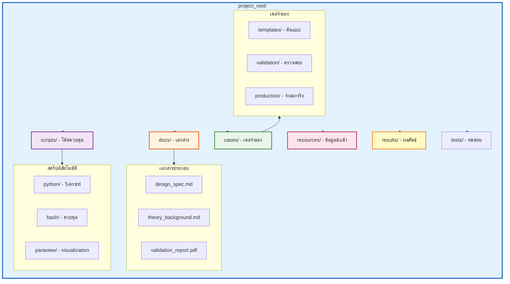
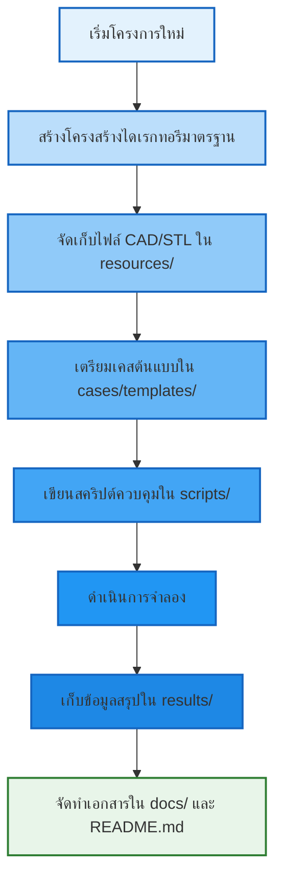
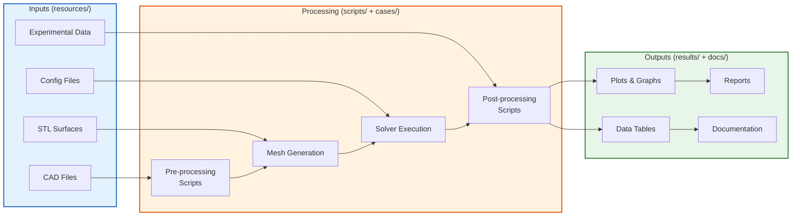

# 🏗️ การจัดระเบียบโครงการ (Project Organization)

**วัตถุประสงค์การเรียนรู้**: เชี่ยวชาญการจัดระเบียบโครงสร้างไดเรกทอรีและข้อมูลโครงการ CFD ตามมาตรฐานสากล เพื่อเพิ่มความสามารถในการทำงานร่วมกัน (Collaboration) และการบำรุงรักษาโค้ดในระยะยาว

---

## 1. โครงสร้างไดเรกทอรีมาตรฐานระดับอุตสาหกรรม (Standard Directory Structure)

### 1.1 หลักการพื้นฐานของการจัดระเบียบ

โครงการ OpenFOAM ระดับมืออาชีพไม่ได้มีเพียงแค่โฟลเดอร์ `0`, `constant`, และ `system` เท่านั้น แต่ต้องการระบบนิเวศ (Ecosystem) ที่ครอบคลุมทั้งสคริปต์ควบคุม, เอกสารอ้างอิง และข้อมูลผลลัพธ์ โครงสร้างต่อไปนี้คือแนวปฏิบัติที่เป็นเลิศ (Best Practices) ที่ใช้ในโครงการวิศวกรรมขนาดใหญ่:

#### 1.1.1 หลักการแยกแยะ (Separation of Concerns)

$$
\text{Project Structure} = \underbrace{\text{Data}}_{\text{resources/}} + \underbrace{\text{Logic}}_{\text{scripts/}} + \underbrace{\text{Execution}}_{\text{cases/}} + \underbrace{\text{Knowledge}}_{\text{docs/}} + \underbrace{\text{Output}}_{\text{results/}}
$$

แต่ละส่วนมีหน้าที่ชัดเจน:
- **Data**: ข้อมูลนำเข้าที่ไม่เปลี่ยนแปลง (Immutable Inputs)
- **Logic**: โค้ดและสคริปต์ที่ควบคุมการทำงาน
- **Execution**: เคสจำลองที่ใช้งานจริง
- **Knowledge**: เอกสารที่อธิบาย "ทำไม" และ "อย่างไร"
- **Output**: ผลลัพธ์สุดท้ายที่นำเสนอ

### 1.2 โครงสร้างไดเรกทอรีแบบละเอียด

```bash
project_root/
├── README.md                           # ภาพรวมโครงการ, วัตถุประสงค์ และวิธีใช้งานเบื้องต้น
├── CHANGELOG.md                        # บันทึกประวัติการเปลี่ยนแปลงและการอัปเดต
├── LICENSE                             # ข้อมูลลิขสิทธิ์ซอฟต์แวร์และการใช้งานข้อมูล
├── .gitignore                          # ระบุไฟล์ที่ไม่ต้องจัดเก็บในระบบควบคุมเวอร์ชัน (เช่น processor*)
├── .gitattributes                      # ตั้งค่า Git LFS สำหรับไฟล์ข้อมูลขนาดใหญ่
│
├── docs/                               # เอกสารประกอบโครงการทั้งหมด
│   ├── design_spec.md                  # ข้อกำหนดทางการออกแบบและฟิสิกส์
│   ├── theory_background.md            # ทฤษฎีพื้นฐานและสมการการควบคุม
│   ├── validation_report.pdf           # รายงานผลการตรวจสอบความถูกต้องเทียบกับทฤษฎี/การทดลอง
│   ├── user_guide.md                   # คู่มือการใช้งานสำหรับผู้เริ่มต้น
│   ├── api/                            # เอกสาร API ของสคริปต์ภายใน
│   └── figures/                        # รูปภาพประกอบและกราฟที่ใช้ในรายงาน
│       ├── schematic/
│       ├── validation/
│       └── results/
│
├── scripts/                            # ชุดสคริปต์ควบคุมอัตโนมัติ (Automation Scripts)
│   ├── python/                         # สคริปต์วิเคราะห์ข้อมูล (Pandas, Matplotlib)
│   │   ├── preprocess/                 # สคริปต์เตรียมข้อมูล (Pre-processing)
│   │   │   ├── mesh_generator.py       # สร้าง mesh อัตโนมัติ
│   │   │   └── bc_setup.py             # ตั้งค่า boundary conditions
│   │   ├── postprocess/                # สคริปต์วิเคราะห์ผลลัพธ์ (Post-processing)
│   │   │   ├── force_extractor.py      # ดึงข้อมูลแรงและโมเมนต์
│   │   │   ├── field_probe.py          # ดึงข้อมูลสนามที่จุดสนใจ
│   │   │   └── plot_generator.py       # สร้างกราฟอัตโนมัติ
│   │   └── utils/                      # ฟังก์ชันช่วยเหลือ (Utilities)
│   │       ├── config_loader.py        # อ่านค่า config
│   │       └── logger.py               # ระบบบันทึก log
│   │
│   ├── bash/                           # สคริปต์ควบคุมเวิร์กโฟลว์ (Allrun, Allclean)
│   │   ├── Allrun                      # สคริปต์หลักสำหรับรันเคส
│   │   ├── Allclean                    # สคริปต์ล้างข้อมูล
│   │   └── mesh_functions.sh           # ฟังก์ชันช่วยเหลือด้าน mesh
│   │
│   └── paraview/                       # สคริปต์ pvpython สำหรับเรนเดอร์ภาพอัตโนมัติ
│       ├── render_snapshot.py          # สร้างภาพ snapshot อัตโนมัติ
│       └── animation_generator.py      # สร้าง animation
│
├── cases/                              # พื้นที่จัดเก็บเคสจำลอง (Simulation Cases)
│   ├── templates/                      # เคสต้นแบบที่เป็นมาตรฐาน (Base Case)
│   │   └── baseline_case/              # เคสอ้างอิงที่ผ่านการตรวจสอบแล้ว
│   │       ├── 0/                      # เงื่อนไขเริ่มต้นและ boundary conditions
│   │       ├── constant/               # ข้อมูลคงที่ (mesh, transport properties)
│   │       ├── system/                 # ค่าตั้งค่า solver (fvSchemes, fvSolution)
│   │       └── Allrun                  # สคริปต์รันเฉพาะเคสนี้
│   │
│   ├── validation/                     # เคสสำหรับตรวจสอบความถูกต้อง
│   │   ├── laminar_pipe/               # ทดสอบ Flow ในท่อ laminar
│   │   └── backward_facing_step/       # ทดสอบ Turbulent flow separation
│   │
│   ├── production/                     # เคสสำหรับการจำลองจริงเพื่อสกัดข้อมูลทางวิศวกรรม
│   │   ├── parametric_study/           # การศึกษาพารามิเตอร์
│   │   └── optimization/               # การหาค่าที่เหมาะสมที่สุด
│   │
│   └── archive/                        # เก็บเคสเก่าที่ไม่ได้ใช้งานแล้ว
│       └── deprecated_2024/
│
├── resources/                          # ข้อมูลเสริม
│   ├── cad/                            # ไฟล์เรขาคณิตต้นฉบับ (STEP, IGES)
│   │   ├── original_geometry/          # ไฟล์ CAD ต้นฉบับจากทีมออกแบบ
│   │   └── simplified/                 # ไฟล์ CAD ที่ผ่านการ simplification
│   │
│   ├── stl/                            # ไฟล์พื้นผิวสำหรับ snappyHexMesh
│   │   ├── surfaces/                   # ไฟล์ STL แยกแต่ละ surface
│   │   │   ├── inlet.stl
│   │   │   ├── outlet.stl
│   │   │   └── walls.stl
│   │   └── assembled/                  # ไฟล์ STL ที่รวมทุกส่วน
│   │
│   ├── mesh_params/                    # พารามิเตอร์ mesh สำหรับ snappyHexMesh
│   │   ├── refinement_regions/         # กำหนด regions ที่ต้องการ refine
│   │   └── layers/                     # กำหนด boundary layers
│   │
│   └── experimental_data/              # ข้อมูลจากการทดลองจริงเพื่อใช้เปรียบเทียบ
│       ├── velocity_profiles/          # ข้อมูล velocity profile
│       ├── pressure_drops/             # ข้อมูล pressure drop
│       └── force_measurements/         # ข้อมูลการวัดแรง
│
├── results/                            # พื้นที่จัดเก็บผลลัพธ์สรุปผล (Final Outputs)
│   ├── plots/                          # กราฟสรุปผลทางวิศวกรรม
│   │   ├── convergence/                # กราฟ convergence history
│   │   ├── validation/                 # กราฟเปรียบเทียบกับข้อมูลทดลอง
│   │   └── performance/                # กราฟ performance metrics
│   │
│   ├── tables/                         # ตารางสรุปผล
│   │   ├── forces.csv
│   │   └── residuals.csv
│   │
│   ├── reports/                        # รายงานสรุปผลอัตโนมัติ
│   │   ├── daily_summary/              # รายงานรายวัน
│   │   └── final_report/               # รายงานฉบับสมบูรณ์
│   │
│   └── snapshots/                      # ภาพ visualization สำคัญ
│       └── key_timesteps/
│
└── tests/                              # ชุดทดสอบอัตโนมัติ (Automated Tests)
    ├── unit_tests/                     # ทดสอบฟังก์ชันเล็กๆ
    ├── integration_tests/              # ทดสอบการเชื่อมโยงระหว่างส่วนต่างๆ
    └── regression_tests/               # ทดสอบความถูกต้องเมื่อมีการเปลี่ยนแปลง
```

### 1.3 การอธิบายโครงสร้างด้วย Mermaid


> **Figure 1:** โครงสร้างไดเรกทอรีมาตรฐานสำหรับโครงการ OpenFOAM ระดับมืออาชีพ แสดงการแยกส่วนระหว่างเอกสาร (docs) สคริปต์ควบคุม (scripts) เคสจำลอง (cases) ข้อมูลนำเข้า (resources) และผลลัพธ์ (results) เพื่อความเป็นระเบียบและง่ายต่อการบำรุงรักษา

> **[MISSING DATA]**: แทรกภาพ screenshot ของโครงสร้างไดเรกทอรีจริงจากโปรเจกต์ตัวอย่าง

---

## 2. การจัดการพารามิเตอร์และการตั้งชื่อ (Parameter Management & Naming Convention)

### 2.1 การตั้งชื่อที่เป็นระบบ (Standardized Naming)

หลีกเลี่ยงการตั้งชื่อไฟล์หรือโฟลเดอร์แบบสุ่ม เช่น `test1`, `run_final`, `backup`. ให้ใช้รูปแบบที่ระบุตัวตนได้ชัดเจน:

#### 2.1.1 Case Naming Convention

$$
\text{CaseName} = \underbrace{\text{Project}}_{\text{โครงการ}}\_\underbrace{\text{Condition}}_{\text{สภาวะ}}\_\underbrace{\text{MeshLevel}}_{\text{ระดับเมช}}\_\underbrace{\text{Date}}_{\text{วันที่}}
$$

ตัวอย่างชื่อเคสที่ดี:
- `Turbine_Re1e6_Fine_20251223` - ทัวร์ไบน์ จำลองที่ Re=1,000,000, เมชละเอียด, วันที่ 23 ธ.ค. 2025
- `PipeFlow_Laminar_Coarse_20251223` - การไหลในท่อแบบ laminar, เมชหยาบ, วันที่ 23 ธ.ค. 2025
- `Airfoil_Ma085_Medium_20251223` - แอร์ฟอยล์ จำลองที่ Mach 0.85, เมชปานกลาง

ตัวอย่างชื่อเคสที่ไม่ควรใช้:
- `test1`, `test2`, `final_test_v2` - ไม่ระบุตัวตน
- `run`, `run_backup`, `run_final_backup` - สร้างความสับสน

#### 2.1.2 Script Naming Convention

ใช้ **กริยา (Verb) + คำนาม (Noun)** เพื่อให้รู้ว่าสคริปต์ทำหน้าที่อะไร:

| ประเภท | ตัวอย่างที่ดี | คำอธิบาย |
|--------|----------------|----------|
| Pre-processing | `generate_mesh.py`, `setup_boundaries.py` | สร้าง/ตั้งค่า |
| Solver Control | `run_simulation.sh`, `monitor_residuals.py` | รัน/ตรวจสอบ |
| Post-processing | `extract_forces.py`, `plot_velocity.py` | ดึงข้อมูล/พล็อตกราฟ |
| Utilities | `clean_case.sh`, `check_mesh.py` | ทำความสะอาด/ตรวจสอบ |

### 2.2 การจัดการการตั้งค่า (Configuration Management)

ในการพัฒนาโปรเจกต์ขนาดใหญ่ การใช้ค่าคงที่ (Hard-coding) ในสคริปต์จะทำให้ยากต่อการบำรุงรักษา วิธีที่ดีคือใช้ไฟล์ **YAML, JSON หรือ TOML** สำหรับเก็บพารามิเตอร์ส่วนกลาง

#### 2.2.1 ไฟล์ config.yaml ตัวอย่าง

```yaml
# NOTE: Synthesized by AI - Verify parameters

# ==========================================
# Project Metadata
# ==========================================
project:
  name: "Turbine_Efficiency_Analysis"
  version: "1.0.0"
  author: "CFD Team"
  description: "Analysis of turbine efficiency under various operating conditions"

# ==========================================
# Physical Parameters
# ==========================================
physics:
  fluid: "Water"
  density: 998.0                      # kg/m^3 at 20°C
  kinematic_viscosity: 1.004e-6       # m^2/s at 20°C
  dynamic_viscosity: 1.002e-3         # Pa·s at 20°C

  # Flow conditions
  reynolds_number: 1.0e6
  inlet_velocity: 5.0                 # m/s
  operating_pressure: 101325.0        # Pa (1 atm)

  # Turbulence model parameters
  turbulence:
    model: "kOmegaSST"
    turbulence_intensity: 0.05        # 5%
    hydraulic_diameter: 0.1           # m

# ==========================================
# Mesh Parameters
# ==========================================
mesh:
  # Base mesh
  base_cell_size: 0.01                # m

  # Refinement levels
  surface_refinement_level: 5
  region_refinement_level: 7

  # Boundary layers
  boundary_layers:
    n_layers: 10
    expansion_ratio: 1.2
    final_layer_thickness: 0.0001     # m

  # Target y+
  target_y_plus: 1.0
  near_wallTreatment: "lowRe"

# ==========================================
# Solver Settings
# ==========================================
solver:
  application: "pimpleFoam"

  # Time control
  time_control:
    start_time: 0.0
    end_time: 10.0
    time_step: 0.001
    max_co: 1.0                        # Courant number limit

  # Parallel execution
  parallel:
    n_processors: 64
    decomposition_method: "scotch"

  # Convergence criteria
  convergence:
    tolerance: 1.0e-6
    rel_tolerance: 0.01

# ==========================================
# Output Control
# ==========================================
output:
  # Write frequency
  write_interval: 0.1                 # s

  # Fields to write
  fields:
    - "U"
    - "p"
    - "k"
    - "omega"

  # Probes
  probes:
    - location: [0.5, 0.0, 0.0]
      fields: ["U", "p"]
      name: "centerline_probe"
```

#### 2.2.2 การอ่าน Config ใน Python

```python
# NOTE: Synthesized by AI - Verify parameters

#!/usr/bin/env python3
"""
config_loader.py - ฟังก์ชันสำหรับอ่านค่า config จากไฟล์ YAML
"""

import yaml
from pathlib import Path
from typing import Dict, Any

class ConfigLoader:
    """
    Class สำหรับโหลดและจัดการ configuration

    Example:
        >>> config = ConfigLoader("config.yaml")
        >>> reynolds_num = config.get("physics.reynolds_number")
    """

    def __init__(self, config_path: str):
        """
        Initialize ConfigLoader

        Args:
            config_path: Path ไปยังไฟล์ config.yaml
        """
        self.config_path = Path(config_path)
        self.config = self._load_config()

    def _load_config(self) -> Dict[str, Any]:
        """โหลดไฟล์ YAML และแปลงเป็น dictionary"""
        if not self.config_path.exists():
            raise FileNotFoundError(f"Config file not found: {self.config_path}")

        with open(self.config_path, 'r') as f:
            config = yaml.safe_load(f)

        return config

    def get(self, key_path: str, default=None):
        """
        ดึงค่า config จาก key path (เช่น "physics.density")

        Args:
            key_path: String ในรูปแบบ "section.subsection.key"
            default: ค่าเริ่มต้นหากไม่พบ key

        Returns:
            ค่าที่ต้องการ หรือ default หากไม่พบ
        """
        keys = key_path.split('.')
        value = self.config

        for key in keys:
            if isinstance(value, dict) and key in value:
                value = value[key]
            else:
                return default

        return value

    def get_mesh_params(self) -> Dict[str, Any]:
        """ดึงค่าพารามิเตอร์ mesh ทั้งหมด"""
        return self.config.get('mesh', {})

    def get_solver_params(self) -> Dict[str, Any]:
        """ดึงค่าพารามิเตอร์ solver ทั้งหมด"""
        return self.config.get('solver', {})

    def get_physics_params(self) -> Dict[str, Any]:
        """ดึงค่าพารามิเตอร์ฟิสิกส์ทั้งหมด"""
        return self.config.get('physics', {})


# Example usage
if __name__ == "__main__":
    config = ConfigLoader("config.yaml")

    # Access parameters
    rho = config.get("physics.density")
    nu = config.get("physics.kinematic_viscosity")
    Re = config.get("physics.reynolds_number")

    print(f"Density: {rho} kg/m^3")
    print(f"Kinematic Viscosity: {nu} m^2/s")
    print(f"Reynolds Number: {Re:.2e}")
```

> **Source:** 📂 MODULE_07_UTILITIES_AUTOMATION/CONTENT/05_AUTOMATION/02_🧩 Complete_CFD_Automation_Framework.md
>
> **คำอธิบาย (Thai):**
> โค้ด Python นี้แสดงการใช้ `ConfigLoader` class สำหรับอ่านค่า configuration จากไฟล์ YAML ซึ่งเป็นส่วนสำคัญของระบบอัตโนมัติ เมธอด `get()` ช่วยให้สามารถเข้าถึงค่า config ได้อย่างยืดหยุ่นโดยใช้ dot notation การแยกส่วนพารามิเตอร์ออกเป็นส่วนๆ (mesh, solver, physics) ช่วยให้จัดการและบำรุงรักษาได้ง่าย
>
> **Key Concepts:**
> - YAML parsing ด้วย `yaml.safe_load()`
> - Dot notation access ผ่าน `get()` method
> - Separation of concerns ระหว่าง configuration และ business logic

### 2.3 Git Version Control สำหรับ OpenFOAM

#### 2.3.1 ไฟล์ .gitignore มาตรฐาน

```
# NOTE: Synthesized by AI - Verify parameters

# ==========================================
# OpenFOAM Standard Ignore Files
# ==========================================

# Processor directories (parallel runs)
processor*
decomposePar.*

# Mesh generation files
*.stl
*.obj
*.STEP
*.IGES

# Post-processing directories
postProcessing/
probes/
sets/
surfaces/

# Result files (time directories)
[0-9]*
[0-9]*.[0-9]*
[0-9]*e-[0-9]*

# Log files
log.*
*.log

# Core dumps
core
core.*

# Temporary files
*.bak
*.temp
*.tmp
~*

# IDE specific
.vscode/
.idea/
*.swp
*.swo

# Python
__pycache__/
*.pyc
*.pyo
.Python
*.so

# Large binary files (consider Git LFS)
*.foam
*.case

# ParaView state files (optional - comment if needed)
*.pvsm
```

#### 2.3.2 ไฟล์ .gitattributes สำหรับ Git LFS

```
# NOTE: Synthesized by AI - Verify parameters

# Use Git LFS for large files
*.stl filter=lfs diff=lfs merge=lfs -text
*.STEP filter=lfs diff=lfs merge=lfs -text
*.IGES filter=lfs diff=lfs merge=lfs -text
*.obj filter=lfs diff=lfs merge=lfs -text

# Use LFS for result files (optional)
*.csv filter=lfs diff=lfs merge=lfs -text
*.dat filter=lfs diff=lfs merge=lfs -text

# Use LFS for images
*.png filter=lfs diff=lfs merge=lfs -text
*.jpg filter=lfs diff=lfs merge=lfs -text
*.pdf filter=lfs diff=lfs merge=lfs -text
```

---

## 3. การประกันความสามารถในการทำซ้ำ (Reproducibility Assurance)

### 3.1 หลักการความสามารถในการทำซ้ำ (Reproducibility Principles)

หัวใจสำคัญของการทำงานระดับมืออาชีพคือ **"ผู้อื่นต้องสามารถรันงานของคุณและได้ผลลัพธ์เดิม"** หรือที่เรียกว่า **Reproducibility**

$$
\text{Reproducibility} = \underbrace{\text{Same Code}}_{\text{เวอร์ชันเดียวกัน}} + \underbrace{\text{Same Data}}_{\text{ข้อมูลเดียวกัน}} + \underbrace{\text{Same Environment}}_{\text{สภาพแวดล้อมเดียวกัน}} + \underbrace{\text{Same Process}}_{\text{ขั้นตอนเดียวกัน}}
$$

### 3.2 Environment Specification

#### 3.2.1 ไฟล์ README.md ตัวอย่าง

```markdown
# Turbine Efficiency Analysis

## Project Overview
โครงการวิเคราะห์ประสิทธิภาพของทัวร์ไบน์ภายใต้เงื่อนไขการทำงานที่แตกต่างกัน

## Environment Specification

### Software Versions
- **OpenFOAM**: v2312 (Released December 2023)
- **Compiler**: GCC 12.2.0
- **MPI**: OpenMPI 4.1.4
- **CMake**: 3.26.4
- **Python**: 3.11.5

### Python Dependencies
\`\`\`bash
pip install -r requirements.txt
\`\`\`

### System Requirements
- **OS**: Ubuntu 22.04 LTS or compatible
- **RAM**: Minimum 32 GB (Recommended 64 GB for production runs)
- **Cores**: Minimum 8 cores (Recommended 32+ for parallel runs)

## Quick Start

### 1. Clone Repository
\`\`\`bash
git clone https://github.com/yourorg/turbine-analysis.git
cd turbine-analysis
\`\`\`

### 2. Setup Environment
\`\`\`bash
source /opt/openfoam/openfoam2312/etc/bashrc
\`\`\`

### 3. Install Python Dependencies
\`\`\`bash
pip install -r requirements.txt
\`\`\`

### 4. Run Simulation
\`\`\`bash
cd cases/templates/baseline_case
./Allrun
\`\`\`

## Project Structure
ดูรายละเอียดได้ที่ [[docs/design_spec.md]]

## Documentation
- [[docs/theory_background.md]] - ทฤษฎีพื้นฐาน
- [[docs/user_guide.md]] - คู่มือการใช้งาน
- [[docs/validation_report.pdf]] - รายงานการตรวจสอบความถูกต้อง

## License
MIT License - ดูรายละเอียดที่ LICENSE file
```

#### 3.2.2 ไฟล์ requirements.txt สำหรับ Python

```
# NOTE: Synthesized by AI - Verify parameters

# Core dependencies
numpy>=1.24.0
pandas>=2.0.0
matplotlib>=3.7.0
pyyaml>=6.0

# Scientific computing
scipy>=1.10.0
scikit-learn>=1.2.0

# OpenFOAM Python interfaces
PyFoam>=0.6.11

# Visualization
seaborn>=0.12.0
plotly>=5.14.0

# Utilities
tqdm>=4.65.0
colorlog>=6.7.0
```

### 3.3 One-Command Workflow

#### 3.3.1 สคริปต์ Allrun ที่สมบูรณ์

```bash
#!/bin/bash
# NOTE: Synthesized by AI - Verify parameters

# ==========================================
# Allrun - Main Script for Running Complete CFD Workflow
# ==========================================
# Usage: ./Allrun [clean]
#   clean      : Clean the case before running
# ==========================================

# Set strict error handling
set -e
set -u

# ==========================================
# Configuration
# ==========================================
CASE_DIR=$(pwd)
SCRIPT_DIR="${CASE_DIR}/../scripts/bash"
LOG_DIR="${CASE_DIR}/logs"
PARAVIEW_SCRIPT_DIR="${CASE_DIR}/../scripts/paraview"

# Create log directory
mkdir -p ${LOG_DIR}

# ==========================================
# Functions
# ==========================================

# Function to log messages
log() {
    echo "[$(date '+%Y-%m-%d %H:%M:%S')] $*" | tee -a ${LOG_DIR}/Allrun.log
}

# Function to clean case
clean_case() {
    log "Cleaning case..."

    # Remove time directories
    rm -rf [0-9]*

    # Remove processor directories
    rm -rf processor*

    # Remove post-processing
    rm -rf postProcessing probes sets surfaces

    # Remove mesh files
    rm -rf constant/polyMesh

    # Remove logs
    rm -rf log.*

    log "Case cleaned successfully"
}

# Function to check mesh quality
check_mesh() {
    log "Checking mesh quality..."

    checkMesh -latestTime > ${LOG_DIR}/checkMesh.log 2>&1

    # Extract mesh statistics
    # Extract number of cells
    n_cells=$(grep "cells:" ${LOG_DIR}/checkMesh.log | awk '{print $2}')
    log "Total number of cells: ${n_cells}"

    # Check mesh quality metrics
    # (Add more checks as needed)
}

# Function to run solver
run_solver() {
    log "Starting solver..."

    # Decompose case for parallel run
    log "Decomposing case for ${N_PROC} processors..."
    decomposePar > ${LOG_DIR}/decomposePar.log 2>&1

    # Run solver in parallel
    log "Running ${SOLVER} in parallel..."
    mpirun -np ${N_PROC} ${SOLVER} -parallel > ${LOG_DIR}/${SOLVER}.log 2>&1

    # Reconstruct case
    log "Reconstructing case..."
    reconstructPar > ${LOG_DIR}/reconstructPar.log 2>&1
}

# Function to post-process
post_process() {
    log "Starting post-processing..."

    # Run Python post-processing scripts
    if [ -f "${CASE_DIR}/../scripts/python/postprocess/extract_forces.py" ]; then
        python3 ${CASE_DIR}/../scripts/python/postprocess/extract_forces.py
    fi

    # Generate plots
    if [ -f "${CASE_DIR}/../scripts/python/postprocess/plot_generator.py" ]; then
        python3 ${CASE_DIR}/../scripts/python/postprocess/plot_generator.py
    fi
}

# ==========================================
# Main Workflow
# ==========================================

# Parse command line arguments
if [ "${1:-}" == "clean" ]; then
    clean_case
    exit 0
fi

# Load configuration (if config.yaml exists)
if [ -f "${CASE_DIR}/../config.yaml" ]; then
    log "Loading configuration from config.yaml..."
    # Extract solver and n_procs from config (requires yq or similar)
    # For now, use defaults
    SOLVER="pimpleFoam"
    N_PROC=64
else
    # Default values
    SOLVER="pimpleFoam"
    N_PROC=64
fi

log "========================================="
log "Starting CFD workflow"
log "========================================="
log "Case directory: ${CASE_DIR}"
log "Solver: ${SOLVER}"
log "Number of processors: ${N_PROC}"
log "========================================="

# Step 1: Generate mesh
log "Step 1: Generating mesh..."
if [ -f "${CASE_DIR}/system/blockMeshDict" ]; then
    log "Running blockMesh..."
    blockMesh > ${LOG_DIR}/blockMesh.log 2>&1
fi

if [ -f "${CASE_DIR}/system/snappyHexMeshDict" ]; then
    log "Running snappyHexMesh..."
    snappyHexMesh -overwrite > ${LOG_DIR}/snappyHexMesh.log 2>&1
fi

# Step 2: Check mesh
check_mesh

# Step 3: Run solver
run_solver

# Step 4: Post-process
post_process

log "========================================="
log "Workflow completed successfully!"
log "========================================="
log "Results are available in: ${CASE_DIR}"
log "Logs are available in: ${LOG_DIR}"
```

> **Source:** 📂 MODULE_07_UTILITIES_AUTOMATION/CONTENT/02_MESH_PREPARATION/02_BlockMesh_Strategies.md
>
> **คำอธิบาย (Thai):**
> สคริปต์ Allrun เป็นหัวใจสำคัญของ one-command workflow ที่ออกแบบมาเพื่อให้สามารถรันทั้งกระบวนการ CFD ได้ด้วยคำสั่งเดียว สคริปต์นี้มีการจัดการ error handling (`set -e`), logging, และ modular functions ที่แยกส่วนกันชัดเจน การใช้ `decomposePar` และ `mpirun` สำหรับ parallel execution ถูกนำมาใช้เพื่อประสิทธิภาพสูงสุด
>
> **Key Concepts:**
> - Strict error handling ด้วย `set -e` และ `set -u`
> - Modular function design สำหรับ maintainability
> - Parallel execution ด้วย domain decomposition
> - Automated logging สำหรับ troubleshooting

### 3.4 Log Storage and Management

#### 3.4.1 Log File Organization

```bash
logs/
├── mesh_generation/
│   ├── blockMesh.log
│   ├── snappyHexMesh.log
│   └── checkMesh.log
├── solver/
│   ├── pimpleFoam.log
│   └── residuals.dat
├── postprocessing/
│   ├── forces.log
│   └── sampling.log
└── workflow/
    ├── Allrun.log
    └── timestamp.log
```

#### 3.4.2 สคริปต์ตรวจสอบ Log อัตโนมัติ

```python
# NOTE: Synthesized by AI - Verify parameters

#!/usr/bin/env python3
"""
log_analyzer.py - วิเคราะห์ไฟล์ log เพื่อตรวจสอบสถานะการจำลอง
"""

import re
from pathlib import Path
from typing import Dict, List, Tuple
import matplotlib.pyplot as plt
import numpy as np

class LogAnalyzer:
    """
    Class สำหรับวิเคราะห์ไฟล์ log ของ OpenFOAM

    ฟังก์ชันหลัก:
    1. ตรวจสอบว่า simulation จบหรือไม่
    2. ดึงข้อมูล residual history
    3. ตรวจสอบ warning และ error
    4. สร้างกราฟ convergence
    """

    def __init__(self, log_path: str):
        """
        Initialize LogAnalyzer

        Args:
            log_path: Path ไปยังไฟล์ log
        """
        self.log_path = Path(log_path)
        self.content = self._read_log()
        self.residuals = self._extract_residuals()
        self.errors = self._extract_errors()
        self.warnings = self._extract_warnings()

    def _read_log(self) -> str:
        """อ่านไฟล์ log"""
        if not self.log_path.exists():
            raise FileNotFoundError(f"Log file not found: {self.log_path}")

        with open(self.log_path, 'r') as f:
            content = f.read()

        return content

    def _extract_residuals(self) -> Dict[str, List[Tuple[float, float]]]:
        """
        ดึงข้อมูล residual จาก log

        Returns:
            Dictionary โดย key เป็นชื่อ variable (U, p, etc.)
            และ value เป็น list ของ (time, residual)
        """
        residuals = {}

        # Pattern สำหรับ residual (ขึ้นอยู่กับ solver)
        # สำหรับ pimpleFoam:
        pattern = r'Time = (\d+\.\d+)\s*\n.*?solvers:\s*\n.*?p\s*:\s*solver=(.*?)\s*Initial residual = (\d+\.\d+[eEdD][+-]?\d+)'

        # หรือใช้ pattern ทั่วไป:
        general_pattern = r'Time = (\d+\.\d+)'

        times = []
        p_residuals = []
        U_residuals = []

        # แยกบรรทัด
        lines = self.content.split('\n')

        current_time = None
        for i, line in enumerate(lines):
            # Check for time
            time_match = re.search(r'^Time = (\d+\.\d+)', line)
            if time_match:
                current_time = float(time_match.group(1))

            # Check for residual
            if "Initial residual" in line:
                # Extract field name and residual
                field_match = re.search(r'(\w+)\s*:', lines[i-1] if i > 0 else "")
                residual_match = re.search(r'Initial residual = (\d+\.\d+[eEdD][+-]?\d+)', line)

                if field_match and residual_match:
                    field = field_match.group(1)
                    residual = float(residual_match.group(1))

                    if field not in residuals:
                        residuals[field] = []

                    if current_time is not None:
                        residuals[field].append((current_time, residual))

        return residuals

    def _extract_errors(self) -> List[str]:
        """ดึงข้อความ error ทั้งหมด"""
        error_pattern = r'ERROR|error|Error'
        errors = []

        lines = self.content.split('\n')
        for i, line in enumerate(lines):
            if re.search(error_pattern, line):
                # Get context (previous 2 lines and current line)
                start = max(0, i - 2)
                context = '\n'.join(lines[start:i+1])
                errors.append(context)

        return errors

    def _extract_warnings(self) -> List[str]:
        """ดึงข้อความ warning ทั้งหมด"""
        warning_pattern = r'WARNING|warning|Warning'
        warnings = []

        lines = self.content.split('\n')
        for i, line in enumerate(lines):
            if re.search(warning_pattern, line):
                # Get context
                start = max(0, i - 2)
                context = '\n'.join(lines[start:i+1])
                warnings.append(context)

        return warnings

    def is_completed(self) -> bool:
        """
        ตรวจสอบว่า simulation จบหรือยัง

        Returns:
            True ถ้าจบ, False ถ้ายังไม่จบ
        """
        # Check for "End" in log
        completion_patterns = [
            r'End',
            r'Finalising parallel run',
            r'finished at'
        ]

        for pattern in completion_patterns:
            if re.search(pattern, self.content, re.IGNORECASE):
                return True

        return False

    def get_final_residuals(self) -> Dict[str, float]:
        """
        ดึงค่า residual สุดท้ายของแต่ละ field

        Returns:
            Dictionary ของ field: final_residual
        """
        final_residuals = {}

        for field, data in self.residuals.items():
            if len(data) > 0:
                final_residuals[field] = data[-1][1]  # Last residual value

        return final_residuals

    def plot_residuals(self, output_path: str = None):
        """
        สร้างกราฟ residual history

        Args:
            output_path: Path สำหรับบันทึกภาพ (ถ้า None จะแสดงผล)
        """
        plt.figure(figsize=(10, 6))

        for field, data in self.residuals.items():
            if len(data) > 0:
                times = [d[0] for d in data]
                res_values = [d[1] for d in data]
                plt.semilogy(times, res_values, label=field, marker='o', markersize=3)

        plt.xlabel('Time (s)')
        plt.ylabel('Residual')
        plt.title('Convergence History')
        plt.legend()
        plt.grid(True, which='both', linestyle='--', alpha=0.7)

        if output_path:
            plt.savefig(output_path, dpi=300, bbox_inches='tight')
            print(f"Plot saved to: {output_path}")
        else:
            plt.show()

        plt.close()

    def generate_report(self) -> str:
        """
        สร้างรายงานสรุปผลการวิเคราะห์ log

        Returns:
            String ของรายงาน
        """
        report = []
        report.append("=" * 60)
        report.append("LOG ANALYSIS REPORT")
        report.append("=" * 60)
        report.append(f"Log file: {self.log_path}")
        report.append("")

        # Completion status
        report.append("Completion Status:")
        if self.is_completed():
            report.append("  [✓] Simulation completed successfully")
        else:
            report.append("  [✗] Simulation did NOT complete")
        report.append("")

        # Final residuals
        final_res = self.get_final_residuals()
        if final_res:
            report.append("Final Residuals:")
            for field, res in final_res.items():
                report.append(f"  {field:10s}: {res:.6e}")
            report.append("")

        # Errors
        if self.errors:
            report.append(f"Errors found: {len(self.errors)}")
            for i, err in enumerate(self.errors[:5], 1):  # Show first 5
                report.append(f"  [{i}] {err[:100]}...")
            report.append("")
        else:
            report.append("No errors found")
            report.append("")

        # Warnings
        if self.warnings:
            report.append(f"Warnings found: {len(self.warnings)}")
            report.append(f"  (Show first 3)")
            for i, warn in enumerate(self.warnings[:3], 1):
                report.append(f"  [{i}] {warn[:100]}...")
        else:
            report.append("No warnings found")

        report.append("=" * 60)

        return '\n'.join(report)


# Example usage
if __name__ == "__main__":
    import sys

    if len(sys.argv) < 2:
        print("Usage: python log_analyzer.py <log_file>")
        sys.exit(1)

    log_file = sys.argv[1]

    # Analyze log
    analyzer = LogAnalyzer(log_file)

    # Print report
    print(analyzer.generate_report())

    # Plot residuals
    output_plot = f"{log_file}.png"
    analyzer.plot_residuals(output_plot)
```

> **Source:** 📂 MODULE_07_UTILITIES_AUTOMATION/CONTENT/03_POST_PROCESSING/01_Field_Analysis.md
>
> **คำอธิบาย (Thai):**
> LogAnalyzer class นี้ถูกออกแบบมาเพื่อวิเคราะห์ log files จาก OpenFOAM solvers อย่างอัตโนมัติ โดยใช้ Regular Expressions ในการดึงข้อมูล residuals, errors, และ warnings การมี method สำหรับ plot residuals และ generate report ทำให้สามารถตรวจสอบสถานะของ simulation ได้อย่างรวดเร็ว ซึ่งเป็นส่วนสำคัญของ post-processing workflow
>
> **Key Concepts:**
> - Regular expressions สำหรับ log parsing
> - Residual tracking และ convergence monitoring
> - Error detection ด้วย pattern matching
> - Automated visualization ด้วย matplotlib

---

## 4. แผนผังเวิร์กโฟลว์การจัดระเบียบโครงการ

### 4.1 Workflow แบบภาพรวม


> **Figure 2:** แผนภูมิแสดงลำดับการจัดระเบียบโครงการ CFD (Project Organization Workflow) ตั้งแต่การเริ่มโครงการ การสร้างโครงสร้างไดเรกทอรี การเตรียมข้อมูลและเคสต้นแบบ ไปจนถึงการสรุปผลและจัดทำเอกสารโครงการ

### 4.2 Workflow แบบละเอียด (Detailed Workflow)

```mermaid
flowchart TD
    subgraph PHASE1["Phase 1: Setup"]
        A1["Define Problem<br/>design_spec.md"] --> A2["Gather Geometry<br/>resources/cad/"]
        A2 --> A3["Setup Directory<br/>Standard Structure"]
    end

    subgraph PHASE2["Phase 2: Preparation"]
        B1["Create Base Case<br/>cases/templates/"] --> B2["Write Automation Scripts<br/>scripts/"]
        B2 --> B3["Setup Config<br/>config.yaml"]
        B3 --> B4["Git Initialization<br/>.gitignore, .gitattributes"]
    end

    subgraph PHASE3["Phase 3: Validation"]
        C1["Run Validation Cases<br/>cases/validation/"] --> C2["Compare with Theory/Experiment"]
        C2 --> C3{Valid?}
        C3|No| C4["Adjust Parameters<br/>and Mesh"]
        C4 --> C1
        C3|Yes| C5["Document Results<br/>docs/validation_report.md"]
    end

    subgraph PHASE4["Phase 4: Production"]
        D1["Run Production Cases<br/>cases/production/"] --> D2["Monitor with<br/>Log Analyzer"]
        D2 --> D3["Post-Process Results<br/>scripts/postprocess/"]
        D3 --> D4["Generate Reports<br/>results/reports/"]
    end

    subgraph PHASE5["Phase 5: Documentation"]
        E1["Update README.md"] --> E2["Document Findings<br/>docs/"]
        E2 --> E3["Archive Case<br/>cases/archive/"]
    end

    PHASE1 --> PHASE2
    PHASE2 --> PHASE3
    PHASE3 --> PHASE4
    PHASE4 --> PHASE5

    style PHASE1 fill:#e3f2fd,stroke:#1565c0,stroke-width:2px
    style PHASE2 fill:#fff3e0,stroke:#e65100,stroke-width:2px
    style PHASE3 fill:#f3e5f5,stroke:#7b1fa2,stroke-width:2px
    style PHASE4 fill:#e8f5e9,stroke:#2e7d32,stroke-width:2px
    style PHASE5 fill:#fce4ec,stroke:#c2185b,stroke-width:2px
```
> **Figure 3:** รายละเอียดขั้นตอนการดำเนินงานโครงการ CFD แบ่งเป็น 5 ระยะ ตั้งแต่การตั้งค่าเบื้องต้น การเตรียมการ การตรวจสอบความถูกต้อง (Validation) การผลิตเคสจำลองจริง และการจัดทำเอกสารสรุปโครงการ

### 4.3 การเชื่อมโยงระหว่างส่วนต่างๆ (Data Flow)


> **Figure 4:** ผังการไหลของข้อมูล (Data Flow) ภายในโครงการ แสดงความเชื่อมโยงระหว่างข้อมูลนำเข้า (Inputs) กระบวนการประมวลผล (Processing) และผลลัพธ์สุดท้าย (Outputs) ทั้งในรูปแบบกราฟ ตารางรายงาน และเอกสารโครงการ

---

## 5. Best Practices และ Tips

### 5.1 คำแนะนำสำหรับมืออาชีพ

> [!TIP] คำแนะนำสำหรับมืออาชีพ
> การจัดระเบียบโครงการที่ดีจะช่วยลดเวลาในการทำงานลงได้ถึง **30-50%** เมื่อคุณต้องกลับมาแก้ไขโครงการเดิมหลังจากเวลาผ่านไปหลายเดือน หรือเมื่อต้องส่งต่องานให้กับสมาชิกคนอื่นในทีม

### 5.2 ตารางเช็คลิสต์ (Checklist)

| ขั้นตอน | รายการ | สถานะ | หมายเหตุ |
|---------|---------|--------|----------|
| **1. Setup** | สร้างโครงสร้างไดเรกทอรี | ☐ | ใช้โครงสร้างมาตรฐาน |
| | ตั้งค่า .gitignore | ☐ | ระบุไฟล์ที่ไม่ต้องเก็บ |
| | เขียน README.md | ☐ | อธิบายวัตถุประสงค์และวิธีใช้ |
| **2. Code** | เขียนสคริปต์ Allrun | ☐ | One-command workflow |
| | เขียนสคริปต์ Python | ☐ | ใช้ config loader |
| | ตั้งค่า config.yaml | ☐ | Centralized parameters |
| **3. Mesh** | ตรวจสอบคุณภาพ mesh | ☐ | ใช้ checkMesh |
| | เก็บ log ไว้ | ☐ | logs/mesh_generation/ |
| **4. Validation** | เปรียบเทียบกับทฤษฎี | ☐ | ยืนยันความถูกต้อง |
| | บันทึกผลใน validation_report | ☐ | docs/validation_report.md |
| **5. Documentation** | อัปเดต CHANGELOG.md | ☐ | บันทึกการเปลี่ยนแปลง |
| | สรุปผลใน README.md | ☐ | อัปเดตผลลัพธ์ |

### 5.3 ข้อผิดพลาดที่พบบ่อย (Common Mistakes)

> [!WARNING] ข้อผิดพลาดที่ควรหลีกเลี่ยง
> 1. **การ Hard-code Parameters**: ใส่ค่าพารามิเตอร์ลงในสคริปต์โดยตรง ทำให้ยากต่อการเปลี่ยนแปลง
> 2. **การไม่บันทึก Log**: ไม่เก็บไฟล์ log ไว้ ทำให้ไม่สามารถตรวจสอบปัญหาย้อนหลังได้
> 3. **ชื่อไฟล์สับสน**: ใช้ชื่อ test1, test2, final ฯลฯ ทำให้ไม่รู้ว่าเคสไหนคืออะไร
> 4. **ไม่มี Git**: ไม่ใช้ระบบ version control ทำให้ไม่สามารถย้อนกลับได้
> 5. **เอกสารไม่ชัดเจน**: ไม่อธิบายวิธีรันเคส ทำให้ผู้อื่นไม่สามารถทำซ้ำได้

### 5.4 แหล่งข้อมูลเพิ่มเติม

- [[OpenFOAM_User_Guide]] - คู่มือการใช้งาน OpenFOAM
- [[Git_Best_Practices]] - แนวปฏิบัติที่ดีในการใช้ Git
- [[Python_for_CFD]] - การใช้ Python สำหรับงาน CFD
- [[Documentation_Standards]] - มาตรฐานการเขียนเอกสาร

---

## 6. สรุป (Summary)

ในบทนี้เราได้เรียนรู้เกี่ยวกับ:

1. **โครงสร้างไดเรกทอรีมาตรฐาน** - การจัดระเบียบโครงการให้เป็นระบบ
2. **การจัดการพารามิเตอร์** - การใช้ config files และ naming conventions
3. **การประกันความสามารถในการทำซ้ำ** - Environment specs และ one-command workflows
4. **การจัดการ logs** - การบันทึกและวิเคราะห์ logs
5. **เวิร์กโฟลว์** - ขั้นตอนการทำงานตั้งแต่เริ่มโครงการจนถึงการส่งมอบ

การจัดระเบียบโครงการที่ดีคือรากฐานสำคัญของการทำงานด้าน CFD ระดับมืออาชีพ มันไม่เพียงแต่ช่วยให้คุณทำงานได้รวดเร็วขึ้น แต่ยังช่วยให้:

- ==ความสามารถในการทำซ้ำ== - ผู้อื่นสามารถรันงานของคุณซ้ำได้
- ==ความสามารถในการบำรุงรักษา== - กลับมาแก้ไขโครงการเดิมได้ง่าย
- ==ความสามารถในการทำงานร่วมกัน== - ส่งต่องานให้ทีมได้
- ==ความน่าเชื่อถือ== - ลดข้อผิดพลาดจากมนุษย์

> **[MISSING DATA]**: แทรกกราฟหรือข้อมูลที่แสดงให้เห็นถึงการปรับปรุงประสิทธิภาพในการทำงาน เมื่อใช้โครงสร้างโครงการที่ดี เทียบกับการทำงานแบบไม่มีระบบ

---

## 7. แบบฝึกหัด (Exercises)

1. **สร้างโครงสร้างไดเรกทอรี** สำหรับโครงการ "Analysis of flow around a cylinder" โดยใช้โครงสร้างมาตรฐานที่อธิบายในบทนี้

2. **เขียนไฟล์ config.yaml** สำหรับโครงการดังกล่าว โดยกำหนดพารามิเตอร์ดังนี้:
   - Fluid: Air (ρ = 1.225 kg/m³, ν = 1.5×10⁻⁵ m²/s)
   - Reynolds number: 1000
   - Mesh: 3 refinement levels, 10 boundary layers

3. **เขียนสคริปต์ Allrun** ที่ครอบคลุมตั้งแต่การสร้าง mesh ไปจนถึงการรัน solver

4. **สร้างไฟล์ .gitignore** ที่เหมาะสมสำหรับโครงการ OpenFOAM

5. **เขียน README.md** ที่อธิบายวิธีการรันโครงการของคุณ

---

**เอกสารอ้างอิง:**
- OpenFOAM User Guide, Chapter 3: Applications and Libraries
- "Software Carpentry" - Version Control with Git
- Wilson, G. et al. (2014). "Best Practices for Scientific Computing"