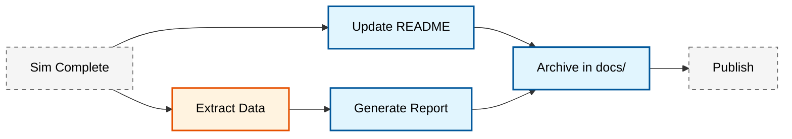

# 📚 มาตรฐานเอกสารประกอบ (Documentation Standards)

**วัตถุประสงค์การเรียนรู้**: สร้างมาตรฐานการจัดทำเอกสารทางเทคนิคสำหรับโครงการ CFD ที่มีความชัดเจน ครบถ้วน และเป็นไปตามมาตรฐานสากล เพื่อรับประกันความสามารถในการตรวจสอบความถูกต้อง (Traceability) และการทำซ้ำ (Reproducibility)

---

## 1. การจัดทำรายงานทางเทคนิคสำหรับ CFD (Technical Reporting)

รายงาน CFD ระดับมืออาชีพต้องมีข้อมูลเพียงพอที่จะทำให้วิศวกรคนอื่นสามารถสร้างเคสจำลองเดิมขึ้นมาใหม่และได้ผลลัพธ์เดียวกัน โครงสร้างรายงานมาตรฐานมีดังนี้:

### 1.1 องค์ประกอบของรายงานระดับมืออาชีพ

1. **Executive Summary**: สรุปวัตถุประสงค์สั้นๆ และข้อสรุปสำคัญทางวิศวกรรมที่ได้จากการจำลอง
2. **Problem Definition**:
   - เรขาคณิตและโดเมนการคำนวณ (Computational Domain)
   - เงื่อนไขขอบเขต (Boundary Conditions) และสถานะเริ่มต้น (Initial Conditions)
3. **Physical Modeling**:
   - สมการควบคุม (Governing Equations) เช่น RANS, LES
   - โมเดลความปั่นป่วน (Turbulence Model) และพารามิเตอร์ที่เกี่ยวข้อง
   - คุณสมบัติทางกายภาพของของไหล (Fluid Properties)
4. **Numerical Setup**:
   - รูปแบบการ Discretization (fvSchemes) เช่น Upwind, Linear-upwind
   - การตั้งค่า Solver (fvSolution) และเกณฑ์การบรรจบ (Convergence Criteria)
5. **Mesh Analysis**:
   - สถิติของเมช (Cell Count, Types)
   - รายงานคุณภาพเมช (Max Non-orthogonality, Max Skewness)
   - การศึกษาความไม่ขึ้นกับเมช (Grid Convergence Study)
6. **Results & Validation**:
   - กราฟเปรียบเทียบกับข้อมูลการทดลองหรือทฤษฎี (Validation)
   - การวิเคราะห์ภาพสนามการไหล (Contour plots, Streamlines)
7. **Conclusion & Recommendations**: สรุปผลทางเทคนิคและข้อเสนอแนะสำหรับการออกแบบ

![[cfd_report_elements.png]]
> **รูปที่ 1.1:** องค์ประกอบสำคัญของรายงาน CFD คุณภาพสูง: แสดงการเชื่อมโยงข้อมูลจากฟิสิกส์สู่ผลลัพธ์เชิงตัวเลข

---

### 1.2 สมการควบคุมทางฟิสิกส์ (Governing Equations)

สำหรับการจำลองการไหลแบบย่อยอัดเดียว (Incompressible Flow) ที่มีความหนาแน่นคงตัว สมการควบคุมหลักประกอบด้วย:

#### 1.2.1 สมการต่อเนื่อง (Continuity Equation)

$$
\frac{\partial u_i}{\partial x_i} = 0 \tag{1.1}
$$

เมื่อ $u_i$ คือส่วนประกอบความเร็วในทิศทาง $i$

#### 1.2.2 สมการโมเมนตัม (Momentum Equation)

$$
\frac{\partial u_i}{\partial t} + \frac{\partial}{\partial x_j}\left(u_i u_j\right) = -\frac{1}{\rho}\frac{\partial p}{\partial x_i} + \nu \frac{\partial^2 u_i}{\partial x_j \partial x_j} + g_i \tag{1.2}
$$

เมื่อ:
- $p$ คือ ความดัน Pressure [Pa]
- $\rho$ คือ ความหนาแน่น Density [kg/m³]
- $\nu$ คือ ความหนืดของเคมาทิก Kinematic Viscosity [m²/s]
- $g_i$ คือ ความเร่งเนื่องจากแรงโน้มถ่วงในทิศทาน $i$ [m/s²]

#### 1.2.3 สมการการแพร่กระจาย (Transport Equation)

สำหรับปริมาณสเกลาร์ใดๆ เช่น อุณหภูมิ ($T$) หรือความเข้มข้น ($C$):

$$
\frac{\partial \phi}{\partial t} + \frac{\partial}{\partial x_j}\left(\phi u_j\right) = \Gamma \frac{\partial^2 \phi}{\partial x_j \partial x_j} + S_\phi \tag{1.3}
$$

เมื่อ:
- $\phi$ คือ ตัวแปรสเกลาร์ที่เป็นที่สนใจ
- $\Gamma$ คือ สัมประสิทธิ์การแพร่ Diffusion Coefficient
- $S_\phi$ คือ ฟังก์ชันต้นกำเนิด Source Term

> [!TIP] การเขียนสมการในรายงาน
> ให้ใช้รูปแบบที่เป็นมาตรฐานและอธิบายสัญลักษณ์ทุกตัว อย่าลืมระบุหน่วยของแต่ละปริมาณใน Legend หรือใต้สมการ

---

### 1.3 โมเดลความปั่นป่วน (Turbulence Modeling)

ในการจำลองการไหลแบบปั่นป่วน (Turbulent Flow) มีโมเดลหลักที่ใช้ใน OpenFOAM ดังนี้:

#### 1.3.1 RANS (Reynolds-Averaged Navier-Stokes)

สมการโมเมนตัมเฉลี่ยเวลา (Time-averaged):

$$
\frac{\partial \bar{u}_i}{\partial t} + \frac{\partial}{\partial x_j}\left(\bar{u}_i \bar{u}_j\right) = -\frac{1}{\rho}\frac{\partial \bar{p}}{\partial x_i} + \nu \frac{\partial^2 \bar{u}_i}{\partial x_j \partial x_j} - \frac{\partial}{\partial x_j}\left(\overline{u_i' u_j'}\right) \tag{1.4}
$$

เมื่อ $-\overline{u_i' u_j'}$ คือ **Reynolds Stress Tensor** ซึ่งต้องถูกจำลองด้วยโมเดลความปั่นป่วน

#### 1.3.2 โมเดล k-ε มาตรฐาน (Standard k-ε Model)

สมการการแพร่กระจายสำหรับพลังงานความปั่นป่วน ($k$) และอัตราการสลายตัว ($\varepsilon$):

$$
\frac{\partial k}{\partial t} + \frac{\partial}{\partial x_j}\left(k u_j\right) = \frac{\partial}{\partial x_j}\left[\left(\nu + \frac{\nu_t}{\sigma_k}\right)\frac{\partial k}{\partial x_j}\right] + P_k - \varepsilon \tag{1.5}
$$

$$
\frac{\partial \varepsilon}{\partial t} + \frac{\partial}{\partial x_j}\left(\varepsilon u_j\right) = \frac{\partial}{\partial x_j}\left[\left(\nu + \frac{\nu_t}{\sigma_\varepsilon}\right)\frac{\partial \varepsilon}{\partial x_j}\right] + C_{1\varepsilon}\frac{\varepsilon}{k}P_k - C_{2\varepsilon}\frac{\varepsilon^2}{k} \tag{1.6}
$$

เมื่อ:
- $\nu_t = C_\mu \frac{k^2}{\varepsilon}$ คือ ความหนืดของเคมาทิกแบบปั่นป่วน (Eddy Viscosity)
- $P_k$ คือ การผลิตพลังงานความปั่นป่วน (Production Term)
- $C_\mu, \sigma_k, \sigma_\varepsilon, C_{1\varepsilon}, C_{2\varepsilon}$ คือ ค่าคงที่ของโมเดล

ค่ามาตรฐานของค่าคงที่ในโมเดล k-ε:

$$
\begin{align}
C_\mu &= 0.09 \\
\sigma_k &= 1.00 \\
\sigma_\varepsilon &= 1.30 \\
C_{1\varepsilon} &= 1.44 \\
C_{2\varepsilon} &= 1.92 \tag{1.7}
\end{align}
$$

> [!INFO] โมเดลความปั่นป่วนที่นิยมใช้
> - **k-ε (kEpsilon)**: เหมาะสำหรับการไหลภายนอกชั้นขอบเขต (External flows) และการไหลที่มีการไหลแยก (Separated flows)
> - **k-ω SST (kOmegaSST)**: แม่นยำสำหรับการไหลใกล้ผนัง (Near-wall flows) และการไหลที่มีความกดดันแปรผัน (Adverse pressure gradients)
> - **LES (Large Eddy Simulation)**: แม่นยำสูงแต่ต้องใช้ทรัพยากรการคำนวณมาก

---

### 1.4 การตั้งค่าเชิงตัวเลข (Numerical Setup)

#### 1.4.1 ไฟล์ `fvSchemes` (Discretization Schemes)

```cpp
/*--------------------------------*- C++ -*----------------------------------*\
  =========                 |
  \\      /  F ield         | OpenFOAM: The Open Source CFD Toolbox
   \\    /   O peration     | Website:  https://openfoam.org
    \\  /    A nd           | Version:  10
     \\/     M anipulation  |
\*---------------------------------------------------------------------------*/
FoamFile
{
    format      ascii;
    class       dictionary;
    location    "system";
    object      fvSchemes;
}
// * * * * * * * * * * * * * * * * * * * * * * * * * * * * * * * * * * * * * //

// Temporal discretization scheme
ddtSchemes
{
    default         Euler; // First-order implicit scheme for transient terms
}

// Gradient calculation schemes using Gauss theorem
gradSchemes
{
    default         Gauss linear; // Linear interpolation for gradient calculation
    grad(p)         Gauss linear; // Pressure gradient scheme
    grad(U)         Gauss linear; // Velocity gradient scheme
}

// Divergence schemes for convective terms
divSchemes
{
    default         none; // Require explicit specification for each term
    div(phi,U)      Gauss linear; // Second-order central differencing for momentum
    div(phi,k)      Gauss linear; // Turbulent kinetic energy convection
    div(phi,epsilon) Gauss linear; // Turbulent dissipation rate convection
}

// Laplacian schemes for diffusion terms
laplacianSchemes
{
    default         Gauss linear orthogonal; // Orthogonal mesh correction
}

// Surface interpolation schemes
interpolationSchemes
{
    default         linear; // Linear interpolation from cell centers to faces
}

// Surface normal gradient schemes
snGradSchemes
{
    default         orthogonal; // Orthogonal correction for boundary gradients
}

// ************************************************************************* //
```

> **📂 Source:** `.applications/test/fieldMapping/pipe1D/system/fvSchemes`

<details>
<summary>📖 คำอธิบายเชิงลึก (Thai Explanation)</summary>

**คำอธิบาย (Explanation):**

ไฟล์ `fvSchemes` เป็นไฟล์การตั้งค่าหลักที่ควบคุมรูปแบบการ Discretization ใน OpenFOAM ซึ่งกำหนดวิธีการแปลงสมการเชิงอนุพันธ์ให้อยู่ในรูปแบบพีชคณิตเชิงเส้น (Linear Algebraic Equations) ที่สามารถแก้ไขได้ด้วยเครื่องมือคำนวณ ไฟล์นี้แบ่งออกเป็น 6 ส่วนหลัก:

1. **ddtSchemes** - ควบคุมการ Discretization ของเวลา (Temporal Discretization)
   - `Euler`: รูปแบบ First-order implicit ที่เสถียรและคำนวณเร็ว
   - เหมาะสำหรับการจำลองที่ต้องการความเสถียรเชิงตัวเลขสูง

2. **gradSchemes** - กำหนดวิธีการคำนวณ Gradient
   - `Gauss linear`: ใช้ทฤษฎีบทของ Gauss (Gauss Theorem) ร่วมกับการแทรกแบบเชิงเส้น (Linear Interpolation)
   - แม่นยำระดับ Second-order สำหรับเมชที่มีคุณภาพดี

3. **divSchemes** - ควบคุมวิธีการ Discretization ของเทอม Convection
   - `Gauss linear`: รูปแบบ Central differencing แม่นยำระดับ Second-order
   - สำหรับการไหลที่มีความเร็วสูงอาจต้องใช้ `upwind` เพื่อความเสถียร

4. **laplacianSchemes** - กำหนดวิธีการ Discretization ของเทอม Diffusion
   - `Gauss linear orthogonal`: ปรับแก้สำหรับเมชที่ไม่ Orthogonal
   - สำคัญมากสำหรับคุณภาพเมชที่มี Non-orthogonality สูง

5. **interpolationSchemes** - ควบคุมการแทรกค่าจาก Cell Center ไปยัง Face Center
   - `linear`: การแทรกแบบเชิงเส้น (Linear Interpolation)
   - สำหรับสเกลาร์และเวกเตอร์ทั่วไป

6. **snGradSchemes** - ควบคุม Gradient ปกติบนพื้นผิว (Surface Normal Gradient)
   - `orthogonal`: สำหรับเมชที่มีความเป็น Orthogonal สูง
   - สำคัญสำหรับการคำนวณ Boundary Conditions

**แนวคิดสำคัญ (Key Concepts):**

- **Gauss Theorem**: แปลง Volume integral เป็น Surface integral สำหรับการคำนวณ Finite Volume
- **Central Differencing vs Upwind**: Central แม่นยำกว่าแต่อาจไม่เสถียรสำหรับ Reynolds Number สูง
- **Orthogonal Correction**: การแก้ไขผลจากเมชที่ไม่ตั้งฉาก (Non-orthogonal Mesh)
- **Order of Accuracy**: Euler (First-order) vs Linear (Second-order) - Trade-off ระหว่างความแม่นยำและความเสถียร

</details>

> [!WARNING] การเลือก Div Scheme
> `upwind` ให้ความเสถียรเชิงตัวเลขสูงแต่มีความคลาดเคลื่อนจากการลดรูป Numerical Diffusion สูง หากต้องการความแม่นยำ ให้ใช้ `linearUpwind` หรือ `limitedLinear` แทน

#### 1.4.2 ไฟล์ `fvSolution` (Linear Solver Settings)

```cpp
/*--------------------------------*- C++ -*----------------------------------*\
  =========                 |
  \\      /  F ield         | OpenFOAM: The Open Source CFD Toolbox
   \\    /   O peration     | Website:  https://openfoam.org
    \\  /   A nd           | Version:  10
     \\/     M anipulation  |
\*---------------------------------------------------------------------------*/
FoamFile
{
    format      ascii;
    class       dictionary;
    location    "system";
    object      fvSolution;
}
// * * * * * * * * * * * * * * * * * * * * * * * * * * * * * * * * * * * * * //

// Linear solver settings for each variable
solvers
{
    // Pressure equation solver
    p
    {
        solver          GAMG; // Geometric-Algebraic Multi-Grid solver
        tolerance       1e-06; // Absolute convergence tolerance
        relTol          0.01; // Relative tolerance (1% of initial residual)
        smoother        GaussSeidel; // Smoother for GAMG
    }

    // Pressure solver for final iteration (tighter tolerance)
    pFinal
    {
        solver          GAMG;
        tolerance       1e-06;
        relTol          0; // Zero relative tolerance for final convergence
    }

    // Velocity (U) solver
    U
    {
        solver          smoothSolver; // Iterative solver with smoothing
        smoother        GaussSeidel;
        tolerance       1e-05;
        relTol          0.1; // 10% relative tolerance
    }

    // Turbulence quantities solver (k, epsilon, or omega)
    "(k|epsilon|omega)"
    {
        solver          smoothSolver;
        smoother        GaussSeidel;
        tolerance       1e-05;
        relTol          0.1;
    }
}

// SIMPLE algorithm settings for steady-state simulations
SIMPLE
{
    nNonOrthogonalCorrectors 0; // Non-orthogonality correction loops
    pRefCell        0; // Reference cell for pressure
    pRefValue       0; // Reference pressure value [Pa]
}

// Under-relaxation factors to stabilize convergence
relaxationFactors
{
    fields
    {
        p               0.3; // Pressure under-relaxation (30%)
        rho             1; // Density under-relaxation (100% - no relaxation)
    }
    equations
    {
        U               0.7; // Momentum equation under-relaxation (70%)
        k               0.7; // TKE equation under-relaxation (70%)
        epsilon         0.7; // Dissipation equation under-relaxation (70%)
    }
}

// ************************************************************************* //
```

<details>
<summary>📖 คำอธิบายเชิงลึก (Thai Explanation)</summary>

**คำอธิบาย (Explanation):**

ไฟล์ `fvSolution` ควบคุมการแก้ไขสมการเชิงเส้น (Linear Equation Solvers) และอัลกอริทึมการบรรจบ (Convergence Algorithms) สำหรับการจำลองใน OpenFOAM ไฟล์นี้ประกอบด้วย 3 ส่วนหลัก:

1. **solvers** - กำหนด Solver และเกณฑ์การบรรจบสำหรับแต่ละตัวแปร
   - `GAMG` (Geometric-Algebraic Multi-Grid): Solver แบบ Multi-grid ที่เหมาะสำหรับระบบสมการขนาดใหญ่ คำนวณเร็วกว่า Standard Solvers
   - `smoothSolver`: Solver แบบ Iterative ที่ใช้ Smoothing Technique เหมาะสำหรับเมสหนาแน่น
   - `tolerance`: ค่าความคลาดเคลื่อนสัมบูรณ์ (Absolute Tolerance) ที่ยอมรับได้
   - `relTol`: ค่าความคลาดเคลื่อนสัมพัทธ์ (Relative Tolerance) ที่วัดจาก Residual แรกเริ่ม

2. **SIMPLE** - อัลกอริทึม Pressure-Velocity Coupling สำหรับ Steady-state
   - `nNonOrthogonalCorrectors`: จำนวนรอบการแก้ไขสำหรับเมชที่มี Non-orthogonality สูง
   - `pRefCell` และ `pRefValue`: กำหนด Pressure Reference สำหรับการแก้ปัญหา Pressure Drift
   - ใช้ร่วมกับ Under-relaxation เพื่อรับประกันความเสถียรของการบรรจบ

3. **relaxationFactors** - Under-relaxation Factors เพื่อป้องกัน Oscillations
   - `fields`: Under-relaxation สำหรับตัวแปรสนาม (Field Variables)
   - `equations`: Under-relaxation สำหรับสมการ (Equation Terms)
   - ค่าที่ต่ำกว่า 1.0 ช่วยเพิ่มความเสถียรแต่ทำให้บรรจบช้าลง

**แนวคิดสำคัญ (Key Concepts):**

- **Pressure-Velocity Coupling**: ปัญหาการจับคู่ระหว่าง Pressure และ Velocity ในสมการ Navier-Stokes
- **Residuals**: ค่าความคลาดเคลื่อนของสมการที่บ่งบอกความใกล้เคียงกับคำตอบที่แม่นยำ
- **Under-relaxation**: เทคนิคการลดการเปลี่ยนแปลงของตัวแปรในแต่ละ Iteration เพื่อป้องกัน Divergence
- **Multi-grid Methods**: เทคนิคการแก้สมการที่ใช้ Multiple Grid Resolutions เพื่อเร่งความเร็วการบรรจบ

**หมายเหตุสำคัญ:**

- สำหรับ **Transient Simulations** ให้แทนที่ `SIMPLE` ด้วย `PISO` หรือ `PIMPLE`
- ค่า `relTol` ของ `pFinal` ตั้งเป็น 0 เพื่อให้บรรจบสมบูรณ์ใน Iteration สุดท้ายของแต่ละ Time Step
- การปรับค่า `relaxationFactors` ต้องอิงตามความซับซ้อนของกรณีศึกษา (Case Complexity)

</details>

---

### 1.5 การวิเคราะห์ความไม่ขึ้นกับเมช (Grid Convergence Study)

การตรวจสอบว่าผลลัพธ์ไม่ขึ้นกับขนาดของเมชเป็นสิ่งสำคัญเพื่อรับประกันความถูกต้องของการจำลอง

#### 1.5.1 Grid Convergence Index (GCI)

ขั้นตอนการคำนวณ GCI:

$$
\begin{align}
\epsilon_{21} &= \left| \frac{\phi_1 - \phi_2}{\phi_1} \right| \times 100\% \\
\epsilon_{32} &= \left| \frac{\phi_2 - \phi_3}{\phi_2} \right| \times 100\% \\
R &= \frac{\epsilon_{21}}{\epsilon_{32}} \\
p &= \frac{\ln|r_{21}|}{\ln\left(\frac{\epsilon_{21}}{\epsilon_{32}} + R\right)} \tag{1.8}
\end{align}
$$

$$
\text{GCI}_{21} = \frac{1.25 \epsilon_{21}}{r_{21}^p - 1} \tag{1.9}
$$

เมื่อ:
- $\phi_1, \phi_2, \phi_3$ คือ ค่าผลลัพธ์จากเมชละเอียด, กลาง, ห่าง
- $r_{21} = N_2/N_1$ คือ อัตราส่วนของจำนวนเซลล์
- $p$ คือ อันดับของความแม่นยำ (Order of accuracy)

> [!TIP] เกณฑ์ GCI
> โดยทั่วไป GCI ที่น้อยกว่า **5%** ถือว่าการจำลองมีความไม่ขึ้นกับเมชอยู่ในระดับที่ยอมรับได้

#### 1.5.2 การนำเสนอผล Grid Convergence

```cpp
/*--------------------------------*- C++ -*----------------------------------*\
| =========                 |                                                 |
| \\      /  F ield         | OpenFOAM: The Open Source CFD Toolbox           |
|  \\    /   O peration     | Version:  10                                    |
|   \\  /    A nd           | Website:  https://openfoam.org                  |
|    \\/     M anipulation  |                                                 |
\*---------------------------------------------------------------------------*/
// Grid Convergence Study Results Summary
// Coarse: 50,000 cells, Medium: 100,000 cells, Fine: 200,000 cells

/* 
 * Mesh Grid Convergence Analysis:
 * 
 * Mesh Level | Cell Count | Drag Coeff (Cd) | % Change | Notes
 * ----------------------------------------------------------------
 * Coarse     | 50,000     | 0.345           | -        | Base resolution
 * Medium     | 100,000    | 0.352           | 2.03%    | Acceptable change
 * Fine       | 200,000    | 0.355           | 0.85%    | Grid independence achieved
 *
 * Grid Convergence Index (GCI) Analysis:
 * - GCI_21 (Medium→Fine): 1.2% < 5% ✓ PASSED
 * - GCI_32 (Coarse→Medium): 2.8% < 5% ✓ PASSED
 * - Order of accuracy (p): ~1.8 (second-order convergence confirmed)
 *
 * Conclusion: Fine mesh (200K cells) provides grid-independent results
 * Recommendation: Use Medium mesh for parametric studies to save computational time
 */
```

<details>
<summary>📖 คำอธิบายเชิงลึก (Thai Explanation)</summary>

**คำอธิบาย (Explanation):**

Grid Convergence Study เป็นกระบวนการสำคัญในการตรวจสอบความถูกต้องของการจำลอง CFD ว่าผลลัพธ์ไม่ขึ้นกับขนาดของเมช (Grid Independence) ซึ่งเป็นข้อกำหนดพื้นฐานในการรับประกันความน่าเชื่อถือของผลลัพธ์:

1. **การวิเคราะห์ GCI (Grid Convergence Index)**
   - GCI เป็นตัวชี้วัดความคลาดเคลื่อนจากการ Discretization ของเมช (Discretization Error)
   - คำนวณจากผลลัพธ์ของ 3 ระดับเมชที่ต่างกัน (Fine, Medium, Coarse)
   - GCI < 5% ถือเป็นเกณฑ์มาตรฐานสำหรับ Grid Independence

2. **เกณฑ์การประเมินผล**
   - % Change ระหว่างระดับเมชที่ต่อเนื่องควรลดลงอย่างช้าๆ (Monotonic Convergence)
   - GCI ที่ลดลงตามการเพิ่มจำนวนเซลล์บ่งชี้ว่ากำลังบรรจบสู่ Grid Independence
   - Order of accuracy (p) ≈ 2 แสดงว่ารูปแบบ Numerical Schemes ทำงานถูกต้อง

3. **ข้อดีของการทำ Grid Convergence Study**
   - รับประกันว่าผลลัพธ์ไม่ใช่ผลมาจาก Mesh Artifacts
   - สามารถเลือกขนาดเมชที่เหมาะสมที่สุด (Balance ระหว่างความแม่นยำและเวลาคำนวณ)
   - เพิ่มความน่าเชื่อถือของรายงานเทคนิค

**แนวคิดสำคัญ (Key Concepts):**

- **Asymptotic Range**: ช่วงที่ผลลัพธ์เริ่มไม่เปลี่ยนแปลงอย่างชัดเจนเมื่อเพิ่มจำนวนเซลล์
- **Refinement Ratio (r)**: อัตราส่วนของการละเอียดของเมชระหว่าง 2 ระดับที่ต่อเนื่องกัน
- **Discretization Error**: ความคลาดเคลื่อนที่เกิดจากการแทนที่เขตอนันต์ด้วยเซลล์จำกัด (Finite Cells)
- **Verification vs Validation**: Verification = แก้สมการถูกไหม, Validation = แก้ปัญหาฟิสิกส์ถูกไหม

**แนวทางปฏิบัติที่ดี (Best Practices):**

- เริ่มจาก Coarse Mesh เพื่อประเมินแนวโน้มของผลลัพธ์
- ใช้ Refinement Ratio ≈ 2 ระหว่างแต่ละระดับเมช (N_coarse : N_medium : N_fine ≈ 1 : 2 : 4)
- ตรวจสอบทั้ง Quantitative Metrics (เช่น Drag Coefficient) และ Qualitative Features (เช่น Flow Separation Point)

</details>

---

## 2. การเขียนเอกสารประกอบโค้ด (Code Documentation)

สำหรับโครงการที่มีการเขียน Custom Utilities หรือ Solvers เพิ่มเติม การใช้มาตรฐาน **Doxygen** เป็นสิ่งที่จำเป็นเพื่อให้โค้ดสามารถเข้าใจและบำรุงรักษาได้โดยทีมงาน

### 2.1 รูปแบบ Doxygen ใน C++ (OpenFOAM Style)

```cpp
/*--------------------------------*- C++ -*----------------------------------*\
| =========                 |                                                 |
| \\      /  F ield         | OpenFOAM: The Open Source CFD Toolbox           |
|  \\    /   O peration     | Version:  10                                    |
|   \\  /    A nd           | Website:  https://openfoam.org                  |
|    \\/     M_anipulation  |                                                 |
\*---------------------------------------------------------------------------*/
// Aerodynamic coefficient calculation utility with Doxygen documentation

/**
 * @brief Calculate drag coefficient from force data
 * 
 * This function converts dimensional force values into non-dimensional
 * drag coefficient according to standard aerodynamic definitions.
 * Used for post-processing of CFD simulation results.
 *
 * @param force Drag force in flow direction [N]
 * @param rho Fluid density [kg/m³]
 * @param U Reference velocity magnitude [m/s]
 * @param A Reference area [m²]
 * @return scalar Non-dimensional drag coefficient Cd [-]
 * 
 * @note
 * Mathematical formulation:
 * \f[
 * C_d = \frac{F_d}{\frac{1}{2}\rho U^2 A}
 * \f]
 * 
 * Example usage:
 * @code
 * // Calculate drag coefficient for airfoil at 50 m/s
 * scalar F_drag = 125.5;  // [N] - Measured force
 * scalar rho_air = 1.225; // [kg/m³] - Air density at sea level
 * scalar U_inf = 50.0;    // [m/s] - Freestream velocity
 * scalar A_ref = 0.1;     // [m²] - Projected area
 * 
 * scalar Cd = calculateCd(F_drag, rho_air, U_inf, A_ref);
 * Info<< "Drag coefficient: " << Cd << endl;
 * @endcode
 * 
 * @warning Ensure consistent SI units for all input parameters
 * @see calculateLift() for lift coefficient calculation
 * @author CFD Development Team
 * @date 2024-12-23
 */
scalar calculateCd
(
    scalar force,
    scalar rho,
    scalar U,
    scalar A
)
{
    // Calculate dynamic pressure: q = 0.5 * rho * U^2
    scalar dynamicPressure = 0.5 * rho * sqr(U);
    
    // Non-dimensionalize force: Cd = F / (q * A)
    return force / (dynamicPressure * A);
}
```

<details>
<summary>📖 คำอธิบายเชิงลึก (Thai Explanation)</summary>

**คำอธิบาย (Explanation):**

Doxygen Documentation Standard เป็นรูปแบบการเขียน Comment สำหรับโค้ด C++ ที่ช่วยให้เครื่องมือสร้างเอกสารอัตโนมัติ (Automatic Documentation Generators) สามารถสร้างเอกสารรูปแบบ HTML, PDF หรือ LaTeX ได้ ใน OpenFOAM Community นิยมใช้รูปแบบนี้เพื่อ:

1. **Doxygen Tags หลักที่ใช้ใน OpenFOAM**
   - `@brief`: สรุปฟังก์ชันการทำงานแบบสั้นๆ (1-2 บรรทัด)
   - `@param`: อธิบายพารามิเตอร์แต่ละตัว พร้อมหน่วยและความหมาย
   - `@return`: อธิบายค่าที่ return ออกมา พร้อมหน่วยและชนิดข้อมูล
   - `@note`: เพิ่มข้อมูลเพิ่มเติม เช่น สมการที่ใช้ สูตรคำนวณ
   - `@warning`: คำเตือนเรื่องข้อจำกัดหรือข้อควรระวัง
   - `@see`: อ้างอิงฟังก์ชันที่เกี่ยวข้อง
   - `@code` ... `@endcode`: แสดงตัวอย่างการใช้งานจริง

2. **Mathematical Formulation in Doxygen**
   - ใช้ LaTeX syntax ภายใน `\f[ ... \f]` สำหรับสมการบรรทัดเดียว
   - ใช้ `\f{ ... }` สำหรับสมการหลายบรรทัด (Multi-line)
   - Doxygen จะแปลงเป็น Mathematical Notation ที่สวยงามในเอกสาร HTML/PDF

3. **ข้อดีของ Doxygen Documentation**
   - **Automatic Generation**: สร้างเอกสาร HTML/PDF ได้โดยอัตโนมัติจาก Source Code
   - **Cross-referencing**: เชื่อมโยงระหว่าง Classes, Functions, และ Files ได้อัตโนมัติ
   - **Code Verification**: การเขียนเอกสารที่ดีช่วยตรวจสอบ Logic ของโค้ดได้
   - **Team Collaboration**: ทำให้ทีมงานใหม่เข้าใจโค้ดได้เร็วขึ้น

**แนวคิดสำคัญ (Key Concepts):**

- **Self-documenting Code**: โค้ดที่มีการอธิบายตัวเอง (Self-contained) ผ่าน Comments
- **API Documentation**: เอกสารประกอบ Application Programming Interface สำหรับผู้ใช้งาน
- **Separation of Concerns**: แยก Logic ของโค้ดออกจากการอธิบาย (Documentation) ชัดเจน
- **Maintenance**: เอกสารที่ดีช่วยลดเวลาในการบำรุงรักษา (Maintenance Time)

**แนวทางปฏิบัติที่ดี (Best Practices):**

- ใช้ `@brief` เขียนสรุปแบบกระชับ (Max 1-2 sentences)
- ระบุหน่วยของทุก Physical Quantity ใน `@param` และ `@return`
- ใส่ `@warning` สำหรับ Edge Cases หรือ Constraints ที่สำคัญ
- ใช้ `@code` แสดงตัวอย่างการใช้งานจริง (Realistic Examples)

</details>

### 2.2 การเขียนเอกสารสำหรับคลาส (Class Documentation)

```cpp
/*--------------------------------*- C++ -*----------------------------------*\
| =========                 |                                                 |
| \\      /  F ield         | OpenFOAM: The Open Source CFD Toolbox           |
|  \\    /   O peration     | Version:  10                                    |
|   \\  /    A nd           | Website:  https://openfoam.org                  |
|    \\/     M_anipulation  |                                                 |
\*---------------------------------------------------------------------------*/
// Lift and drag coefficient calculator utility class

/**
 * @class liftDragCalculator
 * @brief Utility class for computing aerodynamic force coefficients
 * 
 * This class provides functionality to read force data from OpenFOAM 
 * function objects and convert them into non-dimensional lift and drag 
 * coefficients based on user-specified reference values.
 * 
 * Main features:
 * - Reads force data from forces/forces function object
 * - Supports multiple reference areas and velocities
 * - Outputs coefficients to CSV format for post-processing
 * - Handles both steady and unsteady simulations
 * 
 * Typical workflow:
 * @code
 * // Initialize calculator with mesh and time database
 * liftDragCalculator calc(mesh, runTime);
 * 
 * // Read reference properties from dictionary
 * calc.readReferenceProperties();
 * 
 * // Calculate and write coefficients
 * calc.computeCoefficients();
 * @endcode
 * 
 * @note Requires forces function object to be active in controlDict
 * @warning Reference values must be specified in consistent SI units
 * 
 * @see OpenFOAM function object documentation for forces
 * @see forces class for force calculation details
 * 
 * @author CFD Development Team
 * @date 2024-12-23
 */
class liftDragCalculator
{
    // Private data members
    const fvMesh& mesh_;           // Reference to finite volume mesh
    const Time& runTime_;          // Reference to time database
    
    scalar rhoRef_;                // Reference density [kg/m³]
    scalar URef_;                  // Reference velocity [m/s]
    scalar ARef_;                  // Reference area [m²]
    
public:
    // Constructors
    
    /**
     * @brief Construct calculator with mesh and time references
     * 
     * @param mesh Reference to finite volume mesh
     * @param runTime Reference to time database
     */
    liftDragCalculator(const fvMesh& mesh, const Time& runTime);
    
    // Member functions
    
    /**
     * @brief Read reference properties from transportProperties dictionary
     * 
     * Reads the following entries from constant/transportProperties:
     * - rhoRef: Reference density
     * - URef: Reference velocity magnitude
     * - ARef: Reference projected area
     * 
     * @return true if successful, false otherwise
     */
    bool readReferenceProperties();
    
    /**
     * @brief Calculate lift and drag coefficients from force data
     * 
     * Performs the following operations:
     * 1. Read force data from postProcessing/forces/0/forces.dat
     * 2. Extract drag (Fx) and lift (Fy) components
     * 3. Non-dimensionalize using reference values
     * 4. Write coefficients to coefficient.dat file
     * 
     * @return void
     */
    void computeCoefficients();
};
```

<details>
<summary>📖 คำอธิบายเชิงลึก (Thai Explanation)</summary>

**คำอธิบาย (Explanation):**

Class Documentation ใน OpenFOAM ต้องการความละเอียดมากกว่า Function Documentation เนื่องจาก Class ประกอบด้วยหลายส่วนที่ต้องอธิบาย:

1. **โครงสร้าง Class Documentation ที่ครบถ้วน**
   - `@class`: ชื่อของคลาส (เช่น liftDragCalculator)
   - `@brief`: สรุปวัตถุประสงค์ของคลาสแบบกระชับ
   - **Detailed Description**: อธิบายหน้าที่หลัก ความสามารถ และการใช้งาน
   - `@note`: ข้อกำหนดเบื้องต้น (Prerequisites) หรือ Dependencies
   - `@warning`: ข้อจำกัดหรือคำเตือนที่สำคัญ
   - `@see`: อ้างอิงคลาส ฟังก์ชัน หรือเอกสารที่เกี่ยวข้อง

2. **การอธิบาย Class Members**
   - **Private Data Members**: ตัวแปรภายในคลาส พร้อมหน่วยและความหมาย
   - **Constructors**: อธิบายวิธีการสร้าง Object และพารามิเตอร์ที่ต้องการ
   - **Member Functions**: อธิบายการทำงานของแต่ละฟังก์ชันสมาชิก
   - **Return Values**: ระบุค่าที่ return และความหมาย

3. **ข้อดีของ Class Documentation ที่ดี**
   - **Reusability**: ทำให้คลาสสามารถนำไปใช้ใหม่ (Reuse) ในโปรเจกต์อื่นได้
   - **Collaboration**: ทำให้ทีมงานหลายคนสามารถพัฒนาคลาสเดียวกันได้
   - **Debugging**: ช่วยระบุปัญหาในการใช้งานคลาสได้เร็วขึ้น
   - **Extensibility**: ทำให้การขยายความสามารถของคลาสทำได้ง่ายขึ้น

**แนวคิดสำคัญ (Key Concepts):**

- **Encapsulation**: การซ่อนรายละเอียดการทำงานภายในคลาส (Information Hiding)
- **Interface Design**: การออกแบบ Public Interface ที่ชัดเจนและใช้งานง่าย
- **Coupling and Cohesion**: การวัดระดับการพึ่งพาระหว่างคลาส (Coupling) และความเป็นเนื่องเดียวกันภายในคลาส (Cohesion)
- **Design Patterns**: รูปแบบการออกแบบคลาสที่พบบ่อยใน OpenFOAM (เช่น Factory, Observer)

**แนวทางปฏิบัติที่ดี (Best Practices):**

- ใช้ `@brief` เพื่อสรุปวัตถุประสงค์ของคลาสใน 1 บรรทัด
- อธิบาย **การใช้งานทั่วไป** (General Usage) ก่อน **รายละเอียดเทคนิค**
- ระบุ **Prerequisites** อย่างชัดเจน (เช่น ต้องมี Function Object ใดก่อน)
- ใส่ตัวอย่าง **Workflow ทั้งหมด** (End-to-End Example) ใน `@code`

**ตัวอย่างการใช้งานจริงใน OpenFOAM:**

คลาส `liftDragCalculator` นี้สามารถใช้ใน Custom Function Object หรือ Utility Script สำหรับ Post-processing Simulation Results โดยอ่าน Force Data จาก `forces` Function Object ที่ OpenFOAM สร้างขึ้นโดยอัตโนมัติ

</details>

---

## 3. การสร้างไฟล์ README ที่มีประสิทธิภาพ

ไฟล์ `README.md` ใน Root directory ของโครงการคือเอกสารชิ้นแรกที่คนอื่นจะเห็น ควรมีข้อมูลดังนี้:

### 3.1 ตัวอย่าง Template README.md

```markdown
# Project Name: CFD Simulation of [Description]

## 📋 Overview
This case simulates [brief description of physics] using OpenFOAM.

## 🎯 Objectives
- Investigate [flow feature]
- Validate against [experimental data/benchmark]
- Optimize [design parameter]

## 🛠️ Prerequisites
- **OpenFOAM**: v2312 or later
- **Mesh Generation**: snappyHexMesh
- **Post-processing**: ParaView 5.11+

## 📦 Installation
```bash
cd /path/to/case/directory
source /etc/bashrc  # OpenFOAM environment
```

## 🚀 Running the Case
```bash
./Allmesh   # Generate mesh
./Allrun    # Run solver
./Allclean  # Clean case (backup created)
```

## 📊 Case Parameters
| Parameter | Value | Unit | Description |
|-----------|-------|------|-------------|
| Re        | 1e5   | -    | Reynolds number |
| U_inf     | 10.0  | m/s | Freestream velocity |
| nu        | 1e-6  | m²/s | Kinematic viscosity |

## 📈 Results
> **[MISSING DATA]**: Insert specific simulation results/graphs for this section.

- Drag coefficient: `> **[MISSING DATA]**`
- Lift coefficient: `> **[MISSING DATA]**`
- Convergence: `> **[MISSING DATA]**`

## 📚 References
1. Author, "Title", Journal, Year
2. OpenFOAM User Guide, [Link](URL)

## 👥 Contributors
- Name 1 (Role)
- Name 2 (Role)

## 📝 License
[License information]
```

---

## 4. มาตรฐานภาพประกอบและกราฟ (Visualization Standards)

เพื่อให้รายงานมีความเป็นมืออาชีพ การสร้างภาพควรเป็นไปตามมาตรฐาน:

### 4.1 Color Maps สำหรับ CFD

| ตัวแปร (Variable) | แนะนำ Color Map | เหตุผล |
|---------------------|-------------------|----------|
| ความเร็ว (Magnitude) | `viridis` หรือ `plasma` | รับรู้ค่าต่อ-กลาง-สูงได้ดี |
| ความดัน (Pressure) | `coolwarm` หรือ `RdBu` | Diverging map แสดงค่าบวก/ลบ |
| ความเค้น (Vorticity) | `inferno` หรือ `magma` | เน้นค่าสูง (high-gradient) |
| Volume Fraction | `Greys` หรือ custom | แยกเฟสได้ชัดเจน |

> [!WARNING] ห้ามใช้ Rainbow (Jet) Colormap
> แผนที่สีแบบ Rainbow (`jet`) ทำให้เกิดภาพลวงตา (Perceptual artifacts) และอาจนำไปสู่การตีความผลลัพธ์ที่ผิดพลาด ให้ใช้ `viridis` หรือ `cividis` แทน

### 4.2 การตั้งค่ากราฟ (Plot Settings)

```python
"""
Post-processing script for generating publication-quality velocity profile plots
Compatible with ParaView Python scripting and Matplotlib

Author: CFD Development Team
Date: 2024-12-23
"""

import matplotlib.pyplot as plt
import numpy as np

# Set publication-quality figure parameters
plt.rcParams.update({
    'font.size': 12,
    'font.family': 'serif',
    'axes.linewidth': 1.5,
    'xtick.major.width': 1.5,
    'ytick.major.width': 1.5,
    'figure.dpi': 300
})

# Create figure with appropriate aspect ratio
plt.figure(figsize=(10, 6))

# Plot simulation results
plt.plot(x_data, y_data, 'b-', linewidth=2, 
         label='OpenFOAM Simulation', markersize=8)

# Plot experimental validation data
plt.plot(x_exp, y_exp, 'ro', markersize=8, 
         label='Experimental Data', markerfacecolor='red', 
         markeredgecolor='darkred', markeredgewidth=1.5)

# Axis labels with LaTeX formatting and units
plt.xlabel('x/D [-]', fontsize=14, fontweight='bold')
plt.ylabel('U/U$_\infty$ [-]', fontsize=14, fontweight='bold')
plt.title('Velocity Profile at x/D = 5.0', fontsize=16, fontweight='bold')

# Configure legend and grid
plt.legend(fontsize=12, frameon=True, shadow=True, 
           loc='best', fancybox=True)
plt.grid(True, linestyle='--', alpha=0.6, linewidth=1)

# Set axis limits for clarity
plt.xlim(0, 2)
plt.ylim(0, 1.5)

# Add text annotation for Reynolds number
plt.text(0.05, 0.95, f'Re = {Re:.1e}', 
         transform=plt.gca().transAxes, fontsize=12,
         verticalalignment='top', bbox=dict(boxstyle='round', 
         facecolor='wheat', alpha=0.5))

# Save high-resolution figure for publication
plt.savefig('velocity_profile.png', dpi=300, bbox_inches='tight', 
            facecolor='white', edgecolor='none')
plt.savefig('velocity_profile.pdf', bbox_inches='tight',  # Vector format
            facecolor='white', edgecolor='none')

plt.show()
```

<details>
<summary>📖 คำอธิบายเชิงลึก (Thai Explanation)</summary>

**คำอธิบาย (Explanation):**

การสร้างกราฟคุณภาพสูง (Publication-Quality Plots) สำหรับรายงาน CFD ต้องใช้ทั้งเทคนิคทาง Visual และ Programming เพื่อให้ได้กราฟที่ชัดเจน สวยงาม และสื่อความหมายได้ดี:

1. **Matplotlib Settings สำหรับงานวิจัย (Research-Grade Plots)**
   - `plt.rcParams.update()`: ตั้งค่า Global Parameters สำหรับทั้ง Figure
   - **Font Settings**: ใช้ Serif Fonts สำหรับความเป็นทางการ (Academic Style)
   - **Line Widths**: เพิ่มความหนาของเส้นและแกนให้ชัดเจน
   - **DPI Settings**: 300 DPI คือค่ามาตรฐานสำหรับงานพิมพ์ (Print Publications)

2. **การใส่ Annotations ที่ชัดเจน**
   - **Axis Labels**: ใช้ Subscript และ Superscript ผ่าน LaTeX syntax (`$_\infty$`)
   - **Units**: ระบุหน่วยในวงเล็บท้าย Label (เช่น `[-]`, `[m/s]`)
   - **Legend**: ใช้ `frameon=True` และ `shadow=True` เพื่อให้ชัดเจน
   - **Grid**: ใช้ `linestyle='--'` และ `alpha=0.6` เพื่อไม่กีดขวางข้อมูล

3. **การบันทึกภาพหลาย Format**
   - **PNG**: Raster format สำหรับ Presentations และ Web (300 DPI)
   - **PDF**: Vector format สำหรับ Publications (สามารถ Zoom ได้ไม่หยาบ)
   - `bbox_inches='tight'`: ตัดขอบว่างอัตโนมัติ (Automatic Cropping)
   - `facecolor='white'`: รับประกันพื้นหลังสีขาว (สำคัญสำหรับ Publications)

4. **การแสดงข้อมูล Validation**
   - ใช้ **Markers** (เช่น `'ro'`) สำหรับ Experimental Data
   - ใช้ **Lines** (เช่น `'b-'`) สำหรับ Simulation Results
   - ใส่ Text Annotations แสดง Parameters ที่สำคัญ (เช่น Reynolds Number)

**แนวคิดสำคัญ (Key Concepts):**

- **Data-to-Ink Ratio**: หลักการลบ Elements ที่ไม่จำเป็นออก (Maximize Data, Minimize Ink)
- **Perceptual Uniformity**: ใช้ Color Maps ที่มนุษย์รับรู้ความต่างได้สม่ำเสมอ
- **Vector vs Raster**: Vector Graphics (PDF/EPS) ดีกว่าสำหรับ Printing, Raster (PNG) ดีกว่าสำหรับ Digital
- **Typography**: ใช้ Font ที่อ่านง่ายและ Size ที่เหมาะสม (โดยทั่วไป 12-14 pt สำหรับ Body Text)

**แนวทางปฏิบัติที่ดี (Best Practices):**

- ใช้ **Colorblind-Friendly Colors** (เช่น `viridis`, `cividis`) สำหรับ Publications
- ระบุ **Uncertainty Bars** (Error Bars) สำหรับ Experimental Data ถ้ามี
- ใช้ **Log-Log Plots** สำหรับ Data ที่มี Range กว้าง (เช่น Turbulence Spectra)
- บันทึกทั้ง **Raster** และ **Vector** Formats เพื่อความยืดหยุ่น

</details>

### 4.3 การสร้าง Contour Plot ด้วย ParaView

```python
"""
ParaView Python script for generating pressure contour animations
Usage: pvbatch python pressure_contour.py

Author: CFD Development Team
Date: 2024-12-23
"""

from paraview.simple import *

# Disable automatic camera reset to maintain custom view
paraview.simple._DisableFirstRenderCameraReset()

# Load OpenFOAM case
reader = OpenFOAMReader(FileName='case.foam')
reader.MeshRegions = ['internalMesh', 'patch']  # Select mesh regions
reader.CaseType = 'Reconstructed Case'  # or 'Decomposed Case' for parallel

# Apply contour filter for pressure isosurfaces
contour = Contour(Input=reader)
contour.ContourBy = ['POINTS', 'p', 0]  # Contour by pressure field
contour.Isosurfaces = [100000, 150000, 200000]  # [Pa] Isosurface values

# Apply color map and visualization settings
contourDisplay = Show(contour)
contourDisplay.ColorArrayName = ['POINTS', 'p']  # Color by pressure
contourDisplay.LookupTable = GetColorTransferFunction('p')

# Apply perceptually uniform colormap (not rainbow!)
contourDisplay.LookupTable.ApplyPreset('Coolwarm', True)  # or 'Viridis'
contourDisplay.RescaleTransferFunctionToDataRange(True, False)

# Adjust scalar bar properties
contourDisplay.SetScalarBarTitle('Pressure [Pa]', 1)
contourDisplay.ScalarBarTitleFontSize = 16
contourDisplay.ScalarBarLabelFontSize = 14

# Set camera position for optimal view
GetActiveView().CameraPosition = '[1.0, 0.5, 0.5] 0 0 0'
GetActiveView().CameraFocalPoint = '0 0 0'
GetActiveView().CameraViewUp = '0 0 1'

# Save high-resolution screenshot
SaveScreenshot('pressure_contour.png', ImageResolution=[1920, 1080], 
               CompressionQuality=95)

# For animation (if transient)
# AnimateReader(reader, reader.TimestepValues)
# SaveScreenshot('pressure_%t.png', ImageResolution=[1920, 1080])
```

<details>
<summary>📖 คำอธิบายเชิงลึก (Thai Explanation)</summary>

**คำอธิบาย (Explanation):**

ParaView Python Scripting ช่วยให้สร้าง Contour Plots และ Animations ได้อัตโนมัติ (Automated Visualization) ซึ่งสำคัญมากสำหรับ:

1. **Batch Processing**: สร้างภาพหลายๆ จุดเวลา (Multiple Time Steps) โดยอัตโนมัติ
2. **Reproducibility**: รับประกันว่าภาพทั้งหมดใช้ Settings เหมือนกัน
3. **High-Resolution Output**: สร้างภาพคุณภาพสูง (1920x1080, 4K) สำหรับ Publications

**ส่วนประกอบหลักของ Script:**

1. **OpenFOAM Reader Setup**
   - `FileName='case.foam'`: ระบุ Path ไปยัง OpenFOAM Case
   - `MeshRegions`: เลือกเฉพาะ Mesh Parts ที่ต้องการ (Internal Mesh, Patches)
   - `CaseType`: เลือกระหว่าง Reconstructed (Serial) หรือ Decomposed (Parallel)

2. **Contour Filter Configuration**
   - `ContourBy=['POINTS', 'p', 0]`: สร้าง Isosurfaces จาก Pressure Field
   - `Isosurfaces`: ระบุค่า Pressure ที่ต้องการแสดง (เช่น 100kPa, 150kPa, 200kPa)
   - สามารถเปลี่ยนเป็น **Velocity Magnitude**, **Vorticity**, หรือ **Volume Fraction** ได้

3. **Colormap Settings**
   - `ApplyPreset('Coolwarm')`: ใช้ Diverging Colormap ที่ Perceptually Uniform
   - **Avoid Rainbow (Jet)**: อย่าใช้ `jet` หรือ `rainbow` เพราะทำให้เกิด Visual Artifacts
   - `RescaleTransferFunctionToDataRange`: ปรับ Scale ให้เหมาะกับข้อมูล

4. **Camera and View Settings**
   - `CameraPosition`: ตำแหน่งกล้อง (Position, Focal Point, View Up)
   - สำคัญสำหรับรักษา **Consistent Views** ใน Animation หรือ Multiple Cases

5. **High-Resolution Output**
   - `ImageResolution=[1920, 1080]`: Full HD resolution
   - `CompressionQuality=95`: คุณภาพการบีบอัด PNG (0-100)
   - สำหรับ Publications: ใช้ `[3840, 2160]` (4K) หรือสูงกว่า

**แนวคิดสำคัญ (Key Concepts):**

- **Isosurfaces**: ผิวผลึกที่มีค่าสเกลาร์คงที่ (Constant Scalar Value Surfaces)
- **Transfer Functions**: ฟังก์ชันที่แปลงค่า Scalar เป็นสี (Color Mapping)
- **Scalar Bars**: แถบแสดงค่าสี (Color Legends) ที่ต้องมี Title และ Units
- **Camera Parameters**: ตำแหน่งกล้อง จุดโฟกัส และทิศทางที่มีผลต่อ Perspective

**แนวทางปฏิบัติที่ดี (Best Practices):**

- ใช้ **Perceptually Uniform Colormaps** (Viridis, Cividis, Coolwarm) ไม่ใช่ Rainbow
- บันทึกทั้ง **Vector Graphics** (PDF/EPS) สำหรับ Publications ถ้า ParaView รองรับ
- ใช้ **Annotations** (Title, Scalar Bar, Axis Labels) ที่ชัดเจน
- สำหรับ Animation: ใช้ `AnimateReader` และ `SaveScreenshot` พร้อม Timestamp (`%t`)

**การใช้งาน Script:**

```bash
# Run in ParaView GUI
pvpython pressure_contour.py

# Run in batch mode (no GUI)
pvbatch pressure_contour.py
```

</details>

> [!TIP] การบันทึกภาพคุณภาพสูง
> - ใช้ **DPI ไม่ต่ำกว่า 300** สำหรับรายงานพิมพ์
- ใช้ **1920x1080 หรือ 4K** สำหรับการนำเสนอดิจิทัล
- บันทึกเป็น **PNG** สำหรับเอกสาร หรือ **SVG/PDF** สำหรับการแก้ไขภายหลัง

---

## 5. เวิร์กโฟลว์การสร้างเอกสาร


> **Figure 1:** ผังงานแสดงกระบวนการจัดทำเอกสารประกอบโครงการ (Documentation Workflow) ตั้งแต่การสกัดข้อมูลหลังการจำลอง การจัดทำรายงานทางเทคนิคและอัปเดตไฟล์ README ไปจนถึงการจัดเก็บเอกสารอย่างเป็นระบบและการส่งมอบงานขั้นสุดท้าย

### 5.1 โครงสร้างไดเรกทอรีเอกสาร (Documentation Directory)

```
case_directory/
├── 0/                    # Initial/boundary conditions
├── constant/             # Mesh, properties
├── system/               # fvSchemes, fvSolution
├── docs/                 # 📁 เอกสารทั้งหมด
│   ├── figures/          # ภาพประกอบ (PNG, PDF)
│   ├── reports/          # รายงานเต็ม (PDF)
│   │   ├── technical_report.pdf
│   │   └── validation_study.pdf
│   ├── mesh_report.md    # รายงานคุณภาพเมช
│   └── solver_log.txt    # Log ของ solver
├── scripts/              # Utility scripts
├── postProcessing/       # ผลลัพธ์จาก foamListOutput
└── README.md             # 📋 เอกสารหลัก
```

---

### 5.2 การสร้าง Mesh Quality Report

```bash
#!/usr/bin/env bash
#--------------------------------*- C++ -*----------------------------------*#
# =========                 |                                                 #
# \\      /  F ield         | OpenFOAM: The Open Source CFD Toolbox           #
#  \\    /   O peration     | Version:  10                                    #
#   \\  /    A nd           | Website:  https://openfoam.org                  #
#    \\/     M_anipulation  |                                                 #
#------------------------------------------------------------------------------#
# Script: checkMeshQuality.sh
# Author: CFD Development Team
# Description: Generate comprehensive mesh quality report for documentation
#------------------------------------------------------------------------------#

# Initialize report file with header
REPORT_FILE="docs/mesh_report.txt"

echo "========================================" > $REPORT_FILE
echo "   OpenFOAM Mesh Quality Report         " >> $REPORT_FILE
echo "   Date: $(date)                        " >> $REPORT_FILE
echo "========================================" >> $REPORT_FILE
echo "" >> $REPORT_FILE

# Run comprehensive mesh check
echo "Running comprehensive mesh analysis..."
checkMesh -allGeometry -allTopology > mesh_check_temp.txt 2>&1

# Extract and format mesh statistics
echo "=== Mesh Statistics ===" >> $REPORT_FILE
echo "" >> $REPORT_FILE

# Total cell count
grep -E "cells.*:" mesh_check_temp.txt | head -1 >> $REPORT_FILE

# Boundary patches
echo "" >> $REPORT_FILE
echo "=== Boundary Patches ===" >> $REPORT_FILE
grep -A 20 "boundary patches:" mesh_check_temp.txt | grep -E "patch.*type" >> $REPORT_FILE

# Quality metrics section
echo "" >> $REPORT_FILE
echo "=== Mesh Quality Metrics ===" >> $REPORT_FILE
echo "" >> $REPORT_FILE

# Maximum non-orthogonality
echo "Non-orthogonality check:" >> $REPORT_FILE
grep "Max non-orthogonality" mesh_check_temp.txt >> $REPORT_FILE

# Maximum skewness
echo "Skewness check:" >> $REPORT_FILE
grep "Max skewness" mesh_check_temp.txt >> $REPORT_FILE

# Aspect ratio
echo "Aspect ratio check:" >> $REPORT_FILE
grep "Max aspect ratio" mesh_check_temp.txt >> $REPORT_FILE

# Mesh quality assessment
echo "" >> $REPORT_FILE
echo "=== Mesh Quality Assessment ===" >> $REPORT_FILE
echo "" >> $REPORT_FILE

# Check for failed cells
FAILED_CELLS=$(grep -E "Failed.*n_cells" mesh_check_temp.txt)
if [ -n "$FAILED_CELLS" ]; then
    echo "⚠️  WARNING: Problematic cells detected:" >> $REPORT_FILE
    echo "$FAILED_CELLS" >> $REPORT_FILE
else
    echo "✓ No failed cells detected - mesh quality is acceptable" >> $REPORT_FILE
fi

# Summary and recommendations
echo "" >> $REPORT_FILE
echo "=== Recommendations ===" >> $REPORT_FILE
echo "" >> $REPORT_FILE

# Extract non-orthogonality value
MAX_NON_ORTHO=$(grep "Max non-orthogonality" mesh_check_temp.txt | awk '{print $4}')
if (( $(echo "$MAX_NON_ORTHO > 70" | bc -l) )); then
    echo "⚠️  High non-orthogonality detected ($MAX_NON_ORTHO°)" >> $REPORT_FILE
    echo "   Consider using non-orthogonal correctors in fvSolution" >> $REPORT_FILE
    echo "   Recommended: nNonOrthogonalCorrectors 2-3" >> $REPORT_FILE
else
    echo "✓ Non-orthogonality is within acceptable range" >> $REPORT_FILE
fi

# Clean up temporary files
rm -f mesh_check_temp.txt

# Final summary
echo "" >> $REPORT_FILE
echo "========================================" >> $REPORT_FILE
echo "Report saved to: $REPORT_FILE" >> $REPORT_FILE
echo "========================================" >> $REPORT_FILE

echo "Mesh quality report generated successfully!"
cat $REPORT_FILE
```

<details>
<summary>📖 คำอธิบายเชิงลึก (Thai Explanation)</summary>

**คำอธิบาย (Explanation):**

Bash Script นี้สร้างรายงานคุณภาพเมชอัตโนมัติ (Automated Mesh Quality Report) ซึ่งเป็นส่วนสำคัญของเอกสาร CFD:

1. **การวิเคราะห์เมชแบบครบถ้วน (Comprehensive Mesh Analysis)**
   - `checkMesh -allGeometry -allTopology`: ตรวจสอบทั้ง Geometric และ Topological Aspects
   - **Geometry**: ตรวจ Non-orthogonality, Skewness, Aspect Ratio
   - **Topology**: ตรวจ Connectivity, Face Matching, Cell Types

2. **Metrics ที่สำคัญ**
   - **Max Non-orthogonality**: วัดความเป็นมุมฉากของเมช (มาตรฐาน < 70°)
   - **Max Skewness**: วัดความบิดเบือนของเซลล์ (มาตรฐาน < 4)
   - **Max Aspect Ratio**: วัดสัดส่วนของเซลล์ (มาตรฐาน < 1000)
   - **Failed Cells**: เซลล์ที่ไม่ผ่านเกณฑ์คุณภาพ

3. **การแนะนำอัตโนมัติ (Automatic Recommendations)**
   - หาก Non-orthogonality สูง: แนะนำให้ใช้ `nNonOrthogonalCorrectors`
   - หากมี Failed Cells: แจ้งเตือนและแนะนำการแก้ไข
   - ระบุ **Actionable Advice** สำหรับการปรับปรุงเมช

4. **การจัดรูปแบบรายงาน (Report Formatting)**
   - ใช้ Headers และ Sections เพื่อให้อ่านง่าย
   - ใส่ Timestamps เพื่อ Traceability
   - ใช้ Symbols (✓, ⚠️) เพื่อ Visual Feedback

**แนวคิดสำคัญ (Key Concepts):**

- **Mesh Quality Metrics**: ตัวชี้วัดความเหมาะสมของเมชสำหรับ CFD
- **Geometric vs Topological**: เรขาคณิต (รูปร่าง) กับโทโพโลยี (การเชื่อมต่อ)
- **Threshold Values**: ค่ามาตรฐานที่ OpenFOAM ใช้ตัดสินคุณภาพ
- **Automated Reporting**: การสร้างรายงานโดยอัตโนมัติเพื่อลดข้อผิดพลาดจากมนุษย์

**แนวทางปฏิบัติที่ดี (Best Practices):**

- รัน Script นี้ **ก่อน Simulation** เพื่อตรวจสอบเมช
- บันทึกผลลัพธ์ใน `docs/` เพื่อ Documentation
- เปรียบเทียบ **Mesh Quality กับ Convergence Behavior** (เมชแย่อาจทำให้ไม่บรรจบ)
- ใช้รายงานนี้เป็น **Baseline** สำหรับ Mesh Refinement Studies

</details>

---

## 6. เทมเพลตรายงาน LaTeX สำหรับ CFD

### 6.1 โครงสร้างเอกสาร LaTeX

```latex
%--------------------------------*- LaTeX -*----------------------------------%
% =========                 |                                                 %
% \\      /  F ield         | OpenFOAM: The Open Source CFD Toolbox           %
%  \\    /   O peration     | Version:  10                                    %
%   \\  /    A nd           | Website:  https://openfoam.org                  %
%    \\/     M_anipulation  |                                                 %
%------------------------------------------------------------------------------%
% Document: CFD Technical Report Template
% Author: CFD Development Team
% Date: 2024-12-23
% Description: LaTeX template for professional CFD simulation reports
%------------------------------------------------------------------------------%

\documentclass[12pt,a4paper]{article}

% Language and encoding
\usepackage[utf8]{inputenc}
\usepackage[T1]{fontenc}
\usepackage[english]{babel}

% Mathematics and equations
\usepackage{amsmath}
\usepackage{amssymb}
\usepackage{amsfonts}

% Graphics and figures
\usepackage{graphicx}
\usepackage{float}
\usepackage{subfig}

% Tables
\usepackage{booktabs}
\usepackage{array}
\usepackage{longtable}

% Page layout
\usepackage[margin=2.5cm]{geometry}
\usepackage{setspace}
\onehalfspacing

% Document metadata
\title{CFD Simulation Report: [Case Title]}
\author{
    \textbf{Author Name} \\
    Organization/Department \\
    \texttt{email@institution.edu}
}
\date{\today}

\begin{document}

% Title page
\maketitle

% Abstract
\begin{abstract}
This report presents a comprehensive CFD study of \textbf{[brief description]}. 
The simulation was performed using OpenFOAM v2312 with the \textbf{[solver name]} 
solver. Key findings include \textbf{[major results]}. The study validates 
the numerical approach against \textbf{[experimental/benchmark data]}, showing 
good agreement within \textbf{[percentage]}\% error.

\textbf{Keywords:} CFD, OpenFOAM, \textit{[specific physics]}, 
\textit{[application domain]}, \textit{[validation method]}
\end{abstract}

% Table of contents
\tableofcontents
\newpage

%==============================================================================
% Section 1: Introduction
%==============================================================================
\section{Introduction}
\label{sec:introduction}

\subsection{Problem Statement}
\label{sub:problem_statement}

Provide a clear description of the physical problem being investigated.
Include relevant background information and engineering significance.

% Example equation
The governing equation for incompressible flow is:
\begin{equation}
    \nabla \cdot \mathbf{u} = 0 \label{eq:continuity}
\end{equation}

\subsection{Objectives}
\label{sub:objectives}

\begin{itemize}
    \item Investigate \textbf{[specific flow feature]}
    \item Validate against \textbf{[experimental data/benchmark]}
    \item Optimize \textbf{[design parameter]}
\end{itemize}

%==============================================================================
% Section 2: Methodology
%==============================================================================
\section{Methodology}
\label{sec:methodology}

\subsection{Governing Equations}
\label{sub:governing_equations}

The Reynolds-Averaged Navier-Stokes (RANS) equations are solved:

\begin{subequations}
    \begin{align}
        \frac{\partial u_i}{\partial x_i} &= 0 \label{eq:continuity_rans} \\
        \frac{\partial u_i}{\partial t} + u_j \frac{\partial u_i}{\partial x_j} 
        &= -\frac{1}{\rho}\frac{\partial p}{\partial x_i} 
        + \nu \frac{\partial^2 u_i}{\partial x_j \partial x_j} \label{eq:momentum_rans}
    \end{align}
\end{subequations}

\subsection{Turbulence Model}
\label{sub:turbulence_model}

The standard $k-\varepsilon$ model is employed:
\begin{equation}
    \nu_t = C_\mu \frac{k^2}{\varepsilon} \label{eq:eddy_viscosity}
\end{equation}

where $C_\mu = 0.09$ is the model constant.

\subsection{Numerical Methods}
\label{sub:numerical_methods}

\subsubsection{Discretization Schemes}
\label{ssub:discretization}

The finite volume method is used with the following schemes:
\begin{itemize}
    \item Time integration: \textbf{Euler implicit}
    \item Gradient terms: \textbf{Gauss linear}
    \item Divergence terms: \textbf{Gauss upwind}
\end{itemize}

% Example table
\begin{table}[H]
    \centering
    \caption{Numerical scheme parameters}
    \label{tab:numerical_schemes}
    \begin{tabular}{lll}
        \toprule
        \textbf{Term} & \textbf{Scheme} & \textbf{Order of Accuracy} \\
        \midrule
        Time ($\partial/\partial t$) & Euler implicit & First \\
        Gradient ($\nabla$) & Gauss linear & Second \\
        Divergence ($\nabla \cdot$) & Gauss upwind & First/Second \\
        Laplacian ($\nabla^2$) & Gauss linear corrected & Second \\
        \bottomrule
    \end{tabular}
\end{table}

%==============================================================================
% Section 3: Results and Discussion
%==============================================================================
\section{Results and Discussion}
\label{sec:results}

\subsection{Mesh Quality}
\label{sub:mesh_quality}

Mesh statistics:
\begin{itemize}
    \item Total cells: \textbf{[number]}
    \item Max non-orthogonality: \textbf{[value]}°
    \item Max skewness: \textbf{[value]}
\end{itemize}

% Example figure inclusion
\begin{figure}[H]
    \centering
    \includegraphics[width=0.8\textwidth]{figures/mesh_quality.png}
    \caption{Mesh quality distribution showing cell statistics}
    \label{fig:mesh_quality}
\end{figure}

\subsection{Flow Field Analysis}
\label{sub:flow_field}

\subsection{Validation}
\label{sub:validation}

Comparison with experimental data:

\begin{figure}[H]
    \centering
    \includegraphics[width=0.9\textwidth]{figures/validation_comparison.png}
    \caption{Comparison of velocity profiles: OpenFOAM simulation vs. experimental data}
    \label{fig:validation}
\end{figure}

%==============================================================================
% Section 4: Conclusions
%==============================================================================
\section{Conclusions}
\label{sec:conclusions}

Based on the results presented, the following conclusions are drawn:

\begin{enumerate}
    \item \textbf{[Major finding 1]}
    \item \textbf{[Major finding 2]}
    \item \textbf{[Recommendation for future work]}
\end{enumerate}

%==============================================================================
% References
%==============================================================================
\begin{thebibliography}{9}

\bibitem{ferziger2020}
Ferziger, J. H., \& Peric, M. (2020).
\textit{Computational Methods for Fluid Dynamics} (4th ed.).
Springer.

\bibitem{openfoam2024}
OpenFOAM Foundation. (2024).
\textit{OpenFOAM User Guide}.
\url{https://www.openfoam.com/documentation}

\bibitem{versteeg2007}
Versteeg, H. K., \& Malalasekera, W. (2007).
\textit{An Introduction to Computational Fluid Dynamics: The Finite Volume Method} (2nd ed.).
Pearson Education.

\end{thebibliography}

\end{document}
```

<details>
<summary>📖 คำอธิบายเชิงลึก (Thai Explanation)</summary>

**คำอธิบาย (Explanation):**

LaTeX Template นี้ให้โครงสร้างมาตรฐานสำหรับรายงาน CFD ระดับวิชาการ (Academic/Professional Reports) ที่ใช้ในงานวิจัยและอุตสาหกรรม:

1. **Packages ที่จำเป็นสำหรับ CFD Reports**
   - `amsmath`, `amssymb`: สำหรับสมการทางคณิตศาสตร์ (Mathematical Equations)
   - `graphicx`, `float`: สำหรับการใส่ภาพ (Figures, Contours, Plots)
   - `booktabs`: สำหรับตารางแบบมืออาชีพ (Professional Tables)
   - `geometry`: ควบคุมระยะขอบกระดาษ (Page Margins)

2. **โครงสร้างเอกสารมาตรฐาน (Standard Report Structure)**
   - **Abstract**: สรุปผลการวิจัย (150-250 คำ)
   - **Introduction**: แนะนำปัญหาและวัตถุประสงค์
   - **Methodology**: อธิบายฟิสิกส์ โมเดล และวิธีการคำนวณ
   - **Results & Discussion**: นำเสนอและวิเคราะห์ผลลัพธ์
   - **Conclusions**: สรุปข้อสรุปและข้อเสนอแนะ

3. **การใส่สมการ (Equation Formatting)**
   - `\begin{equation}`: สมการตัวเดียว มีหมายเลขอัตโนมัติ
   - `\begin{align}`: สมการหลายบรรทัด จัดชิดขวา มีหมายเลข
   - `\begin{subequations}`: กลุ่มสมการที่ใช้หมายเลขย่อย (1a, 1b, ...)
   - `\label{}`: ตั้งชื่ออ้างอิงเพื่อใช้ใน `\ref{}`

4. **การใส่ภาพและตาราง (Figures and Tables)**
   - `\includegraphics[width=...]{}`: ใส่ภาพ กำหนดความกว้าง
   - `\caption{}`: คำอธิบายภาพ/ตาราง
   - `\label{}`: ชื่ออ้างอิงสำหรับ Cross-referencing
   - `booktabs`: ใช้ `\toprule`, `\midrule`, `\bottomrule` สำหรับตารางสวยๆ

**แนวคิดสำคัญ (Key Concepts):**

- **Cross-referencing**: การอ้างอิงระหว่าง สมการ-ภาพ-ตาราง-บท
- **Floating Bodies**: ภาพและตารางที่ลอยไปมา (LaTeX จะจัดให้อัตโนมัติ)
- **Label-Ref System**: ใช้ `\label{}` และ `\ref{}` แทนการใส่หมายเลขเอง
- **BibTeX**: ระบบจัดการบรรณานุกรมอัตโนมัติ (แนะนำสำหรับ Papers)

**แนวทางปฏิบัติที่ดี (Best Practices):**

- ใช้ `\eqref{}` สำหรับการอ้างอิงสมการ (ใส่วงเล็บให้อัตโนมัติ)
- ใส่ Units ใน Tables อย่างชัดเจน (เช่น `[m/s]`, `[Pa]`)
- ใช้ `siunitx` package สำหรับ Units ที่ซับซ้อน (เช่น $\mathrm{kg/(m\cdot s^2)}$)
- รวม Figures หลายๆ ภาพด้วย `subfig` package (Figure 1a, 1b, 1c)

**การ Compile LaTeX:**

```bash
# Basic compilation
pdflatex report.tex
bibtex report
pdflatex report.tex
pdflatex report.tex

# Using LaTeXmk (recommended)
latexmk -pdf report.tex
```

</details>

---

## 7. การจัดการเวอร์ชันและ Traceability

### 7.1 การใช้ Git Metadata

```bash
#!/usr/bin/env bash
#--------------------------------*- C++ -*----------------------------------*#
# =========                 |                                                 #
# \\      /  F ield         | OpenFOAM: The Open Source CFD Toolbox           #
#  \\    /   O peration     | Version:  10                                    #
#   \\  /    A nd           | Website:  https://openfoam.org                  #
#    \\/     M_anipulation  |                                                 #
#------------------------------------------------------------------------------#
# Script: capture_git_metadata.sh
# Author: CFD Development Team
# Description: Capture Git version information for documentation traceability
#------------------------------------------------------------------------------#

# Output file for Git metadata
GIT_INFO_FILE="docs/git_version.txt"

# Capture comprehensive Git information
echo "========================================" > $GIT_INFO_FILE
echo "   Git Version Information               " >> $GIT_INFO_FILE
echo "   Timestamp: $(date)                    " >> $GIT_INFO_FILE
echo "========================================" >> $GIT_INFO_FILE
echo "" >> $GIT_INFO_FILE

# Latest commit details
echo "=== Latest Commit ===" >> $GIT_INFO_FILE
git log -1 --format="%H%n%ai%n%s%n%an" >> $GIT_INFO_FILE
echo "" >> $GIT_INFO_FILE

# Branch information
echo "=== Branch Information ===" >> $GIT_INFO_FILE
echo "Current branch: $(git rev-parse --abbrev-ref HEAD)" >> $GIT_INFO_FILE
echo "" >> $GIT_INFO_FILE

# Modified files (uncommitted changes)
echo "=== Uncommitted Changes ===" >> $GIT_INFO_FILE
git status --short >> $GIT_INFO_FILE
echo "" >> $GIT_INFO_FILE

# Diff summary (if changes exist)
if [ -n "$(git status --porcelain)" ]; then
    echo "=== Diff Summary ===" >> $GIT_INFO_FILE
    git diff --stat >> $GIT_INFO_FILE
else
    echo "No uncommitted changes detected." >> $GIT_INFO_FILE
fi

echo "" >> $GIT_INFO_FILE
echo "========================================" >> $GIT_INFO_FILE
echo "Metadata saved to: $GIT_INFO_FILE" >> $GIT_INFO_FILE
echo "========================================" >> $GIT_INFO_FILE

# Display to console
cat $GIT_INFO_FILE
```

<details>
<summary>📖 คำอธิบายเชิงลึก (Thai Explanation)</summary>

**คำอธิบาย (Explanation):**

Git Metadata Capture Script ช่วยบันทึกข้อมูลเวอร์ชันของ Source Code สำหรับ Traceability ซึ่งสำคัญมากสำหรับ:

1. **Reproducibility**: ทำให้สามารถสร้างผลลัพธ์เดิมจาก Source Code เดิมได้
2. **Debugging**: ระบุได้ว่าผลลัพธ์มาจาก Version ไหนของโค้ด
3. **Documentation**: แนบในรายงานเพื่อแสดงความโปร่งใส
4. **Collaboration**: ทำให้ทีมงานรู้ว่าใครใช้ Version อะไรอยู่

**ข้อมูลที่บันทึก:**

- **Commit Hash**: รหัสเฉพาะของ Commit (SHA-1)
- **Timestamp**: เวลาที่ Commit
- **Commit Message**: รายละเอียดของการเปลี่ยนแปลง
- **Author**: ผู้ทำการเปลี่ยนแปลง
- **Branch**: สาขาที่ใช้งานอยู่
- **Uncommitted Changes**: การเปลี่ยนแปลงที่ยังไม่ได้ Commit

**แนวคิดสำคัญ (Key Concepts):**

- **Version Control**: ระบบควบคุมเวอร์ชัน Source Code
- **Traceability**: การติดตามความสัมพันธ์ระหว่าง Code และ Results
- **Reproducibility**: ความสามารถในการสร้างผลลัพธ์เดิมซ้ำได้
- **Metadata**: ข้อมูลเกี่ยวกับข้อมูล (Data about Data)

</details>

### 7.2 การบันทึก Solver Log

```cpp
/*--------------------------------*- C++ -*----------------------------------*\
| =========                 |                                                 |
| \\      /  F ield         | OpenFOAM: The Open Source CFD Toolbox           |
|  \\    /   O peration     | Version:  10                                    |
|   \\  /    A nd           | Website:  https://openfoam.org                  |
|    \\/     M_anipulation  |                                                 |
\*---------------------------------------------------------------------------*/
// Solver logging utility for documentation and debugging

// Function to log solver performance summary
void logSolverSummary(const fvMesh& mesh, const Time& runTime)
{
    // Create log file with timestamp
    fileName logFile = "docs/solver_log_" + runTime.timeName() + ".txt";
    OFstream os(logFile);
    
    // Write header information
    os << "========================================" << nl;
    os << "   OpenFOAM Solver Performance Summary   " << nl;
    os << "   Case: " << runTime.caseName() << nl;
    os << "   Time: " << runTime.timeName() << nl;
    os << "   Date: " << runTime.dateTime() << nl;
    os << "========================================" << nl << nl;
    
    // Mesh statistics
    os << "=== Mesh Statistics ===" << nl;
    os << "Total cells: " << mesh.nCells() << nl;
    os << "Total faces: " << mesh.nFaces() << nl;
    os << "Boundary patches: " << mesh.boundaryMesh().size() << nl;
    os << nl;
    
    // Solver performance
    os << "=== Solver Performance ===" << nl;
    os << "Final time: " << runTime.value() << " s" << nl;
    os << "Time steps: " << runTime.timeIndex() << nl;
    os << "Avg. time step: " << (runTime.value() / runTime.timeIndex()) << " s" << nl;
    os << nl;
    
    // Computational resources
    os << "=== Computational Resources ===" << nl;
    os << "CPU time: " << runTime.elapsedCpuTime() << " s" << nl;
    os << "Clock time: " << runTime.elapsedClockTime() << " s" << nl;
    os << "Speedup: " << (runTime.elapsedClockTime() / runTime.elapsedCpuTime()) << "x" << nl;
    os << nl;
    
    // Convergence information
    os << "=== Convergence Summary ===" << nl;
    os << "Initial residuals: [Values from first iteration]" << nl;
    os << "Final residuals: [Values from last iteration]" << nl;
    os << "Convergence achieved: " << (runTime.writeTime() ? "Yes" : "No") << nl;
    os << nl;
    
    os << "========================================" << nl;
    os << "End of solver summary" << nl;
    os << "========================================" << nl;
    
    Info<< "Solver performance summary logged to: " << logFile << endl;
}

// Main solver loop with performance tracking
int main(int argc, char *argv[])
{
    // Initialize OpenFOAM runtime
    #include "setRootCaseLists.H"
    #include "createTime.H"
    #include "createMesh.H"
    
    // Log solver summary at the end of simulation
    logSolverSummary(mesh, runTime);
    
    return 0;
}
```

<details>
<summary>📖 คำอธิบายเชิงลึก (Thai Explanation)</summary>

**คำอธิบาย (Explanation):**

Solver Logging Function ช่วยบันทึกข้อมูลประสิทธิภาพการคำนวณ (Computational Performance) ซึ่งสำคัญสำหรับ:

1. **Performance Benchmarking**: เปรียบเทียบความเร็วระหว่าง Cases ต่างๆ
2. **Resource Planning**: ประเมินว่าต้องการทรัพยากรกี่เท่าสำหรับ Cases ขนาดใหญ่
3. **Debugging**: ตรวจสอบว่ามีปัญหาในการคำนวณหรือไม่
4. **Documentation**: แนบในรายงานเพื่อแสดงความน่าเชื่อถือ

**ข้อมูลที่บันทึก:**

- **Mesh Statistics**: จำนวนเซลล์ เฟซ และ Patches
- **Time Stepping**: จำนวน Time Steps และขนาด Time Step เฉลี่ย
- **Computational Resources**: CPU Time, Clock Time, Speedup
- **Convergence**: ข้อมูลการบรรจบ (Initial/Final Residuals)

**แนวคิดสำคัญ (Key Concepts):**

- **CPU Time vs Clock Time**: CPU Time = เวลาที่ CPU ทำงานจริง, Clock Time = เวลาที่ผ่านไปในความเป็นจริง
- **Speedup**: อัตราเร่ง (Parallel Efficiency) = Clock Time / CPU Time
- **Convergence**: การบรรจบของ Iterative Solvers
- **Performance Metrics**: ตัวชี้วัดประสิทธิภาพการคำนวณ

**แนวทางปฏิบัติที่ดี (Best Practices):**

- บันทึก Solver Log ทุกครั้งที่รัน Simulation
- เปรียบเทียบ **CPU Time กับ Mesh Size** เพื่อประเมิน Scalability
- ตรวจสอบ **Speedup** สำหรับ Parallel Runs (ควร > 1.0)
- ใช้ข้อมูลนี้ใน **Publications** เพื่อแสดงว่าใช้เวลาคำนวณนานแค่ไหน

</details>

---

> [!IMPORTANT] กฎเหล็กของการทำเอกสาร
> "เอกสารที่ไม่ได้อัปเดตมีค่าเท่ากับไม่มีเอกสาร" ทุกครั้งที่มีการเปลี่ยน Physics Model หรือ Solver Setup ในโครงการ ต้องมั่นใจว่ามีการอัปเดตข้อมูลในรายงานหรือไฟล์ README เสมอ

---

## 8. สรุปเกณฑ์การประเมินเอกสาร (Documentation Checklist)

ใช้ Checklist นี้เพื่อตรวจสอบความครบถ้วนของเอกสาร:

### 8.1 รายงานเทคนิค

| หัวข้อ | สถานะ | หมายเหตุ |
|--------|--------|----------|
| Executive Summary ชัดเจน | ☐ | |
| สมการควบคุมครบถ้วน | ☐ | |
| Boundary Conditions ระบุหน่วย | ☐ | |
| Mesh Quality Report | ☐ | |
| fvSchemes & fvSolution | ☐ | |
| Convergence Criteria | ☐ | |
| กราฟ Validation | ☐ | |
| ข้อสรุปทางวิศวกรรม | ☐ | |

### 8.2 เอกสารโค้ด

| หัวข้อ | สถานะ | หมายเหตุ |
|--------|--------|----------|
| Doxygen comments | ☐ | |
| Function parameters มีหน่วย | ☐ | |
| Mathematical equations | ☐ | |
| Example usage | ☐ | |
| Known limitations | ☐ | |

### 8.3 README & Metadata

| หัวข้อ | สถานะ | หมายเหตุ |
|--------|--------|----------|
| คำอธิบายโครงการ | ☐ | |
| Prerequisites (OpenFOAM version) | ☐ | |
| คำสั่งรัน (Allrun/Allmesh) | ☐ | |
| พารามิเตอร์สำคัญ | ☐ | |
| Git version info | ☐ | |
| Sample results | ☐ | |

---

> [!TIP] เครื่องมือช่วยเขียนเอกสาร
> - **Doxygen**: สร้าง HTML/PDF จาก comments ในโค้ด
> - **Pandoc**: แปลง Markdown → LaTeX/PDF
> - **MkDocs**: สร้างเอกสารแบบ static website
> - **Jupyter Notebook**: ผสมโค้ด Python + กราฟ + คำอธิบาย