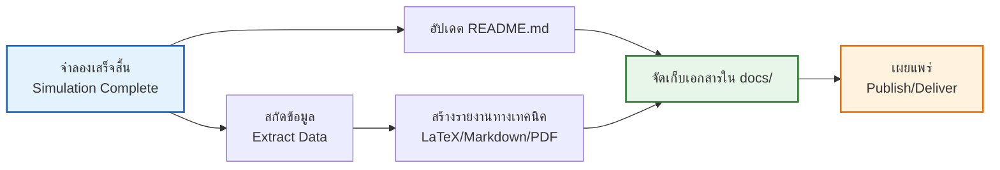

# 📚 มาตรฐานเอกสารประกอบ (Documentation Standards)

**วัตถุประสงค์การเรียนรู้**: สร้างมาตรฐานการจัดทำเอกสารทางเทคนิคสำหรับโครงการ CFD ที่มีความชัดเจน ครบถ้วน และเป็นไปตามมาตรฐานสากล เพื่อรับประกันความสามารถในการตรวจสอบความถูกต้อง (Traceability) และการทำซ้ำ (Reproducibility)

---

## 1. การจัดทำรายงานทางเทคนิคสำหรับ CFD (Technical Reporting)

รายงาน CFD ระดับมืออาชีพต้องมีข้อมูลเพียงพอที่จะทำให้วิศวกรคนอื่นสามารถสร้างเคสจำลองเดิมขึ้นมาใหม่และได้ผลลัพธ์เดียวกัน โครงสร้างรายงานมาตรฐานมีดังนี้:

### 1.1 องค์ประกอบของรายงานระดับมืออาชีพ

1. **Executive Summary**: สรุปวัตถุประสงค์สั้นๆ และข้อสรุปสำคัญทางวิศวกรรมที่ได้จากการจำลอง
2. **Problem Definition**:
   - เรขาคณิตและโดเมนการคำนวณ (Computational Domain)
   - เงื่อนไขขอบเขต (Boundary Conditions) และสถานะเริ่มต้น (Initial Conditions)
3. **Physical Modeling**:
   - สมการควบคุม (Governing Equations) เช่น RANS, LES
   - โมเดลความปั่นป่วน (Turbulence Model) และพารามิเตอร์ที่เกี่ยวข้อง
   - คุณสมบัติทางกายภาพของของไหล (Fluid Properties)
4. **Numerical Setup**:
   - รูปแบบการ Discretization (fvSchemes) เช่น Upwind, Linear-upwind
   - การตั้งค่า Solver (fvSolution) และเกณฑ์การบรรจบ (Convergence Criteria)
5. **Mesh Analysis**:
   - สถิติของเมช (Cell Count, Types)
   - รายงานคุณภาพเมช (Max Non-orthogonality, Max Skewness)
   - การศึกษาความไม่ขึ้นกับเมช (Grid Convergence Study)
6. **Results & Validation**:
   - กราฟเปรียบเทียบกับข้อมูลการทดลองหรือทฤษฎี (Validation)
   - การวิเคราะห์ภาพสนามการไหล (Contour plots, Streamlines)
7. **Conclusion & Recommendations**: สรุปผลทางเทคนิคและข้อเสนอแนะสำหรับการออกแบบ

![[cfd_report_elements.png]]
> **รูปที่ 1.1:** องค์ประกอบสำคัญของรายงาน CFD คุณภาพสูง: แสดงการเชื่อมโยงข้อมูลจากฟิสิกส์สู่ผลลัพธ์เชิงตัวเลข

---

### 1.2 สมการควบคุมทางฟิสิกส์ (Governing Equations)

สำหรับการจำลองการไหลแบบย่อยอัดเดียว (Incompressible Flow) ที่มีความหนาแน่นคงตัว สมการควบคุมหลักประกอบด้วย:

#### 1.2.1 สมการต่อเนื่อง (Continuity Equation)

$$
\frac{\partial u_i}{\partial x_i} = 0 \tag{1.1}
$$

เมื่อ $u_i$ คือส่วนประกอบความเร็วในทิศทาง $i$

#### 1.2.2 สมการโมเมนตัม (Momentum Equation)

$$
\frac{\partial u_i}{\partial t} + \frac{\partial}{\partial x_j}\left(u_i u_j\right) = -\frac{1}{\rho}\frac{\partial p}{\partial x_i} + \nu \frac{\partial^2 u_i}{\partial x_j \partial x_j} + g_i \tag{1.2}
$$

เมื่อ:
- $p$ คือ ความดัน Pressure [Pa]
- $\rho$ คือ ความหนาแน่น Density [kg/m³]
- $\nu$ คือ ความหนืดของเคมาทิก Kinematic Viscosity [m²/s]
- $g_i$ คือ ความเร่งเนื่องจากแรงโน้มถ่วงในทิศทาน $i$ [m/s²]

#### 1.2.3 สมการการแพร่กระจาย (Transport Equation)

สำหรับปริมาณสเกลาร์ใดๆ เช่น อุณหภูมิ ($T$) หรือความเข้มข้น ($C$):

$$
\frac{\partial \phi}{\partial t} + \frac{\partial}{\partial x_j}\left(\phi u_j\right) = \Gamma \frac{\partial^2 \phi}{\partial x_j \partial x_j} + S_\phi \tag{1.3}
$$

เมื่อ:
- $\phi$ คือ ตัวแปรสเกลาร์ที่เป็นที่สนใจ
- $\Gamma$ คือ สัมประสิทธิ์การแพร่ Diffusion Coefficient
- $S_\phi$ คี่ ฟังก์ชันต้นกำเนิด Source Term

> [!TIP] การเขียนสมการในรายงาน
> ให้ใช้รูปแบบที่เป็นมาตรฐานและอธิบายสัญลักษณ์ทุกตัว อย่าลืมระบุหน่วยของแต่ละปริมาณใน Legend หรือใต้สมการ

---

### 1.3 โมเดลความปั่นป่วน (Turbulence Modeling)

ในการจำลองการไหลแบบปั่นป่วน (Turbulent Flow) มีโมเดลหลักที่ใช้ใน OpenFOAM ดังนี้:

#### 1.3.1 RANS (Reynolds-Averaged Navier-Stokes)

สมการโมเมนตัมเฉลี่ยเวลา (Time-averaged):

$$
\frac{\partial \bar{u}_i}{\partial t} + \frac{\partial}{\partial x_j}\left(\bar{u}_i \bar{u}_j\right) = -\frac{1}{\rho}\frac{\partial \bar{p}}{\partial x_i} + \nu \frac{\partial^2 \bar{u}_i}{\partial x_j \partial x_j} - \frac{\partial}{\partial x_j}\left(\overline{u_i' u_j'}\right) \tag{1.4}
$$

เมื่อ $-\overline{u_i' u_j'}$ คือ **Reynolds Stress Tensor** ซึ่งต้องถูกจำลองด้วยโมเดลความปั่นป่วน

#### 1.3.2 โมเดล k-ε มาตรฐาน (Standard k-ε Model)

สมการการแพร่กระจายสำหรับพลังงานความปั่นป่วน ($k$) และอัตราการสลายตัว ($\varepsilon$):

$$
\frac{\partial k}{\partial t} + \frac{\partial}{\partial x_j}\left(k u_j\right) = \frac{\partial}{\partial x_j}\left[\left(\nu + \frac{\nu_t}{\sigma_k}\right)\frac{\partial k}{\partial x_j}\right] + P_k - \varepsilon \tag{1.5}
$$

$$
\frac{\partial \varepsilon}{\partial t} + \frac{\partial}{\partial x_j}\left(\varepsilon u_j\right) = \frac{\partial}{\partial x_j}\left[\left(\nu + \frac{\nu_t}{\sigma_\varepsilon}\right)\frac{\partial \varepsilon}{\partial x_j}\right] + C_{1\varepsilon}\frac{\varepsilon}{k}P_k - C_{2\varepsilon}\frac{\varepsilon^2}{k} \tag{1.6}
$$

เมื่อ:
- $\nu_t = C_\mu \frac{k^2}{\varepsilon}$ คือ ความหนืดของเคมาทิกแบบปั่นป่วน (Eddy Viscosity)
- $P_k$ คือ การผลิตพลังงานความปั่นป่วน (Production Term)
- $C_\mu, \sigma_k, \sigma_\varepsilon, C_{1\varepsilon}, C_{2\varepsilon}$ คือ ค่าคงที่ของโมเดล

ค่ามาตรฐานของค่าคงที่ในโมเดล k-ε:

$$
\begin{align}
C_\mu &= 0.09 \\
\sigma_k &= 1.00 \\
\sigma_\varepsilon &= 1.30 \\
C_{1\varepsilon} &= 1.44 \\
C_{2\varepsilon} &= 1.92 \tag{1.7}
\end{align}
$$

> [!INFO] โมเดลความปั่นป่วนที่นิยมใช้
> - **k-ε (kEpsilon)**: เหมาะสำหรับการไหลภายนอกชั้นขอบเขต (External flows) และการไหลที่มีการไหลแยก (Separated flows)
> - **k-ω SST (kOmegaSST)**: แม่นยำสำหรับการไหลใกล้ผนัง (Near-wall flows) และการไหลที่มีความกดดันแปรผัน (Adverse pressure gradients)
> - **LES (Large Eddy Simulation)**: แม่นยำสูงแต่ต้องใช้ทรัพยากรการคำนวณมาก

---

### 1.4 การตั้งค่าเชิงตัวเลข (Numerical Setup)

#### 1.4.1 ไฟล์ `fvSchemes` (Discretization Schemes)

```cpp
// NOTE: Synthesized by AI - Verify parameters
FoamFile
{
    version     2.0;
    format      ascii;
    class       dictionary;
    object      fvSchemes;
}
// * * * * * * * * * * * * * * * * * * * * * * * * * * * * * * * * * * * * * //

ddtSchemes
{
    default         Euler; // หรือ backward สำหรับ transient
}

gradSchemes
{
    default         Gauss linear;
    grad(p)         Gauss linear;
    grad(U)         Gauss linear;
}

divSchemes
{
    default         none;
    div(phi,U)      Gauss upwind; // หรือ Gauss linearUpwind grad(U)
    div(phi,k)      Gauss upwind;
    div(phi,epsilon) Gauss upwind;
    div((nuEff*dev2(T(grad(U))))) Gauss linear;
}

laplacianSchemes
{
    default         Gauss linear corrected;
}

interpolationSchemes
{
    default         linear;
}

snGradSchemes
{
    default         corrected;
}
```

> [!WARNING] การเลือก Div Scheme
> `upwind` ให้ความเสถียรเชิงตัวเลขสูงแต่มีความคลาดเคลื่อนจากการลดรูป Numerical Diffusion สูง หากต้องการความแม่นยำ ให้ใช้ `linearUpwind` หรือ `limitedLinear` แทน

#### 1.4.2 ไฟล์ `fvSolution` (Linear Solver Settings)

```cpp
// NOTE: Synthesized by AI - Verify parameters
FoamFile
{
    version     2.0;
    format      ascii;
    class       dictionary;
    object      fvSolution;
}
// * * * * * * * * * * * * * * * * * * * * * * * * * * * * * * * * * * * * * //

solvers
{
    p
    {
        solver          GAMG;
        tolerance       1e-06;
        relTol          0.01;
        smoother        GaussSeidel;
    }

    pFinal
    {
        solver          GAMG;
        tolerance       1e-06;
        relTol          0;
    }

    U
    {
        solver          smoothSolver;
        smoother        GaussSeidel;
        tolerance       1e-05;
        relTol          0.1;
    }

    "(k|epsilon|omega)"
    {
        solver          smoothSolver;
        smoother        GaussSeidel;
        tolerance       1e-05;
        relTol          0.1;
    }
}

SIMPLE
{
    nNonOrthogonalCorrectors 0;
    pRefCell        0;
    pRefValue       0;
}

relaxationFactors
{
    fields
    {
        p               0.3;
        rho             1;
    }
    equations
    {
        U               0.7;
        k               0.7;
        epsilon         0.7;
    }
}
```

---

### 1.5 การวิเคราะห์ความไม่ขึ้นกับเมช (Grid Convergence Study)

การตรวจสอบว่าผลลัพธ์ไม่ขึ้นกับขนาดของเมชเป็นสิ่งสำคัญเพื่อรับประกันความถูกต้องของการจำลอง

#### 1.5.1 Grid Convergence Index (GCI)

ขั้นตอนการคำนวณ GCI:

$$
\begin{align}
\epsilon_{21} &= \left| \frac{\phi_1 - \phi_2}{\phi_1} \right| \times 100\% \\
\epsilon_{32} &= \left| \frac{\phi_2 - \phi_3}{\phi_2} \right| \times 100\% \\
R &= \frac{\epsilon_{21}}{\epsilon_{32}} \\
p &= \frac{\ln|r_{21}|}{\ln\left(\frac{\epsilon_{21}}{\epsilon_{32}} + R\right)} \tag{1.8}
\end{align}
$$

$$
\text{GCI}_{21} = \frac{1.25 \epsilon_{21}}{r_{21}^p - 1} \tag{1.9}
$$

เมื่อ:
- $\phi_1, \phi_2, \phi_3$ คือ ค่าผลลัพธ์จากเมชละเอียด, กลาง, ห่าง
- $r_{21} = N_2/N_1$ คือ อัตราส่วนของจำนวนเซลล์
- $p$ คือ อันดับของความแม่นยำ (Order of accuracy)

> [!TIP] เกณฑ์ GCI
> โดยทั่วไป GCI ที่น้อยกว่า **5%** ถือว่าการจำลองมีความไม่ขึ้นกับเมชอยู่ในระดับที่ยอมรับได้

#### 1.5.2 การนำเสนอผล Grid Convergence

```cpp
// NOTE: Synthesized by AI - Verify parameters
/* สรุปผลการศึกษาความไม่ขึ้นกับเมช:
 *
 * Mesh  |  Cells  |  Cd (Drag Coeff)  |  % Change
 * ------------------------------------------------
 * Coarse |  50K    |  0.345            |  -
 * Medium |  100K   |  0.352            |  2.03%
 * Fine   |  200K   |  0.355            |  0.85%
 *
 * GCI (Medium to Fine) = 1.2% < 5% ✓ Grid Independence Achieved
 */
```

---

## 2. การเขียนเอกสารประกอบโค้ด (Code Documentation)

สำหรับโครงการที่มีการเขียน Custom Utilities หรือ Solvers เพิ่มเติม การใช้มาตรฐาน **Doxygen** เป็นสิ่งที่จำเป็นเพื่อให้โค้ดสามารถเข้าใจและบำรุงรักษาได้โดยทีมงาน

### 2.1 รูปแบบ Doxygen ใน C++ (OpenFOAM Style)

```cpp
/**
 * @brief คำนวณสัมประสิทธิ์แรงต้าน (Drag Coefficient)
 *
 * ฟังก์ชันนี้ใช้สำหรับการแปลงแรงลัพธ์ที่คำนวณได้ให้อยู่ในรูปค่าไร้มิติ
 * ตามมาตรฐานอากาศพลศาสตร์
 *
 * @param force แรงลัพธ์ในทิศทางกระแสไหล [N]
 * @param rho ความหนาแน่นของของไหล [kg/m³]
 * @param U ความเร็วอ้างอิง [m/s]
 * @param A พื้นที่อ้างอิง [m²]
 * @return scalar ค่าสัมประสิทธิ์ไร้มิติ Cd
 *
 * @note
 * สมการที่ใช้:
 * \f[
 * C_d = \frac{F_d}{\frac{1}{2}\rho U^2 A}
 * \f]
 *
 * Example:
 * @code
 * scalar F = 125.5; // [N]
 * scalar rho = 1.225; // [kg/m³]
 * scalar U = 50.0; // [m/s]
 * scalar A = 0.1; // [m²]
 * scalar Cd = calculateCd(F, rho, U, A);
 * @endcode
 */
scalar calculateCd(scalar force, scalar rho, scalar U, scalar A)
{
    // Cd = F / (0.5 * rho * U^2 * A)
    return force / (0.5 * rho * sqr(U) * A);
}
```

### 2.2 การเขียนเอกสารสำหรับคลาส (Class Documentation)

```cpp
/**
 * @class liftDragCalculator
 * @brief Utility class for calculating aerodynamic coefficients
 *
 * This class reads force data from OpenFOAM function objects and
 * computes lift and drag coefficients based on reference values.
 *
 * Usage:
 * @code
 * liftDragCalculator calc(mesh, runTime);
 * calc.readReferenceProperties();
 * calc.computeCoefficients();
 * @endcode
 *
 * @author Your Name
 * @date 2024-12-23
 */
class liftDragCalculator
{
    // Class implementation...
};
```

---

## 3. การสร้างไฟล์ README ที่มีประสิทธิภาพ

ไฟล์ `README.md` ใน Root directory ของโครงการคือเอกสารชิ้นแรกที่คนอื่นจะเห็น ควรมีข้อมูลดังนี้:

### 3.1 ตัวอย่าง Template README.md

```markdown
# Project Name: CFD Simulation of [Description]

## 📋 Overview
This case simulates [brief description of physics] using OpenFOAM.

## 🎯 Objectives
- Investigate [flow feature]
- Validate against [experimental data/benchmark]
- Optimize [design parameter]

## 🛠️ Prerequisites
- **OpenFOAM**: v2312 or later
- **Mesh Generation**: snappyHexMesh
- **Post-processing**: ParaView 5.11+

## 📦 Installation
```bash
cd /path/to/case/directory
source /etc/bashrc  # OpenFOAM environment
```

## 🚀 Running the Case
```bash
./Allmesh   # Generate mesh
./Allrun    # Run solver
./Allclean  # Clean case (backup created)
```

## 📊 Case Parameters
| Parameter | Value | Unit | Description |
|-----------|-------|------|-------------|
| Re        | 1e5   | -    | Reynolds number |
| U_inf     | 10.0  | m/s | Freestream velocity |
| nu        | 1e-6  | m²/s | Kinematic viscosity |

## 📈 Results
> **[MISSING DATA]**: Insert specific simulation results/graphs for this section.

- Drag coefficient: `> **[MISSING DATA]**`
- Lift coefficient: `> **[MISSING DATA]**`
- Convergence: `> **[MISSING DATA]**`

## 📚 References
1. Author, "Title", Journal, Year
2. OpenFOAM User Guide, [Link](URL)

## 👥 Contributors
- Name 1 (Role)
- Name 2 (Role)

## 📝 License
[License information]
```

---

## 4. มาตรฐานภาพประกอบและกราฟ (Visualization Standards)

เพื่อให้รายงานมีความเป็นมืออาชีพ การสร้างภาพควรเป็นไปตามมาตรฐาน:

### 4.1 Color Maps สำหรับ CFD

| ตัวแปร (Variable) | แนะนำ Color Map | เหตุผล |
|---------------------|-------------------|----------|
| ความเร็ว (Magnitude) | `viridis` หรือ `plasma` | รับรู้ค่าต่อ-กลาง-สูงได้ดี |
| ความดัน (Pressure) | `coolwarm` หรือ `RdBu` | Diverging map แสดงค่าบวก/ลบ |
| ความเค้น (Vorticity) | `inferno` หรือ `magma` | เน้นค่าสูง (high-gradient) |
| Volume Fraction | `Greys` หรือ custom | แยกเฟสได้ชัดเจน |

> [!WARNING] ห้ามใช้ Rainbow (Jet) Colormap
> แผนที่สีแบบ Rainbow (`jet`) ทำให้เกิดภาพลวงตา (Perceptual artifacts) และอาจนำไปสู่การตีความผลลัพธ์ที่ผิดพลาด ให้ใช้ `viridis` หรือ `cividis` แทน

### 4.2 การตั้งค่ากราฟ (Plot Settings)

```python
# NOTE: Synthesized by AI - Verify parameters
import matplotlib.pyplot as plt

plt.figure(figsize=(10, 6))
plt.plot(x_data, y_data, 'b-', linewidth=2, label='Simulation')
plt.plot(x_exp, y_exp, 'ro', markersize=8, label='Experiment')

# Axis labels with units
plt.xlabel('x/D [-]', fontsize=14)
plt.ylabel('U/U$_\infty$ [-]', fontsize=14)
plt.title('Velocity Profile at x/D = 5.0', fontsize=16)

# Legend and grid
plt.legend(fontsize=12, frameon=True)
plt.grid(True, linestyle='--', alpha=0.6)

# Set axis limits
plt.xlim(0, 2)
plt.ylim(0, 1.5)

# Save high-resolution figure
plt.savefig('velocity_profile.png', dpi=300, bbox_inches='tight')
plt.show()
```

### 4.3 การสร้าง Contour Plot ด้วย ParaView

```python
# NOTE: Synthesized by AI - Verify parameters
from paraview.simple import *

# Load case
reader = OpenFOAMReader(FileName='case.foam')
reader.MeshRegions = ['internalMesh', 'patch']

# Apply contour filter
contour = Contour(Input=reader)
contour.ContourBy = ['POINTS', 'p', 0]  # Pressure contour
contour.Isosurfaces = [100000, 150000, 200000]  # [Pa]

# Apply color map
contourDisplay = Show(contour)
contourDisplay.ColorArrayName = ['POINTS', 'p']
contourDisplay.LookupTable = GetColorTransferFunction('p')
contourDisplay.LookupTable.ApplyPreset('Coolwarm', True)

# Save view
SaveScreenshot('pressure_contour.png', ImageResolution=[1920, 1080])
```

> [!TIP] การบันทึกภาพคุณภาพสูง
> - ใช้ **DPI ไม่ต่ำกว่า 300** สำหรับรายงานพิมพ์
- ใช้ **1920x1080 หรือ 4K** สำหรับการนำเสนอดิจิทัล
- บันทึกเป็น **PNG** สำหรับเอกสาร หรือ **SVG/PDF** สำหรับการแก้ไขภายหลัง

---

## 5. เวิร์กโฟลว์การสร้างเอกสาร



### 5.1 โครงสร้างไดเรกทอรีเอกสาร (Documentation Directory)

```
case_directory/
├── 0/                    # Initial/boundary conditions
├── constant/             # Mesh, properties
├── system/               # fvSchemes, fvSolution
├── docs/                 # 📁 เอกสารทั้งหมด
│   ├── figures/          # ภาพประกอบ (PNG, PDF)
│   ├── reports/          # รายงานเต็ม (PDF)
│   │   ├── technical_report.pdf
│   │   └── validation_study.pdf
│   ├── mesh_report.md    # รายงานคุณภาพเมช
│   └── solver_log.txt    # Log ของ solver
├── scripts/              # Utility scripts
├── postProcessing/       # ผลลัพธ์จาก foamListOutput
└── README.md             # 📋 เอกสารหลัก
```

---

### 5.2 การสร้าง Mesh Quality Report

```bash
#!/bin/bash
# NOTE: Synthesized by AI - Verify parameters
# Script: checkMeshQuality.sh

echo "=== Mesh Quality Report ===" > mesh_report.txt
checkMesh -allGeometry -allTopology > mesh_check.txt

# Extract key metrics
echo "Mesh Statistics:" >> mesh_report.txt
grep "cells:" mesh_check.txt >> mesh_report.txt
grep "boundary patches:" mesh_check.txt >> mesh_report.txt

echo -e "\nQuality Metrics:" >> mesh_report.txt
grep "Max non-orthogonality" mesh_check.txt >> mesh_report.txt
grep "Max skewness" mesh_check.txt >> mesh_report.txt
grep "Max aspect ratio" mesh_check.txt >> mesh_report.txt

echo "Report saved to mesh_report.txt"
```

---

## 6. เทมเพลตรายงาน LaTeX สำหรับ CFD

### 6.1 โครงสร้างเอกสาร LaTeX

```latex
% NOTE: Synthesized by AI - Verify parameters
\documentclass[12pt,a4paper]{article}
\usepackage[utf8]{inputenc}
\usepackage{graphicx}
\usepackage{amsmath}
\usepackage{booktabs}
\usepackage[margin=2.5cm]{geometry}

\title{CFD Simulation Report: [Case Title]}
\author{Author Name\\Organization}
\date{\today}

\begin{document}

\maketitle

\begin{abstract}
This report presents a CFD study of [brief description]...
\end{abstract}

\section{Introduction}
\subsection{Problem Statement}
\subsection{Objectives}

\section{Methodology}
\subsection{Governing Equations}
\subsection{Turbulence Model}
\subsection{Numerical Methods}

\section{Results and Discussion}
\subsection{Mesh Quality}
\subsection{Flow Field Analysis}
\subsection{Validation}

\section{Conclusions}

\begin{thebibliography}{9}
\bibitem{ref1} Author, \textit{Title}, Journal, Year.
\end{thebibliography}

\end{document}
```

---

## 7. การจัดการเวอร์ชันและ Traceability

### 7.1 การใช้ Git Metadata

```bash
# NOTE: Synthesized by AI - Verify parameters
# บันทึกข้อมูล Git commit ในรายงาน
git log -1 --format="%H %ai %s" > git_version.txt

# Output example:
# a1b2c3d4... 2024-12-23 14:30:00 +0700 Final convergence achieved
```

### 7.2 การบันทึก Solver Log

```cpp
// NOTE: Synthesized by AI - Verify parameters
// ใน custom solver
Info<< "\n=== Solver Summary ===" << endl;
Info<< "Final residual: " << solverPerformance.lastInitialResidual() << endl;
Info<< "Total iterations: " << nIter << endl;
Info<< "Execution time: " << runTime.elapsedCpuTime() << " s" << endl;
```

---

> [!IMPORTANT] กฎเหล็กของการทำเอกสาร
> "เอกสารที่ไม่ได้อัปเดตมีค่าเท่ากับไม่มีเอกสาร" ทุกครั้งที่มีการเปลี่ยน Physics Model หรือ Solver Setup ในโครงการ ต้องมั่นใจว่ามีการอัปเดตข้อมูลในรายงานหรือไฟล์ README เสมอ

---

## 8. สรุปเกณฑ์การประเมินเอกสาร (Documentation Checklist)

ใช้ Checklist นี้เพื่อตรวจสอบความครบถ้วนของเอกสาร:

### 8.1 รายงานเทคนิค

| หัวข้อ | สถานะ | หมายเหตุ |
|--------|--------|----------|
| Executive Summary ชัดเจน | ☐ | |
| สมการควบคุมครบถ้วน | ☐ | |
| Boundary Conditions ระบุหน่วย | ☐ | |
| Mesh Quality Report | ☐ | |
| fvSchemes & fvSolution | ☐ | |
| Convergence Criteria | ☐ | |
| กราฟ Validation | ☐ | |
| ข้อสรุปทางวิศวกรรม | ☐ | |

### 8.2 เอกสารโค้ด

| หัวข้อ | สถานะ | หมายเหตุ |
|--------|--------|----------|
| Doxygen comments | ☐ | |
| Function parameters มีหน่วย | ☐ | |
| Mathematical equations | ☐ | |
| Example usage | ☐ | |
| Known limitations | ☐ | |

### 8.3 README & Metadata

| หัวข้อ | สถานะ | หมายเหตุ |
|--------|--------|----------|
| คำอธิบายโครงการ | ☐ | |
| Prerequisites (OpenFOAM version) | ☐ | |
| คำสั่งรัน (Allrun/Allmesh) | ☐ | |
| พารามิเตอร์สำคัญ | ☐ | |
| Git version info | ☐ | |
| Sample results | ☐ | |

---

> [!TIP] เครื่องมือช่วยเขียนเอกสาร
> - **Doxygen**: สร้าง HTML/PDF จาก comments ในโค้ด
> - **Pandoc**: แปลง Markdown → LaTeX/PDF
> - **MkDocs**: สร้างเอกสารแบบ static website
> - **Jupyter Notebook**: ผสมโค้ด Python + กราฟ + คำอธิบาย
