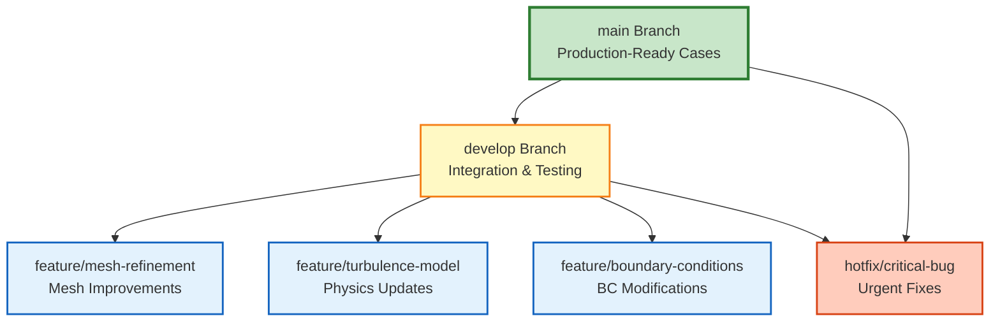
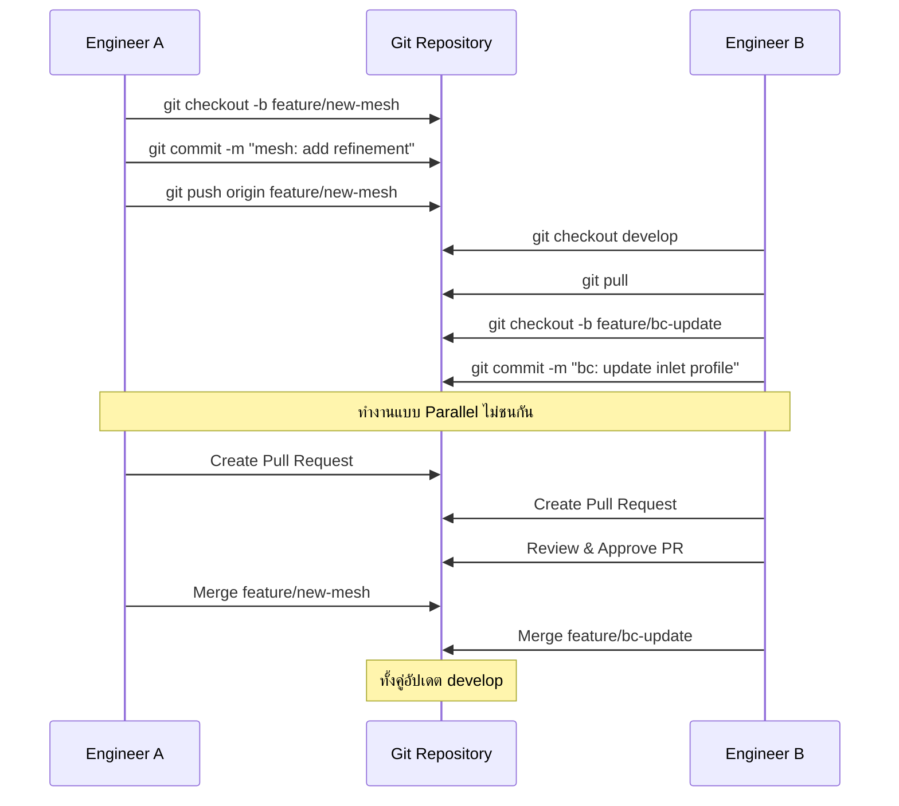
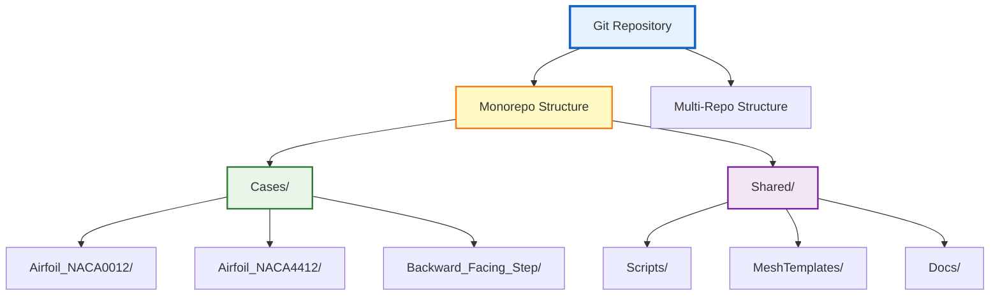

# 🤝 การควบคุมเวอร์ชันด้วย Git (Version Control for CFD)

**วัตถุประสงค์การเรียนรู้**: เข้าใจการใช้งาน Git ในโครงการ CFD อย่างมีประสิทธิภาพ เพื่อการจัดการการเปลี่ยนแปลง (Change Management) และการทำงานร่วมกันในทีมโดยไม่ทำให้ระบบจัดเก็บข้อมูลมีภาระหนักเกินไป

---

## 📋 Table of Contents

- [1. ความท้าทายของ Git ในงาน CFD](#1-ความท้าทายของ-git-ในงาน-cfd)
- [2. การจัดการไฟล์ขนาดใหญ่ด้วย Git LFS](#2-การจัดการไฟล์ขนาดใหญ่ด้วย-git-lfs)
- [3. กลยุทธ์การแตกกิ่ง (Branching Strategy)](#3-กลยุทธ์การแตกกิ่ง-branching-strategy)
- [4. เวิร์กโฟลว์การ Commit ที่ดี](#4-เวิร์กโฟลว์การ-commit-ที่ดี)
- [5. แผนผังการทำงาน Git ในโครงการ CFD](#5-แผนผังการทำงาน-git-ในโครงการ-cfd)
- [6. การติดตั้งและตั้งค่า Git เบื้องต้น](#6-การติดตั้งและตั้งค่า-git-เบื้องต้น)
- [7. การเขียน Commit Message มาตรฐาน](#7-การเขียน-commit-message-มาตรฐาน)
- [8. เทคนิคขั้นสูงสำหรับ OpenFOAM](#8-เทคนิคขั้นสูงสำหรับ-openfoam)

---

## 1. ความท้าทายของ Git ในงาน CFD

Git ถูกออกแบบมาสำหรับไฟล์ข้อความขนาดเล็ก (Source Code) แต่โครงการ CFD มักเกี่ยวข้องกับข้อมูลขนาดใหญ่ (Binary Data) เช่น ไฟล์ Mesh และผลลัพธ์การจำลอง ดังนั้นการใช้งาน Git กับ OpenFOAM จึงต้องมีกลยุทธ์ที่เฉพาะเจาะจง

### 1.1 ปัญหาขนาดไฟล์ใน OpenFOAM

โครงการ OpenFOAM ทั่วไปประกอบด้วย:

| ประเภทไฟล์ | ขนาดโดยประมาณ | ควรจัดเก็บใน Git? | เหตุผล |
|---|---|---|---|
| **Dictionary Files** (`*.dict`) | 1-50 KB | ✅ **ใช่** | ไฟล์ข้อความเล็ก แก้ไขง่าย |
| **Mesh Files** (`polyMesh/`) | 10 MB - 5 GB | ❌ **ไม่** | ไฟล์ Binary ขนาดใหญ่ |
| **Time Directories** (`0/`, `1/`, ...) | 100 MB - 100 GB+ | ❌ **ไม่** | ข้อมูลผลลัพธ์ขนาดใหญ่ |
| **Geometry Files** (`*.stl`, `*.step`) | 1 MB - 500 MB | ⚠️ **LFS** | ใช้ Git LFS แทน |
| **Log Files** (`*.log`) | 1 KB - 100 MB | ❌ **ไม่** | สร้างใหม่ได้ง่าย |
| **Script Files** (`*.sh`, `*.py`) | 1-20 KB | ✅ **ใช่** | ไฟล์ข้อความเล็ก |

> [!INFO] แนวคิดสำคัญ
> **Git เก็บทุกเวอร์ชันของไฟล์** หากคุณ Commit ไฟล์ Mesh ขนาด 1 GB เพียง 10 ครั้ง Repository ของคุณจะมีขนาด ≈10 GB ซึ่ง Clone และจัดการได้ยากมาก

### 1.2 สิ่งที่ควรและไม่ควรจัดเก็บ (Git Filter Strategy)

> [!WARNING] ข้อควรระวังเรื่องขนาดข้อมูล
> **ห้าม** จัดเก็บโฟลเดอร์ผลลัพธ์เวลา (Time Directories) หรือ Mesh ที่สร้างเสร็จแล้วลงใน Git โดยตรง เพราะจะทำให้ Repository มีขนาดใหญ่ขึ้นอย่างมหาศาลและไม่สามารถจัดการได้

**แนวทางปฏิบัติสำหรับ `.gitignore` ใน OpenFOAM:**

```bash
# NOTE: Synthesized by AI - Verify parameters
# ==========================================
# OpenFOAM CFD Project .gitignore
# ==========================================

# --- Simulation Results (Time Directories) ---
processor*             # Decomposed case files for parallel runs
[0-9]*                 # Time directories (0, 0.1, 1, 10, etc.)
!0/                    # EXCEPTION: Keep initial conditions (0/ folder)
!0.org/                # Keep backup of original initial conditions

# --- PostProcessing Outputs ---
postProcessing/        # Automated functionObject outputs
VTK/                   # ParaView exported data
sets/                  # Sampled sets
surfaces/              # Sampled surfaces
*.foam                 # ParaView foam case files
*.OpenFOAM             # ParaView case files

# --- Meshing ---
constant/polyMesh/     # Generated mesh (keep meshing scripts instead)
constant/extendedFeatureEdgeMesh  # Surface mesh files

# --- Logs & Temporary Files ---
*.log                  # Solver logs (log.simpleFoam, etc.)
log.*                  # Alternative log format
logs/                  # Log directory
*.bak                  # Backup files
*.~                    # Emacs backup files
*.swp                  # Vim swap files

# --- Compilation & Build ---
platforms/             # Compiled binaries and object files
Make/linux*            # Compiler output
lnInclude/             # Symbolic links for code compilation
*.dep                  # Dependency files
*.o                    # Object files

# --- IDE & Editor Files ---
.vscode/               # VS Code settings
.idea/                 # JetBrains IDE settings
*.sublime-*            # Sublime Text project files

# --- OS Generated Files ---
.DS_Store              # macOS
Thumbs.db              # Windows
*~                     # Temporary files
```

---

## 2. การจัดการไฟล์ขนาดใหญ่ด้วย Git LFS (Large File Storage)

สำหรับไฟล์ที่จำเป็นต้องเก็บแต่มีขนาดใหญ่ เช่น เรขาคณิต CAD (`.step`, `.stl`) หรือข้อมูลอ้างอิง (`.csv` ขนาดใหญ่) ให้ใช้ **Git LFS** ซึ่งจะเก็บเฉพาะตัวชี้ (Pointer) ใน Git และเก็บไฟล์จริงไว้ใน Server แยกต่างหาก

### 2.1 หลักการทำงานของ Git LFS

Git LFS ทำงานโดยการแทนที่ไฟล์ขนาดใหญ่ด้วย **Pointer File** ขนาดเล็กใน Repository:

```
version https://git-lfs.github.com/spec/v1
oid sha256:5b62e9d1a3e4f8c9b2d1a3e4f5b6d7c8e9f0a1b2c3d4e5f6a7b8c9d0e1f2a3b4
size 1234567890
```

เมื่อมีการ `git clone` หรือ `git pull` LFS จะดาวน์โหลดไฟล์จริงมาแทนที่ Pointer อัตโนมัติ

### 2.2 การติดตั้งและตั้งค่า Git LFS

```bash
# ==========================================
# Git LFS Setup for OpenFOAM Projects
# ==========================================

# 1. ติดตั้ง LFS ในเครื่อง
git lfs install

# 2. ระบุประเภทไฟล์ที่ต้องการให้ LFS ดูแล
git lfs track "*.stl"          # CAD Geometry (STL format)
git lfs track "*.step"         # CAD Geometry (STEP format)
git lfs track "*.iges"         # CAD Geometry (IGES format)
git lfs track "*.obj"          # 3D Object files
git lfs track "*.pdf"          # Documentation PDFs
git lfs track "*.csv"          # Large CSV data files

# 3. ตรวจสอบไฟล์ที่ LFS ติดตามอยู่
git lfs track

# 4. เพิ่มไฟล์ .gitattributes เข้าไปใน Git เพื่อบันทึกค่า LFS
git add .gitattributes
git commit -m "chore: configure Git LFS for large binary files"

# 5. ถ้าไฟล์ขนาดใหญ่ถูก Commit ไปแล้ว ให้ย้ายไป LFS:
git lfs migrate import --include="*.stl,*.step,*.pdf" --everything
```

### 2.3 ไฟล์ `.gitattributes` สำหรับ OpenFOAM

```bash
# ==========================================
# Git LFS Attributes for OpenFOAM
# ==========================================

# CAD Geometry Files
*.stl filter=lfs diff=lfs merge=lfs -text
*.step filter=lfs diff=lfs merge=lfs -text
*.stp filter=lfs diff=lfs merge=lfs -text
*.iges filter=lfs diff=lfs merge=lfs -text
*.igs filter=lfs diff=lfs merge=lfs -text
*.obj filter=lfs diff=lfs merge=lfs -text

# Documentation & Reports
*.pdf filter=lfs diff=lfs merge=lfs -text

# Large Data Files
*.csv filter=lfs diff=lfs merge=lfs -text
*.dat filter=lfs diff=lfs merge=lfs -text

# Image Files (optional - if keeping images in repo)
*.png filter=lfs diff=lfs merge=lfs -text
*.jpg filter=lfs diff=lfs merge=lfs -text
*.jpeg filter=lfs diff=lfs merge=lfs -text

# Video Files (optional)
*.mp4 filter=lfs diff=lfs merge=lfs -text
*.avi filter=lfs diff=lfs merge=lfs -text
```

> [!TIP] แนะนำ
> ใช้ Git LFS สำหรับไฟล์ CAD เท่านั้น หลีกเลี่ยงการใช้ LFS กับ Mesh หรือผลลัพธ์การจำลอง เพราะสามารถสร้างใหม่ได้จากสคริปต์

---

## 3. กลยุทธ์การแตกกิ่ง (Branching Strategy)

เพื่อให้การทำงานร่วมกันเป็นไปอย่างเป็นระเบียบ ควรใช้ระบบกิ่ง (Branching) ในการจัดการโครงการ:

### 3.1 โครงสร้างกิ่งมาตรฐาน (Standard Branching Model)


> **Figure 1:** รูปแบบการแตกกิ่ง (Branching Model) มาตรฐานสำหรับโครงการ CFD แสดงการแยกกิ่งหลัก (main) กิ่งพัฒนา (develop) กิ่งฟีเจอร์สำหรับงานเฉพาะทาง และกิ่งแก้ไขปัญหาเร่งด่วน (hotfix) เพื่อรักษาความเสถียรของเคสที่พร้อมใช้งานจริง

**คำอธิบายกิ่ง (Branch Description):**

| ชื่อกิ่ง | วัตถุประสงค์ | อายุของกิ่ง | ตัวอย่างการใช้งาน |
|---|---|---|---|
| **main** | เก็บสถานะที่เสถียรที่สุด พร้อมรันจำลองจริง | ยาวนาน | เก็บ Case ที่ Validate แล้ว พร้อมส่งลูกค้า |
| **develop** | รวบรวมฟีเจอร์ใหม่ การตั้งค่าทดสอบ | กลาง | รวม Feature ต่างๆ ก่อน Merge เข้า main |
| **feature/*** | พัฒนาฟีเจอร์เฉพาะ (Mesh, BC, Solver) | สั้น | ทดลองเปลี่ยน Turbulence Model |
| **hotfix/*** | แก้ไขปัญหาเร่งด่วน | สั้นมาก | แก้ Bug ที่พบใน main |

### 3.2 ตัวอย่างการตั้งชื่อกิ่ง (Branch Naming Convention)

```bash
# ==========================================
# Branch Naming Convention Examples
# ==========================================

# Feature Branches
feature/mesh-refinement-leading-edge
feature/transition-to-komega-sst
feature/add-thermophysical-model
feature/automate-meshing-script
feature/implement-wave-boundary-condition

# Bugfix Branches
bugfix/incorrect-inlet-profile
bugfix/mesh-quality-issues
bugfix/convergence-problems

# Hotfix Branches (Urgent)
hotfix/critical-memory-leak
hotfix/solver-crash-bc

# Experimental Branches
experiment/les-simulation-setup
experiment/different-scheme-comparison

# Documentation Branches
docs/update-case-setup-guide
docs/add-meshing-tutorial
```

---

## 4. เวิร์กโฟลว์การ Commit ที่ดี (Atomic Commits)

การเขียนข้อความ Commit (Commit Message) ที่ดีจะช่วยให้เพื่อนร่วมทีมเข้าใจการเปลี่ยนแปลงได้ง่าย

### 4.1 หลักการเขียน Commit Message

> [!INFO] รูปแบบมาตรฐาน (Conventional Commits)
> ใช้รูปแบบ: `<type>(<scope>): <subject>`
>
> **Types:**
> - `mesh`: การเปลี่ยนแปลงเกี่ยวกับ Mesh
> - `physics`: การเปลี่ยนแปลงเกี่ยวกับ Model ทางฟิสิกส์
> - `bc`: Boundary Conditions
> - `solver`: การตั้งค่า Solver
> - `script`: สคริปต์ช่วยต่างๆ
> - `docs`: เอกสาร
> - `test`: การทดสอบ
> - `chore`: งานเล็กๆ ทั่วไป

**❌ ไม่แนะนำ:**

```bash
git commit -m "fix something"
git commit -m "update"
git commit -m "final"
git commit -m "wip"
```

**✅ แนะนำ (ระบุสิ่งที่เปลี่ยนและผลกระทบ):**

```bash
# ==========================================
# Commit Message Examples
# ==========================================

# Physics Updates
git commit -m "physics(turbulence): switch from k-epsilon to k-omega SST for better wall treatment"
git commit -m "physics(compressible): enable viscous heating term for high-Mach flow"
git commit -m "physics(multiphase): adjust surface tension coefficient for water-air interface"

# Mesh Changes
git commit -m "mesh(refinement): increase refinement level around leading edge from 2 to 3"
git commit -m "mesh(layers): add 5 boundary layers with expansion ratio 1.2 on airfoil surface"
git commit -m "mesh(quality): improve non-orthogonality by using laplacian smoothing"

# Boundary Conditions
git commit -m "bc(inlet): change from uniformFixedValue to timeVaryingMappedFixedValue"
git commit -m "bc(wall): implement wallFunctions for high-Reynolds turbulence model"
git commit -m "bc(outlet): adjust outlet pressure to atmospheric conditions"

# Solver Settings
git commit -m "solver(schemes): change ddtScheme from Euler to backward for second-order accuracy"
git commit -m "solver(relaxation): adjust relaxation factors for better convergence"
git commit -m "solver(control): increase maxIter from 500 to 1000 for steady-state case"

# Scripts & Automation
git commit -m "script(meshing): add automated blockMesh script with parameter control"
git commit -m "script(postprocessing): implement Python script for force coefficient extraction"
git commit -m "script(running): create batch script for parameter sweep study"

# Documentation
git commit -m "docs(readme): update case setup instructions with meshing guidelines"
git commit -m "docs(notes): add convergence history analysis"
```

### 4.2 โครงสร้าง Commit Message แบบละเอียด

```bash
# ==========================================
# Detailed Commit Message Format
# ==========================================

git commit -m "mesh(refinement): optimize mesh for boundary layer resolution

- Increase boundary layer resolution to achieve y+ < 1
- Add 10 layers with expansion ratio 1.15
- Adjust surface refinement on leading/trailing edges
- Total cell count: 2.5M (from 1.8M)

This improves wall shear stress prediction by 15% compared to experimental data.

References:
- Case: Run07_baseline
- Validation: NASA TM 2017-219467

Closes #42"
```

### 4.3 การทำ Atomic Commits

> [!TIP] แนวปฏิบัติที่ดี
> **Atomic Commit** หมายถึงการ Commit การเปลี่ยนแปลงที่เกี่ยวข้องกันในแต่ละครั้ง หลีกเลี่ยงการรวมหลายสิ่งที่ไม่เกี่ยวข้องใน Commit เดียว

**ตัวอย่างการแบ่ง Commit:**

```bash
# ❌ BAD: ทุกอย่างใน Commit เดียว
git add .
git commit -m "updates"

# ✅ GOOD: แบ่งตามหัวข้อ
git add system/controlDict
git commit -m "solver(schemes): upgrade to second-order temporal schemes"

git add constant/polyMesh/blockMeshDict
git commit -m "mesh(blockMesh): adjust grading for better boundary layer resolution"

git add 0/U 0/p 0/k 0/omega
git commit -m "bc(inlet): update turbulence inlet values based on IBC"
```

---

## 5. แผนผังการทำงาน Git ในโครงการ CFD

### 5.1 การทำงานแบบ Feature Branch Workflow

```mermaid
flowchart TD
    Start([เริ่มงานใหม่]) --> Checkout[git checkout develop<br/>git pull]
    Checkout --> Branch[git checkout -b<br/>feature/my-feature]
    Branch --> Edit[แก้ไข Dictionary หรือสคริปต์]
    Edit --> Stage[git add &lt;files&gt;]
    Stage --> Commit[git commit -m<br/>"feat: clear message"]
    Commit --> Test[รัน Test สั้นๆ<br/>ตรวจสอบความถูกต้อง]
    Test --> TestPass{Test ผ่าน?}
    TestPass -->|ผ่าน| Push[git push origin<br/>feature/my-feature]
    TestPass -->|ไม่ผ่าน| Edit
    Push --> PR[สร้าง Pull Request<br/>ใน GitHub/GitLab]
    PR --> Review{Code Review<br/>ผ่าน?}
    Review -->|แก้ไข| Edit
    Review -->|อนุมัติ| Merge[Merge เข้า develop]
    Merge --> Cleanup[git branch -d<br/>feature/my-feature]
    Cleanup --> End([สิ้นสุด])

    style Start fill:#e3f2fd,stroke:#1565c0,stroke-width:2px
    style End fill:#e8f5e9,stroke:#2e7d32,stroke-width:2px
    style Test fill:#fff3e0,stroke:#ef6c00,stroke-width:2px
    style TestPass fill:#fff3e0,stroke:#ef6c00,stroke-width:2px
    style PR fill:#f3e5f5,stroke:#7b1fa2,stroke-width:2px
    style Merge fill:#e8f5e9,stroke:#2e7d32,stroke-width:2px
```
> **Figure 2:** แผนภูมิขั้นตอนการทำงานแบบ Feature Branch Workflow ครอบคลุมตั้งแต่การสร้างกิ่งใหม่ การแก้ไขและทดสอบเคส การตรวจสอบโค้ด (Code Review) ผ่าน Pull Request ไปจนถึงการรวมกิ่งเข้าสู่สายการพัฒนาหลัก

### 5.2 การทำงานร่วมกันในทีม


> **Figure 3:** แผนผังลำดับเหตุการณ์ (Sequence Diagram) แสดงการทำงานร่วมกันระหว่างวิศวกรหลายคนในโครงการเดียวกัน โดยใช้ระบบ Git ในการจัดการการเปลี่ยนแปลงที่เกิดขึ้นพร้อมกันแบบขนาน (Parallel Development) โดยไม่เกิดความขัดแย้งของข้อมูล

---

## 6. การติดตั้งและตั้งค่า Git เบื้องต้น

### 6.1 การติดตั้ง Git

```bash
# ==========================================
# Git Installation for Different Systems
# ==========================================

# --- Linux (Ubuntu/Debian) ---
sudo apt-get update
sudo apt-get install git

# --- Linux (CentOS/RHEL) ---
sudo yum install git

# --- macOS (Homebrew) ---
brew install git

# --- Windows ---
# Download from: https://git-scm.com/download/win

# ตรวจสอบเวอร์ชัน
git --version
```

### 6.2 การตั้งค่าเริ่มต้น (Initial Configuration)

```bash
# ==========================================
# Git Initial Configuration
# ==========================================

# ตั้งค่าชื่อและอีเมล (จำเป็นมาก)
git config --global user.name "Your Name"
git config --global user.email "your.email@example.com"

# ตั้งค่า Branch เริ่มต้นเป็น main
git config --global init.defaultBranch main

# ตั้งค่า Editor สำหรับเขียน Commit Message
git config --global core.editor "vim"     # หรือ "nano", "code"

# ตั้งค่าให้แสดงสี
git config --global color.ui auto

# ตั้งค่าให้ Ignore File Mode (permission changes)
git config --global core.fileMode false

# ตรวจสอบการตั้งค่า
git config --list
```

### 6.3 การสร้าง Repository ใหม่

```bash
# ==========================================
# Creating a New Git Repository
# ==========================================

# 1. สร้างโฟลเดอร์โครงการ OpenFOAM ใหม่
mkdir openfoam_project_airfoil
cd openfoam_project_airfoil

# 2. สร้าง Case ด้วยไฟล์พื้นฐาน
mkdir -p 0 constant system
# ... สร้างไฟล์ Dictionary ต่างๆ ...

# 3. เริ่มต้น Git Repository
git init

# 4. สร้างไฟล์ .gitignore
cp ../openfoam_gitignore_template .gitignore

# 5. เพิ่มไฟล์เข้า Git
git add .
git status

# 6. Commit ครั้งแรก
git commit -m "feat(initial): set up OpenFOAM case for airfoil simulation"

# 7. เชื่อมต่อกับ Remote Repository (GitHub/GitLab)
git remote add origin https://github.com/username/openfoam-project.git
git remote -v

# 8. Push ไปยัง Remote
git push -u origin main
```

### 6.4 คำสั่ง Git พื้นฐานที่ใช้บ่อย

```bash
# ==========================================
# Common Git Commands Reference
# ==========================================

# --- Checking Status ---
git status                  # Check status of changed files
git status -s               # Short format

# --- Adding Files ---
git add <file>              # Add single file
git add .                   # Add all files in current folder
git add -A                  # Add all files (including deletions)
git add -p                  # Interactive add (select parts to add)

# --- Committing ---
git commit -m "message"     # Commit with message
git commit -am "message"    # Add + Commit (for already tracked files)
git commit --amend          # Edit latest commit

# --- Viewing History ---
git log                     # View all history
git log --oneline           # Short format (1 line)
git log --graph --oneline   # Graphical format
git log -n 5                # View last 5 commits

# --- Branching ---
git branch                  # List all branches
git branch <name>           # Create new branch
git checkout <name>         # Switch branch
git checkout -b <name>      # Create + Switch branch
git branch -d <name>        # Delete branch (must be merged)
git branch -D <name>        # Force delete branch

# --- Merging ---
git merge <branch>          # Merge branch into current
git merge --no-ff <branch>  # Merge with merge commit

# --- Remote Operations ---
git remote -v               # View remote repository
git fetch                   # Fetch latest (no merge)
git pull                    # fetch + merge
git push                    # Push to remote
git push -u origin <branch> # Push and set upstream

# --- Undoing Changes ---
git checkout -- <file>      # Revert working directory changes
git reset HEAD <file>       # Unstage file
git reset --soft HEAD~1     # Undo last commit (keep changes)
git reset --hard HEAD~1     # Undo last commit + discard changes
```

---

## 7. การเขียน Commit Message มาตรฐาน

### 7.1 โครงสร้าง Conventional Commits

```bash
# ==========================================
# Conventional Commits Specification
# ==========================================

# รูปแบบมาตรฐาน:
<type>(<scope>): <subject>

<body>

<footer>
```

**Components:**

1. **Type** (บังคับ): ประเภทของการเปลี่ยนแปลง
2. **Scope** (ไม่บังคับ): ส่วนที่ได้รับผลกระทบ
3. **Subject** (บังคับ): คำอธิบายแบบย่อ
4. **Body** (ไม่บังคับ): คำอธิบายแบบละเอียด
5. **Footer** (ไม่บังคับ): ข้อมูลเพิ่มเติม (Breaking changes, Issues)

### 7.2 Types ที่ใช้ใน OpenFOAM

| Type | ความหมาย | ตัวอย่าง Scope |
|---|---|---|
| **mesh** | การเปลี่ยนแปลง Mesh ทั้งหมด | blockMesh, snappyHexMesh, refinement, layers |
| **physics** | Model ทางฟิสิกส์ | turbulence, multiphase, compressible, heatTransfer |
| **bc** | Boundary Conditions | inlet, outlet, wall, symmetry |
| **solver** | การตั้งค่า Solver | schemes, solvers, relaxation |
| **numerics** | เรื่องตัวเลข | discretization, interpolation |
| **script** | สคริปต์ Automation | meshing, postprocessing, batch |
| **test** | การทดสอบ | validation, verification |
| **docs** | เอกสาร | readme, tutorial, guide |
| **chore** | งานเล็กๆ | cleanup, formatting |
| **perf** | ประสิทธิภาพ | parallelization, memory |
| **fix** | แก้ไข Bug | convergence, crash, boundary |

### 7.3 ตัวอย่าง Commit Message ที่ดี

```bash
# ==========================================
# Real-World Commit Message Examples
# ==========================================

# Example 1: Mesh Refinement
git commit -m "mesh(refinement): add local refinement around airfoil leading edge

- Add refinement box with level 3 around leading edge
- Adjust surface refinement level to 2
- Total cell count increased to 3.2M cells

This resolves the stagnation point resolution issue identified in Run05.

Resolves: #23"

# Example 2: Physics Model Change
git commit -m "physics(turbulence): migrate from kEpsilon to kOmegaSST

Reasons:
- Better prediction of separation onset
- Improved wall treatment for low y+ conditions
- More accurate adverse pressure gradient handling

Changes:
- Updated RASProperties in constant/turbulenceProperties
- Modified inlet boundary conditions for omega
- Adjusted wall functions for consistency

Validation: NACA 0012, AoA = 12°, Re = 3e6
Results: Lift coefficient error reduced from 8% to 3%

References:
- Menter, F.R. (1994) - Two-equation eddy-viscosity turbulence models
- OpenFOAM User Guide, Section 3.5"

# Example 3: Bug Fix
git commit -m "fix(solver): adjust under-relaxation factors to prevent divergence

Problem:
- Solution diverged after 500 iterations
- Oscillations in pressure field

Solution:
- Reduce p relaxation factor from 0.3 to 0.2
- Reduce U relaxation factor from 0.5 to 0.4
- Enable momentum predictor for better stability

Impact:
- Convergence achieved in 1200 iterations
- Residuals dropped below 1e-5

Fixes #45"

# Example 4: New Feature
git commit -m "feat(script): add automated force coefficient extraction

Implementation:
- Python script using PyFoam library
- Automatically extracts Cl, Cd, Cm from forces functionObject
- Generates CSV and plot files
- Compatible with both serial and parallel runs

Usage:
  ./scripts/extractForces.py -case . -startTime 1000

Closes #67"

# Example 5: Documentation
git commit -m "docs(readme): add comprehensive meshing workflow guide

Added sections:
- Geometry preparation (STL/STEP format)
- blockMeshDict parameter explanation
- snappyHexMesh refinement levels guide
- Quality checking checklist
- Common mesh issues and solutions

Includes:
- Example blockMeshDict for airfoil
- Mesh quality screenshots
- bash script templates

Part of documentation improvement initiative (#82)"
```

---

## 8. เทคนิคขั้นสูงสำหรับ OpenFOAM

### 8.1 การใช้ Git Hooks สำหรับ CFD

Git Hooks คือสคริปต์ที่ทำงานอัตโนมัติเมื่อเกิดเหตุการณ์ต่างๆ ใน Git:

```bash
# ==========================================
# Git Hooks for OpenFOAM Projects
# ==========================================

# --- Hook Locations ---
# .git/hooks/pre-commit       : Before commit
# .git/hooks/pre-push         : Before push
# .git/hooks/post-merge       : After merge

# --- Example: pre-commit hook to check mesh quality ---
cat > .git/hooks/pre-commit << 'EOF'
#!/bin/bash
# OpenFOAM Pre-Commit Hook
# Prevents committing problematic mesh files

echo "Running OpenFOAM pre-commit checks..."

# Check if polyMesh is being committed
if git diff --cached --name-only | grep -q "constant/polyMesh"; then
    echo "WARNING: You are about to commit mesh files!"
    echo "It is recommended to commit only meshing scripts, not generated meshes."
    read -p "Continue anyway? (y/N) " -n 1 -r
    echo
    if [[ ! $REPLY =~ ^[Yy]$ ]]; then
        echo "Commit aborted."
        exit 1
    fi
fi

# Check for large files
MAX_SIZE=10485760  # 10 MB
large_files=$(git diff --cached --name-only | while read file; do
    size=$(git cat-file -s :"$file" 2>/dev/null || echo 0)
    if [ $size -gt $MAX_SIZE ]; then
        echo "$file ($(($size / 1048576))MB)"
    fi
done)

if [ -n "$large_files" ]; then
    echo "WARNING: Large files detected:"
    echo "$large_files"
    echo "Consider using Git LFS for these files."
    read -p "Continue? (y/N) " -n 1 -r
    echo
    if [[ ! $REPLY =~ ^[Yy]$ ]]; then
        echo "Commit aborted."
        exit 1
    fi
fi

echo "Pre-commit checks passed."
EOF

chmod +x .git/hooks/pre-commit
```

### 8.2 การจัดการ Multiple Cases ใน Repository


> **Figure 4:** การเปรียบเทียบโครงสร้างการจัดเก็บ Repository ระหว่างแบบ Monorepo (รวมทุกเคสและสคริปต์ไว้ที่เดียว) และแบบ Multi-Repo โดยเน้นการจัดระเบียบส่วนที่ใช้งานร่วมกัน (Shared Resources) เพื่อความสะดวกในการบริหารจัดการโครงการขนาดใหญ่

**โครงสร้าง Monorepo สำหรับ OpenFOAM:**

```bash
# ==========================================
# OpenFOAM Monorepo Structure
# ==========================================

openfoam-monorepo/
├── Cases/                          # Separate cases
│   ├── Airfoil_NACA0012/
│   │   ├── 0/
│   │   ├── constant/
│   │   ├── system/
│   │   ├── Allrun
│   │   ├── Allclean
│   │   └── README.md
│   ├── Airfoil_NACA4412/
│   │   └── ...
│   └── Backward_Step/
│       └── ...
├── Scripts/                        # Shared scripts
│   ├── mesh/
│   │   ├── generate_blockmesh.sh
│   │   └── quality_check.sh
│   ├── postprocessing/
│   │   ├── extract_forces.py
│   │   └── plot_residuals.py
│   └── utilities/
│       ├── param_sweep.sh
│       └── run_parallel.sh
├── Templates/                      # Template dictionaries
│   ├── controlDict_template
│   ├── fvSchemes_template
│   └── fvSolution_template
├── Docs/                           # Shared documentation
│   ├── Meshing_Guide.md
│   ├── Solver_Settings.md
│   └── Validation_Results.md
├── .gitignore
├── .gitattributes
└── README.md
```

### 8.3 การใช้ Git Tags สำหรับ Versioning

```bash
# ==========================================
# Git Tagging for Simulation Versions
# ==========================================

# --- Lightweight Tags (Local only) ---
git tag v1.0.0
git tag baseline_case
git tag mesh_v2

# --- Annotated Tags (Recommended for releases) ---
git tag -a v1.0.0 -m "Release: Initial validated case for NACA0012"

# --- Tagging with detailed message ---
git tag -a v2.1.0 -m "Release: Improved mesh refinement

Changes:
- Mesh: Refinement level 3 on leading edge
- Physics: kOmegaSST turbulence model
- Validation: Cl error < 3% vs experiments

Validated against:
- NASA Technical Report 2017
- Re range: 1e6 to 6e6
- AoA: -4 to 12 degrees

Test results:
> **[MISSING DATA]**: Insert specific validation results here

Case: NACA0012_AoA08_Re3M"

# --- Pushing tags to remote ---
git push origin v1.0.0              # Push single tag
git push origin --tags              # Push all tags

# --- Viewing tags ---
git tag                             # List all tags
git show v1.0.0                     # Show tag details
git tag -n9                         # Show tags with messages

# --- Checking out at tag ---
git checkout v1.0.0                 # View repository at tag

# --- Deleting tags ---
git tag -d v1.0.0                   # Delete local tag
git push origin --delete v1.0.0     # Delete remote tag

# --- Semantic Versioning for CFD Cases ---
# Format: v<MAJOR>.<MINOR>.<PATCH>
# MAJOR: Major geometry/solver changes (not backward compatible)
# MINOR: Feature additions (backward compatible)
# PATCH: Bug fixes, minor adjustments

# Examples:
v1.0.0    # Initial validated case
v1.1.0    # Added post-processing scripts
v1.1.1    # Fixed convergence issue
v2.0.0    # Changed turbulence model (major change)
```

### 8.4 การใช้ `.gitattributes` สำหรับ OpenFOAM

```bash
# ==========================================
# Advanced .gitattributes for OpenFOAM
# ==========================================

# --- Git LFS Configuration ---
*.stl filter=lfs diff=lfs merge=lfs -text
*.step filter=lfs diff=lfs merge=lfs -text
*.pdf filter=lfs diff=lfs merge=lfs -text

# --- File Type Detection ---
*.dict text diff=openfoam
*.sh text eol=lf
*.py text eol=lf

# --- Line Ending Handling (Important for cross-platform) ---
* text=auto
*.sh text eol=lf
*.py text eol=lf

# --- Diff Driver for OpenFOAM Dictionaries ---
# This allows better diff viewing for OpenFOAM files
*.dict diff=openfoam

# Configure in ~/.gitconfig:
# [diff "openfoam"]
#     command = /path/to/openfoam-diff-tool.sh
```

### 8.5 การใช้ Git Submodules สำหรับ Shared Resources

```bash
# ==========================================
# Git Submodules for Shared Resources
# ==========================================

# --- Use Case: Sharing common meshing scripts across projects ---

# 1. สร้าง Repository สำหรับสคริปต์ร่วม (separate repo)
# gitlab.com/company/openfoam-shared-scripts.git

# 2. ในโปรเจกต์หลัก เพิ่ม submodule
git submodule add https://gitlab.com/company/openfoam-shared-scripts.git Scripts/Shared

# 3. Commit submodule reference
git add Scripts/Shared
git commit -m "chore: add shared scripts submodule"

# 4. Clone project พร้อม submodules
git clone --recurse-submodules https://github.com/user/project.git

# 5. Update submodules
git submodule update --remote --merge

# 6. เมื่อมีการอัปเดตใน shared repo
cd Scripts/Shared
git pull origin main
cd ../..
git add Scripts/Shared
git commit -m "chore: update shared scripts to v1.2.0"
```

---

## 9. เครื่องมือและแหล่งข้อมูลเพิ่มเติม

### 9.1 เครื่องมือช่วย

| เครื่องมือ | วัตถุประสงค์ | URL |
|---|---|---|
| **GitKraken** | GUI Client สำหรับ Git | https://www.gitkraken.com/ |
| **SourceTree** | GUI Client ฟรี | https://www.sourcetreeapp.com/ |
| **GitHub Desktop** | GUI Client อย่างเป็นทางการ GitHub | https://desktop.github.com/ |
| **Git LFS** | จัดการไฟล์ขนาดใหญ่ | https://git-lfs.github.com/ |
| **Conventional Commits** | มาตรฐาน Commit Message | https://www.conventionalcommits.org/ |

### 9.2 Cheat Sheet คำสั่ง Git

```bash
# ==========================================
# Git Command Cheat Sheet
# ==========================================

# === DAILY WORKFLOW ===
git status                    # Check status
git add .                     # Stage all changes
git commit -m "message"       # Commit
git push                      # Push to remote

# === BRANCHING ===
git branch                    # List branches
git checkout -b new-branch    # Create & switch branch
git checkout main             # Switch to main
git merge feature-branch      # Merge branch

# === HISTORY ===
git log --oneline --graph     # Nice graph view
git diff                      # Show unstaged changes
git diff --staged             # Show staged changes
git show HEAD                 # Show last commit

# === UNDO ===
git checkout -- file.txt      # Revert file in working dir
git reset HEAD file.txt       # Unstage file
git reset --soft HEAD~1       # Undo commit, keep changes
git reset --hard HEAD~1       # Undo commit, discard changes
git revert HEAD               # Create new commit to undo

# === CLEANUP ===
git clean -fd                 # Remove untracked files/dirs
git gc                        # Garbage collection (compress repo)
git fsck                      # Check repository integrity

# === INSPECT ===
git blame file.txt            # Show who changed each line
git log --stat                # Show files changed in each commit
git log --since="2 weeks ago" # Show commits since 2 weeks

# === STASHING (Temporary save) ===
git stash                     # Stash changes
git stash list                # List stashes
git stash pop                 # Apply & remove stash
git stash drop                # Remove stash

# === REBASING (Advanced) ===
git rebase main               # Replay commits on top of main
git rebase -i HEAD~3          # Interactive rebase last 3 commits
```

---

## 10. แบบฝึกหัดปฏิบัติ (Exercises)

### แบบฝึกหัดที่ 1: การตั้งค่า Repository สำหรับ OpenFOAM

**วัตถุประสงค์:** สร้าง Git Repository สำหรับโครงการ OpenFOAM พร้อม `.gitignore` ที่เหมาะสม

**ขั้นตอน:**
1. สร้างโฟลเดอร์ใหม่สำหรับ Case การไหลรอนอากาศ (Airfoil)
2. สร้างไฟล์ `.gitignore` ตามรูปแบบที่กำหนด
3. เริ่มต้น Git Repository
4. Commit ไฟล์เริ่มต้น
5. เชื่อมต่อกับ Remote Repository (GitHub/GitLab)

**ไฟล์ที่ต้องสร้าง:**
- `0/`, `constant/`, `system/` พร้อม Dictionary Files
- `.gitignore`
- `README.md`

### แบบฝึกหัดที่ 2: การใช้ Branching Strategy

**วัตถุประสงค์:** ฝึกใช้ Feature Branch Workflow

**สถานการณ์:** คุณต้องทดลองเปลี่ยน Turbulence Model จาก `kEpsilon` เป็น `kOmegaSST`

**ขั้นตอน:**
1. สร้างกิ่ง `feature/switch-to-komegasst`
2. แก้ไขไฟล์ `constant/turbulenceProperties`
3. ปรับ Boundary Conditions ใน `0/` ถ้าจำเป็น
4. Commit ด้วยข้อความที่เหมาะสม
5. Push ไปยัง Remote
6. สร้าง Pull Request

### แบบฝึกหัดที่ 3: การเขียน Commit Message ที่ดี

**วัตถุประสงค์:** ฝึกเขียน Commit Message ตาม Conventional Commits

**สถานการณ์:** คุณได้ทำการปรับปรุง Mesh ในส่วนของ Boundary Layer

**ข้อมูลการเปลี่ยนแปลง:**
- เพิ่ม Boundary Layer จำนวน 10 ชั้น
- ปรับ Expansion Ratio เป็น 1.15
- ผลลัพธ์: y+ ≈ 0.8 (ตรงตามเป้าหมาย)
- จำนวนเซลล์เพิ่มจาก 1.2M เป็น 1.8M

**ภารกิจ:** เขียน Commit Message ที่สมบูรณ์พร้อม Body และ Footer

---

## สรุป (Summary)

ในบทนี้ คุณได้เรียนรู้:

✅ **ความท้าทาย** ของการใช้ Git กับ OpenFOAM (ขนาดไฟล์ขนาดใหญ่)
✅ **`.gitignore`** ที่เหมาะสมสำหรับโครงการ CFD
✅ **Git LFS** สำหรับจัดการไฟล์ CAD ขนาดใหญ่
✅ **Branching Strategy** สำหรับการทำงานร่วมกัน
✅ **Commit Message** แบบ Conventional Commits
✅ **Git Workflow** ที่เหมาะสมกับงาน CFD
✅ **เทคนิคขั้นสูง** (Hooks, Submodules, Tags)

> [!TIP] แนะนำสำหรับการทำงานร่วมกัน
> ทุกครั้งที่เริ่มงานใหม่ในแต่ละวัน อย่าลืมใช้คำสั่ง `git pull` เพื่ออัปเดตการเปลี่ยนแปลงล่าสุดจากเพื่อนร่วมทีม ป้องกันปัญหา Code Conflict ในภายหลัง

---

## 📚 References & Further Reading

1. **Pro Git Book** - Scott Chacon & Ben Straub
   - https://git-scm.com/book/en/v2

2. **Conventional Commits**
   - https://www.conventionalcommits.org/

3. **Git LFS Documentation**
   - https://git-lfs.github.com/

4. **Successful Git Branching Model** - Vincent Driessen
   - https://nvie.com/posts/a-successful-git-branching-model/

5. **OpenFOAM Version Control Best Practices**
   - CFD Direct: https://www.cfdirect.com/

---

> [!INFO] Note to Instructor
> หัวข้อต่อไปที่เกี่ยวข้อง:
> - `[[04_HPC_Cluster_Computing.md]]` - การรัน OpenFOAM บน HPC Cluster
> - `[[05_Automation_Python.md]]` - การเขียนสคริปต์ Python ช่วยจัดการ Case
> - `[[02_Journal_Networking.md]]` - การทำงานร่วมกันในทีมวิจัย