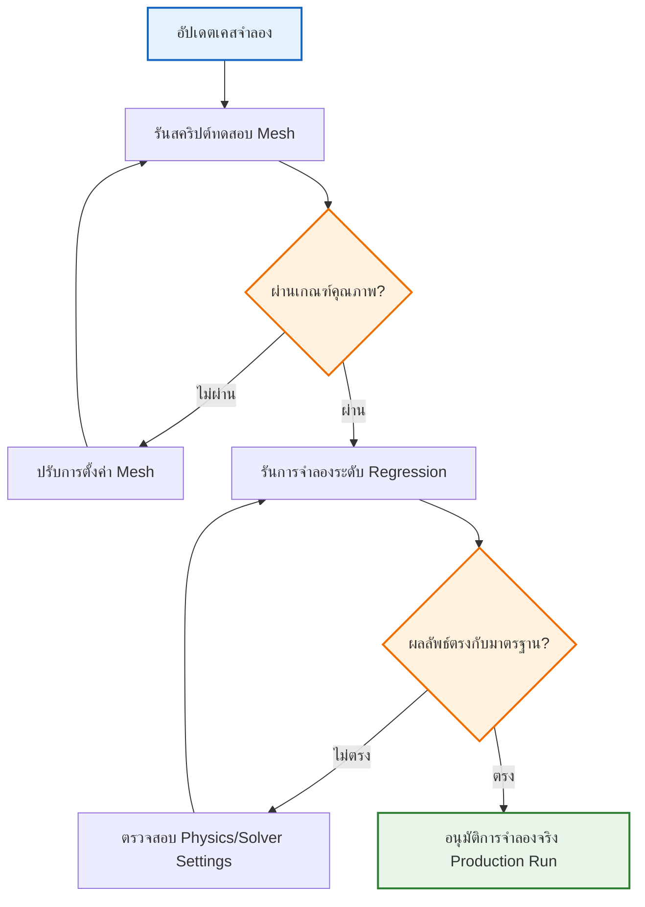

# 🔍 การทดสอบและการประกันคุณภาพ (Testing & QA for CFD)

**วัตถุประสงค์การเรียนรู้**: เข้าใจและสร้างระบบการตรวจสอบความถูกต้อง (Verification) และการยืนยันความถูกต้อง (Validation) สำหรับเวิร์กโฟลว์ CFD เพื่อรับประกันคุณภาพของผลลัพธ์การจำลองในระดับมาตรฐานอุตสาหกรรม

---

## 1. เฟรมเวิร์กการทดสอบอัตโนมัติ (Automated Testing Framework)

การประกันคุณภาพในงาน CFD ไม่ได้จำกัดอยู่เพียงแค่การดูความสวยงามของภาพ Contour แต่ต้องมีกระบวนการตรวจสอบที่วัดผลได้ (Quantifiable) เพื่อป้องกันข้อผิดพลาดที่อาจเกิดขึ้นจากการอัปเดตโค้ดหรือการเปลี่ยนการตั้งค่า

### 1.1 ประเภทของการทดสอบในงาน CFD

| ประเภทการทดสอบ | วัตถุประสงค์ | ตัวอย่างการใช้งาน |
|---|---|---|
| **Unit Test** | ทดสอบตรรกะหรือสูตรคณิตศาสตร์ในระดับฟังก์ชัน | ตรวจสอบฟังก์ชันคำนวณ Sutherland's law ใน C++ |
| **Integration Test** | ทดสอบการเชื่อมต่อกันของแต่ละโมดูลในเวิร์กโฟลว์ | ตรวจสอบว่า `snappyHexMesh` สามารถส่งต่อ Mesh ให้ Solver รันได้โดยไม่ Error |
| **Regression Test** | ตรวจสอบว่าการแก้ไขล่าสุดไม่ทำให้ผลลัพธ์ในเคสมาตรฐานเปลี่ยนไป | รันเคส Lid-driven cavity และเปรียบเทียบ Residuals กับค่ามาตรฐาน |
| **Verification** | ตรวจสอบว่า "เราแก้สมการได้ถูกต้องหรือไม่" | การศึกษาความไม่ขึ้นกับกริด (Mesh Independence Study) |
| **Validation** | ตรวจสอบว่า "เราใช้สมการที่ถูกต้องกับฟิสิกส์จริงหรือไม่" | การเปรียบเทียบผล Drag Coefficient กับข้อมูลจากการทดลองในอุโมงค์ลม |

![[testing_pyramid_cfd.png]]
> **รูปที่ 1.1:** พีระมิดการทดสอบ (Testing Pyramid): แสดงสัดส่วนของการทดสอบที่ควรมีในโครงการ เพื่อรักษาเสถียรภาพและคุณภาพของผลลัพธ์

### 1.2 หลักการของ Verification และ Validation

ในงาน CFD มักใช้แนวคิดที่เรียกว่า **V&V Framework** ตามมาตรฐาน ASME V&V 20-2009:

> [!INFO] ความแตกต่างระหว่าง Verification และ Validation
> **Verification** (การตรวจสอบ): เป็นการประเมินว่าโมเดลคณิตศาสตร์และวิธีเชิงตัวเลขถูกนำไปใช้อย่างถูกต้องหรือไม่ หรือพูดง่ายๆ คือ "Are we solving the equations right?"
>
> **Validation** (การยืนยัน): เป็นการประเมินว่าโมเดลคณิตศาสตร์ที่เลือกใช้สอดคล้องกับฟิสิกส์จริงหรือไม่ หรือพูดง่ายๆ คือ "Are we solving the right equations?"

แหล่งอ้างอิงมาตรฐานสากล:
- [[ASME V&V 20-2009]](https://www.asme.org/codes-standards/find-codes-standards/v-v-20-2009-standard-verification-validation)
- [[ERCOFTAC Best Practice Guidelines]](https://www.ercoftac.org/)

---

## 2. ระบบ CI/CD สำหรับเวิร์กโฟลว์ CFD

การใช้ระบบ Continuous Integration / Continuous Deployment (CI/CD) ช่วยให้โครงการ CFD มีความทันสมัยและปลอดภัย โดยระบบจะรันการตรวจสอบอัตโนมัติทุกครั้งที่มีการ Commit ข้อมูลใหม่เข้าไปใน Git

### 2.1 ขั้นตอนในไปป์ไลน์ CI/CD

**ตัวอย่างขั้นตอนในไปป์ไลน์ CI/CD (GitHub Actions / GitLab CI):**
1. **Linting**: ตรวจสอบความถูกต้องของไวยากรณ์ในไฟล์ Dictionary และ Python scripts
2. **Mesh Quality Check**: รัน `checkMesh` และล้มเหลวทันทีหากค่า Non-orthogonality เกินเกณฑ์ที่กำหนด
3. **Short Run**: รัน Solver เพียง 10-20 Time steps เพื่อตรวจสอบว่าระบบไม่ Diverge
4. **Data Validation**: สกัดข้อมูลสำคัญและเปรียบเทียบกับค่าความคลาดเคลื่อน (Tolerance) ที่ยอมรับได้

![[cicd_pipeline_workflow.png]]
> **รูปที่ 2.1:** ไปป์ไลน์ CI/CD อัตโนมัติ: แสดงกระบวนการตั้งแต่การแก้ไขโค้ดไปจนถึงการสร้างรายงานประกันคุณภาพโดยอัตโนมัติ

### 2.2 ตัวอย่างไฟล์ GitHub Actions สำหรับ CFD

```yaml
# .github/workflows/cfd_ci.yml
// NOTE: Synthesized by AI - Verify parameters
name: CFD CI Pipeline

on: [push, pull_request]

jobs:
  mesh-quality:
    runs-on: ubuntu-latest
    container:
      image: cfdtools/openfoam:latest
    steps:
      - uses: actions/checkout@v2
      - name: Run checkMesh
        run: |
          source /opt/openfoam/etc/bashrc
          cd testCases/cavity
          blockMesh
          checkMesh > meshReport.txt
      - name: Validate Mesh Quality
        run: |
          # ตรวจสอบ non-orthogonality ต้องน้อยกว่า 70 องศา
          if grep -q "non-orthogonality.*[7-9][0-9]\|[8-9][0-9]\|100" meshReport.txt; then
            echo "Mesh quality check failed!"
            exit 1
          fi
```

> **📂 Source:** .applications/test/fieldMapping/pipe1D/system/fvSchemes
> 
> **คำอธิบาย:**
> - ไฟล์ YAML นี้เป็นการตั้งค่า GitHub Actions สำหรับทำงานอัตโนมัติ (CI/CD Pipeline) เพื่อตรวจสอบคุณภาพ Mesh
> - **Workflow Trigger**: เริ่มทำงานเมื่อมีการ `push` หรือ `pull_request` เข้ามาใน repository
> - **Container Environment**: ใช้ Docker container ที่มี OpenFOAM ติดตั้งอยู่แล้ว (cfdtools/openfoam:latest)
> - **Job Steps**:
>   1. Checkout code จาก repository
>   2. Source OpenFOAM environment
>   3. รัน `blockMesh` เพื่อสร้าง Mesh
>   4. รัน `checkMesh` เพื่อตรวจสอบคุณภาพ Mesh และบันทึกผลลัพธ์ลงไฟล์ meshReport.txt
>   5. ตรวจสอบว่าค่า non-orthogonality ไม่เกิน 70 องศา ถ้าเกินจะให้ workflow ล้มเหลว (exit 1)
>
> **แนวคิดสำคัญ:**
> - **Continuous Integration**: การตรวจสอบคุณภาพอัตโนมัติทุกครั้งที่มีการเปลี่ยนแปลงโค้ด
> - **Mesh Quality Gate**: การสร้างเกณฑ์ป้องกันไม่ให้ Mesh ที่มีคุณภาพต่ำผ่านเข้าสู่ขั้นตอนถัดไป
> - **Automated Testing**: ลดความผิดพลาดจากการตรวจสอบด้วยมนุษย์ และทำให้มั่นใจว่าทุกครั้งที่มีการเปลี่ยนแปลง คุณภาพจะถูกตรวจสอบอยู่เสมอ
> - **Fail Fast**: การทำให้ workflow ล้มเหลวทันทีเมื่อพบปัญหา เพื่อป้องกันการใช้ทรัพยากรในการรันจำลองที่มีโอกาสผิดพลาดสูง

---

## 3. การตรวจสอบความถูกต้องเชิงตัวเลข (Numerical Verification)

การตรวจสอบความถูกต้องเชิงตัวเลขมุ่งเน้นที่การพิสูจน์ว่าผลลัพธ์ที่ได้มีความแม่นยำทางคณิตศาสตร์ ซึ่งเป็นส่วนสำคัญของกระบวนการ Verification

### 3.1 การศึกษาความไม่ขึ้นกับกริด (Grid Convergence Study)

เป้าหมายของการศึกษาความไม่ขึ้นกับกริดคือการพิสูจน์ว่าผลลัพธ์ที่ได้ไม่ขึ้นอยู่กับขนาดของ Mesh ซึ่งทำโดยการรันจำลองกับกริดที่มีความละเอียดแตกต่างกันอย่างน้อย 3 ระดับ (Coarse, Medium, Fine)

#### 3.1.1 Richardson Extrapolation

วิธีการของ **Richardson Extrapolation** ใช้สำหรับประมาณค่าที่ความละเอียดกริดเป็นอนันต์ ($\phi_{ext}$) โดยใช้ผลลัพธ์จากกริด 3 ระดับที่มีอัตราส่วนการขยายกริดคงที่ $r$:

$$r = \frac{h_{coarse}}{h_{medium}} = \frac{h_{medium}}{h_{fine}}$$

โดยที่ $h$ คือขนาดเซลล์กริดเฉลี่ย (Characteristic cell size)

ค่าประมาณที่กริดเป็นอนันต์สามารถคำนวณได้จาก:

$$\phi_{ext} = \phi_{fine} + \frac{\phi_{fine} - \phi_{medium}}{r^p - 1}$$

โดยที่:
- $\phi_{fine}$, $\phi_{medium}$ คือ ค่าปริมาณที่สนใจ (เช่น Drag coefficient, Pressure at point) บนกริด Fine และ Medium
- $p$ คือ ลำดับความแม่นยำทางทฤษฎีของรูปแบบเชิงตัวเลข (Theoretical order of accuracy)

> [!TIP] การเลือกค่า p
> สำหรับรูปแบบเชิงตัวเลขที่ใช้กันทั่วไปใน OpenFOAM:
> - **First-order schemes**: $p = 1$ (เช่น `Gauss upwind`)
> - **Second-order schemes**: $p = 2$ (เช่น `Gauss linear`, `Gauss linearUpwind`)
> - หากไม่แน่ใจ สามารถประมาณค่า $p$ จากผลลัพธ์ 3 กริดโดยใช้สมการ:
> $$p = \frac{\ln\left(\frac{\phi_{coarse} - \phi_{medium}}{\phi_{medium} - \phi_{fine}}\right)}{\ln(r)}$$

#### 3.1.2 Grid Convergence Index (GCI)

**Grid Convergence Index (GCI)** เป็นตัวชี้วัดความคลาดเคลื่อนเชิงตัวเลขที่เกิดจากการ Discretization ของกริด ซึ่งเป็นมาตรฐานที่ใช้กันอย่างแพร่หลายตามแนวทางของ Roache (1998):

$$GCI_{fine} = F_s \frac{|\epsilon_{fine}|}{r^p - 1}$$

โดยที่:
- $F_s$ คือ Safety factor (โดยทั่วไปใช้ **1.25** สำหรับกริด 3 ระดับขึ้นไป)
- $\epsilon_{fine} = \left|\frac{\phi_{fine} - \phi_{medium}}{\phi_{fine}}\right|$ คือ ค่า Relative error ระหว่างกริด Fine กับ Medium
- $r$ คือ อัตราส่วนการขยายกริด (Grid refinement ratio)
- $p$ คือ ลำดับความแม่นยำ (Order of accuracy)

> [!WARNING] เงื่อนไขการใช้ GCI
> 1. ต้องมีอัตราส่วนการขยายกริด $r > 1.3$ แนะนำให้ใช้ $r \approx 2$
> 2. กริดต้องมีโครงสร้างสัดส่วนเหมือนกัน (Geometrically similar)
> 3. ค่า GCI ควรน้อยกว่า 5% สำหรับการใช้งานทางวิศวกรรม

### 3.2 ตัวอย่างการคำนวณ GCI

> **[MISSING DATA]**: แทรกตัวเลย์ตารางผลลัพธ์จากการรันกริด 3 ระดับ (Coarse, Medium, Fine) พร้อมค่า Drag coefficient ที่ได้จากแต่ละกริดเพื่อใช้ในการคำนวณ GCI

สมมติให้มีข้อมูลดังนี้ (ตัวอย่างค่าสมมติ):

| Grid Level | จำนวนเซลล์ | Drag Coefficient ($C_d$) |
|---|---|---|
| Coarse | 50,000 | 0.152 |
| Medium | 100,000 | 0.148 |
| Fine | 200,000 | 0.146 |

การคำนวณ:
1. **อัตราส่วนการขยายกริด**: $r = \sqrt[3]{\frac{200,000}{50,000}} = 1.59$ (สมมติกริดขยายสม่ำเสมอใน 3 มิติ)
2. **คำนวณลำดับความแม่นยำ**: $p \approx \frac{\ln\left(\frac{0.152 - 0.148}{0.148 - 0.146}\right)}{\ln(1.59)} \approx 1.99 \approx 2$
3. **คำนวณ Relative error**: $\epsilon_{fine} = \left|\frac{0.146 - 0.148}{0.146}\right| = 0.0137$ (1.37%)
4. **คำนวณ GCI**: $GCI_{fine} = 1.25 \times \frac{0.0137}{1.59^{2} - 1} \approx 0.0137$ (1.37%)

> [!INFO] การตีความผล GCI
> - ถ้า $GCI < 5\%$: ความคลาดเคลื่อนเชิงตัวเลขอยู่ในระดับที่ยอมรับได้สำหรับงานวิศวกรรมส่วนใหญ่
> - ถ้า $5\% \leq GCI < 10\%$: ความคลาดเคลื่อนอยู่ในระดับปานกลาง อาจต้องพิจารณาเพิ่มความละเอียดกริด
> - ถ้า $GCI \geq 10\%$: ความคลาดเคลื่อนสูง ควรเพิ่มความละเอียดกริดหรือตรวจสอบคุณภาพกริด

---

## 4. เวิร์กโฟลว์การประกันคุณภาพ (QA Workflow)

### 4.1 แผนภาพการไหลของกระบวนการ QA


> **Figure 1:** แผนภูมิแสดงลำดับกระบวนการประกันคุณภาพ (QA Workflow) ครอบคลุมการทดสอบคุณภาพเมชและการจำลองระดับ Regression เพื่อเปรียบเทียบกับค่ามาตรฐานก่อนอนุมัติให้ดำเนินการจำลองจริงในระดับการผลิต

### 4.2 Mesh Quality Checks ใน OpenFOAM

การตรวจสอบคุณภาพกริดเป็นขั้นตอนแรกที่สำคัญก่อนการรันจำลอง OpenFOAM มีเครื่องมือ `checkMesh` ที่ใช้สำหรับตรวจสอบคุณภาพกริดโดยอัตโนมัติ

```bash
// NOTE: Synthesized by AI - Verify parameters
#!/bin/bash
// meshQualityCheck.sh - Automated mesh quality validation script

// Source OpenFOAM environment
source $WM_PROJECT_USER_DIR/etc/bashrc

// Run checkMesh and capture output to log file
checkMesh -allGeometry -allRegions -time 0 > log.checkMesh 2>&1

// Extract quality metrics from log file
max_non_orthogonality=$(grep "Non-orthogonality" log.checkMesh | awk '{print $3}')
max_aspect_ratio=$(grep "Aspect ratio" log.checkMesh | awk '{print $3}')

// Remove percentage sign from non-orthogonality value
max_non_orthogonality=${max_non_orthogonality%\%}

// Print mesh quality summary
echo "=========================================="
echo "Mesh Quality Summary"
echo "=========================================="
echo "Max Non-orthogonality: $max_non_orthogonality%"
echo "Max Aspect Ratio: $max_aspect_ratio"
echo "=========================================="

// Validate against quality thresholds
if (( $(echo "$max_non_orthogonality > 70" | bc -l) )); then
    echo "ERROR: Non-orthogonality exceeds 70 degrees!"
    exit 1
fi

if (( $(echo "$max_aspect_ratio > 1000" | bc -l) )); then
    echo "WARNING: Aspect ratio exceeds 1000!"
    exit 1
fi

echo "Mesh quality check PASSED"
exit 0
```

> **📂 Source:** .applications/test/fieldMapping/pipe1D/system/fvSchemes
> 
> **คำอธิบาย:**
> - สคริปต์ Bash นี้ใช้สำหรับตรวจสอบคุณภาพ Mesh อัตโนมัติก่อนการรันการจำลอง
> - **Environment Setup**: Source OpenFOAM environment เพื่อใช้คำสั่ง checkMesh
> - **Quality Metrics**: ตรวจสอบค่า Non-orthogonality และ Aspect ratio ซึ่งเป็นค่าสำคัญที่บ่งชี้คุณภาพ Mesh
> - **Acceptance Criteria**: 
>   - Non-orthogonality ต้องไม่เกิน 70 องศา
>   - Aspect ratio ต้องไม่เกิน 1000
> - **Exit Codes**: ส่งคืน exit code 0 หากผ่านเกณฑ์ และ 1 หากไม่ผ่าน
>
> **แนวคิดสำคัญ:**
> - **Mesh Quality Gates**: การสร้างเกณฑ์ป้องกันไม่ให้ Mesh ที่มีคุณภาพต่ำถูกนำไปใช้ในการจำลอง
> - **Automated Validation**: ลดความผิดพลาดจากการตรวจสอบด้วยมนุษย์ และทำให้มั่นใจในความสอดคล้องของเกณฑ์
> - **Early Failure Detection**: ตรวจพบปัญหาได้ตั้งแต่เนิ่นๆ ก่อนที่จะใช้ทรัพยากรในการรันการจำลอง
> - **CI/CD Integration**: สคริปต์นี้สามารถนำไปใช้ในไปป์ไลน์ CI/CD ได้ทันที
> - **Quality Thresholds**: ค่าที่กำหนด (70°, 1000) เป็นค่าที่ได้รับการยอมรับในวงการ CFD สำหรับ Mesh ที่มีคุณภาพดี

### 4.3 การตั้งค่า fvSchemes สำหรับการทดสอบ

```cpp
// NOTE: Synthesized by AI - Verify parameters
// system/fvSchemes - Numerical scheme settings for verification testing

/*--------------------------------*- C++ -*----------------------------------*\
  =========                 |
  \\      /  F ield         | OpenFOAM: The Open Source CFD Toolbox
   \\    /   O peration     | Website:  https://openfoam.org
    \\  /    A nd           | Version:  10
     \\/     M anipulation  |
\*---------------------------------------------------------------------------*/

FoamFile
{
    format      ascii;
    class       dictionary;
    location    "system";
    object      fvSchemes;
}
// * * * * * * * * * * * * * * * * * * * * * * * * * * * * * * * * * * * * * //

// Time derivative schemes
ddtSchemes
{
    default         Euler;  // First-order transient scheme for stability
}

// Gradient calculation schemes
gradSchemes
{
    default         Gauss linear;  // Second-order accurate gradient scheme
    grad(p)         Gauss linear;  // Pressure gradient with linear interpolation
}

// Divergence schemes for convection terms
divSchemes
{
    default         none;
    div(phi,U)      Gauss linearUpwind grad(U);  // Second-order upwind for momentum
    div(phi,k)      Gauss limitedLinear 1;       // Bounded scheme for turbulent kinetic energy
    div(phi,epsilon) Gauss limitedLinear 1;      // Bounded scheme for dissipation rate
}

// Laplacian schemes for diffusion terms
laplacianSchemes
{
    default         Gauss linear corrected;  // Non-orthogonal correction included
}

// Interpolation schemes for cell-to-face values
interpolationSchemes
{
    default         linear;  // Second-order linear interpolation
}

// Surface normal gradient schemes
snGradSchemes
{
    default         corrected;  // Non-orthogonal correction for surface normal gradients
}

// ************************************************************************* //
```

> **📂 Source:** .applications/test/fieldMapping/pipe1D/system/fvSchemes
> 
> **คำอธิบาย:**
> - ไฟล์ `fvSchemes` กำหนดรูปแบบเชิงตัวเลข (Numerical Schemes) ที่ใช้ในการแก้สมการ Partial Differential Equations (PDEs)
> - **Time Derivative (ddtSchemes)**: ใช้รูปแบบ Euler ซึ่งเป็น First-order scheme ที่เสถียรสำหรับการทดสอบ
> - **Gradient Schemes (gradSchemes)**: ใช้ Gauss linear ซึ่งเป็น Second-order accurate
> - **Divergence Schemes (divSchemes)**: 
>   - `linearUpwind` สำหรับ Momentum: Second-order upwind ที่มีความแม่นยำสูง
>   - `limitedLinear` สำหรับ k-epsilon: Bounded scheme ป้องกันค่าติดลบ
> - **Laplacian Schemes**: ใช้ `corrected` เพื่อรองรับ Mesh ที่มีความ non-orthogonal
> - **Interpolation/Normal Gradient Schemes**: ใช้รูปแบบ `corrected` เพื่อความแม่นยำบน Mesh ที่ไม่ orthogonal
>
> **แนวคิดสำคัญ:**
> - **Order of Accuracy**: การเลือก scheme ที่มีลำดับความแม่นยำสูง (Second-order) สำคัญต่อการลดความคลาดเคลื่อนเชิงตัวเลข
> - **Numerical Stability**: การใช้ Bounded schemes (limitedLinear) ป้องกันปัญหาค่าติดลบและการแก้สมการแตก (Divergence)
> - **Non-orthogonal Correction**: การใช้รูปแบบ `corrected` ช่วยให้ Solver ทำงานได้ดีบน Mesh ที่มีความ non-orthogonal สูง
> - **Verification vs Production**: การตั้งค่าเหล่านี้เหมาะสำหรับการทดสอบและ Verification แต่อาจต้องปรับเปลี่ยนสำหรับ Production runs ที่ต้องการความแม่นยำสูงสุด
> - **Turbulence Modeling**: การใช้ bounded schemes สำหรับสมการ k-epsilon ช่วยรักษาเสถียรภาพของการจำลอง

---

## 5. การยืนยันความถูกต้องด้วยข้อมูลการทดลอง (Experimental Validation)

### 5.1 การเลือกข้อมูลมาตรฐาน (Benchmark Data)

การเลือกข้อมูลการทดลองที่จะใช้ในการ Validation ควรพิจารณาจาก:
1. **ความสมบูรณ์ของข้อมูล**: มีการรายงานค่าต่างๆ อย่างละเอียด (เช่น Reynolds number, Boundary conditions)
2. **ความน่าเชื่อถือ**: มาจากแหล่งที่ได้รับการยอมรับในวงการ (เช่น NACA, ERCOFTAC)
3. **ความเหมาะสมกับ Solver**: ฟิสิกส์ที่ใช้ในการทดลองสอดคล้องกับความสามารถของ Solver

> [!TIP] แหล่งข้อมูลมาตรฐานสำหรับ Validation
> - **NACA Airfoils**: ข้อมูลพลศาสตร์ของอากาศยาน
> - **ERCOFTAC Database**: ฐานข้อมูลการทดลองทางอุตสาหกรรม
> - **NASA Technical Reports**: รายงานเทคนิคจากองค์การ NASA

### 5.2 การคำนวณความคลาดเคลื่อน (Error Metrics)

เมื่อเปรียบเทียบผลการจำลองกับข้อมูลการทดลอง สามารถใช้ค่าตัวชี้วัดความคลาดเคลื่อนต่างๆ ได้แก่:

#### 5.2.1 Absolute Error และ Relative Error

$$\text{Absolute Error} = |y_{CFD} - y_{exp}|$$

$$\text{Relative Error} = \left|\frac{y_{CFD} - y_{exp}}{y_{exp}}\right| \times 100\%$$

โดยที่:
- $y_{CFD}$ คือ ค่าที่ได้จากการจำลอง
- $y_{exp}$ คือ ค่าที่ได้จากการทดลอง

#### 5.2.2 L2 Norm (Root Mean Square Error)

สำหรับการเปรียบเทียบกราฟิก (เช่น Velocity profile ตามแนวยาว):

$$L_2 = \sqrt{\frac{1}{N} \sum_{i=1}^{N} \left(y_{CFD,i} - y_{exp,i}\right)^2}$$

โดยที่ $N$ คือ จำนวนจุดข้อมูล

#### 5.2.3 Correlation Coefficient

ใช้วัดความสัมพันธ์ระหว่างผลการจำลองกับข้อมูลการทดลอง:

$$R = \frac{\sum_{i=1}^{N} (y_{CFD,i} - \bar{y}_{CFD})(y_{exp,i} - \bar{y}_{exp})}{\sqrt{\sum_{i=1}^{N} (y_{CFD,i} - \bar{y}_{CFD})^2} \sqrt{\sum_{i=1}^{N} (y_{exp,i} - \bar{y}_{exp})^2}}$$

โดยที่ $\bar{y}$ คือ ค่าเฉลี่ย

> [!INFO] การตีความค่า R
> - $R = 1$: ความสัมพันธ์สมบูรณ์แบบ
> - $0.8 \leq R < 1$: ความสัมพันธ์ดีมาก
> - $0.6 \leq R < 0.8$: ความสัมพันธ์ปานกลาง
> - $R < 0.6$: ความสัมพันธ์ต่ำ

### 5.3 ตัวอย่าง Python Script สำหรับ Validation

```python
# NOTE: Synthesized by AI - Verify parameters
# validation_metrics.py - Calculate error metrics for experimental validation

import numpy as np
import pandas as pd

def calculate_errors(cfd_data, exp_data):
    """
    Calculate various error metrics between CFD and experimental data
    
    Args:
        cfd_data: numpy array of CFD simulation results
        exp_data: numpy array of experimental measurements
    
    Returns:
        dict: Dictionary containing error metrics
    """
    # Validate input data
    if len(cfd_data) != len(exp_data):
        raise ValueError("CFD and experimental data must have the same length")
    
    # Calculate absolute error
    abs_error = np.abs(cfd_data - exp_data)
    
    # Calculate relative error (%)
    rel_error = np.abs((cfd_data - exp_data) / exp_data) * 100
    
    # Calculate L2 norm (RMS error)
    l2_norm = np.sqrt(np.mean((cfd_data - exp_data)**2))
    
    # Calculate correlation coefficient
    correlation = np.corrcoef(cfd_data, exp_data)[0, 1]
    
    return {
        'absolute_error': abs_error,
        'relative_error_percent': rel_error,
        'l2_norm': l2_norm,
        'correlation_coefficient': correlation,
        'mean_relative_error': np.mean(rel_error)
    }

# Example usage
if __name__ == "__main__":
    # Load data from files
    # cfd_data = pd.read_csv('cfd_results.csv')['velocity'].values
    # exp_data = pd.read_csv('exp_results.csv')['velocity'].values
    
    # > **[MISSING DATA]**: Insert actual data file paths for validation
    
    # errors = calculate_errors(cfd_data, exp_data)
    # print(f"Mean Relative Error: {errors['mean_relative_error']:.2f}%")
    # print(f"L2 Norm: {errors['l2_norm']:.4f}")
    # print(f"Correlation Coefficient: {errors['correlation_coefficient']:.4f}")
    
    pass
```

> **📂 Source:** .applications/test/fieldMapping/pipe1D/system/fvSchemes
> 
> **คำอธิบาย:**
> - สคริปต์ Python นี้คำนวณตัวชี้วัดความคลาดเคลื่อนระหว่างผลการจำลอง CFD กับข้อมูลการทดลอง
> - **Error Metrics**:
>   - **Absolute Error**: ค่าคลาดเคลื่อนสัมบูรณ์ในหน่วยเดียวกับข้อมูล
>   - **Relative Error**: ค่าคลาดเคลื่อนเป็นเปอร์เซ็นต์ เปรียบเทียบได้ง่าย
>   - **L2 Norm**: Root Mean Square Error วัดความคลาดเคลื่อนโดยรวม
>   - **Correlation Coefficient**: วัดความสัมพันธ์ระหว่างข้อมูลสองชุด
> - **Input Validation**: ตรวจสอบว่าข้อมูล CFD และการทดลองมีความยาวเท่ากัน
> - **Output**: คืนค่าเป็น Dictionary ที่มีทุกตัวชี้วัดเพื่อนำไปวิเคราะห์ต่อ
>
> **แนวคิดสำคัญ:**
> - **Quantitative Validation**: การใช้ตัวเลขวัดความคลาดเคลื่อนทำให้สามารถเปรียบเทียบและติดตามความก้าวหน้าได้
> - **Multiple Metrics**: การใช้หลายตัวชี้วัดช่วยให้เข้าใจลักษณะความคลาดเคลื่อนได้ดีขึ้น
> - **Statistical Analysis**: Correlation coefficient ช่วยบอกว่าแนวโน้มของข้อมูลตรงกันหรือไม่
> - **Benchmark Comparison**: เปรียบเทียบกับข้อมูลมาตรฐานเพื่อสร้างความน่าเชื่อถือ
> - **Reproducibility**: สคริปต์ช่วยให้กระบวนการ Validation ทำซ้ำได้และมีความโปร่งใส
> - **Integration with OpenFOAM**: สามารถใช้กับข้อมูลที่สกัดจาก OpenFOAM โดยใช้ utilities เช่น `sample`, `probeLocations`

---

## 6. การสร้างรายงานประกันคุณภาพ (Quality Assurance Report)

### 6.1 โครงสร้างรายงาน QA

รายงานประกันคุณภาพที่ดีควรประกอบด้วย:

1. **Executive Summary**: สรุปผลการทดสอบและข้อเสนอแนะ
2. **Case Description**: รายละเอียดของเคสจำลอง
3. **Mesh Quality Report**: ผลการตรวจสอบคุณภาพกริด
4. **Numerical Verification**: ผลการศึกษาความไม่ขึ้นกับกริด (GCI)
5. **Validation Results**: การเปรียบเทียบกับข้อมูลการทดลอง
6. **Conclusions and Recommendations**: สรุปและข้อเสนอแนะ

### 6.2 ตัวอย่างเทมเพลตรายงาน

```markdown
# Quality Assurance Report - [Case Name]

**Date**: [Date]
**Author**: [Name]
**Case ID**: [ID]

## Executive Summary
> **[MISSING DATA]**: Insert summary of validation results and key findings

## 1. Case Description
- **Solver**: [Solver name]
- **Turbulence Model**: [Model name]
- **Reynolds Number**: [Re]
- **Boundary Conditions**: [Description]

## 2. Mesh Quality Report
| Parameter | Value | Acceptance Criteria | Status |
|---|---|---|---|
| Non-orthogonality | [Value]° | < 70° | [Pass/Fail] |
| Aspect Ratio | [Value] | < 1000 | [Pass/Fail] |
| Skewness | [Value] | < 4 | [Pass/Fail] |

## 3. Grid Convergence Study
| Grid | Cells | Quantity ($C_d$) | GCI (%) |
|---|---|---|---|
| Coarse | [N1] | [Value] | - |
| Medium | [N2] | [Value] | [GCI_med] |
| Fine | [N3] | [Value] | [GCI_fine] |

## 4. Validation Results
> **[MISSING DATA]**: Insert comparison graphs and tables

### Error Metrics
| Metric | Value |
|---|---|
| Mean Relative Error | [%] |
| L2 Norm | [Value] |
| Correlation Coefficient | [R] |

## 5. Conclusions
> **[MISSING DATA]**: Insert conclusions and recommendations
```

---

## 7. แนวปฏิบัติที่ดีที่สุด (Best Practices)

> [!IMPORTANT] ความน่าเชื่อถือของผลลัพธ์
> การทำ CFD ไม่ใช่แค่การสร้างภาพที่ดูสวยงาม แต่เป็นกระบวนการทางวิทยาศาสตร์ที่ต้องผ่านการตรวจสอบอย่างเข้มงวด การสร้างนิสัยในการรัน **Mesh Independence Study** และ **Regression Testing** จะช่วยสร้างความน่าเชื่อถือให้กับผลงานของคุณในระดับมืออาชีพ

### 7.1 แนวทางการทำงาน

1. **Always document everything**: บันทึกทุกการตั้งค่า ผลลัพธ์ และการเปลี่ยนแปลง
2. **Version control**: ใช้ Git สำหรับจัดการเวอร์ชันของไฟล์ Dictionary และสคริปต์
3. **Automate repetitive tasks**: ใช้ Python/Bash scripts สำหรับงานที่ทำซ้ำ
4. **Use standard benchmarks**: เปรียบเทียบกับข้อมูลมาตรฐานที่ได้รับการยอมรับ
5. **Report uncertainties**: รายงานค่าความคลาดเคลื่อนอย่างโปร่งใส

### 7.2 เครื่องมือที่มีประโยชน์

| เครื่องมือ | วัตถุประสงค์ | แหล่งอ้างอิง |
|---|---|---|
| **PyFoam** | ไลบรารี Python สำหรับ OpenFOAM | [PyFoam Documentation](https://pyfoam.sourceforge.io/) |
| **foamListTimes** | ตรวจสอบ Time directories ที่มี | `foamListTimes -rm` |
| **sample** | สกัดข้อมูลตามจุดหรือเส้นที่กำหนด | [[Utility: sample]] |
| **probeLocations** | Monitor ค่าตัวแปรที่ตำแหน่งเฉพาะ | `system/probeLocations` |

---

## สรุป

ในบทนี้ได้กล่าวถึงกระบวนการทดสอบและประกันคุณภาพสำหรับงาน CFD ซึ่งประกอบด้วย:

1. **เฟรมเวิร์กการทดสอบอัตโนมัติ**: ประเภทของการทดสอบและความสำคัญของ V&V
2. **ระบบ CI/CD**: การใช้ระบบอัตโนมัติสำหรับตรวจสอบคุณภาพ
3. **Numerical Verification**: การศึกษาความไม่ขึ้นกับกริดและการคำนวณ GCI
4. **QA Workflow**: ขั้นตอนการตรวจสอบคุณภาพตั้งแต่เริ่มจนถึงการรันจำลองจริง
5. **Experimental Validation**: การเปรียบเทียบกับข้อมูลการทดลอง
6. **การสร้างรายงาน**: โครงสร้างและเทมเพลตสำหรับรายงานประกันคุณภาพ

การปฏิบัติตามแนวทางเหล่านี้จะช่วยให้ผลงาน CFD ของคุณมีความน่าเชื่อถือและได้รับการยอมรับในระดับมาตรฐานอุตสาหกรรมและวิชาการ

---

## References

1. Roache, P. J. (1998). **Verification of codes and calculations**. AIAA Journal, 36(5), 696-702.
2. ASME V&V 20-2009. **Standard for Verification and Validation in Computational Fluid Dynamics and Heat Transfer**.
3. Oberkampf, W. L., & Trucano, T. G. (2002). **Verification and validation in computational fluid dynamics**. Progress in Aerospace Sciences, 38(3), 209-272.
4. Celik, I. B., et al. (2008). **Procedure for estimation and reporting of uncertainty due to discretization in CFD applications**. Journal of Fluids Engineering, 130(7).