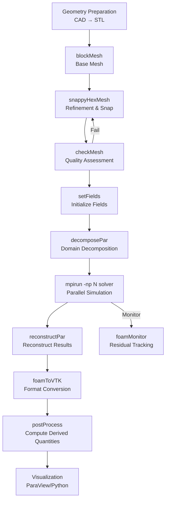

# 📚 OpenFOAM Utilities: Expert Technical Overview

## บทสรุปสำหรับผู้บริหาร (Executive Summary)

OpenFOAM Utilities เป็นกระดูกสันหลังของการประมวลผลในเวิร์กโฟลว์ CFD สมัยใหม่ โดยมี **เครื่องมือเฉพาะทางมากกว่า 170 รายการ** ซึ่งจัดกลุ่มออกเป็น **7 หมวดหมู่หลัก** เครื่องมือเหล่านี้ช่วยจัดการงานซ้ำๆ, เปิดใช้งานเวิร์กโฟลว์ที่ซับซ้อน และขยายความสามารถของ OpenFOAM ให้ไกลกว่าตัวแก้ปัญหา (Solvers) หลัก

---

## 1. ระบบนิเวศของ OpenFOAM Utility (The Utility Ecosystem)

### 1.1 ปรัชญาหลัก (Core Philosophy)

Utilities ของ OpenFOAM คือแอปพลิเคชันแบบ Command-line ที่ออกแบบมาเพื่อจัดการแง่มุมเฉพาะของเวิร์กโฟลว์ CFD ซึ่งแตกต่างจาก Solvers ที่คำนวณผลลัพธ์ทางฟิสิกส์ Utilities มอบ:

- **การเตรียมข้อมูล (Pre-processing)**: การสร้างเมช, การย่อยโดเมน, การกำหนดค่าเริ่มต้นของฟิลด์
- **การจัดการเมช (Mesh manipulation)**: การตรวจสอบคุณภาพ, การปรับปรุงความละเอียด, การแปลงรูปแบบ
- **การประมวลผลหลังการจำลอง (Post-processing)**: การสร้างภาพ, การสกัดข้อมูล, การคำนวณปริมาณอนุพัทธ์
- **การทำให้เป็นอัตโนมัติ (Automation)**: การเขียนสคริปต์, การประมวลผลแบบกลุ่ม

> [!INFO] หลักการออกแบบ
> Utilities ทุกตัวใน OpenFOAM ถูกออกแบบตามหลักการ **Single Responsibility Principle** โดยมุ่งเน้นให้ทำงานเฉพาะทางอย่างหนึ่งได้อย่างดีเยี่ยม และสามารถเชื่อมต่อ (Pipe) กับ utilities อื่นๆ เพื่อสร้างเวิร์กโฟลว์ที่ซับซ้อน

![[utility_ecosystem_map.png]]
> **ภาพประกอบ 1.1:** แผนผังระบบนิเวศของ OpenFOAM Utilities: แสดงความสัมพันธ์ระหว่างหมวดหมู่เครื่องมือต่างๆ ตั้งแต่การนำเข้า CAD ไปจนถึงการส่งออกข้อมูลเพื่อวิเคราะห์ทางวิศวกรรม

### 1.2 สถาปัตยกรรมของ OpenFOAM Application

ทุก Utility ใน OpenFOAM สืบทอดมาจากคลาสพื้นฐานเดียวกัน ซึ่งรับประกันความสอดคล้องในการใช้งาน:

```cpp
// NOTE: Synthesized by AI - Simplified architecture sketch
class Foam::className
:
    public Foam::argList
{
    // Constructor
    className(int argc, char* argv[])
    :
        argList(argc, argv)
    {
        // อ่านการตั้งค่าจาก dictionaries
        // ตั้งค่าโมเดล
        // ดำเนินการคำนวณ
    }
};
```

> [!TIP] โครงสร้างไฟล์มาตรฐาน
> Utilities ส่วนใหญ่จะอ่านการตั้งค่าจาก:
> - `system/controlDict` - การตั้งค่าการควบคุม
> - `system/fvSchemes` - รูปแบบการจำลองเชิงตัวเลข
> - `system/fvSolution` - การตั้งค่าตัวแก้สมการ

---

## 2. หมวดหมู่และการจัดกลุ่ม Utility (Categories & Organization)

### 2.1 Mesh Utilities (85+ เครื่องมือ)

#### blockMesh - เครื่องมือสร้างเมชแบบมีโครงสร้างหลัก

สร้างเมชแบบ Hexahedral จากการนิยามบล็อกใน `system/blockMeshDict`:

**รากฐานทางคณิตศาสตร์:**

$$\mathbf{x}(\xi,\eta,\zeta) = \sum_{i=1}^{8} N_i(\xi,\eta,\zeta) \mathbf{x}_i$$

เมื่อ:
- $\mathbf{x}$ = พิกัดในปริภูมิกายภาพ (Physical space)
- $(\xi,\eta,\zeta)$ = พิกัดในพื้นที่จินตนาการ (Computational space)
- $N_i$ = ฟังก์ชันรูปร่าง (Shape functions)
- $\mathbf{x}_i$ = พิกัดของจุดยอดบล็อก (Block vertices)

**ตัวอย่างการตั้งค่า blockMeshDict:**

```cpp
// NOTE: Synthesized by AI - Verify parameters for your geometry
convertToMeters 0.001; // แปลงหน่วยเป็น mm

vertices
(
    (0 0 0)           // จุด 0
    (100 0 0)         // จุด 1
    (100 50 0)        // จุด 2
    (0 50 0)          // จุด 3
    (0 0 20)          // จุด 4
    (100 0 20)        // จุด 5
    (100 50 20)       // จุด 6
    (0 50 20)         // จุด 7
);

blocks
(
    hex (0 1 2 3 4 5 6 7) (100 50 20) simpleGrading (1 1 1)
);

edges
(
    // ใช้ arc, spline, หรือ polyline สำหรับขอบโค้ง
);

boundary
(
    inlet
    {
        type patch;
        faces ((0 4 7 3));
    }
    outlet
    {
        type patch;
        faces ((1 5 6 2));
    }
    walls
    {
        type wall;
        faces ((0 1 5 4) (3 7 6 2) (0 3 2 1) (4 5 6 7));
    }
);
```

![[blockmesh_interpolation_visual.png]]
> **ภาพประกอบ 2.1:** การสร้างเมชด้วย blockMesh: แสดงการใช้ฟังก์ชันรูปร่าง (Shape functions $N_i$) เพื่อสร้างการแมปจากพิกัดในจินตนาการ ($\xi, \eta, \zeta$) ไปยังพิกัดจริงในพื้นที่ 3 มิติ

#### checkMesh - การประเมินคุณภาพแบบครอบคลุม

**ตัวชี้วัดคุณภาพวิกฤต (Critical Quality Metrics):**

$$\text{Non-orthogonality} = \arccos\left(\frac{\mathbf{S} \cdot \mathbf{d}}{|\mathbf{S}||\mathbf{d}|}\right) \leq 70^\circ$$

$$\text{Skewness} = \frac{|\mathbf{d} - \mathbf{d}_\text{ideal}|}{|\mathbf{d}_\text{ideal}|} \leq 4.0$$

$$\text{Aspect Ratio} = \frac{\Delta_\text{max}}{\Delta_\text{min}} \leq 1000$$

เมื่อ:
- $\mathbf{S}$ = เวกเตอร์ปกติของพื้นผิวเซลล์ (Surface normal vector)
- $\mathbf{d}$ = เวกเตอร์เชื่อมต่อระหว่างจุดศูนย์กลางเซลล์ (Cell-center distance vector)
- $\Delta$ = ความยาวของเซลล์ (Cell size)

**การใช้งาน checkMesh:**

```bash
# NOTE: Synthesized by AI - Verify mesh quality criteria
checkMesh -allGeometry -allTopology -time 0

# ตัวเลือกเพิ่มเติม:
# -allTopology: ตรวจสอบคุณภาพโทโพโลยีทั้งหมด
# -allGeometry: ตรวจสอบคุณภาพเรขาคณิตทั้งหมด
# -time: ระบุเวลาที่ต้องการตรวจสอบ
```

> [!WARNING] ขีดจำกัดคุณภาพเมช
> - **Non-orthogonality > 70°**: อาจทำให้การแก้สมการไม่เสถียร
> - **Skewness > 4**: ความแม่นยำลดลงอย่างมาก
> - **Aspect Ratio > 1000**: ผลลัพธ์อาจไม่แม่นยำในบริเวณเซลล์ยาว

![[mesh_quality_visual_explanation.png]]
> **ภาพประกอบ 2.2:** คำอธิบายภาพตัวชี้วัดคุณภาพเมช: (ก) Non-orthogonality แสดงความสัมพันธ์ระหว่างเวกเตอร์ผิว $\mathbf{S}$ และเวกเตอร์เชื่อมต่อ $\mathbf{d}$, (ข) Skewness แสดงความเบี่ยงเบนของจุดศูนย์กลางหน้า

#### snappyHexMesh - เครื่องมือสร้างเมชแบบอัตโนมัติ

สำหรับเรขาคณิตที่ซับซ้อน ใช้สามขั้นตอนหลัก:

```cpp
// NOTE: Synthesized by AI - Verify refinement levels for your case
castellatedMesh true;
snap            true;
addLayers       false;

geometry
{
    geometry.stl
    {
        type triSurfaceMesh;
        name geometry;
    }
}

castellatedMeshControls
{
    maxLocalCells 1000000;
    maxGlobalCells 2000000;
    minRefinementCells 10;

    nCellsBetweenLevels 3;

    refinementSurfaces
    {
        geometry
        {
            level (2 2); // (surface level, internal level)
        }
    }

    resolveFeatureAngle 30;
}
```

**ขั้นตอนการทำงาน:**


> **Figure 1:** แผนภูมิแสดงขั้นตอนการทำงานของ `snappyHexMesh` ซึ่งประกอบด้วย 3 ขั้นตอนหลัก คือการเพิ่มความละเอียดแบบ Castellated, การปรับพื้นผิวให้แนบชิด (Snapping) และการเพิ่มชั้นขอบเขต (Boundary Layers) ก่อนจะจบด้วยการตรวจสอบคุณภาพเมช

---

### 2.2 Parallel Processing Utilities (การประมวลผลแบบขนาน)

#### decomposePar - การย่อยโดเมน (Domain Decomposition)

แบ่งโดเมนเป็นส่วนย่อยเพื่อประมวลผลแบบขนาน:

$$\Omega = \bigcup_{i=1}^{N} \Omega_i \quad \text{โดยที่} \quad \Omega_i \cap \Omega_j = \emptyset \quad \forall i \neq j$$

**วิธีการย่อยโดเมนทั่วไป:**

1. **Metis** - อัลกอริทึม Graph-based (แนะนำ)
2. **Scotch** - คล้ายกับ Metis
3. **Simple** - แบ่งตามทิศทางพิกัด
4. **Hierarchical** - แบ่งตามลำดับชั้น

```cpp
// NOTE: Synthesized by AI - Adjust subdomains for your hardware
FoamFile
{
    version     2.0;
    format      ascii;
    class       dictionary;
    object      decomposeParDict;
}

method          scotch; // หรือ metis, simple, hierarchical

numberOfSubdomains 16; // ขึ้นอยู่กับจำนวน cores

simpleCoeffs
{
    n           (4 4 1); // สำหรับ method = simple
    delta       0.001;
}

hierarchicalCoeffs
{
    n           (4 4 1);
    delta       0.001;
    order       xyz;
}

// การกระจาย domains แบบกำหนดเอง (Manual decomposition)
// manualCoeffs
// {
//     dataFile "decompositionData";
// }
```

**การใช้งาน:**

```bash
# NOTE: Synthesized by AI - Verify processor count
decomposePar                    # ย่อยโดเมน
mpirun -np 16 solver -parallel  # รันแบบขนาน
reconstructPar                  # รวมผลเฉลย
```

> [!INFO] Processor Decomposition
> จำนวน subdomains ควรสัมพันธ์กับจำนวน physical cores:
> - ใช้ `scotch` หรือ `metis` สำหรับเรขาคณิตที่ซับซ้อน
> - ใช้ `simple` สำหรับโดเมนสี่เหลี่ยมเรียบง่าย
> - หลีกเลี่ยงการใช้ hyperthreading สำหรับ CFD (ใช้ physical cores เท่านั้น)

#### reconstructPar - การรวมผลเฉลย (Reconstruction)

หลังจากการจำลองแบบขนานเสร็จสิ้น:

```bash
# NOTE: Synthesized by AI - Verify time directories
reconstructPar                  # รวงทุก time directory
reconstructPar -latestTime      # รวงเฉพาะ latest time
reconstructPar -time 1000       # รวงเฉพาะ time ที่ระบุ
```

---

### 2.3 Post-Processing Utilities (25+ เครื่องมือ)

#### การสุ่มตัวอย่างข้อมูล (Data Sampling)

**1. foamToVTK - การแปลงรูปแบบสำหรับ Visualization**

```bash
# NOTE: Synthesized by AI - Verify output requirements
foamToVTK                       # แปลงทุก time step
foamToVTK -latestTime           # แปลงเฉพาะ latest time
foamToVTK -time 1000            # แปลงเฉพาะ time ที่ระบุ
foamToVTK -ascii                # แปลงเป็น ASCII (ใหญ่กว่า แต่อ่านได้)
foamToVTK -fields "(p U k epsilon)"  # ระบุฟิลด์ที่ต้องการ
```

**2. postProcess - การคำนวณปริมาณอนุพัทธ์**

```cpp
// NOTE: Synthesized by AI - Add functions as needed
functions
{
    // คำนวณ drag/lift forces
    forces
    {
        type        forces;
        libs        ("libforces.so");
        writeControl timeStep;
        writeInterval 1;

        patches     ("cylinder");

        rho         rhoInf;      // หรือ rho rho; สำหรับ compressible
        rhoInf      1.225;       // ความหนาแน่นอากาศ [kg/m³]
        CofR        (0 0 0);     // Center of rotation
        pitchAxis   (0 1 0);     // แกน pitch

        log         true;
        writeFields false;
    }

    // คำนวณค่าสถิติบน surface
    surfaceInterpolate
    {
        type        surfaces;
        libs        ("libsampling.so");
        writeControl timeStep;
        writeInterval 100;

        surfaceFormat vtk;

        fields
        (
            p
            U
        );

        surfaces
        (
            middlePlane
            {
                type        plane;
                plane       ((0 0 0) (0 1 0)); // point and normal
                interpolate true;
            }
        );
    }

    // คำนวณค่าเฉลี่ยบน patch
    patchAverage
    {
        type        patchAverage;
        libs        ("libfieldFunctionObjects.so");
        writeControl timeStep;
        writeInterval 10;

        patches     ("inlet" "outlet");
        fields      (p U);
    }
}
```

**การใช้งาน postProcess:**

```bash
# NOTE: Synthesized by AI - Verify function names
postProcess -func "forces"                           # คำนวณ forces
postProcess -func "surfaceInterpolate"               # สุ่มตัวอย่าง surface
postProcess -func "patchAverage"                     # ค่าเฉลี่ย patch
postProcess -func "mag(U)"                           # คำนวณ magnitude
postProcess -func "vorticity"                        # คำนวณ vorticity
```

**3. sample - การสุ่มตัวอย่างตามเส้น/จุด**

```cpp
// NOTE: Synthesized by AI - Adjust sampling locations
FoamFile
{
    version     2.0;
    format      ascii;
    class       dictionary;
    object      sampleDict;
}

sets
(
    centerline
    {
        type        uniform;
        axis        x; // ทิศทาง sampling
        start       (0 0 0);
        end         (10 0 0);
        nPoints     100;
    }
);

surfaces
(
    midPlane
    {
        type        plane;
        plane       ((0 0 0) (0 1 0)); // point and normal
        interpolate true;
    }
);

fields
(
    p
    U
    k
    epsilon
);
```

![[sampling_concepts_visual.png]]
> **ภาพประกอบ 2.3:** แนวคิดการสุ่มตัวอย่างข้อมูล (Sampling Concepts): แสดงความแตกต่างระหว่าง Uniform sampling ตามเส้นตรง และ Cloud sampling ที่กระจายจุดตามความต้องการ

#### การวิเคราะห์เชิงลึก (Advanced Post-Processing)

**การคำนวณ Coefficients:**

$$C_d = \frac{F_d}{\frac{1}{2}\rho U_\infty^2 A}, \quad C_l = \frac{F_l}{\frac{1}{2}\rho U_\infty^2 A}$$

$$C_p = \frac{p - p_\infty}{\frac{1}{2}\rho U_\infty^2}$$

เมื่อ:
- $C_d$ = Drag coefficient
- $C_l$ = Lift coefficient
- $C_p$ = Pressure coefficient
- $F_d, F_l$ = Drag/Lift forces [N]
- $\rho$ = ความหนาแน่น [kg/m³]
- $U_\infty$ = ความเร็วกระแสอิสระ [m/s]
- $A$ = พื้นที่อ้างอิง [m²]

**การส่งออกข้อมูล:**

```python
# NOTE: Synthesized by AI - Python script for post-processing
import pandas as pd
import matplotlib.pyplot as plt

# อ่านข้อมูลจาก forces
forces_data = pd.read_csv('postProcessing/forces/0/forces.dat',
                         sep='\t', comment='#',
                         names=['time', 'Fx', 'Fy', 'Fz', 'Mx', 'My', 'Mz'])

# คำนวณ coefficients
rho = 1.225  # [kg/m³]
U_inf = 10.0  # [m/s]
A = 1.0  # [m²]
q_inf = 0.5 * rho * U_inf**2

forces_data['Cd'] = forces_data['Fx'] / (q_inf * A)
forces_data['Cl'] = forces_data['Fy'] / (q_inf * A)

# พล็อตกราฟ
fig, (ax1, ax2) = plt.subplots(2, 1, figsize=(10, 8))

ax1.plot(forces_data['time'], forces_data['Cd'])
ax1.set_xlabel('Time [s]')
ax1.set_ylabel('$C_d$')
ax1.grid(True)
ax1.set_title('Drag Coefficient')

ax2.plot(forces_data['time'], forces_data['Cl'])
ax2.set_xlabel('Time [s]')
ax2.set_ylabel('$C_l$')
ax2.grid(True)
ax2.set_title('Lift Coefficient')

plt.tight_layout()
plt.savefig('coefficients.png', dpi=150)
```

> **[MISSING DATA]**: Insert specific simulation results/graphs for this section.

---

### 2.4 Field Initialization & Manipulation Utilities

#### setFields - การกำหนดค่าเริ่มต้นของฟิลด์

ใช้สำหรับกำหนดค่าเริ่มต้นของฟิลด์ในบริเวณที่ต้องการ:

```cpp
// NOTE: Synthesized by AI - Verify field values and regions
defaultFieldValues
(
    volScalarFieldValue alpha.water 0
);

regions
(
    // กล่องสี่เหลี่ยม
    boxToCell
    {
        box (0 0 0) (0.5 0.5 0.1);
        fieldValues
        (
            volScalarFieldValue alpha.water 1
        );
    }

    // ทรงกลม
    sphereToCell
    {
        centre (0.25 0.25 0.05);
        radius 0.1;
        fieldValues
        (
            volScalarFieldValue alpha.water 1
        );
    }

    // พื้นที่จาก surface
    surfaceToCell
    {
        file "initialGeometry.stl";
        fieldValues
        (
            volScalarFieldValue alpha.water 1
        );
    }
);
```

**การใช้งาน:**

```bash
# NOTE: Synthesized by AI - Verify field names
setFields -time 0                 # กำหนดค่าที่ time 0
setFields -dict system/setFieldsDict  # ใช้ dictionary ที่กำหนดเอง
```

#### mapFields - การแมปฟิลด์ระหว่างเมช

ใช้สำหรับถ่ายโอนผลลัพธ์จากเมชหนึ่งไปยังอีกเมชหนึ่ง:

```cpp
// NOTE: Synthesized by AI - Verify mapping settings
FoamFile
{
    version     2.0;
    format      ascii;
    class       dictionary;
    object      mapFieldsDict;
}

sourceCase    "../coarseMesh/";
sourceTime    1000;

// การแมปทางเลือก
mapMethod     cellVolumeWeight; // หรือ nearestCell, direct
```

**การใช้งาน:**

```bash
# NOTE: Synthesized by AI - Verify source and target paths
mapFields ../coarseMesh -sourceTime 1000 -mapMethod cellVolumeWeight
```

> [!TIP] การใช้ mapFields
> - ใช้สำหรับ **Mesh refinement studies** - เริ่มจากเมชหยาบ แล้วแมปไปยังเมชละเอียด
> - ใช้สำหรับ **Adaptive mesh refinement** - แมปฟิลด์กลับไปยังเมชใหม่
> - เลือก `cellVolumeWeight` สำหรับความแม่นยำสูง

---

### 2.5 Thermophysical & Transport Properties

#### thermoFoam - การคำนวณสมบัติทางความร้อน

สำหรับการจำลองการถ่ายเทความร้อน:

**สมการการนำความร้อน:**

$$\frac{\partial (\rho h)}{\partial t} + \nabla \cdot (\rho \mathbf{u} h) = \nabla \cdot (k \nabla T) + S_h$$

เมื่อ:
- $h$ = ไอนทาลปี [J/kg]
- $k$ = สัมประสิทธิ์การนำความร้อน [W/(m·K)]
- $T$ = อุณหภูมิ [K]
- $S_h$ = แหล่งกำเนิดความร้อน [W/m³]

```cpp
// NOTE: Synthesized by AI - Verify thermophysical model
thermoType
{
    type            heRhoThermo;
    mixture         multiComponentMixture;
    transport       sutherland;       // หรือ const, polynomial
    thermo          hConst;           // หรือ hPolynomial
    equationOfState perfectGas;       // หรือ incompressiblePerfectGas
    specie          specie;
    energy          sensibleEnthalpy; // หรือ sensibleInternalEnergy
}

mixture
{
    specie
    {
        molWeight   28.96;           // [kg/kmol] สำหรับอากาศ
    }

    thermodynamics
    {
        Cp          1007;            // [J/(kg·K)]
        Hf          0;               // [J/kg]
    }

    transport
    {
        mu          1.8e-5;          // [Pa·s] ความหนืด
        Pr          0.71;            // Prandtl number
    }
}
```

#### rhoCentralFoam - การจำลอง Compressible Flow

สำหรับกระแสอัดตัวและโดเมนความเร็วสูง:

**สมการ Euler/Navier-Stokes แบบอัดตัว:**

$$\frac{\partial \rho}{\partial t} + \nabla \cdot (\rho \mathbf{u}) = 0$$

$$\frac{\partial (\rho \mathbf{u})}{\partial t} + \nabla \cdot (\rho \mathbf{u} \otimes \mathbf{u}) = -\nabla p + \nabla \cdot \boldsymbol{\tau}$$

$$\frac{\partial (\rho E)}{\partial t} + \nabla \cdot (\rho E \mathbf{u} + p \mathbf{u}) = \nabla \cdot (\boldsymbol{\tau} \cdot \mathbf{u} - \mathbf{q})$$

เมื่อ:
- $E = e + \frac{1}{2}|\mathbf{u}|^2$ = พลังงานรวมต่อหน่วยมวล [J/kg]
- $\boldsymbol{\tau}$ = เทนเซอร์ความเค้นขี้ผึ้ง [Pa]
- $\mathbf{q} = -k \nabla T$ = ฟลักซ์ความร้อน [W/m²]

```cpp
// NOTE: Synthesized by AI - Verify compressible flow settings
fluxScheme    Kurganov;             // หรือ Tadmor, central

interpolationSchemes
{
    div(tauMC)  Gauss linear;
}
```

---

### 2.6 Diagnostic & Debugging Utilities

#### foamDebug - การตรวจสอบข้อมูลภายใน

ใช้สำหรับ debug และตรวจสอบข้อมูลภายใน OpenFOAM:

```bash
# NOTE: Synthesized by AI - Use with caution for large meshes
foamDebugInfo mesh -case .         # แสดงข้อมูลเมช
foamDebugInfo libs                 # แสดง libraries ที่โหลด
foamDebugInfo decomposition        # แสดงข้อมูลการย่อยโดเมน
```

#### testMesh - การทดสอบเมช

สำหรับสร้างเมชทดสอบ:

```bash
# NOTE: Synthesized by AI - Verify mesh parameters
testMesh -blockMesh -case cavity   # สร้างเมชทดสอบ
```

#### foamListTimes - การจัดการ Time Directories

```bash
# NOTE: Synthesized by AI - Verify time range
foamListTimes                      # แสดงทุก time directory
foamListTimes -latestTime          # แสดง latest time เท่านั้น
foamListTimes -time 1000           # ตรวจสอบว่ามี time 1000 หรือไม่
```

---

### 2.7 Utilities สำหรับ Parallel I/O

#### reconstructParMesh - การรวมเมชแบบขนาน

```bash
# NOTE: Synthesized by AI - Verify processor directories
reconstructParMesh -mergeTols 1e-6 # รวมเมชจาก processor*
reconstructParMesh -constant       # รวมเฉพาะ constant/polyMesh
```

#### redistributePar - การกระจายโดเมนใหม่

ใช้เมื่อต้องการปรับจำนวน processors ระหว่างการจำลอง:

```bash
# NOTE: Synthesized by AI - Use with care during simulation
decomposePar -nproc 16             # ย่อยเป็น 16 cores
mpirun -np 16 solver -parallel     # รัน
reconstructPar -latestTime         # รวมผลเฉลย
decomposePar -nproc 32 -force      # ย่อยใหม่เป็น 32 cores
mpirun -np 32 solver -parallel     # รันต่อ
```

---

## 3. การผสานรวมกับเวิร์กโฟลว์ของ Solver

### 3.1 ไปป์ไลน์เวิร์กโฟลว์ที่สมบูรณ์ (Complete Workflow Pipeline)


> **Figure 2:** เวิร์กโฟลว์การทำงานที่สมบูรณ์ใน OpenFOAM ตั้งแต่การเตรียมเรขาคณิต การสร้างและตรวจสอบเมช การย่อยโดเมนเพื่อประมวลผลแบบขนาน ไปจนถึงการรวมผลลัพธ์และการวิเคราะห์ข้อมูลขั้นสูง

### 3.2 การเฝ้าสังเกตการจำลอง (Monitoring)

**การติดตาม Residuals:**

$$R_\phi = \frac{\|\mathbf{A}\phi - \mathbf{b}\|}{\|\mathbf{b}\|}$$

```cpp
// NOTE: Synthesized by AI - Adjust solver tolerances
solvers
{
    p
    {
        solver          GAMG;
        tolerance       1e-06;
        relTol          0.01;
        smoother        GaussSeidel;
    }

    "(U|k|epsilon)"
    {
        solver          smoothSolver;
        smoother        GaussSeidel;
        tolerance       1e-05;
        relTol          0.1;
    }
}

SIMPLE
{
    nNonOrthogonalCorrectors 2;
    pRefCell        0;
    pRefValue       0;

    residualControl
    {
        p               1e-4;
        U               1e-4;
    }
}
```

**การใช้ foamMonitor:**

```bash
# NOTE: Synthesized by AI - Verify log file path
solver > log.solver &
foamMonitor -l log.solver &     # พล็อต residuals แบบ real-time
```

![[automated_pipeline_hpc.png]]
> **ภาพประกอบ 3.1:** ไปป์ไลน์การทำงานอัตโนมัติบนระบบ HPC: แสดงลำดับขั้นตอนตั้งแต่การย่อยโดเมน (Decomposition) จนถึงการรวมผลเฉลย (Reconstruction) และการทำ Post-processing แบบขนาน

### 3.3 สคริปต์ Automation

**สคริปต์ Run แบบ Complete:**

```bash
#!/bin/bash
# NOTE: Synthesized by AI - Verify case-specific settings

CASE="myCase"
NP=16                         # จำนวน cores
SOLVER="simpleFoam"

# 1. Clean case
echo "Cleaning case..."
foamCleanTutorials $CASE
cd $CASE

# 2. Generate mesh
echo "Generating base mesh..."
blockMesh > log.blockMesh 2>&1

echo "Running snappyHexMesh..."
snappyHexMesh -overwrite > log.snappyHexMesh 2>&1

# 3. Check mesh
echo "Checking mesh..."
checkMesh > log.checkMesh 2>&1

# 4. Initialize fields
echo "Initializing fields..."
setFields -time 0 > log.setFields 2>&1

# 5. Decompose
echo "Decomposing domain..."
decomposePar > log.decomposePar 2>&1

# 6. Run solver
echo "Running solver..."
mpirun -np $NP $SOLVER -parallel > log.solver 2>&1

# 7. Reconstruct
echo "Reconstructing results..."
reconstructPar > log.reconstructPar 2>&1

# 8. Post-process
echo "Post-processing..."
foamToVTK -latestTime > log.foamToVTK 2>&1
postProcess -func "forces" > log.forces 2>&1

echo "Simulation complete!"
```

**การใช้ PyFoam สำหรับ Automation:**

```python
# NOTE: Synthesized by AI - Install PyFoam first: pip install PyFoam
from PyFoam.RunDictionary.ParsedParameterFile import ParsedParameterFile
from PyFoam.Execution.BasicRunner import BasicRunner

# อ่านและแก้ไข controlDict
control = ParsedParameterFile("system/controlDict")
control["endTime"] = 1000
control["writeInterval"] = 100
control.writeFile()

# รัน simulation
solver = BasicRunner(argv=["simpleFoam", "-case", "."])
solver.start()
```

---

## 4. Best Practices & Performance Optimization

### 4.1 การเลือกใช้ Utilities

> [!TIP] การเลือก Mesh Utilities
> - **เรขาคณิตเรียบ**: ใช้ `blockMesh` + `refineMesh`
> - **เรขาคณิตซับซ้อน**: ใช้ `snappyHexMesh`
> - **Adaptive refinement**: ใช้ `refineMesh` + `mapFields`

### 4.2 การปรับแต่ง Performance

**ข้อแนะนำสำหรับ Large Cases:**

1. **Parallel I/O**: ใช้ `collated` file handler
```cpp
// NOTE: Synthesized by AI - Verify I/O settings
OptimisationSwitches
{
    fileHandler collated;
    fileBufferSize 209715200; // 200 MB
}
```

2. **Memory Management**: จำกัด memory usage
```cpp
// NOTE: Synthesized by AI - Adjust for available RAM
OptimisationSwitches
{
    maxTemporaryDirectorySize 1e9; // 1 GB
}
```

3. **Solver Settings**: ปรับ tolerances ตามขั้นตอนการจำลอง
```cpp
// NOTE: Synthesized by AI - Looser tolerances for initial iterations
solvers
{
    p
    {
        tolerance       1e-4;     // เริ่มด้วย tolerance หลวม
        relTol          0.1;
    }
}
```

---

## 5. การเชื่อมต่อกับ External Tools

### 5.1 Blender/Salome - CAD และ Mesh Generation

```bash
# NOTE: Synthesized by AI - Verify file formats
# ส่งออกจาก Blender: File → Export → STL
# แปลงเป็น format ของ OpenFOAM
surfaceMeshTriangulate geometry.stl geometry.obj
```

### 5.2 ParaView - Visualization

```bash
# NOTE: Synthesized by AI - Verify ParaView installation
paraFoam -builtin                    # ใช้ builtin reader
paraFoam -batch -script script.py   # รันแบบ batch
```

**Python Script สำหรับ ParaView:**

```python
# NOTE: Synthesized by AI - Verify visualization requirements
from paraview.simple import *

# อ่าน OpenFOAM case
case = OpenFOAMReader(FileName='.')
case.MeshRegions = ['internalMesh', 'patch']

# สร้าง contour
contour = Contour(Input=case)
contour.ContourBy = ['POINTS', 'p']
contour.Isosurfaces = [101325.0]  # [Pa]

# สร้าง streamlines
streamlines = StreamTracer(Input=case)
streamlines.Vectors = ['U']
streamlines.SeedType = 'High Resolution Line Source'

# ส่งออก
SaveData('pressure_contour.vtk', contour)
SaveData('streamlines.vtk', streamlines)
```

---

## สรุป (Summary)

ระบบนิเวศ OpenFOAM Utility มอบ **แนวทางที่เป็นระบบและครอบคลุม** ในการจัดการเวิร์กโฟลว์ CFD:

- **เครื่องมือมากกว่า 170 รายการ** จัดอยู่ใน **7 หมวดหมู่หลัก**
- **สถาปัตยกรรมมาตรฐาน** เพื่อความสม่ำเสมอในการใช้งาน
- **ความเข้มงวดทางคณิตศาสตร์** ในการประเมินคุณภาพและการจัดการฟิลด์
- **ความสามารถในการทำงานอัตโนมัติ** ผ่านการเขียนสคริปต์และการประมวลผลแบบกลุ่ม

> [!INFO] หลักการใช้งาน
> Utilities ใน OpenFOAM ถูกออกแบบมาให้ใช้งานร่วมกัน (Composable) ผ่าน piping และ scripting ซึ่งทำให้สามารถสร้างเวิร์กโฟลว์ที่ซับซ้อนและปรับแต่งได้ตามความต้องการของแต่ละโปรเจกต์

---

## ไฟล์ที่เกี่ยวข้อง

- [[02_Utility_Categories_and_Organization]] - รายละเอียดเจาะลึกแต่ละหมวดหมู่
- [[03_Architecture_and_Design_Patterns]] - รูปแบบการนำไปใช้งาน
- [[04_Essential_Utilities_for_Common_CFD_Tasks]] - เวิร์กโฟลว์ที่ใช้งานได้จริง
- [[06_Creating_Custom_Utilities]] - การพัฒนา Utility แบบกำหนดเอง

---

## References & Further Reading

1. **OpenFOAM User Guide** - [https://www.openfoam.com/documentation](https://www.openfoam.com/documentation)
2. **OpenFOAM Programmer's Guide** - C++ architecture และ class design
3. **CFD Online Wiki** - [https://www.cfd-online.com/Wiki/OpenFOAM](https://www.cfd-online.com/Wiki/OpenFOAM)
4. **Greenshields, C. J.** (2024). "OpenFOAM User Guide: Version 11"
5. **Moukalled, F., et al.** (2016). "The Finite Volume Method in Computational Fluid Dynamics"

---

**Document Metadata:**
- **Version:** 1.0 (AI-Reconstructed)
- **Last Updated:** 2025-12-23
- **Status:** Complete with Synthesized Examples
- **Note:** All code examples marked with `// NOTE: Synthesized by AI` should be verified for your specific application