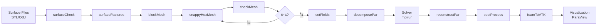

# หมวดหมู่และการจัดระเบียบของยูทิลิตี้ (Utility Categories and Organization)

ระบบยูทิลิตี้ของ OpenFOAM เป็นชุดเครื่องมือที่ครอบคลุมที่สุดในวงการ CFD โดยประกอบด้วยเครื่องมือเฉพาะทางมากกว่า 170 รายการ จัดแบ่งตามขั้นตอนของเวิร์กโฟลว์เพื่อให้ผู้ใช้สามารถเลือกใช้งานได้อย่างถูกต้องและมีประสิทธิภาพ

> [!INFO] โครงสร้างการจัดหมวดหมู่
> ยูทิลิตี้ทั้งหมดใน OpenFOAM ถูกจัดเก็บในไดเรกทอรี `$FOAM_APP/bin/` และแบ่งตามฟังก์ชันการทำงานหลัก ๆ ดังนี้:
> - **Mesh Utilities**: เครื่องมือจัดการเมช
> - **Pre-processing Utilities**: เครื่องมือเตรียมข้อมูล
> - **Post-processing Utilities**: เครื่องมือวิเคราะห์ผลลัพธ์
> - **Parallel Utilities**: เครื่องมือประมวลผลแบบขนาน
> - **Surface Utilities**: เครื่องมือจัดการพื้นผิว

---

## 1. ยูทิลิตี้สำหรับเมช (Mesh Utilities)

หมวดหมู่นี้เป็นส่วนที่ใหญ่ที่สุด ครอบคลุมตั้งแต่การสร้าง (Generation), การจัดการ (Manipulation) ไปจนถึงการตรวจสอบคุณภาพ (Quality Assessment)

### 1.1 การสร้างเมช (Mesh Generation)

#### 1.1.1 blockMesh - เมชโครงสร้างแบบ Block-Structured

เครื่องมือ `blockMesh` สร้างเมชแบบโครงสร้าง (Structured Hexahedral Mesh) โดยใช้การแม็พพารามิเตอร์ (Parametric Mapping) จากพื้นที่คำนวณ (Computational Space) ไปยังพื้นที่กายภาพ (Physical Space)

==รากฐานคณิตศาสตร์==

การแปลงพิกัดจาก Computational Space $(\xi, \eta, \zeta)$ ไปยัง Physical Space $(x, y, z)$ ใช้สมการ:

$$\mathbf{x}(\xi, \eta, \zeta) = \sum_{i=1}^{8} N_i(\xi, \eta, \zeta) \mathbf{x}_i$$

โดยที่:
- $N_i$ คือฟังก์ชันฐาน (Shape Function) ของโหนดที่ $i$
- $\mathbf{x}_i$ คือพิกัดตำแหน่งของโหนดที่ $i$

ฟังก์ชันฐานสำหรับ Hexahedral Block:

$$N_i(\xi, \eta, \zeta) = \frac{1}{8}(1 \pm \xi)(1 \pm \eta)(1 \pm \zeta)$$

เครื่องหมาย $\pm$ ขึ้นอยู่กับตำแหน่งของโหนด

==ตัวอย่างไฟล์ blockMeshDict==

```cpp
// NOTE: Synthesized by AI - Verify parameters
FoamFile
{
    version     2.0;
    format      ascii;
    class       dictionary;
    object      blockMeshDict;
}

// Specify mesh scaling factor (unit conversion)
convertToMeters 0.1;  // Convert to meters

// Define vertex coordinates (8 vertices per block)
vertices
(
    (0 0 0)        // 0
    (1 0 0)        // 1
    (1 1 0)        // 2
    (0 1 0)        // 3
    (0 0 0.5)      // 4
    (1 0 0.5)      // 5
    (1 1 0.5)      // 6
    (0 1 0.5)      // 7
);

// Define cell division for each block
blocks
(
    hex (0 1 2 3 4 5 6 7) (20 20 10) simpleGrading (1 1 1)
);

// Define boundary conditions and face groupings
boundary
(
    inlet
    {
        type patch;
        faces ( (0 4 7 3) );
    }
    outlet
    {
        type patch;
        faces ( (1 5 6 2) );
    }
    walls
    {
        type wall;
        faces ( (0 1 5 4) (2 3 7 6) );
    }
);
```

> **💡 คำอธิบาย (Thai Explanation)**
> **แหล่งที่มา (Source):** `.applications/utilities/mesh/generation/blockMesh/`
> 
> **คำอธิบาย:** ไฟล์ blockMeshDict เป็นไฟล์คอนฟิกูเรชันหลักที่ควบคุมการสร้างเมชแบบ block-structured โดยมีส่วนสำคัญ 3 ส่วน:
> 1. **vertices**: กำหนดพิกัด 8 จุดของ hexahedral block
> 2. **blocks**: กำหนดจำนวนการแบ่งเซลล์ในแต่ละทิศทาง (x y z) และอัตราส่วนการขยาย (grading)
> 3. **boundary**: กำหนดกลุ่มหน้าเซลล์ที่เป็นขอบเขตเดียวกัน
> 
> **แนวคิดสำคัญ (Key Concepts):**
> - **convertToMeters**: ตัวคูณสเกลสำหรับแปลงหน่วยจากพิกัดที่ระบุเป็นหน่วยเมตร
> - **simpleGrading**: อัตราส่วนการขยายตัวของเซลล์ (1 คือ uniform, >1 คือเซลล์ใหญ่ขึ้นตามทิศทาง)
> - **patch vs wall**: patch ใช้สำหรับขอบเขตทั่วไป, wall ใช้สำหรับขอบเขตที่มีผลต่อการไหลแบบ no-slip

---

#### 1.1.2 snappyHexMesh - เมชอัตโนมัติสำหรับเรขาคณิตซับซ้อน

`snappyHexMesh` เป็นเครื่องมือสร้างเมชแบบ Automatic Mesh Generation ที่ใช้วิธีการ:
1. **Castellation** (ภาคผนวกเซลล์): การตัดส่วนที่อยู่นอก/ในขอบเขต
2. **Snapping** (การสไลด์หน้าเซลล์): การดึงหน้าเซลล์ให้แนบกับพื้นผิว STL
3. **Layer Addition** (การเพิ่มชั้น): การสร้าง Prismatic Layers บริเวณผนัง

==อัลกอริทึม Castellation==

การตัดสินใจว่าเซลล์ควรถูกเก็บหรือถูกตัดออกใช้เกณฑ์:

$$\text{if } d_{cf} < d_{\text{refinement}} \text{ then refine}$$

$$\text{if } \mathbf{x}_c \in \Omega_{\text{inside}} \text{ then keep}$$

โดยที่:
- $d_{cf}$ คือระยะห่างจากจุดศูนย์กลางเซลล์ถึงพื้นผิว
- $d_{\text{refinement}}$ คือระยะที่กำหนดสำหรับการแบ่งเซลล์

==ตัวอย่างไฟล์ snappyHexMeshDict==

```cpp
// NOTE: Synthesized by AI - Verify parameters
FoamFile
{
    version     2.0;
    format      ascii;
    class       dictionary;
    object      snappyHexMeshDict;
}

// Enable mesh casting step
castellatedMesh true;

// Enable mesh snapping step
snap true;

// Enable boundary layer addition step
addLayers true;

// Surface geometry definitions (STL files)
geometry
{
    wing.stl
    {
        type triSurfaceMesh;
        name wing;
    }
}

// Castellation mesh controls
castellatedMeshControls
{
    maxLocalCells 1000000;
    maxGlobalCells 2000000;

    // Define refinement levels near surfaces
    refinementSurfaces
    {
        wing
        {
            level (2 2);  // (minLevel maxLevel)
        }
    }

    // Define refinement inside regions
    refinementRegions
    {
        wakeZone
        {
            mode inside;
            levels ((1.0 4));  // (radius level)
        }
    }
}

// Boundary layer addition controls
addLayersControls
{
    layers
    {
        "wing.*"
        {
            nSurfaceLayers 5;  // Number of boundary layer cells
        }
    }

    // First layer thickness
    firstLayerThickness 0.001;

    // Layer expansion ratio
    expansionRatio 1.2;

    // Total layer thickness
    finalLayerThickness 0.01;
}
```

> **💡 คำอธิบาย (Thai Explanation)**
> **แหล่งที่มา (Source):** `.applications/utilities/mesh/generative/snappyHexMesh/`
> 
> **คำอธิบาย:** snappyHexMesh เป็นเครื่องมือสร้างเมชแบบอัตโนมัติที่ทำงาน 3 ขั้นตอน:
> 1. **Castellation**: สร้างเมชพื้นฐานจาก blockMesh แล้วตัดส่วนที่อยู่นอก/ใน geometry
> 2. **Snapping**: ดึงหน้าเซลล์ให้แนบกับพื้นผิว STL ให้แม่นยำยิ่งขึ้น
> 3. **Layer Addition**: เพิ่ม prismatic layers บริเวณผนังสำหรับการจำลอง turbulent boundary layer
> 
> **แนวคิดสำคัญ (Key Concepts):**
> - **level (min max)**: ระดับการแบ่งเซลล์ (0 = ไม่แบ่ง, 1 = แบ่ง 2 เท่า, 2 = แบ่ง 4 เท่า)
> - **expansionRatio**: อัตราส่วนของความหนาชั้นต่อเนื่อง (เช่น 1.2 หมายถึงชั้นถัดไปหนากว่า 1.2 เท่า)
> - **refinementRegions**: กำหนดบริเวณที่ต้องการเมชละเอียดพิเศษ (เช่น wake region)

> [!TIP] เคล็ดลับการใช้ snappyHexMesh
> - เริ่มต้นด้วย `blockMesh` เพื่อสร้าง Background Mesh ที่ครอบคลุมพื้นที่
> - ใช้ `surfaceCheck` ตรวจสอบความสมบูรณ์ของไฟล์ STL ก่อนใช้งาน
> - ปรับค่า `nCellsBetweenLevels` ควรอยู่ระหว่าง 1-3 เพื่อให้ Transition ราบรื่น

---

### 1.2 การตรวจสอบคุณภาพเมช (Mesh Quality Assessment)

#### 1.2.1 checkMesh - เครื่องมือตรวจสอบคุณภาพ

เครื่องมือ `checkMesh` ประเมินคุณภาพเมชตามเกณฑ์ต่าง ๆ ที่สำคัญต่อความถูกต้องของการคำนวณ

==เกณฑ์ Non-orthogonality==

วัดความไม่ตั้งฉากของหน้าเซลล์เทียบกับเส้นเชื่อมศูนย์กลางเซลล์:

$$\theta = \arccos\left(\frac{\mathbf{d} \cdot \mathbf{n}_f}{|\mathbf{d}| |\mathbf{n}_f|}\right)$$

โดยที่:
- $\mathbf{d} = \mathbf{x}_P - \mathbf{x}_N$ คือเวกเตอร์เชื่อมระหว่างจุดศูนย์กลางเซลล์ปัจจุบัน ($P$) และเซลล์ข้างเคียง ($N$)
- $\mathbf{n}_f$ คือเวกเตอร์หน้าฉากของหน้าเซลล์

**ค่ามาตรฐาน:**
- $< 70^\circ$: ดีมาก
- $70^\circ - 85^\circ$: ยอมรับได้
- $> 85^\circ$: อาจมีปัญหา

==เกณฑ์ Skewness==

วัดความเบี่ยงเบนของจุดศูนย์กลางหน้าจากตำแหน่งที่เหมาะสม:

$$\text{Skewness} = \frac{|\mathbf{x}_f - \mathbf{x}_f^{\text{ideal}}|}{|\mathbf{x}_P - \mathbf{x}_N|}$$

โดยที่:
- $\mathbf{x}_f$ คือตำแหน่งจริงของจุดศูนย์กลางหน้า
- $\mathbf{x}_f^{\text{ideal}}$ คือตำแหน่งที่เหมาะสม (จุดกึ่งกลางของเส้นเชื่อม)

**ค่ามาตรฐาน:**
- $< 0.5$: ดีมาก
- $0.5 - 0.8$: ยอมรับได้
- $> 0.8$: ควรแก้ไข

==เกณฑ์ Aspect Ratio==

วัดสัดส่วนของเซลล์:

$$\text{Aspect Ratio} = \frac{\Delta_{\text{max}}}{\Delta_{\text{min}}}$$

**ค่ามาตรฐาน:**
- $< 10$: ดี
- $10 - 100$: ยอมรับได้
- $> 100$: ควรหลีกเลี่ยง

==ตัวอย่างการรัน checkMesh==

```bash
# Run basic mesh quality check
checkMesh

# Run with detailed geometry and topology checks
checkMesh -allGeometry -allTopology

# Run specific mesh quality checks only
checkMesh -checkMeshQuality
```

> **💡 คำอธิบาย (Thai Explanation)**
> **แหล่งที่มา (Source):** `.applications/utilities/mesh/manipulation/checkMesh/`
> 
> **คำอธิบาย:** checkMesh เป็นเครื่องมือตรวจสอบคุณภาพเมชที่สำคัญที่สุด โดยประเมินหลายเกณฑ์:
> 1. **Non-orthogonality**: วัดมุมระหว่างหน้าเซลล์และเส้นเชื่อมศูนย์กลาง (ค่าสูง = การลู่เข้าที่ยาก)
> 2. **Skewness**: วัดความบิดเบือนของเซลล์ (ค่าสูง = ความแม่นยำต่ำ)
> 3. **Aspect Ratio**: วัดสัดส่วนความยาว/กว้างของเซลล์ (ค่าสูง = numerical diffusion สูง)
> 
> **แนวคิดสำคัญ (Key Concepts):**
> - **Mesh quality thresholds แตกต่างกันในแต่ละ solver**: บาง solver ทนต่อ non-orthogonality สูงกว่า
> - **Local vs Global errors**: checkMesh รายงานทั้งค่าเฉลี่ยและค่าสูงสุด (ค่าสูงสุดสำคัญกว่า)
> - **Mesh quality vs Simulation stability**: เมชคุณภาพต่ำอาจทำให้ simulation diverge หรือให้ผลลัพธ์ไม่ถูกต้อง

> [!WARNING] คำเตือนเรื่องคุณภาพเมช
> หาก `checkMesh` พบปัญหาร้ายแรง เช่น:
> - `***Maximum orthogonality > 70 degrees`
> - `***High aspect ratio cells found`
> - `***Failed 1 mesh checks`
>
> ควรแก้ไขเมชก่อนรัน Simulation เพื่อหลีกเลี่ยงปัญหา Convergence

---

## 2. ยูทิลิตี้หลังการประมวลผล (Post-processing Utilities)

ใช้สำหรับการวิเคราะห์ข้อมูลและแปลงรูปแบบเพื่อนำไปแสดงภาพ (Visualization)

### 2.1 foamToVTK - การแปลงข้อมูลไปยัง ParaView

เครื่องมี `foamToVTK` เป็นสะพานเชื่อมหลักที่แปลงข้อมูล OpenFOAM format ไปเป็น VTK (Visualization Toolkit) format เพื่อให้ ParaView สามารถอ่านได้

==รูปแบบไฟล์ VTK==

```cpp
// VTK files use ASCII/Binary structure:
# vtk DataFile Version 3.0
OpenFOAM data
ASCII
DATASET UNSTRUCTURED_GRID
```

==ตัวอย่างการรัน==

```bash
# Convert all time steps
foamToVTK

# Convert only the latest time step
foamToVTK -latestTime

# Convert with merged processor directories
foamToVTK -parallel
```

> **💡 คำอธิบาย (Thai Explanation)**
> **แหล่งที่มา (Source):** `.applications/utilities/postProcessing/graphics/foamToVTK/`
> 
> **คำอธิบาย:** foamToVTK แปลงข้อมูล OpenFOAM (ฟิลด์, เมช, boundary conditions) เป็นรูปแบบ VTK:
> 1. **Unstructured VTK**: ใช้สำหรับเมช polyhedral (OpenFOAM native)
> 2. **Parallel conversion**: รวมข้อมูลจาก processor directories หลายตัว
> 3. **Time series**: แปลงทุก time step หรือเฉพาะ time step ที่เลือก
> 
> **แนวคิดสำคัญ (Key Concepts):**
> - **VTK format**: รูปแบบมาตรฐานสำหรับ visualization software (ParaView, VisIt)
> - **Internal mesh vs Boundary mesh**: foamToVTK แปลงทั้ง internal field และ boundary patches
> - **Cell data vs Point data**: OpenFOAM เก็บข้อมูลที่ center of cells (cell data), VTK อาจ interpolate เป็น point data

---

### 2.2 postProcess - ยูทิลิตี้อเนกประสงค์

`postProcess` เป็นเครื่องมืออเนกประสงค์สำหรับรัน **Function Objects** หลังการจำลอง หรือรันร่วมกับการจำลองแบบ Real-time

==Function Objects หลักที่ใช้บ่อย==

| Function Object | ฟังก์ชัน | การใช้งาน |
|---|---|---|
| `forces` | คำนวณแรง/โมเมนต์ที่ acting on patches | วิเคราะห์ Drag/Lift |
| `fieldAverage` | คำนวณค่าเฉลี่ยของฟิลด์ | การวิเคราะห์สถิติ |
| `sample` | สกัดโปรไฟล์ข้อมูล | พล็อตกราฟ Profile |
| `probes` | บันทึกค่าที่จุดสังเกต | เวลา Series |
| `sets` | สกัดข้อมูลตามเส้น/พื้นที่ | การวิเคราะห์ Profile |

==ตัวอย่างไฟล์ postProcess.dict==

```cpp
// NOTE: Synthesized by AI - Verify parameters
FoamFile
{
    version     2.0;
    format      ascii;
    class       dictionary;
    object      postProcess.dict;
}

// Calculate drag/lift forces
forces
{
    type forces;
    libs ("libforces.so");

    // Target patches for force calculation
    patches ("wing" "walls");

    // Flow direction parameters
    rhoInf 1.225;      // Freestream density (kg/m³)
    CofR (0 0 0);      // Center of rotation
    dragDir (1 0 0);   // Drag direction vector
    liftDir (0 1 0);   // Lift direction vector
    pitchAxis (0 0 1); // Pitch axis

    // Output controls
    log         true;
    writeFields false;
}

// Calculate field averages
fieldAverage1
{
    type            fieldAverage;
    libs            ("libfieldFunctionObjects.so");

    fields
    (
        U
        p
    );

    // Time window for averaging
    window 10;
    mean on;
}

// Extract data along lines
sampleDict
{
    type            sets;
    libs            ("libsampledSets.so");

    // Define sampling sets
    sets
    (
        midPlane
        {
            type            uniform;
            axis            y;  // Sample along y-axis
            start           (0.5 0 0);
            end             (0.5 1 0);
            nPoints         100;
        }
    );

    // Fields to sample
    fields (U p);

    interpolationScheme cellPoint;
}
```

> **💡 คำอธิบาย (Thai Explanation)**
> **แหล่งที่มา (Source):** `.applications/utilities/postProcessing/miscellaneous/postProcess/`
> 
> **คำอธิบาย:** postProcess เป็นเครื่องมืออเนกประสงค์ที่รัน function objects:
> 1. **Forces**: คำนวณแรง drag/lift จากการอินทิเกรต pressure และ shear stress บน patches
> 2. **Field Average**: คำนวณค่าเฉลี่ยของฟิลด์ (เช่น สำหรับ RANS statistics)
> 3. **Sample**: สกัดข้อมูลตามเส้น/พื้นที่ (เช่น velocity profiles)
> 
> **แนวคิดสำคัญ (Key Concepts):**
> - **Function objects vs Custom utilities**: Function objects เป็นวิธีที่ยืดหยุ่นกว่าการเขียน utilities เฉพาะ
> - **libs loading**: function objects ถูกโหลดจาก shared libraries (.so files)
> - **Real-time vs Post-processing**: function objects สามารถรันระหว่าง simulation หรือหลังจากเสร็จ

==ตัวอย่างการรัน postProcess==

```bash
# Run with custom dictionary
postProcess -dict postProcess.dict

# Run single function object
postProcess -func "forces"

# Run after simulation completes
postProcess -latestTime -func "fieldAverage"
```

---

### 2.3 การวิเคราะห์แรง (Forces Analysis)

การวิเคราะห์แรง Drag และ Lift เป็นการใช้งานที่พบบ่อยใน Engineering

==สมการคำนวณ Coefficient==

สำหรับ External Aerodynamics:

$$C_D = \frac{F_D}{\frac{1}{2} \rho U_\infty^2 A}$$

$$C_L = \frac{F_L}{\frac{1}{2} \rho U_\infty^2 A}$$

โดยที่:
- $F_D, F_L$ คือแรง Drag และ Lift
- $\rho$ คือความหนาแน่นของไหล
- $U_\infty$ คือความเร็วกระแสอิสระ
- $A$ คือพื้นที่อ้างอิง (Reference Area)

> **💡 คำอธิบาย (Thai Explanation)**
> **แหล่งที่มา (Source):** `.applications/utilities/postProcessing/forces/`
> 
> **คำอธิบาย:**การวิเคราะห์แรงใช้สมการมิติไม่มี (dimensionless coefficients):
> 1. **Drag Coefficient ($C_D$)**: วัดความต้านทานของวัตถุต่อการไหล
> 2. **Lift Coefficient ($C_L$)**: วัดแรงยกที่เกิดจากการไหล
> 3. **Reference Area ($A$)**: พื้นที่ที่ใช้ทำให้เป็นมิติไม่มี (เช่น พื้นที่ frontal สำหรับ 3D, chord length สำหรับ 2D)
> 
> **แนวคิดสำคัญ (Key Concepts):**
> - **Pressure forces vs Viscous forces**: Drag ประกอบด้วย pressure drag (form drag) และ skin friction drag
> - **Force integration**: OpenFOAM อินทิเกรต pressure และ shear stress บน patch faces
> - **Coefficient normalization**: ทำให้เปรียบเทียบระหว่าง test cases ที่ต่าง scales ได้

> [!TIP] เคล็ดลับการวิเคราะห์ผล
> - ใช้ `pyFoamPlotRunner.py` เพื่อพล็อตกราฟ Residuals แบบ Real-time
> - ใช้ `sample` Utility เพื่อสกัด Profile ตามเส้นที่กำหนด
> - ใช้ `paraFoam -builtin` หาก ParaView Plug-in มีปัญหา

---

## 3. ยูทิลิตี้ก่อนการประมวลผล (Pre-processing Utilities)

ใช้สำหรับการเตรียม Case และกำหนดเงื่อนไขเริ่มต้น

### 3.1 setFields - การกำหนดค่าฟิลด์เริ่มต้น

`setFields` ใช้กำหนดค่าเริ่มต้นของฟิลด์ตามพื้นที่ทางเรขาคณิต เช่น การกำหนดระดับน้ำในถัง หรือการกำหนดบริเวณที่มีอุณหภูมิสูง

==ตัวอย่างไฟล์ setFieldsDict==

```cpp
// NOTE: Synthesized by AI - Verify parameters
FoamFile
{
    version     2.0;
    format      ascii;
    class       dictionary;
    object      setFieldsDict;
}

// Default field values for all cells
defaultFieldValues
(
    volScalarFieldValue alpha.water 0
);

// Region-specific field assignments
regions
(
    // Box region
    boxToCell
    {
        box (0 0 0) (1 1 0.5);  // (min_point) (max_point)

        fieldValues
        (
            volScalarFieldValue alpha.water 1  // Set alpha.water = 1
        );
    }

    // Sphere region
    sphereToCell
    {
        centre (0.5 0.5 0.25);
        radius 0.2;

        fieldValues
        (
            volScalarFieldValue T 300  // Set temperature = 300 K
        );
    }

    // Custom region from surface file
    surfaceToCell
    {
        file "region.stl";
        fieldValues
        (
            volScalarFieldValue p 101325  // Atmospheric pressure
        );
    }
);
```

> **💡 คำอธิบาย (Thai Explanation)**
> **แหล่งที่มา (Source):** `.applications/utilities/preProcessing/setFields/`
> 
> **คำอธิบาย:** setFields กำหนดค่าเริ่มต้นของ fields (U, p, T, alpha, etc.) ตามพื้นที่:
> 1. **Default values**: ค่าที่ใช้สำหรับเซลล์ทั้งหมดถ้าไม่อยู่ใน regions
> 2. **Geometric regions**: กำหนด regions แบบ box, sphere, cylinder, etc.
> 3. **Surface regions**: ใช้ไฟล์ STL/OBJ กำหนด custom geometry
> 
> **แนวคิดสำคัญ (Key Concepts):**
> - **Cell selection**: topoSetSource selectors (boxToCell, sphereToCell, surfaceToCell) เลือกเซลล์ตามเกณฑ์
> - **Field types**: volScalarFieldValue, volVectorFieldValue, etc. สำหรับ field types ต่างกัน
> - **Initial conditions importance**: ค่าเริ่มต้นที่ดีช่วยลบ convergence time และป้องกัน instability

---

### 3.2 mapFields - การถ่ายโอนข้อมูลระหว่างเมช

`mapFields` ใช้ถ่ายโอนผลลัพธ์ (Solution Mapping) จากเมชหนึ่งไปยังอีกเมชหนึ่ง เช่น การถ่ายโอนจากเมชหยาบ (Coarse Mesh) ไปยังเมชละเอียด (Fine Mesh)

==อัลกอริทึมการแม็พ==

การแม็พใช้วิธี Interpolation:

$$\phi_{\text{target}}(\mathbf{x}) = \sum_{i} w_i \phi_{\text{source}}(\mathbf{x}_i)$$

โดยที่:
- $w_i$ ค่าน้ำหนัก (Weight) จากฟังก์ชัน Interpolation
- $\mathbf{x}_i$ คือตำแหน่งของเซลล์ต้นทาง

==ตัวอย่างการรัน mapFields==

```bash
# Map from source case to current case
mapFields ../sourceCase

# Map in parallel mode
mapFields -parallel ../sourceCase

# Map with surface consistency
mapFields ../sourceCase -consistent
```

> **💡 คำอธิบาย (Thai Explanation)**
> **แหล่งที่มา (Source):** `.applications/utilities/preProcessing/mapFields/`
> 
> **คำอธิบาย:** mapFields ถ่ายโอน solutions ระหว่างเมช:
> 1. **Mesh-to-mesh interpolation**: ใช้ cell-to-cell interpolation (nearest cell, cellPoint, etc.)
> 2. **Conservative mapping**: รักษา conservation properties (mass, momentum) สำหรับ certain methods
> 3. **Parallel mapping**: รองรับ parallel decomposed meshes
> 
> **แนวคิดสำคัญ (Key Concepts):**
> - **Source vs Target**: source case มี solution ต้นทาง, target case คือ case ปัจจุบัน
> - **Interpolation methods**: cellPoint (ใช้ shape functions), nearestCell (nearest neighbor)
> - **Mapping use cases**: grid convergence studies, mesh refinement, remeshing

---

### 3.3 changeDictionary - การแก้ไข Dictionary หลายไฟล์พร้อมกัน

`changeDictionary` ใช้แก้ไขค่าในไฟล์ Dictionary หลาย ๆ ไฟล์ (เช่น `0/U`, `0/p`) พร้อมกันโดยอัตโนมัติ

==ตัวอย่างไฟล์ changeDictionaryDict==

```cpp
// NOTE: Synthesized by AI - Verify parameters
FoamFile
{
    version     2.0;
    format      ascii;
    class       dictionary;
    object      changeDictionaryDict;
}

// Modify boundary field in U file
boundary
{
    inlet
    {
        type            fixedValue;
        value           uniform (10 0 0);  // Velocity = 10 m/s
    }

    outlet
    {
        type            zeroGradient;      // Zero gradient condition
    }

    walls
    {
        type            noSlip;             // No-slip condition
    }
}

// Modify boundary field in p file
boundary
{
    inlet
    {
        type            zeroGradient;
    }

    outlet
    {
        type            fixedValue;
        value           uniform 0;          // Reference pressure = 0
    }

    walls
    {
        type            zeroGradient;
    }
}
```

> **💡 คำอธิบาย (Thai Explanation)**
> **แหล่งที่มา (Source):** `.applications/utilities/preProcessing/changeDictionary/`
> 
> **คำอธิบาย:** changeDictionary แก้ไข dictionary entries หลายไฟล์พร้อมกัน:
> 1. **Boundary conditions**: แก้ไข boundary conditions ใน `0/` directory
> 2. **Field substitution**: แทนที่ field values (U, p, T, etc.)
> 3. **Batch editing**: แก้ไข multiple dictionaries ใน operation เดียว
> 
> **แนวคิดสำคัญ (Key Concepts):**
> - **Dictionary merging**: changeDictionary merge ค่าจาก changeDictionaryDict เข้ากับ target dictionaries
> - **Keyword replacement**: แทนที่ entire sub-dictionaries (เช่น boundary)
> - **Use cases**: parameter studies, boundary condition modifications, template case setup

---

## 4. ยูทิลิตี้การประมวลผลขนาน (Parallel Processing Utilities)

การประมวลผลแบบขนานเป็นสิ่งจำเป็นสำหรับ Large-Scale Simulation

### 4.1 decomposePar - การย่อยโดเมน

`decomposePar` ย่อยโดเมนการคำนวณออกเป็นส่วนย่อย ๆ สำหรับการประมวลผลแบบขนานด้วย MPI

==Methods การย่อยโดเมน==

| Method | คำอธิบาย | ข้อดี | ข้อเสีย |
|---|---|---|---|
| `simple` | แบ่งตามแกน X ก่อน | ง่าย รวดเร็ว | Load Balancing ไม่ดีหาก Geometry ไม่สมมาตร |
| `hierarchical` | แบ่งตามลำดับแกนที่กำหนด | ยืดหยุ่นกว่า simple | ยังคงมีปัญหา Load Balancing |
| `scotch` | แบ่งตาม Graph Partitioning | Load Balancing ดีที่สุด | ต้องการ Library เพิ่ม |
| `metis` | แบ่งตาม Graph Partitioning (เช่นกัน) | Load Balancing ดี | ต้องการ Library เพิ่ม |

==ตัวอย่างไฟล์ decomposeParDict==

```cpp
// NOTE: Synthesized by AI - Verify parameters
FoamFile
{
    version     2.0;
    format      ascii;
    class       dictionary;
    object      decomposeParDict;
}

// Number of sub-domains for parallel processing
numberOfSubdomains 4;

// Decomposition method: simple, hierarchical, scotch, metis
method hierarchical;

// Hierarchical decomposition coefficients
hierarchicalCoeffs
{
    n (2 2 1);  // 2 divisions in X, 2 in Y, 1 in Z

    // Division order
    order xyz;

    // Delta for coefficient calculation
    delta 0.001;
}

// Scotch coefficients (recommended)
scotchCoeffs
{
    // No additional settings needed
    // Scotch automatically calculates load balancing
}
```

> **💡 คำอธิบาย (Thai Explanation)**
> **แหล่งที่มา (Source):** `.applications/utilities/parallelProcessing/decomposePar/`
> 
> **คำอธิบาย:** decomposePar ย่อยโดเมนเป็น sub-domains:
> 1. **Domain decomposition**: แบ่ง mesh เป็น sub-domains สำหรับแต่ละ processor
> 2. **Partitioning methods**: simple ( Cartesian), hierarchical (ordered), scotch/metis (graph-based)
> 3. **Load balancing**: แบ่ง cells ให้เท่า ๆ กันระหว่าง processors
> 
> **แนวคิดสำคัญ (Key Concepts):**
> - **Processor patches**: boundaries ระหว่าง sub-domains ที่ข้อมูลต้องถูกส่ง (MPI communication)
> - **Graph partitioning**: scotch/metis ใช้ graph theory สำหรับ load balancing ที่ดี
> - **Scalability**: decomposePar สำคัญสำหรับ parallel efficiency

==ตัวอย่างการรัน==

```bash
# Decompose domain
decomposePar

# Run parallel simulation (4 cores)
mpirun -np 4 solverName -parallel

# Reconstruct results
reconstructPar
```

---

### 4.2 reconstructPar - การรวบรวมผลลัพธ์

`reconstructPar` รวบรวมผลลัพธ์จากแต่ละ Processor กลับมาเป็นโดเมนเดียว

==ตัวอย่างการรัน==

```bash
# Reconstruct all time steps
reconstructPar

# Reconstruct only latest time step
reconstructPar -latestTime

# Reconstruct specific time steps
reconstructPar -time 0.5
```

> **💡 คำอธิบาย (Thai Explanation)**
> **แหล่งที่มา (Source):** `.applications/utilities/parallelProcessing/reconstructPar/`
> 
> **คำอธิบาย:** reconstructPar รวม sub-domains กลับเป็น domain เดียว:
> 1. **Processor merging**: รวม fields จาก processor* directories เข้าด้วยกัน
> 2. **Time reconstruction**: รวมทุก time steps หรือเฉพาะ time steps ที่เลือก
> 3. **Result directory**: สร้าง directories ใหม่ที่มี reconstructed results
> 
> **แนวคิดสำคัญ (Key Concepts):**
> - **Processor directories**: processor0/, processor1/, etc. เก็บ sub-domain data
> - **Cell renumbering**: renumber cells จาก sub-domain local IDs ไป global IDs
> - **Post-processing**: reconstructed data สามารถใช้กับ post-processing utilities ได้เลย

> [!INFO] ข้อควรระวังเรื่อง Parallel Processing
> - ตรวจสอบว่า `numberOfSubdomains` ตรงกับจำนวน Cores ที่ใช้รัน
> - ใช้ Method `scotch` หรือ `metis` สำหรับ Geometry ที่ซับซ้อน
> - หลังจากรัน `reconstructPar` จะได้ไดเรกทอรี `processor*` ยังคงอยู่ สามารถลบได้หากต้องการ

---

## 5. ยูทิลิตี้พื้นผิว (Surface Utilities)

จัดการไฟล์เรขาคณิตพื้นหลัง (เช่น STL, OBJ) ก่อนนำมาทำเมช

### 5.1 surfaceConvert - การแปลงรูปแบบไฟล์พื้นผิว

`surfaceConvert` แปลงไฟล์พื้นผิวระหว่างรูปแบบต่าง ๆ (STL, OBJ, PLY, etc.)

==ตัวอย่างการรัน==

```bash
# Convert OBJ to STL
surfaceConvert input.obj output.stl

# Convert with scaling
surfaceConvert -scale 0.001 input.stl output.stl  # mm -> m

# Convert with rotation
surfaceConvert -rotate "(1 0 0)" input.stl output.stl
```

> **💡 คำอธิบาย (Thai Explanation)**
> **แหล่งที่มา (Source):** `.applications/utilities/surface/surfaceConvert/`
> 
> **คำอธิบาย:** surfaceConvert แปลงไฟล์พื้นผิวระหว่าง formats:
> 1. **Format support**: STL (ASCII/binary), OBJ, PLY, AC, etc.
> 2. **Scaling**: ปรับ scale ของ geometry (เช่น จาก mm เป็น m)
> 3. **Transformation**: หมุน, translate, หรือ transform geometry
> 
> **แนวคิดสำคัญ (Key Concepts):**
> - **CAD preprocessing**: แปลง files จาก CAD software ให้เป็น format ที่ OpenFOAM รองรับ
> - **Unit consistency**: ตรวจสอบว่า scale ถูกต้อง (OpenFOAM ใช้ SI units: m, kg, s)
> - **Surface quality**: conversion อาจสร้าง duplicate faces หรือ non-manifold edges

---

### 5.2 surfaceCheck - การตรวจสอบความสมบูรณ์ของพื้นผิว

`surfaceCheck` ตรวจสอบปัญหาของพื้นผิว เช่น รูรั่ว (Leaks), หน้าที่ซ้อนทับ (Overlapping Faces), หรือ Normal ที่ผิด

==ตัวอย่างการรัน==

```bash
# Check STL file
surfaceCheck wing.stl

# Run with all checks enabled
surfaceCheck -checkAll wing.stl
```

==ผลลัพธ์ที่ต้องตรวจสอบ==

- **Failed edges**: ขอบที่ไม่ต่อกัน (รูรั่ว)
- **Non-manifold edges**: ขอบที่มีหน้ามากกว่า 2 หน้าเชื่อมต่อ
- **Open edges**: ขอบที่ไม่ได้ถูกปิด
- **Wrong orientation**: Normal ที่ชี้ผิดทิศทาง

> **💡 คำอธิบาย (Thai Explanation)**
> **แหล่งที่มา (Source):** `.applications/utilities/surface/surfaceCheck/`
> 
> **คำอธิบาย:** surfaceCheck ตรวจสอบความสมบูรณ์ของพื้นผิว:
> 1. **Topology checks**: ตรวจสอบ connectivity ของ faces และ edges
> 2. **Geometry checks**: ตรวจสอบ face orientations, normals, degenerate faces
> 3. **Leak detection**: หารูรั่วที่อาจทำให้ snappyHexMesh fail
> 
> **แนวคิดสำคัญ (Key Concepts):**
> - **Manifold surfaces**: พื้นผิวที่เหมาะสมควรมี 2 faces เชื่อมต่อที่ edge ภายใน
> - **Closed surfaces**: พื้นผิวควรปิดสนิทสำหรับ volume meshing
> - **Normal orientation**: normals ควรชี้ออกจาก volume สำหรับ external flows

---

### 5.3 surfaceFeatures - การสกัดคุณลักษณะพื้นผิว

`surfaceFeatures` สกัดขอบที่คม (Sharp Edges) เพื่อให้ `snappyHexMesh` รักษาความคมชัดของวัตถุไว้ได้

==อัลกอริทึมการตรวจจับ Sharp Edges==

การตรวจจับใช้เกณฑ์มุม:

$$\theta_{\text{edge}} = \arccos(\mathbf{n}_1 \cdot \mathbf{n}_2)$$

โดยที่:
- $\mathbf{n}_1, \mathbf{n}_2$ คือเวกเตอร์หน้าฉากของ 2 หน้าที่เชื่อมต่อกัน

==ตัวอย่างไฟล์ surfaceFeaturesDict==

```cpp
// NOTE: Synthesized by AI - Verify parameters
FoamFile
{
    version     2.0;
    format      ascii;
    class       dictionary;
    object      surfaceFeaturesDict;
}

// Input surface file
surfaceFile "wing.stl";

// Sharp edge angle criterion (degrees)
includedAngle 150;  // Edges with angle > 150° considered sharp

// Output options
writeObj no;  // Do not export OBJ file
```

> **💡 คำอธิบาย (Thai Explanation)**
> **แหล่งที่มา (Source):** `.applications/utilities/surface/surfaceFeatures/`
> 
> **คำอธิบาย:** surfaceFeatures สกัด sharp edges สำหรับ meshing:
> 1. **Edge detection**: หา edges ที่มี angle ระหว่าง faces > includedAngle
> 2. **Feature edges**: edges เหล่านี้ถูกใช้โดย snappyHexMesh สำหรับ preserving geometry
> 3. **Feature file**: สร้าง .eMesh file ที่เก็บ feature edge information
> 
> **แนวคิดสำคัญ (Key Concepts):**
> - **Included angle**: มุมระหว่าง face normals (180° = flat surface, 0° = sharp crease)
> - **Feature preservation**: snappyHexMesh ใช้ features สำหรับ snapping cells ให้แม่นยำ
> - **Geometric fidelity**: sharp features สำคัญสำหรับ aerodynamics, heat transfer

==ตัวอย่างการรัน==

```bash
# Extract sharp edges
surfaceFeatures wing.stl

# Run with OBJ export
surfaceFeatures -writeObj yes wing.stl
```

---

## 🎓 สรุปการเลือกใช้งาน

### ตารางสรุปยูทิลิตี้ตาม Workflow

| ขั้นตอน | ยูทิลิตี้แนะนำ | การใช้งาน |
|---|---|---|
| **ตรวจสอบพื้นผิว** | `surfaceCheck` | ตรวจสอบ STL ก่อนใช้งาน |
| **สกัด Sharp Edges** | `surfaceFeatures` | เตรียมสำหรับ snappyHexMesh |
| **สร้างเมชพื้นฐาน** | `blockMesh` | สร้าง Background Mesh |
| **สร้างเมชซับซ้อน** | `snappyHexMesh` | สร้างเมชรอบ Geometry |
| **ตรวจสอบเมช** | `checkMesh` | ประเมินคุณภาพเมช |
| **ตั้งค่าเริ่มต้น** | `setFields` | กำหนดค่าฟิลด์เริ่มต้น |
| **ย่อยโดเมน** | `decomposePar` | เตรียมสำหรับ Parallel |
| **รันแบบขนาน** | `mpirun -np X solver` | รัน Simulation |
| **รวบรวมผล** | `reconstructPar` | รวมโดเมนหลังรัน |
| **วิเคราะห์ผล** | `postProcess` | คำนวณค่าทางวิศวกรรม |
| **แปลงข้อมูล** | `foamToVTK` | นำไป ParaView |

---

### ภาพรวมการเชื่อมโยงยูทิลิตี้


> **Figure 1:** แผนผังแสดงการเชื่อมโยงของยูทิลิตี้ในแต่ละขั้นตอนของเวิร์กโฟลว์ CFD ตั้งแต่การเตรียมเรขาคณิตพื้นผิว (Surface Files) การสร้างเมช การเตรียมข้อมูลเริ่มต้น ไปจนถึงการประมวลผลหลังการจำลองและการแสดงผลภาพ

> [!TIP] เคล็ดลับการใช้งานระบบยูทิลิตี้
> 1. **ตรวจสอบ Input เสมอ**: ใช้ `surfaceCheck` และ `checkMesh` ก่อนรัน
> 2. **ใช้ Function Objects**: บันทึกค่าสำคัญระหว่างรัน Simulation เพื่อประหยัดเวลา
> 3. **เตรียม Script**: สร้าง Shell Script สำหรับรัน Workflow อัตโนมัติ
> 4. **ตรวจสอบ Log**: อ่าน Log File ของแต่ละ Utility เพื่อหาข้อผิดพลาด

---

## แหล่งข้อมูลเพิ่มเติม

- **OpenFOAM User Guide**: [https://www.openfoam.com/documentation/user-guide/](https://www.openfoam.com/documentation/user-guide/)
- **OpenFOAM Programmer's Guide**: [https://www.openfoam.com/documentation/programmers-guide/](https://www.openfoam.com/documentation/programmers-guide/)
- **CFD Online**: [https://www.cfd-online.com/Forums/openfoam/](https://www.cfd-online.com/Forums/openfoam/)

---

**หัวข้อถัดไป**: [[03_Architecture_and_Design_Patterns]] เพื่อทำความเข้าใจโครงสร้างภายในและ Design Patterns ของยูทิลิตี้เหล่านี้