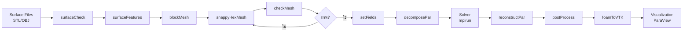

# หมวดหมู่และการจัดระเบียบของยูทิลิตี้ (Utility Categories and Organization)

ระบบยูทิลิตี้ของ OpenFOAM เป็นชุดเครื่องมือที่ครอบคลุมที่สุดในวงการ CFD โดยประกอบด้วยเครื่องมือเฉพาะทางมากกว่า 170 รายการ จัดแบ่งตามขั้นตอนของเวิร์กโฟลว์เพื่อให้ผู้ใช้สามารถเลือกใช้งานได้อย่างถูกต้องและมีประสิทธิภาพ

> [!INFO] โครงสร้างการจัดหมวดหมู่
> ยูทิลิตี้ทั้งหมดใน OpenFOAM ถูกจัดเก็บในไดเรกทอรี `$FOAM_APP/bin/` และแบ่งตามฟังก์ชันการทำงานหลัก ๆ ดังนี้:
> - **Mesh Utilities**: เครื่องมือจัดการเมช
> - **Pre-processing Utilities**: เครื่องมือเตรียมข้อมูล
> - **Post-processing Utilities**: เครื่องมือวิเคราะห์ผลลัพธ์
> - **Parallel Utilities**: เครื่องมือประมวลผลแบบขนาน
> - **Surface Utilities**: เครื่องมือจัดการพื้นผิว

---

## 1. ยูทิลิตี้สำหรับเมช (Mesh Utilities)

หมวดหมู่นี้เป็นส่วนที่ใหญ่ที่สุด ครอบคลุมตั้งแต่การสร้าง (Generation), การจัดการ (Manipulation) ไปจนถึงการตรวจสอบคุณภาพ (Quality Assessment)

### 1.1 การสร้างเมช (Mesh Generation)

#### 1.1.1 blockMesh - เมชโครงสร้างแบบ Block-Structured

เครื่องมือ `blockMesh` สร้างเมชแบบโครงสร้าง (Structured Hexahedral Mesh) โดยใช้การแม็พพารามิเตอร์ (Parametric Mapping) จากพื้นที่คำนวณ (Computational Space) ไปยังพื้นที่กายภาพ (Physical Space)

==รากฐานคณิตศาสตร์==

การแปลงพิกัดจาก Computational Space $(\xi, \eta, \zeta)$ ไปยัง Physical Space $(x, y, z)$ ใช้สมการ:

$$\mathbf{x}(\xi, \eta, \zeta) = \sum_{i=1}^{8} N_i(\xi, \eta, \zeta) \mathbf{x}_i$$

โดยที่:
- $N_i$ คือฟังก์ชันฐาน (Shape Function) ของโหนดที่ $i$
- $\mathbf{x}_i$ คือพิกัดตำแหน่งของโหนดที่ $i$

ฟังก์ชันฐานสำหรับ Hexahedral Block:

$$N_i(\xi, \eta, \zeta) = \frac{1}{8}(1 \pm \xi)(1 \pm \eta)(1 \pm \zeta)$$

เครื่องหมาย $\pm$ ขึ้นอยู่กับตำแหน่งของโหนด

==ตัวอย่างไฟล์ blockMeshDict==

```cpp
// NOTE: Synthesized by AI - Verify parameters
FoamFile
{
    version     2.0;
    format      ascii;
    class       dictionary;
    object      blockMeshDict;
}

// กำหนดความละเอียดของเมช
convertToMeters 0.1;  // แปลงหน่วยเป็นเมตร

vertices  // กำหนดจุดยุด (8 จุดต่อ block)
(
    (0 0 0)        // 0
    (1 0 0)        // 1
    (1 1 0)        // 2
    (0 1 0)        // 3
    (0 0 0.5)      // 4
    (1 0 0.5)      // 5
    (1 1 0.5)      // 6
    (0 1 0.5)      // 7
);

blocks  // กำหนดการแบ่งเซลล์
(
    hex (0 1 2 3 4 5 6 7) (20 20 10) simpleGrading (1 1 1)
);

boundary  // กำหนดเงื่อนไขขอบเขต
(
    inlet
    {
        type patch;
        faces ( (0 4 7 3) );
    }
    outlet
    {
        type patch;
        faces ( (1 5 6 2) );
    }
    walls
    {
        type wall;
        faces ( (0 1 5 4) (2 3 7 6) );
    }
);
```

---

#### 1.1.2 snappyHexMesh - เมชอัตโนมัติสำหรับเรขาคณิตซับซ้อน

`snappyHexMesh` เป็นเครื่องมือสร้างเมชแบบ Automatic Mesh Generation ที่ใช้วิธีการ:
1. **Castellation** (ภาคผนวกเซลล์): การตัดส่วนที่อยู่นอก/ในขอบเขต
2. **Snapping** (การสไลด์หน้าเซลล์): การดึงหน้าเซลล์ให้แนบกับพื้นผิว STL
3. **Layer Addition** (การเพิ่มชั้น): การสร้าง Prismatic Layers บริเวณผนัง

==อัลกอริทึม Castellation==

การตัดสินใจว่าเซลล์ควรถูกเก็บหรือถูกตัดออกใช้เกณฑ์:

$$\text{if } d_{cf} < d_{\text{refinement}} \text{ then refine}$$

$$\text{if } \mathbf{x}_c \in \Omega_{\text{inside}} \text{ then keep}$$

โดยที่:
- $d_{cf}$ คือระยะห่างจากจุดศูนย์กลางเซลล์ถึงพื้นผิว
- $d_{\text{refinement}}$ คือระยะที่กำหนดสำหรับการแบ่งเซลล์

==ตัวอย่างไฟล์ snappyHexMeshDict==

```cpp
// NOTE: Synthesized by AI - Verify parameters
FoamFile
{
    version     2.0;
    format      ascii;
    class       dictionary;
    object      snappyHexMeshDict;
}

// ขั้นตอน Casting
castellatedMesh true;

// ขั้นตอน Snapping
snap true;

// ขั้นตอน Layer Addition
addLayers true;

// เรขาคณิตพื้นผิว (STL)
geometry
{
    wing.stl
    {
        type triSurfaceMesh;
        name wing;
    }
}

// การกำหนด Refinement
castellatedMeshControls
{
    maxLocalCells 1000000;
    maxGlobalCells 2000000;

    // กำหนดระยะ Refinement ใกล้ผิว
    refinementSurfaces
    {
        wing
        {
            level (2 2);  // (minLevel maxLevel)
        }
    }

    // กำหนด Refinement ภายในโดเมน
    refinementRegions
    {
        wakeZone
        {
            mode inside;
            levels ((1.0 4));  // (radius level)
        }
    }
}

// การเพิ่ม Boundary Layers
addLayersControls
{
    layers
    {
        "wing.*"
        {
            nSurfaceLayers 5;  // จำนวนชั้น
        }
    }

    // ความหนาของชั้นแรก
    firstLayerThickness 0.001;

    // อัตราการขยายตัวของชั้น
    expansionRatio 1.2;

    // ความหนารวม
    finalLayerThickness 0.01;
}
```

> [!TIP] เคล็ดลับการใช้ snappyHexMesh
> - เริ่มต้นด้วย `blockMesh` เพื่อสร้าง Background Mesh ที่ครอบคลุมพื้นที่
> - ใช้ `surfaceCheck` ตรวจสอบความสมบูรณ์ของไฟล์ STL ก่อนใช้งาน
> - ปรับค่า `nCellsBetweenLevels` ควรอยู่ระหว่าง 1-3 เพื่อให้ Transition ราบรื่น

---

### 1.2 การตรวจสอบคุณภาพเมช (Mesh Quality Assessment)

#### 1.2.1 checkMesh - เครื่องมือตรวจสอบคุณภาพ

เครื่องมือ `checkMesh` ประเมินคุณภาพเมชตามเกณฑ์ต่าง ๆ ที่สำคัญต่อความถูกต้องของการคำนวณ

==เกณฑ์ Non-orthogonality==

วัดความไม่ตั้งฉากของหน้าเซลล์เทียบกับเส้นเชื่อมศูนย์กลางเซลล์:

$$\theta = \arccos\left(\frac{\mathbf{d} \cdot \mathbf{n}_f}{|\mathbf{d}| |\mathbf{n}_f|}\right)$$

โดยที่:
- $\mathbf{d} = \mathbf{x}_P - \mathbf{x}_N$ คือเวกเตอร์เชื่อมระหว่างจุดศูนย์กลางเซลล์ปัจจุบัน ($P$) และเซลล์ข้างเคียง ($N$)
- $\mathbf{n}_f$ คือเวกเตอร์หน้าฉากของหน้าเซลล์

**ค่ามาตรฐาน:**
- $< 70^\circ$: ดีมาก
- $70^\circ - 85^\circ$: ยอมรับได้
- $> 85^\circ$: อาจมีปัญหา

==เกณฑ์ Skewness==

วัดความเบี่ยงเบนของจุดศูนย์กลางหน้าจากตำแหน่งที่เหมาะสม:

$$\text{Skewness} = \frac{|\mathbf{x}_f - \mathbf{x}_f^{\text{ideal}}|}{|\mathbf{x}_P - \mathbf{x}_N|}$$

โดยที่:
- $\mathbf{x}_f$ คือตำแหน่งจริงของจุดศูนย์กลางหน้า
- $\mathbf{x}_f^{\text{ideal}}$ คือตำแหน่งที่เหมาะสม (จุดกึ่งกลางของเส้นเชื่อม)

**ค่ามาตรฐาน:**
- $< 0.5$: ดีมาก
- $0.5 - 0.8$: ยอมรับได้
- $> 0.8$: ควรแก้ไข

==เกณฑ์ Aspect Ratio==

วัดสัดส่วนของเซลล์:

$$\text{Aspect Ratio} = \frac{\Delta_{\text{max}}}{\Delta_{\text{min}}}$$

**ค่ามาตรฐาน:**
- $< 10$: ดี
- $10 - 100$: ยอมรับได้
- $> 100$: ควรหลีกเลี่ยง

==ตัวอย่างการรัน checkMesh==

```bash
# รัน checkMesh แบบปกติ
checkMesh

# รันพร้อมรายละเอียดคุณภาพเพิ่มเติม
checkMesh -allGeometry -allTopology

# รันเพื่อตรวจสอบเฉพาะปัญหา Mesh Quality
checkMesh -checkMeshQuality
```

> [!WARNING] คำเตือนเรื่องคุณภาพเมช
> หาก `checkMesh` พบปัญหาร้ายแรง เช่น:
> - `***Maximum orthogonality > 70 degrees`
> - `***High aspect ratio cells found`
> - `***Failed 1 mesh checks`
>
> ควรแก้ไขเมชก่อนรัน Simulation เพื่อหลีกเลี่ยงปัญหา Convergence

---

## 2. ยูทิลิตี้หลังการประมวลผล (Post-processing Utilities)

ใช้สำหรับการวิเคราะห์ข้อมูลและแปลงรูปแบบเพื่อนำไปแสดงภาพ (Visualization)

### 2.1 foamToVTK - การแปลงข้อมูลไปยัง ParaView

เครื่องมี `foamToVTK` เป็นสะพานเชื่อมหลักที่แปลงข้อมูล OpenFOAM format ไปเป็น VTK (Visualization Toolkit) format เพื่อให้ ParaView สามารถอ่านได้

==รูปแบบไฟล์ VTK==

```cpp
// ไฟล์ VTK ใช้โครงสร้าง ASCII/Binary ดังนี้:
# vtk DataFile Version 3.0
OpenFOAM data
ASCII
DATASET UNSTRUCTURED_GRID
```

==ตัวอย่างการรัน==

```bash
# แปลงทุก Time Step
foamToVTK

# แปลงเฉพา่ย Time Step สุดท้าย
foamToVTK -latestTime

# แปลงแบบรวมพื้นที่ (รวม processor directories)
foamToVTK -parallel
```

---

### 2.2 postProcess - ยูทิลิตี้อเนกประสงค์

`postProcess` เป็นเครื่องมืออเนกประสงค์สำหรับรัน **Function Objects** หลังการจำลอง หรือรันร่วมกับการจำลองแบบ Real-time

==Function Objects หลักที่ใช้บ่อย==

| Function Object | ฟังก์ชัน | การใช้งาน |
|---|---|---|
| `forces` | คำนวณแรง/โมเมนต์ที่ acting on patches | วิเคราะห์ Drag/Lift |
| `fieldAverage` | คำนวณค่าเฉลี่ยของฟิลด์ | การวิเคราะห์สถิติ |
| `sample` | สกัดโปรไฟล์ข้อมูล | พล็อตกราฟ Profile |
| `probes` | บันทึกค่าที่จุดสังเกต | เวลา Series |
| `sets` | สกัดข้อมูลตามเส้น/พื้นที่ | การวิเคราะห์ Profile |

==ตัวอย่างไฟล์ postProcess.dict==

```cpp
// NOTE: Synthesized by AI - Verify parameters
FoamFile
{
    version     2.0;
    format      ascii;
    class       dictionary;
    object      postProcess.dict;
}

// คำนวณแรง Drag/Lift
forces
{
    type forces;
    libs ("libforces.so");

    // ชื่อ Patch ที่คำนวณ
    patches ("wing" "walls");

    // ทิศทางกระแส
    rhoInf 1.225;      // ความหนาของอากาศ
    CofR (0 0 0);      // จุดอ้างอิง
    dragDir (1 0 0);   // ทิศทาง Drag
    liftDir (0 1 0);   // ทิศทาง Lift
    pitchAxis (0 0 1); // แกน Pitch

    // Log ไฟล์
    log         true;
    writeFields false;
}

// คำนวณค่าเฉลี่ยของฟิลด์
fieldAverage1
{
    type            fieldAverage;
    libs            ("libfieldFunctionObjects.so");

    fields
    (
        U
        p
    );

    // จำนวน Time Steps สำหรับ Average
    window 10;
    mean on;
}

// สกัดข้อมูลตามเส้น
sampleDict
{
    type            sets;
    libs            ("libsampledSets.so");

    // ชื่อ Set
    sets
    (
        midPlane
        {
            type            uniform;
            axis            y;  // สกัดตามแกน y
            start           (0.5 0 0);
            end             (0.5 1 0);
            nPoints         100;
        }
    );

    // ฟิลด์ที่สกัด
    fields (U p);

    interpolationScheme cellPoint;
}
```

==ตัวอย่างการรัน postProcess==

```bash
# รันด้วย Dictionary ที่กำหนดเอง
postProcess -dict postProcess.dict

# รัน Function Object เดี่ยว
postProcess -func "forces"

# รันหลัง Simulation เสร็จสิ้น
postProcess -latestTime -func "fieldAverage"
```

---

### 2.3 การวิเคราะห์แรง (Forces Analysis)

การวิเคราะห์แรง Drag และ Lift เป็นการใช้งานที่พบบ่อยใน Engineering

==สมการคำนวณ Coefficient==

สำหรับ External Aerodynamics:

$$C_D = \frac{F_D}{\frac{1}{2} \rho U_\infty^2 A}$$

$$C_L = \frac{F_L}{\frac{1}{2} \rho U_\infty^2 A}$$

โดยที่:
- $F_D, F_L$ คือแรง Drag และ Lift
- $\rho$ คือความหนาของไหล
- $U_\infty$ คือความเร็วกระแสอิสระ
- $A$ คือพื้นที่อ้างอิง (Reference Area)

> [!TIP] เคล็ดลับการวิเคราะห์ผล
> - ใช้ `pyFoamPlotRunner.py` เพื่อพล็อตกราฟ Residuals แบบ Real-time
> - ใช้ `sample` Utility เพื่อสกัด Profile ตามเส้นที่กำหนด
> - ใช้ `paraFoam -builtin` หาก ParaView Plug-in มีปัญหา

---

## 3. ยูทิลิตี้ก่อนการประมวลผล (Pre-processing Utilities)

ใช้สำหรับการเตรียม Case และกำหนดเงื่อนไขเริ่มต้น

### 3.1 setFields - การกำหนดค่าฟิลด์เริ่มต้น

`setFields` ใช้กำหนดค่าเริ่มต้นของฟิลด์ตามพื้นที่ทางเรขาคณิต เช่น การกำหนดระดับน้ำในถัง หรือการกำหนดบริเวณที่มีอุณหภูมิสูง

==ตัวอย่างไฟล์ setFieldsDict==

```cpp
// NOTE: Synthesized by AI - Verify parameters
FoamFile
{
    version     2.0;
    format      ascii;
    class       dictionary;
    object      setFieldsDict;
}

// กำหนดค่าเริ่มต้นทั่วไป (Default)
defaultFieldValues
(
    volScalarFieldValue alpha.water 0
);

// กำหนดค่าในบริเวณที่เลือก
regions
(
    // กล่องสี่เหลี่ยม (Box)
    boxToCell
    {
        box (0 0 0) (1 1 0.5);  // (x_min y_min z_min) (x_max y_max z_max)

        fieldValues
        (
            volScalarFieldValue alpha.water 1  // ตั้งค่า alpha.water = 1
        );
    }

    // ทรงกลม (Sphere)
    sphereToCell
    {
        centre (0.5 0.5 0.25);
        radius 0.2;

        fieldValues
        (
            volScalarFieldValue T 300  // ตั้งค่าอุณหภูมิ = 300 K
        );
    }

    // รูปทรงที่กำหนดเอง (Custom Region)
    surfaceToCell
    {
        file "region.stl";
        fieldValues
        (
            volScalarFieldValue p 101325  // ความดันบรรยากาศ
        );
    }
);
```

---

### 3.2 mapFields - การถ่ายโอนข้อมูลระหว่างเมช

`mapFields` ใช้ถ่ายโอนผลลัพธ์ (Solution Mapping) จากเมชหนึ่งไปยังอีกเมชหนึ่ง เช่น การถ่ายโอนจากเมชหยาบ (Coarse Mesh) ไปยังเมชละเอียด (Fine Mesh)

==อัลกอริทึมการแม็พ==

การแม็พใช้วิธี Interpolation:

$$\phi_{\text{target}}(\mathbf{x}) = \sum_{i} w_i \phi_{\text{source}}(\mathbf{x}_i)$$

โดยที่:
- $w_i$ ค่าน้ำหนัก (Weight) จากฟังก์ชัน Interpolation
- $\mathbf{x}_i$ คือตำแหน่งของเซลล์ต้นทาง

==ตัวอย่างการรัน mapFields==

```bash
# แม็พจาก Source Case ไป Current Case
mapFields ../sourceCase

# แม็พแบบ Parallel
mapFields -parallel ../sourceCase

# แม็พแบบ Surface Consistent
mapFields ../sourceCase -consistent
```

---

### 3.3 changeDictionary - การแก้ไข Dictionary หลายไฟล์พร้อมกัน

`changeDictionary` ใช้แก้ไขค่าในไฟล์ Dictionary หลาย ๆ ไฟล์ (เช่น `0/U`, `0/p`) พร้อมกันโดยอัตโนมัติ

==ตัวอย่างไฟล์ changeDictionaryDict==

```cpp
// NOTE: Synthesized by AI - Verify parameters
FoamFile
{
    version     2.0;
    format      ascii;
    class       dictionary;
    object      changeDictionaryDict;
}

// แก้ไข boundary ในไฟล์ U
boundary
{
    inlet
    {
        type            fixedValue;
        value           uniform (10 0 0);  // ความเร็ว 10 m/s
    }

    outlet
    {
        type            zeroGradient;      // การไล่ระดับศูนย์
    }

    walls
    {
        type            noSlip;             // ไม่มีการลื่น
    }
}

// แก้ไข boundary ในไฟล์ p
boundary
{
    inlet
    {
        type            zeroGradient;
    }

    outlet
    {
        type            fixedValue;
        value           uniform 0;          // ความดันอ้างอิง = 0
    }

    walls
    {
        type            zeroGradient;
    }
}
```

---

## 4. ยูทิลิตี้การประมวลผลขนาน (Parallel Processing Utilities)

การประมวลผลแบบขนานเป็นสิ่งจำเป็นสำหรับ Large-Scale Simulation

### 4.1 decomposePar - การย่อยโดเมน

`decomposePar` ย่อยโดเมนการคำนวณออกเป็นส่วนย่อย ๆ สำหรับการประมวลผลแบบขนานด้วย MPI

==Methods การย่อยโดเมน==

| Method | คำอธิบาย | ข้อดี | ข้อเสีย |
|---|---|---|---|
| `simple` | แบ่งตามแกน X ก่อน | ง่าย รวดเร็ว | Load Balancing ไม่ดีหาก Geometry ไม่สมมาตร |
| `hierarchical` | แบ่งตามลำดับแกนที่กำหนด | ยืดหยุ่นกว่า simple | ยังคงมีปัญหา Load Balancing |
| `scotch` | แบ่งตาม Graph Partitioning | Load Balancing ดีที่สุด | ต้องการ Library เพิ่ม |
| `metis` | แบ่งตาม Graph Partitioning (เช่นกัน) | Load Balancing ดี | ต้องการ Library เพิ่ม |

==ตัวอย่างไฟล์ decomposeParDict==

```cpp
// NOTE: Synthesized by AI - Verify parameters
FoamFile
{
    version     2.0;
    format      ascii;
    class       dictionary;
    object      decomposeParDict;
}

// จำนวน Sub-domains
numberOfSubdomains 4;

// Method: simple, hierarchical, scotch, metis
method hierarchical;

// การกำหนดค่าสำหรับ hierarchical
hierarchicalCoeffs
{
    n (2 2 1);  // 2 ตาม X, 2 ตาม Y, 1 ตาม Z

    // ลำดับการแบ่ง
    order xyz;

    // แกนที่ใช้ Delta คำนวณ
    delta 0.001;
}

// การกำหนดค่าสำหรับ scotch (แนะนำ)
scotchCoeffs
{
    // ไม่ต้องกำหนดอะไรเพิ่ม
    // scotch จะคำนวณ Load Balancing อัตโนมัติ
}
```

==ตัวอย่างการรัน==

```bash
# ย่อยโดเมน
decomposePar

# รันแบบ Parallel (4 cores)
mpirun -np 4 solverName -parallel

# รวบรวมผลลัพธ์
reconstructPar
```

---

### 4.2 reconstructPar - การรวบรวมผลลัพธ์

`reconstructPar` รวบรวมผลลัพธ์จากแต่ละ Processor กลับมาเป็นโดเมนเดียว

==ตัวอย่างการรัน==

```bash
# รวบรวมทุก Time Steps
reconstructPar

# รวบรวมเฉพาะ Time Step ล่าสุด
reconstructPar -latestTime

# รวบรวมบาง Time Step
reconstructPar -time 0.5
```

> [!INFO] ข้อควรระวังเรื่อง Parallel Processing
> - ตรวจสอบว่า `numberOfSubdomains` ตรงกับจำนวน Cores ที่ใช้รัน
> - ใช้ Method `scotch` หรือ `metis` สำหรับ Geometry ที่ซับซ้อน
> - หลังจากรัน `reconstructPar` จะได้ไดเรกทอรี `processor*` ยังคงอยู่ สามารถลบได้หากต้องการ

---

## 5. ยูทิลิตี้พื้นผิว (Surface Utilities)

จัดการไฟล์เรขาคณิตพื้นหลัง (เช่น STL, OBJ) ก่อนนำมาทำเมช

### 5.1 surfaceConvert - การแปลงรูปแบบไฟล์พื้นผิว

`surfaceConvert` แปลงไฟล์พื้นผิวระหว่างรูปแบบต่าง ๆ (STL, OBJ, PLY, etc.)

==ตัวอย่างการรัน==

```bash
# แปลง OBJ เป็น STL
surfaceConvert input.obj output.stl

# แปลงพร้อมปรับสเกล
surfaceConvert -scale 0.001 input.stl output.stl  # mm -> m

# แปลงพร้อมหมุนพื้นผิว
surfaceConvert -rotate "(1 0 0)" input.stl output.stl
```

---

### 5.2 surfaceCheck - การตรวจสอบความสมบูรณ์ของพื้นผิว

`surfaceCheck` ตรวจสอบปัญหาของพื้นผิว เช่น รูรั่ว (Leaks), หน้าที่ซ้อนทับ (Overlapping Faces), หรือ Normal ที่ผิด

==ตัวอย่างการรัน==

```bash
# ตรวจสอบไฟล์ STL
surfaceCheck wing.stl

# รันพร้อมตรวจสอบปัญหาทั้งหมด
surfaceCheck -checkAll wing.stl
```

==ผลลัพธ์ที่ต้องตรวจสอบ==

- **Failed edges**: ขอบที่ไม่ต่อกัน (รูรั่ว)
- **Non-manifold edges**: ขอบที่มีหน้ามากกว่า 2 หน้าเชื่อมต่อ
- **Open edges**: ขอบที่ไม่ได้ถูกปิด
- **Wrong orientation**: Normal ที่ชี้ผิดทิศทาง

---

### 5.3 surfaceFeatures - การสกัดคุณลักษณะพื้นผิว

`surfaceFeatures` สกัดขอบที่คม (Sharp Edges) เพื่อให้ `snappyHexMesh` รักษาความคมชัดของวัตถุไว้ได้

==อัลกอริทึมการตรวจจับ Sharp Edges==

การตรวจจับใช้เกณฑ์มุม:

$$\theta_{\text{edge}} = \arccos(\mathbf{n}_1 \cdot \mathbf{n}_2)$$

โดยที่:
- $\mathbf{n}_1, \mathbf{n}_2$ คือเวกเตอร์หน้าฉากของ 2 หน้าที่เชื่อมต่อกัน

==ตัวอย่างไฟล์ surfaceFeaturesDict==

```cpp
// NOTE: Synthesized by AI - Verify parameters
FoamFile
{
    version     2.0;
    format      ascii;
    class       dictionary;
    object      surfaceFeaturesDict;
}

// ไฟล์พื้นผิว
surfaceFile "wing.stl";

// เกณฑ์มุมสำหรับ Sharp Edges (องศา)
includedAngle 150;  // มุมที่มากกว่า 150 องศาถือว่า Sharp

// การ Export ผลลัพธ์
writeObj no;  // ไม่ Export OBJ
```

==ตัวอย่างการรัน==

```bash
# สกัด Sharp Edges
surfaceFeatures wing.stl

# รันพร้อม Export เป็น OBJ
surfaceFeatures -writeObj yes wing.stl
```

---

## 🎓 สรุปการเลือกใช้งาน

### ตารางสรุปยูทิลิตี้ตาม Workflow

| ขั้นตอน | ยูทิลิตี้แนะนำ | การใช้งาน |
|---|---|---|
| **ตรวจสอบพื้นผิว** | `surfaceCheck` | ตรวจสอบ STL ก่อนใช้งาน |
| **สกัด Sharp Edges** | `surfaceFeatures` | เตรียมสำหรับ snappyHexMesh |
| **สร้างเมชพื้นฐาน** | `blockMesh` | สร้าง Background Mesh |
| **สร้างเมชซับซ้อน** | `snappyHexMesh` | สร้างเมชรอบ Geometry |
| **ตรวจสอบเมช** | `checkMesh` | ประเมินคุณภาพเมช |
| **ตั้งค่าเริ่มต้น** | `setFields` | กำหนดค่าฟิลด์เริ่มต้น |
| **ย่อยโดเมน** | `decomposePar` | เตรียมสำหรับ Parallel |
| **รันแบบขนาน** | `mpirun -np X solver` | รัน Simulation |
| **รวบรวมผล** | `reconstructPar` | รวมโดเมนหลังรัน |
| **วิเคราะห์ผล** | `postProcess` | คำนวณค่าทางวิศวกรรม |
| **แปลงข้อมูล** | `foamToVTK` | นำไป ParaView |

---

### ภาพรวมการเชื่อมโยงยูทิลิตี้



> [!TIP] เคล็ดลับการใช้งานระบบยูทิลิตี้
> 1. **ตรวจสอบ Input เสมอ**: ใช้ `surfaceCheck` และ `checkMesh` ก่อนรัน
> 2. **ใช้ Function Objects**: บันทึกค่าสำคัญระหว่างรัน Simulation เพื่อประหยัดเวลา
> 3. **เตรียม Script**: สร้าง Shell Script สำหรับรัน Workflow อัตโนมัติ
> 4. **ตรวจสอบ Log**: อ่าน Log File ของแต่ละ Utility เพื่อหาข้อผิดพลาด

---

## แหล่งข้อมูลเพิ่มเติม

- **OpenFOAM User Guide**: [https://www.openfoam.com/documentation/user-guide/](https://www.openfoam.com/documentation/user-guide/)
- **OpenFOAM Programmer's Guide**: [https://www.openfoam.com/documentation/programmers-guide/](https://www.openfoam.com/documentation/programmers-guide/)
- **CFD Online**: [https://www.cfd-online.com/Forums/openfoam/](https://www.cfd-online.com/Forums/openfoam/)

---

**หัวข้อถัดไป**: [[03_Architecture_and_Design_Patterns]] เพื่อทำความเข้าใจโครงสร้างภายในและ Design Patterns ของยูทิลิตี้เหล่านี้
