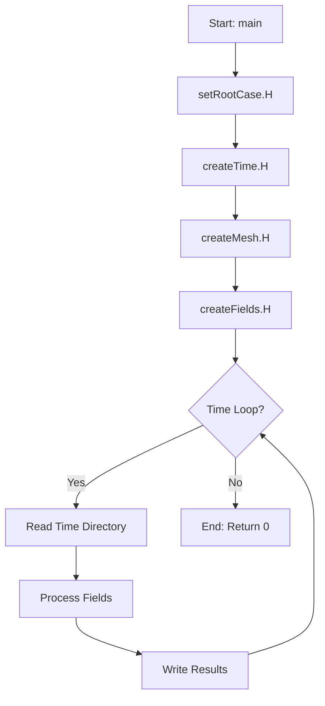
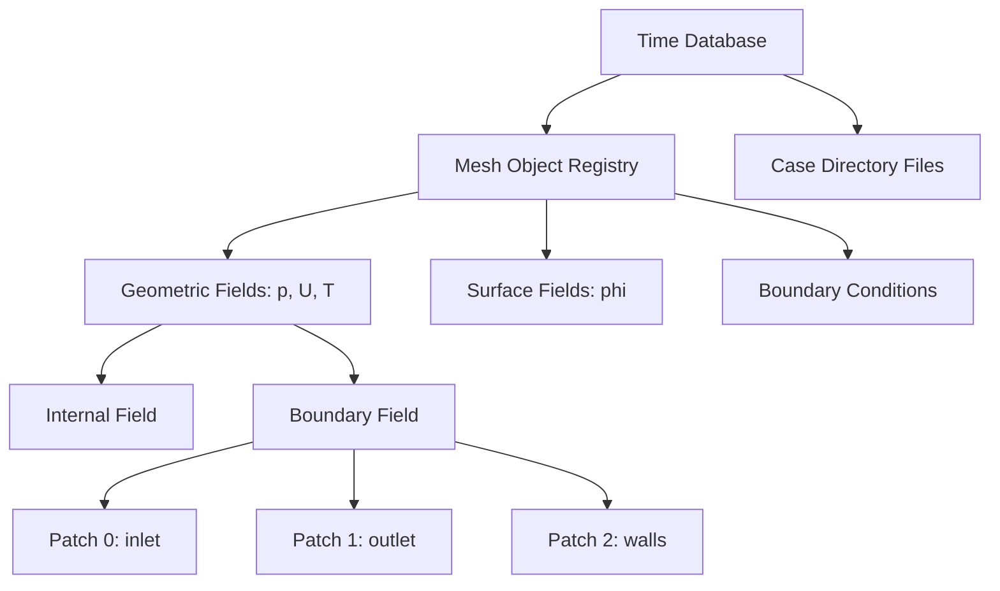
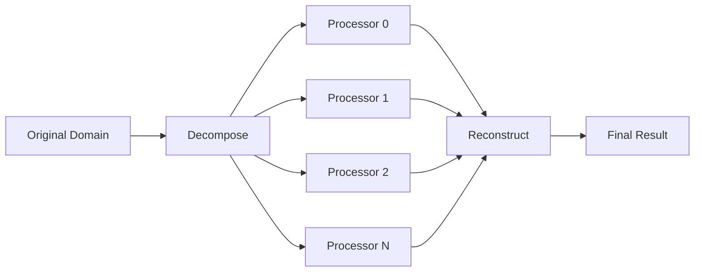

# สถาปัตยกรรมและรูปแบบการออกแบบใน OpenFOAM (Architecture and Design Patterns)

สถาปัตยกรรมของ OpenFOAM ถูกออกแบบมาอย่างเป็นระบบโดยเน้นความเป็นโมดูล (Modularity) เพื่อให้โค้ดสามารถนำกลับมาใช้ใหม่ (Reusability), บำรุงรักษาง่าย (Maintainability) และขยายขีดความสามารถได้ (Extensibility)

> [!INFO] **แนวคิดหลัก**
> OpenFOAM ใช้เทคนิค **Object-Oriented Programming (OOP)** และ **Generic Programming** อย่างหนักเพื่อสร้างกรอบการทำงาน (Framework) ที่ยืดหยุ่นสำหรับการแก้ปัญหา CFD (Computational Fluid Dynamics) และ CEM (Computational Electromagnetics)

---

## 1. โครงสร้างมาตรฐานของ Utility (Standard Utility Structure)

ยูทิลิตี้ทุกตัวใน OpenFOAM จะเป็นไปตามรูปแบบโครงสร้างเดียวกัน เพื่อให้มั่นใจในความสอดคล้องของ Command-line Interface และพฤติกรรมของโปรแกรม

### 1.1 แผนภาพโครงสร้างการทำงาน (Execution Flow)


> **Figure 1:** แผนภูมิแสดงลำดับขั้นตอนการทำงานพื้นฐาน (Execution Flow) ของยูทิลิตี้ใน OpenFOAM เริ่มตั้งแต่การกำหนด Root Case การสร้างออบเจกต์เวลาและเมช ไปจนถึงลูปการประมวลผลข้อมูลตามช่วงเวลา

### 1.2 รูปแบบโค้ดมาตรฐาน (Canonical Utility Template)

> [!TIP] **Best Practice**
> การใช้ included header files แบบมาตรฐานช่วยให้โค้ดอ่านง่ายและลดความผิดพลาดจากการเริ่มต้นออบเจกต์

```cpp
// NOTE: Synthesized by AI - Verify parameters
int main(int argc, char *argv[])
{
    // 1. การกำหนดค่าเริ่มต้นตามมาตรฐาน OpenFOAM
    #include "setRootCase.H"      // ตรวจสอบตำแหน่ง Root directory ของ Case
    #include "createTime.H"       // สร้างออบเจกต์เวลา (Time Object)
    #include "createMesh.H"       // โหลดข้อมูลเมช (Finite Volume Mesh)
    #include "createFields.H"     // เริ่มต้นฟิลด์และเงื่อนไขขอบเขต

    // 2. การตั้งค่าระบบบันทึกข้อมูล (Info Switches)
    Info<< nl << "Starting utility: " << args.executable() << nl << endl;

    // 3. ลูปการประมวลผลตามช่วงเวลา (Temporal Loop)
    while (runTime.loop())
    {
        Info<< "Time = " << runTime.timeName() << nl << endl;

        // --- ใส่ตรรกะการทำงานของ Utility ตรงนี้ ---
        // ตัวอย่าง: การคำนวณปริมาณเชิงปริภูมิ (Spatial Quantities)
        // volScalarField magU = mag(U);
        // dimensionedScalar totalMagU = fvc::domainIntegrate(magU);

        // 4. การเขียนผลลัพธ์
        if (!args.optionFound("noWrite"))
        {
            // field.write();
        }
    }

    Info<< "\nExecution completed successfully!\n" << endl;
    return 0;
}
```

### 1.3 สมการพื้นฐานที่เกี่ยวข้อง (Fundamental Equations)

สำหรับยูทิลิตี้ส่วนใหญ่ การทำงานจะขึ้นอยู่กับการคำนวณปริมาณเชิงปริภูมิ (Spatial Integration) เช่น:

$$
\Phi(t) = \int_{\Omega} \phi(\mathbf{x}, t) \, dV
$$

หรือการคำนวณค่าเฉลี่ยบนพื้นผิว:

$$
\bar{\phi}_{\Gamma} = \frac{1}{A_{\Gamma}} \int_{\Gamma} \phi \, dA
$$

เมื่อ:
- $\Phi(t)$ = ปริมาณรวมในโดเมน $\Omega$
- $\phi$ = ฟิลด์สเกลาร์หรือเวกเตอร์
- $dV$ = ปริมาตรของเซลล์
- $A_{\Gamma}$ = พื้นที่ผิว $\Gamma$

---

## 2. การผสานรวมกับระบบคอมไพล์ (Build System Integration)

OpenFOAM ใช้ยูทิลิตี้ชื่อ `wmake` ในการจัดการการคอมไพล์ โดยแต่ละโปรเจกต์ต้องมีโฟลเดอร์ `Make/` ซึ่งประกอบด้วยไฟล์คอนฟิกูเรชันหลัก 2 ไฟล์:

### 2.1 ไฟล์ `Make/files`

ใช้ระบุไฟล์ต้นฉบับ (Source Files) และตำแหน่งที่จะเก็บไฟล์ไบนารีหลังคอมไพล์:

```make
# NOTE: Synthesized by AI - Verify file paths
myUtility.C

EXE = $(FOAM_USER_APPBIN)/myUtility
```

> [!WARNING] **ข้อควรระวัง**
> ต้องมีการขึ้นบรรทัดใหม่ (Blank Line) ระหว่างรายชื่อไฟล์ต้นฉบับและตัวแปร `EXE` มิฉะนั้น `wmake` จะไม่สามารถตรวจจับได้

### 2.2 ไฟล์ `Make/options`

ใช้ระบุตำแหน่งของ Header Files และไลบรารีที่ต้องใช้เชื่อมต่อ (Linking):

```make
# NOTE: Synthesized by AI - Verify library dependencies
EXE_INC = \
    -I$(LIB_SRC)/finiteVolume/lnInclude \
    -I$(LIB_SRC)/meshTools/lnInclude \
    -I$(LIB_SRC)/sampling/lnInclude

EXE_LIBS = \
    -lfiniteVolume \
    -lmeshTools \
    -lsampling
```

### 2.3 กระบวนการคอมไพล์ (Compilation Process)


> **Figure 2:** ขั้นตอนการคอมไพล์โค้ดต้นฉบับด้วยระบบ `wmake` โดยเริ่มจากการตรวจสอบความเชื่อมโยง (Dependencies) การคอมไพล์ และการเชื่อมต่อกับไลบรารีต่างๆ เพื่อสร้างไฟล์ไบนารีสำหรับใช้งาน

---

## 3. รูปแบบการออกแบบที่สำคัญ (Key Design Patterns)

### 3.1 Factory Pattern (Runtime Selection)

OpenFOAM ใช้รูปแบบนี้อย่างหนักเพื่อให้ผู้ใช้สามารถเลือกโมเดล (เช่น Turbulence Model หรือ Numerical Scheme) ได้ผ่านไฟล์ Dictionary ขณะรันโปรแกรม โดยไม่ต้องคอมไพล์โค้ดใหม่

> [!INFO] **กลไกทำงาน**
> ระบบ Factory ใช้ **RTS (Runtime Selection)** ผ่าน Macro `TypeName` และ `New` ในการสร้างออบเจกต์แบบไดนามิก

**ตัวอย่างไฟล์ Dictionary:**

```cpp
// NOTE: Synthesized by AI - Verify model selection
// ในไฟล์ constant/turbulenceProperties
simulationType  RAS;

RAS
{
    RASModel        kEpsilon;
    turbulence      on;
    printCoeffs     on;
}
```

**ตัวอย่างการใช้งานในโค้ด:**

```cpp
// NOTE: Synthesized by AI - Verify syntax
autoPtr<compressible::RASModel> turbulence
(
    compressible::RASModel::New
    (
        rho,
        U,
        phi,
        thermo,
        false  // Not reading from RASProperties
    )
);
```

### 3.2 Smart Pointers (`autoPtr` และ `tmp`)

เพื่อจัดการหน่วยความจำอย่างมีประสิทธิภาพและป้องกัน Memory Leak:

#### 3.2.1 `autoPtr<T>` - Single Ownership

- **หน้าที่**: สำหรับการถือครองกรรมสิทธิ์วัตถุเพียงผู้เดียว (Exclusive Ownership)
- **การใช้งาน**: ใช้เมื่อวัตถุมีเจ้าของคนเดียวและต้องการให้ถูกทำลายอัตโนมัติเมื่อออกจาก Scope

```cpp
// NOTE: Synthesized by AI - Verify pointer usage
autoPtr<volScalarField> Tptr
(
    new volScalarField
    (
        IOobject
        (
            "T",
            runTime.timeName(),
            mesh,
            IOobject::MUST_READ,
            IOobject::AUTO_WRITE
        ),
        mesh
    )
);

// การเข้าถึง: ใช้ operator() หรือ operator->
volScalarField& T = Tptr();
T.internalField() *= 1.1;  // ปรับค่าอุณหภูมิเพิ่ม 10%
```

#### 3.2.2 `tmp<T>` - Reference Counting

- **หน้าที่**: สำหรับวัตถุชั่วคราวที่มีการนับจำนวนการอ้างอิง (Reference Counting) ช่วยลดการคัดลอกข้อมูลขนาดใหญ่
- **การใช้งาน**: ใช้กับฟิลด์ขนาดใหญ่ที่อาจถูกส่งผ่านระหว่างฟังก์ชัน

```cpp
// NOTE: Synthesized by AI - Verify tmp usage
tmp<volScalarField> divPhi = fvc::div(phi);

// การเข้าถึง
const volScalarField& divPhiRef = divPhi();

// หรือส่งต่อให้ฟังก์ชันอื่น
solve(fvm::ddt(rho, U) + fvc::div(phi, U) - divPhi());
// divPhi จะถูกทำลายอัตโนมัติเมื่อไม่มีการใช้งาน
```

**สรุปการเลือกใช้:**

| ประเภท Smart Pointer | กรณีใช้งาน | ตัวอย่าง |
|---|---|---|
| **`autoPtr<T>`** | วัตถุมีเจ้าของคนเดียว (Unique Owner) | การสร้าง Turbulence Model, Boundary Conditions |
| **`tmp<T>`** | วัตถุอาจมีการใช้ร่วมกัน (Shared/Temporary) | ผลลัพธ์จาก `fvc::div()`, `fvc::grad()` |
| **`refPtr<T>`** | รุ่นใหม่กว่า tmp (OpenFOAM-v2112+) | ใช้แทน tmp ในโค้ดใหม่ |

### 3.3 Strategy Pattern

ใช้สำหรับอัลกอริทึมการคำนวณเชิงตัวเลข (Numerical Schemes) ช่วยให้สามารถสลับเปลี่ยนวิธีการคำนวณ Gradient หรือ Divergence ได้อย่างอิสระ

**ตัวอย่างไฟล์ `system/fvSchemes`:**

```cpp
// NOTE: Synthesized by AI - Verify scheme selection
gradSchemes
{
    default         Gauss linear;
    grad(p)         Gauss linear;
    grad(U)         Gauss linear;
}

divSchemes
{
    default         none;
    div(phi,U)      Gauss linearUpwindV grad(U);
    div(phi,k)      Gauss upwind;
    div(phi,epsilon) Gauss upwind;
}

laplacianSchemes
{
    default         Gauss linear corrected;
}
```

**การนำไปใช้ในโค้ด:**

```cpp
// NOTE: Synthesized by AI - Verify scheme usage
// ระบบจะเลือก Scheme ตามที่ระบุใน fvSchemes โดยอัตโนมัติ
tmp<volVectorField> gradU = fvc::grad(U);
tmp<surfaceScalarField> flux = fvc::div(phi);
```

---

## 4. ระบบ Database และ Object Registry

### 4.1 โครงสร้างข้อมูล (Database Hierarchy)

OpenFOAM ใช้ระบบ **Object Registry** ในการจัดการวัตถุทั้งหมดใน Simulation:


> **Figure 3:** ลำดับชั้นของฐานข้อมูลและระบบการจดทะเบียนวัตถุ (Object Registry) ใน OpenFOAM แสดงความสัมพันธ์ระหว่างฐานข้อมูลเวลา เมช และฟิลด์ข้อมูลประเภทต่างๆ รวมถึงเงื่อนไขขอบเขตในแต่ละ Patch

### 4.2 การเข้าถึงวัตถูใน Registry

```cpp
// NOTE: Synthesized by AI - Verify registry access
// วิธีที่ 1: ผ่าน Time Database
const volScalarField& p = mesh.lookupObject<volScalarField>("p");

// วิธีที่ 2: ผ่าน Mesh Object Registry
const volVectorField& U = mesh.objectRegistry::lookupObject<volVectorField>("U");

// วิธีที่ 3: ใช้ในลูปหากไม่แน่ใจว่ามีฟิลด์นี้หรือไม่
if (mesh.foundObject<volScalarField>("T"))
{
    const volScalarField& T = mesh.lookupObject<volScalarField>("T");
}
```

---

## 5. การจัดการหน่วย (Dimensional Consistency)

OpenFOAM มีระบบตรวจสอบ ==มิติของหน่วย== (Dimensional Consistency) อย่างเข้มงวด

### 5.1 ชนิดของมิติ (Dimension Set)

$$
\text{Dimension Set} = \text{(Mass, Length, Time, Temperature, Moles, Current, Luminous Intensity)}
$$

**ตัวอย่างการใช้งาน:**

```cpp
// NOTE: Synthesized by AI - Verify dimensions
// กำหนดมิติของความเร็ว [L/T]
dimensionSet velocityDimensions
(
    0,  // Mass [M]
    1,  // Length [L]
    -1, // Time [T]
    0,  // Temperature [θ]
    0,  // Moles
    0,  // Current
    0   // Luminous Intensity
);

// การใช้งานจริง
dimensionedVector U_inf
(
    "U_inf",
    dimVelocity,  // ใช้ predefined dimension
    vector(10, 0, 0)  // 10 m/s in x-direction
);
```

### 5.2 ตารางมิติที่ใช้บ่อย (Common Dimensions)

| ปริมาณ | สัญลักษณ์ OpenFOAM | มิติ | ตัวแปร |
|---|---|---|---|
| ความเร็ว | `dimVelocity` | $[L T^{-1}]$ | $U$ |
| ความดัน | `dimPressure` | $[M L^{-1} T^{-2}]$ | $p$ |
| ความหนาแน่น | `dimDensity` | $[M L^{-3}]$ | $\rho$ |
| อุณหภูมิ | `dimTemperature` | $[\theta]$ | $T$ |
| ความหน่วงแรง | `dimViscosity` | $[M L^{-1} T^{-1}]$ | $\mu$ |

---

## 6. รูปแบบการคำนวณเชิงตัวเลข (Numerical Framework)

### 6.1 Finite Volume Method (FVM)

OpenFOAM ใช้วิธีการ ==Finite Volume== ในการแยกสมการเชิงอนุพันธ์ (PDE) ออกเป็นสมการเชิงพีชคณิต (Algebraic Equations)

**สมการทั่วไป:**

$$
\frac{\partial (\rho \phi)}{\partial t} + \nabla \cdot (\rho \mathbf{u} \phi) = \nabla \cdot (\Gamma \nabla \phi) + S_\phi
$$

**แยกเป็นรูป Discrete:**

$$
\frac{(\rho \phi)_P^{n+1} - (\rho \phi)_P^n}{\Delta t} V_P + \sum_f \rho_f \mathbf{u}_f \cdot \mathbf{S}_f \phi_f = \sum_f \Gamma_f \nabla \phi_f \cdot \mathbf{S}_f + S_\phi V_P
$$

เมื่อ:
- $P$ = เซลล์ปัจจุบัน (Owner Cell)
- $f$ = หน้าเซลล์ (Face)
- $V_P$ = ปริมาตรของเซลล์
- $\mathbf{S}_f$ = เวกเตอร์พื้นที่หน้า (Face Area Vector)

### 6.2 FVM Operators ใน OpenFOAM

```cpp
// NOTE: Synthesized by AI - Verify operator usage
// 1. Temporal Derivative (เวลา)
fvm::ddt(rho, U)           // Implicit: ∂(ρU)/∂t
fvc::ddt(rho, U)           // Explicit: ∂(ρU)/∂t

// 2. Divergence (การไหลออก - Convection)
fvm::div(phi, U)           // Implicit: ∇·(φU)
fvc::div(phi)              // Explicit: ∇·φ

// 3. Gradient (การไหลเข้า - Diffusion)
fvc::grad(p)               // Explicit: ∇p
fvm::laplacian(nu, U)      // Implicit: ∇·(ν∇U)

// 4. Interpolation (การประมาณค่าบนหน้าเซลล์)
surfaceScalarField rhof = fvc::interpolate(rho);
```

---

## 7. การสร้าง Utility ที่มีประสิทธิภาพ (Performance Optimization)

### 7.1 การลดการคำนวณซ้ำ (Avoid Redundant Calculations)

> [!TIP] **Memory Management**
> ใช้ `tmp` เพื่อลดการคัดลอกฟิลด์ขนาดใหญ่ และใช้ `const ref` สำหรับการอ้างอิงแบบอ่านอย่างเดียว

```cpp
// NOTE: Synthesized by AI - Verify optimization technique
// ❌ ไม่ดี: สร้างฟิลด์ใหม่ทุกรอบ
for (int i = 0; i < n; i++)
{
    volScalarField magU = mag(U);
    // การประมวลผล...
}

// ✅ ดี: สร้างครั้งเดียวแล้วนำไปใช้ซ้ำ
const volScalarField magU = mag(U);
for (int i = 0; i < n; i++)
{
    // การประมวลผล...
}
```

### 7.2 การใช้งาน Parallel Processing

OpenFOAM รองรับการแบ่งข้อมูล (Domain Decomposition) โดยใช้ **MPI** (Message Passing Interface)


> **Figure 4:** แผนภาพแสดงกระบวนการประมวลผลแบบขนาน (Parallel Processing) โดยการแบ่งโดเมนออกเป็นส่วนย่อยๆ เพื่อส่งให้แต่ละโปรเซสเซอร์คำนวณแยกกัน ก่อนจะนำผลลัพธ์กลับมารวมกันเป็นโดเมนเดียวเพื่อสรุปผลในขั้นตอนสุดท้าย

**ตัวอย่างโค้ดที่รองรับ Parallel:**

```cpp
// NOTE: Synthesized by AI - Verify parallel syntax
// การลดข้อมูลข้ามโปรเซสเซอร์ (Reduction)
scalar globalSum = gSum(magU.internalField());          // ผลรวมทั่วทั้งโดเมน
scalar globalMax = gMax(magU.internalField());          // ค่าสูงสุด
scalar globalMin = gMin(magU.internalField());          // ค่าต่ำสุด
```

---

## 8. การตรวจสอบความถูกต้อง (Validation and Debugging)

### 8.1 การใช้ Switches ในการควบคุม Output

```cpp
// NOTE: Synthesized by AI - Verify debug switches
// ในไฟล์ system/controlDict
DebugSwitches
{
    myUtility 1;  // 0 = off, 1 = on
}

InfoSwitches
{
    myUtility 1;
}

OptimisationSwitches
{
    myUtility 1;
}
```

### 8.2 การเขียน Debug Messages

```cpp
// NOTE: Synthesized by AI - Verify debug macros
if (debug)
{
    Info<< "Debug: Processing field " << U.name() << nl
        << "  - Min: " << gMin(U.internalField()) << nl
        << "  - Max: " << gMax(U.internalField()) << nl
        << "  - Size: " << U.internalField().size() << endl;
}
```

---

## 🎓 สรุปสถาปัตยกรรม

| องค์ประกอบ | หน้าที่หลัก | คลาสหลักใน OpenFOAM |
|---|---|---|
| **Root Case** | กำหนดขอบเขตของโปรเจกต์และโครงสร้างไฟล์ | `argList`, `Time` |
| **Time Database** | จัดการลูปเวลาและการอ่าน/เขียนข้อมูลตามขั้นตอน | `Time`, `instantList` |
| **fvMesh** | จัดการความสัมพันธ์เชิงพื้นที่และโทโพโลยีของเซลล์ | `fvMesh`, `polyMesh` |
| **GeometricField** | เก็บข้อมูลฟิสิกส์ (Scalar, Vector, Tensor) และหน่วย (Dimensions) | `GeometricField`, `DimensionedField` |
| **Object Registry** | ระบบจัดการวัตถุและการค้นหา | `objectRegistry`, `HashTable` |
| **Smart Pointers** | จัดการหน่วยความจำอัตโนมัติ | `autoPtr`, `tmp`, `refPtr` |
| **Factory Pattern** | การสร้างวัตถุแบบไดนามิก | `New()`, `TypeName` |
| **Numerical Schemes** | อัลกอริทึมการคำนวณเชิงตัวเลข | `fvSchemes`, `fvSolution` |

---

## 📚 แหล่งอ้างอิงเพิ่มเติม

> [!INFO] **เอกสารประกอบ**
> - OpenFOAM Programmer's Guide: [https://www.openfoam.com/documentation/programmers-guide](https://www.openfoam.com/documentation/programmers-guide)
> - OpenFOAM C++ Source Code: `$FOAM_SRC/`
> - Wmake Build System: `$WM_PROJECT_DIR/wmake/`

---

**หัวข้อถัดไป**: [[04_Essential_Utilities_for_Common_CFD_Tasks]] เพื่อดูเวิร์กโฟลว์การใช้งานจริง
