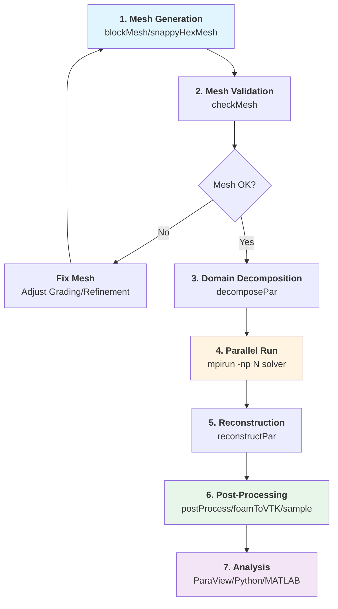

# เครื่องมือจำเป็นสำหรับงาน CFD ทั่วไป (Essential Utilities for Common CFD Tasks)

ระบบยูทิลิตี้ของ OpenFOAM นำเสนอเครื่องมือที่ครอบคลุมทุกขั้นตอนของเวิร์กโฟลว์ CFD ตั้งแต่การเตรียม Mesh ไปจนถึงการวิเคราะห์ผลลัพธ์เชิงลึก

---

## 1. กระบวนการเตรียม Mesh (Mesh Preparation Pipeline)

### 1.1 การสร้าง Mesh เริ่มต้นด้วย blockMesh

**blockMesh** เป็นเครื่องมือหลักในการสร้าง Mesh แบบโครงสร้าง (Hexahedral) โดยอาศัยการแม็พจากพื้นที่พารามิเตอร์ไปยังพื้นที่จริง (Computational Domain)

> [!INFO] หลักการของ Block Meshing
> blockMesh ใช้การแม็พแบบ Transfinite Interpolation โดยที่แต่ละ Block ถูกกำหนดด้วย 8 Vertices และการแบ่งส่วน (Grading) สามารถควบคุมความละเอียดของ Mesh ในแต่ละทิศทาง

**รากฐานคณิตศาสตร์**:

การแม็พจากพื้นที่พารามิเตอร์ $(\xi_1, \xi_2, \xi_3) \in [0,1]^3$ ไปยังพื้นที่กายภาพ $\mathbf{x} = (x, y, z)$:

$$\mathbf{x}(\xi_1, \xi_2, \xi_3) = \mathbf{x}_0 + \sum_{i=1}^{3} \xi_i \mathbf{e}_i + \sum_{i=1}^{3} \sum_{j=i+1}^{3} \xi_i \xi_j \mathbf{e}_{ij} + \xi_1 \xi_2 \xi_3 \mathbf{e}_{123}$$

โดยที่:
- $\mathbf{x}_0$ คือ ตำแหน่งของ Vertex ที่มุมศูนย์
- $\mathbf{e}_i$ คือ เวกเตอร์ฐานตามแกนพารามิเตอร์
- $\mathbf{e}_{ij}$ และ $\mathbf{e}_{123}$ คือ เทอมที่ไม่เป็นเชิงเส้นสำหรับการแม็พที่ซับซ้อน

**ตัวอย่างไฟล์ `blockMeshDict`**:

```cpp
// NOTE: Synthesized by AI - Verify parameters
FoamFile
{
    version     2.0;
    format      ascii;
    class       dictionary;
    object      blockMeshDict;
}
// * * * * * * * * * * * * * * * * * * * * * * * * * * * //

convertToMeters 0.1;  // Unit conversion factor for mesh generation

vertices
(
    (0 0 0)        // Vertex 0
    (1 0 0)        // Vertex 1
    (1 1 0)        // Vertex 2
    (0 1 0)        // Vertex 3
    (0 0 0.5)      // Vertex 4
    (1 0 0.5)      // Vertex 5
    (1 1 0.5)      // Vertex 6
    (0 1 0.5)      // Vertex 7
);

blocks
(
    hex (0 1 2 3 4 5 6 7) (100 100 50) simpleGrading (1 1 1)
);

edges
(
    // For curved edges use spline or arc
    // arc 0 1 (0.5 0.1 0)
);

boundary
(
    inlet
    {
        type patch;
        faces
        (
            (0 4 7 3)
        );
    }
    outlet
    {
        type patch;
        faces
        (
            (1 5 6 2)
        );
    }
    walls
    {
        type wall;
        faces
        (
            (0 1 5 4)
            (1 2 6 5)
            (2 3 7 6)
            (3 0 4 7)
        );
    }
);
```

**📝 คำอธิบาย (Explanation):**

| ส่วนประกอบ (Component) | คำอธิบาย (Description) |
|---|---|
| **FoamFile** | ส่วนหัวของไฟล์ OpenFOAM ที่ระบุเวอร์ชัน รูปแบบ และประเภทของไฟล์ |
| **convertToMeters** | ตัวคูณสเกลเพื่อแปลงหน่วยจากตัวเลขใน vertices เป็นเมตร |
| **vertices** | พิกัด XYZ ของจุดยุด (corners) ทั้ง 8 จุดของ Block หน่วยเป็นเมตรหลังจากคูณ convertToMeters |
| **blocks** | นิยาม Block โดยระบุ vertex indices จำนวน cells และ grading ในแต่ละทิศทาง |
| **edges** | กำหนดความโค้งของ edges (ถ้ามี) ด้วย spline, arc, หรือ polyLine |
| **boundary** | นิยาม boundary patches และชนิดของ BC พร้อมระบุ faces ที่เป็นของแต่ละ patch |

**🔑 หลักการสำคัญ (Key Concepts):**

1. **Vertex Indexing**: OpenFOAM ใช้ระบบ 0-based indexing สำหรับ vertices และ faces
2. **Right-Hand Rule**: Faces ต้องถูกกำหนดตาม right-hand rule (normal ชี้ออกจาก domain)
3. **Grading**: ควบคุมการกระจายตัวของ cells โดยค่า > 1 หมายถึง cells ขนาดเล็กอยู่ด้าน start, ค่า < 1 หมายถึง cells ขนาดเล็กอยู่ด้าน end
4. **Block Topology**: แต่ละ Block ต้องเป็น Convex Hexahedron (ไม่มี concave blocks)

> [!TIP] การควบคุมความละเอียดของ Mesh
> ใช้ `simpleGrading` เพื่อสร้าง Mesh ที่มีความละเอียดแปรผันตามตำแหน่ง:
> - `simpleGrading (1 1 1)`: ความละเอียดสม่ำเสมอ
> - `simpleGrading (2 1 0.5)`: หนาแน่น 2 เท่าที่ inlet, 1 เท่ากลาง, 0.5 เท่าที่ outlet

---

### 1.2 การสร้าง Mesh ซับซ้อนด้วย snappyHexMesh

สำหรับเรขาคณิตที่ซับซ้อน **snappyHexMesh** ใช้กระบวนการ 3 ขั้นตอนหลัก:

1. **Casting**: สร้าง Background Mesh จาก blockMesh
2. **Snapping**: ปรับพื้นผิว Mesh ให้สอดคล้องกับ Surface Geometry (STL)
3. **Layer Addition**: เพิ่ม Boundary Layer Cells (Prismatic Layers)

**รากฐานคณิตศาสตร์ - Snapping Algorithm**:

การปรับตำแหน่ง Vertex ให้ใกล้กับพื้นผิว Geometry ใช้วิธีการ Projections:

$$\mathbf{x}_{\text{new}} = \mathbf{x}_{\text{old}} + \alpha \left( \mathbf{x}_{\text{surface}} - \mathbf{x}_{\text{old}} \right)$$

โดยที่:
- $\alpha$ คือ สัมประสิทธิ์การผ่อนคลาย (Relaxation Factor) $\in [0, 1]$
- $\mathbf{x}_{\text{surface}}$ คือ ตำแหน่งที่ Projection ลงบน Surface

**สำหรับ Boundary Layers**:

ความสูงของ Cell ชั้นแรก ($y_1$) ถูกคำนวณจากค่า $y^+$ ที่ต้องการ:

$$y_1 = \frac{y^+ \mu}{\rho u_\tau}$$

โดยที่ $u_\tau = \sqrt{\frac{\tau_w}{\rho}}$ คือ Friction Velocity

**ตัวอย่างไฟล์ `snappyHexMeshDict`**:

```cpp
// NOTE: Synthesized by AI - Verify parameters
FoamFile
{
    version     2.0;
    format      ascii;
    class       dictionary;
    object      snappyHexMeshDict;
}

castellatedMesh true;  // Enable castellation phase
snap true;             // Enable snapping phase
addLayers true;        // Enable layer addition phase

geometry
{
    airfoil.stl
    {
        type triSurfaceMesh;
        name airfoil;
    }
}

castellatedMeshControls
{
    maxLocalCells 10000000;     // Maximum cells per processor
    maxGlobalCells 20000000;    // Maximum total cells in mesh
    minRefinementCells 10;      // Minimum cells to trigger refinement

    nCellsBetweenLevels 3;      // Refinement buffer between levels

    features
    (
        {
            file "airfoil.eMesh";
            level 2;             // Feature edge refinement level
        }
    );

    refinementSurfaces
    {
        airfoil
        {
            level (2 2);  // (surface level, gap level)
        }
    }

    resolveFeatureAngle 30;     // Minimum feature angle to resolve
}

snapControls
{
    nSmoothPatch 3;             // Number of patch smoothing iterations
    tolerance 2.0;              // Snap tolerance (fraction of local cell size)
    nSolveIter 30;              // Number of mesh relaxation iterations
    nRelaxIter 5;               // Number of relaxation iterations per step
}

addLayersControls
{
    relativeSizes true;         // Use relative thickness sizing

    layers
    {
        airfoil
        {
            nSurfaceLayers 3;    // Number of boundary layers
        }
    }

    expansionRatio 1.2;         // Layer expansion ratio
    finalLayerThickness 0.3;    // Thickness of outermost layer
    minThickness 0.1;           // Minimum layer thickness
    nGrow 0;                    // Number of layer expansion iterations
    featureAngle 80;            // Max angle for layer addition
    nRelaxIter 3;               // Layer relaxation iterations
    nSmoothSurfaceNormals 1;    // Surface normal smoothing
    nSmoothNormals 3;           // Layer normal smoothing
    nSmoothThickness 10;        // Thickness field smoothing
    maxFaceThicknessRatio 0.5;  // Max face thickness ratio
    maxThicknessToMedialRatio 0.3;  // Max thickness to medial axis ratio
    minMedianAxisAngle 90;      // Min medial axis angle for layer checking
}
```

**📝 คำอธิบาย (Explanation):**

| ส่วนประกอบ (Component) | คำอธิบาย (Description) |
|---|---|
| **castellatedMesh/snap/addLayers** | สวิตช์เปิด/ปิดแต่ละเฟสของ snappyHexMesh workflow |
| **geometry** | ระบุไฟล์ STL หรือ triSurfaceMesh ที่จะใช้เป็น reference |
| **maxLocalCells/maxGlobalCells** | จำกัดจำนวน cells เพื่อควบคุมขนาด mesh และหน่วยความจำ |
| **nCellsBetweenLevels** | จำนวน cell layers ระหว่างระดับ refinement ต่างๆ |
| **refinementSurfaces** | กำหนดระดับการละเอียดของ mesh บนพื้นผิว |
| **resolveFeatureAngle** | มุมขั้นต่ำที่จะให้ feature edge ถูกรักษาไว้ |
| **tolerance** | ค่าความอนุญาตในการ snap vertex ไปยังพื้นผิว |
| **expansionRatio** | อัตราส่วนการขยายตัวของความหนา boundary layer |
| **relativeSizes** | ถ้า true ใช้ขนาดสัมพัทธ์ต่อ local cell size ถ้า false ใช้หน่วยเมตร |

**🔑 หลักการสำคัญ (Key Concepts):**

1. **Three-Phase Process**: Castellation (ครั้งเดียว) → Snapping (หลาย iteration) → Layer Addition (หลาย iteration)
2. **Refinement Levels**: แต่ละ level เพิ่มจำนวน cells ขึ้น 8 เท่า (2× per direction)
3. **Feature Edges**: สำคัญมากสำหรับ capturing sharp corners และ geometric details
4. **Layer Quality**: คุณภาพ boundary layers ขึ้นกับ surface quality และ parameter settings

---

### 1.3 การตรวจสอบคุณภาพ Mesh ด้วย checkMesh

> [!WARNING] ขั้นตอนสำคัญก่อนการรัน Simulation
> การใช้ **checkMesh** เป็นขั้นตอนที่ "ข้ามไม่ได้" ก่อนเริ่มรัน Solver เพื่อประมวลผลเมตริกที่ส่งผลต่อเสถียรภาพและความแม่นยำของการคำนวณ

**เกณฑ์คุณภาพที่สำคัญ**:

| มาตรวัด (Metric) | เกณฑ์ที่ยอมรับได้ (Acceptable) | คำอธิบาย |
|---|---|---|
| **Non-orthogonality** | < 70° (แนะนำให้ < 65°) | ความเอียงของ Face เทียบกับเส้นเชื่อม Cell Centers |
| **Skewness** | < 4.0 | ความบิดเบี้ยวของ Cell จากรูปทรงสมบูรณ์ |
| **Aspect Ratio** | < 100 (อุดมคติ < 50) | อัตราส่วนของความยาว Cell ในทิศทางต่างๆ |
| **Concavity** | < 80° | ความเว้าของ Face |
| **Volume** | > 0 | ปริมาตรของ Cell ต้องเป็นบวก |

**คำสั่งการใช้งาน**:

```bash
# Basic mesh quality check
checkMesh

# Detailed check with all geometry and topology information
checkMesh -allGeometry -allTopology

# Check specific region
checkMesh -region air

# Generate a text report file
checkMesh > meshCheckReport.txt
```

**📝 คำอธิบาย (Explanation):**

| คำสั่ง (Command) | คำอธิบาย (Description) |
|---|---|
| **checkMesh** | ตรวจสอบคุณภาพ mesh พื้นฐาน แสดงเฉพาะ errors และ warnings |
| **-allGeometry** | ตรวจสอบ metrics เชิงเรขาคณิตทั้งหมด (orthogonality, skewness, etc.) |
| **-allTopology** | ตรวจสอบ topology ทั้งหมด (connectivity, boundary definition, etc.) |
| **-region** | ตรวจสอบเฉพาะ region ที่ระบุ (สำหรับ multi-region cases) |
| **> filename** | เปลี่ยนเส้นทาง output ไปยังไฟล์ (report generation) |

**🔑 หลักการสำคัญ (Key Concepts):**

1. **Mesh Quality Hierarchy**: Errors ต้องแก้ไขก่อน > Warnings ควรแก้ไข > Informational เป็นการตรวจสอบเพิ่มเติม
2. **Non-orthogonality Impact**: ค่าสูง (> 70°) ต้องใช้ non-orthogonal correction ใน fvSchemes
3. **Skewness Source**: เกิดจากการ snap ที่ไม่ดี หรือ grading ที่รุนแรงเกินไป
4. **Concave Cells**: เกิดจาก snappyHexMesh snapping หรือ complex geometry

**การตีความผลลัพธ์**:

> [!INFO] การจัดการ Mesh ที่ไม่ผ่านเกณฑ์
> - ถ้า **Non-orthogonality > 70°**: ใช้ `nonOrthogonalCorrection` ใน `fvSchemes`
> - ถ้า **Skewness สูงเกินไป**: ปรับ Grading ใน blockMesh หรือเพิ่ม Refinement ใน snappyHexMesh
> - ถ้า **Aspect Ratio สูง**: ลดจำนวน Cells ในทิศทางหนึ่งหรือปรับ Geometry

---

## 2. การตั้งค่าการประมวลผลแบบขนาน (Parallel Processing Setup)

### 2.1 การย่อยโดเมนด้วย decomposePar

เพื่อให้การจำลองทำได้อย่างรวดเร็วบนหลาย CPU หรือ Computing Nodes เราต้องใช้ **decomposePar** ในการแบ่ง Mesh ออกเป็นส่วนย่อยๆ (Subdomains)

**รากฐานคณิตศาสตร์ - Domain Decomposition**:

เป้าหมายของการย่อยโดเมนคือการลดภาระการสื่อสาร (Communication Overhead) ระหว่าง Processors โดยแบ่งปัน Interfaces:

$$\text{Minimize } \sum_{i=1}^{N_p} \sum_{j>i}^{N_p} C_{ij}$$

โดยที่:
- $N_p$ คือ จำนวน Processors
- $C_{ij}$ คือ ค่าใช้จ่ายในการสื่อสารระหว่าง Processor $i$ และ $j$

**วิธีการย่อยโดเมน (Methods)**:

| วิธีการ (Method) | คำอธิบาย | กรณีที่เหมาะสม |
|---|---|
| **simple** | แบ่งเป็นบล็อกตามแกน X, Y, Z แบบสมมาตร | เรขาคณิตสี่เหลี่ยมธรรมดา |
| **scotch** | อัลกอริทึมฐานกราฟ (Graph Partitioning) | เรขาคณิตซับซ้อน, แนะนำให้ใช้เป็นค่าเริ่มต้น |
| **hierarchical** | แบ่งตามลำดับชั้น (เช่น ตาม Computing Nodes ก่อน แล้วค่อยแบ่งตาม Cores) | HPC Clusters ขนาดใหญ่ |
| **manual** | ผู้ใช้กำหนด Subdomains เอง | กรณีพิเศษที่ต้องการควบคุมเฉพาะ |

**ตัวอย่างไฟล์ `decomposeParDict`**:

```cpp
// NOTE: Synthesized by AI - Verify parameters
FoamFile
{
    version     2.0;
    format      ascii;
    class       dictionary;
    object      decomposeParDict;
}

// Number of subdomains (processors)
numberOfSubdomains 4;

// Domain decomposition method
method scotch;

// Alternative: simple method
// method simple;
// simpleCoeffs
// {
//     n (2 2 1);  // 2 in X, 2 in Y, 1 in Z = 4 Subdomains
//     delta 0.001;  // Tolerance for processor imbalance
// }

// Alternative: hierarchical for HPC
// method hierarchical;
// hierarchicalCoeffs
// {
//     n (2 2);  // 2 Nodes, 2 Cores per Node
//     delta 0.001;
//     order xyz;  // Decomposition order
// }
```

**📝 คำอธิบาย (Explanation):**

| ส่วนประกอบ (Component) | คำอธิบาย (Description) |
|---|---|
| **numberOfSubdomains** | จำนวน subdomains ที่ต้องการแบ่ง (ควรเท่ากับจำนวน processors ที่จะใช้) |
| **method scotch** | ใช้อัลกอริทึม SCOTCH สำหรับ graph partitioning ที่ optimal |
| **method simple** | แบ่งตามแกนพิกัด (X, Y, Z) ง่ายแต่อาจไม่ balanced สำหรับ complex geometry |
| **n (nX nY nZ)** | จำนวน subdivisions ในแต่ละทิศทางสำหรับ simple method |
| **delta** | ค่า tolerance สำหรับ load balancing (ยิ่งน้อยยิ่ง balanced) |
| **hierarchical** | ใช้สำหรับ multi-level decomposition (เช่น across nodes then within nodes) |

**🔑 หลักการสำคัญ (Key Concepts):**

1. **Load Balancing**: Goal คือแต่ละ processor มีจำนวน cells ใกล้เคียงกัน
2. **Interface Minimization**: Scotch algorithm พยายามลดจำนวน interfaces ระหว่าง subdomains
3. **Processor Count vs Cell Count**: Ideal ~50,000-200,000 cells per processor
4. **Decomposition Artifacts**: Interfaces อาจเห็น artifacts ใน results ถ้า mesh quality ต่ำ

**คำสั่งการใช้งาน**:

```bash
# Decompose the case for parallel processing
decomposePar

# Decompose specific region only
decomposePar -region air

# Decompose with specific time directories
decomposePar -time '0, 100, 200'
```

> [!TIP] การเลือกจำนวน Processors
> เป้าหมายคือให้แต่ละ Processor มี Cells ประมาณ **50,000 - 200,000 Cells** เพื่อสมดุลระหว่าง Parallel Efficiency กับ Communication Overhead

---

### 2.2 การรัน Solver แบบขนาน

หลังจากย่อยโดเมนแล้ว สามารถรัน Solver แบบขนานได้โดยใช้ MPI (Message Passing Interface)

**คำสั่งการรันพื้นฐาน**:

```bash
# Parallel run on single machine with 4 processors
mpirun -np 4 simpleFoam -parallel

# Parallel run with hostfile (for clusters)
mpirun -np 16 -hostfile hosts simpleFoam -parallel

# Parallel run using SLURM scheduler
srun -np 64 simpleFoam -parallel

# Parallel run with log file output
mpirun -np 8 simpleFoam -parallel > log.simpleFoam 2>&1
```

**📝 คำอธิบาย (Explanation):**

| คำสั่ง (Command) | คำอธิบาย (Description) |
|---|---|
| **mpirun** | Command สำหรับเริ่มต้น MPI applications |
| **-np N** | ระบุจำนวน processors ที่ต้องการใช้ |
| **-parallel** | Flag สำหรับ OpenFOAM solvers ว่าจะรันแบบ parallel |
| **-hostfile** | ระบุไฟล์ที่มีรายชื่อ host machines และ slots |
| **srun** | SLURM command สำหรับ job submission บน HPC clusters |
| **> log 2>&1** | Redirect stdout และ stderr ไปยัง log file |

**🔑 หลักการสำคัญ (Key Concepts):**

1. **MPI Communication**: Processors สื่อสารกันผ่าน MPI ที่ processor boundaries
2. **Load Imbalance**: ถ้า subdomains ไม่ balanced จะทำให้ parallel efficiency ต่ำ
3. **Network Latency**: บน clusters, communication cost ขึ้นกับ network topology
4. **Scaling**: Strong scaling (fixed problem size) vs weak scaling (fixed cells per processor)

**ไฟล์ `hosts` สำหรับ HPC**:

```bash
# NOTE: Synthesized by AI - Verify hostname
node001 slots=4  # Node 1 with 4 processor slots
node002 slots=4  # Node 2 with 4 processor slots
```

---

### 2.3 การรวมผลลัพธ์ด้วย reconstructPar

หลังจำลองเสร็จสิ้น ให้ใช้ **reconstructPar** เพื่อรวบรวมข้อมูลจากโฟลเดอร์ `processor*` กลับมาเป็นโดเมนเดียวเพื่อทำ Post-processing

**รากฐานคณิตศาสตร์ - Reconstruction**:

การรวมข้อมูลจาก Subdomains กลับมาเป็นฟิลด์เดียว:

$$\phi(\mathbf{x}) = \bigcup_{i=1}^{N_p} \phi_i(\mathbf{x}) \quad \text{สำหรับ } \mathbf{x} \in \Omega_i$$

โดยที่:
- $\phi$ คือ ฟิลด์ที่รวมแล้ว (Reconstructed Field)
- $\phi_i$ คือ ฟิลด์ย่อยจาก Processor $i$
- $\Omega_i$ คือ พื้นที่ Subdomain ของ Processor $i$

**คำสั่งการใช้งาน**:

```bash
# Reconstruct all time steps
reconstructPar

# Reconstruct specific time range
reconstructPar -time '0:1000'

# Reconstruct specific fields only
reconstructPar -fields '(p U)'

# Reconstruct specific region
reconstructPar -region air
```

**📝 คำอธิบาย (Explanation):**

| คำสั่ง (Command) | คำอธิบาย (Description) |
|---|---|
| **reconstructPar** | รวมข้อมูลจาก processor directories กลับมาเป็น single domain |
| **-time** | ระบุ time steps ที่ต้องการ reconstruct (supports wildcards) |
| **-fields** | ระบุ fields ที่ต้องการ reconstruct อื่นๆ จะถูก skip |
| **-region** | ระบุ region ที่ต้องการ reconstruct สำหรับ multi-region cases |

**🔑 หลักการสำคัญ (Key Concepts):**

1. **Processor Directories**: แต่ละ processor มี directory `processorN` ที่มี case structure เดียวกัน
2. **Processor Boundaries**: Fields ที่ boundaries ระหว่าง processors จะถูก averaged หรือ merged
3. **Disk Space**: ต้องมี disk space เพียงพอสำหรับ reconstructed case
4. **Parallel Post-Processing**: Alternatives คือใช้ paraFoam -builtin หรือ reconstructParMesh

> [!INFO] ทางเลือกอื่น: reconstructParMesh
> ถ้าต้องการรวมเฉพาะโครงสร้าง Mesh โดยไม่รวม Fields ให้ใช้:
> ```bash
> reconstructParMesh
> ```

---

## 3. ไปป์ไลน์การวิเคราะห์ผลลัพธ์ (Post-Processing Pipeline)

### 3.1 การแปลงข้อมูลด้วย foamToVTK

แปลงผลลัพธ์ดั้งเดิมของ OpenFOAM ให้เป็นรูปแบบ VTK (Visualization Toolkit) เพื่อเปิดใน ParaView, VisIt, หรือซอฟต์แวร์ Visualization อื่นๆ

**รากฐานคณิตศาสตร์ - Data Transformation**:

การแปลงฟิลด์จากรูปแบบ Finite Volume ของ OpenFOAM ไปเป็นรูปแบบ Unstructured Grid ของ VTK:

$$\mathcal{T}: \{\Omega_i, \phi_i\}_{i=1}^{N_c} \rightarrow \{P_j, C_j, \Phi_j\}_{j=1}^{N_v}$$

โดยที่:
- $\Omega_i$ คือ Cell ที่ $i$ ใน OpenFOAM
- $P_j$ คือ Points (Vertices) ใน VTK
- $C_j$ คือ Cells (Connectivity) ใน VTK
- $\Phi_j$ คือ Field Values ที่ Points/Cells

**คำสั่งการใช้งาน**:

```bash
# Convert all time steps to VTK format
foamToVTK

# Convert only the latest time step
foamToVTK -latestTime

# Convert specific time steps (every 100 steps)
foamToVTK -time '0:1000:100'

# Convert with surface fields included
foamToVTK -surfaceFields

# Convert specific region
foamToVTK -region air

# Convert to binary VTK (smaller files)
foamToVTK -binary
```

**📝 คำอธิบาย (Explanation):**

| คำสั่ง (Command) | คำอธิบาย (Description) |
|---|---|
| **foamToVTK** | แปลง OpenFOAM fields เป็น VTK format สำหรับ visualization |
| **-latestTime** | แปลงเฉพาะ time step ล่าสุด (ประหยัด disk space) |
| **-time** | ระบุ time steps ที่ต้องการแปลง (supports ranges) |
| **-surfaceFields** | รวม surface fields ใน output (เพิ่มขนาดไฟล์) |
| **-region** | แปลงเฉพาะ region ที่ระบุ |
| **-binary** | ใช้ binary VTK format แทน ASCII (ไฟล์เล็กลงแต่อ่านยากกว่า) |

**🔑 หลักการสำคัญ (Key Concepts):**

1. **Cell-Centered to Point-Centered**: OpenFOAM stores cell-centered, VTK can interpolate to points
2. **Internal Mesh vs Boundary**: VTK output includes internal mesh by default
3. **Polyhedral Cells**: OpenFOAM polyhedra ถูกแปลงเป็น tetrahedra/polygons ใน VTK
4. **Time Series**: ParaView สามารถอ่าน VTK time series โดยตรง

> [!TIP] การใช้งานกับ ParaView
> หลังจากรัน `foamToVTK` แล้ว สามารถเปิดไฟล์ `VTK/*.vtk` โดยตรงใน ParaView:
> ```bash
> paraview VTK/caseName_1000.vtk
> ```

---

### 3.2 การคำนวณฟิลด์อนุพัทธ์ด้วย postProcess

**postProcess** เป็นยูทิลิตี้ที่ทรงพลังในการคำนวณฟิลด์อนุพัทธ์ (Derived Fields) และปริมาณทางวิศวกรรมโดยไม่ต้องรัน Solver ใหม่ ทำงานโดยใช้ **Function Objects**

**รากฐานคณิตศาสตร์ - Gradient Calculation**:

การคำนวณ Gradient ของฟิลด์สเกลาร์ $\phi$:

$$\nabla \phi = \sum_{f} \phi_f \mathbf{S}_f$$

โดยที่:
- $\phi_f$ คือ ค่าของฟิลด์ที่ Face Center
- $\mathbf{S}_f$ คือ เวกเตอร์พื้นที่ Face (Area Vector)

**การคำนวณ Vorticity**:

สำหรับฟิลด์ความเร็ว $\mathbf{u}$, Vorticity $\boldsymbol{\omega}$ ถูกกำหนดเป็น:

$$\boldsymbol{\omega} = \nabla \times \mathbf{u} = \left( \frac{\partial w}{\partial y} - \frac{\partial v}{\partial z} \right) \mathbf{i} + \left( \frac{\partial u}{\partial z} - \frac{\partial w}{\partial x} \right) \mathbf{j} + \left( \frac{\partial v}{\partial x} - \frac{\partial u}{\partial y} \right) \mathbf{k}$$

**คำสั่งการใช้งานทั่วไป**:

```bash
# Calculate wall shear stress
postProcess -func wallShearStress

# Calculate yPlus values
postProcess -func yPlus

# Calculate vorticity field
postProcess -func vorticity

# Calculate surface-weighted average of velocity magnitude
postProcess -func 'mag(U)' -time '0:1000'

# Calculate multiple functions at once
postProcess -func '(wallShearStress yPlus vorticity)'
```

**📝 คำอธิบาย (Explanation):**

| คำสั่ง (Command) | คำอธิบาย (Description) |
|---|---|
| **postProcess** | Utility สำหรับคำนวณ derived fields โดยไม่ต้องรัน solver |
| **-func** | ระบุ function object(s) ที่ต้องการ execute |
| **-time** | ระบุ time steps ที่ต้องการ process |
| **-dict** | ใช้ custom function object dictionary แทน default |

**🔑 หลักการสำคัญ (Key Concepts):**

1. **Function Objects**: Objects ที่ define operations บน fields ที่ runtime
2. **Execution Points**: Functions run ถูก trigger ที่ specific events (time steps, write intervals)
3. **Output Storage**: Results stored in time directories พร้อมกับ original fields
4. **Function Object Libraries**: Must load appropriate libraries (libforces.so, libfieldFunctionObjects.so)

**Function Objects ที่ใช้บ่อย**:

| Function | คำอธิบาย | สมการ/การใช้งาน |
|---|---|
| **wallShearStress** | คำนวณความเค้นเฉือนที่ผนัง | $\boldsymbol{\tau}_w = \mu \left( \nabla \mathbf{u} + (\nabla \mathbf{u})^T \right) \cdot \mathbf{n}$ |
| **yPlus** | ตรวจสอบค่า $y^+$ สำหรับ Turbulence Modeling | $y^+ = \frac{y u_\tau}{\nu}$ |
| **CourantNo** | คำนวณจำนวน Courant สำหรับเสถียรภาพเชิงเวลา | $Co = \frac{|\mathbf{u}| \Delta t}{\Delta x}$ |
| **vorticity** | คำนวณ Vorticity field | $\boldsymbol{\omega} = \nabla \times \mathbf{u}$ |
| **Q-criterion** | คำนวณ Q-criterion สำหรับ Visualize Vortices | $Q = \frac{1}{2} \left( \|\boldsymbol{\Omega}\|^2 - \|\mathbf{S}\|^2 \right)$ |
| **forces** | คำนวณ Drag, Lift, Moment รวม | $\mathbf{F} = \int_{\partial \Omega} \left( -p\mathbf{I} + \boldsymbol{\tau} \right) \cdot \mathbf{n} \, dA$ |

**การตั้งค่า Function Objects ใน `controlDict`**:

```cpp
// NOTE: Synthesized by AI - Verify parameters
FoamFile
{
    version     2.0;
    format      ascii;
    class       dictionary;
    object      controlDict;
}

application     simpleFoam;

startFrom       latestTime;

startTime       0;

stopAt          endTime;

endTime         1000;

deltaT          1;

writeControl    timeStep;

writeInterval   100;

functions
{
    // Drag and lift force calculation
    forces
    {
        type            forces;               // Function object type
        libs            ("libforces.so");     // Library to load

        writeControl    timeStep;
        writeInterval   1;

        patches         (airfoil);            // Patches to integrate forces on

        rho             rhoInf;               // Density type
        rhoInf          1.225;                // Reference density (kg/m^3)

        CofR            (0.25 0 0);           // Center of Rotation
        pitchAxis       (0 1 0);              // Pitch axis direction

        magUInf         10.0;                 // Freestream velocity magnitude (m/s)
        liftDir         (0 1 0);              // Lift direction
        dragDir         (1 0 0);              // Drag direction

        log             true;                 // Write to log file
    }

    // yPlus calculation
    yPlus
    {
        type            yPlus;
        libs            ("libfieldFunctionObjects.so");

        writeControl    timeStep;
        writeInterval   10;

        log             true;
    }

    // Vorticity calculation
    vorticity
    {
        type            vorticity;
        libs            ("libfieldFunctionObjects.so");

        writeControl    timeStep;
        writeInterval   100;

        resultName      vorticity;            // Output field name
    }
}
```

**📝 คำอธิบาย (Explanation):**

| ส่วนประกอบ (Component) | คำอธิบาย (Description) |
|---|---|
| **type** | ชนิดของ function object (forces, yPlus, vorticity, etc.) |
| **libs** | Library ที่ต้องโหลดเพื่อใช้ function object |
| **writeControl/Interval** | ควบคุมความถี่ในการเขียน output |
| **patches** | Boundary patches ที่ function จะกระทำบน |
| **rho/rhoInf** | ความหนาแน่น (สำหรับ force calculations) |
| **CofR/pitchAxis** | Center of rotation และ axis สำหรับ moment calculations |
| **magUInf** | ความเร็ว freestream สำหรับ coefficient calculations |
| **liftDir/dragDir** | Direction vectors สำหรับ lift/drag force projections |

**🔑 หลักการสำคัญ (Key Concepts):**

1. **Force Coefficients**: Lift coefficient $C_l = \frac{F_L}{0.5 \rho U^2 A}$, Drag coefficient $C_d = \frac{F_D}{0.5 \rho U^2 A}$
2. **Pressure vs Viscous Forces**: Forces decompose ได้เป็น pressure (form drag) และ viscous (skin friction)
3. **Moment Calculations**: Moments computed สัมพันธ์กับ center of rotation
4. **Function Execution**: Functions run หลังจาก solver time step สำเร็จ

**ผลลัพธ์ตัวอย่าง**:

> **[MISSING DATA]**: แทรกผลลัพธ์จำลองจริง เช่น:
> - ค่า Drag Coefficient ($C_d$) และ Lift Coefficient ($C_l$)
> - กราฟ Evolution ของ $y^+$ ตามเวลา
> - Contour Plot ของ Wall Shear Stress
> - Iso-surface ของ Q-criterion

---

### 3.3 การสุ่มตัวอย่างข้อมูลด้วย sample

ยูทิลิตี้ **sample** ใช้สำหรับสุ่มตัวอย่างข้อมูล (Sampling) จากฟิลด์ 3D ไปยังจุด เส้น หรือพื้นผิวที่กำหนด

**รากฐานคณิตศาสตร์ - Interpolation**:

การแปลงค่าจาก Cell Centers ไปยังตำแหน่งที่ต้องการใช้ Interpolation:

$$\phi(\mathbf{x}_{\text{sample}}) = \sum_{i} w_i \phi_i$$

โดยที่:
- $\phi_i$ คือ ค่าฟิลด์ที่ Cell Center $i$
- $w_i$ คือ น้ำหนัก Interpolation (เช่น Cell-based, Inverse Distance)

**การตั้งค่าใน `sampleDict`**:

```cpp
// NOTE: Synthesized by AI - Verify parameters
FoamFile
{
    version     2.0;
    format      ascii;
    class       dictionary;
    object      sampleDict;
}

// Fields to sample
fields (p U k epsilon omega);

// Interpolation scheme for cell-to-point transfer
interpolationScheme cellPoint;

// Output format
setFormat raw;  // Alternative: csv, vtk, gnuplot

// Sampling sets
sets
(
    // Line sampling
    midLine
    {
        type        uniform;
        axis        x;
        start       (0.0 0.5 0.5);
        end         (1.0 0.5 0.5);
        nPoints     100;
    }

    // Surface sampling
    airfoilSurface
    {
        type        surfMesh;
        surfaceFormat vtk;
        surfMesh    airfoil.stl;
        interpolate true;
    }

    // Point cloud sampling
    probePoints
    {
        type        cloud;
        points
        (
            (0.25 0.5 0.5)
            (0.5 0.5 0.5)
            (0.75 0.5 0.5)
        );
    }
);

// Sampling surfaces
surfaces
(
    cuttingPlane
    {
        type            plane;
        planeEquation
        {
            normal      (1 0 0);
            point       (0.5 0 0);
        }
        interpolate     true;
    }
);
```

**📝 คำอธิบาย (Explanation):**

| ส่วนประกอบ (Component) | คำอธิบาย (Description) |
|---|---|
| **fields** | รายชื่อ fields ที่ต้องการ sample |
| **interpolationScheme** | วิธีการ interpolate จาก cell centers ไปยัง sampling locations (cellPoint, cell, etc.) |
| **setFormat** | รูปแบบไฟล์ output สำหรับ sampling sets |
| **sets** | กลุ่มของ sampling entities ประเภทต่างๆ (lines, clouds, curves) |
| **type uniform** | สร้าง sampling points แบบสม่ำเสมอตาม line/curve |
| **type surfMesh** | Sample บน surface mesh (STL, OBJ, etc.) |
| **type cloud** | Sample ที่จุดๆ ที่ระบุโดยตรง |
| **surfaces** | Sampling planes หรือ surfaces สำหรับ 2D field extraction |

**🔑 หลักการสำคัญ (Key Concepts):**

1. **Interpolation Accuracy**: cellPoint ให้ความแม่นยำสูงกว่า cell interpolation
2. **Set vs Surface**: Sets generate 1D data (points along lines/curves), Surfaces generate 2D data
3. **Time Sampling**: By default samples all time steps, ใช้ -time flag สำหรับ selective sampling
4. **Coordinate Systems**: Supports Cartesian, cylindrical, และ custom coordinate systems

**คำสั่งการใช้งาน**:

```bash
# Perform sampling operation
sample

# Sample specific time steps
sample -time '100, 200, 300'

# Sample specific fields only
sample -fields '(p U)'

# Use custom dictionary
sample -dict system/sampleDictCustom
```

> [!TIP] การใช้งานกับ Python/MATLAB
> ไฟล์ Output จาก `sample` (โดยเฉพาะ `raw` หรือ `csv`) สามารถนำเข้าไปวิเคราะห์ใน Python หรือ MATLAB ได้ทันที:
> ```python
> import numpy as np
> data = np.loadtxt('sets/midLine_100.xy')
> x = data[:, 0]
> p = data[:, 1]
> ```

---

### 3.4 การวิเคราะห์การลู่เข้าด้วย pyFoamPlotRunner

**pyFoamPlotRunner** เป็นเครื่องมือใน PyFoam Library สำหรับ Monitoring และ Plotting ค่า Initial Residuals แบบ Real-time ขณะรัน Solver

**รากฐานคณิตศาสตร์ - Convergence Criteria**:

สำหรับระบบสมการ Linear $A\mathbf{x} = \mathbf{b}$, Residual ที่ Iteration $k$:

$$\mathbf{r}^{(k)} = \mathbf{b} - A\mathbf{x}^{(k)}$$

เกณฑ์การลู่เข้า (Convergence Criteria):

$$\frac{\|\mathbf{r}^{(k)}\|}{\|\mathbf{r}^{(0)}\|} < \epsilon \quad \text{โดยที่ } \epsilon \approx 10^{-5} \text{ ถึง } 10^{-7}$$

**คำสั่งการใช้งาน**:

```bash
# Run solver with real-time residual plotting
pyFoamPlotRunner.py simpleFoam

# Run parallel case with plotting
pyFoamPlotRunner.py --parallel simpleFoam

# Run and save plots as PNG files
pyFoamPlotRunner.py --hardcopy simpleFoam

# Run with specific solver options
pyFoamPlotRunner.py simpleFoam -parallel
```

**📝 คำอธิบาย (Explanation):**

| คำสั่ง (Command) | คำอธิบาย (Description) |
|---|---|
| **pyFoamPlotRunner.py** | Script สำหรับ monitoring และ plotting residuals แบบ real-time |
| **--parallel** | Enable parallel execution mode |
| **--hardcopy** | Save plots ไปยังไฟล์แทนการแสดงบน screen |
| **solver** | OpenFOAM solver ที่ต้องการรัน (simpleFoam, pimpleFoam, etc.) |

**🔑 หลักการสำคัญ (Key Concepts):**

1. **Initial Residuals**: Measures linear solver convergence ในแต่ละ time step
2. **Final Residuals**: Convergence หลังจาก all correctors ใน PISO/SIMPLE algorithm
3. **Monitoring Frequency**: Plots update ทุก iteration หรือ time step
4. **Multiple Fields**: Tracks residuals สำหรับทุก fields (p, U, k, epsilon, etc.)

**ผลลัพธ์ที่ได้**:

> **[MISSING DATA]**: แทรกกราฟ Residual Evolution ตัวอย่าง:
> - Initial Residuals ของ Pressure ($p$) และ Velocity ($\mathbf{u}$)
> - การแสดงว่า Converge ภายในกี่ Iterations
> - การเปรียบเทียบระหว่าง Different Solvers (GAMG, PCG)

---

## 4. การปรับแต่ง Performance (Performance Tuning)

### 4.1 การตั้งค่า Linear Solvers ใน `fvSolution`

**รากฐานคณิตศาสตร์ - Linear Solvers**:

สำหรับระบบ $A\mathbf{x} = \mathbf{b}$, OpenFOAM ให้เลือก Krylov Subspace Methods:

1. **Conjugate Gradient (CG)**: สำหรับ Matrix สมมาตรบวกแน่นอน (Symmetric Positive Definite)
2. **Generalized Minimal Residual (GMRES)**: สำหรับ Matrix ไม่สมมาตร (Non-symmetric)
3. **Bi-Conjugate Gradient Stabilized (BiCGStab)**: ทางเลือกของ GMRES สำหรับ Non-symmetric

**Preconditioners**:

เพื่อเร่งการลู่เข้า ใช้ Preconditioner $M \approx A^{-1}$:

$$M A \mathbf{x} = M \mathbf{b} \quad \Rightarrow \quad \mathbf{x} \approx M^{-1}\mathbf{b}$$

ตัวเลือกที่ใช้บ่อย:
- **DIC (Diagonal Incomplete Cholesky)**: สำหรับ Symmetric Matrix
- **DILU (Diagonal Incomplete LU)**: สำหรับ Non-symmetric Matrix
- **GAMG (Geometric-Algebraic Multi-Grid)**: สำหรับ Large-scale Systems

**ตัวอย่างไฟล์ `fvSolution`**:

```cpp
/*--------------------------------*- C++ -*----------------------------------*\
  =========                 |
  \\      /  F ield         | OpenFOAM: The Open Source CFD Toolbox
   \\    /   O peration     | Website:  https://openfoam.org
    \\  /    A nd           | Version:  10
     \\/     M anipulation  |
\*---------------------------------------------------------------------------*/
FoamFile
{
    format      ascii;
    class       dictionary;
    location    "system";
    object      fvSolution;
}
// * * * * * * * * * * * * * * * * * * * * * * * * * * * * * * * * * * * * * //

solvers
{
    // Pressure solver (symmetric matrix)
    p
    {
        solver          GAMG;                 // Geometric-Algebraic Multi-Grid
        tolerance       1e-06;                // Absolute convergence tolerance
        relTol          0.1;                  // Relative tolerance (10% of initial)

        smoother        GaussSeidel;          // Smoother for multi-grid levels
        nPreSweeps      0;                    // Number of pre-smoothing sweeps
        nPostSweeps     2;                    // Number of post-smoothing sweeps

        cacheAgglomeration on;                // Cache agglomeration
        agglomerator    faceAreaPair;         // Agglomeration strategy
        nCellsInCoarsestLevel 3;              // Minimum cells in coarsest level
        mergeLevels     1;                    // Levels to merge per agglomeration

        processorAgglomerator   none;         // Processor agglomeration for parallel
        // nAgglomeratingCells     20;         // Cells per agglomeration

        tolerance       1e-06;                // Absolute tolerance
        relTol          0;                    // Relative tolerance (0 = strict)
    }

    // Velocity solver (non-symmetric matrix)
    U
    {
        solver          PBiCG;                // Preconditioned Bi-Conjugate Gradient
        preconditioner  DILU;                 // Diagonal Incomplete LU
        tolerance       1e-05;                // Absolute tolerance
        relTol          0;                    // Relative tolerance
    }
}

// SIMPLE algorithm settings
SIMPLE
{
    nNonOrthogonalCorrectors 0;               // Non-orthogonal correction iterations

    consistent      yes;                     // Use consistent SIMPLE algorithm

    residualControl                          // Convergence criteria for SIMPLE loop
    {
        p               1e-4;                 // Pressure residual
        U               1e-4;                 // Velocity residual
        "(k|epsilon|omega)" 1e-4;             // Turbulence residuals
    }
}

// Under-relaxation factors
relaxationFactors
{
    fields
    {
        p               0.3;                  // Pressure under-relaxation
    }
    equations
    {
        U               0.7;                  // Momentum under-relaxation
        "(k|epsilon|omega)" 0.8;              // Turbulence under-relaxation
    }
}

// ************************************************************************* //
```

**📂 Source:** `.applications/test/patchRegion/cavity_pinched/system/fvSolution`

**📝 คำอธิบาย (Explanation):**

| ส่วนประกอบ (Component) | คำอธิบาย (Description) |
|---|---|
| **solver GAMG** | Geometric-Algebraic Multi-Grid solver สำหรับ large systems |
| **tolerance/relTol** | Absolute และ relative convergence tolerances สำหรับ linear solver |
| **smoother** | Iterative method สำหรับ smoothing บนแต่ละ multi-grid level |
| **nPreSweeps/nPostSweeps** | จำนวน smoothing iterations ก่อน/หลัง coarse-grid correction |
| **cacheAgglomeration** | Cache agglomeration pattern หลังจากคำนวณครั้งแรก |
| **agglomerator** | Strategy สำหรับ grouping cells ใน coarse levels |
| **nCellsInCoarsestLevel** | Minimum cells ใน coarsest multi-grid level |
| **preconditioner** | Preconditioning method สำหรับ accelerating BiCGStab |
| **nNonOrthogonalCorrectors** | Iterations สำหรับ correcting non-orthogonality |
| **residualControl** | Convergence criteria สำหรับ outer iterations |
| **relaxationFactors** | Under-relaxation สำหรับ stability |

**🔑 หลักการสำคัญ (Key Concepts):**

1. **Multi-Grid Hierarchy**: GAMG creates coarse grid levels สำหรับ fast convergence
2. **Smoother Role**: Gauss-Seidel smoother eliminates high-frequency errors
3. **Preconditioning**: DILU approximates matrix inverse สำหรับ faster convergence
4. **Under-Relaxation**: Prevents oscillation ใน segregated algorithms
5. **Consistent SIMPLE**: Improved variant ที่ conserves mass better

> [!INFO] การเลือก Preconditioner
> - **GAMG**: เหมาะสำหรับ Large Meshes (> 1M Cells) และ Single-phase Flows
> - **smoothSolver + GaussSeidel**: เหมาะสำหรับ Small-Medium Meshes (< 500K Cells)
> - **PCG + DIC**: ทางเลือกสำหรับ Pressure ใน Incompressible Flows

---

### 4.2 การตั้งค่า Discretization Schemes ใน `fvSchemes`

**รากฐานคณิตศาสตร์ - Discretization**:

การ Discretize สมการ Transport:

$$\frac{\partial \phi}{\partial t} + \nabla \cdot (\mathbf{u} \phi) = \nabla \cdot (D \nabla \phi) + S_\phi$$

**1. Temporal Discretization**:

$$\frac{\partial \phi}{\partial t} \approx \frac{3\phi^{n+1} - 4\phi^n + \phi^{n-1}}{2\Delta t} \quad \text{(Second-Order Backward)}$$

ทางเลือก:
- **Euler**: First-order ($\frac{\phi^{n+1} - \phi^n}{\Delta t}$)
- **backward**: Second-order
- **CrankNicolson**: Second-order (Implicit)

**2. Spatial Discretization**:

- **Gradient Schemes**:
  - **Gauss linear**: Second-order Central Differencing
  - **leastSquares**: Second-order (เหมาะกับ Non-orthogonal Mesh)

- **Divergence Schemes** (Convection Terms):
  - **Gauss upwind**: First-order (Numerically Stable, Numerically Diffusive)
  - **Gauss linear**: Second-order Central Differencing (Unconditionally Stable สำหรับ Laminar)
  - **Gauss linearUpwind**: Second-order Upwind (Stable สำหรับ Turbulent)
  - **Gauss vanLeer**: TVD Scheme (ผสม First/Second-order)

- **Laplacian Schemes** (Diffusion Terms):
  - **Gauss linear corrected**: รวม Non-orthogonal Correction

**ตัวอย่างไฟล์ `fvSchemes`**:

```cpp
// NOTE: Synthesized by AI - Verify parameters
FoamFile
{
    version     2.0;
    format      ascii;
    class       dictionary;
    object      fvSchemes;
}

ddtSchemes
{
    default         backward;  // Second-order accurate temporal scheme
}

gradSchemes
{
    default         Gauss linear;  // Central differencing for gradients

    // For highly non-orthogonal meshes
    // default         leastSquares;
}

divSchemes
{
    default         none;  // Require explicit specification

    // For incompressible solvers (simpleFoam, pimpleFoam)
    div(phi,U)      Gauss linearUpwind grad(U);      // Second-order upwind
    div(phi,k)      Gauss linearUpwind grad(k);      // Second-order upwind
    div(phi,epsilon) Gauss linearUpwind grad(epsilon); // Second-order upwind

    // For compressible solvers (rhoPimpleFoam)
    // div(phi,U)      Gauss upwind;  // Start with first-order for stability

    // For VOF method (interFoam)
    // div(phi,alpha)  Gauss vanLeer;  // TVD scheme for interface capturing
}

laplacianSchemes
{
    default         Gauss linear corrected;  // Include non-orthogonal correction
}

interpolationSchemes
{
    default         linear;  // Linear interpolation from cell centers to faces
}

snGradSchemes
{
    default         corrected;  // Corrected surface normal gradient
}
```

**📝 คำอธิบาย (Explanation):**

| ส่วนประกอบ (Component) | คำอธิบาย (Description) |
|---|---|
| **ddtSchemes** | Temporal discretization schemes สำหรับ time derivatives |
| **backward** | Second-order backward differencing (accurate but requires more storage) |
| **gradSchemes** | Schemes สำหรับ computing gradients ของ fields |
| **Gauss linear** | Central differencing using Gauss theorem |
| **leastSquares** | Least-squares reconstruction (better for non-orthogonal meshes) |
| **divSchemes** | Convection term discretization |
| **linearUpwind** | Second-order upwind (stable และ accurate สำหรับ turbulent flows) |
| **vanLeer** | TVD (Total Variation Diminishing) scheme สำหรับ sharp interfaces |
| **laplacianSchemes** | Diffusion term discretization |
| **corrected** | Includes correction term สำหรับ non-orthogonal meshes |
| **interpolationSchemes** | Cell-to-face interpolation schemes |
| **snGradSchemes** | Surface normal gradient schemes |

**🔑 หลักการสำคัญ (Key Concepts):**

1. **Accuracy vs Stability**: Higher-order schemes more accurate but potentially unstable
2. **Numerical Diffusion**: First-order upwind introduces artificial diffusion
3. **Boundedness**: Schemes สำหรับ VOF ต้อง maintain boundedness (0 ≤ α ≤ 1)
4. **Non-Orthogonal Correction**: Required สำหรับ meshes ที่มี high non-orthogonality
5. **TVD Properties**: vanLeer scheme prevents oscillations near discontinuities

> [!WARNING] ความสำคัญของ Non-orthogonal Correction
> ถ้า **Non-orthogonality > 70°**, ให้เพิ่ม `nNonOrthogonalCorrectors` ใน `fvSolution`:
> ```cpp
> SIMPLE
> {
>     nNonOrthogonalCorrectors 3;  // Correct 3 times per time step
> }
> ```

---

### 4.3 การใช้งาน dynamicMeshDict สำหรับ Moving Meshes

สำหรับ Flows ที่มี Moving Boundaries (เช่น FSI, Rotating Machinery)

**รากฐานคณิตศาสตร์ - Arbitrary Lagrangian-Eulerian (ALE)**:

สมการ Conservation บน Mesh ที่เคลื่อนที่:

$$\frac{d}{dt} \int_{\Omega(t)} \phi \, dV + \int_{\partial \Omega(t)} \phi (\mathbf{u} - \mathbf{u}_m) \cdot \mathbf{n} \, dA = \int_{\partial \Omega(t)} D \nabla \phi \cdot \mathbf{n} \, dA$$

โดยที่:
- $\mathbf{u}_m$ คือ ความเร็วของ Mesh (Mesh Velocity)
- $(\mathbf{u} - \mathbf{u}_m)$ คือ Relative Velocity

**ตัวอย่างไฟล์ `dynamicMeshDict`**:

```cpp
// NOTE: Synthesized by AI - Verify parameters
FoamFile
{
    version     2.0;
    format      ascii;
    class       dictionary;
    object      dynamicMeshDict;
}

// For rotating mesh
dynamicFvMesh   solidBodyMotionFvMesh;      // Mesh motion type

motionSolverLibs ("libfvMotionSolvers.so"); // Library to load

solidBodyMotionFunction  rotatingMotion;    // Motion type

rotatingMotionCoeffs
{
    origin          (0 0 0);                // Center of rotation
    axis            (0 0 1);                // Rotation axis (Z-axis)
    omega           100;                    // Angular velocity (rad/s)
}
```

**📝 คำอธิบาย (Explanation):**

| ส่วนประกอบ (Component) | คำอธิบาย (Description) |
|---|---|
| **dynamicFvMesh** | Type ของ dynamic mesh (solidBodyMotion, dynamicMotionSolver, etc.) |
| **solidBodyMotionFvMesh** | Mesh ที่เคลื่อนที่เป็น rigid body |
| **motionSolverLibs** | Libraries ที่ต้องโหลดสำหรับ mesh motion |
| **solidBodyMotionFunction** | Specific motion type (rotatingMotion, linearMotion, etc.) |
| **origin** | Point ที่เป็นจุดอ้างอิงสำหรับการหมุน |
| **axis** | Direction vector ของ rotation axis |
| **omega** | Angular velocity (rad/s, positive = counter-clockwise) |

**🔑 หลักการสำคัญ (Key Concepts):**

1. **ALE Formulation**: Mesh motion effects included ใน convection terms
2. **Mesh Quality**: Motion solvers ต้อง maintain mesh quality ระหว่าง deformation
3. **Conservation Laws**: Conservation modified สำหรับ moving control volumes
4. **Motion Types**: Rigid body (solidBodyMotion), Deforming (dynamicMotionSolver), etc.

ทางเลือกอื่น:
- **dynamicFvMesh staticFvMesh**: Mesh คงที่
- **dynamicFvMesh dynamicMotionSolverFvMesh**: ใช้ Laplacian Mesh Motion Solver

---

## 5. การจัดการ Boundary Conditions ขั้นสูง

### 5.1 การใช้ `timeVaryingMappedFixedValue` สำหรับ Inlet Profiles

สำหรับการกำหนด Inlet ที่แปรผันตามเวลาหรือตำแหน่ง (เช่น Atmospheric Boundary Layer, Turbulence Inflow)

**ตัวอย่างการตั้งค่า**:

```cpp
// File: 0/U
boundaryField
{
    inlet
    {
        type            timeVaryingMappedFixedValue;
        setAverage      off;
        offset          (0 0 0);
        points          (
            (0 0 0)
            (0 0.1 0)
            (0 0.2 0)
            // ...
        );
    }

    // Or use profiles from file
    inlet
    {
        type            timeVaryingMappedFixedValue;
        fieldTable      U;
        outOfBounds     clamp;  // Or warn, error
    }
}
```

**📝 คำอธิบาย (Explanation):**

| ส่วนประกอบ (Component) | คำอธิบาย (Description) |
|---|---|
| **timeVaryingMappedFixedValue** | BC type ที่อ่าน values จาก files ตามเวลาและตำแหน่ง |
| **setAverage** | ตั้งค่าเฉลี่ยของ profile ถ้าจำเป็น |
| **offset** | Constant vector ที่จะเพิ่มเข้ากับ mapped values |
| **points** | Sample points สำหรับ spatial interpolation |
| **fieldTable** | Table ที่มี field data over time |
| **outOfBounds** | Behavior เมื่อ query point อยู่นอก domain |

**🔑 หลักการสำคัญ (Key Concepts):**

1. **Spatial Interpolation**: Interpolates ระหว่าง sample points ที่ boundary
2. **Temporal Interpolation**: Interpolates ระหว่าง time directories
3. **Point Location**: Points defined ใน local coordinate system ของ patch
4. **Data Files**: Values stored ใน `boundaryData/<patchName>/<time>/points` และ `<field>`

---

### 5.2 การใช้ `codedFixedValue` สำหรับ Custom BC

สำหรับกรณีที่ต้องการ BC ที่ซับซ้อนและไม่มีใน Built-in Types

**ตัวอย่างการตั้งค่า**:

```cpp
// NOTE: Synthesized by AI - Verify parameters
boundaryField
{
    inlet
    {
        type            codedFixedValue;  // BC type with inline code
        value           uniform (0 0 0);  // Initial field values

        code
        #{
            // Get face centers
            const fvPatch& patch = this->patch();
            const vectorField& Cf = patch.Cf();

            // Reference to field being modified
            vectorField& U = *this;

            // Parabolic Profile: U = U_max * (1 - (r/R)^2)
            scalar U_max = 10.0;
            scalar R = 0.5;

            forAll(Cf, i)
            {
                scalar r = sqrt(pow(Cf[i].y(), 2) + pow(Cf[i].z(), 2));
                U[i] = vector(U_max * (1.0 - pow(r/R, 2)), 0, 0);
            }
        #};
    }
}
```

**📝 คำอธิบาย (Explanation):**

| ส่วนประกอบ (Component) | คำอธิบาย (Description) |
|---|---|
| **codedFixedValue** | BC type ที่อนุญาตให้เขียน C++ code โดยตรง |
| **code** | C++ code block ที่ execute ทุก time step |
| **const fvPatch& patch** | Reference ไปยัง boundary patch |
| **patch.Cf()** | Face centers ของ patch |
| ***this** | Pointer ไปยัง field being modified |
| **forAll** | OpenFOAM macro สำหรับ looping over fields |

**🔑 หลักการสำคัญ (Key Concepts):**

1. **Inline Compilation**: Code compiled at runtime ใช้ JIT compilation
2. **Field Access**: Direct access ไปยัง field values ผ่าน pointer
3. **Patch Data**: Can access face centers, normals, areas, etc.
4. **Mathematical Functions**: Full access ไปยัง C++ math library
5. **Performance**: Slightly slower กว่า compiled BCs แต่ flexible กว่า

---

## 🎓 สรุปเวิร์กโฟลว์มาตรฐาน (Standard Workflow Summary)


> **Figure 1:** แผนผังแสดงขั้นตอนการทำงานมาตรฐานในกระบวนการ CFD (Standard CFD Workflow) ตั้งแต่การสร้างและตรวจสอบคุณภาพเมช การแบ่งโดเมนเพื่อคำนวณแบบขนาน ไปจนถึงการรวมผลลัพธ์และขั้นตอนการวิเคราะห์ข้อมูลเชิงวิศวกรรม

---

## 📚 อ้างอิงเชิงลึก (Further References)

1. **OpenFOAM User Guide**: [https://www.openfoam.com/documentation/user-guide/](https://www.openfoam.com/documentation/user-guide/)
2. **OpenFOAM Programmer's Guide**: [https://www.openfoam.com/documentation/programmers-guide/](https://www.openfoam.com/documentation/programmers-guide/)
3. **CFD Direct Numerical Simulation (DNS)**: Ferziger & Perić, *Computational Methods for Fluid Dynamics*
4. **Turbulence Modeling**: Wilcox, *Turbulence Modeling for CFD*
5. **Mesh Quality Metrics**: J. D. Anderson, *Computational Fluid Dynamics*

---

**หัวข้อถัดไป**: [[06_Creating_Custom_Utilities]] สำหรับการพัฒนาเครื่องมือเฉพาะทางของคุณเอง

**หัวข้อที่เกี่ยวข้อง**:
- [[03_Advanced_Meshing_Techniques]] สำหรับ Mesh Generation ขั้นสูง
- [[05_Automation_Scripting]] สำหรับการเขียน Script อัตโนมัติ
- [[07_Performance_Optimization]] สำหรับการปรับแต่ง Performance