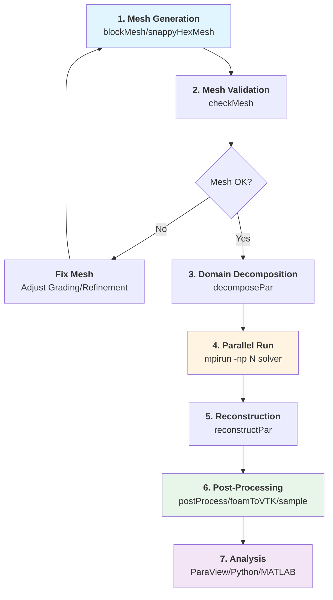

# เครื่องมือจำเป็นสำหรับงาน CFD ทั่วไป (Essential Utilities for Common CFD Tasks)

ระบบยูทิลิตี้ของ OpenFOAM นำเสนอเครื่องมือที่ครอบคลุมทุกขั้นตอนของเวิร์กโฟลว์ CFD ตั้งแต่การเตรียม Mesh ไปจนถึงการวิเคราะห์ผลลัพธ์เชิงลึก

---

## 1. กระบวนการเตรียม Mesh (Mesh Preparation Pipeline)

### 1.1 การสร้าง Mesh เริ่มต้นด้วย blockMesh

**blockMesh** เป็นเครื่องมือหลักในการสร้าง Mesh แบบโครงสร้าง (Hexahedral) โดยอาศัยการแม็พจากพื้นที่พารามิเตอร์ไปยังพื้นที่จริง (Computational Domain)

> [!INFO] หลักการของ Block Meshing
> blockMesh ใช้การแม็พแบบ Transfinite Interpolation โดยที่แต่ละ Block ถูกกำหนดด้วย 8 Vertices และการแบ่งส่วน (Grading) สามารถควบคุมความละเอียดของ Mesh ในแต่ละทิศทาง

**รากฐานคณิตศาสตร์**:

การแม็พจากพื้นที่พารามิเตอร์ $(\xi_1, \xi_2, \xi_3) \in [0,1]^3$ ไปยังพื้นที่กายภาพ $\mathbf{x} = (x, y, z)$:

$$\mathbf{x}(\xi_1, \xi_2, \xi_3) = \mathbf{x}_0 + \sum_{i=1}^{3} \xi_i \mathbf{e}_i + \sum_{i=1}^{3} \sum_{j=i+1}^{3} \xi_i \xi_j \mathbf{e}_{ij} + \xi_1 \xi_2 \xi_3 \mathbf{e}_{123}$$

โดยที่:
- $\mathbf{x}_0$ คือ ตำแหน่งของ Vertex ที่มุมศูนย์
- $\mathbf{e}_i$ คือ เวกเตอร์ฐานตามแกนพารามิเตอร์
- $\mathbf{e}_{ij}$ และ $\mathbf{e}_{123}$ คือ เทอมที่ไม่เป็นเชิงเส้นสำหรับการแม็พที่ซับซ้อน

**ตัวอย่างไฟล์ `blockMeshDict`**:

```cpp
// NOTE: Synthesized by AI - Verify parameters
FoamFile
{
    version     2.0;
    format      ascii;
    class       dictionary;
    object      blockMeshDict;
}
// * * * * * * * * * * * * * * * * * * * * * * * * * * * //

convertToMeters 0.1;  // หน่วยของการสร้าง Mesh (ตัวคูณ)

vertices
(
    (0 0 0)        // Vertex 0
    (1 0 0)        // Vertex 1
    (1 1 0)        // Vertex 2
    (0 1 0)        // Vertex 3
    (0 0 0.5)      // Vertex 4
    (1 0 0.5)      // Vertex 5
    (1 1 0.5)      // Vertex 6
    (0 1 0.5)      // Vertex 7
);

blocks
(
    hex (0 1 2 3 4 5 6 7) (100 100 50) simpleGrading (1 1 1)
);

edges
(
    // สำหรับ curved edges ใช้ spline หรือ arc
    // arc 0 1 (0.5 0.1 0)
);

boundary
(
    inlet
    {
        type patch;
        faces
        (
            (0 4 7 3)
        );
    }
    outlet
    {
        type patch;
        faces
        (
            (1 5 6 2)
        );
    }
    walls
    {
        type wall;
        faces
        (
            (0 1 5 4)
            (1 2 6 5)
            (2 3 7 6)
            (3 0 4 7)
        );
    }
);
```

> [!TIP] การควบคุมความละเอียดของ Mesh
> ใช้ `simpleGrading` เพื่อสร้าง Mesh ที่มีความละเอียดแปรผันตามตำแหน่ง:
> - `simpleGrading (1 1 1)`: ความละเอียดสม่ำเสมอ
> - `simpleGrading (2 1 0.5)`: หนาแน่น 2 เท่าที่ inlet, 1 เท่ากลาง, 0.5 เท่าที่ outlet

---

### 1.2 การสร้าง Mesh ซับซ้อนด้วย snappyHexMesh

สำหรับเรขาคณิตที่ซับซ้อน **snappyHexMesh** ใช้กระบวนการ 3 ขั้นตอนหลัก:

1. **Casting**: สร้าง Background Mesh จาก blockMesh
2. **Snapping**: ปรับพื้นผิว Mesh ให้สอดคล้องกับ Surface Geometry (STL)
3. **Layer Addition**: เพิ่ม Boundary Layer Cells (Prismatic Layers)

**รากฐานคณิตศาสตร์ - Snapping Algorithm**:

การปรับตำแหน่ง Vertex ให้ใกล้กับพื้นผิว Geometry ใช้วิธีการ Projections:

$$\mathbf{x}_{\text{new}} = \mathbf{x}_{\text{old}} + \alpha \left( \mathbf{x}_{\text{surface}} - \mathbf{x}_{\text{old}} \right)$$

โดยที่:
- $\alpha$ คือ สัมประสิทธิ์การผ่อนคลาย (Relaxation Factor) $\in [0, 1]$
- $\mathbf{x}_{\text{surface}}$ คือ ตำแหน่งที่ Projection ลงบน Surface

**สำหรับ Boundary Layers**:

ความสูงของ Cell ชั้นแรก ($y_1$) ถูกคำนวณจากค่า $y^+$ ที่ต้องการ:

$$y_1 = \frac{y^+ \mu}{\rho u_\tau}$$

โดยที่ $u_\tau = \sqrt{\frac{\tau_w}{\rho}}$ คือ Friction Velocity

**ตัวอย่างไฟล์ `snappyHexMeshDict`**:

```cpp
// NOTE: Synthesized by AI - Verify parameters
FoamFile
{
    version     2.0;
    format      ascii;
    class       dictionary;
    object      snappyHexMeshDict;
}

castellatedMesh true;
snap true;
addLayers true;

geometry
{
    airfoil.stl
    {
        type triSurfaceMesh;
        name airfoil;
    }
}

castellatedMeshControls
{
    maxLocalCells 10000000;
    maxGlobalCells 20000000;
    minRefinementCells 10;

    nCellsBetweenLevels 3;

    features
    (
        {
            file "airfoil.eMesh";
            level 2;
        }
    );

    refinementSurfaces
    {
        airfoil
        {
            level (2 2);  // (surface level, gap level)
        }
    }

    resolveFeatureAngle 30;
}

snapControls
{
    nSmoothPatch 3;
    tolerance 2.0;
    nSolveIter 30;
    nRelaxIter 5;
}

addLayersControls
{
    relativeSizes true;

    layers
    {
        airfoil
        {
            nSurfaceLayers 3;
        }
    }

    expansionRatio 1.2;
    finalLayerThickness 0.3;
    minThickness 0.1;
    nGrow 0;
    featureAngle 80;
    nRelaxIter 3;
    nSmoothSurfaceNormals 1;
    nSmoothNormals 3;
    nSmoothThickness 10;
    maxFaceThicknessRatio 0.5;
    maxThicknessToMedialRatio 0.3;
    minMedianAxisAngle 90;
}
```

---

### 1.3 การตรวจสอบคุณภาพ Mesh ด้วย checkMesh

> [!WARNING] ขั้นตอนสำคัญก่อนการรัน Simulation
> การใช้ **checkMesh** เป็นขั้นตอนที่ "ข้ามไม่ได้" ก่อนเริ่มรัน Solver เพื่อประมวลผลเมตริกที่ส่งผลต่อเสถียรภาพและความแม่นยำของการคำนวณ

**เกณฑ์คุณภาพที่สำคัญ**:

| มาตรวัด (Metric) | เกณฑ์ที่ยอมรับได้ (Acceptable) | คำอธิบาย |
|---|---|---|
| **Non-orthogonality** | < 70° (แนะนำให้ < 65°) | ความเอียงของ Face เทียบกับเส้นเชื่อม Cell Centers |
| **Skewness** | < 4.0 | ความบิดเบี้ยวของ Cell จากรูปทรงสมบูรณ์ |
| **Aspect Ratio** | < 100 (อุดมคติ < 50) | อัตราส่วนของความยาว Cell ในทิศทางต่างๆ |
| **Concavity** | < 80° | ความเว้าของ Face |
| **Volume** | > 0 | ปริมาตรของ Cell ต้องเป็นบวก |

**คำสั่งการใช้งาน**:

```bash
# การตรวจสอบพื้นฐาน
checkMesh

# การตรวจสอบพร้อมรายละเอียดเชิงลึก
checkMesh -allGeometry -allTopology

# การตรวจสอบเฉพาะบางเขต
checkMesh -region air

# การสร้างไฟล์รายงาน
checkMesh > meshCheckReport.txt
```

**การตีความผลลัพธ์**:

> [!INFO] การจัดการ Mesh ที่ไม่ผ่านเกณฑ์
> - ถ้า **Non-orthogonality > 70°**: ใช้ `nonOrthogonalCorrection` ใน `fvSchemes`
> - ถ้า **Skewness สูงเกินไป**: ปรับ Grading ใน blockMesh หรือเพิ่ม Refinement ใน snappyHexMesh
> - ถ้า **Aspect Ratio สูง**: ลดจำนวน Cells ในทิศทางหนึ่งหรือปรับ Geometry

---

## 2. การตั้งค่าการประมวลผลแบบขนาน (Parallel Processing Setup)

### 2.1 การย่อยโดเมนด้วย decomposePar

เพื่อให้การจำลองทำได้อย่างรวดเร็วบนหลาย CPU หรือ Computing Nodes เราต้องใช้ **decomposePar** ในการแบ่ง Mesh ออกเป็นส่วนย่อยๆ (Subdomains)

**รากฐานคณิตศาสตร์ - Domain Decomposition**:

เป้าหมายของการย่อยโดเมนคือการลดภาระการสื่อสาร (Communication Overhead) ระหว่าง Processors โดยแบ่งปัน Interfaces:

$$\text{Minimize } \sum_{i=1}^{N_p} \sum_{j>i}^{N_p} C_{ij}$$

โดยที่:
- $N_p$ คือ จำนวน Processors
- $C_{ij}$ คือ ค่าใช้จ่ายในการสื่อสารระหว่าง Processor $i$ และ $j$

**วิธีการย่อยโดเมน (Methods)**:

| วิธีการ (Method) | คำอธิบาย | กรณีที่เหมาะสม |
|---|---|
| **simple** | แบ่งเป็นบล็อกตามแกน X, Y, Z แบบสมมาตร | เรขาคณิตสี่เหลี่ยมธรรมดา |
| **scotch** | อัลกอริทึมฐานกราฟ (Graph Partitioning) | เรขาคณิตซับซ้อน, แนะนำให้ใช้เป็นค่าเริ่มต้น |
| **hierarchical** | แบ่งตามลำดับชั้น (เช่น ตาม Computing Nodes ก่อน แล้วค่อยแบ่งตาม Cores) | HPC Clusters ขนาดใหญ่ |
| **manual** | ผู้ใช้กำหนด Subdomains เอง | กรณีพิเศษที่ต้องการควบคุมเฉพาะ |

**ตัวอย่างไฟล์ `decomposeParDict`**:

```cpp
// NOTE: Synthesized by AI - Verify parameters
FoamFile
{
    version     2.0;
    format      ascii;
    class       dictionary;
    object      decomposeParDict;
}

// จำนวน Subdomains
numberOfSubdomains 4;

// วิธีการย่อยโดเมน
method scotch;

// หรือใช้ simple:
// method simple;
// simpleCoeffs
// {
//     n (2 2 1);  // แบ่ง 2 ใน X, 2 ใน Y, 1 ใน Z = 4 Subdomains
//     delta 0.001;
// }

// หรือใช้ hierarchical สำหรับ HPC:
// method hierarchical;
// hierarchicalCoeffs
// {
//     n (2 2);  // 2 Nodes, 2 Cores per Node
//     delta 0.001;
//     order xyz;
// }
```

**คำสั่งการใช้งาน**:

```bash
# การย่อยโดเมน
decomposePar

# การย่อยเฉพาะบาง Region
decomposePar -region air

# การใช้งานร่วมกับ Time Directories
decomposePar -time '0, 100, 200'
```

> [!TIP] การเลือกจำนวน Processors
> เป้าหมายคือให้แต่ละ Processor มี Cells ประมาณ **50,000 - 200,000 Cells** เพื่อสมดุลระหว่าง Parallel Efficiency กับ Communication Overhead

---

### 2.2 การรัน Solver แบบขนาน

หลังจากย่อยโดเมนแล้ว สามารถรัน Solver แบบขนานได้โดยใช้ MPI (Message Passing Interface)

**คำสั่งการรันพื้นฐาน**:

```bash
# การรันแบบขนานบน Single Machine
mpirun -np 4 simpleFoam -parallel

# การรันด้วยการระบุ Hostfile (สำหรับ Cluster)
mpirun -np 16 -hostfile hosts simpleFoam -parallel

# การรันบน SLURM Scheduler
srun -np 64 simpleFoam -parallel

# การรันและบันทึก Log ไฟล์
mpirun -np 8 simpleFoam -parallel > log.simpleFoam 2>&1
```

**ไฟล์ `hosts` สำหรับ HPC**:

```bash
# NOTE: Synthesized by AI - Verify hostname
node001 slots=4
node002 slots=4
```

---

### 2.3 การรวมผลลัพธ์ด้วย reconstructPar

หลังจำลองเสร็จสิ้น ให้ใช้ **reconstructPar** เพื่อรวบรวมข้อมูลจากโฟลเดอร์ `processor*` กลับมาเป็นโดเมนเดียวเพื่อทำ Post-processing

**รากฐานคณิตศาสตร์ - Reconstruction**:

การรวมข้อมูลจาก Subdomains กลับมาเป็นฟิลด์เดียว:

$$\phi(\mathbf{x}) = \bigcup_{i=1}^{N_p} \phi_i(\mathbf{x}) \quad \text{สำหรับ } \mathbf{x} \in \Omega_i$$

โดยที่:
- $\phi$ คือ ฟิลด์ที่รวมแล้ว (Reconstructed Field)
- $\phi_i$ คือ ฟิลด์ย่อยจาก Processor $i$
- $\Omega_i$ คือ พื้นที่ Subdomain ของ Processor $i$

**คำสั่งการใช้งาน**:

```bash
# การรวมผลลัพธ์ทั้งหมด
reconstructPar

# การรวมเฉพาะ Time Steps ที่ระบุ
reconstructPar -time '0:1000'

# การรวมเฉพาะบาง Fields
reconstructPar -fields '(p U)'

# การรวมเฉพาะบาง Region
reconstructPar -region air
```

> [!INFO] ทางเลือกอื่น: reconstructParMesh
> ถ้าต้องการรวมเฉพาะโครงสร้าง Mesh โดยไม่รวม Fields ให้ใช้:
> ```bash
> reconstructParMesh
> ```

---

## 3. ไปป์ไลน์การวิเคราะห์ผลลัพธ์ (Post-Processing Pipeline)

### 3.1 การแปลงข้อมูลด้วย foamToVTK

แปลงผลลัพธ์ดั้งเดิมของ OpenFOAM ให้เป็นรูปแบบ VTK (Visualization Toolkit) เพื่อเปิดใน ParaView, VisIt, หรือซอฟต์แวร์ Visualization อื่นๆ

**รากฐานคณิตศาสตร์ - Data Transformation**:

การแปลงฟิลด์จากรูปแบบ Finite Volume ของ OpenFOAM ไปเป็นรูปแบบ Unstructured Grid ของ VTK:

$$\mathcal{T}: \{\Omega_i, \phi_i\}_{i=1}^{N_c} \rightarrow \{P_j, C_j, \Phi_j\}_{j=1}^{N_v}$$

โดยที่:
- $\Omega_i$ คือ Cell ที่ $i$ ใน OpenFOAM
- $P_j$ คือ Points (Vertices) ใน VTK
- $C_j$ คือ Cells (Connectivity) ใน VTK
- $\Phi_j$ คือ Field Values ที่ Points/Cells

**คำสั่งการใช้งาน**:

```bash
# การแปลงทุก Time Steps
foamToVTK

# การแปลงเฉพาะ Time Step สุดท้าย
foamToVTK -latestTime

# การแปลงเฉพาะบาง Time Steps
foamToVTK -time '0:1000:100'  ทุก 100 steps

# การแปลงพร้อม Surface Fields
foamToVTK -surfaceFields

# การแปลงเฉพาะบาง Regions
foamToVTK -region air

# การแปลงเป็น Binary VTK (ไฟล์เล็กลง)
foamToVTK -binary
```

> [!TIP] การใช้งานกับ ParaView
> หลังจากรัน `foamToVTK` แล้ว สามารถเปิดไฟล์ `VTK/*.vtk` โดยตรงใน ParaView:
> ```bash
> paraview VTK/caseName_1000.vtk
> ```

---

### 3.2 การคำนวณฟิลด์อนุพัทธ์ด้วย postProcess

**postProcess** เป็นยูทิลิตี้ที่ทรงพลังในการคำนวณฟิลด์อนุพัทธ์ (Derived Fields) และปริมาณทางวิศวกรรมโดยไม่ต้องรัน Solver ใหม่ ทำงานโดยใช้ **Function Objects**

**รากฐานคณิตศาสตร์ - Gradient Calculation**:

การคำนวณ Gradient ของฟิลด์สเกลาร์ $\phi$:

$$\nabla \phi = \sum_{f} \phi_f \mathbf{S}_f$$

โดยที่:
- $\phi_f$ คือ ค่าของฟิลด์ที่ Face Center
- $\mathbf{S}_f$ คือ เวกเตอร์พื้นที่ Face (Area Vector)

**การคำนวณ Vorticity**:

สำหรับฟิลด์ความเร็ว $\mathbf{u}$, Vorticity $\boldsymbol{\omega}$ ถูกกำหนดเป็น:

$$\boldsymbol{\omega} = \nabla \times \mathbf{u} = \left( \frac{\partial w}{\partial y} - \frac{\partial v}{\partial z} \right) \mathbf{i} + \left( \frac{\partial u}{\partial z} - \frac{\partial w}{\partial x} \right) \mathbf{j} + \left( \frac{\partial v}{\partial x} - \frac{\partial u}{\partial y} \right) \mathbf{k}$$

**คำสั่งการใช้งานทั่วไป**:

```bash
# การคำนวณความเค้นเฉือนที่ผนัง
postProcess -func wallShearStress

# การคำนวณ yPlus
postProcess -func yPlus

# การคำนวณ Vorticity
postProcess -func vorticity

# การคำนวณค่าเฉลี่ย Surface-weighted
postProcess -func 'mag(U)' -time '0:1000'  # คำนวณ |U| ทุก Time Step

# การคำนวณหลาย Functions พร้อมกัน
postProcess -func '(wallShearStress yPlus)'
```

**Function Objects ที่ใช้บ่อย**:

| Function | คำอธิบาย | สมการ/การใช้งาน |
|---|---|
| **wallShearStress** | คำนวณความเค้นเฉือนที่ผนัง | $\boldsymbol{\tau}_w = \mu \left( \nabla \mathbf{u} + (\nabla \mathbf{u})^T \right) \cdot \mathbf{n}$ |
| **yPlus** | ตรวจสอบค่า $y^+$ สำหรับ Turbulence Modeling | $y^+ = \frac{y u_\tau}{\nu}$ |
| **CourantNo** | คำนวณจำนวน Courant สำหรับเสถียรภาพเชิงเวลา | $Co = \frac{|\mathbf{u}| \Delta t}{\Delta x}$ |
| **vorticity** | คำนวณ Vorticity field | $\boldsymbol{\omega} = \nabla \times \mathbf{u}$ |
| **Q-criterion** | คำนวณ Q-criterion สำหรับ Visualize Vortices | $Q = \frac{1}{2} \left( \|\boldsymbol{\Omega}\|^2 - \|\mathbf{S}\|^2 \right)$ |
| **forces** | คำนวณ Drag, Lift, Moment รวม | $\mathbf{F} = \int_{\partial \Omega} \left( -p\mathbf{I} + \boldsymbol{\tau} \right) \cdot \mathbf{n} \, dA$ |

**การตั้งค่า Function Objects ใน `controlDict`**:

```cpp
// NOTE: Synthesized by AI - Verify parameters
functions
{
    // การคำนวณ Drag และ Lift
    forces
    {
        type forces;
        libs ("libforces.so");

        writeControl timeStep;
        writeInterval 1;

        patches (airfoil);

        rho rhoInf;
        rhoInf 1.225;  // ความหนาแน่นอากาศ (kg/m^3)

        CofR (0.25 0 0);  // Center of Rotation
        pitchAxis (0 1 0);  // แกน Pitch

        magUInf 10.0;  // ความเร็วกระแสอิสระ (m/s)
        liftDir (0 1 0);  // ทิศทาง Lift
        dragDir (1 0 0);  // ทิศทาง Drag

        log true;
    }

    // การคำนวณ yPlus
    yPlus
    {
        type yPlus;
        libs ("libfieldFunctionObjects.so");

        writeControl timeStep;
        writeInterval 10;

        log true;
    }

    // การคำนวณ Vorticity
    vorticity
    {
        type vorticity;
        libs ("libfieldFunctionObjects.so");

        writeControl timeStep;
        writeInterval 100;

        resultName vorticity;
    }
}
```

**ผลลัพธ์ตัวอย่าง**:

> **[MISSING DATA]**: แทรกผลลัพธ์จำลองจริง เช่น:
> - ค่า Drag Coefficient ($C_d$) และ Lift Coefficient ($C_l$)
> - กราฟ Evolution ของ $y^+$ ตามเวลา
> - Contour Plot ของ Wall Shear Stress
> - Iso-surface ของ Q-criterion

---

### 3.3 การสุ่มตัวอย่างข้อมูลด้วย sample

ยูทิลิตี้ **sample** ใช้สำหรับสุ่มตัวอย่างข้อมูล (Sampling) จากฟิลด์ 3D ไปยังจุด เส้น หรือพื้นผิวที่กำหนด

**รากฐานคณิตศาสตร์ - Interpolation**:

การแปลงค่าจาก Cell Centers ไปยังตำแหน่งที่ต้องการใช้ Interpolation:

$$\phi(\mathbf{x}_{\text{sample}}) = \sum_{i} w_i \phi_i$$

โดยที่:
- $\phi_i$ คือ ค่าฟิลด์ที่ Cell Center $i$
- $w_i$ คือ น้ำหนัก Interpolation (เช่น Cell-based, Inverse Distance)

**การตั้งค่าใน `sampleDict`**:

```cpp
// NOTE: Synthesized by AI - Verify parameters
FoamFile
{
    version     2.0;
    format      ascii;
    class       dictionary;
    object      sampleDict;
}

// ชุดข้อมูลที่จะสุ่ม (Fields to Sample)
fields (p U k epsilon omega);

// วิธีการ Interpolation
interpolationScheme cellPoint;

// รูปแบบ Output
setFormat raw;  // หรือ csv, vtk, gnuplot

// Sampling Sets
sets
(
    // การสุ่มตามเส้น (Line Sampling)
    midLine
    {
        type uniform;
        axis x;
        start (0.0 0.5 0.5);
        end (1.0 0.5 0.5);
        nPoints 100;
    }

    // การสุ่มตามพื้นผิว (Surface Sampling)
    airfoilSurface
    {
        type surfMesh;
        surfaceFormat vtk;
        surfMesh airfoil.stl;
        interpolate true;
    }

    // การสุ่มตาม Cloud ของจุด
    probePoints
    {
        type cloud;
        points
        (
            (0.25 0.5 0.5)
            (0.5 0.5 0.5)
            (0.75 0.5 0.5)
        );
    }
);

// Sampling Surfaces
surfaces
(
    cuttingPlane
    {
        type plane;
        planeEquation normal (1 0 0);
        point (0.5 0 0);
        interpolate true;
    }
);
```

**คำสั่งการใช้งาน**:

```bash
# การสุ่มข้อมูล
sample

# การสุ่มเฉพาะ Time Steps ที่ระบุ
sample -time '100, 200, 300'

# การสุ่มเฉพาะบาง Fields
sample -fields '(p U)'

# การสุ่มพร้อมระบุ Dictionary
sample -dict system/sampleDictCustom
```

> [!TIP] การใช้งานกับ Python/MATLAB
> ไฟล์ Output จาก `sample` (โดยเฉพาะ `raw` หรือ `csv`) สามารถนำเข้าไปวิเคราะห์ใน Python หรือ MATLAB ได้ทันที:
> ```python
> import numpy as np
> data = np.loadtxt('sets/midLine_100.xy')
> x = data[:, 0]
> p = data[:, 1]
> ```

---

### 3.4 การวิเคราะห์การลู่เข้าด้วย pyFoamPlotRunner

**pyFoamPlotRunner** เป็นเครื่องมือใน PyFoam Library สำหรับ Monitoring และ Plotting ค่า Initial Residuals แบบ Real-time ขณะรัน Solver

**รากฐานคณิตศาสตร์ - Convergence Criteria**:

สำหรับระบบสมการ Linear $A\mathbf{x} = \mathbf{b}$, Residual ที่ Iteration $k$:

$$\mathbf{r}^{(k)} = \mathbf{b} - A\mathbf{x}^{(k)}$$

เกณฑ์การลู่เข้า (Convergence Criteria):

$$\frac{\|\mathbf{r}^{(k)}\|}{\|\mathbf{r}^{(0)}\|} < \epsilon \quad \text{โดยที่ } \epsilon \approx 10^{-5} \text{ ถึง } 10^{-7}$$

**คำสั่งการใช้งาน**:

```bash
# การรัน Solver พร้อม Plotting Real-time
pyFoamPlotRunner.py simpleFoam

# การรันแบบขนาน
pyFoamPlotRunner.py --parallel simpleFoam

# การรันและบันทึก Plot เป็นไฟล์ PNG
pyFoamPlotRunner.py --hardcopy simpleFoam

# การรันพร้อมระบุ Solver Options
pyFoamPlotRunner.py simpleFoam -parallel
```

**ผลลัพธ์ที่ได้**:

> **[MISSING DATA]**: แทรกกราฟ Residual Evolution ตัวอย่าง:
> - Initial Residuals ของ Pressure ($p$) และ Velocity ($\mathbf{u}$)
> - การแสดงว่า Converge ภายในกี่ Iterations
> - การเปรียบเทียบระหว่าง Different Solvers (GAMG, PCG)

---

## 4. การปรับแต่ง Performance (Performance Tuning)

### 4.1 การตั้งค่า Linear Solvers ใน `fvSolution`

**รากฐานคณิตศาสตร์ - Linear Solvers**:

สำหรับระบบ $A\mathbf{x} = \mathbf{b}$, OpenFOAM ให้เลือก Krylov Subspace Methods:

1. **Conjugate Gradient (CG)**: สำหรับ Matrix สมมาตรบวกแน่นอน (Symmetric Positive Definite)
2. **Generalized Minimal Residual (GMRES)**: สำหรับ Matrix ไม่สมมาตร (Non-symmetric)
3. **Bi-Conjugate Gradient Stabilized (BiCGStab)**: ทางเลือกของ GMRES สำหรับ Non-symmetric

**Preconditioners**:

เพื่อเร่งการลู่เข้า ใช้ Preconditioner $M \approx A^{-1}$:

$$M A \mathbf{x} = M \mathbf{b} \quad \Rightarrow \quad \mathbf{x} \approx M^{-1}\mathbf{b}$$

ตัวเลือกที่ใช้บ่อย:
- **DIC (Diagonal Incomplete Cholesky)**: สำหรับ Symmetric Matrix
- **DILU (Diagonal Incomplete LU)**: สำหรับ Non-symmetric Matrix
- **GAMG (Geometric-Algebraic Multi-Grid)**: สำหรับ Large-scale Systems

**ตัวอย่างไฟล์ `fvSolution`**:

```cpp
// NOTE: Synthesized by AI - Verify parameters
FoamFile
{
    version     2.0;
    format      ascii;
    class       dictionary;
    object      fvSolution;
}

solvers
{
    // สำหรับ Pressure (Symmetric Matrix)
    p
    {
        solver          GAMG;
        tolerance       1e-06;
        relTol          0.1;

        smoother        GaussSeidel;

        cacheAgglomeration true;
        nCellsInCoarsestLevel 10;
        agglomerator    faceAreaPair;
        mergeLevels     1;
    }

    // สำหรับ Velocity หรือ Non-symmetric Fields
    U
    {
        solver          smoothSolver;
        smoother        GaussSeidel;
        tolerance       1e-05;
        relTol          0.1;
    }

    // สำหรับ Turbulence Quantities (k, epsilon, omega)
    k
    {
        solver          smoothSolver;
        smoother        GaussSeidel;
        tolerance       1e-05;
        relTol          0.1;
    }

    epsilon
    {
        solver          smoothSolver;
        smoother        GaussSeidel;
        tolerance       1e-05;
        relTol          0.1;
    }
}

// การตั้งค่า Algorithms
SIMPLE
{
    nNonOrthogonalCorrectors 0;

    consistent      yes;

    residualControl
    {
        p               1e-4;
        U               1e-4;
        "(k|epsilon|omega)" 1e-4;
    }
}

relaxationFactors
{
    fields
    {
        p               0.3;
    }
    equations
    {
        U               0.7;
        "(k|epsilon|omega)" 0.8;
    }
}
```

> [!INFO] การเลือก Preconditioner
> - **GAMG**: เหมาะสำหรับ Large Meshes (> 1M Cells) และ Single-phase Flows
> - **smoothSolver + GaussSeidel**: เหมาะสำหรับ Small-Medium Meshes (< 500K Cells)
> - **PCG + DIC**: ทางเลือกสำหรับ Pressure ใน Incompressible Flows

---

### 4.2 การตั้งค่า Discretization Schemes ใน `fvSchemes`

**รากฐานคณิตศาสตร์ - Discretization**:

การ Discretize สมการ Transport:

$$\frac{\partial \phi}{\partial t} + \nabla \cdot (\mathbf{u} \phi) = \nabla \cdot (D \nabla \phi) + S_\phi$$

**1. Temporal Discretization**:

$$\frac{\partial \phi}{\partial t} \approx \frac{3\phi^{n+1} - 4\phi^n + \phi^{n-1}}{2\Delta t} \quad \text{(Second-Order Backward)}$$

ทางเลือก:
- **Euler**: First-order ($\frac{\phi^{n+1} - \phi^n}{\Delta t}$)
- **backward**: Second-order
- **CrankNicolson**: Second-order (Implicit)

**2. Spatial Discretization**:

- **Gradient Schemes**:
  - **Gauss linear**: Second-order Central Differencing
  - **leastSquares**: Second-order (เหมาะกับ Non-orthogonal Mesh)

- **Divergence Schemes** (Convection Terms):
  - **Gauss upwind**: First-order (Numerically Stable, Numerically Diffusive)
  - **Gauss linear**: Second-order Central Differencing (Unconditionally Stable สำหรับ Laminar)
  - **Gauss linearUpwind**: Second-order Upwind (Stable สำหรับ Turbulent)
  - **Gauss vanLeer**: TVD Scheme (ผสม First/Second-order)

- **Laplacian Schemes** (Diffusion Terms):
  - **Gauss linear corrected**: รวม Non-orthogonal Correction

**ตัวอย่างไฟล์ `fvSchemes`**:

```cpp
// NOTE: Synthesized by AI - Verify parameters
FoamFile
{
    version     2.0;
    format      ascii;
    class       dictionary;
    object      fvSchemes;
}

ddtSchemes
{
    default         backward;  // Second-order Transient
}

gradSchemes
{
    default         Gauss linear;

    // สำหรับ Non-orthogonal Mesh
    // default         leastSquares;
}

divSchemes
{
    default         none;

    // สำหรับ Incompressible Solvers (simpleFoam, pimpleFoam)
    div(phi,U)      Gauss linearUpwind grad(U);
    div(phi,k)      Gauss linearUpwind grad(k);
    div(phi,epsilon) Gauss linearUpwind grad(epsilon);

    // สำหรับ Compressible Solvers (rhoPimpleFoam)
    div(phi,U)      Gauss upwind;  // เริ่มด้วย First-order

    // สำหรับ VOF Method (interFoam)
    div(phi,alpha)  Gauss vanLeer;  // TVD Scheme
}

laplacianSchemes
{
    default         Gauss linear corrected;
}

interpolationSchemes
{
    default         linear;
}

snGradSchemes
{
    default         corrected;
}
```

> [!WARNING] ความสำคัญของ Non-orthogonal Correction
> ถ้า **Non-orthogonality > 70°**, ให้เพิ่ม `nNonOrthogonalCorrectors` ใน `fvSolution`:
> ```cpp
> SIMPLE
> {
>     nNonOrthogonalCorrectors 3;  // แก้ไข 3 รอบต่อ Time Step
> }
> ```

---

### 4.3 การใช้งาน dynamicMeshDict สำหรับ Moving Meshes

สำหรับ Flows ที่มี Moving Boundaries (เช่น FSI, Rotating Machinery)

**รากฐานคณิตศาสตร์ - Arbitrary Lagrangian-Eulerian (ALE)**:

สมการ Conservation บน Mesh ที่เคลื่อนที่:

$$\frac{d}{dt} \int_{\Omega(t)} \phi \, dV + \int_{\partial \Omega(t)} \phi (\mathbf{u} - \mathbf{u}_m) \cdot \mathbf{n} \, dA = \int_{\partial \Omega(t)} D \nabla \phi \cdot \mathbf{n} \, dA$$

โดยที่:
- $\mathbf{u}_m$ คือ ความเร็วของ Mesh (Mesh Velocity)
- $(\mathbf{u} - \mathbf{u}_m)$ คือ Relative Velocity

**ตัวอย่างไฟล์ `dynamicMeshDict`**:

```cpp
// NOTE: Synthesized by AI - Verify parameters
FoamFile
{
    version     2.0;
    format      ascii;
    class       dictionary;
    object      dynamicMeshDict;
}

// สำหรับ Rotating Mesh
dynamicFvMesh   solidBodyMotionFvMesh;

motionSolverLibs ("libfvMotionSolvers.so");

solidBodyMotionFunction  rotatingMotion;

rotatingMotionCoeffs
{
    origin          (0 0 0);  // จุดศูนย์กลางการหมุน
    axis            (0 0 1);  // แกนการหมุน (Z-axis)
    omega           100;      // ความเร็วเชิงมุม (rad/s)
}
```

ทางเลือกอื่น:
- **dynamicFvMesh staticFvMesh**: Mesh คงที่
- **dynamicFvMesh dynamicMotionSolverFvMesh**: ใช้ Laplacian Mesh Motion Solver

---

## 5. การจัดการ Boundary Conditions ขั้นสูง

### 5.1 การใช้ `timeVaryingMappedFixedValue` สำหรับ Inlet Profiles

สำหรับการกำหนด Inlet ที่แปรผันตามเวลาหรือตำแหน่ง (เช่น Atmospheric Boundary Layer, Turbulence Inflow)

**ตัวอย่างการตั้งค่า**:

```cpp
// ไฟล์ 0/U
boundaryField
{
    inlet
    {
        type            timeVaryingMappedFixedValue;
        setAverage      off;
        offset          (0 0 0);
        points          (
            (0 0 0)
            (0 0.1 0)
            (0 0.2 0)
            // ...
        );
    }

    // หรือใช้ profiles จากไฟล์
    inlet
    {
        type            timeVaryingMappedFixedValue;
        fieldTable      U;
        outOfBounds     clamp;  // หรือ warn, error
    }
}
```

---

### 5.2 การใช้ `codedFixedValue` สำหรับ Custom BC

สำหรับกรณีที่ต้องการ BC ที่ซับซ้อนและไม่มีใน Built-in Types

**ตัวอย่างการตั้งค่า**:

```cpp
// NOTE: Synthesized by AI - Verify parameters
boundaryField
{
    inlet
    {
        type            codedFixedValue;
        value           uniform (0 0 0);

        code
        #{
            const fvPatch& patch = this->patch();
            const vectorField& Cf = patch.Cf();

            vectorField& U = *this;

            // Parabolic Profile: U = U_max * (1 - (r/R)^2)
            scalar U_max = 10.0;
            scalar R = 0.5;

            forAll(Cf, i)
            {
                scalar r = sqrt(pow(Cf[i].y(), 2) + pow(Cf[i].z(), 2));
                U[i] = vector(U_max * (1.0 - pow(r/R, 2)), 0, 0);
            }
        #};
    }
}
```

---

## 🎓 สรุปเวิร์กโฟลว์มาตรฐาน (Standard Workflow Summary)



---

## 📚 อ้างอิงเชิงลึก (Further References)

1. **OpenFOAM User Guide**: [https://www.openfoam.com/documentation/user-guide/](https://www.openfoam.com/documentation/user-guide/)
2. **OpenFOAM Programmer's Guide**: [https://www.openfoam.com/documentation/programmers-guide/](https://www.openfoam.com/documentation/programmers-guide/)
3. **C Direct Numerical Simulation (DNS)**: Ferziger & Perić, *Computational Methods for Fluid Dynamics*
4. **Turbulence Modeling**: Wilcox, *Turbulence Modeling for CFD*
5. **Mesh Quality Metrics**: J. D. Anderson, *Computational Fluid Dynamics*

---

**หัวข้อถัดไป**: [[06_Creating_Custom_Utilities]] สำหรับการพัฒนาเครื่องมือเฉพาะทางของคุณเอง

**หัวข้อที่เกี่ยวข้อง**:
- [[03_Advanced_Meshing_Techniques]] สำหรับ Mesh Generation ขั้นสูง
- [[05_Automation_Scripting]] สำหรับการเขียน Script อัตโนมัติ
- [[07_Performance_Optimization]] สำหรับการปรับแต่ง Performance
