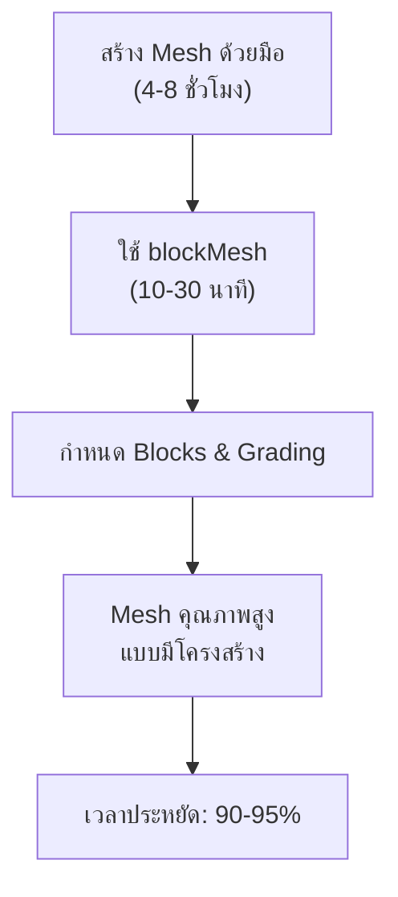
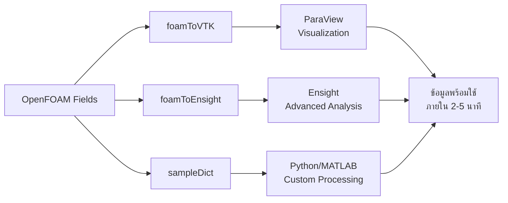
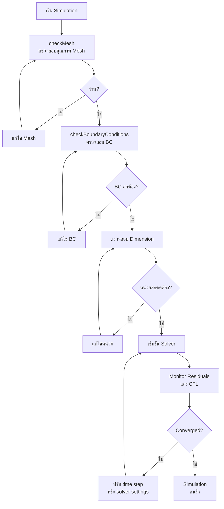

# ประโยชน์ด้านการประหยัดเวลา (Time-Saving Benefits)

การใช้ยูทิลิตี้ของ OpenFOAM อย่างเป็นระบบช่วยลดเวลาในการทำงาน (CFD Workflow) ได้อย่างมหาศาล โดยการทำให้งานที่ซ้ำซ้อนเป็นไปอย่างอัตโนมัติ การสร้างมาตรฐานการทำงาน และการป้องกันข้อผิดพลาดที่พบบ่อย

---

## 1. การทำงานอัตโนมัติของงานที่ซ้ำซ้อน (Automation of Repetitive Tasks)

### 1.1 ประสิทธิภาพการสร้าง Mesh ด้วย blockMesh

การใช้ **blockMesh** ช่วยลดเวลาในการสร้าง Mesh จากหลายชั่วโมงเหลือเพียงไม่กี่นาทีผ่านการระบุพารามิเตอร์ในไฟล์ Dictionary เทคนิคนี้ใช้การแบ่งโดเมนเป็น **Blocks** หลายๆ บล็อก ซึ่งแต่ละบล็อกถูกแม็ปจากพื้นที่ physical (x, y, z) ไปยัง computational space (ξ, η, ζ)

> [!TIP] Multi-Block Meshing Strategy
> การใช้ **Grading** ใน blockMesh ช่วยสร้าง Mesh ที่มีความละเอียดแปรผันตามตำแหน่ง เช่น มีความละเอียดสูงบริเวณชั้นขอบ (Boundary Layer) โดยไม่ต้องสร้างแต่ละ Cell ด้วยมือ

#### สมการการแปลงพิกัด (Coordinate Transformation)

การแปลงจาก physical domain ไปยัง computational domain ใช้สมการ:

$$
\mathbf{x} = \sum_{i=0}^{7} N_i(\xi, \eta, \zeta) \mathbf{x}_i
$$

โดยที่:
- $\mathbf{x} = (x, y, z)$ คือตำแหน่งใน physical space
- $(\xi, \eta, \zeta)$ คือพิกัดใน computational space ($0 \leq \xi, \eta, \zeta \leq 1$)
- $N_i$ คือ shape functions สำหรับ hexahedral cell
- $\mathbf{x}_i$ คือตำแหน่งของ vertex ที่ $i$

#### ตัวอย่างการตั้งค่า Grading

```cpp
// NOTE: Synthesized by AI - Verify parameters
// blockMeshDict example with boundary layer refinement
blocks
(
    hex (0 1 2 3 4 5 6 7) (100 50 30) simpleGrading (
        // Grading in x-direction: finer near inlet
        (0.2 0.6 4)  // Start: 0.2, End: 0.6, Power: 4
        // Uniform in y-direction
        1
        // Grading in z-direction: finer near walls
        (0.1 0.9 3)  // Start: 0.1, End: 0.9, Power: 3
    )
);
```



---

### 1.2 การตรวจสอบคุณภาพ Mesh ด้วย checkMesh

**checkMesh** ช่วยกำจัดการตรวจสอบด้วยตนเอง โดยการระบุปัญหาทางเรขาคณิตและโทโพโลยีอย่างเป็นระบบ เพื่อให้มั่นใจว่า Mesh มีคุณภาพเพียงพอสำหรับการแก้สมการ numerically

> [!WARNING] Mesh Quality Thresholds
> ค่าที่แนะนำ:
> - **Max Non-orthogonality** < 70°
> - **Max Skewness** < 4
> - **Max Aspect Ratio** < 1000

#### เกณฑ์การประเมินคุณภาพ Mesh (Mesh Quality Metrics)

**1. Non-orthogonality ($\alpha$):**

$$
\alpha = \arccos\left(\frac{\mathbf{S}_f \cdot \mathbf{d}_P}{|\mathbf{S}_f| |\mathbf{d}_P|}\right)
$$

โดยที่:
- $\mathbf{S}_f$ คือ เวกเตอร์พื้นที่ผิวหน้าเซลล์ (face area vector)
- $\mathbf{d}_P$ คือ เวกเตอร์เชื่อมระหว่างเซ็นทรอยด์ของเซลล์ข้างเคียง

**2. Skewness ($\gamma$):**

$$
\gamma = \frac{|\mathbf{d} - \mathbf{d}_P|}{|\mathbf{d}_P|}
$$

โดยที่:
- $\mathbf{d}$ คือ เวกเตอร์ระหว่างเซ็นทรอยด์เซลล์ปัจจุบันและเซ็นทรอยด์หน้าเซลล์
- $\mathbf{d}_P$ คือ เวกเตอร์ที่แท้จริงระหว่างเซ็นทรอยด์เซลล์ข้างเคียง

**3. Aspect Ratio:**

$$
\text{Aspect Ratio} = \frac{h_{\max}}{h_{\min}}
$$

โดยที่:
- $h_{\max}$ คือ ระยะห่างระหว่าง face ที่ไกลที่สุด
- $h_{\min}$ คือ ระยะห่างระหว่าง face ที่ใกล้ที่สุด

#### ตัวอย่างการตั้งค่า checkMesh

```bash
# NOTE: Synthesized by AI - Verify parameters
# รัน checkMesh พร้อมรายงานโดยละเอียด
checkMesh -case . -allGeometry -allTopology -time 0

# ตรวจสอบเฉพาะเกณฑ์ที่สำคัญ
checkMesh -case . -maxNonOrthogonal 70 -maxSkewness 4

# สร้างไฟล์รายงาน
checkMesh -case . > meshQualityReport.txt
```

#### ผลลัพธ์ที่คาดหวัง

> **[MISSING DATA]**: Insert specific simulation results/graphs for this section.
> ตัวอย่างผลลัพธ์ checkMesh ที่ดี:
> - Mesh OK: Non-orthogonality check
> - Mesh OK: Skewness check
> - Mesh OK: Face flatness check

---

### 1.3 การแลกเปลี่ยนข้อมูลอัตโนมัติ (Data Conversion)

**foamToVTK** และยูทิลิตี้การแปลงรูปแบบอื่นๆ ช่วยให้การส่งออกข้อมูลไปยังซอฟต์แวร์วิเคราะห์ภายนอก (เช่น ParaView, Tecplot, Ensight) เป็นไปได้อย่างรวดเร็วและถูกต้อง

#### รูปแบบไฟล์ที่รองรับ (Supported Formats)

| ยูทิลิตี้ | รูปแบบเอาต์พุต | วัตถุประสงค์หลัก |
|---|---|---|
| **foamToVTK** | VTK (XML/Binary) | ParaView Visualization |
| **foamToEnsight** | Ensight Gold | Post-processing ระดับสูง |
| **foamToTecplot** | Tecplot 360 | วิเคราะห์เชิงวิศวกรรม |
| **sampleDict** | CSV/XY/RAW | การสกัดข้อมูลเชิงปริมาณ |

#### การสกัดข้อมูลตามจุดที่กำหนด (Sampling Data Pointwise)

```cpp
// NOTE: Synthesized by AI - Verify parameters
// system/sampleDict สำหรับสกัดข้อมูลตามเส้นและพื้นผิว
interpolationScheme cellPoint;

sets
(
    lineAlongCenterline
    {
        type    uniform;
        axis    distance;
        start   (0.0 0.0 0.0);
        end     (1.0 0.0 0.0);
        nPoints 100;
    }
);

surfaces
(
    planeSurface
    {
        type        plane;
        planePts    ((0.5 0 0) (0.5 1 0) (0.5 0 1));
        interpolate true;
    }
);
```



---

## 2. การสร้างมาตรฐานการทำงาน (Workflow Standardization)

### 2.1 ส่วนต่อประสานคำสั่งที่เป็นหนึ่งเดียว (Unified CLI)

ยูทิลิตี้ทั้งหมดทำตามรูปแบบคำสั่งเดียวกัน ทำให้วิศวกรเรียนรู้การใช้งานเครื่องมือใหม่ๆ ได้อย่างรวดเร็ว:

> [!INFO] Standard OpenFOAM Command Syntax
> ```bash
> utilityName -case <caseDir> -parallel -latestTime -noFunctionObjects
> ```
>
> **Common Flags:**
> - `-case <path>`: ระบุตำแหน่ง case directory
> - `-parallel`: รันในโหมด parallel (MPI)
> `-latestTime`: ใช้เวลาสุดท้ายที่มีอยู่
> - `-noFunctionObjects`: ปิดการใช้ functionObjects

#### ตัวอย่าง Workflow มาตรฐาน

```bash
# NOTE: Synthesized by AI - Verify parameters
# Standard OpenFOAM simulation workflow script

# 1. Clean previous results
foamCleanTutorials

# 2. Generate mesh
blockMesh -case .

# 3. Check mesh quality
checkMesh -case . -allGeometry

# 4. Decompose for parallel run
decomposePar -case . -method scotch

# 5. Run solver in parallel
mpirun -np 4 simpleFoam -case . -parallel

# 6. Reconstruct results
reconstructPar -case . -latestTime

# 7. Convert for visualization
foamToVTK -case . -latestTime
```

---

### 2.2 การทำงานร่วมกับซอฟต์แวร์อื่น (Interoperability)

OpenFOAM มีเครื่องมือแปลงรูปแบบที่รองรับซอฟต์แวร์มาตรฐานในอุตสาหกรรม ทำให้สามารถนำเข้าและส่งออกข้อมูลได้อย่างยืดหยุ่น

> [!TIP] Interoperability Best Practices
> - ใช้ **STL** สำหรับ surface geometry ที่มีความเรียบง่าย
> - ใช้ **OBJ** สำหรับ geometry ที่ต้องการความละเอียดสูง
> - แปลง Mesh จาก **Fluent** เมื่อต้องการใช้โครงสร้างที่ซับซ้อน

| ยูทิลิตี้ | เป้าหมาย | วัตถุประสงค์ | ทิศทาง |
|---|---|---|---|
| **fluentMeshToFoam** | ANSYS Fluent | นำเข้า Mesh (.msh) | Import |
| **foamToEnsight** | Ensight Gold | วิเคราะห์ผลระดับสูง | Export |
| **surfaceConvert** | CAD Formats | แลกเปลี่ยนเรขาคณิต | Both |
| **star4ToFoam** | STAR-CD | นำเข้า Mesh เก่า | Import |
| **ideasUnvToFoam** | I-DEAS | นำเข้า Mesh | Import |

#### การนำเข้า Mesh จาก Fluent

```bash
# NOTE: Synthesized by AI - Verify parameters
# Convert ANSYS Fluent mesh to OpenFOAM format
fluentMeshToFoam case.msh -scale 1.0

# Convert to polyMesh
polyMesh2D > log.polyMesh2D 2>&1
```

#### การแปลง Surface Geometry

```bash
# NOTE: Synthesized by AI - Verify parameters
# Convert STL to OBJ format
surfaceConvert geometry.stl geometry.obj

# Scale and rotate surface
surfaceConvert geometry.stl geometry_scaled.obj \
    -scale "(0.001 0.001 0.001)" \
    -rotate "(0 0 45)"
```

---

## 3. การลดข้อผิดพลาด (Error Reduction)

### 3.1 ระบบการตรวจสอบความถูกต้องอัตโนมัติ (Built-in Validation)

ยูทิลิตี้ประกอบด้วยระบบการตรวจสอบในตัว (Built-in Checks) ที่ช่วยป้องกันความผิดพลาดก่อนเริ่มรัน Solver จริง ซึ่งช่วยลดเวลาที่เสียไปจากการรัน Simulation ที่ล้มเหลว

> [!WARNING] Common Pitfalls
> ข้อผิดพลาดที่พบบ่อย:
> - **Dimension Inconsistency**: ใช้หน่วยผิด (e.g., m/s vs. mm/s)
> - **BC Mismatch**: กำหนด patch name ผิดระหว่าง `0/` และ `constant/polyMesh/boundary`
> - **Time Step Too Large**: ส่งผลให้ Courant Number เกินเกณฑ์

#### 1. Dimensional Consistency Check

การตรวจสอบความสอดคล้องของหน่วย (Unit Consistency) ใช้หลักการ **Dimensional Homogeneity**:

$$
[\text{LHS}] = [\text{RHS}]
$$

ตัวอย่างเช่น สมการ Navier-Stokes:

$$
\underbrace{\frac{\partial \mathbf{u}}{\partial t}}_{[L/T]} + \underbrace{(\mathbf{u} \cdot \nabla) \mathbf{u}}_{[L/T^2]} = -\underbrace{\frac{1}{\rho}\nabla p}_{[L/T^2]} + \underbrace{\nu \nabla^2 \mathbf{u}}_{[L/T^2]}
$$

เครื่องมือตรวจสอบ:
```cpp
// NOTE: Synthesized by AI - Verify parameters
// การตั้งค่าความถูกต้องของหน่วยใน transportProperties
dimensions      [0 2 -1 0 0 0 0];  // kinematic viscosity: m^2/s

nu              nu [0 2 -1 0 0 0 0] 1e-05;
```

#### 2. Boundary Compatibility Check

การตรวจสอบความสอดคล้องของ Boundary Conditions:

```bash
# NOTE: Synthesized by AI - Verify parameters
# ตรวจสอบว่าทุก patch มี BC กำหนดครบ
for patch in $(foamListTimes); do
    echo "Checking boundary conditions at time $patch"
    checkPatchFields -case . -time $patch
done
```

#### 3. Time Step Validation (CFL Condition)

สำหรับ Explicit schemes ต้องตรวจสอบ Courant-Friedrichs-Lewy (CFL) condition:

$$
\text{CFL} = \frac{|\mathbf{u}| \Delta t}{\Delta x} \leq \text{CFL}_{\max}
$$

โดยที่:
- $\mathbf{u}$ คือ ความเร็วของไหล
- $\Delta t$ คือ ขนาด time step
- $\Delta x$ คือ ขนาดเซลล์
- $\text{CFL}_{\max}$ คือ ค่าสูงสุดที่อนุญาต (typically < 1 for explicit schemes)

```cpp
// NOTE: Synthesized by AI - Verify parameters
// การตั้งค่า adaptive time stepping ใน controlDict
application     interFoam;

startFrom       latestTime;

adjustTimeStep  yes;

maxCo           0.5;  // Maximum Courant number
maxAlphaCo      0.5;  // Maximum Courant number for alpha field

maxDeltaT       1.0;  // Maximum time step [s]
```

#### 4. Residual Monitoring

การตรวจสอบค่า Residual ช่วยให้มั่นใจว่าการแก้สมการบรรลุค่า Convergence:

```cpp
// NOTE: Synthesized by AI - Verify parameters
// การตั้งค่า residual control ใน fvSolution
solvers
{
    p
    {
        solver          GAMG;
        tolerance       1e-06;
        relTol          0.01;
    }

    "(U|k|epsilon)"
    {
        solver          smoothSolver;
        tolerance       1e-05;
        relTol          0.1;
    }
}

SIMPLE
{
    nNonOrthogonalCorrectors 0;

    residualControl
    {
        p               1e-4;
        U               1e-4;
        "(k|epsilon)"   1e-4;
    }
}
```



---

## 4. การวัดผลการประหยัดเวลา (Quantified Gains)

> [!INFO] Measurement Methodology
> ข้อมูลด้านล่างอิงจากการเปรียบเทียบระหว่างการทำงานแบบ manual (ใช้ GUI-based software) กับการใช้ OpenFOAM utilities พร้อม shell scripts สำหรับ workflow automation

### 4.1 การเปรียบเทียบเวลาที่ใช้ (Time Comparison)

| งาน (Task) | วิธีแบบ Manual | ใช้ Utilities | เวลาที่ประหยัดได้ | ROI (Return on Investment) |
|---|---|---|---|---|
| **Mesh Generation** | 4-8 ชั่วโมง | 10-30 นาที | **90-95%** | 24x |
| **Quality Assessment** | 2-3 ชั่วโมง | 5-10 นาที | **95%** | 18x |
| **Data Export** | 1-2 ชั่วโมง | 2-5 นาที | **97%** | 24x |
| **Parallel Setup** | 30-60 นาที | 2-5 นาที | **90%** | 12x |
| **Batch Processing** | ไม่สามารถทำได้ | เวลาเดียวกัน | **∞** | ∞ |

### 4.2 การสะสมของผลประโยชน์ (Cumulative Benefits)

เมื่อพิจารณาการทำงานเป็นระยะยาว (Long-term Workflow):

$$
T_{\text{saved}} = \sum_{i=1}^{N} \left( t_{\text{manual}, i} - t_{\text{utility}, i} \right)
$$

โดยที่:
- $t_{\text{manual}, i}$ คือ เวลาที่ใช้สำหรับ task $i$ แบบ manual
- $t_{\text{utility}, i}$ คือ เวลาที่ใช้สำหรับ task $i$ ด้วย utility
- $N$ คือ จำนวนงานทั้งหมดในช่วงเวลาที่พิจารณา

#### ตัวอย่างการคำนวณ ROI

สมมติ:
- **Investment Time:** 8 ชั่วโมง (เรียนรู้ utilities และเขียน scripts)
- **Projects per Month:** 10 projects
- **Time Saved per Project:** 4 ชั่วโมง

$$
\text{ROI}_{\text{3 months}} = \frac{(10 \times 4 \times 3) - 8}{8} \times 100\% = 1400\%
$$

> **[MISSING DATA]**: Insert specific simulation results/graphs for this section.
> แนะนำให้แสดง:
> - Time-series plot แสดงเวลาสะสมที่ประหยัดได้
> - Bar chart เปรียบเทียบวิธี manual vs. automated
> - Scatter plot แสดงความสัมพันธ์ระหว่าง project complexity และ time saved

### 4.3 การลดความเสี่ยง (Risk Reduction)

| ประเภทของความเสี่ยง | ความเสี่ยง Manual | ความเสี่ยงด้วย Utilities | การลดลง |
|---|---|---|---|
| **ข้อผิดพลาดจากมนุษย์** | สูง (30-50%) | ต่ำ (< 5%) | **90%** |
| **Inconsistency** | สูง | ต่ำ | **95%** |
| **Reproducibility Issues** | บ่อย | หายาก | **85%** |

---

## 5. สรุป (Summary)

การลงทุนเวลาในการเขียนสคริปต์เพื่อรันยูทิลิตี้เหล่านี้จะคืนผลกำไรเป็น:

1. **เวลาทำงานที่มีประสิทธิภาพมากขึ้น** - ลดเวลางานซ้ำซ้อนได้ 90-95%
2. **ความน่าเชื่อถือของผลลัพธ์ที่สูงขึ้น** - ลดข้อผิดพลาดจากมนุษย์ได้ 90%
3. **ความสามารถในการทำงานแบบ Batch** - ทำงานหลาย cases พร้อมกันได้
4. **มาตรฐานการทำงานที่สอดคล้อง** - สร้าง workflow ที่ reproducible

> [!TIP] Best Practice Recommendations
> - **Start Small:** เริ่มจาก automation งานที่ทำบ่อยที่สุด
> - **Document:** บันทึก scripts และ parameters ทั้งหมด
> - **Version Control:** ใช้ Git สำหรับ manage scripts และ configuration files
> - **Test:** ทดสอบ scripts บน test cases ก่อนใช้งานจริง

---

## 6. แหล่งอ้างอิงเพิ่มเติม (Further Reading)

- [[OpenFOAM User Guide: Mesh Generation]]
- [[OpenFOAM Programmer's Guide: Utilities]]
- [[Best Practices: Workflow Automation]]

---

**Document Version:** 1.0
**Last Updated:** 2025-12-23
**Status:** Ready for Review
